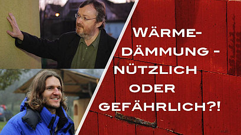

[🠔 Zur Übersicht: Gespräche & Dokus](gespraeche.md)
# Wärmedämmung - nützlich oder gefährlich?
**In diesem Beitrag gehen Konrad Fischer und Hans Georg Unterrainer darauf ein, warum Wärmedämmung und die empfohlenen Normen nur kurzfristig gedacht sind und im Endeffekt ihrem Haus, Ihrem Geldbeutel und der Natur einen Schaden hinzufügen werden.**   
_mit Konrad Fischer, Hans Georg Unterrainer • 17.09.2015_

Was wir hier an diesem Wohngebäude haben, ist eine einige Jahre alte Wärmedämmung. Ich weiß noch nicht mal, aus was die besteht, irgendein typischer Wärmedämmstoff: Mineralwolle oder Polystyrol. Und so sieht die typischerweise aus nach einigen Jahren: Sie wird ja jede Nacht extrem kalt, am Tag extrem heiß, entfeuchten kann sie nicht richtig. Und die Folge ist, dass hier Mikroorganismen einen idealen Nährboden bekommen durch die Synthetik, die hier in dem Putz drin ist. Dasselbe geschieht aber auch bei mineralischen Putzen, weil eben sehr schöne Feuchtehaltung dann hier ist durch die tägliche Unterkühlung, den hohen Tauwasseranfall, und dann grünt die ganze Bude, was nur geht.

## Gegenstrategie und Folgen

Die Gegenstrategie der neueren Wärmedämmverbundsysteme ist nun hier eine Maximierung von giftigen Pestiziden in diese Anstrichstoffe hier und auch in die Putzoberfläche, um zu verhindern, dass diese Ansiedelung von Pilzen und Algen schon während der Gewährleistung geschieht und dadurch der Maler eine Chance hat, aus der Gewährleistung zu entfliehen. Was zurückbleibt, ist ein Kunde in einem nassgedämmten Haus. Das hiermit natürlich keine Wärmedämmung zu verbinden ist, dass das nicht funktioniert technisch, dass das sehr erhöhte Instandhaltungsaufwendungen hat gegenüber jedem normalen Putz, der niemals unter die Taupunktgrenze gerät durch die Speicherfähigkeit der massiven Substanz, das ist klar.

## Charakteristische Merkmale und Baumängel

Charakteristisch sind dann eben auch manche dieser Fleckigkeiten, weil eben nicht überall dieselben Konditionen sind, bedingt z.B. durch einen Schatten, der hier eine gewisse Wirkung hat, bedingt durch irgendwelche Abläufe von Regeneffekten. Also das lebt, ist keine einheitliche Wüste. Die Wüste lebt und zwar, wie sie will. Die Baumeister sagen, sie bauen eigentlich Bauschäden. Wenn Sie heute Ziegelhaus und Isolierung draußen bauen und die Leute wollen innerhalb von 5 Monaten einziehen, das kann nie austrocknen. Es wird sofort ein Plastiksackerl außen drauf geklatscht, drauf gepickt. Das ist keine Wohnumgebung. Dichteste Fenster rein, nirgends mehr kommt Luft rein, dann brauchst du eine Zwangsbelüftung, nicht eine Zwangsumlüftung. Und das Wasser rinnt nur so innen an den Scheiben runter, weil die hin kann, und überall ist der Schimmel drinnen. Und neu gebaute Neubauten, das wird sogar noch gefördert von der, wird noch gefördert vom Staat. Es ist pervers.

## Empfehlungen und Konsequenzen

Also können wir allen den Rat geben, die ein Haus haben und im Nachhinein isolieren möchten, das nicht zu machen. Das ist die größte Katastrophe, die man seinem Haus antun kann. Das kann man sich so vorstellen, wie man Wollsocken anhat und dann geht man her, nimmt ein Plastiksackerl, bindet es um seinen Fuß herum, schnürt oben zu, ja, und geht dann socken und wohnt dann drinnen, also lebt dann damit. Und dann schaut man sich das Klima an, das da drinnen in dem Socken herrscht. Das ist katastrophal, ja. Also niemals ein altes Gebäude außen nachträglich dämmen mit Kunststoff und dichte Fenster reingeben. Es wird der Energiehaushalt nicht runtergehen. Du musst viel mehr lüften, du musst so oft die Fenster öffnen, dass die ganze Feuchtigkeit rauskommt. Der Schimmel wird überall auftauchen, also das ist das schlechteste, was du machen kannst mit deiner Bausubstanz. Dämmen, das ist riesiger Schwindel.

## Messungen und Konstruktionsfehler

Leider gibt es ganz tolle Messungen von der Fraunhofer-Gesellschaft: Diese extreme Hitze, die sie haben. Also auch stellen sich einfach vor, an einem Minustag, also ein Tag, der komplett Minusgrade hat, da kann Ihnen diese Dämmstoffwand, kann Ihnen 60° warm werden. Das muss man sich mal vorstellen. Aber mangels Speicherfähigkeit ist die vollkommen verpufft, diese Wärme, so gut wie sinnlos. Ja, macht nur eines: führt zu einer extremen thermischen Beanspruchung der Oberfläche. Und jetzt muss man wissen, dass dieser Dämmstoff z.B. Polystyrol hat einen Dämmfaktor von 8 und der Kunstharzputz da drauf von 1,5. Ja, das sind Welten. Und da reißt es auseinander zwangsläufig. Und das wird auch nicht richtig kommuniziert. Das heißt, die Konstruktionen sind zum Scheitern verurteilt, und ich brauche außen da, wo das Wetter angreift, brauche ich eine massive Konstruktion, damit die Bude überhaupt stehen bleibt. Und deswegen hat die Bauforschung auch rausbekommen, dass eine Dämmstoffwand braucht Jahr für Jahr etwa 9,40 Euro mehr pro Quadratmeter Instandhaltungsrücklage als jede x-beliebige Putzfassade. Und das ist den Leuten auch nicht bekannt. Das heißt, die erhoffen sich irgendwelche Ersparnisse, die faktisch gar nicht realisierbar sind und müssen aber jedes Jahr mehr in den Sack drücken für die notwendige Instandhaltung ihrer labberigen Konstruktion. Und solche Methoden, die lehne ich ab. Da bin ich dafür, dass man wesentlich besser aufklärt und eben Physik und dann auch die Chemie dazu genauer betrachtet.

## Holz als Alternative

Da beim Fenster sieht man es recht gut: Ich habe einfach ein Baumaterial ohne Folie, ein Baumaterial, das jede Schicht davon ist Holz, und die Feuchtigkeit kann durch diffundieren durch das Ganze. Es ist keine Folie drinnen, es ist keine Dämmung drauf, das Holz dämmt ganz super. Das Holz kann am Quadratmeter bis zu 4 Liter Wasser aufnehmen und wieder an die Umgebung abgeben, ohne dass dabei die Eigenschaften vom Holz sich verändern. Das kann kein anderer Baustoff, ja. Und immer nichts, nicht aus, aus, aus irgendwelchen Gründen sind einfach die ganzen Bauernhäuser, die jetzt auch so toll unter Denkmalschutz stehen und auch so toll so lange halten, 300, 400 Jahre ohne Schäden, da überlebt einfach nur aus Holz.

## Architektur und Tradition

Für mich ist Architektur, egal ob am Altbau oder am Neubau, nicht nur ein Gestaltungseffekt, wo man also den großen Wurf wagen muss und vielleicht Architektur neu erfinden. Ich glaube, das ist so schwer, allein gutes Bauen herauszukriegen und die Frage zu beantworten, wie klappt es, dass wir 1000 Jahre alte Dome herumstehen haben oder 500 Jahre alte Fachwerkhäuser, die zwar gewisse Alterungserscheinungen haben, die aber im Großen und Ganzen gut dastehen, gut instandzuhalten sind, gut zu bewohnen sind und in keiner Weise irgendwelchen Normen entsprechen. Das hat mich immer fasziniert.

## Wohnen mit Holz

Selbstverständlich wissen wir alle, wie schön das ist, in einem reinen Holzhaus zu wohnen, ja. Mit einer Holzoberfläche, holzverkleidete Wände, eine Holzdecke, so wie wir es hier haben, ein Holzfußboden. Das schmeichelt dem Auge, das schmeichelt auch dem, der Berührung der Haut, das riecht auch gut, ja. Also da gibt es wenig dagegen einzuwenden und insofern sag mal, bei Naturbaustoffen vielleicht sogar noch naturbelassen in gewisser Weise, da machen wir wenig Fehler.

## Industrieprodukte und Giftbelastung

Wenn wir aber jetzt anfangen, diese Naturbaustoffe umzuformen in Industrieprodukte, ich bringe mal als Beispiel hier nur Weichholzfaserplatten, oder wenn wir uns an die mit Kunstharz verklebten Holzschnipselplatten, was da alles an Grausamkeiten gibt, um auf billigste Art und Weise irgendeine Platte zu produzieren. Wenn wir denken an diese Giftbelastung in all diesen wunderschönen, so toll beworbenen Einfamilien-Fertighäusern. Das war der Trend. Mein Vater ist hier die Wand drauf gerannt, weil alle Leute in seinem Umfeld, die früher vielleicht 20 Jahre früher noch ein Haus mit dem Architekten gebaut haben, haben nun gesagt, ein Fertighaus, das ist das, die ultima ratio. Inzwischen ist das ganze Internet voll mit den giftverseuchten Fertighäusern. Die sind dann zwar auch aus Holzwerkstoff, aber wie grausam sind die vergiftet? Welche schrecklichen Emissionen aus den verwendeten Klebern und Schutzmitteln? Alles, was da drin ist. Und so geht es weiter mit der Bauindustrie. Die lassen sich immer wieder was einfallen, wie sie mit ein paar chemischen Tricks dann irgendwelche naturbelassenen Stoffe so weit ja synthetisieren, bis sie den Ansprüchen eines Industrieprodukts genügen. Das sehe ich sehr kritisch auch, ja.

## Traditionelle Dämmung vs. Industrielle Alternativen

Wenn ich mir jetzt anschaue, so mit einer nackten Holzbohle hat der, sagen wir mal, der Jagdschlossbesitzer seine Mansarde ausgekleidet, um im kalten November seine Jagdgesellschaft eine in der Hülle zu bieten oben im Dachgeschoss. So hat auch der Bauer seine Knechtsstube im Dach ausgekleidet, um seinen Knecht, dessen Arbeitskraft er nicht durch Schüttelfrost verlieren wollte, eine wohlige Wärme auch in diesem Dach zu verschaffen. Und so mache auch ich die Dachdämmungen mit wirklich Naturholz. Und warum? Diese Stoffe, die stehen praktisch im Brennpunkt zwischen Wärme und Kälte und haben den Taupunkt in sich. Das heißt, hier fällt Kondensat aus im Zweifelsfall und bedingt durch irgendwelche Ungereimtheiten in der Dachkonstruktion kann auch mal Regen oder Schnee dahinkommen. Und das Holz aus massivem Stoff, also naturbelassen, wissen wir, das hält es aus. Da wissen wir sogar, als Dachdeckung kann das gut 30 Jahre aushalten, wenn da kein feuchter Stau entsteht, ja. Wir kennen die Holzschindeldächer.

## Holzfaserstoffe und ihre Probleme

Und was macht jetzt die Industrie? Die nimmt, man nimmt nun Holzabfallstoffe, am Ende verschnipselt sie auch den ganzen Baum und bringt dann Holzfaserstoffe zustande, die als Weichholzfaser dann toll beworben werden, Naturprodukt und was weiß ich. Aber wenn sie mal versuchen, die natürliche Ausgleichsfeuchte herauszukriegen, die dieser Baustoff unter normalen Bedingungen natürlicherweise hat an Wassermenge, da wünsche ich Ihnen viel Glück. Das werden Sie kaum finden, ja. Das liegt jetzt etwa bei 30%. Und das Holz liegt mit seiner natürlichen Ausgleichsfeuchte im Dachstuhl bei 15 % und im Wohnraum vielleicht bei 7 bis 9 %, vielleicht auch 10 % je nach Umgebung, ist also viel weniger Feuchte schon drin. Und die Feuchte macht ja das Problem fürs Holz. Ab 20 % ist so gut wie sicher, dass die Insekten reingehen, ab 30 % beginnt der Hausschwamm zu wachsen. Und das startet jetzt schon. Jetzt muss man da Borate reingeben, Natriumtetraborat, ein Salz der Borsäure, um die Beschimmelung von solchen Stoffen, auch von Zelluloseschnitzeln, um dagegen vorzugehen. Gleichzeitig werden diese Dinge aber nass, weil sie eben nicht mehr das Wasser sozusagen gar nicht reinlassen in die Faser, sondern die sind ja sehr luftdurchlässig, und in der Luft ist Luftfeuchte. Und wenn nun an irgendeiner Stelle hier der Taupunkt dann ist, dann kondensiert die ganze Chose aus und kommt im Leben nie mehr da raus. Das kann eben beim Massivholz in der Form nicht geschehen, und deswegen ist auch immer wieder festzustellen, dass diese zwar Naturdämmstoffe, aber eben in der falschen Struktur versagen.

## Synthetische Dämmstoffe und Feuchtigkeit

Und genau dasselbe haben wir dann bei fast allen anderen synthetischen Dämmstoffen, wie hier der Polystyrol unter dem Handelsnamen Styropor auch bekannt. Der ist zwar wasserdicht. Damit können Sie Boote bauen, oder auch mit dem Polyurethan können Sie zehnmal nach Amerika schippen und zurück, und da ist kein Tropfen Wasser aufgenommen in diesen Poren. Aber wenn Sie den Taupunkt drin liegen haben, entsteht automatisch durch die Diffusionsoffenheit dieser Stoffe ein Auskondensieren von Kondensat, und das kommt dann nie mehr raus. Und so habe ich immer wieder die Schadensfälle, wo diese Dämmstoffe an der Wand, weil der Taupunkt da drin liegt, mit der Zeit mehr und mehr auffeuchten. Man nennt es dann absaufende Wärmedämmung. Und das ist eigentlich für den Kunden, der sich solche Dinge auf die Nase klebt und denkt, jetzt spart er Energie, das ist dem vollkommen unbekannt. Das wird eben nicht in der Werbung signalisiert. Da rennen die Sachverständigen rum und fotografieren gut gedämmte Wände in tiefem Blau und sagen, das ist gut. Ja, das damit mit dieser starken Abkühlung jede Nacht auch diese Feuchteaufnahme verbunden ist, das können Sie unter keinem Energieberatungsbericht lesen. Ich kriege ständig solche Beratungsberichte hier rein, wo dann geworben wird für die Wärmedämmung mit solchen Stoffen.

## Mineralfaser und Schimmelpilz

Genauso, wenn Sie Faserdämmstoffe haben. Ja, das ist die berühmte Mineralfaser, die ist jetzt nicht ein Porenwerkstoff, sondern ein Faserwerkstoff, ähnlich wiederum von der Struktur wie diese Holzweichfaserplatte. Diese Mineralfaser, die ist umsponnen mit Synthetik oder klebt sozusagen, damit sie nicht komplett vor sich hinbröselt. Diese Synthetik, die wartet nur auf die Feuchte, um dann einen reich gedeckten Tisch für die Schimmelpilzkulturen anzubieten. Und deswegen finde ich in Dächern in der Regel diese Stoffe schwarz durchpilzt bis vollgesogen mit Feuchte. Das sind also sehr ungeeignete Werkstoffe für die Einsatzorte, an denen man sie empfiehlt. Ja, so schön sie vielleicht auch Handwärme dann liefern können, als Wärmedämmung sind die nicht geeignet. So möchte ich das mal subsumieren.

## Schaumglas als Alternative?

Ja, und dann schauen wir uns mal den nahezu einzigen Werkstoff an, der das Taupunktproblem gut überstehen kann. Das ist hier Schaumglas. Das besteht aus aufgeschäumten Glaszellen. Und das ist der einzige Dämmwerkstoff, soweit ich das jetzt überblicke, der wirklich absolut diffusionsdicht ist. Das heißt, in diesem Werkstoff kann, auch wenn der Taupunkt drin liegt, kein Kondensat ausfällen. Ist einfach komplett luftdicht. Aber hat natürlich andere Probleme. Einmal ist er wesentlich teurer auch als diese anderen Stoffe, wobei das vielleicht nicht so die Rolle spielt, wenn man das, wenn man drüber nachdenkt, wie oft dann diese nassen Dämmstoffe z.B. auf einer Flachdachdämmung ausgetauscht werden müssen, bis der Bauherr draufkommt, dass nur sowas funktioniert. Auf der anderen Seite gibt's aber auch verarbeitungsbedingte Problemstellungen, die, möchte ich mal sagen, auch ihre Herausforderungen nach wie vor noch haben. Es ist eben von der Verarbeitung sind da wieder Randbedingungen, die können wir jetzt nicht weiter detaillieren. Es bringt nichts. Aber es ist nicht der ideale Werkstoff oder muss mit sehr viel Know-how angewendet werden. Also drängt sich nicht unbedingt dem normalen Hausbesitzer auf. Aber auch hier, wenn er mehr wüsste über die Probleme der Dämmstoffe allein im Hinblick auf die Feuchteproblematik, da würde er auch ganz anders entscheiden, denke ich mal. Und das ist auch für mich immer so eine Herausforderung. Ich kommuniziere sehr stark auf meiner Webseite und versuche eben solche Fragestellungen überhaupt mal in die Runde zu werfen, die sonst unter den Tisch fallen in der reinen Produktwerbung. Das nächste ist, ob die Dämmstoffe eben überhaupt dämmen. Da haben wir auch vorher schon drüber gesprochen. Also, ich sag mal, als Innendämmung sehe ich da den technischen Sinn, wenn nicht diese Feuchteproblematik wäre, und als Außendämmung sehe ich keinen Sinn da drin in unseren breiten Graden.
