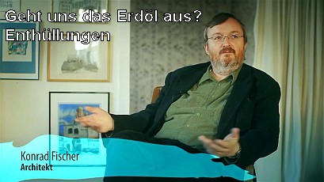

[🠔 Zur Übersicht: Gespräche & Dokus](gespraeche.md)
# Geht uns das Erdöl aus? Enthüllungen
**Der Achitekt Konrad Fischer erzählt uns die Hintergründe, was das Öl Geheimnis angeht.**  
_mit Konrad Fischer • 20.03.2015_

## Der weitverbreitete Glaube und seine Ursprünge

Man behauptet, die fossilen Energien wären fossil, und die würden auch bald ausgehen. Das glauben ja alle. Ich würde mal sagen, das glaubt jeder. Das habe auch ich in der Schule so gelernt und habe auch ganz lange geglaubt. Und dann habe ich ein Buch gelesen, und dann habe ich gelesen, überhaupt, wer sich das ausgedacht hat. Das weiß ja auch niemand. Wer hat sich das ausgedacht?

Dass fossile Energien fossil sind, das kommt von Michael Lomonosow. 1756, irgendwann. Der hat sich das ausgedacht. Der hat irgendwo einen Baumstrunk im Kohleflöz gefunden und hat gedacht: "Aha, die Kohle ist also aus irgendwelchen alten Bäumen dann entstanden." Ein gigantischer Irrtum.

## Frühe Widerlegungen und moderne wissenschaftliche Erkenntnisse

Schon Humboldt, der 1800 Südamerika bereist hat, hat es schon widerlegt. Der hat nämlich die Ölquellen da in Peru, oder frag mich, wo das war, besucht, und hat schon diese Theorie widerlegt. Und wir glauben das bis heute.

Und dann habe ich dieses Buch gelesen von Professor Thomas Gold, einer der höchstdekorierten Wissenschaftler überhaupt weltweit, inzwischen verstorben. Der hat damals noch gelebt, dieses Buch "Biosphäre der heißen Tiefe". Und der rekurriert auf die russischen Erkenntnisse der 50er Jahre, wo Russland unter Stalin ein riesiges Forschungsprojekt gestartet hat, weil die Amerikaner die Russen nach dem Krieg nicht nach Kuwait und in die saudi-arabische, die arabische Halbinsel gelassen haben, um den Industrieaufbau in Russland mit Energie zu versorgen. Und hat Stalin ein Fünf-Jahres-Forschungsprogramm gemacht, und die russischen Wissenschaftler wurden, also die besten Koryphäen zusammengeführt, haben dann rausgekriegt, dass diese Energien überhaupt nicht fossil sind.

Und seitdem holt man fleißig in Sibirien und sonst wo in ganz Russland Öl und Gas aus unerschöpflichen Rohstoffquellen unterhalb der Erdkruste, wo nie fossile Ereignisse waren. Und dieser Tatbestand ist in Schweden untersucht worden. Man hat 2000 unter die Erdkruste gebohrt und hat da unten Öl und Gas gefunden. Und es gibt überhaupt keine einzige Ölquelle oder Gasquelle, die jemals geschlossen wurde, und man weiß auch, die füllen sich wieder nach. So, das habe ich dann alles gelesen, war platt, das hat für mich ein Weltbild zusammenstürzen lassen.

## Persönliche Überprüfung und Bestätigung

Und dann habe ich gedacht, wie mache ich die Gegenprüfung? Weil ich bin ein Skeptiker. Ich bin in der dialektischen Methode ausgebildet. Ich habe Diamatkurse besucht und die historische Dialektik auch. Und ich dachte, jetzt musst du die Gegenseite anrufen oder dich an der Gegenseite informieren.

Was habe ich gemacht in meiner Not? Ich habe den Chef von Esso Deutschland angerufen, habe gesagt: "Hier ist ein kleiner, blöder Architekt vom Lande, und meine Kunden, die wollen keine Ölheizung mehr haben. Und wenn ich sie frage, warum das ist doch so günstig und so schön, dann sagen sie: Ja, nicht nur der Geruch, wir haben auch Angst, dass das Öl bald ausgeht." Und dann hat er schon angefangen zu lachen.

Habe ich gesagt: "Ja, ich habe jetzt das Buch von Thomas Gold gelesen. Der sagt, es ist gar nicht fossil, und das sind doch alles ständig nachwachsende Rohstoffe aus unerschöpflichen Quellen im Erdinneren. Und unter hohem Druck und hoher Hitze und Einfluss von bestimmten Mikroorganismen bilden sich jetzt verschiedene, ich sag zum Spaß, Kondensatstufen: Öl, Gas oder Kohle bilden sich da heraus. Und nur Torf ist tatsächlich ein organischer Stoff. Alle anderen, Braunkohle, Steinkohle, sind also alles aus unerschöpflichen Erdgasquellen."

Und dann frage ich diesen Chef von Esso: "Kennen Sie das Buch?" Und sagt er: "Das liegt bei mir auf dem Nachttisch." Da war ich erstmal platt, weil ich habe gedacht, das ist so eine Sonderliteratur, das kennt außer mir doch fast niemand. Und dann habe ich ihn gefragt, ob es stimmt, und dann hat er mich bestätigt: Es stimmt. Und dann habe ich ihn gefragt, warum er das uns nicht verrät. Und dann hat er gesagt: Es ist aber, die Kommunikationspolitik wird in Amerika gemacht.

## Wirtschaftliche und politische Implikationen

Und dann war für mich klar: Wenn die Menschen wüssten, dass das unerschöpfliche Quellen sind, wie kann man eine so scheußliche Preispolitik am Markt dann verankern? Das kann man wirklich nur, wenn man den Leuten von der Regierung und von den Ölmonopolisten weismacht, dass das hier ein ganz knappes Gut ist, das noch am besten einer staatlichen Reglementierung und auf jeden Fall einer riesigen Besteuerung unterliegt. Und mit jedem Cent Ölpreissteigerung, da wird unser Staatssystem mit diesen korrupten Beamten unterstützt, und die Bürger abgezockt. Aber da sind sich dann alle einig, die davon profitieren. Das ist das eine.

Und wenn das die Leute wüssten, sage ich, die würden sich so einen Krampf wie Windrad-Abzocke und Solar-Abzocke nicht gefallen lassen. Und ich versuche mein Bestes, aber wer liest schon so eine abseitige Webseite, sage ich mal? Ich habe unheimlich viele bestätigende Informationen inzwischen. Es gibt deutsche Forschungen, die kümmern sich um das Methanhydrat, das als Eis auf dem Meeresboden in reicher Hülle und Fülle vorhanden ist und abgebaut werden könnte. Es gibt also ganz viele Bestätigungen für diese Theorie, und jeder kann sie selber prüfen, sage ich mal.
