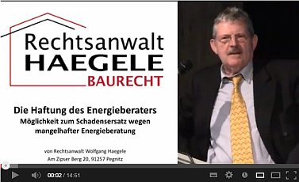

[🠔 Zur Übersicht: Empfang](empfang2.md)  
# Ungeschminkte Kritik und Lob aus meinem aktuellen Gästebuch
**Gästebucheinträge der Leser, Kritiker, Fans und Kunden**  
_mit Antworten von Konrad Fischer • aktualisiert 10.01.2019_

> [!info] Selber einen Gästebuchbeitrag abgeben? 
> Bitte schreiben Sie mir eine [E-Mail](mailto:petra.ursula@hotmail.de) mit dem Betreff **"Gästebuch"**.

## Gästebuch
**Die Beiträge in chronologischer Reihenfolge, jüngste zuerst:**

### Eintrag von Stefan Saffer
**Datum:** 10.1.2019  
**Ort:** Bloomington, New York State

> Lieber Konrad Fischer,
>
> Ich schreibe Ihnen, obwohl ich leider vor kurzem erfahren musste, dass Sie verstorben sind. Trotzdem.
>
> Ich habe per Zufall Ihre Beiträge auf YouTube entdeckt und dann Ihre Webpage. Ich fühle mich Ihnen fast seelenverwandt und bin selbst geborener Oberfranke aus Eggolsheim und Schirndaidel, der als bildender Künstler (also nicht vom Fach) in Berlin ein altes Gebäude von 1860 umgebaut hat. (Das war 2011 und ich hätte Sie wirklich gebraucht).
>
> Instinktiv habe ich bei diesem Umbau eine Komplettdämmung verhindert und habe immer wieder nach Argumenten gerungen. Leider mussten neue Fenster sein und danach kam Schimmel (aber das habe ich mit einer eigenen Entlüftungskonstruktion geregelt). Ich ärgere mich heute noch über die teuren Fenster. Egal. Hätte ich Sie zu dieser Zeit schon gekannt, wäre es einfacher gewesen, sich gegen die träge Masse der beteiligten "Bauherren" besser durchsetzen zu können.
>
> Ich lebe mittlerweile in den USA und habe dort gerade ein Holzhaus von 1870 renoviert. Auch hier hätte ich Sie gebraucht! Seit Tagen lese ich auf Ihrer Webpage und sehe Ihre Videos. Sie sprechen mir aus der Seele! Ich kann Ihnen nicht genug danken für Ihre Arbeit und liebe Ihre direkte fränkisch undiplomatische, aber eben ehrliche Art!
>
> Es stimmte mich extrem traurig von Ihrem Ableben zu lesen. Ich bin jünger als Sie (werde 50 dieses Jahr), aber ich denke, wir hätten uns treffen müssen. Auf ein Bier in Franken (das wird halt nachgeholt, wenn's mich nicht mehr gibt). Ich hoffe, dass Ihre Informationen, Ihre Webpage und Ihre Aufklärungsarbeit offen zugänglich bleiben. Ihrer Familie wünsche ich eine Trauer, die sich langsam aber stetig in neue Kraft umwandelt.
>
> Ich vermisse Sie, ohne Sie je getroffen zu haben. Ich danke Ihnen aufrichtig; denn manchmal dachte ich, ich bin komplett alleine mit meinen Zweifeln an dem, was mir von allen Seiten eingeredet wurde auf dem Bau. Nun weiß ich und kann beweisen, dass die Dinge anders liegen (dank Ihnen).
>
> Liebe Grüße und mein tiefstes Beileid an Ihre Familie
>
> *Stefan Saffer*

---

### Eintrag von Christian Brockmann
**Datum:** 17.5.2018

> Sehr geehrter Herr Fischer,
>
> Ich habe zwar keinen Altbau, aber dank Ihnen habe ich konventionell mit Grundofen gebaut. Wenn ich da an meinen Nachbarn denke: Pilze und Bakterien. Der Vergleich mit der Plastiktüte und dem Taupunkt der dollen Styropordämmung haben mir die Augen geöffnet. Wenn man es mal kapiert hat, ist es total simpel. Fast wäre ich um ein Haar auch auf diese Mafia hereingefallen. Ich bin rein zufällig auf Ihre Seite gestoßen. Ich versuche jeden, der bauen will, auch davon zu überzeugen.
>
> Vielen Dank für Ihre Seite.
>
> *Christian Brockmann*

**Antwort von Konrad Fischer (#KF):**
Sehr geehrter Herr Brockmann, ich danke für Ihre Zuschrift und freue mich, dass meine Seite Ihnen etwas weiterhelfen konnte.

Besten Gruß!  
Konrad Fischer

---

### Eintrag von Jörg Müller
**Datum:** 30.8.2017  
**Betreff:** Mein Eintrag in Konrad Fischers Gästebuch

> Hallo Herr Fischer,
>
> vielen Dank für diese ehrliche Seite!!
>
> Mit handwerklichen Grüßen  
> *Jörg Müller • Zimmerermeister im "Alten Land"* > Fa. MEISTER MÜLLER • AUS LIEBE ZUM HANDWERK

**Antwort von Konrad Fischer (#KF):**
Sehr geehrter Herr Müller, danke gleichfalls ins ehrbare Handwerk!

Besten Gruß!  
Konrad Fischer

---

Betreff: bloss ein kurzes Dankeschön 
Datum: 26.12.2017 
Von: N.N. 

Hallo Herr Fischer, 
> ich bin zufällig im Zuge meiner Bausanierung (Bj.1935) auf Ihre Seite gestossen, habe viel gelesen und mir empfohlene Literatur bestellt. Danach habe ich alle Pläne für mein neues/altes Superenergiesparhaus über Bord geworfen und nach gesundem Menschenverstand mit den herkömmlichen Methoden und Materialien (Holz und Stein) gebaut. 
Ein gemauerter Grundofen dient als Heizkraftwerk für 200qm Wohnfläche. 
Der Energieberater meinte es sei eigentlich eine "Katastrophe" nach heutigen Maßstäben, und trotzdem habe ich ein warmes/trocknes/gesundes Zuhause! 
Ich finde Ihre Arbeit und Aufklärung sehr wichtig und wünsche Ihnen weiterhin viel Erfolg! 
Sollte in absehbarer Zeit einmal die Energiesparbehörde vor der Haustür stehen werde ich Ihre Dienste gern in Anspruch nehmen! 
(falls der Klimawandel uns nicht alle schon vorher dahinrafft:) 
N.N. 
Gruss aus Sachsen 

---

Betreff: Mein Eintrag in Konrad Fischers Gästebuch 
Datum: 26.6.2017 
Von: Manfred Ebel 

Hallo Herr Fischer, 
> aus dem traurigen Anlass in London sage ich Ihnen mal herzlichen Dank und meinen großen Respekt für Ihre unbeugsame, unermüdliche Aufklärungsarbeit, konkret in Sachen Wärmedämmung. Sie bieten ein Paradebeispiel, was angewandtes Wissen - von Allgemeinwissen bis echte Wissenschaften - vermag. Ja, Sie haben das immer gesagt und die Geschichte gibt Ihnen Recht. Halten Sie durch. Ich wünsche Ihnen Kraft. 
M.E., Brandenburg 
PS.: Ich habe Ihre Empfehlungen weitgehend umgesetzt. Z.B. auch die mit Kalk zu bauen und keine weitere Dämmung. Wir sind sehr froh mit unserem sanierten Haus. 

_#KF: Sehr geehrter Herr Ebel, 
Freut mich sehr, Ihr Zuspruch und das Gelingen Ihres Baus. 

Besten Gruß! 
Konrad Fischer_

---

Betreff: Mein Eintrag in Konrad Fischers Gästebuch 
Datum: 16.5.2017 
Von: Christiane Stölk 

Sehr geehrter Herr Fischer, 
> Wie immer wenn man nicht alles so hinnimmt, eckt man an. Aber solche Querdenker die es ja nur gut meinen, braucht man. Das heißt ja eigentlich nur eins "man denkt ein bischen mehr nach".Und ich freue mich als ihre Gäste Seite gelesen habe, das es noch mehr Leute gibt wie ich, die denken,Sie wären der "einzige Depp" 
Bitte machen Sie weiter so. Es macht Freude ihre Seiten zu lesen und ich kann gut nach voll ziehen, das man den Frust sich auch mal von der Seele schreiben muss. Wir hatten schon Kontakt wegen meinem 200 Jahre altem Haus an der Ostsee und ich habe solche Angst, irgendwelche Pfuscher heran zu lassen. Also selbst ist die Frau und lässt sich nichts vorgaukeln. Und das geht einfacher mit ihren Seiten als Grundwissen. Und spart Geld. Man hat zwar nicht alles gleich fertig. ... aber mir macht renovieren Spaß. Und die Pyramiden wurden auch nicht an einem Tag fertig. Aber was macht man wenn der eigene Vater vor 39 Jahren verstarb, Zimmermann war und mir an allen Ecken und Kanten fehlt. So zb aktuell mit unserem Dach mit Asbest Eternitplatten, 600 qm Dachfläche, die er vor 40 Jahren eingedeckt hat. Weil ja das an sich eine gute Sache ist wenn ein Asbest drin wäre. Aber es kann sein das wir Sturmschaden haben, es regnet an mehreren Stellen hinein. Wir haben das der Versicherung gemeldet, aber die haben einen Gutachter geschickt. Der der Meinung ist das kein Sturmschaden ist. Die Dachdecker sind anderer Meinung, aber die wollen ja auch was verdienen. Ich bekomme keine konkrete Antwort zu den Eternitplatten, wie ein Sturmschaden denn bei denen aussieht. Denn die sind ja verschraubt. Und da hat man das Dilemma schon wieder. ... Keiner weiß wirklich was. Also haben wir derzeit Wasser von oben und Wasser von unten welches das Haus unterspült. Gottseidank ist unter den Tapeten Lehm. 
Aber ich könnte schreiben und schreiben ......... 
Mit freundlichen Grüßen 
Christiane Stölk 

_#KF: Sehr geehrter Frau Stölk, 
Verstehe gut, in welch mißliche Lage man zwischen den widersprüchlichen Baumeinungen geraten kann. So geht es ja vielen Hausbesitzern. Und bei komplexeren und nicht eindeutigen Bauschäden und deren mögliche Deckung durch die Gebäudeversicherung tut sich ebenfalls ein weites Feld auf. Wenn kein stichhaltiger Nachweis gelingt, ist man auf Kulanz angewiesen, eine mißliche Situation. Vielleicht sollten Sie auch mal Ihren Dachdecker mit der Versicherung bzw. deren Gutachter zusammenbringen, um die entgegenstehenden Positionen anzunähern. 

Besten Gruß und alles Gute! 
Konrad Fischer_

---

Betreff: Mein Eintrag in Konrad Fischers Gästebuch 
Datum: 4.3.2017 
Von: Oliver Nähren 

Hallo Herr Fischer, 
Ihnen und Ihrer Familie die besten Grüße vom Niederrhein! 
Vorab möchte ich Ihnen für Ihre scheinbar unermüdliche Aufklärungsarbeit Respekt zollen! 
Denn als ich erstmals im November 2013 nach unabhängigen Erfolgsgeschichten von Immobilieninhaber, die sich ein WDVS besorgt haben recherchierte, habe ich Ihren YouTube-Film vom 1.Bürgerschutztag im Mai 2013 entdeckt. 
Was darauf in meinem Leben an Erkenntnisgewinn geschah und noch passiert, läßt einen gefühlt mehr und mehr allein im Raume stehen!? Langsam bekomme ich ein Gefühl dafür, warum es die Weisen aus den Überlieferungen in die Einsamkeit trieb. 
Aber genug davon! Dank Ihren Ausführungen, habe ich nach dreizehn Jahren Zugang zum www entdeckt, was Medienkompetenz bedeutet und gelernt, mich auf die Suche nach der wahreren Sicht auf die Dinge zu machen! Perfektion obliegt der Schöpfung, denke ich? 
Ich freue mich weiterhin auf jedes Ihrer Interviews/Video! Und damit wünsche ich Ihnen und Ihrer Familie alles Gute und ToiToiToi! 
Mit freundlichen Grüßen 
O. Nähren

_#KF: Sehr geehrter Herr Nähren, 
So eine launige Lobhudelei bekomme ich doch viel zu selten bis fast nie! Da fühle ich mich direkt mal verstanden, wo gibt es das heute noch? Und ich verspreche Ihnen, daß meine Aufklärerei unermüdlich bleiben wird. Es liegt in meinem skeptischen Naturell begründet, an dem ich die Öffentlichkeit - so gut es mir eben gelingt - gerne teilhaben lasse. Mein Lohn sind auch solch' freundliche Zeilen wie Ihre! 

Herzlichste Dank! 
Konrad Fischer_ 

---

Betreff: Mein Eintrag in Konrad Fischers Gästebuch 
Datum: 9.2.2017 
Von: Philipp Strobel 

Sehr geehrter Herr Fischer, 
> Ich habe eine Frage an Sie: Wieso schreiben Sie so umständlich? Sie haben so viele gute Informationen weiterzugeben, aber durch den von Ihnen genutzten Syntax fällt es einem schwer Ihren Ausführungen zu folgen. Es wäre toll, wenn Sie kürzere Sätze formulieren würden. Dann könnte man Sie viel besser verstehen.

_#KF: Sehr geehrter Herr Strobel, 
Eine gute und sehr berechtigte Frage, die ich gerne beantworte. Meine Webtexte sind aus verschiedensten Anlässen geschrieben, aber meistens nebenbei. Ich muß für meine diesbezüglich nebenberuflichen Ausschweifungen keine Ausrede suchen, will aber mal den Prosakönig Friedrich Nietzsche zitieren: 

"Unsere Prosa. – Keines der jetzigen Kulturvölker hat eine so schlechte Prosa wie das deutsche; und wenn geistreiche und verwöhnte Franzosen sagen: es gibt keine deutsche Prosa – so dürfte man eigentlich nicht böse werden, da es artiger gemeint ist, als wir's verdienen. Sucht man nach den Gründen, so kommt man zuletzt zu dem seltsamen Ergebnis, daß der Deutsche nur die improvisierte Prosa kennt und von einer anderen gar keinen Begriff hat. Es klingt ihm schier unbegreiflich, wenn ein Italiener sagt, daß Prosa gerade um so viel schwerer sei als Poesie, um wie viel die Darstellung der nackten Schönheit für den Bildhauer schwerer sei als die der bekleideten Schönheit. Um Vers, Bild, Rhythmus und Reim hat man sich redlich zu bemühen – das begreift auch der Deutsche und ist nicht geneigt, der Stegreif-Dichtung einen besonders hohen Wert zuzumessen. Aber an einer Seite Prosa wie an einer Bildsäule arbeiten? – es ist ihm, also ob man ihm etwas aus dem Fabelland vorerzählte." 

Soweit der alte Meister. Und Recht hat er! 

Deswegen müssen sich es meine Leser weiter gefallen lassen, daß ich so vor mich dahin was zum besten gebe, wie es mich gerade überkommt, mal schlangengesatzelt, mal geknappst. Ihre Stilkritik mag also für sich genommen berechtigt sein, doch wenn Sie recht bedenken, was es bedeutet, die Bildsäule zum strahlenden Glanze zu polieren, und sei es nur als Zeitfrage, fällt mir spontan nur ein: Einem geschenkten Gaul schaut man nicht auf's Maul. Oder anders: Wer mich verstehen will, tut's trotz meiner rauen Texte, auch wenn's kneift. Weiter viel Grübelspaß! 

Besten Gruß und Dank für Ihre auch lobenden Worte 
Konrad Fischer_ 

---

Betreff: Gästebucheintrag 
Datum: 21.3.2016 
Von: Herbert Stiegler 

Guten Tag Herr Fischer, 
> ich habe selbst ein Haus zum Renovieren gekauft das bereits 100 Jahre alt ist. Seit ich auf Ihre Videos gestoßen bin bin ich ständig am Schauen wie in meiner Umgebung die Fassaden ausschauen. Da bemerkt man doch das Eine oder Andere dass mit Ihren Ausführungen übereinstimmt. 

So wie ich es verstanden habe sind Sie vehement gegen Isolierung von außen. 

Dazu habe ich nun drei Fragen. 

1. Können Sie mir erklären warum Null Energiehäuser funktionieren? Ich denke dass diese Häuser ohne Isolierung so nicht funktionieren würden. Unabhängig ob das Klima im Haus gut oder schlecht ist. 

2. Sie sagen dass keine Infrarot Strahlungsenergie durch Fensterscheiben nach außen entweichen kann. Trotzdem erwähnen Sie dass eine dreifach Verglasung sinnlos ist da dadurch weniger Wärmestrahlung ins Haus kann. 

3. Wie kann eine Solaranlage funktionieren wenn keine Wärmestrahlung durch Glas dringen kann? 

Mit freundlichen Grüßen 
Herbert Stiegler

_#KF: Sehr geehrter Herr Stiegler, 
Anfragen sind kein Beitrag im Gästebuch, sondern gehören in den Bereich Bauberatung www.konrad-fischer-info.de/2berat.htm. Dennoch in aller Kürze: 

1. Ich kenne kein Null Energiehaus, das abgekoppelt vom Stromnetz im Winter funktioniert und Sie auch nicht. Was soll also diese Frage? 

2. Niemals habe ich gesagt oder geschrieben, daß durch Dreifachglas weniger Wärmestrahlung ins Haus kann. Was weniger reinkommt, ist die Lichtstrahlung mit gegenüber Wärmestrahlung geringerer Wellenlänge. Licht kann Glas durchdringen! 

3. Und mit 2. ist auch 3. beantwortet. 

Besten Gruß 
Konrad Fischer 
PS. Etwas mehr Nachhilfe in Strahlungsphysik könnte bestimmt nicht schaden, auch dafür ist Wikipedia da ;-)#_ 

Betreff: Gästebuch 
Datum: 21.12.2015 
Von: anelis 

Guten Morgen, seit ca. einem Jahr lese ich immer wieder Beiträge Ihrer Homepage und möchte Ihnen danken für die ehrliche Haut, die scheinbar nur Sie haben. Mein Fachwerkhaus steht in eine Altstadtmauer hinein gebaut in Hanglage und hat alles, was niemand haben will. Hausschwamm in Lehm, Holz und Ziegelmauerwerk, abgesacktes Fundament, Feuchtigkeit von oben unten links und rechts. Und trotzdem saniere ich es alleine und habe Spaß beim Ausprobieren vieler Dinge. Bis wir darin wohnen können, wird wohl noch dauern... bis dahin lese ich weiter und weiter... schöne Weihnachten und einen guten Rutsch aus Tribsees, anelis 

_#KF: Liebe anelis 
Es freut mich, wenn meine Webseite Ihnen Mut zum Abenteuer Altbau spendet. Und ja, Probieren geht über Studieren! Noch Viel Spaß! 
Konrad Fischer#_ 

---

Betreff: Gästebucheintrag 
Datum: 18.10.2015 
Von: R. Franq 

Hallo Herr Fischer, 
ich habe über Wochen die Untersparrendachdämmung zwecks Dachausbau recherchiert. Nach Ihren Hinweisen auf der Homepage habe ich weitere Quellen gesucht und mich entschieden keinesfalls Glaswolle oder ähnliches aufgrund der Schwitzwasserproblematik zu verwenden. Das Haus ist 70 Jahre alt und in diesen Zeiträumen plane ich auch. 
Auf die Dachbalken habe ich nun innenseitig Schilfrohr aufbringen und verputzen lassen. Genau so wie es im ersten Stock darunter mit den Dachwänden vor 70 Jahren angegangen wurde. Alles im Sommer ausgeführt damit es schön trocknet ohne zu schimmeln. Ich bin sehr zufrieden ! Natürlich ist die Dämmung begrenzt, da der Raum im Dach jedoch nur ein paar Tage im Jahr im Winter und ansonsten im Sommer genutzt wird ist alles prima. 
Mit Ihren Beiträgen haben Sie mich zum Nachdenken angeregt. Insbesondere die Wirtschaftlichkeit in meinem Fall der Geringnutzung war ein Augenöffner. Besten Dank! Ich verbrenne lieber etwas mehr Energie und schlafe ruhig, da es zu keiner Schimmelbildung kommt. 

Beste Grüße 
R. Franq

_#KF: Lieber Herr Franq 
Wie schön, daß meine Info Ihnen beim anständigen Bauen geholfen hat!#_ 

---

Betreff: Gästebucheintrag 
Datum: 8.10.2015 
Von: Andreas Taerre 

Sehr geehrter Herr Fischer, 
auf diesem Weg einfach nur der Dank für ihre unermüdliche Aufklärung! Machen Sie weiter und bleiben Sie standhaft. Dank ihrer Informationen verbunden mit einem wunderbaren Unterhaltungswert ihrer Videos, haben wir unser EFH, BJ 1967, DDR-Standardtyp maßvoll saniert. Alles was erhaltenswert war wurde erhalten, z.B. Heizungsrohre über Putz, schöne große Gußradiatoren. Die einzigste "Hochtechnologie" sind eine Brennwerttherme und neue Kunststoffenster. Letztere nur 2x verglast und in der Nacht "Läden zu"! Keinerlei Kunstoff auf der Fassade, nur Mauerwerk und Putz. Kein Schimmel, Energieverbrauch um fast 30% gedrückt - jahrelang gemessen. Ich kann auch bestätigen, wie erschreckend es ist, sich mit EFH-Eigentümern zu unterhalten, irgendwann kommt man ja immer zum Thema Engergiesparen. Die meisten wissen über ihre Buden einfach nichts, weder was sie verbrauchen, noch wie sie funktionieren. Traurig! 

Ihnen und ihrer Familie alles Gute und freundliche Grüße! 
Andreas Taerre 

_#KF: Lieber Herr Taerre 
Gratulation zum Kostensparergebnis. Beim nächsten mal vielleicht noch die alte Heizung und die schönen DDR-Fenster aufarbeiten. Auch das lohnt sich allermeistens. Doch ich weiß natürlich, wie die Energieverräter, die Heizis und die Fensterbauer einen vom Gegenteil überzeugen wollen und oft können. Und nicht allzu selten zum Nachteil der Bauherrnkasse.#_ 

---

Betreff: Gästebucheintrag 
Datum: 17.09.2015 
Von: Lorenz Michael 

Sehr geehrter Herr Fischer, 
Die Selbstbereicherung und Selbstverherrlichung der Industrie, Politik u. Wissenschaft, leider auch in der Baubranche, beruht tatsächlich nur auf die Dummheit leichtgläubiger, ahnungsloser Laien. Die ökonomischen und ökologischen Schäden hieraus sind exponentiell und irreversibel. Ihre wertvollen Vorträge geben selbst Laien das notwendige Wissen. 
zu AKW (Strahlenbelastung ), Geo-Engineering ( HAARP u. Chemtrails ), Erdöl u. Energie biete ich folgende Hinweise zur Information 
a) Holger Strohm: Friedlich in die Katastrophe https://www.youtube.com/watch?v=HIEzTKO03do 
Frieder Wagner: Deadly Dust https://www.youtube.com/watch?v=GTRaf23TCUI 
b) Sauberer Himmel: Rechtsanwalt u. Bürgeranwalt Dominik Storr http://www.sauberer-himmel.de/, http://www.geoengineeringwatch.org/ 
c) Dr. Hans-Joachim Zillmer (Erdöl-u. Energielüge): https://www.youtube.com/results?search_query=zillmer+joachim 

Nicht nur in der Baubranche wird aus Geld -u. Machtgier bewusst getäuscht und die Bevölkerung vor allem durch die Medien manipuliert. 
Unser privater Verein und ich wollen unsere Mitmenschen nur informieren. 
Vielen Dank für Ihre sachliche Aufklärung mittels Videovorträgen. 
Viele Grüße aus Ulm 
Lorenz Michael 
natur-schutz@t-online.de 

_#KF: Sehr geehrter Herr Michael 
Freut mich, wenn meine Aufklärungsbemühungen bei Ihnen gut landen. Und selbstverständlich ist Information in unserer Informationsgesellschaft das Mittel der Wahl!#_ 

---

Betreff: Gästebucheintrag 
Datum: 30.07.2015 
Von: "T.K." 

ich habe es mir schon lange vorgenommen, ein Gruß durchs Gästebuch. 
Vielen herzlichen Dank für die vielen !Stunden! Lesestoff. Ich lese mindestens 1 Jahr mit, und doch finde ich noch immer eine neue Ecke. Oder ich hab schon vergessen das ichs bereits gelesen habe, auch möglich. Wie solls auch anders sein, hätte ich diese Seite nur etwas eher gefunden! Wäre nach dem Umbau noch ein fetter Urlaub (statt einem Wochenende zu zweit) drin gewesen. Hinterher ist man aber immer schlauer, gell? 
Ein wahrer Augenöffner die Seite! 
Bitte weiter so. 
Viele herzliche Grüße aus Bamberg 
T.K. 
PS 
Ich hoffe wir finden bald ein neues (altes) Heim für die Familie, und können dann Ihre Dienste in Anspruch nehmen :-) 

_#KF: Lieber Herr K. 
Dankeschön für die ermunternden Zeilen.#_ 

---

Betreff: Gästebucheintrag 
Datum: 11.4.2015 
Von: Konrad Inzinger 

Tja... Konrad... kuhnrath... aus dem althochdeutschen... der "kühne Rat" i. S. v. Ratgeber... 

Fangen wir mit dem Positiven an: Eine gesunde Skepsis ist schon angebracht, ein launiger Tonfall auch... 
Mir scheint aber, dass Ihr launiger Tonfall, bei dem sich oft genug auch Ärger durchschlägt, der Qualität Ihrer Aussagen etwas schadet. Oder anders ausgedrückt: Zu oft geht die qualitative Information in der Verärgerung unter... eigentlich schade! 

Ihre Seite umreißt eine ganze Menge von interessanten Themen, aber man kommt vom Hundersten ins Tausendste und verliert fast den Faden des Themas, mit dem man angefangen hat. Eine übersichtlichere Struktur der "web-site" wäre daher wünschenswert. 

Wäre dann die Kritik an vielen "Allgemeinplätzen" noch besser ausgefeilt, dann wäre sie sogar zitierfähig... 

Gibt´s das Ganze auch in lesbarer Schriftgröße? 

...wie bitte? Das ist Ihre "web-site" und wenn´s mir nicht paßt, muß ich sie nicht ansehen und lesen?... ähh-jaaa - jetzt haben Sie mich erwischt... und in Gottes Namen werde ich halt auch so gelegentlich mal weiter lesen... 

mit kollegialem Gruß 
Konrad Inzinger 

_#KF: Lieber Herr Kollege Inzinger 
Dankeschön für Ihr Verständnis, bei aller berechtigter Kritik an meinem Spaßprojekt "Altbau-Homepage". Sie haben ja recht, es gäbe so viel zu verbessern, was sich da von Anfang an eingeschlichen hat. Das jetzt in Angriff zu nehmen, erscheint mir eine übermenschliche oder sauteure Aufgabe - wo ich doch eh alles in meiner knappest bemessenen Freizeit mit schmalstem Budget über die Jahre in 100%igem Do-It-Yourself zusammengeschustert habe. Ok, der Spaß und meine Emotionen sind klar rauslesbar und zitiert werden ist nicht mein Ziel gewesen - eher, von Jedermann verstanden zu werden, und dem dürfte ich schon näherkommen als der perfekten Webseite. Insofern feile ich vorzugsweise an den Inhalten weiter, und freilich redaktioniere ich hier und da ein bisserl. Manchmal sogar bei der Schriftgröße (die doch nur Papier sparen sollte, wenn - was erstaunlich oft vorkommt - Leser meinen Kram umfangreich ausdrucken. Ja, hier übertölpelte mein grünes Gewissen die Usability etwas. Doch ich hoffe, daß es doch noch manchmal nutzt, was ich mir frech erlaube ...#_ 

---

Betreff: Meinung Meinung Meinung 
Datum: 10.02.2015 
Von: "Sven Müller" 

Sehr geehrter Herr Fischer, 
mir ist jetzt mal danach, Ihnen zu schreiben. 
Seit gefühlten 15 Jahren beschäftige ich mich, angesichts dessen das ich nur Malermeister bin, aber dennoch mit Ihren Publikationen. Es tut manchmal gut, Ihren Ausführungen zu folgen. An manchen Tagen denke ich nämlich, daß ich der einzige Depp auf der Welt bin. Was einem im Verlaufe des Tages alles entgegen fliegt, bei der Beurteilung von Zuständen am Bau, ist haarsträubend. Bei Großhändlern laufe ich Spießruten, weil keiner mehr mit mir reden will. Auch ich neige langsam zum Sarkasmus, wenn ich etwas erklären soll. Deswegen muß ich sagen, machen Sie weiter wie bisher. Geben Sie nicht auf, die deutsche Welt auf die Füsse zu stellen. Mich mußten Sie nicht überzeugen. Solange das neueste Smartphone in Gold wichtiger ist, als klarer Menschenverstand, solange wird es schwierig sein, die Wahrheit an den Mann(Frau) zu bringen. 
Lustig finde ich immer die Fangfrage, warum an Dumm- äh-Dämmfassaden die Dübelchen so schön leuchten. Ab da wird der Tag lustig. Am Ende weiß ich, ob der Fachmann mir gegenüber überhaupt einer ist. Dadurch erübrigen sich meistens Streitgespräche, weil das Köpfchen meines Gegenüber dampft um zu verstehen. 
Bei einem Biergespräch sagte mir ein höher gestellter Mitarbeiter eines Großhändlers, daß sich in den letzten Jahren die Bauphysik ganz schön geändert hat. Jo hab ich gesagt, dann mach mal gleich beim Wetter weiter. Dann könnten wir unser Bier draußen trinken. 
Unglaublich, was in den Köpfen steckt. 
Sie merken, ich bin voll bei Ihnen, ums mal neudeutsch auszudrücken. Ich verstehe auch nicht, wie manche(viele)(sehr viele?) Ingenieure und Architekten Ihnen so in die Kandarre fahren. Von Meinesgleichen möchte ich gar nicht reden. Ich glaube auch nicht, daß das nur am möglichen Gewinn liegt. Nein, die wissen es einfach nicht besser. Selbst mehrfach erlebt. Und nun sagen Sie mal als Handwerker was zum Planer oder Architekten. Keine Chance. Aber bitte. Dann dreh ich mich rum und gehe. 
Mein Schwager wohnt schön im 70er EFH mit Gipsbinden um die Rohre im Keller und Originalkessel. Nicht schlimm, dafür hat her chic Silberpapierstyropor hinter jedem Heizkörper(als Rippe). Sieht gut aus. Dafür hat er begriffen, das der Schimmel hinter der Küchenzeile an der Hausecke weg ist. Vor- und Rückläufchen dahinter bringt eben doch etwas. 
Alles unwichtig. Wollte Ihnen nur mal, anstatt blödsinniger Kritik, einfach ein Lob zu kommen lassen. 

Alles Gute und weiterhin viel Erfolg 
und einen baldigen Frühling 
MM Sven Müller aus Wettin-Löbejün 

_#KF: Lieber Herr Malermeister Müller 
Solche ermutigenden Zuschriften wie Ihre - die ich durchaus manchmal genießen darf - erfreuen um so mehr, wenn Sie aus dem ehrbaren Handwerk kommen. Und spornen mich an, auf dem eingeschlagenen Weg weiterzumachen - und allerlei Widerwärtigkeiten, die man mir von berufener Seite ja auch gönnt, weiter die Stirn zu bieten. 
Herzlichen Dank dafür!#_ 

---

Betreff: Gästebucheintrag 
Datum: 1.2.2015 
Von: "Friddi K." 

Sehr geehrter Herr Fischer, 
mit Interesse habe ich angesichts der Modernisierung unseres Hauses aus den späten 70 er Jahren Ihre Beiträge zur Wärmedämmung verfolgt. Wir wollten zunächst einen KfW 100 Standard erzielen, was eine Dämmung der Außenwände erfordert hätte. Wegen der hohen Kosten für ein WDVS haben wir uns dann für Einzelmaßnahmen (Dach-Aufsparrendämmung, Fenster, Kellerdeckendämmung sowie kleinere Maßnahmen wie Zumauern der Heizkörpernischen) entschieden. Aus eigener Erfahrungen kann ich Ihren Ansichten nur teilweise zustimmen: 

1. Ein Energieberater hatte zunächst aufgrund unserer präzisen Angaben den bisherigen Energiebedarf des Hauses berechnet einschließlich der Lüftungsverluste, dem Solareintrag und der selbst erzeugten Wärme. Das Ergebnis stimmt bis auf wenige Prozent mit dem durchschnittlichen tatsächlichen Verbrauch überein. Wenn man solide Ausgangsdaten hat, bin ich im Gegensatz zu Ihnen der Meinung, dass die Berechnungen ziemlich gut passen. 
2. Nach Fertigstellung der Sanierungsmaßnahmen haben wir eine Energieeinsparung von etwa 35 %, was mich etwas enttäuscht hat. Insofern liegen Sie sicher richtig, dass die Wirkung der Dämmmaßnahmen überschätzt werden. Die Kellerdeckendämmung hat leider zumindest bei uns keine messbare Wirkung gehabt. 
3. Mit einem WDVS hätten wir ungefähr 8000 kWh von ursprünglich 44000 kWh (vor dem Umbau) eingespart. Das ist in der Tat recht wenig, zumal häufig Zusatzkosten wie Anpassen der Lichtschächte, der Kellertreppe, etc. vergessen werden. 
4. Interessanterweise hat bei uns der hydraulische Abgleich keinen positiven Effekt gehabt (wir haben übrigens auch einen in unserer vorherigen Wohnung durchführen lassen mit ähnlichem Resultat). Die Theorie ist mir zwar klar, doch scheint mir bei einigermaßen korrekt bemessenen Heizkörpern und nicht allzu altem Heizungssystem die Maßnahme überschätzt zu werden. (In dem Haus ist seit 10 Jahren eine Gas-Brennwerttherme installiert) 
5. Die Nachtabschaltung spart 22 kWh (2 m³) Gas an einem Wintertag (Außentemperatur etwa 0° C). Bei wirklich hochgedämmten Häusern mag die Nachtabschaltung unsinnig sein, aber in vielen Fällen spart sie schon Energie. Jedoch ist bei Feuchtigkeitsgefahr zu erwägen, normal durchzuheizen, wodurch man letztlich auch spart. Ihr Vergleich mit der Autofahrt von Hamburg nach München hinkt. Man müsste eher folgenden Vergleich anstellen: Du hast 24 h Zeit, um von Hamburg nach München zu kommen. Welches ist das optimale Geschwindigkeitsprofil? Soweit ich weiß, ist ein Auto am sparsamsten bei etwa konstant 70 km / h. Selbst wenn es 55 km / h wären, bliebe am Ziel immer noch Zeit übrig, weil man schon früher angekommen ist. Soll man während dieser Zeit den Motor im Leerlauf laufen lassen? 
6. Meiner Meinung nach werden viele Dämmmaßnahmen durch Pfusch am Bau ad absurdum geführt. Weil z. B. unter einer Aufsparrendämmung Luft zirkulieren kann oder weil ein WDVS nicht sauber zugeschnitten und korrekt verklebt ist. Leider können auch gute Handwerker oft das ehemals Gelernte perfekt, haben aber bei neuen Techniken Probleme. Meist wird Dämmung noch als modernes Teufelswerk betrachtet ("Man kann ein Haus auch kaputt dämmen"). Weil kaum einer bereit ist, Ecken, Kanten und Laibungen sorgfältig zu bearbeiten, gibt es die vielfältigen Schimmelprobleme. Man kann ein Haus nicht kaputt dämmen, man kann es nur unsinnig dämmen. Moderne Dämmstoffe verlangen extrem viel Sorgfalt. Nicht derjenige Baustoff ist der beste, der im akademischen Fall die besten Daten liefert, sondern derjenige, der auf der Baustelle am unkritischsten verarbeitet werden kann. 
7. Ihre Meinung bezüglich Einfachverglasung, Altbauwänden, etc. kann ich nicht uneingeschränkt teilen. Mit einer Dreifachverglasung und einer gedämmten Außenwand hat man eine sehr gleichmäßige Temperaturverteilung im Raum. Nirgendwo zieht es. Ferner hat man durch eine Dreifachverglasung eine enorme Schalldämmung. Das gleiche gilt für den Einsatz von schweren Dämmstoffen oder OSB-Platten an den Dachschrägen. Ich möchte diesen Komfort nicht mehr missen. Bei sorgfältiger Arbeit kriegt man die Schimmelgefahr in den Griff. 
8. Bei vielen Altbauten sind Wärmedämmmaßnahmen nicht einfach durchzuführen (Denkmäler, Wärmebrücken durch durchgezogene Betondecken, etc.). In diesem Fall stimme ich mit Ihnen überein, dass es oft schwer möglich oder unsinnig ist, die Standardmaßnahmen anzuwenden. 

Mit freundlichen Grüßen 
Friddi K. 

_#KF: Lieber Herr K. 
Vielen Dank für Ihren meinungsstarken Beitrag. Kurz dazu: Die Wirtschaftlichkeit des Dämmens unter kaufmännischen Voraussetzungen ist nie gegeben, man schmeißt also sein Geld weg und schadet sogar der Umwelt wegen sinnlosem Aufwand, nicht nur am Denkmal oder "schwierigen" Bauten. Wer gute Schalldämmung will, sollte bei den alten Kastenfenstern bleiben, das ist und bleibt diesbezüglich Spitze, und auch der Fensteraustausch bringt keine sinnvolle Amortisation. Das mit dem Beschleunigen und Bremsen ist ein perfekter Vergleich für Auskühlen udn Anheizen. Die mathematischen Funktionen bestätigen das. Dämmen ist Pfusch per se, da das Zeugs letztlich immer naß wird und schneller vergammelt, als massive Bauweise. Und: Die Wahrheit liegt sowieso und wie immer im Auge des Betrachters ;-) #_ 

---

Betreff: Mein Eintrag in Konrad Fischers Gästebuch 
Datum: Sat, 8 Nov 2014 
Von: "Johannes Herbst" 

Sehr geehrter Herr Fischer, 
Dank der von ihnen verbreiteten Informationen habe ich glücklicherweise mein Fachwerkhaus mit bis zu 80 cm dicken Mauern nicht mit Plastikschaum o.ä. gedämmt. Die Heizrohre habe ich offen verlegt. Ich heize das Haus mit einem Holzvergaserkesel (plus etwas Unterstützng von der Solaranlage) und benutze dazu Schwartenbretten aus dem Sägewerk, was mich das Jahr so 200-300 Euro für 300 qm kostet. 

Hier einige meiner Praxiserfahrungen: 
Das Haus heize ich faulheitshalber nicht durch. Wir heizen abends solange, bis die Bude warm ist und der Pufferspeicher voll ist. Dann wird die Umwälzpumpe abgeschaltet. Morgens wird sie wieder angeschaltet, bis der Pufferspeicher leer ist. 
Das ist natürlich gegen ihre Empfehlungen, aber gegenüber Dauerheizung sparen wir überprüfterweise schon was. Wahrscheinlich liegt das auch an den dicken Mauern, die einiges an Energie aufnehmen und abpuffern. 

Wir hatten durch diese Schlamperei auch einige feuchte Ecken durch Kondensat. Durch Rigips in den Fenterlaibungen und Holzvertäfelung á la Bauernstube sind die jetzt weg. Ich nehme an, dass die genannten Materialien (laut dem Lichtenfelser Experiment diejenigen, die die Strahlungswärme am wenigsten durchlassen) sich so schnell erwärmen, dass sie den Taupunkt schnell überschreiten. 

Wahrscheinlich nicht genau nach Ihrer Facon, aber uns geht's ganz gut dabei. Ich habe nach Ihrer Anregung auch das Buch von Prof. Meier durchgearbeitet und könnte mir vorstellen, dass der unterschiedliche, intermittierende Wärmeeintrag von innen und außen (solar) in die Mauern (und der damit hergehende geringere Wärmefluss) auch zum Spareffekt beiträgt. 
Ich bewundere Ihre Ausdauer! 
Mit den besten Grüßen, 
Johannes Herbst 

---

Betreff: Mein Eintrag in Konrad Fischers Gästebuch 
Datum: Sat, 21 Dec 2013 21:56:45 +0100 
Von: "Christoph Mann" 

vielen Dank für die Zahlreichen Informationen zu diesem Thema. Sie haben mir mit Ihren Tipps sehr viel geholfen. Ich habe einen Altbau aus den 30er Jahren von Grund auf neu saniert. Dabei hatte ich immer wieder Probleme mit der Art der Dämmung und Schimmel. Hier wurde mir aber sehr geholfen. Danke nochmal 

Beste Grüße von der HWI-Sicherheit [HWI-Sicherheit](http://www.hwi-sicherheit.de/regional/schluesseldienst-duesseldorf ) 

---

Betreff: Vom Sparen durch Wärmedämmung 
Datum: Sat, 23 Nov 2013 15:16:07 +0100 
Von: "Christian Schubert" 

Sehr geehrter Herr Fischer, 
anhängenden Zeitungsausschnitt (Ostthüringer Zeitung vom 22.11.2013, der Originalartikel ist leider wohl schon in der blauen Tonne) nehme ich nun zum Anlaß, Ihnen für Ihre Internetseite (eigentlich ist das ja ein Internet-Imperium bei diesem Umfang) zum Thema Bauen / Wärmedämmung / Bürgerverarsche herzlich zu danken. Als technische Referenz taugt sie nur bedingt, da nicht emotionslos genug geschrieben - aber wo wenn nicht auf Ihrer Seite bekomme ich höchst unterhaltsam mit dem einen oder anderen tragikomischen Schenkelklopfer garniert so dermaßen die Augen geöffnet für den Betrug und die Abzocke beim Thema Gebäudesanierung und Wärmedämmung? 

Als promovierter Physiker müßte ich selbst als Fachfremder auf vieles auch selbst kommen, z.B. auf den Betrug mit den IR-Bildern. Nur: wenn man nicht weiß, daß Betrug lauert, schaut man einfach nicht kritisch hin und hinterfragt nicht das, was einem da als Erklärung präsentiert wird. Ich laufe auch täglich an Gammelfassaden vorbei, hatte mich aber nie gefragt, warum die gammeln. Gut, daß es dann Leute wie Sie gibt! 

Den Link auf Ihre Seite habe ich auch im Freundeskreis herumgereicht. Genau das gleiche: man läuft jeden Tag dran vorbei, aber man schaut nicht genau hin. Der Aha-Effekt war auch da schlagartig vorhanden. 

Anbei also ein Leserbrief (ich kenne den Autor nicht), bei dem jemand einfach mal die Grundrechenarten angewendet hat. Mit überzeugendem Resultat. ;-) (Oder die Experten des leider nicht mehr verfügbaren Artikels waren von einer Ölpreissteigerung auf das geschätzt 10- bis 15-fache ausgegangen, dann stimmts wieder.) 

Herzliche Grüße aus Gera (Keller derzeit noch ohne Putz, wir hatten auch Hochwasser im Juni, einsvierzig hoch stands drin, hurra!), 

Christian Schubert 

22. Juli 2013 
**Name:** Stefan Meier 
**Beitrag:** Hallo Herr Fischer, 
ich habe gerade ein Wahnsinns-Dämm-Projekt gefunden, und musste spontan an Sie denken: [DAS ZUKUNFTSHAUS](http://www.vorweggehen.de/energieeffizienz/das-zukunftshaus/) 

Viele Grüße, 
Stefan Meier 

_#KF: Lieber Herr Meier 
Schon irre, was sich die Branche alles ausdenkt, um den Kunden zu veräppeln. Dabei schuldet jeder Planer und Energieberater eine wirtschaftliche Planung und Beratung nach dem Energieeinsparungsgesetz § 5 und überhaupt, sonst sattelt er sich irre Haftungsrisiken und teils - im Betrugsfall - auch strafrechtliche Risiken auf. Herrlich aber, wie die meist aufgeklärten Leser kommentieren. So leicht scheint das Bauernlegen also nicht mehr zu funktionieren wie noch vor kurzer Zeit. Aufklärung wirkt eben doch - und die Erfahrung mit dem Versagen der Dämmpakete und der energiesparversprechen.#_ 

22. Juli 2013 
**Name:** Diane Plattner 
**Beitrag:** Ihr [Buch](http://www.gdigest.com/product_info.php?ref=79&products_id=1234) ist der Knaller, ich hab es gestern in einem Haps verschlungen und bin begeistert... Ein MUSS für jeden, dessen gesunder Menschenverstand auch in diesem Lebensbereich noch Einsätze sucht. Wir werden unser "Denk mal" dank ihrer wertvoller Anstösse in den "Urzustand" bringen. Ich suche noch Infos über Hanf-Kalk-Mischungen in der Sanierung von Denkmälern. Falls Sie da noch einen Tipp haben wäre ich Ihnen sehr verbunden. 

Diane Plattner 
AUMÜHLER HOF VALLEY 

_#KF: Liebe Frau Plattner 
da befürchte ich fast, Sie haben mein Buch etwas zu schnell gelesen. Eine objektgerechte [Bauberatung](2berat.md) und Planung kann es ja nicht ersetzen. 

Erstens bin ich kein vorbehaltloser Freund von Rückführungen in einen oft mehr als zweifelhaften Urzustand, da dabei viel Brauchbares auf der Strecke bleibt und die Kosten dabei extrem steigen können. Meine typischen Kunden haben es halt nicht ganz so dicke und eine fortschrittliche Denkmalpflege sieht und bewahrt lieber das Denkmal als Ganzes seiner historisch gewachsenen Teile, nicht als skelettierte Leiche, historisierend nach Gusto und Vermögen des Planers/Restaurators und der diesen einflüsternden Baustoffproduzenten rundumerneuert. Notwendige Instandsetzungen und Modernisierungen sind dabei selbstverständlich erlaubt. 

Und zweitens favorisiere ich die traditionell herkömmliche Kalktechnik aus nur Sand, Kalk und Wasser, die oft genug ausreicht, um das gewünschte Ergebnis zu erzielen. Für die Hanf-Kalk-Technik gibt es Spezialisten aus dem Handwerk, die Sie sicher im Web finden, ich gehöre bisher nicht dazu. Eine mit wasserrückhaltendem Hanf organisch angereicherte Schicht kann ja auch kritische Folgen haben.#_ 

20. Juni 2013 
**Name:** Leonhard Schaffner 
**Beitrag:** Sehr geehrter Herr Fischer 
Kein Zweifel, Ihre Thesen sind interessant, denkwürdig und sollten meiner Meinung nach mehr Menschen erreichen. Vor allem die Videos sind sehr aufschlussreich. Es ist für mich fragwürdig, wieso sich so wenig Architekten mit den Baumaterialien richtig auseinandersetzen. Heutzutage (oder: war es jemals anders?) versuchen die meisten Menschen wirtschaftlich selber am besten wegzukommen und denken nicht an die Zukunft. Deshalb spielt Zeit und Geld eine wichtige Rolle für den Bau eines Hauses. Dieses Denken ist ebenso bei den Architekten angekommen. Das wird sich auch nicht ändern, aber: müssen Sie eine so unattraktive Website betreiben? Auch wenn Sie das wahrscheinlich genauso haben möchten (mit der sehr minimalistischen HTML-Programmierung und der Unübersichtlichkeit) bin ich der Meinung, dass Sie mit ihren Kenntnissen Wert darauf legen sollten, dass auch weniger gebildete Menschen einen Zugang dazu haben. 

Ihr Anliegen zum Umdenken würde auf jeden Fall so verstärkt werden! 

mit freundlichen Grüssen 

L. Schaffner 

_#KF: Lieber Herr Schaffner, 
der Materialfrage geht man doch gerne aus dem Weg, wenn einem der Materiallieferant die ganze Arbeit von der Bestandsaufnahme bis zur Ausschreibung kostenlos - evtl. sogar noch prozentegeschwängert - abnimmt und dann noch jedes Weihnachten eine Rentierschlittenrally durchs Büro organisiert, soweit genug Material den Weg auf die Baustelle gefunden hat. Aber was schreibe ich mir die Fingernägel fusselig - [hier nachlesen](10hoai22.md). 

Und was die Webattraktion betrifft, favorisiere ich, meine Schreibfreizeit lieber in Inhalte zu stecken. Was das an Zeitkontingent erschließt, dürfte Ihnen klar sein. Und die Welt will und kann ich nicht retten, meine Seite bleibt den Liebhabern antiken Webdesigns vorbehalten. Vielleicht haben die auch eher die Einsichtsfähigkeit, mit meinem Kraut-und-Rüben-Shop was anzufangen? Denn allen Menschen Recht getan, ist eine Kunst, die sogar ich nicht kann ;-) #_ 

13. Juni 2013 
**Name:** Ulrike Seifert 
**Beitrag:** Sehr geehrter Herr Fischer, 

ich setze mich gerade mit Ihren Thesen auseinander, die ich nicht uninteressant finde. 

Eine Frage: verstehe ich es richtig, dass Sie den Transmissionswärmeverlust für ein Märchen halten? 

Wie erklären Sie dann, dass ein Fertighaus - Holzständerbau mit Mineralwollfüllung - deutlich weniger verbraucht, als ein Massivhaus. Ich spreche hier aus ganz persönlicher Erfahrung, unser Haus, Massivbau, verbraucht rund 250 kWh/m2, das des Nachbarn etwa 100 kWh/m2 

Herzlichen Dank für eine Antwort 

U. Seifert 
Mainz 

_#KF: Liebe Frau Seifert, nein, Sie haben mich nicht richtig verstanden. Selbstverständlich gibt es einen Transmissionswärmeverlust. Leider wird der aber falsch berechnet. Auch, um möglichst viel Dämmstoff verkaufen zu können. Das erhebliche Abweichen des Rechenwertes vom tatsächlichen Verbrauch ist nahezu immer der Fall und in vielen internationalen Studien auch wissenschaftlich immer wieder nachgewiesen worden. Einen kleinen Einblick finden Sie hier:[Falsche Berechnungen zu Dämmstoffmaximierung?](7fehrtab.md) 

Zum anderen gibt es viele Einflüsse, die den Heizenergieverbrauch beeinflussen. Und die sind individuell unterschiedlich, sei es die Heizanlage selbst, deren Betrieb, bauliche Umstände, Nutzung usw. Selbstverständlich spielt auch das Bauvolumen und die Baustoffmasse eine ganz wesentliche Rolle. Ein Kubikmeter Blei braucht halt mal mehr Energie, um ihn im Winter auf 20 Grad warm zu halten, als ein Kubikmeter Daunen. Allerdings ist Ihr Energieverbrauch weit über dem Standard, ich gehe mal von ein paar bemerkenswerten Störfaktoren aus, die dafür verantwortlich sein können. Mehr kann ich dazu mangels Input nicht sagen. Es wäre im Gästebuch auch nicht der richtige Platz für [individuelle Bauberatung](2berat.md). 

Um nun wirksame Energiesparmaßnahmen mit gutem wirtschaftlichen Ergebnis (Kosten-Nutzen-Frage) herauszufinden, gehe ich vorzugsweise von den baulichen Tatsachen aus, in die ich mich zunächst etwas einarbeiten muß. Nur so lassen sich einfache und funktionierende Empfehlungen ableiten. Mit dem U-Wert-Rechenprogramm eines technisch maingestreamten "Energieberaters" dürfte man es da schwerer haben. Alle paar Tage bekomme ich die Beweise dafür auf den Tisch. Der letzte Beratungskunde (aus Trier) zahlte 100.000 EUR für Energiesparschnulli (Anlagentechnik, Dämmung), um danach 3.000 Liter Öläquivalent-Liter im Jahr mehr als vorher zu verbrauchen. Und bekommt seine Wohnflächen nicht mehr warm. Berechnet war eine 10-Jahres-Amortisation mit monatlich 150 EUR Überschuß. So ensteht Haftung, Gewährleistung und Schadensersatz. 

 

Wie es nun in den Dämmstoffschichten Ihres Nachbarn aussieht, weiß man auch erst, wenn die Problempunkte untersucht werden, es schimmelig muffelt oder gleich der Hausschwamm aus den Ritzen rausquillt. Das Taupunktproblem im Dämmstoff wird nämlich auch falsch berechnet. Das traurige Ergebnis läßt aber meist etwas länger auf sich warten, als die jährliche Heizkostenabrechnung.#_ 

7. April 2013 
**Name:** Hans Hartung 
**Beitrag:** Sehr geehrter Herr Fischer, 

ich hatte Ihnen vor einiger Zeit schon mal in Ihr Gästebuch geschrieben und möchte mich aber nochmal zu einigen Dingen zu Wort melden. 

Was mir an Ihren Vorträgen gefällt ist, dass Sie praktisch alle Aussagen auch mit entsprechender Literatur belegen und somit jeder Zuhörer die Chance hat, zu recherchieren, ob das stimmt, was Sie berichten. 

  

Bei der Gegenseite dagegen sind viele Aussagen nicht belegt und man soll dem Glauben schenken, was da gesagt wird und es handelt sich da um die entscheidenden Stellen, auf denen die Gegenseite ihre Argumente aufbaut. 

So zeigen Sie klar auf, dass es wissenschaftliche Untersuchungen gibt, die beweisen, dass Dämmstoff auf der Wand höhere Energieverbräuche verursacht und eben nichts spart, oder dass ein Einfach-Fensterglas energietechnisch die beste Lösung ist, weil ein Einfachglasfenster für Wärmestrahlung nicht durchlässig ist, aber das meiste Licht durchläßt und dann in Wärme umsetzt. 

In Bezug auf Einbruchschutz ist ein Doppelglas etwas sicherer, weil man das mit dem 5-kg-Hammer nicht so leicht zerstört bekommt, wie ein Einfachglas. Auch beim Thema Schallschutz kann es Argumente für mehr als eine Scheibe geben. Ich denke da z.B.an Hotelzimmer in Bahnhofsnähe. 

Ansonsten stimme ich Ihnen voll zu. 

Die Argumentation der Befürworter für das hermetische Abdichten eines Gebäudes und dem Zupacken mit Dämmplatten basiert doch eigentlich auf der falschen Heiztechnik durch Konvektion und dem ungeeigneten Energieträger Luft. 

Die ganze (Dämm-)Sache verpufft doch, wenn man das Prinzip der Strahlungsheizung umsetzt, wo man primär die Festkörper und nicht die Luft erwärmt. Dadurch benötigt man diese übertrieben Abdichtung nicht und hat eine kontinuierliche Lüftung und damit lebensfreundliche Umgebung, weil man die verbrauchte und mit Feuchte beladene Luft permanent ersetzt und so die Keimrate (Schimmel) niedrig hält. 

Ich finde es sehr gut, wie Sie in Ihren Vorträgen das ganze Konstrukt, basierend auf den als endlich deklarierten Enegieträgern, der Klimawandeltheorie und den damit geforderten (Dämm-)Maßnahmen, die jeder bewährten Bauphysik widersprechen, ad absurdum führen. Es bleibt praktisch nichts übrig von der Gegenseite was noch haltbar wäre und Sie belegen Ihre Gegenargumente mit Fakten, die man nachvollziehen kann. 

Mittlerweile merkt man auch in den Medien, dass die Kritik an dem Energiesparprogramm immer stärker wird. So wurde kürzlich bei uns in einem Radiosender berichtet, dass sich der Kostenaufwand für Dämmungen meistens nicht rechnet und auch die Strompreisentwicklung ist ja klar in den Medien vertreten. 

Als Kritikpunkt zu Ihren Vorträgen möchte ich anmerken, dass Sie vielleicht bestimmte Aussagen etwas weniger scharf formulieren sollten, um so unentschlossene Zuhörer nicht vor dem Kopf zu stoßen. 

Sie haben sicher damit recht, dass z.B. die Häufigkeit bestimmter Krankheiten (Asthma) aus bautechnischen Maßnahmen wie verdreckter Lüftungsanlage resultieren, aber der unbedarfte Zuhörer kann die Aussagen dazu als zu krass empfinden und distanziert sich wieder etwas von Ihrem ansonsten nachvollziehbaren Standpunkt. 

Mein Eindruck bezüglich der Entwicklung in der Bau(stoff)industrie ist, dass man heute teilweise deutlich minderwertigere Werkstoffe zum Bauen verwendet als zu früheren Zeiten und dass der Kostendruck dazu führt, dass viel Pfusch passiert. 

Ich selbst wohne in einem soliden Altbau mit massivem Ziegelmauerwerk und versuche über traditionelle bewährte Werkstoffe mehr zu lernen. In diesem Jahr möchte ich an einer Mauer ein paar Anwendungsversuche mit Kalk durchführen und habe mir dazu Weisskalkhydrat (CL90) und Sand besorgt. 

Ich habe selbst die Möglichkeit Baustoffe auf ihre Zusammensetzung zu prüfen und dann nach altbewährtem Rezept zu verarbeiten. Sehr vielen Hinweise geben Sie ja auch auf Ihrer Seite. Das interessante Buch über Luftkalk und Luftmörtel von Herrn Burchartz hätte ich mir gerne noch beschafft. 

Und genau wie Sie es propagieren werde ich vor Ort an Testflächen ausprobieren welche Variante haltbar ist und dann erst später die funktionierende Variante umsetzen. 

Bitte machen Sie weiter so mit Ihrer Position zu den oben angesprochenen Themen! 

Viele Grüße 

Hans Hartung 

_#KF: Lieber Herr Hartung, ich bedanke mich für Ihren umfangreichen und konstruktiven Beitrag. Sie haben natürlich Recht: Ich bin für den diplomatischen Dienst nicht immer 100%ig geeignet. Als verletzlicher Mensch mit Emotionen, der von seinen herzallerliebsten Freunden vorzugsweise mit Schmäh und sonst nix erfreut wird, greife ich manchmal zu deutlichsten Worten, die nicht jeder gerne hört. Da geht mir halt der Gaul durch und gesagt ist eben gesagt. Ich könnte es dann rausschneiden und wegzensieren - doch ein authentischer und dann doch ehrlicher Eindruck und Menschen, die sich mehr am Inhalt als an der Form orientieren, sind mir letztlich lieber. Wenn sich einer daran allzusehr an meinen stilistischen "Mängeln" stört, muß ich das leider in Kauf nehmen. Andererseits sollten halt die wissenschaftlich belastbaren Belege für meine Aufklärereien für sich selber sprechen. Weil sie das offenbar sehr gut können, löst das bei den Genannten eben nur schmählichste Schmähungen aus - sonst nix. Das tut mir immer wieder sehr leid, denn sachliche Einwände wären mir viel lieber. Dann könnte ich nämlich wieder was dazulernen, wozu ich immer bereit bin. Aber so ...#_ 

23. Februar 2013 
**Name:** Familie Raps 
**Beitrag:** Hallo Herr Fischer, ich bin ein langjähriger Fan von ihnen und habe mir deshalb den TV Bericht von Geld und Leben des BR angesehen. 

 

Sie haben wie so oft die Wahrheit über die Außenfassadendämmung dargestellt und danach kam diese Energieberaterinn, die völlig unverblümt das krasse Gegenteil- wahrscheinlich aus dem Abendkurs des Arbeitsamts - wiedergegeben hat. Einfach unglaublich dieser Bayerische Rundfunk. Trotzdem alles Gute und machen Sie so weiter. 

_#KF: Danke für Ihren Zuspruch. Ich finde den BR eigentlich ganz gut und erst durch Pro und Kontra wird der Zuschauer aufgeweckt, kommt zum Nachdenken und hat dann die Chance auf eine eigene Meinung. Die dann mit etwas Hirnschmalzerei sogar Spreu vom Weizen trennen wird. Ich bin mir übrigens absolut sicher, daß noch nicht alle total verblödet sind und merken, wo Bartel den Most holt ...#_ 

23. Februar 2013 
**Name:** Heiko Grasshoff 
**Beitrag:** Sehr geehrter Herr Fischer, 

ich kann mich nur meinen Vorgängern anschließen. Ihre Seite und Ihr Einsatz für "vernünftiges" Bauen ist in dieser "höher, weiter, schneller" Welt gar nicht hoch genug einzuschätzen. Je länger ich Sie lese, umso mehr verstehe ich was ich meinen jüngst erworbenen 1937er Haus so alles antue. Ich hoffe nur das ich da noch einiges korrigieren kann und bin froh an einigen Stellen wohl auch auf die richtigen Leute gehört zu haben. 

Ich wünsche Ihnen auf jeden Fall noch viel Kraft und Mut in Ihrem Tun, wenn nur erst mehr Leute wie Sie denken, geht es unseren Häusern vielleicht bald wieder besser. 

Vielen Dank und Beste Grüße 

Heiko Grasshoff / Leipzig 

_#KF: Vielen Dank für Ihre guten Wünsche. Allerdings möchte ich gar nicht, daß die Leute unbedingt wie ich denken. Es wäre mir schon recht, wenn sie überhaupt mehr denken. Dann wird doch alles gut ...#_ 

2. Februar 2013 
**Name:** Dagmar M. 
**Beitrag:** per Zufall habe ich eben einen Beitrag über Wärmedämmung im Internet gesehen und war hocherfreut, nicht mehr alleine mit meiner schlechten Einstellung zu den immer schärfer werdenden Wärmedämmvorschriften zu stehen. 

Ich bin selbst von Hause aus Architektin, jedoch nicht mehr in der Baupraxis tätig. Jedoch werden mir immer wieder Fragen zum Thema Bauen aus dem Freundes- und Bekanntenkreis gestellt. Dabei habe ich seit Jahren schon ein ungutes Gefühl für die für mich immer skurriler werdenden Wärmedämmmaßnahmen entwickelt, basierend auf der Frage, wie es sein kann, daß ein Haus nicht mehr winddicht, sondern zwischenzeitlich luftdicht sein muß - es geht doch um den Lebensraum von Menschen ... 

Persönlich bin ich vor ein paar Jahren von einem 1996 erbauten, gut wärmegedämmten Haus in einen Altbau von 1925 gezogen. Einiges mußte saniert werden, dabei wurde mir natürlich von diversen Seiten "anständige" Wärmedämmung nahegelegt und von mir verworfen. Ich habe nur zwei Maßnahmen ergriffen: die originalen Fenster, die teilweise verzogen waren, wurden winddicht gemacht (eine natürliche Lüftung ist dennoch erhalten)und die Fassade erhielt einen neuen Anstrich. Das Raumklima ist perfekt, was will ich mehr. 

Ein Gedanke in Hinblick auf Nachhaltigkeit geht mir auch nicht aus dem Kopf: Abreißen und neu bauen. Immer wieder stoße ich auf dieses Prinzip und wundere mich darüber, was daran denn "Nachhaltig" sein soll. Was spricht denn dagegen, das Vorhandene zu nutzen? 

Viele Grüße 
Dagmar M. 

_#KF: Wie gut, daß unser Baugefühl uns nie betrügt!#_ 

4. Dezember 2012 
**Name:** Stephan Drews 
**Beitrag:** Hallo Herr Konrad, 
ich bin vor ein paar Jahren gerade noch rechtzeitig auf Ihrer Seite gelandet, um ein paar Fehler am Bau zu vermeiden. Dafür Vielen Dank und ich hoffe, Sie lassen sich nicht entmutigen. 

Mein jetziger Eintrag ist dadurch veranlasst, dass mir vor kurzem Ihr Tipp eingefallen ist, bei neuen Fenstern und Türen ggf. die Gummidichtung zu entfernen. 

Meine Nachbarn hatten nach dem Einbau einer neuen Tür und damit verbundenen Dichtheit der Wohnung sofort nach Beginn der Heizperiode ein Feuchteproblem im unbeheizten Windfang an der nunmehr dichten Tür. Aufgrund der Menge der Feuchtigkeit ging mein Nachbar von aufsteigendem Wasser aus und wollte schon anfangen, eine Drainage zu legen. Ich habe ihn überzeugt, doch erstmal die Gummidichtung zu entfernen. Nach Entfernung der Dichtung war die Feuchtigkeit innerhalb weniger Tage verschwunden. 

Danke für den Tipp!!! 

Grüße aus Mecklenburg 

_#KF: Das freut mich, wenn einer meiner Tipps wieder mal helfen konnte. Dankeschön für die nette Bestätigung!#_ 

19. November 2012 
**Name:** RK 
**Beitrag:** Sehr geehrter Herr Fischer, 
wer findet aufsteigende Feuchte? Ich hatte heute Nachmittag das Vergnuegen die Kirche S.Clemente in Rom (naehe Koloseum) zu besuchen. Es befindet sich unter der jetzigen Kirche (ca 1200nC erbaut) eine weitere Kirche (ca. 400nC erbaut) und wieder unterhalb eine Villa eines roemischen Senators (ca. 100nC). Das alles wurde ca 10m unterhalb der aktuellen Kirche unterirdisch ausgegraben/freigelegt (+ in ein paar alten Aquaedukte laueft das Wasser immer noch) und die alten (roemischen) Ziegelwaende + Ziegelboeden + Putze sind trocken! Wo ist die aufsteigende Feuchte? 

MfG 
RK 

_#KF: Vielen Dank für Ihr Rätsel. Natürlich kenne ich diese antike Stätte in der Ewigen Stadt - und wie schön es dort rauscht. Als ketzerischer Evangele kann ich an das Wunder der Aufsteigenden Feuchte leider auch nicht glauben. Es sei denn, Moses hätte mit seinem Stab an das Mauerwerk geklopft ... ;-)#_ 

1. November 2012 
**Name:** A. Archimedeus 
**Beitrag:** Hallo Herr Konrad, 
vielen Dank für Ihre zahlreichen Hinweise. Ich habe auch Ihren Vortrag bei Youtube gesehen. Bei einen Thema möchte ich Ihnen aber dann doch widersprechen: Die abiotische Genese ist mittlererweile wissenschaftlich widerlegt, selbst jüngeren russischen Wissenschaftlern ist die Theorie inzwischen peinlich. 

Im Erdöl sind zahlreiche komplexe organische Verbindungen, die nur biologisch entstehen können, z.B. Porphyrin, Steroide und nur eine Drehform von Molekülen, die chemisch in beiden Drehrichtungen gleichmäßig erzeugt werden, außer durch Enzyme. Eine Zusammenfassung gibts hier: [DIE WELT: Der unwahrscheinliche Traum vom ewigen Erdöl](http://www.welt.de/wissenschaft/article4367995/Der-unwahrscheinliche-Traum-vom-ewigen-Erdoel.html) 

Was zu schön klingt um wahr zu sein, ist es meist auch nicht. Ein Planet der für Millarden Menschen immer von selber neues Erdöl aus dem Nichts herstellt, das wäre wirklich ein großartiges Wunder. 

Gruß, 
Archimedeus 

_#KF: Vielen Dank, Herr Pseudonymeus erstmal für Ihre konstruktiv gemeinte Kritik, die Sie mir - warum wohl - allerdings nicht unter Ihrem Klarnamen mailen. Aber, so schnell kann mich die Mainstream-Press nicht überzeugen, da zu viele Argumente für die abiotische Genese ausgeblendet werden. 

Habe auf die Schnelle mal direkt beim Übersetzer des hier maßgeblichen Buches "Biosphäre der heißen Tiefe" von Thomas Gold, das ich - wohl im Unterschied zu Ihnen - gelesen habe, nachrecherchiert. Dr. Helmut Böttiger schrieb mir: 

_"Gold sagte, dass die Bio-Marker beim Aufstieg des Methan durch die Petrosphäre in das Öl gelangen, weil Lebewesen, Mikroben von der Reduktion des Wasserstoffs aus einfachen Kohlenwasserstoff-Ketten leben und dabei komplexere bilden. 

Ansonsten lassen sich die Behauptungen nicht pauschal widerlegen. Natürlich sind sie gut zu gebrauchen angesichts der Verteuerung von Öl und der angestrebten Energiewende. 

Andere Forscher haben direkt Kalkstein und Wasser mit einem Eisenerz-Katalysator in Kohlenwasserstoffe reduziert (ohne bio). Auf dem Titan gibt es (bei durchschnittl. -180 °C Methanseen, Astronomen wollen [im Orion einen Alkohol-Nebel](http://mitglied.multimania.de/MrTaiger/03astro.htm) (wahrscheinlich nach einer himmlischen Party) entdeckt haben."_ 

Mein Tipp: Forschen Sie weiter, bleiben Sie kritisch und lesen Sie die Vertreter der abiotischen Theorie mal selber. Und lassen Sie sich von Mainstreamlern nicht allzuleicht formatieren. Mehr Themeninfo: [Thomas Gold und andere Vertreter der abiotischen Genese der angeblich "Fossilen" Energien](8buch22.md)#_ 

29. Oktober 2012 
**Name:** K.M. 
**Beitrag:** Sehr geehrter Herr Fischer, 
Durch puren Zufall bin ich bei ihnen gelandet. Vielen Dank für ihre wunderbare Seite! 

Gerade noch rechtzeitig hat sie mich von meinem Irrglauben befreit, die Isolierung unserer Betonsteinwände wäre sinnvoll - wenn nicht gar unumgänglich! (Diese sind natürlich eiskalt im Winter und ich dachte immer da gehört halt Wärmedämmung drauf, dann ist das Problem gelöst und dann hat man sicher kein Kondenswasser mehr und keine eventuellen Stockflecken...) 

Auf amüsante Art haben sich mich als Leserin gefesselt und ich habe unglaublich viel gelernt! 

Im Moment ist mir ganz schlecht und ich befürchte schon, dass das mit unserer Eigentumswohnung (ein Anbau mit Flachdach) ein Fass ohne Boden ist... 

In einer Woche starten wir mit einer Elektroneuinstallation (in unserer bewohnten Wohnung), weswegen wir jetzt gerade alles packen und ausräumen und im Zuge dessen dann auch gleich noch eine (jetzt trockene weil Dach dicht) Wand innen neu verputzen müssen und alles neu streichen. Am liebsten dann gleich mit Kalk. 

Leider hat die Wohnung schon neue Fenster (schon als wir sie vor 6 Jahren gekauft haben) und wir haben immer Kondenswasser. 

Was mich aufbaut: auf ihrer Homepage habe ich augenscheinlich viel schlimmere Bilder von Schimmel etc. gesehen. Bei uns beschränkt es sich immer mal auf kleinere Flecken, die sofort beseitigt werden. Ich denke ein Durchlüftungsproblem und Kondenswasser an der kalten Betonwand. Darum dachte ich ursprünglich an Dämmung, aber bin jetzt gott sei dank klüger! 

Nachdem ich fast 5 Stunden durch ihre Seiten geklickt und gelesen habe werde ich von vorne anfangen unsere Situation zu Überdenken und ggf. auf Sie zurückkommen bezüglich eines Beratungsgespräches. 

Also nochmals Danke für ihre tolle Seite! Ich wünsche ihnen weiterhin viel Kraft und gute Nerven um gegen den Strom zu schwimmen! 

Mit freundlichen Grüßen 

K.M. 

_#KF: Danke für die ungeschminkte Schilderung Ihrer Situation. Was das Kondensat und die kalten Wände betrifft, dürfte eine Telefonberatung wahrscheinlich gut (und billig) weiterhelfen ...#_ 

10. Oktober 2012 
**Name:** M.B. 
**Beitrag:** Hallo Herr Fischer, 
wenn das mal kein interssanter Ansatzpunkt für die Lobbyisten der möglichen "EnEV 2015" wäre: 

[WDVS als Sanierungsfall](http://www.sakret.de/bauen-und-markt/bauen-im-bestand/sanierung/wdvs-als-sanierungsfall.php) 

Zitat: _"... WDVS der ersten Produktgenerationen entsprechen nicht mehr dem Stand der Technik und fallen bei umfangreicheren Fassadenarbeiten möglicherweise unter das Modernisierungsgebot der EnEV."_ 

einfach nur Wahnsinn, ohne Worte. 

M.B. 

_#KF: Unglaublich, aber wahr!#_ 

21. September 2012 
**Name:** R.H. 
**Beitrag:** Hallo Herr Fischer, 
wir renovieren derzeit eine DHH BJ 1973 und bei der Recherche bin ich wiederholt auf Ihrer Seite gelandet. Mit großem Interesse - und oftmals amüsiert vom satirischen Schreibstil - habe ich mich durch diverse Artikel gelesen und bin letztlich von einer KFW 115 Sanierung abgekommen. Grund waren die abschreckenden Ansichten zum Dämmpfusch an den Fassaden. 

Dennoch habe ich mich getraut, die Fenster auszutauschen und das Dach innen zu dämmen und 'luftdicht' zu verpacken. In einigen Jahren werde ich wissen, ob es eine schlaue Idee war. 

Was ich ein wenig vermisse, ist eine versöhnlichere Auseinandersetzung mit sinnvollen Maßnahmen zur Dämmung, die es zweifelsohne gibt. Man zieht sich selbst ja auch einen Pulli an, wenn's draußen kalt ist. Die 'Energieeinsparung' ist unbestritten fühlbar, ohne dass man zwangsläufig überall Pilze davon bekommt. 

Ihre Seite war mir jedenfalls eine große Hilfe und Verunsicherung zugleich. 

Bitte machen Sie weiter, aber geben Sie auch anderen Sichtweisen eine Chance. 

Und: Bitte räumen Sie dringend Ihre Webseite auf, auch wenn dies anhand der unzähligen Artikel ein enormer Aufwand wird. Auch auf die Werbung würde ich verzichten, da sie großteils direkt auf 'feindliches' Terrain verlinkt und leicht als Seiten-Navigation missverstanden werden kann. 

Mit besten Grüßen aus Passau - R.H. 

_#KF: Vielen Dank für den Zuspruch und die offene Kritik, zu der ich gerne Stellung nehme: 

Neue Fenster: Es gibt keinen Beweis, was das energiemäßig bringen soll. Jede Scheibe zusätzlich filtert mehr Solarenergie weg, und dichte Fenster bringen feuchtere Raumluft, die dann teurer aufzuheizen ist, als trockene. 

Dach luftdicht: Auf Dauer unmöglich, da Dach ein Leichtbau und Holz arbeitet. 

Pulli und Dämmung: Äpfel und Birnen. Wirtschaftlich Dämmen geht nicht, so die nackte Wahrheit, und bei der bleibe ich. Meine Seiten detaillieren das Problem, hier spare ich's mir. 

Sichtweisen: EIn bißchen schwanger nach dem Motto "Wasch' mir den Pelz, aber mach' mich nicht naß" geht bei mir nicht. Bin ein Prinzipienreiter. 

Seitenordnung: Mit ein bißchen Übung wird die Sache transparenter. Ok, Bauen ist komplex, viele Dinge hängen da zusammen, das bildet meine ganz und gar nicht einseitige Seite halt irgendwie ab. Auch wenn die 08/15-Lösung immer gern gewünscht wird, ich habe sie nicht. Und stecke meine überschüssige Energie, die die Webseite speist, lieber in neue Inhalte, mit Verlaub. 

Werbung auf Feinde: Ich bin Dialektiker. Jede Seite hat ihre Freunde. Erst im Pro und Kontra wird Wahrheit transparent. Zensur liegt mir auch nicht. Ich finde es sinnvoll und schön, wenn meine geliebten Leser das volle Programm abkriegen und mehr oder weniger genießen können und dann - nach entsprechender Verunsicherung doch die Chance auf eine selbstgereifte Meinung bekommen. Und notfalls eben hier oder dort sich weiter beraten lassen.#_ 

5. September 2012 
**Name:** Petra Zontar 
**Beitrag:** Hallo, 
Als Laie fühle ich mich hier verstanden und in meinem Misstrauen bestaetigt. Ich fühle mich in meinem nicht Denkmalgeschützen Haus sehr wohl. Es ist trocken, hat ein gutes Raumklima und sieht schön aus. Nur die Fassade zeigt jetzt nach etwa 40 Jahren schon mal Risse und so. 

Ich will das Haus, das seit etwa 1750 im Ort steht, nicht in Styrophor packen. Ist mir auch viel zu teuer, denn ich lebe alleine und verdiene nicht die Welt. Warum etwas ändern das so gut hält? Ich möchte eigentlich nur neuen Verputz für die Fassade. 

Danke 

Grüße, 

Petra Zontar 

_#KF: Es freut mich, daß Sie nicht der Dämmwut huldigen. Viel Erfolg beim Verputzen. Sollten Sie dazu offene Fragen haben, dafür gibt es meine telefonische Bauberatung ...#_ 

20.08.12 20:58 
**Name:** N.N. 
**Beitrag:** Hallo Hr. Fischer, 
 Betreff: Ihre Internetseite und unsere Erfahrungen mit Schimmel 

mit großem Interesse habe ich Ihre Internetseite gelesen, und ich muss sagen, Sie sprechen mir aus dem Herzen. 

Wir haben vor 15 Jahren einen Neubau vom Bauträger gekauft. Vor kurzem haben wir bei kleineren Umbaumaßnahmen entdeckt, dass die Dämmwolle im Dachgeschoss unseres Hauses völlig verschimmelt ist. Jetzt haben wir den dringenden Verdacht, dass die ständigen Krankheiten unserer Tochter (sie hatte im Schnitt alle 4 Wochen einen Infekt), die 10 Jahre unter dem Dach ihr Zimmer hatte, darauf zurückzuführen sind. 

Nachdem der erste Schreck überwunden war, haben wir die schimmelige Glaswolle entfernt. Für mich ein unglaubliches Erlebnis, wenn man im eigenen Haus im Ganzkörper-Schutzanzug mit Gummihandschuhen, Schutzbrille und Atemfilter arbeitet und sich vorkommt wie ein Arbeiter im Atomkraftwerk. Wir haben jetzt 10 Säcke a 2 qm schimmelige Glaswolle im Garten liegen, die ich noch als Sondermüll entsorgen lassen muß. 

 Seit Wochen beschäftige ich mich jetzt mit dem Thema. Wie konnte das passieren? Was lief falsch? Wie kann so was noch 15 Jahren in einem neuen Haus auftreten, gebaut von Profis? 

Ich habe die beiden großen Hersteller von Dämmwolle angeschrieben. Der eine erzählt mir "alles unkritisch, das ist nur Hausstaub". Der andere behauptet "gesundheitsgefährdenter Schwarzschimmel, sofort raus". 

Von einer weiteren Seite habe ich erfahren "das ist zwar Schimmel, aber man kann mit einer zweiten Folie neu abdecken - dann aber mit angebrachten Warnschildern: gesundheitsgefährdenter Schimmel unter der Folie". 

Natürlich haben wir auch jede Menge "Experten", sprich Zimmermannsbetriebe bezüglich einer Sanierung angefragt. Da wirds dann ganz dubios. Der eine hat vorgeschlagen, gleich das komplette Dach neu einzudecken und mit den allerneusten Materialien Holzfaserdämmplatten und eingeblasener Zellulose zu sanieren. Die Kosten sollen so um die 30 T€ liegen. Ein anderer schlägt vor, nur noch eine 16 cm PU Dämmung unter den Sparren anzubringen. Der nächste wiederum schwört auf Mineralwolle und erzählt Horrorgeschichten über vom Marder gefresse Zellulose. 

 Und so gehts in einem weiter. Jeder erklärt einem, das was er gerade verkauft ist das absolut Beste. Klar, vor 15 Jahren war man einfach noch nicht so weit. Da haben wir leider Pech gehabt. Aber jetzt ist man viel schlauer. 

Ganz dubios wirds dann, wenn sie einem von "intelligenten" Folien als Dampfbremse erzählen, deren absolute Luftdichtigkeit mit einem "Blower-Door-Test" überprüft wird. Wenn man dann nachfragt, wie lange diese Folien eigentlich "intelligent" seien und ob das auch noch in 30 Jahren funktioniert, hat keiner eine Antwort. 

Wenn man dann im Internet nach Dämmverfahren sucht, wird man erschlagen von den grandiosten Angeboten. Da gibts hunderte von Dämmfolien mit den unglaublichsten Namen. Und jeder behauptet natürlich, dass sein Produkt das absolute Non-Plus-Ultra sei. Ganz besonders nett wirds dann bei den Superklebern für die Folien. Aber keiner gibt darauf eine Langzeitgarantie. Wie auch, wer hat diese Materialien denn schon über 30 oder mehr Jahre im Haus verbaut gehabt? 

Richtig ärgerlich wird es dann, wenn man sich bei der KfW erkundigt, ob man denn dafür eine Förderung bekommen könnte? Klar geht das, aber dann bitteschön mit dem U-Wert von 0,14. Das erreicht man dann nur mit den allerneuesten Materialien, natürlich das Ganze schön luftdicht verpackt. 

Der "Experte" rät dann wieder zur zusätzlichen elektrischen Zwangsbelüftung, sonst ist die Gefahr von Schimmelbildung gegeben. Das ist ja unfassbar. Da packe ich das Haus in luftdichte Plastikfolie und muss dann dauernd einen stromfressenden Lüfter laufen lassen? 

Ich muss sagen, als Dipl.-Ing. der Elektrotechnik bin ich technisch nicht ganz unwissend. Es ist für mich unfassbar, wie hier sog. Fachleute mit einer Art Halbwissen horrend teure High-Tech Dämmungen verkaufen, ohne dass eine Langzeiterfahrung über die Materialien, deren Wirksamkeit und vor allem deren gesundheitliche Unbedenklichkeit vorliegt. Und vor allem wird dieser ganze Unfug auch noch von staatlicher Seite vorgeschrieben! 

Anbei sende ich Ihnen ein paar Fotos zur Illustration. 

Schönen Gruß 
N.N. 

Aus dem weiteren Schriftwechsel: 

Date: Wed, 22 Aug 2012 23:00:46 +0200 
Subject: Re: Ihre Internetseite und unsere Erfahrungen mit Schimmel 

Hallo Hr. Fischer, 
Sie können gerne meine Zuschrift auf Ihrer Webseite mit den Bildern bringen. Eine Namensnennung würde ich weniger bevorzugen. 

... wo ich einen vertrauenswürdigen Zimmermann finde, der uns eine Sanierung anbieten kann? Zur Zeit stehe ich vor dem Problem, dass ich eigentlich keine Lösung habe, die ich für dauerfest halte. Was wäre aus Ihrer Sicht machbar? 

Schönen Gruß 
N.N. 

_Datum: 23.08.12 10:58 
Betreff: Re: Ihre Internetseite und unsere Erfahrungen mit Schimmel 

Sehr geehrter Herr N.N., 
vielen Dank für Ihre Publikationserlaubnis. Betr. Ihrer Sanierung empfehle ich die Ausführung .... Herr Zimmerermeister ... Tel: ..., aus ... kann Ihnen da bestimmt als fairer Partner weiterhelfen. Er hat auch schon mehreren meiner [Beratungskunden](2berat.md) aus der Dämmpatsche geholfen. 

Besten Gruß und Viel Erfolg! 
Konrad Fischer 

Ach so, wenn auch Sie wissen wollen, wie sich der Dämmbetrug in Ihrem Dach ausbreitete?, einfach mal öffnen. Und wie man es besser macht, hier geht es dafür weiter: [Bauberatung - 180 EUR/Stunde](2berat.md)._ 

22. Juni 2012 
**Name:** Michael Kuster 
**Beitrag:** Hallo Herr Fischer, 
Ich habe eben in einem Eintrag die Frage zur Außendämmung gelesen. Hier in Frankreich wird häufig ein Kalk-Hanf-Putz verwendet. Innen bis 6 cm oder außen, mehrlagig, bis 20 cm. 

Diese Dämmung ist atmungsaktiv und sehr verträglich. Wäre diese Dämmmethode nicht etwas für viele Gebäude? 

Herzliche Grüße 

_#KF: Sehr geehrter Herr Kuster, 
das ist eigentlich nichts fürs Gästebuch, ich beantworte Ihre Anfrage so: 

Außen nein (mangels positiver Dämm-Wirkung), innen vielleicht (soweit Wirkungsnachweis und Langzeitbewährung auch im dünnwandigeren Fachwerkbau betr. Taupunktverschiebung mit Aufnässung in Konstruktion). 

Besten Gruß 
Konrad Fischer#_ 

23. Mai 2012 
**Name:** Sylvia und Johannes Haidn 
**Beitrag:** Sehr geehrter Herr Fischer, 
seit nun drei Jahren sind wir mit der Sanierung unseres Bauernhauses beschäftigt. Den Einzug in unsere vier Wände haben wir immer wieder verschoben, aber dieses Jahr packen wir das dann endlich. 

Durch sehr viel Eigenleistung (jedes Wochenende, jeder Feiertag, jeder Urlaub) war es uns bisher möglich, die Kosten im Rahmen zu halten, doch war ihre grobe Schätzung keineswegs aus der Luft gegriffen und hätte unseren Rahmen deutlich gesprengt. Immer wieder holen wir uns aus ihrem Sanierungsleitfaden Rat und überdenken manche Arbeiten lieber ein zweites oder drittes mal. Auch so mancher Handwerker und auch mein Vater schüttelten bei verschiedenen Ausführungen den Kopf, doch je mehr das Haus fertig und das Ergebnis sichtbar wird, desto weniger bleibt von den Anfangszweifeln über. Mein Vater ist inzwischen ein wahrer Meister bei der Verarbeitung von Luftkalk. 

Nochmals herzlichen Dank für Ihre Tipps! Nach unseren Einzug senden wir Ihnen gerne mal Bilder. Viele Grüße 

Sylvia und Johannes Haidn 

_#KF: Danke für die Rückmeldung, ich freue mich schon auf die Bilder!#_ 

17. April 2012 
**Name:** Ernst Ulrich 
**Beitrag:** Flensburg, die Stadt des Klimapakts, saniert auf Teufel komm' raus. Hier ist man überzeugt, so in Kürze das Weltklima zu retten. Der regionale Klimapapst Professor Hohmeyer bestätigt das fast täglich. 

Über die Folgen im Inneren der Gebäude macht man sich nun auch Gedanken. Schritt für Schritt ... 

[www.shz.de/nachrichten/top-thema/article//klimaschutz-macht-schlechte-luft.html](http://www.shz.de/nachrichten/top-thema/article//klimaschutz-macht-schlechte-luft.html) 

_#KF: Krasser Link - Danke!#_ 

17. April 2012 
**Name:** Ernst Ulrich 
**Beitrag:** Lieber Fischerman, 

Ihr durch Nebensatzverschachtelung die zusammenhangverfolgende Fähigkeit des geneigten Lesers fordernder sowie feinste Verästelungen unserer wunderbaren deutschen Sprache herausmodellierender, ironisierender Schreibstil war mir - einem ratsuchenden Raumhüllenentfeuchtungsanfänger - ein heiterer Genuß und Information gleichermaßen... 

Danke! 

Ernst Ulrich 

Donnerstag, 12. April 2012 21:09:37 +0200 
**Name:** Ludmilla Winter 
**Ort:** Südburgenland (Österreich) 
**Beitrag:** Dankschreiben 

Sehr geehrter Herr Dipl.-Ing. Fischer 

Vorerst allerherzlichsten Dank für Ihre kostenlosen Veröffentlichungen im Internet, Sie haben uns dadurch vor einem großen Schaden bewahrt. Es ist nicht hoch genug zu schätzen dass Sie Ihr Wissen und Ihre Erfahrung im Internet zur Verfügung stellen, vor allem auch über den eigenen Tellerrand hinausschauen und die weltpolitischen (grausame und mafiose Machenschaften) Zusammenhänge derart offen ans Tageslicht zerren. Menschen wie Sie braucht die Welt um auch in Zukunft lebenswert zu sein. 

Wir haben vor zehn Jahren ein in den 1920er Jahren errichtetes, im hügeligen Südburgenland auf der Höhe freistehendes, Bauernhaus gekauft und vorerst einmal geputzt und 120 qm bewohnbar gemacht. Die Bausubstanz ist gut, außer den ehemaligen Stallungen auch trocken, die Wände bestehen aus kleinen Vollziegeln, Wandstärke 55 cm. 

Nachdem wir zwei Zimmer schön brav mit Zementmörtel, wir renovieren alles in Eigenregie, verputzt hatten und schon im darauffolgenden Winter mit plötzlich auftretender Feuchtigkeit und auch Schimmel "belohnt" wurden, begannen wir uns über Alternativen zu erkundigen. 

Was wir von den diversen "Beratern" vorgesetzt bekommen haben brauchen wir Ihnen sicher nicht zu beschreiben, zum Glück fehlte uns das nötige Geld für eine vorgeschlagene "umfassende Generalsanierung mit Energiesparoptimierung". Wir wollten uns auch nicht hoch verschulden. 

Vor zwei Jahren sind wir im Internet auf Ihre Homepage gestoßen und arbeiten seither nur noch mit Kalkmörtel (Sumpfkalk aus Ungarn), Sand haben wir auf dem eigenen Grundstück in guter Qualität. 

Unschätzbar wertvoll für uns ist Ihre umfassende Darstellung aller das Bauen und Wohnen betreffenden Maßnahmen wie Installation, Heizung usw....., mit relativ einfachen Mitteln zeigen Sie einen Weg der günstigsten Bauausführung. 

Wir erstellen derzeit eine bebilderte Chronik aller bisher durchgeführten Maßnahmen und wollen Ihnen diese nach Fertigstellung übersenden, erst seit dem Einsatz Ihrer Empfehlungen renovieren wir mit gutem Erfolg für die Erhaltung der Bausubstanz und die Schaffung eines guten Wohnklimas. 

Mit herzlichsten Grüßen aus dem schönen Südburgenland 

Familie Winter 

_#KF: Herzlichen Dank, liebe Familie Winter, für Ihren Gästebuchentrag. Genau solche Fälle habe ich im Sinn, wenn ich meine professionellen Herzensergüsse im Web ausströme ;-)#_ 

Monday 03/05/2012 2:22:23pm 
**Name:** Arndt Pohlmann 
**Ort:** Dortmund 
**Beitrag:** Sehr geehrter Herr Fischer, 

auch wenn ich nicht alle Meinungen bzgl. Klimawandel und die gewählte Polemik auf Ihren Seiten gut finde, die Informationen über Baumaterialien, Altbausanierung usw. haben mir nach meinem Kauf eines alten Hauses (von 1906) schon sehr weiter geholfen. 

Dieses Jahr wird die Fassade renoviert, und jeder will mir Dämmung dranklatschen, man glaubt es nicht, wie vehement ich mich dagegen wehren muss! 

Wir haben 45 - 55 cm (!!) dickes massives Ziegelmauerwerk, für mich reicht das als "Dämmung" aus ... 

Aber für mich ist das leider ein ständiger Kampf gegen die Meinung aller "Experten" (= Profiteure), aber auch aller Nachbarn, Schwiegereltern etc...! 

Ich spare das Geld lieber - das Dach muss irgendwann mal gemacht werden, die Heizung (von 1993) wird irgendwann mal kaputt gehen usw. - dann kann ich das nicht benutzte Dämmgeld gut gebrauchen! 

Grüße, 
Arndt Pohlmann 

_#KF: Ja, das ist schwer, im Mainstream nicht unterzugehen. Viel Spaß weiterhin!#_ 

Sunday 02/05/2012 7:50:07pm 
**Name:** Oliver Neese 
**Beitrag:** Ich finde Ihre Ansichten gut,auch wenn es an manchen Stellen nicht immer nachvollziehbar ist. 

Ich stimme Ihnen zu das, das Styropor auf der Fassade nicht die Endlösung sein kann! 

Ich sehe ebenfalls veralgte WDV Fassaden... 

Aber es gibt auch viele Positive Beispiele, wo Energie gespart wird, das WDV nicht veralgt ist und es sich irgendwann mal rechnet. 

Was ich nicht finde ist Ihre Lösung der richtigen Fassadendämmung. 

Eine rein massive Bauweise ist zwar sicher die beste aber wird irgendwann an der Wandstärke scheitern. 

Ihre Kunden wollen sicher auch Energie sparen! 

Vielleicht schreiben Sie in Ihrer Homepage mehr zu Ihren Lösungen und oder bevorzugten Systemen 

Ansonsten weiter so, gerne lese ich mal wieder was neues 

Ihr Oliver Neese 

_#KF: Danke für diesen Eintrag! Ja, die Frage nach der perfekten Fassadendämmung höre ich oft. Und immer wieder heißt meine Antwort: Speichern! Wobei ich bei den Beweisen für technisch und wirtschaftlich funktionierender Fassadendämmung bisher nicht so recht fündig geworden bin. Aber was nicht ist, kann vielleicht noch werden ;-) 

Wobei, wenn wir mal an die von mir so herzlich geliebten oidn Riddersloit denken: so deppert, ihre Dämmteppiche und Holzlamberien draußen vor die Fassade zu nageln, waren die jedenfalls nicht ...#_ 

Thursday 02/02/20129:48:32pm 
**Name:** Gerald Schneider-Tourneau 
**Beitrag:** Sehr geehrter Herr Fischer, 

meine Frau und ich möchten uns heute 2 Jahre nach dem Abschluss unseres Umbaus einer massiv erbauten Doppelhaushälfte von 1927 bei Ihnen für Ihre Volksaufklärung hinsichtlich gesunden Bauens und Ihre telefonische sowie E-Mail-Beratung in 2009 zum Bauvorhaben bedanken. 

Unser junger Architekt, den wir vor Ort gefunden hatten, kooperierte gut mit uns als technischer Ratgeber und Statiker, derweil wir Ihre konzeptionellen Leitlinien ihm als Rahmen vorgegeben hatten und alle wesentlichen Entscheidungen selbst trafen. 

Ergänzend zu den von Ihnen empfohlenen Baustoffen können wir noch die Kalkfarbe von Herrn Kenter vom Kalk-Laden.de empfehlen, die für uns besser als die der von Ihnen genannten Anbieter geeignet war. 

Durch Ihre Konzepte informiert verzichteten wir auf eine Außendämmung und erneuerten stattdessen die Heizung durch eine Randleistenheizung auf allen Geschossen, einschließlich des Kellers und des ebenfalls neu ausgebauten Dachgeschosses. 

Die Doppelkastenfenster mit ihren konstruktiven kleinen Undichtigkeiten behielten wir ebenso wie den vorhandenen Kalk-Zement-Außenputz von 1958. 

Innen wurde der über die Jahrzehnte durch Falschbehandlung verschlossene Putz komplett erneuert und durch einen zementfreien Kalkputz ersetzt, anschließend mit Sumpfkalkfarbe gestrichen. 

Die Böden wurden ebenfalls erneuert und mit einfachen Kieferndielen belegt, die geölt statt klarlackiert wurden, um die Offenporigkeit zu erhalten. Eine Entscheidung, die uns immer wieder gut gefällt. 

Im Dachgeschoss haben wir auf eine Dampfsperre verzichtet und stattdessen vor eine bestehende ca. 8 cm starke Aufsparrendämmung aus den 1980er Jahren eine von innen mit 5 cm Fuge hinterbelüftete Trockenbauplatte zwischen die sichtbaren Sparren gesetzt. 

Die gesamte Gebäudehülle ist jetzt offenporig und durch die Randleistenheizung warm und trocken. 
Das Innenraumklima ist äußerst angenehm, was uns auch Besucher immer wieder mitgeteilt haben. 

Wir bedanken uns für alle Richtungsweisungen und wünschen Ihrer Gegenaufklärung gegen den pseudoaufklärerischen Zeitgeist in Bauwissenschaft, Baupraxis und Baupolitik den größtmöglichen Erfolg. 

Mit herzlichem Gruß 
Dr. G. Schneider-Tourneau & Susanne Tourneau 

_#KF: Danke, Gratulation und schöneres Wohnen!#_ 

Thursday 02/02/20127:30:38am 
**Name:** Daniel Oelgardt 
**Beitrag:** Hallo Herr Fischer, 

seit einigen Tagen beschäftige ich mich mit Ihrer Webseite und möchte Ihnen einfach einmal ein Wort sagen: Danke. Danke für die vielen Informationen, wie man Altbauten erhalten, kostengerecht sanieren und weiterhin selbst darin leben kann. Auch finde ich Ihren Bereich der falschen Baukostenplanung für die interessierte Allgemeinheit sehr aufschlussreich - seit Jahren arbeite ich nun in der Kreditsachbearbeitung und kann Ihre Argumentationskette vollauf bestätigen. 

Ihre Internetseiten mögen zuweilen chaotisch sein. Das aber gibt dem Informationsgehalt keinen Abbruch. Die ehrliche Art, wie Sie Ihre Texte schreiben ist sehr erfrischend, die Verweise und Inhalte zuweilen amüsant. (Wenn es nicht um solche ernsten Themen ginge könnte man meinen Sie wären Kabarettist.) 

Lieber Herr Fischer, Ihre Internetseite ist genau richtig. Ihr Ton die Sachlage offenzulegen ist mehr als höflich - passend. Wie hieß es bei uns in der Zone doch immer so schön? "Wehret den Anfängen!" Es bleibt nur zu hoffen, daß es noch viele, sehr, sehr viele Architekten gibt, die die selben Ansichten wie Sie vertreten. 

Lieben Gruß nach Höchstadt 
Daniel Oelgardt 

P.S.: "Tag der deutschen Dummheit"? Ich habe es mir nicht aussuchen können Bürger der BRD zu werden. Und ja: Ich fand die Pionier-Nachmittage immer klasse - aber ich war 89 auch erst zehn. ;) 

_#KF: Herzlichen Dank aus HOCHSTADT! Und ja, Sie haben es in den richtigen Hals bekommen, ich liebe die Ossis (mein Büro ist voll davon) und bin manchmal Kabarettist. Wenn auch nur ein gaaanz kleiner ... ;-) #_ 

Wednesday 01/25/20127:35:24pm 
**Name:** Simionoff 
**Ort:** Sondershausen 
**Beitrag:** Sehr geehrter Herr Fischer, 

ich bin nun seit ca. 2 Jahren Ihrer Hompage verfallen. 

Die häufigeren TV Auftritte und YouTube Beiträge werden zur schnelleren Verbreitung der Seite führen. 

Der folgende Leserbrief passt gerade zum Beitrag "Schimmel in der Schule" 
Leider wurde er nie veröffentlicht. 
Leserbrief zum Artikel, TA vom 20.12.2011: „Landratsamt senkt Heizkosten“ 

Auszug: 

„Sollten die Heizkosten im Jahr 2016 noch auf dem Niveau von diesem Jahr liegen, müsse man die Raumtemperatur der Büros auf 16 Grad Celsius absenken, rechnen Experten.“ 

Bei Absenkung auf z.B. 16°C, steigt folglich die Relative Luftfeuchtigkeit. Die Büroblumen zu verbannen, hilft dann auch nichts mehr. 

Durch Nachtabsenkung, wird Schimmelwachstum zusätzlich gefördert. 

Schimmel entwickelt sich z.B. hinter Außenwandverkleidungen, Wand / Bodenbereichen, weit vor einer Taupunktunterschreitung! Die Zeitdauer der günstigen Wachstumsbedingungen ist entscheidend. 

Um „Experten“ von solch riskanten Selbstversuchen abzuhalten, hat man z.B. Werke wie die „Thüringer Arbeitsstättenverordnung“ ersonnen, durch deren Einhaltung der Bautenschutz kostenlos gleich mit erledigt wird. 

Laut dieser Verordnung soll deshalb die Raumtemperatur bei leichten Tätigkeiten im Sitzen bei 20°C liegen. 

Für schwere Tätigkeiten im Stehen sind sogar 12°C zulässig. 

Für schwere sitzende Tätigkeiten dagegen, gibt es keine Vorgaben. 

Zum Glück für die Mitarbeiter und die Besucher der Sprechstunden, hat der Gesetzgeber einen Notausgang bei der EnEV in Form des § 25 gelassen. 

Wie sagt Konrad Fischer immer: „Eigentlich muss man unsere Gesetze nur lesen!“ 

Mit Sicherheit werden mit solchen Maßnahmen neue Marktlücken erschlossen. 

So könnte man kostengünstig, Tierheimhunde zu Schimmelspürhunden ausbilden. 

Aber bitte schnell, sonst werden nicht die Energieträger, sondern die schimmelfreien Lebensräume knapp. 

Für Interessenten der Problematik folgender weiterführende Link: [http://www.konrad-fischer-info.de/](index.md) 

Mit freundlichen Grüßen 

Klaus Simionoff, Sondershausen 

Monday 01/16/2012 11:17:31am 
**Name:** Raimund Braun 
**E-Mail:** [info@rechtsanwalt-braun.eu](mailto:info@rechtsanwalt-braun.eu) 
**Beitrag:** Sehr geehrter Herr Fischer, ich bin vor einiger Zeit auf Ihre hompage gestoßen anlässlich der Sanierung meines eigenen Hauses aus den 70er Jahren. Ich muss sagen, ich bin heilfroh darüber :-) 

Auf eine Styropor"dämmung" habe ich daraufhin zum Glück komplett verzichtet. Lediglich die Heizkörpernischen wurden innen 20cm zugemauert (da war die Außenwand doch sehr dünn) und die Heizkörper in den Raum geholt. Die Heizkosten haben sich damit sehr spürbar gesenkt. Meine Nachbarn (Reihenhaus) haben da wesentlich mehr gemacht/ausgegeben, aber nur vergleichbare Heizkosten :-) 

Außerdem war das Dach bei mir komplett verschimmelt (Glasfaser schick verpackt zwischen 2x Plastik). 

Das habe ich vor zwei Jahren erneuert mit 2x25mm Holzplatte innen und 16cm Hanf außen, komplett ohne Unterspannbahn mit einer schönen Hinterlüftungsebene (be- und entlüftet). Der Dachdecker wollte zwar nicht, aber nach 2 Jahren kann ich nach Kontrolle einiger Stellen von außen nur sagen: Alles wunderbar schimmelfrei und staubtrocken dank plastikfrei und atmungsaktiv. Danke! 

Beste Grüße!!! 

_#KF: Gratulation, die Vernunft hat doch noch eine Chance! Spenden zur weiteren Aufrechterhaltung meines Fortbildungsangebots werden gerne entgegengenommen ... ;-) #_ 

Monday 01/09/20129:34:05pm 
**Name:** H.Hinrichs 
**Ort:** Hamburg u.U. 
**Beitrag:** Hallo und ein schönes Jahr 2012. 

Irgendwo in den umfangreichen Informationen laß ich von Verbrauchswerten zwischen 13-15 ltr./m2a Heizöl Ihres Hauses (Heizjahr unbekannt, Irrtum möglich). Dazu fand ich diesen Hinweise für den langen Winter 2010-2011 mit dem angeblich kältesten Dezember seit 40 Jahren, Auszug aus einer techem-Studie: 
[baufuesick.wordpress.com/2011/02/24/heizenergieverbrauch-fahrt-achterbahn/](http://baufuesick.wordpress.com/2011/02/24/heizenergieverbrauch-fahrt-achterbahn/) 

Unser Haus lag in Okt.2010-Sept.2011 Ganzjahresbetrieb im nördlichen Durchschnitt, Höhe Hamburg: 23,8 (mit WW) bzw. 21,6 (ohne WW) cbm / m2a Gasverbrauch. Sind 238kWh / m2a ohne WW. 
Und das mit dem angeblich kältesten Dezember seit 40 Jahren. 

Vielleicht nützlich für einige Leser..., ich bspw. habe immer wieder eine Zahl zum regionalen Vergleich gesucht mit der ich meiner Frau "zeigen" kann, dass unsere klapprige ungedämmte Hütte nicht die schlechteste ist mit 24cm Hohlwand und Kaltdach ohne Unterdach. Ich zeige immer wieder Ihre Bilder von Dämmschäden und erinnere sie über das nicht nur finanzielle Risiko einer Dämmung und dem Mehrkostenverhältnis und und und. Nun ist sie überzeugt; wir gestalten Umbaumaßnahmen entsprechend. Vielen Dank an dieser Stelle. 

Haben Sie für Ihre Leser einen Anhaltswert zu Heizverbrauch des Winters 2010-2011 (des Eigenheims?) aus Ihrer Region? 

Gruß und weiter so, ich empfehl Sie weiter. 

_#KF: Danke für die Info. Ich denke aber, daß eine reine Quadratmeterverbrauchsolympidae wenig Aufschluß bringt, insofern verzichte ich auf die Publikation weiterer solcher Werte. Wenn es über 20 Liter Heizöl bzw. Kubikmeter Gas per Quadratmeter und Jahr sind, denke ich, daß noch etwas Potential nach unten ist, wenn man die Heizung in Bauart und Betriebsweise mal näher betrachten würde. Oft gibt es da einige unvermutete Mängel ...#_ 

Friday 01/06/20121:12:19am 
**Name:** Reumütiger Sünder 
**Beitrag:** Schönes neues Jahr 

Kennen Sie den Link? 
[ www.welt.de/finanzen/immobilien/article13499987/Schimmel-Daemmplatten-koennen-krank-machen.html](http://www.welt.de/finanzen/immobilien/article13499987/Schimmel-Daemmplatten-koennen-krank-machen.html) 

Der ist aber auch nicht schlecht! 
http://www.amazon.de/Bew%C3%A4hrung-w%C3%A4rmeged%C3%A4mmter-Fachwerkbauten-Reinhard-Lamers/dp/381674253X/ 

Thursday 01/05/20127:50:21pm 
**Name:** Thomas Fischer 
**Beitrag:** Sehr geehrter Herr Fischer, 

zuerst einmal vielen Dank dafür, dass Sie sich die Mühe machen und diesen wichtigen Themen so viel Zeit und Platz widmen. 

Für den Laien sind es zu viele und teilweise verwirrende Informationen. 

Sicher ist die etwas provokante Darstellung Ihrer langjährigen Erfahrung geschuldet. Als eher nüchtern denkender Mensch habe ich damit ein paar Fragezeichen mehr nach dem Lesen, da "marktschreierische" - bitte werten Sie dies nicht als persönlichen Angriff - Darstellungen von Sachverhalten die Frage nach dem Zwecke hervorbringen. 

Vielleicht nehmen Sie sich den ab und zu geäußerten Hinweis auf eine bessere Struktur der Homepage zu Herzen und erleichtern damit auch den fachfremden Lesern die Suche nach wertvollen und helfenden Informationen. 

Ich selbst werde mich noch weiter durch Ihre Informationen hindurcharbeiten, vielleicht finde ich doch noch einen helfenden Ansatz für meine Ausprägung der Problematik. 

Bei meinem Keller-Wand-Problem handelt es sich nicht um einen Altbau, das Haus ist 12 Jahre alt (vor 3 Jahren gekauft, Bauherr leider verstorben), in einen Hang hinein gebaut und zeigt nun dummerweise auch Salzausblühungen und teilweise abbröckelnden Putz in einigen, aber nicht allen (kommt vielleicht noch -oh Gott!) Kellerräumen. Mit der Laienhand fühlt sich der Putz trocken an und die Einrichtung ist weder klamm noch stockig. 

Allerdings bin ich jetzt noch ratloser, ob ich mir einen Bausachverständigen ins Haus holen soll, da laut Ihrer Beschreibung man zu 80% davon ausgehen muß, an einen Betrüger respektive Fachiditioten zu geraten. 

Na mal sehen, was Ihre Homepage noch so alles hergibt. 

freundliche Grüße 
Thomas Fischer 

_#KF: Dankeschön für den freundlichen Zuspruch, das motiviert. Und mit einer Stunde Bauberatung kommen auch Sie wahrscheinlich besser ans Ziel, als meine vielen Themenseiten durchzugrübeln...#_ 

### [Weiter zum alten Gästebuch](gaestebuch1.md)
