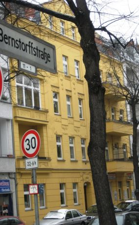
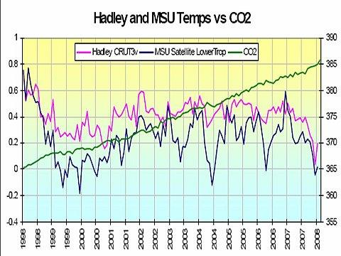

## Ungeschminkte Kritik und Lob aus meinem alten Gästebuch - 
Mit meinen Stellungnahmen / Antworten

### Kommentare von Gegnern, Fans und Kunden zu den "Altbau und Denkmalpflege Informationen" - 
Konrad Fischers Kompendium für Altbausanierung und Denkmalschutz

Selber einen Gästebuchbeitrag abgeben? Hier geht es zum **[Eintragsformular Online-Gästebuch](gaestebuch_neu.md)**. 

# Die Beiträge in chronologischer Reihenfolge, [jüngste hier](gaestebuch.md)

Tuesday 12/13/2011 1:52:55pm 
**Name:** A. Labude 
**E-Mail:** [info@dasconglomerat.eu](mailto:info@dasconglomerat.eu) 
**Beitrag:** Moin und Grüss Gott Herr Fischer 

Erstmal meine Hochachtung, das sie ihren Humor nach all den Jahren nicht verloren haben, trotz des Unsinns, der Verantwortungslosigkeit, Menschenleben aufs spielsetzenden, Sondermüll produzierenden und menschliches Elend hinterlassenden, geldgierigen BAUEREI.In der Ex BRD wurde in den 60 er Jahren noch kritisches Betrachten gelehrt (es waren auch nur wenige die sich dies trauten), aber es scheint, die Unterdrückung kritischen Gedankengutes hat nahe 100% funktioniert, auf Kosten von jeglicher Sozialen und Ethischen Kompetenz. 

Von uns bekommen Sie die von uns geschaffene Auszeichnung für Ethisch und Soziale Kompetenz für das Jahr 2011. _"Die Majorität der Dummen ist unüberwindbar und für alle Zeiten gesichert. Der Schrecken ihrer Tyrannei ist indessen gemildert durch Mangel an Konsequenz."_ Albert Einstein 

Bis zum nächsten Jahr 
Andreas Labude 

#KF: Herzlichen Dank für die ermunternden Worte!# 
Sunday 12/11/2011 10:21:57am 
**Name:** Christa Bergmann 
**Ort:** Bayreuth 
**Beitrag:** Nun muss ich auch mal etwas los werden. Glücklicherweise bin ich zu Zeiten meiner persönlichen Bauplanung auf die Seite von Herrn Fischer gestoßen. Aufgrund seiner Sichtweise haben wir (meine Familie und ich) uns mit Handwerksfirmen angelegt, Vertreter von Heizsystemen vom Grundstück gejagt, mit Architekten diskutiert. Schlussendlich haben wir unser freistehendes Einfamilienhaus so gebaut, wie das nach Ansätzen von H. Fischer und anderen ähnlich denkenden Menschen, z.B. H. Eisenschink, propagiert wird. Heraus gekommen ist ein Haus, mit dem wir sehr zufrieden sind. 

Hier nun die Eckdaten zum Energieverbrauch: Bj. 2006, Wärmepumpe 2 x 60 m Sondenbohrung monovalent, Wandheizung in den Außenwänden, Ziegelmauerwerk 49 cm einschalig, Fliesenböden in den Bädern und der Küche mit Fußbodenheizungs-Unterstützung. 

Durchschnittlicher Energieverbrauch pro Jahr im Durchschnitt der letzten 5 Jahre: 6274 KWh (Erfasst als Lastgang, 15 min Werte liegen mir vor). Hier ist enthalten natürlich Warmwasserbereitung für die Flächenheizung und Brauchwasserbereitung für 4 Personen (davon drei Mädels die super gerne baden). Es gibt noch einen Grundofen, in dem wir im Jahr ca. 1 Raummeter Holz verheizen. Beheizt wird eine Fläche von ca. 220 qm (nicht nach EnEV definiert, sondern reale warme Fläche, die angenehm warm beheizt wird). Gäste kommen bei uns sofort ins schwitzen. 

#KF: Danke für diese interessanten Informationen. Das heißt - exkl. ca. 20 % Warmwasserbedarf, inkl. Brennholz und CoP 3 ca. ein 9-Liter-Haus.# 

Saturday 12/10/2011 9:50:26am 
**Name:** Frau S. 
**Ort:** mittlerweile Leipzig 
**Beitrag:** Ich kenne die Seite(n) schon jetzt seit so einigen Jahren und erfreue mich immer wieder daran. 
Die viel erwähnte Unübersichtlichkeit- geschenkt. So hat man zwar länger zu tun, allerdings ist es das wert. Ich hatte schon überlegt, ob ich meine Unterstützung bei einer Neugestaltung anbiete, bin allerdings im Programmieren nicht geübt genug dazu, auch wenn es einige Ideen dazu in meinem Kopf gibt. 
Der Inhalt ist unbezahlbar. Leider habe ich bisher wenig Erfolg beim Missionieren gehabt. Die einen sind bereits meiner Meinung, die anderen glauben mir nicht... ;) 
Ein Gutes hat die kritische Diskussion um WDVS bei mir zuhause: mein Lebensgefährte will mittlerweile nicht mehr in ein Haus mit WDVS einziehen, wegen der Brandgefährlichkeit... er hatte irgendwann neulich einen Fernsehbericht über einen Hausbrand mit WDVS gesehen. Insofern fallen die da von mir befürchteten Meinungsverschiedenheiten schon mal weg. :) 
Leipzig hat bezüglich des Themas zum Glück einen großen Vorteil: hier gibt es fast ausschließlich Altbauten von vor dem zweiten bzw. ersten Weltkrieg, da ist die Auswahl ohne WDVS natürlich entsprechend groß. Plattenbauten gibt es hier auch nicht nur gedämmt (mit diesen schönen Leopardenmustern) sondern ebenso ungedämmt, insofern wäre selbst das wenig problematisch. Und die zwei Neubauviertel hier meidet man dann einfach... 
Glücklicherweise steht hier auch sehr viel unter Denkmalschutz, zumindest die Fassaden, sodass da auch nicht viel rumgepfuscht werden kann und das Problem der Kunststofffenster auch gar nicht erst gegeben ist. Ich bin also sehr zufrieden mit der aktuellen Wohnsituation. 
Wir hatten ja auch schon mal vor längerer Zeit Kontakt. Ich arbeite nach wie vor im kaufmännischen Bereich, allerdings nicht mehr im Großhandel für Farben und Bodenbeläge. Evtl. erinnern Sie sich, vielleicht auch nicht. Ich hatte Sie damals auf einen Dacheinsturz eines Supermarkts aufmerksam gemacht. 

ich wünsche Ihnen auf jeden Fall weiterhin guten Zulauf auf Ihrer Webseite. Sind Sie eigentlich auch bei Facebook? Das hatte ich noch gar nicht überprüft ;) 

Schöne Grüße, 
Daniela S. 

#Danke für die umfangreiche Stellungnahme. Und klar - ich bin auch in diesem Fatzenbuch.# 

Monday 10/31/2011 3:39:53pm 
**Name:** Fairer Sanierer 
**Beitrag:** Sehr geehrter Herr Fischer, 
vielleicht sollten Sie ihre Leser darauf hinweisen, dass Altbauten auch ihre Schwächen in der Wärmedämmung haben. 
Nach meiner Meinung oft Konstruktionsfehler, weil damals die Überlegungen zur Wärmedämmung eine nicht so große Rolle spielten. 
Um es konkret an einigen Beispielen zu zeigen: 
- Haustürüberdachungen und Balkone aus Beton wurden direkt am Gebäude angebracht und mit Eisen tief im Gebäude verankert. 
- Bei Treppenaufgängen aus Beton wurde die Betonplatte der Zwischenebene direkt auf das einschalige Außenmauerwerk aufgelegt. 
- Die Bodenplatte ragt z.B. am Hauseingang nach außen durch. 
Alles ganz tolle Wärmeleiter nach außen. 
Das ist mir aufgefallen, als ichKontruktionsdetails eines Neubaus mit dem Altbau verglich. Diese Mängel können aber kaum behoben werden. 

Bleibt nur die spannende Frage, wie ein Neubau nach Ihrer Empfehlung mit einschaligem massiven Mauerwerk im Vergleich zu den heute angebotenen Konstruktionen abschneidet. Mein Gefühl sagt mir, das Ihre Empfehlung des Wandaufbaus recht gut abschneiden wird, weil im Vergleich die Altbauten trotz der Mängel einen moderaten Heizmittelverbrauch haben. 

Alles Gute noch für Sie 

#KF: Danke. Und die benannten "Mängel" sind bestimmt nicht so mangelhaft, wie der U-Wert-Fanatismus berechnet und können insofern mit bestem Gewissen weiter belassen werden. Oft werden hier nur die Thermobilder mißinterpretiert: Die massiven Bauteile speichern nämlich die tagsüber eingefangene Solarenergie sehr lange und gut! Deswgen kommen die Wärmebildschlawiner nachts, da ist der Idiotendämmstoff schon lange ausgekühlt und saugt wg. Taupunktunterschreitung Kondensat in rauhen Mengen. Das ist dann "gut"! So werden die ahnungslosen Hausbesitzer pseudowissenschaftlich reingelegt - Sancta Simplicitas! 

Was in Altbauten aber wirklich Energie schluckt, sind UP-Heizrohre. Weg damit - das spart!# 

Sunday 10/30/2011 10:49:41am 
**Name:** Richter 
**Ort:** Langgöns 
**Beitrag:** Hallo an alle Sektenmitglieder der Antidämmbewegung. 

Ich vermisse unter den Gästebucheintragungen die Danksagungen derer, die ihre Berichte ernstgenommen haben. und jetz in einem ungedämmten steinernen Haus mit 20cm Vollziegel sitzen und die vom IWO empfolene ach so wirtschaftlich Ölheizung laufen lassen. Oder dann doch die mit EON Strom betriebene Elektroheizung. Dass sind ja die kompetenten Institutionen mit denen sie ja "zusammenarbeiten". 

#KF: Ja, das IWO. Was glauben Sie, was die Herrlich- und Dämlichkeiten in deren Führungsetage von mir alles anhören müssen bei all deren widerlichem Ökogedöns! Und kein Wort zur abiotischen Genese der angeblich "Fossilen". Ich rufe dort zwar ab und zu an und kritisiere deren publizistisches Rumgeeier, Zusammenarbeit kann man das aber bestimmt nicht nennen. 

Und was die Strommultis betrifft, bestimmt auch net. Denn die treiben ja ebenfalls den widerlichen Ökoschwindel EEG-mäßig auf die Spitze und sind als Atomisten die perversen Urheber der CO2-Lüge - ein Markting-Gag gegen die CO2-lastigen "Fossilen". Wer mehr als nur Bruchstücklein meiner Webseite liest und etwas aufmerksamer ist als der daabgschlochne bzw. ahnungslose Durchschnitt, kommt auf meinen Webseiten bestimmt zu keinen solch wunderlichen Mißinterpretationen wie Sie. 

Probieren Sie's ruhig aus, einen Gang runterschalten würde helfen ...# 

Thursday 09/22/2011 12:26:51am 
**Name:** aktueller Radio-Beitrag 
**Beitrag:** gerade im Radio NDR-Info gehört: 

"Die Wärmedämm-Lüge": 
[www.ndr.de/info/programm/sendungen/reportagen/waermedaemmung107.html](http://www.ndr.de/info/programm/sendungen/reportagen/waermedaemmung107.html) 

deutliche Worte auch hier: 

[www.ndr.de/info/programm/sendungen/reportagen/waermedaemmung111.html](http://www.ndr.de/info/programm/sendungen/reportagen/waermedaemmung111.html) 

z.B.: 
_"...Vorgaben der Energie-Einsparverordnung werden am Deutschen Institut für Normung geschrieben. Der zuständige Bauausschuss ist personell eng verwoben mit der Industrie. So arbeitet der Fachbereichsleiter gleichzeitig für einen Dämmstoffhersteller; der Verantwortliche für Wärmedämmstoffe ist Leiter des Forschungsinstituts für Wärmeschutz (FIW), einem Lobby-Verein der Dämmstoffindustrie."_ 

#KF: Danke für diesen Beitrag. Das NDR-Anliegen ist löblich, führt teils aber wieder mal voll in die Irre, z.B.: 

_"Früher seien acht oder zehn Zentimeter Wärmedämmung verbaut worden - ein sinnvoller Wert, sagt Rahn."_ 

Da ist natürlich auch gar nix Sinnvolles dran, seinem Haus einen etwas dünneren nassen Pulli anzuziehen, der sich als Zeitbombe selbst zerstört, das Haus und die Gesundheit der Leute gleich mit. Und zwar ohne jeden wirtschaftlich sinnvollen Energiespareffekt! 

Experten oder Scherzperten? Das ist und bleibt die Frage!# 

Tuesday 08/30/2011 10:52:58am 
**Name:** Jochen Seelig 
**Ort:** BW 
**Beitrag:** Sieh an, kehrt in BW Vernunft ein? 
Die Architektenkammer Baden-Württemberg hat Auszeichnungen vergeben ("Beispielhaftes Bauen 2007 - 2011") Darunter den Neubau innerhalb eines denkmalgeschützten Ensembles: "Hervorzuheben ist auch das Energiekonzept, das ohne Wärmedämm-Verbundsystem auskommt, sondern auf eine nachhaltige Ziegelbauweise setzt." 

Stuttgarter Zeitung vom 22.08.2011 

#KF:Kehret um, das Ende ist nahe ... ;-) # 

Friday 08/26/2011 11:27:59am 
**Name:** Astrid B. 
**Ort:** Köln 
**Beitrag:** Sehr geehrter Herr Fischer, 

ich mag ihre Internetseite, gerade weil sie etwas chaotisch - und daher auch für mich authentisch ist. Ich schaue seit Jahren öfter mal rein und freue mich über die ehrliche Ausdrucksweise. 

Mich macht es traurig was mittlerweile aus dem Baugewerbe geworden ist. Es ist der absolute Wahnsinn was einem als Bauleiter von Planern, Kalkulatoren, Bauherren usw aufgezwungen wird. 

Es wird immer schlimmer und keiner weiß eingentlich mehr was er tut und ob es Sinn macht. Zum Schluß alles schön zuspachteln und hoffen, die Gewährleistungsfrist zu überstehen. 

Was meinen Sie, hört dieser Irrsinn irgendwann auf? 

Mittlerweile leite ich Abbrucharbeiten und Altlastensanierungen. Da sieht man viel verschimmelte Dämmwolle. Auch welche Kosten für die Entsorgung von verputztem WDVS oder PU-Dämmungen auf Dächern aufgewendet werden müssen, ist kaum zu glauben. 

Viele Grüße und machen Sie weiter so! 

#KF: Danke für diesen zustimmenden Zuspruch. Dummerweise denken viele Dämmer, bei ihnen wird es schon klappen. Fast alle, die den Wulst irgendwann mal rausnehmen, stoßen ja auf den Dämmrott. An der nackerten Bauphysik kommt ja kein Dämmdoof vorbei - Werbung hin oder her. 

An Bildern von vergammelten Zwischensparrendämmungen (u.a.) bin ich übrigens interessiert - die können als Abschreckung auf meiner [Dach-Dämm-Webseite](21316bau.md) eingestellt werden. 

Der Blödsinn hört aber nur auf, wenn alle Bauherren qualitätsbewußt geworden sind. Am St.-Nimmerleins-Tag? ...# 

Monday 08/22/2011 3:04:36pm 
**Name:** Ulrike Rosenträger 
**Ort:** Heppenheim 
**Beitrag:** Sehr geehrter Herr Fischer, 

es sind schon zwei Jahre her, dass ich Sie bat, unser Häuschen zu begutachten. 
Sie gaben mir nicht nur eine Kostenaufstellung, sondern auch viele nützliche Tipps( z.B.Ansetzen von Sumpfkalktünche u.a.).Ich musste ein bis zwei Kompromisse eingehen, denn das Geld wurde im Laufe der Sanierungsmaßnahmen Mangelware und wir hatten nur 6 Wochen Zeit alles bewohnbar zu machen. Jetzt, da wir auch 
finanziell etwas mehr Luft haben, können wir nach und nach kleine Schönheitskorrekturen durchführen. 
Viele sagen, wir sollten die alten einfach verglasten Fenster, die zum Teil noch eingebaut sind rauswerfen. Machen wir aber nicht, denn sie sind sehr schön, und wenn die Zeit dazu gekommen ist werden sie dann nur aufgearbeitet.In dem alten Häuschen (es hat keine nennenswerte Isolierung) frieren wir nicht und sind auch Gesund durch den Winter gekommen.(Strahlungswärme sei Dank) 
Ihre homepage ist immer wieder interessant zu lesen. Erschreckend ehrlich (nach dem Motto: heute schon ein Altbau gekauft und sich über den Tisch ziehen lassen?), aber hilfreich wenn "das Kind schon in den Brunnen gefallen" ist. Diese nüchterne Betrachungsweise der Themen in der Hompage ist gewöhnungsbedürftig, aber notwendig um eine Sanierung realistisch anzugehen. 

Auch wenn die Sanierung eines Altbaus aufwendig ist und Nerven kostet, kommt für mich kein "Haus von der Stange" in Frage. 

Mit freundlichem Gruß 
Ulrike Rosenträger 

#KF: Freut mich sehr, daß Ihre Sanierung auf ein gutes Ergebnis zugeht!# 

Wednesday 08/17/2011 4:20:32pm 
**Name:** Mustermann 
**Beitrag:** Guten Tag! 

Schön geschimft über WDVS, Sanierputz ect.! Aber wie es "richtig" geht kann ich hier auch nicht herausfinden (auch nicht aus ihrem Buch). 

#KF: Was für Sie richtig ist, steht bestimmt auf keiner Webseite und in keinem Buch. Das hängt nämlich im Detail genau von Ihren Bedürfnissen und Möglichkeiten einerseits und Ihrem Haus andererseits ab. Und das will genau - auf Ihre Aufgabe zugeschnitten -festgestellt werden. 

Viele wählen dafür eine [individuelle Bauberatung](2berat.md). Und andere fragen den Handwerker, was er dem Bauherren am liebsten von seinem Systemlieferatnten auf die Nase oder um den Bart schmiert, egal ob es paßt oder hilft oder net. Sie haben die Wahl.# 

Tuesday 08/16/2011 10:01:25am 
**Name:** Wilhelm Greiner 
**E-Mail:** [mabuhai@gmx.de](mailto:mabuhai@gmx.de) 
**Ort:** Langenau 
**Beitrag:** Hallo Herr Fischer, 

nochmals besten Dank für die letzte Beratung bzgl. des Fußbodens, muss raus. 
Beim Dach muss ich sie aber nochmals konsultieren. 

Ihre schier unerschöpfliche Webseite ist ein wahrer Fundus für mich. 
Mit dem Wissen von heute wäre mir gesundheitlich und finanziell einiges erspart geblieben. 

Gruß 

Wilhelm Greiner 

Saturday 08/13/2011 10:07:17pm 
**Name:** Matthias Dahms 
**Ort:** Norddeutschland 
**Beitrag:** Sehr geehrter Herr Fischer, 
eigentlich wollte ich bei unserem zuständigen Bauaufsichtsamt "nur ein paar" Vorabinformationen zu erforderlichen Grenzabständen (es werden ja möglichst "dicke Dämmungen" für "dicke Einsparungen" empfohlen; dadurch kann dann auch schon mal der erforderliche Genzabstand unterschritten werden -> Ausnahmegenehmigung erforderlich, wie ich jetzt weiß) und mögliche Fassadengestaltung einholen. Die zuständige Stadtbildpflegerin empfahl mir Ihre Internetseiten. Gottseidank! Jetzt verstehe ich auch, warum sie die Frage stellte, weshalb ich denn das Haus dämmen wolle...Sie deutete auch von ihr schon gesehene Fassaden hin, auf die Sie mahnend hinweisen. 
Da ich ein skeptischer und oftmals auch kritischer Zeitgenosse bin, kamen mir die lobgepriesenen WVDS, die regelmäßig wöchentlich in den Baumärkten dieser Republik beworben werden, schon immer etwas suspekt vor. Insbesondere, wenn bei einem komplexen Thema dieser Art dann auch noch auf Einsparpotenzial durch "Mach's selbst" hingewiesen wird. Nun zweifele ich auch schon an der von mir angedachten "Öko-Lösung" (Hanf oder Schafswolle mit Lärchenholz-Vorhang-Fassade, hinterlüftet) durch Ihre Informationen, Erfahrungen und Beispiele. Vielen Dank! 
Durch Ihre Beispiele wurde ich auch nach langer Zeit mal wieder an die Inhalte meines Studiums erinnert: kapillare Steighöhe bzw. Depression, Technische Wärmelehre/Wärmeübergang, Wärmeausdehnungkoeffizienten, Betriebswirtschaftlehre, um nur ein paar Beispiele zu nennen. Wenn man sich mal an seine physikalische und chemische Ausbildung im Rahmen der Schule oder Studium erinnern kann, dann werden auch viele Ihrer Aussagen wissenschaftlich nachvollziehbar. Bei einigen dauerts länger: da muß man dann auch schon mal ein wissenschaftliches Grundlagenwerk zu Rate ziehen. Sie nennen es wahrscheinlich Bauphysik, aber eigentlich basiert es auf den Grundlagen der Allgemeinen Physik (und natürlich der allseits geliebten Chemie). 
Auch ich sehe mich leider in meinem beruflichen Umfeld mit Meinungsvertretern konfrontiert, deren physikalischen Grundkenntnisse "nachsitzenswürdig" sind und die einer Hilfestellung durch "Nachhilfe" kategorisch ablehnend gegenüberstehen. 
Bitte bleiben Sie den wenigen noch kritischen und nachdenkenden Menschen lange erhalten. Bei mir haben Sie jedenfalls erreicht, zu denken und auch mal nachzudenken, und auch mal wieder selbst zu rechnen. Und das nicht nur an der Zapfsäule oder im Supermarkt. Erschreckend, wie träge man mit der Zeit werden kann. Danke für's "wachrütteln"! Mal sehen, was ich daraus mache... 

#KF: Herzlichen Dank für diesen ermunternden Kommentar!# 

Saturday 08/13/2011 7:00:07am 
**Name:** Hans Hartung 
**Ort:** Warstein 
**Beitrag:** Guten Morgen, 

Ihre Aussagen sind absolut schlüssig und Ihre Seite empfehle ich auf alle Fälle weiter! 

Das mit dem WDVS ist schon erschreckend wieviel Gebäudesubstanz mit viel Geld vernichtet wird. 

In meiner Nachbarschaft sehe ich die von Ihnen schön beschriebenen und sehr gut erläuterten Auswirkungen. 

An mein denkmalgeschütztes Einfamilienhaus mit 40 cm gebranntem Ziegelmauerwerk mit Hohlraum kommt mir niemals so ein Zeugs an die Wand und für die Temperierung nutze ich einerseits einen großen gemauerten Specksteinspeicherofen sowie Infrarotheizungen werden in Kürze als Ergänzung folgen. 

Vielen Dank für die hervorragende Zusammenstellung wahrer Sachverhalte und die tollen Videos, die ich mir alle angesehen habe. 

Grüße aus Warstein 
H. Hartung 

#KF: Danke, lieber Herr Hartung! Und wenn Sie mir die nassen WDVS-Fassaden Ihrer Nachbarschaft für meine Webseite zur Verfügung stellen würden, hätten wir alle was davon. Die bringe ich dann mit Quelle oder anonym, wie Sie wollen. Für ein paar Fernsehdrehs suchen wir außerdem noch WDVS-Geschädigte, wer was kennt, bitte mitteilen!# 

Wednesday 08/03/2011 5:04:39pm 
**Name:** Nathan 
**Beitrag:** Informative Homepage. Leider extrem unstrukturiert und unübersichtlich. Finde mich nicht zurecht. 

#KF: Bekanntes Problem. Es braucht Zeit und vielleicht den Besuch des [Inhaltsverzeichnisses](1suchen.md). Von selbst geht's net, leider.# 

Monday 08/01/2011 1:15:18am 
**Name:** alice 
**Homepage:** <http://visurus.blogspot.com/> 
**Beitrag:** als erstes: vielen dank - super lesestoff. 

Heute am frühen abend versuchte ich rauszufinden, ob ich ein haus aus ungebrannten lehmziegel unbewohnt im feuchten, kalten europa überwintern lassen kann ... dabei war fakten aus dem öko-verkaufs-gelaber kaum filtrierbar ... ich meine, die hübschen lehmbauten in warmen ländern passen nicht ganz immer zu den themen ... und mir stand schon der fusspilz kopf, was zB der lehmverputz im kaltwandigen badezimmer gutes dem raumgefühl anhaben kann ... 

ich weiss leider nicht mehr mit welchen suchbegriffen ich schlussendich auf [www.konrad-fischer-info.de](index.md) gelandet bin - schliesslich wollte ich doch vor 5 h schlafen gehen und lese noch immer hier. merci - vor allem bei der erklärung der strahlung hab ich immer wieder laut gelacht - das grundverständnis vermitteln sie mit viel witz und humor ... und zwischendurch wettern sie so sehr, dass ich doch manchmal dachte, na jetzt stürzt auch der massivbau ein. 

#KF: Dankeschön für diesen erfrischend spontanen Beitrag. Und natürlich kann auch ein unbewohntes Bauwerk aus irgendwas hierzulande ganz passabel überwintern. Um jedoch Kondensatschäden zu vermeiden, braucht es schon etwas Temperierung - so jedenfalls die [Erfahrung an unseren konservatorisch temperierten Bauwerken](7temp17.md). Vom Einbruchschutz gar nicht zu reden.# 

Friday 07/29/2011 11:35:21am 
**Name:** DI Jürgen Holzapfel 
**Ort:** Hermsdorf im Osterzgebirge 
**Beitrag:** Hallo Herr Fischer! 

Wie Sie oben entnehmen konnten, bin ich seit 1990 ein Jünger des Strahlungsheizungspapstes A. Eisenschink und mit ihm in brieflichem Kontakt. Sein Buch „Falsch geheizt ist halb gestorben“ hat mich in meiner Tätigkeit als Dozent in der Meisterausbildung vor schlimmen Fehlern bewahrt. Ich konnte seit dem eine Vielzahl von Hausherrn von den Vorteilen einer Heizleistenheizung (ohne Nachtabsenkung) überzeugen. Inzwischen wird sie in Sachsen auch auf Hausmessen angeboten. Natürlich habe ich in meinem 100 Jahre alten Haus Heizleisten selbst eingebaut und durch einen Holzgrundofen von AE ergänzt. Über Heizkosten rede ich nicht. 

Nun zum eigentlichen Anliegen meiner Mail. Seit einigen Jahren verfolge ich Ihren Internet Auftritt und kann mich nur lobend über die Inhalte äußern. Ihr letztes Video über die Dämmproblematik hat mich zu dieser Mail animiert. 

Da ich als Lehrer seit Jahren gegen die „Luftheizerei“ (Originalton AE) zu Felde ziehe, kann ich es auch nicht lassen, kritische Briefe an die Redaktionen der verschiedenen Mediensendungen („WISO“; „Einfach genial“; „Markt“ ua.) zu senden. In diesen Sendungen treten immer wieder selbst ernannte „Energieberater“ und DIN gläubige „Fachleute“ auf, die von Energiepässen schwafeln, dämmen als Heilslösung anpreisen und vom Gesetzgeber u.a. fordern, doch endlich den „hydraulischen Abgleich“ von Heizanlagen in Verordnungen zu schreiben. 

Wissen diese „Fachleute“ nicht, dass seit Jahr und Tag in der VOB, Teil C steht: „…Anlagen sind bestimmungsgemäß zu übergeben.“ D.h. man muß den Anlagenbetreibern klar sagen, dass sie jetzt schon das Recht haben, Rechnungen zu kürzen, wenn keine ordnungsgemäße Anlagenübergabe, Einweisung und kein hydraulischer Abgleich erfolgt ist? 

Auch in der ISO 9001 steht die nützliche Forderung, die zertifizierte Firmen erfüllen müssen: 

„...produktspezifische Anforderungen müssen „validiert“ werden.“ 

Auch hierfür gilt das Kriterium, dass Produktanforderungen auf ihren bestimmungsgemäßen Gebrauch zu prüfen und zu bewerten sind. 

Was bezwecke ich mit meinen Äußerungen? 

Ich hoffe über Ihr breites Forum Wissende zu ermuntern, jede öffentliche Gelegenheit zu nutzen, Fehlentwicklungen anzuprangern, einschließlich gegen die herrschende Klimadoktrin offensiv vorzugehen. Für einen geldbeutelsparenden Umgang mit Energie braucht`s keine CO2- Hölle. Wer Informationen dazu sucht, findet sie u.a. bei [www.eike-klima-energie.eu](http://www.eike-klima-energie.eu/). 

Lieber Herr Fischer, lassen Sie sich ja nicht abbringen von Ihrem aufklärendem Tun. 

Sie haben Mitstreiter. 

Frohes Schaffen! 
Gruß J. Holzapfel 

PS: Als gelebter DDR- Bürger (Jhrg. 47) bitte ich Sie herzlich, mit dem Begriff „Kommunismus“ etwas sparsamer umzugehen. 
Zum Schluss noch ein Hinweis an den belesenen Kulturmensch KF. Schauen Sie bei Gelegenheit mal hier rein: [www.fantomzeit.de](http://www.fantomzeit.de/). 

#KF: Lieber Herr Kollege Holzapfel, herzlichen Dank für Ihre inhaltsreiche Ermutigung, das tut auch mal gut, bei all den gegenteiligen "Äußerungen" aus den bekannten anderen Ecken. 

Zu Ihren Anmerkungen: 
Den Kommunismus habe ich seit meiner Jugend auch vor Ort studiert. Ich kann ihm nicht viel abgewinnen. Er möchte den anderen Menschen, und ist für seine menschenverachtende Utopie zu recht bösen Härten bereit. Was es in der DDR zugegebenermaßen auch Gutes gab, ist bestimmt nicht dem "Kommunismus" als solchem zuzuschreiben, sondern dem Rest von Mitmenschlichkeit, den auch der Kommunismus nicht auszutreiben in der Lage war. Den Ökommunismus als ideologische Pest unserer Zeit sehe ich in familiärer Verwandschaft mit der utopischen Menschen- und Weltverbesserei nach Marxschen Maximen, bereit, alle unmenschlichen Gemeinheiten in Kauf zu nehmen. Und die Altkommunisten rund um A.M. und Konsorten sind verdächtig gerne auch auf diesen Zug aufgesprungen. 

So ist sie halt, meine Meinung. Doch Sie können mir gerne mal Ihre in einem persönlichen Gespräch (telefonisch?) näher mitteilen. Ich bin durchaus lernfähig ... 

Auf der EIKE-Webseite können Sie ein [Interview](http://www.eike-klima-energie.eu/climategate-anzeige/haus-waermedaemmung-unter-den-neuen-energiespargesetzen/) mit mir finden. Für den Intensiv-Leser meiner Webseite und Betrachter meiner [youtube-Filme](http://www.youtube.com/user/KonradGFischer) wird da aber wenig Neues drin zu finden sein. 

Und die Fantomzeit rund um Dr. Heribert Illig kenne und schätze ich als langjähriger "Zeitensprünge"-Abonnent. Auch etwas, das die scheinbaren Gewißheiten ins Wanken bringen kann. Und das gilt ja auch darüber hinaus für "allerlei" bis heute ;-) # 

Friday 07/22/2011 10:03:45pm 
**Name:** Christian Solmsdorf 
**HP URL (www...!):** [http://www.solmsdorf.de](http://www.solmsdorf.de/) 
**Ort:** Hofheim am Taunus 
**Beitrag:** Sehr geehrter Herr Fischer, 
durch Ihre telefonische Beratung konnte ich die Fachwerkgiebelwand(Wetterseite) meines Hauses gut und kostengünstig sanieren. Vielen Dank für Ihre Hinweise und Tipps, die ich gut umsetzen konnte. 
Beeindruckend finde ich auch Ihre Webseite, weil sich hier in unerschrockener und erfrischender Weise fachliche Kompetenz, Kritik und Humor paaren - meinen Respekt! 

Mit freundlichem Gruß 
Christian Solmsdorf 

Friday 07/15/2011 9:27:33am 
**Name:** XY [Namen wg. ständiger Belästigung durch Schnorranrufe anonymisiert] 
**Ort:** [Ort ebenso] 
**Beitrag:** Hallo Konrad, 

vielen Dank für Deine Unterstützung und Hilfestellung. 
 
Habe unser Dach nach Konradscher Methode modifiziert und bin erstaunt über die Wirkung bei stärkster Sonneneinstrahlung. 

Haben nun ein absolut tolles Klima im OG und wenn die Fenster nun auch noch beschattet sind, dann ist es wahrscheinlich abends zu kühl :-))) 

Mit kühlem Dachgeschoss und freundlichem Gruße 
XY [s.o. Namen / Adresse kann Beratungskunden bei Interesse mitgeteilt werden.] 

#KF: Vielen Dank für die Rückmeldung, das kann vielleicht manchen Zweiflern einen Anstoß geben ...# 

Thursday 07/14/2011 8:40:33pm 
**Name:** S. Bruesehaber 
**Ort:** Uckermark 
**Beitrag:** Sehr geehrter Herr Fischer, 

Gott sei's gedankt, dass ich Ihren Publikationen über den Weg gelaufen bin! Haben mir ein grundsätzliches Verständnis über den Zusammenhang von Heizungsart, Masse und Dämmung/Abdichtung vermittelt. 

Hat mich allerdings auch sehr erschreckt, als mir klar wurde, auf welchen Irrweg in Autobahnbreite uns die Bauchemie gepaart mit falscher Heizart in den letzten 50 Jahren geführt hat - Häuser in immer leichterer Bauart mit Chemiekram immer dichter machen, damit die warme Luft drinnen bleibt. Verbunden mit all den "Problemchen", die zu starre Systeme nun mal mit sich bringen. 

Mein Gott, wie viel 42er Mauerwerk hätte man für all diesen Plastikschrott hinstellen können. Wie gesagt, Gott sei's gedankt, und natürlich Ihnen! 

Mit besten Grüßen, 
S. Bruesehaber 

#KF: Vielen Dank für Ihr offenherziges Lob! Mich freut es, daß doch manche Besucher meiner Webseite die richtigen Schlüsse ziehen. Das ermutigt mich zur Fortsetzung meines Aufklärungsfeldzugs.# 

Wednesday 07/13/2011 11:02:39am 
**Name:** Labude 
**E-Mail:** [info@dasconglomerat.eu](mailto:info@dasconglomerat.eu) 
**Ort:** Münsterland /Ostfriesland 
**Beitrag:** Hallo Herr Fischer 
Das mit dem kleinen Foto ist echt super, der Rest auch. Mal sehen ob das jetzt durchgeht. 
Gruss A. Labude 

Wednesday 07/06/2011 11:40:32am 
**Name:** Heinz Ruwoldt 
**Ort:** Iserlohn 
**Beitrag:** Sehr geehrter Herr Fischer, 

ich bin 58 Jahre alt und Dipl.-Ing. Seit letztem Jahr bin ich außerdem ein "staatl. anerkannter Energieberater". 
Ich habe mich schon öfters mit den Themen beschäftigt die auch zu Ihrem Tätigkeitsfeld gehören. Dabei habe ich je länger, je tiefer erkennen müssen, dass all das schöne Bild der Dämmmung außen wie innen, der Heizungsanlagen und der Energieersparungen im Großen und Ganzen ein Trugschluss sind, der dem Tatbestand der Volksverdummung recht nahe kommt. Ich habe mich gefreut, einen "Mitstreiter" für sinnvolle Sanierungsmaßnahmen ertdeckt zu haben. Da ihre Erfahrungen um ein vielfaches größer sind als meine, die doch recht bescheiden sind, freue ich mich auf Ihre Seite gestoßen zu sein. 
Gerne gebe ich diese Webadresse weiter bzw. wende mich an Sie wenn ich eine Rat oder eine Lösung für einen Kunden benötige. Natürlich keine Umsonstberatung !! 

Nochmals vielen Dank für Ihre Webseite, die ich persönlich wie einen "Schatz" festhalten werde. 

mfg 

H. Ruwoldt 

#KF: Lieber Herr Kollege, es freut mich, daß die Energieberatergilde einen weiteren Ehrlichen hinzugewonnen hat. Einige gibt es da freilich schon, doch es dürfen von mir aus noch viele mehr werden. Den Umsätzen der Dämmstoffmafia würde das freilich eher im Wege stehen, doch das macht uns bestimmt nichts aus, oder? 

Herzlichst Konrad Fischer# 

Tuesday 07/05/2011 9:32:07pm 
**Name:** Harald Thiemann 
**Ort:** Hamm (Westf.) 
**Beitrag:** Sehr geehrter Herr Fischer, 
nach vielen Stunden des Lesens Ihrer Seiten möchte ich einen Eintrag im Gästebuch hinterlassen und einige Punkte anmerken. 

Ihren Hinweis, die Nachtabsenkung der Heizung nicht zu nutzen, sondern durchzuheizen, habe ich im letzten Winter durchgeführt. 

Ich muß dazu sagen, dass ich die Heizwassertemperatur auf ein Minimum gesetzt habe. ca. 40 Grad bei 0 Grad außen und 50 Grad bei -10 Grad außen. 

Das Ergebnis war erstaunlich! Im Vergleich zu den Vorjahren hat das nahezu 8% Gasersparnis gebracht. 

Ich bin nun kein Expperte, aber der letzte Winter kam mir überhaut nicht wärmer als andere in der Vergangenheit vor. Und in einer klammen Bude habe ich auch nicht gesessen. 

Mit Ihrer These zum Dämmstoffverbau, der nicht viel bewirkt aber viel kostet, kann ich mich nicht vollstandig anfreunden. Es könnte eher sein, dass einige Dämmstoffe an ungeeigneten Stellen montiert werden. Beispielsweise Glaswolle zwischen die Dachsparren dürfte wirtschaftlich und von den Ergebnissen her sinnlos sein. 

Andererseits, einen Warmwasserbehälter damit zu umwickeln, wird einen großen Erfolg bezogen auf Materialaufwand und Einsparung haben. Es geht ja darum, die an der Oberfläche angewärmte Luft festzuhalten und so die Luft als Isolierschicht zu nutzen. 

Zwischen den Dachsparren tritt dieser Effekt eben nicht auf. 

Und wenn Sie mal in die Natur schauen: 
Das Fell des arktischen Eisbären besteht aus Haaren mit einer Luftröhre im Innern zur Isolierung. Aber genau darauf zielt die Glaswolle ja ab. 

So, zuviel will ich aber auch nicht schreiben. 

Hoffentlich machen Sie noch viele Jahre weiter. Die Welt braucht Menschen wie Sie, die zum Nachdenken anregen. 
Es ist wichtig, die Dinge zu hinterfragen und Dämmstoffvertretern und Politikern mit "blöden" Fragen auf den Wecker zu gehen, anstatt blind auf Vorschriften zu vertrauen. 

In diesem Sinne 

Harald Thiemann 

#KF: Danke für Ihren Beitrag. Ihren Vorschlag, auf Profiteure und deren gekaufte Politiker mahnend einzuwirken, finde ich köstlich. Ich tue das seit 30 Jahren. Ergebnis? Sie dürfen raten! 

Und daß die Dämmung die Umstände berücksichtigen muß, finde ich auch. Der Pulli darf halt net naß werden, darauf kommt es an. Und an der Gebäudehülle wird er eben naß.# 

Tuesday 05/03/2011 9:24:59am 
**Name:** Damian Macznik 
**Homepage (HP) Titel:** damiant - nostalgische Baustoffe 
**Homepage:** [http://www.damiant.com](http://www.damiant.com/) 
**Ort:** Brzeg Dolny 
**Beitrag:** Guten Morgen Herr Fischer, 
so viele Informationen zu Altbau und Denkmalschutz auf einer Seite gibt es selten... Deswegen bin ich begeistert und möchte einen Gruss aus Niederschlesien hinterlassen. Sicherlich ist es nicht mein letzter Besuch! 

Herzliche Grüße 

Damian Macznik 

#KF: Freut mich natürlich, wenn Sie aus meinem überbordenden Infoangebot etwas Sinnvolles rausfischen können.# 

Thursday 04/28/2011 9:43:06pm 
**Name:** martin 
**Ort:** Münster 
**Beitrag:** Sehr geehrter Herr Fischer, 
ich möchte noch eine Anmerkung zum Thema Temperierung machen. 

Vor kurzem habe ich mit Ihnen ein kurzes Telefonat über Solarthermie geführt. In dem Gespräch haben Sie angemerkt, dass eine Elektroheizung den Verbrauch gemessen in kW/h senken könne und der preisliche Unterschied in der Folge nicht sehr groß ausfalle. 

Darüber habe ich mir mal Gedanken gemacht und bin zu dem Ergebnis gekommen, dass die Messungen des Abgasverlustes vom Schorni fehlerhaft sind. Wahrscheinlich gilt das auch für Brennwertgeräte gleichermassen. Bin da aber kein Experte. 

Meine Einschätzung will ich aber auch begründen: Der Schorni ermittelt den Verlust, indem er die Differenz zwischen Abgastemperatur und der angesaugten Verbrennungsluft bildet. Dann ermittelt er den Restsauerstoffgehalt, mit der er die Abgasmenge ermittelt. Mit dem Temperaturhub und der Abgasmenge erhält er die Verluste als absolute Größe und setzt sie ins Verhältnis zur Thermenleistung. 

Der Knackpunkt liegt in der angesaugten Verbrennungsluft. Hier wird je nach Typ der Therme die Temperatur im Heizraum oder bei Ansaugung der Luft über den Schornstein die schon durch die Abgase erwärmte Luft angenommen. 

Aber diese Wärme kommt bereits über die Therme, ist durch den Brennstoff erwärmt worden, demzufolge also ein falscher Ansatz. 

Strenggenommen muss die Temperatur der Außenluft angesetzt werden. Aber dann wird wohl jede Therme bei den Abgasverlusten durchfallen. Es sei denn, es ist Hochsommer. 

Habe dies bei meiner Therme mal nachgerechnet. Im tiefen Winter erreiche ich beim Ansatz mit der Luttemperatur draußen rund 25% Verluste. Wahrscheinlich sogar noch mehr, da der Schorni bei Vollast misst. Meine Therme kann die Leistung in 2 Stufen steuern. Volllast im Heizbetrieb gab es noch nie. 

Mit freundlichen Grüßen 
M. 

#KF: Interessanter Ansatz. Werde darüber nachdenken ... Danke!# 

Sunday 04/03/2011 3:59:24pm 
**Name:** Helmut Erb 
**Seitenfund:** Webring 
**Beitrag:** Hallo Herr Fischer, 
vielleicht kann ich Ihnen mit einem Bericht der WamS über den Buntspecht eine Freude machen: 
[Buntspechte am WDVS: "Angriff der Fassadenkiller"](http://www.welt.de/print/wams/wirtschaft/article13053703/Angriff-der-Fassadenkiller.html) 
Beste Grüße 
HE. 

#KF: Vielen Dank. Als Mitglied im Bund Naturschutz seit nunmehr über 30 Jahren freut mich die Einbürgerung des Buntspechts am Haus natürlich sehr. Das ist nun wirklich mal was anderes, als fettige Meisenknödel! 

Als Architekt und Ingenieur werde ich über das Gelöcher und Gestanze an den naßverwurmten Fassaden trotzdem nicht recht glücklich. Geschweige denn als braver Steuerzahler.# 

Saturday 04/02/2011 0:04:13am 
**Name:** Rainer Romer 
**Ort:** Karlsruhe 
**Beitrag:** Hallo Konrad, 
gerade bin ich mal wieder auf Deiner WEB-Seite gelandet. Toll. 
Hast Du zufällig einen Zugang zum ZDF-Archiv? Da kannst Du beim Wetterfrosch des Heute-Journals vom, na, ca. Mai 2010 hören (sinngemäß): >>Die Nächte werden jetzt etwas kälter als gewohnt um diese Jahreszeit, wegen der eingestellten Flugtätigkeit nach dem Vulkanausbruch sind nicht so viele Kondensstreifen am Himmel, und die verursachen nun nicht die sonst übliche Wolkenbildung, und Wolken sind, das weiß man ja, ein Treibhausgas.<< Das hat der wirklich gesagt! Ich habe das ZDF angeschrieben und danach gefragt, die haben leider keine Antwort geschickt, wer hätte das gedacht...? Die wissen alle genau, was Sache ist, aber demzufolge müßten die Angelas und Merkels dieser Welt ja auf die Kerosinsteuer verzichten, ... Außerdem: Wer will schon gerne auf Fliegen verzichten? Panem et Circenses, oder wie heißt das? Damals wie heute... 
Allest Gute, Rainer aus KA 
PS: 
Demnächst geht auf meinem Dach eine PV-Anlage ans Netz - und ein Stromspeicher in den Keller. Unsere AMK-Röhrenanlage und der Wassertaschen-Ofen reduzieren den Peletverbrauch auf 700-1000 kg/a. 

Saturday 03/26/2011 10:16:21pm 
**Name:** Lutz M. Böttcher 
**Homepage (HP) Titel:** Mittendrin in Tegel 
**HP URL (www...!):** <http://mittendrin-integel.de/index.html> 
**Ort:** Berlin Tegel 
**Beitrag:** Sehr geehrter Herr Fischer 

Vielen Dank für Ihren Internetauftritt. Meine Frau und ich (68 Jahre alt) sind Eigentümer von klassischen Alt-Berliner Miethäusern in Reinickendorf. Diese befinden sich seit 1906 nun in der 4. Generation in Familienbesitz. Eigentlich hatten wir die Absicht, diese an die nächste Generation weiter zu geben. Ob das gelingt, stellt sich bei den Auflagen der ENEV 2009 + 2012 als fraglich heraus. Wir waren kurz davor, die Dachböden nach der ENEV 2009 zu dämmen. Es geht hierbei um insgesamt ca. 800,00 m² Dachbodenflächen mit insgesamt ca. 2.800 m² Wohnfläche. Nach meinen Berechnungen rechnet sich das wirtschaftlich nicht. 

Nach Studium Ihres WEB-Auftritts in dieser Hinsicht werde ich davon Abstand nehmen, die Dachböden zu dämmen und den § 25 als Begründung angeben. 

Ein vergleichbarer Nachbarbau mit ca. 750m² Wohnfläche soll nach Beratung im Jahr 350 ltr. Öl sparen. Auch hier lohnt sich das aus wirtschaftlichen Gründen sowohl für den Mieter als auch für den Vermieter nicht. 

Den Kampf mit Schimmel, Spechten und Kleingetier in einer gedämmten Hoffassade (1975) mit eingebauten Isolier-Kunststofffenstern bestärkt mich darin, dem Dämmwahnsinn etwas kritischer gegenüber zu stehen. Ihr Artikel ist dabei sehr hilfreich. 

Zum Beispiel: 

Eine in einem Seitenflügel in 2010 eingebaute Brennwert-Gas–Zentralheizung mit Warmwasserversorgung für 4 Wohnungen a 40 m² hat lt. Gaslieferant einen Mehrverbrauch von ca. 5.000 kwh p.a. erbracht. Gespart wurde lediglich durch den Wegfall der individuellen Gaszähler-Grundgebühren. Den 11% Modernisierungszuschlag konnten wir in voller Höhe nicht realisieren. 

Noch eins: der Energieausweis spielte bisher im Vermietungsgeschäft keine Rolle. 

Wenn denn alles so (hoffentlich nicht) realisiert werden muss, werden die Städte ihren Charakter verlieren und sehr uniform aussehen. 

Am deutschen Klimaschutz-Wesen wird Europa und die Welt nicht genesen. Lassen wir die Kirche im Dorf und treiben nicht immer wieder eine neue Sau durch dieses. 

Ob Waldsterben, BSE, Sars, Vogelgrippe, Atomkatastrophe, Terrorismusgefahr, E10, es ist alles das gleiche, wir werden mit Angst regiert. Und die Wahrheit wird nicht genannt, außer durch Herrn Brüderle. 

Mein Energie-Verbrauchswertkennwert im Energieausweis beträgt bereits jetzt (nur) bei dem abgebildeten Haus Bernstorffstrasse 10: 104 kwh/m²a und der Endenergiebedarf 189,8 kwh/m²a. Es wird mit Gasetagenheizungen geheizt und Warmwasser aufbereitet. 

Mit freundlichen Grüßen 

Lutz M. Böttcher 
Bernstorffstr. 10 
13507 Berlin 

#KF: Vielen Dank für diesen interessanten Beitrag der klaren Worte! 

Auch mir kommen kaum Energiesparprojekte unter, die auch nur ansatzweise dem Wirtschaftlichkeitsgebot nach EnEG (Energieeinsparungsgesetz) entsprechen. Befreiungen nach den §§ 25 EnEV, 11 Heizkostenverordnung und / oder 9 Wärmegesetz sind dann die logische und einzig gesetzeskonforme Folge. 

Doch was passiert? Die untreuen Energieverräter betrügen ihre leichtgläubigen Kunden für teuer Geld mit unwirtschaftlichen, kriminellen - da gegen das gesetzliche Wirtschaftlichkeitsgebot verstoßend- Empfehlungen/Planungen! Dafür werden viele noch haften müssen, die Juristen haben schon herausbekommen, wie das geht. 

Die Gewährleistung für eine unwirtschaftliche Planung und Beratung beginnt übrigens erst ab dem Zeitpunkt, ab dem der Auftraggeber das herausbekommt. Das wird noch viel böses Erwachen geben! 

Ihnen viel Erfolg beim Befreiungsverfahren! 

Und wenn ich Ihnen eine wirklich mitgliederorientierte Interessensvertretung für Hausbesitzer und Mieter gegen die staatlichen Ökoterroristen empfehlen darf: [Schutzbund Hausgeld-Vergleich](http://www.hausgeld-vergleich.de/)# 

Saturday 03/26/2011 10:04:48pm 
**Name:** martin 
**Ort:** Münster 
**Beitrag:** Sehr geehrter Herr Fischer, 

ich möchte Ihnen und den übrigen Lesern mal ein kleines Schmankerl mitteilen, was vielleicht einigen die Augen über die Bauindustrie öffnet: 

Bei mir in der Nähe lebt ein Malermeister, der auch WDVS anbietet. Wir kennen uns aber nicht. 

Mir ist aufgefallen, dass die vor ca. 3 Jahren mit WDVS gedämmte Fassade seines Wohnhauses auf der Wetterseite unten grün und oben schmutzig wird. 

Dieser Meister hatte auch einen Stand in der hier jährlich stattfindenden Bauausstellung. 

Auf der Bauaustellung hatte ich mich an seinem Stand als Interessent ausgegeben und nach dem WDVS gefragt. 

Ich erhielt die gewünschten Auskünfte. 
Dann fragte ich ihn, warum diese Fassaden manschmal so schmutzig werden und auch grüne Wolken bilden. 
Die Antwort: "Ja, früher war das ein Problem, aber heute mit den neuen Materialien hat man das im Griff." 
Unglaublich, diese Antwort. Kann man eigentlich in der Bauwelt noch irgendjemanden vertrauen? 

Nebenbei, ich hatte mich noch bei 5 Firmen über Massivbau informiert und erhielt auch 5 verschiedene Antworten über das richtige Gestein der Außenmauer und Isolierung. 

Wenn ich Sie zusätzlich frage, habe ich wohl die 6. Antwort. 

Was ist das eigentlich für ein Theater? Es muss doch - so wie in anderen Fachgebieten - eine Art "Stand der Technik" geben. Und wer bauen will, muss sich offenbar irgendwie entscheiden und sich anschließend seinem "Schicksal ergeben" scheint mir. 

Viele Grüße aus Münster 

#KF: Vielen Dank für dieses bunte Knallbonbon aus dem ganz normalen Leben. Ja, auch ich bin jeden Tag wieder neu entsetzt über den Grad des Wahnsinns, der Lüge und des Betrugs, der in der Branche vorherrscht. 

Leider wird dieses häßliche Trauerspiel noch dadurch getoppt, daß die Hersteller der aecht massiven Baustoffe wie Backstein und Naturstein sich vorzugsweise darum bemühen, ihre Produktqualiät maximal zu mindern und nach besten Kräften den U-wertigen Schaumgespinstkonstruktionen anzunähern. Manche produzieren Steinlöcher oder Hohlwandkonstruktionen und verstopfen die Leerräume mit dem Dämm-Müll der Konkurrenz. U-Wert-Olympiade statt jahrtausendbewährte Bauqualität. 

Planer und Bauherren fallen reihenweise darauf rein, was einst die Pappendeckelhausproduzenten als Marketingtrick gegen die einschalige Massivkonkurrenz und das einst so gute "Baumeister- bzw. Architektenhaus" ausgeheckt haben. Dümmer geht's nümmer. 

Dabei wäre alles so einfach: Voll massiv, schwer und einschalig! 

Doch was herrscht vor? Tsunamibasteleien aus Glasblech, nagelverblechte Spreißel, borsäurevergiftete Moosgummi, toxisch schwerbelastete Coatings und Dämmpappen, die das nächste Lüftchen in alle Winde verwehen wird. Oder das nächste Hochwasser wegschwemmt. Außerdem Hermetikfenster zur Optimierung der Schimmelpilzbrut und maximalen Minimierung des Solareinfalls durch den Wandschlitz. Einfach nur tödlicher Pfusch allerorten, aber streng nach DIN. Denn das rettet ja die Welt.# 

Wednesday 03/23/2011 9:28:36am 
**Name:** Ralf Weinbuch 
**Ort:** Lauterstein 
**Beitrag:** Hallo Herr Fischer, 

Ihre Seite war sehr aufschlussreich für mich. 

Ich habe 2006 einen Neubau KFW 40 Haus erstellt, Außenwände Ytong Porenbeton und nun ist es an der Zeit die Außendämmung in Angriff zu nehmen. Da ich aufgrund Ihrer Ausführugen stutzig gegenüber der WDVS mit Polystyrol geworden bin habe ich mich nach einer Alternative umgesehen und mußte gar nicht weit schauen. Die Fa. Ytong bietet ihre silikatische MultiporDämmplatte an, die sehr diffusionsoffen sind und mit dem Leichtmörtel mit Gewebeeinlage dünnschichtig verputzt werden. 

Ich würde gerne Ihre Meinung zu dieser Ausführung hören. Lt. der vereinfachten Taupunktberechnung auf: <http://www.u-wert.net/berechnung/u-wert-rechner/>, kommt der Tauwasserausfall wenn überhaupt im Außenputz und kann schnell austrocknen. 

Mit freundlichen Grüssen 
Ralf Weinbuch 

#Meine Neubau-Meinung: Vollziegelmauerwerk mit Luftkalkmörtel. Oder im Detail: Wärmespeicherfähigkeit! Temperaturamplitudendämpfung! Temperaturphasenverschiebung! Stabilität! Schallschutz! Sorptionsfähikeit und optimale Kapillaraustrockung! Geringe praktische Ausgleichsfeuchte! Bewährung! -> Unporosiertes Vollziegelmauerwerk.# 

Thursday 03/17/2011 3:10:09pm 
**Name:** Harald Villmann 
**Ort:** 25494 Borstel - Hohenraden 
**Beitrag:** Hallo Herr Fischer, 
ein kleiner Beitrag aus einer Eigentümergemeinschaft im Kreis Pinneberg: 

2005 haben wir uns entschlossen an zwei Wetterseiten ein WDVS mit echten Klinkerriemchen zu installieren. Der eigentliche Grund war Pfuscharbeit in 1973. Mehrere Whg waren über Jahrzehnte feuchtebelastet. 

Dieses WDVS hat in unseren Köpfen für Abhilfe gesorgt, leider aber nicht in der Praxis. 

Nach zwei Jahren begann eine Auswaschung von Kalk u. anderen Mineralien aus den Fugen. 

Im dritten Jahr die Frage an einen bekannten Maurermeister, der auf schlechtes Fugenmaterial tippte. Die selbe Frage an einen bekannten Architekten, hoffentlich ist da kein Wasser in der Fassade. 

Nach anfänglich starkem Wassereinbruch durch ein falsch montiertes Fallrohr des "Fassadenspezialisten" und einer Durchbohrung für das Balkongeländer hatte ich alle Einlaufmöglichkeiten für Regenwasser gefunden u. beseitigt. Das war im Sommer 2009. Denoch klagte die dort wohnenden Eigentümer weiterhin über nasse Wände. Mit Feuchtemesser gemessen ca. 145. 

Mit Ende des Schneewinters 2011 im Februar dann das: ein Starkregen setzte die Wetterseiten unter Wasser (2-3 Tage) und unter einem an der Fassade befindlichen Kellertreppendach quoll Wasser aus den Fugen. 

Die Fugen wurden von mir angebohrt und es lief Wasser aus dem WDVS. 

Bei einem Treffen mit dem Fassadenspezi und Vertretern des Herstellers wurden Teile der Fassade geöffnet - mit dem gleichen Ergebnis. Uns ist schlecht geworden! Fotos sind in reichlicher Auswahl vorhanden. 

Zu dem Zeitpunkt dachten wir immer noch, dass wir einen Wassereinbruch in das WDVS haben. Ich bin bei der Suche fast irre geworden, gab es doch keine Hinweise auf die Negativseite der WDVS. Haben die Leute des Herstellers davon gewusst? 

Erst über Wikipedia fand ich dann Informationen und dann war es die logische Folge, auf Ihre Seite zu stoßen. Ich habe mich nun tagelang damit beschäftigt und alle vorherigen Erkenntnisse über Bord geschmissen. Wir werden uns von diesem WDVS trennen müssen. 

Das Kondenswasser befindet sich ca. 0-4 cm tief hinter den Klinkerriemchen. Das Fatale ist dabei, dort sitzen die Köpfe der Befestigungsschrauben (140-180 mm), die dann mit den Dübelbohrlöchern das Kondenswasser tief in die Wand leiten. Diese Schrauben sind bereits stark angerostet. Dank Ihrer Arbeit sind wir nun wohl auf dem richtigen Weg. Das WDVS und die ursprüngliche Klinkerfassade müssen abgerissen werden, um dann die Klinkerfassade neu aufzubauen. 

Da uns durch das WDVS ein Schaden von ca. 30.000 € zugefügt wurde, werde ich Sie möglicherweise auch als Gutachter aufrufen. 

Ich bedanke mich ausdrücklich für die Arbeit, die Sie hier erbracht haben. 

Mit fröhlichen Grüßen aus dem Norden, 
Harald Villmann 

#KF: Da spüre ich wirklich keinen Triumph über das Eintreten meiner erschröcklichen Weissagungen, sondern eher tiefes Mitleid. Auch wenn ich an den steinigen Weg denke, hier die tatsächlich Verantwortlichen zur Rechenschaft zu ziehen. Wenn es überhaupt gelingt ... 

Die Beschäftigung mit den rißgeneigten Oberflächen durch unterschiedlichste Wärmedehnung der beteiligten Baustoffe des WDVS sowie die Überlagerung "Kapillares Saugen" im Kapillarrißssytem der Fugen und "Kondensat" im zu gering wärmespeichernden und deswegen nächtlich stark auskühlenden WDVS würde sich vielleicht lohnen ...# 

Sunday 03/06/2011 9:47:02pm 
**Name:** Martin 
**Ort:** Münster 
**Beitrag:** Sehr geehrter Herr Fischer, 

mit Interesse habe ich Ihre Ausführungen über Schimmelpilz gelesen. 
Auch ich habe diese Probleme. Vermutlich liegen die Ursachen des Schimmelpilzes auch am Baumaterial. 
Die Frage die sich mir stellt ist: 
Warum haben Privatwohnungen diese Probleme damit und z.B. Schwimmbäder nicht? Hat das mit dem ph-Wert des Wandaufbaus zu tun. Vielleicht ist die Lösung ganz einfach. Neben der Lüftung den Wandaufbau stärker alkalisch machen. 
Liege ich da richtig ? 
MfG 
M. 

#KF: Eher nicht. Auch Hallenschwimmbäder haben Feuchteprobleme und demzufolge Schimmel. Unter Umständen auch im Lüftungssystem. 

Selbstverständlich gibt es Baustoffe, die Schimmelpilzbefall begünstigen. Sie begünstigen einmal die Feuchtekonzentration an ihrer Oberfläche (da kapillarblockierend) und bieten dem Pilz Nährstoffe. Bei den modernen Farben mit organischen/synthetischen Bindemitteln ist beides besetens gegeben. 

Aber als erstes zählt die Feuchte. Und die kann von außen und von innen kommen. Das muß beurteilt werden. 

Was im Einzelfall das Problem ist und wie es zu beheben ist: [Hier geht's weiter](2berat.md).# 

Friday 02/04/2011 10:01:04pm 
**Name:** M. Krumbiegel 
**Ort:** Leipzig 
**Beitrag:** Sehr geehrter Herr Fischer, 

das Experiment mit den Steinen im Wasser werde ich durchführen. Falls das so ausgeht, wie Sie vorhersagen (was durchaus möglich ist), werde ich gründlich nachdenken müssen. Dann wirds kompliziert. Das mit den Salzen kann ich dennoch nicht so richtig glauben. In unseren Kellern (in bestimmten Vierteln in Leipzig), wo fast jede Wand feucht ist, waren nie Pferde oder ähnliches Getier. Die Leute sind mit der Straßenbahn zur Arbeit gefahren und mussten auch keine Schweine zwecks Ernährung halten (grins). Wo kommt das Salz aber her, wenn nicht als sekundärer Effekt aufgrund massiver Wanddurchfeuchtung und anschließender Rücktrocknung? Aber ich werde Ihre Argumente noch einmal gründlicher nachlesen. Zumindest könnten wir uns erst einmal auf den Minimalkonsens einigen, dass eben alles bei näherer Betrachtung ziemlich komliziert wird und einfache Antworten nicht immer zu finden sind. 

MfG M. Krumbiegel 

#KF: Wo auch das Leipzscher Kellersalz herkommt? Erforschen Sie mal die Nachkriegszeiten. 1945-47 sind in Restdeutschland etwa 1 Mio Leute verhungert (außerhalb genug erschlagen und erschossen). Besonders schlecht ging es dabei den Vertriebenen, die sozusagen in jedem Kellerloch hockten, zwangseinquartiert. Was glauben Sie, war damals ein schwarzgeschlachtetes Schwein am Schwarzmarkt wert? Da hamse Perser, Nerze und Juwelen dafür gekriegt. Die Russen haben in einem mir bekannten Ort in Thüringen die bei den Bauern requirierten / fouragierten / zwangsenteigneten Säue im herrschaftlichen Schloßerdgeschoß gehalten, bis sie aufgefressen waren. Unsere Geschichte hat mehr Facetten, als uns Knop und die Trockenlegungswerbung gönnen ...# 

Wednesday 02/02/2011 1:10:56am 
**Name:** M. Krumbiegel 
**Ort:** Leipzig 
**Beitrag:** Sehr geehrter Herr Fischer, 

Ihre Beispiele zu Mauerwerkswänden, die ständig im Wasser stehen und nicht durchfeuchten, sind sehr eindrucksvoll. Da können einem schon Zweifel kommen, ob kapillarer Transport nun prinzipiell bei jedem Mauerwerk auftritt und immer die Schadensursache für feuchte Wände ist oder sein soll. Gesehen habe ich solche Beispiele auch schon oft. Trotzdem gibt es genügend Schäden, wo einem keine andere Ursache als aufsteigende Feuchte einfällt. Wenn ich Sie richtig verstehe, sehen Sie Salze als Hauptursache (und nicht als Folge) von Durchfeuchtungen an. Nur, warum sollen denn einfach mal so Salze aus dem Mauerwerk kommen und dann Feuchte anziehen. So richtig schlüssig ist das auch nicht. Und nicht in jedem Keller waren Pferdeställe, Salzlager, auslaufende Chemikalienbehälter, ständig an die Wand pinkelnde Lagerarbeiter usw. Ich würde sogar behaupten, dass das bei 99,9% der Keller nie der Fall war. Auch Streusalze fallen aus, wenn keine Straßen oder Fußwege in der Nähe sind. Gut, da gibt es noch die Sommerkondensation. Aber kann die nun für massive Schäden herhalten? Ich denke mal, so absolut genau wissen Sie das auch alles nicht (Ich erst recht nicht, gebe ich zu). 

Trotzdem haben Sie insofern recht, dass es wohl noch genügend Unklarheiten und Ungereimtheiten gibt. Natürlich auch genügend Geschäftemacher, die einem irgendwas verkaufen wollen und Gutachter, die das ganze Meßrepertoire durchziehen, und dann doch nichts verstanden haben. Aber nicht jeder der eine andere Meinung hat als Sie, ist ein von der Abdichtungsmafia eingelullter Depp, Normen-gläubiger Idiot oder bezahlter Knecht der Industrie. Ich bitte also, dass Sie mich nicht sofort - ihren ausgeprägten verschwörungstheoretischen Impulsen folgend - in eine dieser Kategorien einordnen. 

Mit freundlichen Grüßen 
M. Krumbiegel 

#KF: Lieber Herr Krumbiegel, ich ordne Sie mal wie mich ein - immer auf der Suche nach der Wahrheit ... Ihrer 99,9%-Weissagung schließe ich mich allerdings nicht an, höchstens im vollständigen Gegensatz dazu. So jedenfalls meine Erfahrung. Und wenn Sie es wirklich wissen wollen, was Wasser im Mauerwerk treibt - Backstein+Kalkmörtelfuge+Backstein und dann ab in die Wasserwanne, Wasserhöhe bis 2/3 des unteren Steins ... wenn der obere Stein durchfeuchtet ist, anrufen. Ich komme, denn auch ich bin ein bißchen wundersüchtig ...# 

Sunday 01/16/2011 3:04:05pm 
**Name:** Martin Ginkel 
**Beitrag:** Woher beziehen Sie das Kraut, dass Sie wohl rauchen, bevor Sie diese Seiten ... War mein ersten Gedanke, als ich mal reingelesen habe. 

Ich glaub ja gern, dass bei der Sanierung von Altbauten mit Wärmedämmung jede Menge Bullshit gebaut wurde und wird. (z.B. Lehmbau von aussen mit Styropor dichtmachen) 

Aber dass prinzipiell ein von aussen gedaemmter Baukörper nicht funktioniert, wie Sie es auf Ihren Seiten wortreich postulieren und niemals durchrechnen, ist wohl mindestens genauso grosser Unfug. 

Es ist im übrigen genauso Blödsinn, zu behaupten, moderne Heizssysteme würden nur auf Konvektion beruhen. Natürlich weiss jeder Heizungsbauer, dass Plattenheizkörper prima Wärmestrahler sind und auch so wirken. 

Und Ihre Pseudorargumentation mit der guten alten Zeit, in der man noch mit Ofenheizung behagliche Wohnräume hatte ist ja wohl auf eher auf zweckdienliches Vergessen zurückzuführen. 

Meine Großeltern haben so geheizt. Die hatten auch wichtigere Probleme, als sich um ein bisschen Schimmel in den Ecken aufzuregen (den hatten Sie natürlich auch, der wurde halt mal mit 
alkalischer Kalkfarbe übergepinselt). Die sind im Winter auch mit 2 Strickjacken rumgelaufen, weil Sie sich wirtschaftlich nicht mehr Heizmaterial leisten konnten, bzw. den Aufwand bei der Ofenheizung nicht treiben wollten. 

Also bitte, rechnen Sie doch mal vor: 
* Wie ist den der Energieverbrauch eines Ziegel-EFH pro Jahr ohne Dämmung, wenn Sie die Wandinnenseiten im Winter auf +20 Grad Strahlertemp. bringen. 
* Vergleichen Sie dass doch mal mit einem Passivhaus mit den typischen 1W/m² Restheizung. 

Und dieser Beitrag sollte Ingenieurmathematik enthalten und kein 5000 Worte Geschwurbel mit jeder Menge Seitenhieben auf all den modernen Zeitgeist. 

Kopfschüttelnde Grüße 
Martin Ginkel 

#KF: Lieber Herr Ginkel, danke für Ihren kritischen Eintrag. Meine Darlegungen zur Strahlung/Konvektion sind allerdings nicht so einseitig, wie Sie vermuten: [Zur Verteilung von Wärmestrahlung und Wärmekonvektion](7temp06.md) 

Ihre ungebrochene Begeisterung fürs Rechnen in allen Ehren, ich kenne das Rauschgefühl, das ein richtig gerechnetes Ergebnis auslösen kann. Ich teile zeitweise Ihre Begeisterung, z.B. rechnen wir gerade mit HEAT Wärmedurchgänge sowie diverse sonstige bauphysikalische Fragestellungen in skandinavischen Industriehallen im Auftrag eines Großkonzerns der Energiebranche. 

Als praktizierender Ingenieur bekomme ich aber auch dauernd Falschberechnungen des Wärmeverbrauchs aus Energieberatungen in D auf den Tisch, deren U-wertige Ergebnisse geradezu grauenhaft von der Realität abweichen und zu extrem falschen und unwirtschaftlichen Dämmempfehlungen aufrufen. Und wenn Sie die auf meiner Seite zitierten vergleichenden [Fraunhofer-Untersuchungen von Dämm- und Massivfassaden](213baust.md) und die davon abhängigen Schadensmechanismen (siehe auch Zitat aus der Tabelle des Instituts für Bauforschung Hannover auf dem gleichen Link) nachvollzogen hätten, würden vielleicht sogar sie erkennen, wo der Hase im Pfeffer liegt. Es braucht also auch immer den verkaterten Gedanken, ob der Rechenrausch die handfeste Wirklichkeit richtig beschreibt oder sich nur in luftleeren Gefilden abspielt. Ganz wie die irren Rechenspiele der Klimacomputerei mit ihren absichtlichen Fälschungen durch Parametermanipulation und gewillkürter Zwischendurchkorrektur (Flusskorrektur). Davon wird mir ehrlich gesagt mehr schlecht, als von einem miesen Shit. 

Bitte verzeihen Sie mir also meine diesbezüglich kritische und zugegebenermaßen auch wortreiche Distanz. Ihnen etwas vorzurechnen spare ich mir deswegen lieber. 

Ihnen aber noch viel Spaß beim Simulieren! Mit viel Glück stimmt das rechnerische Ergebnis Ihrer Playstation vielleicht mal mit der Praxis überein. Technisch und wirtschaftlich aber bestimmt nicht, da es den praktisch gegebenen Anforderungen diesbezüglich nicht genügen wird. Und das wäre mir jedenfalls wichtiger, trotz aller Highs und Deeps mit Lucy In The Sky ;-) 

Mit bestem Gruß 
Konrad Fischer# 

Friday 01/14/2011 12:21:29am 
**Name:** Andreas Otto 
**Ort:** 59199 Bönen 
**Beitrag:** Hallo! 
Da ich mich zur Zeit mit einer Selbstständigkeit als Bausachverständiger auseinandersetze und im www. nach Infos suche, bin ich auf Ihre Seite gestossen. 

Ihre Einstellung und zu den EnEV und WDVS und wie Sie alle heißen kann ich nur teilen, leider stosse ich hier bei uns immer wieder auf Unverständnis wegen meiner Einstellung. 

Danke für Ihren Mut und Ihre plausibel nachvollziehbaren Argumente. 

mfg 

Andreas Otto 

#KF: Danke für den Zuspruch. Spätestens wenn alle Fassaden veralgt und alle Wohnungen verschimmelt sind, wird unsere Zeit noch kommen ...# 

Monday 01/10/2011 7:12:01pm 
**Name:** Vandale 
**Homepage (HP) Titel:** Ökoreligion 
**HP URL (www...!):** [http://www.oekoreligion.npage.de](http://www.oekoreligion.npage.de/) 
**Beitrag:** Hallo, 

ich habe diese Seite durch Zufall gefunden. Da ich recht ähnliches zur Oekoenergie geschrieben habe, würde ich mich über eine Verlinkung freuen. 

Gruss 

Vandale 

#KF: Machen wir!# 

Thursday 01/06/2011 9:55:47pm 
**Name:** Westendorf 
**Ort:** OVP - Lubmin 
**Beitrag:** Lieber Herr Fischer, 

da auch ich mein erworbenes DDR-Typenhaus (bekannt als Energieschleudern) auf ein bezahlbares Energieniveau bekommen möchte, habe ich mich unter anderem mit WDVS-Systemen befasst. Folglich bin ich auch auf ihre Seite gestoßen. 

Dabei sind bei mir folgende Fragen aufgetreten: 

Wie senkt man den Energieverbrauch eines Hauses (auf ein bezahlbares Maß) ohne es zu dämmen? Vom Klimawandel mal abgesehen, wird es doch in naher Zukunft fast unmöglich sein ein solches Haus zu unterhalten (steigende Energiekosten). Ich kann ihren Ausführungen - alles so zu belassen wie es ist - nicht folgen. 

Weiterhin ist aus den Inhalten Ihrer Seite zu entnehmen, dass Anlagen zur Nutzung der Wind- und Sonnenenergie keine Symphatien bei Ihnen wecken. Aufgrund der wachsenden Weltbevölkerung steht uns eine Ressourcenknappheit ins Haus. Ist es da nicht klüger auf Ressourcen zurückzugreifen, die nicht endlich sind? Bevorzugen Sie Kohle- und Atomkraftwerke in Ihrer Nachbarschaft? 

Weiterhin bemängeln Sie, dass die Dämmindustrie und andere beteiligte Geschäftszweige auf Ihre Anfragen bzgl. der Beweise zur Energieeinsparung nicht antworten oder keine klaren Tatsachen hervorbringen. (Nutzerbewertungen in einschlägigen Foren zur tatsächlichen Energieinsparung beweisen doch die Effektivität.) Warum ist es nicht möglich auf Ihrer Seite Lösungsvorschläge zur Energieeinsparung zu finden? Das, was sie bei den Großindustriellen bemängeln, wird auf Ihrer Seite gelebt. Leider nur (vllt auch konstruktive) Kritik, aber kein Lösungsansatz. Eher ein Lustigmachen über unaufgeklärte Bauherren, die vllt schon in Baumängeln "ertrunken" sind. 

Das war es eigentlich schon. Ich finde Ihrer Seite ein wenig unübersichtlich, aber äußerst informativ. Gut finde ich, dass sie zum Hinterfragen anregen und einige Beispiele online gestellt haben, wie man es nicht macht. Schlecht finde ich, dass das Hinterfragen anscheinend nicht für Ihre Thesen (bzgl. des Energieverbrauchs ungedämmter Häuser) gilt. Der Profit steht doch an erster Stelle, sowohl bei den Dämmstoffgiganten als auch bei Ihnen als Berater und Baugutachter. Ich denke das hat System. Sie machen dem Bauherren mit Ihren Thesen die Entscheidung genauso schwer, wie die Großindustriellen und schlagen aus der geschürten Angst und Unsicherheit Gewinn. 

Trotzdem wünsche ich Ihnen ein frohes neues Jahr und viel Spaß beim "Aufräumen". 

#KF: Herzlichen Dank für Ihre Systemkritik. Ja, wie könnte man es nur besser hinkriegen, alle Ansprüche zu befriedigen? Darüber rätsele ich schon lange. Vielleicht Premium-Bezahlseiten für meine drei genialischsten Spareinfälle? Oder doch auf das Selberdenken meiner Leser weiter setzen? Und objektbezogene Einzelfall-Lösungen entwickeln, so wie ich es bisher halte? Ja, alles Gewissensfragen, freilich ... 

Meine [Sparmethoden rund ums richtige Heizen ohne Dämmen](7temper.md) haben Sie offenbar übersehen, von den vielen anderen von manchen Seitenbesuchern dennoch praktisch verwertbaren Spar-Tipps sonstwo will ich gar nicht anfangen. Die vielen Seiten sind nach wie vor kostenlos zugänglich ... 

Auch Ihnen ein guuds Neus!# 

Saturday 01/01/2011 10:14:05pm 
**Name:** M. Bachmann 
**Ort:** Hannover 
**Beitrag:** Sehr geehrter Herr Fischer, 

alles Gute im neuen Jahr für Sie und Ihre Familie. 

Nachdem wir hier im Norden die erste Tauphase mit Regen hinter uns haben, möchte ich mich bei Ihnen für den Rat mit der Dachrinnenheizung und der Umlegung der Gaubenentwässerung bedanken! Wahrscheinlich hätten wir ohne diese Massenahmen wieder einen Wassereinbruch erwarten können. 

Der Aufwand hat sich gelohnt, obwohl wir von einigen Leuten belächelt wurden. Ist halt nicht so bekannt in unserer Region. 

Ich schätze Ihre Kompetenz und unkomplizierte Beratung. 

Mit freundlichen Grüßen 
Michael Bachmann 

#KF: Auch Ihnen und Ihrer Familie ein guuds Neus, und es freut mich natürlich, daß es so gut geklappt hat mit der Umsetzung meiner Tipps.# 

Thursday 12/23/2010 2:49:54pm 
**Name:** Daniel Höllisch 
**Ort:** Nesselwang 
**Beitrag:** Sehr gute Seiten! Ich bin gerade erst dabei, mich mit dem Thema Baustoffe zu beschäftigen. 

Sie schreiben, die einzig sinnvollen Baustoffe sind Ziegel und Vollholz. Heisst das, wenn Holz, dann Blockhaus? 

Was ist von sog. Massivholzwänden mit zus. Dämmmatten zu halten? 
Siehe z.B. hier www.holzbau-xy.de/musterhaus_massivholzwand.html 

Beste Grüße aus den Bergen, 
Daniel Höllisch 

#KF: Auch Naturstein ist ein guter Wandbaustoff. Dämmstoffe kühlen im Unterschied zu Massivstoffen schnell aus und geraten so stundenlang unter die Taupunkttemperatur. Als Innendämmung gefährden sie Holzaußenbauteile der Fassade und fördern Schimmelbildung. Vollholzkonstruktionen können darauf verzichten. 

Friday 12/10/2010 11:40:21pm 
**Name:** Tina Ridgwell 
**Ort:** Dortmund 
**Beitrag:** Sehr geehrter Herr Fischer, 
vielen Dank für Ihre tollen Seiten, die uns wirklich zum Nachdenken gebracht haben bezüglich unserer Sanierung. 
Ich melde mich im neuen Jahr bezüglich einer Beratung und wünsche Ihnen und Ihrer Familie eine schöne Adventzeit, frohe Weihnachten und einen guten Rutsch ind neue Jahr! 

Freundliche Grüße 
Familie Ridgwell 

Friday 12/10/2010 10:49:19am 
**Name:** Maier Hans-Heinz 
**Beitrag:** Sehr geehrter Herr Fischer, 
besten Dank für Ihre wertvolle Hilfe. 

Mit Ihrer Unterstützung ist es mir gelungen, das Gewerbeaufsichtsamt von seiner irrigen Meinung bzgl. unserer Eternit-Asbest-Zementplatten abzubringen, dass man bei uns nach einer Inspektion und Abnahme einer Platte diese nicht wieder anbringen darf. 

Ermuntert durch diesen Erfolg habe ich auch gleich die zweite mir vorgelegte Behauptung überprüft, dass wir unsere Fassade bei der Sanierung nur 14 cm dick und nicht 20 cm dick machen dürfen, das LBK würde sich da sträuben. Das LBK hatte aber keine Einwände, wollte nur informiert werden, dann würden sie uns das gestatten. 

Mit freundlichem Gruß Maier 

#KF: Siehe hierzu auch den [Auszug aus den maßgeblichen Asbest-Vorschriften](2frag.md)# 

Monday 11/22/2010 9:23:41am 
**Name:** Ralf Beyersdörfer 
**Homepage (HP) Titel:** Jena 
**HP URL (www...!):** [http://www.jenaweb.de](http://www.jenaweb.de/) 
**Ort:** Jena 
**Beitrag:** Hallo Herr Fischer, 
ich bedanke mich herzlichst für das soeben mit Ihnen geführte Telefonat und die wirklich sachdienlichen Hinweise zum Thema Holzwurm, die ich von Ihnen bekommen konnte. Sie haben mir damit eine große Sorge genommen. Hatte schon Befürchtungen, ich müsse nun die Deckenbalken alle ersetzen oder gar mit giftigen Substanzen tränken. Wenn ausreichende Erwärmung des Raumes Abhilfe schafft, nachdem das Haus eineinhalb Jahre leer stand, beruhigt mich das sehr. 
Hatte mir vorsorglich 5kg Borsäure bestellt, auf die ich nun vielleicht besser verzichten sollte. Schließlich will ich in dem Raum schlafen. 
Also, vielen Dank nochmals. 

#KF: Bitteschön. Und bitte beachten: Das Ausheizen der Feuchte wirkt nur dort vorbeugend, wo die Heizung auch hinkommt, in Risikobereichen also nur bedingt bis nicht genug ...# 

Thursday 11/18/2010 11:03:23am 
**Name:** Michael Born 
**Ort:** Olpe im Sauerland 
**Beitrag:** Hallo Herr Fischer 
Ich bin seit Anfang des Jahres von der DEKRA zert. Sachverständiger für Bauschadenbewertung und Schimmelpilzentfernung. 
Und was soll ich sagen? GENAU Ihre Ansichten und Erkenntnisse hat mir mein Dozent vermittelt ( Herr Dipl.Ing.Lutz Müller). 
Ich sehe nur das Problem in der Anwendung beim Kunden oder sonstigen Besserwissern. Und warum billigt unsere hochgelobte Kanzlerin Angela Merkel diesen Mist? Sie ist ausgebildete Pysikerin und sollte doch diesen Schwindel erkennen, oder? 
Oder ist die Lobby der Viessmanns und GuH's etc. doch so groß???? 
Fragen über Fragen, aber ich wollte ja eigentlich nur gratulieren!!! 

PS: Per Email sind sie nicht zu erreichen! 

Mit freundlichen Grüßen 
Michael Born 
Sachv. für Bauschadenbewertung u. Schimmelpilzsanierung 

#KF: Danke für die Blumen! Mein Email funktioniert, vielleicht war die Adresse falsch. Und warum die Physikerin der Macht das macht, was sie macht? Fragen Sie mal, was sie anno dunnemals als FDJ-Aktivistin/Propagandistin allet jemacht hat, dann ergibt sich die Fortsetzung ihrer Machenschaften wie von selbst. Und merke: Nur die allerdümmsten Kälber wählen ihren Metzger selber. Soviel zur hiesigen Dämmokratur.# 

Monday 09/27/2010 5:55:01pm 
**Name:** Vox Populi 
**Homepage:** <http://www.pfreimd.de/> 
**Ort:** Pfreimd 
**Beitrag:** Lange haben wir gesucht - endlich haben wir sie gefunden - die Seiten von Konrad Fischer! 

Wir kämpfen gegen "Windmühlen" im Städtchen Preimd in der Oberpfalz. 

Dort werden Kindergärten abgerissen weil man erzählt, dass man Flachdächer nie dicht bekommt, dort werden Schulen mit Styropor verklebt, dass kein Geld für Lehrer übrig bleibt, dort werden 20000 Volt Trafos auf Kinderspielplätze gesetzt, dort werden Ruinen angekauft und renoviert (womöglich noch "energetisch saniert" usw. 
mehr dazu auf [www.pfreimd.de (Forum)](http://www.pfreimd.de/forum/) 

Diese Seite wird so manchen Ja-Sager im Stadtrat die Augen öffnen! 

Vielen Dank Herr Fischer!!! 

#KF: Die Augenöffnerei bei Stadträten dürfte auch in der geliebten Oberpfalz nur mit sehr geringen Durchblicksereignissen aufwarten ... - doch wer weiß, auch ein blindes Huhn soll ja manchmal ein Körndl pfinden ;-) # 

Wednesday 09/22/2010 10:13:52pm 
**Name:** Anonym 
**Ort:** NRW Deutschland 
**Beitrag:** Sehr geehrter Herr Fischer, 

vor ein paar wochen Habe ich begonnen meinen anbau ca. 50 mq wandfläche mit wdvs auszurüsten, das Haubtgebäude wollte ich nächstes Jahr mit wdvs ausrüsten, es ist ein Altes haus mit von aussen nicht sichtbaren Fachwerk, teils ziegel, Bruchstein und was es früher so gab, wurde vor 40 Jahren mit einem kalkzement putz mit grober kratzstruktur verpuzt (ist hart wie Beton hält selbst hammer und meisel stand) der putz wurde von Außen noch nie gestrichen, halt ein Bauernhaus von 1800, 

wir verbrauchen ca 3000 liter Heizöl pro jahr, (heizung ist 8 Jahre alt), zusätzlich haben wir 2 Holzöfen in Betrieb ca. 8 m2 pro Jahr, wie soll man nun dämmen, ich packe mein haus ungerne in styropor ein, es hat schon 200 jahre gehalten, mache ich jezt in 10 jahren alles zu nichte? 

sind Sie generell gegen das dämmen mit styroporplatten? 

Ihre seite ist so umfangreich, ich bin total verunsichert wegen dem dämmen, aber auch froh das ich diese seite gefunden habe, kann man auch richtig dämmen? ohne schaden zu verursachen? 

Danke 

#KF: Sehr geehrter Herr Unbekannt, ja, richtig erkannt, ich lehne das übliche Dämmen mit luftigen "Dämmstoffen" grundsätzlich ab: 

1. Das Zeugs dämmt nicht wirklich. 
2. Das Zeugs ist zum Pfusch aus bauphysikalischen Gründen verurteilt und ist eine gräßliche Feuchtefalle. 
3. Das Zeugs bringt selbst nach offizieller Rechnung kein Ergebnis, das wirtschaftlich vertretbar ist. 

Energiesparen geht anders. Und zwar bei jedem Fall individuell. Generallösungen habe ich nicht drauf. Aber objektbezogene. [Fragen? ...](2berat.md)# 

Friday 08/27/2010 9:39:06pm 
**Name:** MasterMinit 
**Beitrag:** Eine echt interessante Seite, wenn da nicht so viele Rechtschreibfehler wären (die hätte man mit Korrekturlesen sicherlich leicht beseitigen können) 
Auch die eher überzeichnete unfachliche Sprache mögen viele abschrecken, für mich waren viele Gedankenanregungen dabei,.... speziel die Macherfeuchteproblematik scheint ein nie endendes Thema zu sein. 

#KF: Bitte senden Sie mir die gefunden Rechtschreibfehler, die werden sofortigst beseitigt. Färschbrochän! 

Die Rechtschreibfühler in Ihrem Gästebuchbeitrag habe ich zur Abschrägung nicht beseitigt, das war hopfentlich in Ihrem Sinne.# 

Wednesday 08/18/2010 2:19:19pm 
**Name:** Sven Dzuba 
**Ort:** Frankfurt am Main 
**Beitrag:** Modernisierungsvorhaben nach Eigentümerversammlung geplatzt! 

Sehr geehrter Herr Fischer, 

wir hatten gestern die Eigentümerversammlung, bei der es um die Modernisierung unserer Immobilie geht. Sie erinnern sich! Ein fünfziger Jahre Altbau in Frankfurt mit Nachtspeicherheizung. Tumultartig ging es zu! Sehr schnell spaltete sich die Gemeinschaft in "Dämmungsfreunde" und "Heizungsbefürworter". Durch einen Beirat der sich verplapperte kam auch noch raus, dass der zu einem im Haus lebenden und anwesenden Bauunternehmer schon mal wegen den Kosten der Dämmung angefragt hatte. Interessant! Die Heizungsbefürworter (wir haben noch Nachtspeicher) waren zwar in der Mehrzahl aber nicht in der 3/4 Mehrheit. Nachdem unser Bauunternehmender Miteigentümer die Versammlung verlassen hatte,(er merkte das er keinen Stich machen konnte und ist für die Dämmung) rutschte es bei der Beschlussfähigkeit so, das die Stimme eines 91 jährigen Miteigentümer das Zünglein an der Waage zum Nein gegen die neue Heizung wurde. Darauf stellte sich die Frage, warum überhaupt jahrelang in die Instandhaltung gespart wurde und es wurde Mehrheitlich beschlossen die Instandhaltungsrücklage zu senken. Die Leute haben aufgegeben. Nix mehr Dämmung, die Hütte läuft auf Abbruch. 
Die Argumentation war die, das Hausgeld zu senken damit die hohen Kosten für die Elektroheizung bezahlt werden können. 

Mit freundlichen Grüßen 

#KF: Geschichten, die das Leben schreibt ...# 

Monday 08/02/2010 9:48:49pm 
**Name:** Roland E 
**Ort:** Nittel 
**Beitrag:** Hallo! Habe die Seite gefunden in einem Bauforum, es war mehr eine Art ANTI-Empfehlung. Deshalb konnte ich es gar nicht lassen, alles zu lesen, schon gar nicht nach der ["aufsteigenden" Feuchte](2aufstfe.md), da ich selber das erlebt habe. 

Bei uns war falscher Innenputz UND Farbe das Problem. 

Solide Arbeit haben Sie geleistet - es ist traurig, dass Logik, physikalische Gesetze (die kenne ich ...) und sogar altes Wissen weichen müssen, wenn es um Geld und Macht geht. 

Machen Sie weiter so, bitte. 

Alles Gute, 
Roland E 

#KF: Danke für den Zuspruch, den ich bei all dem Gehetze gegen mich in den Foren sehr zu schätzen weiß!# 

Wednesday 07/28/2010 9:33:42pm 
**Name:** Silke Pil 
**Ort:** Berlin 
**Beitrag:** Werter Herr Fischer, 

ich will mich hier einmal bedanken dafür, daß Sie sich die Mühe gemacht haben, Ihr Wissen und Ihre Erfahrungen in der vorliegenden Form gegen viele Widerstände zu publizieren. 

Vor einigen Jahren haben wir uns ein, wie sich nachträglich herausstellte, gut 100 Jahre altes Haus gekauft. Natürlich war das Erdgeschoß in gewisser Hinsicht leicht muffig. Kann wohl sein, daß es neben vielen anderen Äußerlichkeiten auch daran lag, daß es über Jahre verschlossen und ungenutzt war. 

Der vorm Kauf hinzugezogene Gutachter hatte insgesamt viel nützliches anzumerken ... aber kam nicht umhin, uns unbedingt das Mauersägeverfahren wärmstens ans Herz zu legen, um der aufsteigenden Feuchtigkeit im Erdgeschoß wirksam zu begegnen. Nur gut, daß er da auch eine passende Firma an der Hand hatte. Schade nur, daß wir unser Geld eigentlich für andere Dinge verplant hatten und so begann ich mich, Internet sei Dank, mal lose an das Thema heranzuarbeiten. 

Dabei stieß ich vor Jahren dann auf Ihre Seite und als Ergebnis haben wir die Wände erstmal unberührt gelassen und diese Entscheidung bis heute nicht bereut. 

Stattdessen haben wir uns erstmal um die Dachrinne und den Ablauf gekümmert, den Hof auf das ursprüngliche Niveau abgesenkt (siehe da, 10cm unter dem Rasen ist ja ein Kopfsteinpflaster...) und angefangen, das EG zu benutzen. Sicher, die vermeintliche aufsteigende Feuchtigkeit ist nicht zu 100% weg, aber zum überwiegenden Teil. Den Rest kriegen wir ungesägt und ungespritzt auch noch weg :-) 

Seither werde ich nicht müde, Freunde und Bekannte, wenn wir auf das Thema kommen, auf Ihre Seite hinzuweisen, auf daß sie erstmal nachdenken mögen, statt ihr Geld zum Fenster raus zu werfen. 

Leider aber mit nur mäßigem Erfolg. 

Aktuell kam ich bei Freunden zwar rechtzeitig aber dann doch zu spät, die Spritzentruppe war schon bestellt, der "Gutachter" hatte ganze Arbeit geleistet und der "Sonderpreis", weil die Truppe gerade ungenutzte Kapazitäten zu vergeben hatte, überzeugte. Nun stellt sich heraus, es war doch ein Leck in der Wasserleitung, der erste hinzugezogene Installateuer hatte es nicht festgestellt ... Nachträglich der zweite schon. 

Mein Fazit, so nass kann es gar nicht sein, als daß man nicht doch noch lieber ein paar Mal drüber schlafen sollte. 
Wenn es an elementare Dinge geht, die obendrein richtig Geld kosten, sollte man doch noch mehr Meinungen einholen und auch mal "querdenken". 

So geht es nach meiner Erfahrung durch die Bank weg quer über alle Bereiche des Lebens - "das geht nicht, das ist kaputt, das muß, das kostet". Von wegen. Schon viele Euros gespart durch gesundes Mißtrauen, Hinterfragen und "sich damit beschäftigen". Nur traurig, daß man das so machen muß, um nicht vollends übervorteilt zu werden. 

#KF: Vielen Dank für diesen aufklärenden Beitrag. Nur schade, daß es auch für viele Bauherren so schwer ist, von liebgewordenen Vorurteilen wegzukommen ...# 

Monday 07/12/2010 4:38:36pm 
**Name:** Dipl. Ing. Thomas Frühauf 
**Ort:** Suhl 
**Beitrag:** Sehr geehrter Herr Fischer, 

da ich im Moment angefangen habe ein Haus aus den 30-er Jahren zu sanieren, habe ich Infos zu Fassadensanierungen gesucht. Dabei stieß ich auf Ihre Seite. Der Gedanke, ein Haus in so eine dichte Styropor-Hülle zu packen, war mir schon immer nicht geheuer. Ich suchte nach Alternativen. 

Beim ersten Lesen Ihrer Seiten war ich auch Ihren Gedankenansätzen sehr aufgeschlossen. Ich hatte bisher auch nur laienhaft mit Dämmwerten gerechnet und mir wurde sofort klar, dass dies zu sehr vereinfacht ist. Alles was wir Ing. kalkulieren beruht auf Modellen, es ist aber wichtig, die Abweichung zur Realität zu beurteilen. Dies fehlt mir bei Ihnen etwas. Ich kann aus Ihren Ausführungen nicht erkennen, wie groß der Gewinn aus der Umgebungsstrahlung ist, den Sie immer wieder so stark betonen. Wird dieser Gewinn nicht evtl. durch den schlechteren Dämmwert zunichtegemacht? 

Statt dies klar und sachlich zu erläutern, verlieren Sie sich in Polemik und Verschwörungstheorien. Dies ist auch mein größter Kritikpunkt an Ihren Ausführungen, das ist schon Bildzeitungsniveau und nicht eines techn. gebildeten Menschen würdig. 

Positiv muss ich allerdings vermerken, dass Ihre Seiten mich zum Nachdenken angeregt haben und ich nach sachlicheren Informationen zu diesem Thema suche. 

Mit freundlichen Grüßen 
Thomas Frühauf 

#KF: Ja, lieber Herr Frühauf, es ist halt schwer, allen Anforderungen zu genügen. Und es dürfte sich Ihnen bei etwas ingenieurmäßigem Nachdenken schnell erschließen, daß ich die Rechenvorschrift in Ihrem gewünschten Sinn gar nicht bringen kann - zu unterschiedlich sind ja die Objektbedingungen. 

Doch warum auch? 

Daß die Dämmfiktion vollständig Unsinn ist, zeigen doch die [hier](7fehrtab.md) gezeigten Beispiele. Und auch die [Befreiungen von der EnEV](21311bau.md) und die dazugehörigen Rechenexempel in Wirtschaftlichkeitsanalysen und Amortisationsberechnungen. 

Trotzdem danke ich herzlich für Ihre Anmerkungen. 

Mit dem BILD-Niveau ist das so eine Sache. Ist es nicht etwas überheblich, es so abzulehnen? 

Außerdem werde ich lieber vom unbefangenen Laien im Massenpublikum, als nur von wenigen ausgekochten Spezialisten verstanden. Letztere glauben nach meiner Erfahrung meistens nur die sauer eintrainierten Vorurteile, da brauche ich normalerweise gar nicht anfangen, auf welche Art auch immer. 

Wenn mein buntes Geplärre bei Ihnen schon Nachdenklichkeiten angeregt hat, reicht es mir dicke. Mehr will und kann ich nicht leisten. Und bin sogar ein kleines bisserl stolz drauf ;-) # 

Friday 07/09/2010 4:12:10pm 
**Name:** Egmont 
**Beitrag:** Spät aber hoffentlich nicht zu spät: Ein herzliches Dankeschön Hr. Fischer, für Ihre interessante und wichtige (wenn auch manches mal aufgrund Ihrer Fülle unübersichtliche) Site und die damit verbundenen zahlreichen Anregungen/Denkanstöße- eigentlich fast alles habe ich in den letzten 12Jahren gelesen - vieles bei der ( immer noch andauernden) Sanierung eines alten Bauernhofes berücksichtigt und einiges so auch umgesetzt. 

Ihr, Egmont 

Sunday 06/20/2010 8:31:13pm 
**Name:** Malte M. 
**Ort:** NRW 
**Beitrag:** Sehr geehrter Herr Fischer, 

ich bin derzeit in einer Ausbildung zum "Holz- und Bautenschützer" im 2ten Lehrjahr. Viele Ihrer beschriebenen Problematiken habe ich mir bereits durchgelesen und stelle mir nun die Frage: Ist dieser Beruf eine reine Vermarktungsstrategie des DHBV und der Bauindustrie? Leider werden uns in der Schule nur die Bereiche vermittelt, die Sie auf Ihrer Seite zurecht widerlegen. 
Demnach bleibt mir leider nichts anderes übrig als zu studieren "Bauen im Bestand". 

Mit freundlichem Gruß 
Malte 

#KF: Kopf hoch, Malte! Nur aus kompetenten Insidern werden erfolgreiche Outsider. Motto: Die schärfsten Kritiker der Elche waren früher selber welche (Bernstein). Viel Erfolg und immer kritisch bleiben!# 

Sunday 06/13/2010 1:08:44pm 
**Name:** Hamberger 
**Ort:** Altötting / Mühldorf 
**Beitrag:** Sehr geehrter Herr Fischer, 

was halten Sie generell von dem Produkt Schlagmann WDF, haben sie evtl. schon Erfahrungen damit gemacht. 

Vielen Dank Horst Hamberger 

#KF: Von Backstein halte ich viel, soweit nicht luftgebläht, geschweige denn dämmverstopft. Warum? Ich kenne die typischen Bauschäden der modernen Creationen. Ansonsten: Siehe [Baustoffberatung](2berat.md).# 

Sunday 05/23/2010 11:39:26pm 
**Name:** Siegfried Jordan 
**Beitrag:** Glückwunsch zu ihrer Seite. Endlich mal jemand der Klartext redet, schreibt und dazu steht. Danke für ihre klare und verständliche Sprache, man klickt nicht weg nach 5 Minuten. 

Nach 30 Jahren in der Altbausanierung/rettung werden viele Gedanken, Erfahrungen und Fehler deutlich beim Namen genannt und man hätte viel Geld/Zeit sparen können, hätte man früher mal Computer gewälzt. Nach dem Motto "Lieber 3 Tage nachgedacht, als 3 Wochen umsonst gearbeitet". 

Alles Gute für die Zukunft wünsche ich Ihnen. 

Mit freundlichen Grüssen 
Jordan. 

Friday 05/14/2010 8:00:41pm 
**Name:** Roger Eisemann 
**Beitrag:** Hallo Herr Fischer, 

dank Ihrer immer wieder sehr hilfreichen Telefonberatung ist unser Dachgeschoß inzwischen eigenhändig ausgebaut. 

Zuletzt jetzt vom Fachmann mit Kalkmörtel verputzt. Vielen Dank an dieser Stelle für die gute Adresse! Ein ehrliches, bodenständiges Unternehmen, das sein Handwerk versteht. Solche Spezialisten findet man nun mal nicht eben schnell bei Google. 

Nachdem wir es im Winter nun schön warm mit angenehmer Luft hatten (im Zusammenspiel mit der von Ihnen geplanten Strahlungsheizung), sind wir gespannt auf den Sommer in unserem "neuen" Dachgeschoss. 

#KF: Lieber Herr Eisemann, 
ich hoffe, daß Sie trotz der globalen Erkältung dennoch etwas vom Sommer zu spüren bekommen - wenn auch nicht als extreme Sommerhitze im Dachgeschoß ;-) 

Und vielen Dank für Ihre freundliche Rückmeldung!# 

Sunday 04/25/2010 8:02:24pm 
**Name:** Regina Dunkel 
**Ort:** Berlin 
**Beitrag:** Guten Tag Herr Fischer! 

Hiermit möchte ich mich für Ihre telefonische Beratung recht herzlich bedanken. Ich kann dieses Verfahren allen Altbausanierern nur wärmstens ans Herz legen. Man kann etliche Probleme gut am Telefon besprechen. Die Beratung durch Herrn Fischer ist gut angelegtes Geld, da es hilft Baufehler zu vermeiden und Geld durch unsinnige Baumaßnahmen einzusparen. 

Ein Wort zur Heizung: Wir können aus eigener Erfahrung bestätigen, dass die Vermeidung der Nachtabsenkung und eine Kombination mit Strahlungsheizung die beste Art der Heizung ist. Wir bewohnen ein ungedämmtes Haus, Baujahr 1930, 47 cm Wandstärke mit Luftspalt von 5 cm dazwischen. Nach dem Studium dieser Internetseiten haben wir in diesem Winter unsere innentemperaturgeführte Heizungsanlage erstmalig mit nur ganz geringer Nachtabsenkung gefahren und die Wohnraumtemperatur höchstens auf 18 oder 19° C abgesenkt. 
Zusätzlich haben wir einen alten Ofen aus den 30iger Jahren wieder aufgemöbelt und einmal am Tag mit einem Arm voll Holz geheizt. Im Ergebnis haben wir trotz des strengen und langen Winters 2009/2010 nachweisbar ca. 12 % weniger Gas verbraucht als im Durchschnitt der vergangenen 8 Jahre und hatten erstmalig nicht das Gefühl der kalten Wände. 

Wir wünschen Ihnen weiterhin viel Erfolg bei Ihrer Aufklärungsarbeit! 
Regina Dunkel 

Friday 04/23/2010 4:05:01pm 
**Name:** Sven Dzuba 
**HP URL (www...!):** [http://www.audioelektronik-shop.de](http://www.audioelektronik-shop.de/) 
**Ort:** Frankfurt am Main 
**Beitrag:** Sehr geehrter Herr Fischer, 

erstmal vorab vielen Dank für ihre informativen Seiten. Unsere WEG wird grade mit dem Thema EnEV gequält. Die Häuser, um die es geht, sind Baujahr 1958, mit 40 Eigentümern / Mietern. Seit gestern liegt eine dilettantische Zusammenfassung mit Sanierungskosten über 1,28 Millionen Euro auf dem Tisch. 

Der von den Eigentümern (ohne meine Zustimmung) beauftragte Gutachter hat ein Gutachten verbrochen, das wir nicht mal in Händen halten (Kopieraufwand laut WEG Verwaltung zu hoch). 

Mit schönem Nachdruck auf Vorschriften der EnEV sollen wir in die Riesensanierung getrieben werden. Die ganzen "Hütten" sind zusammen kaum 4 Mio. Euro wert. 

Unsere Verwaltung (... #KF: Anonymisiert#) hat bewusst die gesammelte Dummheit der Eigentümer so gesteuert, dass immer die teuersten Varianten für Baumassnahmen herauskommen. Zu diesem Zweck wurden in betrügerischer Absicht Beschlussverfahren manipuliert. Das ist nachweisbar. Wir sehen uns jetzt genötigt einen Anwalt einzuschalten. 

Ohne Ihre Info's wüssten wir aber garnichts über die Gefahren verpfuschter Wärmedämmung. 

Mit freundlichen Grüßen 

Sven Dzuba 
Frankfurt am Main 

#KF: Ja, mit Hausverwaltungen, ihren Planern sowie Gutachtern kann es so einige Probleme geben. Fast täglich berichten mir Betroffene von entsetzlich grausamen Betrugsfällen. Die Energiesparmafia will dabei meistens gesetzeswidrig - gegen das WirtschaftlichkeitsGEBOT des Energieeinspargesetzes EnEG § 5 verstoßend! - unwirtschaftlich und damit zum Nachteil der Betroffenen dämmen. Hauptsache, möglichst viel Geld wechselt die Taschen. 

Daß die [EnEV im § 25 bei Unwirtschaftlichkeit selbst die Befreiung von all ihrem Energie"spar"-Blödsinn verordnet](21311bau.md), wird gegen Treu und Glauben verheimlicht. Es ist nicht leicht, sich gegen diese Ökozecken zu wehren, aber manchmal gelingt es trotzdem. 

Dabei ziehen die Dämmprofiteure (manche nennen sich sogar "Energieberater"!) alle an einem Strang und ihren brutal dumm gehaltenen Opfern das Geld aus der vorher blutig geschlagenen Nase. 

Wir Architekten sind übrigens durch unsere Berufsordnung verpflichtet, über unwirtschaftliche Begleiterscheinungen unserer Planung wahrheitsgetreu aufzuklären, sonst machen wir uns schadensersatzpflichtig und verlieren wegen Schlechtplanung den Honoraranspruch. 

Informieren Sie sich vielleicht auch mal bei [Hausgeld Vergleich - Schutzgemeinschaft für Wohnungs-Eigentümer und Mieter e.V.](http://www.hausgeld-vergleich.de/), eine tolle Verbraucherschutzorganisation für alle von Energiesparbetrügern verfolgten und abgezockten Haus- oder Wohnungsbesitzer sowie deren Mieter. Dort können Sie sogar Rechtsanwälte kennenlernen, die auf Seiten der Betrogenen gegen die teuflischen Dämmverbrecher losschlagen. 

Noch sind die Verbraucher nicht total wehrlos, wenn es auch genug angebliche und sogar staatlich geförderte Verbraucherschutzorganisationen gibt, die den Ökoschweinskram nach besten Kräften und oft sehr heimtückisch befördern. Schauen Sie mal die Werbung in deren Blättern an, dann wissen Sie, woher der Wind weht. Doch vor Gericht und auf hoher See - aber Sie wissen schon, wo's langgeht... 

Glück auf!# 

Wednesday 04/21/2010 4:27:35pm 
**Name:** R. Noack 
**Ort:** Berlin 
**Beitrag:** Sehr geehrter Herr Fischer, 
die Bekanntschaft mit ihrer website hat mich zu wichtigen Erkenntnissen gebracht. Leider zu keinen hilfreichen Schlussfolgerungen oder gar zu einer echten Hilfe. 
Ja, ich habe ein WDVS-Haus (Fertigteilhaus mit Kunstharzputz). Ich habe auch die von ihnen geschilderten Mängel festgestellt. Und ich will die Fassade jetzt (nach 14 Jahren) renovieren lassen. 
Nach dem Studium ihrer vielen Seiten, weiß ich genau, was ich nicht darf resp. was bisher falsch gedacht war. 
Aber bitte, was soll ich tun? 
Oder habe ich dahingehende Hinweise überlesen? Schade, hier hätte ich statt allzu oft und dick aufgetragener Polemik Information erhofft. 
Mit freundlichen Grüßen 
R. Noack ...(at)physik.hu-berlin.de 

#KF: Sehr geehrter Herr Noack, 

da nun bei JEDEM Haus die Ausgangslage grundsätzlich verschieden ist, tue ich mich demzufolge schwer bzw. vermeide es lieber, auf meiner Webseite vielleicht sogar irreführende oder im Einzelfall sogar unzutreffende Rezepturen für Hinz und Kunz zu publizieren. Ganz so einfach ist die Sache nämlich nicht, denn Bauen und Sanieren ist bestimmt nicht so trivial, wie es falsche Werbung vorspiegelt! Und hier vieltausendfach einzuschränken bzw. zu differenzieren ist mir zu blöd. Oft genug bekomme ich sogar mit, wie Webleser selbst das eindeutig Geschriebene fehlinterpretieren und mir dann am Ende noch erzählen, sie hätten ihre Murks- und Pfuschvorlage auf meiner Seite gefunden. 

Lieber konzentriere ich meine Nachtarbeit im Web auf das Schaffen eines versagensgestützten Problembewußtseins, um es mal mächtig geschwollen zum besten zu geben. 

Für objektbezogene und der Sparsamkeit verpflichtete Ratschläge gibt es aber [diese Seite](2berat.md), die sicher auch von Ihnen genutzt werden könnte ... 

Besten Gruß 
Konrad Fischer# 

Friday 04/16/2010 1:08:03pm 
**Name:** Henry Kilian 
**HP URL (www...!):** [http://allerhand-handwerk.de](http://allerhand-handwerk.de/) 
**Ort:** Havelland 
**Beitrag:** Guten Tag Herr Fischer, 
ersteinmal eine kurze Stellungnahme zu der Kritik an Ihrer Internetseite „aus dem Chaos entstand das Leben“ (aus der Chaosforschung). Dazu bleibt zu bemerken, dass die moderne Bauchemie Industrie bei weitem mehr undurchsichtig ist, wie Ihre über die Sitemap sehrwohl überschaubare Internetseite. 

Als Gebäudeenergieberater (HwK) werde ich immer wieder kritisch zur EnEV befragt. Die Ratsuchenden sind oft schon im Vorfeld unter anderem über Ihre Seite misstrauisch zu vielen Forderungen der EnEV. Meine Beratung zielt deshalb mehr auf die Berücksichtigung der über die Jahrhunderte bewährte Baukunst, der konsequenten Nachhaltigkeit (Baustoff, der verbleibt oder nicht verbaut wird, verbraucht keine Energie), 
setze mich mit Forderungen der Umweltmediziner auseinander und beschäftige mich intensiv mit Inhaltsstoffen sowie der Nachhaltigkeit von Baustoffen. 

Dafür ist mir Ihre Seite auch immer wieder eine Hilfe oder Anregung gewesen. 

Weiter so! 

Mit freundlichen Grüßen 
Henry Kilian 

#KF: Auf daß Sie noch viele nachdenkliche Beratungskunden finden!# 

Monday 03/29/2010 9:51:14pm 
**Name:** Thomas Winkelbauer 
**Beitrag:** Hallo Herr Fischer, 

Sie hatten absolut recht! Jetzt sind Sie platt, oder? Nein im ernst. Thomas Winkelbauer, der Ihre Theorienimmer für Schwachsinn hielt, hat sich eines besseren belehren lassen. Nach der Devise: "besser spät, als nie" möchte ich mich auch in aller Form für meine Kurzsichtigkeit Ihnen gegenüber entschuldigen. 

Warum diese Wende? Ich stehe kurz vor dem Erwerb eines 90 Jahre alten Fachwerkhauses. Was alte Bausubstanz betrifft, war ich noch nie ein solcher Dämmstoff-Fetischist wie manch anderer. Wenn ich nun aber Menschen erzähle, dass ich nicht dämmen möchte, werde ich wie ein psychisch Kranker ganz mitleidig angeschaut. Noch nie zuvor ist mir dieser Hirnverschluß der Menschen so vor Augen geführt worden. Viele reden von Innendämmung, manche wollen sogar das Fachwerk von außen zukleistern. Es ist den meisten auch völlig egal, dass sie das einem Energieberater erzählen. Ein anerkannter Energieberater der nicht dämmen will, kommt Ihnen nicht mal komisch vor. Voller Fassungslosigkeit stehe ich dann nur da und fange schnell ein anderes Thema an. 
Ich bin fest entschlossen mein Haus nicht mit Dämmstoffen kaputt zu sanieren. Da die Außenwände sehr dünn sind, überlege ich allenfalls eine Wandscheibe aus Ziegeln (ohne Luftschicht) von innen davor zu mauern. 

Wer von mir heute eine Energieberatung will, bekommt andere Sachen zu hören. Allerdings wird keiner eine solche Beratung hören wollen. Der Weg, den ich nun einschlage wird mir vielleicht ordentlich Schelte bescheren, aber dafür habe ich das gute Gefühl des Wissenden. Dank Ihnen! 

Es grüßt Sie 

Thomas Winkelbauer 

#KF: Da wünsche ich Ihnen viel Erfolg! 

Konrad Fischer - frisch geplättet# 

Wednesday 03/03/2010 9:49:01pm 
**Name:** Wolfram Dannemann 
**Homepage (HP) Titel:** www.supertapete.de 
**HP URL (www...!):** [http://www.supertapete.de](http://www.supertapete.de/) 
**Ort:** Cottbus 
**Beitrag:** Die chaotischte Seite, die ich jemals im Netz gefunden habe. 
Wie kann man sein Output bar jeder Struktur derat verschwenden. 

#KF: Stimmt, ein Baulexikon wollte ich ja wirklich nicht machen. Da müssen Sie schon woanders hin. Dennoch ist eine gewisse Ordnung drin, auch wenn komplexe Sachverhalte freilich komplexe Strukturen bedingen. Und außerdem gibt es auch eine dicke [Sitemap](1suchen.md).# 

Wednesday 03/03/2010 5:12:50pm 
**Name:** Sebastian Fischer 
**Ort:** Frankreich 
**Beitrag:** 

Nachdem ich hier über bauliche Maßnahmen einiges gelesen und hier im Gästebuch meine Erlebnisse beschrieben habe, so habe ich doch noch was zu schreiben. 

Zum einen zwei Bücher die ich mir vor Jahren gekauft habe, über Holzkonstruktion und Mauern (Die Holzkonstruktion und Der Maurer. Beide um 1900 publiziert und 1999 neu gedruckt). 

Herrlich, wie hier mit verständlichen Worten gelehrt wird. Wo auch ein Laie versteht und begreift. 

Da mich altes Wissen interessiert, habe ich diese Bücher gekauft. Aber Achtung, publiziert in der "großen" Zeit der Industrialisierung!!! 

Aber ein Buch, will ich Ihnen alle an ihr Herz legen, und zwar das Buch "Die Weltkarten der alten Seefahrer" von Charles Hapgood, Professor für Geschichte. 

Hier wurde die Piri Reis Seekarte und andere Seekarten untersucht und "zusammengesetzt" (die Berechnung, und vieles mehr geben dem Buch die fundamentalen Hintergründe und für mich seine Glaubwürdigkeit). Da der Südpol mit seinen Landmassen auf der Piri Reis Karte (und auch anderen in dem Buch erwähnten Karten) kartogaphisch korrekt erfasst wurde und das "einige" Zeit vor den ersten Satelittenbildern. Es sollte sich jeder seine eigene Meinung machen, in Bezug auf unsere globale Erwärmung und dem bevorstehenden Supergau. 

#KF: Herzlichen Dank für all die Tipps!# 

Wednesday 03/03/2010 10:32:42am 
**Name:** Sebastian Fischer 
**Ort:** Frankreich 
**Beitrag:** Guten Tag Herr Fischer, 

ich bin über Ihre Seite "gestolpert" als ich mir im Internet das spanische Loft von Ricado Bofill aus Beton angesehen habe. Es lebe Firefox mit seiner Suchwort Eigenschaft. 

Endlich verstehe ich als Laie und eventueller zukünftiger Loftbesitzer, das gespeichert wird, und nicht isoliert. Ja das haben wir in einigen der Wohnungen erlebt, in denen wir wohnten. 
Feuchtigkeit, klamme "Kälte" obwohl das Thermometer was anderes anzeigte. Und dann in Belgien ein altes Zollhäuschen aus Blaustein, wohlige wärme und die Heizkosten.... ja Sie haben recht. Nur ein geringer Unterschied gegenüber der Isolationsbauweise. 

Danke für Ihre Seite!!! Denn nun habe ich verstanden, was ich immer vermutet habe, aber nur als Bauchgefühl, das dieser Isolationswahn einen krank macht und noch dazu den Geldbeutel schröpft. 

Im besten Haus in den wir lebten, war ein Natursteinhaus (wieder Blaustein) aber mit Lehmwänden (die innerer Bauweise war ein Holzfachwerk, mit dem Aufbau, Balken, Äste, Zweige, Lehm mit Stroh und dem Lehmverputz - entschuldigen Sie die laienhafte Ausdrucksweise, ich bin kein Architekt.... ich liebe nur Häuser). Hier war das Raumklima "traumhaft", zumal ich sofort mit meinen Atemwegen ragierte, ich atmete frei. 

Mit freundlichen Grüßen 

Sebastian Fischer 

Thursday 02/04/2010 2:44:34pm 
**Name:** Dieter J. Werner 
**Ort:** Meerbusch - NRW 
**Beitrag:** sehr geehrter Herr Fischer, 
Ihre Web-Seite ist sehr interessant, insbesondere Ihre Aussage, dass Feuchtigkeit im Keller in den seltensten Fällen an einer fehlenden Horizontalsperre liegt. 

Was ich in Ihren vielen Artikel eigentlich vermisst habe war ein Hinweis auf eine der Hauptursache für Feuchtigkeit im Keller. Und zwar permanentes Lüften im Sommer durch gekippte Kellerfenster. Die warme, mit Feuchtigkeit gesättigte Luft kondensiert an den kälteren Wänden und durchfeuchtet sie. 

Diesen Hinweis habe ich in Ihren Artikeln nicht gefunden, nur einmal wurde diese Ursache kurz erwähnt. 
Schade eigentlich. 

Mit freundlichen Grüßen 
D.J.Werner 

#KF: Vielen Dank, lieber Herr Werner, für Ihren kritischen Hinweis auf dieses Desiderat. Ich bin in mich gegangen und habe sofort etwas nachgelegt, hofffentlich nutzt es was: [Kondensat und Hygroskopie im Keller und sonstwo](2auffe07.md) 

Wednesday 02/03/2010 10:58:35pm 
**Name:** Kavulok 
**Ort:** Rheinberg 
**Beitrag:** Hallo Herr Fischer, 
ich bin heute durch Zufall auf Ihre Seite gestoßen, weil ich Informationen über Schimmel in Wohnräumen suchte. Trotz der Fülle an periphärem Klimbim bin ich doch durch Ihre Info weiter gekommen. Ich sehe jetzt den Aussagen der "Fachleute" kritischer entgegen. Machen Sie weiter. Besser so als gar nicht. 
mfg U. Kavulok 

#KF: Genau!# 

Thursday 01/21/2010 4:10:10pm 
**Name:** Frank Ariceus 
**Ort:** Meerbusch 
**Beitrag:** Sehr geehrter Herr Fischer, 

ich habe den ganzen Wärmedämmsystemen schon immer nicht getraut. Energie Sparen ist ganz toll! Ich bin zwar kein Vollblut-Öko, wer wirklich Energie sparen will, sollte sich aus nachwachsenden Rohstoffen (Schafwolle) einen Pullover stricken. Wer unbedingt dämmen will, sollte vielleicht darauf achten, ein System zu wählen, das nicht wie die Aspestwellplatten als Sondermüll entsorgt werden muß. 

Ich habe über Google Büchersuche nach alten Büchern über den Lehmbau gesucht und gefunden (1800 - 1900). Eine, wie ich mittlerweile glaube, ökologisch sinnvolle Bauweise, weil wenn, kann man abreißen und wieder unter den Erdteppich kehren, ohne die Welt zu verpesten. 

Es soll Dämmplatten aus Stroh-Lehm-Mischung geben, die nach den Berechnungen der Studierten einen guten Wärmedämmwert ereichen. 

Oder mit den Worten meines Vaters "Früher war alles besser". 

Ihre Seite ist einfach genial. Ich überlege gerade, Sie für das Bundesverdienstkreuz vor zu schlagen. Dieses Land braucht mehr Leute wie Sie. Genug! Ich werf jetzt mal einen Blick auf die Teutsche Schuldenuhr, deren Energie reine Verschwendung ist. Da sollte die Regierung mal dran gehen und sparen! Oh, bin ich jetzt ein Volksverhetzer? In dieser Gesellschaft ist so einiges im argen. Weiter so! 

Monday 12/28/2009 8:57:34pm 
**Name:** Andy 
**Ort:** Schweiz 
**Beitrag:** Hallo, 

Die Website von Konrad Fischer habe ich auf der Suche nach Informationen zu feuchten Mauern gefunden. Nachdem ich feststellen musste, dass das teure elektronische Gerät zur Bekämpfung von aufsteigender Feuchte, das mir empfohlen wurde, keinerlei Wirkung auf die feuchten Mauern hatte, war klar, dass ich einem verkaufsumsatzabhängegen Berater auf den Leim gegangen war. Konrad Fischers Erläuterungen zur "aufsteigenden Feuchte" lassen keinen Zweifel, dass andere Ursachen als die angeblich aufsteigende Feuchte im Spiel sein müssen. 

Die Website von Konrad Fischer ist eine wahre Fundgrube an Information für Besitzer von älteren Gebäuden, die von Schimmel und sonstigen Schädlingen bedroht sind. Die oft schwierige Materie ist erfreulicherweise mit humoristischen Bemerkungen und träfen Wortschöpfungen gewürzt und aufgelockert. Die grösste Bedrohung für die alte Bausubstanz sind eher die Dichter-und-Dämmer-Profiteure. Der Bauherr, der die einschlägigen Kapitel gelesen hat, wird sein sauer verdientes Geld nicht mehr falsch investieren. 

Auch an einfachen Ratschlägen fehlt esnicht, beispielsweise wie ohne Nachtabsenkung die Behaglichkeit verbessert wird. Dass dabei auch noch Brennstoff eingespart wird, sollte jedem Hauswart und Heizer bewusst werden. 

Im Hinblick auf anstehende Renovationsarbeiten an meinem Altbau habe ich mich mit einigen Fragen an Konrad Fischer gewandt. Seine telefonische Beratung war praxisbezogen und für mich als Baulaie anwendbar. Das bescheidene Honorar hat sich bestens gelohnt. Komme gerne wieder. 

Danke und Grüsse, A.G 

Monday 12/07/2009 11:59:50pm 
**Name:** Armin Riesch 
**Homepage (HP) Titel:** Die Bärenbande vom Rosenstein 
**HP URL:** [http://baeren-bande.com](http://baeren-bande.com/) 
**Ort:** Heubach 
**Beitrag:** Hallo Konrad Fischer, 

ich habe mit größtem Interesse Ihre Meinung auf Ihrer Homepage gelesen, die der meinigen entspricht und von der ich zusätzlich sehr viel lernen durfte. 

Gleichzeitig habe ich höchstes Interesse Ihr Interview auf meinem YouTube-Kanal "WildesSchwabenland" zu veröffentlichen. Ich bitte deshalb um Ihre Erlaubnis. 

In einer mehr und mehr verlogenen Welt und gerade jetzt, da sich die Elite-Politiker dieses Erdballs erneut treffen, um uns so richtig mit Horrormeldungen "EINZUHEIZEN", sehe ich es als wichtig an, eine ( wenn auch kleine ) Gegenströmung einzuleiten. 

Viele herzliche Grüße, 
Armin Riesch 

Tuesday 12/01/2009 10:19:47pm 
**Name:** Mathias Leenders 
**Ort:** Celle 
**Beitrag:** Was mich an Seiten von Fundamentalablehnern wie den Ihrigen immer stört, ist, dass Sie es ständig für nötig befinden Menschen mit anderer Meinung zu beschimpfen und zu verunglimpfen. 
Dies entwertet Ihre Aussagen komplett, so dass man sich gar nicht mehr die Mühe machen muss, sich mit dem Inhalt zu befassen, der sich nach wenigen Leseproben als inkompetenter geistiger Dünnpfiff entpuppt. 

#KF: Danke für Ihren überaus kompetenten und außergewöhnlich pfiffigen Kommentar. Wie fein, daß Sie nicht zu denen gehören, die Andersdenkende beschimpfen und verunglimpfen, geschweige denn verächtlich machen - es gibt halt noch gute Menschen. Und das ausgerechnet in Celle!# 

Wednesday 11/25/2009 2:58:56pm 
**Name:** Nicole S. 
**Beitrag:** Hallo! 

Eine sehr interessante Kampagne die Sie da betreiben. 

Manche Dinge, so hat es den Anschein, müssen bis zum Maximum ausgereizt werden. Eine Sache ist erst durch, wenn sie substantiell durchschritten ist, wenn sie in ihrer Ausformung schier grenzenlos geworden ist. Die Klimadebatte fällt da genau hinein. Was die aktuellen Entwicklungen bzgl. der Treibhaustheorie und - ganz aktuell - der Klimadatenfälschung (siehe [ 
hier](http://diepresse.com/home/science/523819/index.do?direct=523939&_vl_backlink=/home/panorama/klimawandel/index.do&selChannel=)) betrifft, so glaube ich, dass die Dunkelphase langsam durchschritten ist, wenngleich sich die Massenmedien vorerst noch immer ausschweigen bzw. versuchen vom Tatbestand abzulenken. 

Dennoch glaube ich, dass wir uns auf dem Höhepunkt der Illusionsschiene befinden. Der "Climategate-Skandal" ist der erste große Beweis dafür. 

Lieben Gruß, 
Nicole 

Monday 11/16/2009 4:29:03pm 
**Name:** Sven Dröhne 
**Homepage (HP) Titel:** Bauwerksdiagnostik - Ihr Ziel im Visier 
**HP URL:** [http://www.bau-werke.com](http://www.bau-werke.com/) 
**Ort:** Erlenbach am Main 
**Beitrag:** Sehr geehrter Herr Fischer, 

herzlichen Dank für das angenehme Telefongespräch. Ihre Homepage spricht mir aus der Seele und gibt mir die Gewissheit, nicht ein alleiniger Kritiker vieler Sachverhalte zu sein. Insbesondere der zwischen den Zeilen lesende Besucher wird wieder zum denkenden Konsumenten. 

Weitehin alles Gute wünscht 
Sven Dröhne 

Friday 11/06/2009 8:30:10am 
**Name:** E. Müller 
**Ort:** Pritzwalk 
**Beitrag:** Sehr geehrter Herr Fischer, 

vielen Dank für Ihre wertvollen Tips und Darstellungen über "Klimaschwindel" und allen anderen Schwindeleien! 

Ihre Darstellungen haben mir sehr gefallen und mich überzeugt!!! 

Weiter so! 

Herzliche Grüße aus der Prignitz 
E. Müller 

#KF: Vielen Dank! Und hier zum Klimagipfel: [Strafanzeige gegen den Präsidenten des Umweltbundesamtes wegen Planung eines Völkermords durch CO2-Entgasung](7thu51.md). 

Auch das Mann-Buch zum Ökommunismus hilft ein bisserl weiter, die Zusammenhänge zu verstehen ... 

# 

Thursday 11/05/2009 0:12:27am 
**Name:** H. Hinrichs 
**Beitrag:** Sehr geehrter Herr Fischer, 

vielen Dank auch von mir für die Informationsfülle die Sie veröffentlichen. 

Ihre Seiten müssen evtl. wiederholt studiert werden, doch kleiner Trost am Rande: das ist positiv zu betrachten, pädagogisch führt das zur Elaboration von Wissen. Weiter so ;) 

Mein Traumhaus sieht genau wie Ihres aus. Schwerbauweise (36er Wand) auf brauner Wanne, Ziegel mit Luftkalkmörtel gemauert, Hartdach statt Kompost-Teppich, Strahlenheizung, evtl. kleiner Ofen, 4mm-Einfachglas in Holzfenster gestrichen mit Leinöl, keine störanfällige Pellethzg. o.ä. 
Doch neben all den Hinweisen für Altbestand (Härtefall, Amortisationsproblem, §25 EnEV): 

Ist überhaupt ein solcher Neubau noch möglich ohne Dämmwahnsinn und ohne dabei eine Ordnungswidrikeit zu begehen? 
Oder Literaturangabe möglich? 

_#KF: Sehr geehrter Herr Hinrichs, 

ja, ein solcher Bau ist möglich. Und da die Gesetzesgrundlage der EnEV, das EnEG, die Wirtschaftlichkeit von Energiesparmaßnahmen zur gesetzlichen Pflicht macht, auch m.E. der einzige gesetzeskonforme Weg. 

Alles unwirtschaftliche Dämmen ist demnach ein krasser Gesetzesverstoß von kriminellen Dämmprofiteuren und unterliegt - soweit bauherrenschädigend - obendrein dem Straftatbestand des Betrugs. Ein Architekt ist übrigens aufgrund seiner Berufsordnung verpflichtet, dem Bauherren betr. Wirtschaftlichkeit/Unwirtschaftlichkeit der geplanten Konstruktionen reinen Wein einzuschenken und hat diesbezüglich auf die Befreiungsmöglichkeit hinzuweisen. Ob das alle Kollegen machen? Hoffe ich mal! 

Weitere Konkretisierung auf meiner Webseite. 

Da nun manche Baubehörden aufgrund der dort angehäuften Unfähigkeit von Baubeamten das gesetzeswidrige Dämmen zulassen bzw. durchgehenlassen und ggf. sogar bauaufsichtlich fordern könnten, empfiehlt sich freilich eine Inanspruchnahme der o.g. sog. "Befreiung" gem. § 25 EnEV auf Grundlage einer Wirtschaftlichkeitsberechnung. Mit der Haftpflichtversicherung ist es eine weitere Frage, ob eine Planung außerhalb der Dämm-und-Dicht-Normen abgesichert ist. Von bei Gericht zugelassenen Schwachverständigen droht hier ja einiges als Risikopotential. Hierzu empfehle ich deswegen eine fallbezogene Abstimmung, die sich bei qualifizierten Versichereren bestimmt einfädeln läßt. 

Und dann ist der Fall für den Massivbau geritzt, auch im Neubau und egal, ob aus Vollbackstein oder Massivholz. 

Viel Erfolg! 

Konrad Fischer 

PS. Einen wesentlichen Vorteil der Massivkonstruktion können Sie übrigens dieser Grafik des Fraunhofer-Instituts für Bauphysik entnehmen: Immer tauwasserfrei - im Gegensatz zu den zwangsläufig absaufenden Dämmidiotien._ 

 

Thursday 10/29/2009 10:18:52pm 
**Name:** Felix B. 
**Ort:** Jonsdorf 
**Beitrag:** Hallo Herr Fischer, 

also, ich muss schon sagen, Ihre Seite ist ohne spezielle Werbefilter nahezu unlesbar. Finde ich eigentlich schade für diesen Inhalt. 

#Lieber Herr B., 

da haben Sie irgendwie schon recht, aber jede Medaille hat bekanntlich zwei Seiten ... 

Und wenn das alles ist, was Sie kritisieren, bin ich schon fast glücklich ... 

Besten Gruß 
Konrad Fischer# 

Saturday 10/24/2009 2:57:00pm 
**Name:** Marc Satzger 
**E-Mail:** 
**Homepage (HP) Titel:** 
**HP URL (www...!):** 
**Seitenfund:** Suchmaschine 
**Ort:** Hamburg 
**Beitrag:** Das Intenet lebt durch Seiten wie diese - wo kann man sonst so einfach solche "Freaks" treffen? 

Machen Sie bitte weiter - dieser multimediale "werbergetunte" Einheitsbrei der Webseiten ohne neue Aussagen vernebelt das Internet und die Sicht auf neue (alte) Ideen wie diese - manchmal ist die Seite etwas schwierig zu lesen, nach längerem einlesen ist der Stil aber durchaus amüsant und bringt das "trockene" Thema gut rüber. 

Ihre Seite hat uns vor einer Zerstörung unseres alten Friesenhauses durch "Metallplattensperren" in den Wänden und Chemiekeulen bewahrt - Danke Herr Fischer! 

"Es sind nicht die Erbsenszähler, die die Welt verändern, sondern die Phantasten" 

Monday 10/12/2009 12:43:29am 
**Name:** Georg Bonacker 
**Homepage:** [http://www.bidh.de](http://www.bidh.de/) 
**Ort:** 57074 Siegen 
**Beitrag:** Guten Tag Herr Fischer 

danke Ihnen herzlich für Ihre telefonischen Ausführungen und Tipps zu unserem Internet-Auftritt. 

Hier jedoch ein kleiner Beitrag fürs Gästebuch, der die kontroversen "wissenschaftlichen" Aussagen zum Klimaschwindel apostrophiert: 

Vor vielen Jahren war eine Abbildung von mehreren Wissenschaftlern im Umlauf, die alle im Kreis so positioniert waren, dass man sah, dass jeder ein Messer in einer Hand im Rücken hielt. 
Die bezeichnende Unterschrift zu diesem Gemälde: 
"Wissenschaftler unter sich" 

Da denke einer schlecht? 

Saturday 10/03/2009 10:35:28pm 
**Name:** Jürgen Saatweber 
**Ort:** Bad Homburg 
**Beitrag:** Mein Eintrag v. 25.09.09 - Ihre Anwort 

Sehr geehrter Herr Fischer, 

Ihre Anmerkungen treffen leider nicht den Punkt meiner Hinweise zum Klimawandel. 

Die Kenntnis der Entwicklung der Zahlen zur globalen Erwärmung sind wichtig - aber eben nur ein globaler Durchschnittswert. Mittelwerte wie z.B. das deutsche "Durchschnittseinkommen" sind ohne Aussagekraft. 

Die Erderwärmung erfolgt und erfolgte geographisch recht unterschiedlich. 
Für den nutzbringenden Gebrauch ist deshalb die lokale Erwärmung zu betrachten, was ich mit der Zahl für den Raum Frankfurt darstellte. 

Die von mir gezeigte Änderung (Erwärmung) mag einem "Klimaskeptiker" unangenehm sein. Deshalb versuchen Sie, die Ideologie der "Skeptiker" mit einer Grafik zu belegen, die nach plumper Fälschung aussieht; Sie geben auch keine Quelle an. In der Kopfzeile der Grafik wird zwecks Irreführung der Name "Hadley" genannt. 

Ihre Grafik zeigt eventuell Radardaten zur Temperatur der oberen Troposphäre und der Stratosphäre, die in keinerlei Bezug zur tatsächlichen Entwicklung der Oberflächentemperatur der Erde stehen. 
Das Hadley-Centre -- www. Hadley centre.uk --(vergleichbar mit dem DWD)war an der Erstellung Ihrer Grafik nicht beteiligt - da wird nur der gute Name des Instituts mißbraucht. 

Die weltweit anerkannten Temperaturmessungen des Instituts können einfach unter: [www.metoffice.gov.uk/climatechange/science/monitoring/](http://www.metoffice.gov.uk/climatechange/science/monitoring/) aufgefunden werden. 

Unter der Überschrift "Annual global near-surface temperatures" sind die globalen jährlichen Meßdaten für den Zeitraum von 1850 bis Juni 2009 in Form von Balkendiagrammen leicht auffindbar. 

Ihr Gästebuch läßt keine Einfügung von Diagrammen zu; dies können Sie vielleicht als Richtigstellung für das von Ihnen gezeigte Diagramm für Ihre geneigten Leser besorgen. 

Das von Ihnen gezeigte Diagramm erfreut allenfalls die Gilde der "Klimaskeptiker". Offensichtlich ein "Club" frustrierter, polemisierender, gealteter Männer, die den Zustand mentaler Inkompetenz erreicht haben. 

Mit zahlreichen Ihrer Äußerungen setzen Sie sich der Gefahr aus, dieser Klientel zugerechnet zu werden. 

Mit freundlichen Grüßen, 
Jürgen Saatweber 

#KF: Oho, lieber Herr Saatweber! 

Ihre Suada nach dem Motto "Trau keinem über 30!" läßt erwarten, daß Sie ein junger Hüpfer sind, oder irre ich mich da? Kann denn Alter Sünde sein?, frage ich Sie als derzeit 53jähriger. 

In meinem sicher sehr beschränkten Universum des altertümlichen Denkens ist jedenfalls kein Platz für derartig inhaltsleere Polemiken wie Ihr _""Club" frustrierter, polemisierender, gealteter Männer, die den Zustand mentaler Inkompetenz erreicht haben"_ - bei gleichzeitig egozentristischer Überhöhung genau Ihrer Haustürdaten gegen den Rest der Welt. Punktum. 

Und _"unangenehm"_ sind wahren Wetterforschern höchstens Wetterdaten aus Großstadtzonen, da genau dort die Einflüsse der menschengemachten Stadterwärmung extreme Verfälschungen der Statistik bewirken. 

Eigentlich eine Selbstverständlichkeit, oder? Da könnten Sie eigentlich gleich die Klimadaten aus Ihrem Badezimmer präsentieren. 

Ihre unbedingte Akzeptanz englischer Meteorologenkunst hat offensichtlich bisher übersehen, wie der schöne Prof. Briffa, "die"IPCC-Stütze der Hadley-Truppe und Schöpfer der absichtlich getürkten Datenreihen der von mir zitierten Kurve, erst jüngst beim peinlichen Mogeln erwischt wurde. Und zwar vom Autor eben der der gezeigten Kurve, Ross McKitrick. 

Mehr dazu hier: [Ross McKitrick: Defects in key climate data are uncovered](http://network.nationalpost.com/np/blogs/fullcomment/archive/2009/10/01/ross-mckitrick-defects-in-key-climate-data-are-uncovered.aspx). Bestimmt verstehen Sie genug Englisch, um zu verstehen, worum es im Link geht. 

Ein weiterer abgefeimter Hadley-Schwindel ist der Trick, die Temperaturkurven immer erst ab Mitte 19. Jh. zu publizieren, um die vorhergehenden Warmphasen absichtsvoll zu unterschlagen. In dieser Datenmanipulation ist auch der amerikanische Erfinder des Hockeysticks, Herr Mann, ein Meister. Bei seinen Kurvenerfindungen gibt es nicht einmal die ansonsten bestens belegten mittelalterlichen Warmphasen. 

Hier Ihr geliebtes Hadley, von unseren Käsblättern landauf und -ab reichlichst publiziert: 
 

und hier die Daten vom Hohenpeißenberg, mit von Ihnen so sehr geschätzten lokalen Aufzeichnungen, von den Käsblättern leider bisher unterschlagen: 
 

Genau solche Halunken wie die von Hadley/CRU und aus der USA braucht die verbrecherische Klimaschutzpolitik, die uns in bisher unerreichter Art und Weise erpreßt, mit ihren Mitläufern und Helfershelfern gnadenlos abzockt und sonstigen Zwangsmaßnahmen unterwirft. 

Da würde ich mir schon noch mal überlegen, lieber Herr Saatweber, auf welcher Front Sie antreten wollen. Vielleicht sind Sie ja dank Ihrer Jugend noch entwicklungsfähig ... 

Wünscht 

Konrad Fischer# 

PS. Die angemahnte Quelle der Grafik habe ich im ursprünglichen Beitrag inzwischen ergänzt, zufrieden? 

PPS: Wenn Sie selber Links oder Daten ins Gästebuch einstellen wollen: htm-Code ( 

Tuesday 09/29/2009 0:23:19am 
**Name:** Jürgen Saatweber 
**Ort:** Bad Homburg 
**Beitrag:** Sehr geehrter Herr Fischer, 

Ihre Hinweise zum "Dämmschwindel" sind mir seit längerer Zeit bekannt. 

Neu für mich ist Ihre Aktivität zum Thema Klimawandel mit Ihrem Hinweis "Der Klimawandel findet real gar nicht statt - außer in den Computern der Klimawandelbetrüger!" 

Die Zahl der Schwindler und Betrüger nimmt offenbar zu, wie das Desaster der Finanzwelt zeigte. Man kann aber auch betrügen, indem man andere mit falschen Informationen und Zahlen täuscht. 

Zum "Dämmschwindel": 
Wir rüsteten unseren Neubau 1980/81 mit einer 100mm Polystyrol-Dämmung, 3-fach Scheiben und einer Be- und Entlüftungsanlage mit Wärmetauscher aus. 
Dem Architekten und diversen Bauleuten fielen immer neue abfällige "Sprüche" ein wie z.B. "Man kann sich auch zu Tode dämmen". 

Nach bald 30-jähriger Nutzung unseres Hauses, frage ich mich, warum wir nicht gleich eine 200mm-Dämmung montierten, denn der Nutzen zahlte sich schon mit der 100mm-Dämmung in tausenden € aus. 
Die Mehrinvestitionen waren nach 10 Jahren voll amortisiert. Unser Haus benötigt 36% der Heizenergie der drei zur gleichen Zeit gebauten und gleichgroßen Nachbarhäuser. 

Gegenüber den Nachbarhäusern sparten wir seit 1992 € 25.000 (ohne Verzinsung), imDurchschnitt der 17 Jahre € 1.478 p.a. (für Banker natürlich "peanuts"). Die Heizperiode 08/09 war für uns wegen der gestiegenen Energiepreise € 1.950 "billiger" als für die Nachbarn. 
Das Raumklima ist im Sommer und im Winter hervorragend - von dem viel beschworenen Schimmel natürlich keine Spur. 

Wer vom "Dämmstoffschwindel" spricht, hat keine Erfahrung mit einem ordentlich gedämmten Haus - oder keine Ahnung von physikalischen Zusammenhängen. Wie oben gesagt, wir dämmten leider nicht gleich mit 200mm. 

Zu den "Klimawandelbetrügern" 

Sie benutzen diese massive Verbalinjurie (höflich ausgedrückt)gegenüber Menschen, die das Klima seit Jahrzehnten meßtechnisch beobachten und die möglichen Ursachen analysieren. 
Man benötigt keine meteorologische Ausbildung, um langjährige Klimadaten des Deutschen Wetterdienstes (DWD)auszuwerten (es sei denn, man unterstellt dem DWD auch Betrugsabsichten). 

Die von mir analysierten Temperaturen von 1970 bis 2008 (28 Jahre)zeigen bei einer Aufteilung in zwei Zeitspannen die Temperaturentwicklung für den Raum Frankfurt/Main: 
durchschnittliche Tagestemperatur 1970-1989:9,98 °C (19 Jahre) 
1990-2008: 10,92 °C (18 Jahre) + 0,94°C 
Durchschnittliche Temperatur an den Heiztagen: 
1970-1989 4,6 °C 
1990-2008 5,13 °C(+0,53 °C) 

Einem Laien erscheint die Änderung "nicht der Rede wert". Wer das rapide Abschmelzen der Gletscher in den Alpen beobachtet, wird sich hüten, von "Klimawandelbetrügern" zu schreiben und zu reden - es sei denn, er will nicht ernst genommen werden. 

Mit freundlichen Grüßen 
Jürgen Saatweber 

#Vielen Dank, lieber Herr Saatweber, daß Sie sich der Mühe unterzogen haben, hier mal Ihre Meinung zu äußern. Ich kann gut damit leben, die Argumente Pro und Kontra Dämmen oder gar menschengemachter Klimawandel sollen m.E. frei ausgetauscht werden. Und Ihre so überaus rücksichtsvollen Online-Anmerkungen zu meinem WIWO-Interview kenne ich selbstverständlich. 

Daß man von Einzelbeobachtungen nicht zu viel ableiten sollte, muß ich Ihnen als Ing. bestimmt nicht erklären. 

Was das Alpenschmelzen betrifft, wußten Sie, daß dort mittelalterliche Siedlungsreste und die einst viel höhere Baumgrenze hervortreten? Da müssen unsere Vorgänger in ihren ungedämmten Hütten aber viel geheizt haben, oder? 

Zu Temperatur- und Klimawandeltrends der letzten Jahre zitiere ich einfach mal diese aktuelle Grafik, jeder wird sie lesen können: 
 

Die Hadley-Temperaturen stammen von bodennahen Messungen, die MSU-Daten sind Temperaturmessungen von NASA-Satelliten. Quelle der Grafik: 

[ICECAP: 'Correlation Last Decade and This Century Between CO2 and Global Temperatures Not There'](http://icecap.us/index.php/go/joes-blog/correlation_last_decade_and_this_century_between_co2_and_global_temperature/) 

Der in interessierten Kreisen auch international bekannte amerik. Meteorologe Joseph D’Aleo ist Autor der Grafik. Wer ist er? Zitat von [ICECAP/Experts](http://icecap.us/index.php/go/experts): 

_"Joseph D’Aleo was the first Director of Meteorology at the cable TV Weather Channel. He has over 30 years experience in professional meteorology. Mr. D’Aleo was Chief Meteorologist at Weather Services International Corporation and Senior Editor of “Dr. Dewpoint“ for WSI’s popular Intellicast.com web site. He is a former college professor of Meteorology at Lyndon State College. He has authored and presented a number of papers as well as published a book focused on advanced applications enabled by new technologies and how research into ENSO and other atmospheric and oceanic phenomena has made skillful seasonal forecasts possible. Mr. D’Aleo has also authored many articles and made numerous presentations on the roles cycles in the sun and oceans have played in climate change. 

Mr. D’Aleo is a Certified Consultant Meteorologist and was elected a Fellow of the American Meteorological Society (AMS). He has served as a member and then chairman of the American Meteorological Society’ Committee on Weather Analysis and Forecasting, and has co-chaired national conferences for both the American Meteorological Society and the National Weather Association. Mr. D’Aleo was elected a Councilor for the AMS. 

Joseph D’Aleo is a graduate of the University of Wisconsin BS, MS and was in the doctoral program at NYU. 

Mr. D’Aleo’s areas of expertise include climatology, natural factors involved in climate change, weather and climate prediction, and North Atlantic Oscillation (NAO)."_ 

Etwas breitere Datenbasis als die Nabelschau auf das lokale Wetter im schönen Frankfurt, oder? 

Herzlichst 

Konrad Fischer# 

Friday 09/25/2009 8:22:46am 
**Name:** Uwe 
**Beitrag:** Sehr geehrter Herr Fischer, liebe Leser dieses Webauftrittes, 

speziell zu der Thematik "Aufsteigende Feuchtigkeit im Mauerwerk", deren Analyse und "Entdeckung" durch "Sachverständige" (Schwachverständige gefällt mir aber weitaus besser) und die Bekämpfung dieser Feuchtigkeit durch spezielle Firmen und Verfahren möchte ich hier etwas hinterlassen. War ein langer Satz eben, ich weiß. 

Dass die öffentliche Hand be...issen wird, ist ein alter Hut und in allen Bereichen nichts neues. Daran wird sich auch in Zukunft nicht viel ändern, weil es in der Natur der Dinge (Kompetenz vieler der Mitarbeiter) liegt. 

Aber Sie können mir glauben, das Hausherren im Privaten Bereich noch viel mehr um ihr Geld be....ssen werden, als man überhaupt ahnt. Es sind in der Bundesrepublik eine Handvoll Firmen, die ein nahezu perfektes System entwickelt haben, um die Leute über den Tisch zu ziehen. Und diese Begrifflichkeit ist noch weit untertrieben. 

Das von Herrn Fischer empfohlene Buch des ehemaligen, britischen "Maurers" kann dazu mehr als nur Empfehlung sein. 

Die derzeit in Deutschland praktizierten Versionen toppen das aber noch bei weitem. 

Ich schreibe das hier nicht als Geschädigter, sondern als jemand der 2 dieser "Läden" von innen kennt. Gegen Geld verdienen habe ich sicher nichts. Nur beim "Wie" möchte auch ich mir jeden Tag in den Spiegel schauen können. 

#KF: Danke, lieber Uwe, für Ihren offenherzigen Einblick in die [Abgründe des deutschen Trockenlegungsgewerbes](2aufstfe.md). Das auf diesem Link neu eingestellte Trockenleger-Urteil des OLG Celle gegen den Vergütungsanspruch eines sog. Bautenschutzbetriebs erscheint mir allerdings geeignet, in dieser Branche etwas weiter aufzuräumen ...# 

Friday 09/25/2009 0:33:52am 
**Name:** Dr. Johann Spandl 
**Ort:** Berlin 
**Beitrag:** Sehr geehrter Herr Fischer, 

ich habe Ihre Seiten mit Begeisterung gelesen. Endlich mal ein echter und unabhängiger Fachmann aus dem Baubereich, der nicht einfach nur die Normen nachbetet, sondern seinen gesunden Menschenverstand gebraucht. 
Ich kann nur jedem Häuslesanierer empfehlen sich durch die Texte durchzukämpfen. Die Mühe lohnt sich und man ist am Ende um einiges schlauer und kann so manchen Handwerker, Architkten und Baustoffhändler zum Schwitzen bringen! 
Ich bin selbst Chemiker und teile Ihre Ansichten zu Lacken, Holzschutzmitteln und Dämmstoffen.Machen Sie weiter so Herr Fischer! 

Viele Grüße aus Berlin 

Johann Spandl 

Monday 08/31/2009 1:11:18pm 
**Name:** Marco 
**Homepage (HP) Titel:** Schulden 
**HP URL (www...!):** [http://www.schulden-beratung.org](http://www.schulden-beratung.org/) 
**Ort:** Lüneburg 
**Beitrag:** Bin immer wieder gerne auf diesen Seiten. Sehr toll gemacht! 

Thursday 08/27/2009 10:58:16am 
**Name:** Uwe 
**E-Mail:** [rubberdubber@gmx.de](mailto:rubberdubber@gmx.de) 
**Homepage (HP) Titel:** 
**HP URL (www...!):** 
**Seitenfund:** Suchmaschine 
**Ort:** bei Hamburg 
**Beitrag:** Hallo Herr Fischer, 

hier scheint mir der richtige Platz zu sein, mal mein kleines selbst erlebtes Beispiel zu Thema Dämmung von Altbauten aus der Praxis zu schildern: 

Ich besitze eine 3-Zimmer Wohnung Baujahr 1976, die von meiner Mutter bewohnt wird. Die Wohnung gehört zu einem Gebäude, das aus 24 Wohneinheiten besteht. Die Anlage wird von einem ortsansässigen Immobilienmakler verwaltet. 

Seit einigen Jahren steht neben den normalen Wartungs- und Instandhaltungsarbeiten zunehmend auch das Thema „Wärmedämmung“ auf der Tagesordnung der Eigentümerversammlungen. So wurden in den letzten Monaten sämtliche weiß lackierten Holzfenster mit herkömmlicher Thermopen-Verglasung durch „moderne“ Kunststofffenster ausgetauscht. Ich habe diese Maßnahme nicht unbedingt unterstützt, weil die alten Fenster eigentlich noch ganz OK waren, … aber ich kann damit leben. 

Es mag Zufall sein, aber seit dem Tausch der Fenster klagen einige Eigentümer (vorwiegend Paterre-Wohnungen) über Schimmelbefall an den Wänden. 

Als nächstes Projekt wird von Seiten des Verwalters und einigen Energiespar-Enthusiasten in der Eigentümergemeinschaft die Wärmedämmung der Außenfassade angestrebt. Die Kosten dafür sind mit rund 500.000 Euro veranschlagt. Als eins von vielen Argumenten für diese Maßnahme wird den Eigentümern eingeredet, dass das Verblendmauerwerk mit den Jahren durchlässig geworden ist und sich deshalb an den Wänden Schimmel bildet. Außerdem seien beim Bau im Jahre 1976 bei den Maurerarbeiten Fehler gemacht worden, deren Auswirkungen es jetzt im Zuge der Fassadendämmung zu beseitigen gilt. 

Vor einigen Wochen war dann der Tag gekommen, an dem die Eigentümerversammlung über die Maßnahme abstimmen sollte: Zu dem Termin gab sich der Geschäftsführer (GF) der Verwaltungsfirma die Ehre, den zahlreich anwesenden Eigentümern die Vorzüge der Maßnahme zu schildern (Normalerweise werden diese Versammlungen von einem technischen Mitarbeiter und einer Sekretärin der Verwaltungsfirma geleitet). Außerdem hielt eine nette Dame der Investitionsbank einen längeren Vortrag über die unschlagbar günstigen Konditionen eines KfW-Darlehens für Wohnungseigentümergemeinschaften. Zusammenfassend wurde den Anwesenden der Eindruck vermittelt, dass es hier und heute der letzte Zeitpunkt sei, sich unbedingt JETZT für die Baumaßnahme zu entscheiden, da sich im Herbst 2009 die gesetzlichen Bestimmungen für die Förderung drastisch zum Nachteil der Eigentümer ändern werden. … so nach dem Motto „kaufen Sie hier und jetzt, ab morgen wird alles teuerer“ … eine uralte Verkäufermasche, die jeder Marktschreier par exellence beherrscht. 

Die ganze Veranstaltung hatte Charme einer dieser berüchtigten Kaffeefahrten, wo den Anwesenden überteuerte Rheuma-Heizdecken verkauft werden sollen, die kein Mensch braucht (…nur dass es hier um andere Summen geht). 

Der GF der Verwaltungsfirma legte eine rhetorisch dominante, aalglatte Vorstellung hin und war durch nichts aus dem Konzept zu bringen. Der Mann hatte ein unglaubliches Talent, die wenigen kritischen Nachfragen mit einigen laxen Behauptungen aus dem Bauch heraus vom Tisch zu wischen, wie man es sonst nur von deutschen Politikern kennt. So fragte z.B. jemand, ob es nicht sinnvoller sei, den maroden Putz an der Außenseite der Kellerwände zu erneuern und abzudichten. Der Fragesteller bekam zur Antwort, dass diese Maßnahme unbezahlbar sei und außerdem sei festgestellt worden, dass eine der Drainagepumpen nur mit halber Kraft lief. Dieser Fehler sei jetzt beseitigt und es wird künftig keine Wassereinsickerungen in den Kellerräumen mehr geben. Ein Großteil der Anwesenden blickte dabei ehrfürchtig zu dem Mann auf (…wenn DER das sagt, dann muss es ja wohl stimmen !). 

Nach meiner Meinung sind die feuchten, schimmeligen Wände in den Wohnungen die Folge des feuchten Kellermauerwerks. Man stelle sich vor, der ganze Kasten wird jetzt für 500.000 Euro in Dämmung eingepackt, die Schimmelschäden in den Wohnungen werden aufwändig beseitigt und im nächsten feuchten Winter säuft der Keller wieder ab und dank der Kapillarwirkung wird die Feuchtigkeit in die darüber liegenden (schööön gedämmten) Wohnungen transportiert. Die Gesichter der Eigentümer, die jetzt so vehement für die Dämm-Sanierung kämpfen, möchte ich dann mal sehen. 

Während der Eigentümerversammlung fragte ich mich die ganze Zeit: Warum treten die Dame der Investitionsbank und der GF der Verwalterfirma hier so massiv wie Verkäufer auf und nicht wie man es erwarten sollte, in beratender Funktion ? Die Antwort findet sich im Kleingedruckten der Investitionsbank. Danach kassiert die Bank 2% von der Investitionssumme (+Mwst.) und der Verwalter ist berechtigt, seinen Aufwand für die Sanierungsmaßnahme den einzelnen Wohnungseigentümern in Rechnung zu stellen. Was der Verwalter in Zeiten flauer Baukonjunktur noch so alles für die Vermittlung eines solchen Projektes bekommt, sei mal als Spekulation dahingestellt…. 

Schließlich kam es zur Abstimmung über das Vorhaben. Für die Maßnahme wäre eine 2/3 Mehrheit notwendig gewesen (also 18 von 24 Stimmen). 14 Eigentümer stimmten dafür. Daraufhin packte der eben noch so wortgewandte GF der Verwaltungsfirma seine Unterlagen ein, verschwand binnen einer Minute und ward nicht mehr gesehen. Für die restlichen Tagesordnungspunkte überließ er seinen beiden Mitarbeiten das Feld. … Ich fand dieses Verhalten irgendwie bezeichnend für den bisherigen Verlauf der Versammlung. 

In den Wochen nach der Abstimmung wurde versucht, ältere Wohnungseigentümer (80+), die mit nein gestimmt hatten, durch gezielte Telefonanrufe umzustimmen. Es wurde auch schon angekündigt, die Maßnahme ggf. gerichtlich durchzusetzen. Demnächst ist eine weitere außerordentliche Versammlung angesetzt, auf der nochmals abgestimmt werden soll. 

Merkwürdig ist für mich auch das Vorgehen des Verwalters bezüglich der Information über den Energiepass der Wohnanlage. Da wird in einem Nebensatz eines Sitzungsprotokolls informiert, dass es für die Anlage einen Energiepass gibt, der „bei der Hausverwaltung einzusehen ist oder gegen eine geringe Aufwandsentschädigung in Kopie zu geschickt wird“. Wenn eh schon ewig lange Informationsschriften der KfW und Protokolle in Kopie an die Eigentümer verschickt werden, dann wären die 3 Blätter des Energiepasses doch wohl auch noch drin gewesen. Der Energiepass ist ein Dokument, das jedem Wohnungseigentümer vorliegen sollte, also unaufgefordert zugeschickt wird… macht man aber nicht ! Warum nur ? 

Die Frage konnte ich mir selbst beantworten, als ich mich mit dem Thema etwas beschäftigt hatte und mir den Energieausweis vom Verwalter zuschicken lies. Der Energieverbrauchskennwert der Wohnanlage liegt mit 142 kWh/(m²a) an der Grenze zum Neubau-Typischen Bereich, ist also guter Durchschnitt. Eine Amortisierung (wenn es eine solche überhaupt geben sollte) würde also keiner der Eigentümer erleben. 

Ich bin Herrn Konrad Fischer sehr dankbar für seine Darstellungen im Internet. Ob alle seine Veröffentlichungen immer 100% richtig und wissenschaftlich korrekt sind, kann und will ich hier aufgrund der Fülle der Informationen nicht beurteilen (Das Wirrwarr z.B. der IPPC zu verstehen fällt mir ungleich schwerer). Aber seineAusführungen bewirken, dass Menschen wie ich zum Nachhaken und kritischen Hinterfragen der landläufig vorherrschenden Volksmeinung angeregt werden und haben mich letztlich dazu gebracht, die merkwürdigen Vorgänge bei Dämm-Sanierung der Wohnanlage mit anderen Augen zu sehen. 

Mein kleines selbst erlebtes Beispiel ist meiner Ansicht nach ohne weiteres übertragbar auf das, was in unserer Gesellschaft in Sachen Umweltpolitik abläuft. Da werden mit Hilfe irrwitziger Behauptungen leichtgläubige Massen mobilisiert und so ein Gruppenzwang aufgebaut, von dem sich viele Menschen wie die Lemminge mitreißen lassen und so ohne es zu merken politische Zielsetzungen unterstützten, die sie sonst nicht gewählt hätten. 

Ich hoffe, dass ich Leuten, die gerade ähnliches erleben oder erlebt haben, den einen oder anderen Denkanstoß zur Meinungsbildung gegeben habe. 

PS: Konrad Fischers Ausspruch „Wollt Ihr den totalen Klimaschutz ?“finde ich genial. Im Gegensatz zu dem NS-Wahnsinnigen, der dem Volk diese Frage im Original-Wortlaut gestellt hat, wird es leider wohl noch einige Zeit dauern bis die Sprüche der Klima-Wahnsinnigen ein ähnlich verächtliches Niveau in der Volksmeinung erreicht haben. … aber was soll’s … bei den Hexenverbrennungen der Kirche hat’s ja auch ne ganze Weile gedauert …. 

#KF: Ich bin (fast) sprachlos angesichts dieser unverblümten Stellungnahme zum organisierten Dämmverbrechen. Möge sie Vielen den Weg weisen und herzlichen Dank - auch im Namen der Betroffenen!# 

Friday 08/21/2009 3:24:25pm 
**Name:** Paul 
**E-Mail:** [janpaulest@web.de](mailto:janpaulest@web.de) 
**Homepage (HP) Titel:** 
**HP URL (www...!):** 
**Seitenfund:** Suchmaschine 
**Ort:** Steigra 
**Beitrag:** hallo, 
ich hab mich mal etwas durch ihre hp gelesen und viele neue informationen mitgenommen. 
eine anregung hätte ich noch: 
schreiben sie doch mal etwas über die trockenlegung mittels pflanzen von weinstöcken. durch berichte alter weinbauern habe ich davon erfahren. soll helfen außenwände trocken zu machen/halten und sieht auch noch schön aus. ein weinstock entzieht dem boden viel wasser. 
was halten sie von dieser theorie? 

#KF: Schön gedacht. Aber was macht das in überschüssiger Nässe prächtig wuchernde Wurzelwerk? Es verstopt mittel- bis langfristig landauf und -ab defekte Grundleitungen und zerlegt das klüftige Mauerwerk bis zum Umfallen. Solide konstruktive Trockenlegung und Abstellen der ungewollten Feuchtezufuhr ohne Biowaffen dürfte meist sinnvoller sein ...# 

Tuesday 08/04/2009 9:32:40pm 
**Name:** Nicole 
**Ort:** Magdeburg 
**Beitrag:** Sehr geehrter Herr Fischer, 

ich habe Ihre interessanten Beiträge über die Erhaltung alter Bausubstanz mit großer Konzentration gelesen und habe darin genau das gefunden, was ich seit Wochen gesucht habe. Mein Mann und ich haben ein Objekt mit dem Baujahr 1900 erworben und suchen vergebens nach einem Planer in unserem schönen Bundesland Sachsen - Anhalt Raum Magdeburg. Haben Sie eventuell Kontakte, welche Sie mir empfehlen können? 

Mit freundlichen Grüßen 

Nicole 

#KF: Solche Anfragen bitte telefonisch oder Direktmail an mich senden. Davon abgesehen sind mir noch keine Klone von mir bekannt geworden. 

Mein Tipp: 

Erst mal eine Projektberatung, bei der wesentliche Planungsfragen vorgeklärt werden können, dann mit einem "verständigen" Planer vor Ort umsetzen. Der Planer kann auch gleich an der Projektberatung teilnehmen, so machten es jedenfalls schon manche Kunden.# 

Friday 07/10/2009 5:11:09pm 
**Name:** Anonymus 
**E-Mail:** 
**Homepage (HP) Titel:** 
**HP URL (www...!):** 
**Seitenfund:** Zufall 
**Ort:** 
**Beitrag:** Sehr geehrter Herr Fischer, sehr geehrte Leser dieses Gaestebuches, 

es ist sehr bemerkenswert, mit welchem Enthusiasmus Sie hier im Internet, auch gegen starken Widerstand, Ihre Meinungen veroeffentlichen. Auch Ihre umfangreiche Kompetenz und Erfahrung im Bezug auf Gebaeudesanierungen soll hier in keinster Weise angezweifelt werden. 

Jedoch muss man an dieser Stelle darauf hinweisen, dass man eine Gebaeudedaemmung nicht generell schlechtheissen darf. Der Schluessel liegt hierbei wiederum in der Kompetenz der Planer und Ausfuehrenden. Nicht jede Winterjacke haelt einen Menschen warm, in manchen Modellen schwitzt man unertraeglich. Aber sollte man deswegen Winterjacken generell verbieten? 

#KF: Wer will denn verbieten? Wer naß im luftgefüllten Dämmstoff verschimmeln will, soll es! Doch bitte nicht auf gesetzeserzwungenen Befehl! Und daß alle lufthaltigen Poren-Gespinst-Schüttungen-Dämmstoffe beim sollgemäßen Abkühlen wegen unabänderlichem Luftfeuchtegehalt und mangelnder Kapillartrocknung an innerem Kondensat absaufen, sollte doch klar sein. Man denke nur an die erblindenden Isolierglasscheiben allerorten.# 

Genau wie bei Materialien/Technologien von Winterjacken hat es in den letzten Jahren im Bausektor materialtechnisch sowie konstruktiv/bauphysikalisch erhebliche Fortschritte gegeben. 

#KF: Ich bin da durchaus up to date und wurde dieses Jahr sogar um Stellungnahme zu einer diesbezüglichen EU-Projektförderung (PCM-Dämmstoffkonzept für historische Bauten) gebeten. Eine wirkliche Verbesserung ist mir nicht sichtbar geworden.# 

Ihre Kompetenz als TU Muenchen Architekt mit bedingtem technischen und physikalischem Grundverstaendnis sei dahingestellt, jedoch ist es ziemlich anmassend, aufgrund unfundierter Recherche und zweifelhafter Experimente die grosse Mehrheit der Fachwelt als inkompetent und lobbyabhaengig hinzustellen. 

#KF: Inkompetent eher nicht, abhängig eher schon. Gerade die Protagonisten des Dämmwahns kann man sehr schön mit deren eigenen Argumenten aus "unabhängigeren" Zeiten widerlegen. Mein Freund Prof. Dr. Claus Meier hat sich damit große ideelle Verdienste erworben. Ein Beispiel dazu [hier](2wsvoant.md) ...# 

Nichts desto trotz bin ich ueberzeugt, dass Sie in Ihrem Fachbereich gute Arbeit leisten und noch vielen schoenen alten Hauser zu neuem Glanz verhelfen koennen. 

#KF: Danke für die "Blumen" ...# 

Im Bezug auf die Klimadebatte sollten Sie jedoch in Zukunft die Verbreitung Ihrer Meinung auf das private Umfeld beschraenken. Ob nun der CO2 Ausstoss das Klima veraendert oder nicht, sei dahingestellt. 

#KF: Nicht bei mir. Wer das behauptet, lügt, und Lügnern soll man grundsätzlich nicht trauen. 

 
# 

Es sollte aber auf jeden Fall das Ziel sein, den Planeten Erde nachhaltig zu bewirtschaften, um ihn fuer kuenftige Generationen lebenswert zu erhalten. 

#KF: Da bin ich freilich auch dafür.# 

Leider sind die fossilen Rohstoffe begrenzt und im menschlichen Zeitmasstab nicht zu regenerieren, also nicht nachhaltig. 

#KF: Da sind Sie aber ebenfalls einem Irrtum aufgesessen, siehe [hier](8buch22.md#gold).# 

Eine Verringerung des Energiebedarfs sollte deswegen oberes Gebot und zukuenftiges Anliegen auch der Baubranche sein. Ihre Antipropaganda zum Klimaschutz und zur Energieeinsparung mittels Gebaeudedaemmung arbeitet genau gegen dieses Ziel. Dabei beweisen zahlreiche gebaute und sanierte Beispielgebaeude erhebliche Energieeinsparungen und grosse Einsparungspotentiale fuer die Zukunft. 

#KF: Auf meinen Webseiten finden Sie die Gegenbeispiele, siehe [hier](7fehrtab.md). Energiesparen ja, aber richtig!# 

Ihren mangelnden Sprachkenntnissen (Beispiele auf Ihrer homepage)unterstelle ich Ihnen nur beschraenkte Moeglichkeiten laenderuebergreifender Wissensaneignung und zwar ein weitreichendes nationales, aber nur minderes internationales Grundverstaendnis, dass man sich nur durch aufgeschlossene Diskussionen in unterschiedlichen Kulturen aneignen kann. Auf dieser Grundlage die globale Fachwelt als, um bei Ihrer Sprache zu bleiben, "Dummschwaetzer" zu bezeichnen, ist in dieser Diskussion nicht angebracht, verunsichert den umweltbewussten Leser, und mindert zudem Ihre Glaubwuerdigkeit bzgl. Ihres Fachgebietes. In diesem Sinne: Schuster (Fischer), bleiben Sie bei Ihren Leisten. Dann ist jedem geholfen. 

#KF: No buddy ease beerfaked, ok. Einige meiner Fremdsprachen-Webseiten sind tatsächlich auf Translatoren-Mist gewachsen. Ist dem Google aber egal, er interessiert sich nur für die heimatsprachlichen Keywords, die es dort gibt. Und die interessierten Leser können dann die schlechte Übersetzung verlasen und die deutsche oder englische Version nutzen. Meine ausländischen Freunde haben aber mitgeholfen, um z.B. auf dänisch, schwedisch, polnisch, russisch, serbisch, norwegisch, französisch, chinesisch, koreanisch, spanisch und demnächst tschechisch muttersprachliche Seiten zu präsentieren. 

Seit 1988 habe ich übrigens aus aller Welt Kollegen hier als Praktikanten, meist in Zusammenarbeit mit dem Institut für Auslansbeziehungen in Stuttgart im Rahmen der internationalen Kulturaustauschabkommen. Und [hier](12akt.md) finden Sie auch meine internationalen Auftritte in schwedischer und englischer Sprache. Ganz so heimattümelnd bin ich also gar nicht ... # 

P.S.: Falls Sie wiedererwarten aus Ihrer kleinen, heilen, mitteleuropaeischen Welt herauskommen sollten, um z.B. in China's Grosstaetten mit Ihrer eigenen Nase die Luft zu atmen, dann werden Sie wissen, warum fossile Brennstoffe nicht weiter verbrannt werden sollten. 

#Na, das gilt für Holz ja auch, wenn nicht noch mehr. Und was machen die Ökofanatiker? Pellets hier, Hackschnitzel da. Und schwermetalldotierte Solarpanels gleich zighektarweise. Wer die Windparks kennt - Pfui Deibi! Und die Biogasbrüter allerorten explodieren die Scheiße sogar manchmal recht weit herum. Fazit: Die Alternativen Energien sind in Wahrheit - und um die geht es mir ausschließlich - keine. Und wenn sich China weiter entwickelt, wird es dort auch mal bessere Filtertechnik geben, vielleicht sogar mehr Atomstrom. Wollen wir wetten?# 

In diesem Sinne empfehle ich Ihnen den Film "Good Will Hunting". 

Weiterhin frohes Schaffen 

#KF: Desgleichen! Und warum so feige anonym? Ich beiße doch nicht! Sind Sie vielleicht einer der bekrittelten Lobbyisten und trauen sich nicht, hier Flagge zu zeigen? Und wo ist eigentlich Ihr persönlicher Beitrag zur Weltverbesserung? 

Saturday 06/27/2009 9:26:50pm 
**Name:** Klaus Wittmann 
**E-Mail:** 
**Homepage (HP) Titel:** 
**HP URL (www...!):** 
**Seitenfund:** Suchmaschine 
**Ort:** Schwabach 
**Beitrag:** Servus aus Mittelfranken, 
Man kann über Konrad Fischer diskutieren, vieles anzweifeln, aus Lehre und Forschung zitieren oder dem guten Mann einfach mal zuhören. Wir / ich haben Sie als ruhigen und hilfsbereiten Menschen erlebt, der uns auf dem Weg zu unserem Heim auf die Sprünge geholfen hat. 
Unser über 150 Jahre altes Sandsteinhaus wies gerade in den ehemaligen Stallbereichen (logisch) einen extrem hohen Salzgehalt auf. Um generell zur Sanierung der Außenmauern noch eine andere Sichtweise zu hören, rief ich Herrn Fischer an und konnte mit diesem kleinen Anruf eine Menge Ärger sparen. 
Mit einfachen Mitteln regelten wir den Sulfatgehalt an vorher festgelegten Messstellen von über 500 (mehr gibt die Skala der Teststäbchen nicht her) auf einen Wert zwischen 25 und 50 (wie unser Grund- und Leitungswasser) herunter. Die Wände blühten zunächst fleißige Salzkrustenblümchen aus, bis sie innerhalb kürzester Zeit auch in den Problemzonen normale Werte aufwiesen. 
Ich formuliere mal so: Das Ergebnis ist greifbar und die Auswirkungen von salzfreiem Mauerwerk auf spätere Bauschritte wie Vormauerungen, Putzoberflächen usw. sind klar. 
Also: Danke für den Tipp und eine gute Zeit. 

Klaus Wittmann 

Tuesday 06/23/2009 2:57:54pm 
**Name:** Gerhoch Reisegger 
**E-Mail:** [rosengarten.lintz@live.at](mailto:rosengarten.lintz@live.at) 
**Homepage (HP) Titel:** 
**HP URL (www...!):** 
**Seitenfund:** Suchmaschine 
**Ort:** Thalheim - Österreich 
**Beitrag:** Wir hatten vor Jahren schon einmal miteinander telefoniert/korrespondiert. Nun kam ich per Zufall wieder auf Ihre Internetseite, zum Glück zur rechten Zeit, da mein Sohn u. U. sich ein 250 Jahre altes "Herrenhaus" kaufen möchte - mit einigen Sanierungsaufgaben. 
Ihre Informationen und Beispiele sind absolut überzeugend und steuern die Fortschrittsgläubigkeit doch etwas in vernünftige Bahnen. 
Würden Sie mir auf meiner E-Postadresse antworten, zum Postkasten gehe ich so selten und ungern. 

Herzlichen Gruß 

Gerhoch Reisegger 

Monday 06/22/2009 5:23:40pm 
**Name:** poffi_1 
**E-Mail:** [poffi_1@web.de](mailto:poffi_1@web.de) 
**Homepage (HP) Titel:** 
**HP URL (www...!):** 
**Seitenfund:** Suchmaschine 
**Ort:** 
**Beitrag:** Schwindel mit dem Dämmschwindel? 
Ihr Lichtenfelser "Experiment" hat leider einen Fehler. Wer hat denn bitte sein Haus komplett aus Dämmstoffen erstellt? Eine Außenwand hat doch meist mehrere Schichten und so sollte dann auch realitätsnah getestet werden. Ganz reale Wandaufbauten und nicht partielle Strukturen! 
Gruß 
poffi_1 

#KF: Vielen Dank für Ihren Kommentar. Vielleicht so viel dazu zum weiteren Nachdenken: 

Eine Konstruktion ist zwar mehr als die Summe ihrer Teile - aber wenn es schlechte Teile drin gibt, ist meistens die ganze Konstruktion verdorben. Ein gutes Bauteilmacht ja schlechte nicht besser. Und es ist vielleicht wie mit dem Wurm im Apfel - Dämmstoff im Haus - da ist eben der Wurm drin ... 

Sunday 06/07/2009 9:50:15am 
**Name:** Stefan Greubel 
**Seitenfund:** TV-Beitrag/-Link 
**Ort:** Hilpertshausen 
**Beitrag:** Sehr geehrter Herr Fischer sie haben eine sehr interessante Seite. Da ich gerade meinen Maurermeister in Würzburg mache, beschäftigt mich ihre Seite mehr denn je. In der Schule nehmen wir natürlich auch die kommende EnEv durch, das bist du als Maurer ja ganz schnell arbeitslos aus Sicht der Zimmerer. Glücklicherweise bin ich in den Genuss gekommen während meiner Wanderschaft einen Ziegelgrundofen zu mauern. Dieser Ofenbauer, bei dem ich lernte, hat ein Niederdeutsches Bauernhaus mit einer großen beheizten Deele mit Sandsteinwänden und Einfachverglasung und braucht 10-15 Ster Holz im Jahr. Ich kenne viele, die mit ihren Pseudoöfen in EnEV Neubauten genausoviel brauchen. Wie kann man diesem Dämmzwang entkommen, ist es möglich Versuchsbauten zu erstellen? 
Ich persönlich sehe mich als Prostituierter der Industrie und der EnEV, mir bleibt oft keine andere Wahl, es tut weh, wenn man sieht, wie vorsätzlich Bausubstanz und Geld vernichtet wird. 
Ich wünsche Ihnen in Ihrer Familie alles Gute. 

M.f.G. Stefan 

#KF: Lieber Herr Greubel, vielen herzlichen Dank für Ihren aufschlußreichen Bericht aus der ganz normalen Praxis. Nicht aufgeben und sich mit dem EnEV-Befreiungsparagrafen 25 mal genauer beschäftigen - dann ist es rundum aus mit dem Dämmblödsinn - aus wirtschaftlichen Gründen. Hier ein Link dazu: [Wissenswertes zur EnEV](21311bau.md). 

Besten Gruß!# 

Thursday 06/04/2009 10:17:02am 
**Name:** T.Hartmann 
**Ort:** Schwäbisch Hall 
**Beitrag:** Sehr geehrter Herr Fischer, 

vielen Dank für die ausführliche und interessante Telefonberatung. 

Zur vielbeschriebenen Stilfrage Ihrer Homepage meine Ansicht: 

Eine Homepage mit diesem hohen Informationsgehalt kann nicht anders gestaltet werden. Die gute Lesbarkeit und anhaltende Informationsaufnahme für den Leser ist mit Ihrem Stil erreicht. 

Die Ironie wirkt erheiternd und ermuntert zum weiterlesen. 

Vielen Dank und hoffentlich noch viele weitere interessante Seiten. 

Viele Grüße 

T.Hartmann 

Friday 05/08/2009 11:58:07am 
**Name:** J. Rückel 
**Ort:** Sulzfeld / Baden 
**Beitrag:** Sehr geehrter Herr Fischer, 

ich danke Ihnen für die Beurteilung unseres neuen (alten) Hauses, die Sie so kompetent vorgenommen haben. Viele sinnvolle Ratschläge konnten wir umsetzen, von denen wir vorher nicht wussten. 

Der Beratungsaufwand war sehr gut angelegtes Geld, da wir großen finanziellen Aufwand an unnötigen Sanierungen gespart haben. Beispielhaft sei das "alte" Ziegeldach mit seiner eigenen Patina erwähnt. Hält die nächsten Jahrzehnte sicher und erfreut uns beim Anblick immer wieder! 

Alles Gute Ihnen und Ihrer Familie, sowie weiterhin Standhaftigkeit in Ihrer Arbeit und nochmals herzlichen Dank für die kompetente Hilfe! 

J. Rückel 

#Lieber Herr Rückel, 

vielen Dank für Ihre freundlichen Worte. Ihnen allen noch viel Glück und Segen im neuen Heim! 

Konrad Fischer# 

Friday 05/08/2009 8:28:11am 
**Name:** Thomas Winkelbauer 
**Homepage (HP) Titel:** www.geb-potsdam.de 
**Beitrag:** Hallo Herr Fischer! 

Thema: Google-Werbung und Gästebucheintrag vom 15.02.2009 

"sokratische Mäeutik" ? 

"völlig kontroverse/antithetische Info zum Total-Hinterfragen"? 

Hübsche Fremdwörter. Da haben Sie es dem Dummchen mal so richtig gezeigt. Glauben Sie eigentlich selbst daran? Für mich sind Sie wie ein Mathematik-Lehrer, der sich verrechnet hat und dann behauptet die Schüler nur testen zu wollen. 

Was Sie jetzt allerdings erreicht haben ist, dass ich jeglichen Respekt vor Ihrer fachlichen Meinung verloren habe. Soetwas höre ich mir nicht an. Wenn sich auf Ihrer Seite eine Falschaussage befindet, dann ist es plötzlich "völlig kontroverse/antithetische Info zum Total-Hinterfragen". So haben Sie immer ein Totschlag-Argument parat. Da wo ich herkomme, nennt man soetwas immernoch "Feigheit". 

Entweder gestalten Sie Ihre gesamte Seite nach diesem Prinzip oder lassen es ganz bleiben mit der "sokratischen Mäeutik". Alles andere ist ziemlich Unglaubwürdig. Von mir aus können Sie mich auch wieder unterschwellig als dumm hinstellen und mich scheinheilig loben, weil ich nicht anonym schreibe. Wenigstens bleibe ich noch glaubwürdig. 

Bevor ich mich nun für immer von Ihren Thesen abwende, möchte ich noch eins wissen: Überweisen Sie Google das Geld für die Werbung auch schön zurück? Sie werden sich doch nicht etwa an diesen Antithesen bereichern? 

Es grüßt Sie (definitiv zum letzten Mal) 

Thomas Winkelbauer 

#KF: Lieber Herr Winkelbauer, 

Sie geben sich wirklich alle Mühe mit mir. Nun liegt es mir fern, Sie als "Dummchen" brandmarken zu wollen. Habe halt gehofft, Sie können einem dialektischen Gedanken etwas abgewinnen. Ist freilich nicht jedermanns Sache, zugegeben. Und daß Sie mit meinen "Thesen" nicht das geringste anfangen können - das war doch schon so, bevor Sie mich kannten, gell? Erreichen kann ich nur die, die dafür offen sind. Und Sie sind es eben nicht. 

Irgendwie scheinen Sie meine Milliardeneinnahmen dank Google zu beunruhigen. Warum eigentlich? Haben Sie da ein Gönn-Defizit? Ich gönne jedenfalls den Werbetreibenden die Teilhabe an meinen interessierten Besuchern. Und wenn die dafür bereit sind, ein paar Klick-Centchen zu spendieren - ich bücke mich noch nach dem Pfennig. Er kommt ja meinen Mitarbeitern und der Familie zugute, und ist nur ein bescheidenster Beitrag zu meinem Schreibaufwand, der ja kostenlos zu genießen bzw. zu verabscheuen ist. 

Außerdem: Wenn meine Besucher sich mit mancher Werberhetorik auseinandersetzen, kann das auch erhellend für das Finden des richtigen Wegs sein. Und wenn sie durch das Beworbene glücklich oder auch um eine - notfalls schlechte - Erfahrung reicher werden, auch gut. Letzteres öffnet dann evtl. den Weg zu meinen "Thesen" - Motto: Wer nicht hören (lesen) will, muß fühlen. 

Aber das zählt für Ihre Betrachtung meines Webauftritts alles nicht, ich weiß schon. Und damit müssen und können wir bestimmt beide gut leben. 

Alles Gute! 

Konrad Fischer# 

Monday 04/20/2009 11:44:59pm 
**Name:** Gunnar Köpcke 
**Ort:** Hamburg 
**Beitrag:** Sehr geehrter Herr Fischer, 

da wir in unserer Wohnanlage gerade (seit 4 Jahren) in der Diskussion der Fassadendämmung mit WDVS sind, habe ich viele Erkenntnisse aus Ihrer Homepage gewinnen können. 

Vielen Dank dafür, die Seite ist super und klar verständlich. Weiter so. 

Gerade die ironische und sehr humorvolle Berichterstattung macht es leicht, einen schweren Inhalt zu lesen. 

Mit freundlichen Grüßen 
Gunnar Köpcke 

#KF: Oh, wie mich das immer wieder freut, wenn es mal nix zum Meckern gibt! Daaanke!# 

Saturday 04/18/2009 11:07:40pm 
**Name:** Uwe Haider 
**HP URL (www...!):** [http://www.familie-haider.de](http://www.familie-haider.de/) 
**Ort:** Eppingen 
**Beitrag:** Sehr geehrter Herr Fischer, 

herzlichen Dank für die Informationen und kritischen Anmerkungen zur gängigen Praxis in der Bestandssanierung. 

Durch Ihre Denkanstöße ist es meiner Frau und mir gelungen, unser Fachwerkhaus von 1714 mit historischen Materialien und Techniken im Rahmen unserer bescheidenen finanziellen Mittel instandzusetzen. 
Alte Eichenbalken und trockengelöschter Luftkalkmörtel haben uns am 02.04.2009 auch noch einen 2. Preis der Arbeitsgemeinschaft Historischer Fachwerkstädte beim Deutschen Fachwerkpreis eingebracht. 

Wir können nur jedem empfehlen, sich ausführlich zu informieren und auch sogenannten Experten auf den Zahn zu fühlen. 

Machen Sie weiter so! 

Uwe Haider 

#KF: Liebe Familie Haider, ich gratuliere herzlich zur Preisverleihung. Das spornt auch mich weiter an ...# 

Sunday 04/05/2009 10:25:40am 
**Name:** Xavier Kölln 
**Seitenfund:** TV-Beitrag/-Link 
**Ort:** Bauforum 
**Beitrag:** Als E-Technik Dipl.Ing. bin ich nichtkomplett frei von technischem/phyiskalischem/mechanischem Grundwissen, aber natürlich kein Bausachverständiger. Aber gerade diese gewisse Distanz haben mich schon immer über viele Methoden in der Baubranche (Feuchteprobleme) stutzig werden lassen. Der Kapillareffekt wird z.B. offensichtlich reichlich überstrapaziert, wie Ihre Beispiele aus der Speicherstadt Hamburgs eindrucksvoll belegen. 

Ich beschäftige mich erst seit kurzem mit Immobilien, aber manches scheint schlimmer, als in der Pharmaindustrie oder bei den Esoterikterroristen. 

Ihre Seiten machen Spass, sind informativ und ich habe mitunter Tränen gelacht. Vielleicht in Teilen etwas zu scharf polemisiert, aber verständlich formuliert. 

Das Webdesign sind zwei Pfund Gehacktes, aber das wissen Sie ja schon. :-) 

Egal, vielen Dank und weiter so! 

#KF: Herzlichsten Dank! Freu!!# 

Thursday 03/19/2009 4:09:06pm 
**Name:** Kai Vollertsen 
**Beitrag:** Gut finde ich, dass auf dieser Seite mal eine andere Sicht auf die Thematik Dämmung/Energieeinsparung dargestellt ist. 
Schlecht finde ich die Unübersichtlichkeit. 
Am schlimmsten aber ist in meinen Augen die arrogante und beleidigende Präsentation der Verfassermeinung. Vielleicht ist das ja auch bloß witzig gemeint, kommt bei mir aber nicht so an. Möglicherweise habe ich keinen Humor. 
Im übrigen hat bei mir doch tatsächlich die Dämmung eines alten EFH mit 20 cm bösem WDVS, dichten Fenstern und 24 cm Mineralwolle im Dach die Heizkosten auf einen Bruchteil reduziert. Und wohl fühle ich mich in der Bude auch noch. Ob das alles für mich wirtschaftlich ist, weiß ich trotzdem nicht. Für das Geld hätte ich auch eine Menge Gas kaufen können. Wollte ich aber nicht. 

#KF: Lieber Herr Kollege Vollertsen, 
finde ich gut, daß Sie nicht anonym schimpfen, um Ihre Kritik loszuwerden. Na ja, über Humorwirkung wollen wir hier nicht debattieren. Und wenn Sie mit all dem Gedämme glücklich sind - meinen Segen habe Sie. Mein Anliegen ist halt, die Sachen scharf zu hinterfragen. Und das mag für anders gepolte Kollegen durchaus nicht witzig sein.# 

Tuesday 03/10/2009 0:45:02am 
**Name:** Jochen Kirchner 
**Homepage (HP) Titel:** FROHNLACH 
**HP URL:** [http://www.frohnlach.de](http://www.frohnlach.de/) 
**Ort:** Greifswald 
**Beitrag:** Bin interssiert am Kauf eines Fachwerkhauses in der Nähe von Greifswald. Diese Seite zeigt mir, dass viel zu beachten ist. Wo nur bekomme ich einen Sachverständigen für Fachwerkbauten in Nordvorpommern her? 

Oberfränkischen Gruß 
Jochen Kirchner 

#KF: Vielleicht mal anrufen? 09574-3011.# 

Monday 03/09/2009 10:33:44pm 
**Name:** Th. Pokrzywa 
**Beitrag:** Erst die Berichte mit Interesse gelesen - bis ich auf die [Tipps für Singels](single.md) gestossen bin - da hat die Glaubwürdigkeit, dann doch sehr gelitten. 

Über die Gestaltung der HP ... naja - lassen wir das...... 

#KF: Lieber Herr Pokrzywa, 
dankeschön für Ihren Kommentar und daß Sie auf die mir wohl bekannten Herablassungen betr. meiner Webgestaltung nahezu verzichten. 

Doch habe ich das richtig verstanden - eine - wie witzig auch immer gelungene - Satire vermag es, die Glaubwürdigkeit der Faktendiskussion in Frage zu stellen? So einfach macht es sich nicht jeder. 

Findet 

Konrad Fischer# 

Sunday 02/15/2009 5:15:24pm 
**Name:** Thomas Winkelbauer 
**HP URL (www...!):** [http://www.geb-potsdam.de](http://www.geb-potsdam.de/) 
**Ort:** Potsdam 
**Beitrag:** Hallo, ich bins mal wieder, der nervende Moralprediger. Habe gerade erst meine Fassung wieder erlangt. Musste ich doch mal wieder schreckliche Dinge feststellen. 

Auf der [Startseite ](index.md) dieser ganzen Hetzkampagne gegen Dämmsysteme, Energieausweise etc. finden sich ebenfalls sehr schöne Werbelinks zu Anbietern von selbigen Dingen. Da wird die nutzlose Einblasdämmung windiger Anbieter genauso wie die Energieausweis-Software angepriesen. Das ähnelt schon einem Kommunisten, der Millionen als Börsenmakler verdient. 

Mein lieber Herr Fischer, wahrscheinlich haben sie nicht viel Einfluss auf die Thematik, die Google Ihnen da als Werbung auf die [Startseite ](index.md) knallt. Vielleicht sollte man dann aber komplett auf solche Dinge verzichten und eher feste Werbepartner bevorzugen. 

Wäre ich ein Anhänger Ihrer Thesen, würde mich solche Werbung jedenfalls stark verwirren. 

Ich komme ja nun wirklich aus einem anderen Lager, aber es gibt Energiespar-Konzepte, die selbst ich als Schwindel bezeichne. Wenn ich nun auf meiner Homepage Werbung für genau solchen Schwindel machen würde, hätte ich doch ein Problem mit meinen Kunden. Das hab ich jedenfalls immer gedacht. Ihre Anhänger jedenfalls scheint das nicht zu stören. Das finde ich hochgradig interessant. Habe ich die Menschen die ganze Zeit überschätzt? Ich meine das wirklich nicht irgendwie sarkastisch oder abfällig. 

Meinen Standpunkt zu Ihren Theorien muss ich sicher nicht mehr erläutern. Mich fasziniert nur, was man mit den Leuten alles machen kann. UNGLAUBLICH. 

#KF: Lieber Herr Winkelbauer, 
zunächst mal herzlichen Dank für Ihren Beitrag. Immer schön, wenn sich "das andere Lager" in meinem Gästebuch die Ehre gibt. Und das nicht einmal anonym - Räschpäggt! 

Zu Ihrer Verwunderung über diverse Werbetreiber nicht nur auf meiner Startseite und die dahinter stehende Anmutung vielleicht mal Folgendes zum Nachdenken (hätten Sie gedacht, daß ich in meiner Freizeit seit über 20 Jahren dialektische Philosophie studiere und den kompletten Platon und Aristoteles schon mal durch habe?): 

Kann es überhaupt etwas Besseres zur geistigen Entwicklung meiner Besucher (i.S. sokratischer Mäeutik) geben, als völlig kontroverse/antithetische Info zum Total-Hinterfragen? 

Früher - und das können Sie auf manchen meiner Webseiten noch finden - habe ich mir die Mühe gemacht, diese kompletten Widersprüche zu meinen Aussagen persönlich im Netz zu suchen und anzulinken. Jetzt macht es der Google-Ads-Generator für mich. Und ob meine Besucher die Mainstream-Thesen oder meine Antithesen bevorzugen und welche Synthesen sie daraus zusammenzimmern - das überlasse ich als überzeugter Meinungsfreiheitler diesen selber. 

Mein Tipp: Wenden Sie diese offene Infostrategie mal in Ihrer doch sehr einseitigen Webseite an. Hat Ihre notgedrungen subjektivistische Positionierung dann noch Bestand? Kann sie im offenen Meinungsstreit überzeugen? Oder bleibt sie letztlich trotz allem Bemühen um fachlich-seriöses Aufgelade das Billige-Jakob-Angebot einheitlich gestrickter Schnürsenkel, die es beim benachbarten Plärrer sogar noch billiger - ja vielleicht sogar besser gibt? 

Schnackelt's? 

Wünscht Ihnen 

Konrad Fischer# 

Friday 02/13/2009 9:39:28pm 
**Name:** Gregor Weyrich 
**Beitrag:** Ich erlaube mir einmal, die Aufzählung von meinem Vorredner Heiko Döring zu ergänzen: 

11. Der Grundputz (auf WDVS) soll möglichst "schubweich" und der Deckputz "zugfest" sein. 

12. Es ist notwendig, die Dampfdurchlässigkeit des Außenputzes auf die Diffusionseigenschaften des Dämmstoffes und den Feuchtezustand der tragenden Wandkonstruktion abzustimmen. Erfolgt dies nicht in ausreichendem Maße, können Schäden auftreten. Hierzu wurde in bisherigen Zulassungen nichts ausgesagt. 

13. Zum Themenbereich "Gewebearmierung" sind systematische Untersuchungen wünschenswert wie z.B. Variationenvon Putzdicke, Putzzusammensetzung, Gewebeart und -abmessungen. 

14. Auch der Frage der Windsogkräfte sollte weiter nachgegangen werden. Die bisherigen Testversuche geben nur erste Hinweise zu dieser Frage. 

Dies alles sind mehr oder weniger hilflose Erklärungsversuche angesichts der signifikanten Putzschäden auf Wärmedämmverbundsystemen. 

Von wem sie kommen? Von Dr.-Ing. Helmut Künzel in seinem Buch "Außenputz: Untersuchungen, Erfahrungen, Überlegungen". 

Ich wünsche viel Glück beim Finden eines Handwerksbetriebes, der das alles berücksichtigt und durch Probieren, Hoffen und grenzenloses Gottvertrauen alles richtig macht ... 

Und dem Häuslebesitzer wünsche ich, dass die ersten Schäden noch während der Gewährleistungszeit auftauchen und der Handwersbetrieb bis dahin noch existent (& zahlungsfähig) ist. 

#KF: Auf den Punkt gebracht! Herr "Heiko Döring" - Sie sind dran ...# 

Tuesday 02/10/2009 12:32:37am 
**Name:** Heiko Döring 
**Beitrag:** Hallo beisammen! 

Ich habe lange überlegt, ob ich hier überhaupt noch einmal einen Beitrag abgeben soll. Erstens ist hier alles wahnsinnig unübersichtlich und wenn man sich die Beiträge so durchliest, kommen einem teilweise vor Lachen die Tränen in die Augen. Man merkt sofort, wer sich schon einmal intensiv mit WDVS beschäftigt hat und wer nur seiner Voreingenommenheit freien Lauf lässt. Bei den Personen, die sich über Risse durch geschrumpftes Polystyrol unterhielten, kann ich sogar eindeutig das Alter mit ca. 45 bis 50 Jahren festlegen. Warum? Weil nämlich seit ca. 20 Jahren keine derartigen Beanstandungen mehr aufgetreten sind. Das Polystyrol wurde früher 6 Wochen gelagert, um diesen "Schrumpfungsprozess" zu überbrücken, seit ca. 20 Jahren behandelt man die PLatten chemisch nach. Es gibt Eigenkontrollen, Fremdüberwachung, einige Verbände, die sich selbst höhere Qualitätsauflagen als der Standard auferlegt haben. 
Sicherlich werden jetzt einige sagen, ey ich kenne da wen, da sind an der Fassade Risse entstanden, wo man eindeutig die Platten sieht, da sind Platten geschrumpft. 
Ich sage dann immer, lasst uns gucken: Entweder wurde nicht für die Fassade geeignetes Polystyrol eingesetzt z.B. Polystyrol für Estrich, das größere Restschrumpfungen haben darf oder die Dämmplatten wurden nicht richtig im Punkt-Wulst-Verfahren mit 40 % Klebefläche verklebt, es ist Kleber zwischen die Dämmplatten gekommen und damit entstanden Lücken zwischen den Dämmplatten, in der Regel ist es aber eine zu dünne Armierungsschicht von 2 mm ... der Verarbeiter will ja sparen :-) 
Die Verarbeitung eines Wärmedämm-Verbundsystems ist ganz einfach, man muss nur einige Sachen beachten: 

1.) Der Untergrund muss trocken, tragfähig, staubfrei und frei von Öl- und Sinterschichten sein. 

2.) Geklebte Systeme dürfen Unebenheiten bis 1 cm, geklebt und gedübelte bis 2 cm und mechanisch befestigte Systeme bis 3 cm ausgleichen. Bei gelegentlichen Abweichungen um +1 cm sagt keiner was. 

3.) Das Sockelprofil muss lotrecht angebracht werden. Die hier in einem Beitrag dargestellten Wärmebrücken durch die Nageldübel, fallen nicht ins Gewicht, da das Sockelprofil ja den unteren Abschluss des WDVS darstellt. 

4.) Die Dämmplatten (ich gehe hier mal von Polystyrol aus, da 92 % Marktanteil) werden mit einer umlaufenden Wulst und drei bis vier Klebebatzen verklebt (KLebefläche 40 %, wenn Dämmplatte aufgedrückt). Es darf kein Kleber zwischen die Dämmplattenstöße gelangen, Fehlstellen sind mit geeignetem Dämmmaterial zu schließen. Dämmplatten sind im Verband zu verlegen, an Ecken zu verzahnen und im Fensterbereich auszuklinken. 

5.) Die Armierung ist je nach Allgemeiner bauaufsichtlicher Zulassung, in der Regel in 5 mm auszuführen. Das Armierungsgewebe ist mind. 10 cm zu überlappen. 

6.) Eigentlich das Wichtigste! Alle abgrenzenden bzw. angrenzenden Bereiche sind schlagregendicht auszuführen (Fugendichtband, Apu-Leiste, kein Silikon!) 

7.)Man muss sich um Planungsdetails vorher "einen Kopf machen". 

8.) Dämmung und Armierung sind vor Regen zu schützen, sonsts hebt es den Oberputz wieder runter. 

9.) Putze sollten nur da eingesetzt werden, wo sie auch hingehören. 

10.) Man sollte den Systemanbieter in Planung und Ausführung einbinden. 
Alles ganz einfach! 

Gruß H.D. 

#KF: Toll, Herr Döring (heißen Sie wirklich so, sind Sie Verarbeiter oder Produktberater?), daß Sie die Besucher an Ihren der perfektionierten Verarbeitung dienenden Detailvorschriften teilnehmen lassen. Dafür danke ich Ihnen. 

Jetzt müssen wir nur noch herausfinden, wie die Dauerstabilität von dem nicht speicherfähigen PS gegen die Witterungswechsel an Fassaden hinzukriegen ist - die auch durch die von Ihnen beschworene perfektionierte Verarbeitung nicht wegdiskutiert werden kann. 

Die allnächtliche Auskühlung der Dämmung garantiert ja deren Betauung / Kondensatbelastung mit den bekannten Folgen der 

1. Veralgung, 
2. Starken thermischen Dehnung (hat gar nix mit herstellungsbedingtem Schrumpf zu tun, sorry), 
3. systemtechnisch vorprogrammierten Rißbildung und 
4. Feuchte- und Frostschädigung. 

Wobei das für alle WDVS gilt, nicht nur die über 20jährigen. An der Neuen Messe München beispielsweise ist inzwischen auch das schon zum 2. Mal aufgebrachte WDVS wieder im A. 

Weil ich das Problem der perfekten Verarbeitung wohl kenne, bevorzuge ich genau deswegen störungstolerantere Bausysteme, nicht nur wegen der Gesamtschuldnerfalle ...# 

Thursday 02/05/2009 11:55:50pm 
**Name:** Bernhard Schütz 
**Ort:** Barsinghausen 
**Beitrag:** Sehr geehrter Herr Fischer, 

auch wenn Ihre Beratung schon einige Zeit zurück liegt, möchte ich nun gern die Gelegenheit nutzen, Ihnen dafür zu danken. 

Ihre Internetseiten sind absolut Gold wert. Nirgendwo anders habe ich solche Informationen gefunden. Auch das Lesen einiger empfohlener Bücher habe ich nicht gescheut, auch wenn die Tiefen der bauphysikalischen Berechnungsmethoden nicht unbedingt die schönste Bettlektüre sind. ;-) 

Eines hat es gezeigt: Wer ein gewisses Verständnis für die Thematik aufbringt, sollte sich selbst so schlau, wie irgend möglich, machen. Gepaart mit einer Portion gesundem Menschenverstand, kann man nur zum Schluss kommen, Ihren Empfehlungen zu folgen. 

Und was schadet es, z.B. eine Strahlungsheizung einzubauen? Wer nicht glaubt, dass 18-19°C im Raum angenehm sein können, wenn diese von einer Strahlungsheizung erzeugt werden, soll es ausprobieren. Aus einem 1-Platten- wieder einen 2-Platten-Heizkörper zu machen ist kein Problem. Aber wer wollte das noch, wenn die kleine Variante auch zu Zeiten der „Kältekammer Deutschland“ auf Stufe 3 sogar 20°C Raumtemperatur erzeugt und einen ins Schwitzen bringt? Da dreht man schnell auf 2,5 zurück. 
Auch der empfohlene Putz hat sich bisher sehr bewährt, auch wenn die Verputzer anfangs sehr damit zu kämpfen hatten. Sie hatten sich natürlich nicht an meine Vorgaben für die Verarbeitung gehalten. Aber sie haben eine „Verputzerehre“ und mit der 2. und 3. Schicht alles in Ordnung gebracht und in den 2 weiteren Räumen nach Vorgabe sehr gut gearbeitet. 

Es ist schwierig gute Handwerker zu finden, die die Wünsche des Bauherren nach seinen Vorstellungen umsetzen. Dazu braucht man etwas Glück und muss es sich etwas kosten lassen. Da macht man das meiste lieber selbst. In jedem Fall aber die Planung, Materialbeschaffung und Bauüberwachung. Gute Tipps bekommt man bei Ihnen und der kleine Obolus dafür ist mehr als gerechtfertigt. 

Gern werde ich wieder mit einigen Fragen auf Sie zukommen. 

Mit freundlichen Grüßen 
Bernhard Schütz 

P.S.: Vielen Dank auch für den schönen Kalender zu Weihnachten, über den ich mich sehr gefreut habe. 

#KF: Lieber Herr Schütz, mit dieser überraschenden Lobeshymne bringen Sie mich aber mächtig in Verlegenheit. Meine "lieben Freunde" werden vielleicht wieder mal unterstellen: "Das hat der KF bestimmt selbst ins Gästebuch gesetzt bzw. mindestens 100.000 EUR dafür bezahlt." Wie es sich in Wahrheit damit verhält, wissen nur Sie und ich, und mit den "üblichen Kommentaren" muß ich halt weiter leben lernen. Toleranz kommt eben von lat. tolere - leiden. 

Herzlichen Dank also für Ihre netten Worte und weiter viel Erfolg bei Ihrer Sanierung. Und wenn Sie nach Handwerkern gefragt hätten, wäre vielleicht auch dazu ein Tipp möglich gewesen ... 

Besten Gruß 

Ihr Konrad Fischer# 

Wednesday 01/28/2009 4:03:17pm 
**Name:** Gregor Kirch 
**Homepage (HP) Titel:** Ingenieurbüro für Baustatik 
**Ort:** Magdeburg 
**Beitrag:** Hallo Herr Fischer, 

es gibt leider immer nur wenige Beiträge von Fachleuten in der Presse, in Büchern oder im Internet, die das Thema Klimakatastrophe sehr kritisch betrachten. Ihre Internetseite und Ihr Buch gehören zu den wenigen, die Bauherren über Klimaschwindel und die angebliche Kosteneinsparung durch die EnEV2007 aufklären. Diese Beiträge gehen bei den unzähligen Klimakatastrophenberichten leider noch unter. Deshalb ist es wichtig Ihnen und allen Ihren Lesern mitzuteilen, wenn auch mal eine größere Zeitung sich traut, Diskussionsbeiträge von Fachleuten zu veröffentlichen, die das Thema Klimakatastrophe kritisch bewerten, um die Menschen zum Nachdenken zu bringen. Heute ist eine Meinung in der Magdeburger Volksstimme von Dr. Klaus Peter Krause unter dem Thema "Wie die Stromkosten künstlich in die Höhe getrieben werden - Förderung von Wind- und Solaranlagen hilft dem Klima nicht und führt in die falsche Richtung", die ich nur jedem Leser empfehlen kann. 

[Volksstimme: Wie die Stromkosten künstlich in die Höhe getrieben werden ..."](http://www.volksstimme.de/vsm/nachrichten/meinung_und_debatte/meinung_und_debatte/?em_cnt=1311777) 

Da es viele Leute gibt, die Ihre Fachbeiträge als Märchen hinstellen, sollten alle Leser wissen, dass Ihre Seite keine Einzelmeinung mehr ist, auch wenn die Presse und das Fernsehen noch zögern. 

Ich hatte schon im letzten Jahr ein großes Lob auf Ihre Internetseite und Ihr Buch abgegeben und ich sage es immer wieder gerne: Danke Herr Fischer und machen Sie weiter so! Und allen meinen verunsicherten, unentschlossenen Bauherren sage ich: schauen Sie auf die Seite von Herrn Fischer und sehen Sie sich, wenn Sie es immer noch nicht glauben können, die vielen "grünen" Fassaden in Ihrer Umgebung an, bevor Sie Ihre guten Ziegelwände mit Dämmstoffen bekleben. 

Jeder Bauherr sollte sich überlegen, ob man mit Dämmstoffen, Solaranlagen bei Nacht, Wärmepumpen bei -10° Außentemperatur und Windstromanlagen bei Windstille wirklich bei dem gegenwärtigen Stand der Technik die Welt retten kann? Lohnt sich für den Einzelnen wirklich eine "Energiesparmaßnahme" oder nur der KfW-Bank? 

Gregor Kirch 
Magdebur 

Sunday 01/25/2009 1:40:39pm 
**Name:** Jürgen Saatweber 
**E-Mail:** [juergen@saatweber.de](mailto:juergen@saatweber.de) 
**Ort:** Bad Homburg 
**Beitrag:** Es ist wirklich erstaunlich, daß die Seiten von Herrn Fischer immer noch im Netz stehen und seit Jahren blanken Unsinn verbreiten. 

Der "spritus recctor" war oder ist immer noch (?) der Professor a.D. Dr.-Ing. habil. Claus Meier. Glauben Sie, Herr Fischer, weiterhin an Ihre Märchen, aber verschonen Sie andere Menschen damit. 

#KF: Lieber Herr Dipl.-Ing. Saatweber, 

ich kann es zwar aufgrund meiner vielfältigen Erfahrung mit Ökologisten und DIN-Gläubigen gut nachvollziehen, daß Sie mich hier öffentlich zur Selbstzensur aufrufen und ernsthafte Kritik am Klimaschutzaberglauben als "Märchen" abtun wollen. 

Gleichwohl, diese Bitte kann ich Ihnen leider nicht erfüllen, aus bestimmt auch für Sie nachvollziehbaren offensichtlichen Gründen, die ich hier bestimmt nicht darlegen muß. 

Daß Sie für Ihren Zensurwunsch nicht die für Ihre Branche durchaus übliche Anonymität wählten, ehrt Sie. Sollte Sie mal der Bedarf nach etwas Hintergrundinfo meiner und meines "spritus recctor" [recte: spiritus rector] "Märchen" überwältigen - ein Anruf genügt. 

Herzlichst 

Konrad Fischer# 

Tuesday 01/20/2009 4:52:50pm 
**Name:** Olaf Sadzio 
**Ort:** Öhringen 
**Beitrag:** Hallo Herr Fischer, 

danke für die ausführliche Telefonberatung. Der Teufel sitzt im Detail, aber nun kenne ich ja die Tricks und Möglichkeiten, um nicht in die ein oder andere Falle zu tappen. 

Ihre Handwerkerempfehlungen werden mir sicherlich auch weiterhelfen. 

Falls nötig, kann man ja nochmals einen Beratungstermin ausmachen. 

Dass sich ein 70.000 EUR Sondermülldämmpaket nicht einmal bis zum St. Nimmerleinstag rechnet, war mir schon vorher klar. Ich hoffe, dass dies auch die Behörden einsehen. Ansonsten weiss ich ja, an wen ich mich wenden kann :) 

Wednesday 01/14/2009 4:28:05pm 
**Name:** Hans Fink 
**Ort:** Schaffhausen (CH) 
**Beitrag:** Sehr geehrter Herr Fischer 

Ihre Website ist meine Lieblingsseite geworden. Kritisch, witzig, und vor allem nützlich. 

In meiner Freizeit surfe ich auf ihrer Site herum, von da nach dort, und entdecke immer wieder Neues. 

Ich bin gelernter Maurer, war 10 Jahre selbständig, nur im Bereich Umbau/Renovationen. Ich habe die Erfahrung gemacht, dass der grösste Feind des Guten, das vordergründig Billige ist. Ich muss Ihnen dazu wohl nichts erzählen. Alleine schon deshalb kann ich Ihnen nur gratulieren, dass Sie sich am Markt halten können. Ich konnte es nicht. 

In Ihren Ausführungen sehe ich vieles bestätigt, was ich erfahren habe, was ich allerdings selber auch nur durch Erfahrung und Denken gelernt habe. Ausbildung gibt es ja keine, die gerade dieses Wissen vermittelt, jedenfalls nicht bei Maurern. Dazu kommt, dass kaum jemand gewillt ist, den Lohn zu bezahlen. Lieber Baumarkt, Schwager, Cousin, Schwiegervater, Schwarzarbeiter, wursteln. Zuletzt kann dann vielleicht der seriöse Handwerker, dem wirtschaftlich das Wasser bis zum Hals steht, gnädigerweise den Pfusch ausbessern, aber günstig. An der Rechnung lässt sich ja auch noch was abziehen, soll der doch vor Gericht gehen. 

Trotzdem, ich danke Ihnen und wünsche Ihnen die Kraft, um weiterzumachen 

Mit freundlichen Grüssen 

Hans Fink 

#KF: Herzlichen Dank, lieber Herr Fink, für Ihren pointierten Beitrag aus dem wirklichen Leben. Ja, die Baubranche ist ein dolles Ding, und so mancher Bauherr fährt sein Projekt selbst an die Wand, weil er Werbung, Preis, Leistungsumfang und Qualität nicht auseinanderzuhalten versteht ... 

Hier bleibt noch vieles Aufzuklären. Ich bleibe weiter dran ...# 

Wednesday 12/31/2008 3:40:04pm 
**Name:** Ralf 
**Homepage (HP) Titel:** Elektrotechnik 
**HP URL:** [http://www.amplifier.cd](http://www.amplifier.cd/) 
**Ort:** Freiburg 
**Beitrag:** Herr Fischer vielen Dank für Ihren Kurs durch die Grundlagen der Bautechnik. 

Ich lerne aus Ihren Worten vereinfacht ausgedrückt das hier: 

1.) Integrierende Wärmespeicherung durch hohe Gesamt Wärmespeicherkapazität ist sehr wertvoll. 
2.) Vollziegel, Ton, Kalk und Massivholz - arg viel mehr braucht ein Wohnbau eigentlich nicht. 
3.) durch sinnvolle Konstruktion Feuchteansammlungen vermeiden und natürlichen Luftaustausch herbeiführen. 
4.) Integrierende Feuchtespeicher und Konstruktionsweisen, die leicht Feuchte aufnehmen und wieder abgeben können und während der Befeuchtung keinen Schaden erleiden. 
5.) Baustoffe, die über lange Zeit chemisch inert zueinander bleiben, ihre Struktur nicht verändern und für Mikroorganismen eher uninteressant sind. 
6.) Strahlungsheizen anstatt Umluftheizen. 
7.) solare Gewinne nicht abschatten. 

Lebe im Haus Bj. 1928 von meinem Großvater: 
Keller Naturboden, dicke Vollziegelwände bis unter den Giebel (>40cm mit Putz), nirgends isoliert, steiles Satteldach mit Schleppgaube. Mittlerweile rissige Fi/Ta Balken mit nur lächerlich geringem älterem Schädlingsbefall an der ein oder anderen Ecke eines Balken. Kleine Dachkammer im Kaltdach. Ölöfen und kleiner Holzofen. Teils stahlträgerunterstüzter Keller mit mittig stehender großer Vollziegelsäule um die Balkenspannweite zu reduzieren. 
Vielleicht sind in 50 Jahren die Kellerbalken mal fällig, viele kleine Löcher aus denen nix mehr rieselt. 

Ich wußte gar nicht wie schön wir eigentlich wohnen. Es ist mir gänzlich unbekannt zusammen mit Schimmel zu wohnen. Stoßlüften, was ist das?, wir lüften selten und die Luft ist immer sehr angenehm. Selbst nach dieser -8°C Woche hat es im ungeheizten Keller noch konstante 9°C. Den unteren Stock zu heizen reicht auch oben für moderate Temperaturen bei ca. 15°C. 

Die wenigen Bausünden am Haus steckt es leicht weg, werde mich aber damit nach und nach beschäftigen und versuchen, das Erlernte umzusetzen. Ich kann Ihnen tatsächlichbestätigen, genau an den Stellen, an denen nachträglich von der ursprünglichen Bauweise durch ungeeignete Materialien abgewichen wurde, entstehen die kleinen Problemchen erst. Irgendwann ist auch der Außenputz fällig. 

Das schöne an so einer alten Burg ist, es ist vieles leicht selber und preiswert reparierbar. 

Wenn eines Tages die Architekten vom Ende des 19.Jahrhundert bis 1940 ausgegraben werden halte ich gern die Schaufel hin, das wäre weitaus sinnvoller für die Volkswirtschaft als die jetzigen Verordnungen. 

Dankeschön für Ihre schönen Seiten. 

#KF: Vielen Dank für dieses Hohelied des Guten Bauens nach alter Väter Sitte!# 

Tuesday 12/16/2008 9:19:00pm 
**Name:** Jäger 
**E-Mail:** [jaegerconsult@t-online.de](mailto:jaegerconsult@t-online.de) 
**Seitenfund:** TV-Beitrag/-Link 
**Ort:** Neubrandenburg 
**Beitrag:** 2008 lernten wir Konrad Fischer kennen. Er hat uns vor einem schweren Fehler bewahrt. Heute ist uns bewußt, daß wir vorhatten, ein 11 geschossiges Niedrigenergiehaus mit einem WDVS zu versehen. Oh je!! 
Ein Glück, wir fanden durch Zufall jemanden, der uns die Augen öffnete! 
Das war Konrad Fischer! 
Wir möchten nicht zu Ende denken, welche Probleme auf uns zugekommen wären, wenn wir unseren dümmlichen Plan realisiert hätten. 
Heute setzen wir unser Geld für sinnvolle Dinge ein. 

Wir müssen ihm sehr dankbar sein und sagen ihm das gerne. 

Alois Jäger 

Monday 12/15/2008 0:48:31am 
**Name:** Immanuel Schirge 
**Ort:** Herzsprung (im Norden von Brandenburg) 
**Beitrag:** Sehr geehrter Herr Fischer, 
ihre Seite ist sehr interessant. Leider muss ich mich meinen Vorgängern anschließen, dass ihre Seite sehr unübersichtlich ist. Diese Seiten auf eine gewisse Übersichtlichkeit noch zu bringen, dürfte aber schwer werden. 
Zu der Klimaerwärmung soll jeder sich seine eigenen Gedanken machen. Ich denke das es die Zukunft zeigt wer recht hatte. Deswegen darf das Bauen aber nicht in einen einzigen Pfusch verkommen. 

Ich hätte aber zweierlei Anregungen für Sie und Ihre Seite. 

Einmal würde ich mich freuen, wenn ihre Referenzobjekte näher beschrieben werden. Zur Zeit sind nur Fotos vorhanden, aber keinerlei Adressen. Ich würde mich freuen wenn manche Häuser (es sind ja viele Häuser öffentlich) man sich auf Wunsch selber ansehen kann. Gerade bei den öffentlichen Häusern könnte man ja auf Wunsch dann eine Kurzausführung in Form eines Prospektes ausgehängt bekommen. Hier könnte erläutert werden, wie der Stand vor der Sanierung war und was bei der Sanierung unternommen wurde. Man könnte ja auch schreiben weshalb man dies gemacht hat und nicht das was sonst "Standard" ist. 

Das andere was ich mir wünschen würde, wäre eine Liste oder ein Verein, wo alle Architekten aufgeführt werden, welche nach ihrem Planungsprinzip arbeiten. Es ist garantiert möglich auch Kollegen von ihnen zu finden, welche in der Nähe arbeiten. Solch eine Liste könnte man auch schriftlich für eine kleine Gebühr verschicken. Ich hoffe das dies genutzt werden kann, dies würde für sie die Arbeit auch wesentlich einfacher machen, da sie aus der Einzelkämpferrolle herauskommen können. Es gibt viel zu viele alte Häuser in Deutschland welche nicht kaputt saniert werden dürfen! 

Mit freundlichen Grüßen 

Immanuel Schirge 

#KF: Sehr geehrter Herr Schirge, 
herzlichen Dank für Ihre Anregungen. Diese Wünsche bekomme ich oft zu hören. Meine Position dazu: 

1. Referenzbeispiele: 

Ich möchte diese Webseite bewußt nicht dazu nutzen, meine Projekte in den Vordergrund zu stellen. Nachdem ich über 30 Jahre Berufstätig bin, muß ich auch bekennen, daß ich immer noch bei jedem Projekt Verbesserungsmöglichkeiten gegenüber den Vorgängerprojekten finde oder einmal gefundene Lösungen nicht einfach übertragen kann. Jeder Bau ist ein Einzelfall. Es geht mir auch deswegen vielmehr um verallgemeinerungsfähige Info betr. Altbau und Denkmalpflege, gar nicht um die sonst architektentypische Präsentation der eigenen Erfolge. Eine solche Seite wäre für viele Besucher ja gähnend langweilig, zeigte nicht die aktuellesten Optimierungen, das will ich vermeiden. 

Die auf der [Beratungsseite](2berat.md) gezeigten paar Briefmarkenfotos von Vor-Ort-Beratungen zeigen übrigens nur Beispiele, mit welchen Objekttypen ich mich schon befaßte (Grobkostenschätzung, Kaufberatung, Sanierungsleitfaden, Förderstrategie, ...). Die wenigsten davon habe ich als planender und bauleitender Architekt bei der Sanierung betreut, das ist der Liste auch zu entnehmen. Die weiter unten folgenden größeren Fotos von Projekten sind mit Ortsnamen genannt, jeder kann die finden und besuchen. Einige sind aber schon aus den Anfängen meines Wirkens ab 1979 und garantiert nicht nach heutigem Stand optimal. Hier Projektpräsentationen auszuhändigen übersteigt meine gegebenen Möglichkeiten. Ein bestimmt wünschenswertes Dokumentationszentrum kann ich mir nämlich nicht leisten, bin ja kein international erfolgreichster Stararchitekt. Am besten sind natürlich persönliche Anfragen. Die werden dann konkret beantwortet. Problem ist oft, ein Projekt in der Nähe genau des Fragestellers zu finden - da muß ich öfters passen. Und jedes Haus hat seine Eigentümlichkeiten, da helfen ungefähre Referenzen eh' nicht weiter, vielleicht eher die [schriftlichen Referenzen](1mader.md). Dort finden Sie auch eine gezippte Projektliste mit hunderten Objekten, leider nicht fortlaufend bis heute aktualisiert. Man kann eben nicht alles haben. 

2. Freistil-Architektenkollegen nach Fischer 

Das wäre toll, so eine Liste aufbauen zu können. Doch irgendwie ist auch das nicht so einfach. Wer wollte sich denn von der sehr verehrten Kollegenschaft auf meine Methoden einfach einlassen, ohne eigene Erfahrung in den Krisen mit Bauherren, Handwerkern und Behörden, um tatsächlich den Weg der Befreiung von der EnEV, dem EEWärmeG, der Holzschutznorm, den Statik-DINs, dem Luftgeheize usw. eigenverantworlich und kompetent zu beschreiten? Und wer schafft es dann obendrein, echt produktneutral zu planen und auszuschreiben, wie es ja eigentlich zum rechtlichen Pflichtenheft gehörte? Lassen Sie sich mal von irgendeinem Planer irgendeine Ausschreibung vorlegen - da werden Sie doch hin und wieder verbotenerweise manipulativ benannte Produkte drin finden. Was glauben Sie wohl, warum? 

Selbstverständlich kenne ich Kollegen, die das eine oder andere an meinen Ansichten lobenswert, vielleicht auch nachahmenswürdig ansehen. Aber bis zum selber Übernehmen und bis zum Verzicht auf diverse Annehmlichkeiten ist ein gar weiter Weg ... 

In Not befindlichen Hausbesitzer, die vergeblich nach einem solchen Kollegen vor Ort suchen, kann öfters mit telefonischen Fernberatungen, teils nach Ortsbesichtigung und Gutachten/Sanierungsleitfaden bis zum Abschluß der Baumaßnahme weitergeholfen werden. Das ist dann meine [Telefonberatung just in time](2berat.md). Oder sie präsentieren mir ihren Architekten und ich entwickle und erläutere dann im Beisein des Bauherren die diversen Lösungsschritte, die es nach meiner Meinung braucht, und der Kollege setzt es dann um. Über mangelnde Kollegialität habe ich übrigens noch keine Beschwerden hereinbekommen ...# 

Friday 12/12/2008 10:41:46pm 
**Name:** Schimmel-Doktor 
**Homepage (HP) Titel:** www.schimmel-doktor.de 
**HP URL (www...!):** [http://www.gutachter-schimmel.de](http://www.gutachter-schimmel.de/) 
**Ort:** Thiendorf 
**Beitrag:** Hallo Herr Fischer, 

leider hatten wir nur einmal telefonischen Kontakt, nachdem wir ja beide in XING geteert und gefedert wurden... 

Habe mir erlaubt, einen Link zu Ihnen auf meiner neuen Page einzubauen. Würde mich über eine (vielleicht den ersten?) Gästebucheintrag freuen. 

Ihnen einen besinnlichen Advent und weiter so! 

Mit freundlichen Grüßen 

Claus-Peter Sommer 
Geprüfter Sachverständiger für Schimmelpilze in Innenräumen 
Königsbrücker Straße 1 
01561 Thiendorf OT Sacka 
Tel.: +49-(0)35240 76495 
Mobil: +49-(0)172 351 8664 
Fax.: +49-(0)35240 76491 
info@schimmel-doktor.de 
HWK Dresden 0441628 

Tuesday 12/09/2008 12:43:23am 
**Name:** Fischer 
**E-Mail:** [dfihberlin@yahoo.de](mailto:dfihberlin@yahoo.de) 
**Ort:** Bern 
**Beitrag:** Mal ein grosses Lob an meinen Namensvetter. Zum Glück hatte er auf seiner Internetseite mich gewarnt, seine Ansichten mit Fachleuten zu diskutieren. Dadurch konnte ich mein Studium an der TU Berlin mit Erfolg abschliessen (war auch nicht so verkehrt was ich da gelernt habe) und mein erworbenes Wissen, mit dem Wissen von dieser Seite paaren. 
Hinsichtlich mancher studierter Weisheiten wurde auf diese Seite mein ungutes Gefühl bestätigt. 
Vielen Dank und viel Glück und neue Themen in 2009. 
Herzliche Grüsse Dirk Fischer. 

Sunday 12/07/2008 7:44:22pm 
**Name:** Holger Poschmann (Baukonstrukteur) 
**Ort:** Langelsheim 
**Beitrag:** Hallo Herr Fischer! 
Ein sehr schöner [Seminartag ](12akt.md) am 04.12.2008 in Hannover ging viel zu schnell zu Ende. Es hat mal wieder gezeigt, dass nur Informationen, die aus Erfahrung und nicht aus Vermutungen stammen, auf Dauer auch erfolgreich sind. 

Ich bedanke mich nochmal recht herzlich für das tolle Seminar! 

Zu Ihrer Homepage: einfach Spitze! 
An alle Kollegen in der Altbausanierung, das Seminar ist sehr zu empfehlen!!! 

Mit freundlichen Grüßen aus dem Harz 
Holger Poschmann 
(Bauberater und Planer in der Altbausanierung) 

#KF: Das freut mich aber besonders, von einem Kollegen so gelobt zu werden. Muß nur aufpassen, jetzt nicht vor lauter Begeisterung JUHU!!! zu schreien. Was sollen da die Nachbarn sagen ... Danke! 

Saturday 12/06/2008 5:50:19pm 
**Name:** Stefan 
**Beitrag:** Hallo Herr Fischer! 

Ich habe nur den [Beitrag zur Wärmedämmung](2139bau.md) gelesen. 
Als Physiker biete ich Ihnen noch eine vereinfachte Erklärung: 

Der Ziegel hat nur deshalb die so geringe Temperatur, weil er die eingestrahlte Wärme einfach durchleitet. 
Das Dämmmaterial tut das nicht, weshalb es sich stärker aufheizt. 

Entscheidend ist also nicht der Temperaturverlauf, sondern die Wärmedichte. Genauso, wie es Dipl.-Physiker Jochen Ebel richtig dargestellt hat. 

Wenn auch seine Erklärung etwas unglücklich und umständlich nur für Wissenschaftler zu verstehen ist, hat er doch Recht. Dämmen spart natürlich Energie. 

Angesichts dieses eklatanten Fehlers hoffe ich, dass Ihre anderen Behauptungen besser recherchiert und verstanden sind. 

Vielleicht besitzen Sie ja den Mut, diesen Eintrag nicht zu löschen. Gesagt werden musste dies jedenfalls dringend, damit zumindest in diesem Gebiet Menschen nicht weiter in die Irre geführt werden. Noch besser wäre es natürlich, Sie würden Ihre Behauptungen berichtigen. 

#KF: An Mut mangelt es mir jedenfalls nicht, und ich habe es auch nicht nötig, irgendwo anonyme Beiträglein zu verbreiten. Wenn Sie denken, Ihre vereinfachte Physikerklärung wäre nun glücklicherweise durchsichtig - bitteschön. Ich lasse das nur allzugerne jeden Leser selbst entscheiden.# 

Friday 12/05/2008 6:44:38pm 
**Name:** peter joachim schmied 
**Ort:** wuppertal 
**Beitrag:** hallo, herr fischer, bin redakteur, wurde als frankenbayer nach nordrhein-westfalen verschlagen, saniere zur zeit am haus einen holzerker. finde Ihre beiträge ausgezeichnet, vermisse allerdings konkrete tips: z.b. mit welchen produkten (evtl. was und wo kaufen?) baue ich weißlackierte holzfenster reichlich witterungssicher wieder auf? für eine antwort wäre ich Ihnen sehr dankbar. mit herzlichem gruß ins unvergessene fränkische, Ihr pj schmied 

#KF: Ja, da tu ich mich hart mit solchen Eindeutigkeiten, das stimmt. Denn das Neutralitätsgebot ist mir schon wichtig. Und konkretere Konkretheiten, als ich sie gebe, führen den unbekannten DIYer schnell in die Irre. Kann er denn alle baulichen Randbedingungen richtig einschätzen? Und deswegen müßte ich 100e Wenns und Abers unterbringen, um zumindest selber gut schlafen zu können. 

Deswegen gibt es bei mir die [Bauberatung ](2berat.md) - individuell und nach aureichender Info zu den örtlichen Gegebenheiten. Dafür bitte ich sehr um Verständnis.# 

Sunday 11/16/2008 11:44:19am 
**Name:** Grimmling Peter 
**Homepage (HP) Titel:** Holzagentur Pfalz 
**HP URL (www...!):** [http://www.holzagentur-pfalz.de](http://www.holzagentur-pfalz.de/) 
**Ort:** Bad Dürkheim 
**Beitrag:** Guten Tag, 

wunderbar diese Webseite, die ich nach meinem Stöbern nach Preisvergleichen der Stromindustrieabzocke gefunden habe. 

Diese Belegarbeit [Klimawandel und Klimaschwindel](7klima.md), erarbeitet von Maria Ackermann, fand ich absolute Spitze. 

Auch die anderen Artikel, die man anklicken kann, sind fantastisch ehrlich und öffnen einem die Augen. Auch die Art wie Sie schreiben ist sehr unterhaltsam. 

Machen Sie jedenfalls weiter so. Ich werde Ihre Seite schnellstens an meine Freunde weiterempfehlen. Ich habe Forstwirtschaft studiert, und daher ist das Thema CO2 mir sehr geläufig in Bezug auf Pflanzen und die Entstehung und Bindung dessen. Habe diesen Schmarrn des vom Menschen verursachten Klimawandels nie verstehen können. Hier auf Ihrer Seite wird eindeutig mit Argumenten und Zahlen hantiert, die eigentlich jedem Menschen verständlich sind, der objektiv darüber nachdenkt. Wie kann man mithelfen, diese realen Fakten, außer durch deren Weiterempfehlung an Freunde, weiter zu verbreiten, zum Beispiel an Schulen, Bauämter, "Energieberater" usw.? 

Vielleicht eine kleine Empfehlung Ihrerseits. 

Besten Dank. Habe diese Seite unter den Lesezeichen ganz oben platziert. 

P.Grimmling 

#Das freut mich natürlich sehr, daß ein Naturfreund wie Sie meine vielfältigen Aufklärungs-Anstrengungen nutzen kann und positiv bewertet. Gerade als Mitglied im Bund Naturschutz, inzwischen seit über 30 Jahren. 

Was Ihre Frage betrifft, sehe ich allerdings wenig Chancen, Leute, die ihre Vorteile im Öko-Profitismus suchen, zu bekehren. Eher machen wir aus dem Elefanten eine Maus oder aus der Eiche einen Tannenbaum. 

Was wohl am meisten nutzt, ist schlichtweg die Verbreitung kritischer Ansichten im Web - in Foren, in Blogs und eigenen Webseiten. So können unbefangene Sucher wenigstens an alternative Infoquellen herankommen, die der Mainstream der Medien ansonsten absichtsvoll verschweigt. 

Jeder neue Link auf eine kritische Seite hilft der dann beim Google-Ranking nach oben zu kommen. Und darauf kommt es auch an, wenn man kritische Ansichten verbreiten will. 

Herzlichsten Dank auch für Ihren Eintrag. 

Konrad Fischer# 

Wednesday 11/12/2008 2:17:53pm 
**Name:** Loger Werner 
**Seitenfund:** Suchmaschine 
**Beitrag:** Hallo zusammen! 

Was mir zuerst auffällt ist das diese Seite ist die unübersichtlichste ist, die ich seit langem gesehen habe, hilfe! 

#KF: Ja, das mag stimmen, wo Sie Recht haben, haben Sie unbedingt Recht. Und wenn Sie die [Sitemap und seiteninterne Suche](1suchen.md) weiterhin nicht nutzen, wird das bei meinen Massen Seiten auch immer und ewig so bleiben. Viele lieben das aber, im Dschungel den Kolibris nachjagen und sich dabei ein bisserl verlaufen. Gottseidank gibt es den Stromstecker ;-) 

Auch Ihnen wünsche ich viel Spaß dabei! 

Herzlichst 

Konrad Fischer# 

Thursday 10/30/2008 12:07:30am 
**Name:** Armin 
**Ort:** Kronach 
**Beitrag:** Hallo Herr Fischer, eine sehr gute Seite zum Stöbern. Meine Erfahrungen mit Heizleisten: Ich wurde vor 4 Jahren durch das Buch von Hr. Eisenschink motiviert mir eine Sockelleistenheizung einzubauen. 70 m² Anbau Ess-Wohn-Bürobereich,(Altbau), 3 Außenwände 24cm Bims, nicht unterkellert, Flachdach. Die 3 Außenwände wurden mit selbstgebauten Heizleisten versehen.(2 übereinander montierte Stahlrippenrohre mit Holzblende). Seit dieser Zeit haben wir eine behagliche Wohnung. 

Wednesday 10/29/2008 12:20:52am 
**Name:** Dr. Reinhard Goy 
**E-Mail:** [Vet.med@t-online.de](mailto:Vet.med@t-online.de) 
**Homepage (HP) Titel:** DocGoy: Tierarzt und Plan-B-Coach 
**HP URL (www...!):** [http://www.docgoy.de](http://www.docgoy.de/) 
**Ort:** Gusborn 
**Beitrag:** Moin! 
Meine Güte, was für ein Wust an Informationen. Jeder der etwas zum Thema Haussanierung sucht wird hier (irgendwann) fündig! 
Aber gerade diese Mengen an Informationen sollte jedem vor Augen führen, dass es immer besser ist, einen Spezialisten persönlich zu fragen. 
Nur dieser kann Ihnen ganz speziell bei Ihrem konkreten Fall weiterhelfen. 
Das gilt für Altbausanierung genauso wie für Krankheiten von Muschi und Bello... 
Trotzdem macht das Stöbern hier viel Spaß! 
Weiter so und liebe Grüße 
DocGoy 
PS: ... und alles Gute nachträglich zum gestrigen Geburtstag! 

Saturday 10/25/2008 9:49:42pm 
**Name:** Katharina Wolff 
**Seitenfund:** Publikation 
**Ort:** Pforzheim 
**Beitrag:** Hallo Herr Fischer, 

zu aller erst: Danke, danke, danke. 

Auf der Suche nach dem Wissen und Können alter Baukunst fiel mir ein Beitrag von Ihnen in der Schriftreihe "Energieeinsparung bei Baudenkmälern" auf, der mir wie aus dem Herzen sprach. Endlich hatte ich als Leser das Gefühl, ehrenhaft beraten zu sein, um des Menschen, des Hauses und schließlich der Ehre Willen, nicht um des Profites Willen. Geht man mit offenen Augen durchs Leben, so ist an fast jeder "Ecke" der Beweis dafür zu sehen, daß dem heutigen Bauhandwerk nicht wirklich zu trauen ist, auch ohne fachliches Wissen. 

Um so mehr fällt mir ein Stein vom Herzen, Ihre umfangreiche Homepage entdeckt und einen vertrauenswürdigen Fachmann für meine bevorstehende Renovierung gefunden zu haben. 

Herzlichen Dank für alle Mühe die Sie in diese wertvollen und umfangreichen Informationen investiert haben. Nicht zu vergessen Ihren lebendigen Humor. Bei allem Ernst ist es doch noch sehr amüsant, Ihre Texte zu lesen. 

Ihre Arbeit ist mir mein Geld wert, deshalb werde ich mich nach langem Studium Ihrer Homepage in den nächsten Tagen bei Ihnen melden. 

Ich grüße Sie 

Katharina Wolf 

Friday 10/10/2008 2:36:10pm 
**Name:** michael blum 
**Beitrag:** Hallo Herr Fischer, 

ohne grosse Umschweife: Saugute Seite ! Hab mich nun echt lange damit beschäftigt und teilweise auch gelacht:) Interessant und unterhaltend geschrieben, weiter so. 

Vielen Dank für die Mühe, solch eine Webseite zur Verfügung zu stellen und zu erhalten. Vieles, was man intuitiv schon ablehnt, wurde hier bestätigt. 

Werde wohl baldigst einen Beratungstermin mit Ihnen brauchen:) 

Grüsse vom Rhein 

Michael Blum 

#KF: Ach, wie gut das wieder mal tut - kein Gejammer, kein Gemecker ;-) # 

Thursday 10/09/2008 3:46:19pm 
**Name:** Michael Freiheit 
**Homepage (HP) Titel:** OBW GmbH / KLB 
**HP URL (www...!):** [http://www.obw-gmbh.de](http://www.obw-gmbh.de/) 
**Ort:** Eisenhüttenstadt / brandenburg 
**Beitrag:** Sehr geehrter Herr Fischer, 

gestern wurde ich bei einem Architektenbesuch in Berlin beim Thema Bauphysik (Diffusion, Atmungsaktivität und Speicherkapazität von Massivwänden) auf Ihre Internetseite hingewiesen. 

Wir sind Lizenznehmer der KLB und Hersteller von Leichtbeton-Baustoffen auf Blähton- und Bimsbasis! Ihre Erkenntnisse die Wirkung der Wärmespeicherkapazität betreffend decken sich zu 100 % mit meinen langjährigen Erfahrungen in der Praxis. 

Ich persönlich bin ein vehementer Gegner von WDVS- Systemen, da mir die daraus resultierenden Schäden und negativen Auswirkungen tagtäglich auf Baustellen begegnen. 

Ich stimme auch mit Ihrer Ansicht überein, dass bereits die alten Baumeister um „die Klimaanlage im Mauerwerk“ (was auch unser Werbeslogan ist!) wussten und die Ausnutzung der Wärme aus der Natur wesentlich effizienter kostengünstiger und gesünder gelöst haben, als unsere heutigen ENeV- Spezialisten. 

Durch diese wird versucht eine wärmetechnisches Perpetuum Mobile zu deklarieren, obwohl schon im Physikunterricht der Realschule dessen Unmöglichkeit dargelegt wird. 

Auf der Dresdner Baumesse im Februar dieses Jahres, hatte ich das große „Vergnügen“ dem Fachvortrag eines dieser hoch dotierten Herren (Dr. Dr. …) zu folgen. 

Als er dann soweit ging und erläuterte, dass in einem 120 m²-Haus mit ausreichender Dämmung, 4 – 5 Personen mit Ihrer Strahlungswärme zum Beheizen ausreichen und man theoretisch keine Heizung mehr braucht, sondern nur noch eine Anlage zur kontrollierte Lüftung mit Wärmerückgewinnung, hat es mir gereicht. 

Der Schwachsinn treibt Blüten und das im Interesse der Dämmindustrie. 

Was ich während der Stippvisite auf Ihrer Seite noch nicht gefunden habe, ist die Betrachtung des Primärenergie- Bedarfes für die Herstellung der verschiedenen Baustoffe! 

Bei einer klaren Gegenüberstellung von Nutzungszeitraum und Energieaufwand für die Herstellung erweist sich die ganze Geschichte mit der Dämmung als riesige Mogelpackung. Im Endeffekt wird die Primärenregie für die Herstellung von Dämmstoffen, wahrscheinlich im Nutzungszyklus von ca. 15 Jahren (Praxiserwiesen) nicht einmal eingespart. 

Das bedeutet der CO2- Ausstoß wurde nur vom Haushalt zum Hersteller verlagert und es haben einige Chemiekonzerne Geld verdient jede Menge Bauherren Geld sinnlos ausgegeben. Der so genannten Klimakatastrophe wurde nicht entgegengewirkt, aber die wurde wahrscheinlich sowieso nur als Wirtschaftsmotor erfunden. 

Mit den Bergen von Sondermüll hat man auch schon an die Entsorgungsindustrie gedacht und es wird von Nachhaltigkeit geredet. 

Für mich bedeutet Nachhaltigkeit, dass Grundkonstruktionen am Bau, von kleinen Reparaturen abgesehen, mindestens 50 Jahre halten. 

Mit den zunehmenden Baubiologischen Belastungen wird auch gleich noch ein weiterer Industriezweig angekurbelt, nämlich die Gesundheitsindustrie! 

Ich gehe sogar noch weiter in meinen Betrachtungen! Selbst der Einsatz von Lüftungssystemen und Wärmepumpen ist mit Fragezeichen zu versehen! Da steht zum einen der von Ihnen erläuterte ökonomische Nutzen zwischen Anschaffungspreis und Sparpotential!Andererseits geht auch die momentane energetische Betrachtung nur vom vor Ort-Verbrauch aus. Die gigantischen Verluste in der Stromleitung vom Erzeuger zum Verbraucher werden ebenfalls nicht in Betracht gezogen. 

Ich werde auf jeden Fall Ihre Seite weiter empfehlen und sage: 
“Schaffen Sie sich weiter Feinde, aber auch Freunde im Interesse einer breiten Bauherrenschaft!“ 

Mit freundlichen Grüßen 

Michael Freiheit 

Tuesday 09/02/2008 3:04:47pm 
**Name:** Karolin 
**Beitrag:** Zum Thema: Wärmedämmung / Wärmedämmverbundsystem / WDVS ja oder nein? 

Die Übersichtlichkeit Ihrer Seite finde ich katastrophal. 
Es ist schwierig den roten Faden zu finden und in der jeweiligen Passage zu erkennen, was Sie eigentlich aussagen wollen. Als Laie ist mir immer noch nicht so recht klar, was ich Ihrer Meinung nach statt WDVS vorsehen sollte. 

Dennoch haben mich Ihre Ausführungen sensibilisiert und nachdenklich gemacht. Man kann schon den Eindruck bekommen, abgezockt zu werden (siehe unten). 

Wir haben uns beraten lassen. Mehrmals. Zuletzt über einen Kontakt der über die Verbraucherzentrale in unserer Stadt entstanden ist. Der Energieberater ist Ingenieur. 

Kosten: 
- Erstes Gespräch 5 Euro. 
- Energieberatungsbericht 652, 12 Euro, abzüglich 175 Euro Förderung: 477,12 Euro. 
- Nun Baubegleitung 3000 Euro, abzüglich 1500 Euro Förderung: 1500 Euro. 
Für frühere Beratung hatten wir schon etwa 600 Euro ausgegeben. 

Schönrechnung: 
Energieberatungsbericht mit Amortisationsberechnung liegt vor 
- stat. Amortisation in 18,3 Jahren, 
- dyn. Amortisation in 13,5 Jahren. 
- Angenommene Investitionskosten 48 T Euro. 

Realität: 
Gesamtinvestitionskosten gemäß vorliegender Angebote: ca. 100 T Euro. 
Erreicht werden soll EnEV-30%: 
- Dachdämmung 200 mm mit Aufdoppelung Sparren und Dacheindeckung. 
- Außenwanddämmung als WDVS 160 mm, Putz ca. 20 mm 
- Austausch von 14 Fenstern und einer Kellertür. 
- Solaranlage, Warmwasser und Unterstützung der Heizung 
- Neuer Brennwertkessel 

Einbau eines Lüftungssystems ist aus technischen Gründen schwierig und aus Kostengründen nicht angedacht. 

Die Maßnahme soll noch in 2008 durchgeführt werden. 
Angebote liegen vor. 
Aufträge sind noch nicht vergeben. 
KfW-Zusage für Kredit liegt vor. 

Motivation für die Maßnahme: 
- dauerhafte Kosteneinsparung 
- Schimmel in den oberen Ecken der Obergeschossräume. 
- Schimmel in EG und OG in der Ecke des Raumes auf der Schlagwetterseite (Süd-Ost). 

Die erste Schimmelbildung war etwa 8 Jahre nach der Renovierung erkennbar, trotz akribischen regelmäßigen Lüftens. 
In allen Räumen sind Wände und Decken mit Raufaser tapeziert und mit dem Vorläufer von Brillux Dolomit ELF 900 gestrichen. 

Wir sind ein Fünfpersonenhaushalt. Die 2-Familien-Doppelhaushälfte mit Satteldach (EG, OG, nicht ausgebautem DG) ist von 1956, 24 cm Mauerwerk aus Gitter- und Hohlblockstein, ausgestattet mit Fenstern mit Doppelverglasung. Wir sind Eigentümer und Bewohner seit 1998. 

Natürlich frage ich mich nun, ob ich wohlmöglich nicht objektiv beraten wurde… 

#KF: Liebe Karolin, das ist der Standard der mich täglich erreichenden Ergebnisseaus Energie-"Beratungen". Mit dem Schinken nach der Wurst werfen. Und dafür noch Geld abzocken. Ich sage dann immer: "Schmeißt Euer Geld lieber nach Biafra". 

Sie haben natürlich irgendwie Recht mit der Ordnungskritik. Jedoch - jeder Leser hat da eigene Vorstellungen, das Thema ist komplex und ich versuche es halt nach meinen Möglichkeiten. So eine Webseite ist ein dynamisches Ding und schwer zu bändigen. Motto: Wer suchet, der findet. Und das ist wohl Tatsache. 

Mein Fazit zu Ihrem Projekt: Energiesparen ist ein schwierig Ding. Mein Rat (kostnix): Lassen Sie die Hütte, wie sie ist. Das spart ganz sicher am meisten Energie. Und Ihr Geld! Was den Schimmel betrifft, da können Sie lüften, was sie wollen, wenn die Randbedingungen nicht stimmen. Auf Plastikpampe läßt sich der Schimmel gernstens nieder, und Ihre - ich weissage - modernen Fenster sichern den Bruterfolg. Weitere Details dazu [__hier__](7schim.md).# 

Monday 09/01/2008 1:27:24pm 
**Name:** Jessica 
**Beitrag:** Hallo Herr Fischer, 
ich bin kürzlich aus Verzweiflung auf ihre Seite gestoßen. Wir haben das Problem mit den feuchten Wänden nachdem wir ein altes Haus 1911 saniert haben. Alle Innenwände sind bis max. 50 cm feucht und keiner kann uns sagen warum oder woher es kommt. Alle Gutachter und Feuchtebeseitiger meinen es würde sich um aufsteigende Feuchte handeln und es müsse eine horizontale Sperre eingebaut werden. Ich danke Ihnen für den [neuen Denkansatz](2aufstfe.md) und werde mich sicherlich noch bei Ihnen melden. Vielleicht wird aus der Verzeiflung ja noch Hoffnung ... 

MfG Jessica 

#KF: Danke für Ihren Erfahrungsbericht. So kenn ich das auch, und dabei wäre alles so einfach - wenn man nicht so irre Dinge an den Wänden treiben könnte # 

Friday 08/29/2008 9:37:35pm 
**Name:** Selahatin Uzun 
Ort: Frankfurt 
**Beitrag:** Die Energieeinsparverordnung, oder soll man sagen "Deutschland seltsam Land" ... 

Es ist ja kaum zu fassen, dass der normale Hauseigentümer aufwändige Dämmungen machen soll, weil sein Heizkessel erneuert werden soll und dann, falls er nicht will oder kein Geld hat, dann selbst die Unwirtschaftlichkeit nachweisen muss. Das ist ja wohl eine Umkehrung der Beweislast. 

Und der Schorni, als Krönung, wird als Anschwärzer eingespannt und findet nichts dabei. (siehe einschlägige Internetforen). Er fragt nicht, warum er denn seine Mitmenschen überhaupt 
anschwärzen sollte. Steht so im Gesetz, das ist so, basta! 

Manche haben halt nur so eine Art "Notstromaggregat" im Kopf, scheint mir. Normal wäre doch, die Dämmstoffindustrie hätte Erfolge vorzuweisen, damit jegliche Diskussion über den Sinn der Gebäudedämmung überflüssig wäre. Aber dem ist wohl nicht so. Dann wären diese Gesetze überhaupt nicht erforderlich und die Dämmung ein Selbstläufer. 

Es geht wie immer um das liebe Geld, das hier den Menschen aus der Tasche gezogen werden soll. Und bislang hat die Politik ja immer nach der Pfeife des Handwerks getanzt. Daher wird eine Petition darüber wohl sinnlos sein. Was wollen die denn?, gibt ja Ausnahmeregelungen. 

Machen Sie bitte weiter so, Herr Fischer. 

#KF: Danke für Ihren launigen Kommentar, und freilich mach' ich so weiter ...# 

Monday 08/18/2008 3:55:57pm 
**Name:** Fokker Planck 
**HP URL (www...!):** <http://www.wetterphysik.de> 
**Beitrag:** Lieber Herr Fischer, 

ich möchte fatale Fehler in dem grausamen Artikel des Prof. Claus Meier, der auf Ihrer Homepage zu finden ist, korrigieren. 
[7fourier.htm#Skizzen](7fourier.md#skizzen) 

Kurzum, bis inkl. Gl. (5) ist alles korrekt. Zentrale Schlußfolgerungen von Prof. Meier in der zitierten Passage ("...") sind jedoch falsch: 

_"...Der Grund ist: 

2. Die Differenz zweier Wärmestromdichten in der x-Richtung (s-Richtung) wird auch zu Null. Wenn jedoch die Differenz zu Null wird, dann muß überall die gleiche Wärmestromdichte q vorliegen. Der einem Volumenteilchen zufließende Wärmestrom ist also gleich dem abfließenden Wärmestrom; Energie wird also nicht eingespeichert - und auch nicht abgegeben. Charakteristikum des Beharrungszustandes, des stationären Zustandes, ist also die konstante Wärmestromdichte q mit geradlinigen Temperaturverteilungen. 

3. Auch die sonstige Wärmequelle, wie z. B. die Solarstrahlung, wird zu Null, Solarenergie wird also nicht berücksichtigt. 

Durch Nullsetzung der Fourierschen Wärmeleitungsgleichung werden somit die Speicherfähigkeit der Außenbauteile negiert, die konstante Wärmestromdichte im Bauteil erzwungen und die Solarstrahlung ignoriert. Die konstante, linearisierte Wärmestromdichte ist ein Charakteristikum des Beharrungszustandes."_ 

Offenbar hat der Autor die Gleichungen nicht ganz verstanden, denn in "E" in (5) muß natürlich jede Wärmequelle (siehe Skizze) berücksichtigt werden. Dazu zählt natürlich auch die Sonneneinstrahlung, die am Rand des Integrationsgebietes der Gleichung, d.h. hier der Oberfläche der Wand als Quelle sitzt (dann muß man zum Lösen natürlich wieder zurück von der Differenzengl. zur Diffentialgleichung und dann am Rand aufpassen (Dirichlet- oder v. Neumannsche Randbedingungen)-> mit entsprechenden Stichworten (z.B. Wärmeleitungsgleichung oder Diffusionsgleichung) googlen). 

Die Stationäritätsbedingung (Gl. 5 ) zu erfüllen ist bei zusätzlichen Wärmequellen eine harte Forderung. Angenommen, die Wärmequelle wäre über eine Strecke A konstant (überall gleiche W/m3) und der Wärmeleitungskoeffizient l konstant, so folgt daraus über diese Strecke ein parabolischer Temperaturverlauf (die DGL. zweimal über x integrieren). Somit kann von dem linearen Temperaturverlauf auch keine Rede mehr sein, denn dieser vermag den über die Strecke A linear ansteigenden Wärmestrom aufgrund der konstanten Wärmequelle nicht zu kompensieren, denn lieare Temperaturverläufe sind mit konstanten Wärmeströmen verbunden. 

In einem Punkt gebe ich Herrn Meier recht: Der springende Punkt beim üblichen Ansatz ist, daß zu wenig darüber nachgedacht wird, ob die Bedingung der Stationarität (= alle Größen zeitlich konstant, insb. die Temperatur) in der Realität in ausreichender Näherung erfüllt ist. 

Gruß 
Fokker Planck 

#KF: Danke für Ihr Bemühen. Sie können mit Prof. Meier jederzeit persönlich Kontakt aufnehmen, seine Tel.Nr. ist angegeben und im Nürnberger Telefonbuch. Soweit ich Prof. Meiers Ansatz (in seinem Buch) kenne, weist er darauf hin, daß die Solarenergie nicht mal ansatzweise richtig eingerechnet wird, sondern mit viel zu geringem Wert. Im Detail dazu bitte mit ihm selber weiterdiskutieren. Und nach unseren Vergleichen des mit Meiers Ansatz berechneten Energiebedarfs und der Realität ist seine Methode dann doch wesentlich stimmiger ...# 

Sunday 08/17/2008 8:50:40pm 
**Name:** G. Weyrich 
**Beitrag:** Sehr geehrter Herr Fischer, 
zunächst besten Dank für die hervorragende Beratung zur Sanierung unseres Kellers. Es ist schon frappierend zu beobachten, dass es außerhalb der von (üblichen) Handwerkern verwendeten Baumaterialen noch etwas anderes, Besseres gibt. Nämlich Ihr empfohlener Luftkalkputz. Zwar nicht ganz so einfach und schnell zu verarbeiten wie bei OBI, Praktiker & Co., aber bezüglich der Problemlösung unübertroffen. 

Da man auch ab und zu über den Tellerrand hinausschauen sollte (und damit wären wir wieder beim Reiz-Thema "Dämmen"), nachfolgend ein Zitat des Bausachverständigen Dieter Ansorge (Architekt und Bauingenieur), der hauptberuflich Murks und Pfusch am Bau gerichtsbestellt zu begutachten hat und den man nun wirklich nicht zu "Ihrem Lager" rechnen kann. Ganz im Gegenteil. Er aber schreibt in seinem Buch Wärmeschutz-, Feuchteschutz-, Salzschäden (Fraunhofer IRB Verlag, Seite 25): 

_"Einschalige Außenwände sind bauphysikalisch mehrschaligen Außenwänden immer vorzuziehen, denn gutes Diffusionsverhalten, Wärmespeicherung und solare Wärmegewinne, sowie weitere Anforderungen wie Feuchte- und Schallschutz, können von richtig geplanten einschaligen Außenwänden leichter erfüllt werden als von mehrschaligen. Immer wieder vorgetragene Argumente, mehrschalige Außenwände mit dicken Wärmedämmungen führten zu höheren Energieeinsparungen als einschalige, sind m.E. als lobbyistisch einzustufen. Die ständig zunehmenden Feuchteschäden und Schimmelpilzbildungen bei mehrschaligen Außenwänden sind Beispiele dafür, dass mit diesen Wänden irgendetwas nicht stimmt, schlecht für die Eigentümer oder Bewohner, gut für Sachverständige und Juristen"._ Zitat Ende. 

Herr Fischer, Sie sind auf dem richtigen Weg. Zwar noch nicht erkannt von den Bauphysik-Labor-Professoren Hauser, Gertis, Künzel, Feist und Co., aber schon von dem einen oder anderen Praktiker, der von Berufs wegen Pfusch, Murks, Schwindel und Unvermögen täglich begutachten muss. Leider erst, wenn's zu spät (für den Bauherrn) ist. 

#KF: Oh danke für das dicke Loben, das geht mir runter wie Öl, und ich muß gleich aufpassen, nicht zu viel Stolz auf meinem Holz anwachsen zu lassen ;-) # 

Tuesday 08/12/2008 12:35:38am 
**Name:** R.Wingender 
**Homepage:** [http://www.wingender-limited.de](http://www.wingender-limited.de/) 
**Ort:** Bayern 
**Beitrag:** Meine Frau und ich planen, uns ein Haus (Ziegelbauweise, Bj.1957, Bausubstanz trocken, neue Fenster) mit Hofstatt zu kaufen und unser 16 Jahre altes Fertighaus zu verkaufen. Bei meinen Überlegungen bezüglich Dämmung (ja/nein, wenn ja wie) stieß ich auf dieses Seite. 
Alles in allem recht interessante Aspekte, die so woanders selten zur Sprache kommen. 
Im Klartext: Wenn ich das gute Raumklima dieses Hauses erhalten will, brauche ich einen Vollwärmeschutz gar nicht erst kalkulieren, denn eigentlich ist die Aussenfassade sauber, i.O. und in bestem Zustand. 

Saturday 08/09/2008 7:08:44pm 
**Name:** Marco Bockelmann 
**E-Mail:** [bac-marco@t-online.de](mailto:bac-marco@t-online.de) 
**Homepage (HP) Titel:** Mitanglerzentrale 
**HP URL (www...!):** [http://www.mitanglerzentrale.de](http://www.mitanglerzentrale.de/) 
**Seitenfund:** Publikation 
**Ort:** Germany 
**Beitrag:** Guten Tag, 
ich bitte gleich zu Anfang um Entschuldigung. Bin über Ihren Link bei Yasni zu Ihnen gekommen, voller Erwartung "Weblink zur Firma" und dann finde ich diese Seite hier. Sorry aber es war ein echter Schock für mich. Trotzdem wünsche ich Ihnen mit dieser Seite viel Erfolg. 

#KF: Ja, da ist blöd bei yasni, es sollte besser "Homepage" als "Weblink zur Firma" heissen. Was den Erfolg betrifft, kommt es freilich darauf an, wie man den definiert. Ich bin jedenfalls zufrieden und danke für die guten Wünsche ...# 

Friday 08/08/2008 9:43:58pm 
**Name:** martin 
**Ort:** Berlin 
**Beitrag:** Sehr geehrter Herr Fischer, 

auf Ihrer Homepage bringen Sie oft interessante Dinge. Insbesondere der Hinweis auf § 17 [#KF: Neu: § 25#] der EnEV finde ich sehr lesenswert (keine Erneuerung des Heizkessels wegen Unwirtschaftlichkeit bei der Neuanschaffung). 

Weil aber bisweilen doch eine Neuinstallation erforderlich wird, ist der folgende Hinweis für Ihre Leser wahrscheinlich hilfreich. 

Die meisten Heizkessel (12-24 KW) die angeboten werden, haben für Einfamilienhäuser eine zu hohe Leistung. Mehr als ca. 6KW werden hier selten benötigt. 

Kann jeder mit der berüchtigten "Schweizer Formel" für seine Lebensgewohnheiten nachprüfen. 
Wird ein passender Kessel ausgewählt, sinken auch die betragsmäßigen Verluste. Dementsprechend auch die Heizkosten. 
-- 
Man wundert sich nur, das dieser Umstand in den Baunormen keinen Einzug hält. 

Möglicherweise drohen ja dann den Energielieferanten und dem Staat Mindereinnahmen ... 

Dagegen wird ein Verstoß gegen Dämmvorschriften mit Geldstrafen bis 50.000 EUR geahndet. 

#KF: Ein Schelm, wer Böses dabei denkt ...# 

Thursday 07/31/2008 10:46:14am 
**Name:** Georg Feldmann 
**Ort:** Eifel 
**Beitrag:** Lieber Konrad Fischer, 
es ist anstrengend aber sehr interessant und informativ sich durch Ihre Seiten zu arbeiten. Vieleicht würde etwas weniger Zynismus auch anderen Handwerkern Ihre wirklich zum "Denken anregenden" Seiten zum verweilen und nachdenken anregen. 
"Grau treuer Freund ist alle Theorie grün des Lebens goldner Baum." 
(Goethe) 

#KF: Danke für die launigen Bemerkungen - und natürlich bin ich froh über jeden Leser aus dem Handwerk, die Kopfwerker darunter haben sogar bisserl Spaß an meinem Sarkasmus ...# 

Monday 07/28/2008 2:25:18am 
**Name:** frank ulsmid 
**E-Mail:** [frank.ulsmid@herzomedia.net](mailto:frank.ulsmid@herzomedia.net) 
**Ort:** Weisendorf/ERH 
**Beitrag:** Meine Familie und ich beschäftigen uns schon seit längerem mit dem Kauf eines Siedlungshauses (um 1950?). Die WDVS-Problematik macht mich schon ganz meschugge. Aber nach diversen Seiten die ichauf der HP hier gelesen habe stellt sich bei mir das Gefühl ein: "Hey, die mit ihrer Plastikzupflasterei (am besten 200 mm Styropor etc.) haben einen an der Klatsche". Ich hoffe ich werde Ihre Dienste bald in Anspruch nehmen können (dürfen). Weiter So, die Links und Tipps nehmen ja kein Ende ;-O 

#KF: Danke, und vertrauen Sie einfach Ihrem Gefühl, warum auch nicht?# 

Monday 07/14/2008 6:20:56pm 
**Name:** Fam. Spoerer 
**Ort:** Nordfriesland 
**Beitrag:** Hallo Herr Fischer, nochmals vielen Dank für die zeitnahe, kompetente und aufschlussreiche Bauberatung vor Ort. Mit Ihren konkreten Zahlen, Sanierungsplänen und Materialempfehlungen fühlen wir uns nun für die Realisierung unseres Altbautraumes bestens gewappnet. Durch Ihre detaillierte Grobkostenkalkulation haben wir bereits eine ansehnliche Kaufpreisherabsetzung durchsetzen können und sehen einem Erwerb nun äußerst positiv entgegen. Liebe Grüße 
Familie Spoerer 

Sunday 06/15/2008 9:59:26pm 
**Name:** esu 
**Ort:** NRW 
**Beitrag:** Negative Layoutkritik: Wir möchten doch möglichst gratis eine totsichere Lösung für unsere Bauprobleme finden. Was ist denn da wichtiger? Form oder Inhalt? (Habe übrigens nach "ersurftem" Gratiswissen nun eines Ihrer Bücher ganz regulär erworben.) Bitte stecken Sie Ihre Energie weiterhin in Inhalte und nicht in die Fassade... 

#KF: DAAANKE! Wie schön, daß endlich jemand mein Minimal-Layout würdigt ... ;-) # 

Friday 06/13/2008 2:25:32pm 
**Name:** Dipl.-Ing. (FH) Roland Laurisch VDI 
**Ort:** Berlin 
**Beitrag:** Na, klasse - nein wirklich: 

Ich bewundere Ihre kritische Haltung und durchweg substantielle Stellungnahme zu vielen nicht "gargekochten" sogenannten Problemlösungen und gesetzlichen Regelungen in den Bereichen des Bauwesens. 

Ich wünschte, mehr Fachleute (echte !) würden sich um reelle und konstruktive Ideen und Lösungen bemühen und dabei auch immer das Dreieck Kosten - Qualität - Termine im Auge behalten. 

Weiter so, wünscht Ihnen 
R. Laurisch 

#KF: Herzlichen Dank für Ihren Zuspruch von kompetenter Seite!# 

Monday 06/02/2008 3:25:05pm 
**Name:** G. 
**Seitenfund:** Suchmaschine 
**Ort:** Berlin 
**Beitrag:** #KF: Anonym aus personalisierter Mailzuschrift:# 

Vielen Dank Herr Fischer, 

Ihre Seite [www.konrad-fischer-info.de](index.md) hat mir bei einer Entscheidung sehr geholfen. 

Sie ist sehr informativ und in ihrer teils pittoresken, teils zynischen Schreibweise auch gut zu lesen. 

Sie können gerne ein weiteres Beispiel anbringen: 

Uns wurde für ein nichtunterkellertes Neubauernhaus (50er Jahre DDR) empfohlen, die Wände horizontal abzudichten, aufgrund der aufsteigenden Nässe, die nur die Innenmauern betrifft und merkwürdiger Weise nicht die auf selbigen Boden verlegten Holzdielen angriff. Die Ursache liegt möglicherweise in der alten Küche für die Zubereitung der Schweinekost (wohl auch als Stall genutzt) und im Kaminfuß, der in jede Richtung Feuchtigkeit abgibt (vielleicht stand mal Nässe im Kamin). 

Es sind alle von Ihnen abgebildeten Salzblüten vorhanden und die Steine der betroffenen Wände haben auch keine Festigkeit mehr. 

Bilder durfte ich keine machen, ich hätte Sie Ihnen sonst gerne gesendet. 

Sie können diese Informationen gerne anonym in Ihrem Gästebuch verwenden. 

Mit besten Grüßen 

G. 

Monday 05/19/2008 10:01:16pm 
**Name:** Maria 
**E-Mail:** [MariaSimeonov@web.de](mailto:MariaSimeonov@web.de) 
**Homepage (HP) Titel:** 
**HP URL (www...!):** <http://www.myspace.com/homogoticusindustrialis> 
**Seitenfund:** Suchmaschine 
**Ort:** chemnitz 
**Beitrag:** Danke! 
Ihr kritischer Beitrag zur Co2 Debatte hat mir sehr geholfen! 
Wir haben an unserer Universität gerade einen Diskurs, da haben mir die Informationen die ich durch ihre Seite erhalten habe sehr geholfen! 
Schön das sich jemand noch so eine Mühe mit der Recherche macht! 
mfG 
Maria 

#KF: Das freut mich aber, daß meine Infosammlung + Kommentare zu diesem gigantischen Betrug Ihnen nützlich war. Herzlichen Dank für Ihren Kommentar. Kommt selten genug vor, daß sich jemand mal für meine Mühsal bedankt ;-) 

Weiter viel Erfolg bei der Aufklärung! 

Konrad Fischer# 

Saturday 04/26/2008 2:32:23pm 
**Name:** Heinrich von Stillfried 
**E-Mail:** [henrich@vstillfried.de](mailto:henrich@vstillfried.de) 
**Seitenfund:** Suchmaschine 
**Ort:** Barsikow 
**Beitrag:** Hallo Herr Fischer, 

waren einige Wochen verreist ( wandern auf den Camino de la Plata in Spanien) deswegen erst jetzt mein Beitrag. Vielen Dank für das ausführliche Gespräch mit den vielen guten Ratschlägen zur Altbausanierung. Werde Ihre Tips in den nächsten Wochen anwenden und freue mich auf ein gutes Ergebnis. 

Sicher komme ich noch ein mal zurück um Rat zu fragen. So ein altes Haus ist voller Überraschungen, 

Weiterhin viel Erfolg, 

Heinrich von Stillfried 

Friday 04/18/2008 2:08:34pm 
**Name:** Bambi 
**Seitenfund:** Suchmaschine 
**Ort:** 
**Beitrag:** Habe selten eine so schlecht gemachte Internetseite gesehen! - Echt grausam! - Vielleicht sollte man die erst mal sanieren...! 

#KF: Danke für die sicher berechtigte Kritik. Schon lange denke ich über die "Sanierung" nach - aber immer geht mir der Inhalt vor der Form. Da das alles so "nebenbei" erledigt wird, muß ich mich halt beschränken. Und dem Besucher eben zumuten, entweder schönere Seiten aufzusuchen oder die Chose, wie sie halt ist, hinzunehmen. Manche machen das sogar - möglicherweise der gebotenen Inhalte wegen ...# 

Friday 04/04/2008 12:37:30am 
**Name:** Jürgen Becker 
**E-Mail:** [infosparmaler@web.de](mailto:infosparmaler@web.de) 
**Homepage (HP) Titel:** 
**HP URL (www...!):** 
**Seitenfund:** Suchmaschine 
**Ort:** Saarbrücken 
**Beitrag:** Hallo Herr Fischer. 
Sie sprechen mir aus der Seele. Als Malerbetrieb versuche ich seit langem, meinen Kunden u. Kollegen eine Alternative zu WDVS anzubieten. Leider 
vergeblich. 

Mfg. 

J.Becker 

Thursday 04/03/2008 9:11:19pm 
**Name:** Mr. Bean 
**E-Mail:** 
**Homepage (HP) Titel:** 
**HP URL (www...!):** 
**Seitenfund:** Suchmaschine 
**Ort:** Hannover 
**Beitrag:** Hallo Herr Fischer, 

ihre Seite ist ja sehr informativ. Man fängt ja mal wieder an, sich Gedanken über seine Umgebung zu machen. 

Da fällt mir doch auf, bei dem ganzen CO2 Gerede und der unabwendlichen Dämmung zur Vermeidung desselbigen: 

Was ist mit den Gebäuden unserer Behörden und der Bundeswehr? 

In meiner Stadt gibt es viele Ämter. Gebäude aus den 50-er und 60-er Jahren. Von Fassadendämmung keine Spur. Solaranlagen haben die auch nicht. 

Wie kann das nur sein, ob die Planer der Bauämter wohl anderes Wissen haben? 

Aber wer weiss, vielleicht doch eine Biomasseanlage um aus Beamtenka...Energie zu gewinnen? 

#KF: Danke für die launigen Fragen. Leider gibt es immer noch genug dämmverpfuschte Beamtenbuden. Dennoch, Ihr Frageansatz ist korrekt: 

Da sich die Chose niemals nicht rechnet- was alle Beteiligten genauestens wissen, und die ausgelutschte Staatskasse aus dem allerletzten A-loch pfeift, beschränkt sich der Dämmrausch an Staatsbuden vornehmlich auf die "Leuchtturmprojekte". 

Inzwischen aber legen unsere Länder neue Förderprojekte auf: für die "energetische Sanierung" von Staatsbuden zugunsten der Dämm-Mafia. Raten Sie mal, wer das in den Ministerien wohl antreibt? 

Die kargen Mittelchen werden aber von den gewitzteren der Baubeamten (gibt es tatsächlich!) nach besten Kräften in allg. Instandhaltung an Fassade und Fensterbestand gesteckt. Und das macht schon wieder Sinn. 

Humorig auch Ihre bange Frage nach Verbleib der Beamtenka... Auf Ministeriums- und Regierungsebene wird die sicher zweitverwendet/ökologisch korrekt recycelt. Dort schuften ja seit langem die Lobbyisten fleißig an den nur ihnen nutzenden Abzockgesetzen und Fördermechanismen, wie es der Bundesrechnungshof jetzt endlich mal offen bemängelt. Und deswegen kann der Kack bestimmt gut zum Einseifen der von unseren treuen Staatsdienern dem Lobbyistenwohl ausgelieferten Bürgern dienen. Womit auch meine obige Frage schon beantwortet wäre ... ;-)# 

Wednesday 04/02/2008 7:48:00pm 
**Name:** Wulf 
**E-Mail:** [mi.wulf@web.de](mailto:mi.wulf@web.de) 
**Homepage (HP) Titel:** 
**HP URL (www...!):** 
**Seitenfund:** Suchmaschine 
**Ort:** Hamburg 
**Beitrag:** Lieber Herr Fischer, 

bei der Recherche über WDVS bin ich auf ihre Seite gestoßen. 
Informative Schadbilder, dankeschön! 

Dennoch, bzgl. verschiedener bauphysikalischer Zusammenhänge gehen Sie teilweise von unbewiesenen und nicht belegten Voraussetzungen aus. 

Kritikwürdiger sind aber ihre Stellungnahmen bzgl. "Klimawandellüge". 

Würde man ihren, und denjenigen folgen, auf die Sie sich berufen, könnte man ja munter drauflos weiterhin CO2 emittieren, da es ja so harmlos ist (kopfschüttel). 

#KF: Kann man dennoch (kopfnick).# 

Ich bitte mal hier nachzuschauen, wie das funktioniert mit dem CO2: 
http://www.sfv.de/lokal/mails/wvf/co2warmc.htm 

#KF: Oh, der Ritter Fabeck. Nein, dem glaub ich nicht, der ist am CO2-Vermeiden beteiligt. Und das gilt auch für die folgenden "Urheber".# 

und hier: 
http://www.hlug.de/medien/luft/komponenten/kohlendioxid/co2.htm 

Und auch hier zur Zusammensetzung der Atmosphäre: 
http://www.atmosphere.mpg.de/enid/24u.html 

Und hier allgemein zusamenfassend: 
http://www.umweltlexikon-online.de/fp/archiv/RUBwerkstoffmaterialsubstanz/Kohlendioxid.php 

Der antropogene Eingriff in den Klimahaushalt hat (wie alle anderen Eingriffe auch) sehr wohl Folgen auf unser Dasein auf dieser Erde. Das betrifft jede Prozent-Veränderung (sei sie auch noch so gering), oder ppm-Veränderung in den ansonsten natürlichen Vorgang, den wir n i c h t beeinflussen können. Daher ist es in der Tat unsere als Menschen schuldige Pflicht, dem System Erde jede vermeidbare Belastung so gering wie möglich zu halten. 

#KF: Das ist Gaia-Religion. Pardon, aber ich habe eine andere.# 

Physiker wie Prof. Dr. Gehrlich gehen meiner Meinung nach von falschen Voraussetzungen aus, und verbreiten dies als physikalisch einzig richtig, und alles andere als falsch, leider, wie Sie, Herr Fischer, es auch tun, und überall Verschwörungstheorien sehen. Ich lese zur Zeit H. Bachmann's Buch "Die Lüge ...", ich kann dazu nur sagen, dass der Herr Bachmann leider genauso wie andere Physiker von falschen Voraussetzungen ausgeht, wenn er versucht, CO2 zu erklären. 

Emissionshandel etc. zu kritisieren steht auf einem anderen Blatt, genauso andere behandelte Dinge zu kritisieren ist okay, aber bitte ohne die Physik zu verändern, und FALSCH-Informationen zu verbreiten, wie "es gibt keinen antropogen (mit-)verursachten Klimawandel. CO2 ist kein Treibhausgas" 

#KF: Danke für Ihre Bemühungen um meine Aufklärung. Aber ich vertraue meinen Quellen, Sie ihren. Wat dem een sin Uhl, ist eben dem ander'n sin Nachtigall ;-) # 

MFG 
Wulf 

Monday 03/31/2008 9:18:27pm 
**Name:** WWU 
**Ort:** Deutschland 
**Beitrag:** Hoffentlich werden die Leute mal wach, was sie sich mit der Gebäudedämmerei durch Abdichten einhandeln können. Ich meine damit ganz konkret die Zunahme von Autoimmunkrankheiten. Das muss Ursachen haben. Bereits im Jahre 1987 (!!) gab es eine medizinische Untersuchung über die Gesundheitsauswirkungen von Schimmelpilzen in Wohnräumen. Neben Asthma etc. wurden auch Beschwerden wie Magen-Darmerkrankungen und Herzrhythmusstörungen aufgezeigt. 

Wer denkt da schon an [Schimmelpilz an der Wand](7schim.md)? 

Wer weiß, was noch so kommt, wenn diese Untersuchungen weitergeführt werden. 

Vermutlich müssen diese Ergebnisse aber gleich in der Schublade verschwinden, da sie politisch, aus wirtschaftlichen Interessen gelenkt, nicht gewollt sind. 

Vielleicht muss man auch mal klar und deutlich sagen, dass mit der Energieeinsparung irgendwo Schluss ist, weil halt ein Luftaustausch erforderlich ist. 

Wenn Sie mal (als Besucher) im Krankenhaus sind, schauen Sie sich mal die Fenster dort an, ob diese an den Dichtungen vielleicht anders ausgeführt sind, als die in gewöhnlichen Wohnhäusern ... 

Schade eigentlich, dass es nur wenige Menschen wie Sie gibt, die Dinge klar benennen. Und dass Sie das tun und dabei auch noch freiberuflich arbeiten und nicht irgendwo in einem Hochschulinstitut sitzen, verleiht Ihren Darstellungen schon eine besondere praxisgerechte Bedeutung. 

Thursday 03/27/2008 11:05:36pm 
**Name:** Michael Eiden 
**E-Mail:** [Michael_Eiden@t-online.de](mailto:Michael_Eiden@t-online.de) 
**Homepage (HP) Titel:** 
**HP URL (www...!):** 
**Seitenfund:** Suchmaschine 
**Ort:** 
**Beitrag:** Guten Abend Herr Fischer, 

interessant und absolut meine (wenn ich auch auf Granit stosse) widerspiegelnde Meinung, die Sie da, wenn auch sehr viel detaillierter und fachlich hinterlegter, darlegen. 

Eine perfekte, hilfreiche Seite. 

Danke für die Mühe, mal sowas zugänglich zu machen. 

Viele Gruesse 
Michael 

Thursday 03/27/2008 10:08:25pm 
**Name:** Barbara Kowollik 
**E-Mail:** [willibalda@t-online.de](mailto:willibalda@t-online.de) 
**Homepage (HP) Titel:** 
**HP URL (www...!):** 
**Seitenfund:** Suchmaschine 
**Ort:** Friedberg/Hessen 
**Beitrag:** Lieber Herr Fischer, 

auf Ihre Seite bin ich auf der Suche nach Wärmedämmung für mein hoffnungslos gasfressendes Haus gestoßen, nachdem mir ein nicht billiger Umweltberater eine Wärmedämmung für das Häuschen dringendst empfohlen hat. Ihre Ausführungen, die ich im Übrigen bereits mehrfach weiter empfohlen habe, bestätigen mir meine bislang gehegten Zweifel an einer wirksamen und dazu noch gebäudeschonenden Dämmung. 

Ich bin allerdings ein wenig verzweifelt wegen der jährlichen Heizkosten und ganz besonders wegen der politischen Entwicklung in Sachen Energieeinsparung. Das Häuschen ist ein Bungalow (nur Außenwände!), besteht aus Hohlblocksteinen und der Keller hat einen Lehmboden, der nachträglich mit einer Estricheinfüllung versehen wurde und entsprechend feucht ist. Natürlich habe ich keinen Schimmel im Haus (außer im Keller, wenn ich etwas an eine Außenwand stelle/hänge), denn alle Wände können "atmen". Die Heizkosten sind genau in dem unvorstellbaren Bereich, den Sie auf einer Ihrer Seiten nicht glauben wollten und ich finde einfach keine Lösung, wie das Problem der steigenden Heizkosten ohne Wärmedämmung zu lösen wäre. Das Häuschen kaputtsanieren möchte ich nicht. Aufgrund der Kapillarkräfte der Wände bei dem "offenen" Fundament befürchte ich bei einer Dämmung das Schlimmste für Bausubstanz und Gesundheit. 
Jegliche Handwerker, die ich bislang zu Rate zog, haben mir nur die übliche Dämmung etc.empfohlen, was genau das ist, das auch Sie kritisieren (Wasser auf meine Mühlen...). 

Ich bin recht verzweifelt und weiß so gar nicht was ich tun kann, um einerseits Energie zu sparen und andererseits das Haus nicht verschimmeln zulassen. 

Auf jeden Fall danke ich Ihnen für Ihre wahnsinnstolle Seite und die vielen sehr guten und auch wissenschaftlich haltbaren Informationen, die mich davor bewahrt haben, genau das Falsche zu tun! Vielen vielen vielen Dank dafür! 

Ich hoffe, dass noch viele Menschen und vor allem auch Fachleute Ihre Seite lesen und Ihre Ratschläge und Warnungen beherzigen werden! Es wäre eine Schande, wenn wir im Zuge des Energiesparwahns nicht nur unser Hauseigentum sondern auch kulturell wertvolle Gebäude zugrunde gehen lassen. 

Danke auch für die unendliche Arbeit, die Sie in diese Seite gesteckt haben!!! 

Es ist immer wieder ein Vergnügen und auch so sehr wertvoll bei Ihnen zu schmökern! 

Bitte informieren Sie uns Laien und die Fachwelt weiterhin so umfassend und gut. 

Einfach nur: Danke! 

von Barbara 

Wednesday 03/26/2008 11:46:20am 
**Name:** Manfred 
**E-Mail:** 
**Homepage (HP) Titel:** 
**HP URL (www...!):** 
**Seitenfund:** Zufall 
**Ort:** 
**Beitrag:** Gibt's die Website auch als gestraffte Version für mündige Leser - ohne längliche literarische Dramaturgie, ohne missionarischen Eifer und vorgedachte Polemik, wo einfach mal sachlich die Fakten auf den Punkt gebracht werden? Das wäre Klasse. 

#KF: Probieren Sie mal diese Seite: [Kostengünstig Instandsetzen](11erhins.md) oder steigen Sie um auf mein Buch [Altbauten kostengünstig sanieren](http://www.gdigest.com/product_info.php?ref=79&products_id=1234), da geht es etwas "feiner" zu.# 

Friday 02/15/2008 8:58:10pm 
**Name:** Martin B. 
**E-Mail:** [nospam@requiered](mailto:nospam@requiered) 
**Homepage (HP) Titel:** 
**HP URL (www...!):** 
**Seitenfund:** Suchmaschine 
**Ort:** Münster 
**Beitrag:** Sehr geehrter Herr Fischer, 

es ist sehr interessant, Ihre [Ausführungen zu §17 der ENeV bezüglich der Heizkessel ](7temp24.md) zu lesen. 

Soweit ich informiert bin, erwartet der Gesetzgeber ab 2010 bei der Erneuerung eines Heizkessels, dass dann 10% des Energiebedarfs durch erneuerbare Energien oder verbesserte Dämmung eingespart werden. 

Wenn man sich überlegt, was dann auf uns Bürger zukommt. Ich schätze mal so rund 10.000 EUR für den Heizkessel und das weitere Gedöns. 

[#KF: Wird nicht immer langen: 

- Alter Kessel raus, entsorgen, 
- Neuer Kessel rein, 
- Kaminsanierung wg. neuer Kondensatgefahr durch kältere Abgase des neuen Kessels (plus künftig erhöhter Zuheizbedarf raumseits, alter Kamin wärmte ja mit) 
- Mehrkosten wg. unwirtschaftlichem Ökoscheiß bzw. Dämmung, 
- ggf. Planungskosten. 

Alles zum Wohle der Umwelt (und natürlich auch der Kasse unserer so dermaßen vorbildlichen "Eliten"/Lobbyisten)#] 

Da ist doch auch die Ausnahme- § 17 oder neu §25 ein hübscher Ansatzpunkt. 

Ich bin aber kein Gegner von erneuerbaren Energien, aber das Kosten/Nutzenverhältnis sollte 
schon mit der Verzinsung von Staatsanleihen konkurieren können. 

Thursday 02/14/2008 10:49:08am 
**Name:** Reinhard Schmidt 
**E-Mail:** [Reinhard-U.Schmidt@gmx.de](mailto:Reinhard-U.Schmidt@gmx.de) 
**Homepage (HP) Titel:** - 
**HP URL (www...!):** 
**Seitenfund:** Suchmaschine 
**Ort:** Wolfenbüttel 
**Beitrag:** Thermobild in der BZ vom Wochenende 

Hallo Herr Fischer, 

ich bin im Sommer 2006 bei der Suche rund um das Thema Renovierung einer Holzbalkendecke auf Ihre Seite(n) gestoßen, und habe mich sofort in das aktuelle Thema Wärmedämmung vertieft. 

Wenn auch die im Studium selbst erworbenen Erkenntnisseim BereichThermodynamik längst im Nebel der Vergangenheit verschollen sind, fiel es mir nicht schwer, Ihren äußerst interessanten und enorm umfangreichen Ausführungen auf Ihrer WebSeite mit viel Freude zu folgen. 

Besonders erschüttert hat mich die von ‚renommierten’ Wissenschaftlern für die mathematische Lösung bei der k-Wertberechnung notwendige Annahme des stationären Zustandes (über 2 Tage). 

Meine Versuche vom Herbst 2006, unsere (physik-) promovierte Bundeskanzlerin sowie auch andere Vertreter unseres Volkes diesbezüglich zu sensibilisieren, sind leider nur von der einen Partei (mit dem C) wie folgt beantwortet worden: 

Zitat: 

_Sehr geehrter Herr Schmidt, 

für Ihr Schreiben vom 26. Oktober dieses Jahres, das zur Beantwortung an mich weitergeleitet wurde, haben Sie vielen Dank. 

Ihre kritischen Anmerkungen zum Thema Wärmedämmung haben wir zur Kenntnis genommen und werden sie gerne in unsere weiteren Überlegungen einbeziehen. 

Mit freundlichen Grüßen 
M. Bendig_ 

Seit ich die Thermobilder gesehen habe, betrachte ich mein (bautechnisches) Umfeld mit ganz anderen Augen. Folglich mußteich geradezu über einen [Bericht aus dem Heimatblättchen (Braunschweiger Zeitung)](http://www.newsclick.de/index.jsp/menuid/2044/artid/7951454) über die ach so toll ausgeführte Wärmedämmung bei der „Rekonstruktion“ des Braunschweiger Stadtschlosses (Betonkörper mit vorgesetzter Schale, z. T. aus originalen, der Sprengung entkommenen Quadersteinen) stolpern: 

PISA scheint nachhaltig zu wirken, Bildbeschreibungen werden in der Schule wohl nicht mehr geübt? 

Wie sonst kann ein (Thermo) Foto, gemacht vom Institut für Gebäude- und Solartechnik, besser beweisen, daß die Thermographie offensichtlich nicht als Beweis für die vereinfachte Theorie der Energieeinsparung im Gebäudebereich herhalten kann (Dämmen). 

Das Foto zeigt tief dunkelblaue Fenster (Räume nicht geheizt) mit sie umgebendes Mauerwerk (Westfassade, Vortag mit viel Sonne) in blaßgrün bis gelb, Wärme die ja offensichtlich nicht aus dem Inneren entweicht, leider aber auch den Temperaturgradienten in der Wand nicht zum Vorteil der Innentemperatur beeinflußt; es ist ja gut gedämmt! 

Warum sind eigentlich die freistehenden Säulen vor diesem Bereich (offensichtlich) wärmer als verschiedene Wandflächen? 

Bin ich aber froh, in einem Altbau mit 36er Vollziegelaußenwänden wohnen zu dürfen, die auch noch den Vorzug einer Mittelwohnung hat, sowie, besonders im Winter, Sonne (wenn vorhanden) von morgens bis abends auf alle Wohnungsaußenwände zulässt. Für Heizung und Warmwasser von 09/06 bis 09/07 85 kWh /m²und Jahr (Deckenhöhe 3 m, Raumtemperatur ca. 20-21 °C. 

Ganz toll auch die unendlich vielen Links auf Ihrer Seite zu den brennenden Themen rund um die Energie. 

Schade nur, daß z. Z. soviel Erfahrung der alten Handwerkskünste verloren geht (fragen sie mal heute einen jungen Tischler, wie das Messer eines Profilhobels – man findet sie gerne auf Flohmärkten – angeschliffen wird), oder schlimmer noch durch Unsinn verdrängt wird. 

Meine Hochachtung auch dafür, daß Sie soviel Zeit in dieses Projekt investieren. 

Reinhard Schmidt 
Wolfenbüttel, 13.2.08 

Tuesday 02/05/2008 7:56:52pm 
**Name:** G.Kirch 
**E-Mail:** [Kirch.Statik@T-Online.de](mailto:Kirch.Statik@T-Online.de) 
**Homepage (HP) Titel:** 
**HP URL (www...!):** 
**Seitenfund:** Suchmaschine 
**Ort:** Magdeburg 
**Beitrag:** Danke für Ihre wichtigen Internet-Infos - und Ihr wunderbares Buch 

Hallo Herr Fischer, 

Danke für Ihre sehr wichtigen Erkenntnisse. Ich habe mich schon immer gewundert, alle reden von Schimmel, obwohl doch nun viele Häuser so schön "gedämmt" und abgedichtet sind. Komisch, in meinem alten Haus mit 38cm Mz12 ohne Außendämmung gibt's keinen Schimmel. 

Dann habe ich zum Vergleich für mein Haus (Baujahr 1955) einen Energiepass nach Bedarfsberechung erstellt, so wie es gegenwärtig ist (ungedämmte Außenwände + Sparrenzwischendämmung gemäß Vorschrift, 4 neue Plastefenster Uw=1.7, die restlichen 8 Fenster sind noch Kastenfenster, von unten gedämmt Kellerdecke mit 40mm Styropor) da sagt das EnEV-Programm Qp'vorh = 252 kWh/m2a > zul.! Qp'vorh = 117 kWh/m2a (252% zum Neubaustandard). 

Wenn ich über den echten Verbrauch (mind.22 Grad Innentemp.) gehe und nur allein das Jahr 2005 mit dem langen Winter annehme, komme ich über den bereinigten Jahresverbrauch (Heizung und Warwasser) auf Qp'vorh = 122 kWh/m2a (104% zum Neubaustandard bzw.74% zum geforderten Bestandsstandard) und inkl. dem gesamten Strom (Licht, Waschmaschine, Trockner u.s.w.) auf Qp'vorh = 174 kWh/m2a. 

Ich denke für alle, die Ihre Erkenntnisse als von einem Ziegelphysiker usw. abwerten, müßten die Verbrauchswerte überzeugen. 

So viel Verdummung durch EnEV und DIN -Beuth hätte ich nun wirklich nicht erwartet. Durch meine eigenen Ergebnisse habe ich nun gegoooogelt, um etwas über die Wahrheit zu erfahren und bin zum Glück bei Ihnen gelandet. 

Aus DDR-Zeiten vom Studium, aus dem "Kleber-Grundlagen der Bauphysik" und der TGL26760 kenne ich, daß die Wärmebeharrung von Bauwerksteilen eine sehr große Bedeutung haben. Aber mit der Wende ist dieser Begriff verschwunden. 

Jetzt habe ich mehrere Tage Ihr Buch und die vielen interessanten Internet-Seiten gelesen und bin nun baff, wie wir von den Regierenden, den DIN-Leuten in der real existieren M(urks)arktwirtschaft auf den Arm genommen werden. Ich dachte 1989 war die "Hinterslichtführende Politik" im Osten vorbei. 

Mich hat schon immer etwas gewundert, daß die neuen Fassaden hier in Magdeburg und Umgebung langsam wieder dunkel werden, wie wir es früher mit unseren Braunkohlebriketts und den Trabbis schnell geschafft haben. Soviel Dreck werden doch mit Öl, Gas und Kat-Autos nicht mehr in die Luft gepustet? 

Na super! Da haben die Leute vom DIN ganze Arbeit geleistet. Haben uns Ingenieure mal richtig hinters Licht geführt. Auf den DIN-Ausschuß und die Abzocker vom Beuth-Verlag war ich seit der Einführung der neuen DIN1055/1045 usw. mit den irrsinnigen Lastfaktoren (mal rauf, mal runter) sowieso schon stink sauer. 

Wir sind allmählich keine Ingenieure mehr, sondern nur noch Rechenknechte für den Beuthverlag und die Softwarebuden, die warscheinlich am meißten unter den DIN-Leuten sitzen. Bis 1999 haben mir als Statiker 3 DIN-Taschenbücher gereicht und eine DIN-CD-Rom von LexSoft. Gesamt-Investition ca 500-EuR. Jetzt bei den vergleichbaren Normen kommen etwa 4000,- EuR zusammen und die Softwarebuden kassieren satt ab. 

Was würden die Softwarehäuser machen, wenn nicht ständig die Normen geändert werden? Und unsere Politiker fallen drauf rein. 

Wem nützen nun die Schimmelbuden? 

Und dieser Schwindel unter einer Kanzlerin und Physikerin! Die müßte doch von der "Hinters lichtführende Politik" aus DDR-Zeiten genug haben und müßte fachlich so viel Ahnung haben, daß ihr die 12-25cm dicken Dämmstoffpakete und CO2-Schwindel zu denken geben müßten. 

Erst gestern wieder im Monitor zu sehen, wollen die Kraftwerke das CO2 mit Millionen-Aufwand bunkern! Damit die Leute noch mehr für Strom bezahlen. 

Danke, daß Sie uns die Augen geöffnet haben! Da brauch ich mich nicht mehr wundern, daß immer mehr Kinder, Allergien und Neurodermitis bekommen und leider immer mehr Kinder frühzeitig sterben. 

Bleibt nur zu hoffen, daß alle Architekten, Ingenieure und vorallem die Bauämter und die Bauordnungsämter die die EnEV durchdrücken wollen(oder müssen) endlich aufwachen! 

Als Dipl.Ing. (FH) stecke ich ja nicht so tief in der Formel-Materie, wie Sie. Ihre Berichte, Fotos, und Messergebnisse sind für mich so eindeutig und gut verständlich, daß es keiner Formelableitung mehr benötigt. Deshalb verstehe ich nicht, wie studierte Politiker, wie unsere Physik-Kanzlerin, unsere Bauminister in Magdeburg, München, Berlin u.s.w. auf die Dämmstoff-, Beuth-und Softwarelobby hineinfallen können. 

Ich verstehe auch nicht, bei Ihrem und vom Prof. Dr. Claus Meier so eindeutigen Belegen, daß die Dämmstoffleute sich noch herumstreiten wollen. Warum forschen diese namhaften Firmen nicht zur Imageaufbesserung an neuen Dämmstoffen, die ihren Namen verdienen und daß diese Algen-und Schimmelprobleme nicht mehr auftreten können? 

Die Dämmstoffe brauchen wir ja eigentlich nicht, aber wenn XY-Firmen den Leuten schon Dämmstoff verkaufen wollen, dann wenigstens so, daß unsere Kinder und Enkelkinder gesund aufwachsen. Die kFw-Fans kommen auf Ihre Kosten und müssen aber gesundheitlich nicht leiden. 

Sie sind gemeinsam mit Claus Meier und den vielen Ungenannten an Ihrer Seite wahre Schutzengel! Danke !!! Viele Menschen werden es Ihnen danken. Sie haben nicht nur uns Verantwortlichen für die Planung geholfen, sondern besonders den vielen Menschen, die unter Schimmel und Algen leiden. 

Mit freundlichen Grüßen. 

G. Kirch 

#KF: Herzlichen Dank, lieber Herr Kollege Kirch, für Ihren ermutigenden Zuspruch. 

Gerade bei all den Anfeindungen, die meine Kritik auch auslöst, tuen solche Worte aus berufenem Munde besonders gut. 

Da muß ich ja fast aufpassen, nicht allzu eitel zu werden ... ;-)# 

Friday 02/01/2008 8:48:09pm 
**Name:** S. Goltz 
**E-Mail:** [u_wert_kritik41@t-online.de](mailto:u_wert_kritik41@t-online.de) 
**Homepage (HP) Titel:** 
**HP URL (www...!):** 
**Seitenfund:** Suchmaschine 
**Ort:** 
**Beitrag:** Sehr geehrter Herr Fischer, 

Ihre kritische und zum Nachdenken anregende Webseite hebt sich wohltuend von den leider überwiegenden Seiten ab, in denen den Besitzern älterer solide gebauter Massivhäuser (wozu auch ich gehöre) Energieeinsparungen durch Wärmedämmung vorgegaukelt werden, die in der Praxis nie erreicht werden! 

Da die überwiegende Zahl der Hausbesitzer zum Glück noch selbst rechnen kann, kommt die Wärmedämmung im Altbaubestand anscheinend nicht schnell genug voran. Also legt der Gesetzgeber erst einmal nach: 

Energieausweispflicht zum 1. Juni 2008 für bestehende Gebäude und massive Verschärfung der Bestimmungen der jetzigen Energieeinsparverordnung durch die bereits angekündigte neue EnEV 2008/2009. Das Ganze reicht natürlich der Dämmstoffindustrie noch lange nicht. Sie wird deutlicher. In einem mir vorliegenden aktuellen Prospekt der SCHWENK Dämmtechnik GmbH steht wörtlich: 

„Die Häuserdämmung ist also alles andere als eine freiwillige Veranstaltung, sondern wird zur obersten Bürgerpflicht!“ 

Wer hier als Hausbesitzer nicht spätesten merkt, wohin der Hase läuft, dem ist nicht mehr zu helfen. Das Ganze scheinheilige Gerede um Klimaschutz, Energieeinsparung, Sanieren rechnet sich, Wertsteigerung der Immobilie usw., dient einzig und allein dem Zweck, per Zwang an das Geld der Haus- und Wohneigentumsbesitzer zu gelangen! 

Während alle anderen an der Wärmedämmung verdienen, zahlen die Zeche die Eigenheimbesitzer, die Besitzer von Wohneigentum und die Eigentümer von Mietwohnungen, welche die Kosten wenigsten noch an die Mieter weitergeben können. 

Doch auch die Mieter werden schnell merken, das ihre Heizkostenersparnis in keinem Verhältnis zur Mietsteigerung steht! 

Machen Sie weiter so Herr Fischer! 

S. Goltz 

Wednesday 01/30/2008 3:02:37am 
**Name:** Eric Schubach 
**E-Mail:** [neu-gebrauchtreifen@reifendienst-schubach.de](mailto:neu-gebrauchtreifen@reifendienst-schubach.de) 
**Homepage (HP) Titel:** Reifen 
**HP URL (www...!):** [http://www.reifendienst-schubach.de](http://www.reifendienst-schubach.de/) 
**Seitenfund:** Suchmaschine 
**Ort:** Eppenberg 
**Beitrag:** Endlich mal einer der Klartext redet. Ich war bei Google auf der Suche nach der besten Dämmung für mein Althaus ca. 1950. 

Nach 4 Stunden Lesen auf Ihre Seite bin ich nun von der Dämmung der Aussenfassade ganz weg. Ist wirklich eine super informative Seite und werde bestimmt noch einiges daraus lernen. 

Mit freundlichen Grüssen 
Eric Schubach 

Thursday 01/10/2008 12:38:38am 
**Name:** Andreas Krüger 
**E-Mail:** [andi.krueger@freenet.de](mailto:andi.krueger@freenet.de) 
**Homepage (HP) Titel:** 
**HP URL (www...!):** 
**Seitenfund:** Suchmaschine 
**Ort:** Leipzig 
**Beitrag:** Hallo, 

tolle Seite! Schon erschreckend wie sich die dumpfe Masse manipulieren lässt. Aber kein Wunder, wenn selbst bei Wikipedia unter Wärmedämmung folgendes steht: 

"Eine Gruppe, oft „Ziegelphysiker“ genannt, stellt aus Unkenntnis der Physik die Wärmedämmung generell in Frage. Die Bauphysik lasse angeblich erhebliche solare Gewinne bei massiven Baustoffen (wie z. B. Ziegeln) unberücksichtigt. Die Ziegelphysiker erfanden deshalb einen neuen „effektiven“ U-Wert Ueff. Der wissenschaftliche Nachweis, dass diese Behauptung falsch ist, ist sowohl experimentell als auch theoretisch erbracht." 

Grüße, Andreas Krüger 

Sunday 01/06/2008 3:52:47pm 
**Name:** Berny 
**E-Mail:** [bernhard57@gmx.de](mailto:bernhard57@gmx.de) 
**Homepage (HP) Titel:** 
**HP URL (www...!):** 
**Seitenfund:** Empfehlung 
**Ort:** Saarland 
**Beitrag:** Danke für die wunderbare und sehr informative Seite. Obwohl ich noch nicht sehr viel gelesen habe, sie ist genau nach meinen Vorstellungen. 

Es ist so schwer geworden, noch halbwegs vernünftige Informationen zum Renovieren von alten Häusern zu bekommen, da sehr viele nur noch von Profitgier gesteuert werden. Viele sind so in diese Gier- und Machtmatrix eingebunden, daß sie es selbst noch nicht einmal mehr wahrnehmen, und andere da auch gerne mit reinreißen. 

Herr Fischer, Sie haben da noch die nötige Distanz dazu. Herzlichen Glückwunsch und weiter so!! 

MfG 
Berny vom Bau 

#KF: Herzlichen Dank für den Zuspruch. Das tut mal wieder soooo gut! Und noch viel Spaß beim Entdecken einer anderen Wirklichkeit!# 

Monday 12/31/2007 12:04:09am 
**Name:** Karl B. 
**E-Mail:** [info@pres-tige.com](mailto:info@pres-tige.com) 
**Homepage (HP) Titel:** www.pres-tige.com 
**HP URL (www...!):** [http://www.pres-tige.com](http://www.pres-tige.com/) 
**Seitenfund:** Zufall 
**Ort:** 
**Beitrag:** Ein wirklich sehr aufschluss- und informationsreicher Artikel mit vielen Tipps. Ich denke, die Anregungen werde ich in meiner Homepage anwenden. 

MfG 
Karl. B 

Thursday 12/20/2007 10:25:22pm 
**Name:** Martin B. 
**E-Mail:** 
**Homepage (HP) Titel:** 
**HP URL (www...!):** 
**Seitenfund:** Empfehlung 
**Ort:** Münster 
**Beitrag:** Sehr geehrter Herr Fischer, 
zu dem Lichtenfelser Experiment möchte ich einmal eine Anmerkung machen. 
Sie messen dort die Durchlässigkeit verschiedener Materialien gegenüber direkter Wärmestrahlung. 
Vor kuzem hatte ich hier einen Gästebucheintrag gemacht und meine Erfahrungen zur Mineralwolldämmung, einmal unterm Dach (nahezu wirkungslos) und einmal bei meinem Heizkessl (grosser Erfolg bei minimalen Kosten) niedergeschrieben. 

Könnte es sein, das MiWo nur direkt auf warmen Körpern eine wärmedämmende 
Wirkung erzeugt, indem die Luftzirkulation die durch den warmen Körper erzeugt wird geschwächt wird. Das heißt, die Strahlung dringt leider hindurch, aber die Umsetzung der 
Wärmeenergie in mechanische Energie (Luftzirkulation) wird stark unterbunden. 
Eine Energieeinsparung tritt in diesem Fall dann schon ein. 

#KF: Es kommt auf den Anteil der Wärmestrahlung beim Wärmetransport durch den Baustoff an, sowie auf die Aufnahme und Speicherung zugeführter Wärmestrahlung von außen. Die Massivdämmung vermindert gegenüber von Leichtdämmung die Durchdringung mit Wärmestrahlung (Temperaturamplitudendämpfung und Phasenverschiebung) und kann mehr zugestrahlte Wärme von außen durch Solarstrahlung und Umgebungsstrahlung nutzen. Warme Luftströme können aber an massiven Oberflächen schneller abkühlen. Zum Verhältnis Konvektion und Wärmestrahlung siehe [hier](2139bau.md#u-narretei).# 

Liegt die Ursache der Wirkungslosigkeit der MiWo Dämung unterm Dach u.U. in den Gegebenheiten heute üblicher Dachkonstruktionenund die von Ihnen empfohlene Massivdämmung bringt 
Erfolge? Der Massivdämmung kann ich etwas abgewinnen. Sie wird ziemlich sicher ein angenehmes Raumklima erzeugen. Aber was ist dann mit dem Gewicht der Dämmung. 
Mal am Rande: Das Gebäude der Universität Spitzbergen 
ist aus massiven Holzwänden gefertigt. So ohne Grund wird das wohl nicht sein. 

Andererseits in Anlehnung zu dem Professorenrätsel. 
Wie würde z.B. ein solches Experiment ausgehen. Man nehme 2 Flaschen Mineralwasser, fülle diese mit warmen Wasser auf. Eine Flasche wird so wie sie ist hingestellt, die andere mit 
MiWo umwickelt. Welche Flasche wird in kürzerer Zeit auskühlen? 

#KF: Das dürfte von der Umgebung abhängen. Die Dämmung behindert gewiß die Aufnahme von Wärmezustrahlung und Nutzung des Speichereffekts sowie die konvektive Abführung von Wärme an der Flaschenoberfläche um einige Prozent. Im Kühlschrank dürfte sie deshalb die weitere Abkühlung verlangsamen und in geringem Umfang als Wärmedämmung wirken. Wenn Sie jedoch anstelle Leichtdämmung eine Massivdämmung um die Flasche geben, die gleiche Temperatur wie der Flaschinhalt hat, wird sich dadurch die die Abkühlung außerhalb des Kühlschrankes wesentlich länger verlangsamen als bei Leichtdämmung.# 

MfG 
M.B. 

Tuesday 12/11/2007 8:09:15am 
**Name:** Olaf Born 
**E-Mail:** 
**Homepage (HP) Titel:** 
**HP URL (www...!):** 
**Seitenfund:** Suchmaschine 
**Ort:** 
**Beitrag:** Hallo Herr Fischer, 
wirklich beeindruckend, wie Sie auf meinen Beitrag geantwortet haben - manch anderer hätte nur noch nach Zensur geschrien ... 

#KF: Bei mir gibt es grundsätzlich keine Zensur von Kritik. Was rausgeschmissen wird, sind lediglich Werbeeinträge für "Abartiges" - Sie wissen was gemeint ist.# 

Zu Ihrem Angebot Telefon/Email-Beratung: 
Da tut man sich als Laie natürlich sehr schwer, das Problem wirklich so exakt zu beschreiben, daß ein Fachmann weiß, wovon die Rede ist. Mir selbst fehlt dafür wahrscheinlich das Wissen über Bauen, Renovieren usw. und die dazugehörigen Materialien. Es ist ungefähr wie beim Auto - es kommen wohl viele in die Werkstatt und sagen: "Das Auto macht da hinten komische Geräusche." 

#KF: Aber ein guter Mechaniker kann durch gezieltes Fragen dennoch schnell auf den entscheidenden Punkt kommen und damit zur konsequenten Problemlösung ...# 

Aber schaun' 'mer 'mal. 
Gruß 
P.S. Hatte eigentlich nicht angenommen, daß die Email-Adressen auch hier im Gästebuch auftauchen - das öffnet natürlich den SPAMmern alle Türen ... 

Monday 12/10/2007 10:10:18am 
**Name:** Gert Irmler 
**E-Mail:** [easyway@gmx.net](mailto:easyway@gmx.net) 
**Homepage (HP) Titel:** 
**HP URL (www...!):** 
**Seitenfund:** Suchmaschine 
**Ort:** Schwäbisch Gmünd 
**Beitrag:** Hallo Herr Fischer, 
Ihre Informationen heben sich erfrischend von den kommerziell orientierten Bau-Infoseiten ab. 

Hier zwei Links zu Ihrer Erheiterung: 

http://www.luftdicht.de/ 
http://www.ing-buero-ebel.de/B-B_Meier.htm 

Ich bin Baulaie, aber absolute Luftdichtheit halte ich für 
a) naturwidrig und lebensfeindlich 
b) extrem aufwendig (aber sicherlich sehr umsatzfördernd) 
c) gefährlich (erhöhte Konzentration von Wohngiften, Radon etc. in der Raumluft, zumindest zwischen den Lüftungszyklen) 

Nebenbei: Wie soll ein Mensch, der den halben Tag auf Arbeit außer Haus ist, regelmäßig lüften? 

Noch zwei Fragen: 

- Wie sieht es eigentlich mit dem Wärmeverlust einer Außenmauer über die Kellerwände nach draußen aus, trotz wunderschöner Wärmedämmfassade und Kellerdeckendämmung? Das wäre doch, genauso wie die Fundamentplatte, ein ungedämmter Bereich des Altbaus, der alle Abschottungsmaßnahmen ohnehin ad absurdum führt? 

#KF: Genau.# 

- Gibt es zusätzliche Verschärfungen (Grausamkeiten) im Rahmen der "energetischen Gebäudesanierung", die mit dem Anfang Dezember beschlossenen "Klimaschutzpaket" auf dämmunwillige Altbaubesitzer zukommen? 

#KF: Nach derzeitigem Stand soll mit der kommenden EnEV-Novelle eine Verschärfung der Dämmanforderungen kommen. Außerdem plant man höhere Hürden bei der Inanspruchnahme der Befreiung und Ausnahme von der EnEV. Was da letztlich in den Verordnungstext reinkommt, ist derzeit noch Verhandlungssache - schlechter als jetzt wird es wohl auf jeden Fall werden.# 

Gruß, G. Irmler 

Monday 12/10/2007 9:16:42am 
**Name:** Olaf Born 
**E-Mail:** [moolbo_2006@freenet.de](mailto:moolbo_2006@freenet.de) 
**Homepage (HP) Titel:** 
**HP URL (www...!):** 
**Seitenfund:** Suchmaschine 
**Ort:** Melle 
**Beitrag:** Hallo! 
Vor kurzem kamen wir auf die Idee, daß die oberste Geschoßdecke unseres Altbaus doch mal wieder etwas besser isoliert werden müßte (Isolierung ist zwar vorhanden, doch u.E. ist sie schadhaft bzw. es zieht an allen Ecken und Enden durch ...) und schauten uns deshalb mal im Netz um. Geraten wurde uns, natürlich, die Geschoßdecke mit Dampfbremsfolie, Dämmstoff zu dämmen. Bis ich in einem Forum auf den Link zu dieser Seite gestoßen bin - und jetzt gar nicht mehr weiß, was richtig ist. 
Muß zugeben, daß alles, was hier gesagt wird, sehr logisch klingt. Habe für mich selbst einmal den Vergleich (auch wenn der sicher etwas hinkt ...) zu einem Iglu gezogen - da pappen die "Bauherren" auch nicht von außen noch Felle aus Kunstfaser zur Isolierung drauf, oder!? 

#KF: Die Eskimos / Inuit wohnen das Jahr über in Massivbauten. Nur auf Jagd war der Iglu als provisorischer Schutzbau im Gebrauch.# 

Allerdings habe ich mir noch lange nicht alle Informationen, die hier auf der Seite zur Verfügung stehen, durchgelesen - es ist einfach zu viel. Daher weiß ich auch noch nicht wirklich, wie denn so eine Heizanlage bei einem "normalen" Einfamilien-Haus (DHH) aussehen würde. 
Nun, das könnte man natürlich erfahren, wenn man den Ersteller dieser Seite einmal zu sich einladen würde - doch das steht für uns wahrscheinlich nicht wirklich zur Debatte, denn die Kosten sind einfach zu hoch! Herr Fischer hat sicherlich sich, seine Familie und auch die Angestellten (gut) zu versorgen, doch ein Stundenlohn von 100 EUR (+Märchensteuer) ist reichlich - zumal es sich hier ja nicht um 1-2 Stunden handeln wird, sondern auf uns ein Gesamtpreis von mehr als 2000.- zukommen würde. 

#KF: Na ja, oft ist schon eine weitaus günstigere Fernberatung (Telefonat/Email) (vgl. hier: [hier ](2berat.md) ausreichend, um die anstehenden Fragen so zu klären, daß die sinnvollerweise erforderlichen Maßnahmen erfolgreich umgesetzt werden können.# 

Nichts ist umsonst im Leben - aber ich selbst habe (wenn nicht gerade in Elternzeit) ein Einkommen von nicht mal 1000.- - im Monat! Ist schon eine nicht geringe Differenz ... 
Nichtsdestotrotz, mal schauen, ob wir es uns eines Tages leisten können, die Beratung des Herrn Fischer in Anspruch zu nehmen, denn zumindest ich selbst bin schon (fast) davon überzeugt, daß WVD & Co. eben nicht das Gelbe vom Ei sind. 
Gruß 
P.S. Vielleicht wäre auf der Website auch mal eine (oder auch mehrere) Beispielrechnung für die Umstellung von "normaler" Heizung auf die Strahlungsheizung bei verschiedenen Objekten eine nette Sache. (Es gibt da ja immer so nette Angaben wie "Kosten/qm" u.ä.) 
P.P.S. Natürlich ist Herr Fischer nicht der einzige Fachmann, der solche Stundensätze hat, ist halt üblich so ... 

Monday 12/10/2007 8:55:04am 
**Name:** Ben Schmehe 
**E-Mail:** [ben_schmeh@email.de](mailto:ben_schmeh@email.de) 
**Homepage (HP) Titel:** 
**HP URL (www...!):** 
**Seitenfund:** Webring 
**Ort:** Dreieich 
**Beitrag:** Lieber Herr Fischer, 

mein Kompliment und vielen Dank für die Informationen, die Sie auf Ihrer Homepage für uns bereitstellen. 

Diese Seiten leisten einen wichtigen Beitrag dafür, dass wir wieder ein Stück unserer Mündigkeit und Selbstverantwortung zurückerobern können. 

Mir fällt dazu ein Zitat von Silvio Gesell ein: 

"_Die Wahrheit ist faul wie ein Krokodil im Schlamm des ewigen Nils. Die Zeit gilt für sie nicht; es kommt ihr auf ein Menschenalter nicht an; sie ist ja ewig. 

Aber die Wahrheit hat einen Impresario, der, sterblich wie der Mensch, es immer eilig hat. Ihm ist Zeit Geld, immer ist er rührig und aufgeregt. Dieser Impresario heißt 'Irrtum'. 

Der Irrtum kann nicht faul im Grab die Ewigkeiten an sich vorbeiziehen lassen. Er stößt überall an und wird überall gestoßen. Allen liegt er überall im Wege. Niemand läßt ihn ruhen. Er ist der wahre Stein des Anstoßes._" 

Halten Sie durch, es werden auch wieder bessere Zeiten kommen! 

Liebe Grüße, 
Ben Schmehe 

Monday 12/03/2007 8:56:03pm 
**Name:** S. Meier und V.Rauch 
**E-Mail:** [quark5 ..@.. gmx de](mailto:quark5%20..@..%20gmx%20de) 
**Homepage (HP) Titel:** 
**HP URL (www...!):** 
**Seitenfund:** Suchmaschine 
**Ort:** 
**Beitrag:** Sehr geehrter Herr Fischer, 

Ihr Buch und Ihre Seiten im Internet sind für uns eine hervorragende Orientierungshilfe, beispielsweise haben wir uns Dank Ihrer Anregungen dafür entschieden, das Haus mit mehrjährig eingesumpften Kalk zu streichen, und nachdem wir den Kalk beim Hersteller geholt hatten, hat die Verarbeitung reibungslos und wunderbar geklappt. 

Auch in anderen Fragen rund ums Bauen finden wir im Buch/auf Ihren Seiten immer hilfreiche Ratschläge und Tipps, und dafür möchten wir uns bei Ihnen jetzt mal recht herzlich bedanken! 

Beste Grüße 

S. Meier + V. Rauch 

Friday 11/30/2007 3:17:02pm 
**Name:** Max Löschner 
**E-Mail:** 
**Homepage (HP) Titel:** 
**HP URL (www...!):** 
**Seitenfund:** Zufall 
**Ort:** Bamberg 
**Beitrag:** Sehr geehrter Herr Fischer, 

Ich bin ein Freund kontroverser Diskussionen, so auch die bezüglich des Klimawandels. Ich bin Zivildienstleistender beim Bund Naturschutz und finde genau wie Sie, dass man nicht alles glauben sollte, was einem in den Medien so aufgetischt wird. 

#KF: Aber auch keinesfalls, was die angeblichen Ökos beim Bund Naturschutz uns Mitgliedern zumuten. Das Mitschwimmen auf und die Teilhabe an der Kommerzialisierungwelle für unsinnigste und umweltschädliche Energiegewinnungsformen wie Photovolatik und Windenergie, das frisch beschlossene [Managergehalt ](http://www.sueddeutsche.de/,ra13l1/bayern/artikel/288/145952/) für den BUND-Vorsitzender - ist das sorgsamer Umgang mit den Mitgliedsbeiträgen der Naturschutzfreunde? Und die brutale Zensur, was kritische (im Ton aber sachliche) Leserbriefe im Heftl anbetrifft - selbst oft genug erlebt? Trau, schau wem?! Also: Augen immer offen halten!# 

Ich habe mich nun schon längere Zeit mit verschiedensten Quellen, die einen für, die anderen gegen den anthropogenen Einfluss auf den Klimawandel beschäftigt und doch muss ich immerwieder feststellen, dass die Quellen die dafür sprechen, wesentlich objektiver und gelassener mit dem ganzen Thema umgehen. Die Befürworter legen Ihre Quellen offen dar und sind um eine saubere Formulierung bedacht, ohne irgendwen diffamieren zu wollen oder polemisch zu wirken. Auf der Gegenseite finden sich oft gar keine Quellenangaben, 

#KF: Damit können Sie mich nicht meinen.# 

und falls doch so zu höchst fragwürdigen Seiten/ Schriften (Bsp.: http://www.zeitenschrift.com/wissen5.ihtml?aid=101&p=w4 eine Seite auf dieser Domain haben auch Sie angegeben. 

#KF: Wenn das keine absichtliche Lüge ist, ist es dennoch nicht wahr. Nennen Sie also meine Seite, wo so ein Link wäre!# 

Hier werden wissenschaftliche Aussagen mit religös- esotherischen 

#KF: recte/in Wahrheit: "religiös-esoterisch", vgl. www.duden.de (Quelle der rechtgeschriebenen Wahrheit, wobei ich auf die neue Schreibe pfeif). 

Andererseits ist mit der Verächtlichmachung esoterischer Standpunkte kein Argument in der Sache geliefert und wenn da was Gscheits drinstehen sollte, wäre ein Link vielleicht sogar sinnvoll. Ich linke alsDialektiker sowieso auf konträre / meiner Position absolut entgegengesetzte Seiten, warum also nicht auf klimaskeptische, in der Sachezutreffende Kommentare von wem auch immer? Soll ich meines Bruders Hüter sein? Von den nur vorgeblich Guten Hirten habe ich jedenfalls mehr als die Nase voll.# 

Vorstellungen vermischt und zumeist als "das Wahre", "das Reine" oder "die Wahrheit" dahingestellt.) 
Zudem bleiben die Autoren oft im Dunklen, so wie auf der ebenfalls auf Ihrer Seite verlinkten Domain www.biokurs.de 

#KF: Auch falsch, mit einem Klick haben Sie den Autor, meinen verehrten Freund"STD Ernst-Georg Beck, Dipl. Biol.", z.B. auf [www.biokurs.de/treibhaus/](http://www.biokurs.de/treibhaus/) # 

Ich weiß nicht, inwiefern ich das als kontroverse Diskussion ansehen kann, denn zu einer solchen sind auf beiden Seiten schlagende Argumente, die keinen Zweifel offen lassen, nötig. 

#KF: Na, da müssen Sie erst mal den Beck lesen. Was Sie offenbar nicht taten. Und die zweifelsfreie Wahrheit zu erwarten, klingt mir komisch. Haben Sie Abitur? Sonst verzeih ichs.# 

Sie könnten mir jetzt sicherlich Gründe nennen, weshalb die Gegenseite sich so darstellt 

#KF: Ich sags mal mit Nietzsche: 

_"Allzu lauter Ton bei Beschwerden. — Dadurch, dass ein Notstand (zum Beispiel die Gebrechen einer Verwaltung, Bestechlichkeit und Gunstwillkür in politischen oder gelehrten Körperschaften) stark übertrieben dargestellt wird, verliert zwar die Darstellung bei den Einsichtigen ihre Wirkung, aber wirkt um so stärker auf die Nichteinsichtigen (welche bei einer sorgsamen maßvollen Darlegung gleichgültig geblieben wären). Da diese aber bedeutend in der Mehrzahl sind und stärkere Willenskräfte, ungestümere Lust zum Handeln in sich beherbergen, so wird jene Übertreibung zum Anlass von Untersuchungen, Bestrafungen, Versprechen, Reorganisationen. — Insofern ist es nützlich, Notstände übertrieben darzustellen."_ # 

und mir Beispiele nennen, die dem, was ich behauptet habe, widersprechen, aber darauf will ich gar nicht hinaus. Ich habe viele von Ihnen stammende Blog- Einträge zum Thema Klimawandel gelesen und befürchte, dass auch ich Ihre Meinung nicht ändern kann, aber einen Versuch ist es wert. 

Ich will Ihnen auch nicht befehlen an den durch den Menschen verursachten Klimawandel zu glauben, aber Sie doch zumindest davon überzeugen, dass der menschliche Einfluss relativ WAHRSCHEINLICH ist. D.h. es ist nicht zu 100% sicher, aber ein paar Vorsichtsmaßnahmen wie Energieeinsparung und -effizienz, und da gibt es meiner Meinung nach nichts zu bestreiten, können wohl nicht schaden. 

#KF: Mit ein bißchen Wissen in der Kunst der Rhetorik sollten Sie erkennen, daß die Verwendung von camouflierenden Alienismen wie "Effizienz" in solchen Zusammenhängen recht oft die Verwendung von Lügen durch Betrüger kennzeichnet. Lesen Sie mal Ihr Käsblättla und das BN-Heftla aufmerksam- schon fällt der Groschen. Es ist Politikersprache, Meister! Da ist das Gegenteil die zweifelsfreie Wahrheit ;-) # 

Um einen Schritt in diese Richtung zu gehen bitte ich Sie den Solarbrief 3/07 des Solarenergie- Fördervereins Deutschland e.V. Seiten 36-43 ("Alles nur Klimahysterie?"), falls Sie ein wenig Zeit dafür aufbringen können, zu lesen. Er steht hier zum Download: http://www.sfv.de/solarbr/pdf/sbrf0307pdf.pdf 

#KF: Oh der alte Militär Fabeck, der dahinter steht, ist mein besonderer Freund, wußten Sie das? Er widmete mir schon ganze Litaneien, da er meine desorientierende Aufklärung der Hintergründe des Tanzes ums goldene Sonnenkalb gar net schätzt.# 

Und hier noch eine ergänzende Quelle, von mir eigenhändig eingescannt, zum Thema Sonnenaktivität und Temperaturänderung. Diese beiden Görßen hatten in den letzten Jahrhunderten einen sehr ähnlichen Kurvenverlauf, wie auf vielen Anti- Klima- Hysterieseiten zu sehen ist, doch die Grafiken enden allesamt aprupt im Jahr 1980... Man beachte diesen Graphen aus dem Spiegel 
http://img523.imageshack.us/img523/4128/sonneaktivitaettemperatxn4.jpg 

#KF: Da haben Sie aber folgendes übersehen: [solarscience.auditblogs.com/](http://solarscience.auditblogs.com/) Dort finden Sie auch tiefe Einblicke in die betrügerischen Machenschaften der Klimaschwindler und verbrecherischen Ökofaschisten. Beispiel (Do you speak english?, sonst in Google Translation reinschmeißen: 

_"Modern Science Method: 
1. Form clique of friends 
2. Announce new “ground-breaking paper“ to the press. Announce “result“ in soundbite form. 
3. Get papers published peer reviewed by friends 
4. Go to United Nations and declare “the science is settled“ 
5. Denigrate other scientists who disagree with you as “Deniers“ and in league with [insert scary corporation here] 
6. Praise other “independent“ scientific papers written by your friends which miraculously support your hypothesis. 
7. Repeat the above two processes so that you and your friends get lions share of grant money while your opponents are starved of funding and attention. 
8. Hide data/methodology so as to prevent replication. Make sure only copy of data is on a floppy disk and never, ever backed up like normal people. 
9. Start weblog. 
10. When cornered, declare that “science has moved on“_" # 

Ich danke Ihnen für eine baldige Antwort! 

Maximilian Löschner 

#KF: Herzlichen Dank für Ihr Bemühen, das Sie sich mit mir machen und entschuldigen Sie meine ironischen Spitzen gegenüber einem irgendwie doch ehrlich (unterstelle ich mal zu Ihren Gunsten) gesonnenen jungen Hopser. Es fällt mir leider zunehmend schwerer, bei Belehrungsversuchen auf diesem Niveau die Contenance zu wahren, pardon. Wobei ich Ihr mutiges Klarnamennennen sehr begrüße, so viele feige Anonymiker kümmern sich sonst um meine Bildung. Ihre Email haben Sie wahrscheinlich nur vergessen, als Spamschutz genügt ja die Umschreibung mit "ät". 

Leider blenden Sie aber aus, was Leute wie Beck (biokurs.de), Gerlich (www.schmanck.de/Gerlich.html), Thüne u.v.a. als Belege bringen, ebenso die vielen wissenschaftlichen Belege und Links, die ich z.B. auf [dieser Seite](7argus.md) angehäuft habe. 

Wenn Sie übrigens glauben, ich als Evangele neige zur esoterischen Klimaskepsis, bleibt Ihnen das selbstverständlich unbenommen. Auch Sie dürfen gerne bei Ihrem Glauben bleiben. Doch in einem sind wir uns bestimmt einig: Energiesparen und Umweltschutz sind sinnvoll. Wie man das aber schafft und weder sich, noch andere dabei betrügt, da wird es wieder schwere Differenzen geben. So ist das halt in der Welt - und es ist gut so. 

Wenn Sie Interesse an einem weiteren - ironiefreien - Gedankenaustausch haben und etwas mehr Einblick in meine Quellen und mein wissenschaftlich besetztes Netzwerk haben wollen - einfach mal anrufen. Ich beiß net! 

Alles Gute weiterhin! 

Konrad Fischer 
Auch im Bund Naturschutz, seit 1979 - vielleicht trifft man sich ja mal bei der Froschpirsch oder Krötenhatz ;-) # 

Saturday 11/24/2007 9:30:08am 
**Name:** K. Arndt 
**E-Mail:** 
**Homepage (HP) Titel:** 
**HP URL (www...!):** 
**Seitenfund:** Publikation 
**Ort:** 
**Beitrag:** Hallo Herr Fischer, 

vielen Dank für die wertvollen Tips zur Altbausanierung. Bin immer jeden Tag aufs Neue erstaunt, was für ein gutes Raumklima wir hier haben. Es hat sich wirklich gelohnt, auf Gips und andere Schnellbaustoffe zu verzichten und statt dessen den Kalkputz auf den Innenwänden zu restaurieren! 

#KF: Herzlichen Dank für Ihren Zuspruch und noch viel Erfolg bei der chemiewaffenfreien Hausinstandsetzung!# 

Wednesday 11/21/2007 11:10:12pm 
**Name:** Caroline 
**E-Mail:** [tilburycm@aim.com](mailto:tilburycm@aim.com) 
**Homepage (HP) Titel:** Tilbury Genealogy 
**HP URL (www...!):** <http://freepages.family.rootsweb.com/~cmtilbury/> 
**Seitenfund:** Suchmaschine 
**Ort:** /Ref: Damp walls 
**Beitrag:** Thank you so much for putting all this online in a sensible manner. I'm about to buy a tiny house in the centre of France, have minimal resources, need to learn the dos and donts, looking for just your kind of knowledge. I have no patience with people who believe the old masons were all idiots. 

#KF: Thanks a lot for your comment. So often it's better to neglect the modern means of industrial wisdom if you will save the many advantages of a good old building. Good luck!# 

Wednesday 11/21/2007 6:13:37pm 
**Name:** Karl Napp 
**E-Mail:** 
**Homepage (HP) Titel:** 
**HP URL (www...!):** 
**Seitenfund:** Suchmaschine 
**Ort:** 
**Beitrag:** Meine Güte, 

was müssen Sie für ein armer, verblendeter Mensch sein, der irgendwann mit irgend etwas einmal ganz schreckliche Erfahrungen sammeln musste. 

Sicher kann man mal in ein paar Punkten unterschiedlicher Meinung sein, aber Tatsachen, egal ob Klimaproblem allgemein oder eben die Wirkung einer GUTEN Dämmung zu verneinen, erinnert stark (wie mein Nachbar mir gerade zuwirft) an Menschen die sich eigentlich in geschlossenen Häusern aufhalten. 

Dass diese widerum ungestraft solche einseitigen Internet-Seiten voller Verleumdungen und Unwahrheiten ins WWW stellen dürfen, zeigt die Schwächen einer freiheitlichen Demokratie. Sie erreichen mit Ihrem dummdreisten Feldzug, das manche Menschen von sinnvollen Maßnahmen ablassen und Andere egoistisch in den Tag hineinleben, weil es ja eh nix ändert. 

Sie sollten mal dringend nachschauen lassen, was sich zwischen Ihren Ohren befindet. Wahrscheinlich dasselbe wie bei Ihrem Freund Hoffmann 

#KF: Herzlichen Dank für die offenherzige Zurschaustellung Ihrer Gesinnung. Die nicht zu übersehende Forderung nach Zensur, Verfolgung und Bestrafung der Ökokritik spricht Bände. Und selbstverständlich bevorzugen Sie die Anonymität - wie alle substanzlosen Kritiker. 

Die "schrecklichen Erfahrungen" mit der Ökohysterie machen übrigens alle Opfer, deren Naturliebe und Mainstreamhörigkeit von den Profiteuren so schrecklich mißbraucht wird. Und mit derartig menschenverachtenden Ideologien wie dem blutbodigen Ökologismus gibt es zwar genug schmerzliche Erfahrung weltweit, doch offenbar reicht das immer noch nicht ... 

Die Wirkung einer "GUTEN Dämmung" verneine ich übrigens keineswegs, ebensowenig wie die üblen Auswirkungen einer schlechten - da gar nicht dämmfähigen - "Dämmung" aus speicherlosen Materialien.# 

Monday 11/19/2007 4:23:46pm 
**Name:** Reith 
**E-Mail:** [Sokrates13@gmx.de](mailto:Sokrates13@gmx.de) 
**Homepage (HP) Titel:** Abenteuer Altbau 
**HP URL (www...!):** <http://wassermuellerin.hps4u.net/> 
**Seitenfund:** Suchmaschine 
**Ort:** Naila 
**Beitrag:** Sehr geehrter Herr Fischer, 
nachdem ich schon mehrere Jahre Ihre Internetseite besuche und viele Informationen und Hinweise für meine "Mühlenreparatur" bekommenen habe, möchte ich mich dafür recht herzlich bedanken. 
In Ihrem Gästebuch fand ich Ihre Bemerkung zum Ersticken durch CO2 in Gärkellern etc. Das Ersticken durch Verdrängung von Luftsauerstoff ist zwar (theoretisch) möglich, jedoch setzt viel früher die Giftwirkung des Kohlendioxid ein, welche zu Unfällen in Gärkellern, Silos usw. führt. 
Mit freundlichen Grüssen, 
G. Reith 

#KF: Herzlichen Dank für Ihren Eintrag und den aufklärenden Hinweis. Die CO2-Wirkung werde ich bei nächster Gelegenheit differenzieren. Doch mir kam es eigentlich weniger auf die Form des Todes - Folge der CO2-bedingten Atemdepression und Blutübersäuerung - an, sondern auf das Ergebnis an sich.# 

Saturday 11/17/2007 4:25:01pm 
**Name:** Rob Maris 
**E-Mail:** [maris at claranet de](mailto:maris%20at%20claranet%20de) 
**Homepage (HP) Titel:** 
**HP URL (www...!):** 
**Seitenfund:** Suchmaschine 
**Ort:** Kreuzau 
**Beitrag:** zum einen bin ich schockiert über Ihre Seiten, zum andern war es eine Anregung, nach zu denken. 
Bevor ich mich an dieses Prosa gesetzt habe, habe ich einige Gästebucheinträge gelesen. Daraus entstand den Eindruck, dass Sie, Herr Fischer, ein vernünftiger Mensch sind (Ihre #KF-Zeilen). Leider entsteht dieser Eindruck weniger aus Ihrer Webseite. Das ist schade. Weiterhin tut es Ihr Kreuzzug gegen falsches Bauen abbruch, dass Sie soviel Nebenthemen auf ebenso polarisierende Art und Weise ansprechen als Ihr eigentliche Hauptthema. Diese Nebenthemen, allen voran Klimaansichten, sind sehr stark Gegenstand von Glaubenskriegen, und ich habe gerade in den letzten Wochen den Eindruck gewonnen, dass die aktuellen IPCC-Befunde den "Krieg" sogar verstärkt haben. Fazit: Sie sollten sich auf Ihr Bier konzentrieren, wie ein anderer Leser auch empfahl, auch wenn Sie noch so geschickt physikalische Zusammenhänge erklären können. Wenn Sie dennoch Klimakämpfer bleiben wollen, tun sie es besser auf einer anderen Webseite. Es täte der Sache auch deshalb gut, weil Sie dadurch vermeiden, dass man denkt: ach die Ewiggestrigen! Die haben auf der ganzen Linie ihr Kontra parat, und logisch: wenn keine Klimakatastrophe, dann auch kein Reiz zur Nutzung alternativer Energieformen, Dämmung etc. Bei Ihrem Protestkollegen Eisenschink gewinnt man stärker diesen Eindruck als bei Ihnen (dies zum schwachen Trost). 

Was das EIGENTLICHE Hauptthema angeht. Ich bin sehr verwirrt! Ich spüre, dass heizen mit Strahlungswärme effektiver ist als heizen mit Luftwärme, aber kriege den Fall noch nicht klar. 
Beispiel: es geht bei mir durchaus rein, dass Dämmstoff Wärmestrahlung durchlässt. Aber wenn man Infrarotbilder von Häusern ansieht, sieht man stets wenig Infrarot bei gut gedämmten Häusern, und umgekehrt. Das sieht nach Widerspruch aus. 

#KF: Der [hier](7wdvs06.md) aufgeklärt wird.# 

Bezogen auf die Heizung eines Raumes erscheint die Sache für mich klar. Strahlungsheizung statt Luftheizung, zumindest dann, wenn beschichtete Fenster eingebaut sind (denn Standardfenster lassen ca. 50% durch). 

#KF: Wo haben Sie denn das her? Die Realität finden Sie [hier](7temp21.md).# 

Aber wie sieht die Gesamtbilanz aus? Klar ist doch, dass die Wände durch die Anstrahlung wärmer werden als bei Luftheizung (oder ich müsste Spiegelwände haben.....). Und die Wärme wird in festen Stoffen ganz normal "Brownsch" nach außen transportiert, wo sie auf der Schnittstelle zum Dämmstoff wieder abstrahlen. 

#KF: Auch das sehe ich anders, vgl. [hier](2139bau.md).# 

Es ist just dieses Komplex, die bei mir - dadurch dass ich Ihre Seiten z.T. gelesen habe - ins Bewusstsein vorgerückt ist. 
Ich halte hier Laborversuche für angebracht. Dies würde das Problem ausklammern, dass Vergleiche zwischen gedämmte und ungedämmte Häuser u.a. durch Wetterlagen hinken. Angesichts klare Zweifeln über Dämmwirkung im Allgemeinen (Sie Verweisen z.B. auf einer WDR-Seite), sollte man meinen, dass Wandabschnitte in irgendwelche Uni-Labore komplett mit Dämmschichten nachgebaut werden sollen, und experimentiert wird mit Luft- UND mit Strahlungswärme an der "Innenseite". 
Es muss möglich sein, eine Wand mit Leichtbaustoffen aufzubauen, der wenig Wärme nach außen transportiert. Denn eine solche Wand wäre eine schwere Wand vorzuziehen. Die Speicherkapazität einer schweren, ungedämmten Wand überzeugt mich nicht. Sie speichert im Wesentlichen das Mittel zwischen Außentemperatur (plus ggf. etwas Sonnenlicht) über 24 Stunden + Innentemperatur (ohne Nachtabsenkung). Im Winter somit immer eine Wärmesenke. 

#KF: Fraunhofer-Bauforschung Holzkirchen hat alles schon 1983 im Vergleich praktisch überprüft, und genau die Wirkungslosigkeit U-Wert-optimierter (gedämmter) Energiesparversuche bestätigt, siehe [hier](7fehrtab.md).# 

Zusammengefasst. Nach Stefan-Boltzmann verliert eine Hauswand netto ca. 100W/m2 wenn dieser 20°C wäre, bei einer Außentemperatur von 0°. Das ist viel. Natürlich ist eine Wand außen keine 20°. Es soll nur illustrieren, dass auch für mich die Wärmestrahlung in Bausubstanz nicht vernachlässigt werden darf, und somit U-Werte unzureichend sind, das thermische Verhalten zu erfassen. 

#KF. D'accord. Fazit: Massiv gebaut, und temperiert. Was anderes will auch ein Eisenschink nicht. Und was den Klimaschutzbetrug betrifft, gehen Sie einfach den bei mir [hier](7argus.md) 
angegebenen Quellen nach und beginnen Sie auch dort mal neu nachzudenken. Würde sich bei Ihnen voraussichtlich lohnen. Lieber Ewiggestriger als Mitläufer einer Lemmingeherde, nur tote Fische(r) schwimmen mit dem Main-Strom ;-) 

Konrad Fischer 
Hochstadt am Main# 

Friday 11/16/2007 7:20:09am 
**Name:** Alexander Fenzke 
**E-Mail:** [denk-mal.fenzke@gmx.de](mailto:denk-mal.fenzke@gmx.de) 
**Homepage (HP) Titel:** 
**HP URL (www...!):** 
**Seitenfund:** Empfehlung 
**Ort:** 56470 Bad Marienberg / Westerwald 
**Beitrag:** Sehr geehrter Herr Konrad Fischer, 
da es sich hier um eine kurze Informations-E-mail an Sie handeln soll, spare ich mir sämtliches Lob-Gedudel für Ihre (Grandiose)Web-Seite. (Mist, jetzt ist es doch passiert!) 
Mein Name ist Alexander Fenzke, ich bin Restaurator im Maurerhandwerk und arbeite im Bereich der Denkmalpflege im Westerwaldkreis. Ich bin engagierter Gegner allen Schwachsinnes, welchen ich Tag für Tag auf den Baustellen dieser Welt erlebe. Wie auch Sie gehe ich sehr kritisch mit meinen "Kollegen" um und gelte als "immer motzender und nichts als Tatsache ansehender" Geselle in unserem Kreis. Da ich versuche, durch mein bloßes Dasein in diversen Arbeitskreisen und Fachtreffen wenigstens etwas Licht in das Dunkel zu bringen, habe ich mir, wie auch Sie, schon schnell viele Freunde geschaffen. Es bereitet mir weiterhin sehr viel Spaß, die derzeit erhältliche Fachliteratur zum Themengebiet der Denkmalpflege zu zerpflücken und diesen Kollegen wenigstens ansatzweise in den A...llerwertesten zu treten! Sehr großen Spaß habe ich zum Beispiel an einer namhaften Institution der Denkmalpflege, deren Referate ja teilweise als "anerkannte Regeln" angesehen werden, zum Teil ein Quell allerübelsten Blödsinnes und Industrie-kontrollierterSchweinerei auf dem Markt der Denkmalpflegearbeiten. Auch die Fachliteratur der Kalkfreunde zeigtsich oft als Schmier-gesteuertes Informationsmaterial; leider erkennen so etwas anscheinend nur Menschen mit etwas Wissen und Verstand, was das "Ausreden" bei manchen Menschen sehr schwer macht. Allzuoft treffe ich auf Fachleute, welche sich durch Lesen solcher Literatur ohne kritisches Hinterfragenihren Sachverstand erarbeitet haben und dann wie Papageien diesen Blödsinn in der Welt umherposaunen! 
Schade!!! 

Jetzt aber zum eigentlichen Grund: 
Ich habe unlängst bei meinen immerwährenden Recherchen mal wieder einen Kalk-Betrug aufdecken können, welchen ich Ihnen hier mitteilen wollte: einer der großen Werktrocken-Mörtelhersteller ist vor einiger Zeit, wie auch andere Hersteller schon, auf den Zug der Denkmalpflege aufgesprungen und versucht nun, seine immer schon dagewesenen Produkte mit neuem Namen an den Mann zu bringen bzw. bestehende Marktlücken zu schließen. Mit seiner Produktreihe eines „farbigen“ Kalkputzes, den sie als "steckdosenfreie Klimaanlage" bewerben und damit auch das in der Öko-Szene beliebte /Nature Plus- Zertifikat/ erhalten haben, haben sie einen Kalkputz herausgebracht. 
Bei dieser Produktreihe ist auch ein Oberputz erhältlich, laut Sackaufschrift und Werbeprospekt ein Kalkmörtel der Gruppe PI, rein Kalkgebunden. Dieser wurde von einigen meiner Kollegen auch als solches an die Kunden weitergegeben und mit diesem Gedanken auch verarbeitet. Als dieser nun auf einer meiner Baustellen zur Verarbeitung angeboten wurde, habe ich meinen Kollegen darauf hingewiesen, das es sich um ein Produkt mit Weißzement handelt. Dafür wurde ich (wieder mal) als Nörgelhannes abgetan. Als ich ihn dann darauf ansprach, doch mal das Technische Datenblatt zu lesen, in welchem dieser Putz auf einmal als PII und Kalk-Zement-gebunden deklariert ist, wurden die Augen ganz groß und der Mund ganz klein! 
Auf die Anfrage bei dem Hersteller wurde kleinlaut zugegeben, das überall "ein bisschen" Zement drin sei. Wird ja auch schön in sämtlicher Fachliteratur angepriesen: 

Zitat: … Eine geringe Zementzugabe macht Sinn; ... die DIN 18550 Teil 1 läßt bei Luftkalkmörteln AUSDRÜCKLICH die Beigabe eines geringen Zementanteils zu ... 
(qed! Anmerkung A. Fenzke) 
*(aus : WTA ,Fachwerkinstandsetzung nach WTA ,Band 2: aktuelle Berichte, Seite 169, hier H.G. Meier zum Thema: Moderne Außenputze für Baudenkmale) 

Dann sollten solche Putze aber auch nicht als PI verkauft werden dürfen!!! 

Seit der Bitte um ein persönliches Gespräch mit einem Mitarbeiter des Herstellers habe ich nun nichts mehr gehört, ich werde aber weiterhin hartnäckig am Ball bleiben! 
Auch Fälle von Herstellern, welche eigentlich Kalkputze herstellen wollen und dann von hinzugezogenen Partnern missbraucht werden, sind bekannt. (Herstellen eines historischen Kalkmörtels) 

Was ist nur los in dieser Welt? Ist es denn wirklich alles so schwer (ohne Zement)? 

Nun ja, ich könnte jetzt noch stundenlang solche Geschichten aufzeigen, doch ich denke die meisten kenne Sie schon. 

Ich bin froh, dass Ihr Web-Portal besteht, denn der Bekanntheitsgrad Ihrer Seite ist enorm und viele machen sich nach dem Lesen dann doch Gedanken. 

Ich hoffe, nicht zu den nervigen e-mails gezählt zu haben und verbleibe 

hochachtungsvoll, mit freundlichem Gruß aus dem Westerwald, 

Alexander Fenzke 
Denk Mal, Fachbetrieb für Restaurierung und Altbausanierung 
Infos unter :denk-mal.fenzke@gmx.de 
Tel: 02661/981834 
Fax: 02661/981892 
Mobil: 0170/3133637 

Thursday 11/15/2007 11:20:57am 
**Name:** Alexander Tezlaff 
**E-Mail:** 
**Homepage (HP) Titel:** 
**HP URL (www...!):** 
**Seitenfund:** Suchmaschine 
**Ort:** 
**Beitrag:** Sie meinen übrigens kondensierendes Wasser aus der Luft, nicht kondensierende Warmluft. Ein kleiner aber feiner Unterschied. Und schon gibt es weniger Missverständnisse. 
Das Wasser in der Luft kann immer kondensieren, wenn man sie abkühlt, dazu muss Sie nicht warm sein. Es geht um die Abkühlung nicht um die Tatsache, dass die Luft relativ warm oder kalt ist. 
In diesem Fall ist die Gefahr der Kondensbildung durch die Isolierung des Dachstuhls sogar verringert, da die Luft sich eben nicht mehr im Dachstuhl abkühlt. Der größte Temperaturabfall ist nun im Dämmstoff, wodurch der Taupunkt bei ausreichender Isolierung außerhalb des Gebäudes liegt. 
Ich habe ebenfalls meinen Dachstuhl dämmen lassen, wodurch ich nun spürbar weniger Heizenergie verbrauche. Alles andere macht bei gleichen Gewohnheiten physikalisch überhaupt keinen Sinn. 

#KF: Wer an Dampfdiffusion glaubt, sollte sich mal Gedanken machen, inwieweit es diese in Baustoffen überhaupt gibt. Die Phänomene der Wasserstoffbrückenbindung spielen dabei eine Rolle. Mit Wortklauberei kommt man der Wahrheit hier nicht auf die Schliche. Wie ist also das Verhältnis beim H2O-Transport in Baustoffen - Dampfdiffusion : Kapillartransport = ??? 

Antwort in meiner Webseite.# 

Thursday 11/15/2007 11:19:46am 
**Name:** Nils Marius Presslauer 
**E-Mail:** 
**Homepage (HP) Titel:** 
**HP URL (www...!):** 
**Seitenfund:** Suchmaschine 
**Ort:** 
**Beitrag:** Es muss einfach nicht sein, dass jeder weiß, dass ich mich auf solche Diskussionen einlasse. Eigentlich ist es nur zum schmunzeln. Dennoch rege ich mich so auf, dass ich vieles nicht so stehen lassen kann. 

>>Dämmstoffe dämmen nicht 

Haben Sie mal eine Pizza in eine Polystyrolbox und eine zweite in eine Holzkiste der gleichen Wandstärke. Welche blieb länger warm? Ich habe es zum Spaß ausprobiert… Natürlich war die Pizza in der Polystyrolbox wesentlich wärmer! Hat mich auch nicht überrascht, ich wollte nur wissen, wie groß der Unterschied ist. 
Holz dämmt tatsächlich nicht schlecht, aber Mineralwolle oder Polystyrol ist besser. 

Ich habe mein Haus mit Polystyrol gedämmt. Ich hätte tatsächlich aus verschiedenen Gründen andere Materialien nehmen sollen (mineralische), aber die Heizkosten zumindest sind um 50 bis 70 % zurückgegangen. Bilde ich mir das alles nur ein. Sie sprechen von falschen Berechnungen. Was gibt es da zu berechnen? Der Heizölverbrauch ist bei gleicher Raumtemperatur und vergleichbaren Wintern zurückgegangen. Bilden ich mir das nur ein? Ist der Tank vielleicht leer und eine imaginäre Kraft heizt nun unsere Häuser. Natürlich muss man die Amortisationszeiten berechnen. Das wurde aber korrekt gemacht. Hätte ich nicht mit meinen Söhnen viel in Eigenregie gemacht, hätte es sich nicht gelohnt. Da hat uns aber niemand angelogen. Das wussten wir vorher. 

Ich arbeite seit zwanzig Jahren im Gebiet der Fernwärme. Wir dämmen mit den von Ihnen so verschrieenen Dämmstoffen sehr erfolgreich. Bilden wir uns das nur ein? Wenn ich mir die Hand verbrenne am immer noch 60°C heißen Wasser, da die 15m lange Leitung mit Polystyrol gedämmt wurde (nur zum Test, für die endgültige Ausführung wurde natürlich Mineralwolle benutzt…) und ich dann das Polystyrol abnehme und das Wasser nur noch lauwarm ist, habe ich mir die Verbrennung dann nur eingebildet? Wir haben es im Labor sogar aus Interesse mit Holz versucht. Mit einem weit schlechteren Ergebnis. Das Wasser war schlichtweg stärker abgekühlt. Habe ich mir das alles 20 Jahre lang nur eingebildet Herr Fischer? 
So etwas Absurdes und seltsames habe ich selten gelesen. Für mich als Fachmann in Sachen Wärmetransport die reinste Volksverdummung. 

Ich halte nichts davon, ihre Behauptungen wissenschaftlich zu wiederlegen. Da wirft man Perlen vor die Säue. Es wurde aber getan! 

Dann lese ich Einträge in ihr Gästebuch und sehe wie Sie sich über Anfeindungen gegen ihre Person und eine gewisse Frau Ackermann tödlichst aufregen, nachdem Sie eine gesamte Berufsgruppe mit den schlimmsten Beschuldigungen zu unrecht durch den Dreck ziehen. Hallo, geht’s noch? 
Dieser Schrott, den ich hier nun gelesen habe, hat mir den freien Tag versaut. Sicher, niemand hat mich gezwungen, aber es war nun mal wie bei einem Unfall: Man will nicht hinsehen und kann aber auch nicht wegsehen. 

#KF: Oh je. Ob sich auch bei Ihnen vielleicht zweimal Hinsehen lohnen würde? Sie haben offenbar über 20 Jahre übersehen, daß ein warmzuhaltender Körper bei Ummantelung mit einem Stoff diesen erst mal anheizt. Und dabei geht bei massiven Stoffen erst mal mehr Energie drauf (Anheizphase). Genau aus diesem Problem sind übrigens alle labordefinierten lambda- und U-Werte als Maß für Wärmetransport grottenfalsch. 

Ihre Fangfrage richtig gestellt: 

Wenn Sie Ihre 50-grädige Pizza in einer 50 grädigen Box aus Holz oder Poly deponieren würden, wo hielte sie länger warm? Schon mal fein gegessen? Stövchen oder Warmhalteplatte aus - Pfui doch- Metall? Und wie wäre es mit einer Aluummantelung, die die abstrahlende Pizzawärme recht vorteilhaft reflektiert? Schon mal Aluhähnchen am Straßengrill abgeholt? Und wie sähe es bei einer Exposition der Pizzabox draußen im Winter aus, bei der je nach Speichervermögen der Ummantelung mehr oder weniger Solarenergie zusätzlich eingespeichert und durch die kalte Nacht gerettet wird? 

Grübel, grübel, grübel ... Hat's endlich geklickt? 

Wissenschaft könnte so einfach sein, wenn man sie nur ließe ;-)# 

Wednesday 11/14/2007 11:44:44am 
**Name:** 
**E-Mail:** 
**Homepage (HP) Titel:** 
**HP URL (www...!):** [http://www.bijouteria.ch](http://www.bijouteria.ch/) 
**Seitenfund:** Zufall 
**Ort:** 
**Beitrag:** Hallo 
Bin eher zufällig auf Ihre Seite gestoßen. Sehr Interessant und Informativ. 

Weiter so. 

Ich kann leider keinen Mammuttext verfassen und erwarte auch keine Antwort auf meinen Eintrag. 

Wollte bloß meine positive Kritik ausüben... 

Ciao 

#KF: Herzlichen Dank für den netten Eintrag!# 

Sunday 11/11/2007 12:03:47am 
**Name:** Nils Marius Presslauer 
**E-Mail:** 
**Homepage (HP) Titel:** 
**HP URL (www...!):** 
**Seitenfund:** Suchmaschine 
**Ort:** 
**Beitrag:** Erst mal will ich mich tatsächlich für die Wortwahl entschuldigen (auch bei Frau Ackermann)… das ist normalerweise nicht meine Art! 

Dennoch will ich dazu Stellung nehmen: 

>>Wenn Sie glauben, mich vorführen zu können, - daß Sie mir auch das Schwarze (…)wie absurd das ist? 

Diese Reaktion war beabsichtigt, stimmt, vollkommen absurd! 

>>Ihre an sich lobenwerte Kritik am Polystyrol geht auch ins Leere, das Zeugs dämmt ja so gut wie gar nicht, auch nicht im "frischen" Zustand. 

Sie überraschen immer wieder aufs Neue. Ist das ihr ernst?? 

>>Nebenbei ist es schäbig, dermaßen gehaltlos Frau (…) bestimmt nicht merken. 

Entschuldigung, man kann über den anthropogenen Anteil an den Veränderungen des Klimas wirklich diskutieren. Hier ist ganz bestimmt noch nicht das letzte Wort gefallen. Wer aber eine so absolute Meinung veröffentlicht, die ein wirklich umfassendes Fachwissen voraussetzt, ohne nur die Möglichkeit einer anderen Meinung zuzulassen, muss mit solchen Reaktionen rechnen und darf nich aus Pappe sein. Wenn Sie mit 18/19 Jahren das noch nicht verkraftet, hätte Sie es bleiben lassen sollen! Ich sage ja, sie hätte vielleicht etwas vorsichtiger sein sollen. Trotzdem nochmal: Meine Wortwahl war auch nicht korrekt. Manches von diesem Artikel war zumindest überdenkenswert. 

>>Daß die internationale (…) bisher leider verpasst. 

Is mir egal. Darum gings mir nicht. Es ging mir einfach um Inhalte, von denen ICH WEIß, dass sie so nicht stimmen. Da geht es vor allem um ihr Bild der heutigen Wirtschaftswelt, die mir auch nicht immer behagt. Nur vereinfachen Sie sie so extrem, das kann ich so nicht stehen lassen. 

>>Ist mir herzlich egal, meine zugegebenermaßen meist recht fetzig aufgemachten Seiten / Infos widme ich den Suchenden, nicht den Scheuklappisierten. Und erstere haben durchaus etwas Spaß daran ...# 

Mal ganz in Ruhe: Viele haben nicht die Zeit und Nerven sich in jedes Thema intensiv einzuarbeiten, um solche Artikel zu verstehen. Ich kann ja mal über eines meiner Fachgebiete so diskutieren. Sie würden nichts verstehen. Nein, ich glaube, dass man als Experte auch die PFLICHT hat, sein Fachgebiet für eine möglichst breite Leserschaft zugänglich zu machen. Aber ihnen geht es ohnehin nicht um Aufklärung, sondern um das Kreieren von Verschwörungstheorien! 

#KF: Schön, daß Sie sich nun etwas "mäßigen" - aber schon wieder mit einem neuen Namen ohne Ort und Mail aufwarten. Wovor haben Sie Angst? Vor Ihren Unüberlegtheiten und der eigenen Unmäßigkeit? Die sich jemand mit Klarnamen bestimmt verkneifen würde. Raus aus dem Busch! So kommen wir nicht weiter. 

Daß Sie mir weiterhin zwischen Ihren nun etwas zurückhaltenderen Zeilen "Dummheit" - als Ergebnis von uninformiertem Hinauskrähen leichtfertig angenommener Halbweisheiten - unterstellen, ist zumindest "gewagt". 

Da sollten Sie mal in eine persönliche Diskussion mit mir einsteigen (Tel. im Netz), oder die wissenschaftlichen Links und Ausführungen (auch die englischsprachigen) auf meinen Seiten testen. Die habe ich gelesen und teils mit Fachwissenschaftlern bzw. den Autoren selbst persönlich durchdiskutiert. Und ausgiebig sog. Klimaliteratur gelesen. Und zwar regelmäßig von beiden Seiten. Übrigens seit etwa 15 Jahren. Und seitdem verfolge ich den Gang der Diskussion. 

Glauben Sie denn allen Ernstes, ein so offenherziger Typ wie ich würde Halbgares auf diese Weise präsentieren, ohne den Beweis dafür antreten zu können? Für wie blöd halten Sie mich eigentlich? 

Das gilt freilich auch für "Dämmstoff dämmt nicht". Sie haben die Argumentation bisher nicht ernsthaft oder eben gar nicht gelesen. Vergleichen Sie das erst mal inhaltlich mit meinen angeblichen Widerlegern. Setzen Sie sich im Detail mit den Argumenten auseinander! Kommen Sie also erst mal zu einer eigenen gefestigten Überzeugung, die der Theorie _und_ Praxis standhält und die Sie sich trauen persönlich auch außerhalb der Anonymität zu vertreten. Und trotzdem urteilen Sie ... 

"Inhalte, von denen ICH WEIß" - das hätte zumindst Sokrates nicht so gesagt ;-) oder den BEWEIS angetreten. Und schon öffnet sich der Abgrund. Denn der Gegenbeweise sind zu viele. Die Falsfikation - nach Popper die einzige sichere Erkenntnis in Wahrheitsbelangen - ist für die Klimaweisheiten schon immer mehr als gelungen. Und dagegen bleibt eben nur Schimpfen, Kopf in den Sand, Mauslöcherei, unwissenschaftliches und unehrenwertes Gekeule, Staatsterrorund Gedankenzwang. 

Denken Sie mal darüber nach ... 

Bisher sind Ihre Vorwürfe sind Ergebnis einer Mauslochsucherei und der Konspirationskeule - zu mehr langt es noch nicht. Leider. 

Weitermachen! 

Immerhin hat meine Aufklärung Sie schon etwas aus dem Sattel gelupft. Der Absprung naht vielleicht - das wünsche ich Ihnen von Herzen!# 

Sunday 11/11/2007 10:31:23am 
**Name:** georg halbarth 
**E-Mail:** [sissygeorg@gmx.at](mailto:sissygeorg@gmx.at) 
**Homepage (HP) Titel:** 
**HP URL (www...!):** 
**Seitenfund:** Suchmaschine 
**Ort:** 
**Beitrag:** interessante unterstützung ihrer ansichten zu mißlungenen sanierungsversuchen aus berufenem mund: 
[Fenster und Lichtdach in Museumsbauten (PDF)](http://www.bmwa.gv.at/NR/rdonlyres/89F57A70-B1D6-4D99-981E-848DBEE8BBBE/16228/FensterundLichtdachinMuseumsbauten.pdf) 

das kann man doch nur als link in ihre ausgezeichnete seite stellen, oder? 

was mir noch fehlt und ich bräuchte: 

wie rechnet man die strahlungsbilanz eines gebäudes im zusammenspiel mit der umgebung? dazu ist im www praktisch nichts zu finden. aber bei der ganzen erde, da machen sich alle wichtig! 

mfg ing. g halbarth 

#KF: Lieber Herr Kollege, 
herzlichen Dank für Ihren Zuspruch. Was die rechnerische Verwertung der Solarstrahlung betrifft, finden Sie hier weiteren Zugang: [Der effektive k-Wert / U-Wert zur Berücksichtigung der Solarstrahlungsgewinn von Gebäuden](7keff.md). 

Da geht es zwar "nur" um die Solarstrahlung, nicht um die enormen Strahlungsgewinne aus der IR-Abstrahlung der Bauwerksumgebung. Dennoch liefert die Berechung mit Ueff ausreichend bessere Ergebnisse für die heiztechnische und energetische Bewertung von Haustechnik und Baukonstruktion - das meine ich als Planer von Temperieranlagen und der Beurteilung des späteren Energieverbrauchs im Vergleich zu den rechnerischen Ansätzen. 

Eine exakte Bewertung der Strahlungseinflüsse ist ja ohnehin nicht möglich: 
- Die Solarstrahlung schwankt periodisch und nicht vorhersehbar je nach Solaraktivität, Bewölkung, Luftverschmutzung, Vegetationssituation in der Umgebung, ... 
- Die Absorbtion und Emission der Umgebung hängt von vielerlei Gegebenheiten ab (Jahreszeit, Bewuchs, Wettersituation, Bauart, usw.), da kann es nur um praktikable Näherungen für die üblichen Rechenverfahren gehen - und die hat bisher nur Prof. Meier geliefert und der genormte Weg absichtsvoll unterschlagen.# 

Thursday 11/08/2007 3:34:42pm 
**Name:** Anonym 
**E-Mail:** 
**Homepage (HP) Titel:** 
**HP URL (www...!):** 
**Seitenfund:** Suchmaschine 
**Ort:** 
**Beitrag:** Das ist wirklich jammer schade. 

Ich halte den anthropogenen Klimawandel für absolut real, aber auch ohne dieses Szenario halte ich für die derzeitige Energiepolitik für gerechtfertigt und vorausschauend. Ich glaube nicht an böse Menschen in schwarzen Anzügen, die im Hintergrund die Fäden ziehen. Die Welt da draußen ist natürlich viel komplizierter, Conny… 

Dennoch bin ich wie Sie der Meinung, dass gerade bei Altbausanierungen nach Kompromisslösungen gesucht werden muss. Hier bieten Sie interessante Lösungen. Ich halte Sie hier für einen wirklichen Experten und würde sofort auf ihren Rat hören.Was Sie zum Beispiel gar nicht erwähnen hat mit dem Isolieren mit Polystyrol zu tun. Polystyrol als Baustoff(!) - das kann nicht richtig sein. 
Es zersetzt sich und isoliert daher nach 30 bis 40 Jahren nicht mehr, dann kann mans wieder rausreißen... Der Satz von Dr. Martin Luther spricht auch mir aus der Seele! 
Leider habe ich oft nur sehr schwer verstanden, was Sie da schreiben. 

Dennoch schießen Sie sich mit dem Rest Ihrer Seite selber ins Abseits. Sobald Sie Ihr Fachgebiet verlassen sinkt das Niveau von extrem hoch auf die Meinung eines durchgeknallten Kleinkindes. 
Nur ein Beispiel: Ein Preis für irgendeinen Rohstoff künstlich nach oben zu treiben, funktioniert nur auf Zeit. Steckt keine reale Rohstoffknappheit dahinter platzt irgendwann die Seifenblase. Nein Her Fischer: Eine jüdische äh kapitalistische Weltverschwörung gibt es nicht. Nicht die anderen, sondern SIE kämpfen mit volksverdummenden Argumenten. Lesen Sie mal das Zeug von der Ackermann. Das Zitat mit der globalen Verdummungen. Dazu fällt mir nur ein: Stimmt, siehe unten!! 

Ich habe nicht die Hoffnung, dass Sie das alles nur um Aufmerksamkeit zu erregen schreiben. Ich glaube, dass Sie wirklich an den Irrsinn glauben, den Sie da von sich geben! 
Dennoch will ich das Spiel mal rumdrehen(!): 
Ich behaupte (meine es wie gesagt nicht wirklich!!), dass Sie das nur schreiben, um Leute auf Ihre Seite zu locken und damit Kunden zu fangen und selber Geld zu verdienen. SIE wären dann also Teil dieser sch… Abzocker wie Sie es nennen. Jetzt sind Sie an der Reihe mir das argumentativ zu wiederlegen. Viel Spaß! Aber bitte ohne die Sätze „ ich wäre auf den Leim der Ökoprofiteure gegangen“ oder solcherlei Gewäsch. Wirkliche Argument, so dass Sie mal wissen, wie schwierig es ist, Ihre Behauptungen zu wiederlegen. Denken Sie mal drüber nach… 

#KF: Erst mal, wer sind Sie eigentlich? Mit zudringlichen Anonymikern dikutiere ich nicht besonders gerne. Sie erscheinen mir feige. Und das taugt mir nicht. 

Wenn Sie glauben, mich vorführen zu können, - daß Sie mir auch das Schwarze unterm Nagel mißgönnen, kommt schon raus aus Ihren Zeilen - bittschön: 
-Selbstverständlich glaub ich an nix und schreib alles nur, um meinen Maserati bald erneuern zu können. Es gibt ja so viele Dumme da draußen, ... 

Merken Sie jetzt, wie absurd das ist? 

Ihre an sich lobenwerte Kritik am Polystyrol geht auch ins Leere, [das Zeugs dämmt ja so gut wie gar nicht](7fehrtab.md), auch nicht im "frischen" Zustand. 

Nebenbei ist es schäbig, dermaßen gehaltlos Frau Ackermann anzupissen. Ohne Stil und ohne Substanz. Pfui. Mein Buckel hält ja was aus, aber derlei Unverschämtheiten fallen doch auf Sie selbst zurück, auch wenn Sie das bestimmt nicht merken. 

Daß die internationale Riege der Klimaschutzskeptiker aus - soweit mir persönlich bekannt - sehr ehrenwerten Menschen und meist Fachwissenschaftlern besteht, haben Sie bei Ihrer einseitigen Meinungsbildung bisher leider verpaßt. 

Ist mir herzlich egal, meine zugegebenermaßen meist recht fetzig aufgemachten Seiten / Infos widme ich den Suchenden, nicht den Scheuklappisierten. Und erstere haben durchaus etwas Spaß daran ...# 

Wednesday 11/07/2007 8:38:01am 
**Name:** Alexander Tezlaff 
**E-Mail:** 
**Homepage (HP) Titel:** 
**HP URL (www...!):** 
**Seitenfund:** Suchmaschine 
**Ort:** 
**Beitrag:** Nochmal ich ganz kurz: 

Kondensierende Warmluft???????????????????? 

#KF: Wenn Warmluft an ausreichend kalte Flächen kommt, was macht sie dann?????????# 

Wednesday 11/07/2007 8:28:55am 
**Name:** ??? 
**E-Mail:** 
**Homepage (HP) Titel:** 
**HP URL (www...!):** 
**Seitenfund:** Suchmaschine 
**Ort:** 
**Beitrag:** primitiv, fehlinterpretiert, unwissend, falsch! 

Grass, sie bauen da ne Seite von einem Mädel (Maria Ackermann) ein, die so grün hinter den Ohren ist, dass es weh tut. Entweder die bleibt unwissend oder schämt sich irgenwann mal wirklich für den Artikel. Es gibt keine Worte die beschreiben können, wieviel Falschheit in dieser Ausführung steckt. Da wird mit dem Argument CO2 sei schwerer wie Luft versucht zu erklären, CO2 löse sich nicht in ihr. Dann dürfte es ein Gasgemisch wie Luft ja gar nicht geben und wir würden alle ersticken, weil wir in die Höhen, wo es O2 gibt, nicht vorstoßen könnten. 

#KF: Wie ist es nun in einem Gärkeller, einem Gärsilo? Da wird kräftig erstickt. Freilich vermischt sich CO2 mit Luft bei entsprechender Luftbewegung, der CO2-Gehalt nimmt aber nach oben ebenso ab wie die größeren Körner sich bei einem geschüttelten Korngemisch eher unten ansammeln. Und selbst bei vollständiger Durchmischung ist damit noch lange nichtdie "erwärmende" Wirkung des CO2-Gases bewiesen. Das muß ich Ihnen als offenbar ausgewiesenem Atmosphärenphysiker ja bestimmt nicht erklären. Allein schon das für Wärmestrahlung "offene Strahlungsfenster" der Atmosphäre beweist ja das Gegenteil.# 

Wenn man wirklich die chemisch/physikalischen Inhalte ihrer Seite diskutieren würde, würde sich die Diskussion zu einer Farce entwickeln! Das wäre wie wenn man einem fünfjährigen die Zusammenhänge erklären wollte. Und dann die wohlwollenden Einträge in Ihr Gästebuch: "Wenn alle das gleiche posaunen, muss was faul sein..." zum Beispiel. Super Argument!! Also wird die Mehrheit der Menschheit für immer unwissend umherirren - zumindest mal sehr deprimierend!!! 

Ich finde es eine Frechheit und unverantwortlich, wenn jemand wie Sie über Dinge eine Meinung entwickelt von der er keine Ahnung haben kann (oder will?). Sie sind Archtekt!!!! kein Physiker 

Gerade dass sie augenscheinlich von Altbausanierungen eine Ahnung haben und sich über Unwissenheit in diesem Bereich so aufregen und dann in einem Ihnen augenscheinlich so fremden Themengebiet solche Hämmer von sich geben ist doch schlichtweg unbegreiflich!!! 

Außerdem sind ihre lächerlichen Energiesparerfolge, die sie beschreiben, nicht annähernd ausreichend, um auf die zukünftigen Herausforderungen reagieren zu können... 

#KF: Auf derlei "Herausforderungen" - basierend auf dem Alarmismus der Ökoprofiteure - ist Nullreaktion m.E. immer noch das Beste.# 

Tuesday 11/06/2007 5:56:32pm 
**Name:** Felix Schröder 
**E-Mail:** 
**Homepage (HP) Titel:** 
**HP URL (www...!):** 
**Seitenfund:** Suchmaschine 
**Ort:** 
**Beitrag:** >>Apropos ausgehende Fossilenergien: Hat eigentlich schon jeder gemerkt, welch Wahn- nein Irrsinn darin steckt, die Globalerwärmung durch Fossil-CO2 so heftig zu bekämpfen, wo doch gleichzeitig behauptet wird, bald wäre es damit sowieso aus mangels Reichweite? Dümmer gät's nümmer.# 

Herr Fischer, 

Es handelt sich hier um einen sehr komplizierten Sachverhalt, der mit solchen dummen Schnellschüssen nicht zu erklären ist... 

Ich weiß nicht wie ich das in wenigen Worten erklären soll. Aber auf die Gefahr hin, dass das, was ich im folgenden schreibe, teilweise falsch verstanden wird, will ichs trotzdem mal versuchen: 

Es gehen nicht alle fossilen Energieträger aus. Nur dieses billige von alleine aus der Erde sprudelende oder mit Wasser heraus zu pressende Erdöl geht aus. Es gibt noch massig Methanhydrat, Kohle in großen Tiefen, Ölsande etc.. Von diesen "exotischen fossilen Energieträger" gibt es zig Mal mehr als von den heute genutzten. Ein Großteil ist auch theoretisch nicht nuzbar, da es mehr Energie benötigt sie zu fördern, als sie dann einbringen würden, ähnlich wie wenn man das in unglaublichen Mengen vorhandene Gold im Meerwasser fördern wollte (der verblödete Adi hats mal versucht...). 

Ein Teil ist allerdings bei höheren Erdölpreisen wahrscheinlich nutzbar, allerdings zu weit weit höheren Preisen als 100 $ je Barrel. Würde man nichts unternehmen, würde man es sicher in der Zukunft auch machen (teilweise schon heute siehe Kanada und Ölsande). Dies würde allerdings so teuer sein, dass noch weit weniger Menschen an diesem Segen als schon heute teilhaben werden. Selbst in Deutschland wäre es nur eine Oberschicht. Die Abhängigkeit von Ländern wie Deutschland würde sich zusätzlich dramatisch steigern, zu guter letzt wäre die Welt um ein Kriegspotential reicher...(ok - das Potential würde sich noch verstärken) 

Gleichzeitig haben wir das Problem mit dem anthropogenen Klimawandel. Wie stark der sein wird, weiß tatsächlich niemand, ist alles viel zu komplex, doch wenn die Forscher nur teilweise recht haben, sind die Anstrengungen gerechtfertigt. Man muss in so einem Fall auch mal übertreiben, selbst dann interessierts' nur wenige. 
Nun liegt es nahe die sich stark verändernden Rahmenbedingungen zu nutzen, um auf diesen Klimawandel zu reagieren, da die steigenden Energiekosten es ermöglichen regenerative Energien aufzubauen. Sonst hätte man so oder so keine Chance!!! Gleichzeitig reagiert man so wiederum auf die steigenden Energiepreise und hält sie so längerfristig sogar auf einem niedrigerem Niveau. Am Ende ist ganz nebenbei Deutschland (und jeder einzelne in diesem Land) unabhängiger, indem es seine größte Recource, nämlich Intelligenz, genutzt hat. Ganz nach dem Moto "mehr Wissen, weniger Energie". Lesen Sie mal Faktor 4, Herr Fischer. 

Also Herr Fischer, jetzt mal in Kurzform. Worums natürlich auch geht ist weniger Geld einem Ölscheich oder Gazprom in den Rachen zu schmeißen. Mehr dem Handwerker um die Ecke und den deutschen oder europäischen Anlagenbauern. Wenn es keinen antropogenen Klimawandel gibt, der Glaube aber hilft, dem Ziel näher zu kommen, unabhäniger zu werden und Energie langfristig erschwinglich zu lassen, wo liegt dann ihr Problem? Aber wenn es tatsächlich stimmt und wir würden auf Leute wie Sie hören, was dann Herr Fischer?? Natürlich gibt es auch immer wieder Leute, die mit so einer Angst nur Geld verdienen wollen, das wird immer so sein, so sind die Menschen nunmal! 

Beim Thema Gebäude sanieren wurde wirklich viel falsch gemacht und wird auch leider immer noch. Das liegt aber auch an den Häuslebauern selber, die sich nicht richtig erkundigen und am falschen Ende sparen! 

#KF: Vielen Dank für Ihre ausführliche und pointierte Stellungnahme. Sie haben natürlich vollkommen recht, die Leute wollen betrogen werden. Sei es der angebliche Klimawandel, seien es die angeblich ausgehenden Rohstoffe. 

Nach meinen Informationen kommt es den Multis vor allem darauf an, ein unerschöpfliches Gut möglichst teuer zu machen und zu verhökern. 

Auch bei den Energiequellen diktiert demnach nicht Angebot und Nachfrage den Preis, sondern der Erfolg der monopolistischen Preisbildung durch Verknappungshype. Und daran verdient auch der "Vater" Staat fleißig mit. 

Ist das nun gut oder schlecht? Schwer zu beurteilen. Und was das falsche Sparen der Häuslebauer betrifft: Eher geben die das Geld an der falschen Stelle aus, als es zu sparen. Man will sich ja etwas leisten, und dafür ist der größte Blödsinn gerade recht.# 

Sunday 11/04/2007 9:01:55pm 
**Name:** Martin B. 
**Ort:** Münster 
**Beitrag:** Sehr geehrter Herr Fischer, 

mit den Dämmstoffen, insbesondere Mineralwolle oder Glaswolle habe ich meine eigenen Erfahrungen gemacht. 

1. Bei einer neuen Dacheindeckung wurde gemäß DIN eine Sparrendämmung eingesetzt. Resultat: kaum eine messbare Energieeinsparung in den Folgejahren. Keine Verhältnismäßigkeit zwischen Kosten und Einsparungen. Ich wusste es halt nicht besser, dachte aber, gut beraten worden zu sein. Am liebsten würde ich sie wieder rausreissen, wegen der Gefahren durch kondensierende Warmluft, ist aber praktisch kaum möglich. 

2. Den Ölheizkessel habe ich nachträglich mit Mineralwolle zusätzlich zur vorhandenen Dämmung im Kessel gedämmt. Das Resultat war einzigartig. Für 3,5 EUR Dämmstoff (umgerechnet)eine Ersparnis von ca. 100 Litern Heizöl. 

Saturday 10/20/2007 8:58:54am 
**Name:** Friedrich Esser-Kukulka 
**E-Mail:** 
**Homepage (HP) Titel:** 
**HP URL (www...!):** 
**Seitenfund:** Suchmaschine 
**Ort:** Miltenberg 
**Beitrag:** Vielen Dank Herr Fischer, 

sie haben uns vor dem Hauskauf sowie danach sehr geholfen. 

Meine Frau und ich sind seit 2006 Besitzer einer kleinen Stadtvilla von 1930 in Miltenberg. Mit Ihrem Rat haben wir u.a. folgende Sanierungsmaßnahmen durchgeführt: 

1. Alle Berliner Fenster wurden belassen und die alten Lackschichten (4-5) mit einem biolog. abbaubaren Abbeizer entfernt. Danach wurden die Fenster sowie alle Türen auf Leinölbasis aufwendig gestrichen (Trocknungszeit von 2 Wochen bei bis zu 4 Anstrichen). 

2. Das vorhandene Heizsystem, Gas, Gußheizkörper wurde mit Sockelheizkörpern im Keller und allen Räumen, die zuvor nicht beheizt wurden, ergänzt (Hüllentemperierung). Auf die Nachtabsenkung der Heizung wird seither verzichtet. Darüber hinaus wurde ein großer Kachelofen mit viel Speicherkapazität in die Mitte des Hauses gesetzt. 

3. Die Kalkwände (Orginalbestand) wurden hervorgeholt, angerauht und mit einer feinkörnigen Kalkschlämme überzogen und mitKalkfarben gestrichen. 

3. Die Außenfassade aus Kalkputz wurdevermutlich in den 80iger Jahren mit einer Dispersionsfarbe überzogen (versaut). Wasser dringt ein und kann nicht mehr verdunsten, da die Dispersionspampe dicht ist. Die Fassade werden wir demnächst in Angriff nehmen und die Farbe herunterschaben. Die Fassade wird mit Luftkalkmörtel und entsprechender Farbe (Nass-In-Nass) ohne Dämmung wieder aufgebaut. 

In dem so sanierten Haus fühlen wir uns sehr wohl. Kein Vergleich zu unserem zuvor gemieteten Bauernhaus, welches mit Styropor, Radiatoren unter den Fenstern, dichtesten Plastikfenstern und Acryl- sowie Dispersionfarben ein barackenartiges Raumschimmelklima hat. 

Jetzt verbreiten die Gußheizkörper und der Kachelofen mollige Strahlungswärme. Die Luft ist deutlich besser - die Feuchtigkeit wird durch den Kalkputz gepuffert - der Kalkputz hemmt die Schimmelbildung, zu allen Jahreszeiten. 

Leute mit einschlägigen Allergien können bei uns im Haus endlich wieder aufatmen. Der große Aufwand Fenster und Türen mit Leinöl zu streichen hat sich gelohnt. Der Reparatur- und Pflegeaufwand ist minimal. Die weißen Fenster und Türen sehen edel und toll aus. Der starke Leinölduft vom Anfang hat sich schnell verzogen undes riecht mittlerweile sehr angenehm. 

Wovor Sie uns mit Rat und Tat bewahrt haben (vor gut meinenden Handwerkern): 

1. Die Fenster und die Leibungen sollten raus. Neue Isolierfenster (falls wir uns es nicht leisten könnten in Plastik) sollten rein. 

2. Eine Drainage sollte um das Haus gelegt werden, obwohl der Untergund sandig und der Keller trocken ist. 

3. Nachdem die Wände von der Tapete befreit werden sollten, so wollte ein Maler über die ganzen Wände Malerflies ziehen, einen Kalkputz erneut aufbringen und das ganze mit Silikatfarbe versiegeln. 

4. Das Dach sollte isoliert werden. Jedoch sollte wir von einem Zimmermann überprüfen lassen (eher Statiker), ob die Balken das Ganze tragen. Wenn wir hierzu keine Lust hätten, so sollten wir doch auf den vorhandenen Dielenboden einfach Isolierung aufbringen und einen neuen Boden obendrüber legen. 

5. Den Vogel schoß jedoch ein Maler ab. Seines Zeichens Restaurator. Den Putz und die Farbe (s.o.) konnte man drauf lassen. Armierungsgitter und ein WVB sollten die Schweinerei abrunden. 

Danke, dass Sie uns hiervor bewahrt haben. 

Grüße aus Unterfranken (Churfranken) 

F. Esser-Kukulka 

Friday 10/19/2007 7:59:53pm 
**Name:** Florian Lösch 
**E-Mail:** [dorle.flo-loesch@t-online.de](mailto:dorle.flo-loesch@t-online.de) 
**Homepage (HP) Titel:** 
**HP URL (www...!):** 
**Seitenfund:** Publikation 
**Ort:** Sonnefeld 
**Beitrag:** Sehr geehrter Herr Fischer, 

man mag von Ihrer Homepage halten was man will - in solche Diskussionen möchte ich mich garnicht erst einklinken - aber Ihre Bauberatung ist (für mich) über jeden Zweifel erhaben. 

In unserem Fall betraf sie vor allem die Wiederverwendbarkeit vorhandener Baubestandteile und Empfehlungen zu verwendender Materialien. 

Bei unserem Gebäude hat diese Beratung mitgeholfen, die veranschlagten Kosten von ca. 300.000€ auf ca. 80.000€ zu drücken. 

Zugegeben: Es hat einige schlaflose Nächte und Diskussionen gekostet, wird aber dem Charakter des Hauses und den Maßstäben von "Wohnung" viel eher gerecht, als die Dinge, die wir vielleicht "verbrochen" hätten... 

An dieser Stelle einen herzlichen Dank! 

Florian Lösch 

Sunday 10/07/2007 2:06:36pm 
**Name:** Hans Lange 
**E-Mail:** 
**Homepage (HP) Titel:** 
**HP URL (www...!):** 
**Seitenfund:** Suchmaschine 
**Ort:** Aachen 
**Beitrag:** Ihre Seite finde ich sehr interessant - leider kann ich nicht sagen, ob sie auch informativ ist. Durch Ihre polemische Art und Überzeugtheit, dass Sie die Zusammenhänge dieser Welt besser verstehen als jeder andere, verlieren auch die wahrscheinlich berechtigten Informationen an Glaubhaftigkeit. Das ist wirklich sehr schade. 

#KF: Danke für die sicher nicht ganz unberechtigte Stilkritik. 

Wie Sie sich sicher vorstellen können, würde es aber auch nichts bringen, vor jede Aussage das obligatorische "Vielleicht" zu setzen. Lieber spitze ich die Aussage kräftig zu und überlasse es meinen Lesern, denen ich grundsätzlich dialektischen Verstand unterstelle, die ironische Streu vom faktischen Weizen zu trennen. 

Und manche finden die herzhaft-saftig gewürzte Diktion sogar teils amüsant. Hat halt jeder seinen Zugang zu Texten - und ich meinen ... ;-)# 

Tuesday 09/18/2007 12:20:16am 
**Name:** Roger 
**E-Mail:** 
**Homepage (HP) Titel:** 
**HP URL (www...!):** 
**Seitenfund:** Suchmaschine 
**Ort:** 
**Beitrag:** Herr Fischer 

wenn das [Lichtenfelser Experiment"](2139bau.md) tatsächlich einen "Dämmschwindel" aufdeckt, wieso erscheint es dann nirgends als wissenschaftliche Fachpublikation? Hat sich etwa die ganze Welt gegen Sie und ihre Mitstreiter verschworen? 

#KF: Eine spannende Frage. Wer weiß, wie sog. wiss. Fachpublikationen in Wahrheit funktionieren, kann sie leicht beantworten. 

Eine Seite Werbung bringt eine Seite redaktionellen Text, dessen Vorlage auch nicht gerade selten von Herstellerseite lanciert wird. Kritische Informationen werden da nicht gerade mit Begeisterung angenommen, um es mal harmlos auszudrücken. Man kann damit auch seinen Redakteurssessel ansägen. 

Gleichwohl erschien die Erstpublikationdes Experiments in der Bau-Fachzeitschrift "Bautenschutz & Bausanierung" im Rudolf Müller Verlag. 

Das Experiment löste dann eine Fachtagung des VBN (Verband der Bausachverständigen Norddeutschlands, jetzt VBD / Deutschlands) aus, ein Zeichen der Zustimmung der unabhängigen Facheute. 

Kritik gab es auch. Mit deren Charakter kann man sich selbst auseinandersetzen. Der o.g. Link bietet auch dazu die Verweise.# 

Aber das ist ja nur Theorie, kommen wir zur Praxis: Es werden ja nun schon seit Jahren Gebäude nachträglich mit Dämmstoffen wärmetechnisch saniert. Sie "beweisen" nun dass [diese Massnahmen keine Heizkostenreduktion bewirken](7fehrtab.md). Glauben Sie wirklich, dass dies bisher von den Immobilien-Investoren noch nicht bemerkt worden wäre? 

#Noch mehr spannend! 

Doch wer weiß, wie es mit den Finanzierungsgegebenheiten z.B. durch KfW-Kredit und dem Mietrecht - Umlage der Modernisierungskosten, nicht der Instandsetzungskosten! - aussieht, kann auch dieses Rätsel schnell lösen. 

Bleibt der einfache Bauherr. 

Na, der glaubt halt, was ihm die Ökoprofituere erzählen. Und verrät meist nix, wenn er daneben gelangt hat, weil es ihm einfach peinlich ist. Manche zittern sich auch einen ab, um die erwünschten Spargroschen auch mal zu erzielen. Man hat ja Schnupftücher und warme Jacken.# 

mfg roger 

Saturday 09/01/2007 5:12:47pm 
**Name:** E. Hoffmann 
**E-Mail:** 
**Homepage (HP) Titel:** 
**HP URL (www...!):** 
**Seitenfund:** Publikation 
**Ort:** Wien 
**Beitrag:** Hallo! 
Nachdem Ihre Netz-Präsenz in diversen Foren und Blogs kaum noch zu übersehen ist, hab ich mir gedacht, ich werf mal einen Blick auf Ihre Homepage. Neben dem ganzen Wirrwarr an Schriftformen und Farben und der generellen Unübersichtlichkeit Ihrer Webseite hab ich dann doch einige recht lehrreiche und amüsante Passagen gefunden, die wirklich zum Nachdenken anregen. Vor allem Ihre Ausführungen über Pfusch am Bau und den teils völlig übertriebenen Wärmedämmmaßnahmen halte ich für höchst brisant und lesenswert. Bei Ihren Ausführungen zum Klimaschwindel ist mir allerdings schlecht geworden. Nix für ungut, aber soviel Polemik und Provokation auf einem Haufen kann und will ich eigentlich nicht mehr wirklich ernst nehmen. 
Bitte nicht falsch verstehen. Auch ich stehe der allseits prognostizierten Klimakatastrophe in gewisser Weise skeptisch gegenüber, da die Zusammenhänge viel zu komplex sind, um sie gründlich prognostizieren zu können. Diverse Propaganda-Filmchen wie "Eine Unbequeme Wahrheit" untermauern meinen Verdacht gegenüber der PR-induzierten CO2-Hysterie sogar noch, und ich beginne mich wirklich langsam zu fragen, wer denn eigentlich der Beknacktere von den beiden ist, Bush oder Gore? 
Dennoch würde ich Ihnen dringend anraten, gewisse Thesen nochmal zu überdenken. Vor allem, was Ihre festgefahrene Argumentation über die unbegrenzte Verfügbarkeit von fossilen Rohstoffen betrifft. Ich bitte Sie Herr Fischer, Theorie und Fakten hin oder her, was wäre denn so schlimm an der Erdölunabhängigkeit? Ich meine, selbst wenn die "menschengemachte" Klimaerwärmung wirklich so ein hausgemachter Schmarrn ist, wie sie es immer propargieren, kann es doch nicht schaden, mal ein wenig umzudenken. 
Sicher wird vieles falsch gemacht, allen voran im Bauwesen. Tatsächlich steigt die Anzahl der Allergiker und Neurodermitiker von Jahr zu Jahr rapide an. Nur die wenigsten Menschen scheinen die wahren Ursachen der zunehmenden Allergien zu hinterfragen, es wird einfach als gegeben hingenommen. Die teils verheerenden Folgen falscher Dämmmaßnahmen werden die Sachlage aber keineswegs verbessern, ebensowenig wie die Philosophien der modernen "Umweltschoner", die sich mit Ihren Niedrigenergie- und Passivhäusern zwar als Ökologen bezeichnen, zugleich aber jeden Baustoff verteufeln, der aus einem Stein oder einer Pflanze gemacht wird. 
Dennoch ist nicht jede neue Entwicklung automatisch schlecht. Gut finde ich z.B. was die Japaner mit Ihren Natural Homes machen. Hier wird bewusstes umwelt- und gesundheitsverträgliches Bauen und Wohnen mit modernen Energiespartechnologien kombiniert. Ich finde diese Herangehensweise lobenswert, denn wo hierzulande der Schwerpunkt noch beim Energiesparen lastet, ist Japan bereits einen Schritt weitergegangen und setzte Standards vor allem im Bereich des Einsatzes von ökologischen Baumaterialien wie Kalk, Lehm, Holz, etc. in ihren Energiesparhäusern. Ist auch diese Entwicklung in Ihren Augen völlig verkehrt, oder verteufeln Sie so und so jedes neue Konzept, das in irgendeiner Weise mit Umweltschutz und Ressourceneinsparung zu tun hat? 

#KF: Zunächst herzlichen Dank für die konstruktive Kritik, das erfreut. Zu Ihrer Frage: Selbstverständlich befürworte ich - auch als langjähriges Mitglied im Bund Naturschutz - alle Anstrengungen, die wirklich gut für unsere Umwelt sind. 

Meine - zugegebenermaßen z.T. deftige - Kritik richtet sich ausschließlich gegen ökoideologisch aufgeladenen Schmonz, der weder für Mensch noch Umwelt das Geringste bringt. Damit streut man den Gutmeinenden nur dreckigen Sand in die Augen und verschlimmert die Situation für Mensch und Umwelt. 

Das aber darf nicht entschuldigt oder hingenommen, sondern muß aufgedeckt werden. Dabei will ich mit meinen schwachen Kräften (es gibt viele schönere Webseiten und klügere Darlegungen, ich weiß das) mithelfen, auch wenn es gar nix nutzt. 

Apropos ausgehende Fossilenergien: Hat eigentlich schon jeder gemerkt, welch Wahn- nein Irrsinn darin steckt, die Globalerwärmung durch Fossil-CO2 so heftig zu bekämpfen, wo doch gleichzeitig behauptet wird, bald wäre es damit sowieso aus mangels Reichweite? Dümmer gät's nümmer.# 

Friday 08/31/2007 10:12:45pm 
**Name:** Christiany 
**E-Mail:** [Christianypeter0@compuserve.de](mailto:Christianypeter0@compuserve.de) 
**Homepage (HP) Titel:** 
**HP URL (www...!):** 
**Seitenfund:** Suchmaschine 
**Ort:** 
**Beitrag:** sie klagen zwar die Methoden an und die gutachten, zeigen auf wie sie tatsächlich entstehen aber eine effecktiefe Lösung bieten sie aber nicht an. was mach ich gegen hehrrausbröselnde Mauerfugen zermürbte Steine in mitten einer wand? 

#KF: Wie können Sie ernsthaft eine bis ins Detail und dauerhaft funktionierende Lösung für all die Einzelprobleme und je nach Objekt, Situation und Nutzungsanspruch variierenden Fragestellungen erwarten? 

Wer soll das - natürlich, man geizt ja heutzutage gerne geil vor sich hin, umsonst - leisten, was logischerweise nur aus kompetenter Planung für den Einzelfall entstehen kann? 

Und zwar nach sorgfältiger Bestandsaufnahme der konstruktiven, sicherheitstechnischen und baurechtlichen (Denkmalschutz?) Ausgangssituation und ernsthafter Abwägung der möglichen Alternativen hinsichtlich Aufwand, Zeit, Gefährdungspotential, Kosten, Bestandseingriff und -veränderung usw., selbstverständlich frei von irgendwelchen gegen den Bauherrengeldbeutel gerichteten Sonderinteressen und Vermarktungsabsichten. 

Nein und nochmals nein - meine Webseite kann - und will! - kompetente Planung nicht ersetzen. 

Sie kann - und will! - aber ein Baustein, ein Wegweiser, eine Hilfestellung auf dem Weg dahin sein. 

Nicht mehr und nicht weniger. Und dafür muß ich schon sehr um Verständnis bitten. 

Was Ihre Frage betrifft: 

Woher soll ich denn wissen, warum es bröselt (Frost, Salz, mechanischer Angriff), was (Zementmörtel, Kalkmörtel, Lehmmörtel, Naturstein, Ziegelstein, Kunststein) da bröselt, ob es nicht einfach weiterbröseln könnte angesichts der Nutzungsansprüche (Keller, Lagerraum, Nebengebäude, ...), wieviel Geld (für eine perfekte oder eingeschränkte Lösung) Sie gegebenenfalls ausgeben können und wollen (Eigenleistung möglich, Handwerksleistung erforderlich, Sondertechniken, Empfehlungen betr. Materialrezeptur, Handwerker erforderlich?)? 

Nutzen Sie notfalls mein Beratungsangebot, das ich genau wegen solcher und für solche Fragen in verschiedenen Varianten auch für den kleinen Geldbeutel (Telefonische Fernberatung im Dialog auf Grundlage von bauherrenseitigen Digitalfotos und Bestandsbeschreibung) entwickelt habe ([hier](2berat.md)) da kann auch Ihnen geholfen werden ;-) # 

Tuesday 08/21/2007 1:49:28pm 
**Name:** Jochen Seelig 
**E-Mail:** [jochen.seelig@arcor.de](mailto:jochen.seelig@arcor.de) 
**Homepage (HP) Titel:** 
**HP URL (www...!):** 
**Seitenfund:** Suchmaschine 
**Ort:** 
**Beitrag:** Guten Tag, 

anbei eine Überlegung zur "Klimakatastrophe": 

Was wird eigentlich gemessen in den Temperaturhäuschen? 
Dort wird doch die Temperatur der erwärmten Luft gemessen. Aber keine Strahlungswärme, wenn ich Ihre Ergebnisse richtig verstanden habe. 

Könnten also alle Temperaturmessungen von vornherein sinnlos sein, da sie nur die erwärmte Luft, nicht aber die Strahlungswärme der Sonne messen? 

Gruß 

Jochen Seelig 

#KF: Die Messungen in den "Temperaturhäuschen" sind für sich genommen nicht unbedingt sinnlos. Problem sind nur die daraus abgeleiteten Interpretationen und Simulationen, die aus einem artifiziellen (künstlichen) Mittelwert, Datenselektion und "korrigierenden" Eingriffen Vorhersagen für den Globus und eine darauf basierende "Klimaschutzpolitik" ableiten wollen.# 

Tuesday 08/14/2007 0:17:43am 
**Name:** Rolf 
**E-Mail:** [info@sonnenholz-asslar.de](mailto:info@sonnenholz-asslar.de) 
**Homepage (HP) Titel:** 
**HP URL (www...!):** [http://www.sonnenholz-asslar.de](http://www.sonnenholz-asslar.de/) 
**Seitenfund:** Suchmaschine 
**Ort:** Asslar 
**Beitrag:** Hallo Herr Fischer, 

ich bin heute irgendwie auf Ihre Seite gestoßen, auf der Suche nach einer Checkliste für Hauskauf im generellen Sinne. Nicht, um danach vorzugehen, sondern eher, um mich in etwa auf das Niveau potentieller Gesprächspartner zu hieven. 
Nichts ist mir in meiner Erinnerung unangenehmer als das Gespräch zwischen einem Laien und einem Volllaien, wenn ich als Volllaie später feststelle, von einem Laien verschaukelt worden zu sein. 
Doch zu Ihrer Seite: Diese finde ich außerordentlich unterhaltsam. 
Den fachlichen Inhalt kann und werde ich nicht werten, aber literarisch gesehen finde ich das Geschriebene auf jeden Fall mutig (zumindest einige Antworten an unerbittlich kostenlosen Rat Suchende), in vielerlei Hinsicht durchaus anregend, teilweise auch gewissermaßen wertvoll, da praxisbezogen, wobei ich eine Mischung aus Wahrheit und Dichtung vage unterstellen möchte (das ist nur eine Vermutung, ich habe keine Absicht, dies zu hinterfragen). Aber gerade diese gehauchte Verschwommenheit (einem Steuerungstechniker würde vielleicht der Begriff Fuzzy Logic dazu einfallen) macht das Lesen für mich anregend und interessant, da ich mich dabei herrlich amüsieren und gleichzeitig entspannen kann. 

Ich erkenne aber auch die Ernsthaftigkeit Ihres Internet-Auftrittes an, da ich die gute Absicht würdige, hilflos Umherirrenden zumindest einen schwimmenden Strohhalm anzubieten, der, wenn sie Vertrauen schöpfen, bis zum soliden Ufer tragen kann. 

Sie müssen nicht antworten, nehmen Sie einfach meine Anerkennung für Ihre Seite entgegen. Ich werde von Zeit zu Zeit mal wieder reinschauen. 

Herzliche Grüße 
Rolf Schernes 
SonnenHolz Asslar 

Thursday 08/09/2007 9:30:48pm 
**Name:** Alexander Müller 
**E-Mail:** [alex@htp-tel.de](mailto:alex@htp-tel.de) 
**Homepage (HP) Titel:** 
**HP URL (www...!):** [http://www.[...].dk](http://www.%5B...%5D.dk/) 
**Seitenfund:** Suchmaschine 
**Ort:** Hannover 
**Beitrag:** Wollen wir den Endlosweltkrieg [...], der seit dem "dreizigjährigen Krieg" tobt und seit 1945 mit 300 Kriegen allein von USrael eine Milliarde Menschen das Leben kostet, 
einschließlich zweihundert Soldaten der Bundeswehr, in Afganistan, Kosovo usw. im Auftrag [von] Rothschild, Jung und Merkel? 

Haben die [...] Geldsäcke VW, Porsche, Thyssen - Krupp, Goldman-Sachs, BAYER, BASF, "Deutsche Bank" usw. nicht schon genug [...] im "1. und 2. Weltkrieg" verheizt? 

Wollen wir den Euro und den HOLOCAUST an Afghanen Irakern und Palästinensern finanzieren über das [...] Netzwerk der EU und UNO? 

Wollen wir [...] mit "Chemotherapie" als Versuchskaninchen enden ? 

Der Bürgerrechtler Norbert Steinbach muß neben [...] tausenden anderen politischen Gefangenen für das mutige Aussprechen der Wahrheit in BRD Kriegsgefangenschaft hinter Gittern leben mit der ständigen Gefahr ge-barschelt, ge-hesst, ge-möllemannt, ge-milosewic-t, ge(martina)plock t zu werden. 

www.[...].dk 

#KF: Starker Toback - für den der's mag.Mußte etwas entkrampft werden, klaro [...]. 

Sunday 07/29/2007 9:39:45pm 
**Name:** Andreas 
**E-Mail:** [quelle.sandra@web.de](mailto:quelle.sandra@web.de) 
**Homepage (HP) Titel:** Wasserburg Schneidlingen 
**HP URL (www...!):** [http://www.burg.schneidlingen.de](http://www.burg.schneidlingen.de/) 
**Seitenfund:** Suchmaschine 
**Ort:** Schneidlingen 
**Beitrag:** Hallo, vielen dank für die gesammelten Infos. MfG Andreas 

Wednesday 07/25/2007 7:53:20pm 
**Name:** Thomas Winkelbauer 
**E-Mail:** [t.winkelbauer@arcor.de](mailto:t.winkelbauer@arcor.de) 
**Homepage (HP) Titel:** 
**HP URL (www...!):** [http://www.geb-potsdam.de](http://www.geb-potsdam.de/) 
**Seitenfund:** Zufall 
**Ort:** 
**Beitrag:** Hallo Herr Fischer, 

vielleicht kennen Sie mich noch von unserem Mailwechsel vor einiger Zeit. Damals hatte ich Ihre Argumentationsweise bemängelt. Das tu ich immer noch. Ließt sich wie BILD-Zeitung. Das ändert aber nichts daran, dass ich hin und wieder bei Ihnen vorbeischaue. Schließlich sind Sie fachlich kompetent. Ich würde bei einem Problem in der Altbausanierung auf jeden Fall Ihren Rat schätzen. Nur leider findet man den sehr schlecht zwischen der ganzen Meckerei und Hetze. 

Was Ihnen zudem immer noch fehlt ist der Blick über den Tellerrand. Sie haben sich noch nie ernsthaft mit Sonnen- oder Windenergiebeschäftigt, oder? Außer „Alles Sch......, alles Mist“ kann ich jedenfalls nichts bei Ihnen finden. Jetzt kommen Sie sicher gleich mit energetischer Amortisation von Solaranlagen oder so. Wissen Sie was? Wichtig ist die Tatsache das sie sich überhaupt irgendwann amortisieren. Ein Kohlekraftwerk tut das auch in 1 Mio. Jahren nicht. 
Was ist so schlimm daran, wenn Sie mal ein bisschen drüber nachdenken. Wenn jeder so wäre, säßen wir heute noch in Höhlen. Ich glaube, Sie haben einfach nur Angst vor Neuem. Ihr Weltbild könnte vielleicht zusammenbrechen. Zumal Sie sich u. a. mit Widerstandskämpfern der NS-Zeit vergleichen, was ich absolut respektlos finde. „Klima-SS“ und andere schöne Begriffe finden Sie für Ihre Gegner, argumentieren aber selbst so aggressiv wie damals nur Goebbels & Co ihre Kunde verbreiteten. 
Das Sie auch noch der Mineralölindustrie das Märchen von den unglaublich großen Ölvorkommen abkaufen ist mir dann wirklich zu viel. 
Aber was soll’s. Ich werde trotzdem öfter mal reinschauen. Vielleicht setzen Sie ja doch mal eine Kritik um. Ich habe noch Hoffnung. 

Viele Grüße 
Ihr T. Winkelbauer 

#KF: Danke für Ihren Kommentar. Wir stehen eben in zwei Lagern. Und damit erklärt sich Ihre Kritik an meiner Kritik von selbst.# 

Friday 07/20/2007 3:08:13am 
**Name:** Ralf2005 
**E-Mail:** [wegwerf1458798@arcor.de](mailto:wegwerf1458798@arcor.de) 
**Homepage (HP) Titel:** nichts 
**HP URL (m. http...!):** [http://so](http://so/) 
**Seitenfund:** Publikation 
**Ort:** Siegerland 
**Beitrag:** Moin Konrad Fischer, 

mit diesem Nick dürften Sie mich ja schon im haustechnikdialogforum gelesen haben. 

Wenn Sie dort aufmerksam mitgelesen haben, dürften Sie auch wissen, dass ich ein kritischer Mensch bin. 
Ihnen gegenüber, aber auch anderen, die Ihre Meinung nicht teilen. 

In Bezug auf das haustechnikdialogforum würde ich gerne wissen, wieso Sie dort nicht selber Rede und Antwort stehen, sondern dauernd andere nichtregistrierte User scheinbar diesen Part übernehmen. 

Bei dem Hauptposter "Dämmer" zu dieser Thematik habe ich den Eindruck, dass er Ihre Ideen nicht im Mindesten verstanden hat, sondern einfach nur nachplappert, was er meint, begriffen zu haben. 
Ist das in Ihrem Sinne? Ich habe den Eindruck, dass es Ihnen dort nur schadet. 

Ich selber halte einige Ihrer Ideen und Aussagen für äusserst fragwürdig oder sogar falsch. 
Wo kann man mit Ihnen darüber öffentlich diskutieren? 

Gruss Ralf 

#KF: Vielen Dank für Ihren Eintrag. 

Ach, das Haustechnikforum ... Was glauben Sie, wieviel Zeit es fruchtlos verschlingen würde, mich dort ständig zur Wehr zu setzen? Wenn meine "Freunde" so viel Spaß dran haben, über meine dämmkritische Haltung herzuziehen, ermüdet das inzwischen. Würden Sie solche persönlichen Unverschämtheiten, wie sie z.B. auch hier in [Dämmung Dachschrägen](http://www.haustechnikdialog.de/forum.asp?thema=68594&headline=Dämmung Dachschrägen) zu finden sind, sehr lieben und für solche Leutchen Lebenszeit opfern wollen? Ständig in derartigen öff. Foren die Vulgäranonymikereien parieren zu wollen, dafür ist mir meine knappe Zeit meist zu schade. Hab ich doch obendrein eine geliebte Frau und vier schulpflichtige Kinder. 

Hin und wieder bringe ich dann doch mal einen Eintrag zustande, aber - glauben Sie es oder nicht - immer unter meinem Klarnamen. Ganz im Gegensatz zu den meisten "Freunden". Ob sie mir wirklich schaden können, weiß ich nicht. Immerhin werden in solchen Threads nicht wenige darauf aufmerksam, daß es noch eine Gegenstimme zur allgemeinen Dämmeuphorie gibt. Das ist schon was. 

Und öffentlich diskutieren? Wenn Sie brennende Fragen auf dem Herzen haben, können Sie sich gerne direkt an mich wenden. Aber bitte mit dem nötigen Anstand, Klarnamen und ladungsfähiger Adresse, da leg ich alter traditionalistischer Esel dummerweise noch Wert drauf.# 

Tuesday 07/17/2007 2:24:14pm 
**Name:** Anonym 
**E-Mail:** 
**Homepage (HP) Titel:** 
**HP URL (m. http...!):** 
**Seitenfund:** Suchmaschine 
**Ort:** Anonym 
**Beitrag:** Ich weiß gar nicht wo ich anfangen soll. Sie kritisieren viel und ich hab viel lesen müssen um wirklich Lösungen zu finden. Ich bescheinige Ihnen einen hohen Bauphysikalischen Sachverstand und glaube auch dass Sie die Richtigen Lösungen für Altbauten haben, aber was bitte schön hat das alles mit Energiesparen zu tun. Das Strahlungsheizung und Wandheizung die komfortabelste Heizlösung ist bestreitet keiner und ich stimme auch überein dass die feuchte Schäden im Altbau nicht immer aufsteigende Feuchte ist, aber der Rest ihrer Feldzuges gegen energetisches Bauen kann ich nicht verstehen. Dabei argumentieren sie nicht weniger übertrieben wie Ihre Gegner. Als Beispiel ihres Elternhauses schaffen sie es von ca. 18,5 auf ca. 14,5 Liter Öl/qm herunter zu kommen, sie erwarten doch nicht etwa Applaus. 14,5 Liter ist wirklich nicht zeitgemäß, sie können es sich vielleicht leisten. Dass ich erst die Hülle auf Temperatur bringen muss ehe sich Wärme einstellt ist auch klar. Sie argumentieren den Sommerfall also die Trägheit, im Winterfall muss ich gegenüber der Leichtbauweise jedoch mehr Energie aufbringen. 
Ihre Lösung ist für Altbauten istdie Einfachste, überall im Sockelbereich, im Eckbereich und um den Fenstern ein Heizrohr installieren und den Kondenspunkt nach Außen drücken, für den Denkmalschutzbereich wohl auch die beste Lösung. Aber für den Neubau reicht laut Ihrer Meinung eine 11,5 Außenwand mit Wandheizung! Na Bravo. Übrigens verbraucht ein Passivhaus 15kwh/ m² und nicht 30 und dass die Amortisierungsrechnung von einer Niedertemperatur Heizanlageauf ein Brennwertkessel sich nicht lohnt ist Selbstreden dafür heißt es Passivhaus weil man keine Heizung Braucht. Aber rechnen sie es sich mal mit Ihrem 15liter Verbrauch Ihres Elternhauses nach, dann werden sie Bauklötze staunen. 

#KF: Herzlich Danke für Ihr ehrenwertes Bemühen, mir mehr Verstand einzuflößen. Ich weiß es zu schätzen! 

Andererseits rechne ich hin und her, das Gedämme bringt gute Ergebnisse - doch meist [langt trotzdem es nicht](7fehrtab.md) zur Finanzierung der rechnerisch (und durch unsere Brutaladministration) geforderten Energiesparanstrengungen. Soviel zur Rechnerei. 

Was die Praxis betrifft - na ja. Gottseidank haben wir uns den [Dämmplunder](7wdvs13.md) erspart.# 

Monday 07/09/2007 10:56:05pm 
**Name:** Anonymus 
**E-Mail:** 
**Homepage (HP) Titel:** 
**HP URL (m. http...!):** 
**Seitenfund:** Suchmaschine 
**Ort:** 
**Beitrag:** "Super" Seite zum [Klimawandel](7klima.md). 
Am besten sie machen eine Seite zum Rauchen: 
1) Rauchen ist gesund 
2) Rauchen ist tödlich 

Leider denke ich die meisten haben keine Medienkompetenz und werden nicht mal merken das die Unseriösen Filme einfach so wichtige Dinge weglassen wie die Beschriftung von x/y-Achsen. 
Generell finde ich es erschreckend, es geht um unsere Zukunft. Am besten die Absurdesten Theorien GLAUBEN anstatt sich an Wissenschaftliche Fakten zu halten. 

#KF: Nanu, Sie glauben offenbar an die neue Form der Hofastrologie namens Klimasimulantentum im pseudowissenschaftlichen Gewand. Über so viel Aberglauben bin ich allerdings schon weg. Fegefeuer und Tetzelei wäre mir da sogar als skeptizistischer Lutheraner lieber ;-) # 

Monday 07/09/2007 5:59:41pm 
**Name:** sschoeni 
**E-Mail:** ...@fbb.htwk-leipzig.de 
**Ort: Leipzig** 
**Beitrag:** Sehr geehrter Herr Fischer, 
mit großem Interesse habe ich Ihre Seiten besucht. Ich stimme auch in vielen Punkten (insb. Baustoffeinsatz) mit Ihren Ansichten überein. Auch Ihr rhetorisches Talent ist zu beneiden. Leider haperts bei der Bauphysik. (wie bei den meisten Architekten - wie mit der Statik auch (Scherspannaung in Feldmitte)) Ihr Lichtenfelser "Experiment" mag den Laien verwundern, jeder mit Sachverstand merkt jedoch, daß angefangen vom unwissenschaftlichen Versuchsaufbau bis zur Interpretation der "Ergebnisse" eine fachliche Kompetenz nicht zu erkennen ist. Sie regen sich auf über "Schwachverständige", bei denen die Mauerfeuchte bis zur Giebelspitze aufsteigt und tuns denen mit Ihrem bauphysikalischen Halbwissen dann gleich. Bieten Sie doch mal mehr Fakten und Referenzobjekte anstatt seitenweiser Polemik. Tut der Glaubwürdigkeit unheimlich gut! Schließlich wollen sie ja den armen,verunsicherten Baulaien aufklären, oder was ? Ansonsten würde ich in die Unterhaltungsbranche wechseln. 

Also: mehr Sachlichkeit, dann klappts auch mit der Physik!!! 

#KF: Dankesehr für die aufmunternden Worte! Allerdings lassen Sie leider alle Sachgründe vermissen, die den bauphysikalischen Normtheorien den Vorzug geben müßten. 

Was am Versuchsaufbau des [Lichtenfelser Experiments](2139bau.md) nicht wiss. sei, was an der Interpretation? - Es bleibt im Dunklen. 

Immerhin habe ich einen echten und unabhängigen Prof. der Physik an einer Hochschule damit konfrontiert, der weder am Experiment an sich noch an dessen Deutung herummäkeln mußte. Was soll auch daran falsch sein, wenn das Experiment in aller Klarheit zeigt, wie Wärme verschiedene Baustoffe durchfließt? Von der Baupraxis übrigens bestens bestätigt. 

Mir genügt das, so ein praxisfremder Theoretiker bin ich ja tatsächlich nicht. 

PS. Ihre Ja-aber-Hau-druff-Rhetorik könnte noch etwas Entwicklung bzgl. Aufbau einer wirklich - nicht nur scheinbar - schlagkräftigen Argumentation gut brauchen. Kann ich Ihnen gerne bei helfen - meine Telnr. steht im Web. 

Herzlichst KF# 

Monday 07/09/2007 3:09:09pm 
**Name:** Manuela Gräbner 
**E-Mail:** [manuela.graebner@freenet.de](mailto:manuela.graebner@freenet.de) 
**Homepage (HP) Titel:** 
**HP URL (m. http...!):** 
**Seitenfund:** Suchmaschine 
**Ort:** Küps/Ofr. 
**Beitrag:** Hallo Konrad, hab Deine Website gleich gefunden und in unser Konzert gehört. War doch gar net so übel, oder? 
Herzliche Grüße 
Manu (aus der 2. Geige) :o) 

Sunday 07/08/2007 7:58:16pm 
**Name:** Peter Kochinke 
**E-Mail:** [merapi89@aol.com](mailto:merapi89@aol.com) 
**Homepage (HP) Titel:** 
**HP URL (m. http...!):** 
**Seitenfund:** Suchmaschine 
**Ort:** Leipzig 
**Beitrag:** Zu der Frage was wird in den Schulen zum Klimawandel gelernt: 
Ich bin 18 Jahre alt und habe meine mittlere Reife im Freistaat Sachsen absolviert vor 2 Jahren. Schon zu dieser Zeit gab es Kyoto etc., aber Klimawandel war kein Thema und auch nicht im genaueren wie der Erde sich erwärmt, nur Sonnenstrahlen dringen zum Teil durch die Schutzbarrieren der Atmosphäre und wandeln sich im Boden zu Energie (Wärme) um. Auf die gefährliche CO2 Schicht wird nicht eingegangen und das Thema wird in der 8.Klasse behandelt, in dieser Zeit gibt es eh keine oder kaum kritische Fragen. 
Dafür kann ich sagen, dass es vereinzelt Lehrer gibt, die die Propaganda von Al Gore unterstützen und bei diesen Ungeheuer mitwirken, wie bei einer Freundin in Saarbrücken. 
Wie man sieht, wird den Schülern nichts beigebracht, was ihnen helfen könnte, dieses Thema zu analysieren und alleine zur Wahrheit zu kommen. 
Wie bei dem FCKW, es wird nur erwehnt das es ein Kühlmittel war, doch die Schule verschweigt den Einsatz als Feuerlöschmittel. Weil sonst die Schüler auf nicht "gute" Gedanken kommen könnten. 
Ich hoffe ich konnte helfen. 
Chao schreibt der Peter 

Saturday 07/07/2007 12:11:13am 
**Name:** Dipl.Ing. Thomas Göhler 
**E-Mail:** [mail@GoehlerGruppe.de](mailto:mail@GoehlerGruppe.de) 
**Homepage (HP) Titel:** www.GoehlerGruppe.de 
**HP URL (m. http...!):** 
**Seitenfund:** Suchmaschine 
**Ort:** Laage bei Rostock 
**Beitrag:** Hallo Herr Fischer, 

man, Sie sind ja der Knaller - Klasse was Sie da machen! Ich kann Ihren gesammelten Werken nur zustimmen. 
Ich weiß, wenn alle das gleiche posaunen ist was faul - und Ihre wissenschaftlichen und auch verständlichen Abhandlungen müssen noch viel mehr Leute lesen und begreifen. Leider stellen nicht viele Menschen "bekannte Dinge" in Frage - alle plappern nur ungeprüft nach. Gut, daß es solche Leute wie Sie gibt. Die Welt braucht mehr davon. 
Bezüglich des Treibhausschwindels frage ich mich nur, was die Physik- und Chemielehrer den Kindern beibringen. 
Vielleicht können Sie da mal recherchieren. Denn verblöden lassen sich die Leute ja nur, wenn sie blöd / ungebildet sind. 
Also alles Gute für Sie und Ihre Familie, machen Sie weiter so und ich freu mich auf mehr. Übrigens werde ich Ihr Portal an meine Partner und Freunde weiterempfehlen - Aufklärung tut not. 
Viele Grüße 
Thomas Göhler 

Wednesday 07/04/2007 11:31:12am 
**Name:** Lutz Müller 
**E-Mail:** [lutz.ragnar.mueller@web.de](mailto:lutz.ragnar.mueller@web.de) 
**Homepage (HP) Titel:** 
**HP URL (m. http...!):** 
**Seitenfund:** Seminar 
**Ort:** Köln 
**Beitrag:** Sehr geehrter Herr Fischer, 

zunächst einmal meinen herzlichen Dank für den guten Vortrag beim Ökobau Rheinland am 26. April 2007 in Köln. Das Buch von Herrn Meier habe ich tags darauf bestellt und in meinem Jahresurlaub gelesen. Die mitgenommenen Krimis waren bei weitem nicht so spannend, wie das Buch von Herrn Meier. Herzlichen Dank für Ihre Anregungen! 

Ich möchte anmerken, dass ich Sachverständiger für Schimmelpilze bin. Ursprünglich war ich Vermessungsingenieur und habe dann zum Baubiologen umgesattelt. Dieser Umstand trägt sicherlich dazu bei, dass ich Ihre Erläuterungen verstanden habe und mich nicht von meinem Glauben an die "richtige Lehre" meiner Hochschullehrer trennen musst. Denn ich habe sehr wohl mitbekommen, dass die anwesenden Architekten und Energieberater von Ihren Ausführungen weniger begeistert waren. 

Ich bin monatlich einmal für eine Weiterbildungsgesellschaft deutschlandweit unterwegs, um angehende Sachverständige auszubilden. Bei meinem letzten Einsatz in Hannover (gleichzeitig auch mein erster Einsatz nach der Lektüre des Buches von Herrn Meier) habe ich Ihre und seine Sichtweise hinsichtlich Dämmung und U-Wert den Teilnehmern vorgestellt. Im Anschluss an die Veranstaltung kam ein Architekt aus dem Neckar-Raum zu mir und sagte: "Ich arbeite seit dreißig Jahren in diesem Beruf. Ab heute werde ich komplett umdenken, denn es wäre sträflich, wider besseres Wissen weiter wie bisher zu arbeiten". Er war richtig begeistert von meinen Anregungen. Natürlich habe ich ihm das Buch von Herrn Meier empfohlen. Wenn ich so im Kleinen wirken kann, ist es nicht ausgeschlossen, dass sich der Dämmunfug irgendwann einmal als das darstellt, was es ist: Unfug! 

Gestern und vorgestern habe ich Bauherren bezüglich Dämmung und Modernisierung ihrer Häuser beraten. Und ich verrate nicht zu viel, wenn ich sage, dass diese beiden Bauherren jetzt mit ihren Familien auch in den nächsten Jahren schön in Urlaub fahren können. An nicht realisierten Dämmmaßnahmen habe ich bei den Beratungen Beträge in der Höhe von zusammen mindestens 90.000 € eingespart. Wie viel Geld ich diesen Familien zukünftig durch nicht eintretende Folgeschäden gespart habe, lässt sich nur erahnen. Ein "Dauerabonnement für Schimmelsanierung" bei mir wird nicht notwendig sein. Wenn ich so weiter mache, verliere ich durch Ihre Anregungen meinen zukünftigen Lebensunterhalt (Schimmelpilzuntersuchungen). Mein Trost: es wird in nächster Zeit dank der Politik noch so viel unnütz gedämmt und falsch geheizt, dass ich auch hier "helfen" kann. Der Bettelstab dürfte an mir vorüber gegangen sein. 

Ich bedanke mich noch einmal ganz, ganz herzlich für Ihre Anregungen und Informationen, auch die, die (hoffentlich) noch kommen werden. Sollte Ihr Urlaub anstehen, so wünsche ich Ihnen und Ihrer Familie viel Erholung und eine schöne Zeit. 

Lutz Müller 

Thursday 06/21/2007 12:33:49am 
**Name:** Schmidt 
**E-Mail:** [schmidt_thom@web.de](mailto:schmidt_thom@web.de) 
**Homepage (HP) Titel:** 
**HP URL (m. http...!):** 
**Seitenfund:** Suchmaschine 
**Ort:** Osnabrück 
**Beitrag:** Hallo Herr Atomstromlobbyist! 
Mit viel Humor bin ich den Ausführungen auf Ihrer Seite gefolgt. Einige Denkanstöße, Kritik und Informationen bezüglich des Bauens finde ich sehr interessant. Leider wird durch den extremen Populismus und Stammtisch-Geschwätz die Seriosität der Informationen untergraben. 
Der Gipfel ist jedoch die Kritik an den s.g. alternativen Energien, bzw. die Lobbyarbeit für die Kernenergie. Die Gefahren der Atomenergie, die schon bei der Förderung des Urans beginnen und bei der versuchten, ungelösten Endlagerung enden, möchte ich mich mehr der Wirtschaftlichkeit widmen. Sie prangern die Subventionen an, mit denen die alternativen Energieformen subventioniert werden, um sich eine Marktstellung neben den Groß-Konzernen sichern zu können. Zudem wird behauptet Atomstrom sei billig!. Fakt ist, Atomstrom wird extrem subventioniert. Das beginnt bei der Finanzierung der bisherigen und zuküpnftigen Forschung und Entwicklung durch den Steuerzahler(inklusive Abschreibung). Ferner mus jeder Produzent/Geschäftsinhaber/Architekt für eventuelle Unfälle und Folgeschäden haften. Nur bei der Atomenergie findet sich selbstverständlich keine Versicherung, die die Unfallschäden zahlen könnte. Also trägt das Risiko die Allgemeinheit. Das Gleiche gilt für die Entsorgung. Würden alle Kosten wirklich auf den Strompreis umgelegt, so wäre der Atomstrom unbezahlbar. DAs Problem stellen eher die Groß-konzerne dar, die alles Zentralisieren wollen und ihre Macht nicht aus der Hand geben. Aber gerade in Ihrem Bayern gibt es hoffnungsvolle Beispiele, wie Gemeinden sich zusammen tun und eine dezentrale, ökologische und ökonomische Energieversorgung betreiben. 

#KF: Danke für die konstruktive Kritik. Wir dürfen aber nicht übersehen, wie sich die Atomlobby, zu der ich nicht gehöre, den CO2-Wahn zunutze macht, die angeblich alternativen Energien hintergründig dominiert und dafür die Ökologisten instrumentalisiert. Wenn Sie meine Infos betr. Atomstrom genau gelesen hätten, wäre klar geworden, daß es bisher ungenutzte Alternativen ([Transmutation](7boet2.md)) zur Entsorgung gäbe. Die werden aber nicht genutzt, da etwas teurer und die derzeitige "Methode", die ich keinesfalls befürworte, nur im Windschatten der perfiden Kompromißlerei gedeiht. Die vielen Argumente gegen die energetisch unsinnigen Ökoenergien kann man werten oder nicht, das ist jedem selber überlassen. Bezahlen müssen wir den Mehraufwand dank absurd geringer Energieeffizienz dann leider alle. Aber wir ham's ja dicke ...# 

Thursday 06/21/2007 10:17:07am 
**Name:** Klaus Kühnert 
**E-Mail:** [Klaus.Kuehnert@t-online.de](mailto:Klaus.Kuehnert@t-online.de) 
**Homepage (HP) Titel:** 
**HP URL (m. http...!):** 
**Seitenfund:** Suchmaschine 
**Ort:** Dresden 
**Beitrag:** Vielen Dank für diese tolle Seiten. Endlich mal jemand der der Mut zur Wahrheit hat. Nicht unterkriegen lassen! 

Wednesday 06/20/2007 3:59:04pm 
**Name:** Jochen Seelig 
**E-Mail:** [jochen.seelig@arcor.de](mailto:jochen.seelig@arcor.de) 
**Homepage (HP) Titel:** 
**HP URL (m. http...!):** 
**Seitenfund:** Suchmaschine 
**Ort:** Schwaben 
**Beitrag:** Je mehr man sich mit dem Thema Bauen beschäftigt, desto mehr bestätigen sich die Aussagen Ihrer Homepage. 
Aussagen von Bekannten aus den letzten zwei Wochen: 
"...bei unserer Neubauwohnung müssen wir jeden Morgen die Scheiben abwischen, alles nass..." 
"...in unserem Kärntner Bauernhaus haben wir die alten massiven Wände. Wenn die mal warm sind, dann kannst 3 Tage darin bleiben, und dir wirds im tiefsten Winter nicht kalt..." 
"... Niedrig-Energie-Passivhaus mit Erdwärme gebaut, uns laufen die Kosten davon ..." 

Vielleicht in fünf Jahren habe ich Ihre Heimseite durchgearbeitet :-) das hat sich dann aber auch gelohnt. 

Gruß 
Jochen Seelig 

Monday 06/18/2007 7:13:01pm 
**Name:** Erika Manhartseder 
**E-Mail:** 
**Homepage (HP) Titel:** 
**HP URL (m. http...!):** 
**Seitenfund:** Suchmaschine 
**Ort:** Bregenz 
**Beitrag:** Irgendwie kann ich den Sinn und Zweck dieser ganzen Klimastreiterei nicht mehr wirklich nachvollziehen. Es wird also wärmer auf unserer Erde. Ja, kommt mir auch so vor. Außerdem steht es so im Uno-Klimabericht, und im Kyoto-Protokoll UND jeden Tag in der Zeitung (hätte ich beinahe vergessen). Also, demnach muss es wohl so sein. Gut, was nun? Man sucht einen Schuldigen. Den Sünder sozusagen. Ohne dem geht’s ja nicht. Nie. Nirgends. Hmm, wie wäre es mit der Sonne? Nein, die Sonne kann nicht schuld sein. Ihr verdanken wir ja schließlich unsere Existenz. Vulkane? Nein, kann nicht sein. Viel zu selten ein Ausbruch. Tsunamis? Hmm, wäre schön gewesen, aber da würde wohl nicht mal der Dümmste drauf reinfallen. Kühe? Nicht doch, viel zu sympatisch die Viecher! FCKW? Schnee von gestern. Reisanbau? Quatsch. Nein, es muss der Mensch sein. Zusammen mit all seinen Ausgeburten. Ja klar, der Mensch, das Krebsgeschwür dieses Planeten. Schließlich sind wir doch alle Sünder, UND mächtig. Der Mensch kann zum Mond fliegen und eine Atombombe bauen. Demnach muss er auch in der Lage sein, das Klima zu verändern. Und zwar nachhaltig. Aber moment mal, konnte man in Grönland nicht sogar im Mittelalter Wein anbauen? Ach was, das ist so lange her, dass es garnicht mehr wahr ist, und außerdem gab's da noch keine Autos, und im Kyoto-Protokoll steht's erst recht nicht. Nein, wir sollen Bäume pflanzen, steht da geschrieben. Ja klar, Bäume nehmen CO2 auf. Aber ist es nicht so, dass die stattdessen auch Methangas abgeben, was für das Klima ja eigentlich noch viel Schlimmer ist, als der Winzling CO2? Naja, wird schon niemanden auffallen, dachten die sich bestimmt. Schließlich befindet sich die ganze Menschheit gerade in einer Art Ohnmachtszustand. Denen kann man alles verkaufen. Sogar Passivhäuser. Also bitte, die hat man im Sack. 

Gesagt, getan. Wir sind jetzt Energiesparer und wohnen alle in aalglatten High-Tech-Hütten. Was solls, ist ja schließlich für eine gute Sache. Und dann geht's plötzlich wieder los, das große Jammern des kleinen Mannes, der nun auf einmal in der Opferrolle steckt. Und da zitiere ich mal kurz aus René Eglis Buch „Das LOLA-Prinzip“ (nicht ganz wort-wörtlich): 

'Opfer sein heißt machtlos sein. Ist der Mensch wirklich darauf ausgelegt, das machtlose Opfer irgendwelcher nicht kontrollierbarer Kräfte zu sein? Wenn das tatsächlich so wäre, dann hätten wir Menschen aus meiner Sicht eine völlig inakzeptable Existenz, eine menschenunwürdige Existenz.' 

Nur, haben Sie sich schon mal gefragt, ob die Menschheit vielleicht sogar gerne in dieser Opferrolle steckt? Bauen wir deshalb hochtechnisierte Häuser, damit wir, wie es bei Autos schon längst der Fall ist, Opfer der Technik sein können, und somit in der Lage sind, die Schuld an andere abzuwälzen? Und zwar dem Hersteller, oder der Regierung, oder bestenfalls dem Klimawandel? Warum nicht? Klingt zumindest nach einem unterhaltsamen Abendessen bei Freunden... 

So, nun aber mal ohne Sarkasmus. Diese ganze Suche nach einem Schuldigen ist meiner Ansicht nach hirnverbrannt. Selbst wenn der Mensch hauptverantwortlich für den Klimawandel sein sollte, was ich nicht glaube, ist diese ganze Diskussion doch mehr als überflüssig. Man wird es nie erfahren, was die wirklichen Ursachen des Klimawandels sind. Und die Diskussion über eine Theorie, die man nicht selbst ausprobiert hat, ist reinste Zeitverschwendung. 

Natürlich kann der Mensch versuchen, die aktuelle Situation zu verbessern. Vielleicht nur mit dem Ziel vor Augen, diesen Planeten wieder ein bisschen sauberer zu machen. Das kann jeder für sich tun, ohne gleich ein Haus bauen zu müssen, in dem die Zivilisationskrankheiten der nächsten 100 Jahre gezüchtet werden. 
Und auch wenn es für die wenigsten Menschen wirklich tröstlich sein mag, so ist es doch so, dass die Natur in jedem Fall die Oberhand behält. So war es immer, und so wird es immer sein. Denn so machtvoll wie wir Menschen gerne wären, sind wir nunmal nicht. Wir werden es nicht schaffen, die Welt zu zerstören, allerhöchstens uns selbst. Und auch da gäbe es wirklich schlimmeres... 

Abschließend möchte ich noch ein Zitat aus Hermann Hesses Siddharta anführen, das mir sehr am Herzen liegt: 

'Die Welt, Freund Govinda, ist nicht vollkommen, oder auf einem langsamen Wege zur Vollkommenheit begriffen: nein, sie ist in jedem Augenblick vollkommen.' 

LG, 
Erika Manhartseder 

Sunday 06/17/2007 9:01:43pm 
**Name:** A. Hätlär 
**E-Mail:** 
**Homepage (HP) Titel:** 
**HP URL (m. http...!):** 
**Seitenfund:** Suchmaschine 
**Ort:** Niedersachsen 
**Beitrag:** Selten so viel rechten populismus versammelt gesehen, historische Zitate sind da kontraproduktiv - Nazies raus! 

#KF: Oh, wie verblüffend einfallsreich, diese Fundamentalkritik. Der Widerstand gegen den Ökofaschismus und die Verwandlung unseres Landes in ein totalitäres System unseligster Prägung hätte nicht besser entlarvt werden können. Danke!# 

Friday 06/15/2007 10:10:08pm 
**Name:** Bau Ratzinger 
**E-Mail:** [Bau-Ratzinger@Elim-Dienste.com](mailto:Bau-Ratzinger@Elim-Dienste.com) 
**Homepage (HP) Titel:** Altbau Sanierung 
**HP URL (m. http...!):** [http://www.Elim-Dienste.com](http://www.elim-dienste.com/) 
**Seitenfund:** Zufall 
**Ort:** Raum Stuttgart 
**Beitrag:** Hallo Webmaster, gelungene Website 

bin bei einer Recherche zufällig bei Euch gelandet und möchte Euch herzlichst Grüßen vom Schönbuch bei Stuttgart 

Tuesday 06/12/2007 3:23:06pm 
**Name:** Burghard Schmanck 
**E-Mail:** [burghard@schmanck.de](mailto:burghard@schmanck.de) 
**Homepage (HP) Titel:** Wetter- und Klima-Hexen/Hexer! 
**HP URL (m. http...!):** <http://www.schmanck.de/> 
**Seitenfund:** Suchmaschine 
**Ort:** Werne 
**Beitrag:** Bauen und Wetter hängen eng zusammen. 
Wenn das Haus jahrzehntelang stehen und nutzbar sein soll, muß der Architekt auch das Klima kennen, in dem er baut. Wenn er ein frommer Mann ist, weiß er auch, daß er weder Wetter noch Klima machen kann. 

#KF: Und zwar in Ewigkeit, Amen!# 

Monday 06/11/2007 9:38:05pm 
**Name:** Peter Klötzle 
**E-Mail:** 
**Homepage (HP) Titel:** 
**HP URL (m. http...!):** 
**Seitenfund:** Suchmaschine 
**Ort:** 
**Beitrag:** Politisch-ideologisch glaubt Schürch (61) „hinter angeblicher Umweltpolitik den großen sozialistischen Traum zu erkennen: ein internationales Abkommen (Kyoto-Protokoll) zur Kriminalisierung des wirtschaftlichen Erfolgs." 

Seltsam, irgendwie genau das gegenteilige Argument, wie das was man hier liest, das für den Klimaschwindel spricht!? 

#KF: Wir dürfen uns nicht täuschen lassen. Selbstverständlich agiert im utopisch aufgeladenen Klimaschutz-Terrorismus eine verblendete Horde von menschenverachtenden Menschenverbesserern. Jedoch schamlos ausgenutzt von den Ökoprofiteuren verschiedenster Couleur. Wie immer als untrügliches Zeichen von echter Regierungskriminalität und perfekter Strategie: Steuere Deine Opposition (vgl. 9/11, Schwarzer Block, RAF, ...)! Das macht die Melange so schlagkräftig.# 

Sunday 06/10/2007 9:55:24am 
**Name:** Felix Schröder 
**E-Mail:** 
**Homepage (HP) Titel:** 
**HP URL (m. http...!):** 
**Seitenfund:** Suchmaschine 
**Ort:** 
**Beitrag:** Okey, jetzt nochmal langsam für Ossis: 

"1. Erst einmal Kapitalismus für Ossis äh Anfänger: 

Die Wirtschaft lebt von sorglosen Konsumenten nicht von verängstigten, die sind schlecht fürs Geschäft. Gerade die Wirtschaft hat was gegen das Gerede über die Klimakatastrophe. Schaut mal im Lexikon nach der Bedeutung von einem Paradoxon… 

2. Man hört immer wieder, dass die Menschen gefügig gemacht werden sollen. Gerade heute muss man nur den Ölhahn zudrehen um die Menschen unter Druck zu setzen. Mit einer Solaranlage, guter Isolierung und weiterer dezentraler halbwegsunabhängiger Techniken wird dies schwieriger. Gerade Umweltschutz führt zu einer größeren Unabhängigkeit des Endverbrauchers. Die gleiche Rolle spielt das Internet für die Informationsbeschaffung. Dass dies auch Gefahren birgt sieht man an solchen Diskussionen… 
Lange rede kurzer Sinn: 
Vielleicht gibt es keine vom Menschen verursachte Klimakatastrophe (was ich zutiefst bezweifle), dann würden die Bemühungen trotzdem zu einer besseren Welt führen. Es kann nicht schaden, wenn die Menschen wieder ein vernünftiges Verhältnis zum Umgang mit Ressourcen bekommen und etwas weniger zerstörerisch an Ihrem eigenen Ast sägen würde (wir beuten die Erde noch auf ganz andere Weise aus ohne an Morgen zu denken!). 

3. Ach übrigens zum Thema Terror und Iran: 
Das ist ja gerade der Punkt, dass diese so schlimm erscheinenden Probleme bei genauer Betrachtung (und das solltet Ihr alle mal tun) absolut nichtig werden. Alleine durch den Straßenverkehr sind weltweit viele hundert Mal mehr Menschen ums Leben gekommen seit dem 11.09.2001 als durch den Terror (übrigens auch durch die militärische Reaktion von Bush…). Vielleicht kann gerade durch die Abwendung der Klimakatastrophe die Welt ein Stück näher zusammenrücken und diese Probleme erübrigen sich so von selbst! 

Und einen bekannten Satz will ich hier noch zum Besten geben: 

Nicht Bosheit wird die Menschheit jemals ausrotten, sondern Dummheit. 
(Thomas Mann 1933 nach der Machtergreifung von Hitler) 

Und weils’ so schön war: 

Ich kann gar nicht soviel essen wie ich kotzen möchte. 
(irgendein anderer zur selben Zeit…)" 

aus: 
http://forum.infokrieg.tv/viewtopic.php?t=999&postdays=0&postorder=asc&start=0 

Danke adelele! 

#KF. Na ja. Hört sich nach weltverbesserischem Utopismus durch Menschengeknechte an. Immer gut für allerlei Grausamkeiten. 

Wie die Pseudo-Ökowirtschaft wirklich funktioniert, wird am Beisspiel der Strommultis deutlich: Sie wollen den Ausbau der Atomkraft als CO2-freie Alternative, deswegen diese unheimlichen Aktivitäten unserer Physikerin A.M. für mehr CO2-Minderung. Kapito? 

Der Rest läuft ebenso "hochmoralisch", die Wirtschaft hat sich längst auf die Thematik eingestellt und nutzt den vo(e)rgeblichen Klimaschutz schon lange als ungeheuerlich effektiven und dank perfidestem Lobbyismus sogar steuersubventionierten Reibach-Motor. 

Und daß die "ökologischen" Heilmittel igendwas zum Besseren bewirken können, bestreite ich ja mit wirklich ausreichenden Argumenten auf meiner Webseite. 

OK, die Geldbeutel der Profiteure lassen sich so füllen, doch zu welchem Preis? 

Aufwachen!# 

Saturday 06/09/2007 11:49:30am 
**Name:** Felix Schroeder 
**E-Mail:** 
**Homepage (HP) Titel:** 
**HP URL (m. http...!):** 
**Seitenfund:** Suchmaschine 
**Ort:** 
**Beitrag:** Ich bin schockiert 
das ist unterirdisch 
ich habe noch nie etwas derartiges gesehen... 

Es müsste für Sie, Herr Fischer, doch eigentlich alles in Ordnung sein: 
China, Indien, Amerika, Russland, Australien, Kanada, etc.; ca. 5,8 von 6,2 Milliarden Erdbewohnern scheren sich einen Dreck um den Klimawandel. Da bleibt nur das kleine Europa eine Bastion der Vernunft. Und selbst hier wird munter Kohle und Erdöl verbrannt... 
Shell machte 2006 einen Gewinn von 18 Milliarden Euro (und ähnliche Gewinne wurden schon vor dem Anstieg der Ölpreise erwirtschaftet), weltweit werden mit Klimaschädlichen Technologien tausende Billionen Euro verdient, und Sie glauben, wegen den paar Groschen aus dem Umwelttechnologiesektor will einer die ganze Welt verdummen. 

Dieses unglaublich niedere ewige Geschwätz von der Abzocke (Euro-Teuro, etc.): Wenn Sie und Ihre Stammtischkollegen an der Macht sind, scheißen die Schweine dann endlich Geld oder was?????? Hören Sie endlich auf mit dem Märchen, dass die Energiepreise von den Ölkonzernen künstlich nach oben getrieben werden. Was in aller Welt spricht dagegen, dass das Erdöl einem Naturgesetz folgt und nach jahrzehntelanger Ausbeutung einfach ausgeht??? 

Sicherlich lauft beim Isolieren von Häusern nicht alles richtig, vielleicht sind Sie da sogar im Recht, aber von der Welt da draußen haben Sie ein extrem verdrehtes und ... Bild. 

Das ist gefährlich, DAS ist in meinen Augen Volksverhetzung. Ich hoffe nicht allzu viele Menschen lassen sich vonder angenehmen Idee, es gehe keine Gefahr von der gandenlosen Ausbeutung der Erde aus, einnullen. Es ist leider schwer einzusehen, dass es so leider nicht weitergehen darf. Das weiß ich... 
Schwache (und einfache) Menschen sind natürlich leichte Beute für seltsame Ideologien von denen ich hier leider lesen musste. Bitte gehen Sie in sich und überdenken Sie die Rolle, die Sie spielen möchten. 

Vom Grund auf sind Sie mir ja recht sympathisch mit Ihrer klaren Wortwahl und menschlichen Art. Wenn unrecht geschieht, müssen mit einem richtigen Mann die Gäule durchgehen. Aber das Unrecht geht bestimmt nicht von den Umweltschützern aus!!! 
Ich kenne selber viele Wissenschaftler, die gerade durch Ihre ökologische Einstellung und Bejahung des Klimawandels den Job in der Industrie freiwillig niederlegten und nun nur noch ein Bruchteil verdienen. Tausende Ingenieure, Physiker und Chemiker werden in der Industrie gesucht. Die wenigsten an den von Ihnen so verschrienen Ökoinstituten Arbeitenden, würden in der Industrie nicht mehr verdienen, geschweige denn arbeitslos sein... 

Es gab NOCH NIE einen Klimawandelmit dieser Geschwindigkeit, vor allem nicht in jüngster Vergangenheit; davon wären die Geschichtsbücher voll!! Diese Gefahr ist real. Mit der Verneinung des Klimawandels würde sich weit mehr Geld verdienen lassen und das wissen Sie. 

#KF:Herzlichen Dank für Ihre konkrete Positionierung und beredte Kritik. Offenbar sind Sie aber dem mit Weltrettungs-Phantasmagorien aufgeladenen Ökologismus ziemlich auf den Leim gegangen. Noch nie konnte man so hochmoralisch die Gesellschaft für funktionsunfähige Utopien auszehren. Der wahre Charakter des sog. Klimaschutzes scheint Ihnen bisher verborgen geblieben zu sein. Mich wundert das freilich nicht, angesichts der fast totalen Gleichschaltung in den meisten Medien. Was den angeblich beschleunigten Klimawandel betrifft - das ist schon lange durchwissenschaftlich prüfbare Fakten widerlegt. Nutzen Sie meine Seiten, um über all die Themen mehr kennenzulernen. Weiter viel Erstaunen wünsche ich!# 

Monday 06/04/2007 11:37:45am 
**Name:** Peter 
**E-Mail:** [merapi89@aol.com](mailto:merapi89@aol.com) 
**Homepage (HP) Titel:** 
**HP URL (m. http...!):** 
**Seitenfund:** Suchmaschine 
**Ort:** Leipzig 
**Beitrag:** Ich dachte, ich hätte schon mal rein geschrieben... aber ich fand es nicht wieder. Also habe ich irgendwas falsch gemacht. 
Jeder macht mal Fehler und so ist es auch nicht sonderlich schlimm. Ich meine auch die Wissenschaftler, die nicht ihre Namen aus dem Bericht des IPCC´s gestrichen haben, verdienen eine 2. Chance. Diese Wissenschaftler waren nicht alle ganz frei von dem Wahn nach einen Geldsegen*Träum* Geld... Oh Ja. Bloß man weiß ja, wie man in unsere Gesellschaft mit Fehlern umgeht. Man hofft, die Leute vergessen es einfach. Bloß bei sowas Globalem wie dem hier... Nun ja... Da muss man andere Geschütze auffahren. Zum Glück ist man ja gewöhnt, solche Sachen zu vertuschen. Nehmen wir das FCKW, dieses Monstergas hatte schon immer vor, unsere Ozonschicht zu zerstören!!! Es fliegt diese mehr als 10km dort hoch!!! Obwohl es früher gerne als Feuerlöschmittel verwendet wurde... und nicht für die Decke. Auch der Wind wird seine Probleme haben, da er ein paar Kilometer vor der Ozonschicht aufhört... hm... wie geht es denn dann? 
Ganz einfach! Der Staat hat es verboten aus sinnlosen Gründen, also tun wir einfach - in einem völlig maroden Schulsystem, noch das böse CO² lehren, ob da noch eine Wand fehlt oder nicht - im Schulsytem fällt es nicht auf. Deswegen wird, wenn es nach einigen Amerikaner geht, auch bald die Schöpfungslehre in der Schule Einzug halten!!! 
Was man sieht hat Übung also... Co² auf zum Mond!!! Egal, wie die physikalischen Grundregeln lauten... Mein Gott!!! Wir haben eine Lüge zu vertuschen. Aber Moment... warum eigentlich dieses Geschwafel??? Hm... früher haben die Staaten Kriege angezettelt, um von inneren Problemen ab zulenken, nur heute sind die Leute dafür weniger begeisterungsfähig... Die Industrie müsste sich ja eigentlich auch dagegen wehren. Die sind aber in unserem maroden Finanzsystem die größten Nutznießer, weil sie kein Interesse hat an einer afrikanischen Entwicklung, auch nicht in Asien oder Südamerika. Wäre auch schrecklich, wenn Hunger bekämpft würde und niemand mehr in der Schuldenspirale stecken würde. Wen sollte man dann ausbeuten? 
Die Grünen und alle anderen würden ohne die Lüge ihre Existenzberechtigung verlieren, obwohl sie ja nie eine hatten.... Schwamm drüber. 
Auch ist die Vorstellung, durch Wind, Wasser und Sonne Deutschland zu versorgen, lächerlich. Mit einer Fläche von 60 Fußballfeldern, auf der Solarzellen stehen, kann man 6000 Haushalte versorgen!!! Ich will nicht wissen, wie Deutschland dann aussieht, wenn man noch die benötigte Energie für die Industrie bedenkt. Okay, man bräuchte wohl keinen Spiegel mehr, man will nicht immer negativ sein. 
Zu der Seite: SUPER!!! Großartig!!! Zu den Kritikern der Seite: Kritik näher definieren, wie will man sonst diskutieren? Ich meine entweder haben Leugner wie der Herr Fischer recht, oder solche Leute wie der Umweltminister Gabriel ("Es ist nicht wichtig, sich was vorzunehmen, sondern etwas zu erreichen"´´Das Gabriel-Prinzip´´) Aber einfach sagen, es ist Mist, ist Mist, Danke für die Zeit. 
(Jetzt weiß ich auch, wo der Fehler lag... ich hatte zu lange gebraucht, deswegen war kein Eintrag da...) 

Thursday 05/31/2007 1:24:52am 
**Name:** Martin 
**E-Mail:** 
**Homepage (HP) Titel:** 
**HP URL (m. http...!):** 
**Seitenfund:** Suchmaschine 
**Ort:** 
**Beitrag:** Wow - sind Ihre [Beiträge zum Klimawandel](7argus.md) schlecht. Wenn all das, was ich aus dem Stegreif nicht überblicke, genauso unseriös oder ohne Verständnis für die Sache zusammengetragen worden ist, wie das, was ich verstehe, dann kann man sich nur einen Serverausfall für diese Seite wünschen. Alleine das Argument, CO2 könne gar nicht in höheren Luftschichten vorkommen, da es schwerer als Sauerstoff/Stickstoff ist, ist blanker Unsinn. Wissen Sie was ein Gleichgewicht ist? 

#KF: Klaro, unbekannter Martin, sogar, was ein Leichtgewicht ist! Und auch die neueste CO2-Kurve von E.-G. Beck, die gerade der internationalen CO2-Fangemeinde die Klima-Hölle so richtig einheizt. Mit endlich mal richtig gemessenen Meßwerten. 

Obendrein kenne ich auch die tatsächlich erbärmlichen Meßwerte der CO2-Konzentration über unseren Häuptern. Sie auch? Oder nur die Keeling-Daten, die er neben einer CO2-emittierenden Vulkanspalte des MaunaLoa auf Hawaii "gewonnen" hat? 

Und wirklich schade, daß all die ungezählten im CO2-See der Gärkeller und Silos erstickten Opfer nix von Ihrer Gleichgewichtstheorie wußten. Hätte bestimmt geholfen, denn Glaube kann ja Berge versetzen, oder? 

PS. Besser als Server-Ausfall ist die bewährte Methode mit dem Scheiterhaufen. Ein ketzerischer CO2-Emittent (oder besser gleich Methode Sippenhaft?) weniger und alles CO2-neutral. Oder vielleicht doch mal runter vom hohen Roß und es wieder mal mit Mantelteilen versucht, Herr Martin? # 

Sunday 05/20/2007 10:07:49am 
**Name:** 
**E-Mail:** [jirkat@geisterburg.de](mailto:jirkat@geisterburg.de) 
**Homepage (HP) Titel:** 
**HP URL (m. http...!):** 
**Seitenfund:** Suchmaschine 
**Ort:** 
**Beitrag:** Ich Vermute viel Wissenswertes auf dieser Seite, leider ist sie aber unübersichtlicher als alles andere was ich jemals gesehen habe. 

#KF: Deswegen gibt es auf der ersten Seite den Link zur [Suchfunktion](1suchen.md), damit können Sie Ihre Interessensgebiete / Schlagworte suchen und finden, Seitenindex inklusive. 

Ebenso gibt es auf der ersten Seite und dann erweitert auf der [Startseite](start.md) rubrizierte Linkangebote zum Themeneinstieg. Mehr ist leider nicht drin, die Seite ist seit 1989 gewachsen und ich kann es ja nur in meiner Freizeit machen.# 

Tuesday 05/08/2007 11:52:45am 
**Name:** Henning v. Schirp 
**E-Mail:** [henningvonschirp@yahoo.de](mailto:henningvonschirp@yahoo.de) 
**Homepage (HP) Titel:** 
**HP URL (m. http...!):** 
**Seitenfund:** Suchmaschine 
**Ort:** Klettwitz 
**Beitrag:** Sehr geehrter Herr Fischer, 
August 2006 Sie hatten mich mal in Punkto Kalkaussenputz beraten. 
Wir haben es so gemacht wie vorgeschlagen obwohl nur eine Lage mit ca 2cm. Der Putz ist sehr hart geworden und "wischfest".Die meissten Besucher wollen nicht glauben das kein Zement verwendet wurde. Es hat alles gut geklappt und den ersten Winter gut überstanden. 
"Wenn alle jubeln habt Bedenken!" 

Tuesday 05/01/2007 2:14:20pm 
**Name:** Werner Hohnholz 
**E-Mail:** 
**Homepage (HP) Titel:** 
**HP URL (m. http...!):** 
**Seitenfund:** Suchmaschine 
**Ort:** 
**Beitrag:** Es ist schade das sie mit dieser seite die wissenschaftlichen Fakten, die ALLE für die Erderwärmung sprechen verdrehen und sie so ins Absurdium ziehen. Vielleicht stünde ihnen ein bisschen mehr Realitätsnähe gut zu Gesicht, dann würden sie auch erkennen, dass ihre blanke Verleugnung des klimawandels schlicht und einfach dumm ist. Es mangelt ihn augenscheinlich an der kompetenz, dieses thema zu beurteilen. 

#KF: Das kann sein. Genau deswegen bemühe ich mich seit langem darum, hier mehr Urteilsfähigkeit zu gewinnen. Meine persönlichen Kontakte zu Klimawissenschaftlern im In- und Ausland sind Hintergrund meiner Ausführungen. 

Erst jüngst teilte mir ein englischer Forscher einige Details über die miesen Tricks mit, die in seinen Kreisen angewendet werden, um maximale Fördermittel aus dem Staatsapparat rauszupressen. Abscheulich! 

Über die tatsächlichen Faktenverdrehungen gibt es inzwischen immer mehr zu sehen und zu hören, auch von sog. anerkannten Medien. Prüfen Sie [die Links hier](7argus.md) mal kritisch, mir hat das geholfen. 

Über Ihre Klimakompetenz als Urteilsgrundlage haben Sie allerdings auch nix verlauten lassen. Ist sie denn überhaupt vorhanden oder haben Sie meine Ausführungen in purer Ökoinbrunst gewurmt? Da wüßte man gerne mehr von.# 

Thursday 04/12/2007 11:03:15am 
**Name:** Wolfgang Daniel 
**E-Mail:** [wd@diwoda.de](mailto:wd@diwoda.de) 
**Homepage (HP) Titel:** www.diwoda.de 
**HP URL (m. http...!):** [http://www.diwoda.de](http://www.diwoda.de/) 
**Seitenfund:** Zufall 
**Ort:** Nürnberg 
**Beitrag:** Ihre Seiten finde ich sehr interessant. Sie haben mich auch zum Nachdenken gebracht, da wir z.Z. Angebote zur Fassadendämmung einholen. Allerdings fehlen mir bei Ihnen die Lösungsansätze! Vielleicht habe ich sie auch nur nicht gefunden zwischen all der m.E. sehr störenden Polemik. Also, was tun, wenn die Heizung das Einkommen auffrisst? Vielleicht dazu mal ein paar klare Sätze... 

#KF: Richtig [dämmen](213baust.md), also massiv, und [heizen](7temper.md), mit Wärmestrahlung!# 

Saturday 04/07/2007 1:58:12pm 
**Name:** Carlos 
**E-Mail:** [blue_too2000@hotmail.com](mailto:blue_too2000@hotmail.com) 
**Homepage (HP) Titel:** 
**HP URL (m. http...!):** 
**Seitenfund:** Suchmaschine 
**Ort:** 
**Beitrag:** Gute Site, leider stört die Hetzsprache ("Vergöbbelisierung" usw), welche man ja der Öko-Mafia vorwirft. Vielleicht die Fakten sprechen lassen und weniger die Polemik? 

#KF: Danke für die Anregung. Doch bei so viel Schwindel geht eben manchmal der Gaul durch. Auf einen groben Klotz gehört ein grober Keil, sagt der Volkmund. Man ist ja auch nur ein Mensch ;-) # 

Friday 03/30/2007 2:39:58pm 
**Name:** Christian 
**E-Mail:** [christianjuenger@freenet.de](mailto:christianjuenger@freenet.de) 
**Homepage (HP) Titel:** 
**HP URL (m. http...!):** 
**Seitenfund:** Suchmaschine 
**Ort:** Varel 
**Beitrag:** Hervorragende Seite - wundere mich nur über so wenige negative Beiträge ... die Bau(Sanierungs-)Branche müsste eigentlich aufgrund dieser Informationen Amok laufen - oder wurden sie am Ende ertappt und schämen sich? Wundert mich, dass der Autor noch lebt bei so vielen "ketzerischen" Aussagen. 

Grüße, ein Ing. von der Küste 

Friday 03/23/2007 5:21:55pm 
**Name:** filiaap 
**E-Mail:** [info@filiaap.de](mailto:info@filiaap.de) 
**Homepage (HP) Titel:** 
**HP URL (m. http...!):** 
**Seitenfund:** Suchmaschine 
**Ort:** Ruhrpott 
**Beitrag:** Hallo! 

Angesichts des Mangels fachspezifischer Antworten auf das Thema Raumisolierung und Schimmelursachen bin ich froh diese Seite gefunden zu haben. Leider mangelt es den hier Postenden an Fachwissen, um zu begreifen, worum es geht. Mit thermodynamischem Grundlagenwissen würden sich der ein oder andere überflüssige Kommentar erübrigen. 

Mich würde darüber hinaus interessieren, welche Baumaßnahmen nicht mit den Bauvorschriften übereinkommen und auf welche faulen Maßnahmen man sich einlassen muss, um doch ein Energiesparhaus zu bauen. 

MfG 

Philippe 

#KF: Um energiesparend zu bauen, genügt es, sich von den lobbyerzwungenen "Energiespar"-Vorschriften - nutzlose Dämmung/auffeuchtendes Abdichten/energieverschleudernde Heizung mit Absenkbetrieb - fleißig zu verabschieden. Das kostet dann auch weniger.# 

Tuesday 03/20/2007 6:21:20pm 
**Name:** Carsten Wolf 
**E-Mail:** 
**Homepage (HP) Titel:** 
**HP URL (m. http...!):** 
**Seitenfund:** Zufall 
**Ort:** 
**Beitrag:** Hallo und Danke für den aufschlussreichen Klimawandelartikel. Ich habe es zwar schon von Anfang an geahnt, aber die Beweisführung war doch sehr erhellend. 

Tuesday 03/20/2007 11:45:41am 
**Name:** eisenburger 
**E-Mail:** [d.i.e.gmbh](mailto:d.i.e.gmbh) 
**Homepage (HP) Titel:** heizleisten.com 
**HP URL (m. http...!):** 
**Seitenfund:** Suchmaschine 
**Ort:** 4600 thalheim b. wels 
**Beitrag:** Lieber Herr Fischer, 
Mit landsmannschaftlichen Grüssen melde ich mich wieder einmal. Ich muss sagen, ich bewundere Ihre dicke Haut. 

Nachdem ich meine Scheune in Vollholz und mit Heizleisten fertiggebaut und damit wirklich sehr geringe Heizkosten erreicht habe, muss ich doch sagen, dass der ständige Kampf mit den Behörden - und blöden Vorschriften, mich zernervt hat. Messdaten liefere ich gar nicht, weil ich, trotz besseren Wissens, Aussendämmung (wenn auch Holzfaser) und Doppelglasfenster machen m u s s t e (U-Wert Vorgaben), sonst keine Baubewilligung gekriegt hätte - und also kein signifikantes Modell liefern kann. 

Aber es besteht Hoffnung, dass allmählich der Verstand greift. 

Einstweilen machen die Dämmstoffvertreiber das grosse, staatlich geförderte Geschäft. 

Beste Wünsche 
Eisenburger 

Friday 03/02/2007 1:53:08am 
**Name:** Werner Seichter 
**E-Mail:** 
**Homepage (HP) Titel:** 
**HP URL (m. http...!):** 
**Seitenfund:** TV-Beitrag/-Link 
**Ort:** 
**Beitrag:** Also, so viel Schrott mit so vielen Worten habe ich schon lange nicht mehr gelesen. 

Eine fachliche Auseinandersetzung erübrigt sich. Es gibt wohl heute keinen ernsthaften Fachmann mehr, der den Klimawandel, die Tatsache, dass er menschengemacht ist und katastrophale Ausmaße annehmen wird, wenn ihm nicht schnell und konsequent entegengesteuert wird, und dass Energiesparen sowie der Einsatz aller Arten von regenerativen Energien die einzig mögliche Lösung für unser Klima ist, bestreitet. 

Wir haben natürlich Meinungsfreiheit. Aber die Menschen sollten sich nicht - auch nicht ansatzweise - von so viel Unsachlichkeit in ihren Bemühungen, schnell, viel und nachhaltig CO2 einzusparen, abbringen lassen. 

Es gibt genügend Seiten, wo man sich sinnvoll und richtig informieren kann. 

Man kann eigentlich nur daraus schließen, dass der Autor dieser Seiten den großen und mächtigen Öl- und Gas-Oligopolisten ziemlich nahesteht. 

Gruß 
Werner Seichter 

#KF: Danke für die fundierte Kritik. Ihren Worten entnehme ich, daß Sie auch die Erlösung vor dem angeblich CO2-gemachten Weltuntergang durch die "CO2-freie" Atomenergie befürworten müßten. 

Die Ölgasbranche, die uns weismachen will, daß ihre Ressourcen bald ausgehen und so eine unverschämte Preistreiberei begründet, steht mir nicht wirklich nahe. 

Wer sich dazu dennoch etwas fachliche Auseinandersetzung gönnen möchte, kann ja mal ["Die Grundlagen des CO2-Schwindels"](7argus.md) lesen.# 

Thursday 02/22/2007 4:25:55pm 
**Name:** tillibumm 
**E-Mail:** [info@tidow.org](mailto:info@tidow.org) 
**Homepage (HP) Titel:** Buten - Bildung für Umwelt 
**HP URL (m. http...!):** <http://www.tidow.org/> 
**Seitenfund:** Suchmaschine 
**Ort:** 
**Beitrag:** hallo! 

ich bin nicht sicher, was sich hiner begriffen, wie "fieser Öko-Politdreck" oder "CO2-besteuerte Fußsohle" verbirgt, aber ich denke eh, das taten wichtiger sind als worte. 
daher würde ich es gerne sehen, wenn sie mein seminar etwas verbreiten würden. ich stelle es in den nächsten posting mal ein. ich hoffe es paßt. sie können es sonst löschen.. oder selber kommen? 

grüße 

#KF: Etwas Verunsicherung ist hilfreich, um sich mal ins Überlegen zu stürzen. Und den Heucheldreck zu personalisieren, muß ja nicht sein, das schafft schon jeder selbst und jeder hat da seine Vorlieben, die ich ihm nicht rauben will. 

Die Fußsohlenbesteuerung dürfte am Ende der unzähligen CO2-Minderungsstrategien stehen. Wenn wir nämlich sonst nichts mehr haben, was uns fortbewegen soll. Politdreck in dicken Karossen freilich ausgenommen ;-) 

Thursday 02/22/2007 12:25:29am 
**Name:** tillibumm 
**E-Mail:** [info@tidow.org](mailto:info@tidow.org) 
**Homepage (HP) Titel:** Buten - Bildung für Umwelt 
**HP URL (m. http...!):** <http://www.tidow.org/> 
**Seitenfund:** Suchmaschine 
**Ort:** 
**Beitrag:** hallo! 
dass ein ökoterrorist ökoterror betreibt, ist eigentlich ja keine erklärung. was wäre dann ökoterror? 

also mal anders: selbst wenn das klima sich "nur so" ändert: wem tut es denn weh, wenn wir sparsamer, fairer und sozialer wirtschaften?denn das sind ja eigentlich die absehbaren auswirkungen des kampfes gegen den klimawandel. weniger schadstoffe, weniger rumasen. weniger methan durch schlauere viehzucht. einfach anders besser leben. ich find's nicht schlimm, dass benzin nicht mehr verbleit ist, dass kein asbest mehr in den schulen ist und dass ich kein DDT mehr im essen habe und biolandwirte dafür sorgen, dass auch meine enkel noch fruchtbare böden vorfinden werden. 
egal. 
interessant, dass es immer wieder seiten im netz gibt, auf denen männer (!) mit großem einsatz (tw. sogar ihres vermögens) menschen überzeugen wollen, ist faszinierend. kennen sie herrn eder?aus wien? der setzt sein ganzes herzblut daran, menschen daran zu hindern, das wasser ihrer wahl zu trinken. auch sehr interessant. 
grüße jedenfalls. 

#KF: Da liegt wohl ein Mißverständnis vor, das ich aber schnell aufklären kann: 

Selbstverständlich bin ich unbeschränkt für sorgsamsten Umgang mit Gottes wunderbarer Schöpfung (bin seit 1979 Mitglied im Bund Naturschutz, Landesverein für Heimatpflege usw.), für Energiesparen (betreibe ich ja beruflich), für verantwortliches Handeln auch für unsere Nachkommen (habe 4). Und zwar ohne Wenn und Aber. 

Wenn sich aber nun die Ökoterroristen aufmachen, ihre dem hehren Ziel in keinster Weise verpflichteten Ansinnen auf maximale Abzocke mit Lügenargumentendurchzuboxen, stelle ich mein kleines Kräftchen dem entgegen. Und nur darum geht es mir: Besser zur Schöpfung zu sein. Um es mal etwas hochtrabend zu überspitzen. 

Dämmstoffe, die nicht dämmen (kann man auf meiner Seite nachlesen), alternative Energie, die gar keine ist (weiß heute schon der letzte Idiot), heimtückische Angstpsychosen vom Feinstaub zur Vogelgrippe, fieser Öko-Politdreck, der dicke herumbrummt, in Hinter-, Prachtschloß- und Kaminzimmern über unsereinen lacht und uns letztlich auf CO2-besteuerte Fußsohlen einschwören will - was wäre daran ökologisch im eigentlichen Wortsinn? Das ist Ökofaschismus in Reinkultur, Mißbrauch eines edlen Ansinnens bis zum Gehtnichtmehr - eben Ökoterror als Prinzip. Die Kirche hat es von ihren Kanzeln vorgemacht (und ist weiter fleißig dabei): Wasser predigen, Wein trinken, Kritiker verketzern und dann anzünden. Pfui deibi! Dagegen mag etwas stärkerer Wortgebrauch durchaus gerechtfertigt sein und hat seine Tradition ... 

Besten Gruß 
Konrad Fischer 

PS: Ich stell mal Ihre informative Webseite ein, die ich eben besuchte. Gratulation zu Ihrem Engagement, auch wenn es freilich schade ist, daß manche Kinder heute auf sowas angewiesen sind ... 

Wenn Sie die Seite raushaben wollen, einfach anmailen. 

Wednesday 02/21/2007 12:25:10am 
**Name:** tillibumm 
**E-Mail:** [info@tidow.org](mailto:info@tidow.org) 
**Homepage (HP) Titel:** Buten - Bildung für Umwelt 
**HP URL (m. http...!):** <http://www.tidow.org/> 
**Seitenfund:** Suchmaschine 
**Ort:** 
**Beitrag:** hm... 

neben interessanten denkansätzen seitenweise gift und galle, hohn und spott. 

es gibt ja reichlich autoren im netz, die in dieser form (seiten randvoll mit text) und mit solch einem enthusiasmus, dass sogar die rechtschreibung auf der strecke bleibt (nur schnell, schnell alles, alles aufschreiben!), gegen ein thema ihrer wahl anwettern. dazu zum untermauern frei nach bedarf mal links, mal behauptungen, mal zitate.. 

aber warum eigentlich? wenn z.b. der klimawandel nicht menschengemacht ist: so what? 

kann es sein, dass autoren dieser couleur nur eines nicht wollen: nämlich, dass die welt sich dreht und auch mal andere mit anderem geld verdienen? 

nun ja. nur noch eine frage: was ist ein ökoterrorist? 

#KF: Herzlichen Dank für den kritischen Beitrag. Gerne gönne ich Jedem sein Einkommen. Und ich verstehe auch die betrügerischen Absichten der Absahner aus der menschlichen Psychologie heraus. Doch ich billige den Betrug nicht und trete ihm offensiv entgegen mit meinen schwachen Kräften ohne Wirkung, aber trotzdem. Was ist daran auszusetzen? Das darf Jeder für sich entscheiden. Ökoterrorist: Jeder, der sich am organsisierten Ökoterror gegen die Menschheit beteiligt. Ist das so rätselhaft?# 

Wednesday 02/21/2007 9:52:58am 
**Name:** John T.Altheimer 
**E-Mail:** [info@blaupause.de](mailto:info@blaupause.de) 
**Homepage (HP) Titel:** 
**HP URL (m. http...!):** 
**Seitenfund:** Suchmaschine 
**Ort:** Ruhrgebiet 
**Beitrag:** Hallo, ich bin sehr erfreut über Ihre Ausführungen, wenngleich nicht alles in einer Art formuliert ist, daß es ernst genommen werden kann. Wenn Sie bei Fakten blieben und die Polemik wegließen, wäre das sicherlich leichter zu lesen. Ansonsten bin ich zu 80 % Ihrer geschätzen allerding ziemlich einsamen Meinung. Was dieser Gruppenzwang bedeutet merke ich aktuell selber an einer geplanten Fassadensanierung eines Wohn Geschäftshauses aus den 60 er Jahren. Wenn man dem betreffenden Maler mitteilt, daß man nicht die Absicht hat die Fassade (nur vorne) zu dämmen, bekommt man fast diabolisch anmutendes Unverständnis entgegengeschleudert. Wie sie wollen nicht dämmen ? Was sind sie denn für einer ? Die Frage steht dahinter. Wenn ich dann von einseitiger Dämmung als Risiko, von Amortisation oder ähnlichem referiere sehe ich nur Fragezeichen im Antlitz der betreffenden Person. Ja aber Sie können doch sparen und das Klima und die Vermietbarkeit in der Zukunft und der Energiepass und die Heizkosten. Oh graus. Man muß schon hartgesotten sein, wenn man so wie Sie komplett gegen den Strich bürstet. Kompliment weiter so. 

#Danke für den Zuspruch. Na ja, die Polemik ... Manchen paßt's und bringt Vergnügen, manchen eher nicht, das gibt dann Häme. Mir macht es Spaß, auch mal etwas schwungvoller zu argumentieren. Sonst schlafen die Leser gelangweilt ein. Auch eine Wahrheit - lassen wir dahin gestellt, wer sie hat - will verkauft sein. Und ich verpacke sie ebenetwas deftiger. Solange man das noch darf in diesem unserem meinungsbefreiten Lande.# 

Monday 02/12/2007 0:50:22am 
**Name:** Dr. Kerrin Lessel 
**E-Mail:** [kerrin.lessel@gmx.at](mailto:kerrin.lessel@gmx.at) 
**Homepage (HP) Titel:** 
**HP URL (m. http...!):** 
**Seitenfund:** Suchmaschine 
**Ort:** 
**Beitrag:** Sehr geehrter Herr Fischer, 

Seit einigen Jahren bin ich immer wieder Dauergast Ihrer erfreulichen Internet-Seiten mit "Anti-mainstream"-Charm. 

Als Baustoffentwickler der Trockenmörtel-Industrie möchte ich zu unserer vielgeschmähten Produktpalette doch mal was loswerden: 

1. 90% aller Bauherren ist es völlig egal, welcher Putz / WDVS / Farbe auf ihr Haus kommt, Hauptsache es ist billig. 
2. 95% aller Verarbeiter sind sämtliche baubiologischen, bauphysikalischen oder sonstigen Eigenschaften des Produktes völlig egal, Hauptsache das Produkt lässt sich einfach verarbeiten. Damit einher geht der Trend zu immer qualifizierteren Facharbeitern auf unseren Baustellen: " Ich schon putzen 20 Jahre. Du müssen geben mehr Chemie in Putz !", welche nach Quadratmetern bezahlt werden. 
3. In Normungsausschüssen wird z.T. unsäglicher Schwachsinn beschlossen (Festigkeiten für Innenputze, WDVS-Zwang usw.), und die Einhaltung dieser Vorschriften seitens der Hersteller wird durch ein staatlich alimentiertes Bürokratenunwesen sichergestellt. 

Wir - als Industrie - müssen uns mit 95% unserer Produkte auf diese Anforderungen einstellen. Sorry. 

Pfüa´Gott und viel Spass weiterhin ! 

#KF: Herzlichen Dank für die offenen Worte. Sie haben zu 150% vollkommen Recht. Leider, aber so ist das Leben ... # 

Monday 02/05/2007 6:19:36pm 
**Name:** Mark Enning 
**E-Mail:** 
**Homepage Titel:** 
**Homepage URL (m. http...!):** 
**Seitenfund durch:** Suchmaschine 
**Ort:** 
**Beitrag:** Lieber Herr Fischer, 

ich lese und stöbere immer wieder sehr gerne in Ihrem Informations-Fundus. Als ein dem "Alten & Natürlichen" zugewandter Schreiner ist es für mich eine echte Wohltat, auch mal etwas zu lesen, was nicht der Industrie/Politik nach dem Munde redet. 

Ich hoffe, daß Sie mit Ihren Seiten viele Interessierte erreichen, denn sie regen zum Nachdenken und Hinterfragen an ... und das tut in der heutigen Zeit bitter Not. 

Ich jedenfalls komme geren wieder ...:-) 

Herzlichen Dank für Ihre Arbeit 

Mark Enning 

Friday 02/02/2007 6:39:15pm 
**Name:** Peter Domnik 
**E-Mail:** 
**Homepage Titel:** 
**Homepage URL (m. http...!):** 
**Seitenfund durch:** Suchmaschine 
**Ort:** Herford 
**Beitrag:** Sehr geehrter Herr Fischer, 

Ihre Internetseite finde ich sensationel! Endlich jemand der sein Gehirn nutzt und gegen die allgemeine Meinung predigt! 
Eigentlich ist das alles unfassbar und deswegen bin ich stillschweigend erschuettert. Danke nochmals fuer Ihre Seite und 
machen Sie bitte unbedingt weiter. 

Hochachtungsvoll 

Peter Domnik 

Tuesday 01/23/2007 8:20:41pm 
**Name:** Ingo Hagner 
**E-Mail:** [Ingo.Hagner@gmx.de](mailto:Ingo.Hagner@gmx.de) 
**Homepage Titel:** 
**Homepage URL (m. http...!):** 
**Seitenfund durch:** Suchmaschine 
**Ort:** Wetzlar/Hessen 
**Beitrag:** Sehr geehrter Herr Fischer, 

ich möchte an dieser Stelle ein großes Lob aussprechen für Ihr Angebot an geballtem Fachwissen zum Thema "bauen", welches Sie auf Ihrer Homepage jedem "gratis" zur Verfügung stellen. 
In einer Zeit wo die Volksverdummung durch Dauerberieselung mit Einheitslobbyistenbrei unter Zuhilfenahme der Medien schneller voranschreitet als die Pest, ist diese Seite so wichtig wie das täglich Brot. Und dies nicht nur beim Thema bauen. 
Ich hoffe das Sie trotz der Position des Don Quijote nicht aufgeben auch wenn die Windmühlen (oder Windkraftanlagen) sich nicht besiegen lassen. 
Die Ursache dafür liegt sicher ohnehin nicht an fehlendem Informationsangebot, sondern daran das unsere Gesellschaft zum größten Teil zu einer Schar dauerkonsumierender gefräßigfauler Dummköpfe mutiert ist, die aus Träg- und Faulheit lieber die Schuld (und die Verantwortung) an „die da oben abgibt“. 
Und der Bereich des Bauens ist nur ein Aspekt der Tragödie. Nichts mehr was wir mit unserer Zivilisation geschaffen haben gibt es das nicht zum Himmel stinkt nach Ungerechtigkeit, Maßlosigkeit, Lüge, Verrat und Verantwortungslosigkeit. Und dies nur weil wir die Macht über dieganze Menschheit in die Hände einiger weniger Großkotzkapitalisten gelegt haben und uns zur Ohnmacht verdammt haben. Wir sollten also wieder beginnen und dies nicht nur beim bauen, unser Gehirn zu benutzen und Eigenständig und Eigenverantwortlich unser Leben in die Hand zu nehmen. Somit sind wir dann auch autark und gewappnet um der Handvoll Weltbeherrscher das Zepter zu entreißen. Diese benötigen nämlich uns als Stumpfsinniges verblödetes Konsumvieh um ihre Macht zu behalten. Eine einzige Tugend sollte uns schon Ausreichen um dem Albtraum ein Ende zu bereiten: "Was du nicht willst was man dir tut das füg auch keinem anderen zu." 
Mit diesem Vorsatz würde keiner mehr schwachsinnige Bauweisen vermarkten oder ausführen, da er damit sich, seine eigene Familie und die Umwelt ruiniert. 
Auch Gammelfleisch, Genfood, und der ganze Mist hätte ein Ende wennwir es eben einfach nicht mehr kaufen würden. Die Liste ließe sich unendlich fortführen.... 
Nehmen wir also unser Schicksal wieder selbst in die Hände und lassen uns nicht mehr für dumm verkaufen, sondern lesen Seiten wie die von Herrn Fischer den man meiner Meinung nach als einen Ritter des Ganzheitlichen Bauens sehen kann. 
Unerwähnt sollen auch hier die MitstreiterEisenschink und Ringlstetter nicht bleiben, die ebenfalls schon Beachtliches geleistet haben. 

Ingo Hagner 

Monday 01/22/2007 4:39:10pm 
**Name:** Roger Kanzenbach 
**E-Mail:** [kanzenbach.roger@fb-finanzberatung.de](mailto:kanzenbach.roger@fb-finanzberatung.de) 
**Homepage Titel:** Immobilienberatung und Energieberatung 
**Homepage URL (m. http...!):** [http://www.fb-finanzberatung.de](http://www.fb-finanzberatung.de/) 
**Seitenfund durch:** Suchmaschine 
**Ort:** Schwerin 
**Beitrag:** Sehr geehrter Herr Fischer, 

danke für diese interessante Seite und wir Energieberater dämmen manchmal nicht auf Teufel komm raus. 

Hier der Link von meinem Blog. 

[Blog](http://www.fb-finanzberatung.de/blog/?p=198) 

Herzliche Grüße 
Roger Kanzenbach 

Saturday 01/20/2007 11:56:42am 
**Name:** fred böhm 
**E-Mail:** [solarschiff@t-online.de](mailto:solarschiff@t-online.de) 
**Homepage Titel:** scheune nach k. Fischer gebaut 
**Homepage URL (m. http...!):** 
**Seitenfund durch:** Suchmaschine 
**Ort:** überlingen 
**Beitrag:** ich habe als berufskollege von herrn fischer eine 250 jahre alte scheune ausgebaut. herrn fischer beriet mich ca. 2 stunden am telefon. das ergebnis: 
160 qm wohnfläche auf 2 ebenen. keine dämmung in den außenwänden, dach und zum erdreich hin, nur holz pur. dach 4 schichten kreuzlagige bretter.gesamt 96mm. lattung, konterlattung biberschwanz. außenwand glas oder holz massiv. eg-fußboden 5cm fichte-dielen auf kontruktionsholz. dieses liegt im sandbett. 
kachelofen in der hausmitte, hüllflächenheizung überall. verbrauch 
ca. 10 ster incl. warmwasser. sommerlicher hitzeschutz ist der hit. trotz glasfassade nach nord-west max. 26 grad.herausragendes raumklima wird von allen bestätigt. baukosten ca. 500,-€/qm wohnfläche. 800 stunden eigenleistung. würde nie mehr anders bauen und bin geheilt von nieder-passiv-folien-kleb. 

mit liebsten grüßen 
fred böhm 

Saturday 01/06/2007 5:49:51pm 
**Name:** peter schneider 
**E-Mail:** [fassadenreinigung@gmx.de](mailto:fassadenreinigung@gmx.de) 
**Homepage Titel:** 
**Homepage URL (m. http...!):** <http://homeservice.oyla23.de/cgi-bin/hpm_homepage.cgi> 
**Seitenfund durch:** Zufall 
**Ort:** Oldenburg 
**Beitrag:** Hallo Konrad ... 

Viele Grüße aus Oldenburg sendet dir Peter. 
Meine Homepage ist in Arbeit hab dich schon mal einen Link gelegt. 

Gruß Peter 

Saturday 01/06/2007 2:47:15pm 
**Name:** M.Wegener 
**E-Mail:** [Nicobar103@freenet.de](mailto:Nicobar103@freenet.de) 
**Homepage Titel:** 
**Homepage URL (m. http...!):** 
**Seitenfund durch:** Suchmaschine 
**Ort:** 
**Beitrag:** Hallo Herr Fischer, 

jetzt bin ich doch ein wenig verwirrt. 
Sie verleugnen die aufsteigende Feuchtigkeit an Bauwerken und sind ein militanter Gegner von Sanierputzen, lassen aber zeitgleich Firmen die diese Produkte vertreiben, auf Ihrer Homepage werben. Ein Schelm der böses dabei denkt. 
Gott zum Gruß 

M. Wegener 

#KF: Sehr geehrter Herr Wegener, 
wie Sie vielleicht nicht wissen, ist es allein in Googles Verantwortung, welchen Werbetreibenden in den Adsense-Codes ein Auftritt vergönnt wird. Das Prinzip heißt "kontextsensitiv". 

Ich selber habe nun wirklich kein Problem damit, wenn es anderslautende Werbeaussagen in direkter Konfrontation mit meinen Positionen gibt. Die Zeitungen sind voll davon. Mein Prinzip ist: Jeder ist seines Glückes Schmied. Und was jemand aus den unendlichen Infos macht, bleibt jedem überlassen. 

Ich würde es geradezu als lächerlich empfinden, meine Seite als Closed Shop aufzumachen bzw. zuzumachen. Deswegen habe ich schon immer Links zu auch gegenteiligen Meinungen integriert ("Links für Dialektiker"). 

Daß eine solche Offenheit verwundert - na schön. Es wird nicht der einzige Überraschungseffekt meiner Webseite sein, hoffe ich wenigstens. Und nur im Wettbewerb der freien Meinung kann das Beste gewinnen - oder eben nicht ... 

Besten Gruß und Alles Gute zum Neuen Jahr! 

Konrad Fischer 

PS. Eine Erklärung zur Werbung auf meiner Seite finden Sie auf der Startseite und auch im Gästebuch# 

Wednesday 01/03/2007 8:26:56am 
**Name:** Andreas Güntzel 
**E-Mail:** 
**Homepage Titel:** 
**Homepage URL (m. http...!):** 
**Seitenfund durch:** Suchmaschine 
**Ort:** Bielefeld 
**Beitrag:** Sehr geehrter Herr Fischer, 

vielleicht sollte dieser Eintrag einfach den Titel bekommen „Und es geht doch – und das auch noch sehr gut!!!“ 

Viele Freunde, Bekannte und auch vermeintliche Fachleute haben uns für komplett verrückt gehalten, als wir erzählten, dass wir unser altes Häuschen mit Hilfe eines Architekten renovieren wollten, der zum einen seinen Wohnsitz mehrere hundert Kilometer entfernt hat und zum anderen nicht die aktuell üblichen Vorgehensweisen und Ansichten bezüglich notwendiger Baumaßnahmen vertritt, sondern diesen eher kontrovers gegenüber steht. 

Wir haben uns von Ihrer Fachkompetenz überzeugen lassen und uns dann auf den Weg gemacht, das Haus mit Ihrer Hilfe instand zu setzen. Ich denke wir können nun gemeinsam behaupten, dass eine gute Zusammenarbeit auch über eine größere Distanz ohne Probleme möglich ist. Ich habe so ziemlich jeden Handwerker verblüffen können, innerhalb kürzester Zeit – oft innerhalb weniger Minuten – eine fundierte Antwort auf eine Frage oder Lösungsvorschläge für Probleme zu erhalten. Das geht laut Erfahrung der Handwerker in den meisten Fällen sonst nur im Tagestakt und das selbst bei vor Ort ansässigen Architekten. 

Nachdem wir nun den ersten Bauabschnitt fast hinter uns haben, ernten wir von allen Seiten nur positives Erstaunen – keiner hätte auch nur im geringsten damit gerechnet, dass wir ein derart schönes und funktionierendes Ergebnis vorweisen können. Das fängt beim neuen Wandaufbau im Bad an und geht bis zum von Ihnen ausgelegten Heizungskonzept – es stimmt alles und es passt einfach alles zusammen. Eine wirklich gute und vor allen Dingen voll funktionierende und vorausschauende Planung, die es uns ermöglichte, trotz Renovierung im Haus wohnen zu bleiben. 

An dieser Stelle möchte ich mich für die tolle Zusammenarbeit im vergangenen Jahr bei Ihnen und Ihren Mitarbeitern bedanken. Ich freue mich darauf, auch im kommenden Jahr mit Ihnen unser Haus zu verschönern. 

Beste Grüße aus Bielefeld, 

Andreas Güntzel 

Tuesday 01/02/2007 8:32:45pm 
**Name:** Martin B. 
**E-Mail:** 
**Homepage Titel:** 
**Homepage URL (m. http...!):** 
**Seitenfund durch:** Suchmaschine 
**Ort:** Münster 
**Beitrag:** Erstmal ein gesundes neues Jahr für Sie und Ihre Familie. 
Ihre Darstellungen führen in einschägigen Foren ja zu lebhaften Diskussionen, leider aber auch unterhalb der Gürtellinie. Sie wissen ja, wer die Wahrheit spricht braucht schnelle Pferde. Klingt irgenwie chinesisch. 
Aber lassen Sie sich nicht beirren. Viele lesen da mit ohne eine Meinung abzugeben. Aber manche Leute werden sich mit Ihren Inhalten beschäftigen und prüfen, ob da was dran ist. Und dann nicht einfach so irgend etwas verbauen, weil es so in der Vorschrift steht. 
Dann haben Sie viel erreicht. 

Mir persönlich haben Ihre Hinweise zur Schimmelbeseitigung sehr geholfen. Bei mir war es offenbar auch die superdichte 
Bauweise meines Hauses die zum Anstieg der Feuchte in den Räumen führte und zur anschließenden Schimmelbildung. 
Ich habe nun aber nicht die Dichtungen aus den Fenstern entfernt, sondern die äußeren Lüftungsöffnungen der eingebauten Ventilatoren in Bad, Küche und HWR Raum durch solche mit Lamellengitter und Insektenschutz versehen. Dadurch entsteht auch eine kontinuierliche Lüftung ohne Zugerscheinungen. 
Jetzt, nach ca. 1 Jahr, pendelt die Luftfeuchte bei mir zwischen 50 und 60% (vorher zwischen 60% und 80%). 

Bei der Wärmedämmung (als Beispiel einmal die Dachdämmung) weisen Sie auf die Kondensationsprobleme der eindringenden Wamluft in die Dämmung hin. Sie empfehlen massive Baustoffe. 
Aber dieses Problem tritt doch hier genauso auf, oder etwa nicht? 

#KF: Massive Baustoffe können meist auf kapillarem Weg die aufgenommene Feuchte auch wieder abgeben. Schaumige und faserige Leichtbaustoffe haben genau damit ein Problem und neigen deshalb zur Auffeuchtung.# 

Und schimmeln wirds dann auch. 

#KF: Nur, wenn die Feuchte dauerhaft drinbleibt. Das nennt man in Fachkreisen "absaufende Wärmedämmung".# 

Vielleicht könnten Sie hier auf der Seite etwas näher darlegen, 
was bei Ihrer Methode anders ist. 

#KF: Keine stauende Nässe, trockene bzw. trocknende Baustoffe, gesundes Bau- und Raumklima. Und bei niedrigerer Luftfeuchte - Resultat gut gebauter, gut gelüfteter und mit Strahlungswärme geheizter (temperierter) Räume - niedrigere Heizkosten ohne gesteigertes Schimmelrisiko.# 

Friday 12/29/2006 8:26:03pm 
**Name:** Gregor Weyrich 
**E-Mail:** [gregor.weyrich@gmx.de](mailto:gregor.weyrich@gmx.de) 
**Homepage Titel:** 
**Homepage URL (m. http...!):** 
**Seitenfund durch:** Publikation 
**Ort:** Bad Camberg 
**Beitrag:** Auch ich wünsche Ihnen, Ihrer Familie und Ihren Mitarbeitern einen guten Rutsch sowie geschäftlichen Erfolg im neuen Jahr! 

Alle Sanierungsmaßnahmen in unserem Altbau (Keller, Dach und Wärmedämmung) waren ein voller Erfolg und nicht nur Geld, sondern Gold wert. 

Thursday 12/28/2006 3:36:54am 
**Name:** Andy 
**E-Mail:** [a](mailto:a) 
**Homepage Titel:** a 
**Homepage URL (m. http...!):** [http://a](http://a/) 
**Seitenfund durch:** Suchmaschine 
**Ort:** a 
**Beitrag:** Herr Fischer, 

ich wundere mich, wie gut manches funktioniert. Nach mehreren Überschwemmungen, die ich unserer Gemeinde "verdanke", weil das Oberflächenwasser einer asphaltierten Straße hier reinrinnt, einmal sogar verbunden mit einem Feuerwehreinsatz, wurde der Keller feucht und schimmlig. 

3 Jahre lang habe ich gelesen, gelesen und wieder gelesen das ganze Industrieprogramm verinnerlicht, bis zum Tag, an dem es Klick machte: Hier werden doch nur Fehler mit weiteren Fehlern behoben, so wie bei manch anderen "Aushängeschildern der Industrie" auch. Also machte ich kehrt und stieß dabei unter anderem auf Ihre Seiten. Wieder habe ich gelesen, gelesen, gelesen und schließlich mein eigenes Programm zur Kellertrockenlegung aufgestellt: 
1.) Abdichtung mit Bentonit 
2.) Hüllflächentemperierung mit Heizleisten 
3.) Runter mit dem Dispersionsmüll, den ich als Jugendsünde verbuche und stattdessen Kalk, Kalk, nichts außer Kalk (wer Ihre Seiten aufmerksam liest, findet auch trotz der Unkenntlichmachung von Firmennamen Bezugsquellen, z.B.: in Salzburg oder Sehlem) 

Nun habe ich heuer im Sommer den ersten Schritt gemacht und die Kellerwände von außen mit Bentonit abgedichtet. Allerdings habe ich das Vorgehen leicht abgewandelt und Bentonitmatten genommen, davor ca. einen Meter breit mit Bentonit und Aushubmaterial die Grube verfüllt (und auch verdichtet) Dafür habe ich alle möglichen Quellen angezapft, denn KF-online als alleiniger Ratgeber war mir dann doch zu ungewiss. Außerdem gibt es im Internet z.B: genügend Seiten über Langzeituntersuchungen bei Deponieabdichtungen, Dämmen, Bohrlöchern,über Spezialtiefbau, Teichbau etc. Bevor ich doch recht viel Geld ausgebe, lese ich gerne allerlei Verschiedenes, auch aus anderen Bereichen und versuche fächerübergreifend zu denken, um schließlich wieder zum Thema zurückzukehren, denn Naturgesetze gelten entweder überall oder eben nicht. Interessant ist in diesem Zusammenhang auch, was in anderen Ländern bei der Gebäudeabdichtung gemacht wird. 
Als ich die Baustelle nun in Angriff nahm, ließen "gute" Tipps nicht lange auf sich warten. Baufirmen wollten erst nicht kommen, weil ich nur den Baggerfahrer gebraucht habe und ganz sicher keine "Sanierung" mit Bitumen, Kies (!) und Drainage haben wollte, fast jeden Tag erklärte mir zudem ein "Auskenner" nach dem anderen, das mein Projekt Blödsinn wäre und was sich stattdessen "gehört". Währenddessen habe ich alleine und in Handarbeit mehr oder weniger das Gegenteil von diesen "guten Tipps" (die Wasser neben Kellerwänden propagieren) gemacht. 
Oben kam noch ein Abschluss mit Steinplatten drauf, sozusagen als "Weg" rund ums Haus und Übergang vom Haus zum Garten, denn vor Niederschlägen schützt ohnehin der Dachüberstand. Das Ganze ist auch etwas höher als die umliegenden Flächen, also ein Hochwasserschutz mit Böschung. 
Einge Meter vom Haus entfernt kam dann schließlich der von den Gläubigen so geliebte Kies dann doch ins Erdreich, gleich ein paar LKW-Fuhren, zusammen mit Steinen und das Gelände wurde von mir so gestaltet, dass das Hochwasser da drüberrinnt, denn schließlich will ich gegen Überschwemmungen lieber etwas unternehmen, indem ich z.B.: die Oberflächenversiegelung ein wenig gutmache, anstatt mich von Endzeitpredigern verführen zu lassen, die mit ihren komischen Protokollen doch nur gigantische Geschäfte machen und ständig Götzen propagieren, um davon abzulenken, dass immer weniger getan wird, um Katastrophen zu verhindern. Was ich selbst dagegen tun kann, mache ich auch, obwohl ich natürlich nicht so naiv bin, dass meine alleinige Gegenwehr irgendetwas aufhalten wird. 

Was mich aber wirklich verblüfft hat: Noch während ich mit der Schaufel unterwegs war, verschwand trotz relativ hoher Außentemperaturen der typische Schimmelgeruch aus dem Keller. Erstens ging das verdammt schnell, zweitens verwundert es mich, dass bereits eine der drei Maßnahmen dafür gesorgt hat. 
Das wird mich aber nicht dran hindern auch noch die nächsten zwei umzusetzen. 
Das ziehe ich jetzt durch und später werden wohl auch einmal Projekte anstehen, die ich nicht ohne prof. Unterstützung machen kann. Ich will keine falschen Versprechungen machen, aber ihr Name wird mir dann wohl zumindest einfallen :-) 

mfg aus der Steiermark 

Saturday 12/23/2006 7:52:15pm 
**Name:** Eduard Massat 
**E-Mail:** [freund77@gmx.de](mailto:freund77@gmx.de) 
**Homepage Titel:** u.a. Bundesweite ISDN-Flat 
**Homepage URL (m. http...!):** <http://www.freund77.de/> 
**Seitenfund durch:** Suchmaschine 
**Ort:** Hasenthal 
**Beitrag:** Grüß Gott, Herr Fischer, 
Ich bin sehr dankbar, dass Sie Menschen Vernunft näher bringen und auffordern, Theorien dem Praxistest zu unterziehen. 
Viele Ihrer Informationen habe ich in der Praxis überprüft. 
War manchmal nicht einfach, die Wahrheit zu verdauen. 
Dennoch macht sie bekanntlich frei. 
Was Sie schreiben, stimmt. 

Im Haustechnik-Dialog.de-Forum wurde immer wieder Ihre Beratungsleistung gewürdigt. 
Habe diese daraufhin vor 2 Tagen selber in Anspruch genommen, bin sehr zufrieden. 
Alle Fragen konnten Sie mir verständlich beantworten. 
Würden nur alle langfristig und überlegt 
handeln,denken,fühlen. 
Mit freundlichen Grüßen, 
Eduard Massat 

P.S. Mini-Flash liegt vor mir, das prophylaktische Protimeter ist ersteigert. 

Friday 12/22/2006 10:29:20am 
**Name:** Andrea 
**E-Mail:** [info@mauertrocken.de](mailto:info@mauertrocken.de) 
**Homepage Titel:** Mauertrockenlegung 
**Homepage URL (m. http...!):** <http://www.mauertrocken.de/> 
**Seitenfund durch:** Suchmaschine 
**Ort:** Löwenberger Land 
**Beitrag:** Frohe Weihnachten und einen guten Rutsch ins Neue Jahr! 

#KF: Herzlichen Dank und gleichfalls! Aber nicht vergessen: [Keine kapillar aufsteigende Feuchte von kleinen zu großen Poren!"](http://www.konrad-fischer-info/de/2aufstfe.htm) 

Wednesday 12/20/2006 10:48:44pm 
**Name:** Sven Klement 
**E-Mail:** [SWEN @gmx.de](mailto:SWEN%20@gmx.de) 
**Homepage Titel:** 
**Homepage URL (m. http...!):** 
**Seitenfund durch:** Suchmaschine 
**Ort:** 
**Beitrag:** Habe selten so viel Unsinn auf einer Seite gelesen. Was ist denn mit den ganzen Niedrigenergiehäusern? Alles erfunden.Habe selbst mehrere praktische Erfahrungen mit Wärmedämmung gemacht. Nach der Dämmung waren die Werte immer besser als ohne Dämmung(beim gleichen Gebäude). Ich würde an ihrer Stelle nochmal die Thermodynamik Vorlesung besuchen. Nur weil einige Leute zu blöd sind richtig zu dämmen, heißt das noch lange nicht, daß Dämmung nichts bringt. Es ist skandalös,daß so einer wie sie solche Fehlinformationen verbreitet. 

#KF: Danke für Ihre Kritik. Allerdings ordne ich die bei mir verwendeten Belege und praktischen Vergleichsuntersuchungen, beispielsweise [ von Prof. Fehrenberg und dem Fraunhofer Institut](7fehrtab.md), nicht als "Fehlinformationen" ein, sondern halte sie für seriös. Daß ich damit nicht Ihren Geschmack treffe, muß ich hinnehmen.# 

Wednesday 12/20/2006 3:27:51pm 
**Name:** Müller 
**E-Mail:** [info@ingenieurbuero-mueller.eu](mailto:info@ingenieurbuero-mueller.eu) 
**Homepage Titel:** ingenieurbuero-mueller.eu 
**Homepage URL (m. http...!):** [http://www.ingenieurbuero-mueller.eu](http://www.ingenieurbuero-mueller.eu/) 
**Seitenfund durch:** Suchmaschine 
**Ort:** Hannover 
**Beitrag:** Sehr geehrter Herr Fischer, 

ich denke, Sie heißen wirklich so, nach Sichtung einiger Artikel muss ich sagen, Sie sprechen mir aus der Seele, der Seele eines Sanierers mit Herz und Verstand. 
Ich denke hier noch einiges lernen zu können. 

Liebe Grüße, frohe Weihnachten 

Stefan Müller 

Tuesday 12/12/2006 2:12:24pm 
**Name:** I. I. 
**E-Mail:** 
**Homepage Titel:** 
**Homepage URL (m. http...!):** 
**Seitenfund durch:** Suchmaschine 
**Ort:** Mühlacker 
**Beitrag:** Hallo Herr Fischer, 
nach drei Monaten Umbaumaßnahmen haben wir es geschafft aus einem alten Stall mit Scheune ein ansehnliches Büro mit Werkstatt zu gestalten. 

Mit Hilfe Ihrer Homepage und einem guten Fachhändler konnten wir zumindest einige wichtige Punkte umsetzen. 

Hauptsächlich durch Zeitmangel gibt es einige Schönheitsfehler, die hoffentlich im Laufe der Zeit behoben werden können. 

Bezüglich des Raumklimas können wir nur bestätigen, dass die Auswahl des richtigen Putzes Gold wert ist. 

Die ehemals - durch Verkleidung - modrigen Wände können jetzt wieder atmen. Den - vorsichtshalber -aufgestellten Raumentfeuchter können wir entsorgen. Da wir sehr im Zeitdruck waren, hatten wir Bedenken, dass der Estrich und die Wände noch nicht optimal ausgetrocknet waren. Nach zwei Wochen jedoch hat sich glücklicherweise noch immer keine Feuchtigkeit gebildet. 

Übrigens waren die Herren vom Sanierungsausschuss ebenfalls begeistert von der Auswahl des Kalkputz. 

Vielen Dank für die Zeit, die Sie investieren um Laien wie uns Ihre Informationen zur Verfügung zu stellen. Und dies auch noch in verständlicher und humorvoller Art und Weise. 

Herzliche Grüße aus Mühlacker 
Ina I. 

Monday 12/04/2006 9:12:10am 
**Name:** Jochen Seelig 
**E-Mail:** [jochen.seelig@arcor.de](mailto:jochen.seelig@arcor.de) 
**Homepage Titel:** 
**Homepage URL (m. http...!):** 
**Seitenfund durch:** Suchmaschine 
**Ort:** 
**Beitrag:** Vielen Dank, Herr Fischer, für das ausführliche & informative Gespräch. 

Immer wieder schön, wenn sich hier & da der gesunde Menschenverstand Gehör verschaffen kann... 

Schönen Gruß aus Schwaben 

Jochen Seelig 

Sunday 12/03/2006 8:48:49pm 
**Name:** alfonso 
**E-Mail:** [alfonso@web.de](mailto:alfonso@web.de) 
**Homepage Titel:** Karneval 
**Homepage URL (m. http...!):** [http://www.karnevalskuenstler.de](http://www.karnevalskuenstler.de/) 
**Seitenfund durch:** Zufall 
**Ort:** Mainz 
**Beitrag:** Hallo, 

surfe gerade durch das Internet und bin durch Zufall 
auf diese tolle Seite gestoßen. 
Ich muß schon sagen, ganz toll. 
Macht weiter so und viel Erfolg. 

MfG 
alfonso 

Sunday 11/26/2006 9:28:08pm 
**Name:** Brigitte & Carsten Kegel 
**E-Mail:** 
**Homepage Titel:** 
**Homepage URL (m. http...!):** 
**Seitenfund durch:** Suchmaschine 
**Ort:** Halstenbek bei Hamburg 
**Beitrag:** Hier ein kleiner Erfahrungsbericht einer Kellersanierung: 

Nachdem wir im Jahr 2005 ein 100 Jahre altes Haus gekauft hatten, gab uns ein Gutachter den Rat, die sperrenden Schichten (Bitumen, Betonputz (sic.) etc.) auf der Innenseite der Kelleraußenwände zu entfernen, weil dadurch die Feuchtigkeit in der Wand eingesperrt würde und die Ziegel kaputt gingen. Daraufhin ließen wir den Putz abschlagen und fanden die Ziegel tatsächlich sehr feucht vor, obwohl unsere Vorbesitzer die Kellerwände von außen saniert hatten (neu verfugt, verputzt, Elephantenhaut, Dämmplatten sowie eine Drainage). An einigen Stellen roch es auch muffig bzw. nach Schimmel. Der Kellersanierungsbetrieb, der den Putz entfernt hatte, empfahl uns, die Kellerwand zunächst mit Kalziumsilikat (Wasserglas) zu behandeln und anschließend mit einem Zementputz neu zu verputzen, dem ebenfalls Kalziumsilikat beigegeben werden sollte. 

Daraufhin fingen wir an zu recherchieren, welche Eigenschaften ein solcher Putz denn wohl haben könnte. Wir fanden etwas zu Silikatfarben und langsam dämmerte uns, dass die Behandlung mit Wasserglas die Wand wohl wieder abdichten würde, also genau das zur Folge hätte, was wir gerade beseitigt hatten. Wg. Ratlosigkeit stand das Projekt dann zunächst einige Zeit still. Bei unserer Suche nach vernünftigen Infos stießen wir schließlich auf die Seiten von Konrad Fischer. 

Die Aussagen klangen zwar recht plausibel, aber geschrieben wird ja viel und die Polemik, in die die Infos eingebettet sind (sorry Herr Fischer), machten uns etwas skeptisch. Da wir aber sehr ratlos waren, riefen wir Herrn Fischer an, und der Glück wollte es, dass er ohnehin einen Termin in Hamburg hatte. Zwei Tage später stand er in unserem Keller, untersuchte die Wände, spekulierte über die Feuchtigkeitsursache, photographierte, und hielt uns Vorträge über Luftkalkmörtel (später zu unserer großen Freude auch über Wärmedämmung). Er riet uns, die Wände mit Luftkalkmörtel neu verputzen zu lassen, da dieser die Wände nicht wieder absperren würde, sondern durch seine Kapillarwirkung sogar dafür sorgen würde, dass weitere Feuchtigkeit aus den Ziegeln durch den Putz in den Kellerraum verdunsten kann. Außerdem würde er durch seine Alkalität Schimmel bekämpfen. 

Dies haben wir dann mit dem empfohlenen Material auch machen lassen: Alten Mörtel aus den Fugen entfernt, neu verfugt, verputzt und Kalkkaseinfarbe gestrichen. An den feuchtesten Stellen der Kellerwände dauerte es anschließen gut 5 Wochen, bis der Putz trocken war und sämtliche sichtbar feuchten Stellen verschwunden waren. Seitdem ist der Putz trocken und wir haben ein gutes Klima im Keller. Der Schimmelgeruch ist ebenfalls verschwunden. Mit dem Resultat sind wir sehr zufrieden – die Empfehlungen von Herrn Fischer waren allesamt sehr nützlich. 

Neben dem unglaublichen Dreck durch das Entfernen des alten Fugenmörtels war das Schwierigste, jemanden zu finden, der überhaupt wusste, wie man mit einem reinen Kalkmörtel arbeitet. Die tollste Geschichte, die wir erlebt haben, ist folgende: Auf der Suche nach einem Handwerker, der die Putzarbeiten durchführen sollte, kam der Inhaber eines Betriebes, um sich die Baustelle anzusehen. Es war im Sommer bei heißem Wetter, ein kaputtes Kellerfenster lies die warme und feuchte Luft in den Keller. Im deutlich kühleren Sockelbereich der Kellerwände bildete sich Kondensat, und zwar so stark, dass die Tropfen unübersehbar an der Wand standen. Auf den vorgeschlagenen Kalkmörtel reagierte er sehr abweisend – man müsse die Wände von innen abdichten, denn „das Wasser liefe ja schon aus der Wand“. 

Ein Photo unserer Kellerwände nach dem Entfernen des Putzes vor dem Neuverputzen findet sich übrigens [hier als Referenzobjekt Nr. 48](2berat.md) (in der unteren Hälfte erkennbar feuchte Ziegel, blaue Kellertreppe). 

Vielen Dank für die Hilfe und viele Grüße 

Sunday 11/12/2006 10:24:52am 
**Name:** Josef Pichler 
**E-Mail:** [pichler.sepp@aon.at](mailto:pichler.sepp@aon.at) 
**Homepage Titel:** 
**Homepage URL (m. http...!):** 
**Seitenfund durch:** Publikation 
**Ort:** Kuchl/Österreich 
**Kommentar (Fragen:** Ihre Homepage enthällt eine Fülle von aufgezeigten Problemen und Mängeln. 
Vielleichte könnte der Umkehrschluss zu Papier gebracht werden, nämlich eine "Art Kochbuch", wie etwas gemacht werden soll und dazu die jeweilige Begründung. Wäre spannend! 

#KF: So ein "Kochbuch" birgt das Risiko des Mißverständnisses und unzulässiger Verallgemeinerung. Für einzelne Objektfragen braucht es immer speziell zugeschnittene Lösungen, alles andere kann eher in die Irre führen. Viele allgemein anwendbare Prinzipien guten Bauens sind in der umfangreichen Webseiteninfo enthalten und können erstmal richtungsweisend aufklären.# 

Saturday 11/04/2006 9:01:22am 
**Name:** adelante-amigos 
**E-Mail:** [adelante-amigos@inbox.ru](mailto:adelante-amigos@inbox.ru) 
**Homepage Titel:** 
**Homepage URL (m. http...!):** 
**Seitenfund durch:** Suchmaschine 
**Ort:** 
**Kommentar (Fragen:** Hello All. Good Site! 
Thanks! 

Thursday 11/02/2006 10:35:05pm 
**Name:** Günter Oberwahrenbrock 
**E-Mail:** [guenter.oberwahrenbrock@osnanet.de](mailto:guenter.oberwahrenbrock@osnanet.de) 
**Homepage Titel:** 
**Homepage URL (m. http...!):** 
**Seitenfund durch:** TV-Beitrag/-Link 
**Ort:** Melle, Niedersachsen 
**Kommentar (Fragen:** Sehr geehrter Herr Fischer, 

wie sehr Sie doch Recht haben (und ich manches noch nicht glauben kann)... 

Seit meiner Geburt vor 48 Jahren lebe ich in diesem früheren Bauernhaus, das vor fast 100 Jahren von meinem Opa gebaut und von meinem Vater in Eigenleistung modernisiert wurde. Seit 30 Jahren bin ich als Besitzer und überzeugter Allesmacher am Modernisieren, Dämmen, Solaranlagen montieren und Luftkollektorheizung "basteln", mit dem von Ihnen beschriebenen Technik-Wahn (bin Maschinenbau-Ingenieur), mit dem erschütternden Ergebnis: 

ES WIRD ALLES NUR NOCH SCHLIMMER 

Seitdem ich vor 25 Jahren eine Gasheizung eingebaut habe, kann ich die jährlichen Verbräuche mit meinen Dämm-Maßnahmen vergleichen: Es scheint eher eine Dokumentation der jeweiligen Winterstärken zu sein, als ein kontinuierlichesVerringern des Energieverbrauchs. Dafür steigt aber die Schimmel-Neigung (trotz immer aufwendigerer Stoßlüfterei) seit Jahren. 

Den Schwachsinn der Nachtabsenkung habe ich glücklicherweise schon vor 10 Jahren aufgegeben (nach aufwendigen Meßreihen und Behaglichkeitsvergleichen). 

Angeregt durch Ihre umfangreichen Infos werde ich wohl zukünftig verstärkt bei der Heizung die Strahlungsseite meines zum Glück noch relativ massiven Hauses weiter ausbauen. Die Heizung aus den 60ern mit heute viel zu großen Rippenheizkörpern arbeiten schon mit niedrigsten Temperaturen (max 45°C bei -15 außen), sicherlich auch wegen der Nicht-Nachtabsenkung, für meinen Geschmack sind das schon eher Strahlungsflächen als Konvektionsheizkörper. Die Planung zusätzlicher Sockel-Rohrleitungen wird mich wohl noch einige Zeit beanspruchen, wahrscheinlich leiden die dann aber wieder an den jetzt niedrigen Vorlauftemperaturen. Wildes Ersetzen kommt allerdings nicht in Frage (da haben Sie schon recht). 

Ach ja: In meiner Kindheit lief das Kondenswasser auch an den einfachverglasten Scheiben herunter, die Eisblumen waren wunderschön, aber Schimmel gab es trotz eigenlich ungemütlicher Wohnverhältnisse NICHT. 

Auch die "aufsteigende Mauerfeuchtigkeit" wurde stellenweise bekämpft, Ihre Erklärungen machen alle meine bisherigen, erfolglosen Maßnahmen ja so lächerlich und auch völlig verständlich. 

Ich bin allerdings noch nicht durch Ihren gesamten Internetauftritt durch und somit z.Z. noch der Meinung, daß die Wärmedurchgangsrechnerei UND Ihre Strahlungsthesen zusammen richtig sein könnten (ein bißchen Dämmung an der richtigen Stelle ist gar nicht so schlecht, falls sie trocken bleibt und die Solarstrahlung nicht aussperrt). 

#KF: Das sind genau zwei der Killerargumente, warum es mit Dämmung nichts werden kann. Das dritte: Dämmung dämmt gar nicht, zumindest nicht die zu 99 % maßgebliche Wärmestrahlungstransporte. Belege auf Webseite - einfach [weiterlesen ](2139bau.md) ...# 

Machen Sie weiter so, die Absahner und ideologisch-verbrämten Gutmenschen gehören an den Pranger und die Doku-Soap-verblödende Gesellschaft muß wieder wach werden. 

Mit freundlichen Grüßen 
Günter Oberwahrenbrock 

#Der nette Zuspruch von erfahrener Ingenieursseite ehrt mich - großen Diener!# 

Thursday 11/02/2006 9:29:15am 
**Name:** Interessierter User 
**E-Mail:** 
**Homepage Titel:** 
**Homepage URL (m. http...!):** 
**Seitenfund durch:** Suchmaschine 
**Ort:** 
**Kommentar (Fragen:** Wird schon eine Grund haben warum Sie kritische Kommentare zu Ihrer Person und ihrer Seite nicht veröffentlichen - Meine beiden EInträge in Ihr Gästebuch - scheinen bis heute nicht auf. Meinungsvielfalt scheint bei Ihnen nichtgefragt zu sein. Da kann ich nur sagen Quod erat demonstrandum ! 

#KF: Gegen kritische Kommentare habe ich gar nix, Sie finden genug im Gästebuch und auch von der Webseite angelinkt. Die Veröffentlichung der Gästebucheinträge erfolgt neuerdings nach moderierender Kontrolle zur Ausschaltung der Spammereien nicht tagesaktuell, sondern etwas versetzt. Sogar anonymen Unflat lasse ich drin, würden Sie das auch? Also: Kein Grund zur Aufregung!# 

Wednesday 11/01/2006 9:59:54pm 
**Name:** Ralf Bugar 
**E-Mail:** [rbugar(klammeraffe)gmx.net](mailto:rbugar%28klammeraffe%29gmx.net) 
**Homepage Titel:** 
**Homepage URL (m. http...!):** 
**Seitenfund durch:** Suchmaschine 
**Ort:** Neu-Ulm 
**Kommentar (Fragen:** Sehr geehrter Herr Fischer, 
ich finde Ihre Seite sehr interessant. Da ich ein etwa 100 - 150 Jahre altes Bauernhaus mein Eigen nenne sind Ihre Tips für mich sehr hilfreich. Ich muss mich jetzt entscheiden ob ich einfach Kupferrohre über den Sockeln verlege, Heizleisten einsetze oder ob ich die Rohre direkt in die Wand einputze. 
Leider ist Ihre Seite sehr schwer zu überblicken. Man weiss z.B. nie genau ob es sich bei einem Link um einen Inhalt oder um Werbung handelt. Es ist alles irgendwie durcheinander und unübersichtlich gegliedert. Bei der Mühe die Sie sich mit der Seite machen ist es doch schade, dass bestimmt viele Besucher nach wenigen Seiten Text frustriert aufgeben. 
Ich würde Ihnen empfehlen eine CMS-Software einzusetzen. Realtiv einfach zu verstehen und völlig kostenlos ist z.B. Joomla. 

Viele Grüße aus Neu-Ulm, 
Ralf Bugar 

#KF: Danke für die Hinweise. Die Unübersichtlichkeit ergibt sich freilich aus der Fülle der Info. Das ist schwer zu bändigen ;-) Eine zeitraubende Umstellung und Neuordnung werde ich mir für die Rente (soweit ich es bis dahin schaffe) aufheben ...# 

Saturday 10/28/2006 6:18:03am 
**Name:** Schulze Osthoff 
**E-Mail:** 
**Homepage Titel:** 
**Homepage URL (m. http...!):** 
**Seitenfund durch:** Suchmaschine 
**Ort:** 
**Kommentar (Fragen:** Falls Sie es noch nicht wissen, Sie haben es auf Spiegel Online geschafft: 

[DER SPIEGEL zum Dämmschwindel](http://www.spiegel.de/wissenschaft/mensch/0,1518,445103,00.html) 

Gruß S.O. 

Friday 10/27/2006 3:47:42am 
**Name:** Treas4ever 
**E-Mail:** [loginsse@web.de](mailto:loginsse@web.de) 
**Homepage Titel:** 
**Homepage URL (m. http...!):** 
**Seitenfund durch:** Suchmaschine 
**Ort:** Boston 
**Kommentar (Fragen:** Interesting site. 

Tuesday 10/24/2006 4:23:37pm 
**Name:** Reinhard Stolz 
**E-Mail:** [halldancone@aol.com](mailto:halldancone@aol.com) 
**Homepage Titel:** http://www.Musik-Reinhard.de 
**Homepage URL (m. http...!):** [http://www.Musik-Reinhard.de](http://www.musik-reinhard.de/) 
**Seitenfund durch:** Suchmaschine 
**Ort:** 74523 Schwäbisch Hall 
**Kommentar (Fragen:** Eine gelungene sehr schöne Homepage. 
Lob an den Webmaster sehr gute Arbeit. 

" Kompliment " 

Herzliche Grüße aus Schwäbisch Hall 

#KF: Danggschö!!! :-)) # 

Tuesday 10/24/2006 9:21:08am 
**Name:** Interessierter User 
**E-Mail:** 
**Homepage Titel:** 
**Homepage URL (m. http...!):** 
**Seitenfund durch:** Suchmaschine 
**Ort:** 
**Kommentar (Fragen:** Finde es sehr merkwürdig, daß Sie Mauertrockenlegung mittels ElektroOsmose verdammen, und allen davon abraten auf diesen angeblichen SChwindel hereinzufallen - aber andererseits GoogleWerbung für ebensolche Firmen auf Ihren Websiten einblenden ??!!?? Hmm aber wenn ich mir die Seite so ansehe, sollten Sie lieber zuerst einen Kurs für Usability und Design besuchen, bevor Sie versuchen uns Usern den Bären aufzubinden Sie würden diese Seite aus reiner Nächstenliebe betreiben, deswegen wahrscheinlich auch die massenhaften GoogleAnzeigen. Es tut mir leid aber für mich sind Ihre Ausführung nicht sehr glaubhaft, es wirkt eher als wären Sie jemand der einerseits sehr gern im Mittelpunkt steht und sich selbst gerne reden hört, oder andererseits jemand dem unglaublich langweilig sein muß. Nicht zu vergeßen die 3. Variante: Was machen Sie beruflich?. Sachverständiger wenn ich mich nicht irre. Komisch das Sie über andere Verfahren der Mauertrockenlegung nichts negatives berichten, obwohl es da sehr wohl einige Dinge gäbe,... aber na ja sind ja nur Vermutungen. Ich denke da wahrscheinlich in anderen Provisionen....äh Dimensionen! 

#KF: 1.Die Werbung blendet Google ein, mit den Werbetreibenden habe ich keinerlei Kontakt. Das sollte man als Websurfer eigentlich schon mal mitgekriegt haben, wie Adsense funktioniert ... - Daß es geradezu krasse Gegensätze der werbend angepriesenen Heilmittel zu meiner Info gibt, stimmt. Doch da stehe ich auf dem Standpunkt: Jeder ist seines Glückes Schmied. Und Zensur ist meine Sache nicht. Und im Unterschied zu so vielen fast ausschließlich inserentenabhängigen Fachzeitschriften kann ich in völliger Unabhängigkeit meine praktischen Erfahrungen - egal ob gut oder schlecht - zum Besten Geben. Daß es gegenteilige ansichten gibt, die sogar auf meiner Webseite erscheinen - damit kann ich zumindest leben. 
2. Wenn Sie meine Seite zur Mauertrockenlegung so selektiv lesen, ist das Ihre Sache. Ich habe jedenfalls zu Ursachen, Maßnahmen und Blödsinn umfangreich und keineswegs selektiv Informationen gegeben: [Der Schwindel mit der "aufsteigenden" Feuchte](2aufstfe.md) 
3. Ihre anonymen Vorwürfe lasse ich so stehen, jeder muß selbst entscheiden, wie er die Seite bewertet. Und wenn Sie mir die paar Kröten durch Adsense mißgönnen, teilen Sie mir bitte mal mit, wo Sie ihre Nächstenliebe ausleben, da kann ich bestimmt was lernen von ;-) # 

Friday 10/20/2006 2:37:20pm 
**Name:** Claus-Holger Tönnies 
**E-Mail:** [info@inobasave.de](mailto:info@inobasave.de) 
**Homepage Titel:** 
**Homepage URL (m. http...!):** 
**Seitenfund durch:** Publikation 
**Ort:** KL/NW 
**Kommentar (Fragen:** Hallo Herr Fischer, 

...und streicheln kann man ihn auch! Jeden Tag sehe ich verschimmelte Wohnungen und steige in sporenverseuchte Keller - oft genug nur noch mit Maske. Was finde ich? Zementputze, Wasserlachen hinter "dampfdiffusionsoffener" Plastikbrühe, Tapeten, und zu allem Überfluss die Spuren vieler fehlgeschlagener Irrsinnstaten mit Essig, Chlorlösungen, Schimmel-Ex, Anstrichversuchen etc. 
Was wird von mir erwartet? Die "Eierlegende Wollmilchsau". Und kosten darf sie auch nichts. Das möglichst einfache Wundermittel soll her, um Gottes Willen nicht mehr tun, als in der Fernsehwerbung vorgegaukelt. 

Erleichtertes Aufatmen, wenn ich sage, dass dieser Befall mit mangelhafter Lüftung nun gar nichts zu tun hat, Stirnrunzeln bei der Erwähnung, dass beschimmelte Farben und Tapeten fachgerecht ausgebaut werden müssen und blankes Entsetzen, wenn ich vorschlage den Zementputz gegen einen Kalkputz auszuwechseln und wenigstens an einer Stelle eine Kondensationsfläche in Form eines herömmlichen Fensters zu schaffen. 

Der völlige Zusammenbruch kommt dann spätestens mit unserem (nachtragsfreiem) Angebot und den Auftrag erhält schließlich der Gesundbeter mit seiner geheimnisvollen elektrischen Kiste, der Chemielaborant mit seiner Antischimmelfarbe oder der Holz- & Bautenvernichter mit seinem Sperrputz, bzw. seiner Wunderinjektage. 

Verblödet die Industrie nun den Verbraucher oder erzwingt dieser durch seine Erwartungshaltung permanent neue "Vereinfachungen"? Wo sich ein Markt entwickelt, finden sich auch immer Anbieter. Zuerst einer, dann immer mehr. Wenn der Stein erst einmal rollt, geht es um Konzernumsätze, Arbeitsplätze und Vorstandsgehälter. Was für eine Rolle spielt da noch die Aspergillose einer 84-jährigen Rentnerin aus Esslingen oder die Stachybotryose eines Säuglings aus Malente? Wichtig ist, dass die Betroffenen "fachgerecht" z. B. nach DIN 4108 oder DIN 18363 verschimmeln. Dann waren sie halt besonders empfimdlich und haben einfach nur Pech gehabt. 

So lange aber selbst noch Verbraucherberatungen an den Grimmschen Lüftungsmärchen festhalten und die Bauwerksversiegelung weiterhin staatlich gefördert wird, sehe ich schwarz. 

An den irrsinnigsten Schwachsinn zu glauben, ist halt viel einfacher als selbst zu denken. Und wenn in einigen Jahrzehnten dann das letzte Kellergewölbe endgültig totsaniert wurde, heißt es wieder: "Das hat man damals ja nicht wissen können". Es wird zurückgerudert, umgedacht und irgend eine andere Idiotie beginnt. 

Ich glaube Ihre Seite, sehr geehrter Herr Fischer, trägt viel dazu bei, dass es so nicht kommen muss. Vielen Dank. 

Viele Grüße 
Claus-Holger Tönnies 

Tuesday 10/17/2006 9:34:30pm 
**Name:** Christian 
**E-Mail:** 
**Homepage Titel:** 
**Homepage URL:** 
**Seitenfund durch:** Suchmaschine 
**Ort:** Augsburg 
**Kommentar:** Sehr interessante Seite - das Layout ließe sich noch leichter lesbar gestalten. Auch eine Tippecke fände ich klasse (suche nämlich gerade Tipps zur Behandlung einer rissigen Kunstharzwand - ob mit WDVS oder mechanisch ganz entfernen und mineralischer Putz oder...) Das mit "aufsteigender Feuchtigkeit" kann ich von mir aus bestätigen - wurde mir auch eingeredet, ich solle da alles mögliche in das Mauerwerk gießen lassen. Die Feuchtigkeit lag aber wohl daran, dass das Regenwasserfass öfter überlief und so zu viel Wasser im Boden war, das dann an die Hauswand drückte. Habe jetzte eine Drainage gemacht und werde darauf achten, dass das Regenfass nicht überläuft. Viele Grüße 

Sunday 08/13/2006 7:51:51pm 
**Name:** Manfred Kienzle 
**E-Mail:** [hab keine](mailto:hab%20keine) 
**Homepage Titel:** 
**Homepage URL:** 
**Seitenfund durch:** Empfehlung 
**Ort:** Bielefeld 
**Kommentar:** Im Haustechnik Internetforum wurde ein Haus gesucht welches nach Ihren Empfehlungen gebaut wurde. Da ich in Zukunft auch einige Umbaumaßnahmen plane, habe ich diese Diskussion aufmerksam verfolgt. Schlauer was Dämmstoffe betrifft bin ich auch nicht geworden. 
Habe daher folgendes Statement in die Diskussion eingebracht. Wäre dies aus Ihrer Sicht ein Experiment, welches mehr Klarheit in die Auswahl der Dämmaterialien bringt? 

Für mich als Gelegenheitsbauherr der weder Baustoffexperte noch Fachplaner ist, steckt da alles schon voller Widersprüche. 
Da gibt es ein "Lichtenfelser Experiment". Dort wird dargelegt, wie Baustoffe auf Wärmestrahlung reagieren. Das ist leicht nachprüfbar. Der Aufbau ist nicht kompilziert. Dann die Berichte über Erfolge bei Dämmaßnahmen mit genau diesen Baustoffen. Daneben meine pers. Erfahrungen mit dürftigen Erfolgen. 

Vielleicht sollte man dieses Experiment ein wenig modifizieren. 
Z.B. eine Kiste (Verpackung eines Fernsehgerätes etc.) einmal mit MiWo ümhüllen, einmal mit Holz, einmal mit Ziegel etc. Oder auch praktische Kombinationen von Schichtenfolgen. 

In der Kiste befindet sich ein Heizwiderstand und ein Thermometer. Man heizt an, mißt die Zeit bis die Temperartur in der Kiste einen vorgegebenen Wert erreicht hat, schaltet die Heizung aus und mißt dann die Zeit, die es braucht bis der Innernraum wieder abgekühlt ist. 
Von mir aus auch mit einer Rotlichtlampe außerhalb der Kiste, die solare Wärmegewinne simuliert. 
Ob sich damit wohl brauchbare Ergebnisse erzielen lassen? 

#KF: Da wird man etwas rumprobieren müssen, bis man auswertbare Resultate bekommt. Das Bestechende am Lichtenfelser Experiment ist, daß mit einfachstem Meßaufbau reproduzierbare Ergebnisse in kurzer Zeit, aber auch bei längerer Versuchsdauer gewonnen werden. Je komplizierter der Versuchsaufbau und -ablauf, desto mehr Störfaktoren, die eine Auswertung erschweren. Die angeblichen Superdämmerfolge betrachte ich skeptisch. Problem: Kein Vergleich mit Nachbarbauten unter gleichen Nutzungsbedingungen, jedoch ohne Dämmung. Das liefern bisher nur die Untersuchungen von Prof. Fehrenberg (Hannover, Tollenbrink).# 

Thursday 08/03/2006 10:34:34am 
**Name:** DIpl.-Geol. Dr. Wolfgang Loeser 
**E-Mail:** [Loeser.Wolfgang@T-Online.de](mailto:Loeser.Wolfgang@T-Online.de) 
**Homepage Titel:** 
**Homepage URL:** 
**Seitenfund durch:** Suchmaschine 
**Ort:** Menden 
**Kommentar:** Da kann ich nur Beifall geben. Die HOAI durchzubekommen ist sehr schwer. Es gibt sogar Planer die sagen "Vor 20 Jahren haben wir kein Baugrundgutachten gebraucht und die nächsten 20 Jahre brauche ich auch keins." Dies ist ein Zitat von einem permanent die HOAI unterschreitenden Planer. Hat da jemand noch Fargen!? 

Schöne Seite weiter so. 

Mit freundlichen Grüßen 
Wolfgang Loeser 

Monday 07/24/2006 1:26:01pm 
**Name:** Olav - Sonny Wurche geb. v. Ziegenbalg 
**E-Mail:** [Ravenheart_Sonny@arcor.de](mailto:Ravenheart_Sonny@arcor.de) 
**Homepage Titel:** 
**Homepage URL:** 
**Seitenfund durch:** Suchmaschine 
**Ort:** Leipzig 
**Kommentar:** Sehr geehrter Herr Fischer, 
können Sie mir weiterhelfen? 
Ich suche seit jahren schon eine alte Burg oder ein kleines Schloss, auch Ruine! 
Mein Traum ist es ein Anwesen zu erhalten und dieses aus eigener Kraft zu renovieren! 
Wir können unsere Familie bis in das Jahr 1236 zurück verfolgen und mir schwebt in meinen Träumen eine alte Burg oder ein altes Schloss vor(auch in Europa) es sollte so aus den 14Jh. sein da ich zu dieser Zeit die größte emotionale Bindung habe! 
Wo kann ich solch ein Objekt erwerben??? 

#KF: [Hier](8schloss.md)# 

Mit ritterlichen Gruß und Händedruck 
Olav - Sonny Wurche 

Sunday 07/02/2006 8:25:10am 
**Name:** Preilipper 
**E-Mail:** [AlfonsPreilipper@aol.com](mailto:AlfonsPreilipper@aol.com) 
**Homepage Titel:** 
**Homepage URL:** 
**Seitenfund durch:** Suchmaschine 
**Ort:** 
**Kommentar:** Sehr geehrter Herr Fischer. Meine Frau u. ich möchten uns noch eimal auf diesem Weg ganz herzlich bedanken.Wir sind uns ganz sicher,daß sie durch ihr Gutachten einen wesentlichen Anteil zur Aufklärung der Wahrheitsfindung in unserer Sache geleistet haben.Ihr Fachwissen kann nicht hoch genug eingeschätzt werden.Es bleibt nur zu hoffen,daß auch viele andere Hauseigentümer eines Tages davon Gebrauch machen,und mit Sicherheit werden dann auch viele Gerichtsurteile anders ausfallen.Nochmals vielen Dank und liebe Grüße von Familie Preilipper. Machen sie weiter so. 

Tuesday 06/27/2006 11:19:07am 
**Name:** Thomas Hartmann 
**E-Mail:** [rosalu@arcor.de](mailto:rosalu@arcor.de) 
**Homepage Titel:** 
**Homepage URL:** 
**Seitenfund durch:** Empfehlung 
**Ort:** Schwäbisch Hall 
**Kommentar:** Sehr geehrter Herr Fischer, 
Sie empfehlen zur Heizungssanierung einen Heizungs-Katalysators mit Abgas-Wärmerückgewinnung. Ist damit ein nachgeschalteter Wärmetauscher gemeint oder eine Art Rauchgaswäsche? 

#KF: Beides.# 

Monday 06/19/2006 12:37:10am 
**Name:** M. Wolf 
**E-Mail:** 
**Homepage Titel:** 
**Homepage URL:** 
**Seitenfund durch:** Suchmaschine 
**Ort:** Lunzenau 
**Kommentar:** Guten Tag Herr Fischer, 
herzlichen Dank nochmals für die Unterstützung bei meiner Sanierungsplanung. Neben den reichhaltigen und vielschichtigen Information, die Ihre Netzsete bietet, ist es besonders die an Luther erinnernde Sprache, die in ihrer oftmals drastischen Formulierung Klarheit und auch Herzenserfrischung schafft. Weiter so! 
M. Wolf 

Friday 06/09/2006 10:35:48pm 
**Name:** Doro 
**E-Mail:** 
**Homepage Titel:** Fit line-Power 
**Homepage URL:** <http://355517.well24.com/> 
**Seitenfund durch:** Suchmaschine 
**Ort:** 
**Kommentar:** Eine sehr nette Seite. 
Glückwunsch! 
Weiter so und 
"fitte" Grüße! 

Sunday 05/28/2006 8:24:51pm 
**Name:** benjamin 
**E-Mail:** [baans@gmx.de](mailto:baans@gmx.de) 
**Homepage Titel:** 
**Homepage URL:** 
**Seitenfund durch:** Suchmaschine 
**Ort:** 
**Kommentar:** evolution also nichts als heisse luft? 
ist ja göttlich... 

Saturday 05/27/2006 11:40:05am 
**Name:** benjamin 
**E-Mail:** [baans@gmx.de](mailto:baans@gmx.de) 
**Homepage Titel:** 
**Homepage URL:** 
**Seitenfund durch:** Suchmaschine 
**Ort:** 
**Ihr Kommentar (Bau-Anfragen nur über www.konrad-fischer-info.de/2berat.htm!):** hallo. viele thesen hier sind nachvollziehbar, einleuchtend und vor allem interessant. wenn die gängige meinung luft sei ein guter isolator falsch ist, wozu dann gänsehaut? der evolution traue ich schon eine gewisse ehrlichkeit zu...profitgier ist ihr fremd oder? 

#KF: Erst mal herzlichen Dank für den Zuspruch, doch nun zur Kritik: 

Der Evolution ist freilich alles fremd, da es für sie von vornherein keinerlei Beweis gibt. 

(- missing link-Problem: es gibt eben keine Verbindungsglieder zwischen irgendwelchen Vor- und Nachformen, 

- Cambrium-Problem: Die versteinerten Existenzen leben noch - soweit nicht aus irgendwelchen Gründen ausgestorben - in gleicher Existenzform wie im Cambrium vor hunderten Millionen Jahren, gänzlich unevolutioniert. 

- das Mutations-Problem: alle Mutationen und Gendefekte als Hilfstricktheorie der Neo-Darwinisten, da ansonsten keine Belege für die Evolution auffindbar waren, führten zu nicht existenzfähigen Degenerationen, nicht zu bevorteilten Lebewesen, da ist nix zu erwarten. 

- das Zell-Problem: Es ist auch statistisch ausgeschlossen, daß ein so komplex organisiertes Ding wie eine lebende Zelle durch Zufall ensteht, 

- das Ursuppen-Problem: das Aufkochen von "Ursuppe" hat weder echte "Ursuppe" nach dem Stand der "Wissenschaft" benutzt, noch einfach vulkanös herumkochen lassen, es erfolgten eine Unmenge absichtsvolle zusätzliche Eingriffe, um ein paar Moleküle Aminsosäure herzukriegen, 

- das Fälschungs-Problem: die "Evo-wissenschaft" - eine abergläubige Sekte, mal theologisch betrachtet - mit allen Merkmalen eines fiesen Kults und der Ketzerverfemung - hat Unmengen "Beweise" schon immer gefälscht, z.B. Affenkiefer durch Herumgesäge und -geschleife an 500 Jahre alte Menschenschädelreste angeformt, irgendwelchen Affenschädeln pseudomenschliche Weichteile angedichtet/zeichnerisch anwachsen lassen, usw. usf). 

So ist eben moderne "Wissenschaft", der ist kein Blödsinn zu blöd und kein Trick zu dreckig. Da könnten wir besser gleich dran glauben, daß sich Frösche nach Prinzessinenschmatz in tolle Prinzen verwandeln, oder? 

Es geht aber Ihnen nicht nur um Evolution und mir nicht nur um Luft. Der Wärmetransport von Luftmolekül zum Stoffmolekül ist die eine Sache und macht m.E. beim Thema Energiesparen im Haus extrem wenig aus. Der überwiegende Rest ist Wärmestrahlung, und die durchdringt als el.magn. Welle Luft (wie Licht) ohne "anzustreifen" (siehe unser "Lichtenfelser Experiment" mit Wärmebestrahlung von Baustoffen). Darauf kommt es an. 

Die mir immer wieder vorgesetzten Einwendungen "Pulli, Federkleid und Isokanne" sind übrigens detailliert behandelt in [213baust.htm - Dämmschwindel](213baust.md) ff. Bitte lesen, aber nur bei Interesse.# 

Tuesday 04/25/2006 8:14:08pm 
**Name:** Stefan H. 
**E-Mail:** 
**Homepage Titel:** 
**Homepage URL:** 
**Seitenfund durch:** Empfehlung 
**Ort:** Münster 
**Kommentar:** Ihre Seite ist immer interessant und regt zum Nachdenken an. Das Kapitel über "aufsteigende Feuchte" finde ich Klasse. Geht man dann mit offenen Augen durch die Welt wird schon klar das es diese so gar nicht geben kann. Ansonsten wäre jedes gemauerte Hafenbecken und jede Brücke schon längst abgesoffen. Dann ist es schon ein echter Schenkelklopfer wenn man die vielen Pasturen und Injektionen für die Mauertrockenlegung sieht. Aber bisweilen gibt es schon Probleme. Soll ja Gegenden in Deutschland geben, in denen das Grundwasser bei 60 cm Tiefe beginnt. Da ist ein 2,5 m tiefer Keller schon ein Problem. 

Wednesday 03/29/2006 9:18:47pm 
**Name:** Klaus Becker 
**E-Mail:** [klaeusbecker@web.de](mailto:klaeusbecker@web.de) 
**Homepage Titel:** 
**Homepage URL:** 
**Seitenfund durch:** TV-Beitrag/-Link 
**Ort:** Hattorf am Harz 
**Kommentar:** Erst einmal vielen Dank für diese unglaublich "riesige" Fülle an Informationen. Wo bekommt man denn soviele Tipps heutzutage noch umsonst? 
Leider habe ich diese Seite 2 Jahre zu spät entdeckt. Aber lieber spät als nie. Und so kann ich noch einiges an Bauschäden abwenden, bzw. leicht beheben. Allein was ich durch 1 Telefonat eingespart habe, hätte sich in 10 Jahren nicht amortisiert?! 
Aber wenn man diese andere Seite des Bauens nicht kennt, ist man hoffnungslos dem Dämm- und Dichtwahn der Wirtschaft und Politik und Presse ausgeliefert. Hier bekommt man auch das nötige Background um zu wissen, was die "Dichdämmbuden" mit Öko und Ozon zu tun haben (nicht wirklich viel)! 
Und allen notorischen Nörglern und Stirnrunzlern sei gesagt: geht doch mal neutral und offen an eine andere Seite heran und lasst euch nicht gleich von Rockwoll & C0. kaufen! 
Also nochmals vielen dank ... 

Sunday 03/26/2006 8:09:39pm 
**Name:** Markus Kiel 
**E-Mail:** [info@kiel-markus.de](mailto:info@kiel-markus.de) 
**Homepage Titel:** Kiels Heimseite 
**Homepage URL:** [http://www.kiel-markus.de](http://www.kiel-markus.de/) 
**Seitenfund durch:** Empfehlung 
**Ort:** Wuppertal 
**Kommentar:** Liebe Grüße aus Wupertal und "merci" für Ihren Eintrag! 
Freue mich auf einen weiteren Austausch! 
MK 

Wednesday 03/22/2006 1:17:48pm 
**Name:** Viktor Mader 
**E-Mail:** [viktor.mader@web.de](mailto:viktor.mader@web.de) 
**Homepage Titel:** 
**Homepage URL:** 
**Seitenfund durch:** Suchmaschine 
**Ort:** Graz, Österreich 
**Kommentar:** Werter Herr Fischer, 
Sie schreiben, dass Dämmstoffe nicht dämmen. Ich habe einmal hier bei uns in Graz eine Aktion einer Umweltschutz-Vereinigung gesehen, die haben einen Eisklotz (2x2x2m, glaube ich) im Dezember mit Mineralwolle eingepackt und veranstalteten ein Quiz, wieviel Eis noch im Juni übrig sein würde. Ich kann mich nicht mehr im Detail an den Ausgang erinnern, aber es war noch ein Gutteil davon übrig, und das war nach einem extrem heißen Mai und Juni. 
Wie können da Dämmstoffe nicht dämmen??? 

#KF: Erinnern Sie sich richtig? Bei den in Deutschland ablaufenden Eisblockwetten kamen massivholzverschalte Holzständerhütten zum Einsatz, deren Außenflächenkonstruktionen juxhalber (?) mit Gespinsten vollgestopft waren. 

Meiner Meinung nach wird da die hervorragende Wirkung von Massivholz geprüft, nicht der Gespinste. Am [Lichtenfelser Experiment](2139bau.md) kommt kein Dämmstoff vorbei, ebenso nicht an der Problemlage betr. Temperaturamplitudendämpfung. Außerdem war die Hütte vor direkter Sonnenbestrahlung und Warmluftzufuhr gut geschützt, und Eis kann sehr lange halten, wenn es richtig runtergekühlt und geschützt gelagert ist. 

Übrigens war auch der Eisschrank meiner Oma ein nässeschützend blechbeschlagener Massivholzkasten. In den kam Stangeneis rein, das unsere Brauerei aus eigenen Teichen schnitt, im Keller den ganzen Sommer über lagerte (notfalls über mehrere Jahre, die Teiche froren ja nicht jeden Winter) und im Dorf verkaufte.# 

Dass durch eine Außenwanddämmung die Wand absäuft, leuchtet mir ein, aber im Dachbodenausbau erinnere ich mich an meine Kindheit: Urlaub bei Großmutter hieß damals, in einem ungedämmten (nur holzverschalten) Dachbodenzimmerchen zu schmoren, 

#KF: Es müssen freilich sehr dünne Schalbrettchen gewesen sein ...# 

während die Leute mittels heutiger Dachbodenausbau-Technik (20cm Mineralwolle, etc.) doch relativ erträgliche Temperaturen erreichen. 
Klar, mehr Masse brächte auch kühlere Dachbodenzimmer, aber was macht einer, dessen Haus-Statik keine Sargdeckel-Dachkonstruktion aushält? 

#KF: Solche Anfragen beantworte ich häufig, wir prüfen dann die statische Tragfähigkeit des Dachstuhls und empfehlen einen geeigneten Massivausbau mit passenden Werkstoffen und Schichtaufbauten, je nachdem unter, teils zwischen und oberhalb der Sparren. Da stürzt nix ein.# 

Gruß aus Graz, 
Viktor Mader 

Sunday 03/12/2006 7:36:55pm 
**Name:** Viktor Mader 
**E-Mail:** [viktor.mader.ÄT.web.de](mailto:viktor.mader.%C3%84T.web.de) 
**Homepage Titel:** 
**Homepage URL:** 
**Seitenfund durch:** Zufall 
**Ort:** 
**Kommentar:** S.g. Herr Fischer! 

Ich möchte Ihnen großen Dank 
aussprechen dafür, daß Sie sich als Fachmann dem gegenwärtigen "Einpacktrend" entgegenstellen. 

Dank Ihren Tips werde ich ab jetzt meine Verbundfenster mit Leinöl pflegen, abplattender Lack ade! 

Gratulation zu Ihrer Homepage! 

m.f.G. 

Viktor Mader 

Wednesday 03/08/2006 9:38:00pm 
**Name:** Bernd Schulze Osthoff 
**E-Mail:** [will@keinenspam.de](mailto:will@keinenspam.de) 
**Homepage Titel:** 
**Homepage URL:** 
**Seitenfund durch:** Suchmaschine 
**Ort:** Warendorf 
**Kommentar:** Hallo Herr Fischer, 

stöbere schon lange auf Ihrer Page und finde viele Dinge hoch interessant. Als Groß- und Außenhandelskaufmann im Dachbaustoffbereich hat mich einiges erschüttert und mich zum Nachdenken angeregt. Ein paar Fragen habe ich doch noch! Die erste: 

1. Dämmung dämmt nicht. 

Kann die fehlende Dämmpraxis bei den alten Baumeistern nicht daran gelegen haben, dass einfach nicht genug Heiz-Power vorhanden war? In Münster gibt es ein Freilichtmuseum mit alten Fachwerkbauernhäusern, bei einer Führung erfährt man das die Bauern früher ihre Kühe mit im Wohnhaus als "lebende Heizung" untergebracht haben und das die Innentemperatur oft nur 5 Grad über der Aussentemperatur lag. Wenn man nichts zu heizen hat, hat man auch nichts zu dämmen, right? 

#KF: Das ist richtig. Jedoch gab es auch Bauern, die sehr wohl genug Kartoffeln hatten, um sich im Winter beheizte Stuben zu leisten. Und auch warmes Essen, das nicht auf Rädern geliefert wurde, sondern auch dem eigenen Herd bereitet. 

Wenn Sie genauer gucken, werden Sie immer massive Wände und Decken finden, das garantierte den erforderlichen Dämmkomfort, nicht Dünnbrett und wattierte Füllung. Und in der leicht gebauten Scheune hat im Winter niemand gewohnt, allen Heulagermengen zum Trotz.# 

Sehr witzig finde ich übrigens, dass die Google-Anzeigen auf dieser Seite zu einem Fassadendämmhersteller, einem zweiten Dämmungshersteller mit dem Slogan "Dämmen hält warm" undeinem Solardachverkäufer - immer passend zum Artikel gibt es Links zu den bösen Jungs! :D 

#KF: Bei mir herrscht echte Meinungsfreiheit, warum also keine Alternativen? Jeder ist seines Glückes Schmied ...# 

Machen Sie weiter so! 

#KF: Ich versuche es.# 

Gruß aus dem schönen Münsterland 

Bernd Schulze Osthoff 

Thursday 03/02/2006 4:28:44pm 
**Name:** Andrea Cyba 
**E-Mail:** [info@mauertrocken.de](mailto:info@mauertrocken.de) 
**Homepage Titel:** Mauerwerkstrockenlegung 
**Homepage URL:** <http://www.mauertrocken.de/> 
**Seitenfund durch:** Suchmaschine 
**Ort:** google 
**Kommentar:** Sehr geehrter Hr. Fischer, 

sicher erregen Sie mit Ihren Statments das ein oder andere mal unliebsam die Gemüter einiger Leute. Wenn jedoch niemand am Schlaf der Zeit rüttelt - wird auch keiner so recht Wach. Oft will der ein oder andere auch garnicht nicht erst geweckt werden, habe ich so manchesmal den Eindruck. 

Viel Erfolg mit Ihrer Seite! 

Mit freundlichen Grüssen 

Frau Cyba 

Wednesday 02/08/2006 5:27:01am 
**Name:** Jeffrey Clark 
**E-Mail:** [j_clark@direcway.com](mailto:j_clark@direcway.com) 
**Homepage Titel:** 
**Homepage URL:** 
**Seitenfund durch:** Webring 
**Ort:** Texas 
**Kommentar:** Ich bin ein ehemaliger US-Soldat, der nahe Schweinfurt (Unter Franken) für ungefähr 10 Jahre lebte.Ich verbrachte viele Wochenenden die Schlösser von Deutschland besuchend und finde sie, um einige der schönsten Strukturen zu sein, die ich überhaupt gesehen habe.Ich schätze wirklich die, die deticate (#KF: sinngemäß: sich widmen#) selbst zur Wiederherstellung solcher magnificient Strukturen.Ich bin nicht zurück zu Deutschland für ungefähr 8 Jahre gewesen und ich wunderte mich, wie die Wiederherstellung "des Würfels Trimburg" nahe Hammelburg entlang kommt. Ich schätze, daß ich bilde, daß ein von meinem ersten stoppt, wenn ich nach Deutschland zurückkomme. 

Monday 02/06/2006 9:21:33pm 
**Name:** Stefan H. 
**E-Mail:** 
**Homepage Titel:** 
**Homepage URL:** 
**Seitenfund durch:** Empfehlung 
**Ort:** Münster 
**Kommentar:** Sehr geehrter Herr Fischer, 

auf Ihre Hompage bin ich durch das Haustechnik Dialog Internet Forum aufmerksam geworden. Es ging dort um Schimmelprobleme. Den Fragestellern wurde das teilweise Entfernen der Fensterdichtungen empfohlen. Das hört sich zunächst etwas merkwüdig an. 
Aber: Ich habe in meiner Umgebung einmal auf die Fenster geachtet. 
Das Ergebnis: 
In einem Krankenhaus war bauseits bei Kunststoffenstern die innere Dichtung des Fensterbrettes nicht eingebaut. Die äußere als Schutz vor Schlagregen schon. 
Bei einer Privatwohnung befanden sich ein Bauteil im Fenstersturz, welches mit einer Membran die Luftdurchlässsigkeit in Abhängigkeit von der Luftfeuchte steuert. So ganz ohne Strom. (fand ich ganz toll) 
In einem Bürogebäude befinden sich an jedem Fensterrahmen Schlitze, die eine unabhängige Lüftung gewährleisten. 
Offenbar sind die Probleme mit den dichten Fenstern den Fachplanern durchaus bekannt, und die Abhilfe auch. 
Ich frage mich, warum denn diese möglichen Probleme beim EFH Bau nicht geschildert werden. 
Wie man sieht, helfen einfachste Mittel. 

P.S. Schimmelprobleme gibts sicher ganz häufig. Bei uns im Ort hat die Verbraucherberatung bereits eine "Schimmelsprechstunde" eingerichtet. 
Wenn das nicht ist. Hoffentlich erzählen die den Leuten auch das richtige. 
Gruß 

Tuesday 01/10/2006 3:42:10pm 
**Name:** H.C.Högner 
**E-Mail:** [hchoegner@web.de](mailto:hchoegner@web.de) 
**Homepage Titel:** 
**Homepage URL:** 
**Seitenfund durch:** Zufall 
**Ort:** Landsberg /Lech 
**Kommentar:** Ich grüße Sie Herr Fischer 

Ihre Website, wahrlich eine Wohltat für jeden kritischen Geist. 
Endlich ein HOIAIST der nicht nachpapageit was Ihm ein von der Lobby 
gesponserterDozent irgendwann einmal vorgetragen hat. 
R E S P E K T 
Denn: 
Akademische Gaukler am Bau gibt es viele, und jene Geschichten die von Krähen und Augen erzählen, kennen wir wohl alle. 

Lichtblicke : 
Menschen wie Sie, die fähig sind akademisches und empirischesWissen gleichwertig zu vereinen, und an die Frau bzw. Mann zu bringen. 

Der Hacken dabei: 
Die Zunftkrähender verschiedenen Interessensgemeinschaften, die wohl, so denke ich ziemlich auf sie einhacken. 

Deshalb: 
Wünsche ich Ihnen weiterhin die Kraft und den Mut, so zu sein wie sie es sind. 
Ihnen und den Ihrigen 
Eine Gute Zeit 
Hans Christian Högner 

Tuesday 01/10/2006 12:39:54am 
**Name:** Prof. Dr.-Ing. Karl Friedrich Reiling 
**E-Mail:** [karl.reiling@fh-landshut.de](mailto:karl.reiling@fh-landshut.de) 
**Homepage Titel:** 
**Homepage URL:** 
**Seitenfund durch:** Suchmaschine 
**Ort:** Dachau/Landshut 
**Kommentar:** Sehr geehrter Herr Fischer, 

Ihre Anmerkungen zum Einsturz der Halle in Bad Reichenhall habe ich gelesen. Sie haben viele Punkte angesprochen, die ich ebenfalls kritisiere, aber Sie haben sich durch eine Reihe unseriöser technischer Behauptungen ins Abseits gestellt. 

Dabei ist zu erkennen, dass Ihnen Grundlagen der Festigkeitslehre anscheinend nicht geläufig sind und Sie nur sehr unzureichende Kenntnisse auf dem Gebiet der Füge- und Verbindungstechnik, insbes. Kleben haben. 

Ihre berechtigte Kritik wird durch absurde Vergleiche, falsche Behauptungen und grob falsche technische Darstellungen völlig entwertet. 

Mit einer einfachen nachvollziehbaren Analyse behandle ich seit zwei Tagen mit meinen 120 Studenten aus dem 1. Semester den Fall. Es sind absolut grundlegende Sachverhalte der Anfängerausbildung in den Ingenieurbüros, bei Architekten und Statikern, der Presse und bei Ihnen sowie bei Behörden und einigen Gutachtern wie Forschungsstellen unbekannt, z.B. Kräftegleichgewicht, Spannungstransformation nach Mohr, Tragwerksauslegung im Holzflugzeugbau usw.. 

Beschäftigen Sie sich naturwissenschaftlich und kritisieren Sie fachlich fundiert. Zeigen Sie, dass Sie die Grundlagen der Tragwerksauslegung verstehen, und behaupten Sie bitte nie wieder, in der Mitte eines Biegebalkens (Bruchstelle der Träger) herrschten die größten Scherspannungen! Zeichnen Sie erst einmal Querkraft- und Momentendiagramme und legen Sie eine einfache geschäftete Klebverbindung mit dem Mohr'schen Spannungskreis aus, dann können wir weiterreden. 

#KF: Sehr geehrter Herr Professor Reiling, 

schön, daß Sie mit meiner spontanen Kritik wenigstens teilweise übereinstimmen. Selbstverständlich haben Sie recht, die Scherkräfte auf die Leimfugen sind am Auflager am größten. Für Ihr Aufpassen und den korrigierenden Hinweis bin ich Ihnen sehr dankbar. In der geschwinden Onlinehatz, die Sie einem vielgeplagten Freiberufler vielleicht nachsehen, habe ich leider die Begrifflichkeiten verwechselt, pardon. 

Gemeint waren natürlich die mittig maximalen Zug- und Druckkräfte sowie die Durchbiegung, die dann den mittigen Einsturz der aus dem Leim gegangenen Träger bedingten und im Ergebnis dort zum fächerförmigen "Aufgehen" der Trägerkonstruktion mit Abriß in der Leimfuge führten. Entsprechend des Verlaufs der Scherkräfte/Schubspannungen ist zu vermuten, daß in Richtung Auflager ebenfalls geöffnete Leimfugen gefunden werden. Der weitere Fortgang der Untersuchungen wird sicher hierauf achten. Beim nächsten Mal werde ich mir mehr Zeit zum Ausklamüsern der Begrifflichkeiten nehmen, versprochen! 

Ihren Studenten wünsche ich viel Aufklärung betr. Materialermüdung von Brettschichtverklebungen, das wäre für uns alle gut. 

Mit freundlichem Gruß 

Konrad Fischer# 

Mit freundlichen Grüßen 

Karl Reiling 
FH Lanshut 
Klebtechnik und Verbundwerkstoffe 
Festigkeitslehre 

Thursday 01/05/2006 1:01:38pm 
**Name:** Uwe Birkemeyer 
**E-Mail:** 
**Homepage Titel:** 
**Homepage URL:** 
**Seitenfund durch:** Suchmaschine 
**Ort:** 
**Kommentar:** Hallo Herr Fischer, 

für jeden Altbaubesitzer ist Ihre Homepageeine Offenbarung! Auf Ihrer Seite und über Ihre Stichworte und Links findet man wichtige Informationen, die so von keinem Handwerker angesprochen werden! Vielen Dank. 

Ich habe eine Frage bzgl. Heizungskonzepten, die Sie hoffentlich nicht als Leistungsschnorrerei mißverstehen werden: 
Wenn als Ergängzung zur Hüllflächentemperierung Strahlungsheiz-körper bzw. -flächen eingesetzt werden sollen und diese möglichst wie Lampen unverschattet abstrahlen sollen, wieso gibt es dann keine Empfehlung diese unter die Zimmerdecken zu montieren ? Damit wäre doch eine optimale "Ausleuchtung" der Räume möglich und eine Luftkonvektion minimiert. 

#KF: Da haben Sie schon recht, jedoch kommt es dann zu einem Effekt, den man von entsprechend 'ausgeleuchteten' Industriehallen kennt: Die Birne brennt! 

Und es ist sinnvoller, die Wärmequelle dort einzusetzen, wo es auch doller kalt wird - an der Außenseite der Räume. Damit beugt man der Abkühlung dort vor, wo sie wirklich stattfindet - was den restlichen Raum vor Abkühlung 'schützt'. Und richtig angeordnet und bemessen stören auch keine 'Möbelverschattungen'. Eine plausible Konstruktionslogik, hoffe ich.# 

Übrigens würde es mich freuen, wenn Sie Ihre Erkenntnisse, Kritiken und Thesen einmal in Buchform herausgeben würden. 

#KF: Danach bin ich schon oft gefragt worden, ein großer Bauverlag würde es auch drucken. Aber: Das kostet mich unheimlich Zeit, und die fehlt dann dem ständigen informellen Ausbau der Homepage. Außerdem muß ich ja auch arbeiten! Hier setze ich Prioritäten, wofür ich um Verständnis bitte. Da ich alles der Webseite auf CD-Rom bringe und mit weiterer Info ergänze, nutzen einige Besucher diese Möglichkeit der Offline-Info und drucken sich dann gemütlich aus, was sie jeweils interessiert.# 

Vielen Dank und herzlichen Gruß 
Uwe Birkemeyer 

Monday 12/12/2005 9:40:43pm 
**Name:** P. Seifert 
**E-Mail:** mail ät screenplayer.de 
**Seitenfund durch:** Suchmaschine 
**Ort:** Hamburg mit Fachwerkhaus in MeckPomm 
**Kommentar:** Hallo Herr Fischer, 

auf der Suche nach Informationen zur Renovierung/Sanierung/Umbau etc.pp eines Fachwerkhauses bin ich zunächst auf Ihrer Site und letztendlich hier gelandet. 

Sehr interessante Beiträge haben mich hier stöbern lassen und doch fühle ich mich hier nicht wohl. Tut nichts zur Sache, ist mein Problem! 

Zur Erklärung. 
"Nicht wohl" aus folgenden Gründen: 
Menüführung der Site läßt sehr zu wünschen übrig - ist nicht Ihre Stärke und schon garnicht neu für Sie. 

#KF:Wahrscheinlich haben Sie meinen Versuch, hier etwas mehr Übersicht auf einfachste Weise zu schaffen, noch nicht gefunden: http://search.freefind.com/find.html?id=6474142&pid=r&mode=ALL&query=&sitemap=Site+Map&t=s - Ist ja nicht so dolle, aber bei über 450 Textdateien ja auch nicht so leicht.# 

In Wort und Fachkompetenz sind Sie hingegen kaum zu übertreffen...so oder so. 

Sollten Sie ernsthaft über eine Verbesserung Ihrer Internetpräsentation oder sogar über eine Überarbeitung Ihrer hier angebotenen CD-Rom nachdenken, sprechen Sie mich gerne unter o.g. E-Mail an. 

#KF: Danke für das freundliche Angebot. Wenn ich mir aber vorstelle, welche Ressourcen ich da rein stecken müßte, stoße ich immer auf den Konflikt, daß das dann dem inhaltlichen Ausbau Energie wegnehmen würde. Und da habe ich halt andere Prioritäten gesetzt und hoffe auf den Treffererfolg meiner verschiedenen Suchfunktionen für meine Seiteninhalte, die ich auf nahezu allen Seiten plaziert habe.# 

Schade dass Sie hier kein Forum zulassen, könnte man doch Ihre Meinungen, Erkenntnisse und Thesen mit anderen Interessierten Ihrer Darbietungen teilen... Aber Sie werden Ihre Gründe dafür haben?! 

#KF: Habe ich. Erstmal bin ich in verschiedensten externen Foren mehr oder weniger (je nachdem, was der Moderator an Außenseitermeinung zuläßt) aktiv. Und zweitens würde ein eigenes Forum wiederum Ressourcen für die inhaltlichen Ausbau beanspruchen. Wenn Sie sich die Zeit mal versuchen vorzustellen, die ich in den Inhalt reinbuttere (und das umsonst), und dagegen halten, was da an inhaltlichem und materiallem Feedback zurückkommt, dürfen Sie sicher sein: Nur eine leidensfähige Pfadfindermentalität mit ausgeprägter Jenseitshoffnung zieht das immer weiter durch ;-) # 

Obwohl... Sie haben die Angewohnheit in Ihrem Gästebuch eingetragenes zu Kommentieren. Hat ja auch ein wenig etwas von einem Forum (mehr oder weniger). 

#KF: Eben!# 

Andererseits: Wenn ich mir vorstelle das ein Regierungsoberhaupt in das Goldene Buch der Stadt Hamburg schreibt, und Herr von Beust zwischen den zeilen redigiert... sss. Man stelle sich das vor. 

#KF: Vielleicht hinkt das dann doch etwas, das Regierungsoberhaupt würde sich das vielleicht verbitten da es keine entsprechende Resonanz schätzen würde, bei meinen Gästen habe ich derartige Beschwerden noch nicht erfahren. Und wer das nicht wünscht, soll es mir sagen, dann wird mein #...# wieder gelöscht. Andererseits sind ja manche Beiträge auf meine Resonanz direkt angelegt, und wenn ich es für sinnvoll halte, kommt es auch dazu.# 

Weiterhin auf der Suche (auch mich hier zurecht zufinden) verbleibe ich freundlichtst... 
Peter Seifert 

Saturday 12/10/2005 10:20:03pm 
**Name:** Ilse de Manrique 
**E-Mail:** [ilsedemanrique](mailto:ilsedemanrique) 
**Homepage Titel:** http://www. - habe keine - 
**Homepage URL:** 
**Seitenfund durch:** Suchmaschine 
**Ort:** Guayacanes-Juan Dolio - Dom. Republik 
**Kommentar:** Ich muss also feststellen, dass ich ´Schnorrermentalitaet´habe. Schrecklich aber wahr - ich bin auf der Suche nach einfachen Moeglichkeiten einen Sandsteinkopf (ungefaehr 1920), der voller schwarzer Stipser ist ohne Chemie und ohne ihn zu zerstoeren zu reinigen und auf seine eigentliche Farbe zurueckzubringen und dann an meine stilmaessig nicht dazu passende sie aber sehr bereichernde Kleinhaus-Wand gut sicht- und bewunderbar zu befestigen. 

Da hab ich auf der Suche Ihre Website entdeckt und mich festgelesen; ist ja wirklich hinreissend. Und da denkt natuerlich so ein alter Laie, DAS ist der Mann, der mir einen Rat geben kann. 

Leider wirds nix - ich kann mir teure Beratung nicht leisten (wenigstens derzeit), ich werde ihn (den Kopf) mal mit heissem Shampoowasser angehen und nocheinmal vorsichtig buersten - wenns nix wird, haeng ich ihn auf wie er ist und melde mich wieder bei Ihnen, wenn ich wieder bei Kasse bin. 

Auf alle Faelle habe ich ihre ganze Website und saemtliche Geschichten und Hinweise sehr genossen. 

Herzlich und froehliche Weihnachten mit viel Musik - wenn auch unbekannterweise 
Ilse de Manrique 

Sunday 12/04/2005 11:12:31am 
**Name:** Dorothea Midinet 
**E-Mail:** [dmidinet@aol.com](mailto:dmidinet@aol.com) 
**Homepage Titel:** 
**Homepage URL:** 
**Seitenfund durch:** Empfehlung 
**Ort:** Nidderau 
**Kommentar:** Herrlicher Eingangsbeitrag, spricht mir aus dem Herzen! 

Sunday 11/27/2005 8:46:03pm 
**Name:** Thomas Lingl 
**E-Mail:** [tobeli@t-online.de](mailto:tobeli@t-online.de) 
**Homepage Titel:** 
**Homepage URL:** 
**Seitenfund durch:** Suchmaschine 
**Ort:** Oberpfalz 
**Kommentar:** Guten Tag! 
Tja- was will ich schreiben? Das ich immer wieder auf Ihre Seiten zurückkomme weil mir dieses herrlich zynische,sarkastische,polemische,abrechnende,zurechtweisende,zum eigenen Gehirn einschalten auffordernde Geschreibe so gefällt! Herr Fischer-machen sie so weiter! Weisen Sie weiterhin auf den schleichenden (Bau-) Wahnsinn und die Produktsauereien hin die bei uns so ablaufen!Wenn hin und wieder einer durch Ihre Seiten zum umdenken angeregt wird ist das doch auch schon ein Erfolg! Anbei noch zwei kleine Hausinschriften: 
1. 
Dich wundert's daß sie gegen dich schrei'n, 
Wiewohl du sie behelligt nie? 
Dies ist's just was sie nimmer verzeih'n , 
Daß du kein Lump bist so wie sie! 
2. 
Allen,die mich kennen,gebe 
Gott was sie mir gönnen.Allen 
zu gefallen kann möglich nicht sein 
Es sein viel zuviel Köpf 
und viel zuwenig Verstand darein. 

Sunday 11/13/2005 4:52:16pm 
**Name:** Hartung, Frank 
**E-Mail:** [info@frankhartung.de](mailto:info@frankhartung.de) 
**Homepage Titel:** Hausbau-Agentur 
**Homepage URL:** [http://www.hausbau.cn](http://www.hausbau.cn/) 
**Seitenfund durch:** Suchmaschine 
**Ort:** 
**Kommentar:** Hallo Herr Fischer! Komplimemt Ihrer Offenheit im Hinblick auf die Schnorrermentalität.... Das Problem hat mit der Baubranche allein nicht viel zu tun. Solange Dinge als "Dienstleistung" verstanden werden, die längst keine mehr sind, wird in diesem unserem Lande bald überhaupt nichts mehr gehen. Man wird bald auf den Trichter kommen, dass der Doktor doch dafür da ist mir in den Hals zu gucken. Und wenn dem so ist, muss ich den auch nicht bezahlen. Schöne Grüße, Frank Hartung 

Tuesday 10/25/2005 11:38:08am 
**Name:** Nils Selichar 
**E-Mail:** 
**Homepage Titel:** 
**Homepage URL:** 
**Seitenfund durch:** Empfehlung 
**Ort:** 
**Kommentar:** Hallo Herr Fischer, 

vor ca. einer Woche habe ich Ihre Homepage zum ersten Mal besucht. Seither lese ich hier fast jeden Tag und finde die Inhalte sehr gelungen. Ich studiere z.Z. Archtitektur und beschäftige mich deshalb auch u.a. mit den wirtschaftlichen Kriterien des Bauens. Vielleicht kann ich gerade deshalb den brisanten Charakter Ihrer Homepage und die damit verbundenen, teils sehr heftigen Reaktionen einiger Leser sehr gut nachvollziehen. 

Vor einiger Zeit sah ich im Fernsehen einen Bericht über Niedrigenergiebauweisen. Es wurde kräftig die Werbetrommel für Passivhäuser gerührt. Am Schluss sagte ein sichtlich zufriedener Passivhaus-Bewohner: „Zu einem modernen Menschen gehört ein modernes Haus“. Das ist doch mal ein interessantes Weltbild, dachte ich, und stellte mir die Frage: „Was ist ein moderner Mensch?“ Ist ein moderner Mensch ein auf niedrigenergie gehaltenes Wesen, das irgendwann nicht mehr auf Ernährung angewiesen ist und somit auch nicht mehr aufs Klo gehen muss?? Naja, vielleicht ist dieses Beispiel ein wenig an den Haaren herbeigezogen, aber sehen wir uns nur einmal unsere Sonne an. Sie verschleudert ihre ganze Energie für einen einzigen Planeten dieses Sonnensystems, der daraus einen direkten Nutzen ziehen kann. Der Rest dieser Energie verpufft ins Weltall. Was ich damit sagen will ist, dass ich es für gefährlich halte, den Menschen in ein Niedrigenergiekonzept zu zwengen. Ich denke da z.B. an ein Neugeborenes, das in einem frisch gebauten Passivhaus aufwachsen muss. Dieses Kind wird sich an eine sterile Umgebung gewöhnen. Dabei ist doch inzwischen bekannt, dass gerade ein Übermaß an Hygiene Allergien den Weg ebnet. 

Zukunftstaugliche Formen der alternativen Energieerzeugung existieren inzwischen in Hülle und Fülle wie z.B. die Wasserstoff-Brennstoffzelle die als Heizungssystem eingesetzt werden könnte. Einziges Abfallprodukt: Wasserstoff. Stattdessen werden Unsummen an Fördergelder für Technik-Schnickschnack ausgegeben, um ein Gebäude als „niedrigenergietauglich“ deklarieren zu können. Wie traurig... 

Sehr zu denken gibt mir auch das was ein Leser weiter unten schreibt: „Die Seiten des Herrn Fischer können zur Renitzenz verführen ... was zum wirtschaftlichen Abstieg führen kann“. Nun, da bin ich anderer Meinung. Zu jeder Bewegung gibt es auch eine Gegenbewegung, und ich glaube nicht, dass diese Leute allesamt einem großen Irrtum unterliegen. Es ist begrüßenswert wenn Menschen wie Herr Fischer für ihre Interessen kämpfen. Ich kenne einige Studienkollegen, auch aus verwandten Bereichen (Ökotechnik, etc.), die den CO2-Schwindel längst durchschaut haben. Diese Leute werden aber den Mund halten, um sich nicht die Zukunft zu verbauen. Es ist ja schließlich nichts neues mehr, dass diese Welt viel zu sehr von wirtschaftlichen Interessen geprägt wird. Dennoch bin ich davon überzeugt, dass sich auch an einer „Gegenbewegung“ mit gutem Wissen und Gewissen Geld verdienen lässt. 

Nun, es läge mir noch einiges mehr am Herzen, aber ich möchte den Rahmen eines Gästebuches nicht sprengen. 

Zum Abschluss muss ich auch ein wenig Kritik üben. Viele Inhalte Ihrer Homepage sind für meinen Geschmack zu radikal formuliert. Auch wenn Sie damit noch so sehr ins Schwarze treffen - weniger wäre manchmal mehr... 

Herzliche Grüße! 
Nils Selichar 

Sunday 10/23/2005 9:06:36pm 
**Name:** Georg Fiebig 
**E-Mail:** [Fit-Trockenbau@gmx.de](mailto:Fit-Trockenbau@gmx.de) 
**Homepage Titel:** 
**Homepage URL:** 
**Seitenfund durch:** Suchmaschine 
**Ort:** 
**Kommentar:** Sehr geerhter Herr Fischer , es tut mir Leid ,daß Sie in Ihrem Gästebuch nur Einträge für gut befinden , die Ihre Thesen ohne Hinterfragen akzeptieren . 

#KF. Diese Unterstellung trifft nicht zu, sonst würde ich alles "Gegenteilige" löschen und mich nicht so damit abmühen.# 

Es zeugt schon von einer unglaublichen Aroganz , gegenteilige Meinungen nichtmal Frage Für Frage zu beantworten. 

#KF: Das mache ich täglich in meinem Job, aber nicht hier im Gästebuch, in dem "Kommentare" jedweder Art erbeten sind und ganz bewußt kein Diskussionsforum angeboten ist. Das würde meine schwachen Kräfte nämlich überspannen. Die gegenteiligen Meinungen haben durchaus Platz auf meiner Webseite, auch wenn sie aus meiner Sicht kommentiert und widerlegt werden. Damit kann man sich befassen, muß es aber nicht. Und darf es gerne im Gästebuch kommentieren.# 

Gerne bilde ich mich weiter , aber ich hinterfrage alles und wenn ich meiner Meinung nach Fehler oder etwas nicht verstanden habe , bohre ich solange nach bis ich Antworten bekomme .Dafür ist unteranderen auch das Internet und Ihr Gästebuch eine gute Plattform . 

#KF. Mein Gästebuch ist kein DISKUSSIONSFORUM und keine Fragestunde-Plattform, und das ist klar artikuliert!# 

Wenn ich schon nicht von Ihnen die Antworten bekomme, vielleicht setzen sich andere Leser ihres Gästebuches mit meinen Fragen auseinander und melden sich bei mir. 

#KF: Das soll jeder machen wie er will.# 

Ich schreibe nur Fakten , die ich auch mit Belegen beweisen kann. 
Mein Wissen kommt nicht aus der Theorie sondern aus der Praxis . 

#KF: Meines auch, ätsch.# 

Wenn nach der Montage von Wärmedämmmung ( 160mm Rockwoll Steinwollisolierung 50 m²) an der Außenwand der Gasverbrauch von 27164 Kwh auf 22500 Kwh fällt, dann ist das für mich der Beweis das Wärmedämmung für mich (in den nächsten 5 Jahren im Bezug auf die Amortition und sofort bezüglich des Wohnklimas) und die Umwelt sofort ( durch weniger Energieverschwendung )gelohnt hat. 

#KF: Meine Ansprüche an Beweise sind höher. Die Einflüsse der unterschiedlichen Temperaturen der Heizperioden, der Verkleidung des Dämmstoffes, der sonstigen Maßnahmen an Fenster, Heizsystem, Lüftung usw. - nur Fehrenbergs Daten sind hier statistisch zuverlässig. Ihr Meinungsvortrag ist nicht geeignet, dies zu erschüttern.# 

Glauben Sie nicht ,daß Sie mich als UNQUALIVIZIERT abwerten können. 

#KF: Es heißt: "UNQUALIFIZIERT" ;-) # 

Saturday 10/22/2005 7:03:51pm 
**Name:** Georg Fiebig 
**E-Mail:** [F](mailto:F) 
**Homepage Titel:** 
**Homepage URL:** 
**Seitenfund durch:** Suchmaschine 
**Ort:** 
**Kommentar:** sehr geerhter Herr Fischer , 
es gibt keine unspezifischen Fragen in jedem Bereich , es gibt nur schlechte Antworten. 

#KF: Keine Privatlektionen und Anfragen im Gästebuch, ist das so schwer zu verstehen? Und auf Ihre "Fangfragen" - ohne Substanz - verzichte ich zumindest gerne. Obwohl ich darauf gut mit ebensolchen Gegenfragen kontern könnte - aber was solls? 

Tuesday 10/18/2005 9:55:57pm 
**Name:** Georg Fiebig 
**E-Mail:** [Fit-Trockenbau@gmx.de](mailto:Fit-Trockenbau@gmx.de) 
**Homepage Titel:** 
**Homepage URL:** 
**Seitenfund durch:** Suchmaschine 
**Ort:** Dülmen 
**Kommentar:** Selten habe ich so gelacht, immer wenn ich Ihre Homepage öffne finde ich etwas neues , daß mich belustigt. 
Ich habe nur ein paar Fragen zur Wärmedämmung , da ich beruflich mit Wärmedämmung zu tun habe . 
1 . Warum habe ich nach jeder Dämmmaßnahme an meinen eigenem Haus in der nächsten Abrechnung der Stadtwerke einen niedrigeren Gasverbrauch ( Heizgradtags bereinigt ) ? 
2 . Warum steigt in meinem Haus nichtwie von Ihnen beschworendie Luftfeuchtigkeit ? 
3. Warum wird des öfteren Herr Fehrnberg zitiert (Wohnhäuser Hanover ),daß Wärmedämmung nichts bringt ? Wo doch jeder denkende Mensch weiss , daß die meiste Heizenergie durch das Lüftungverhalten verloren geht . Wie kann man dann ein Mehrfamilienhaus als Beispiel nehmen? 
3 . In der Schule habe ich gelernt das von einander getrennte Luftschichten der Beste Wärmeisolator ist,ist das etwa nicht richtig ? 
4.Könnten wir das Experiment mit der Ritterrüstung und dem Mantel nicht mal gemeinsam machen ? Ich überlasse Ihnen gerne die warme Ritterrüstung , ich nehme auch gerne den dicken Mantel . Nur die Zeitspanne würde ich gern auf zwei Stunden erhöhen . Wie wärs ? 
5 . Letzte Frage , warum tragen normale Menschen im Winter dicke Pullover , Dicke Mäntel und Handschuhe ,wenn doch Wärmedämmung nichts bringt . Was tragen Sie eigentlich im Winter ? 

Gruß Georg Fiebig 

#KF: Das Gästebuch ist nicht der Platz für derartig unspezifizierte Anfragen. Die Antworten ergeben sich aus meiner Webseite [Welcher Dämmstoff dämmt?](213baust.md) Entscheidend ist die Betrachtung der Wärmestrahlung - sie geht durch Luft durch und wird von Stoffen reflektiert, absorbiert, emittiert. Darauf kommt es an, wenn wir den Wärmedurchgang betrachten.# 

Thursday 10/13/2005 8:58:38am 
**Name:** Richard Lindemann 
**E-Mail:** [Info@Lindemann.de.com](mailto:Info@Lindemann.de.com) 
**Homepage Titel:** www.lindemann.de.com 
**Homepage URL:** [http://www.lindemann.de.com](http://www.lindemann.de.com/) 
**Seitenfund durch:** Publikation 
**Ort:** Oldenburg 
**Kommentar:** Diese Seite ist ein "Muss" für jeden, die Web-CD ein "must-have"(Achtung: neudeutsch für obligatorisch o. ä.)! 
Die Brisanz dieser Seite würde ich zwischen Michael Moore, Peter Glotz, dem Bund Deutscher Steuerzahler und www.brandeins.de ansiedeln(was Herrn Fischer in dem einen oder anderen Fall sicher nicht gefallen wird!). 
Hier wird für jeden etwas zu finden sein, an dem er sich reiben, aufregen und aufklären lassen kann, ohne zu belehrend zu wirken. 
So wird das Interet seiner ureigensten Bestimmung gerecht! 
Aber Achtung: diese Seite verführt zur Renitenz gegenüber anderen, mächtigen Meinungsmachern und -führern, und das kann zum wirtschaftlichen Abstieg führen(ich erlebe es gerade am eigenen Leibe), jedoch immer verbunden mit einem persönlichen und geistigen - und damit unbezahlbaren - Mehrwert! 

In diesem Sinne verbleibe ich 
mit den besten Grüßen 
Richard Lindemann 

Monday 10/10/2005 10:26:56pm 
**Name:** Spieker 
**E-Mail:** [tspieker@skdaten.de](mailto:tspieker@skdaten.de) 
**Homepage Titel:** S&K Datentechnik 
**Homepage URL:** [http://www.skdaten.de](http://www.skdaten.de/) 
**Seitenfund durch:** Suchmaschine 
**Ort:** Wuppertal 
**Kommentar:** Eine wirklich informative und sehr umfangreiche Sammlung an offenbar sachkundigen Informationen, die ich sonst nirgendwo finden konnte...Für mich als bautechnischen Halblaien mit dem Willen zur Eigeninitiative eine echte Fundgrube. Ich kann zwar nicht alle Theorie (mangels theoretischen Fachkenntnissen) nachvollziehen, als denkender Mensch empfinde ich die Erläuterungen und Beispiele jedoch weitgehend als sehr stimmig und logisch. Hut ab, es steckt sicher viel Zeit und Arbeit hinter diesem kostenlosen Infopool....ich würde sagen:Bitte immer weiter so!!!! 
MfG T.Spieker 

Friday 10/07/2005 10:57:51am 
**Name:** Ralf Kamenz 
**E-Mail:** [ralf@ralfkamenz.de](mailto:ralf@ralfkamenz.de) 
**Homepage Titel:** AV - Technik Ralf Kamenz 
**Homepage URL:** [http://www.ralfkamenz.de](http://www.ralfkamenz.de/) 
**Seitenfund durch:** Suchmaschine 
**Ort:** Mitte Schleswig-Holstein 
**Kommentar:** Ihre Seite regt sehr zum Nachdenken über die momentan und zukünftig geltenden Vorschriften an. In der heutigen Zeit der Globalisierung sind Personen, welche ihr Wissen veröffentlichen, sehr wichtig. 
Daher vielen Dank hierfür. 
viel Grüsse 
Ralf Kamenz 

Wednesday 09/21/2005 1:03:46pm 
**Name:** Sven Schelhorn 
**E-Mail:** [info@cadress.de](mailto:info@cadress.de) 
**Homepage Titel:** Zeichen & CAD Büro RESS 
**Homepage URL:** [http://www.cadress.de](http://www.cadress.de/) 
**Seitenfund durch:** Suchmaschine 
**Ort:** Fulda 
**Kommentar:** Hallo Herr Fischer, 

danke nochmals für das freundliche Gespräche und den Hinweis auf die Seite http://www.konrad-fischer-info.de/7wsvoant.htm#Wärmedämmung über Prof. Fehrenberg. 

PS: Für Herrn Ebel sollten Sie eine extra Seite im Gästebuch einrichten. 

mfG Schelhorn Sven 

Wednesday 09/07/2005 2:14:05pm 
**Name:** Michael L. 
**E-Mail:** 
**Homepage Titel:** 
**Homepage URL:** 
**Seitenfund durch:** Suchmaschine 
**Ort:** Schleswig - Holstein 
**Kommentar:** Ich danke Herrn Fischer für diese Netzadresse. Eine informative Demonstration von erfrischender Wahrheitssuche, in Zeiten allgemein zunehmender Verblödung. 

Thursday 09/01/2005 10:02:56pm 
**Name:** dipl. bauing. Michael 
**E-Mail:** michal_sl@....pl 
**Seitenfund durch:** Zufall 
**Ort:** Ruda O/S(zwischen Gleiwitz und Kattowiz) 
**Kommentar:** Viele Gruesse aus Oberschlesien von der Absolvent der Schlesisches Technisches Hochschule. Jetzt ende ich auchNachdiplomstudium -Baudenkmalkonservierung aber Ihren Vortrag haben wir diesem Jahr leider nicht. (Fuer mich ist das sehr grosse Ueberraschung dass Sie an "meine" Hochschule einen Vortrag hatte). 
Tolle Seite ! 
PS. Mein Deutsch ist schrecklich- Entschuldigung :-) 

Thursday 08/18/2005 2:02:12pm 
**Name:** Ursula Asmussen 
**E-Mail:** [info@hmb-wanderup.de](mailto:info@hmb-wanderup.de) 
**Homepage Titel:** Haus & Montagebau Wanderup 
**Homepage URL:** [http://www.hmb-wanderup.de](http://www.hmb-wanderup.de/) 
**Seitenfund durch:** Suchmaschine 
**Ort:** Wanderup / Flensburg 
**Kommentar:** Eine wirklich große Seite. Hier findet man tagelang neues. Komme bald wieder hierher. Liebe Grüße aus Schleswig-Holstein. 

Monday 08/01/2005 9:27:59am 
**Name:** Dipl.-Physiker Jochen Ebel 
**E-Mail:** [JEbel@t-online.de](mailto:JEbel@t-online.de) 
**Homepage Titel:** Die Homepage des Ing. Büros Ebel 
**Homepage URL:** <http://www.ing-buero-ebel.de/ing.htm> 
**Seitenfund durch:** Publikation 
**Ort:** Borkheide 
**Kommentar:** Sehr geehrter Herr Fischer, 

da wir aus den gleichen Tatsachen sehr unterschiedliche Schlußfolgerungen ziehen, ist eine Fachdiskussion sicherlich nicht einfach. 

#KF: Das ist geschönt. In unseren Bau.de-Forumsdiskussionen parieren Sie doch nur selektiv. Was unangenehm ist, wird weggelassen oder verdreht. So erlebe ich das bisher, und jeder kann sich dort selbst ein Bild machen. Hier ist nicht der Platz für Forumsdiskussionen, Ihre Kritik haben Sie abgegeben - ich laß Ihre beiden Beiträge hier stehen, damit hat es sich.# 

Da Sie aber auch (wie ich) Baulaien richtig informieren wollen, sollte eine Klärung doch wichtig sein - insofern kann ich Ihrer Aussage "Es gibt wichtigeres." nicht zustimmen. 

#KF: Wieder eine Verdrehung. Es gibt meinetwegen nichts wichtigeres, als korrekt zu informieren - die fruchtlose und sich im Kreis drehende "Diskussion" mit Ihnen gehört jedoch nicht in diese Kategorie.# 

Daß ich Ihre bauphysikalischen (nicht architektonischen) Aussagen in wesentlichen Teilen für falsch halte, 

#KF: Danke gleichfalls. Und die Energiespar-Praxis ist auf meiner Seite. Jeder kann das in den Foren und Belegen meiner und Ihrer Seiten nachprüfen.# 

ist ja bekannt - und deswegen wende ich mich auch an die Medien, die Ihre Aussagen publizieren, damit das Falsche nicht unwidersprochen im Raum stehen bleibt. Mit "Hintenrum-Attacken" hat das nichts zu tun. Eigentlich schicke ich immer eine Kopie jedes Leserbriefes von mir auch an den Autor, einer Ihrer Kollegen wünschte das nicht, also habe ich es sein gelassen. 

#KF: Na denn. Viel Spaß noch beim künftigen Attackieren.# 

Da auch einige Fachredakteure Ihre Ansichten für falsch halten, gibt es inzwischen einige Medien, die von Ihnen nichts veröffentlichen. Wenn das Fachgespräch ergeben würde, das einige Ihrer Aussagen richtig wären, dann würden Ihnen diese Medien sicher nicht mehr verschlossen sein ("Es gibt wichtigeres."). 

#KF: Ich bin nicht mediengeil und kann deswegen auf alle verzichten, die auf meine Position nix geben oder dies nicht dürfen, da es bekanntermaßen Abhängigkeiten von Anzeigenkunden gibt.# 

Zu Ihrer Bemerkung "sinnentstellende Kommentare": Ein Kommentar kann nicht sinnentstellend sein, sondern nur kritisierend. Daß ein Kommentar die Richtigkeit des Sinns und der Aussagen Ihrer Veröffentlichung beurteilt ist nun mal die Aufgabe eines Kommentars. Sie halten das mit Ihren Kommentaren berechtigterweise ja ebenfalls so. Allerdings sehe ich einen Unterschied: ich sage konkret, was und warum ich etwas für falsch halte, Sie sagen nur ganz unkonkret es wäre falsch (z.B. "Wieder mal eine entstellende Darstellung" - was ist daran entstellend?). 

#KF: Ihre "Kommentare" nutzen immer wieder Verdrehungen der Ursprungaussage und Herabsetzung des "Gegners" - die Beckmesserei geht ins Leere. Belege dafür kann jeder in den Foren finden.# 

Und noch eine Bemerkung zu meiner "Diskussionsfähigkeit und -form". Wer an einer ehrlichen Diskussion interessiert ist (auch wenn er anderer Meinung ist), betont oft ausdrücklich, daß meine sachliche Art die Diskussion einfach macht und auch schwer, da meine Aussagen auch sachlich widerlegt werden müssen. 

#KF: Ich kann mir Ihre Diskussionspartner vorstellen. Ich habe es eben anders erlebt und jeder kann das in den Foren selbst überprüfen.# 

Diese Fachleute - auch aus den Reihen Ihrer Kollegen - stellen sogar Fragen zu Gebieten, wo sie selber nicht ganz so sattelfest sind - und können sich darauf verlassen, das das nicht publik wird. Deshalb auch keine Namen. 

#KF: Gottseidank! Und bitte keine weiteren Diskussionsbeiträge hier im Gästebuch. Was Sie sagen wollen, dürfte jedem klar sein. Den Rest schreiben Sie in Foren, da können Sie threads aufmachen gegen mich, so viel es Ihnen gefällt. mfg kf# 

Mit freundlichen Grüßen 
Jochen Ebel 

Saturday 07/30/2005 2:02:02pm 
**Name:** Dipl.-Physiker Jochen Ebel 
**E-Mail:** [JEbel@t-online.de](mailto:JEbel@t-online.de) 
**Homepage Titel:** Die Homepage des Ing. Büros Ebel 
**Homepage URL:** <http://www.ing-buero-ebel.de/ing.htm> 
**Seitenfund durch:** Publikation 
**Ort:** Borkheide 
**Ihr Kommentar (Bau-Anfragen nur über www.konrad-fischer-info.de/2berat.htm!):** Herr Fischer, da ich auf Ihren Seiten zumindest zwei Mal in einem falschen Zusammenhang erwähnt wurde 
(1 mal etwas nach http://www.konrad-fischer-info.de/213baust.htm#U-Narretei, 1 mal im Gästebuch durch Herrn Weyrich am Sunday 07/10/2005 11:15:48am) muß ich hier auch etwas schreiben. 

#KF: Das ist jedem, im Rahmen einer üblichen Nettiquette selbstverständlich, unbenommen.# 

Wenn Sie, Herr Fischer, meinen Text nicht verstehen, hätten Sie gern bei mir nachfragen können, ich hoffe mein Text ist mit einer Ergänzung verständlicher geworden - ansonsten können Sie, Herr Fischer, gern nachfragen. 

#KF: Das erscheint nach meinen Erfahrungen mit Ihrer Diskussionsfähigkeit und -form sowie Ihren Hintenrum-Attacken gegenüber jeder Redaktion, die irgend etwas von mir publizierte, allerdings vollkommen zwecklos. Ich vertreibe mir meine Freizeit lieber anders und bitte dafür um Ihr wertes Verständnis.# 

Da ich kein Gästebuch habe, werde ich eine evtl. eMail von Ihnen auf Ihren Wunsch, Herr Fischer, auch veröffentlichen, wie ich es auch bei Prof. Meier gehalten habe. 

#KF: Ihre sinnentstellenden Kommentare und Repliken lassen mich darauf dankend verzichten.# 

Zur Frage des Kneifens von Herrn Weyrich und seinen Vorschlag neutral überwacht 2 verschiedene Bauweisen zu vergleichen. Hier möchte ich meinen Beitrag im Haustechnikforum wiederholen: 

"Dazu ist Folgendes anzumerken: Dieser vorgeschlagene Vergleichsaufbau hat bereits stattgefunden - und das sogar auf Veranlassung und Mitarbeit von Herrn Bossert, wobei Herr Bossert und Herr Fischer ähnliche Ansichten vertreten und sich oft gegenseitig zitieren. Insofern ist dieser Test nicht nur durch eine neutrale Instanz, sondern sogar durch eine Fischer-freundliche Instanz überwacht worden. Und das Ergebnis dieses Versuchs (EMPA-Nr. 136'788 - Energiebilanz von Aussenwänden unter realen Randbedingungen (Einfluss der Wärmespeicherfähigkeit der Aussenwand auf den Solarenergiegewinn)) halte ich für niederschmetternd für Fischer & Co. Es hat sich nämlich kein Einfluß der Wärmespeicherfähigkeit auf den Solarenergiegewinn ergeben. Dieser Bericht kann bei der Eidgenössichen Materialprüfungs- und Forschungsanstalt (EMPA) in CH-8600 Dübendorf angefordert werden." 

Vielleicht könnten Sie sich, Herr Fischer, einmal zu dem EMPA-Bericht äußern? 

#KF: Um es kurz zu machen - nach Aussagen Bosserts sind die Ergebnisse durch nachträgliche Manipulationen keinesfalls korrekt, sondern absichtsvoll verfälscht. Jeder, der hierzu mehr wissen will, soll es bei Bossert selbst abfragen und sich sein eigenes Bild dazu machen. Davon abgesehen gibt es erhebliche, offenbar unüberbrückbare Unterschiede zwischen meinem lieben und ansonsten sehr geschätzten Kollegen Bossert und mir in Fragen der Bedeutung des U-Werts. Insofern ist ein Reklamieren Bossertscher Positionen als Beleg für meine Sache denkbar ungeeignet - bei allen Gemeinsamkeiten in vielen Details. Aber das wäre ein anderes Thema.# 

und: 

"Wer die Wahrheit auf seiner Seite hat, braucht nicht zu kneifen. 

Insofern ist von keinem der Experten zu erwarten, daß er kneift. Allenfalls möchten einige Experten das nicht hoch angebunden haben, da sonst bei einigen der Laien der Eindruck entstehen könnte, das an dem fachlischen Unsinn doch etwas daran sein könnte. 

Und noch eins zum Thema kneifen: Es hatte sich ein neutraler Moderator angeboten (dessen Neutralität auch von Herrn Fischer nicht in Zweifel gezogen wurde) ein Fachgespräch zwischen Herrn Fischer und mir zu moderieren. Ich war damit einverstanden. Herr Fischer machte aber als Vorbedingung, daß ich vorher!!! (nicht als evtl. Ergebnis des Gesprächs) erkläre, das die fachlich richtige Darstellung nicht richtig sein muß - ein Ansinnen, das ich natürlich ablehnen mußte. Wer kneift da?" 

#KF: Wieder mal eine entstellende Darstellung, die eine sinnvolle Diskussion mit Ihnen auch weiterhin überflüssig erscheinen läßt. Es gibt wichtigeres.# 

Mit freundlichen Grüßen 
Jochen Ebel 

Thursday 07/28/2005 7:55:30pm 
**Name:** Hauke Reimer 
**E-Mail:** hauke.reimer....de 
**Ort:** Bad Vilbel 
**Kommentar:** Lieber Herr Fischer, 
Noch mal vielen Dank für Ihr Gutachten, das mir doch eine Menge Hinweise auf eine sinnvolle Sanierung eines von mir gekauften Hauses (Bj. 1938) gegeben hat. Die - auf den ersten Blick nicht unerheblichen - Kosten für das Gutachtenhaben sich vielfach bezahlt gemacht - der Verkäufer war nämlich stark beeindruckt davon, insbesondere darüber, was Sie über Feuchtigkeit und Sanierungsaufwand geschrieben haben. Mit Hilfe des Gutachtens konnte ich den Preis noch mal kräftig drücken. Viele Grüsse, bleiben Sie standhaft, H.R. 

Tuesday 07/26/2005 6:12:42pm 
**Name:** Bernhard Stein 
**E-Mail:** [bernhard65@web.de](mailto:bernhard65@web.de) 
**Homepage Titel:** 
**Homepage URL:** 
**Seitenfund durch:** Zufall 
**Ort:** Heusenstamm 
**Kommentar:** Hallo Herr Fischer, 

vor kurzem schaute ich mir zusammen mit meiner Frau ein in den Jahren 2000/2001 "kernsaniertes" Fachwerkhaus an (Zitate der Maklerin immer in Anführungszeichen). Gott sei Dank lese ich Ihre Seite immer mal wieder seit 2002, denn so wusste ich, dass an diesem Haus so ziemlich alles falsch gemacht wurde, was falsch zu machen ist: die Gefache wurden ausgeräumt und mit Leichtbetonsteinen ("besonders Wärmedämmend") oder Schutt (wo das Gefach zu klein war) zugemauert, mineralischer Mörtel und Putz wurden eingesetzt, kunststoffhaltige Farbe außen drauf (in kissenmanier vom feinsten), die frei liegenden Balken mit irgendwas blauem gestrichen. Effekt ist, nach nicht mal fünf Jahren ist der Käfer im Holz, ganze Putzflächen sind schon heruntergefallen, zwischen Balken und Gefachinhalt sind Risse und feine Spalten, die Farbe blättert von den Balken herunter. 
Selbst geschenkt ist mir diese Ruine noch zu teuer. Als Nichtfachmann schätze ich, dass der Käufer in spätestens zehn Jahren die ersten großen Schäden mit viel Geldeinsatz ausbessern lassen muss. 
In diesem Sinne, weiter so und herzlichen Dank. 
Übrigens, die Maklerin hatte keine Ahnung von was ich spreche, als ich ihr erzählte, warum wir dieses Haus nicht kaufen wollen, sondern hat den nächsten Termin mit anderen Interessenten direkt nach uns durchgezogen. Makler müssen anscheinend nicht wissen, wie es um ein Haus steht. 

Saturday 07/16/2005 1:07:53pm 
**Name:** Stani 
**E-Mail:** [kontakt@tipps.eu.com](mailto:kontakt@tipps.eu.com) 
**Homepage Titel:** KostenloserVersicherungsvergleich 
**Homepage URL:** [http://www.tipps.eu.com](http://www.tipps.eu.com/) 
**Seitenfund durch:** Empfehlung 
**Ort:** Huerth 
**Kommentar:** Sehr geehrter Webmaster, 
ich habe bei meiner Recherche Ihre Seite im Internet gefunden, und sie hat 
mir sehr gefallen. 

Mit freundlichen Grüßen, 
Stanislaw Szestakow 

Wednesday 07/13/2005 4:44:18pm 
**Name:** Hans-Peter Scheerer 
**E-Mail:** [hpscheerer@online.de](mailto:hpscheerer@online.de) 
**Homepage Titel:** 
**Homepage URL:** 
**Seitenfund durch:** Suchmaschine 
**Ort:** Rüsselsheim 
**Kommentar:** Sehr geehrter Herr Fischer, 
Ihre Homepage finde ich ziemlich abstoßend. Der ständige, widerlich hasserfüllte Tonfall und die aggressive, jeder Sachlichkeit entblößte Wortwahl sagt mehr über den Autor als Ihnen lieb sein kann. 
Dass dazu noch pseudowissenschaftlich verbrämte Aussagen ahnungslose Netzbürger in die Irre führen ist sehr bedauerlich. 
Das Internet ist voller absurder Verschwörungstheorien, hier hat eine weitere ihre Heimat gefunden. 

Es grüßt Sie ein zufriedener Passivhausbauherr aus seinem vollkommen schimmelfreien Haus mit bester Luftqualität und niedrigsten Heizkosten 

#KF: Da grüße ich gerne zurück. Schön, daß es noch so zufriedene Menschen gibt. Natürlich hat jeder seine Sichtweise, das ist klar. Mit Haß hat mein teils ironisch-sarkastischer Unterton allerdings nix zu tun, eher tun mir Leute als Werbungsopfer leid (da denke ich mal an den Frankfurter Holzschutzprozeß als Beispiel). Na klar finde ich das dann nicht gut und sag was dagegen. 

Betr. Wortwahl: Wenn Ihre Annahme stimmt, was sagt dann Ihre Wortwahl über Sie? Mehr sag ich nicht. 

Betr. Verschwörung: So würde ich es nicht bezeichnen wollen. Allerdings bekomme ich auch immer wieder Insiderinfo zugesteckt. Und wenn Sie wüßten, wie der Bedienmechanismus durch hohe Referatshonorare auf Firmenseminaren funktioniert, würden Sie manchem Ehrenmann in Amt und Würden und Ausschuß etwas mehr Skepsis gönnen. Müssen Sie aber nicht. Ich tret ja manchmal auch bei Firmen als Referent auf. Bekomm und will aber nicht mehr als bei Kammerveranstaltungen - schon aus Prinzip (mehr bekäme ich wahrscheinlich auch nie, da ich immer vorher sage, daß ich nur meine persönliche Sichtweise vortrage und sonst nix - werden bestimmt alle Teilnehmer bestätigen können). 

Hoffentlich noch möglichst lange Spaß im Passivhaus - und 0 Verbrauch für Heizung und Kühlung, ist doch Ehrensache!# 

Sunday 07/10/2005 12:15:48am 
**Name:** Gregor Weyrich 
**E-Mail:** [gregor.weyrich@gmx.de](mailto:gregor.weyrich@gmx.de) 
**Homepage Titel:** 
**Homepage URL:** 
**Seitenfund durch:** Publikation 
**Ort:** Bad Camberg 
**Kommentar:** Sehr geehrter Herr Fischer, 

was mir als überzeugter Sanierungskunde Ihres Architekturbüros seit Jahren auf den Nägeln brennt: In Deutschland entstehen tägliche Neubaugebiete (bei uns allein ein Gebiet mit über 100 Einfamilienhäusern innerhalb eines Jahres). Ließen sich nicht Ihre Kollegen "Widersacher", gemeinsam mit der deutschen Dämmstoff-Industrie und Dämmstoff-Lobby dazu überreden, mal in einem Praxis-Test gegen KF anzutreten? 

Zwei identische, frei- und nebeneinander stehende Einfamilienhäuser, das eine nach GrünzweigundHartmann/Hausertis/Ebel & Co. gebaut, das andere nach KF. Dieser Test müsste dann natürlich durch eine neutrale Instanz (sofern es sie gibt) definiert, begleitet und überwacht werden. Wenn es die neutrale Instanz nicht geben sollte, dann zählen Öl-, Gas-, Strom- und Geldverbrauch, Temperatur im Hochsommer in der Dachgeschosswohnung, Luftfeuchtigkeit im Hochsommer im Keller und das Baumängelprotokoll nach Fertigstellung und nach fünf Jahren. 

Ich sehe kein Problem darin, die Interessenten/Bauherren für beide Bauphilosophien zu finden. 

Das müsste sich doch machen lassen, oder? Und wenn die andere Fraktion "kneift": dokumentieren und publizieren! 

#KF: Eigentlich sollte genügen, was auf www.konrad-fischer-info.de/7fehrtab.htm dokumentiert ist, ebenso auf 7temper.htm#Veitshöchheim. # 

Saturday 07/09/2005 8:13:01pm 
**Name:** Samrat Malhaldy 
**E-Mail:** [samrat@web.de](mailto:samrat@web.de) 
**Homepage Titel:** 
**Homepage URL:** 
**Seitenfund durch:** TV-Beitrag/-Link 
**Ort:** fachwerk.de 
**Kommentar:** Lieber Herr Fischer, 

ein ganz erstgemeinter Rat: vereinfachen Sie Ihre Homepage. Das hat schon fast etwas Messie-mässiges, wenn man versucht, da durchzusteigen. Weniger ist mehr. 
Ich habe keine Ahnung vom Altbausanieren, aber von Webdesign verstehe ich etwas. Bei Ihnen ist es wohl umgekehrt. Machen Sie es, wie die viele Besucher ihrer Seite: holen Sie sich Rat und Hilfe bei Menschen, die es besser wissen. 

Mit freundlichen Grüssen, 

S. Malhaldy, Berlin 

#KF: Herzlichen Dank für den Rat. Da die Zugriffsrate und Leserresonanz im Großen und Ganzen aber stimmt, sehe ich allerdings keinen unerbittlichen Grund, in Webdesign - für das ich ja kein Lob einheimsen möchte - meine spärlichen Mittel zu investieren. Mit der Bitte um Verständnis und weiteres Wohlwollen.# 

Sunday 07/03/2005 11:37:01pm 
**Name:** Ralf Möbius 
**E-Mail:** ralf.moebius ät projektbau.org 
**Seitenfund durch:** Suchmaschine 
**Ort:** Ulm 
**Kommentar:** Sehr geehrter Ingenieurkollege, 

ich bin fasziniert über ihre "Hetzkampagne" gegen die Baubranche. Ich muss zugeben, dass auch wir unser Geld mit der Begutachtung von Bauschäden verdienen. Aber vielleicht sollten Sie sich mal darüber im Klaren werden, dass nicht nur die ausführenden Unternehmen dafür verantwortlich sind. Da Sie ja studierter Architekt sind, liegt es ja in Ihrer Veranwortung (s. HOAI Leistungsphase 8) den Bauvorgang zu überwachen. Laut Urteil des BGH ist die persönliche Anwesenheit des Architekten in allen kritischen Bauphasen (u.A. Betonage, Dachaufbau) erforderlich. Wäre dies jedoch der Fall (übrigens ist die LP 8 immerhin mit 31% Ihres Honaras beziffert), wären bereits viele Mängel während der Bauphase auszuschließen. 

In Deutschland gilt ja weitläufig immer noch die Meinung, dass Ärzte, Anwälte und Architekten unantastbar sind, aber es gibt Bereiche, in denen wir Bauingenieure definitv mehr Ahnung haben. Und einer dieser Bereiche ist mit Sicherheit die Bauüberwachung. 

Gut 90% Ihrer hier zitierten Gäste sind "Baulaien", die sich der Einzigartigkeit eines Bauvorhabens wohl kaum bewusst sind. Diese Leute sind Ihnen dankbar für von Ihnen erbrachte Leistungen, die der originäre Architekt bereits während der Bauphase hätte erbringen müssen. Wenn man also Ihre (ich benutze den Begriff eines anderen Gastes) "Seitenhiebe" gegen die Baubranche genauer betrachtet, treffen Sie auch Ihren eigenen und den meinigen Berufsstand. Und solch eine Vorgehensweise halte ich schon für sehr fragwürdig. Dies ist ein Punkt, an dem ich hoffe, dass die Verbindung zwischen Architekten- und Ingenieurskammer nicht stattfindet. 

Wenn wir Gutachten als Sachverständige für Bauwesen erstellen, sind wir auch den Beweis unserer Behauptungen schuldig. Und wie bereits einige Ihrer Gäste (definitv keine Laien) festgestellt haben, bleiben Sie in vielen Bereichen Ihren Beweis schuldig. 

Auch die Aussage, dass viele Ihrer Kolegen sich nicht an die HOAI halten und Sie des öfteren "leer" ausgehen, ist eine Aussage, mit der Sie unterstellen, dass andere - nennen wir es - Planer kriminell sind (schließlich ist die HOAI ein verbindliches Gesetzeswerk). Sie haben sicherlich schon von der Möglichkeit gehört, dies bei der zuständigen Kammer zu melden oder das Vergabegericht einzuschalten. Und glauben Sie mir, dass kann für den "Straftäter" sehr teuer werden, bei öffentlichen Ausschreibungen erfolgt relativ häufig der Ausschluss von der Teilnahme an weiteren Projekten. 

Ich möchte an dieser Stelle nicht die HOAI kritisieren, aber ist Ihnen eigentlich bewusst, dass sich dieses Werk in sich widerspricht. Einerseits haben Sie nach HOAI die Interessen des Bauherrn zu vertreten (u.A. der möglichst günstige Bau einen Objektes), andererseit berechen Sie Ihr Honorar mittels der anrechenbaren Kosten des Bauvorhabens. Folglich: Je höher die Bausumme, je höher Ihr Honorar. 

Fazit: Würde die Bauüberwachung durch den Planer korrekt durchgeführt werden, gäbe es wesentlich weniger Mängel und "Pfusch" am Bau. Daraus folgt aber, dass wir keine Arbeit mehr hätten - also müssen wir Ihnen und anderen Planen doch dankbar sein, dass Sie Ihren vom Bauherrn gegebenen Auftrag gelegentlich nicht korrekt ausführen (und das bei - wie bereits erwähnt - 31% des Honorars)! 

#KF: Da stellen Sie nun aber eine Tatsachenbehauptung auf, für die Sie den Beweis schuldig bleiben. Ein strafwürdiges Vergehen im Sinne der üblen Nachrede - ganz im Gegensatz zu meiner allgemeinen Kritik an einigen bedauernswerten Umständen in der Baubranche. 

Und wo wollen Sie sonst drauf hinaus? Der Architekt sei schuld, wenn der Handwerker pfuscht und Sie als Ingenieur sind dafür dankbar? Das kanns doch net sein.# 

An dieser Stelle kann man nur hoffen, dass Sie sich irgenwann mal Ihres Berufsstandes besinnen... 

#KF: Danke gleichfalls# 

MfG 

Ralf Möbius, Dipl.-Ing. (FH) 

Monday 06/20/2005 12:35:04am 
**Name:** Beatrice Ortlepp 
**E-Mail:** [beaortlepp@gmx.de](mailto:beaortlepp@gmx.de) 
**Homepage Titel:** Lehmbaukurse 
**Homepage URL:** [http://www.lehm.bau.ms](http://www.lehm.bau.ms/) 
**Seitenfund durch:** Webring 
**Ort:** Berlin 
**Kommentar:** Hallo lieber Herr Fischer, 

Jetzt sende ich Ihnen noch ein schriftliches Dankeschön für Ihre offene Art und Hilfsbereitschaft. 

Viel Glück und weiterhin gute Nerven 
(aber Sie scheinen ja sehr gut mit beiden Beinen im Leben zu stehen) 
Freut mich und ist mir ein Vorbild. 

Gruß 
Beatrice 

Thursday 06/16/2005 9:02:18pm 
**Name:** Holger Fischer 
**E-Mail:** [denali@t-online.de](mailto:denali@t-online.de) 
**Homepage Titel:** 
**Homepage URL:** 
**Seitenfund durch:** Suchmaschine 
**Ort:** 
**Kommentar:** Durch Zufall bin ich bei der Suche nach Informationen für meine Altbau-Sanierung auf diese HP aufmerksam geworden und stöber seit dem ständig. Meine kleine Bau-Anfrage ist promt und gut beantwortet worden und das bei sehr nettem Kontakt! 

Monday 06/13/2005 2:40:15pm 
**Name:** Mario Schubert 
**E-Mail:** [ringelwurm@gmx.net](mailto:ringelwurm@gmx.net) 
**Homepage Titel:** 
**Homepage URL:** 
**Seitenfund durch:** Webring 
**Ort:** Eisenach 
**Kommentar:** Hallo Herr Fischer! 

Ich finde Ihre Seite sehr informativ und vor allem umfangreich für ein kostenloses Informationsangebot. 
Da ich in ein paar Jahren sicherlich ein Häuslebauer sein werde, mache ich mir schon jetzt Gedanken dazu. Zur Zeit wohnen wir zur Miete in einem Neubau mit viel Glas und relativ dünnen aber stark gedämmten Wänden. Bisher haben wir es immer aufs örtliche Klima geschoben, dass die Schwiegereltern mit ihrem Massivbau und "normalen" Fenstergrößen im Sommer irgendwie ein angenehmeres Wohngefühl haben. 
Jetzt macht man sich schon mehr Gedanken über das wie und warum. 
Hoffe Ihre Seiten durch zu haben bis ich es denn tatsächlich angehe :-) 

Weiter so! 

P.S.: Ein wenig Kritik muss nun doch sein: die relativ umfangreichen Einzelseiten machen das Informationsangebot relativ unübersichtlich. Kurz gesagt: aus meiner Sicht würde etwas mehr Struktur die Sache so richtig abrunden. 

Sunday 05/29/2005 1:02:51pm 
**Name:** Bopal 
**E-Mail:** [pomorze@gmx.net](mailto:pomorze@gmx.net) 
**Homepage Titel:** 
**Homepage URL:** 
**Seitenfund durch:** Suchmaschine 
**Ort:** berlin 
**Kommentar:** Ein Mann, ein Kreuzzug... Eine wirklich interessante Seite, nur das ewige Lamentieren über die böse Baubranche kostet zu viel Zeit. Einkürzen auf die Hälfte, Herr Fischer! Ohne die aggressiven Seitenhiebe 

#KF: Die andere wiederum als Schmunzelstoff schätzen ;-) # 

wirkten Sie viel sympathischer, ich könnte es mir dann vorstellen, Sie auf meiner Baustelle zu ertragen! 

#KF: Auf Baustellen geht es um konstruktives Miteinander, da gibt es überhaupt keine Seitenhiebe.# 

Monday 05/23/2005 10:40:11am 
**Name:** Jörg Böttcher 
**E-Mail:** joerg.boettcher ät ....de 
**Seitenfund durch:** Suchmaschine 
**Ort:** Seligenstadt 
**Kommentar:** Wir hatten im Frühjahre 2005 einen Kaminbrand. Die Kosten für die Auflagen durch den Kaminfeger hätten in einem hohen 5-stelligen Bereich gelegen. 

Durch die hervorragende Beratung durch Herrn Fischer konnten die Auflagen auf ein vernünftiges Maß begrenzt werden, der gesamte Aufwand lag lediglich bei 2000 €. 

Hier wird beste Beratung gegeben, die jeden Euro wert ist! 

Jörg Böttcher, Seligenstadt 

Friday 05/20/2005 11:13:04am 
**Name:** Ralf Zimmermann 
**E-Mail:** [kleinerralf*freenet.de](mailto:kleinerralf*freenet.de) 
**Homepage Titel:** Schlösser um Dresden 
**Homepage URL - inkl. http:** [http://www.schloesser-um-dresden.de.hm](http://www.schloesser-um-dresden.de.hm/) 
**Seite gefunden durch:** Empfehlung 
**Ort:** Dresden 
**Ihr Kommentar (keine Anfragen!):** Hallo! 
Schauen Sie doch mal rein. Vielleicht paßt die Homepage ja zu Ihrer gigantischen Linksammlung? 
Grüße aus Dresden! 
Ralf 
**Anfragen:** 

Thursday 05/19/2005 10:08:36pm 
**Name:** Klaus Hellmann 
**E-Mail:** 
**Homepage Titel:** 
**Homepage URL ( tippen inkl. http:** 
**Auf Seite gekommen durch:** Zufall 
**Ort:** Hagen 
**Kommentar (keine Anfragen!):** Dämmt Dämmstoff? Als Beispiel das Lichtenfelser Experiment. Ich finde, das Beispiel Mineralwolle sollte unter realen Bedingungen gemacht werden. Mit einer Folie auf beiden Seiten, so wie das auch eingebautr wird. Die Aussagen von Leuten, die mit Mineralwolle dämmen, sind nach meiner Wahrnehmung anders. 
Mal als Scherz: Wenn Sie Ihren Pullover unter die Wärmelampe legen und messen, könnten Sie ja auch zu dem Schluß gelangen, das Kleidung unsinnig ist. Gruß 

#KF: Das mit dem Pulli ist gut bemerkt. Es zeigt, daß es nicht auf Dämmstoffstärke ankommt, der Pulli-U-Wert ist nämlich grottenschlecht. Danach müßten Sie nämlich ruck zuck erfrieren. Was sonst dazu zu sagen ist, steht alles auf meiner www.konrad-fischer-info.de/213baust.htm. Man muß es nur lesen.# 

Wednesday 05/18/2005 9:20:54pm 
**Name:** Ulrich Thümmler 
**E-Mail:** [UlrichThuemmler@t-online.de](mailto:UlrichThuemmler@t-online.de) 
**Homepage Titel:** 
**Homepage URL ( tippen inkl. http:** 
**Auf Seite gekommen durch:** Empfehlung 
**Ort:** 08134 Langenweißbach 
**Kommentar (keine Anfragen!):** Sehr geehrter Herr Fischer, 
vielen Dank für Ihre hochinformative, äußerst zutreffende und unersättlich-machende HP - sie ist einfach toll und ich bin stark beeindruckt. Da ich viele Dinge, was das Bauen und die Denkmalpflege anbetrifft, genau so wie Sie sehe, ist diese Seiteein unwahrscheindlicher Gewinn! Und da ich sie unter meinen Favoriten gespeichert habe, werde ich jetzt regelmäßig auf Ihren Seiten lesen - sie sind ein schier unerschöpflicher Fundus. 
Ich schäme mich fast, Ihnen mitzuteilen, daß ich auch ein denkmalpflegerisch-tätiger Restaurator bin - aber Sie sprechen mir in vielen Dingen aus dem Herzen. Besonders Ihre Erläuterungen zum Kalk in all' seinen Spielarten haben es mir angetan - Kalk heilt - ist meine Devise seit langen Zeiten schon. Und es ist leider wirklich so, daß der Umgang mit Kalkmörteln wieder neu erlernt werden muß. Aufbauend auf den Erfahrungen und Überlieferungen der Alten. Dem habe ich mich zwar verschrieben, aber beim Lesen Ihrer Zeilen kann ich nur sagen - Lehrling ist ein jeder Mann... 
In diesem Sinne nochmals vielen Dank. Ich hoffe und wünsche Ihnen, daß noch viele, viele Besuche Ihrer Seiten erfolgen mögen und die Erkenntnisse undAnsichten Ihrer Seite sich mehr und mehr durchsetzen - ich für meinen Teil bin ab sofort einer Ihrer treuesten "Stammleser" !!! 

Thursday 05/12/2005 12:32:29am 
**Name:** Thomas Brathge 
**E-Mail:** [mztom@t-online.de](mailto:mztom@t-online.de) 
**Homepage Titel:** 
**Homepage URL ( tippen inkl. http:** 
**Auf Seite gekommen durch:** Suchmaschine 
**Ort:** Marburg 
**Kommentar (keine Anfragen!):** Sehr geehrter Herr Fischer, 
ich finde Ihre Seiten sehr informativ. Zu fast jedem Stichwort im Bereich der Altbausanierung findet man etwas auf Ihrer Homepage. 
Heute habe ich mir Ihre Zitate zum Thema Sanierputze angesehen. Ich bin in Bezug auf die Hersteller herkömmlicher Sanierputze vollkommen Ihrer Meinung. Man macht mit diesen Putzen mehr kaputt als ganz. 
Das es allerdings keinen funktionstüchtigen Sanierputz gibt stimmt nicht ganz. Wir haben bei uns den Sanierputz der Firma [XY - geä. KF] in Partenstein (www.xy.de - geä. KF) auf eine durch aufsteigendes Schichtwasser oft feuchte Sandsteinwand eines ehemaligen Stalles aufgebracht. Der Wassertransportdurch den Putz funktioniert einwandfrei, ferner werden auch die Salze durch den Putz nach außen transportiert und können abgekert werden. Der Hersteller gibt 10 Jahre Garantie auf die Funktion des Putzes. 

#KF: Danke für den Eintrag. Ich habe mir erlaubt, ihn zu produktneutralisieren. Wer Ihre Erfahrungen unbedingt hinterfragen will (mögl. Themen: glaubwürdige Referenzen, unabhängige Überprüfungen, Bindemittel, Hydraul- und Treibmineralreaktivität mit sulfathaltigem Untergrund, Kapillarität im Unterschied zur nicht maßgeblichen Dampfdiffusion, Trocknungsblockade usw., vgl. www.konrad-fischer-info.de/2sanipuz.htm), mag über Ihre Mail Kontakt aufnehmen.# 

Thursday 05/12/2005 9:16:54am 
**Name:** Dr. Manfred Steinröx 
**E-Mail:** [info@steinroex.de](mailto:info@steinroex.de) 
**Homepage Titel:** 
**Homepage URL ( tippen inkl. http:** [http://www.steinroex.de](http://www.steinroex.de/) 
**Auf Seite gekommen durch:** Suchmaschine 
**Ort:** Hamburg 
**Kommentar (keine Anfragen!):** Lieber Herr Fischer, 

der einzige "Nachteil" Ihrer Seite ist, daß sie beim Durchstöbern immer so viel Zeit in Anspruch nimmt. Es gibt immer so viel zu finden! Erstaunlich Ihre Fähigkeit, so anschauliche Beispiele für den alltäglichen Unsinn zu finden, der uns umgibt - bewerkenswert Ihre Zähigkeit, dagegen anzugehen! 

Ich habe heute wieder viele anschauliche Beispiele dafür gefunden, wie Zahlen zu "Beweisen" mutieren, um dann vom staunenden Publikum bereitwillig als Beleg für dem gesunden Menschenverstand eigentlich Zuwiderlaufendes akzeptiert zu werden. 

So werden zum Beispiel politische Eitelkeiten (Beispiel "Space Park" in Bremen) zunächst als "PPP-Modelle" verkleidet, der Erfolg nach der Gleichung "Kosten geteilt durch Eintrittspreis gleich Besucherzahlprognose" ermittel, um einen unwahrscheinlichen regionalpolitischen Nutzen als vorweggenommene Realität und kulturellen Input auszugeben... 

herzliche Grüße aus Hamburg: Manfred Steinröx 

Tuesday 05/10/2005 9:59:27am 
**Name:** Jürg Schwarz 
**E-Mail:** [Juerg_Schwarz@web.de](mailto:Juerg_Schwarz@web.de) 
**Homepage Titel:** 
**Homepage URL ( tippen inkl. http:** 
**Auf Seite gekommen durch:** Webring 
**Ort:** Berlin 
**Kommentar (keine Anfragen!):** Die Website von Konrad Fischer ist klasse! 
Hier zu lesen ist wie in der Bibel der Kampf David gegen Goliath. Fundierte Sachkompetenz und darauf fußendes Selbstvertrauen kombiniert mit, gestatten, bajuwarischer Sprachmacht, kann Viel bewirken - in der Tat bringt Google an sehr hoher Stelle die KF-Seiten als Suchergebnis für "Kann man ein Haus zu Tode dämmen?". 
Nicht nachlassen beim Hinterfragen der Baustoffindustriellen Propaganda! 

#KF: Aber niemals! Dafür haben wir freien Franken auch immer ein paar Augenzwinkerer parat. Nach unserem Motto: A weng a Spaß muß sei, sunst geht kanner mit auf die Leich.# 

Jürg Schwarz 

Tuesday 05/10/2005 6:55:45am 
**Name:** Hans-Peter Steffen 
**E-Mail:** 
**Homepage Titel:** 
**Homepage URL ( tippen inkl. http:** 
**Auf Seite gekommen durch:** Suchmaschine 
**Ort:** Rotkreuz, Schweiz 
**Kommentar (keine Anfragen!):** Sehr geehrter Herr Fischer 

Gesucht habe ich nach Hinweisen, wie eine einstürzende Bruchsteinmauer saniert werden müsste. Dabei bin ich auf Ihre Seite gestossen, die so spannend und kurzweilig geschrieben ist, dass ich gleich den ganzen Tag mit Lesen verbracht habe. 
Zwar hat die Renovation meines Hauses von 1904 bereits begonnen, ein paar Fehler - inkl. Einbau von Dämm-Material - wurden auch schon gemacht. Dank Ihrer Seite bin ich ab jetzt aber in der Lage meinem Bauberater und den Handwerkern Paroli zu bieten und notfalls einfach festzulegen, was nicht gemacht werden darf. Inbesondere für die Erneuerung des Daches haben Ihre Ausführungen unmittelbare Konsequenzen. 

Herzlichen Dank für Ihre Zivilcourage. 

#KF: EIn herzliches Dankeschön für den ermutigenden Zuspruch aus der Schweiz. Wer ein rechter Winkelried sein will, muß ja sonst viele Speerspitzen auf sich nehmen. Und außerdem niemals Geßlerhüte grüßen ;-) # 

Mit besten Grüssen 

Hans-Peter Steffen 

Wednesday 05/04/2005 8:55:57am 
**Name:** Riezen 
**E-Mail:** [Riezen@gmx.de](mailto:Riezen@gmx.de) 
**Homepage Titel:** 
**Homepage URL ( tippen inkl. http:** 
**Auf Seite gekommen durch:** Suchmaschine 
**Ort:** NRW 
**Kommentar (keine Anfragen!):** Fakt ist . . . und bleibt, dass Sie behaupten Dämmung bringe nichts. 

#KF: Stimmt, dabei bleibts.# 

Mein Haus ist der existierende Gegenbeweis. 

#KF: Das können Sie gerne glauben und ich will Sie bestimmt keines Besseren belehren. Den Besuchern dieser Seite bleiben Sie den Beweis aber schuldig. Auf meine Punkte gehen Sie nicht ein, die bau- und betriebstechnischen Voraussetzungen, wieso ausgerechnet bei Ihnen plötzlich Dämmstoff dämmen soll, bleiben im Dunkeln. Insofern könnte nachgerade JEDERMANN solche unspezifizierten Behauptungen in den Raum stellen - was solls?# 

Sicher mag es Ansichtssache sein, ob man in einem weitestgehend geschlossenen System leben möchte . . . aber ich habe kein "Frischluftproblem" und wieso Sie meinen, dass die Nutzung jeglicher Warmluft mit gigantischem Betriebsaufwand verbunden ist, bleibt mir verborgen ( es ist eher ein konstruktiver und technischer Aufwand in der Planungs- und Bauphase )- danach läuft alles so einfach und zuverlässig wie ein VW-Käfer . . . er läuft und läuft und läuft . . . 

#KF: Schön für Sie. Die Frage der Wirtschaftlichkeit ist damit allerdings nicht erledigt.# 

Wir - das heißt ALLE - können uns die Verschleuderung von fossilen Energieträgern nicht mehr erlauben - auch wenn es sich viele / die meisten meinen leisten zu wollen / müssen. 

#KF: Fossil - das heißt aus Knochenablagerungen - sind weder Öl, Gas noch Kohle. Wir dürfen nicht hereinfallen auf den Hype, den die Monopolisten hier erzeugen, um ein unerschöpfliches Gut am Markt knapp zu halten und Preisspiralen ohne Ende zu nutzen. Alles weitere dazu bei Prof. Thomas Gold: "Biosphäre der heißen Tiefe" (auf meiner Buchseite 8buch.htm rezensiert).# 

Sicher wurden in der Vergangenheit gravierende Fehler hinsichtlich falscher Dämmungen gemacht ( z.B. die in den 80gern allseits beliebte Styropor-Tapete = völliger Blödsinn den Taupunkt nach innen zu verlagern und gesundheitlich wegen möglicher Schimmelbildung auch extrem bedenklich ) . . . aber, wie Sie es tun, Dämmung grundsätzlich für unsinnig zu halten, ist m.E. ein Fehler, den Ihre Anhänger vielleicht noch zu spüren bekommen werden. 

#KF: Meinen "Fehler" haben Sie jedenfalls nicht widerlegt. Dazu müßten Sie meine theoretischen Argumente und praktischen Beweise widerlegen.# 

Ich bleibe dabei . . . gut gewählte und ausgeführte Konstruktionen MIT Dämmung - in Verbindung mit einer ausgereiften Technik machen Sinn. 

Tuesday 05/03/2005 1:29:14pm 
**Name:** Riezen 
**E-Mail:** [Riezen@gmx.de](mailto:Riezen@gmx.de) 
**Homepage Titel:** 
**Homepage URL ( tippen inkl. http:** 
**Auf Seite gekommen durch:** Suchmaschine 
**Ort:** NRW 
**Kommentar (keine Anfragen!):** Guten Tag - 

auch wenn es mir nicht gelingen will, all ihre Ergüsse zu lesen . . . so sei doch eines angemerkt : 

Seit einiger Zeit lebe ich in einem sog. "Null-Energiehaus". 
Wie kann das sein, dass der Eintrag der direkten Heizenergie ( bis auf die sonstigen Energiequellen, wie Beleuchtung etc. ) = NULL ist . . . was wiederum auf die hervorragende Dämmung und die gut gewählten Konstruktionen zurück zu führen ist. 

. . . ja wenn denn, das was sie so oft betonen - Wärmedämmung und Energieeinsparung keinen Zusammenhang aufweisen - wie kann das sein ???? 

#KF: Das kann ganz einfach sein - wenn: 

1. Ihre "einige Zeit" noch keine ausreichende Zeit für solche Aussagen ist. 
2. Ihr Bauwerk ausreichende Lichtöffnungen und Speichermassen hat und auch Holz gehört dazu. 
3. Ihre Haustechnik jegliche Warmluft mit gigantischem Betriebsaufwand nutzt. 
4. Ihre Lüftungswärmeverluste durch extreme Dichtheit knapp gehalten werden - auf auch Kosten der Wartung einer Lüftungsanlage und dem nie ausschließbaren Gesundheitsrisiko in nur technisch gelüfteten Dichtbauten. 
5. Ihre Nullenergie viel zu teuer an anderer Stelle erkauft wurde. Meinetwegen auch durch 1 Meter Dämmstoffwand, die dann auch ein bisserl speichern lernt. 

Ein echter Nachweis für die Energiesparwirkung von Dämmstoff ist jedenfalls von 1-5 nicht auszumachen, oder?# 

Tuesday 04/19/2005 3:41:41pm 
**Name:** Johannes Leykauff 
**E-Mail:** [johannes.leykauff@mmm.com](mailto:johannes.leykauff@mmm.com) 
**Homepage Titel:** 
**Homepage URL ( tippen inkl. http:** 
**Auf Seite gekommen durch:** Suchmaschine 
**Ort:** Benediktbeuern 
**Kommentar (keine Anfragen!):** Vielen dank für die viele Mühe, die Sie sich mit der Zusammenstellung all der Fakten gemacht haben! Sie haben mir und ich denke noch sehr vielen Hausbesitzern einen großen Dienst erwiesen, indem Sie Ihr Wissen öffentlich zugänglich machen. 

Nochmal vielen Dank und herzliche Grüße 

Monday 04/18/2005 10:24:24am 
**Name:** Dipl.-Ing.Christoph Schwan Architekt 
**E-Mail:** [schwanarchitekt@t-online.de](mailto:schwanarchitekt@t-online.de) 
**Homepage Titel:** 
**Homepage URL ( tippen inkl. http:** 
**Auf Seite gekommen durch:** Zufall 
**Ort:** Berlin-Charlottenburg 
**Kommentar (keine Anfragen!):** Lieber Kollege Fischer, Sie wissen, dass wir prinzipiell auf den meisten bauphysikalischen Gebieten einer Meinung sind. Nur Ihr ständig wiederkehrender Spruch "Dämmung dämmt nicht" stört mich etwas und bedarf der Kommentierung: 
Wenn Sie den Begriff "Dämmung" mit dem Begriff "Heizenergieeinsparung" gleichsetzen, haben Sie recht. Möglicherweise sind Sie selbst schon ein Opfer der Dämmstoffhersteller und deren Werbeleute geworden, denen es ja in der Tat gelungen ist, die beiden Begriffe zu einem Synonym zu verschmelzen. Darin liegt ja schliesslich auch der Denkfehler, der in der EnEV sogar Verordnungscharakter bekommen hat. Wenn wir aber die Kirche im Dorf lassen und den Dämmstoffen ihre Unschuld wieder geben wollen, müssen wir in völliger Übereinstimmung mit der Physik zugeben, dass Dämmstoffe natürlich dämmen. Nur müssen wir uns bei dieser Gelegenheit klarmachen, was das physikalisch eigentlich ist. Die Eigenschaft von Dämmstoffen besteht darin, dass sie im Vergleich zum ungedämmten Bauteil dort für ein höheres Temperaturniveau sorgen. Das ist nützlich zur Verhinderung von Tauwasser am oder im gedämmten Bauteil. Mit Energieeinsparung hat das aber nichts zu tun. In dieser Hinsicht sind Dämmstoffe ein Teil eines Nullsummenspiels, weil die Temperaturerhöhung des Baustoffs zu einem entsprechend erhöhten Temperaturgefälle führt. Will man den Dingen noch näher auf den Grund gehen, müssen wir die Anheizphase von der Dauerbetriebsphase unterscheiden. Die gedämmte Wandkonstruktion hat eine etwas kürzere Anheizphase. Im Dauerbetrieb gibt es jedoch keine signifikanten Unterschiede mehr. Die entstehen nur noch auf dem Papier, weil nämlich das bauphysikalische Modell der EnEV grob fehlerhaft ist. Dort wird nämlich der rechnerische Transmissionswärmestrom dem Heizenergieaufwand gleichgesetzt. Und das ist offenkundiger Unsinn. Habe ich die Einsparung von Heizenergie im Sinn, führt dies zwingend zur Aufstellung einer Energiebilanz, da nämlich die Heizkosten nichts anderes sind als das Ergebnis eines Defizits auf der Seite des zu bilanzierenden Energieeintrags. Wir müssen also uns der Mühe unterziehen, einmal eine Energiebilanz aufzustellen- streng getrennt nach Energieeintrag und Energieabtrag am Gebäude in seiner Gesamtheit. Macht man das und berücksichtigt man einigermassen richtig alle energetischen Vorkommnisse, kommt man zu dem - zugegebenermassen ungewohnten - Resultat, dass der Anteil des Energieeintrags durch eine Heizanlage mit kümmerlichen 2% zu beziffern ist. Damit ist sodann auch sofort der Anteil des Transmissionswärmestroms auf dem Weg von innen nach aussen dimensioniert, da er ja nicht grösser sein kann als das was die Heizanlage leistet. Die restlichen 98% der energetischen Vorkommnisse am Gebäude finden an der Gebäudeoberfläche statt, weil ein anderer Ort nicht denkbar ist. Das bedeutet, dass auf Seiten des Energieeintrags exogene Energie alles andere bei weitem überwiegt. Dieses Ergebnis verbietet selbstverständlich aussen angebrachte Dämmstoffe über das Mass hinaus, bei dem auf andere Weise Tauwasser nicht verhütet werden kann. An energieeinsparende Konstruktionen sind daher zwei ganz simple Forderungen zu richten: 
1) Exogener Energieeintrag muss ermöglicht und verbessert werden. 
2) Energieabtrag an der Gebäudeoberfläche muss bestmöglich behindert werden. 
Der Begriff "Gebäudeoberfläche" muss dabei sehr streng angesehen werden. Unter Gebäudeoberfläche ist das zu verstehen, was man von aussen sieht. 
Aus der gleichen Überlegung heraus ergibt sich auch zwanglos die weitere Forderung nach Wärmespeicherung. Hätten wir eine Energiezufuhr von aussen an 24 Stunden, könnten wir auf Wärmespeicherung verzichten. Da aber die exogene Energie nur zeitweise - dann aber im Übermass - angeboten wird, brauchen wir ein Zwischendepot für die kostenlos angelieferte Energie. Lassen wir aber dem unschuldigen Material Dämmstoff seine dämmende Eigenschaft und bedenken hierbei, dass im Grunde jedes Material - sogar Kupferblech - streng genommen dämmende Eigenschaften hat. 
Ansonsten weitermachen, lieber Konrad Fischer. 

#KF: Lieber Christoph Schwan, danke für die lange Info. Kurz gekontert: 

Natürlich dämmt Dämmung. Aber nur die molekulare Einleitung der Brownschen Molekularbewegung warmer schneller in kalte langsame Moleküle. 

Der "mechanische" Stoß der anprallenden Luftmoleküle wird von schütteren Dämmstoffen natürlich zum geringeren Teil vereinnahmt bzw. Wärme eingeleitet, als von dicht gepackten Massivstoffen. 

Hingegen strahlt die IR-Welle der Wärmestrahlung durch gering wärmeleitende Dämmstoffe ruck zuck durch. Viel zu wenig Brechungsebenen wirken der Durchstrahlung reflexiv und mittels Reemission entgegen. In Massivbaustoffen sieht das eben anders aus. 

Wobei bei Heizleitungen natürlich der strahlungstechnisch überlegene - vielleicht sogar alukaschierte "Dämmstoffmantel" mit schlechtem U-Wert einer Papierrollenumhüllung mit eingeschlossener reiner Luft und perfektem U-Wert himmelhoch überlegen ist (eine oft abgeforderte Lösung meines Professorenrätsels auf http://www.konrad-fischer-info.de/7wsvoant.htm). 

Es sind aber ca. 99% Wärmestrahlung und nur ca. 1 % Wärmeleitungsvorgänge im geheizten Raum, wenn wir die Energieabgabe in die Außenwand betrachten. 

Deswegen dämmt Dämmstoff dann halt doch "nicht". 

Um des Kaisers Bärtchen sollten wir uns nicht abmühen, das sollen die Dämmstoffverkäufer und ihre interessensgeleiteten Helfershelfer in "Wissenschaft", "Politik" und "Administration". Die haben da nämlich was davon. 

Weitere Info: 
www.konrad-fischer-info.de/213baust.htm 
# 

Monday 03/28/2005 4:56:56pm 
**Name:** Harald Vidrik 
**E-Mail:** [info@stuccolustro.de](mailto:info@stuccolustro.de) 
**Homepage Titel:** Stuccolustro, Tadelakt &Co 
**Homepage URL ( tippen inkl. http:** [http://www.stuccolustro.de](http://www.stuccolustro.de/) 
**Auf Seite gekommen durch:** Webring 
**Ort:** Dortmund 
**Kommentar (keine Anfragen!):** Bin jedesmal begeistert von Ihren bissigen Kommentaren! Weiter so! 

Sunday 03/13/2005 7:43:52pm 
**Name:** Paulius 
**E-Mail:** 
**Homepage Titel:** 
**Homepage URL (tippen inkl. http:** 
**Auf Seite gekommen durch:** Suchmaschine 
**Ort:** 
**Kommentar (keine Anfragen!):** Hallo, 

Wie ist eine Dämmung mit eine hinterlüfteter Fassade,hier sollte Kondensatprobleme nicht entstehen und dazu hält die Vorgehängte Fassade den Regen von der Wand ab bei mir ist die "Wetterseitige" Wand exponiert hoch und wird vom Regen sehr beeinträchtigt. 

#KF: Ist das schlau, die Sonnenenergie so abzusperren? Voraussichtliches Ergebnis: Höhere Heizkosten. Und die Warmluft wird in verschattet-kühle Dämmstoffe doch einkondensieren, oder?# 

Viele Grüße 
Paulius 

Sunday 03/13/2005 6:52:57pm 
**Name:** Helmut Stelter 
**E-Mail:** [hstelter@web.de](mailto:hstelter@web.de) 
**Homepage Titel:** 
**Homepage URL (tippen inkl. http:** 
**Auf Seite gekommen durch:** Suchmaschine 
**Ort:** bei Stuttgart 
**Kommentar (keine Anfragen!):** Hallo, Herr Fischer 
ich hab´ zwar auf Anhieb nicht gefunden was ich suchte (was mache ich mit alter Ölfarbe in der Altbauküche), aber dafür jede Menge anderer hochinteressanter Informationen. Endlich mal ein Fachmann, der sich gegen die Plastifizierung historischer Bausubstanz wehrt. Und das Ganze auch noch recht kurzweilig geschrieben. PRIMA !!! 

Monday 03/07/2005 8:44:59pm 
**Name:** Thomas Lingl 
**E-Mail:** [tobeli@t-online.de](mailto:tobeli@t-online.de) 
**Homepage Titel:** 
**Homepage URL (tippen inkl. http:** 
**Auf Seite gekommen durch:** Empfehlung 
**Ort:** Luhe/Oberpfalz 
**Kommentar (keine Anfragen!):** Herausragende Seiten - weiter so! 

Sunday 03/06/2005 9:46:40pm 
**Name:** Martin 
**E-Mail:** [Brinkmann.Martin@gmx.de](mailto:Brinkmann.Martin@gmx.de) 
**Homepage Titel:** 
**Homepage URL (tippen inkl. http:** 
**Auf Seite gekommen durch:** Zufall 
**Ort:** Oldenburg 
**Kommentar (keine Anfragen!):** Sehr geehrter Herr Fischer, 

auf Ihrer Seite behaupten Sie sinngemäß: "Jede Dämmung ist herausgeschmissenes Geld" 
Das ist ziemlich kraß formuliert. Ich möchten Ihnen mal ein Gegenbeispiel schildern. 
Mein Elternhaus ist ein EFH aus dem Jahre 1953. Dies wurde damals ohne Dachisolierung gebaut Im Jahre 2000 war eine neue Dacheindeckung erforderlich. Der Dachdecker hat gleich Mineralwolle zwischen die Sparren gelegt, incl. Folie etc. 

#KF: Da würde ich aber mal prüfen, wieviel Kondensat schon den Weg in die Dämmung gefunden hat.# 

Was soll ich sagen, im Sommer sind die die Räume unterm Dach nun angenehm temperiert. Im Winter hält sich die Wärme auch länger. 

#KF: Da haben Sie wahrscheinlich vorher ein Kaltdach gehabt. Welche "Dämmung" 
genommen wird, ist schon mal die Frage, außerdem, was an der inneren Verkleidung und evtl. Verschalung passierte. Da wirken sich besser speicherfähige Stoffe freilich aus.# 

Alles erst mal subjektives Empfinden;aber der Heizölverbrauch ist allerdings auch von ca. 2000l auf 1800-1850l zurückgegangen. 

#KF: Da kann freilich auch der Unterschied zwischen jeden Winter erheblich wechselnden Durchschnittstemperaturen die wesentliche Rolle spielen. Und was die Heiztechnik beiträgt, ist unklar. 

Mit den gesparten ca. 80 EUR hat sich Ihre Dämmaufwand nicht gerade optimal rentiert, trotzdem Glückwunsch zum Sparen!# 

Ich denke schon, das geschickte Dämmung hier und da auch einen Nutzen hat 

#KF: Aber eben nur, wenn es wirtschaftlich und technisch optimal geschieht.# 

Friday 03/04/2005 9:45:49pm 
**Name:** Martin 
**E-Mail:** [Brinkmann.Martin@gmx.de](mailto:Brinkmann.Martin@gmx.de) 
**Homepage Titel:** 
**Homepage URL (tippen inkl. http:** 
**Auf Seite gekommen durch:** Zufall 
**Ort:** Oldenburg 
**Kommentar (keine Anfragen!):** Hallo Herr Fischer, 
ich habe (hate?) auch ein Schimmelpilzproblem im Haus. Durch den Tipp, die Dichtungen an den Isolierfenstern oben leicht zu öffen, um einen Luftaustausch zu ermöglichen, sind die Kondensationsprobleme in wenigen Tagen völlig verschwunden. Vielen Dank dafür. 

Monday 02/28/2005 11:32:12pm 
**Name:** Paulius 
**E-Mail:** [sondeckis@utanet.at](mailto:sondeckis@utanet.at) 
**Homepage Titel:** 
**Homepage URL (tippen inkl. http:** 
**Auf Seite gekommen durch:** Suchmaschine 
**Ort:** 
**Kommentar (keine Anfragen!):** Sehr geehrter Herrr Konrad-Fischer, 

Vielen dank für die Aufklährung,was genau bei nir um die Heizungsröhre umgewickelt ist weis ich nicht aber es ist irrgendwas zwischen schaumstoff und polysteroll,überlege gerade es zuntfernen so wird mein unbeheizter Keller ein wenig behaglicher- ist es eine gute idee oder werde ich dann höhere Heizungskostenhaben? 

#Vielleicht ein bisserl.# 

Heute mit einem Dachdecker diskutiert er sagt: Dachziegel nicht engobiert werden besonders auf der Nordseite schnell mit moos bedeckt,habe diesbetzüglich direckt auf der Seite nichts gefunden. 

#KF: Bauen ist Risiko. Die Praxis entscheidet. Lassen Sie sich vom Handwerker konkret das Problem vorführen. Und Moosbefall ist am Dach stark abhängig von den Umgebungsbedingungen. Betondachsteine bemoosen voraussichtlich doller als alles andere. es hängt von der Wasserrückhaltung ab, fragen Sie Ihren Dachdecker weitere Löcher in den Bauch. Vielleicht will er Ihnen nur besonders teuere glasierte oder lotusierte Ziegel andrehen.# 

Entschuldigen Sie meien fehlerhaften Deutsch, und wenn die Fragen schon in der Bauberatung fallen. 
Viele ungedämmte Grüße 
Paulius 

Sunday 02/20/2005 9:38:43pm 
**Name:** Paulius Sondeckis 
**E-Mail:** [sondeckis@utanet.at](mailto:sondeckis@utanet.at) 
**Homepage Titel:** 
**Homepage URL (tippen inkl. http:** 
**Auf Seite gekommen durch:** Zufall 
**Ort:** 
**Kommentar (keine Anfragen!):** Hallo, 
Bin noch einer,begeisterter Leser von Konrad-Fischers Baukultur Seite. 
Über Dämmung ist mir unklar ,warum z.b. Poliester umgewickelt um die Heizungsröhren bleibt kalt (40C strahlungswärme von der Rohr)was beweist , dass die Wärme nicht nach aussen geleitet wird. 
Bin froh wenn mich jemand Aufklärt. 

#KF: 1. Wickeln Sie mal vergleichsweise ein Papierröllchen um das Heizungsrohr und messen Sie dann. Strahlungsintensität nimmt durch Entfernung "dramatisch" ab. 

2. Zu berücksichtigen ist ggf. auch die Reflexionseigenschaft der bei Ihnen verwendeten Dämmung. 

3. Wenn Sie den Dämmstoff Polystyrol meinten: Ein schütterer Stoff kann mangels molekularer Dichte nur wenig Wärme mittels Brownscher Molekularbewegung - die ist temperaturabhängig - aus einem warmen Körper in einen kalten Körper - z.B. Ihre Hand - einleiten. Das sagt jedoch nichts über die mittels Strahlung (reduzierte Abstrahlung bei Kupfer Blankrohr!) hindurchtransportierte Wärmemenge aus. Messen Sie mal mit IR-Thermometer. Das aber auf reflektierenden Flächen nur ungenau mißt. Und halten Sie mal eine 1 cm Polystyrolplatte gegen die Sonne - Lichtstrahlung geht durch, durch ein 1mm Blech aber nicht. So ist das mit allen elektromagnetischen Strahlen. 

Selbstverständlich alles kein Argument für Schaumstoff-, Gespinst- und Faserverbau an Fassaden, Innenwänden, unter Fußböden und über der Zimmerdecke, die Ihnen allerlei "Wohlmeinende Weltretter" auf Ihre Kosten anraten. Das ist und bleibt hinausgeschmissenes Geld, wenigstens was Sie betrifft! Wer sich damit aber alles die Taschen vollstopft, wissen Sie selber.# 

Paulius 

Tuesday 02/15/2005 1:50:34pm 
**Name:** Rainer Lorbach 
**E-Mail:** [lorbach@vfg-bonn.de](mailto:lorbach@vfg-bonn.de) 
**Homepage Titel:** 
**Homepage URL (tippen inkl. http:** 
**Auf Seite gekommen durch:** Zufall 
**Ort:** 53940 Hellenthal-Blumenthal 
**Kommentar (keine Anfragen!):** Der Eintrag meines Vorgängers ist so überflüssig wie ein Kropf! Sowas sollte gelöscht werden. Diese Homepage gehört zu dem Besten, was das Thema zu bieten hat! 

Monday 02/14/2005 2:08:16pm 
**Name:** Knox 
**E-Mail:** [nospam@spammen.de](mailto:nospam@spammen.de) 
**Homepage Titel:** www.das-forum.com 
**Homepage URL (tippen inkl. http:** [http://www.das-forum.com](http://www.das-forum.com/) 
**Auf Seite gekommen durch:** Suchmaschine 
**Ort:** Flach 
**Kommentar (keine Anfragen!):** So einen Unsinn habe ich noch nicht gelesen :( 

#KF: Da scheinen Sie offenbar weder Tageszeitung noch sonstige Literatur zu nutzen. Tipp: Man darf auch dem Fernsehen und der Produktwerbung nicht alles glauben!# 

Friday 02/11/2005 8:36:01am 
**Name:** Rainer Lorbach 
**E-Mail:** [lorbach@vfg-bonn.de](mailto:lorbach@vfg-bonn.de) 
**Homepage Titel:** 
**Homepage URL (tippen inkl. http:** 
**Auf Seite gekommen durch:** Zufall 
**Ort:** 53940 Hellenthal-Blumenthal 
**Kommentar (keine Anfragen!):** Sehr geehrter Herr Fischer, 
eine großartige Seite!!! Seit nun zwei Jahren ist diese Seite für mich eine erstklassige Informationsquelle -umfangreich und dabei noch nicht einmal langweilig! Ich bin sehr froh darüber, dass die Seite mich auf mein früher gelerntes Wissen hingewiesen hat. Und dass ich nun eigene Artikel zu diesen Themen veröffentlichen möchte, habe ich nur Ihnen und Ihrer Seite zu verdanken. Und auch Ihre Verweise und Links zu anderen Seiten sind zu beachten. 

Mit freundlichsten Grüßen 

Rainer Lorbach 

Wednesday 02/09/2005 4:41:16pm 
**Name:** H. Arno 
**E-Mail:** [Cannondale2003@gmx.de](mailto:Cannondale2003@gmx.de) 
**Homepage Titel:** 
**Homepage URL (tippen inkl. http:** 
**Auf Seite gekommen durch:** Empfehlung 
**Ort:** Kiel 
**Kommentar (keine Anfragen!):** Sehr geehrter Herr Fischer, 

auch nach längerer Lektüre Ihrer Seiten, Interviews, Forenbeiträge etc. plagt mich weiterhin folgende simple Frage: 
Wieso hält Kleidung (oder auch das Fell von Tieren) dank Wärme isolierender Luftschicht warm, während auf demselben Prinzip beruhende Wärmedämmung komplett nutzlos sein soll? 

Mir ist bewusst, dass diese (oder eine ähnliche) Frage schon häufiger gestellt und von Ihnen mit Hinweis auf die Seite http://www.konrad-fischer-info.de/213baust.htm als abgehandelt betrachtet wurde. Für mich als Baustoff-Laien behandelt sie aber ein Kernproblem, das sich aus Ihren übrigen Betrachtungen nicht erschließt. Das Hickhack über k-, U- und sonstige Werte trägt nicht wirklich zur Klärung bei, da es einfach nicht nachvollziehbar ist. 

Dass Feuchtigkeit (sei es durch Schweiß bei der Kleidung oder Kondensat bei der Dämmung) jedwede Isolierung ins Gegenteil verdreht, ist einleuchtend. Bislang glaube ich aber noch an eine Wärme isolierender Luftschicht (Verhinderung des Wind-Chill Effekts), während sich mir die Bedeutung von einer "geringen Energieübertragung an schüttere Wärmedämmungen auf molekularer Ebene" noch nicht erschließt. Für ein wenig mehr erläuternde Worte oder Verweise wären Ihnen sicherlich auch andere Leser Ihrer Seiten dankbar. 

# KF: Der Unterschied zwischen Wärmeleitung als Bewegungsübergabe der "schnellen" warmen Moleküle an "langsame" kalt mittels "Stoßkontakt" (da gilt!! der K-/-Wert) und Wärmestrahlung in Form der IR-Strahlung/Elektromagn. Welle macht es aus. Klar, daß ein schütteres Gewebe bei Hautkontakt Ihrer warmen Haut weniger Wärme entzieht als z. B. 20 grädiges Wasser in Ihrer Badewanne. Aber dennoch wirkt die ADAC-Alu-Rettungsdecke als Reflektor besser.# 

Mit freundlichen Grüßen 
H. Arno 

Monday 02/07/2005 4:02:11pm 
**Name:** Detlef SCHWAGER 
**E-Mail:** [dschwager@web.de](mailto:dschwager@web.de) 
**Homepage Titel:** 
**Homepage URL (tippen inkl. http:** 
**Auf Seite gekommen durch:** Zufall 
**Ort:** Röblingen am See 
**Kommentar (keine Anfragen!):** Massiveholzbauweise: 

Sehr geehrter Herr Konrad Fischer, 

Nach Ihrer telefonischen Beratung habe ich Ihre Empfehlungen/Hinweise zum Umbau/Neubau (Aufstockung eines DDR-Lehmhauses aus den 50 Jahren) im Jahre 2004 1:1 umgesetzt.D.h. ein Holz-Massivbau und keine Dämmstoffburg wurde errichtet. Ich habe versucht den Charakter des Siedlungshauses (Doppelhaushälfte) zu erhalten, d.h. bewuste Schlichtheit. 
Seit 1.12.04 wohnen wir nun drin. Die neu gebaute obere Etage ist mit vorgefertigten 23 cm dicken Dach-, Wand-Elementen per Autokran errichtet wurden (keutzweise verleimt System-Elemente aus Fichte). Der Boden hat eine 8 cm dicke Holzplatte. ca. 48 m3 Holz wurden eingebaut. Es gibt keinen herkömmlichen Dachstuhl.Im Inneren wurden Lehmbauplatten verarbeitet und nur Lehmputze angebracht.Aussen eine Bodendeckelschalung aus Lärchenholz. Die Heizung ist eine sogenannte Strahlungsheizung, im Giebelbereich hinter einer grossflächigen Vorsatzwand eine Hypokaustenheizung und in! allen Holzaussenwänden im Kanal eine Sockelheizung.Vor den Balkontüren im inneren sind Bodenkanäle eingelassen wurden. 

Das Wohngefühl in der neuen oberen Etage ist sehr gut.Einen Heizkostenunterschied kann ich noch nicht berechnen, da die Nutzungszeit bisher zu kurz war und vorher es nur ein besseres Zelt (Sauerkrautplatten als Putzträger und Dämmung) war.Auch wurden die neusten "Vorschriften" bezüglich der Wärme-"dämmung" ohne Dämmplatten eingehalten. Es gab keine Probleme mit dem Bauordungsamt. 

Vielen Dank für Ihre Hinweise, welche meine eigenen Überlegungen/Erfahrungen in die richtige Richtung gelenkt haben, bzw. mich bestärkten. 

Detlef SCHWAGER 

Friday 02/04/2005 5:51:44pm 
**Name:** Gregor Weyrich 
**E-Mail:** [gregor.weyrich@gmx.de](mailto:gregor.weyrich@gmx.de) 
**Homepage Titel:** 
**Homepage URL (tippen inkl. http:** 
**Auf Seite gekommen durch:** Suchmaschine 
**Ort:** Bad Camberg 
**Kommentar (keine Anfragen!):** Hallo Herr Fischer, 
als begeisterter Besucher Ihrer Homepage und sehr zufriedener "Keller-Trockenlegungskunde" (dank Ihrer sich als richtig erwiesenen Ratschläge) würde mich doch noch ein Thema sehr interessieren: Wie sehen Sie Blockhäuser (insbesondere Rundstammhäuser) aus bauphysikalischer Sicht. Dass diese Gebäude nicht so ganz unproblematisch sind (Setzungen noch nach Jahren, Problemzonen Fenster, Türen und Treppen) kann man ja nachlesen und die sind wohl auch durch geeignete Fachbetriebe in den Griff zu bekommen. Aber im direkten Vergleich zur Ziegelbauweise und unter (Ihrem) Credo "back to the roots / back to the basics" (um es mal neudeutsch auszudrücken). Die Skandinavier haben ja mit diesem Hüllflächen-Baustoff weniger Berührungsängste als wir (wenn man sich die umliegenden Neubaugebiete ansieht). Und eine Rundstammwand hat ja auch keine Probleme mit der Hüllflächentemperierung (wo hab' ich das bloß nur gelesen: Eisenschink, Meier oder Fischer)? 

#KF: Block ist gut, aber nicht am Alex und Marienplatz bzw. zwischen neudeutschem Vorstadtgetümel und Hoamatallerlei, sondern im traditionellen Umfeld. Ansonsten immer schön landschaftsgerecht bauen. In erdige Ökolehmhöhlen - war auch mal gang und gäbe aller Orten - wollen wir trotzdem net zruck, selbst wenn hüllflächentemperiermäßig idealiter;-) # 

Wednesday 02/02/2005 11:56:21am 
**Name:** Axel Fischer 
**E-Mail:** [AxelFischer-Dachrieden@t-online.de](mailto:AxelFischer-Dachrieden@t-online.de) 
**Homepage Titel:** 
**Homepage URL (tippen inkl. http:** 
**Auf Seite gekommen durch:** Suchmaschine 
**Ort:** Dachrieden 
**Kommentar (keine Anfragen!):** Sehr geehrter Herr Fischer, 

herzlichen Dank für die vielen Tatsachen und Fakten auf Ihren Seiten! 
Angeregt durch die Kapitel über die in deutschen Landen vorherrschenden Dämm-Praktiken führte ich ein einfaches Experiment durch: 
Objekte: Zwei parallel stehende Häuser. Seitlicher Versatz ca. 15m. Eines Baujahr 1912, Ziegelstein / Fachwerk. Das andere ein Fertigteilhaus Baujahr 1996. Gedämmte Leichtbauwand. 
Betrachtung der nach Südwest ausgerichteten Außenwände heute abend gegen 19.30 Uhr, klarer Himmel. 
Innenraumtemperaturen: beide 22°C. 
Außenluft: 0°C 
Oberflächentemperatur Ziegelwand: -1°C 
Oberflächentemperatur Leichtbauwand: -6°C 

Diese Werte regen dann auch den interessierten Fachmann zum Nach- bzw. Überdenken seiner bisherigen Ansichten an. Das im Vergleich zur Ziegelwand doch recht geringe Energiepotential der Leichtbauwand ist recht schnell verpufft ,d.h. abgestrahlt. Lagen doch die Temperaturen der Messpunkte in der Mittagszeit bei +5°C auf der Backsteinwand und + 18°C auf der Leichtbauwand. 

Einen anderen Effekt erlebe ich täglich an meinem Schreibtisch sitzend. Trotz Fußbodenheizung – im Winter immer kalte Füße. Und das in dem tollen wärmegedämmten Haus! Der leichte, kaum spürbare abwärts gerichtete Luftstrom welcher sich an der im Verhältnis zur Raumluft kalten Außenwand/Fensterscheibe einstellt, sorgt für dieses kleine, aber stete Ungemach. Abhilfe schaffen da auch keine sogenannten "Randzonen", wo außer den meist doppelt verlegten lfdm. Heizrohr nichts passiert. Verständlich für den Laien wie für den Fachmann sind auf Ihren Seiten die Prinzipien der Hüllflächentemperierung beschrieben. 

Als Heizungsbauer empfehle ich meinen Kunden heute die Heiztechnik der Hüllflächen-Temperierung. Trockene Wände, ein angenehmes Raumklima und zufriedene Kunden bestätigen diese Theorien. 

Viele Grüße! 

Axel Fischer 
Meisterbetrieb Heizung/Sanitär 
Dachrieden, d. 01.02.2005 

Tuesday 02/01/2005 4:47:31pm 
**Name:** Andreas Fillibeck Kaiserslautern 
**E-Mail:** [andreas.fillibeck@gaz.de](mailto:andreas.fillibeck@gaz.de) 
**Homepage Titel:** 
**Homepage URL (tippen inkl. http:** 
**Auf Seite gekommen durch:** Zufall 
**Ort:** Kaiserslautern 
**Kommentar (keine Anfragen!):** Bin als Laie, der vor dem Ausbau eines zirka 1935 gebauten Häuschens steht, scheinbar gerade noch rechtzeitig auf diese Seiten geraten. Iso-Glas-Fenster sind zwar bereits bestellt, werde mich aber um eine Belüftung am Fensterbankanschluß o.ä. bemühen. Dachdämmung erspare ich mir wahrscheinlich und da im oberen Stock noch keine Heizung vorhanden ist, werde ich entweder Strahlungsplatten ode Radiatoren setzen, damit meine armen noch in die Hosen kackenden Kinder nicht allzuviel Raumluft-Müll ausgesetzt werden. War ein guter Denkanstoß! Danke, Fillibeck 

Friday 01/28/2005 8:39:08pm 
**Name:** Elke 
**E-Mail:** [internet@wege-online.de](mailto:internet@wege-online.de) 
**Homepage Titel:** 
**Homepage URL (tippen inkl. http:** [http://www.wege-online.de](http://www.wege-online.de/) 
**Auf Seite gekommen durch:** Suchmaschine 
**Ort:** Thüringen 
**Kommentar (keine Anfragen!):** Hallo, 

wir sind wahrlich nur Laien, die sich erst vor kurzem ein (zwar nicht denkmalgeschütztes) altes Haus gekauft haben. Bisher ist in Bezug auf Dämmung nichts gemacht wurden, aber dennoch ist im Haus ein gutes Klima - Sommer wie Winter - obwohl keine großartigen Heizmehrkosten gegenüber unserer vorherigen Wohnung. Schimmelprobleme gab und gibt es nur dort, wo die Wände mit einem Ölanstrich (war wohl früher oft üblich) versehen waren, nach Entfernung sind die Probleme weg. Wir sind nun dabei, das Haus nach unseren Wohnwünschen umzubauen bzw. zu renovieren, aber gerade in Bezug auf Dämmung waren wir skeptisch, weil man immer öfter Horrormeldung sieht und liest, wieviel Schaden vor allem alte HÄuser bei zuviel und falscher Dämmung nehmen können. Die sogenannten Fachmänner passen bei gezielten Nachfragen auf diese Probleme meist, und vor allem erzählt jeder etwas anderes. Ihre Seite ist in den Ausführungen zu dieser Problematik vollkommen einleuchtend und bestätigt eigentlich nur unsere Zweifel. Zumindest haben wir uns jetzt entschlossen, nicht zu isolieren, bereits (auf fachmänn.Rat) gekauftes Styropor für den Badausbau haben wir wieder zurückgebracht, Fenster zwar erneuert, aber mit eine Spaltlüftung (die wiederum ein undichtes Fenster simuliert)und uns zumindest fürs Bad eine richtige Be- und Entlüftung eingebaut. Einzig die Suche nach den richtigen Putz ist noch nicht abgeschlossen, denn auch hier muss man ja höllisch aufpassen. 

Ich möchte mich auf jeden Fall für Ihre kostenlosen Infos bedanken, sie haben sicher dazu beigetragen, dass wir an unserem neuen Eigentum noch recht lange Freude haben. 

Viele Grüße und weiter so 

Friday 01/28/2005 7:33:00am 
**Name:** Florian Kurz 
**E-Mail:** [info@pfk3.com](mailto:info@pfk3.com) 
**Homepage Titel:** www.pfk3.com 
**Homepage URL (tippen inkl. http:** [http://www.pfk3.com (noch im Entstehen)](http://www.pfk3.com \(noch im entstehen\)/) 
**Auf Seite gekommen durch:** Publikation 
**Ort:** Nürnberg 
**Kommentar (keine Anfragen!):** Imposant Ihr "WEBAUFTRITT" und Ihre "Bandbreite der Information"! Wieviel Stunden hat Ihr Tag? Weiter so! Florian Kurz 

Thursday 01/27/2005 3:24:19pm 
**Name:** Andreas Runde 
**E-Mail:** [runde@scharfenberg-bau.de](mailto:runde@scharfenberg-bau.de) 
**Homepage Titel:** Erich Scharfenberg Bau-Ausführungen 
**Homepage URL (tippen inkl. http:** [http://www.scharfenberg-bau.de](http://www.scharfenberg-bau.de/) 
**Auf Seite gekommen durch:** TV-Beitrag/-Link 
**Ort:** Hamburg 
**Kommentar (keine Anfragen!):** Hallo Herr Fischer, 
ich werde mich auf Ihrer Seite einmal etwas umsehen um ein paar gute Ideen zu bekommen. Freundliche Grüße aus Hamburg. 

Thursday 01/20/2005 6:28:34pm 
**Name:** Wegner 
**E-Mail:** [Wegner-Burg@web.de](mailto:Wegner-Burg@web.de) 
**Homepage Titel:** 
**Homepage URL (tippen inkl. http:** 
**Auf Seite gekommen durch:** Suchmaschine 
**Ort:** Burg b. Magdeburg 
**Kommentar (keine Anfragen!):** Ich finde Ihre Seiten gut. Ich suche öfters mal Anregungen zu baulichen Problemen oder Literaturhinweise für meine Arbeit (Bauingenieur freischaffend). Ihre Seiten geben mir dann immer wieder Denkanstöße für meine Arbeit, vor allem in der Altbausanierung. Machen Sie weiter so! 

Klaus Wegner 

Thursday 01/20/2005 6:03:47pm 
**Name:** Wibke Jungermann 
**E-Mail:** [Wibke.Jungermann@gmx.de](mailto:Wibke.Jungermann@gmx.de) 
**Homepage Titel:** 
**Homepage URL (tippen inkl. http:** 
**Auf Seite gekommen durch:** Suchmaschine 
**Ort:** Bochum 
**Kommentar (keine Anfragen!):** Endlich mal einer mit Verstand. 
Ihre Homepage ist super. 
Ich bin gerade dabei einen Vortrag über den Einsatz und Sinn von Hydrophobierungen zusammenzustellen. 
Da ist diese Seite doch eine Erhohlung gegenüber der ganzen Hersteller-Eigenlobhudelei. 

Tuesday 01/18/2005 6:56:07pm 
**Name:** Erich Wucher 
**E-Mail:** [info@wucher-spezialbau.de](mailto:info@wucher-spezialbau.de) 
**Homepage Titel:** Mauerfeuchtigkeit-Horizontalsperren 
**Homepage URL (tippen inkl. http:** [http://www.wucher-spezialbau.de](http://www.wucher-spezialbau.de/) 
**Auf Seite gekommen durch:** Empfehlung 
**Ort:** 88167 Gestratz 
**Kommentar (keine Anfragen!):** Guten Tag Herr Fischer, 

Bei der Lektüre Ihrer Beiträge zum Thema Mauerfeuchtigkeit und -sanierung habe ich festgestellt dass Ihre Ergüsse Pseudowahrheiten und übelste Polemik enthalten,und in vielen Details in der Praxis widerlegbar sind. 

#KF: Bitte lassen Sie uns hier im Detail wissen, was falsch ist. Von Wahrheit lasse ich mich immer gerne überzeugen. Sonst wird man nämlich noch nicht mal ein Unterguru ;-)# 

In meiner fast 3-jahrzehntenlangen erfolgreichen Praxis (auch aus der Sicht der zufriedenen Kunden)im Bereich der "Bauwerkstrockenlegung" sind immer wieder derartige Obergurus aufgetreten, die nach etwas Getöse, und nachdem sie abgesahnt, und die Szene verunsichert hatten, wieder von der Bildfläche verschwunden sind. 

#KF: Wie geht absahnen? Durch Verzicht auf kostenintensive Horizontal-Isolierung, die ich Schuft doch jedem arglosen Feuchtebesitzer locker beibringen könnte?# 

Mündige Leser werden Ihren Schreibstil ohnehin schnell durch-schauen. 

#KF: Das hoffe ich doch sehr.# 

Es grüsst Erich Wucher 

#KF: Gruß zurück und herzlichen Dank für Ihre unpolemische Kritik# 

Wednesday 01/05/2005 2:25:32pm 
**Name:** Ein Ösi 
**E-Mail:** 
**Homepage Titel:** 
**Homepage URL (tippen inkl. http:** 
**Auf Seite gekommen durch:** Suchmaschine 
**Ort:** wo Ösis eben herkommen! 
**Kommentar (keine Anfragen!):** Habe ihre Ausführungen zum Thema Strahlungsheizung und warme Gebäudehülle mit Interesse gelesen und finde die Ausführungen recht gut. 

#KF: Dankschön# 

Ich kann aber nicht verstehen, warum sie sich dann gegen Ende hin zu absolut ungerechtfertigten Besudelungen von Pelletsheizugen und ihren österreichischen Herstellern haben hinreisen lassen. Abgesehen davon, dass es auch in Deutschland inzwischen etliche Hersteller von solchen Anlagen gibt - verpuffen ihre hasserfüllten Äusserungen an der Tatsache, dass Pelletheizungen genauso zuverlässig wir ihre vielgepriesenen Öl- und Gasheizungen funktionieren. Anscheinend ist ihnen doch die Strahlungswärme ein wenig zu viel in den Kopf gestiegen - oder leben sie in der Nähe eines ihrer vielgepriesenen Atommeiler und haben dadurch einen Strahlenschaden erhalten? 

#KF: Das mag sein, Grafenrheinfeld ist nicht allzuweit und Handy nutze ich ja auch. Jedenfalls habe ich keine Abneigung gegen Ösis, sondern nur gegen falsche Ökoinbrunst, die uns asoziale Subventionitis-"Tech" aufzwingen will. Die zähle ich zu Aberglauben, und der hatder Menschheit mehr geschadet als alles andere. Tschernobyl eingeschlossen. Die Bauernheuchelei (nachwachsende Rohstoffe!!) dazu (bin selbst kleiner Bauernwaldeigner und auch sonst überzeugter Dörfler) macht mir dieses fade Kraut auch nicht fett. Lieber Kaiserschmarrn als Ökoschmarrn ;-) Schwach: Anonymität!! Vielleicht doch kein "Ösi", sondern ein Bösi?# 

Friday 12/24/2004 1:17:00pm 
**Name:** Thomas M. 
**E-Mail:** [dermichael@hotmail.com](mailto:dermichael@hotmail.com) 
**Homepage Titel:** 
**Homepage URL (tippen inkl. http:** 
**Auf Seite gekommen durch:** Suchmaschine 
**Ort:** Nürnberg 
**Kommentar (keine Anfragen!):** Vielen Dank für die vielen wichtigen Informationen auf Ihrer Seite 

Ich wohne in einem Denkmalgeschützem Haus von 1901 und möchte, dass meine Vermieter aufgrund von etlichen Löchern im Dach, feuchtem Keller, etc. ihr Haus renovieren lassen. Gibt es ein Amt an das ich mich wenden kann, von welchem sie verpflichtet werden, Ihr Haus renovieren zu lassen? 

#KF: Hoffentlich net! Des wär ja Diggdaggdur pur! Aber am Bauamt derf man schon mal anfragen. Inspektor Wanninger soll mer da net scheun und halt a bissle Pelzig sein. Oder Hiaslmäßig ;-)# 

Tuesday 12/14/2004 10:39:55am 
**Name:** Markus Thinius 
**E-Mail:** [archifakt@gmx.de](mailto:archifakt@gmx.de) 
**Homepage Titel:** 
**Homepage URL (tippen inkl. http:** 
**Auf Seite gekommen durch:** Suchmaschine 
**Ort:** Krefeld 
**Kommentar (keine Anfragen!):** An meinen Vorredner/-schreiber: 'Ein Student der Energie-/Versorgungstechnik' 

Nicht, daß sich Herr Fischer nicht bestens selbst verteidigen könnte so er es für nötig befände, aber: 
Wenn Ihr 'Vollwissen' so excelent ist wie Sie es selbst wohl meinen, dann wäre es doch schön Sie ließen uns daran teilhaben und würden konkrete Sachverhalte ansprechen. Dazu reichts aber wohl nicht, lieber schnell ein Graffity auf die Wand sprühen und schnell und anonym weg...und Sie beschweren sich über Herrn Fischers polemischen Schreibstil und das unstrukturierte Internet-Angebot mit 'Halbwissen'. Fast würde mir gerne eine Verunglimpfung herausrutschen...aber ich beherrsche mich. 
Vielleicht machen Sie sich lieber einmal die Mühe und verlassen Ihre scheinbar bereits eingefahrenen Denkweisen und versuchen sich einmal wirklich dialektisch mit dem von Herrn Fischer in beispielloser Mühe und herausragendem Sachverstand zusammengetragenen Inhalten zu beschäftigen. Das könnte dazu führen, daß man von inhaltsleerem Geschwätz zu einer sinnerfüllten Fachdiskussion gelangt in der man keineswegs immer einer Meinung sein muß. 

Mit weihnachtlichen Grüßen 
Markus Thinius aus Krefeld 

Monday 11/15/20043:53:54pm 
**Name:** 
**E-Mail:** 
**Homepage Titel:** 
**Homepage URL (tippen inkl. http:** 
**Auf Seite gekommen durch:** Suchmaschine 
**Ort:** 
**Kommentar (keine Anfragen!):** Habe selten eine so schlecht strukturierte Seite im Internet gesehen. Bei Ihren Ausführungen über den Klimawandel und die Energiepolitik stellen sich mir die Nackenhaare auf ob soviel "Halbwissens". 
Aber immer schön weiter polemisieren, soll ja Stress abbauend sein.... 

Ein Student der Energie-/Versorgungstechnik 

#KF: Warum so feige und anonym? Fehler - auch meine - sind dazu da, widerlegt zu werden. Aber bitte mit offenem Visier und nicht heimtückisch aus dem Verborgenen! In meiner Generation haben sich Studenten noch auf die Straße getraut - und zwar unvermummt!# 

Friday 11/12/20049:41:24pm 
**Name:** Heiner Giersch 
**E-Mail:** [heiner.giersch@web.de](mailto:heiner.giersch@web.de) 
**Homepage Titel:** 
**Homepage URL (tippen inkl. http:** 
**Auf Seite gekommen durch:** Suchmaschine 
**Ort:** Halle/Saale 
**Kommentar (keine Anfragen!):** Ihre Seiten sind wirklich spannend und werfen ein ganz anderes (wohltuend warmes) Licht auf die Dämmproblematik. Ihre Argumentation ist nachvollziehbar – ist aber in einem Punkt etwas unvollständig bzw. unkommentiert. Sie schreiben beim Altbau immer von massiven Wänden. Allerdings sind viele alte Häuser nicht massiv, sondern aus Kostengründen recht dünn gebaut: im Erdgeschoss und maximal im ersten Stock 36 cm dick, in den weiteren Obergeschossen findet man nur noch 24er Wände. Bei diesen dünnen Wänden ist eine Dämmung (evtl. mit Dämmputz oder HWL-Platten als „sanfte“ Dämmvariante) sicher angebracht. Ich kann mir nicht vorstellen, dass Sie für diese Wandstärken ihre radikale Ablehnung von Dämmung am Altbau aufrecht erhalten. 

#KF: Doch. 500 Jahre 13er Fachwerkbuden, 7-9er Vollholzblockbauten im Hochgebirge zeigen, daß unsere leider schon verstorbenen Energiesparer wußten, wo die Schmerzgrenze ist. Es kommt auf richtiges Heizen an, trockenes Wohnen und echt massiven Wandaufbau. Schüttere Dämmstoffe mögen die "körperlich stoßende" Brownsche Molekularbewegung i.S. der "mechanischen" Wärmeleitung "dämmend" beeinflussen, nicht jedoch die viel maßgeblichere Be- bzw. Durchstrahlung der Baustoffe mit IR-Wärme. Vielleicht mal in meiner www.konrad-fischer-info.de/213baust.htm weiterlesen?#" 

Beste Grüße, 

Heiner Giersch, Halle 

Sunday 10/24/20049:15:38pm 
**Name:** Restaurator Roland Welsch 
**E-Mail:** [meisterw@tiscali.de](mailto:meisterw@tiscali.de) 
**Homepage Titel:** master-plaster.com 
**Homepage URL (tippen inkl. http:** [http://www.master-plaster.com](http://www.master-plaster.com/) 
**Auf Seite gekommen durch:** Suchmaschine 
**Ort:** Stuttgart 
**Kommentar (keine Anfragen!):** Hallo Herr Fischer, 
habe mir erlaubt ihre Seite auf meiner Netzseite zuverlinken! 
Mit besten Grüßen 
ein Mitstreiter im Geiste 

Monday 10/18/20047:32:38pm 
**Name:** Ingenieurbüro für Bauwerkuntersuchung 
**E-Mail:** [blischke@bauwerkuntersuchung.de](mailto:blischke@bauwerkuntersuchung.de) 
**Homepage Titel:** www.bauwerkuntersuchung.de 
**Homepage URL (tippen inkl. http:** 
**Auf Seite gekommen durch:** Suchmaschine 
**Ort:** 69190 Walldorf 
**Kommentar (keine Anfragen!):** so richtig erfrischend unkonventionell Ihre Seite. Wir würden gerne mal für Sie arbeiten. 

Sunday 10/17/2004 10:10:19pm 
**Name:** Opitz 
**E-Mail:** [kayopitz@skaymax.com](mailto:kayopitz@skaymax.com) 
**Homepage Titel:** 
**Homepage URL (tippen inkl. http:** [http://www.skaymax.com](http://www.skaymax.com/) 
**Auf Seite gekommen durch:** Suchmaschine 
**Ort:** Berlin 
**Kommentar (keine Anfragen!):** Hallo ! 
Ich hab mich immer gefragt, warum das um 1900 voll aus Klinkern gebaute Haus unserer Verwandschaft in Oberschlesien nirgends nass ist. 
Jetzt weiss ich es ! 

Danke 

Friday 10/15/20049:33:58am 
**Name:** Markus Thinius 
**E-Mail:** [archifakt@gmx.de](mailto:archifakt@gmx.de) 
**Homepage Titel:** 
**Homepage URL (tippen inkl. http:** 
**Auf Seite gekommen durch:** Empfehlung 
**Ort:** Krefeld 
**Kommentar (keine Anfragen!):** zur Empfehlung von Hr. Daniel Bergmann: 

ich kann diese Empfehlung nur unterstreichen und erweitern: 
Es lohnt sich auch nach den vorausgegangenen Buchtiteln von Hr. Albert Ringlstetter zu forschen (z.T. schwer zu bekommen) 
1. Einfach richtig bauen: Grundlagen 
und 
2. Einfach richtig bauen: Doppelhaus/Reihenhaus 
BLV Verlagsgesellschaft 

Sonst bleibt mir nur zu sagen: Einmal mehr 'Danke Herr Konrad Fischer', auch nach mehreren Jahren ist mir Ihre Homepage immer noch Nachschlagewerk, Grundlage zur autodidaktischen Fortbildung und Quelle der Inspiration. 
Bitte nie aufhören!!! 

Mit besten Grüßen aus Krefeld 
Markus Thinius 

Thursday 10/14/20043:50:28pm 
**Name:** Stephanie Mann 
**E-Mail:** [stephanie.mann@gmx.net](mailto:stephanie.mann@gmx.net) 
**Homepage Titel:** 
**Homepage URL (tippen inkl. http:** 
**Auf Seite gekommen durch:** Zufall 
**Ort:** Bielefeld 
**Kommentar (keine Anfragen!):** lieber herr fischer, 
kompliment! eine sehr informative und kurzweilige page zum Thema. ich bin begeistert. 
beste grüße aus bielefeld. 
stephanie mann 

Wednesday 10/13/20049:53:15pm 
**Name:** Daniel Bergmann 
**E-Mail:** 
**Homepage Titel:** 
**Homepage URL (tippen inkl. http:** 
**Auf Seite gekommen durch:** Empfehlung 
**Ort:** Österreich 
**Kommentar (keine Anfragen!):** Möchte gerne die Gelegenheit nutzen, um auf Architekt Ringlstetters neuestes Buch hinzuweisen: 

"Der Weg zum richtigen Haus" 

"Richtiges Bauen erfordert - neben viel Fachwissen - vor allem Bewusstsein. Es genügt nicht, auf Moden, Dämmwerte, Kosten oder Bauzeiten allein zu verweisen, denn diese Faktoren müssen eingebettet werden in einen größeren Zusammenhang. Viele moderne Häuser ähneln Terrarien und bieten ihren Bewohnern weder ausreichend Schutz noch Behaglichkeit: Niedrigenergie als Symbol für verloren gegangene Lebensenergie? 
Dieses Buch stellt die emotionalen Aspekte im Hausbau nach vorne, um auf diesem Fundament dann ausführlich die bautechnischen Fragen zu klären, denn nur in dieser Reihenfolge kann sinnvolles Bauen erwachsen. Bauen ist zu konkret, um darüber nur zu philosophieren, aber die landläufige Beschränkung aufs "Wissenschaftliche" ist schon gar keine Lösung. Erst in der Verbindung von Herz und Verstand, Logik und Intuition, Wissen und Fühlen, Körper und Geist, erschließt sich alles Lebenswerte, schaffen wir Orte der Harmonie und Kraft." - A. Ringlstetter 

Tuesday 10/12/20049:54:22am 
**Name:** Dipl.-Ing. Bernhard Schiebschick 
**E-Mail:** [bschieb@gmx.de](mailto:bschieb@gmx.de) 
**Homepage Titel:** 
**Homepage URL (tippen inkl. http:** 
**Auf Seite gekommen durch:** Suchmaschine 
**Ort:** Berlin 
**Kommentar (keine Anfragen!):** Sehr geehrter Herr Fischer, 
halte sehr viel von Ihren Seiten. Habe selber 10 Jahre lang oft gedankenlos den Kunden "Fertignahrung"verkauft. 
Ihre Seiten haben mir sehr dabei geholfen, wieder selbständig zu denken. 
Mit freundlichen Grüßen 
schiebschick 

Wednesday 09/08/20049:54:12pm 
**Name:** Ralf Hense 
**E-Mail:** [papierkorb@kleinsthof.de](mailto:papierkorb@kleinsthof.de) 
**Homepage Titel:** Der Kleinsthof 
**Homepage URL (tippen inkl. http:** [http://kleinsthof.de](http://kleinsthof.de/) 
**Auf Seite gekommen durch:** Zufall 
**Ort:** 
**Kommentar (keine Anfragen!):** Hallo Herr Fischer, 

meine vollste Hochachtung, diese Seite samt Inhalt ist eine großartige Leistung. Ich bin immer wieder begeistert, wenn jemand so viel echtes Wissen weitergibt - und das ist leider eine Seltenheit! 

Bei uns haben sie letztes Jahr den über 50 Jahre alten Kalkputz mit einer Armada von Hiltis mit viel Mühe runtergemeiselt, weil er nicht mehr so gut sei. Als sie mittendrin waren, haben sie zugegeben, dass sie sowas noch nie erlebt hätten (wahrscheinlich haben sie ihre eigene Dummheit verflucht... :-) 

Einziger Kritikpunkt: Frames haben eigentlich den Vorteil nicht ständig neue Fenster aufgehen zu lassen (target="_blank"). In der menue.htm alle targets auf ="text" setzen und schon ist Ihre Seite ein Traum... 

Gruß 
Ralf Hense 

Friday 09/03/20043:32:27pm 
**Name:** Lüder Blume 
**E-Mail:** [info@plankontor.com](mailto:info@plankontor.com) 
**Homepage Titel:** www.plankontor.com 
**Homepage URL (tippen inkl. http:** [http://www.plankontor.com](http://www.plankontor.com/) 
**Auf Seite gekommen durch:** Suchmaschine 
**Ort:** Bruchhausen-Vilsen 
**Kommentar (keine Anfragen!):** Hallo Herr Fischer, 
wir möchten gerne Häuser aus Lehm und Holz erstellen und sie mit Strahlungswärme, ggfls. Grundofen beheizen. Da Sie Erfahrung im Beantragen von Befreiungen/Ausnahmen bezgl. der ENEV sind, würden wir uns freuen mit Ihnen zusammen zu arbeiten. Unser Netzwerk ist noch im Aufbau und besteht aus einem Architekten, einem Lehmbauer und mir, einem Bauingenieur. Da es einen gewissen Aufwand bedeutet Menschen von der Wahrheit zu überzeugen, arbeiten wir noch mit jemandem zusammen, der das Marketing und die Präsentation in Vorträgen übernimmt. Interesse? 

#KF: IMMER. Bitte anrufen und nicht das Gästebuch als Fragestunde mißbrauchen.# 

Viele Grüße 
Lüder Blume 

Thursday 09/02/20043:22:09pm 
**Name:** Uli 
**E-Mail:** [info@Matrix3000.de](mailto:info@Matrix3000.de) 
**Homepage Titel:** Matrix3000 Neues Denken 
**Homepage URL (tippen inkl. http:** [http://www.matrix3000.de](http://www.matrix3000.de/) 
**Auf Seite gekommen durch:** Zufall 
**Ort:** Peiting 
**Kommentar (keine Anfragen!):** "Ich glaube, man sollte überhaupt nur solche Bücher lesen, die einen beißen 
und stechen!" ( Franz Kafka, 1904) 

in diesem Sinne weiter so 

Sunday 07/18/2004 12:47:18am 
**Name:** Konrad Eibensteiner 
**E-Mail:** [info@eibensteiner.at](mailto:info@eibensteiner.at) 
**Homepage Titel:** 
**Homepage URL inkl. *http:** [http://www.eibensteiner.at](http://www.eibensteiner.at/) 
**Auf Seite gekommen durch:** Suchmaschine 
**Ort:** St. Leonhard am Forst, Österreich 
**Kommentar (keine Anfragen):** Sg. Hr. Konrad Fischer! 
Dieser Betrag, den Nagel nicht nur auf den Kopf getroffen, mit einem Schlag getrieben! In meiner Branche, Elektrotechnik - Kommunikation etc. genau die fiesen Verhaltensweisen, .. und noch dazu pfuschende konzessionierte Unternehmen, -> Gefahr in Verzug etc..Finden wir solche Zustände vor, werden diese fotografiert, der Kunde in Kenntnis gesetzt ...... 
Herzliche Gratulation und die Bitte mit Verlaub: "Dürfen wir im selben Sinne Textpassagen Ihrer Homepage auf unserer Homepage veröffentlichen?" 
Ich bitte um Ihre kurze Antwort. 

#KF: Gerne dürfen Sie aus meiner Homepage zitieren, aber bitte mit Quellenangabe und Link auf meine Homepage.# 

Mit freundlichen Grüßen 
Konrad Eibensteiner 

Monday 07/12/20043:51:19pm 
**Name:** Martina Lange 
**E-Mail:** [mlange@cad-lange.de](mailto:mlange@cad-lange.de) 
**Homepage Titel:** 
**Homepage URL inkl. *http:** 
**Auf Seite gekommen durch:** Suchmaschine 
**Ort:** Hermannsburg 
**Kommentar (keine Anfragen):** Sehr geehrter Herr Fischer, 
ich habe auf Ihrer Internet Seite wunderbare Anregungen für meinen/unseren mühseligen Kampf gegen die Windmafia gefunden und verwertet. Bitte machen Sie weiter so. Obwohl das Thema mühsehlig und trauig ist(der Dummheit und Ignoranz wegen), ich habe mich teilweise köstlich beim Lesen amüsiert. Danke. 
Martina Lange 
Gegenwind Hermannsburg e.V. 

Monday 07/05/20044:40:00pm 
**Name:** Frank Stübner 
**E-Mail:** [FStuebner@t-online.de](mailto:FStuebner@t-online.de) 
**Homepage Title:** 
**Homepage URL:** 
**Referred By:** Search Engine 
**Location:** 
**Comments:** Super Seite und Bauberatung ist nun mal nicht kostenlos, übernimmt man doch dabei jede Menge Verantwortung! 

Tuesday 06/22/20040:30:31am 
**Name:** Ralf Krause 
**E-Mail:** [krause.doebern@gmx.de](mailto:krause.doebern@gmx.de) 
**Homepage Title:** 
**Homepage URL:** 
**Referred By:** Search Engine 
**Location:** 
**Comments:** Guten Tag, 

es ist ein Genuss, wenn man neben dem gebotenen Witz und Sachverstand bemerkt, dass das Geschriebene zudem klug und nachvollziehbar ist; Kompliment! Gut, dass es Menschen gibt, die ehrlich sagen, was sie meinen. 

Zum Thema XY: Ich habe per Email Kontakt aufnehmen wollen, doch scheine ich ein zu kleines Licht zu sein, als dass man mir antworten müsste... Im Nachbardorf gibts in der ehem. BHG (Ossi-Slang für "Bäuerliche Handels-Organisation", heute Raiffeisenmarkt) ein Produkt Z namens "Rüdersdorfer Weißkalkhydrat", CL90. Die gute Frau an der Info weiß zwar nichts über Volldeklaration, meinte aber, es wäre "der Altbewährte". Wer kann Erfahrenes weitergeben? Ich probiers demnächst selbst mal im Keller aus. 

Danke für die vielen guten Infos ;-) 

Monday 06/14/2004 11:42:19am 
**Name:** Degelmann 
**E-Mail:** [miludeg@hotmail.com](mailto:miludeg@hotmail.com) 
**Homepage Title:** 
**Homepage URL:** 
**Referred By:** Search Engine 
**Location:** 
**Comments:** "Offenheit verdient immer Anerkennung." 
Otto von Bismarck 
Frohes Schaffen 
wünscht 
Micha Degelmann 

Friday 06/04/20047:25:28pm 
**Name:** Roman Maier 
**E-Mail:** [romalue@aol.com](mailto:romalue@aol.com) 
**Homepage Title:** 
**Homepage URL:** 
**Referred By:** Search Engine 
**Location:** 
**Comments:** Guten Tag Herr Fischer. 
Vor über 80 Jahren wurde das Bautenschutzmittel [X der Fa. Y (red. KF)] patentiert. Während des 3. 
Reiches wurde diese Mittel im Bunker- 
Straße und Brückenbau eingesetzt. 
Die Grundsubsatz kam aus den USA und stand nach 1942 nicht mehr zur Verfügung. Seit 12 Jahren hat das Mittel in Skandinavien einen Marktanteil von über 80% im Bautenschutz erreicht. 

#KF: Das bedeutet nicht unbedingt etwas Gutes.# 

Es ist sehr schwierig gegen die Chemielobby das Produkt in Deuschland wieder einzuführen. Erste Erfolge sind jedoch vorhanden. Gerne sende ich Ihnen nähere Informationen zu. Das Produkt kann sowohl als Horizontal- wie als Vertikalsperre eingestetzt werden und ist für fast alle Baustoffe geeignet. 

#KF: Klingt wieder mal nach Wunder. Und Horizontalsperren gegen "Aufsteigende Feuchte" im Mauerwerk sind ein Schuß in den Ofen, siehe www.konrad-fischer-info.de/2aufstfe.htm# 

Es ist ungiftig und hinterlässt keine 
Rückstände. 

Mit freundlichen Grüßen 
Roman Maier 

Klopstockweg 5 
58513 Lüdenscheid 
Tel. 02351/570454 
Fax 570454 

Sunday 05/30/2004 11:32:13am 
**Name:** Johannes Rausch 
**E-Mail:** [johannesrausch@aol.com](mailto:johannesrausch@aol.com) 
**Homepage Title:** 
**Homepage URL:** 
**Referred By:** Search Engine 
**Location:** 
**Comments:** Hallo Herr Fischer, 

ich bin ein Haus am Umbauen. Ihre Seite hat mir schon sehr viel geholfen. 

Ich habe jedoch immer noch eine Frage. Ich möchte eine rote Sandsteinmauer offenlassen. Sie muß noch neu verfugt werden und weiter möchte ich, falls sie das empfehlen, die Wand vor dem Abrieseln des Sandes schützen. Wenn ich Sie richtig verstanden habe, sollte ich mit Kalk verfugen (wollte zuerst Keim Restauro Fuge benutzen). Kann ich Kalk auch Färben? Und wie schütze ich die Wand davor, dass sie sandet? Vielleicht könnten Sie mir eine kurze Email senden. 

Ansonsten bin ich riesig begeistert von Ihrer Seite. Habe eine Wandheizung eingebaut und mit Lehmputz gearbeitet. Ist klasse. 

Liebe Grüße von der Mosel. 
Johannes Rausch 

Friday 05/14/20048:15:36pm 
**Name:** Manuela Leuze 
**E-Mail:** [MAnuelaleuze@aol.com](mailto:MAnuelaleuze@aol.com) 
**Homepage Title:** 
**Homepage URL:** 
**Referred By:** Just Surfed In 
**Location:** 
**Comments:** Hallo Herr Fischer, 
wunderbar,Ihre Meinung zum Thema Fachwerkhaus. 
Mein Mann hat beruflich auch viel mit Fachwerhäusern zu tun. Furchtbar was da alles von sogenannten Experten angerichtet wird. Wir haben auch ein Fachwerkhaus und ich habe über 6 Monate gesucht bis ich einen Fensterbauer gefunden hatte, der mir meine Fenster detailgetreu rekonstruiert hat. Ohne BlaBla vom Isolierglas usw. Gruß M. Leuze 

Sunday 04/25/20049:49:00pm 
**Name:** Big_o 
**E-Mail:** [rocker@ePost.de](mailto:rocker@ePost.de) 
**Homepage Title:** 
**Homepage URL:** 
**Referred By:** Search Engine 
**Location:** Esslingen am Neckar 
**Comments:** Ich bin gerade dabei mir eine alte Villa von 1895 zu kaufen- und zu sanieren. Bin ganz begeistert von den Infos und vor allem dem "Meinungsgeist" auf dieser Seite! Da ich selber Physik-Ingenieuer bin, kann ich Ihren Argumentationen (speziell zum Thema Dämmen, Isolieren, Schimmmel, Feuchte,) vollständig beipflichten. Zur Thematik "neu verputzen aber wie?" und "die alten Fenster drin lassen ?" wäre ich für Tipps sehr dankbar. 

#KF: Bauberatung nutzen, dafür ist sie da.# 

MfG 
Big_o 

Sunday 04/18/2004 1:14:04pm 
**Name:** Walter, Petra E. 
**E-Mail:** [PetraE.Walter@gmx.de](mailto:PetraE.Walter@gmx.de) 
**Homepage Title:** 
**Homepage URL:** 
**Referred By:** Just Surfed In 
**Location:** Lüchow,Niedersachsen 
**Comments:** Ich habe schon anfangen lassen mit Dämmung der Außenwände von innen in einem Fachwerkhaus. Bin durch surfen auf Sie aufmerksam geworden. 
Um Schäden zu vermeiden: Wie kann ich Sie ganz dringend und kurzfristig erreichen - natürlich auch gegen Bezahlung für Ihre Infos? 

#KF: Anruf/Mail genügt. Ein Gästebucheintrag führt nicht zum Ziel, da ich es nur hin und wieder lese. Sorry# 

Grüße, PEW 

Tuesday 04/13/20049:47:13pm 
**Name:** M. Mergelmeyer 
**E-Mail:** [m.i.mergelmeyer@nord-com.net](mailto:m.i.mergelmeyer@nord-com.net) 
**Homepage Title:** 
**Homepage URL:** 
**Referred By:** Search Engine 
**Location:** 
**Comments:** Hallo Herr Fischer, 
bin sehr begeistert von einigen Beiträgen und habe meinerseits eine Frage zum Thema Altbau: 
Seit ca. 3 Jahren haben wir in unserem ca. 75 Jahre alten Haus (2-schalig) neue Fenster eingebaut (1,1 k). Die Außenwände sind zudem mit Latexfarbe gestrichen. Jetzt bilden sich Risse. Was können wir dagegen tun? Sind diese langfristig schädlich (oder nur Optisch)? Welches Gewerk ist da zuständig (Maurer, Maler, ...)? 
Danke für eine Antwort. 

#KF: Bitte mein Angebot Bauberatung www.konrad-fischer-info.de/2berat.htm nutzen.# 

Thursday 04/08/20043:19:26pm 
**Name:** K. Hermesmeier 
**E-Mail:** 
**Homepage Title:** 
**Homepage URL:** 
**Referred By:** Search Engine 
**Location:** 
**Comments:** Es steht wirklich viel Wissenswertes auf Ihrer Page. Mir ist unter anderem die Geschichte mit der "Lotus"-Wunderfarbe sehr wohl bekannt. 
Allerdings nehme ich mit befremden zur Kenntnis dass Sie hier wirklich alle in den Dreck ziehen. Den dummen Häuslebauer genau wie den ach so schlauen Architekten ... die bösen bösen Handwerker nicht zu vergessen. Bedenken sie bitte dass es nicht nur schwarze Schafe gibt sondern auch noch richtige Sachkundige. Wenn man aber immer den billigsten nimmt kann ich nur sagen ?Selber schuld? 
Ihre eher lapsige Art mit der sie die texte verfasst haben trägt nicht zur Seriosität der Seite bei die sie im ersten Moment vermittelt. 
Eine schwache Vorstellung die nur zur Verunsicherung beiträgt. 

MfG 
K. Hermesmeier 

#KF: Daß sich mein ironiegewürztes Engagement nicht gegen die Qualitätshandwerker/-Planer richtet, sollte sich bei unbefangenem Lesen allerdings erschließen lassen.# 

Tuesday 04/06/20047:56:18am 
**Name:** Thomas Bräutigam 
**E-Mail:** [info@vwhg.de](mailto:info@vwhg.de) 
**Homepage Title:** Verband Wassergeschädigter Haus & Grund. 
**Homepage URL:** [http://www.vwhg.de](http://www.vwhg.de/) 
**Referred By:** Friend 
**Location:** NRW 
**Comments:** Sehr geehrter Herr Fischer, 
gratulation zu Ihrer Hompage. Ein Schelm wer böses dabei denkt..... 
Wir vom Verband Wassergeschädigter Haus und Grundeigentümer (www.vwhg.de)haben Ihre Seite sehr aufmerksam studiert, und würden uns über ein Gespräch mit Ihnen freuen. Einige Ihrer Themen sind auch für unsere Mitglieder von größtem Interesse. Auch wir wollen den Verschlimmbesserern und Scharlatanen im Sanierungsgewerbe an den "Kragen". Für eine Kontaktaufnahme wären wir Ihnen dankbar. 
Gruß 
Thomas Bräutigam 
Geschäftsführender Vorstand 

Monday 03/22/20040:43:31am 
**Name:** Jürgen Müller-Wolff 
**E-Mail:** 
**Homepage Title:** 
**Homepage URL:** 
**Referred By:** Search Engine 
**Location:** 
**Comments:** Soviel Zynismus und Sarkasmus auf diesen Seiten. Der Autor ist selbstverliebt oder hat ein Rad ab. Vielleicht tue ich ihm auch unrecht, denn wer blickt hier noch durch? Ich jedenfalls noch lange nicht. 

Nur, vertrauenserweckend kommt das alles nicht daher... 

#KF: Das ist vielleicht grad gut so, liegt doch mein Anliegen auch im Verbreiten von Skepsis. Hinterfragen also, und zwar Alles!# 

Schönen Gruß 

Jürgen Müller-Wolff 

Sunday 03/21/20047:50:55pm 
**Name:** Heinz Gruber 
**E-Mail:** [heinz.gruber@mascom.de](mailto:heinz.gruber@mascom.de) 
**Homepage Title:** Marxbauer 
**Homepage URL:** <http://www.offenes-denkmal.de/archiv/Unterbergen.htm> 
**Referred By:** Just Surfed In 
**Location:** Unterbergen 
**Comments:** Tolle Homepage mit wirklich guten Informationen zu meinem Lieblingsthema Kalkputze. Kalk ist meiner Meinung nach das Beste, was Sie sich und Ihrem Haus antun können. Das Thema Holzfenster ist ebenfalls bestens getroffen und bestätigt meine eigenen Erfahrungen. Danke für die vielen, gut aufbereiteten Informationen! 
Heinz Gruber 

Friday 03/19/20047:50:09am 
**Name:** Rainer Lorbach 
**E-Mail:** [r.lorbach@cbt-gmbh.de](mailto:r.lorbach@cbt-gmbh.de) 
**Homepage Title:** 
**Homepage URL:** 
**Referred By:** Search Engine 
**Location:** Köln 
**Comments:** Sehr geehrter Herr Fischer, 

nachdem ich nun schon einige Wochen Ihre Seite durchforscht habe, möchte ich Ihnen von ganzem Herzen, für soviel detaillierte und fachkundige Information, danken. Auch ich habe 1995 kurz mit dem Gedanken gespielt mein Haus (Baujahr 1907, Ziegel-verputzt, Eichenholzfenster) nach den sogenannten neusten Regeln der WäDä zu "sanieren". Mein Gefühl (trotz Ausbildung zum Mauerermeister) und v.a. mein Geldbeutel haben mich aber glücklicherweise daran gehindert. Ihre Seite hat meine Bedenken nun bestätigt. Dafür nochmals "Vielen Dank" 

Mit allerfreundlichsten Grüßen 

Rainer Lorbach 

Wednesday 03/17/20049:10:04pm 
**Name:** Thomas Roetsch 
**E-Mail:** [roetschis@nexgo.de](mailto:roetschis@nexgo.de) 
**Homepage Title:** 
**Homepage URL:** 
**Referred By:** Search Engine 
**Location:** Thüringen 
**Comments:** Hallo, Herr Fischer 
ich habe "Wärmedämmung", "Photovoltaik", 
"Fenster K-Wert1,..,und den totalen Frust, meinen Massiv-Ziegelbau aus den 
40-igern so vergewaltigt zu haben. 
Jetzt plagt mich bei meinem Keller das 
"Fischer-Gewissen"! 90m², feucht, kühl 
und teilweise Sperrputzvermörtel.Seit Ihrer Homepage nur noch Kalkmörtel ala Ruf. Wie temperiere ich richtig, ohne Hüllfächentemperierung? 

#KF: Bitte Bauberatung nutzen.# 

Ein Freak aus dem vergessenen und langsam vergreisendem Osten, der trotzdem nicht in den "Westen" will. 
Hochachtungsvoll ohne Schmalz 
Thomas Roetsch 

Wednesday 03/03/20045:00:42pm 
**Name:** Schneider 
**E-Mail:** 
**Homepage Title:** 
**Homepage URL:** 
**Referred By:** Search Engine 
**Location:** 
**Comments:** Vielen Dank für Ihre sehr ausführlichen und gut fundierten Infos zu den Themen Putz und Wärmedämmung am Altbau! Sie haben mir damit viel Geld und gesundheitliche Probleme gespart: Es gibt und wird auch keine Wärmedämmung geben. Ich stehe gerade am Anfang der Instandhaltung unseres Wohnhauses aus dem Jahr 1950. Das Problem Schimmel durch abgedichtete Fenster habe ich leidvoll erfahren, ebenso Husten/Allergie durch die falsche Heizung. Da gibt es nach Ihrem Rat Abhilfe. 

Viele Grüße 
Paul Schneider 

Tuesday 02/24/2004 10:59:09am 
**Name:** Hans Reinerth 
**E-Mail:** [Hans-Reinerth@web.de](mailto:Hans-Reinerth@web.de) 
**Homepage Title:** 
**Homepage URL:** [http://www.meschen.de](http://www.meschen.de/) 
**Referred By:** Search Engine 
**Location:** 
**Comments:** Hallo Herr Fischer, 
seit einiger Zeit interessieren mich sehr stark für die Kirchenburgen in Siebenbürgen.... über die Schiene bin ich auf Ihrer HP gelandet. 

Ihre gesamten Aktivitäten finde ich Mega-Klasse. 
Ihr Verweis auf das Interview mit Frau Mergenthaler erzwingt mir eine einfache Frage: haben sie mit den Kirchenburgen in Siebenbürgen schon was zu tun gehabt? 

#KF: Bisher nur als begeisterter Besucher und Tourist in der Heimat meiner Mutter. Mit Burgen und Kirchen sonstwo aber genug beruflich als Architekt. Und im Verteidigen der Baudenkmale gegen grausam modernen Bau- und Ästhetik-Pfusch.# 

Hochachtungsvoll 
Hans Reinerth 

Monday 02/23/20045:11:35pm 
**Name:** hofmann 
**E-Mail:** [marmorheizung.reuth@t-online.de](mailto:marmorheizung.reuth@t-online.de) 
**Homepage Title:** wohlfuehlwaerme 
**Homepage URL:** [http://www.wohlfuehlwaerme-plauen.de](http://www.wohlfuehlwaerme-plauen.de/) 
**Referred By:** E-Mail 
**Location:** information 
**Comments:** sehr geehrter herr fischer 
seit jahren lese ich ihre artikel über das bauwesen,ihre beiträge sind sehr überzeugend ich werde sie an jeden mir bekannten bauherren weiter empfehlen 
danke 

Sunday 02/22/20047:55:43pm 
**Name:** Marcus Mattern 
**E-Mail:** [post ( ä t ) mattern.org](mailto:post%20%28%20%C3%A4%20t%20%29%20mattern.org) 
**Homepage Title:** 
**Homepage URL:** 
**Referred By:** Search Engine 
**Location:** 
**Comments:** Hallo Herr Fischer. 
Ich bin durch die Suche nach der Möglichkeit eine Bruchsteinwand trockenzulegen auf Ihre Seite gestoßen. Als absoluter Laie muss ich sagen überfordert mich diese Masse an Informationen doch erheblich. Ich versuche mich durchzukämpfen :-). Einen "Trockenleger" hatten wir auch schon vor Ort, der (natürlich) eine Horizontalabdichtung mittels verkieseln angeboten hat. Temperierung kam für Ihn überhaupt nicht in Frage. "Bringt nix" hat er gesagt. 

Auf jeden Fall danke ich schonmal für die Informationen. 

MfG 
Marcus Mattern 

Monday 02/02/20049:39:57pm 
**Name:** marten thielemann 
**E-Mail:** [marten_thielemann@web.de](mailto:marten_thielemann@web.de) 
**Homepage Title:** Sanierputze, Feuchte,Salze 
**Homepage URL:** 
**Referred By:** Search Engine 
**Location:** 
**Comments:** Sehr geehrter Herr Fischer, 
es ist gut zu wissen das es Fachleute mit Sachkunde und Hirn gibt,die nicht schon völlig verblödet von der Industrie durch die Gegend laufen. Ich bin nur ein "kleiner,angehender" Malermeister und habe schon die Restauratorenschule besucht. Derzeit muß ich feststellen das die Dozenten an der Meisterschule uns weismachen wollen das Sanierputze, Horizontaldichtungen,Vertikaldichtungen das einzige Mittel sind um eine Dorfkirche im Umland zu "retten". Jene Dozentin verachtet Kalkmörtelputze und wertet sie ab.Traurig ist das so jemand auch noch die angehenden Restauratoren unterrichtet.Ich möchte mich auf diesem Weg einfach mal bei ihnen dafür bedanken das sie sich gegen solche Leute und deren FACHWISSEN wehren und ich auf ihrer Homepage Bestätigung meiner Meinung finde.Es ist wirklich nicht einfach als Meisterschüler auch noch gute Miene zum schlechten Spiel zu machen. Aber verblöden lasse ich mich nicht. Danke und mit freundlichen Grüßen 
Marten Thielemann !!! 

Thursday 01/22/20042:53:32pm 
**Name:** Markus Thinius 
**E-Mail:** [archifakt@gmx.de](mailto:archifakt@gmx.de) 
**Homepage Title:** 
**Homepage URL:** 
**Referred By:** Search Engine 
**Location:** Krefeld 
**Comments:** Hallo Herr Fischer, 

schon seit einigen Jahren besuche ich nun Ihre Homepage. Es wird immer interessanter und ich lerne einfach nicht aus. Zuletzt habe ich mir das Buch von Prof. Dr.-Ing.habil. Claus Meier, 'Richtig Bauen' zugelegt. Ein kongeniales Werk. Zwischendurch mal: "Vielen Dank für soviel Mühe!". 

Freundliche Grüße aus Krefeld 
Markus Thinius 

Sunday 01/11/20042:01:11pm 
**Name:** Michael Logies 
**E-Mail:** [logies@web.de](mailto:logies@web.de) 
**Homepage Title:** Zahnarztpraxis Michael Logies 
**Homepage URL:** [http://www.logies.de](http://www.logies.de/) 
**Referred By:** Web Ring 
**Location:** http://www.konrad-fischer-info.de/ 
**Comments:** Da böte sich Kooperation durch Sie, Herr Fischer, doch eigentlich an: 

http://www.wams.de/data/2004/01/04/218639.html?s=1 
Wo die Seele wohnen will 
Tradition ist modern: Menschen leben am liebsten in Altbauten. Kein Wunder meint HRH The Prince of Wales in einem Exklusivbeitrag 
(...) 

Friday 01/09/20049:15:11am 
**Name:** Restaurator Roland Welsch 
**E-Mail:** [masterplaster@tiscali.de](mailto:masterplaster@tiscali.de) 
**Homepage Title:** 
**Homepage URL:** [http://www.master-plaster.com](http://www.master-plaster.com/) 
**Referred By:** Search Engine 
**Location:** 
**Comments:** Wer den Untergang des Handwerks sowie den Verlust sämtlicher Qualitätskriterien live erleben will, dem sei diese Seite an Herz gelegt: www.under-tool.de 
Gehts den noch Dümmer? 

Wednesday 01/07/2004 1:37:22pm 
**Name:** Thomas Roetsch 
**E-Mail:** [roetschis@nexgo.de](mailto:roetschis@nexgo.de) 
**Homepage Title:** 
**Homepage URL:** 
**Referred By:** Just Surfed In 
**Location:** 
**Comments:** k-f-i.de gehört inzwischen zu meiner Lieblingslektuere.Habe deshalb Kehrtwende bei meiner Kellersanierung 
realisiert und arbeite erfolgreich mit 
Kalkmörtel von XY 

[Produkt vom Webmaster gelöscht - keine Werbung]. 

Vielen Dank Herr Fischer 

Sunday 12/14/20037:56:38pm 
**Name:** M. Bumann 
**E-Mail:** [info@dimagb.de](mailto:info@dimagb.de) 
**Homepage Title:** DIMaGB.de - Informationen für Bauherren 
**Homepage URL:** [http://www.dimagb.de](http://www.dimagb.de/) 
**Referred By:** Friend 
**Location:** D 
**Comments:** Ich habe die Verlinkung bereits vor einer Woche geändert auf konrad-fischer-info. Müsste auch vollständig sein, dank Frontpage. Der Umzug von t-online wird sicher nicht schaden. Alles Gute. 

Wednesday 12/10/20033:13:53pm 
**Name:** Helge Petersen 
**E-Mail:** [HelgePetersen@yahoo.de](mailto:HelgePetersen@yahoo.de) 
**Homepage Title:** 
**Homepage URL:** 
**Referred By:** Search Engine 
**Location:** Schleswig-Holstein 
**Comments:** Eine wirklich tolle Seite. Wir wollen durch MecPom und Frankreich reisen und das aber nur von Schloß zu Schloß bzw. Burg zu Burg. 

Was ich nicht finde, was aber auch Ihr wohl nicht findet ist ein Gratis Schloss- und Herrenhaus-Führer für Frankreich. Es gibt ihn, jedes Anwesen ist mit Skizze und Bild beschrieben. 

Diesen Führer habe ich 2001 schon selber besessen, in ihm war eine Internetadresse und Postkarte zum nachbestellen. Ach hätte ich ihn doch noch. 

Wisst Ihr vielleicht doch mehr?! 

Viele Grüße aus Kiel 

Helge 

Sunday 11/23/20034:28:19pm 
**Name:** Franz Lieser 
**E-Mail:** [FLieser@t-online.de](mailto:FLieser@t-online.de) 
**Homepage Title:** 
**Homepage URL:** 
**Referred By:** Search Engine 
**Location:** Erfurt 
**Comments:** Hallo Herr Fischer, 
unser persönliches Treffen am 20.11.03 in Leipzig bei V.-Hotel hat mich schon sehr neugierig gemacht, inzwischen schaue ich fast täglich auf Ihre Seite und finde immer wieder etwas Neues. Meine Erwartungen haben sich bisher sowohl inhaltlich als auch von der Redegewandheit her mehr als erfüllt, Sie schreiben ebenso locker und spitzzüngig, wie Sie reden. Was ich trotz anstrengendem Suchen (das jedoch zugegebenermaßen nicht kontinuierlich, sondern sporadisch hin- und her springend erfolgte) nicht gefunden habe, sind die erwähnten 9 Grundsätze für den Aufbau einer home-page 

# Auf Menülink "Web-Tips" 

sowie die Möglichkeit des Erwerbs Ihrer CD mit dem gebündelten Fachwissen 

# Auf Menülink "Die Homepage auf CD" 

. Ich suche aber weiter und lerne dabei(auch als alter Esel von 57 Jahren)immer etwas dazu. 
Machen Sie weiter so, Ihre Seite bereichert das Internet tatsächlich!! 

In irgend einem Gästebuch-Eintrag habe ich den Hinweis auf Seminare von (bzw. mit)Ihnen gefunden. Ich hätte daran Interesse. Schicken Sie mir bitte, wenn möglich einen Termin- oder Veranstaltungsplan 

Immer aktuell: # Auf Menülink "Aktuelles/Seminare" 

an die 
Limea Bau GmbH (Adresse usw. finden Sie ja auf der Ihnen übergebenen Visitenkarte. 

Mit freundlichen Grüßen aus Weimar (dienstlich) und Erfurt (privat) verbleibt bis zum nächsten Kontakt 
Ihr 
Franz Lieser 

Friday 11/21/20037:15:00pm 
**Name:** Ute Jünemann 
**E-Mail:** [ute.juenemann@t-online.de](mailto:ute.juenemann@t-online.de) 
**Homepage Title:** 
**Homepage URL:** 
**Referred By:** Search Engine 
**Location:** Privat 
**Comments:** Hallo! 
Auch ich habe die Seiten besucht. Ich kann persönlich nur bestätigen, daß zum Thema Schimmel - Gutachter o.b.u.v. ich nur sagen kann: 
In Deutschland ein "NEULAND" im medizinische Bereich, als gesetzlich Versicherter dürfte es eine Versicherungslücke geben. Entscheidende Untersuchungen sind nicht auf Krankenkassenkarte zu bekommen. 
Bereich Gutachter: Traue nur Dir selber und prüfe selber was Du prüfen kannst. Lasse Dich nie von einer ö.b.u.v. blenden, denn diese Stempel versprechen in der Tat nicht immer das, was über diese Qualität ausgesagt werden sollte. Auch wenn es alles Qulitätssiegel sein sollen, immer gut aufpassen und schau nach, für was die öffentliche Bestellung und Vereidigung eigentlich ausgestellt wurde. Denn offenbar scheinen nicht alle Gutachter Ihre bestellten Fachbereiche zu kennen! 
Oft sind zusätzliche Gutachter unerläßlich, denn ein Gutachter deckt selten alle Bereiche ab. 

Diese Seiten hier sind bestens dargestellt und auch einem Laien gut verständlich. 

Eine Schimmel-Pilz-Geschädigte, die einem Gutachter nicht über den Weg traute - und ihr Gefühl war besser als das Gutachten. 

Gruß aus Bonn 
ute.juenemann@t-online.de 

Sunday 11/09/20039:03:56pm 
**Name:** Gregor Mocny 
**E-Mail:** [post@gm-cad.de](mailto:post@gm-cad.de) 
**Homepage Title:** www.gm-cad.de 
**Homepage URL:** 
**Referred By:** Search Engine 
**Location:** Münster 
**Comments:** Finde Ihre Seite interessant. Schreibe gerade meine Diplomarbeit über Restaurierung einer alten Feuerwache in Münster. Studiere Bauing in Bochum. 
MfG 
Mocny 

Saturday 11/01/20038:03:14am 
**Name:** O. Burger 
**E-Mail:** [o_burger@hotmail.com](mailto:o_burger@hotmail.com) 
**Homepage Title:** 
**Homepage URL:** 
**Referred By:** Just Surfed In 
**Location:** Hunsrück 
**Comments:** Sehr geehrter Herr Fischer, 

als Liebhaber und Besitzer historischen Gemäuers sind Ihre Seiten immer wieder ein Quell für Information und Kurzweiligkeit. Weiter so! 

Beste Grüße 
Ihr 

O. Burger 

P.S. wir sind wieder auf der Suche nach historischem repräsentativen Objekt im Hunsrück, Zustand Nebensache, Angebote bitte an o.g. mail-Adresse 

Monday 10/27/20035:52:05pm 
**Name:** Mathilde Schneider 
**E-Mail:** 
**Homepage Title:** 
**Homepage URL:** 
**Referred By:** Search Engine 
**Location:** 
**Comments:** Sehr geehrter Herr Fischer, 
entschuldigen Sie die vielleicht etwas tölpelhafte Frage, aber was ich noch nicht ganz verstanden habe: 

wenn Wärmedämmung nicht dämmt, wieso tragen wir dann im Winter dicke Jacken? 

Eine frohe Winterszeit! 
MS 

#KF: Diese Frage wird oft gestellt. Die Antwort ist auf http://www.konrad-fischer-info.de/213baust.htm 

Viel Spaß beim Umdenken! 

Sunday 10/19/20033:05:34pm 
**Name:** Helmut Müller 
**E-Mail:** 
**Homepage Title:** 
**Homepage URL:** 
**Referred By:** Search Engine 
**Location:** 
**Comments:** Hallo lieber Herr Fischer, 
Ihre Seite hat es mir sehr angetan und ich wollte auf diesem Wege auch etwas zu meinem bestem geben........... 
Arbeiten Sie für einen Ölkonzern? 

#KF: Selbstverständlich. Er kontrolliert die letzte Ölung. Zahlt aber sehr schlecht (Honorarzone Null Mindestsatz ist das höchste der Gefühle). Warum ich trotzdem dabei bleibe, bei aller Kritik am Chef und den oberen Etagen, die vom Ölhandel oft gar nix verstehen und den Konzern offenbar kaputtsanieren: Die Konzernzentrale und die alten, gammeligen Filialen (betonkorrodierende Hirnkrampf-Turnhallen ausgeschlossen) bieten eine erbauliche Arbeitsatmosphäre und verführen zu Überstunden. Da kann die Konkurrenz nicht mithalten.# 

MfG 
Dipl. Ing. 
Helmut Müller 

Wednesday 10/15/2003 12:33:37am 
**Name:** Tobias Stuhlenmiller 
**E-Mail:** 
**Homepage Title:** 
**Homepage URL:** 
**Referred By:** Search Engine 
**Location:** 
**Comments:** Hallo Herr Fischer, 
leider hatte ich vorrausgesetzt dass die Verfasser dieser Seiten mit den Grundlagen der Wärme- und Stoffübertragung vertraut wären. Meine Argumentation können Sie in jedem anerkannten Fachbuch nachlesen. 

#KF: anerkanntes Fachbuch! Es sollte zu mehr Witz langen, wenn man sich so äußert.# 

Wo bleiben Ihre physikalischen Beweise für Ihr inhaltsloses Geschimpfe? Wohin verschwindet die Oberflächentemperatur der Außenseite Ihrer "Hochtemperatur"- Massivbauteile? Ins Nirvana? Den U-Wert bei der Bestimmung des Wärmedurchgangs einfach zu ignorieren und zu behaupten der Wärmestrom hänge primär von der Temperaturdifferenz zwischen Außen und Innen ab erscheint mir schon sehr fadenscheinig. Die Temperaturdifferenz zwischen Außenluft und Raumluft ist bei allen Bauteilen gleich. Oder können Sie in lokalen Grenzschichten Ihrer Außenbauteile die Metereologie beeinflussen? Wenn ja, würde ich gerne mehr dazu erfahren, allein schon aus patentrechtlichen Gründen :-) 

#KF: Dämmung dämmt nicht. Das beweist jedes gedämmte Haus, vgl. http://www.konrad-fischer-info.de/7fehrtab.htm. Was nützt die anerkannteste Hypothese, wenn sie die Praxis widerlegt? Ich erkenne das nicht an. Und den Beweis für Dämmversagen liefert das Lichtenfelser Experiment in krassester Form. Daß Ihnen das nicht schmeckt - ich vermute, Sie schwätzen Leuten, die auf Anerkanntes gerne hereinfallen, Dämmstoffe auf.# 

Zu Ihrer Schimmelproblematik: jeder Neubau ist unabhängig von der Art seiner Außenbauteile dicht. "Atmende Wände" waren sind und bleiben reine Utopie. Auch dazu mehr in den anerkannten Fachbüchern. 

#KF: Das war´s schon? Von atmender Wand schreiben nur Sie, ich nicht. Das ist Rhetorik mit anerkanntestem Bart. Sie sollten sich etwas Neues einfallen lassen. Es ist übrigens nicht "meine Schimmelproblematik", sondern die der dicht gedämmten Buden und ihrer Bewohner - Opfer des normenhörigen Schwachverstands. Vielleicht sollten Sie bei mir noch ein bißchen weiterlesen, um über das "Anerkannte" zum Wirklichen voranzuschreiten. Wahre Erkenntnis funktioniert nur so, da brauche im mich nicht auf Galilei zu berufen.# 

MfG 
Tobias Stuhlenmiller 

#mfg kf 

Tuesday 10/14/20035:12:17pm 
**Name:** Schneider 
**E-Mail:** [bauschneider@web.de](mailto:bauschneider@web.de) 
**Homepage Title:** 
**Homepage URL:** 
**Referred By:** Search Engine 
**Location:** 
**Comments:** Was halten Sie von Klimaplatten für innen (Innendämmung, Schimmelschutz)z.B. Masterclima, oder epatherm etp? Die sind ja aus Kalk! 

#Bauberatung bitte über www.konrad-fischer-info.de/2berat.htm. Das Gästebuch soll ja kein Platz für Hintenrum-Umsonstberatung sein ;-) Da bitte ich doch sehr um Verständnis. kf 

Tuesday 10/14/2003 1:13:41am 
**Name:** Tobias Stuhlenmiller 
**E-Mail:** 
**Homepage Title:** 
**Homepage URL:** 
**Referred By:** Search Engine 
**Location:** 
**Comments:** Hallo Herr Fischer, 
zunächst einmal mein Respekt für Ihre und Ihrer Kollegen Mühen Klimawandel und Treibhauseffekt zu leugnen und mit "hochwissenschaftlichen" Beweisen zu widerlegen. 
Traurig wie eine Horde aufgebrachter alter Hasen Ihre Altlasten in einem Sturmwind von Lügenmärchen verwehen wollen. 
Noch trauriger die tollpatschigen Angriffe auf alle sinnvollen Erkenntnisse des ökologischen und ökonomischen Baubetriebs. 
Am traurigsten die maßlose Ignoranz Ihres wohl schon etwas betagten Arbeitskreises. 

MfG 
M.Eng. Dipl.-Ing. 
Tobias Stuhlenmiller 

# Hallo Herr Stuhlenmiller, 
das war leider keine Argumentation, sondern nur inhaltsloses Geschimpfe. Ist das nicht auch traurig? mfg kf 

Thursday 10/02/20034:24:43am 
**Name:** uwe 
**E-Mail:** [uwe@c-base](mailto:uwe@c-base) 
**Homepage Title:** 
**Homepage URL:** [http://kleinekapellecoethen.de](http://kleinekapellecoethen.de/) 
**Referred By:** Friend 
**Location:** Berlin 
**Comments:** Ach ja, Familienaufstellung mit Bauklötzern. Aber wenn sie dann alle in einer Reihe stehen, kick ich den erstbesten an :) http://www.mais-de.de/beta/alex_wegbeschreibung.html hier hab´ich die "Zeitmaschine Germania 3" instaliert. Betonung ist eben mehr als nur ein Wort. emaillierter Text kommt auch noch, das cheminar hat schon begonnen. uwe 

Wednesday 10/01/2003 11:10:04am 
**Name:** van der Zande 
**E-Mail:** [archifakt@gmx.de](mailto:archifakt@gmx.de) 
**Homepage Title:** 
**Homepage URL:** 
**Referred By:** Search Engine 
**Location:** Krefeld 
**Comments:** Sehr geehrter Herr Fischer, 
wie ich gerade erfahren habe, sind für Ihr Altbau-Praxisseminar am 24.10.2003 in Köln noch Plätze frei. 

An alle Interessenten dieser homepage: Die Seminare von Konrad Fischer sind äußerst weiterbildend ! 

Die Termine sind zu finden auf der Startseite unter: Aktuelles/Seminare. 

Mit freundlichem Gruß, 
Katharina van der Zande 

Monday 09/22/20033:45:28pm 
**Name:** dipl.ing.johann p. eisenburger 
**E-Mail:** [d.i.e.gmbh@web.de](mailto:d.i.e.gmbh@web.de) 
**Homepage Title:** heizleisten.com 
**Homepage URL:** [http://www.heizleisten.com](http://www.heizleisten.com/) 
**Referred By:** Search Engine 
**Location:** a-4600 thalheim b.wels 
**Comments:** kompliment zu ihrer ungebrochenen verve im kampf mit lobbies und intellektueller schwerfälligkeit. ich werde im spätherbst alles, was ich bisher aus ihren seiten gelernt habe, beim ausbau einer alten scheune mit 6 wohnungen umsetzen und danach berichten. man merkt erst nach mehrstündiger lektüre, wie festgefahren man in vielen "überzeugungen" feststeckt, gerade auch als verbildeter akademiker. da hilft das professorenrätsel. 
sollten sie sich in unserer gegend befinden, so besuchen sie mich bitte, privat, nicht dienstlich-ich bin auch bereit, das als fachbesuch entweder zu begleichen oder mittels gutem essen und wein aufzuwiegen. herzliche grüsse eisenburger 

Wednesday 07/16/20037:00:43pm 
**Name:** Wallness, Karl Einheller 
**E-Mail:** [einheller@wallness.at](mailto:einheller@wallness.at) 
**Homepage Title:** www.wallness.at 
**Homepage URL:** [http://www.wallness.at](http://www.wallness.at/) 
**Referred By:** Search Engine 
**Location:** Österreich 
**Comments:** Hallo Herr Fischer! 

Zuerst mal zu Ihnen: 
Ihre HP ist wirklich sehr gut gelungen und vor allem sehr informativ. 

Und jetzt zu mir: 
Da ich mich wie Sie mit historischen Gebäuden befasse greife ich immer wieder gerne auf Ihre Informationen im denkmalpflegerischen Bereich zurück. 
Mein Aufgabengebiet ist Schädlingsbekämpfung, Bausanierung sowie Holzschutz ohne Gifte einschließlich Hausschwammbekämpfung. 

Es würde mich freuen, wenn wir in einem solchen Bereich ein Problem mal gemeinsam lösen könnten. 

Ganz nette Grüße und weiter so 
Karl Einheller 

Monday 07/07/20039:09:36pm 
**Name:** Gerd Meurer 
**E-Mail:** [info@lehmbau.com](mailto:info@lehmbau.com) 
**Homepage Title:** Naturbau 
**Homepage URL:** [http://www.lehmbau.com](http://www.lehmbau.com/) 
**Referred By:** Friend 
**Location:** Deutschland, Koblenz 
**Comments:** Ich habe selten eine so interessante Seite gesehen wie diese. Wenn ich mich in Internet umschaue, verliere ich mich immer weiter hier. Die Stunden vergehen wie im Flug. Auch viel Hilfe habe ich hier erfahren und möchte mich ganz besonderes bedanken für die hilfreiche Argumentation, warum ein Kalkanstrich einem Dipersion-Silikat auf Kalkputz vorzuziehen ist. Viel Grüße aus Koblenz Gerd Meurer 

Friday 06/20/2003 11:35:57am 
**Name:** M... 
**E-Mail:** 
**Homepage Title:** 
**Homepage URL:** 
**Referred By:** Search Engine 
**Location:** 
**Comments:** Hi! 

Das ist hier wirklich eine tolle HP. Verdammt gute Informationen. Deshalb möchte ich Euch ein revolutionären Baustoff empfehlen. 

Nie wieder feuchte Wände !!! 
Kein Schimmel, keine Salzausblühungen ! 
Wir haben den Problemlöser! ... 

#KF: [Rest gelöscht. Gästebuch bitte nicht für allzu dick aufgetragene Werbeeinträge nutzen. Außerdem kann kein "Putz" alle o.g. Probleme lösen!] 

Sunday 05/11/2003 11:51:56am 
**Name:** Stefan Gruber 
**E-Mail:** [stefan@suedtiroleralpen.com](mailto:stefan@suedtiroleralpen.com) 
**Homepage Title:** suedtiroleralpen.com 
**Homepage URL:** 
**Referred By:** Search Engine 
**Location:** 
**Comments:** Befasse mich sehr mit Hydraulischen Kalkmörtel laut neuer En 459-1 NHL.Die Seite ist gut aufgebaut, aber finde keine Erklärung über die Natürlichen hydraulischen Kalkmörtel die es mittlerweile gibt und sehr wenige einsetzen, da sie nicht wissen wo man sie einkaufen kann. Der Grund dafür ist weil es so viel Produkte auf dem Markt gibt, die der Warheit nicht endsprechen. 

#KF: Da haben Sie leider sehr recht. Meine (kritische) Themeninfo zum bunten Hydraul-Allerlei in Kalk-, Zement- und Traß-Bindemitteln finden Sie übrigens in http://www.konrad-fischer-info.de/2beton.htm im Kapitel Zement. Im Klartext: Der schadsalzbefrachtete Hydraulkalk wird meist von "Mörtelwissenschaftlern"als Zementersatz eingesetzt. Was diese aber verschweigen: er blüht wie Traß, Zement und Hüttensand gerne aus, hat seltsame Abbindeeigenschaften, neigt zu Treibmineralbildung, erhöht Wasserbedarf und -rückhaltung, Härte, Rißneigung sowie Temperaturdehnung und sollte deswegen nicht als denkmalgerechter Ersatz für den problematischen Zement mißbraucht werden.# 

Saturday 05/03/20039:48:20am 
**Name:** Rainer Hoffmann 
**E-Mail:** [info@solarkritik.de](mailto:info@solarkritik.de) 
**Homepage Title:** Der Solare Schwindel 
**Homepage URL:** [http://www.solarkritik.de](http://www.solarkritik.de/) 
**Referred By:** Friend 
**Location:** Recklinghausen 
**Comments:** Hallo Herr Fischer, 
vielen Dank für Ihre laufende Unterstützung bei der Aufklärung über "den solaren Schwindel", der besser heute als morgen publik gemacht werden muss... 

Gruss 
Rainer Hoffmann 
www.solarkritik.de 

Monday 04/14/20038:50:50am 
**Name:** Dipl. Ing. Dieter Marzinzik 
**E-Mail:** [ib-mpi@t-online.de](mailto:ib-mpi@t-online.de) 
**Homepage Title:** Ing.-Büro HLSE 
**Homepage URL:** [http://www.marzinzik.de](http://www.marzinzik.de/) 
**Referred By:** Search Engine 
**Location:** 
**Comments:** Ich bin schon seit Jahren Leser Ihrer Homepage. Ihre Aufklärungsarbeit ist Klasse. 

Es grüßt Sie freundlichst 
Dipl.Ing. Dieter Marzinzik - Lathen 

Tuesday 03/25/2003 1:25:00am 
**Name:** Langer Heinrich 
**E-Mail:** [totze@freenet.de](mailto:totze@freenet.de) 
**Homepage Title:** Schwimmkran Langer Heinrich 
**Homepage URL:** [http://www.langer-heinrich.de.vu](http://www.langer-heinrich.de.vu/) 
**Referred By:** Search Engine 
**Location:** Wilhelmshaven 
**Comments:** Moin moin ! 
Gratulation zu dieser wahnsinnig umfangreichen Internetseite !! Ich weiß gar nicht, wieviel interessante und ausführliche Berichte ich hier schon gelesen habe. Große klasse und ein dickes Kompliment ! 
Langer Heinrich 

Wednesday 03/19/20039:18:36am 
**Name:** Klaus Rietschel 
**E-Mail:** [krietschel@rietschel-stuck.de](mailto:krietschel@rietschel-stuck.de) 
**Homepage Title:** rietschel-stuck.de 
**Homepage URL:** [http://www.rietschel-stuck.de](http://www.rietschel-stuck.de/) 
**Referred By:** Search Engine 
**Location:** 
**Comments:** etwas solubel-lastig, aber ansonsten weiter viel Energie! Vielleicht können wir mal kooperieren? 
Klaus Rietschel 

Thursday 03/13/20038:19:51pm 
**Name:** Tina 
**E-Mail:** [k-uups@gmx.de](mailto:k-uups@gmx.de) 
**Homepage Title:** 
**Homepage URL:** 
**Referred By:** Search Engine 
**Location:** Bremen 
**Comments:** Vielen Dank für den erfrischen Vortrag über die Sanierungsarbeiten am Bremer Rathaus heute abend (13.03.03). Auf das Bier habe ich wegen des Autos verzichten müssen - und ohne schmeckt auch die Wurst nur halb so gut... 
Eine Frage hab ich trotz abgeschlossener Fragerunde noch: wie wird eine Musterachse finanziert? Mit Bestellscheinen kommt man da nicht so weit, oder? 

#KF: Danke für die Komplimente, es hat ja auch vehemente Kritiker gegeben (wohl aus der Zement-Kunstharz-Schwarten-Fraktion). 

Was die Vergabeabwicklung betrifft - wir haben ein Angebot für die gesamte Musterachsendurchführung eingeholt, das im Rahmen von planungsvorbereitenden Voruntersuchungen gem. unserer Angebotsprüfung und VOB-gemäßer Auftragsempfehlung in Abstimmung mit allen fachlich Beteiligten beauftragt wurde. Wie das finanztechnisch im Detail abgewickelt wurde, müssen Sie beim Auftraggeber in Erfahrung bringen - da habe ich mich (ausnahmsweise) mal nicht hineingemischt. Wobei ich solche Arbeiten prinzipiell nicht ohne Bemusterung planen, kostenberechnen und ausschreiben würde. Sonst stochert man nämlich grausam im Nebel, ist abhängig von Planungszulieferung der Produzentenstrecke und landet in der Kostenexplosion.# 

Herzliche Grüße aus der Stadt der bereits restaurierten Rathaus-Südfassade 

Wednesday 02/26/20034:51:05pm 
**Name:** Andreas Göhring 
**E-Mail:** [dachwerkstatt@gmx.de](mailto:dachwerkstatt@gmx.de) 
**Homepage Title:** dachwerkstatt.de 
**Homepage URL:** 
**Referred By:** Search Engine 
**Location:** Bonn 
**Comments:** Hallo Herr Fischer, 
danke für Ihre offenen Argumente. 
Schauen Sie doch 'mal bei: 
www.lernenundbauen.de . 
Wir sind Leidensgenossen und auch ich kämpfe für eine andere Baukultur. 

Grüße aus Bonn 
Andreas Göhring 

Tuesday 02/18/20032:10:34pm 
**Name:** Frank 
**E-Mail:** [ilohe@aol.com](mailto:ilohe@aol.com) 
**Homepage Title:** 
**Homepage URL:** 
**Referred By:** Just Surfed In 
**Location:** 
**Comments:** Hallo, Herr Fischer, 

gerade noch rechtzeitig bin ich im Internet auf Ihre vorzüglichen Seiten gestoßen - ehe ich das gekaufte 70-jährige Fachwerkhaus auf Anraten von Fachleuten "kaputtgedämmt" hätte. Vielleicht interessieren auch die Seiten des Schimmelpilzsachverständigen 

www.sieradzinski.de 

der im Tenor zu ähnlichen Ergebnissen wie Sie kommt. Ich selbst habe übrigens sehr gute Erfahrungen mit meinem Grundofen gemacht, einem großen massiven holzbefeuerten Ofen, auf dem man sogar schlafen kann; er wärmt mit seiner Strahlungswärme das alte Haus ausgezeichnet! 

Freundlich grüßt 

Frank, im Hils (Südniedersachsen) 

Tuesday 02/11/20038:41:47pm 
**Name:** J. H. 
**E-Mail:** 
**Homepage Title:** 
**Homepage URL:** 
**Referred By:** Search Engine 
**Location:** Kaiserslautern 
**Comments:** Solche Seiten braucht das Internet - super! 

Sunday 01/26/2003 1:12:13pm 
**Name:** Hans Wolfgang Grabawa 
**E-Mail:** [restaurierung@grabawa.de](mailto:restaurierung@grabawa.de) 
**Homepage Title:** www.grabawa.de 
**Homepage URL:** 
**Referred By:** Search Engine 
**Location:** NRW - Solingen 
**Comments:** Sehr geehrter Herr Fischer, Kompliment, da haben Sie viel Arbeit und Initiative reingesteckt, interessante Seiten und Abhandlungen. Weiter so! 

Mit freundlichen Grüssen 
H.W.Grabawa 

Sunday 01/12/20033:11:53pm 
**Name:** Andreas Kuschke 
**E-Mail:** [andreas.kuschke@t-online.de](mailto:andreas.kuschke@t-online.de) 
**Homepage Title:** 
**Homepage URL:** 
**Referred By:** Search Engine 
**Location:** Berlin 
**Comments:** Guten Tag, Herr Fischer! 
Seit rund zwei Jahren führen mich meine Recherchen zu Fragen der HOAI und VOB immer wieder auf Ihre Seiten, die mich nicht nur fundiert informieren sondern zuweilen auch bestens unterhalten! Gerade die Kombination aus kurzweiliger Lektüre und Erweiterung des Horizonts erfreut mich immer wieder aufs Neue. 

Heute führte mich eine anstehende Überlegung zur Verbesserung meines Wohnumfeldes via Google auf Ihre Homepage. Die Umrüstung vorhandener Kastendoppelfenster zu Isolierverglasung war der Gedanke. Zu betonen ist "war"! Die geschilderten und auch für den bautechnischen Laien verständlichen Vorbehalte gegen derartigen "Frevel" sind eindrücklich. Nun werde ich mich um Leinölbeschichtung und Strahlungsheizung intensiver kümmern müssen! 

In meinem beruflichen Umfeld (in denkmalgeschütztem Gebäude) wird derzeit der Austausch von Kastendoppelfenstern großflächig ausgeführt. Ich hoffe und bete, daß die am Bau Beteiligten Ihren Kenntnisstand in die Maßnahme einbringen. Jedenfalls getraue ich mich es kaum, auf Ihre Informationen hinzuweisen (Architekten sind da irgendwie eigen ;-) ). 

Ich bedanke mich sehr herzlich dafür, daß Sie Ihr Wissen und Ihre Erfahrungen mit dem interessierten Publikum teilen. Bitte führen Sie Ihre wertvolle und konstruktive Arbeit hier fort! 

Freundliche Grüße 
Andreas Kuschke 

PS: Ihre Einschätzungen in Sachen regenerativer/alternativer Energiequellen teile ich nicht. Jedoch Respekt auch hier vor der Beibehaltung des "Schwimmens gegen den Strom"! 

Monday 12/23/20029:13:49pm 
**Name:** Lothar Irrgang 
**E-Mail:** [info@irrgang.biz](mailto:info@irrgang.biz) 
**Homepage Title:** www.irrgang.biz 
**Homepage URL:** [http://www.irrgang.biz](http://www.irrgang.biz/) 
**Referred By:** Just Surfed In 
**Location:** 
**Comments:** Hallo Herr Fischer! 

Ich hoffe Ihre Seiten sind auch bei weiterer Leküre so informativ, wie die Anforderungen an Ihre Mitarbeiter amüsant zu lesen sind. Wenn ich also meiner geistigen Vollkommenheit nahe bin, werde ich wohl über eine Bewerbung nachdenken... obwohl ich ja eigentlich gar nicht in der Branche arbeiten will... ;-/ 

Dennoch werde ich meine Leidenschaft für alte Burgen weiter verfolgen... und vielleicht auch dereinst den Weg zu 'meiner' eigenen finden - gefunden habe ich sie ja schon... bleibt noch das Problem der Aneignung und Instandsetzung. Zu dumm, das man es nicht mehr einfach per aggressiver Besetzung (es sei man ist der lokale Steuereintreiber 'Könich Schröders') und anschliessender Verbarrikadierung erreichen kann... :-) 

Wie dem auch sei. 
Ich wünsche allen anderen, die auch den Traum der eigenen Burg träumen noch viel Erfolg und: 

'Never give up, never surrender!' 

Wednesday 12/04/20029:11:24pm 
**Name:** Olaf Keser 
**E-Mail:** [olaf.keser@schlossfreudenberg.de](mailto:olaf.keser@schlossfreudenberg.de) 
**Homepage Title:** 
**Homepage URL:** [http://www.schlossfreudenberg.de](http://www.schlossfreudenberg.de/) 
**Referred By:** Just Surfed In 
**Location:** 
**Comments:** Hallo Herr Fischer, 
Sie stellen nicht nur hohe Anforderungen an die Bauwerke, sondern auch an ihre Mitarbeiter - wenn ich der Stellenausschreibung glauben schenken darf. 

Gibt es etwas besseres, als in einem richtigen Handwerk das eigene Lernen zu lernen? 

Wir sanieren das heruntergekommene Schloss Freudenberg, nachdem es 10 Jahre zugemauert und vom Hausschwamm befallen war. Unsere Herangehensweise ist sicherlich nicht Fehlerfrei, aber wir verbergen auch nicht unsere schönsten Fehler, sondern binden sie in das Erfahrungsfeld mit ein. 

Vielleicht kann sich auch in diesem Bereich eine Zusammenarbeit entwickeln. 

Freudenberger Gruß 

Olaf Keser 

Sunday 12/01/20025:52:36pm 
**Name:** Marco Lippert 
**E-Mail:** [marcolippert@web.de](mailto:marcolippert@web.de) 
**Homepage Title:** 
**Homepage URL:** 
**Referred By:** Search Engine 
**Location:** Westerwald 
**Comments:** Alle Achtung 
Super Infos 
Brauche wohl noch ein paar Tage um alles 
zu durchstöbern 
Habe vor ein Bio-Solar-Haus zu bauen kann mich aber mit den Spanplatten im Fußboden nicht richtig anfreunden 
Ich hoffe ich finde noch ein paar Alternativen dazu 
Nochmals alle Achtung 
Super Webseite!!!!!!!!!! 

Monday 11/25/20026:38:44pm 
**Name:** baumeister 
**E-Mail:** 
**Homepage Title:** 
**Homepage URL:** 
**Referred By:** Search Engine 
**Location:** graz 
**Comments:** alle achtung her fischer! 
habe ihre beiträge über putztechniken insbesondere luftkalkmörtel gelesen. 
und ich dachte schon sie sind einer der alles mit sanierutzen und neumoderenen 
siliconkatkunstharzdispersuperputzen zukleistert. 
offensichtlich sind wir nicht die einzigen die sich die finger mit luftkalkmörteln wundputzen 
(habe mein eigenes haus selbst verputz innen und aussen). 
wir verwenden luftkalkmörtel sogar im neubau 

Sunday 11/24/20024:25:32pm 
**Name:** Holger Weisheit, Sachverständigenbüro 
**E-Mail:** [Holger.Weisheit@web.de](mailto:Holger.Weisheit@web.de) 
**Homepage Title:** 
**Homepage URL:** 
**Referred By:** Search Engine 
**Location:** 
**Comments:** Sehr geehrter Herr Fischer, 
seit mehreren Monaten bin ich Besucher Ihrer umfangreichen Internet Seiten. Mit diesen Seiten sind Sie offensichtlich der Till Eulenspiegel der deutschen Bauwirtschaft und regen zweifellos zum Nachdenken an. Ich freue mich auf weitere interessante Lektüre und auf ein Treffen mit Ihnen. 

Thursday 11/14/20026:46:16pm 
**Name:** Thomas Meßmer 
**E-Mail:** [thmessmer@aol.com](mailto:thmessmer@aol.com) 
**Homepage Title:** 
**Homepage URL:** 
**Referred By:** Search Engine 
**Location:** 
**Comments:** Guten Tag, Herr Fischer ! 

Vielen Dank für Ihre Website-Informationen - sie sind wirklich außergewöhnlich umfassend und informativ. Ich habe sie gerade noch rechtzeitig im Sommer 2002 vor der geplanten Sanierung feuchter Kellerwände meines 1927 erbauten Elternhauses entdeckt. 

Eine Dränage von außen war hier nicht (bzw. nur mit enormem Kostenaufwand) möglich, da die Kelleraußenwände direkt gegen den Fels betoniert sind. Ich habe daher im Hinblick auf die ständigen Feuchteeinwirkungen nach einer Alternative zu den industriellen Putzen gesucht, deren ungenügende Wirkungen (Hohlraumbildung, Putzausbrüche, Ausblühungen, Verfärbungen etc.)im Elternhaus zu beobachten waren. 

Wir haben jetzt in sämtlichen Kellerräumen Solubel-Luftkalkmörtel eingesetzt und ich bin sicher, dass dadurch auch gelegentliche Feuchteeinwirkungen ohne die alten Probleme von den Wänden verkraftet werden. Die in die Wände sowohl von der Fundamentsohlfläche her als auch von außen eindringende Feuchtigkeit wird jetzt nicht mehr in der Wand gehalten, sondern kann in den Raum zur Verdunstung freigesetzt werden. 

Mit freundlichem Gruß 

Thomas Meßmer 

Sunday 11/10/2002 11:37:33am 
**Name:** Objekta Bautenschutz & Dienstleistungs G 
**E-Mail:** [Objekta@gmx.de](mailto:Objekta@gmx.de) 
**Homepage Title:** Klinker-Reinigung .de 
**Homepage URL:** 
**Referred By:** Search Engine 
**Location:** Sehr gut 
**Comments:** als interessierter leser ihrer homepage möchte ich ihnen auf diesem weg einmal danken, für den zugang zu so vieler information. 

Tuesday 11/05/2002 10:30:17am 
**Name:** Markus Thinius 
**E-Mail:** [markus.thinius@o2.com](mailto:markus.thinius@o2.com) 
**Homepage Title:** 
**Homepage URL:** 
**Referred By:** Just Surfed In 
**Location:** Krefeld 
**Comments:** Hallo, 
bedauerlicher Weise muss man fürchten, dass sich wieder ein Hersteller von historischen Baumaterialien verabschiedet, für alle die es interessiert, folgender Artikel aus der Rheinischen Post/Krefeld vom 06.11.02: 
Muss die Beckers GmbH Konkurs anmelden? 
Einzigartiges Brennverfahren in Deutschland 

Ziegelstein-Dino vor dem Aus 

(RP). Die Dachziegelfabrik Beckers GmbH in Hüls steht in der Insolvenz. Ende 2002 könnte es sich ausgebrannt haben. Mit dem Tod der Fünf-Mann-Firma würde aber auch ein traditionelles Ziegelbrenn-Verfahren sterben, das in ganz Deutschland nur noch die Hülser betreiben. 
Denkmalschützer schlagen Alarm, denn sie brauchen die speziellen Ziegel. 
Seit 250 Jahren ist die Ziegelei nördlich von Hüls im Vorderorbroich ansässig. Doch mit dem Jahreswechsel droht der Untergang dieses Traditionsunternehmens, das mit einem aufwändigen Brennverfahren ganz besondere Ziegeln behandelt. Beim so genannten Blaudämpfen wird der Ofen mit rohen, roten Ziegeln gefüllt und anschließend komplett zugemauert. 
24 Stunden wird die Kammer auf 970 Grad aufgeheizt, danach "garen" die maximal 18 Tonnen Ware unter Ausschluss von Sauerstoff etwa eine Woche nach. Das Ergebnis: Ziegel und Steine, die nicht nur eine äußerliche dunkle Brennschicht aufweisen wie die Massenware aus dem Baumarkt, sondern vollständig durchgegart und dunkel ist. Bei alten Häusern und Gebäuden verlangt der 
Denkmalschützer diese besonderen Ziegel. 
Doch der Not des Denkmalschutzes steht die schlechte Bilanz der Beckers GmbH gegenüber. Geschäftsführer Herbert Weber versucht derzeit die Bank davon zu überzeugen, dass der Überschuldung von 75 000 Euro ein Zukunftskonzept gegenübersteht. 400 000 Ziegel will man künftig in den beiden Brennöfen pro Jahr schaffen. 
Eventuell könne man dann auch wieder selbst Ziegel mischen und formen. Derzeit kauft der Betrieb wegen der Insolvenz Rohlinge auf und brennt nur nach dem Verfahren. "Das Insolvenzverfahren läuft, und wir hoffen, dass sich bald ein Investor findet", sagt Marion Holboer, sachbearbeitende Anwältin der Kanzlei Stock, die als Insolvenzverwalter bestellt ist. 
In Essen hofft man mit Weber und seinen Mitarbeitern. Am Sitz des Fachverbands Ziegelindustrie Nord-West klagt Geschäftsführer Götz Krahl sein Leid: "Es wäre ein ganz ganz schwerer Schlag, wenn Beckers nicht mehr nach dem traditionellen Verfahren brennen würde. Dann würde eine Handwerkstechnik aussterben, und der Denkmalschutz hätte ein massives Problem." Immerhin sei es der einzige Betrieb in Deutschland, der mit dem Verfahren Ziegel herstelle, die Dächer von Schlössern und alten Gebäuden bei anstehenden Restaurierungen bräuchten. 
In Gesprächen mit dem NRW-Wirtschaftsministerium ist 
Weber signalisiert worden, dass es Fördergelder für seinen 
Betrieb geben kann. "Wir würden vor allem für denkmalgeschützte Gebäude die speziellen Ziegel liefern. 
Damit stehen wir nicht in Konkurrenz zu den großen Firmen, die Massenware herstellen", erklärt Weber. Hilfe aus Düsseldorf, die Weber hier vor Ort vermisst hat. "Die IHK 
kündigte vor Jahren, als es dem Betrieb gut ging, grundsätzlich jede Hilfe an. Hier hat sich in der jetzigen 
Situation noch niemand gemeldet." 

Schade eigentlich. 
Mit freundliche Grüßen 

Thinius 

Monday 10/21/20022:36:30pm 
**Name:** Markus Thinius 
**E-Mail:** [markus.thinius@o2.com](mailto:markus.thinius@o2.com) 
**Homepage Title:** 
**Homepage URL:** 
**Referred By:** Search Engine 
**Location:** Krefeld 
**Comments:** Hallo Herr Fischer, 

nach mittlerweile langer Beschäftigung mit Ihrem tollen Informationsangebot stellt sich mir mal wieder eine Frage (oder habe ich das Thema bei Ihnen übersehen?): Wie schaut's den aus mit Fassadenbegrünung. Bei richtiger Konzeptionierung (Efeu, immergrün an der Nordseite und rankendem Wein, sommergrün, an der Südseite usw.) müsste doch die massive Alt-Bauweise mit Wandtemperierung hilfreich unterstützt werden und mögliche Systemschwächen, wie Raumaufheizung im Sommer, nachts, minimiert werden, oder?? 
Ansonsten kann ich nur alle Leser/Surfer 
auffordern: selber testen (z.B. mal mit Ölfarben unterschiedlicher Hersteller arbeiten, mache ich auch seit einigen Monaten (für mich privat) und eigenes Urteil bilden (Verarbeitung, Beratungen der Hersteller, Deklarationen und auf Dauer die Standzeit eines Anstriches beurteilen). Dazu demnächst ein Erfahrungsbericht (so kurz wie nötig :o)). 
Über Antwort würde ich mich freuen, weiter so, steter Tropfen höhlt den Stein, ...oder so...... ;o) 

Mit freundlichen Grüßen 
Thinius 

Saturday 10/05/2002 1:38:52pm 
**Name:** Friederike Take 
**E-Mail:** [f.take@netzservice.de](mailto:f.take@netzservice.de) 
**Homepage Title:** 
**Homepage URL:** 
**Referred By:** Friend 
**Location:** Kiel 
**Comments:** Ich bin über die Empfehlung eines Freundes auf die "Konrad Fischer Seiten" gelangt und bin beim ersten Durchsehen reichlich frustriert. Ich suche Anregungen, wie ich mein Haus (Bj. 1958) sinnvoll und richtig aus energietechnischer Sicht auf den neusten Stand bringen kann. Was ich bisher gefunden habe sind endlose Hinweise darauf, wie man es falsch machen kann! Sicher auch wichtig, das immer wieder aufzuzeigen, mir hilft es im Moment aber nicht weiter und treibt mich wohlmöglich in die Arme der falschen Sanierungshelfer! 
Herzliche Grüße Friederike Take 

Monday 09/30/20025:47:17pm 
**Name:** Norbert Steinbach 
**E-Mail:** [info@bfed.de](mailto:info@bfed.de) 
**Homepage Title:** Bund für echte Demokratie e.V. i.G. 
**Homepage URL:** [http://www.bfed.de](http://www.bfed.de/) 
**Referred By:** Friend 
**Location:** Kassel 
**Comments:** Viele Grüße aus Kassel! 

In den nächsten Tagen werden wir einen Link zur Denkmalseite setzen. 

30.09.2002 

Monday 09/16/20028:40:34pm 
**Name:** Lasslberger Gerald 
**E-Mail:** [gerald.lasslberger@liwest.at](mailto:gerald.lasslberger@liwest.at) 
**Homepage Title:** 
**Homepage URL:** 
**Referred By:** Search Engine 
**Location:** 
**Comments:** sehr geehrter herr fischer! 

als interessierter leser ihrer homepage möchte ich ihnen auf diesem weg einmal danken, für den zugang zu so vieler information. 
gerade in meiner 25 jährigen tätigkeit von der baustelle bis zum projektleiter bin ich immer wieder mit dummheit, unvermögen und manipulation konfrontiert. 

ein artikel jedoch hat dies wieder einmal bestätigt: 

kronen zeitung vom 15092002 "immobilienmarkt" 
Thema keine eile bei der sanierung 

zum thema hochwasserflut gibt ein "baumeister" wertvolle tip´s für die zukunft: 
Text: die hochwasserkatastrophe hat gezeigt, dass sich ziegel- massiv- häuser deutlich besser bewähren und die schäden wesentlich geringer ausfallen. ein wertverlust ist selbst nach mehrmaliger überflutung nicht zu erwarten. zu überdenken ist künftig auch die bauweise in gefährtdeten gebieten. es ist künftig möglich das erdgeschoss über die sogenannte flutkante aus wasserdichten beton zu fertigen verrät baumeister winberger. 
zitatende!! 

dazu fehlt mir eigentlich nur ein slogan ein: 

das heue hochwasserhaus aus WASSERDICHTEN - DIFFUSIONSFÄHIGEN - WOHNBETON zum sicheren und behaglichen wohnen. 

na dann gute nacht 

mfg lasslberger 

Friday 09/13/2002 11:47:56am 
**Name:** r.weber 
**E-Mail:** [kbb-weber@gmx.de](mailto:kbb-weber@gmx.de) 
**Homepage Title:** 
**Homepage URL:** 
**Referred By:** Just Surfed In 
**Location:** münchen 
**Comments:** ...glauben sie denn immer noch, dass die letzten hochwasser in deutschland und den nachbarländern zufällige ausrutscher waren und früher wesentlich höhere maximalpegel erreicht wurden? das ist doch fahrlässig und verantwortungslos, was sie da zum beispiel in dem artikel "minister als ökoprediger" im obermain tagblatt von sich gegeben haben, bei den leuten in den betroffenen gebieten haben sie sich durch ihre aussagen doch wohl selber eindrucksvoll disqualifiziert, traurig, traurig, wie man sich der realität so verschliessen kann... 

#KF: Das Wissen über historische Flutereignisse ist leider nicht allgemein vorauszusetzen. Die Panikmache der Ökoapokalyptiker hat mehr Wirkung, als man denkt. Und daß nicht nur falsche Bebauungsstrategie der vergangenen Jahrhunderte, sondern auch die DDR-Politik die Bebauung der Fluträume maßgeblichst gefördert hat - das tut einem schon leid für die Begünstigten. 

Schwachsinn auch, wie durch Oberflächenwasserzuleitung via Kläranlagenanschlußzwang die Hochwasserdramatik immer weiter staatlich erzwungen wird. Ein Pfui auf unsere schlauen Behörden.# 

Monday 09/09/20027:15:42pm 
**Name:** Sandro Günter Freund 
**E-Mail:** [s.g.freund@web.de](mailto:s.g.freund@web.de) 
**Homepage Title:** 
**Homepage URL:** 
**Referred By:** Just Surfed In 
**Location:** Düsseldorf 
**Comments:** Sehr geehrte Damen und Herren,gerade bin ich - mehr zufällig - auf Ihrer Homepage "gelandet". Was ein Glück!! Ich habe eines diese schönen alten Häuser (1875) erworben und kämpfe mich durch die Gewerke. Alles was Sie hier zu den einzelnen Themen bieten und beschreiben - ist so wahr. Den meisten geht es wirklich nur darum, ihre Produkte zu verkaufen - und dann nichts wie weg. Spricht man mit verschiedenen, sagen wir mal "Firmen" (ich will hier nicht die Handwerker pauschal verunglimpfen - es ist wie überall, es gibt gute und weniger gute) erhält man in der Regel die verschiedensten Lösungsansätze. 

Hier habe ich bisher die besten Anregungen erhalten. Mir erscheint auch die "Intention" die hinter diesem Auftritt und seinen Kernaussagen steht glaubwürdig. Vor allem endlich jemand, der einem einfache praktische Tipps gibt. Ok, lesen muss man schon wollen und auch die Bereitschaft mitbringen, sich mit den einzelnen Themen auseinanderzusetzten. Wunderbar wäre so eine Art Zusammenfassung bei jedem Artikel und evtl. gleich auch einige Herstellerlinks zu den einzelnen Produkten (wie z.B. Luftkalkmörtel). 

Auf jeden Fall ganz toll, ich freue mich wirklich das ich diese Site entdeckt habe. 

Vielen Dank, für Ihre offenen Worte und dafür, dass Sie ihr Wissen so engagiert und vor allem öffentlich vertreten!!!! 

Mit freundlichen Grüßen 

Sandro Günter Freund 

Saturday 08/31/20026:11:20pm 
**Name:** Karl-Josef Schäfer 
**E-Mail:** [kajo.schaefer@ks-team.de](mailto:kajo.schaefer@ks-team.de) 
**Homepage Title:** 
**Homepage URL:** 
**Referred By:** Search Engine 
**Location:** Weilmünster 
**Comments:** Hallo, Herr Fischer, 

jetzt endlich, nach einem dreiviertel Jahr komme ich dazu, mich bei Ihnen für die vielen Tipps und Anregungen (sowohl persönlich als auch auf der Homepage) zu bedanken. 

Von den vielen, wertvollen Hinweisen zehren wir fats tagtäglich - und es hört auch nicht auf. 

Die Investition in Ihr Honorar war die wertvollste Geldanlage in den letzten Jahren. 

Vielen Dank, Ka-Jo Schäfer 

Monday 08/26/2002 1:13:24pm 
**Name:** Ulrich Weferling, InfAR, Bauhaus-Uni. 
**E-Mail:** [ulrich.weferling@archit.uni-weimar.de](mailto:ulrich.weferling@archit.uni-weimar.de) 
**Homepage Title:** InfAR, Bauhau-Universität, Weimar 
**Homepage URL:** <http://infar.architektur.uni-weimar.de/infar/index.html> 
**Referred By:** Search Engine 
**Location:** 
**Comments:** Sehr geehrter Herr Fischer, 

auf Ihrer sehr informativen Seite haben wir Informationen, Anregungen und Anknüpfungspunkte insbesondere zu unserem Arbeitsgebiet der planungsrelevanten Bestandserfassung gefunden. Auch aus unserer Forschungsarbeit ergibt sich, dass der Erfolg einer Revitalisierungsaufgabe in wesentlichen Teilen von der Grundlagenermittlung durch eine Bestandsaufnahme bestimmt wird, die tatsächlich den Anforderungen der Planung und damit der Sanierung genügt. Ein planungsrelevantes System zur Bestandserfassung sollte anwendbar sein auf alle Bauwerkstypen und dabei auf beliebig erweiterbare, vom Grundsatz aber sehr einfache Checklisten zurückgreifen. Nur so ist zu gewährleisten, dass eine strukturierte Erfassung der wichtigen und konstruktionstypischen Informationen erfolgt, bei gleichzeitiger Flexibilität für alle unvorherzusehenden Besonderheiten, Schäden etc. Und dies in direkter Anbindung an die Leistungsbeschreibung, damit durch die Bestandserfassung auch wirklich die Rahmenbedingungen für eine Sanierung festgelegt werden können. 
Aufgrund der großen Übereinstimmung in allen Fragen der Bestandserfassung sehen wir einer möglichen Zusammenarbeit auf diesem Gebiet mit Spannung entgegen (wie ja auch schon telefonisch) besprochen. 

Prof. Dr.-Ing. D. Donath 
Dr.-Ing. F. Petzold 
Dipl.-Ing. Ulrich Weferling 

Professur Informatik in der Architektur 
Bauhaus-Universität Weimar 

Sunday 08/25/2002 12:32:20am 
**Name:** Matthias 
**E-Mail:** [millcell24@web.de](mailto:millcell24@web.de) 
**Homepage Title:** Schaumglasschotter 
**Homepage URL:** [http://www.millcell24.de](http://www.millcell24.de/) 
**Referred By:** Just Surfed In 
**Location:** Dessau (Sachsen-Anhalt) 
**Comments:** Nicht schlecht Ihre Internetpräsenz. Endlich mal jemand der ausspricht, was viele denken. 

Tuesday 08/20/2002 10:18:10pm 
**Name:** Rainer Romer 
**E-Mail:** [cuatro-romanos@t-online.de](mailto:cuatro-romanos@t-online.de) 
**Homepage Title:** 
**Homepage URL:** 
**Referred By:** Search Engine 
**Location:** Karlsruhe 
**Comments:** Herr Fischer, hiermit möchte ich mich bei Ihnen endlich mal bedanken für diese sehr wertvolle Homepage. Wenn nur mehr Menschen wie Sie da wären, dann sähe unsere Welt besser aus. 
Um meinen Eintrag in Ihr Gästebuch zu motivieren, anbei mein Tagebuch eines Baumurx-Geschädigten: 
Januar 1999: Schimmel tritt auf im 2-jähr.Mietshaus meiner Mutter, besonders betroffen: 1 Familie. Ortstermin mir Architekt und Bauleiter, viel Gefasel, die Herren haben keine Ahnung, woher der Schimmel kommt. Das ganze verläuft sich, weil der Schimmel ja über den Sommer dann nicht mehr auftritt. 
Herbst 1999: Erneut Schimmel, wieder bei besagter Familie. Erneuter Ortstermin, erneutes Gefasel der Herren Architekten und Bauleitung, die alle Schuld von sich weisen. 
Zum Haus. Porenbeton, innen Rauhfaser, außen Villerit-Stockputz, Kunststoff-Fenster. 
Die Problematik wurde dann ins Bau.net.de-Forum gestellt. Dort Glück gehabt und einen Paul Bossert kennengelernt, danach die Heimatseite von Konrad Fischer. Und die von www.Khries.de. Später dann auch Hilfe über Rolf Köneke mit seiner Literatur, über deren Schreibstil sich zwar streiten läßt, deren Inhalte jedoch weiterhelfen. 
Nach einigen konkreten Hilfestellungen wurde das Problem wie folgt gelöst: 
Fensterlippendichtungen der meisten Fenster raus, damit sich eine Grundlüftung einstellen kann. An strategischen Stellen der Wohnung (so daß sich eine Art Querlüftung einstellt) die Dichtungen der Oberkante (außen rechts und innen links überlappend, damit der Schallschutz gewährleistet bleibt) rausgenommen und den Schimmel einmal beseitigt. Im Haus wird Dispersionsfarbe verboten, nur noch Silikatfarbe (anderer PH-Wert, ungünstig für Schimmel). 
Ergebnis: Problem nachhaltig beseitigt. Kein Schimmel mehr, im Folgejahr wurde eine Energieeinsparung beobachtet – wen wundert’s: Trockene Luft heizt schneller auf als feuchte. 
Während dieser Odysseezeit konnte ich mich eingehend mit dieser Heimatseite von Konrad Fischer beschäftigen. Noch nie habe ich eine Homepage mit besseren Informationen zum Thema Bau lesen dürfen. Besten Dank Herr Fischer! 

Friday 08/09/20023:36:58pm 
**Name:** Bernhard Stein 
**E-Mail:** [steinhb@aol.com](mailto:steinhb@aol.com) 
**Homepage Title:** 
**Homepage URL:** 
**Referred By:** Search Engine 
**Location:** 
**Comments:** Hallo Herr Fischer, 

nach Lektüre eines Teils Ihrer und auch anderer Seiten verstehe ich nunmehr den Zusammenhang zwischen der angekündigten Klimakatastrophe "Erwärmung der Erde durch CO2-Zunahme" und der Wärmedämmungsvorschrift EnEV überhaupt nicht mehr (vorsicht Satire): Wenn sich die Erde tatsächlich erwärmt, warum dämmen wir dann noch gegen die Kälte? 

Weiter so 

Bernhard Stein 

#KF: Antwort: Wir dämmen nicht gegen, sondern für die Kälte. Dämmen spart CO2, weniger CO2 - weniger Erwärmung - es wird kälter - wir dämmen noch mehr - bis zum Eisfachklima. Dann fahren wir nach Mallorca, aber mit dem Schlitten! Ist denn das so schwer zu verstehen?# 

Wednesday 08/07/20023:32:25am 
**Name:** Norbert Freitag 
**E-Mail:** [Norbert-F.@gmx.de](mailto:Norbert-F.@gmx.de) 
**Homepage Title:** 
**Homepage URL:** 
**Referred By:** Search Engine 
**Location:** 
**Comments:** Hallo liebe Bauinteressierten, 
ich quäle mich zur Zeit mit der Frage: 
Wie weit geht Altbausanierung bei einem Totalschaden des Hauses? 
gestern wurde mir nämlich die Möglichkeit geboten, in Alleinlage am Waldrand ein uraltes z.T. schon verfallenenes Haus zu erstehen. Hierbei ist anzumerken, dass dieses bis vor kurzem noch (eben baulich bedingt) teilweise bewohnt wurde. 
Nun brachte ich in Erfahrung, dass zu diesem Haus vor einigen Jahren der Stromanschluß von Dachträger auf Erdkabel modernisiert wurde. Ein Problem wird der Donnerbalken sein, d.h. Toilette/Abwasser. Hier ist lediglich ein Herzerlhaus (Plumpsklo) vorhanden. 
Wie verhält es sich mit Bestandsschutz? Vor einigen Jahren wollte jemand dieses Anwesen abbrechen und stattdessen einen Neubau errichten. Dieser erlitt mit diesem Vorhaben Schiffbruch. Kann man so ein Anwesen (nur von der baurechtlichen Seite her gesehen) sanieren, d.h. man läßt vielleicht die stabilste Ecke des Anwesens stehen und erneuert eben im wesentlich kleineren Rahmen (als Ferienhaus vielleicht) Grundfest, ersetzt schiefe 
Mauern, zieht neue Decken ein und erneuert das Dach, erstellt auf diesem Wege eben nahezu einen Neubau. Es ist gut vorstellbar, dass das Haus gar beim Versuch das eine oder andere zu entfernen ganz einfällt. Außerdem müßte man natürlich das Plumpsklo durch ein WC ersetzen und eine Kleinklärgrube errichten. 

viele Grüße 
Norbert Freitag 
E-Mail: Norbert-F.@gmx.de 

Wednesday 07/24/20025:07:53pm 
**Name:** baumeister 
**E-Mail:** 
**Homepage Title:** 
**Homepage URL:** 
**Referred By:** Just Surfed In 
**Location:** Graz/Österreich 
**Comments:** bei uns sind die gleichen dreher am zug wie bei ihnen. 
wir kämpfen gegen die wdvs front immer noch und das glücklicherweise erfolgreich. 

#KF: Wie mich das freut!# 

unsere beobachtungen bei unseren kunden zeigen: 
haus 1: Fertighaus in Holztafelbauweise (superhochgedämmte konstruktion) 

haus 2: Fertigteilhaus in Leichtbetonbauweise (38cm LECA haufwerksporig) mit einem k-wert nach heitigem stand vorsintflutartig k=0,39 

fazit beide Häuser weisen einen identischen heizwärmebedarf auf, und das bei genau gleicher grösse (weil gleicher typengrundriss) und gleichen umweltbedingungen weil in nachbarschaft errichtet, beobachtet über einen zeitraum von nunmehr 5 jahren 
soviel zum thema k-wert und wärmespeicherung. 

#KF: Wenn die Schaumschlägerei auf den Holztafeln wegbliebe, wären der Verbrauch identisch, die Baukosten weit geringer und die Konstruktion nicht mehr so schimmel-, algen- und absaufgefährdet. 

Und ein echter Ziegelstein - ich bau grad 36,5 Vollziegel-EFH, KG mit Lehmabdichtung pur - wäre ja auch der bessere Steinbau. Wenigstens für den Kunden.# 

Tuesday 07/23/20026:15:49pm 
**Name:** baumeister 
**E-Mail:** 
**Homepage Title:** 
**Homepage URL:** 
**Referred By:** Just Surfed In 
**Location:** Graz/Österreich 
**Comments:** Wie gehts den Lichtenfelser Experimenten ??!! 

#KF:Die Lokomotive fährt weiter - auch in Österreich.# 

Gute Idee man nehme ein paar Professoren bastele einen Idiotensicheren Versuch 
(zu hause am herd nachspielbar) 
benenne das ganze geschichtsträchtig... und schon ist die PR da...na bravo 
in physik hamma aber net aufpasst!!! 

KF#: Stimmt net, eben weil mer aufgepaßt ham, gelingt so mancher Dreh gegen die Bauphysick-builder. Wissen Sie wohl net, wer an der Physik in die andere Richtung dreht? Bau-Meister und wahre Physiker sind das keine.# 

spass beiseite: 
was macht die sanierungsfront? 

#KF: Noch steht sie und wackelt nicht.# 

Monday 07/22/20020:47:35am 
**Name:** Frank Schwengsbier 
**E-Mail:** [fschwensgbier@web.de](mailto:fschwensgbier@web.de) 
**Homepage Title:** 
**Homepage URL:** 
**Referred By:** Search Engine 
**Location:** Deutschland 
**Comments:** Moin Konrad, 
warum findet man Dich so schwer? 
Deine Art&Weise und Deine Meinung ist das was uns allen fehlt. Schill in Hamburg??? Konrad for Kanzler... 
mfg 
Frank Schwengsbier 

Monday 07/08/20027:25:38pm 
**Name:** Thomas Krueger 
**E-Mail:** [info@serviziotraduzioni.it](mailto:info@serviziotraduzioni.it) 
**Homepage Title:** Übersetzungen de - it 
**Homepage URL:** [http://www.serviziotraduzioni.it](http://www.serviziotraduzioni.it/) 
**Referred By:** Search Engine 
**Location:** Genua / Italien 
**Comments:** Hallo Herr Fischer, 

Kompliment für Ihre Seiten, hat uns prima bei einer Übersetzung geholfen über Kalkputz. 
Einen sonnigen Gruss von der ligurischen Riviera ! 

Lina Bergonzoni & Thomas Krüger 

Thursday 07/04/2002 12:34:38am 
**Name:** J. Trautvetter 
**E-Mail:** [info@trabitec.de](mailto:info@trabitec.de) 
**Homepage Title:** Bausanierung Abdichtung Injektionstechn. 
**Homepage URL:** [http://Trabitec.de](http://trabitec.de/) 
**Referred By:** Search Engine 
**Location:** 
**Comments:** Vielen Dank für einige interessante, Eindrücke zum "Irrglauben" an die Kompetenz verschiedener Gutachter - von Ausnahmen mal abgesehen. 

Ein Volltreffer bei der Begutachtung von Bauschäden scheint oftmals reine Glücksache zu sein! Na ja, Hauptsache es kommen mal wieder 100 Seiten dabei heraus. 

Gruß mit Augenzwinkern 
gez. J. Trautvetter 

Friday 06/07/20024:20:41pm 
**Name:** Rainer Illner 
**E-Mail:** [rainer.illner@web.de](mailto:rainer.illner@web.de) 
**Homepage Title:** 
**Homepage URL:** 
**Referred By:** Search Engine 
**Location:** 
**Comments:** Sehr geehrter Herr Fischer 

Im Zuge der Suche nach Informationen zu meinem Referatsthema (Leistungsphasen - Aufgaben an den Ingenieur) bin ich auf Ihre HP gestoßen. 
Durch die beispielhaft anschauliche Erklärung eines publizierten Kollegenbeitrags (Dipl. Ing. (FH) Ulrich Teufel) konnte ich mir die in der HOAI eher formal beschriebenen Forderungen sehr gut vor Augen führen. 

Auch Ihr Internetauftritt im ganzen (z.B. Verlinkung fachspezifischer Ausdrücke auf erklärende Artikel) konnte überzeugen. 

Vielen Dank, werde Ihre Seite weiterempfehlen. 

Mit freundlichen Grüßen 

Rainer Illner, Student der Versorgungstechnik an der FH-München 

Monday 06/03/20024:53:53pm 
**Name:** spirit77 
**E-Mail:** [spirit77@baptism-cross.org](mailto:spirit77@baptism-cross.org) 
**Homepage Title:** 
**Homepage URL:** 
**Referred By:** Search Engine 
**Location:** 
**Comments:** Greet 

Thursday 05/30/2002 11:38:58pm 
**Name:** Haake - Meyer 
**E-Mail:** [nc-haake-jo@netcologne.de](mailto:nc-haake-jo@netcologne.de) 
**Homepage Title:** 
**Homepage URL:** 
**Referred By:** Search Engine 
**Location:** 
**Comments:** Sehr geehrter Herr Fischer, 
ich bin platt angesichts des Tiefgangs Ihrer Seite. Meinen herzlichen Dank für die Arbeit. Ich bin Architekt im Rheinland und habe mich seit Erscheinen der ENEV mit dem Thema erstmals und gründlich beschäftigt. Nach dem Studium Ihrer Seite möchte ich Ihnen meine Unterstützung anbieten. 
Die neuen und alten Populisten, die jetzt das grosse Wort führen und die zur Zeit der Vergiftung unseres Essen mit Nitrofen sich das Maul zerreissen, sollten erkennen, dass wir dabei uns unserer dritten Haut zu entledigen. Der Tatbestand, dass durch wissenschaftliche und politische Fehlsteuerung vergangener und der heutigen Regierung unsere Lebensgrundlage verseucht wird ist ein Politikum ohnegleichen, das es verdient ausgesprochen zu werden. Jetzt - in Zeiten der Wahl - muss die Öffentlichkeit davon erfahren,damit ein Umsteuern nicht den Eliten vorbehalten bleibt sondern der Bevölkerung. Welche Regierung soll's denn werden ? Oder ist der Marktschreier Möllemann eine Alternative? Der nicht. Sicher nicht. Aber Einen, der das Maul aufreisst könnten wir gebrauchen. 

Sunday 05/26/20027:10:01pm 
**Name:** Bernd Kibies 
**E-Mail:** [berndkibies@baudenkmakpfleger.de](mailto:berndkibies@baudenkmakpfleger.de) 
**Homepage Title:** 
**Homepage URL:** [http://www.baudenkmalpfleger.de](http://www.baudenkmalpfleger.de/) 
**Referred By:** Search Engine 
**Location:** 
**Comments:** Sehr geehrter Herr Fischer, 

eine wunderbare Seite stellen Sie da ins Web. So umfassende Informationen bekommt man selten kostenlos gestellt. Eine ähnliche Seite ist mir jedenfalls nicht bekannt. Da ich selber seit ca. 11 Jahren in der Baudenkmalpflege tätig bin, kann ich das Thema natürlich auch aus eigener Erfahrung beurteilen. Viele Aufsätze haben mich jedoch veranlasst, meine eigene Arbeit zu überdenken. Sie bieten zudem einen unglaublichen Pool an Wissen und Argumenten. Gerne werde ich bei nächster Gelegenheit Ihre Planungshilfen ordern und mir aneignen. Natürlich werde ich Sie bei Bedarf auch wieder telefonisch belästigen. Ich finde es ganz prima, dass Sie Ihre Erfahrungen weitergeben. Gerne würde ich mal bei Ihnen ein Praktikum machen. 
Bitte machen Sie so weiter! 

Mit besten Grüßen aus Köln 

Bernd Kibies 

Sunday 05/19/20025:04:47pm 
**Name:** Peter-Reinhard Noll 
**E-Mail:** [Peter-Reinhard.Noll@t-online.de](mailto:Peter-Reinhard.Noll@t-online.de) 
**Homepage Title:** Keramikmalerei 
**Homepage URL:** [http://www.keramikmalerei-noll.de](http://www.keramikmalerei-noll.de/) 
**Referred By:** Search Engine 
**Location:** Germany 
**Comments:** Ihre Seite ist für Bauherren und solche die es werden wollen, einfach ein Muss. 

Ich bewege mich auch u.a. im Ressort der Baukultur, da es immer mal vorkommt, dass jemand Fliesen nach alten Vorbildern gemalt haben möchte. 

Mit frl. Grüssen 
Peter-R.Noll 

Saturday 05/04/20028:24:11pm 
**Name:** Martin Bruder 
**E-Mail:** [martin.bruder@wust-berlin.de](mailto:martin.bruder@wust-berlin.de) 
**Homepage Title:** 
**Homepage URL:** 
**Referred By:** Search Engine 
**Location:** 
**Comments:** Sehr geehrter Herr Fischer, vielen Dank für das erfrischende und interessante Seminar am heutigen Samstag in Berlin. 
Hoffentlich sind Sie bald wieder hier zu einem weiteren Seminar, zu dem ich dann sehr gerne kommen werde. Freundliche Grüße, Martin Bruder 

Monday 04/29/2002 12:59:32am 
**Name:** T. Kaiser 
**E-Mail:** [kaiser@sommer-online.de](mailto:kaiser@sommer-online.de) 
**Homepage Title:** 
**Homepage URL:** 
**Referred By:** Search Engine 
**Location:** 
**Comments:** Sehr geehrter Herr Fischer, 

zunächst einmal ein Kompliment für die akribisch und zahlreich zusammengetragenen Informationen. Auch ich habe mich bereits eines Besseren belehren lassen, was WDVS betrifft. Mein Anbau aus dem Jahre 2000 ist isoliert (auf der Sonnenseite), aber den Rest des Hauses werde ich schön in massiver Ausführung belassen. 
Mein täglicher Arbeitsweg führt mich an einer frisch "eingepackten" Altbausiedlung vorbei (WDVS, halbes Jahr alt), und dort spielt sich Merkwürdiges ab: Fast alle Flächen sind veralgt (bis auf die Stellen, unter denen die Dübel angebracht sind). Vor ein paar Tagen wurde unter dem 1. Stock und zwischen dem 1. + 2. Stock die Dämmung Stückweise wieder entfernt(50x50 cm - Löcher, in einer Reihe quer übers ganze Haus). Da frage ich mich, wie das zu erklären ist. Jedenfalls läßt mich dieses ganze Geschehen immer mehr an einer Außendämmung in oben beschriebener Weise zweifeln. An meinem Haus habe ich noch keine Schäden entdecken können, dank Dauerlüftung auch kein Feuchteproblem, hoffentlich bleibt das so... 

Besten Gruß und viel Erfolg bei der weiteren Aufklärungsarbeit 
T. Kaiser 

Monday 04/15/20025:31:34pm 
**Name:** Roland Welsch, Restaurator 
**E-Mail:** [masterplaster@planet-interkom.de](mailto:masterplaster@planet-interkom.de) 
**Homepage Title:** 
**Homepage URL:** [http://www.master-plaster.com](http://www.master-plaster.com/) 
**Referred By:** Search Engine 
**Location:** 
**Comments:** Sehr geehrter Herr Fischer,hatte die Ehre während meiner Ausbildung zum Restaurator Herrn Klaus Ruf kennen und schätzen zu lernen.Bin daher schon von Anfang an immer kritisch der "Tütenmafia"entgegen gestanden.Konnte bisher ja noch gut damit leben als Außenseiter und einsamer Rufer in der Billig-Bauwüste, da wir aber jetzt in der tiefsten aller Bau-Rezession stecken und ich ein umsandere Mal feststellen muß das Kompetenz und Sachkenntnis nicht mehr honoriert werden will.Nur noch Billigfirmen mit Dauerdumpingpreise auch in den sensibleren Bereich des Bauens zum Zuge kommen und ich ernsthaft um meine Existenz fürchte würde ich mich über ein paar Adressen von gleichgesint denkenden Bauschaffenden freuen ,schon allein deswegen das ich sehe es gibt noch viele andere und ich bin nicht der einzige "Trottel" dem anständige und erhrliche Arbeit wichtig ist. 
Über ein paar Adressen von Vereinigungen oder Interessensgemeinschaften rund um historische Baustoffe und hier speziell den Baustoff Kalk würde ich mich sehr freuen. 

Mit besten Grüßen 
Roland Welsch 
Restaurator 

#KF: Adressen s. meine Beratungs- und Baustoffseiten. Detailrecherche kann ich leider nicht liefern.# 

Wednesday 04/10/2002 11:39:50pm 
**Name:** Dr. Frieder Traulsen 
**E-Mail:** [ftraulsen@web.de](mailto:ftraulsen@web.de) 
**Homepage Title:** 
**Homepage URL:** 
**Referred By:** Just Surfed In 
**Location:** Kiel 
**Comments:** Sehr interessante und stark zum Nachdenken anregende Homepage. Habe viele nützliche Informationen gewonnen. Vielen Dank. 

Monday 04/08/20029:45:26pm 
**Name:** andreas 
**E-Mail:** [andreas0071@gmx.net](mailto:andreas0071@gmx.net) 
**Homepage Title:** ---- 
**Homepage URL:** [http://-----](http://-----/) 
**Referred By:** Search Engine 
**Location:** duisburg 
**Comments:** hallo, 
sehr gute site!!! 
ich bin trockenbauer und möchte mir ein bauernhaus von 1800 zulegen. das gebäude steht unter denkmalschutz. 
das gebäude ist stark renovierungsbedürftig, aber lt denkmalbehördedarf zum teil völlig entkernt werden und fensteröffnungen dürfen verändert werden. ein ausbau in 2 wohneinheiten bietet sich an. 
ist es möglich öffentliche gelder zubekommen und wenn ja wo? die sanierung sollzum größtenteil in eigenleistung gemacht werden. 
wie sieht es mit zuschüßen von stiftungen aus? 
leider hab ich nichts unter finanzierungen gefunden, ausser den steuervorteilen. 
im vorraus recht herzlichen dank 

#KF: Mit der Bitte um Verständnis für meine begrenzten Kapazitäten: Anfragen und Bauberatung über: http://www.konrad-fischer-info.de/2berat.htm 

Wednesday 03/27/20022:08:35pm 
**Name:** Oliver Petereit 
**E-Mail:** [opetereit@yahoo.de](mailto:opetereit@yahoo.de) 
**Homepage Title:** 
**Homepage URL:** 
**Referred By:** Search Engine 
**Location:** 
**Comments:** Sehr geehrter Herr Fischer, 
Ihre Seiten zur Bauphysik finde ich sehr nachdenkenswert, leider bin ich kein Fachmann, so daß ich nicht alles nachprüfen kann. Viele physikalische Zusammenhänge erscheinen jedoch logisch. Leider fand ich dann Ihre lobenden Bemerkungen zum billigen Atomstrom (deshalb können die anderen Dinge dennoch richtig sein!). Wissen Sie, wohin mit dem Endprodukt dieser Technik? 

#KF: Aber ja. Wenn man die Plutoniumabfälle mit der aktuellen Transmutationstechnik behandelte, wäre das Abfallproblem weitestgehend gelöst.# 

Sind Sie bereit, das "Restrisikio" eines GAUs in Kauf zu nehmen, um billigen Strom zu haben? 

#KF: Aber nein. Wichtig wäre, die Forschung in sichere Betriebsverfahren wie den Thorium-Reaktor bzw. Fusionstechnik weiterzuentwickeln. Genau das unterlassen wir vor lauter Schreck und Horrorgemälde. Oder um andere Energieträger bzw. dies und das wie Kölner Müllgebühren zu "bevorzugen".# 

Wie guit auch immer die Technik der KKWs sein mag, ein Null-Risiko gibt es nicht. 

#KF: Da denken wir mal vergleichsweise an ein ICE-Unglück...# 

Wenn ein Windkraftwerk oder Kohlekraftwerk verunfallt, betrifft das selbst im ungünstigsten Falle einige wenige Menschen. Bei einem KKW sieht das wohl etwas anders aus. Oder bestreiten Sie die davon ausgehende Gefahr? 

#KF: Aber nein. Nur darf man bezüglich der Gefahrbeschwörung skeptisch sein. Es gibt ja immer eine 2. Seite.# 

Ich bin gern bereit, objektiv über diese Dinge nachzudenken. 

#KF: Dann denken Sie mal drüber nach, was passiert, wenn wir von Öl und Gas endgültig monopolisiert würden? Können Sie sich an die Wut auf die Scheichs noch erinnern? Was wäre, wenn es stimmt, daß die Ölkrise ein Monopolisten-Fake war, inszeniert zu Gunsten ihres Ölpreises?# 

Bei meinem gegenwärtigen Wissen jedoch kommt Atomenergie für mich nicht in Frage, auch, wenn sie billiger sein sollte (was sie bei objektiver Berechnung aller Folgekosten mit Sicherheit nicht ist!). 

#KF: Nanu, wer objektiviert das wirklich? Wissen Sie nicht, daß ÖKO-Energie mangels Versorgungssicherheit parallel laufende Kraftwerksleistung benötigt? Bald nur noch aus Öl (was erklärt, daß Shell in den Solarschwindel investiert und damit dem Wahn weiter auf die Sprünge hilft, damit könne irgendetwas Sinnvolles erzeugt werden und billigste Kernkraft/Atomenergie glaubwürdig ersetzt werden). Und daß Ökoenergien mangels Energiedichte auch bei Totalüberbauung unseres Landes mit (bitteschön mit teurem Ökostrom erzeugt!) Zellen und Rotoren nicht annähernd genug Strom für unseren Wirtschafts- und Sozialstandard liefert? Na ja, den können wir uns sowieso bald abschminken, wenn das bittere Ende der "ökologischen"Fahnenstange verschluckt werden muß. Und das sage ich als Mitglied im Bund Naturschutz und Naturfreund. Bitte keine Ökomythen! Das Web leistet auch hier Aufklärung. Suchmaschinen klug nutzen!# 

Mit freundlichen Grüßen 
Oliver Petereit 

Friday 03/22/20020:13:06am 
**Name:** meik der maurer 
**E-Mail:** [m.barthel@firemail.de](mailto:m.barthel@firemail.de) 
**Homepage Title:** 
**Homepage URL:** [http://www.saarwikinger.de](http://www.saarwikinger.de/) 
**Referred By:** Just Surfed In 
**Location:** brd - saarland 
**Comments:** finde deine seiten weiterhin sehr kompetent - bautechnische hintergründe werden endlich beleuchtet. Finnazgeilen und inkompetenten "möchtegernhandwerker und bauherrenabzockern" wird hier ordentlich aufgezählt. und das wichtigste: ich kann im praxiseinsatz deine aufzählungen bezüglich inkompetenz von hobbyarchitekten "live" mitansehen...bis bald mfG Meik 

Tuesday 03/05/20024:53:28pm 
**Name:** Veikko Ulrich 
**E-Mail:** [veikko.ulrich@addcom.de](mailto:veikko.ulrich@addcom.de) 
**Homepage Title:** 
**Homepage URL:** 
**Referred By:** Search Engine 
**Location:** 
**Comments:** Sehr gut gemachte Witzseite, ein Gag jagt den nächsten, eine Pointe überholt die vorige ... sehr gut. Allerdings sollten Sie einige Bereiche entschärfen, da dem fachlich nicht so versierten Betrachter die versteckte Ironie entgehen könnte und er denken muss, dass Sie das alles ernst meinen ... 
MfG 
Veikko Ulrich 

Sunday 03/03/2002 10:58:27am 
**Name:** Dr. G. W. Himmelmann 
**E-Mail:** [gwh-d@attglobal.net](mailto:gwh-d@attglobal.net) 
**Homepage Title:** 
**Homepage URL:** 
**Referred By:** Search Engine 
**Location:** Hamburg 
**Comments:** ... eine sauber strukturierte und für den fachlichen Laien verständliche Führung durch den Dschungel von Planung, Begriffen, Definitionen, Massnahmen zur Organisation der Bauaufsicht und der Rechtslage bei Baumassnahmen. Sehr hilfreich! 
mfG! g.w. himmelmann 

Friday 03/01/20022:30:03pm 
**Name:** Dr. Björn Reder 
**E-Mail:** [reder@archinf.tu-cottbus.de](mailto:reder@archinf.tu-cottbus.de) 
**Homepage Title:** 
**Homepage URL:** 
**Referred By:** Search Engine 
**Location:** 
**Comments:** Sehr geehrter Herr Fischer, 

sehr erfreut war ich, als ich Ihre Seiten im Internet fand, die eine kaum zu überblickende Fülle von Informationen zum Thema Bauen sowie zu angrenzenden Bereichen bietet. Diese beachtliche und interessante Sammlung von Wissen/Erkenntnissen/Überzeugungen regt zum kritischen Auseinandersetzen mit scheinbar modernen Bauverfahren und Baustoffen an, weckt Zweifel an der Richtigkeit des heute Üblichen in unterschiedlichsten Bereichen (Gesetze, Normen, Heizung, Fensterkonstruktion, ..., Klima, Energie, ...) - wobei es weit über das Bauen hinaus geht -, bietet eine Unmenge Verweise zu anderen Informationsquellen und wird insgesamt nicht ohne Witz dargeboten. Man bekommt nach dem Lesen die Bestätigung dessen - was man intuitiv schon annahm -, daß es vielleicht doch kein Zufall sein kann, wenn stets einfache aber sinnvolle Lösungen verworfen und komplizierte aber schadenssichere Maßnahmen auf unterschiedlichen Wegen durchgedrückt werden. 

Dr. Björn Reder 

Thursday 02/28/20028:25:33am 
**Name:** Gerbitz 
**E-Mail:** [torsten.gerbitz@gmx.de](mailto:torsten.gerbitz@gmx.de) 
**Homepage Title:** http://www.ott-ziegel.de 
**Homepage URL:** [http://www.ott-ziegel.de](http://www.ott-ziegel.de/) 
**Referred By:** Search Engine 
**Location:** 
**Comments:** Sehr interessante und gute Seiten, wobei aber einige Punkte noch zu hinterfragen wären...später. 
Verrecken ist vielleicht ein etwas krasser Ausdruck für Bewohner in schimmelgefährdeten Wohnungen. "...Vorzeitiges baustoffbedingtes Ableben..." trifft es vielleicht genauer, oder "...durch den gedankenlosen Einsatz krankheitsfördernder Baustoffe zu früh sterbender..." 
Verrecken ist irgendwie zu brutal, oder? 

Tuesday 02/26/20022:45:23pm 
**Name:** M. Meier 
**E-Mail:** [golddetector@t-online.de](mailto:golddetector@t-online.de) 
**Homepage Title:** DETECTOR CENTER GERMANY 
**Homepage URL:** [http://www.detectorcenter.de](http://www.detectorcenter.de/) 
**Referred By:** Search Engine 
**Location:** Metallsuchgeräte 
**Comments:** Sehr gute Seite. MfG. M.M. DCG 

Wednesday 02/20/20022:20:08pm 
**Name:** Peter Abraham 
**E-Mail:** [info@ingabraham.de](mailto:info@ingabraham.de) 
**Homepage Title:** 
**Homepage URL:** 
**Referred By:** E-Mail 
**Location:** 
**Comments:** Habe Ihre Seite durch Zufall 
gefunden. 

Befasse mich seit etwa 15 Jahren mit der Sanierung von Bauwerken. 
Was Sie hier aufgebaut haben bestätigt das,woran ich schon lange zweifle. 
Schade ,daß ich Ihre Seite nicht schon früher gefunden habe. 
Hinsichtlich der Umsetzung Ihrer und auch meiner Ansichtenhabe ich meine Zweifel. Es wird ja sehr viel Kohle umgesetzt ,an einfachen Mitteln ist der Staat (Pisa geschädigt) und die Industrie nicht interessiert und der im dunkeln gelassene Verbraucher (mit allgemein geringer Bildung) auch nicht. 

Aber vielleicht lesen ja noch mehr Leute 
Ihre gut gemachte Seite. 

Gruß ! Abraham 

Thursday 02/14/2002 11:09:13pm 
**Name:** meik 
**E-Mail:** [m.barthel@firemail.de](mailto:m.barthel@firemail.de) 
**Homepage Title:** saarwikinger - die private homepage 
**Homepage URL:** [http://www.saarwikinger.de](http://www.saarwikinger.de/) 
**Referred By:** Search Engine 
**Location:** germany / saarland 
**Comments:** mit sicherheit eine der kompetentesten seiten, welche ich bisher gefunden habe. 
alle achtung: hier steckt wirklich viel arbeit drin - respekt 
besuche auch meine Bauseite auf meiner HP 

viele nette grüße 

Meik 

Friday 02/08/20023:09:51am 
**Name:** Harald Becker 
**E-Mail:** [fly.nordbayern@t-online.de](mailto:fly.nordbayern@t-online.de) 
**Homepage Title:** 
**Homepage URL:** 
**Referred By:** Search Engine 
**Location:** 
**Comments:** Respekt Herr Fischer! 
Habe heute Ihren Beitrag im Oberfranken-TV gesehen. Ich kenne Sie aus dem BAU-Forum. 
Netter Beitrag - weiter so! 
H. Becker 

#KF: Das war der Kommentar des Senders: 
"Servus, Herr Fischer! 

Die Resonanz auf den Beitrag hält auch jetzt -gut 2 Wochen danach - noch 
an! 
Darum werden wir ihn am Freitag, den 22. Februar, im Lokalmagazin für Coburg 
Kronach und Lichtenfels zwischen 18 Uhr 15 und 18 Uhr 30 wiederholen. 
(RTL-Regionalfenster + Kabelkanal 9) 

Die Wiederholung davon wiederum wird oberfrankenweit am Montag ausgestrahlt, 
und zwar im sogenannten "Oberfranken-Mosaik" zwischen 20 und 21 Uhr. 
In diesem Rahmen wird auch das Lok.-Mag. CO/KC/LIF ausgestrahlt, aller 
voraussicht nach zwischen 20:30 und 20:45 Uhr. 

Falls Anfragen an Sie herangebracht werden können Sie die Leute ja darauf 
verweisen. 

Besten Gruß und bis bald (mit der Cassette :-)), 

Frank Ebert." 

Die Telefonate mit Zuschauern ergaben: Schimmel satt, Energieeinsparung durch Dämmung = 0# 

Tuesday 02/05/20029:23:40am 
**Name:** baumeister 
**E-Mail:** 
**Homepage Title:** 
**Homepage URL:** 
**Referred By:** Search Engine 
**Location:** 
**Comments:** zu den gummilippenfreien Fenstern ist anzumerken: 
TROCAL hat eine Zange patentiert die 
eingesetzt wird um die gummilippen zu durchlöchern zwecks der Fensterlüftung!!!!! 
WDVS Systeme wurden im übrigen erfunden um den scharlatanen ("putzunternehmer") 
das handwerk zu erleichtern! 
kennen sie die dämmplatten mit den kleinen löchern darin???(atmugsaktiv und so ökologisch!!!!?????????) 
zu sehen auf http://www.baumit.at 
glück auf 

Wednesday 01/30/2002 10:09:13am 
**Name:** baumeister 
**E-Mail:** 
**Homepage Title:** 
**Homepage URL:** 
**Referred By:** Search Engine 
**Location:** 
**Comments:** welche art von heizung haben sie da eingebaut? 

>KF: Nicht Sockelleisten, sondern Vor- u. Rücklaufrohr frei sichtbar über Sockelleiste, ergänzt mit Strahlplatte (s. http://www.konrad-fischer-info.de/7temper.htm.< 

in meiner beruflichen tätigkeit 
( sv, baumeister ) bin ich oft mit schimmelpilzbefall konfrontiert. 
meiner erfahrung (durch langjährige beobachtung) nach mit ein grund 
"zu dichte" fenster: 
wobei anzumerken ist dass durch zu dichte fenster die heute üblichen konvektionsheizungen nicht mehr im ausreichenden mase die sog. "thermisch 
toten bereiche" (bzw. wärmebrücken)(aussenwandecken,einbauschränke, fensterleibungen, usw.) temperieren. 
in zusammenhang mit den unzureichenden lüftungsgewohnheiten entstehen dann bereich wo tauwasser ausfällt bzw. wo kapillarkondesation auftritt. 

>KF: So ist das. Und da hilft eben kein "Anheben der Innenwandtemperatur durch Außendämmung und besser Stoßlüften" - die Standardempfehlung der Schwachverständigen, sondern funktionierende Dauerlüftung, simplerweise mittels gummilippenfreiem Fenster. Das belege ich auf meiner Fensterseite ja hinreichend.< 

ich gebe ihnen voll und ganz recht, wen sie den einbau von sockelleistenheizkörper verfechten, diese würden viele schimmelschäden verhindern (im sinne "aktive beheizung"). 

Tuesday 01/29/20025:32:05pm 
**Name:** Baumeister 
**E-Mail:** 
**Homepage Title:** 
**Homepage URL:** 
**Referred By:** Search Engine 
**Location:** 
**Comments:** Stichhaltige Argumentation ????? 
Ich denke, Sie wollen polarisieren oder 
vieleicht mit der technischen Technik 
(Physik) abrechnen! 
Eine Eigenschaft die Architekten anhaftet. 
Eine Zwischenfrage sei erlaubt: 
tragen sienur schwarze kleidung ? 
zur stichhaltigen argumentation: 
ich verabscheue konstruktionen wie zb 
25cm ziegelmauerwerk mit 10cm wdvs.. 
guter u(k)-wert aber sonst???? 
diese konstruktion wird auch bei uns in österreich immer beliebter, weil spottbillig. 
aus erfahrung kann ich Ihnen aber berichten dass wohnhäuser gebaut mit solchen konstruktionen einen beträchtlich geringeren wärmebedaef aufweisen. 
der von ihnen dargestellte versuch zeigt deutlich die wärmespeicherung verschiedener werkstoffe (physik). 
..nicht alles wo architektur daraufsteht ist auch richtig!!!! 
glück auf 

>KF: OK, OK. Ich gehöre nicht zur Schwarzhemdclique. Mein 36,5er Ziegelbau Bj. 1962, verbraucht nach Einbau einer Temperierung anstelle 22 l/qm nun zwischen 13-16 l/qm (Heizöl). Und es war noch nie so gut durchgewärmt. Mit 50er Wänden wäre das bestimmt noch besser. Mir langt das als Wirkungsnachweis "baumeisterlichen" Bauens.< 

Tuesday 01/29/2002 10:07:56am 
**Name:** Baumeister 
**E-Mail:** 
**Homepage Title:** 
**Homepage URL:** 
**Referred By:** Search Engine 
**Location:** Graz 
**Comments:** Sehr gut aufgepasst ! 
Graz liegt in Österreich. 
zu präpotenten Deutschländern sagen wir 
"austriaken" PIEFKE ist aber eher nett gemeint. 
zu ihnen kann ich nur sagen "Klugscheisser und Dummschwätzer" 
Glück auf und viel erfolg 

>Kommentar KF: Anonymer Austriake beweist Hartnäckigkeit (vgl. Voreintrag einige Seiten zurück). Gibt es wirklich keine stichhaltigere Argumentation?< 

Tuesday 01/22/2002 10:41:36pm 
**Name:** Paul Schwarz 
**E-Mail:** [paul.schwarz@swissonline.ch](mailto:paul.schwarz@swissonline.ch) 
**Homepage Title:** 
**Homepage URL:** 
**Referred By:** Search Engine 
**Location:** 
**Comments:** Sehr geehrter Herr Konrad-Fischer 

Mit Interesse habe ich einen Teil Ihrer vollinformativen Homepage gelesen. Ich selbst habe die Strahlung bis ca. 30°C mit überraschenden (für mich) Ergebnissen untersucht. Teilweise bin ich mit Ihnen einverstanden, teilweise nicht. 

Das die Strahlung ein wichtiger Komponent des Wärmeverlustes ist, ist für mich klar. Aber nur aus „liebe“ für die „neue“ Erfindung, der ganze Wärmetransfer bis absurd zu vereinfachen ist nicht mehr nachvollziehbar. Sie vergessen, dass die Strahlungsquelle im Raum nicht gleichmässig auf die gesamte Wandfläche wirkt und das die Temperatur (welche schlussendlich für die Strahlung zuständig ist) durch Leitung abgeglichen wird (also k hat eine Rolle). Eine Isolation an der Aussenwandseite hat (scheint mir) nicht die Strahlungsdämmungsrolle sondern die (z.B. im Winter) Oberflächetemperatursenkung (also indirekt als Strahlungsdämmung – man weiss, dass die Strahlung „durch“ Oberfläche erfolgt und von dessen Temperatur abhängig ist). 

Ihr Test mit der Infrarotlampe ist nur ein Materialtest und beweist nicht mehr als er gezeigt hat. Sie haben ein paar Materialien nach gewissen Bedingungen getestet – sehr gut! Dieser Test ist aber für die gesamte Wärmetransferproblematik nicht relevant. Eine korrekte Untersuchung muss die Realität so genau wie möglich simulieren. Wo haben Sie in Raum einen solchen Strahler? Welches ist der Unterschied zwischen einer Backsteinwand und einer Gleichen aber zusätzlich isoliert, zwischen üblichen Temperaturen (z.B. 23°C innen (ohne Strahler) und –10°C aussen), und mit üblicher Wärmequelle? Sie scheinen komplett zu vergessen, dass alle diese Prozesse transitorisch sind und, das dies die Wandleitungsfähigkeit der Temperaturoberfläche wesentlich beeinflusst. 

Und dann Ihr Heizungssystem. Sie schlagen im Bereich der Sockelleiste Heizschlangen vor. 
Also warme Wände und Heizung durch strahlende, senkrechte Flächen. Hier sehe ich noch einen grossen Widerspruch: Einerseits erwärmen Sie die Wände für einen besseren Komfort (möglich), anderseits durch Erwärmung der Wände (hoffentlich hat Ihr Heizungssystemvorschlag nicht eine Vorlauftemperatur von 22-23°C) erhöhen Sie die Verluste durch Strahlung (höhere Oberflächentemperatur) ohne zu rechnen mit den erhöhten Verlusten durch die Leitung und Konvektion (von Ihnen vernachlässigt). Bei einem „Konventionellen“ Heizsystem haben die Wände an der Innenseite ca. die Raumtemperatur (gegenüber Ihrem Vorschlag). Also ist mir nicht klar was Sie vorschlagen. Besserer Komfort oder Energieeinsparung?. 

In allgemeinen gilt: erstmals studieren (Physik) und nachher Theorien entwickeln. 
Ich helfe Ihnen gerne mit einem Beispiel: 

Frage: Wie viel Energie strahlt eine Wandfläche von 24m2 (z.B. 8m x 3m) pro Stunde aus, wenn die Wandtemperatur (Aussenseite) 23°C ist und die Umgebungstemperatur –10°C beträgt? 

Vergessen wir einfach alle Märchen mit den isolierten oder nichtisolierten Wand, mit Backstein, Holz oder Isolierstoff, 12 oder 60 cm Dick u.s.w. Alles spielt keine Rolle. Wichtig ist: WAS FÜR EINE FARBE HAT DIE WAND! Unsere Annahme ist: schwarz. Es ergibt sich also der maximale Energieverlust durch Strahlung (Aus verschiedenem Gründen ist es in der Wahrheit viel weniger). Also: 

................................. 

mit..-(Stefan-Boltzmann-Konstante) = 5,67032 *... w /...... 

= 5,67032*.. * 24*(..-.. ) = 0.4491 w 

und pro Stunde (3600s) = 1,616 kWh 

Was bleibt also übrig von Ihrer Theorie? Nur ein Teil – das ist die Wahrheit: es ist einfach zu sehen, dass von dem gesamtem Heizungsbedarf die Strahlung ein Teil hat aber sicher wesentlich unter 50%. 

Es ist wahr, dass die heutigen Energielösungsversuche sich mehrmals mit Utopien nähern aber zu opponieren halbfundierte Überlegungen erscheint mir gleich gefährlich. 

Ihre T-Online Seite und Ihre Angagement finde ich sehr gut und willkommen, aber ich vermisse die wissenschaftlichen Grundlagen und Beweise (nicht Aussagen – diese sind viel zu viel). Eine mathematische Darstellung für den Wärmetransfer auf eine senkrechte Wand (mit und ohne Isolation) zwischen 2 Temperaturen und die transiente Entwicklung der Verluste (Strahlung, Leitung und Konvektion) in verschiedene Situationen (Variationen von T, Wind und Sonneneinstrahlung), dass wird tatsächlich imponieren und eine energetischen Optimierung der Bauart ermöglichen (Wirtschaftlichkeit – Preis für Material und Arbeit kommen nachher). 

Mit freundlichen Grüssen 
P.Schwarz 

#KF: Verehrter Herr Schwarz, schön, daß Sie so temperamentvoll auf meine Info reagieren, dafür danke ich Ihnen. 

Was die von Ihnen angesprochenen Punkte betrifft: 

Ich glaube nicht, daß ein Rechenwettbewerb zur "Schwarzmalerei" dem Stil und Sinn meiner Seiten nützen wird. Als Praktikerzählt mir die Theorie nur als "Fundament", wenn sie von der Wirklichkeit bestätigt wird. Und da hapert es. Mit den technischen Fehlleistungen und Irrtümern im Bauen (und sonstwo) müssen wir aufräumen. Da nützen Rechensimulation und die aktuelle Form von "Wissenschaft" kaum. 

Fakt ist, daß Dämmung quasi nix bringt (außer grün veralgten und abgesoffenen Konstruktionen mit bösen gesundheitlichen u.a. Folgen) - siehe hierzu auch Fehrenbergs und Bosserts Info. Die hin und wieder für das "moderne" Bauen reklamierten Energieeinsparungen in der Praxis kommen also bestenfalls von Heizungs- und übertriebenen Dichtungsanstrengungen (letztere wären sowieso Blödsinn bei Strahlungsheizung!), nicht vom Gedämme. Insofern zeigt das Lichtenfelser Experiment doch sehr genau auf, warum das so sein muß. Es kommt m.E. schon drauf an, was ein Stoff hier taugt, das brauchen wir nicht kleinzureden. Die von Ihnen reklamierten noch wirklichkeitsgetreueren Untersuchungen laufen gerade beim Kollegen Henryk Parsiegla im Rahmen seiner Diplomarbeit. Natürlich wird dabei das Blatt nicht gewendet. 

Daß die von mir praktizierte Temperiermethode gute Ergebnisse bringt, erlebe ich ja täglich am eigenen Leib. Allein schon das deutliche Vermindern der Warmluftverluste durch strahlungsbetontes Heizen wäre mehr als genug. Daß dabei im Unterschied zu überwiegend lufterhitzenden Systemen auch die Wandoberflächentemperatur deutlich über der systematisch kühleren Raumluft liegen muß (!), macht feuchte- und schimmelgefährdeten Wänden ein Ende. Und das zum Niedrigpreis bei angenehmster Behaglichkeit. Was glauben Sie, wie mir meine Frau und vier Kinder "einheizen" würden, wenn das nicht so wäre... 

So leid es mir tut - in den mathematisch-physikalischen Karneval, der schon so viele Webdiskussionen (und Bauvorschriften, Normen sowie Produzentenwerbung) überfüllt, mag ich mich nicht einlassen. 

Fazit: Weniger spekulieren, aus der Wirklichkeit lernen. Das ist und bleibt das eigentliche Anliegen meiner Praxisinfo. 

TIPP: Wer gar zu gerne "physikalisch" rumalbert, soll sich mit meinem lieben Kollegen Dipl.-Ing. Architekt Christoph Schwahn in den Bauhysik-Diskussionen bei www.bau.de-Foren vergnügen. Viel Spaß! 

Und was das Imponieren betrifft - das brauchen wir doch nicht und überlassen es den technisch und gestalterisch so rundum gut gelungenen alten Buden aus grauer Vorzeit. Das fetzt mehr. 

Friday 01/18/2002 8:02:47pm 
**Name:** Steffen T. 
**E-Mail:** [Steffen0207@aol.com](mailto:Steffen0207@aol.com) 
**Homepage Title:** 
**Referred By:** Search Engine 
**Location:** Referat 
**Comments:** Super Seite! Ich bin ein Architekturstudent und bin schon seit 3 Tagen vergeblich auf der suche nach stichhaltigen Informationen für mein Referat über Denkmalsanierung. Hier bin ich fündig geworden-und nicht nur das. Die Seiten sind so informativ dass ich mir auch schon Input für mein Studium geholt habe- nicht nur für`s Referat. Ich hoffe ich kann es später mal ähnlich machen wie Herr Fischer aber das dauert leider noch... 
Hut ab!!! Steffen 

Wednesday 01/09/2002 11:10:40am 
**Name:** Wolfgang Mertig 
**E-Mail:** [mertigutm@t-online.de](mailto:mertigutm@t-online.de) 
**Homepage Title:** 
**Homepage URL:** 
**Referred By:** Search Engine 
**Location:** 
**Comments:** Sehr geehrter Herr Fischer, 
ich will ihnen für ihre Homepage mein allergrösstes Kompliment aussprechen. Wir werden demnächst einen Bauernhof mit zwei Scheunen erwerben und ich wollte mich schon einmal über die Restaurations- und Sanierungstechniken und Baumaterialien informieren: das ist mir durch den Besuch ihrer Seite mehr als gelungen. 
Erst nach drei Stunden habe ich bemerkt, wie lange ich auf ihrer Homepage zugebracht habe, bereue aber keine einzige Sekunde. 
Bitte weiter so. 
Mit freundlichen Grüssen 
Wolfgang Mertig 
Umwelttechnik Mertig 

Monday 01/07/20025:23:52pm 
**Name:** Hubertus Valerius 
**E-Mail:** [hubertus@valerius.net](mailto:hubertus@valerius.net) 
**Homepage Title:** 
**Homepage URL:** 
**Referred By:** Search Engine 
**Location:** Werl 
**Comments:** Als Bauingenieurstudent konnte ich schon viele nützliche Informationen für eine Semesterarbeit auf dieser Seite finden. Klasse! Vielen Dank! 

Monday 01/07/20020:03:10am 
**Name:** Jürgen Hemberger 
**E-Mail:** [j.hemberger@csy.de](mailto:j.hemberger@csy.de) 
**Homepage Title:** 
**Homepage URL:** [http://www.csy.de](http://www.csy.de/) 
**Referred By:** Search Engine 
**Location:** 
**Comments:** Hi, 
ich restauriere gerade ein altes Fachwerkhaus von 1729 im nördlichen Schwarzwald. Manche Ihrer Informationen finde ich in unserer Sanierungsumsetzung bestätigt. Wir arbeiten nur mit Lehmsteinen, Schilfmatten als Dämmung und die Heizung ist als Strahlungsheizung im Lehmputz integriert. Ich finde es sehr schade, dass Ihre Seite ziemlich unübersichtlich ist 

# 
KF: Da müssen Sie die Seite 1suchen.htm benutzen, dann finden Sie die Seitenübersicht. 
# 

und so manche Info im Wust von begleitenden Worten untergeht. 

# 
KF:Manche Kommentare bzw. begleitende Worte sind vielleicht nicht ganz wertlos, manche einzusparen - das ist halt Geschmacksache... 
# 

Grüsse aus Waldbronn, 
Jürgen 

Saturday 01/05/20023:13:38pm 
**Name:** Andreas Kühl 
**E-Mail:** [andreas-kuehl@web.de](mailto:andreas-kuehl@web.de) 
**Homepage Title:** Wegweiser für Energie im Internet 
**Homepage URL:** [http://www.energynet.de](http://www.energynet.de/) 
**Referred By:** Friend 
**Location:** 
**Comments:** Halbwahrheiten sind auch Unwahrheiten! 

# 
KF: Freilich. Aber es kommt eben auf den Standpunkt und die Interessenslage an. 
# 

Wollen Sie eigentlich den gleichen Baustandard wie vor 100 Jahren? 

# 
KF: Nur was die allgemeine Bauqualität und Baugesittung betrifft. Das sind heutzutage leider oft Fremdworte in der Branche. Daß es aktuelle Technikstandards gibt, die wir nicht mehr aufgeben wollen, ist doch klar. Deswegen muß man doch nicht den Bauherrn mittels Zahlengeschwafel unwirtschaftlichen Technikblödsinn aufhalsen. 
# 

Warum gehen Sie nicht darauf ein, dass für die Berechnung des Wärmeschutzes von Gebäuden Bilanzen gezogen werden, und nicht Augenlickszustände? 

# 
KF: Weil das ein Rechentrick der modernen Bauphysik ist, der die wahren Verhältnisse (zur Nutzlosigkeit üblicher Dämmung siehe z.B. http://www.konrad-fischer-info.de/213baust.htm) verschleiert. Zum Rechenmüll steht übrigens alles bei Prof. Meiers Beiträgen unter 7waefe.htm ff. 
# 

Warum gehen Sie nicht auf die Notwendigkeit einer ausreichend Lüftung ein? 

# 
KF: Da habe Sie aber einige Seiten übersehen. 
# 

Oder glauben Sie etwa die Abführung der Feuchtigkeit über Diffusion? Kein Wunder, dass soviele Bauschäden auftreten! 

# 
KF: Jedoch nicht im klassischen Massivbau mit althergebrachter Bautechnik und ohne gummilippendichten Fenstern. 
# 

Warum gibt es von Ihnen keine Antwort auf den Beitrag von Herrn Eberhard Paul? 

# 
KF: Was wäre denn die Frage? Ich stehe wartungsabhängiger High Tech im EFH nun mal grundsätzlich skeptisch gegenüber. Nicht nur was die Frage der Wirtschaftlichkeit betrifft. Kennen Sie die Havariehäufigkeit moderner Technik und Handwerkskunst? Na eben. 

Herrn Pauls Beitrag habe ich übrigens von ihm erbeten, um meinen Besuchern auch einen anderen Standpunkt zu gönnen. Entscheiden und selber nachdenken ist immer noch die Sache des Lesers. 

Und daß jeder seinen eigenen Standpunkt hat, ist ja noch nicht überall ein Gedankenverbrechen, oder? Bei mir bekommt man sogar mehr als (m)eine Meinung geboten - ist das nix? 
# 

Tuesday 01/01/20028:34:49pm 
**Name:** Johann Banz 
**E-Mail:** [johannandclaudia@t-online.de](mailto:johannandclaudia@t-online.de) 
**Homepage Title:** 
**Homepage URL:** 
**Referred By:** Friend 
**Location:** 
**Comments:** Hi Konrad,endlich haben wir mal die Zeit gefunden auf deine Homepage zu gehen. 
Schick uns mal ne E-Mail. 

Saturday 12/29/2001 10:36:06pm 
**Name:** Jan Hartwig 
**E-Mail:** [hartwig.jan@debitel.net](mailto:hartwig.jan@debitel.net) 
**Homepage Title:** 
**Homepage URL:** 
**Referred By:** Search Engine 
**Location:** 
**Comments:** Ich habe Ihre Seite mit Staunen gelesen, eine echte Bereicherung. Diese Fülle an Informationen - überwältigend. Nun weiß ich auch, das Thermoskannen ein Schwindel sind und Stahlsocken die Füße wesentlich wärmer hielten, als solche aus Wolle. 
# 
KF: Thermoskannen funktionieren nach Herstelleraussage wg. ihrer hervorragenden Reflexionseigenschaften. Ihr Glaskörper ist verspiegelt mit Metalloxid. Das bremst Wärmestrahlung - und darum geht es eben - wie eine Rettungsdecke oder das halbe Hähnchen in Alu. 

Und 20 grädige Metallsocken können auch warm halten, jedoch was macht dann die Feuchte? Eben. 

Schon gewußt? Textil, Haar und Federn haben Spitzenwerte, was die Reflexionseigenschaften betrifft. Und lassen den Mief raus. Ansonsten: Bitte den k-Wert von Socken rechnen, unddann erklären, warum die Füße nicht sofort abfrieren, wenn es mal Minusgrade hat. Viel Spaß! 

Monday 12/17/2001 1:08:56pm 
**Name:** Reinhard Haberl 
**E-Mail:** [e.hofmann@sadnet.de](mailto:e.hofmann@sadnet.de) 
**Homepage Title:** 
**Homepage URL:** 
**Referred By:** Search Engine 
**Location:** 
**Comments:** Sehr geehrter Herr Fischer, 

ich habe einige Ihrer Seiten aufmerksam gelesen. Ich finde sie sehr informativ und hilfreich. Beim lesen einer Seite die von der Beheizung von Altbau-Denkmälern handelt wird beschrieben, daß diese mit blankem Kupferrohr beheizt werden. Und dieses Kupferrohr wird mit Leinölfarbe gestrichen um die Abstrahlungsleistung zu erhöhen. 
Könnten sie mir mitteilen um was für Farbe es sich dabei handelt und welches Fabrikat zu empfehlen ist. 
Wir haben in unserem Haus eine Heizleistenheizung installiert. Aus diesem Grund frage ich nach der Anstrichfarbe, da unsere Cu-Rohre blank sind. Es ist sinnvoll die Cu-Rohre nachträglich mit Leinölfarbe zu streichen? 

Auf eine Antwort würde ich mich sehr freuen. 

Mit freudlichen Grüssen 

Reinhard Haberl 

KF: Ölfarbe gibt es fertig bei www.kreidezeit.de 

Thursday 12/13/2001 1:51:45pm 
**Name:** Baumeister 
**E-Mail:** [office@bobo.cc](mailto:office@bobo.cc) 
**Homepage Title:** 
**Homepage URL:** 
**Referred By:** E-Mail 
**Location:** GRAZ 
**Comments:** Wo wurden sie ausgebildet ? 
Habe selten so viel müll auf einmal gelesen!!!! 
Gratuliere zu Ihrer Müllhalde äh Homepage 

>Kommentar KF: Anonymer Austriake(?) beweist seine Intelligenz< 

Tuesday 12/11/20018:40:10am 
**Name:** E. Paul 
**E-Mail:** [info@paul-lueftung.de](mailto:info@paul-lueftung.de) 
**Homepage Title:** Neue Ideen beim Lüften 
**Homepage URL:** [http://www.paul-lueftung.de](http://www.paul-lueftung.de/) 
**Referred By:** Search Engine 
**Location:** 
**Comments:** Sehr geehrter Herr Fischer, 

mit Interesse habe ich Ihren Beitrag 
„Die EnEV 2000 ein Anschlag auf Volkswirtschaft und -gesundheit?“ 
gelesen und möchte dazu folgendes anmerken. 
Abgedichtete Wohnräume leiden oft unter 

(1)Sauerstoffmangel und 
(2)zu hoher Raumluftfeuchte - als Folge: Schimmelpilzbefall 

Eine ausreichende Querlüftung über die Fenster würde hier Abhilfe schaffen, die ihrerseits aber zwei andere Probleme mit sich bringt: 

(3)hohe Lüftungswärmeverluste 
(4)unbehaglich - kalte Zugluft 

Wir stehen zunächst in einer Zwickmühle: möchte ich die Probleme (1) und (2) vermeiden, schaffe ich mir über die Fensterlüftung zwei neue Probleme: (3) und (4). 
Die Lösung sehe ich in der kontrollierten Wohnungslüftung mit 

- hocheffizienter Wärmerückgewinnung und 
- energiesparenden Ventilatoren. 

Hierbei wird Frischluft durch die Abluft vorgewärmt, z.B. von 0°C auf 18°C. Dabei wird die Frischluft vollkommen getrennt von der Abluft geführt, also keine Vermischung beider Luftströme. Dieses Ziel kann vor allem in solchen Wärmerückgewinnungsgeräten erreicht werden, bei denen im Gerät die Ventilatoren so angeordnet sind, dass 

a) im Zuluftbereich des Gerätes Überdruck und 
b) im Abluftbereich Unterdruck herrscht. 

Das in Ihrer Abhandlung angesprochene Sick-Building-Syndrom ist ein Phänomen, welches in meist großen Gebäuden (z. B. Bürohäusern) mit Umluftbetrieb festgestellt wurde und dies auch nicht generell dort auftritt, sondern nur bei 

- schlecht gewarteten Klimastationen mit Befeuchtung 
- Kondensatanfall im Kühlbetrieb 
- undichten oder nicht regelmäßig gewechselten Filtern. 

Die kontrollierte Wohnungslüftung ist im Gegensatz dazu eine 

- Frischluftanlage ohne Umluftbetrieb 
- bei der die Luft 1 bis 3 mal (trocken!) gefiltert wird, ehe diese die Zuluftkanäle/-rohre passiert 
- ohne Befeuchtung 
- Kondensat tritt nur auf der Abluftseite auf - diese Luft gerät unter Einhaltung der o.g. Punkte a) und b) nie in die Zuluft (0%!) hinein, so dass 
- hygienische Bedenken in dieser Hinsicht nicht bestehen. 

Kondensat fällt in der angesaugten Außenluft lediglich dort an, wenn im Ansaugbereich ein Erdrohrwärmetauscher verwendet wird: KG-Rohr – wie für Abwasser verwendet - Durchmesser 150 bis 200mm, 30m lang; ca. 1,5m tief im Erdreich mit 2% Gefälle verlegt. Hier kann im Sommer bei Abkühlung von 30°C warmer Luft (80% relative Feuchte) auf < 25°C Kondensat entstehen. Untersuchungen an der Eidgenössischen Technischen Hochschule Zürich (Frau Flückiger) an 12 Anlagen, die bereits mehrere Jahre in Betrieb waren, ergaben, dass die Konzentration an Pilzen und Bakterien durch den Filter im Wärmerückgewinnungsgerät deutlich abnimmt. Es wurden in der Luft am Zuluftauslass Konzentrationen gemessen, deren Wert in der Regel nur 1/10 bis 1/20 des Wertes in der Außenluft erreichen. Die „höchste“ Zuluftkonzentration lag in der Winterperiode bei ca. 25CFU/m³ (Gesamtkeimzahl Bakterien), wobei die Außenluft bei ca. 85CFU/m³ gemessen wurde; d.h. dass ein Mensch beim Aufenthalt in normaler Außenluft in der Schweiz (eigentlich das gesündeste, was man sich vorstellt) eine 3,4 mal höhere Gesamtkeimzahl einatmet als über eine Wohnungslüftungsanlage. 
Bereits hier zeigt sich der gesundheitliche Vorteil. Natürlich müssen solche Geräte gezielt ausgewählt werden: 

1) Dichtheit und Leckagerichtung (siehe o.g. Punkte a) und b)) Filtereinschub im Gerät muss dicht sein - keine locker eingelegten Filtermatten 
2) hoher Wärmerückgewinnungseffekt z. B. Gegenstrom-Kanalwärmetauscher - weitere Infos: www.paul-lueftung.de 
3) geringer Stromverbrauch 
4) gute Planung 
- Planungsrichtlinien: siehe o.g. Internetadresse 
- Planerschulung bei Fa. Paul am 20.04.02, 15.06.02, 26.10.02 
5) Besondere Beachtung: 
- Geräteplatzierung (Keller vorteilhaft) 
- Rohrdurchmesser immer > 100mm, Hauptleitungen Durchmesser 125 und 160 für EFH 
- Schalldämpferplatzierung 
- Wärmedämmung von Luftleitungen, wenn Warmluft durch kalte Räume und Kaltluft durch warme Räume geführt wird. 
- Dunstabzug (Umluft vorteilhaft) 
- Kamin (raumluftunabhängige Verbrennungsluftzufuhr) 

Der Erfahrungswert des Geräteherstellers und seine planerische Unterstützung sind von nicht geringer Bedeutung für den Erfolg und für zufriedene Kunden. Wir haben bereits mehrere tausend Geräte ausgeliefert (unsere Produkte wurden auf Grund hervorragender Qualität 7xausgezeichnet). 

Mit freundlichen Grüßen 

Eberhard Paul 

Monday 11/26/2001 11:33:47am 
**Name:** Bernhard Giese 
**E-Mail:** [Glorfindel@t-online.de](mailto:Glorfindel@t-online.de) 
**Homepage URL:** http://home.t-online.de/home/glorfindel/ 
**Referred By:** Just Surfed In 
**Location:** 
**Comments:** Hallo, Ihre Seite gefällt mir sehr gut. 
Eine Unmenge von Informationen. 
Verbessungsvorschlag: Die einzelnen Kapitel etwas übersichtlicher machen. 
Das linke Fenster ist zu klein. Der Text paßt bei mir nicht hinein. 
Alles in allem aber eine tolle Seite. 

Friday 11/16/2001 2:06:24am 
**Name:** Thomas 
**E-Mail:** [chrthomas@gmx.de](mailto:chrthomas@gmx.de) 
**Referred By:** Search Engine 
**Location:** 
**Comments:** Hallo Herr Fischer, 

zum Glück habe ich noch vor Baubeginn Ihre Homepage endeckt. Wir bauen jetzt im EG einen Grundofen(Speckstein) ein. 
Zusätzlich noch in jedem Raum elektrische Strahlplatten. Im Dachgeschoß baue ich nur Holzschalung ein. (12 cm) Auf keinen Fall wird außen gedämmt - nur Kalkputz. Architekten gibt es keinen mehr. Der wollte mir Maximaldämmung einbauen. (wäre über 50 TDM teuer geworden) 
Nochmals vielen Dank für die vielen guten Tipps auf Ihren Seiten. Hat sicher viel Arbeit und Freizeit gekostet. 
Ich werde Ihre Seiten auf alle Fälle weiterempfehlen. 

MFG 
THOMAS 

Friday 10/26/2001 7:11:13am 
**Name:** Wolfgang Nießen 
**E-Mail:** [wniessen@web.de](mailto:wniessen@web.de) 
**Referred By:** Search Engine 
**Location:** Bad Honnef 
**Comments:** Hallo Herr Fischer, 

ich bin froh und empfinde es als Erfrischung, daß ich nach all dem Einerlei im Netz Ihre Seite lesen durfte. 

Ich habe nämlich so ein altes Bauernhaus gekauft und suche jetzt nach Informationen, wie man ein Fachwerkhaus sinnvoll renoviert. 
Bei Ihnen habe ich sehr viel gefunden, wie man es sonst leider nicht findet. (Soweit ich das sagen kann.) 

Weiter so! 

Wolfgang Nießen 

Monday 10/08/2001 9:18:28pm 
**Name:** Matthias G. Bumann 
**E-Mail:** [bauherrenberatung@dimagb.de](mailto:bauherrenberatung@dimagb.de) 
**Homepage Title:** DIMaGB.de - Dienstleistungen am Bau 
**Homepage URL:** [http://www.dimagb.de](http://www.dimagb.de/) 
**Referred By:** Search Engine 
**Location:** Berlin 
**Comments:** Hallo, Herr Fischer. Ich bin mal wieder hier gelandet, als ich einen Referrer verfolgt habe. Die Seite gefällt mir. Toll wäre eine *.zip zum Herunterladen, damit man sich mal offline mit allen Themen befassen kann. Ich setze bei mir ein paar Links. 

Friday 10/05/2001 0:20:18am 
**Name:** Ralf Ziegler 
**E-Mail:** [ralf-ziegler@t-online.de](mailto:ralf-ziegler@t-online.de) 
**Homepage Title:** Hausverwaltung 
**Homepage URL:** [http://www.razi.de](http://www.razi.de/) 
**Referred By:** Search Engine 
**Location:** 
**Comments:** Super Website zum Thema Bauen mit provokanten Denkanstößen - sehr nachdenkenswert - zum Thema Gesetzgeber, Bauen, öffentlicher Verwaltung und Bauwirtschaft. 

Monday 10/01/2001 6:55:16pm 
**Name:** ingo ronski 
**E-Mail:** [architekten@ronski.de](mailto:architekten@ronski.de) 
**Homepage Title:** büro ronski 
**Homepage URL:** [http://www.ronski.de](http://www.ronski.de/) 
**Referred By:** Friend 
**Location:** 
**Comments:** that's currently exactly what I was looking for. brilliant collection of information. 

Thursday 08/30/2001 2:59:37pm 
**Name:** Holger Bucher 
**E-Mail:** [publish@t-online.de](mailto:publish@t-online.de) 
**Homepage Title:** 
**Homepage URL:** 
**Referred By:** Search Engine 
**Location:** 
**Comments:** Sehr geehrter Herr Fischer, 

Ihre Website ist eine Offenbarung für uns. Seit zweieinhalb Jahre stolze, aber leidgeprüfte Besitzer einer Jugendstilvilla, haben wir im Zuge unserer Renovierungsarbeiten schon mit zahlreichen Handwerkern und sonstigen Beteiligten gearbeitet, die uns mit ihrem Unverständnis, ungeeigneten Materialien und schlechter und unsauberer Arbeit zur Verzweiflung getrieben haben. Bei Ihnen finden wir endlich schlüssige Antworten auf unsere Fragen. 

Saturday 08/11/2001 3:46:51pm 
**Name:** Jürgen Richardt 
**E-Mail:** [1098-567@online.de](mailto:1098-567@online.de) 
**Homepage Title:** 
**Homepage URL:** 
**Referred By:** Just Surfed In 
**Location:** 
**Comments:** herzlichen dank, herr konrad, für die freundliche beantwortung meiner frage bezüglich des architektenhonorars. ihre informationen verfolge ich schon seit längerem mit großem interesse. 
mir ist keine seite bekannt die sich mit solchem aufwand um die belange alter denkmale bemüht. 

jürgen richardt, soest 

Friday 07/27/2001 3:07:06pm 
**Name:** Dipl.-Ing. (FH) Andreas Rohde 
**E-Mail:** [a.rohde@t-online.de](mailto:a.rohde@t-online.de) 
**Homepage Title:** 
**Homepage URL:** 
**Referred By:** Search Engine 
**Location:** 
**Comments:** Hallo Herr Fischer, 

heute kommt nun wie versprochen mein Eintrag in das Gästebuch. 
Eigentlich kann ich mich den Worten meine "Vorschreibers" nur anschließen. Ich bin dem Zufall dankbar der mich auf IhreSeiten geführt hat. Ich habe noch nirgendwo eine so umfassende Zusammenfassung zu den Themen Wärmeschutz, Bautenschutz und Baukonstruktion gefunden. 
Seid ich diese Seiten endeckt habe, habe ich eine Quelle für fundierte Informationen und interessante Lektüre über das Thema hinaus. 
Ich denke ich spreche im Namen vieler, wenn ich Ihnen an dieser Stelle für die Arbeit die Sie in die Seiten gesteckt haben und stecken danke. 
Zum Schluß möchte ich Ihnen noch für das freundliche Telefonat und den Büchertip danken. 
ich hoffe, daß diese Seiten viele zum Nachdenken und Mitstreiten anregen. 

Mit kollegialen Grüßen 

Dipl.-Ing. (FH) Andreas Rohde 
Büro für Baumanagement 
Elsa-Brändström-Weg 7 
37603 Holzminden 

Thursday 07/12/2001 4:55:56pm 
**Name:** Joerg Bossen 
**E-Mail:** [jo.bossenqki.comcity.de](mailto:jo.bossenqki.comcity.de) 
**Homepage Title:** 
**Homepage URL:** 
**Referred By:** Search Engine 
**Location:** 
**Comments:** Sehr geehrter Herr Fischer, 

fangen wir gleich mit einer Frage an: 
Ist diese Anrede heute nur noch eine Floskel? 
Bei dem zufälligen Surf-Eintrudeln auf Ihre Site wurde mir schnell klar, daß diese Anrede bei Ihnen nicht nur dahergesagt (-geschrieben) werden kann! 
Ich selbst bin seit über 30 Jahren im Baugewerbe tätig und seit 20 Jahren darf ich den Titel Maurermeister führen. Seit 1½ Jahren ist nach Ablegung einer Prüfung der Titel Sachverständiger für das Bau- u. Grundstückswesen hinzugekommen. Dieses nur als Hinweis für die fachliche Kompetenz der folgenden Aussage: 
Ihre ganze Arbeit, Thematik und andere Ausführungen sind unbeschreiblich gut und selten. "Überschwappende Begeisterung" wurde mir nachgesagt, was nicht gerade ein Wesenszug von mir ist. 
All´den Ausführungen und guten Kommentaren in Ihrem guestbook entnehme ich doch ähnliche Reaktionen - und Kritiker, Neider sowie Spötter findet man heute immer wieder, überall! 
Ihre Site ist einfach für alle da, also machen Sie weiter so. Jetzt muss ich noch ein bischen "blättern" in Ihren Ausführungen und bin mir gewiß, daß ich noch vieles Interessantes und Kontroverses vorfinden werde. 
mit besten Wünschen 
Ihr Jo Bossen 

Saturday 06/30/2001 12:52:42am 
**Name:** Andrae MOrf 
**E-Mail:** [webmaster@apotheke.ag](mailto:webmaster@apotheke.ag) 
**Homepage Title:** 
**Homepage URL:** [http://www.apotheke.ag](http://www.apotheke.ag/) 
**Referred By:** Search Engine 
**Location:** S-H/Germany 
**Comments:** Habe ein Denkmal umgebaut. Zuschüsse wurden mir nur unter der Bedingung zugesagt, daß ich eventuelle Schadenersatzprozesse etc. gegen die Gemeinde einstellen solle. Dies habe ich nicht getan, daher bislang kaum Zuschüsse geflossen und Denkmal erfordert laufenden Zuschußbedarf. 
Es gibt wohl viele gute Verwaltungsrechtler, aber wenige, die die Problematiok des Denkmalrechtes beherrschen. 
Suche also engagierten RA MIT Tätigleits- bzw. interessenschwerpunkt Denkmalschutz in HH bzw. S-H 

Tuesday 06/26/2001 2:16:43pm 
**Name:** Fritz Müller 
**E-Mail:** [terralifestyle@t-online.de](mailto:terralifestyle@t-online.de) 
**Homepage Title:** 
**Homepage URL:** 
**Referred By:** Search Engine 
**Location:** Oedheim 
**Comments:** Am 21.7.2000 wechselten wir das Heizsystem. Da ich Allegiker bin haben wir uns für eine Natursteinheizung entschieden. Die Meinung der Bekannten war eindeutig (auch von Heizungsprofis): 
"Ihr werdet arm werden! Die Heizplatten sehen zwar schön aus, aber mit Strom heizen ist viel zu teuer." 
Zur Information: 
Das Haus besteht aus 30 cm Poroton-Mauerwerk ohne Isolierung. Der Keller ist aus Beton ohne Isolierung. Das Dach ist gedämmt mit 12 cm Mineralwolle. Die Fenster haben einen k-Wert jenseits von 2,0. Wohnfläche des Hauses ca. 160 m² + 90 m² Keller. 

Schon im August haben wir an "frischen" Abenden eine Heizplatte angemacht. Mit dieser fein dosierbaren Heizform haben wir weder in den langen Übergangszeiten noch im Winter gefröstelt. Das Raumklima im Haus übertraf unsere Erwartungen bei weitem. 
Es stellt sich echte Behaglichkeit ein. Meine Frau hatte keinen kalten Füße mehr. Im Bad war es auch in den Übergangszeiten angenehm warm. Meine Allergie ist merklich zurück gegangen und die jährliche Grippe hat uns verschont. 

So weit so gut. 

Am 26.6.2001 warfen wir einen vorsichtigen Blick auf den Stromzähler. 

Die Heizung hat 10 800 kW/h verbraucht. 

Bei 160 m² Wohnfläche macht das 
67,5 kW/h pro m²/Jahr. 

Wir haben aus einem "normalen" Haus nur mit dem Wechsel des Heizsystems ein Niedrigenergiehaus gemacht. 

Erklärbar ist dies nur durch die Strahlungswärme der Natursteinheizung. 

Fritz Müller 
Bernhard-Huss-Str. 57 
74229 Oedheim 

Tel.: 0 71 36 / 96 45 88 

Friday 06/15/2001 2:22:45pm 
**Name:** Fritz Müller 
**E-Mail:** [terralifestyle@t-online.de](mailto:terralifestyle@t-online.de) 
**Homepage Title:** 
**Homepage URL:** 
**Referred By:** Search Engine 
**Location:** 
**Comments:** Hallo Herr Fischer, 
endlich weiss ich, warum unsere Marmorheizung (Strahlungswärme) funktioniert, trotz mäßiger k-Werte der Fenster und Wand.Die Heizkosten haben 10 DM/m² nicht überschritten trotz eines hohen KW/h-Preises von 25 Pfg. 
Auch haben wir tolle Erfahrung mit der Strahlungswärme in Sportheimen und Altbauten gemacht. Aus kalten Buden wurden gemütliche Aufenthaltsräume. 
Die Schimmelbildung in Neubauhäuser kann ich nur bestätigen, selbst in einem Passivhaus in der Pfalz habe ich bei einer Besichtigung Schimmel entdeckt. Außerdem war es bei dem Besichtigungstermin ziemlich kühl im Haus. An einem Passivhaus war ich interessiert. Nun natürlich nicht mehr. 
Herr Fischer Ihre Homepage ist top! 
Ich habe nun vieles, das ich selbst mit der Strahlungswärme erlebt habe, begriffen warum. 

mfg Fritz Müller 

Sunday 06/10/2001 11:15:36pm 
**Name:** Claudia Hartner 
**E-Mail:** [lilohartner@hotmail.com](mailto:lilohartner@hotmail.com) 
**Homepage Title:** 
**Homepage URL:** <http://go.to/claudia-hartner> 
**Referred By:** Search Engine 
**Location:** 
**Comments:** Bin ganz begeistert von den vielen Daten die Sie gesammelt haben. Ich arbeite auch daran Infos zu diesem Thema auf meiner Seite zur Verfügung zu stellen, fange allerdings erst an. 

Tuesday 06/05/2001 2:53:53pm 
**Name:** Münzberg 
**E-Mail:** [DIVUE@yahoo.de](mailto:DIVUE@yahoo.de) 
**Homepage Title:** 
**Homepage URL:** 
**Referred By:** Search Engine 
**Location:** 
**Comments:** Ich arbeite bei einer großen Wohnungsbaugesellschaft und beschäftige mich beruflich mit der Planung von enregisparenden Heizungsanlagen. Diese Fülle von Informationen und Anregungen ist ausserordentlich. Ich werde diese Seite allen meinen Bekannten weiterempfehlen!!!!!!!!! 

Friday 06/01/20019:36:35pm 
**Name:** Melanie Schwarz 
**E-Mail:** [mellischwarz@gmx.at](mailto:mellischwarz@gmx.at) 
**Homepage Title:** 
**Homepage URL:** 
**Referred By:** Search Engine 
**Location:** 
**Comments:** Gott sei Dank habe ich diese Homepage gefunden! Muß im Oktober Diplomprüfung in einem Bautechnik Kolleg ablegen. Wäre dankbar für Links zu den Themen Mörtel, Kostenberechnung und Nachkalkulation. Wenn jemand Zeit und Interesse hat, könnte er mit brauchbare Infos schicken! mfg, Melanie Schwarz 

Monday 05/21/2001 10:48:30pm 
**Name:** Norbert Ludwig 
**E-Mail:** [no.j.ludwig@freenet.de](mailto:no.j.ludwig@freenet.de) 
**Homepage Title:** Öffentlichkeitsarbeit dringend nötig ! 
**Homepage URL:** 
**Referred By:** Friend 
**Location:** Neuss 
**Comments:** Sehr geehrter Herr Fischer! 
Vielen Dank für diese unglaubliche Fülle an Informationen! Vor drei Wochen wollte ich noch meinen Neubau dämmen und dämmen und dichten! Jetzt fange ich an zu denken. Eigentlich habe ich gedacht, dass machen die Baufirmen, Architekten oder der Staat mit seinen baurechtlichen Vorgaben für mich. Unverständlicherweise wird Ihnen immer wieder Polemik vorgeworfen. Wenn man bedenkt, was in unserem Lande mit Gesetzen, Verordnungen oder staatlicher Kontrolle schon so alles schief gelaufen ist, ( jahrzehntelang Asbestdämmung, giftige Holzschutzmittel, Conterganpillen, BSE und vieles mehr)müßte man als Fachmann zur kommenden Wärmeschutzverordnung noch ganz andere Töne anschlagen! Ich habe es einmal selbst erfahren dürfen, als wir uns in Brüssel gegen eine neue Richtlinie (zur Änderung des Urheberrechts) wehren wollten. Unsere Argumente wurden von hervorragenden Anwälten sachlich zwingend logisch vorgetragen. Nur interessierte sich niemand wirklich dafür. Auf der Gegenseite stand die Lobby der Tonträger! Es gibt meiner festen Überzeugung nach nur zwei wirkliche Einflussfaktoren auf unsere Politik. Entweder eine mächtige, einflussreiche Lobby oder die öffentliche Meinung. - Nicht wissenschaftlicher Sachverstand - leider nicht! Sachverstand kommt nur dann zum tragen, wenn er die öffentliche Meinung erreicht! Selbst, wenn es nur Halbwahrheiten sind. Wenden Sie sich an die BILD-Zeitung: "Erst BSE und jetzt dämmen sie uns zu Tode!" oder so ähnlich. Das hilft! - Argumente leider nicht; interessiert einfach niemanden.Nochmals vielen Dank. N.L. 
Kommentar K.F.: Selbst BILD hilft nichts, diese und andere Medien wurden selbstverständlich umfangreich von unseren Bedenken und Aktivitäten informiert, mit Pfunden an Dokumentationsmaterial versorgt. Und das seit Jahren. Ergebnis: Null. Grund unseres Erachtens: Die Werbeabhängigkeit und "PC" der ach so freien Medien. Lobenswerte Ausnahme: Fachblätter der Verlage R.Müller/Bertelsmann/Meininger/Huss u.a. Verlage. Siehe meine 7intiv.htm. 

Wednesday 04/04/2001 12:47:43am 
**Name:** James Gessler 
**E-Mail:** [James.Gessler@magd.ox.ac.uk](mailto:James.Gessler@magd.ox.ac.uk) 
**Homepage Title:** 
**Homepage URL:** 
**Referred By:** Search Engine 
**Location:** 
**Comments:** Sehr geehrter Herr Fischer! 

Nach langer Suche trage mich mit der Absicht, mein Leben durch Kauf und Renovierung eines alten Gutshauses in Mecklenburg zu bereichern. Das vergleichsweise noch recht anständig dastehende Haus leidet bedauerlicherweise unter einem abgesoffenen Keller und partiellem Hausschwamm/Holzbockbefall. Ich vermute, daß die bei einer konventionellen Sanierung anfallenden beträchtlichen Kosten bisherige Interessenten von dem Erwerb des ansonsten recht reizvollen Anwesens abgehalten haben. Auf der Suche nach alternativen, v.a. auch billigeren Sanierungsmethoden bin ich vor nunmehr drei Tagen auf Ihrer Homepage gelandet und hänge seither wie ein Junkie vor dem Flimmerkasten. Bin von der Fülle der von Ihnen angebotenen, gleichermaßen praxisnahen wie unorthodoxen Infos restlos begeistert. 

Wahrheit und Klarheit sind Zwillingswesen - und an deutlichen Worten lassen Sie es erfrischenderweise so wenig fehlen, daß einem das Herz aufgehen möchte ... 

Vielen Dank und weiterhin viel Erfolg wünscht Ihnen ein vollauf faszinierter Baulaie, 

James Gessler 

Sunday 04/01/2001 10:09:52pm 
**Name:** Saskia 
**E-Mail:** [McDistOK@gmx.de](mailto:McDistOK@gmx.de) 
**Homepage Title:** 
**Homepage URL:** 
**Referred By:** Search Engine 
**Location:** Bonn 
**Comments:** Hallo!! 
Ich bin völlig begeistert von dieser Homepage... ich muß nämlich eine Facharbeit zum Thema "Verwitterung und Verwitterungsschutz" schreiben und konnte dazu bis auf Firmenwerbung hier im Internet nicht viel finden... bis ich HIER hin kam....das war sozusagen meine Rettung! Danke!!! :-) 
Ciao! 
Saskia 

Sunday 03/18/20018:32:23pm 
**Name:** Rene Naie 
**E-Mail:** [supernaie@web.de](mailto:supernaie@web.de) 
**Homepage Title:** 
**Homepage URL:** 
**Referred By:** Just Surfed In 
**Location:** Nordfriesland 
**Comments:** Moin moin aus Nordfriesland. 
Ich besuche zur Zeit die Bautechnikschule zu Husum, mein Schwerpunkt liegt in der Bauwerkerhaltung. Nun würde ich gerne meine Ferienzeiten nutzen um einige Erfahrungen in der Altbausanierung, Bauwerkerhaltung... zu sammeln. 
Daher würde ich mich freuen, per Mail Angebote über Praktikagelegenheiten zu bekommen. Regional bin ich nicht festgelegt, eine Vielfalt der Bauarten findet sich überall - ich möchte soviel wie möglich kennenlernen. 
Zu meiner Person: gelernter Tischler, 26 Jahre, ledig, musik-und kunstinteressiert. 
Soviel in aller Kürze. 

Lieber Konrad Fischer: Ihre Seite hat mir bisher viel genutzt, vielleicht klappt ja jetzt auch diese Suche;-) 

Wednesday 03/14/2001 1:10:38pm 
**Name:** Schwar 
**E-Mail:** [schwar@bauwesen.tu-cottbus.de](mailto:schwar@bauwesen.tu-cottbus.de) 
**Homepage Title:** 
**Homepage URL:** <http://www.tu-cottbus.de/Holzbau/> 
**Referred By:** Search Engine 
**Location:** 
**Comments:** Sehr geehrter Herr Fischer, 

Ihre Seiten beeindrucken durch hohe Kompetenz und sie vermitteln ein sehr breit angelegtes Spektrum an Wissen, welches auch den Laien klar und verständlich zugänglich gemacht wird. 

>KF: Dieses Lob aus berufenem Munde erfreut! 

Aber warum diese Polemik? 

>KF: Weil in der Überspitzung so manche Sache deutlicher wird. Außerdem wird vonanderen Lesern der kritisch-polemische Stil als notwendige Würze trauriger Themen durchaus geschätzt... 

Eine Horizontalabdichtung ist nicht generell unangebracht (wird diese nun durch Metallstreifen, Injektage oder Dichtungsbahn erreicht, sei dahingestellt). Bei nachweislich vorhandenem Schicht- oder Hangwasser, vielleicht sogar in Kombination mit Grundwasser wird man der Lage kaum ohne wirksame Abdichtungen Herr werden, und sei es nur darum, den Eintrag von bauschädlichen Salzen zu stoppen. 
>KF: Aber mit "Horizontalabdichtung" eben nicht. Diese ist ja nur für die Kapillarfeuchtewanderung "gedacht" und geeignet. Drückendes Schicht-/Hangwasser kann damit ja nicht verhindert werden. 

Feuchtigkeit im Gefüge bewegt sich übrigens nicht nur durch kapillaren Sog von unten nach oben! 

>KF: Aber zu welchem Anteil mögen andere Steigmechanismen funktionieren? 

Ist die Feuchtigkeit allerdings wirklich durch sog. hygroskopische Salze ev. im Zusammenhang mit Fassadenundichtigkeiten und Kondenswasser verursacht, macht zumindest eine Horizontalabdichtung tatsächlich wenig Sinn. 

>KF: Und das ist ja wohl in 99,9% der Fälle der Fall. 

Das Zurückschneiden der Hölzer bei Befall durch den Echten Hausschwamm ist nicht generell verwerflich (und sogar dort unabdingbar, wo durch eine Beeinträchtigung der Standsicherheit des Bauteils, Leben und Gesundheit der Bewohner auf dem Spiel stehen). Dort aber, wo schützenswerte Hölzer befallen sind (z.B. Holzbalkendecken mit Farbfassungen, profiliertes Fachwerk usw.) existieren mittlerweile ein ganze Reihe alternativer Bekämpfungs- und Festigungsverfahren sowie Methoden zur Tragfähigkeitsertüchtigung. Da haben Sie vollkommen recht. 

>KF: Danke. Generell ist eben nur der Unsinn im Einzelfall verwerflich. 

"Nachdem eines Tages die Kripo im Büro erschien, um anläßlich eines Todesfalles eines Handwerkers, der vorher in einem normgerecht holzschutzbehandelten 
Dachstuhl als Trockenbauer arbeitete, zu ermitteln..." Dieses und Begriffe wie "Chemiewaffenkrieg" ist das Niveau einer großen deutschen Tageszeitung und gehört meiner Meinung nach nicht in eine Abhandlung mit objektivem Anspruch. 

>KF: Siehe meine obigen Ausführungen. Und auch Bild schreibt nicht nur Quatsch. 

Im übrigen bin ich auch der Ansicht, daß Holzschutzmittel im Wohnbereich nichts verloren haben und dort auch nicht benötigt werden. 

>KF: Na eben. 

Mit freundlichen Grüßen, 

A. Schwar 

Besten Gruß zurück, 
Konrad Fischer 

Sunday 03/11/2001 2:00:37pm 
**Name:** Mew (Lukas) 
**E-Mail:** [mastermew@8ung.at](mailto:mastermew@8ung.at) 
**Homepage Title:** Mew's Board 
**Homepage URL:** <http://www.mew-world.f2s.com/cgi-bin/ikonboard/ikonboard.cgi> 
**Referred By:** Friend 
**Location:** 
**Comments:** hmmmm, 
hi konrad ... 
ja, is schonmal ganz gut deine page ... aber es gibt immer noch ein paar Mängel ... 

> KF: Da hast Du freilich recht, aber wer ist eigentlich mangelfrei? 

fängt an beim gästebuch, hol' dir lieber eins von www.1-2-3-gaestebuch.de da sind mehr funktionen drin ... 
wenn du dieses hier lässt, müsstest du auf jeden fall, ein paar scripts änden ... 

>KF: Das muß ich schon deswegen drinlassen, um die netten Einträge nicht zu verlieren. Und von den Funktionen her fehlt mir eigentlich nur die Fähigkeit, irrtümlich als "private" gemachte und deswegen verborgene Einträge dennoch öffentlich zu machen. Das habe ich dem Webmaster schon mitgeteilt, er will's angeblich bedenken. 

den rest können wir ja mal provat bequatschen :) 

>KF: Seh´n mer mal. Ich habe Dich im Kollegenkreis auf jeden Fall wärmstens empfohlen, um eine eigene Homepage zu basteln und sich bezüglich der erforderlichen Techniken beraten/fortbilden zu lassen. Wer hätte denn gedacht, daß ein 12-jähriger Bursche in Berlin sowas so gut hinbringt? Vielleicht hast Du´s ja ein bißchen vom Papa, der seinen http://www.lukasverlag.com ja auch so prima über die Bühne bringt. 

Bis dann 

Konrad ;-} 

Tuesday 03/06/20012:34:22am 
**Name:** Andreas von Usedom 
**E-Mail:** [v.Usedom@IT-AvU.de](mailto:v.Usedom@IT-AvU.de) 
**Homepage Title:** Information Technology 
**Homepage URL:** [http://www.IT-AvU.de](http://www.it-avu.de/) 
**Referred By:** Just Surfed In 
**Location:** Berlin 
**Comments:** Sehr geehrter Herr Fischer, 

seit einigen Wochen verfolge ich mit grossem Interesse Ihre Beitraege im Bau.NET und bin so auch auf diese Seite gestossen. Die Fuelle der hier angebotenen Informationen habe ich mit einigem Schmunzeln angesichts der dargebotenen Portion an Sarkasmus gelesen. Ich moechte mich bei Ihnen fuer Ihr grossartiges Engagement und Ihren "Feldzug der Aufklaerung" bedanken. 

Meine Sanierungsplanungen fuer ein altes denkmalgeschuetztes Haus befinden sich noch in der Anfangsphase, und ich habe somit Ihre Beitraege noch rechtzeitig vor Baubeginn entdeckt. Ihre Argumente sind fuer mich schluessig und fundiert. Wie Sie zurecht bemerken, ist fuer das Verstaendnis der hier angesprochenen Bauphysik nun auch wirklich keine akademische Ausbildung erforderlich, bei manchem scheint diese im Gegenteil die einfachen Erkenntnisse aus der Schulphysik eher lahmzulegen. Dies schreibt Ihnen ein Dipl.-Chem.! ;-) 

Von ganz besonderem Interesse sind fuer mich natuerlich Ihre Anmerkungen zur Gebaeudehuellentemperierung nach Grosseschmidt und zur "aufsteigenden Feuchte". Viele Sachverstaendige (oder mit "chw", wie Sie immer so schoen schreiben) rieten mir bereits zu Mauersaegeverfahren zwecks Einbringung einer Horizontalsperre (auch bei erdberuehrenden FACHWERK-Innenwaenden!!). Meine Argumente, ob es sich denn hier nicht eher um Kondensation handeln koennte - immerhin gibt es ja ein Feldsteinfundament - wurden kopfschuettelnd von der Hand gewiesen. Wie gestaerkt fuehlte ich mich da in meinem gesunden Menschenverstand, als ich Ihre Seiten las... 

Vielen Dank dafuer! 

Mit freundlichen Gruessen 

Andreas von Usedom 

Thursday 02/15/20015:14:48pm 
**Name:** Christian Habenicht 
**E-Mail:** [christian_habenicht@fubac.de](mailto:christian_habenicht@fubac.de) 
**Homepage Title:** www.fubac.de 
**Homepage URL:** [http://www.fubac.de](http://www.fubac.de/) 
**Referred By:** Search Engine 
**Location:** 
**Comments:** sehr geehrter herr fischer, 

anbei uebersende ich ihnen die adresse unserer homepage, damit sie sich ueber weitere objekte informieren koennen. 

selbstverstaendlich hat nicht jeder standort die 'klasse' der marienkirche und der gedaechtniskirche in berlin oder der stiftskirche in stuttgart. 

mit freundlichen gruessen, 
christian habenicht 
fubac riesenposter gmbh 

Thursday 02/15/2001 10:57:06am 
**Name:** Michael Reiter 
**E-Mail:** [post@michael-reiter.de](mailto:post@michael-reiter.de) 
**Homepage Title:** 
**Homepage URL:** 
**Referred By:** Search Engine 
**Location:** 
**Comments:** Sehr gut und nur Mut. Alles Gute. 

Wednesday 02/07/2001 1:09:42pm 
**Name:** Gerd Ries 
**E-Mail:** 
**Homepage Title:** 
**Homepage URL:** 
**Referred By:** Search Engine 
**Location:** 36266 Heringen (Werra) 
**Comments:** Anfangs war ich verzweifelt, im ganzen Netz nur oberflächlicher Infomüll, ergiebig wie Comicsprechblasen - egal, zu welchem Thema auch. Aber irgendwann kam ich auf diese Seite (wie, weiß ich heute auch nicht mehr). Erste Kostproben des erfrischenden Erzählstiles genossen, der direkt und ohne Umschweife die Dinge beim Namen nennt (gleich abspeichern, nicht daß ich die Seite nicht mehr wiederfinde ;-)), sozusagen ein fundiertes Nachschlagewerk im Vergleich zu den sonst üblichen "Reklameblättchen". 
Danke schön, Herr Fischer! 

Tuesday 01/16/20018:49:13am 
**Name:** Dr. Carmen Stäbler 
**E-Mail:** 
**Homepage Title:** 
**Homepage URL:** 
**Referred By:** Just Surfed In 
**Location:** Issing, Bayern 
**Comments:** Lieber Herr Fischer, 
Ihre Ausführungen sind enorm spannend, aber leider wegen der Seitenfülle sehr unübersichtlich. 
Warum veröffentlichen Sie nicht alles als Buch? Ein so praxisnahes Buch zur Altbaurestauration gibt es meines Wissens noch nicht. 
Lassen Sie bitte andere auch weiterhin an Ihrem umfangreichen Wissen teilhaben! 

Mit freundlichen Grüssen 
Carmen Stäbler 

Saturday 12/30/2000 1:55:17pm 
**Name:** frank espig 
**E-Mail:** [fe@ns.sympatico.ca](mailto:fe@ns.sympatico.ca) 
**Homepage Title:** FERIENHAEUSER in NOVA SCOTIA 
**Homepage URL:** [Http://www.annapolisholidayhomes.com](http://www.annapolisholidayhomes.com/) 
**Referred By:** Just Surfed In 
**Location:** port royalkanada 
**Comments:** ein deutscher handwerksmeister wuenscht allen ein gesundes und erfuelltes 2001 
aus dem nur 6std entfernten kanada 
gruss frank e. 
p.s gute webseiten sind das hier ich komme wieder vorbei 

Monday 12/11/20003:39:27pm 
**Name:** Dieter Ahlborn 
**E-Mail:** [dieter@jacklhof.de](mailto:dieter@jacklhof.de) 
**Homepage Title:** Die Homepage eines alten Bauernhauses 
**Homepage URL:** [http://www.jacklhof.de](http://www.jacklhof.de/) 
**Referred By:** Search Engine 
**Location:** 
**Comments:** Erst jetzt bin ich auf Ihre Seiten gestossen. Weil Sie sehr informativ sind habe ich mir erlaubt gleich einen link in meine Seiten zu setzen (sehen Sie unter www.jacklhof.de). Herzliche Grüsse vom Jacklhof aus Grass bei Aying ! 

Friday 12/08/2000 10:18:09pm 
**Name:** Markus Brosche 
**E-Mail:** [m.bro@web.de](mailto:m.bro@web.de) 
**Homepage Title:** Private Homepage von Markus Brosche 
**Homepage URL:** <http://www.bnhof.de/~ho1042> 
**Referred By:** Search Engine 
**Location:** Hof, Bayerisches Vogtland, Deutschland 
**Comments:** Ihr Sachverstand ist überwältigend. Toll, daß Sie Ihr Wissen jedem zugänglich machen. Allerdings habe ich die selbe Einstellung wie Sie, daß ich nicht grundsätzlich jeder schlüssig erscheinenden Argumentationskette uneingeschrängt vertraue. Das trifft natürlich nach dem ersten Kontakt mit Ihren Ausführungen auch zu. Ich finde es schade, daß Sie einen großen Teil Ihrer Ausführungen dazu verwenden erst die Gegenseite herabzuwürdigen um dann die Vorteile Ihrer Meinung darzulegen. Ich finde eine gute Idee und/oder Erkenntnis spricht für sich selbst und würde ein weniger emotionales und mehr friedlich-konstruktives Klima schaffen, was für alle Beteiligten von Vorteil wäre. Entschuldigen Sie daß es den Anschein macht, daß ich an Ihnen herummeckere. Das ist nicht meine Absicht und das hätten Sie auf keinen Fall verdient nach so viel Arbeit, die in Ihren Seiten steckt. Nichts für Ungut. Ihr Markus Brosche, ein junger (und unerfahrener) Besitzer eines Jahrhundertwendestadthauses und Liebhaber von traditionellen Baustoffen und Handwerkstechniken 

Monday 11/13/20007:10:08pm 
**Name:** Dieter Ahlborn 
**E-Mail:** [dieter@jacklhof.de](mailto:dieter@jacklhof.de) 
**Homepage Title:** Die Homepage eines alten Bauernhauses 
**Homepage URL:** [http://www.jacklhof.de](http://www.jacklhof.de/) 
**Referred By:** Just Surfed On In 
**Location:** Bayern 
**Comments:** Ich freue mich, dass ich Ihre Seiten im Internet gefunden habe (leider erst jetzt). Ich möchte mir gerne erlauben, in meinen Seiten zu einem alten, denkmalgeschützten Einfirsthof, einen Link zu Ihren Seiten zun installieren. Bitte besuchen Sie meine Seiten unter : www.jacklhof.de 
Herzliche Grüsse aus Oberbayern, Dieter Ahlborn 

Monday 11/13/20000:54:57am 
**Name:** Harald Dittrich 
**E-Mail:** [wow@onlinehome.de](mailto:wow@onlinehome.de) 
**Homepage Title:** 
**Homepage URL:** [http://](http:///) 
**Referred By:** Just Surfed On In 
**Location:** Franken 
**Comments:** Hallo Herr Fischer! 

Auf der Suche nach Möglichkeiten der Energieeinsparung bei der Altbausanierung wollte ich eigentlich Informationen über Grundwasserwärmepumpen auftreiben und hatte nach 20 Pages mit schönen Bildchen und kaum echter Information die Nase ziemlich voll - bis ich dann über ein Diskussionsforum auf Ihre Seiten gestoßen bin - und sie erst nach drei Stunden gebannten Lesens wieder verlassen habe! 

Es drängte sich mir dabei immer wieder der Vergleich mit der Herangehensweise der Allopathie an den Menschen auf: Auch hier werden mit immer größer werdendem Aufwand Symptome kuriert, die oft genug erst durch die konventionellen Behandlugsmethoden entstanden sind, anstatt nach homöopatischem Prinzip die wirklich im Hintergrund wirkenden Ursachen mit verhältnismäßig geringem Aufwand zu beseitigen....Nur daß die Homöopathie im Vergleich zu Ihren Informationen schon weitaus bekannter zu sein scheint! 

Mit begeisterten Grüßen 

Harald Dittrich 

Thursday 10/26/20003:38:20am 
**Name:** Hans Juergen Klippel 
**E-Mail:** [homepagepost@gmx.de](mailto:homepagepost@gmx.de) 
**Homepage Title:** Rezepte aus aller Welt 
**Homepage URL:** [http://wok.webwide.de](http://wok.webwide.de/) 
**Referred By:** Just Surfed On In 
**Location:** Germany 
**Comments:** Ich habe ihre Seite in meine Linkliste aufgenommen. Obwohl sich meine Homepage mit einem gänzlich anderen Thema 
beschäftigt, bin ich der Ansicht, daß jeder Link auf Ihre Seite nur ein Gewinn ist! Nochmals ein großes Lob für Ihre Ausführungen bei der wohnungsbautagung des VdW Bayern in Reit im Winkl. Ich betreue diese Veranstaltung schon seit mehreren Jahren als Tontechniker. Es kommt selten vor, daß Vorträge auch für mich als Laien so interessant und ansprechend gestaltet sind, daß ich mit Begeisterung zuhöre. Weiter so! 

Monday 10/09/20006:54:33pm 
**Name:** Wolfgang Schueler 
**E-Mail:** [wolfgang-schueler@t-online.de](mailto:wolfgang-schueler@t-online.de) 
**Homepage Title:** 
**Homepage URL:** [http://woschue.de](http://woschue.de/) 
**Referred By:** Just Surfed On In 
**Location:** 
**Comments:** Ich habe soeben Ihren Artikel in Familienheim und Garten gelesen. Donnerwetter, das ist brisant. Wo kann ich mehr lesen ohne 1400 Seiten zu durchforsten? 
Wolfgang Schüler Architekt AKNW 

Antwort: Meine Energiesparseite ...-fischer/7wsvoant.htm 

Tuesday 09/12/20003:17:32am 
**Name:** Thomas Mack 
**E-Mail:** [ThomasMack@t-online.de](mailto:ThomasMack@t-online.de) 
**Homepage Title:** http://www.thomasmack.de 
**Homepage URL:** [http://www.thomasmack.de](http://www.thomasmack.de/) 
**Referred By:** Just Surfed On In 
**Location:** Bayern 
**Comments:** Gut, daß es Seiten wie Diese gibt! 
Auch wenn die Informationen dieser Site schier unerschöpflich sind und 
ich nach mehrmaligem Besuch noch nicht alles gesehen habe, möchte ich 
mich doch für dieses Informationsmaximum bedanken, das auch dem 
Nichtfachmann die Denkmalpflege etwas näher bringt. 

Gruß, Thomas 

Sunday 09/10/20006:21:13pm 
**Name:** Meyer Richard 
**E-Mail:** [Baukultur1@aol.com](mailto:Baukultur1@aol.com) 
**Homepage Title:** baukultur-historische-baustoffe.de 
**Homepage URL:** [http://www.baukultur-historische-baustoffe.de](http://www.baukultur-historische-baustoffe.de/) 
**Referred By:** Just Surfed On In 
**Location:** Germany/Bayern/Thüringen 
**Comments:** Wir sind voll und ganz Ihrer Meinung. 
Haben beruflich mit der Materie zu tun und haben große Probleme, Kunden, Hausbesitzern, Architekten, Handwerksmeistern usw. unsere Ansicht über eine "richtige" Gebäuderenovierung nahezubringen. So deutlich, wie Sie sich ausdrücken, wagen wir es nicht "diesen" Leuten gegenüber, sonst werden wir verdammt von Vorgenannten. Wir fühlen uns eigentlich als Einzelkämpfer mit unseren Arbeitsmethoden und tun un s sehr schwer, mit unserem Arbeitsgebiet fuß zu fassen in einem Umfeld von modernen, Altbau zerstörenden Sanierungs-Fachbetrieben und dergleichen. 
Wie kann man die betreffenden Bauherren erreichen und wachrütteln, bevor es zu spät ist? 
In diesem Sinne viele Grüße 
Richard K. Meyer, Fa. Baukultur GmbH, 98646 Gleicherwiesen 

Thursday 09/07/20003:47:00am 
**Name:** dipl.inf. (FH) Olaf Kasper 
**E-Mail:** [okasper@t-online.de](mailto:okasper@t-online.de) 
**Homepage Title:** 
**Homepage URL:** [http://](http:///) 
**Referred By:** Just Surfed On In 
**Location:** Auggen 
**Comments:** Unglaublich gut. Klare Worte. Deutlich. 
So macht das Internet wirklich Spass. 
Jeder der sich mit dem Thema Bauen ernsthaft beschäftigt, 
kommt an dieser Seite nicht vorbei. 
Ich bin Bau-Laie und mache gerade ein paar bauliche 
Massnahmen an meiner Hütte (ca. 1730) und habe keinen 
Architekten 
(zum Glück, wie ich immer noch finde, weil die Wahrscheinlichkeit 
einen passenden zu finden zu klein für mich ist.) 
und einen Zimmermann 
der mir teilweise Bauleitungsfunktionen übernimmt. 
Irgendwie wusste ich auch immer, dass Lehm und Holz was gutes sein muss 
und Mineralfaser und Beton nicht so toll. 
Mit dieser Seite konnte ich einigen Nebel in meinen unbedarften Baugehirnzellen lichten. 

Thursday 08/24/20004:50:28am 
**Name:** Klaus Graf 
**E-Mail:** [graf@uni-koblenz.de](mailto:graf@uni-koblenz.de) 
**Homepage Title:** VL Museumsrecht 
**Homepage URL:** <http://www.uni-koblenz.de/~graf/museumr.htm> 
**Referred By:** Just Surfed On In 
**Location:** Winningen 
**Comments:** Eine hervorragende Seite, der ich nur guten Fortgang wünschen kann! Beste Grüsse 
Dr. Klaus Graf 

Saturday 08/12/20007:21:04pm 
**Name:** Marc Engel 
**E-Mail:** [RA.Engel@t-online.de](mailto:RA.Engel@t-online.de) 
**Homepage Title:** 
**Homepage URL:** [http://](http:///) 
**Referred By:** Just Surfed On In 
**Location:** Leipzig 
**Comments:** Man kann Ihnen zu der umfassenden Darstellung nur gratulieren. Ihr Beitrag ist auch für rechtskundige Ratsuchende eine enorme Hilfe. 

Mit den besten Wünschen 

Marc Engel 

Friday 08/04/20004:51:00pm 
**Name:** André Teichmann 
**E-Mail:** [info@architekt-teichmann.de](mailto:info@architekt-teichmann.de) 
**Homepage Title:** Architekturbüro Teichmann 
**Homepage URL:** [http://www.architekt-teichmann.de](http://www.architekt-teichmann.de/) 
**Referred By:** Just Surfed On In 
**Location:** Sachsen 
**Comments:** Herzlichen Glückwunsch! 
Wahnsinn, welche Arbeit und vor allem INFORMATIONSFÜLLE in diesen Seiten steckt! 
Als Architekt und Sachverständiger für Schäden an Gebäuden finde ich hier viele Dinge, 
die einem sozusagen "direkt aus dem Herzen sprechen". 
Freue mich jederzeit über einen Gegenbesuch. 

André Teichmann 

Monday 07/24/2000 1:45:10am 
**Name:** Robert Kaiser 
**E-Mail:** [kaiser@zeyern.de](mailto:kaiser@zeyern.de) 
**Homepage Title:** Sanierung eines denkmalgeschützten Viereckhofes 
**Homepage URL:** [http://www.zeyern.de](http://www.zeyern.de/) 
**Referred By:** Just Surfed On In 
**Location:** Germany, 96317 Zeyern 
**Comments:** Die Homepage von Konrad Fischer ist ein absolutes Muß für alle Sanierer von denkmalgeschützten Gebäuden. Die Informationen und aufgeführten Literaturquellen lassen einen nach intensivem Studium erst erkennen, welchem falschen Versprechungen und Beratungen man Architekten, Heizungs- und Fensterbauern erliegt, die sich nicht ernsthaft mit der Bauphysik auseinander setzen. 
Gott seit Dank bin ich noch rechtzeitig auf die Homepage gestoßen, bevor ich noch größere Bauschäden durch falsche Baukonzeption eingebaut hätte. Die Investition in Kastenfenster ist auf die beiden Fachbände "Fenster im Baudenkmal" zurückzuführen. Die Heizkörper waren zwar schon installiert, können aber wieder rückgebaut werden. Allemal billiger als Bauschäden durch falsche Raumklimatisierung. Die Bauplanung und Durchführung verzögert sich mit all den neuen Erkenntnissen zwar beträchtlich, ich hoffe aber nach Abschluß mehr Freude und einen höheren Wohnwert mit meinen Baudenkmal zu haben. 

Vielen Dank Herr Fischer 

Saturday 07/22/2000 10:55:30pm 
**Name:** Peter Gautschi 
**E-Mail:** [gautschi@t-online.de](mailto:gautschi@t-online.de) 
**Homepage Title:** Das ist meine Homepage 
**Homepage URL:** [http://www.oberbauleitung.de](http://www.oberbauleitung.de/) 
**Referred By:** Just Surfed On In 
**Location:** Berlin 
**Comments:** Sehr geehrter Herr Fischer, lieber Konrad (ich gestatte mir das 
netzübliche "DU") 

Vielen Dank für Deinen wohlwollenden Eintrag in meinem 
Gästebuch bei www.oberbauleitung.de 

Ich muss gestehen, dass ich Deine Homepage schon sehr 
lange nicht mehr besucht habe. Wie Du richtig sagst, 
beschränken sich die allermeisten Homepages von "Baufritzen" 
(z.B. Architektur- und Ingenieurbüros) auf immer 
wiederkehrende und nichtssagende Stereotypen 
(Bürostruktur <> Referenzobjekte <>Kontakt <> Hübsche 
Bildchen <>Personalien <> Halbherzige Linksammlung <> 
etc.) 

Es ist in der Tat so, dass ich mich bei meinen Überlegungen 
zu meiner Homepage maßgeblich von Deiner Homepage 
habe beeinflussen lassen. Nicht die Form steht im Vordergrund 
- für welche weder Du noch ich wohl jemals einen 
"Schönheitspreis" gewinnen werden -sondern der Inhalt. 

So lautet denn das unausgesprochene und ungeschriebene 
Motto auf meiner Homepage: "Information Total". 

Ich bin in meiner Funktion als Oberbauleiter des 
Bauvorhabens "Kuwaitische Botschaft, Berlin" zur Zeit extrem 
beansprucht. Ich hoffe jedoch, schon bald mehr Zeit zu finden, 
mich wieder mehr um meine Homepage kümmern zu können. 
Ich habe so viele Pläne und Ideen, dass ich gar nicht weiß, 
wann ich das alles realisieren soll. 

Aber egal: Mit dem heutigen Stand meiner Homepage bin ich 
schon recht zufrieden, und den Rest werde ich auch noch 
irgendwie hinkriegen :-) 

In Diesem Sinne gilt für mich Deine Homepage nach wie vor 
als unübertroffenes Vorbild. 

Gruss Peter Gautschi / www.oberbauleitung.de 

-- 
"Alle schlechten Eigenschaften entwickeln sich in der Familie. Das fängt mit Mord an und geht über Betrug und Trunksucht bis zum Rauchen." (Alfred Hitchcock) 

Saturday 07/08/20002:08:22am 
**Name:** Andreas Ginter 
**E-Mail:** [Andreas.Ginter@t-online.de](mailto:Andreas.Ginter@t-online.de) 
**Homepage Title:** 
**Homepage URL:** [http://www.ehrmann-elektro.de](http://www.ehrmann-elektro.de/) 
**Referred By:** Just Surfed On In 
**Location:** 
**Comments:** .....selten so Infomative Seiten gelesen. 

Grüsse 
Andreas Ginter 

Wednesday 07/05/20002:04:28pm 
**Name:** Dr. Diether Kramer 
**E-Mail:** [diether.kramer@stmk.gv.at](mailto:diether.kramer@stmk.gv.at) 
**Homepage Title:** 
**Homepage URL:** [http://](http:///) 
**Referred By:** Net Search 
**Location:** Landesmuseum Joanneum Graz 
**Comments:** Die vielfältigen Informationen sind außerordentlich nützlich. Die Kommentare habe ich mit Vergnügen gelesen. 

Herzliche Grüße D. K. 

Tuesday 06/27/20003:12:47pm 
**Name:** Borko Georgiew 
**E-Mail:** [borko.georgiew@infineon.com](mailto:borko.georgiew@infineon.com) 
**Homepage Title:** 
**Homepage URL:** [http://](http:///) 
**Referred By:** Just Surfed On In 
**Location:** Germany 
**Comments:** Geehrter Herr Fischer, liebe Leser, 
für die von Ihnen bereitgestellten Informationen möchte ich Ihnen danken, ebenso für die öffentliche 
Beantwortung der Leserfragen. Diese Dinge erfordern neben der eigentlichen Arbeit eine Menge 
Selbstmotivation und Idealismus. 
Kurz zu meiner Person: Elektrotechnik-Ingenieur, 34 Jahre, vor einem Jahr Kauf einer 
denkmalsgeschützen "Jugendstil"-Villa voll sanierungsbedürftig. 
In meiner näheren Bekanntschaft sind vier Bauingenieure, die mir natürlich kräftig unter die Arme helfen. 
Jedoch passiert beim Befragen dieser Ingenieure das gleiche, wie beim Befragen von vier Fachleuten. 
Man bekommt Antworten die garantiert so unterschiedlich sind, dass man als Bauherr um eigene 
Entscheidungen und Gedanken hinsichtlich Bauphysik und nachhaltigem Bauen bzw. Sanieren 
nicht herumkommt. 
Genau an dieser Stelle halfen und helfen mir die von Ihnen, Herr Fischer, dargelegten Informationen weiter. 
Vielen Dank 
Borko Georgiew 

PS: Lächeln muß ich beim Betrachten von Berliner Wohnhäusern, wo 80cm starke Ziegelwände 
unter dem Deckmantel der Energieschutzverordnung mit 10cm Styropor dichtgemacht werden. 
Wahrscheinlich verhilft dies nur den Putzerkolonnen zu einem ebenen Untergrund. 

Wednesday 06/14/2000 10:20:38pm 
**Name:** J. Fritsche 
**E-Mail:** [ib.fritsche@t-online.de](mailto:ib.fritsche@t-online.de) 
**Homepage Title:** 
**Homepage URL:** [http://](http:///) 
**Referred By:** Clicked on a 'Guestbooks by GuestWorld' Button 
**Location:** 
**Comments:** Ich war auf der Suche nach Fundstellen zum Stichwort Altbau (-Kauf, -Modernisierung, -Renovierung, -Sanierung) und denke, die Suchmaschine hat einen Volltreffer angezeigt. Ihre Seiten haben mir wirklich sehr gut gefallen. Nicht nur die Flut an brauchbaren und interessanten Informationen, sondern auch Ihre Sprache, gerade auch wegen ihrer "Polemik". Herrlich, Ihre Formulierungen; vieles sehe ich genauso ... 

Zum Fachlichen Ihrer Seiten kann ich - als Ingenieur einer anderen Fachrichtung (Elektronik/Technische Informatik) und daher absoluter Hochbau-Laie, aber dennoch handwerklich beileibe nicht unbegabt in Verständnis und Ausführung - nur sagen: Hut ab, da steckt eine Unmenge Wissen und enorm viel Arbeit drin - und für mich sehr, sehr viele wichtige Info! Und alles absolut verständlich - und auch einleuchtend und überzeugend! Ich werde also gerne wiederkommen und mir mehr davon holen! 

Machen Sie weiter so, Herr Kollege Fischer! 

Saturday 05/06/20005:12:51pm 
**Name:** Ronald Bartsch 
**E-Mail:** [RonaldBartsch@t-online.de](mailto:RonaldBartsch@t-online.de) 
**Homepage Title:** 
**Homepage URL:** [http://](http:///) 
**Referred By:** Just Surfed On In 
**Location:** 
**Comments:** Sehr geehrter Herr Fischer, 
ich bin durch Empfehlung von www.Maler24.de auf Ihrer Seite gelandet. 
Die umfangreichen Informationen drohten mich zu erschlagen, im Übrigen regen Sie zum Überdenken des Gelernten und der dem Stand der Technik entsprechenden Ausführungsarten und Einsatzmöglichkeiten von Materialien an. 
Ich habe Ihre Seite auch gleich an einen Bauunternehmer, der auch mit der Sanierung von alten Gemäuern zu tun hat, weiterempfohlen. 
Auch dieser Kollege war überwältigt, wie ausführlich Sie ins Eingemachte gehen und dabei fast kein Gewerk außer acht lassen. 
Ich werde in Zukunft ständig auf Ihre Seite zugreifen um mich schlau zu machen. 

Mit freundlichen Grüßen 
Ronald Bartsch Malermeister 

P.S. einfach super weiter so !!!!!!!!!! 

Monday 04/24/20003:35:02pm 
**Name:** Karl-Johannes Kaiser 
**E-Mail:** [K-J.Kaiser@t-online.de](mailto:K-J.Kaiser@t-online.de) 
**Homepage Title:** kaiser-auftragskunst 
**Homepage URL:** [http://www.kaiser-auftragskunst.de](http://www.kaiser-auftragskunst.de/) 
**Referred By:** Just Surfed On In 
**Location:** Germany 
**Comments:** Herrlich - und das am Ostermontag als "Frühlektüre" 
Herr Fischer, Herr Schmidt, Sie haben ja beide recht. 
Herr Fischer, Sie mit Ihrem Engagement für gesundes Wohnen, und Sie Herr Schmidt, daß etwas weniger harte und permanente Polemik der Sache ("unserer Sache") hilfreicher wäre. Die Unfähigkeit und die Korrumpierbarkeit der Architekten muß man nicht in jedem Satz erneut betonen und hervorheben. 
Aber ansonsten ein herrlicher Disput, welcher vielleicht in einer etwas lesbareren Form (die ewigen Klammer- und Klammer-Klammersätze)leichter zu konsumieren wäre. Freue mich schon auf Weiteres. 
Mit handwerklichem Gruß,- und bis dann: Meister Johann 

Wednesday 04/05/20003:27:05am 
**Name:** Tanja Dittmar 
**E-Mail:** [TanjDi@AOL.com](mailto:TanjDi@AOL.com) 
**Homepage Title:** 
**Homepage URL:** [http://](http:///) 
**Referred By:** AOL 
**Location:** Germany 
**Comments:** Supergute Internetseite, danke für die Infos. 
Ich bin Architekturstudentin und habe nach der Suche zum Thema Denkmalpflege in den unendlichen Leeren unserer Unibibliothek diese Seite gefunden. Am besten finde ich die Buchrezensionen zum Thema, da in der Bibliothek kaum neuere Literatur zu finden ist, sind die Rezensionen eine wertvolle Kaufhilfe für den kapitalmäßig eher dürftig ausgestatteten aber wissensdurstigen Studenten. 

Friday 03/31/20004:23:36am 
**Name:** Gerd Fischer 
**E-Mail:** [gerd-fischer@t-online.de](mailto:gerd-fischer@t-online.de) 
**Homepage Title:** 
**Homepage URL:** [http://](http:///) 
**Referred By:** Just Surfed On In 
**Location:** Schwürbitz - originally 
**Comments:** Hallo Konrad, 

soeben bin ich auf Deiner Hompage gelandet- finde ich toll und kann Dir dazu - obwohl ich nicht "vom Fach" bin - nur dazu gratulieren. Die Site werde ich mir dann nach diesem Kurzbrief noch genauer ansehen. 

Für heute noch beste Grüße aus Utting im tiefen Oberbayern an Dich und Deine ganze Familie von 

Deinem Cousin Gerd mit Familie 

Tuesday 03/21/20008:38:40pm 
**Name:** Stäudinger Ingo 
**E-Mail:** [morbus_gravis@gmx.de](mailto:morbus_gravis@gmx.de) 
**Homepage Title:** 
**Homepage URL:** [http://](http:///) 
**Referred By:** From a Friend 
**Location:** Ludwigsburg / Germany 
**Comments:** Sehr geehrter Herr Fischer, 
zur Zeit schreibe ich an meiner Diplomarbeit über "Untersuchung von Methoden zur Sanierung des 
Favoritenschlosses Ludwigsburg im Hinblick auf Salze und Feuchtigkeit". 
Leider habe ich erst jetzt, wo ich fast fertig bin, Ihre Homepage entdeckt, so daß ich ihre Informationen nicht mehr 
mit einfließen lassen kann. Da ich zur Zeit wenig Zeit habe, konnte ich nur kurz hereinschauen. Mit Schrecken mußte ich 
dabeifeststellen, daß die meisten Informationen, die ich bisher erhalten habe, nicht richtig sind. 
Ich werde aber bald wieder vorbei schauen und ihre Seite genauer studieren, da mich dieses Thema sehr interessiert 
und ich später auch gerne auf diesem Gebiet tätig werden will. 
Mit freundlichen Grüßen 
Stäudinger Ingo 

Thursday 03/16/20005:45:14pm 
**Name:** Ralf Schmidt 
**E-Mail:** [ralsch@manager.de](mailto:ralsch@manager.de) 
**Homepage Title:** 
**Homepage URL:** [http://](http:///) 
**Referred By:** Just Surfed On In 
**Location:** 
**Comments:** [KF: Nun eher ein Briefwechsel, als ein Gästebucheintrag:] 

Hiya, hier kommen noch ein paar Anmerkungen zu den 
Anmerkungen. Zur besseren Lesbarkeit habe ich vor mein 
Namenskürzel 2 Sternchen gesetzt. 
Hallo Hr. Fischer, schade, daß die z.T. sehr fundierte 
Seite [KF: Danke] durch die schon paranoide Polemik 
[KF: Etwas in die falsche Kehle gekriegt? 
Husten hilft da sehr!][**RS: Hmmm... Husten? Oder mal 
drüber nachdenken? Eher nicht, oder?][KF: Mei, wenn 
Sie sich so getroffen fühlen, tut mir das leid.] 
so heruntergezogen wird. Mit dieser Art fachliche 
und sachliche Abhängigkeiten darzustellen, schaden 
Sie eher der Wahrheit [KF:haben Sie die?][**RS:Mglw. 
wäre Wahrheitsfindung oder Auswahl der besten Lösung 
o.ä. besser gewesen. DIE Wahrheit gibt es niemals. 
[KF: Und ein bißchen schwanger?] 
als daß Sie Licht in die Sache brächten. 
[KF: Mit ein bißchen Humor könnte man Polemik um der Sache 
willen wohl ertragen, das ist freilich nicht jedermanns 
Sache. Schade.][**RS: Ein etwas polemischer, zynischer, 
ironischer,etc. Beitrag zur Verdeutlichung/Unterstreichung 
eines Themas ist sicherlich manchmal angebracht. 
Wird diese marktschreierische Darstellungsform 
überbeansprucht, verkehrt sie sich in's Gegenteil] 
[KF: Geschmackssache]Ich würde Ihnen vorschlagen, Ihre 
Seite durch einen/eine Unbefangene(n) [KF: Na, bis jetzt 
muß man halt mit mir, so wie ich nun mal bin, 
zurechtkommen. Allen Leuten Recht getan, ist eine Sach, die 
ich net kann. Jedoch Sie vielleicht?][**RS: Wie gesagt, 
man kann durch die Wahl der Darstellung auch das genaue 
Gegenteil erreichen.] überarbeiten zu lassen. 
Dies würde auch sicherlich die Lesbarkeit [KF: Na, das ist 
doch lesbar, oder?][**RS:Hmmm...] durch die Entfernung 
von "Polemik", "Faschismus", "Verschwörung", und weiterer 
Phrasen [KF: Saft raus und Tumirbloßnix rein? Es ist 
alles eine Frage des Standpunkts - und des Humors. Und gibt 
es vielleicht keinen "Energiefaschismus", so wie mein 
schwyzer Bau-Ingenieurkollege Bossert in seinem Beitrag 
7enfasch.htm bei mir meint? Dann haben Sie aber nicht 
aufgepaßt die letzten Jahre oder sehen die Sache allzu 
religiös! Manche kriegen ja schon den Kollaps, wenn sie 
nur braune Schokolade sehen, nicht wahr? ( - und nix für 
ungut. Mir san scho Hünd, mir Franggn, i waaß). Außerdem 
- wenn alle sog. Fachleute sich einig sind (warum, darf 
man net fragen?) und sachliche Kritik nicht gerade 
unpolemisch bekämpfen, darf man das auch Verschwörung 
nennen? Wenn Sie wüssten, wie Posten, Forschungsmittel 
und Einfluß aufstrebender Wissenschaftler vom Wohlgefallen 
der/s Bauphysikkings abhängig sind, dächten Sie etwas 
differenzierter.][**RS: Ihre Argumente im letzten Satz 
sind doch, bis auf das kirchlich (Ich bin Atheist und 
Kirchenhasser [KF: Das tut mir aber leid - und "religiös" 
war übrigens neutral gemeint als "dogmatisiert" im 
Allgemeinen]) eher fassbar (so mendal geseh'n). 
Energiefaschismus/Energiemafia sind allerdings wieder 
polemische bezeichnungen, die eher auf den Verfasser der 
Begriffe als auf den Urheber, die Energiemafia selbst, 
zurückfallen. [KF: Also gut: Ich find den Ausdruck ja 
auch net so doll, wenn´s aber doch Schwyzerdütsch ist! 
Zensur liegt mir halt fern, wie Sie ja selbst merken. 
Dennoch, jeder weiß, was gmeint is. Und an 'die' 
Energiemafia glaub i net. Da gibt es viel zu viele innere 
Widersprüche.] erhöhen. Einige Ihrer Beispiele sind 
ebenfalls überarbeitungsbedürftig, z.B.der Würfel und 
das Wasserrohr. Die von Ihnen genannten Beispiele im 
Vergleich Masse zu Dämmung sind haarsträubend. Im Grundkurs 
Physik sollten Sie eigentlich die Zusammenhänge zwischen 
spez. Wärmekapazität, Masse, Wärmedurchgangskoeffizienten 
etc. gelernt haben (da Sie aber auch pauschal über alle 
FH- und TH Absolventen das Schwert brechen haben Sie sicher 
kein Studium hinter sich [KF: als TU-ler mit Dipl.-Ing. 
Univ. weiß ich sogar genau, was ich davon habe. Da hilft 
overstolzer Akademismus (muß ich das Ihnen tatsächlich 
unterstellen?) und auch eine Bauphysik 1 nicht, 
wenn die Grundlagen abstrus daneben sind. Haben Sie noch 
nie gehört, daß Uni und Praxis so gut wie nix gemein haben? ).] 
[**RS: Nein, nicht Bauphysik 1. Mit meinen bisherigen 
leidvollen Erfahrungen mit Architekten kann das ja nicht 
allzuviel sein. Physik ist für die [KF: Pauschal, pauschal - Ätsch!] ein Wort 
mit F und drei Fragezeichen. Ich meinte Physik im Sinne 
von Naturwissenschaften [KF: aha, also der Glaubensfanatismus 
unserer Zeit], keine Tabellenbuch- oder Milchmädchenphysik] 
Im allgemeinen wird in einem Haus weder eine Wärmezufuhr 
im Sekundenbereich (Streichholz) noch eine extrem kurze 
Aufheizung von außen, z.B. durch eine Supernova 
(Mega-Backofen), eine Rolle spielen. [KF: Oh je, kann man 
das so mißverstehen? Sind Sie wohl Professor?][**RS: 
Wo liegt das Mißverständnis, wenn der Vergleich im 
Zusammenhang mit Hüllflächen im Wohnbau genannt wird? 
Darauf sollte es doch abzielen, oder? Ein Haus mit 
"masselosen" Dämmstoffwänden vs. Massivbau wie zu 
Uropa's Zeiten. [KF: In einem Satz: In der 
'instationären' Wirklichkeit mit wechselnden 
Umgebungsbedingungen hat der k-Wert 0 Berechtigung. 
Wenn Sie das nicht verstehen, und physikalische Nachhilfe 
annehmen können: lies nach bei Meier, und "Einsprüchen", 
Links von Energiesparseite 7wsvoant.htm] Auch die 1-stündige 
Erhitzung eines Rohres ist nicht eben reell. [KF: Was 
passiert dann im Tagbetrieb einer normalen Zentralheizung? 
Sekundentakt?][**RS: Hier ist wohl klar, wer was nicht 
verstanden hat. Die Rohre in meinem Haus werden länger als 
eine Stunde am Tag genutzt, die warme Brühe steht doch 
irgendwie 24 h/d da drin? [KF: Und jetzt lösen Sie die Frage 
eben mit 24, meinetwegen auch 100 h, da bin ich 
aber gespannt, was bei Ihrer Physik hinten rauskommt. 
Beachte Wärmestrahlung und -leitung.] In Ihren Beispielen 
überwiegt die Speicherkapazität der Bauteile durch sehr 
kurze zeitliche Perioden. [KF: Noch ein Oh je. Haben Sie 
nix von der RAD-Baracke gelesen? Und?][**RS: Wieso hat 
eine RAD-Baracke thermisch kurze zeitliche Perioden??? 
[KF: Der RAD arbeitete Tags auf dem Feld und lag nachts 
im ungeheizten Schlafraum. Geheizt wurde zum Essen.] 
Barackenklima durch fehlende Masse ist klar, darüber 
brauchen wir uns nicht zu unterhalten. Aber nicht 
AUSSCHLIEßLICH Masse! [KF: Doch, wie alle 
Praxismessungen von Energieverbräuchen bisher belegen. 
Und darauf kommt es an. Das mag Ihnen Bossert belegen, 
oder Varsek/Wichmann oder andere "Nichtfaschisten".] 
Um die Vorteile beider Größen (Wärmekapazität und 
Wärmeleitfähigkeit) zu nutzen bauen wir in Polystyrol- 
Schalungssteinbauweise mit Ytong- Massivdach (Masse ;-)) 
und Aufsparrendämmung (Wärmeleitung). [KF: Viel Spaß 
dabei, meinen Segen haben Sie auf jeden Fall, denn bei mir 
zumindest darf - dank preußischer Gesinnung und 
bajuwarischer Liberalitas - jeder absolut nach seiner 
Facon selig werden.][**RS: Klingt aber, als müßten Sie 
sich dabei auf die Zunge beißen.... [KF: Warum so 
argwöhnisch?] Und der bajuwarische Liberalismus 
(die deutschen Südstaatler) bezieht sich ja wohl i.a. 
ausschließlich auf Gleichgesinnte, Gleichfarbige und 
Gleichgeschlechtliche (Männer). [KF: Na ja, da könnten 
Sie recht haben. Man kennt es ja, Wasser predigen und 
Wein trinken. Dann halt zurück zur Altfränkischen 
Treuherzigkeit] Nein, ich bin weder industriegesteuert 
[KF: Der Gipfel der Manipulation ist doch bekanntermaßen 
dann erreicht, wenn sich das Opfer nicht als solches 
begreift, oder?] [**RS: Ja, genau. Das wird durch 
Implantate in der Hirnrinde erreicht, die bekommt 
man sofort beim Eintritt in einen Baumarkt per Laser 
appliziert [KF: Hab ich mir doch gedacht. Manchmal 
hab ich es auch schon gemerkt]]oder in einer 
sonstigen Verquickung mit dem Bauhandwerk [KF: das nun wieder 
merkt man. Bitte nicht auf´s Handwerk schimpfen!] 
[**RS: Auf's Handwerk als solches würde ich nie schimpfen! 
Ohne fähige [KF: Ja, doch, auch ich kenne die beiden!] 
Handwerker wäre der von den [KF: Ätsch - Polemik] 
Architekten verzapfte Mist niemals umzusetzen. 
[KF: Auch umgesetzter Mist, der dann das Unterste nach 
oben bringt, bleibt eben Mist.] Ich habe auch mal 
irgendwann Maschinenschlosser und Segelflugzeugbauer 
gelernt und hatte einen eigenen eingetragenen 
Handwerksbetrieb] verbunden. Ich bin privater Bauherr, 
der sein Häuschen vom Keller auf (eigentlich von der 
Grundplatte) komplett selbst baut [KF: Bravo! Und 
vielleicht auch den Architekten eingespart und vom 
Luschi die Bude aus Schöner Thronen abkupfern lassen?] 
[**RS: Nein, komplett selbst entworfen [KF: Hab ich 
doch gewußt und gemeint, wieder net gemerkt?], 
berechnet, gezeichnet und dann dem Arschitekten 
(Schreibweise ist so gewollt [KF: zu Recht, wenn 
der Tropf das macht. Was kennen Sie auch für seltsame 
Vögel!]) zur Einreichung gegeben. Der hat dann nur 
3 Monate gebraucht, um den Bauantrag einzureichen 
(nach Androhung von Vertragsrücktritt)[KF: Vielleicht 
waren das doch Gewissensbisse, ihren sog. "Entwurf" 
mit seinem edlen Titel zu schmücken, denen sie dann 
mit dem ökonomischen Hebel den Garaus machten. Wenn 
ja: Pfui.] Ein Einfamilienhaus ist ein sehr beschränkt 
komplexes Thema [KF: daß Sie das meinen, versteht sich 
wohl. Viel Spaß in der Polystyrol-Kiste! Fragt sich nur, 
wie lange?], das sollte sogar ein Architekt hinbekommen. 
Dafür brauche ich diesen Schmarotzern [KF: Jetzt geht 
Ihnen aber richtig der Gaul durch, muß das wirklich sein?] 
keine 80-90TDM in den Hals zu werfen! Das waren die 
Angebote für unser Haus! [KF: das dann vielleicht sogar 
ein nettes Hüttchen geworden wäre. Die Nicht-Architekten-EFHs 
werden doch schon allgemein als Optische Umweltverschmutzung 
und Vorstadtpest bezeichnet] und für jede Info [KF: 
Sicher nur, wenn´s nix kost, oder?][**RS: Für schlechte 
Informationen (das, was unser [ KF: Hier haben wir es, es war 
I h r eWahl. Und die Fähigkeit zur guten Wahl setzt 
Einsicht in die Qualitätskriterien voraus.] toller Architekt 
uns gegeben hat) irrwitzige Summen zu berappen ist doch 
wohl bescheuert, oder? Naja, zum Glück stehen ja jeden 
Morgen ein paar geistig einfach gestrickter [KF: Wieher] 
Personen auf, um die Architektenschaft durchzufüttern.] 
zu haben ist. Ihre Seite kommt mir dahingegen sehr stark 
von der Ziegel- Kalksandstein und ähnlicher ewiggestriger 
[KF: In welchem Jahrhundert sind Sie denn steckengeblieben? 
Karlchen Murx ist doch schon gestorben!][**RS: Karlchen 
Murx ist, glaube ich, keins meiner Idole, weder der kleine 
rote Bartträger noch im Sinne des verunstalteten Nachnahmens. 
Und ob Kalchen Murx irgendwas mit Häusern aus 
zusammengepäppten Steinen zu tun hat, außer darin zu wohnen, 
währe mir neu. Aber man lernt ja nie aus... Hoffe ich, 
zumindest für mich... [KF: Marx/Murx im Sinne primitiver 
Antifascho-Keulen, mitdenken!] Industriezweige gesponsort 
vor, [KF: Da liegen Sie aber sehr daneben. Dort sitzen 
unsere schärfsten Gegner, die ARGE Mauerziegel droht sogar 
Rechtsmittel gegen Seiteninhalte bei mir einlegen. 
Würden Sie das jetzt der Verschwörungstheorie zurechnen? 
Jedoch - was wahr ist, muß auch betr. Speicherung wahr 
bleiben. ][**RS: Siehe oben] "untermauert" durch abstruse 
Beispiele und Verschwörungstheorien (Akte X ist ja wirklich 
z.T. ein Mist dagegen!). [KF: Das fasse ich mal lieber 
als indirektes Lob auf. Vielen Dank für den heftigen 
Beitrag in stramm treukommunistisch-gläubiger Diktion. 
Macht mir altem Diamatler immer wieder Spaß! Haben Sie auch 
noch das kleine rote Bibelchen? Wenn Sie meine Seiten 
ehrlich weiterdurchsurfen setzt sich Ihre "verblüffte" 
Aufregung hoffentlich. Es ist schwer, einen einmal 
eingeschlagenen Weg zu verlassen - das gilt freilich auch 
für mich. Auf mein Verständnis dürfen Sie rechnen - 
es war nicht leicht, den Klauen des Dogmas zu entkommen. 
Und ein PS.: Auch kluge Bauphysikprofessoren kann man mit 
meinem Würfel-Rätsel noch verblüffen. Ehrlich.][**RS: 
Zum Thema treukommunistisch (was hat das mit Bauphysik zu 
tun, ich verstehe es leider nicht [KF: Also nochmal: Den 
Gegner mit dummdreister Keulenrhetorik niedermachen, ohne 
auch nur ein einziges ernstzunehmendes Gegenargument zu 
liefern]). Mglw. bin ich ja durch den Einfluß unserer 
kommunistischen Brüder bereits so verblendet[KF: meinen Sie die Ossis? Da 
darf man sich nicht täuschen lassen. So verblendet waren 
die meist gar nicht.]und programmiert, daß ich den wahren 
Weg nicht mehr sehen kann? Ein Tip: Ich bin weder Kommunist 
noch war ich das jemals. [KF: Hätte ich Ihnen auch nie 
zugetraut, der Tip geht ins Leere. Jedoch, wenn ichs recht 
überlege, als Atheist und Kirchenfeind hätten Sie dort 
trotzdem schöne Karrieren gehabt, mindestens zu Stalins 
Zeiten.]Und jetzt Achtung: Ich arbeite bei der größten 
Bank der Welt! [KF: Na und? Ein Freund ist dort Direktor, 
und was machts?] Oi!! Ein Kapitalistenschwein! Ein 
Menschenschinder, Blutsauger, ..., Und 
dann auch noch Physiker Aiaia..... ein Theoretiker, 
ein Schwätzer mit zwei linken Händen, ein... 
Und dann arbeite ich auch noch als Qualitätsmanager Oouu... 
Ein Überwacher, ein Drückeberger, ein Leuteschinder (hatten 
wir schon), ein ...[KF: Ist jetzt 
aus Ihrem Galopp gar eine Profilneurose geworden?] ABER: 
Ein Kommunist bin ich sicherlich nicht [KF: Eigentlich 
schade, sowas hätten die wirklich brauchen können], weder 
im hier und jetzt noch in meiner Vergangenheit (Auch wenn ich immer 
noch den Zusammenhang mit der Bauphysik nicht herausbekommen 
habe. Aber ich arbeite in meiner nächsten Gruppentherapie 
daran ;-)) [KF: Das hilft bestimmt nix]. Auch kein Fascho, 
kein Kirchenfutzi, kein Zeugling Jehofas, .... Mglw. 
versuche ich deshalb immer kein dummes, pauschalisierendes 
Gelaber und vorgekaute Phrasen von mir zu geben? [KF: Lesen 
Sie Ihr Zeug daraufhin nochmals Korrektur, vielleicht 
Ihren guten Vorschlag von der neutralen Prüfung selbst 
aufgreifen, das wär schon was.]Das mit den Professoren 
ist klar: Die bilden ja unsere tollen Architekten aus! 
Woher soll's sonst kommen? [KF: Die Betonung lag auf "gut"]] 
Zu den eingefahrenen Wegen: Das wäre dann sehr schnell 
gegangen. Ich befasse mich seit Anfang letzten Jahres 
mit Hausbau, Bauphysik und allem was dazu gehört. Seitdem 
habe ich a) einen Haß auf Architekten (zumindest die die 
ich kenne) und b) Achtung vor Handwerkern (so es denn 
welche sind). In diesem Zeitraum habe ich mir jegliche 
erhältlichen Informationen beschafft, derer ich habhaft 
werden konnte [KF: Typisch System Eichhörnchen. Waren auch 
Kachelofeninfos dabei? Und Solarprospekte en masse? 
Hoffentlich finden Sie Ihre Nüsse noch, wenn der 
schimmelfeuchte Winter kommt]. Mein (pauschaler 
[KF: Aha, Ihr Blutdruck beginnt zu sinken, man differenziert 
wieder]) Eindruck: Vertreter der Blut- und Steine Fraktion 
haben Argumente, die meist an Schwachsinn nicht zu 
überbieten sind [KF: Oh je, schon wieder diese 
kommunistische Diktion.]. Da gibt's atmende Wände, die 
Notwendigkeit Undichtigkeiten in der Hüllfläche zu haben 
(wegen der Lüftung) und daß Dämmung nixx bringt 
(allen Erfahrungen [die Sie bestimmt nicht haben, 
und wer hat sie nun eigentlich? Ist doch alles 
bauphysikalischer Rechenkram bzw. feuchtestauender 
Luftballon mit ggf. kostenexplodierter Anlagentechnik. 
Ihre Nüsse sind Werbebroschürchen, doch das haben Sie 
natürlich ebenfalls nicht bemerkt, gelle?]zum Trotz). 
Auf der anderen Seite wurde zumindest versucht, logische 
und messtechnisch aussagekräftige Größen heranzuziehen 
[KF: Das scheint leider nicht nur Ihnen so. Wieder: Lies 
nach bei Meier, der zersägt das dumme Getöse um angebliche 
"meßtechnische" Größen. Als Physiker sollten Sie wissen, 
daß der Versuchsaufbau das Ergebnis bestimmt. Und fragen: 
Wer hat denn das bezahlt? Wären Sie ein besserer Kommunist, 
hätten Sie mal etwas von ökonomischen Hebeln gehört, die 
in unserem Fall die ganze Welt der Wirklichkeit aushebeln. 
Und fragen Sie mal, wer dazu den "Punkt" liefert?]Kein "Ey, 
Stein iss hald ein nadürlicher Bauschdoff (biologisch wird 
heute gerne verwendet...), da könne die Wänd noch richdich 
atme, mit Styropor ersticke Sie ja. Un des Wasser kann aach 
nett raus diffundiere). Ich bin der Meinung, daß die 
Regressansprüche an Architekten verschärft werden sollten, 
insbesondere was finanzielle Verluste durch Dummheit, 
Unfähigkeit oder nennen wir's mal Schwachsinn in Form von 
irrwitzig teuren Bauweisen und Haustechnik betrifft. 
Den Aufwand und das Know- How, das der Haustechniker 
in ein Haus stecken muß (wenn's nicht gerade eine 
Hohlblockkiste mit 23kW Gas/Ölheizung ist) wird nicht 
honoriert, auch wenn dieser Aufwand beträchtlich ist. 
Aber für ein 1- Familienhäuschen 80.000 DM zu verlangen 
finden die Architekten ganz normal. Verkehrte Welt. 
Sollte ich jemals ein weiteres Haus bauen [KF: dazu 
könnte es ja bald kommen, wenn Ihre bauphysikalischen 
Berechnungen ebenso gut sind wie Ihre Baustoffkenntnis], 
so werde ich es zu verhindern wissen daß ein Architekt 
daran beteiligt ist (Ausnahme: Unterschrift [KF: Tip: 
Kann man ebenso fälschen wie Bauphysik). 
Aber, lange Rede gar kein Sinn: Meine Aussage war 
ja daß Ihre Site zum größten Teil fachlich fundiert 
ist (bis auf die Physik. Aber Bauphysik 1...) und nur 
durch die Wortwahl an Anerkennung verliert. Sonst nixx. 
Bis dann, 
Ralf Schmidt 
p.s.: Haben Sie schon mal in's Passivhausforum reingesehen? 
Adresse: http://f9.parsimony.net/forum13949/ Da können 
Sie sich so richtig austoben. Beispiel: En Passivhaus 
mit einem 138qm Zimmer. Ein 3-4 geschossiges Haus mit 
60-100qm Gesamtfläche. Und so weiter. Ich hoffe Sie dort 
zu sehen. [KF: Da kenne ich schöneres Vergnügen, als 
Architektenwahn zu geißeln.] 

Tuesday 03/14/20005:01:14pm 
**Name:** Sigurd Zuber 
**E-Mail:** [320016566669@t-online.de](mailto:320016566669@t-online.de) 
**Homepage Title:** 
**Homepage URL:** [http://](http:///) 
**Referred By:** Just Surfed On In 
**Location:** Berlin 
**Comments:** sehr geehrter herr fischer, 
zuerst einmal muss ich ihnen achtung zollen, da solch eine seite auch sehr viel zeit verbraucht. aber bei der schelte über die handwerker sollte jeder auch immer daran denken, dass über 4 jahrzehnte die handwerker auch immer wieder zu schneller und billiger bauen bzw. reparieren angehalten wurden. 
man denke auch an die zeit zurück als fast alle ihre alten möbel und familienmitglieder auf den sperrmüll warfen. damals wollte niemand etwas altes repariert haben, es musste neu und möglichst aus plastik sein. 
da ich selbst im schreinerhandwerk tätig bin, ausschliesslich altbau-reparaturen, bin ich natürlich sehr angetan endlich eine informationsquelle gefunden zu haben die mir, gegenüber meinen kunden argumentationshilfe leistet. 
obwohl ich etwas traurig bin, da sie mir meine gefundene nische gefährden weil vermutlich nun noch mehr handwerker feststellen, dass man bei behutsamer altbauerhaltung nach alter väter sitte zufriedener und glücklicher arbeitet. 
trotzdem machen sie leider gottes weiter so. mit freundlichen grüssen s. zuber 

Friday 03/10/2000 10:42:01pm 
**Name:** Karl-Heinz Wallon 
**E-Mail:** [MM-Wallon@T-Online.de](mailto:MM-Wallon@T-Online.de) 
**Homepage Title:** 
**Homepage URL:** [http://](http:///) 
**Referred By:** Just Surfed On In 
**Location:** Hessen Ebsdorfergrund 
**Comments:** Nun steh ich hier bei all den anderen. Danke, Herr Fischer für Ihre "etwas andere" Dokumentation zum Thema Materialien für Holzanstriche. 
Mich haben die Informationen sehr Nachdenklich gemacht und teils wachgerütelt. 

MfG 
Karl-Heinz Wallon 
Malermeister 

Wednesday 03/01/20002:34:22pm 
**Name:** Jutta Wenzel 
**E-Mail:** [wenzel@solaraktivbau.de](mailto:wenzel@solaraktivbau.de) 
**Homepage Title:** 
**Homepage URL:** [http://www.solaraktivbau.de](http://www.solaraktivbau.de/) 
**Referred By:** Just Surfed On In 
**Location:** Germany 
**Comments:** Sehr geehrter Herr Fischer, als junges Unternehmen, das 
ausschließlich auf den Massivbau setzt /nach dem Motto: 
In der Architektur hat es seit 2000 jahren nichts neues gegeben...) unterst+ützen wir Ihr Engagement! Wir können 
Ihre Thesen zum Thema Dämmen etc. nur bejahen, Ihre köstlich polemische Art, dieses Thema aufzuarbeiten, erfreut 
uns! Es ist richtig, was Sie sagen! MFG. Jutta Wenzel 

Friday 02/25/20002:54:24am 
**Name:** Andreas Ide 
**E-Mail:** [schluffbau1@aol.com](mailto:schluffbau1@aol.com) 
**Homepage Title:** 
**Homepage URL:** [http://](http:///) 
**Referred By:** Yahoo! 
**Location:** Deutschland Hessen Marburg 
**Comments:** Sie haben eine sehr informative und gelungene Arbeit verbreitet und ich schätze diese als aktuellen und wichtigen Beitrag zur erhaltung historischer Bausubstanzen. 
Hochachtungsvoll: 
Lehmbauer und Zimmerer, Andreas Ide 

Tuesday 02/08/2000 1:26:09pm 
**Name:** Dr.Ing. Philippa Gugutschkowa 
**E-Mail:** [gebuplan@unacs.bg](mailto:gebuplan@unacs.bg) 
**Homepage Title:** 
**Homepage URL:** [http://](http:///) 
**Referred By:** Just Surfed On In 
**Location:** Burgas, Bulgaria - Gebuplan GmbH 
**Comments:** Hallo, Konrad! Es war mir eine grosse Freude, mich mit Deiner Arbeit auf dem Gebiet der Denkmalpflege in den 
letzten Jahren bekannt zu machen. Ich bin sehr beeindruckt von der Enwicklung Deiner Planungs- und 
Forschungstaetigkeit. 
Viele Gruesse! Philippa 

Monday 02/07/20003:32:51am 
**Name:** Bernt Adolph 
**E-Mail:** [info@kulturfarg.z.se](mailto:info@kulturfarg.z.se) 
**Homepage Title:** Kulturfarg 
**Homepage URL:** [http://kulturfarg.com](http://kulturfarg.com/) 
**Referred By:** From a Friend 
**Location:** Sweden 
**Comments:** Thanks for taking all my time with your hughe site! 
From now on #1 in my bookmarks. 

Saturday 01/29/2000 11:41:09pm 
**Name:** Dr. Thomas Drachenberg 
**E-Mail:** [Drachenberg-Langerwisch@t-online.de](mailto:Drachenberg-Langerwisch@t-online.de) 
**Homepage Title:** 
**Homepage URL:** [http://](http:///) 
**Referred By:** Just Surfed On In 
**Location:** Brandenburgisches Landesamt für Denkmalpflege 
**Comments:** Sehr geehrter Herr Fischer, ich habe Ihre homepages vor wenigen Tagen über das Stichwort Denkmalpflege auf der Suchmaschine der private homepages bei t-online entdeckt. Die 50 Tipps zum Abriss eines Baudenkmals verwende ich für meine Seminare an der TU in Cottbus. Besten Dank 

Friday 01/14/2000 12:49:21am 
**Name:** Torsten Eymann 
**E-Mail:** [tor@eymann.hro.uunet.de](mailto:tor@eymann.hro.uunet.de) 
**Homepage Title:** unliked Homepage 
**Homepage URL:** <http://pweb.uunet.de/eymann.hro> 
**Referred By:** Just Surfed On In 
**Location:** MV 
**Comments:** Hallo, Herr Fischer, 

erst einmal besten Dank für Ihre umfangreichen Informationen. Dies ist bislang meine die einzige Informationsquelle 
in Sachen Altbauschutz, Wärmedämmung(oder nicht), Anstriche, die mir eventuell weiterhelfen wird. Nach dem 
Studium des Buches "Haustechnik" von "Volker/Lassch" hatte ich eigentlich Informationen gesucht, über 
Taupunkt- und Wärmebedarfsberechnungen. Übrigens war das die altavista.de-Suchmaschine. Leider fehlen 
mir noch immer Infos über die Bauverfahren uns -stoffe von Gebäuden um die Jahrhundertwende (zb. Lehmartige 
Dämmung mit Schilfgeflecht - Verzeihung, ich bin Branchenfremd). Ich bin noch völlig Verunsichert, ob ich überhaupt 
dämmen sollte, und wenn ja, dann wie, und welche Art Anstrich der eigentlich intakte Aussenputz verträgt. 

Dieses Wochenende werde ich erst einmal Ihre Seiten ausführlich lesen. 

Thursday 01/13/20008:09:07pm 
**Name:** Arbeitsgemeinschaft Restauratoren 
**E-Mail:** [wendt@bildhauerwendt.de](mailto:wendt@bildhauerwendt.de) 
**Homepage Title:** http://www.ag-restaurator.de 
**Homepage URL:** [http://www.ag-restaurator.de](http://www.ag-restaurator.de/) 
**Referred By:** Yahoo! 
**Location:** Bayern 
**Comments:** Ihre Homepage ist absolut Notwendig und gut gemacht!!! Gut so, wir sind auschließlich in der Natursteinrestaurierung tätig, werden daher hoffentlich weiterhin von Ihrer Site Informationen bekommen und auch gerne eigene weitergeben. Wir hoffen auf eine Zusammenarbeit 

Mit freundlichen Gruessen 

Wendt, Bildhauer 

Saturday 01/08/20005:47:33pm 
**Name:** Franz Kreuzkam 
**E-Mail:** [kreuzkam@ist-ok.de](mailto:kreuzkam@ist-ok.de) 
**Homepage Title:** DIE Hotline zu mehr Geld 
**Homepage URL:** [http://www.ist-ok.de](http://www.ist-ok.de/) 
**Referred By:** Yahoo! 
**Location:** Duisburg 
**Comments:** Hallo Herr Fischer, 
ich wohne in einer Siedlung in Duisburg, die kürzlich zum Denkmal erklärt worden ist, nun bin ich auf der Suche nach Informationen. 
Was darf man und was darf man nicht (an einem Denkmal verändern) 
Gibt es Zuschüsse von der Denkmalbehörde? Über eine kurze Nachricht und/oder eine Bezugsquelle würde ich mich sehr freuen. 
Mfg Franz Kreuzkam 

[Stellungnahme des Gästebuchbesitzers: Ihr erster Ansprechpartner ist die Untere Denkmalschutzbehörde] 

Saturday 01/08/20005:00:16pm 
**Name:** Inge Lietz 
**E-Mail:** [Inge11@gmx.de](mailto:Inge11@gmx.de) 
**Homepage Title:** Dämmstoffe 
**Homepage URL:** [http://www.sto.de](http://www.sto.de/) 
**Referred By:** Just Surfed On In 
**Location:** 
**Comments:** Ich habe noch nie soviel Schwachsinn auf einer Hompage 
gesammelt gesehen! 

[Anmerkung des Gästebuchbesitzers: Dieser intelligente Eintrag ist offenbar ein fälschlicherweise mit der Website des Dämmstoffverkäufers sto AG getürkter Haßbeitrag. "Inge Lietz"(?) gefällt sich in derartigen "Beiträgen" auch im Baunet- und Baupresse-Diskussionsforum. Wem´s Spaß macht...] 

Saturday 12/18/1999 11:10:40pm 
**Name:** A. von Spiegel 
**E-Mail:** [dmw@t-online.de](mailto:dmw@t-online.de) 
**Homepage Title:** 
**Homepage URL:** [http://](http:///) 
**Referred By:** Just Surfed On In 
**Location:** Bielefeld NRW 
**Comments:** Sehr geehrter Herr Fischer, 
fand Sie nur durch Zufall. Unter einem Eintrag unter "Denkmalpflege" könnten weitere Informationsdurstige Ihre 
umfangreichen Infos besser finden. 
MfG A.von Spiegel Geschäftsf. der DMW 

Friday 12/03/1999 10:43:17pm 
**Name:** Dr. Frank Böttcher 
**E-Mail:** [lukas.verlag@t-online.de](mailto:lukas.verlag@t-online.de) 
**Homepage Title:** Lukas Verlag für Kunst- und Geistesgeschichte 
**Homepage URL:** [http://www.lukasverlag.com](http://www.lukasverlag.com/) 
**Referred By:** Just Surfed On In 
**Location:** Berlin 
**Comments:** Lieber Herr Fischer, 
mir fiel auf, daß in der letzten Zeit verstärkt Besucher von Ihren Seiten auf die unseren (http://www.lukasverlag.com) kommen - offenbar aufgrund Ihrer lobenden Erwähnung der beiden Bände “Fenster im Baudenkmal„. Herzlichen Dank für Ihr Engagement in dieser Sache und überhaupt in puncto Denkmalpflege. Vielleicht noch ein kleiner Hinweis: Nach längerer Verzögerung erscheint etwa im Februar 2000 nun wirklich und endlich der lange angekündigte Band “Bauforschung und Archäologie„! 

Freundliche Grüße, Ihr Dr. Frank Böttcher 

Tuesday 11/30/19998:20:47pm 
**Name:** Ralf Fichtner 
**E-Mail:** [ralf.fichtner@t-online.de](mailto:ralf.fichtner@t-online.de) 
**Homepage Title:** Fichtner Mauertrockenlegung 
**Homepage URL:** [http://www.fichtner-mauertrockenlegung.de](http://www.fichtner-mauertrockenlegung.de/) 
**Referred By:** Just Surfed On In 
**Location:** Plauen im Vogtland 
**Comments:** Eine Flut von Informationen trifft den fachlich Interessierten beim Besuch Ihrer Homepage. Link für Link praxisbezogene Textbeiträge, sachlich Kritik, bildhafte Argumente, kompetente Ratschläge, wervolle Tips, und,und,und. Obwohl sparsam bebildert, keine Spur von trockenen Texten oder endlosen Wiederholungen. Im Gegenteil: treffend formuliert und frech getextet, regen einige Beiträge durchaus zum Nachdenken an. Vielen Dank auch für die schnelle Beantwortung meiner Fragen. Wer statt "schlauer" Forumsbeiträge echte Hilfe sucht, dem kann man Ihre Internet-Fragestunde empfehlen. Meine Hochachtung, daß Sie sich dafür Zeit nehmen. 

Friday 11/19/19990:51:36am 
**Name:** Jutta Kemperle 
**E-Mail:** [j.kemperle@gmx.de](mailto:j.kemperle@gmx.de) 
**Homepage Title:** 
**Homepage URL:** [http://](http:///) 
**Referred By:** Just Surfed On In 
**Location:** Ludwigsburg bei Stuttgart 
**Comments:** zur Zeit belege ich einen 15-monatigen Fortbildungskurs in Sachen Bausanierung. Ihre Website hat mir schon viele wertvolle Informationen geliefert, wenn ich auch über manches noch nachdenken muß. In jedem Fall erfrischend ist Ihre frech-flotte Schreibe, die einem neben der Horizonterweiterung auch noch ein amüsantes Lesevernügen bietet. Danke + unbedingt weitermachen! 

Thursday 11/18/19998:00:39pm 
**Name:** Robert Hinkes 
**E-Mail:** [robert.hinkes@fh-kiel.de](mailto:robert.hinkes@fh-kiel.de) 
**Homepage Title:** 
**Homepage URL:** [www.fh-kiel.de](http://www.fh-kiel.de) (...und von da aus weitere Links) 
**Referred By:** Just Surfed On In 
**Location:** D - Schleswig-Holstein, zwischen Kiel und Eckernförde 
**Comments:** Ja, Herr Fischer - hier bin ich also auch mich einzutragen, nachdem ich auf der Suche nach Wandheizverfahren unter anderem zur Bausubstanzerhaltung auf Ihre Homepage gestoßen bin. Ihre vielseitige und kommunikative Aufmachung und die spürbare Lebendigkeit von den Links und über die Links hat mich sehr überrascht (angenehm in erster Linie) und ebenso neugierig gemacht. Meine Anfrage via Mail war bei Ihnen auch prima aufgenommen, nicht einfach nur abgefertigt! Vielen Dank auch dafür. Ich habe dann recht viel auf Ihren Internet-Wellen gesurft und zum einen dabei viele Aussagen angetroffen, denen ich gern zustimmen mochte; zum anderen gab es Inhalte über die ich noch reflektieren ( Thema Dämmstoffe!) muß. Von Hause aus habe ich nämlich Geologie und Geophysik studiert und bin nach Abschluß (wie massenweise Abgänger zu jener Zeit) in die arbeitsmarktpolitische Flaute geraten. Alternativen mußten her, vor allem GELD (so schnöde es zunächst klingt!), also habe ich mich weiter fortgebildet, gejobt und bin als Quereinsteiger in die Baubranche geraten (Ökologisches Bauen, auch Ausbildung, Lehmbau etc.). Nun bin ich z.Zt. mit Dämmstoffen aus nachwachsenden Rohstoffen über ein Forschungsprojekt beschäftigt. Von daher gibt es auch noch nicht den (!) Erfahrungshintergrund wie bei gelernten Bauleuten i.w.S. ...(still going on). Manches Mal erscheinen Sie stark provokant, aber man merkt Ihr inniges Verhältnis zum Thema und Humor schimmert da immer wieder mit durch. Besonders positiv empfinde ich daneben Ihre ratgebende Offenherzigkeit und das Bestreben, die "kleinen Leute", Ausführende und gegebenenfalls Planer anzusprechen und Methoden der Industrie-Lobbies aufzuzeigen. Bis demnächst denn 'mal, vielleicht mit offen Fragen? Robert Hinkes 

Wednesday 11/10/19998:20:16pm 
**Name:** KaiserKarl-Johannes 
**E-Mail:** [K-J.Kaiser@t-online.de](mailto:K-J.Kaiser@t-online.de) 
**Homepage Title:** Kaiser Auftragskunst 
**Homepage URL:** [http://www.kaiser-auftragskunst.de](http://www.kaiser-auftragskunst.de/) 
**Referred By:** Just Surfed On In 
**Location:** Deutschland - NRW - Paderborn 
**Comments:** Phantastisch, sehr umfangreich und mit viel Idealismus und Know-how in der Sache aufbereitete Seiten. 
Nun bin ich mit meinen Ideen und Vorstellungen zu einem gesunden Wohnumfeld nicht mehr allein. Und kann auf 
diese Adresse verweisen. U 
Unter dem Icon " Lesezeichen" wird dieser Link oft angeklickt, versprochen. 

Friday 10/29/19990:54:03am 
**Name:** Katja Matterne 
**E-Mail:** [k.matterne@t-online.de](mailto:k.matterne@t-online.de) 
**Homepage Title:** Matterne Messing&Bronzekunst 
**Homepage URL:** [http://www.matterne.de.cx](http://www.matterne.de.cx/) 
**Referred By:** Just Surfed On In 
**Location:** Germany 
**Comments:** Ich interessiere mich für Ihre Internetseiten, da meine Werkstatt fast ausschließlich in der Denkmalpflege arbeitet. Meine Partner sind Architekten, Bauherren, Behörden , Landesdenkmalämter, Ingenieurbüros usw. Aus unserer Homepage können sie sich über unsere Arbeiten ausführlich informieren. Ich werde Ihre umfangreichen Seiten noch oft besuchen und damit arbeiten. Vielen Dank! Bis bald! Katja Matterne 

Tuesday 10/26/19994:12:39pm 
**Name:** Markus Thinius 
**E-Mail:** [Mthini@aol.com](mailto:Mthini@aol.com) 
**Homepage Title:** 
**Homepage URL:** [http://](http:///) 
**Referred By:** Just Surfed On In 
**Location:** Krefeld 
**Comments:** So frustiert ich bin, daß ich auf Ihre Homepage erst nach erfolgerter Sanierung meines Altbaus gestoßen bin, so erfreut bin ich, endlich eine Site gefunden zu haben die Informationen in Hülle und Fülle zu diesem Thema bietet. Stundenlang kann man sich in Ihren fundierten Berichten vertiefen und sich auch als blutiger Laie in diese schwierige Materie einlesen. Das macht Lust auf immer mehr. Ich werde Ihre Site fleissig weiterempfehlen. 

Monday 10/04/19997:50:45pm 
**Name:** Jörg Jetzinger 
**E-Mail:** [jj@firemail.de](mailto:jj@firemail.de) 
**Homepage Title:** 
**Homepage URL:** [http://](http:///) 
**Referred By:** Lycos 
**Location:** Hessen 
**Comments:** Ich habe ca. 2 Stunden auf der Site verbracht und je mehr ich gelesen habe, desto frustierter wurde ich, das mein Umbau bereits fertig ist. Es ist selten, das in der heutigen Zeit fundierte Informationen in dieser Fülle kostenlos angeboten werden. 
Bei Herrn Fischer merkt man, das dies nicht nur sein Beruf, sondern seine "Berufung" zu sein scheint. 

Friday 10/01/19999:17:42pm 
**Name:** Lutz-Ulrich Ringel 
**E-Mail:** [u.ringel@01019freenet.de](mailto:u.ringel@01019freenet.de) 
**Homepage Title:** FFW Hafenpreppach 
**Homepage URL:** <http://www.01019freenet.de/ringel> 
**Referred By:** Just Surfed On In 
**Location:** Altenstein 
**Comments:** Herzlichen Dank Herr Fischer für etliche Stunden (offline) Surfvergnügen. 
Weiter so. MfG 

Tuesday 09/28/19992:59:24am 
**Name:** Markus 
**E-Mail:** [highlanderma@t-online.de](mailto:highlanderma@t-online.de) 
**Homepage Title:** 
**Homepage URL:** [http://](http:///) 
**Referred By:** Yahoo! 
**Location:** bayern 
**Comments:** Eine sehr gut aufgebaute und unwahrscheinlich informative Homepage. Die vielen Anregungen und Tips kann man nur jeden Bauherren empfehlen, vor allem bevor es ans bauen geht. 
Ohne Leute wie Sie, die homepages mit soviel Sorgfalt pflegen und anderen Useren gebührenfrei ins Netz stellen, wäre das Internet um einiges ärmer. Weiter so ! 

Thursday 09/09/19999:06:45pm 
**Name:** Thomas c Dehmel 
**E-Mail:** [Thomas.c.Dehmel@t-online.de](mailto:Thomas.c.Dehmel@t-online.de) 
**Homepage Title:** Herr 
**Homepage URL:** [http://](http:///) 
**Referred By:** NewsGroups 
**Location:** Berlin, Charitéstr.3, 10117 Berlin 
**Comments:** Die Vertragsformulare von Herrn Fischer habe ich selbst schon Bauherrn vorgelegt und bin mit ihnen zwei Stunden lang Punkt für Punkt durchgegangen. Ein solchermaßen gut beratener Bauherr hat dann gern anstandslos unterschrieben. Auch der Antrag auf Befreiung von der Wärmeschutzverordnung ist dank des ausführlichen Formulares - eigentlich ein eigenständiger Vortrag - beim Bauherrn auf Zustimmung und bei der Bauaufsicht auf Verständnis gestoßen. Empfehlenswert für Kollegen! Übrigens: Herr Fischer referiert über diese und andere Themen auch bei Seminaren, die aufgrund seiner Kompetenz und Engagements aber auch des locker / provokativen Vortragsstils wegen empfohlen werden können. Ich finde es ausgesprochen kollegial und leider noch zu selten unter Architekten, daß Herr Fischer seine im Laufe der Jahre gewonnenen Erkenntnisse an die Kollegen weitergibt! Danke! Weiter so! 

Wednesday 08/11/19999:36:18pm 
**Name:** Holger Janzen 
**E-Mail:** [101.191686@germanynet.de](mailto:101.191686@germanynet.de) 
**Homepage Title:** Preussen - Geschichte und Kultur 
**Homepage URL:** <http://www.fortunecity.de/lindenpark/storm/14> 
**Referred By:** Just Surfed On In 
**Location:** 
**Comments:** Ich bin mehr oder weniger zufaellig auf Ihre sehr interessanten Seiten gestossen.Besonders gefaellt mir der Teil ueber Museen und Kultur,da darin auch die alten Ordensschloesser in Ostpreussen/Westpreussen zu finden sind,eines meiner Interessengebiete. 
Viele Gruesse Holger Janzen ! 

Friday 07/30/19996:35:32pm 
**Name:** Ivo Piotrowicz 
**E-Mail:** [I.piotrowicz@pax.de](mailto:I.piotrowicz@pax.de) 
**Homepage Title:** 
**Homepage URL:** [http://www.pax.de](http://www.pax.de/) 
**Referred By:** Just Surfed On In 
**Location:** 
**Comments:** Hallo Herr Fischer, 
ich bin zu einem Ihrer überzeugten Außendienstmitarbeiter geworden. Ich kann den Besuch Ihrer Seiten 
nur immer wieder empfehlen. 
Ich hoffe, daß durch Ihr Engagement noch mehr Bewußtsein für den Erhalt historischer Gebäude und die 
Problematik, die sich oftmals erst beim Sanieren historischer Gebäude darstellt, geweckt wird. 
Ihre Seiten stellen eine ausgewogene Mischung aus Kritik, Fragen zu brisanten Themen aber vor allem 
auch Lösungen und Antworten dar. 

Weiter so und weiterhin viel Erfolg! 

Monday 07/12/19992:06:26pm 
**Name:** Dr.-Ing. Knut Marhold 
**E-Mail:** [km@marhold.de](mailto:km@marhold.de) 
**Homepage Title:** Ingenieurbüro für Marketing, Werbung & Auftragsförderung 
**Homepage URL:** [http://www.bau-marketing.de](http://www.bau-marketing.de/) 
**Referred By:** Just Surfed On In 
**Location:** Wuppertal, Begisches Land, NRW, Germany 
**Comments:** Hallo Herr Fischer, 

dann wollen wir mal den Startschuß zu Ihrem Guestbook machen. Ich bin gerade auf der Suche nach Informationen zum Thema "Bauen im Bestand" und bin dabei natürlich wieder mal über Ihre Site gestolpert. Einige Ausdrucke habe ich gemacht und werde sie sicher als Basis für mein Projekt (Ingenieurbüro-Newsletter "wirtschaftlich BAUEN") nutzen. 

Liebe Grüße aus Wuppertal 

Knut Marhold
