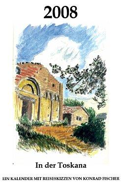
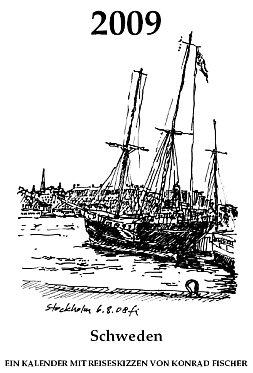
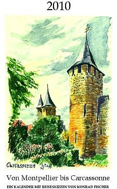
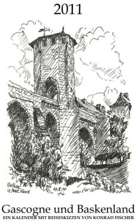
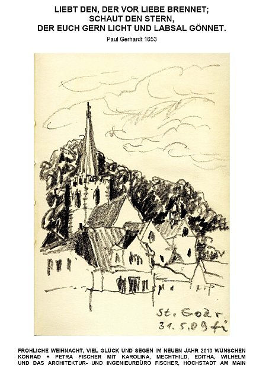
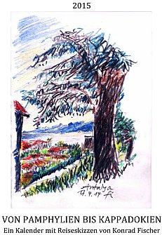

# Magst Du Architektenskizzen, Zeichungen oder Aquarelle von Kirchen, Tempeln, Moscheen, Burgen, Ruinen und Schlössern, Menschen, Bauernhäusern, Bürgerhäsern, Baudenkmälern, antiken Trümmern, Brücken, Toren, Städten, Wolken, Gebirgen, Flüssen, Meeren und Landschaften?

## Dann bist Du hier richtig! FÜR DICH / FOR YOU - Mein Geschenk / My Present:

 

## Ein 4MB PDF-Download-Wand-Kalender / Calendar 2008 - In der Toskana / Tuscany

## mit meinen Reiseskizzen aus Italien 2007 / 
with my travel drawings / water color paintings from Italy 2008 

Titelbild: Pomerance/San Dalmazio/Sillano: Pieve di San Giovanni Battista, Motive aus: 

Montecastelli, Livorno, Volterra, 
Pomarance-San Dalmazio, Pisa, Siena, 
Castello di Sonnino, Florenz.

### Download: Drück das Titelblatt / Press the title!

#  
Ein 4MB PDF-Download-Kalender / Calendar 2009 - Schweden

## mit meinen Reiseskizzen aus Schweden 2008 / 
with my travel drawings from Sweden 2008 

Titelbild: Segelschiff im Hafen in Stockholm, Motive aus: 

Stockholm, Komosse, 
Drottningholm, Göteborg, 
Danderyd, Ekehagen, 
Lidingö

### Download: Drück das Titelblatt / Press the title!

  

# Ein 4MB PDF-Download-Kalender / Calendar 2010 - Von Montpellier bis Carcassonne

## mit meinen Bleistiftzeichnungen / Tuschezeichnungen / Handzeichnungen / Reiseskizzen / Aquarellen aus Frankreich 2009 / with my travel drawings from France 2009 

Titelbild: Carcassonne Stadtbefestigung, Motive aus: 

Carcassonne, Hameau de Conas, Ste-Eulalie-de-Cernon, 
Villerouge-Termenès, Lagrasse, La Couvertoirade, 
Narbonne, St-Jean-d'Alcas, Montpellier, St-Martin-de-Graves

### Download: Drück das Titelblatt / Press the title!

 

# Ein 4,7MB PDF-Download-Kalender / Calendar 2011 - Gascogne und Baskenland

## mit meinen Bleistiftzeichnungen / Tuschezeichnungen / Handzeichnungen / Reiseskizzen aus Frankreich 2010 / with my travel drawings from France 2010 

Titelbild: Orthez Brücke, Motive aus: 

Orthez, Sainte-Marie-de-Gosse, Bayonne, 
Escos les Bordes, Peyrehorade, L'-Hôpital-St-Blaise, 
Oloron-Sainte-Marie, Sorde L'Abbaye, Sauveterre-de-Béarn.

### Download: Drück das Titelblatt / Press the title!

## Jahresgruß 2010

St. Goar - Ansicht vom Rhein (während Rheinkreuzfahrt vom Schiff gezeichnet) 

 

  

# Ein 2,7MB PDF-Download-Kalender / Calendar 2015 - Von Pamphylien nach Kappadokien

## mit meinen Bleistiftzeichnungen / Buntstiftzeichnungen / Tuschezeichnungen / Handzeichnungen / Aquarellen / Reiseskizzen aus der Türkei 2014 / with my travel drawings from Turkey 2014 - und dem Weihnachtsgruß /Greetings 2015 

Titelbild: Antalya, Motive aus: 

Perge, Mustafapasa (Sinasos), Ortahisar 
Ürgüp, Manavgat, Konya, Saratli Kirgöz 
Uchisar, Öresin Han, Hasan Dagi, Pasabag, 
sowie dem Grußmotiv aus Sainte-Maximin-la-Sainte-Baume - Ste-Marie-Madeleine de Saint-Maximin-la-Sainte-Baume.

### Download: Drück das Titelblatt / Press the title!

## Zugabe:

"Jauchzet, frohlocket" aus dem Weihnachtsoratorium von Joh. Seb. Bach (im Cello: Konrad Fischer) und mein Video-Rundgang in der Thomaskirche Leipzig: 

