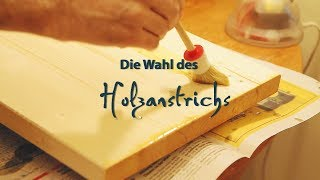
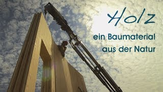
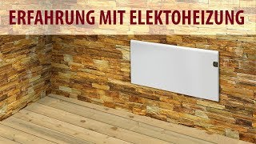
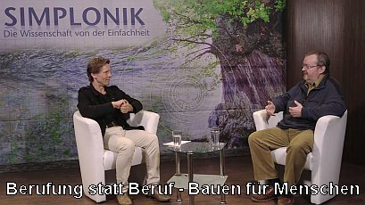
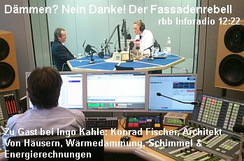
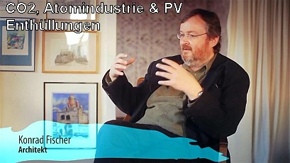
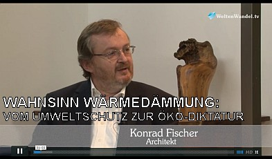
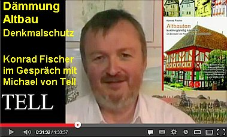
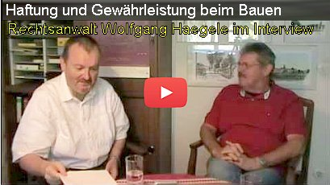
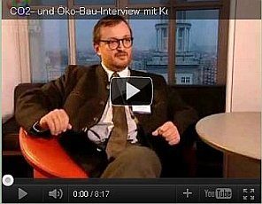

[🠔 Zur Übersicht: Startseite](index.md)
# Video Gespräche und Dokus mit Konrad Fischer
**Denkmalpflege, Energie sparen und Richtiges Bauen: Gespräche, Interviews und Dokumentationen.**   
_mit Konrad Fischer_

> [!abstract]+ Kapitelübersicht: Gespräche & Dokus
> 1. **Gespräche & Dokus mit Konrad Fischer**
> 2. [Natürlicher Holzanstrich - Was sind die Gründe](g1-holzanstrich.md)
> 3. [Holzwissen - Eigenschaften und Anwendungen](g2-holzwissen.md)
> 4. [Elektroheizung - Erfahrung](g3-elektroheizung.md)
> 5. [Einfach und Richtig Heizen und Energiesparen](g4-einfach-heizen.md)
> 6. [Aus der Baugeschichte Lernen – Kalkbauweise](g5-kalkbauweise.md)
> 7. [Bauen mit Lehm - Doku](g6-lehm.md)
> 8. [Wärmedämmung - nützlich oder gefährlich](g7-daemmung-gefaehrlich.md)
> 9. [CO2, Atomindustrie und Photovoltaik - Enthüllungen](g8-co2-photovoltaik.md)
> 10. [Geht uns das Erdöl aus? Enthüllungen](g9-erdoel-enthuellungen.md)
> 11. [Simplonik Interview: Berufung statt Beruf – Bauen für Menschen](g10-simplonik-interview.md)
> 12. [rbb Inforadio: Der Fassaden-Rebell – Ein Update](g11-rbb-fassadenrebell-update.md)
> 13. [rbb Inforadio: Dämmen, nein Danke! Der Fassadenrebell](g12-rbb-daemmen-nein.md)
> 14. [Klimaschutz als Selbstmordattentat? Gespräch mit Dr. Wolfgang Thüne](g13-klimaschutz-gespraech.md)
> 15. [WeltenWandel.TV – Wahnsinn Wärmedämmung](g14-oekodiktatur.md)
> 16. [Gebäudedämmung Altbau Denkmalschutz](g15-altbau-denkmalschutz.md)
> 17. [Haftung und Gewährleistung beim Bauen](g16-haftung-bauen.md)
> 18. [Richtig und falsch heizen](g17-richtig-heizen.md)
> 19. [CO2- und Öko-Bau-Interview mit Konrad Fischer](g18-interview-konrad-fischer.md)

 🗓️ 2018
### Natürlicher Holzanstrich - Was sind die Gründe

- **Thema:** Übersicht über unterschiedliche Methoden der Holzpflege • **[🗎 Transkript lesen](g1-holzanstrich.md)**
- **Sprecher:** Konrad Fischer • **Datum:** 11.05.2018

### Holzwissen - Eigenschaften und Anwendungen

- **Thema:** In diesem Dokumentationsbeitrag gehen Konrad Fischer und Hans-Georg Unterrainer darauf ein, welche Vorteile es gibt mit Holz zu bauen • **[🗎 Transkript lesen](g2-holzwissen.md)**
- **Sprecher:** Konrad Fischer, Hans Georg Unterrainer • **Datum:** 14.02.2018

### Elektroheizung - Erfahrung

- **Thema:** Übersicht und Vorteile unterschiedlicher Elektroheizungen • **[🗎 Transkript lesen](g3-elektroheizung.md)**
- **Sprecher:** Konrad Fischer • **Datum:** 08.05.2018

### Einfach und Richtig Heizen und Energiesparen

- **Thema:** Ein Zwiegespräch zu Fragen, Problemen und Lösungen zum Heizen, Energiesparen, Sanieren und Bauen • **[🗎 Transkript lesen](g4-einfach-heizen.md)**
- **Sprecher:** Konrad Fischer, Volker Burghardt • **Datum:** 18.01.2018

### Bauen mit Lehm - Doku

- **Thema:** In dieser Dokumentation teilen Konrad Fischer, Hans Georg Unterrainer und Franz Luderscher ihr Wissen und ihre Erfahrung auf dem Gebiet Lehmbau • **[🗎 Transkript lesen](g6-lehm.md)**
- **Sprecher:** Konrad Fischer, Hans Georg Unterrainer • **Datum:** 12.02.2016

---

 🗓️ 2016
### Aus der Baugeschichte Lernen – Kalkbauweise

- **Thema:** Konrad Fischer über die Baugeschichte • **[🗎 Transkript lesen](g5-kalkbauweise.md)**
- **Sprecher:** Konrad Fischer • **Datum:** 16.03.2016

### Simplonik Interview: Berufung statt Beruf – Bauen für Menschen

- **Thema:** Konrad Fischer ist ein Architekt, der sich für die Wiederbelebung traditioneller baulicher Fertigkeiten und eine menschliche, nachhaltige Architektur einsetzt. • **[🗎 Transkript lesen](g10-simplonik-interview.md)**
- **Sprecher:** Ulrich Mohr (Moderator), Konrad Fischer • **Datum:** 18.05.2016

### rbb Inforadio Zwölfzweiundzwanzig: Der Fassaden-Rebell – Ein Update

- **Thema:** Warum das Dämmen von Häusern unwirtschaftlich und der ökologische Nutzen zweifelhaft ist • **[🗎 Transkript lesen](g11-rbb-fassadenrebell-update.md)**
- **Sprecher:** Ingo Kahle (Moderator), Konrad Fischer • **Datum:** 06.05.2016

### rbb Inforadio 12.07.14 Dämmen, nein Danke! Der Fassadenrebell

- **Thema:** Dämmen, nein Danke! Der Fassadenrebell Von Häusern, Wärmedämmung, Schimmel und Energierechnungen • **[🗎 Transkript lesen](g12-rbb-daemmen-nein.md)**
- **Sprecher:** Ingo Kahle (Moderator), Konrad Fischer • **Datum:** 10.11.2016

---

 🗓️ 2015
### CO2, Atomindustrie und Photovoltaik - Enthüllungen

- **Thema:** Der Achitekt Konrad Fischer erzählt uns die Hintergründe, was das CO2, globale Erwärmung, Treibhauseffekt, ATOMindustrie und neue Energiegewinnung wie Windrad und Photovoltaik angeht • **[🗎 Transkript lesen](g8-co2-photovoltaik.md)**
- **Sprecher:** Konrad Fischer • **Datum:** 21.03.2015

### Geht uns das Erdöl aus? Enthüllungen

- **Thema:** Der Achitekt Konrad Fischer erzählt uns die Hintergründe, was das Öl Geheimnis angeht • **[🗎 Transkript lesen](g9-erdoel-enthuellungen.md)**
- **Sprecher:** Konrad Fischer • **Datum:** 20.03.2015

### Wärmedämmung - nützlich oder gefährlich?

- **Thema:** In diesem Beitrag gehen Konrad Fischer und Hans Georg Unterrainer darauf ein, warum Wärmedämmung und die empfohlenen Normen nur kurzfristig gedacht sind und im Endeffekt ihrem Haus, Ihrem Geldbeutel und der Natur einen Schaden hinzufügen werden. • **[🗎 Transkript lesen](g7-daemmung-gefaehrlich.md)**
- **Sprecher:** Konrad Fischer, Hans Georg Unterrainer • **Datum:** 17.09.2015

### Klimaschutz als Selbstmordattentat? Gespräch mit Dr. Wolfgang Thüne

- **Thema:** Von der Wettervorhersage zum Klimaschwindel Konrad Fischer im Gespräch mit dem Diplommeteorologen Dr. Wolfgang Thüne, Ministerialrat a.D. am Umweltministerium Rheinland-Pfalz. • **[🗎 Transkript lesen](g13-klimaschutz-gespraech.md)**
- **Sprecher:** Konrad Fischer, Dr. Wolfgang Thüne, Meteorologe • **Datum:** 15.12.2015

---

 🗓️ 2014
### WeltenWandel.TV – Wahnsinn Wärmedämmung

- **Thema:** Vom Umweltschutz zur Ökodiktur • **[🗎 Transkript lesen](g14-oekodiktatur.md)**
- **Sprecher:** Udo Schulze, Konrad Fischer • **Datum:** 20.02.2014

---

 🗓️ 2013
### Gebäudedämmung Altbau Denkmalschutz

- **Thema:** Konrad Fischer ist Architekt und ist besonders auf den Bereich Gebäudesanierung, Denkmalschutz, Energieeffizienz und Dämmung spezialisiert • **[🗎 Transkript lesen](g15-altbau-denkmalschutz.md)**
- **Sprecher:** Konrad Fischer, Michel von Tell • **Datum:** 08.06.2013

### Haftung und Gewährleistung beim Bauen

- **Thema:** Haftung & Gewährleistung beim Bauen • **[🗎 Transkript lesen](g16-haftung-bauen.md)**
- **Sprecher:** Wolfgang Haegele (Rechtsanwalt), Konrad Fischer (Architekt) • **Datum:** 19.08.2013

### Richtig und falsch heizen

- **Thema:** Worauf es wirklich ankommt, um Heizenergie zu sparen • **[🗎 Transkript lesen](g17-richtig-heizen.md)**
- **Sprecher:** Konrad Fischer, Dirk-Uwe Träger • **Datum:** 14.07.2013

---

 🗓️ 2010
### CO2- und Öko-Bau-Interview mit Konrad Fischer

- **Thema:** Die Klimaschutzidee basiert auf falschen Annahmen, und die Dämmstofftheorie auf einer falschen Bauphysik, die wirtschaftliche und gesundheitliche Folgen hat. • **[🗎 Transkript lesen](g18-interview-konrad-fischer.md)**
- **Sprecher:** Konrad Fischer • **Datum:** 29.05.2010
