

## In memoriam

Mein Mann ist im Oktober 2018 einem Krebsleiden erlegen. Daher möchte ich als seine Rechtsnachfolgerin die Erinnerung an sein profundes Wissen in Bezug auf Baustoffe, Heiztechnik, strukturierte Bauplanung von Denkmälern und vielem anderen erhalten. 
Er hat sich stets für eine gesunde, ökonomische, klimaverträgliche Bauweise eingesetzt und wurde für viele Bauherren zur Rettung. 
Die Homepage dient ausschließlich Informationszwecken, ohne Gewähr. 
Architektenleistungen, wie Bauberatungen, können nicht mehr erbracht werden. 
Möge die Homepage noch für viele Menschen zum Segen werden!

---

# :Altbau und Denkmalpflege Informationen:

Das Architektur-Magazin für alle Bauherren 
Seit 1998 
_Besser sanieren - Weil es IHR Haus ist!_ 

>> **[S T A R T](start.md)** << 

>> [Bauberatung](2berat.md) fette 180 € / Stunde oder nur 1.000e lässig in den Sand setzen? << 
>> [Umsonstberatung? / Kurzberatung?](bauberatung.md) - Fragen & Antworten << 
>> [Inhalt / Content / Sitemap / Suchen / Search](1suchen.md) - [Seminare/Vorträge](12akt.md) << 
>> [Impressum / Masthead / Kontakt / Contact](start.md#imp) - [Gästebuch / Guestbook](gaestebuch.md) << 
>> **[Datenschutzerklärung](datenschutz.md)** << 

 **_"Man soll bauen, als wollt man ewig leben, 
und also leben, als sollt man morgen sterben."_ (Dr. Martin Luther)** 

## Ja, wen haben wir denn da? Ein fröhliches Grüß Gott & Gratulation!

  **IHR** langes Suchen nach dem Planungsvolltreffer, dem besten und endlich **IHREM** untrüglichen Bauchgefühl voll entsprechenden Angebot, der ausnahmsweise mal funktionierenden und trotzdem gesunden Lösung für **IHR** Bauproblem(chen) im Alt- oder Neubau als Ausweg aus dem Allerweltsgewurstel hat **SIE** endlich & zuguterletzt hierher geführt. Wie schön und welche Ehre, daß ich nun genau **SIE** hier herzlich begrüßen darf, in diesem international einmaligen & garantiert webdesignerfreien Infodschungel 
- zur rundum gelungenen Altbausanierung oder Neubauvorhaben ohne Kostenkatastrophen, ohne Sick-Building-Syndrom, krankmachende Baustoffe und Baumethoden und auch ohne den Schadstoff-Cocktail "moderner" und bauchemisch "optimierter" Industriebaustoffe, dafür mit Wohn-Gesundheit dank traditionell bewährter Baumethoden und Baustoffe ohne die vorschrift- & umsatzverliebten Sklaven des [Produzentenclubs namens DIN e.V.](2mbu.md), 
- zur sparsamen Reparatur ohne böse Folgen und ohne erhöhte Schadstoffbelastung, 
- zu Renovierung & Hauskauf ohne Übervorteilung, 
- zur harmonischen & nicht entsetzlichen Denkmalpflege & 
- zum lohnenswerten, vielleicht sogar bezuschußten & 
- nicht Zwangs-Denkmalschutz, 
- zur Restaurierung ohne Restauratorenschund, 
- zu Umbau & Instandsetzung & energetischer Sanierung & Neubau - nicht "Penny wise & Pound foolish", sondern mit gutem Ergebnis, mit/ohne Architekten- & Ingenieurplanung, aber ohne die [herstellerkorrumpierte Hintenrumplanung "oder gleichwertig"](10hoai22.md#ausschreibungsschwindel), 
- zur auf **IHRE** Wünsche & Möglichkeiten zugeschnittenen Low-Tech-Niedrig-Budget-Modernisierung & sinnvollen Sanierung oder Neubau anstelle Teuer-Bau nach allen Fakenormen, 
- zur Überwindung der falschen Energiespar- & U-Wert-Theorie & 
- zur Befreiung von der ges. gesch. Klimaschutz-Abzocke der Öko-Parasiten mit [Rundum-Komplettmodernisierung von Fassade, Wand, Boden, Fenster, Heizung & Dach](7wdvs18.md), von der Schimmelpilz garantierenden Pott-Dicht-Plastiktüten-Haus-Isolierung & schadstoffbelasteten Wärmedämmung auf Ihre Kosten & zum Nachteil Ihres Geldbeutels & der Gesundheit Ihrer Lieben, vom glattgestriegelten Mainstream-Gegurke der ehrlosen Baufrauen-/herren-Betrüger zum großartigen Hausabenteuer nach alter Väter Sitte, mit vorhersehbar anständigem Ergebnis - also: 
Ohne Baupfusch & Energiesparschwindel, ohne Versklavung unter den Klimaschutzterror, dafür ein gut funktionierendes Haus - weil **SIE** es sich & mir (und - bitte nicht zu arg ärschröcken! - vielleicht auch dem lieben Gott) wirklich wert sind! 

Ich freue mich auf **IHRE** Neugier und ertrage dafür allerlei Unbill seitens warum auch immer Andersmeinender - die **SIE** sicher überall online finden können - in Kauf. Genau und nur für **SIE** habe ich nämlich all' meine knappe Freizeit und all' meine überbordende Schreiblust und den allerletzten mir nach vielen beruflichen und menschlichen Widrigkeiten verbliebenen Rest meines schrägen Humors zusammengesucht und diese Seiten bis zum Überborden vollgestopft mit deftigem Spaß und provokanten Informationen, die mir allzugerne im Munde herumgedreht werden, die **SIE** aber woanders noch länger oder gar vergeblich suchen können. Mit thematisch passenden Literaturlinks und von Google bereitgesteller Firmenreklame - meist als dialektischer und oft abenteuerlicher Kontrapunkt zu meiner Position. Warum? Nein, nicht nur wegen der paar Krötchen, die mir freilich von meinen liebestollsten Freunden arg geneidet werden. Sondern auch, weil **SIE** schon selbst entscheiden können, dürfen und müssen, was dem Büdli wirklich guttut - Hü vs. Hott. Alles frisch & fromm, fröhlich & frei, fränkisch & frech nach unserem Franken-Motto: A bißla Spaß muß sei, sünst gät kanner mid auf die Leich ... ;-) 

Und jetzt stellen wir uns spaßeshalber als abseitige Denkfigur vor, es machte "Klick" und **IHR** Bauproblem wäre gelöst. Gibt's net? Stimmt vielleicht. Doch was, wenn nach all dem schrecklichen und teuren Gebaue alles noch schlimmer wird? Trotz Schmutz, Lärm & Geldsack leer das Kind in den Brunnen fällt? Das gibt's. Obwohl vermeidbar. Und genau darum geht es hier: Irgendwo reinklicken & nie mehr rauskommen ... 

### Top-Themen

[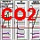](23bau02.md#co2) [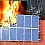](7temp23.md#solarbrand) [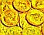](11erhins.md)   [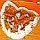](29bau19.md)    
[Schulmief?](23bau02.md#co2) [Solarbrand?](7temp23.md#solarbrand) [Dämmythen?](7wdvs05.md#mythen) [Sparbau?](11erhins.md) [Dämmung?](213baust.md) [Feuchtwand?](2aufstfe.md) [Schwamm?](29bau19.md) [Heizung?](7temper.md) [Isofenster?](23bausto.md) [Schimmelpilz?](7schim.md) [Atompilz?](7thu67.md) [Strahlenpanik?](7boet4.md) 
[Putzschwindel](2sanipuz.md) - [Baufinanzierung?](5wiber.md) - [Baukostenexplosion - warum?](10hoai22.md#ausschreibungsschwindel) - [Baustoffgeheimnisse](2baustof.md) - [Feurio!](6brand.md) - [EnEV-EEWärmeG-Befreiung!](21311bau.md) - [Fragen?](2berat.md) 
[EnEV/EEWärmeG/EEG/Energiepaß/Heizkostenverordnung - Eine kleine Geschichte der ges. gesch. Ökoabzocke auf Ihre Kosten](7wdvs02.md) 
[Dacheinstürze](212bau2.md) - Die Skandalchronik [ 3MB-WMV-Clip:](mtvclip1.wmv) K. Fischer im TV-Talk Dacheinstürze 
**Special Service:** [Illusion Baubiologie + Ökologisches Bauen](oekobau.md): Im GRÜNEN Verrotten? +++ [Die **S** ausanierung](altbau.md): Das Letzte Aber teuer! 
[EnergieKeinsparung im Altbau 150 % - Aber sicher!](energie.md) Wie Klimaschutz wirklich gelingt. +++ [Das Energiespar-**W U N D E R**](2137bau.md#wunder)! 
[EnEV-Kontra](enev.md) - Pressemitteilungen + Vergebliche Petitionen 

 _"Er verkörpert (...) das überzeugende zeitgenössische Beispiel eines couragierten Bürgers, der sich gemeinsam mit anderen und ohne Rücksicht auf persönliche Nachteile für das Recht auf ungehinderte Berichterstattung, freie Meinungsäußerung, individuelle Freiheit und die notwendige Kontrolle staatlicher Macht einsetzt."_ 
[Geschwister-Scholl-Preis-Jury zur Preisverleihung 2014 an den US-Journalisten Glenn Greenwald] 

### RADIO/TV mit/über/unterstützt von Konrad Fischer:

16.11.15 NDR: [45 Minuten: Die Wärmedämmerung](http://www.ndr.de/fernsehen/sendungen/45_min/Die-Waermedaemmerung,sendung443002.html) 
23.04.13 RAI Sender Bozen: [Pro & Contra: Das Klimahaus - Erfolgsmodell oder Geldverschwendung und Gefahr für die Gesundheit?](http://www.youtube.com/watch?v=iloOUWlGKDA) 
 [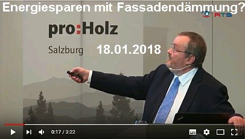](https://youtu.be/DGEnJeXNvq8) 
[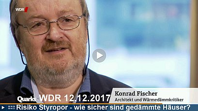](https://youtu.be/mfR7WQSbu7E) [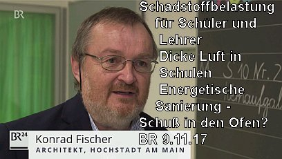](https://www.br.de/nachrichten/dicke-luft-in-schulen-100.html) 
 [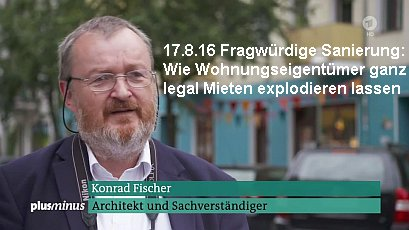](http://dai.ly/k2bDhN8iV5Lsdzov1r7) 
[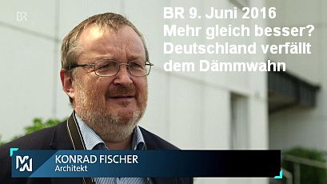](http://dai.ly/k72QhmcIOYSgHKov0Qt)  
  
[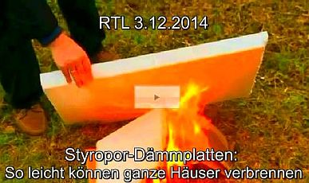](https://youtu.be/KAlKUtr-kT0) [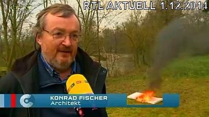](http://dai.ly/k51Fu5KpQqPZjIksa5Y) 
[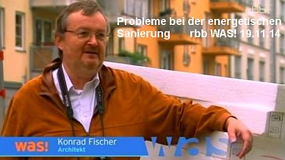](http://www.dailymotion.com/video/x3n9pof_was-probleme-bei-der-energetischen-sanierung-was-20141119-daemmung-m-16-9-512x288_tech) [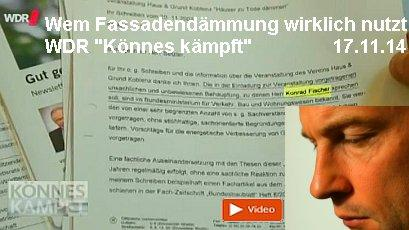](https://youtu.be/upuql7b0UjY) 
 [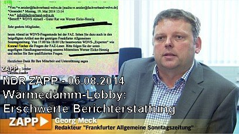](http://www.dailymotion.com/video/k29JtPrOzEGpF3eV84K) 
  
WeltenWandel.tv 20.1.2014: Udo Schulze interviewt Konrad Fischer: [Ökologischer Wahnsinn beim Bauen](http://www.weltenwandel.tv/video/oekologischer-wahnsinn-beim-bauen/) 

  
  
  
  
21.3.2012 - BR 1 Radio: [Klinikum in Lichtenfels - "Keine besonders grüne Bauweise](greenhospital.mp3)" - mit Interview Konrad Fischer 
[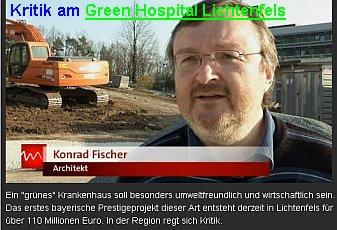](https://youtu.be/w5IreXynzXg)  
  
NDR-Trailer "Gefährliches WDVS" & "Wärmebild-Schwindel"- mit Konrad Fischer: 
[NDR "Dämmen oder nicht Dämmen?"](http://web.archive.org/web/20140210100111/http://www.ndr.de/fernsehen/sendungen/45_min/hintergrund/waermedaemmung121.html) - Kritische Worte vom Feinsten 
[NDR-Ratgeber "Wärme Fehlanzeige: Schäden an isolierten Wänden"](https://web.archive.org/web/20140210101142/http://www.ndr.de/ratgeber/verbraucher/haushalt_wohnen/waermedaemmung163_p-15.html) - Dämmaufklärung total 
  
  

## Konrad Fischer in Print- & Online-Medien

14.09.18: Süddeutsche Zeitung: [Jutta Czeguhn: ?Gordischer Knoten? - Runder Tisch im Rathaus Pasing zum russ.-orth. Hiobskloster in Obermenzing](https://www.sueddeutsche.de/muenchen/obermenzing-gordischer-knoten-1.4128550) 
29.1.18: ORF: [Architektenkritik an Kunststoffdämmungen](http://salzburg.orf.at/news/stories/2892334/) 
22.11.17: Eigentümlich frei ef: [Michael Limburg: "Internationale Klima- und Energiekonferenz in Düsseldorf - Erfolgreich trotz Ignoranz der Mainstream-Medien - Ein Kurzbericht"](http://ef-magazin.de/2017/11/22/11874-internationale-klima--und-energiekonferenz-in-duesseldorf-erfolgreich-trotz-ignoranz-der-mainstream-medien) 
15.11.17: Bietigheimer Zeitung: [Andreas Lukesch: ?Klimaretter Dämmung: Sinn oder Unsinn??](http://www.swp.de/bietigheim/lokales/landkreis_ludwigsburg/klimaretter-daemmung_-sinn-oder-unsinn_-24083814.html) 
24.6.17: Luxemburger Wort: [Jochen Zenthöfer: ?Schluss mit dieser Fassadendämmung?](../medien/wort.pdf) 
13.6.17: Neue Presse Coburg: [Kampf gegen den Dämmwahn](https://www.np-coburg.de/region/coburg/Kampf-gegen-den-Daemmwahn;art83420,5569111) 
19.12.16: Rhätische Zeitung: [Fördergelder: Mit Speck fängt man Mäuse](http://www.xn--rhtische-zeitung-wnb.ch/foerdergelder-mit-speck-faengt-man-maeuse/) 
31.10.16: Rhein-Neckar-Zeitung RNZ: [Infoabend zur gelungenen Sanierung des "Prinz Carl" in Buchen](http://www.rnz.de/nachrichten/buchen_artikel,-Buchen-Infoabend-zur-Sanierung-des-Prinz-Carl-_arid,231783.html) - Grundlage: Baugutachten von Konrad Fischer 
19.10.16: Fränkischer Tag: [Günter Flegel: Kalt erwischt! Styropor wird Sondermüll: So muss jetzt entsorgt werden](https://www.infranken.de/regional/bamberg/Kalt-erwischt;art212,2263538,C) 
27.7.16: ef-magazin.de - Eigentümlich frei: [Klaus Peter Krause: Die vier Pferdefüße des politischen Dämmungswahns](http://ef-magazin.de/2016/07/26/9491-energiepolitik-die-vier-pferdefuesse-des-politischen-daemmungswahns) 
11.4.16: Tagesspiegel: [Energetische Sanierung in Pankow - Glaubenskrieg ums Dämmen](http://www.tagesspiegel.de/berlin/bezirke/pankow/energetische-sanierung-in-pankow-glaubenskrieg-ums-daemmen/13416008.html) 
8.4.16: Pankower Allgemeine Zeitung: [Provokation & Dialektik zur Wärmedämmung](http://www.pankower-allgemeine-zeitung.de/2016/04/08/provokation-dialektik-zur-waermedaemmung/) 
5.1.16: Achgut.com - Die Achse des Guten: [Dirk Maxeiner: Abteilung Physik und Glaube: Das UBA-Öko-Musterdomizil ist ein Flop](../medien/achsecache.pdf) (später - achschlecht - wegen meiner Iranreise redaktionell zensiert) 
12.15: e|m|w Energie.Markt.Wettbewerb: [Ist die Dämmung von Wohngebäuden sinnvoll?](../medien/emw_12_2.pdf) GF Dr. Hartmut Schönell, Industrieverband Hartschaum e.V., Heidelberg vs. Konrad Fischer, Hochstadt am Main 
12.11.15: DIE WELT: [Richard Haimann: Wie viel Energie sparen Passivhäuser wirklich?](http://www.welt.de/finanzen/immobilien/article148755808/Wie-viel-Energie-sparen-Passivhaeuser-wirklich.html) 
8.8.15: IKZ Haustechnik: [Trägt die EnEV zum Klimaschutz bei?](http://www.ikz.de/nc/news/article/traegt-die-enev-2014-zum-klimaschutz-bei-0055587.html) GF Marianne Tritz, Gesamtverband Dämmstoffindustrie GDI, Berlin vs. Konrad Fischer, Hochstadt am Main 
18.5.15: DIE RHEINPFALZ: [Beim Dämmen sehen viele Deutsche rot](RP150518.JPG) - Der Widerstand gegen das Isolieren von Altbauten zeigt: Hier ist etwas gewaltig schiefgelaufen 
18.3.15: Wildunger Zeitung: [Wie geht's weiter mit dem Hausschwamm?](../medien/wildzeit.pdf) 
12.12.14: Kiezblatt: [Energische Volksverdämmung](http://www.kiezblatt.de/eine-fachmeinung-zur-daemmung/) 
5.12.14: Telepolis: [Bernhard Wiens: Langsam dämmert es den Dämmern](http://www.heise.de/tp/artikel/43/43518/1.html) 
2.12.14: Fränkischer Tag/Coburger Tageblatt/Bayerische Rundschau/Saale Zeitung/Die Kitzinger: [Verdämmt in alle Ewigkeit? Energiesparen, aber richtig](https://www.infranken.de/ueberregional/wirtschaft/Verdaemmt-in-alle-Ewigkeit-Energiesparen-aber-richtig;art184,883446) 
1.12.14: Kopp online: [Gerhard Wisnewski: Willkommen in der seltsamen Welt von Barbara Hendricks](http://info.kopp-verlag.de/hintergruende/deutschland/gerhard-wisnewski/stromspar-porno-willkommen-in-der-seltsamen-welt-von-barbara-hendricks.html) 
13.11.14: Märkische Oderzeitung MOZ: [Schimmel und sonstige unerwünschte Biotope - Fünf Fragen an: Konrad Fischer, Architekt und Dämmungskritiker](../medien/141113.pdf) 
7.11.14: Junge Freiheit: [So lügt die Wärmedämmungslobby](../medien/141107.pdf) 
2.9.14: LUX Intelligente Energie, Beilage Süddeutsche Zeitung SZ: [Die Dämmdebatte](../medien/lux.pdf) 
30.5.14: Obermain-Tagblatt Lichtenfels: [Sparen, schimmeln, qualmen: Der WDR fährt für ?Könnes kämpft? nach Lichtenfels ? Spart Wärmedämmung wie versprochen?](http://www.obermain.de/lokal/lichtenfels/art2414,178163) 
15.5.14: Frankfurter Allgemeine Zeitung F.A.Z. Liveblog: [FAZ-Lesertelefon: "Wer hilft gegen den Dämmwahn?"](http://www.faz.net/aktuell/wirtschaft/liveblog-wer-hilft-gegen-den-daemmwahn-12941421.html) 
11.5.14: Frankfurter Allgemeine Sonntagszeitung F.A.S.: ["Stoppt den Dämmwahn!"](http://www.faz.net/aktuell/finanzen/meine-finanzen/mieten-und-wohnen/daemmung-ist-oekologisch-zweifelhaft-und-teuer-12933587.html) 
1.3.14: Coburger 06 - Das Magazin: [Wolfgang Neustadt/Wolfram Hegen: Die Dämmlüge - Belogen und betrogen](https://issuu.com/peinheuser/docs/coburger_06_dummy_version_11/34) 
15.2.14: Westdeutsche Allgemeine Zeitung WAZ: ["Fensterprobleme - Schüler und Lehrer schnell müde"](http://www.derwesten.de/staedte/nachrichten-aus-olpe-wenden-und-drolshagen/schueler-und-lehrer-schnell-muede-aimp-id8997984.html) 
25.1.14: Frankfurter Allgemeine Zeitung F.A.Z.: ["Styropor im Wandel der Zeit: Aufgeschäumt und angebrannt"](https://web.archive.org/web/20140301010650/http://www.faz.net:80/aktuell/wirtschaft/menschen-wirtschaft/styropor-im-wandel-der-zeit-aufgeschaeumt-und-angebrannt-12766148.html) 
18.10.13: Augsburger Allgemeine: [MZ-INTERVIEW ?Energetische Sanierung rechnet sich nie?](http://www.augsburger-allgemeine.de/mindelheim/Energetische-Sanierung-rechnet-sich-nie-id27420702.html) 
9.9.13: Preußische Allgemeine Zeitung: [Deutschland im Dämmwahn](http://www.preussische-allgemeine.de/nachrichten/artikel/deutschland-im-daemmwahn.html) 
22.8.13: Wirtschaftswoche: [Energetische Sanierung - So tappen Sie nicht in die Dämmfalle](http://www.wiwo.de/finanzen/immobilien/energetische-sanierung-so-tappen-sie-nicht-in-die-daemmfalle-seite-all/8673916-all.html) 
8.13: Heimwerker.de: [Energieeffizienz in Gebäuden - von Jürgen Pöschk (Hrsg)](http://www.heimwerker.de/haus/heizung-energie-solarstrom/energie-sparen/energieeffizienz-in-gebaeuden.html) 
6.13: Das Grundstück - Journal des VDGN: [Die Sparversprechen und die herbe Wirklichkeit - zur Replik von Dr. Sawatzky](http://www.vdgn.de/vdgn-journal/2013/vdgn-journal-56-2013/beitrag/die-sparversprechen-und-die-herbe-wirklichkeit/) 
1.6.13: Deutsches Architektenblatt: [Dämmungslos, hemmungslos](http://dabonline.de/2013/06/01/dammungslos-hemmungslos-konrad-fischer/) - Retourkutsche auf meine [Dämmkritik im DAB 2013/1](http://dabonline.de/2013/01/01/„bewahrte-produkte-aber-kein-allheilmittel-waermedaemmung-fassade/)? 
18.5.13: Neue Presse Coburg: [Deponie Schwürbitz: Giftgrab unter Frühlingsgrün](http://www.np-coburg.de/regional/franken/schauplatzregionnp/Giftgrab-unter-Fruehlingsgruen;art83463,2573290) 
9.5.13: General-Anzeiger Bonn: [Steine fallen vom Turm der Christkönig-Kirche](http://www.general-anzeiger-bonn.de/bonn/bonn/nordstadt/Steine-fallen-vom-Turm-article1047886.html) 
9.5.13: Wirtschaftswoche: [Teuer und gefährlich: Fassadendämmung wird zum Brandbeschleuniger](http://www.wiwo.de/finanzen/immobilien/teuer-und-gefaehrlich-fassadendaemmung-wird-zum-brandbeschleuniger-seite-all/8182494-all.html) 
5.5.13: Bamberger Online Zeitung: [Ich dämme, also bin ich - Widerstand gegen die staatl. Dämmpolitik wächst](http://www.bamberger-onlinezeitung.de/2013/05/05/ich-damme-also-bin-ich-der-widerstand-gegen-die-staatliche-dammpolitik-wachst/) 
5.13: SeProN Infoserie: [Wärmedämmung lohnt sich?](https://web.archive.org/web/20150221060813/http://unternehmensgestaltung.sepron.info/fileadmin/data/dokumente/13_05_Waermedaemmung_lohnt_sich_01.pdf) 
15.4.13: Format: [Die Dämm-Lüge](https://web.archive.org/web/20130420075133/http://www.format.at/articles/1315/525/356514/die-daemm-luege) 
8.4.13: Die Neue Südtiroler Tageszeitung: [Klimahaus-Lantschner vs. Klimahauskritiker Fischer](https://web.archive.org/web/20150213014159/http://www.tageszeitung.it/2013/04/08/lantschner-vs-fischer/) 
6.4.13: Salto-Umwelt: [Pauschalurteil in der Skandalpresse - Zur Komplexität der Gebäudesanierung.](http://www.salto.bz/de/article/06042013/pauschalurteil-der-skandalpresse) 
5.4.13: Salto-Umwelt: [SOSTENIBILITÀ - Klimahaus sotto accusa!](http://www.salto.bz/de/article/05042013/klimahaus-sotto-accusa) 
5.4.13: Südtirolnews: [Landesverband der Handwerker LVH: (Klimahaus-)Qualität kann (von Konrad Fischer) nicht als Wahn bezeichnet werden!](https://web.archive.org/web/20140314022025/http://www.suedtirolnews.it/d/artikel/2013/04/05/lvh-qualitaet-kann-nicht-als-wahn-bezeichnet-werden.html) 
5.4.13: Die Neue Südtiroler Tageszeitung: [Die Klimahaus-Bombe - Klimahäuser machen krank!](http://web.archive.org/web/20151027112957/http://www.tageszeitung.it/2013/04/08/klimahauser-machen-krank/) 
30.3.13: DIE WELT: [Die große Lüge von der Wärmedämmung - KfW-/Prognos-Studie entlarvt: Dämmung lohnt sich nicht!](http://www.welt.de/finanzen/immobilien/article114866146/Die-grosse-Luege-von-der-Waermedaemmung.html) 
19.2.13: Süddeutsche Zeitung: [Riskante Rechnung: Energetische Sanierung amortisiert sich nur selten - Handwerker und Hausbank gewinnen immer](../medien/sz.pdf) 
1.13: Coburger - Das Magazin 06, S. 34-45: [Die Dämmlüge - Belogen und Betrogen - Mafiöse Strukturen (Interview mit Konrad Fischer)](https://issuu.com/peinheuser/docs/coburger_06_dummy_version_11) 
1.13: Das Grundstück - Journal des VDGN: [Interview Konrad Fischer: Sonnenenergie nutzen - Dämmung weglassen](http://www.vdgn.de/vdgn-journal/2013/vdgn-journal-1-2013/beitrag/xxxxxxxxxxxxxxxxxxx-1/) 
25.1.13: Wirtschaftswoche: [Wärmedämmung - Deutschland im Dämmwahn](http://www.wiwo.de/finanzen/immobilien/waermedaemmung-deutschland-im-daemmwahn-seite-all/7688474-all.html) 
21.12.12: Eigentümlich frei ef: [Energiewende: Billiges Styropor kann teuer kommen - Wärmedämmung nützt nur der Lobby (und dem Staat)](http://ef-magazin.de/2012/12/21/3924-energiewende-billiges-styropor-kann-teuer-kommen) 
26.11.12: Norddeutscher Rundfunk NDR: [Dämmen oder nicht dämmen? Interview mit den NDR-Wissenschaftsjournalisten Güven Purtul und Christian Kossin](https://www.ndr.de/ratgeber/verbraucher/Daemmen-oder-nicht-daemmen,waermedaemmung121.html) 
16./17.11.12: Neue Presse Coburg: [NP checkt das Klima in Klassenzimmern](http://www.np-coburg.de/regional/franken/frankenbayern/NP-checkt-das-Klima-in-Klassenzimmern;art83462,2183537) 
12.10.12: Wirtschaftswoche: [Umstrittene Ersparnis: Kostenfalle Wärmedämmung](http://www.wiwo.de/finanzen/immobilien/umstrittene-ersparnis-kostenfalle-waermedaemmung-seite-all/7243848-all.html) 
8.10.12: DIE WELT: [Praxisstudien beweisen: Wärmedämmung kann Heizkosten in die Höhe treiben](http://www.welt.de/finanzen/immobilien/article109699115/Waermedaemmung-kann-Heizkosten-in-die-Hoehe-treiben.html) 
18.9.12: DEUTSCHE WELLE: [Die kaputtgedämmte Republik?](http://www.dw.de/dw/article/0,,16240512,00.html) 
18.9.12: DIE RHEINPFALZ: [Neustadt/Weinstraße: Im Saalbau fällt der Klimawandel aus - u.a. dank Konrad Fischer](../medien/rp2.pdf) 
13.9.12: DIE RHEINPFALZ: [Neustadt/Weinstraße: Schön dicht oder zu dicht? Hitzige Diskussionen zu erwarten](../medien/rp1.pdf) 
1.9.12: Die Immobilienwirtschaft: [Immer noch Zweifel am Nutzen von Außendämmung](../medien/zweifel.pdf) 
1.7.12: Compact-Magazin: [Häusle-Bauer aufgepasst: Abzocke mit Wärmedämmung](http://compact-magazin.com/index.php?option=com_content&view=article&id=297:haeusle-bauer-abzocke-durch-waermedaemmung&catid=3:newsflash) 
26.5.12: Neue Presse Coburg: [Unkalkulierbar und frivol? - Zur Ausschreibung Parkhaus "Green Hospital"](http://www.np-coburg.de/lokal/lichtenfels/lichtenfels/Unkalkulierbar-und-frivol;art83428,2008305) 
17.5.12: Neue Presse Coburg: [Auf Augenhöhe in Teheran - Konrad Fischer skizziert Präsident Ahmadinedschad](http://www.np-coburg.de/regional/franken/schauplatzregionnp/Auf-Augenhoehe-in-Teheran;art83463,1999750) 
28.4.12: TaqribNews TNA: [Präsident Ahmadinedschads Meeting mit vom Islamischen Weg e.V. und dem Ibn Sina Institut eingeladenen Besuchern aus Deutschland](http://www.taghribnews.com/vglhqinw.23niw2tyv121s.dy0x2.u.html) 
28.4.12: Press TV Teheran: [Capitalists caused economic crisis in West: President Ahmadinedschad](http://web.archive.org/web/20120430171600/http://www.presstv.ir/detail/238504.html) 
27.4.12: IRNA Teheran: [President Ahmadinedschad: "Love is joining point of all nations"](http://web.archive.org/web/20120805235033/http://www.irna.ir/News/Politic/President,-Love-is-joining-point-of-all-nations/80099297) 
27.4.12: Webseite des Präsidenten der Islamischen Republik Iran (übersetzt): [Meeting mit deutscher Besuchergruppe (u.a. mit Konrad Fischer)](http://web.archive.org/web/20121417311400/http://www.president.ir/en/37065) 
27.4.12: Westdeutsche Zeitung: ["Energie sparen: Dämmen oder nicht?"](http://www.wz-newsline.de/home/ratgeber/geld-recht/geldtipps/energie-sparen-daemmen-oder-nicht-1.970947) 
26.4.12: cecu.de: ["Dämmung: sinnvoll oder Geldverschwendung?"](http://web.archive.org/web/20120612142944/http://www.cecu.de/energie-nachrichten+M550160596cc.html) 
4.12: MieterMagazin: ["Wärmedämmung - Des Guten zu viel?" (u.a. mit Konrad Fischer)](../medien/mm1204.pdf) 
22.4.12: WELT am Sonntag/WAMS: ["Operation Green Hospital"](http://www.welt.de/print/wams/muenchen/article106212171/Operation-Green-Hospital.html) 
19.3.12: Neue Presse Coburg: [Mogelpackung Green Hospital Lichtenfels?](http://www.np-coburg.de/lokal/coburg/coburgland/Green-Hospital-in-BR-Sendung;art83421,1938679) 
16.3.12: T-Online: [Wärmedämmung - das sind Ihre Rechte als Hausbesitzer: Konrad Fischer u.a. zum Dämmpfusch](http://wirtschaft.t-online.de/waermedaemmung-anhaltender-grabenkrieg-an-der-daemmungsfront/id_54764468/index?news) 
13.3.12: Neue Presse Coburg: [Prestige-Objekt in Beweisnot: Kritik an Mogelpackung "Green Hospital Lichtenfels"](http://www.np-coburg.de/regional/franken/schauplatzregionnp/Prestigeobjekt-in-Beweisnot;art83463,1931017) 
14.2.12: Fränkischer Tag: ["Verdämmt in alle Ewigkeit"](../medien/FT120214.PDF) 
12.1.12: Immobilien Zeitung: [Dämm-Kritiker Konrad Fischer: Dämmung schadet dem Haus](http://www.immobilien-zeitung.de/113493/daemmen-schadet-haus) - Interview 
12.1.12: Immobilien Zeitung: [Streitfall Wärmedämmung](http://www.immobilien-zeitung.de/113479/streitfall-waermedaemmung) 
07.4.11: Guter Rat: [Dämmung: Klotz am Haus](http://media.guter-rat.de/print/119) - mit Konrad Fischer 
29.3.11: Mainpost: [Gegen die Dämmokratur! Sanierungsfachmann Konrad Fischer referiert in der Bauhütte Obbach](http://www.mainpost.de/regional/schweinfurt/Gegen-die-Daemmokratur;art763,6068308) 
24.1.11: BR 3 GELD UND LEBEN, [ Sanierungskosten - Wenn Dämmung unwirtschaftlich wird](http://www.br-online.de/bayerisches-fernsehen/geld-und-leben-das-wirtschaftsmagazin/geld-und-leben-wirtschaftsmagazin-aufdecken-sanierungskosten-ID1295892635975.xml) 
29.11.10: Planungsbüro professionell PBP [EnEV & EEWärmeG - Unwirtschaftliche Planung als Haftungsfalle für Planer](http://www.iww.de/pbp/archiv/enev-und-eewaermeg-unwirtschaftlichkeit-energetischer-sanierungen-neue-haftungsfalle-fuer-planer-f15850) - von Arch. Konrad Fischer u. RA Alexander Tauchert 
11.10: MIKADO [Wärmedämmung - Segen oder Fluch?](http://www.mikado-online.de/940-cGFnZT0zMCZwYXBlcl9wYXRoPSUyRjIwMTAlMkYxMSUyRiZzaG93X29sZF9lcGFwZXI9MQ-~Magazin~Aktuelle_Ausgabe~e_paper_frei.html?show_page=1/#/30/#/30/) - Konrad Fischer contra Gerrit Horn 
28.10.10: Wirtschaftswoche WIWO [Wann sich die Wärmedämmung lohnt](http://www.wiwo.de/finanzen/wann-sich-waermedaemmung-lohnt-445888/) - mit Konrad Fischer 
27.9.10: Wahrheiten.org: ["Hausbesitzer bitte antreten zum Sanierungswahnsinn ? ein ?dämmokratisches? Energiekonzept?" - Interview mit Konrad Fischer](http://www.wahrheiten.org/blog/2010/09/27/hausbesitzer-bitte-antreten-zum-sanierungswahnsinn-ein-daemmokratisches-energiekonzept/) 
8.6.10: Frankfurter Allgemeine Zeitung F.A.Z.: ["Haftung: Am Bau auf Nummer Sicher"](https://web.archive.org/web/20100814030148/http://www.faz.net/s/Rub5C3A58B4511B49148E54275F4B025915/Doc~E3741CC7FCBF94A06B56A1835CA99B979~ATpl~Ecommon~Scontent.html) 
2.6.10: Nürnberger Nachrichten: ["Mit Bedacht sanieren - Bauexperte Konrad Fischer warnt: Wärmedämmung kann schaden"](http://www.nn-online.de/artikel.asp?art=1235696&kat=10) 
30.4.10: K. Fischer in "DIE PRESSE", Wien: ["Sanierungen: Auch im Alter so gut wie neu"](http://diepresse.com/home/leben/wohnen/561906/index.do) 
7.7.08: WirtschaftsWoche Interview Konrad Fischer: ["Perfekte Altbauten"](http://www.wiwo.de/finanzen/perfekte-altbauten-299498/) - Siehe Bild-Klick rechts ==> 
K. Fischer in "Berliner Republik - Das Debattenmagazin 6/08": ["Spechte, Milben, Schimmelpilze"](http://www.b-republik.de/archiv/spechte-milben-schimmelpilze) 
K. Fischer in DIE WELT 21.6.08: ["Deutsche Schlösser im Angebot"](http://www.welt.de/welt_print/article2129728/Deutsche_Schloesser_im_Angebot.html) 
Aggen, Meier + Fischer in der WELT am Sonntag/WAMS 2.3.08: ["Der Schimmel breitet sich wieder aus - Starke Dämmung in Neubauten + falsches Lüften führen zu Parasitenbefall"](http://www.welt.de/wams_print/article1746457/Der_Schimmel_breitet_sich_wieder_aus.html) 
\+ DIE WELT 20.3.08:["Teure Dämmung lohnt oft nicht - Klimaschutz: Eigenheimbesitzer können EnEV-Befreiung erwirken"](http://www.welt.de/welt_print/article1820196/Teure_Daemmung_lohnt_oft_nicht.html) 
[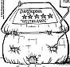](7schim.md) 3.5.07: Muslim-Markt Interview m. Konrad + Petra Fischer [Warum Altes bewahren ...?](http://www.muslim-markt.de/interview/2007/fischer.htm) 
01.07: Raum & Zeit 145: ["K. Fischer: Die überzeugenden Eigenschaften der Strahlungswärme Ein Erfahrungsbericht zur Hüllflächentemperierung"](http://www.raum-und-zeit.com/r-z-online/artikel-archiv/2007/ausgabe-145/die-ueberzeugenden-eigenschaften-der-strahlungswaerme.html) 
5.11.06: DER STANDARD: ["Dämmstoffe, die nicht dämmen?"](http://derstandard.at/2642610) - Konrad Fischer zur Dämmlüge 
27.10.06: DER SPIEGEL: ["Energiepass: Zu Tode gedämmte Häuser - Windige Geschäfte mit Klimaschutz"](http://www.spiegel.de/wissenschaft/mensch/0,1518,445103,00.html) (mit K. Fischer) 
31.10.06: pressetext.at: ["K. Fischer: Dämmstoffe dämmen nicht - Wärmedämmung: Niedrigenergie-Haus Lug + Trug"](http://www.pressetext.de/pte.mc?pte=061031002) 
11.11.06: Salzburger Nachrichten Interview K.Fischer: ["Dämm-Materialien an der Fassade: Das Risiko"](http://web.archive.org/web/20080102234847/http://www.salzburg.com/sn/archiv_artikel.php?xm=2641099&res=0)\+ ["Kritik an Wärmedämmung](http://web.archive.org/web/20071208061230/http://www.salzburg.com/marktplatz/artikel/2641098.html)" (m. KF) 
1.8.06: Familienheim&Garten Interview m. Konrad Fischer: ["Der Energieausweis und das Einfamilienhaus"](http://web.archive.org/web/20071230195225/http://www.verband-wohneigentum.de/bv/on20250) 
5.5.04: Familienheim&Garten: ["Streitthema Wärmedämmung - Energiesparen ohne Schimmelpilz"](http://web.archive.org/web/20090201105935/http://www.verband-wohneigentum.de/bv/on9953) (KF) 
19.9.03: WDR ServiceZeit Bauen&Wohnen m. K. Fischer: ["Rechnet sich Dämmung wirklich?"](http://web.archive.org/web/20031216215359/http://www.wdr.de/tv/service/bauen/inhalt/20030919/b_1.phtml) 
26.1.01: VDI-Nachrichten/ingenieur.de: ["Altes Know-How wiederentdeckt"](http://www.ingenieur.de/Branchen/Bauwirtschaft/Altes-Know-how-neu-entdeckt) (zur Sanierung des Rathauses in Bremen durch KF) 

[ 
Stromverbraucherschutz NAEB e.V.](http://www.naeb.info/) 

#### 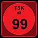 Nicht ganz tugendfrei! - XXXtreme-Aufklärungsfilme von und / oder mit Konrad Fischer 

  
  
  
  
  
  
  
  
  
  
  
  
  
  
  
  
  

**Musikvideos.wmv** - Mitwirkende: (u.a.) Familie Fischer 

[ Leopold Mozart:Schlittenfahrt](MOZART.WMV) (m. Edith + Konrad) 2MB [ Graupner: Bourreé + Schostakowitsch: Marsch](BOURREE.WMV) (Wilhelm) 3MB 
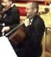 W.A.Mozart (m. Konrad): [Ave verum Corpus 7MB](AVEVERUM.WMV) 
Mottete 'Exsultate, jubilate', KV 165: [1. Exsultate 13MB](EXSULTATE.WMV), [KV 165: 2. Recitativo 3MB](RECITATI.WMV), [KV 165: 3. Tu virginum, 4. Alleluja 13MB](ALLELUJA.WMV) 
[Laudate Dominum 11MB](LAUDATE.WMV) 
[Kyrie 4MB](KYRIE.WMV) 
[(Mitwirkende und weitere Konzertmitschnitte: Guiseppe Tartini, Jules Massenet, Peter Cornelius)](1refernz.md#mozart) 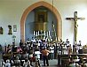Paul Gerhardt-Choräle mit Lorenz-Bach-Chor (Konrad/Tenor, Petra/Alt) 
[ Paul Gerhardt/Johann Crüger: Wie soll ich dich empfangen 5MB](wiesoll.wmv), [(weitere Choräle)](1refernz.md#chor) 
[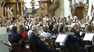100 Jahre Meranier-Gymnasium Lichtenfels: Konzerte mit Chor+Orchester/Tanz](1refernz.md#mgl) (u.a.m.Konrad,Petra,Karolina+Mechthild) 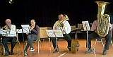 Volksmusik-Quartett (Dietmar Ehrlich: 1. Trompete, Edith Fischer: 2. Trompete, Konrad Fischer: Tenorhorn + Violoncello, Hans Theil: Tuba) der Siebenbürger Landsmannschaft, BZG Coburg, Frühlingsfest am 19.04.08: Drei Tanzmusikstücke aus Josef Kaltenbachs Notenhandschrift (um 1900): [Walzer Nr. 23 -7MB](WALZER1.WMV) \+ [Mazurka Nr. 8 - 6MB](MAZURKA.WMV) \+ [Garibaldi-Polka - 6MB](POLKA.WMV); M. Thies, aus: Euphonium, Op. 46, "Sommerfreuden-Walzer": [Walzer Nr. 1 - 7MB](WALZER2.WMV); Ludwig van Beethoven: [Ode an die Freude - 2MB](FREUDE.WMV) 
[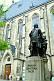 Thomaskirche, Leipzig: Musik, Geschichte & Geheimnis + "Jauchzet, frohlocket"](https://youtu.be/fET3JCock6Q) aus J.S. Bachs Weihnachtsoratorium (Konrad Fischer im Cello) [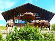Grindelwald - Die Härrlichkeit und Hässlichkeit der Bergli - Ein Bergfilm](http://www.youtube.com/watch?v=pkDRMqZZVSY) (Youtube-Video mit Blasmusik 10 min) 

### Erklärung

Konrad Fischer, der Betreiber dieser Webseite verdient als Amazon-Partner an qualifizierten Käufen über die hier angebotenen Produktlinks auf Amazon.de, siehe hierzu auch die [Amazon-Datenschutzerklärung](http://www.amazon.de/gp/help/customer/display.html?ie=UTF8&nodeId=3312401). Die verlinkten Produkte sind individuell ausgewählt und ergänzen den Inhalt dieser Webseite. 

Die Werbeeinnahmen aus der Onlinewerbung dienen zur Aufrechterhaltung und Weiterentwicklung der kostenlos zugänglichen Informationen dieser Webseite. Die Funktion der Onlinewerbung von Adsense und Amazon können Sie durch AdBlocker (Computerprogramme, die Werbung von Webseiten ausblenden) verhindern. 

### Meine Buchtipps:

**[Tipp: Grundlagenwissen Bau und Baustoffe für Bauherren & Bauschaffende](29bausto.md)** 
**[Eurolime-Kalk-Info](2eurolim.md)** - **[WDVS-Pfusch weltweit](2133bau.md)** 

###  für das gesunde Haus zum Messen und Wärmen, Temperieren, Heizen und Trockenhalten:

---

Befreundete Seiten: [Architekturbüro EDOM-LTD Marin Naidenov + Blagovesta Blajeva, Sofia BL](http://www.edom-ltd.com/) [Fortschritt in Freiheit](http://www.fortschrittinfreiheit.de/) [David Kilburn: The Destruction of Kahoi Dong](http://www.kahoidong.com/) [Ergänzende Bauinfo](rauch.md) von [Dipl.-Ing. Peter Rauch, Ingenieurbüro, Leipzig](http://www.ib-rauch.de) [Dipl.-Ing. Architekt Klaus Aggen †: Wärmedämmung - Lug und Trug](http://www.klaus-aggen.de) [Thomas Bösl Immobilien-Sachverständiger / Grundstücks-/Gebäude-Bewertung / Gutachten für Minderung der Erbschaftssteuer/Einkommenssteuer](http://www.immobiliensachverstaendiger-boesl.de/) [Geniestreich - Deutsche Jeans für den eigenleistenden Bauherrn und alle anderen auch](http://geniestreich-jeans.de/) [Werkzeug-News](http://www.werkzeug-news.de/) [Informationen für Bauherren v. Dipl.-Ing. Matthias Bumann](http://www.dimagb.de/) [Selbst ist der Mann](http://www.selbst.de/) [Haushaltstipps Ratgeber-Portal](http://www.haushaltstipps.net/) [www.crash-news.com/: Der andere Blick auf die Nachrichten](http://www.crash-news.com/) [Rolf Finkbeiner: www.wahrheiten.org - zu Klimaschutz, Sanierzwang und anderem Staatsterror](http://www.wahrheiten.org/) [Friederikes Becklog: Polit-Kritik+Kabarett](http://www.becklog.zeitgeist-online.de/) [EIKE, Europäisches Institut für Klima und Energie, Jena](http://www.eike-klima-energie.eu/) [Aus meiner Heimat: Brauerei Wichert Oberwallenstadt - Spitzenbier aus fränkischem Brauhaus für Bierliebhaber](http://www.brauerei-wichert.de/) Conrad Fisher = Konrad Fischer

[Architekten & Ingenieure für die 9/11-Wahrheit](http://www.ae911truth.org/) 

#### Aktueller Bau-und Öko-Schmonz - auf meiner Facebookseite 'Preservation, Conservation, Restoration and Maintenance of Old Buildings' deftig kommentiert:

[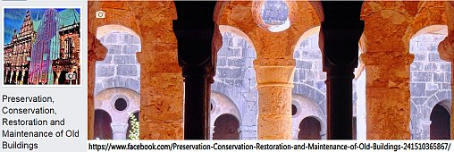](https://www.facebook.com/Preservation-Conservation-Restoration-and-Maintenance-of-Old-Buildings-241510365867/) 

 

