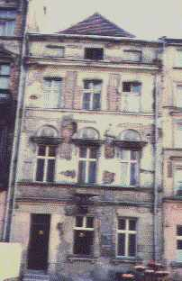
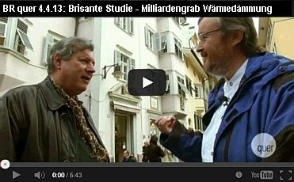

[🠔 Zur Übersicht: Roman & Balkan](roman.md)  
# RISTRUTTURAZIONE DEI MONUMENTI ARCHITETTONICI
**Valorizzazione, Reparazione, Intervento, Manutenzione, Riabilitazione, Restaurazione, Conservazione di beni culturali**  
_von Konrad Fischer_

[Konrad Fischer](1refernz.md)

## PROGETTAZIONE, ORGANIZZAZIONE E SVOLGIMENTO DEI LAVORI

### Valorizzazione, Reparazione, Intervento, Manutenzione, Riabilitazione, Restaurazione, Conservazione di beni culturali 

[da ["Castel Roncolo. Mantenere e rivitalizzare i castelli"](https://www.libroco.it/cgi-bin/dettaglio.cgi/lingua=en/codiceweb=1875845339423//Burg-Runkelstein--Erhalten-und-gestalten-von-Burgen-und-Schlossern--Castel-Roncolo--Mantenere-e-rivitalizzare-i-castelli//Athesia-Buch-Gmbh.html), Athesia Buch Gmbh - Sarl, Atti dell'Incontro di Studi. Castel Roncolo / Burg Runkelstein (BZ), 25 ottobre 1996. Testo italiano/tedesco. Bolzano, 2000;] 

Esiste nei riguardi dei [castelli](8reise.md), dei fortilizi e degli altri monumenti architettonici in genere un nemico più insidioso di noi architetti? Dissimulando interventi di conservazione noi architetti progettiamo spesso vere e proprie campagne di distruzione del patrimonio architettonico esistente. [Nuove disposizioni e norme in materia edilizia](2mbu.md) e la nostra volontà di realizzarci giustificano ogni tipo di intervento fino al cosiddetto snaturamento. In tal modo riusciamo ad ottenere dal patrimonio architettonico a disposizione profitto, comfort, funzionalità e nuovo splendore. Tutto ciò che si oppone a questa finalità viene eliminato irrimediabilmente. Per quel che riguarda il nuovo, siamo poi di fronte all'alternativa: Storicità o modernismo?

Che dire poi degli studiosi-ricercatori, i quali armati di martello e scalpello demoliscono l'oggetto delle loro attenzioni? Stratificazoni più recenti vengono sacrificate alla curiosità di pervenire a quelle più antiche (ill. 1). E che dire inoltre dei restauratori che spesso iniziano il loro lavoro come tali e poi si lasciano andare e alterano il valore documentale dell'oggetto delle loro attenzioni, rimuovono tracce di deperimento, puliscono, integrano parti mancanti e inzuppano il tutto con sostanze chimiche fino al suo completo [impregnamento](29bau03.md)?

Ill. 1: Scoprimento distruttivo durante la fase di ricerca del reperto originario

Noi delle Sovraintendenze da un lato vorremmo congelare il processo di invecchiamento del patrimonio architettonico, dall'altro desidereremmo ridare ad esso nuova vita. Tutto ciò con i migliori intendimenti, tuttavia si tratta di un processo gravido di conseguenze. In tal modo l'opera perde parti essenziali del suo odierno stato, della sua travagliata esistenza. Essa soffre inoltre per un secondo motivo. Gli attuali materiali da construzione sono talmente perfezionati da non tollerare la caducità, da opporsi al comune processo di degrado delle opere antiche e da simulare un carattere di perpetuità. Se però a distanza di tempo andiamo a controllare il loro comportamento, notiamo che essi provocano danni maggiori di quanto non facciano i materiali più tradizionali. Io alludo qui ai danni causati dalle applicaziono di [agenti disperdenti o di silicati di potassio](22bausto.md#silikatproblem) sugli intonaci storici di calce (ill. 2, 3) da iniezioni in rivestimenti murari o da consolidamento di affreschi e di pietre vive mediante prodotti chimici. 

 
_Ill. 2:[Tinteggiatura a base di silicati di potassio](22bausto.md) su intonaco storico di calce: formazione di croste e distruzione degli intonaci storici per eccessivo indurimento e bloccaggio del processo di asciugatura_

 
_Ill. 3:[Tinteggiatura a base di silicati di potassio](22bau2.md) su intonaco storico di calce: nel particolare, formazione di croste_

 

Se vogliamo curare veramente i monumenti architettonici antichi dobbiamo tenere sempre ben presente tutto ciò. Persino nelle costruzioni nuove i materiali moderni sopravvivono un periodo abbastanza breve: rivestimenti di acciaio e vetri rotti, facciate rivestite dei resina sintetica degradate, costruzioni a calcestruzzo crollati danno segni che solo [architetti, ingegneri e costruttori sordi](11erhins.md) non possono non ignorare (ill. 4, 5).

 
_Ill. 4:[Cemento armato](2beton.md) su muratura storica di una torre: danneggiamento pressocchè totale dell'oggetto a cusa di sovraccarico della costruzione, bilancio quattro morti_

 
_Ill. 5:[Cemento armato](2beton.md) nel Centro olimpico di Monaco di Baviera: mancata funzione tecnica ed estetica del cemento armato dopo appena 10 anni_

Il patrimonio esistente va rispettato. Esso solo nella sua globalità ha valore documentativo dell'intero iter storico. I documenti, e i monumenti sono tali, non sono di per sè nè buoni nè cattivi; qualsiasi valutazione puramente ideologica sarebbe fuori luogo. Vi sono peraltro altri punti di vista ed ognuno di questi ha le proprie giustificazioni. Gli scavatori e i ricercatori distinguono il patrimonio in sempre nuove parti da scoprire e in misterioso materiale originario. Quest'ultimo appare degno di essere studiato e perciò viene portato alla luce in modo distruttivo. Tutto ciò però non ha nulla a che vedere con la preservazione del patrimonio architettonico. Altrettanto deleteria è la violenza che su di esso può esercitare la moderna architettura. Quest'ultima se ne serve senza amore e lo adatta alle proprie esigenze, al massimo utilizzandolo come scenario.

Molti progetti a favore di vecchie costruzioni, o meglio a danno delle medesime, vengono purtroppo disattesi da nuovi rifacimenti. Questo non significa affatto che il nostro vero compito consista nel reperire il luogo più spettacolare per le moderne realizzazioni degli architetti. La Sovraintendenza ai monumenti abbisogna soprattutto di [tecnici e di metodi progettuali volti a conservare ciò che già esiste](11erhins.md).

La sua rivitalizzazione, e ciò vale in primo luogo per i castelli, deve peraltro risultare [economicamente vantaggiosa](5wiber.md). Il corrispondente [finanziamento](5finanz.md), senza l'assillo del profitto, è il minore dei problemi. Si tratta in definitiva di pensare a come conservare la residenza originaria di una famiglia benestante o un monumento sotto tutela. Forse anche nel cáso di Castel Roncolo il finanziamento non costituisce il problema principale. Cionondemeno non vorrei qui trascurare tale tematica. 

Ben noti sono gli investimenti di natura politica nel campo della costruzione dei manieri. La volontà politica è manifesta in non pochi nuovi brillanti recuperi ma anche in talune perdite di patrimonio. Presso le Sovraintendenze ed anche nei progetti legati alla redditività è per lo più presente la contraddizione tra restauro e conservazione. Restauro e tutela dei monumenti architettonici non vanno sempe d'accordo; così si espresse non molto tempo addietro l'ex-segretario di stato bavarese Sauter nel corso di una conferenza dal titolo: deperimento o utilizzazione. La conservazione del patrimonio esistente non postula necessariamente restauri, nemmeno nel caso dei castelli e dei fortilizi. In ultima analisi si tratta di vietare le ricostruzioni e di valorizzare i danni subiti come tracce storiche. Noi conosciamo progetti di riparazione che giudicano meritevoli di conversazione persino interventi storici approssimativi. Simili esperimenti difficilmente sortiscono effetti positivi.

 
Konrad Fischer: Fassaden energetisch richtig und kostensparend sanieren und trockenlegen 
 

In questo modo si verificano ricostruzioni che abbelliscono la storia o la malversano (Ill. 6). 

 
Ill. 6: Particolare di una conservazione storica - è convincente?

[Benestari disastrosi, recenti norme in materia e ricerca edilizia forniscono](3gutacht.md) a siffatte ricostruzioni argomenti a sufficienza. Del pari pericolosa, d'altra parte, risulta la tecnica di analisi della fisica delle costruzioni e della chimica. Essa alimenta gli accademici rospettivamente l'industria edile e nella nostra giurisprudenza germanica ripete prevedibili argomenti a favore di costruzioni costose e del cosiddetto livello della tecnica. Qualche esempio:

- [Isolamento orizzontale](2aufstfe.md) come contromisura contro un'erroneamente diagnosticata umidità ascendente all'interno di muratura storica: la migrazione capillare nei micropori della pietra viene di già interrotta dai macropori della malta.

- [Malte a contenuto di cemento e trasso](2beton15.md) rilasciano sali e bloccano il processo di asciugatura.

- [Supposto intonaco "antisale" e "diffusivo di risanamento" (per il risanamento di pareti aggredite dai sali e dall’umidità / Sanierputz WTA: malta "deumidificante per ristrutturazioni", idrorepellente applicabile a pompa / intonaco "per il sistema di risanamento delle opere in muratura")](2sanipuz.md) in grado di assorbire sali e umidità: questo tipo di intonaco blocca tramite i suoi additivi idrorepellenti e salini l'umidità e i sali in soluzione presenti sul fondo dell'intonaco nella loro migrazione verso l'esterno e fa addirittura accrescere il carico di sottofondo nella muratura.

- [Tinteggiature su base di resine sintetiche e tinteggiature silicatiche](22bausto.md) spesso dichiarate come particolarmente resistenti alle condizioni atmosferiche si rilevano a lungo andare come distruttive per la sostanza originale.

Spesso vengono usati in modo irresponsabile materiali edili moderni, anche se più costosi e nelle conseguenze più dannose per le costruzioni in confronto al modo di costruire tradizionale. Arricchiscono gli interessati e danneggiano l'originale. Lo stato della tecnica offre per l'uomo come per il monumento metodi innocui d'intervento come l'uso di tradizionalmente bonificata [malta di calce aerea](2kalk.md) e [tinteggiature a base di calce e caseina](2kalkfrb.md) senza formazione dei scorie cementizie o minerali ad espansione (ill. 7). 

 
_Ill. 7: Facciata di un convento riparato con calce aerea e tinteggiatura a base di conservazione a quattro anni dall`intervento_

Lo stesso vale anche per i metodi di [Conservazione di legno](2hsm.md). Questi metodi innocui nel migliore dei casi vengongo semplicemente negati, nel peggiore dei casi pesantemente combattuti come concorrenza per prodotti chimici da tempo sul mercato. Molti [esperti](3gutacht.md) provengono dall'industria e vivono spesso dagli incarichi nati da problemi di restauri sbagliati. La ricerca di soluzioni improntate a cautela sulla base del semplice buon senso viene forse troppo spesso anzitempo accantonata.

[Castelli e ruderi](8reise.md) ne sono in particolare minacciati, per colpa della diffusa voglia di andare alla ricerca di tesori. Proprio noi della [Associazione dei Castelli](http://www.deutsche-burgen.org) siamo a conoscenza di numerosi esempi del genere; si tratta in fondo, come sempre, di trovare la giusta misura.

Se un castello è oggetto di ricerche, progetti o di restauro, su di esso si concentra l'attacco di molteplici forze. In tal modo l'originale vede compromesse le parti danneggiate, quelle utili alla ricostruzione della ricerca edificatoria e quelle che ne impediscono l'utilizzazione.

Una riparazione impronata veramente ad economicità postula la conservazione più ampia possibile; ciò comporta costi minori e in linea di principio tiene nella dovuta considerazione anche ciò che è posteriore al Medioevo fino ai nostri giorni. In queste vicende noi architetti siamo corresponsabili dell'andamento e del pilotaggio del finanziamento dei progetti, nel controlle e nelle procedure di autorizzazione in materia di costruzione e promozione, nell'esame dello stato attuale e della documentazione, per le operazioni preliminari della costruzione, nonchè dell'organizzazione e dell'andamento di essa.

Durante i miei anni di studio ho sentito parlare molto poco di tutto ciò. Quanto è necessario sapere in ordine agli aspetti economici e giuridici ho dovuto impararlo faticosamente nel corso della mia quotidiana esperienza professionale. Nella progettazione e nell'esecuzione riguardante i circa 350 nostri monumenti architettonici antichi, che vanno dai fienili ai castelli, il problema dei costi è sempre stato al primo posto. Per i nostri non facoltosi committenti privati e pubblici i progetti, la costruzione e la tutela dei medesimi sono stati argomenti per lo più di secondaria importanza. Noi però dobbiamo in ogni caso predisporre strumenti e metodi di progettazione professionalmente corretti. Io vorrei qui di seguito esporVi brevemente come il nostro ufficio affronta la questione.

---

 

---

Finanziamento della programmazione e della progettazione

Già ai primi passi il risanamento sovvenzionato s'impatte in un ostacolo determinate. Come si deve finanziare la programmazione? Ovviamente si può ricorrere al metodo, spesso preferito, di una programmazione iniziale economica e sommaria. Talvolta perfino come gratuita prestazione preliminare da parte degli architetti. In tal caso ad una superficiale analisi dell'oggetto fa seguito poi nel corso dei lavori un'esplosione dei costi. Per evitare ciò ci sono tuttavia anche altre alternative.

Al principio e con l'impiego di pochi mezzi viene predisposto uno [studio di utilizzazione](11entwf.md) (ill. 8, 9). 

 
_Ill. 8, 9: Studio di utilizzo per la[Neuenburg ](http://www.schloss-neuenburg.de)in scala originale 1:200 - premessa per le varie fasi d'intervento, per il calcolo dei costi, dalla redditività eper il finanziamento_

Come base per la programmazione ci si accontenta di planimetrie in scala ridotta realizzate in economia. Sulla scorta delle suberfici vengono quindi calcolati in modo approssimativo i probabili costi complessivi. Per i valori di calcolo ci si rifà comparativamente ad altri progetti analoghi. Una [previsione della redditività](5wiber.md), considerando canoni di affitto e di appalto alquanto contenuti, chiude questa prima fase.

Questa è per lo più ancora abbastanza facilmente finanziabile, in caso di una progettazione sistematica anche a mezzo di sovvenzioni pubbliche. Il committente è in condizioni di trattare le Problematiche più importanti del progetto, vale a dire la programmazione degli investimenti per gli interventi relativi alla costruzione e il finanziamento delle conseguenti operazioni preliminari. Quest'ultime riguardano, oltre ai rilievi concernenti l'oggetto dell'intervento, una dettagliata programmazione delle opere necessarie e in questo modo si forma un complesso di dati attendibili di fondo utili a determinare i costi ma anche a seguire e indirizzare il corso dei lavori ma anche le indispensabili autorizzazioni e i benestari di rito. Gradirei ora analizzare in forma più circostanziata le singole fasi di una simile programmazione.

Operazione preliminari dei lavori di risanamento

Le difficoltà che insorgono con le vecchie costruzioni sorgono molto spesso a causa delle carenze nella rilevazione del loro stato di fatto. Un esempio pratico gioverà a chiarire meglio l'asserto. Se un sarto non prende fin dall'inizio tutte le misure necessarie, solo dopo il primo spavento, al momento della prima prova davanti allo specchio, si renderà conto di quanto lavoro rimane ancora da fare affinchè il vestito calzi a perfezione. La stessa cosa soccede con le vecchie costruzioni. I metodi tradizionali e consueti di rilevazione producono molto spesso una quantità di dati poco chiari e planimetrie poco esatte. L'approntamento di una siffatta documentazione si rivela antieconomica quanto i suoi risultati. I vari collaboratori, a seconda del rispettivo grado di preparazione, forniscono differenti risultati, trascurando l'effettivo fabbisogno di dati e notizie della programmazione. Nel corso dei lavori tale carenza non può essere rimediata con tempestività; i costi esplodono e le scadenze non vengono più rispettate.

Si può però fare anche diversamente. I nostri metodi di rilevazione presuppongono a priori una corretta misurazione nell'approntamento delle planimetrie in scala. Quanto precede viene da noi eseguito interamente sul posto. Evitando in tal modo che gli elaborati prodotti in studio sulla base invece di semplici schizzi rivelino poi misure inesatte. Naturalmente non tutti gli incarichi del genere richiedono simili rilevazioni; talvolta sono sufficienti anche disegni più semplici e in scala ridotta.

Sulla scorta delle successive rilevazioni, eseguite utilizzando [moduli predisposti di registrazione](11rabus.md) sia per il nostro archivio dei vani che per la [lista dei legnami](11erh13.md), le consuete costruzioni con le relative caratteristiche e le conseguenti misure d'intervento sono già date a priori (ill. 10). 

 
_Ill. 10: Pagina della listi dati per le finestre allìnterno del sistema di catalogizzazione degli spazi di un edificio_

Questo permette a qualunque collaboratore di produrre dei risultati tecnicamente validi, traducibili direttamente in piani d'esecuzione e in descrizioni operative. Tutti i dati rilevati hanno perciò un senso agli effetti della progettazione.

[Piano di funzionamente e di progettazione](11erh15.md)

Nelle riparazioni fatte a regola d'arte dei castelli l'incarico della progettazione, di cui andremo ora a parlare, consiste nell'inserimento delle nuove funzioni. Ancora una volta un esempo tratto dal mondo della moda gioverà a chiarire il concetto. Se equisto un abito usato, esso deve anzitutto starmi addosso bene; se poi c'è qualche cosa da aggiustare e da rammendare, quale tipo di filo e quali colori sceglierò? Misure esagerate, filo colorato e toppe variopinte possono andare bene per un costume da clown ma per nient'altro. Se si deve continuare a intervenire sui vari monumenti architettonici con metodi clowneschi non è quindi solo una questione di gusto perchè il tutto non è a buon mercato.

In casi estremi vale la pena di rinunciare a utilizzazioni inadeguate e perciò anche costose. Se è inevitabile rinunciare a parti della consistenza patrimoniale, allora per esse bisogna cercare la struttura più adatta. Forse una parte è molto rovinata e ad essa si può rinunciare più facilmente. L'architetto deve consigliare il proprio committente sia per quel che riguarda l'aspetto economico come anche quello concernente la tutela architettonica. Naturalmente cosi facendo i suoi [onorari](10hoai.md) si ridurranno come neve al sole di primavera.

Aggiungasi anche che il reperto potrebbe essere lasciato nello stesso stato di decadimento in cui si trova. Anche per una simile evenienza ci sono pure degli esempi.

Questo metodo di progettazione riduce i possibili conseguenti costi d'intervento e di manutenzione poichè i relativi lavori si ridurrebbero alle sole riparazioni e le antieconomiche utilizzazioni sarebbero soto controllo.

Schema di costruzione

Riparazioni e aggiunte possono andar bene nei punti difetosi o come controelementi, cioè come rivestimento di ciò che già esiste. Tutti gli interventi poi ricercano la via della minima resistenza rappresentata da difetti strutturali e da parti mancanti. Specialmente i [tracciati per le condutture](11erhins.md#haustechnik im baudenkmal) e i collegamenti tra vecchia e nuova costruzione devono essere curati nei particolari in modo da preservare il preesistente (ill. 11). 

 
_Ill. 11: Particolare di un disegno: sezione fedele di unàggiunta alla base di una capriata_

Questo è quanto stimola nel nostro ufficio la collaborazione tra coloro che sono addetti ai [calcoli statici e i progettisti della costruzione](11erhins.md#tragwerksplanung). L'evoluzione del dettaglio rispettoso di ciò che è vecchio postula inoltre una collegiale influenza sul lavoro artigianale e su quello industriale (ill. 12).

 
_Ill. 12:[Riscaldamento delle superfici murarie](7temp17.md) come alternativa per un impianto di riscaldamento canonico che usa, in modo inappropriato, l'aria come veicolo portatore dell'energia e compromette le superfici murarie attraverso una condensazione eccessiva_

Con i [materiali da costruzione e le tecniche tradizionali](2baustof.md) noi evitiamo metodi di costruzione senza prova sul lungo periodo. Inoltre, anche ripetute fasi di sperimentazione in scala ridotta sull'oggetto sono pienamente giustificate. Questa strategia consente di ottenere a breve o a lunga scadenza notevoli risparmi nell'esecuzione delle opere. Si evitano infatti in tal modo taluni tentativi costosi quanto sbagliati.

Descrizione dei provvedimenti d'intervento e calcolo della spesa

Tutti conoscono il problema. Ciò che elabora l'architetto viene talvolta frainteso o affatto compreso dall'artigiano. Una pianificazione equivoca o incompleta causa notevoli difficoltà nel corso dei lavori. L'artigiano lucra sulle continue richieste aggiuntive e il progettista deve necessariamente appoggiarle, per non dover altrimenti rispondere in prima persona delle proprie carenze progettuali. 

Si tratta in definitiva di flusso informativo da progettista ad artigiano. Il nostro [sistema di posizionamento degli elementi costruttivi](9pbs.md) descrive l'intervento già durante la fase progettativa. Esso fornisce una documentazione progettuale di base assolutamente affidabile. A differenza delle solite usuali relazioni il nostro sistema comporta l'acquisizione della rilevazione dell'oggetto nella sua consistenza e nel suo stato attuale e anticipa forma e contenuto della descrizione degli interventi. Solo uno scambio d'informazioni chiare ed esaustive consente una completa comprensione da parte di tutti gli addetti.

Il nostro sistema inoltre controlla anche la qualità, in quanto scopre eventuali errori di progettazione prima della sua esecuzione. Ommissioni di informazioni o informazioni lacunose nell'ambito di un sistema chiuso vengono naturalmente alla luce più rapidamente che non nella messa insieme disordinata dei soliti metodi di descrizione. Siffatti migliori e più facilmente controllabili risultati facilitano in modo quasi automatico anche la nostra garanzia qualitativa interna aziendale (ill. 13).

**[Il sistema costruttivo a posizioni](9pbs.md) **

**L'articolazione dei singoli elementi di posizione 1 - 12**

1. Numero

2. Riepilogo delle posizioni

3. Influenze sulla formazione dei prezzi in relazione al ambito 

3.1 Ambito del cantiere 
3.1.1 Cantiere ed elementi costruttivi attigui 
3.1.2 Danni 
3.1.3 Situazione di pericolo nel ciclo lavorativo

3.2 Ambito coinvotto 
3.2.1 Descrizione delle parti costruttive 
3.2.2 Danni 
3.2.3 Mancanza di qualifica, pretese, motivazione

4. Costruzione, funzione, formazione del risultato prestazionale

5. Intento, pretesa del risultato finale

6. Descrizione dell'intervento 
6.1 Ambito del lavoro 
6.2 Direttive di qualità 
6.3 Direttive di quantità 
6.4 Leganti, integrazione con la preesistenza 
6.5 Gestione della fabbrica e collaudo parziale e definitivo 
6.6 Direttive particolareggiate per la liquidazione e controllo quantitativo 
6.7 Direttive particolareggiate per la liquidazione e controllo quntitativo

7. Rimando sui elaborati grafici

8. Rimando su eventuale sottopartizione della posizione

9. Risultato prestazionale in rapporto all'effettivo operato

10. Quantità

11. Prezzo singolo

12. Prezzo complessivo

_Ill. 13: Quadro supervisore sui componenti d'informazione nel sistema costruttivo a singole posizioni, che permette una logica e completa descrizione delle prestazioni_

Fase realizzativa

Il sistema degli elementi posizionati riduce poi anche il rischio di costi emergenti durante la fase realizzativa. Le varie scadenze e i pagementi possono venir organizzati meglio; in questo modo, inoltre, anche progetti lontani dalla nostra sede di lavoro possono continuare ad essere gestiti tramite la direzione lavori. Noi eseguiamo la direzione dei lavori presso ciascuna delle nostre costruzioni. L'architetto dirigente deve però continuamente garantire e difendere l'opera mediante l'erezione di muri prottetivi, l'ordine nei cantieri, facendo opera di persuasione nei confronti di tutti gli addetti per l'intero corso dell'opera. Molto di ciò che era stato concepito e progettato all'inizio, nel corso dei lavori deve essere riesaminato. La nostra sistematica preparazione dei lavori fornisce le necessarie riserve di tempo e di energie.

Premesse della progettazione

Le summenzionate prestazioni in fase di progettazione esigono a loro volta un impegno corrispondente e una adeguata copertura economica. Per questa ragione il committente deve farsi un'idea del collegamento tra preparazione e risultato di lavori. Le due fasi della progettazione preliminare incidono all'incirca per il 10% sul totale complessivo dei costi per quel che riguarda gli interventi più grandi e per il 15% su quelli più modesti. Fra di essi quelli relativi agli [onorari degli architetti](10hoai.md) raggiungono il 50% circa.

Ma proprio nella fase della programmazione d'intervento le usuali strategie di risparmio e le solite procedure approssimative inficiano il raggiungimento di buoni risultati. Proprio esse postulano l'esplodere dei costi e la rovina dell'oggetto. "saving the penny and loosing the pound" come dicono gli Inglesi. Un ragionevole investimento nell'ambito della programmazione potrebbe evitare tutto ciò. Mediante l'acquisizione degli elementi riutilizzabili, che andrebbero quindi conservati, fra i costi di costruzione degni di compensazione, si potrebbe veder remunerata la conservazione dell'oggetto, purchè eseguita in modo parsimonioso ma progettualmente preciso. In Germania le nostre tariffe professionali per la verità contemplano onorari concernenti interventi di tutela artistica, ma essi vengono difficilmente contrattati. Il committente paga preferibilmente maggiori costi di costruzione ma rispramia su quelli di programmazione.

Anche gli interventi nel campo della tutela dei beni architettonici, possibili anche senza continui esuberi di costi e con mezzi relativamente modesti, mostrano nel frattempo risultati economicamente validi e convincenti sotto il profilo della loro specificità.

Riassunto

Il risultato dell'intervento su un monumento architettonico dipende dalla committenza, dalla filosofia monumentale e tecnica applicata, dal contesto giuridico-finanziario e dalle abilità dei progettisti e artigiani coinvolti nella realizzazione dell'opera. Il metodo tradizionale di progettazione caratterizzato, in ultima analisi, da una demolizione notevole ed eccessivamente costosa del patrimonio dovrebbe tendere invece a soddisfare maggiormente esigenze concrete. La definizione delle fasi di progettazione in funzione del risultato permette di descrivere con esattezza gli interventi necessari e di calcolarne le relative spese. In questo modo è possibile ottenere, oltre ad una pianificazione ed esecuzione economicamente convenienti dell'opera, anche un risultato soddisfacente in termini di conservazione dei monumenti. Gli interventi sulle costruzioni già esistenti non dovranno pertanto più essere imprese rischiose dall'esito incerto. 

---

.  
_Primo e dopo riparazione - da Architektur- und Ingenieurbüro Konrad Fischer_

---

Intervista: 05.04.2013: Die Neue Südtiroler Tageszeitung: 

## [Tutto quello che dobbiamo sapere su CasaClima e non abbiamo mai osato chiedere](http://larchitetto-nella-foresta-design.blogautore.repubblica.it/2014/02/27/tutto-quello-che-dobbiamo-sapere-su-casaclima-e-non-abbiamo-mai-osato-chiedere/)

Konrad Fischer è un architetto tedesco, uno dei più riconosciuti esperti di isolamento, ha realizzato un filmato sulle case costruite con il sistema CasaClima, un film che in Italia non si è mai visto. Non si è mai letta neppure l’intervista che ha rilasciato alla rivista tedesca TAGESZEITUNG. Ulrich Pinter di Ton Gruppe ha voluto tradurlo e ve lo riporto.

Tageszeitung online: Sig. Fischer, sta viaggiando dall’Alto Adige verso la Germania. Qui in Alto Adige ha realizzato un film sulle Casa Clima.

Konrad Fischer: ho realizzato con Christoph Süss della TV della Baviera ( Bayrischen Rundfunk), che lavora per la trasmissione “Quer”, (“di traverso”), un filmato critico sull’isolamento termico, perché questo tema al momento riscalda gli animi in Germania. La svizzera “Prognos AG” ha pubblicato uno studio che dimostra che l’isolamento termico non serve assolutamente.

Perché allora è venuto proprio a Bolzano per realizzare questo film?

A Bolzano ed in Alto Adige al momento esiste un incredibile pazzia dell’isolamento termico e un fanatismo per la Casa Clima. Si trovano danni incredibili. Uno degli esempi negativi più eclatanti è sicuramente la costruzione dell’edificio del Comune di Bolzano, nel quale si trova l’ufficio della Natura, Paesaggio e Ambiente. In questo caso si può parlare veramente di una catastrofe dell’isolamento: la facciata esterna è completamente bagnata. In tutti gli angoli e gli spigoli la costruzione è lacerata e si possono intravedere i danni. Danni tipici, perché tutti questi isolamenti sono lavori molto approssimativi e non durano nel tempo. Inoltre le facciate vengono trattate con veleni, per eliminare il problema delle alghe, che si formano a causa dell’isolamento bagnato. Questi veleni vengono poi lavati via dalle piogge e finiscono nelle falde.

Perché queste mura si bagnano tanto?

L’isolante con il sole si riscalda a temperature molto alte. Appena il sole tramonta, l’isolante si raffredda e diventa molto più freddo dell’aria e assorbe così quantità abnormi di condensa, e si ha la formazione della rugiada.

In Germania si parla di questa problematica. In Alto Adige?

In Alto Adige di questi lavori malfatti non si parla e non si fa ancora tanta critica. L’Alto Adige è una roccaforte dell’isolamento. E’ incredibile come qui le persone vengano ingannate. Non eravamo a riprendere solo a Bolzano, ma in alcune valli e abbiamo visionato diversi cantieri. Era incredibile 

Per esempio?

Siamo andati nei masi dell’Alto Adige, costruzioni antiche, e dappertutto si è isolato. Ho trovato operai, carpentieri, che hanno lavorato con tanta rabbia addosso, perché obbligati ad applicare isolanti dappertutto. Gli artigiani sanno che questa è una stupidaggine, ma sono obbligati a farlo. D’altra parte sanno già quando devono ritornare per riparare i danni. Ero anche in Val d’Ultimo: là ci sono masi secolari, che hanno sempre funzionato. Adesso li rovinano con queste assurde prescrizioni. I proprietari di bellissime case sono obbligati ad applicare una quantità incredibile di isolamento e hanno allo stesso tempo la paura che l’umidità gli rovini le case. Per me è uno scandalo. Avevo davvero l’impressione che quelli che costruiscono case sono disperati: applicano questi isolanti perché vengono obbligati. Volontariamente nessuno lo farebbe.

Chi in Alto Adige riceve un contributo provinciale, deve costruire con un certo livello: che vuol dire, isolare a dovere?

Il problema è che in Alto Adige non esiste nessuna possibilità di aggirare queste prescrizioni. In Germania queste si possono aggirare, se si dimostra che isolare non paga. E siccome queste prescrizioni in un periodo ragionevole, diciamo in dieci anni, non si ammortizzano mai, non c’è alcun problema a chiederlo. Sono convinto che nessuna persona normale costruirebbe una casa simile. Solo con la legge si può obbligare la gente a realizzare case così.

Questo obbligo dice tanto 

Se ci fosse solo un briciolo di buon senso in tutto questo, non si dovrebbe obbligare la gente con le leggi, ma lo farebbe automaticamente. Questi obblighi sono un brutto segno per il valore delle leggi.

Lei dice con l’isolamento non si risparmia niente?

No, al contrario. Già il costruire in questa maniera costa molto di più. Inoltre: la manutenzione di una facciata così costa già 9 € al m² all’anno in più che con una facciata intonacata normalmente. Già questi costi pareggiano i risparmi. Ci sono anche studi con i quali si dimostra che gli isolanti non lasciano più entrare l’energia del sole nella casa. ( “energia che sarebbe a disposizione gratis, il sole non manda bollette”). Per questo i costi del riscaldamento sono più alti.

I calcoli termici che vengono presentati dicono però sempre qualche cosa di diverso 

E’ incredibile: Tutti gli studi scientifici dimostrano che il consumo energetico aumenta, appena ci sono isolanti sulla facciata. Gli studi contrari invece, per dimostrare che isolare conviene, si basano solo su valori teorici calcolati. Questi calcoli sono però utopia e sono lontani dalla realtà. Questo è tutto un inganno e una truffa che si basa solo su numeri teorici.

Ma perché nessuno fa qualche cosa contro questo inganno?

E’ proprio questo il problema: i lobbisti in questo ambiente hanno una influenza così grande, che non si sente la voce di chi ci si oppone. E così purtroppo è anche in Alto Adige. E la politica nemmeno vuole saperne. Hanno i loro scenari della salvaguardia del clima in testa e per il resto nascondono la testa nella sabbia. Vogliono fare i loro affari e niente di più!

Si sente parlare anche di pericoli di incendio di queste case superisolate (“ case leggere”)

Questo è l’altro enorme problema del quale le persone non sono informate: una volta che il materiale prende fuoco, brucia velocemente. L’ultimo incendio spettacolare è stato nella città russa Grosny: in pochi minuti una casa alta 145 m è bruciata. Ma sembra che questo alla gente non interessi.

Cosa vuol dire vivere in una casa sovraisolata?

Queste case sono scatole di plastica, troppo umide e con forte inquinamento interno dei locali, perché l’aerazione forzata non funziona più a regola d’arte. Cosa si trova in un impianto di areazione forzata non è immaginabile per un profano: è come in un’anticamera dell’inferno. In questi impianti si accumulano le polveri fini , che non vengono filtrate. Qui si formano le culture di batteri di prima classe. Quando l’aerazione non funziona, l’aria del canale arriva anche nei locali e fa le vittime delle malattie.

Per cui le Case Clima ammalano le presone?

Si. Specialmente l’umidità è troppo alta. Chi monta e poi installa gli impianti di aerazione, monta in casa vere bombe a orologeria. La gente non si rende conto! Non può immaginarsi cosa si trova in questi impianti e non sanno, che vanno poi manutenuti regolarmente.

Si mette allora la gente in box di plastica e si aspetta finché si ammalano, o soffocano?

Certo, e l’industria farmaceutica è la prossima a guadagnarci.

Con quali sentimenti lascia ora l’Alto Adige?

Sono esterrefatto, dopo che ho conosciuto questo delirio per la Casa Clima in Alto Alto Adige. Ho sentito così tante voci indignate di persone colpite, di artigiani e proprietari di case. La gente è disperata. E non hanno la minima possibilità di aggirare questi obblighi. Ma dove siamo? Tutto questo è un regime totale: il cittadino non ha la minima possibilità, e quelli che hanno il coltello per il manico portano avanti il discorso, e non si preoccupano minimamente se conviene o come vivono queste persone in queste baracche.

Intervista: Karin Köhl. Maggio 2013

---

Dipl.-Ing. [Konrad Fischer](1konrad.jpg) 
Architekt [BYAK](http://www.byak.de) 
Beirat für Denkmalerhaltung "[Deutsche Burgenvereinigung e.V.](http://deutsche-burgen.org)" 
[Hauptstrasse 50](muehle.jpg) 
D-96272 Hochstadt a. Main 
Germania 
Tel.: +49 - *95 74 - 30 11 / Cel. +49 - *170-73 515 57 
Fax: +49 - *95 74 - 49 60 
[eMail](2berat.md#email)
