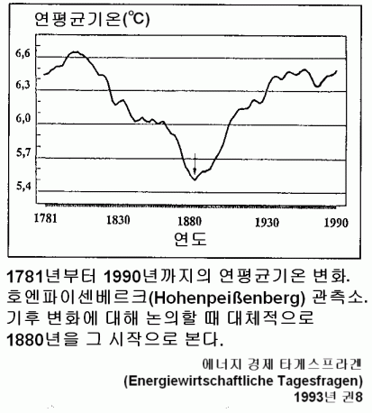
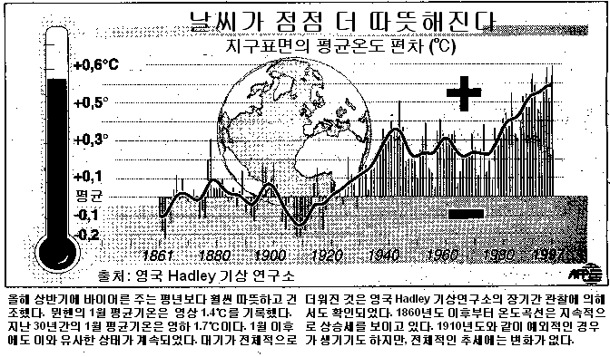
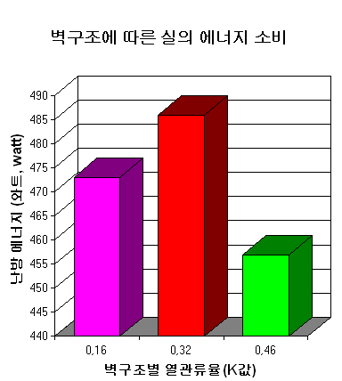
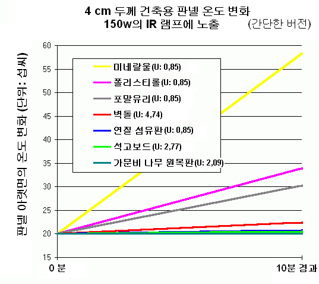

[🠔 Zur Übersicht: Asia & Middle East](asia.md)  
# 오래된 주택 복원 및 역사적 건축물‧기념물의 보존
**리노베이션, 복원 및 보수를 위한 건축 매거진. 역사건축물 소유자를 위한 조언 및 요령 - 잘못된 정보 및 실제로 효과적인 방법들.**  
_von Konrad Fischer_

 
오래된 주택 복원 및 역사적 건축물‧기념물의 보존 
:::: 리노베이션, 복원 및 보수를 위한 건축 매거진 :::: 
**역사건축물 소유자를 위한 조언 및 요령 - 잘못된 정보 및 실제로 효과적인 방법들 

---

[디플롬 엔지니어 콘라드 피셔 (Konrad Fischer)](1refernz.md) 
건축가 및 엔지니어 
주소 : [Hauptstrasse 50](muehle.jpg) 
D-96272 [Hochstadt a. Main](http://www.hochstadt-main.de/) 
Germany 
Tel.: (+49) (0)95 74 - 30 11 / Fax: (+49) (0) 95 74 - 49 60 
핸드폰: (+49) (0)161 - 191 58 67 
[e-Mail](2berat.md#email) 
[문의:](2berat.md) 독어, 영어, 불어, 이태리어, 스페인어, 러시아어, 루마니아어, 덴마크어, 스웨덴어, 노르웨이어. 한국어 
답변: 독일어, 영어, 한국어 

---

[ 
작가의 TV 출연: 무너지는 지붕과 홀- CLIPwmv 3MB](mtvclip1.wmv) - [손상된 지붕, 불명예스러운 이야기](212bau2.md) (독어) 
[생태 건물: 반어적 비판](oekobau.md) (독어) 
[오래된 건물의 에너지 절약, 가능한가?](energie.md) (독어) 
[역사건축물의 수선 및 복원. 그 실패의 원인](energie.md) (독어) 

---

 당신은 오래된 집을 소유하고 있는가? 수리를 한 적은 있는지? 어떻게 되었나? 큰 맘 먹고 건물을 보수했거나, 개조, 개축, 개량 공사를 했던 것이 엉망이 되었는가? 돈뿐만이 아니라 당신이 가지고 있던 희망까지도 송두리째 잃어 버렸나?

당신의 오래된 건물은 단열 시공이 되어 있는지? 건물이 단열재로 완전히 밀폐되어 공기가 통하지 않고, 벽과 지붕에는 곰팡이가 피는가? 집 구석구석이 살충제, 살진균제, 연화제, 용제 그리고 방화제 등의 화학 약품들로 오염되어 있지는 않은지? 천정에서 물이 떨어지고, 목재 부식균이 번식하는가? 당신의 아이들은 피부병을 앓고 있고? 모두 기침을 하고 천식을 앓고 있나? 혹은 집을 스스로 수리하느라 먼지에 눈이 충혈되고 잘못된 망치질로 손가락이 파랗게 멍들진 않았는지?

당신은 당신 주변의 완벽한 전문가나 인터넷상의 훌륭한 조언가들을 항상 찾아다녔다. 시장에 공급되고 있는 가장 좋고 저렴한 상품도 찾았다. 그 대가로 당신의 건축가는 당신 돈을 받았는가? 그러나 사실 실질적인 계획은 아마도 그의 산업계 친구들과 건자재 생산업자들이 했을 것이다. 건축가에게 이것은 공짜지만, 당신은 아주 비싼 대가를 치러야 한다. 이런 일은 자주 일어난다. 문화적 유산을 보존, 복원하는 경우도 예외는 아니다. 당신은 이미 이 사실을 알고 있었는가? 그렇다면, 축하한다! 그러나 더 낫고, 건강에도 더 유익하며 그러면서도 훨씬 싸게 이 일을 할 수 있는 방법이 있다는 것은 알고 있는지?

 

이곳을 방문한 것을 환영한다. 이 사이트는 바로 당신을 위해서 만들어졌다. 너무 늦게 이곳을 발견한 것은 아니길 빈다. 당신은 이곳에서 어디에도 매이지 않고 독립적인, 기존의 방법들에 대해 비판적인, 그래서 논쟁이 되고 있는 건물‧주택에 대한 정보를 얻을 수 있다. 오래된 건물을 수리하는 것과 역사적 건축물의 복원과 보수, 보존에 대한 것이 이곳의 테마이다. 대부분은 독일어로 작성되어 있으나 일부는 다른 언어로도 번역되어 있다. ([영어](english.md), [러시아어](rossija.md), [스페인어](espana.md) 등. [각국의 깃발 보기](index.md)). 

당신의 언어로도 번역이 되어 있는 것은 당신의 나라에도 복원‧보수되어야 할 오래된 집과 건물, 그리고 보존되어야 할 역사건축물이 있기 때문이다. (혹은 당신이 독일의 오래된 건물 복원에 관심이 있을 수도.) 당신의 나라 한국의 경우는 어떠한가? 전통적 한국 가옥은 그 수명이 수백 년에 이르지 않았는가? 견고하게 지어진 데다 에너지 절약 면에서도 유리하고 건강하게 지어진 전통적 가옥 양식이 지혜롭고 과학적이라 찬사하는 말은 하면서도 정작 당신들이 택한 방법은 미국 등 서양에서 들여온 현대적 방식이 아니었는가? 현재 당신네 나라에서 행해지는 건축문화를 보라. 기존의 가옥을 모두 허물어 버리고 철근 콘크리트조로 좁은 공간에 다닥다닥 붙여 지은 성냥갑 같은 건물에서 전통의 흔적을 찾을 수 있는가? 그나마 살아남은 역사건축물의 운명은 어떻게 되었나? 문화재 보존이라는 미명 아래 행해진 보수공사 결과는 어떠했는지? 나무와 점토 등 천연 자연 재료로 지어진 전통 건축물에 시멘트 모르타르, 콘크리트 등을 사용한 보수가 결로, 누수, 침수 등의 문제점을 가져다주지 않았는가? 전통적 주거공간에선 볼 수 없었던 누수, 곰팡이 문제는 이제 누구에게나 친근한 공동의 문제가 되었다. 이것은 오래된 건물뿐만이 아니라 신축건물에도 적용된다. 많은 사람이 새로 입주한 아파트의 누수 문제, 곰팡이 발생 문제로 장판이나 벽지를 바꾸고, 비염과 알레르기성 질병으로 고생한 경험이 있을 것이다. 하지만, 당신의 돈을 받아간 건설사 측의 반응은 어떠했나? 근본적인 대책이 마련되었는지? 아니면 당신은 그들이 대책을 세워 주기를 계속 기다리고 있는 중인가? 

우리는 이처럼 많은 기술적, 경제적인 문제를 비롯하여 다른 여러 문제들도 공유하고 있다. 오류도 마찬가지다. 역사건축물이 겪는 수난도 같다. 국제 건축 산업계와 당신네 나라의 전문가들은 잠도 자지 않고 연구 중이다. 여기엔 당신의 돈이 필요하다. 예를 보고 싶은가? 아래의 사진들을 클릭하면 자세한 정보(독어)를 볼 수 있다.

(1) \+ (2) \+ (3) \+ (4) \+ (5) \+ (6a) \+ (6b) \+ (7) \+ (8) \+ (9) \+ (10) \+ (11) \+ (12) \+ (13) \+ (14) \+ (15) \+ (16) \+ (17)

**그림 설명:** 

(1), (2), (3), (4): [규산염, 규산 소다 (물유리)를 이용한 바닥 강화·마감의 전형적인 결과물. 부서진 바닥 표면과 구조물 외피](22bausto.md) 
(5) [욕실의 사상균, 곰팡이](7schim.md) 
(6a) [습기가 차지 않은 욕조 벽돌벽](2aufstfe.md) 
(6b) [벽의 천공 구멍에 염분과 독성이 있는 충전재를 채워 넣는 방법의 수평 방수 공법(독어: borehole injection). 그 시공 후 벽에 발생한 소금피해](2aufstfe.md) 
(7) [외벽 단열 시스템 표면에 형성된 이끼](213baust.md) [출처: [건물 수리와 문화재 보호를 위한 잡지(B+B, Zeitschrift für Bauinstandhaltung und Denkmalpflege)](http://www.bautenschutz-bausanierung.de), 2002년 1월호, 사진: 비스마르(Wismar) 대학] 
(8) [정원에 시공된 젖은 단열재](7wsvoant.md) [출처: 건축업과 건축물 재개발(Bauhandwerk mit Bausanierung) 2/01, 사진: H. 패쯔올드(H. Pätzold)]; 
(9) [젖은 외부 단열재와 건물 내부의 곰팡이](7poly.md) 
(10) [파열되고 불에 탄 단열재](6brand.md) [출처: 피해 및 손상 현황 사진 (Schadensbilder aktuell), 바이어른 뮌헨 화재보험사] 
(11) [동해를 입은 시멘트 모르타르와 벽돌벽](29bau09.md) 
(12) [시멘트와 자연석](29bausto.md) 
(13) [새 벽면의 백화현상](29bau02.md) 
(14) [역사건축물 벽면의 합성수지 마감](22bau2.md) 
(15) [합성수지로 마감이 된 창](23bau08.md) 
(16) [합성수지 페인트칠이 된 울타리](23bau08.md) 
(17) [창과 오늘날의 기술](23bausto.md) 

Konrad Fischer: Fassaden energetisch richtig und kostensparend sanieren und trockenlegen 1 

[Teil 2](http://www.youtube.com/watch?v=Y1NSxAW15Cc) [Teil 3](http://www.youtube.com/watch?v=RAT7VzBo8k0) [Teil 4](http://www.youtube.com/watch?v=6TBII25iVQk) [Teil 5](http://www.youtube.com/watch?v=Kb0C4KiZvVA) 

이상 열거된 정보들이 논쟁의 여지가 있고 이례적인 것들인가? 이 내용은 건축 숙련공들의 오래된 전통과 기술에 따른 것이다. 성, 영주의 저택, 농가, 민가 그리고 교회나 수도원 같은 종교적 건물 등의 옛 건축물을 보수·복원하는 데 있어서 오랜 경험은 기초적인 것이다. 나의 아버지도 건축가셨고 1958년부터 1979년 세상을 뜨시기 전까지 건물 복원 및 보수 작업을 하셨다. 나는 아버지께서 돌아가시던 해인 1979년에 같은 일을 시작했는데, 이미 그 이전부터 아버지로부터 많은 것을 배웠다. 학교를 졸업하고 나서는 2년 동안 뮌헨 문화재 관리국에서 수습생으로 일을 하기도 하였다.

산업계 최고의 전문가들, 유명한 숙련공들, 신뢰할 만한 기술자들, 항상 검은 정장을 차려 입고 다니는 건축가들 그리고 여러분 주변의 친절한 친구들은 대부분 나와는 다른 생각을 가지고 있을 것이다. 그들이 더 나은 조언을 해 줄 수 있을지도 모른다. 그러나 나의 정보들이 당신에게 의미가 있는지, 유용한지는 당신 스스로 판단해야 한다. 당신은 당신의 지혜로운(?) 전문가들이 그들만의 성공 대로를 달리도록 그들의 의견을 좇아가도 된다. 

이곳에서 당신이 원하는 질문의 대답을 찾지 못할 수도 있다. 대신 인터넷에는 독일어로 된 1500개 이상의 사이트가 있다. 복원, 유지, 보존, 건축물의 기술적‧역사적 연구와 감시, 오래된 건물을 위한 건축재료(벽돌, 석회, 모르타르, 회반죽, 벽돌구조, 목골구조, 콘크리트, 합성수지 페인트, 규산염 도료 등), 부식된 자연석의 보수 및 강화, 기초부터 지붕에 이르는 건물의 각 부분이나 건물 전체 개‧보수상의 문제점, 경제성과 자금 조달, [산업계와 건축계획, 건물 보수 관련 사기 및 부패 행각](4behoerd.md) 등의 정보를 인터넷에서 찾을 수 있을 것이다. 

- 당신은 독일에 있는 성이나 궁을 사고자 하는가? 이곳에서 [매물로 나온 궁, 성, 영주의 저택](8schloss.md)(독어)을 볼 수 있다. 

- **[건물에 차는 습기](2aufstfe.md)**

벽면이나 벽돌구조체에 차오르는 습기를 막는 데 효과적이지 못한 방법이 있다. 지하실, 건물 기초, 건물 외벽 및 마감층에 발생하는 습기나 염분으로 인한 피해를 막는 데 잘못된 방법이 있다. 효과가 없을 뿐만 아니라 건물을 망가뜨리기까지 하는 벽체 건조 공법(독어: drying of wet walls /masonry)이 그것이다. 벽에 천공을 한 뒤, 그 구멍에 경화제를 주입하여 충전하는 수평 단열 방법(독어: horizontal sealing, borehole injection), 벽을 수평으로 잘라내고 스테인리스 강판을 삽입하는 방법, 방수용 모르타르 및 합성수지도료를 사용하는 방법, 또는 전기삼투를 이용한 이상한 방법의 벽체 전자 건조법(독어: electronic dewatering by electro-osmosis) 등이 여기에 속한다. 이상 열거된 방법들은 제 기능을 잘 수행하지 못할 뿐 아니라 상태를 더 악화시키기까지 한다. 하지만, 이것은 건축계의 사기꾼들에게는 좋은 사업거리가 된다. 이는 비단 독일에만 국한된 이야기가 아니다. 
🇬🇧 [Rising damp does not exist (영어)](2auffen.md)

   [모세관 현상에 의한 침습이 없는 벽돌 및 다른 구조체](2aufstfe.md)

실험실 건물, 물속에 지어진 건물, 항구에 있는 벽돌구조체에는 습기가 차지 않는다. 왜 그럴까? 그것은 공극이 작은 자재(벽돌이나 자연석)로부터 공극이 큰 재료(모르타르)로는 모세관 현상에 의한 수분 이동이 불가능하기 때문이다! 벽돌이나 자연석, 그리고 그 틈을 메우고 있는 사춤모르타르의 공극 내에서 중력에 저항하여 상승할 수 있는 모세관수(水)의 높이는 10에서 20센티미터를 넘지 못한다. 단지 파도와 바닷물의 범람만이 벽을 젖게 할 뿐이다. 이것은 고금을 막론한 정석이다. 당신이 살고 있는 곳에도 이 정석은 존재한다. 믿지 못하겠다면 당신의 욕실을 점검해 보아라. 불량한 선배나 멍청한 이론 따위는 믿지 마라. 그뿐만 아니라 나도 믿지 마라! 멋진 비단넥타이나 비싼 고급자동차, 화려한 웹사이트가 당신에게 좋은 조언이나 도움이 되는 상담을 해 줄 것이라는 보장은 없다. 당신은 무엇을 믿을 것인가? 마술이나 요술 따위를 믿겠는가? 당신은 정보에 대해 깨어 있어야 한다! 

- **[사상균(곰팡이) & 검은 곰팡이](7schim.md)**

사상균(곰팡이)와 검은 곰팡이는 현대식 건축술의 일반적인 결과물이다. 이것은 잘못된 단열에 기인한다. 기밀하게 밀폐된 방과 난방으로 따뜻해진 방안 공기도 그 원인이 된다. 이렇게 당신의 삶에서 가장 중요한 식량인 공기는 오염되게 된다.

🇬🇧How to get rid with mold attack.](7mold.md)(영어) 

- **[기후 변화: 지구 온난화와 냉각화](7thuene1.md)**

과학적 사실과 지나친 녹색 생태주의 공포. 이산화탄소 방출량을 줄이라는 것은 전세계 모든 민족과 모든 사람을 협박하는 비열한 무기.

 

독일에서는 기후 변화 및 지구 온난화, 온실효과 등이 양심 없는 과학자, 생태·환경 관련 사업을 하며 이익을 챙기려는 교활한 사업가와 부패한 정치가들, 그리고 정부의 통제 아래 돈에 이끌려 매춘 행위를 하는 언론, 이 모두의 음험한 사기 행각임이 서서히 밝혀지고 있다. 그러니까 이런 미친 짓에 더 이상 끌려다니지 마라! 인류가 방출하는 얼마 되지도 않는 이산화탄소가 아니라, 태양의 활동이 지구의 기후를 만든다. 이산화탄소를 적게 방출하기 위해 당신이 숨 쉬는 것까지 멈추라면 그렇게 할 것인가? 속칭 „기후보호“라는 신흥종교의 모든 신자들과 그 몽상 속에 헤매고 있는 열광적인 팬들에게는 이 방법이 최상의 해결안이 될 수도. 

- **[단열에 관련된 거짓말](213baust.md)**

잘못된 에너지 절약, 테러와도 같은 환경법과 부패한 관규정들이 당신을 압박하고 있다. 잘못된 단열을 하는 데 쓰이는 산업재나 생태적 재료들로 당신의 집과 가족, 또는 당신의 집에 세 들어 사는 사람들을 망가뜨리도록 말이다. 스펀지와 섬유판 내부에 고가로 포장된 공기, 인조석과 다공질 벽돌, 모, 솜, 대마, 셀룰로오스, 재생신문지, 해초 등을 구입하기 위해 당신은 많은 돈을 내야 한다. 이런 재료들은 열복사에 의한 열의 전달을 막을 수 없다. 이들은 또한 금방 흠뻑 젖게 된다. 그 결과로 이끼가 끼거나 독성의 검은 곰팡이도 생긴다. 그리고 하얀 노균병, 거미, 바퀴벌레, 좀벌레, 나무좀, 흰개미, 모충, 잎벌레, 구더기, 생쥐, 쥐, 담비, 족제비, 딱따구리 등의 침입을 유도하기도 한다. 마찬가지로 천식, 두통, 피부병과 심지어는 암까지도 유발시킬 수 있다. 

 외벽단열시스템 표면에 형성된 이끼

에너지 절약형 주택, 일명 패시브 하우스(passive house)라는 위험한 설비 기술도 조심하라! 이것은 독일 과학계의 사기이다! 오늘날의 독일에도 사기꾼이 존재한다. 현대 과학도 부패할 수 있다.

 

도표: 실내 소비 난방 에너지. 다양한 구조의 벽. Rth 값/K 값은 아무런 의미도 효과도 없다. 1983년 프라우엔호퍼(Frauenhofer) 연구소의 연구결과. 
X축: 벽체 구조에 따른 열관류율(K 값). Y축: 일정한 시간의 난방 에너지(watt). 
보라색: 23cm 두께의 폴리스티롤 단열재 사용. 빨강: 10cm 두께의 폴리스티롤 단열재 사용. 녹색: 단열재를 사용하지 않은 벽돌벽.

"건물 입면의 열적외선 사진은 실내 온기에 큰 손실이 있음을 증명한다. 측정시 외부온도 10도, 바람이 잠잠한 상태. 방안 온도는 알려지지 않음. 눈에 띄는 열손실의 원인은 두꺼운 벽체에 설치된 창문 때문이다." [위의 사진과 그 아래 원문 내용. 출처: 덴마크 '건축 기술지(Byg-Tek) 2004년 10월 25일자. Michael Rughede 기자] 

이것은 국제 화학산업과 단열재 생산업자들의 광고에 불과하다. 건자재 생산업자들은 기술자와 숙련공, 과학자, 국가 공무원, 정치가, 언론 등과 경제적으로 밀접하게 관련되어 있다. 그들은 단열재를 최대한 사용해서 공기가 통하지 않는 밀폐된 집을 당신에게 팔고자 한다. 

이 그림은 사실 낮 12시 경 두꺼운 벽체에서 나오는 열복사 에너지를 나타낼 뿐이다. 이것은 전적으로 태양으로부터 온 열이다. 남측 벽은 열복사가 많아 붉게 나타난다. 서쪽의 벽은 열 복사량이 적어 파랑, 녹색 등 차가운 색상으로 나타난다. 

- **[열복사 난방](7temper.md)** 옳고 그른 난방 방법: 뜨거운 공기 vs 따뜻한 공기? 

보통 일반적인 대류난방기는 공기를 뜨겁게 데운다. 

머리 부분은 뜨겁고 발이 있는 바닥 쪽은 차갑다. 당신의 방은 먼지 태풍이 일어나는가 아니면 바람이 없이 잠잠한가? 에너지 소비량은 많은가, 적은가? 아이들이 천식을 앓고, 겨울이 되면 잘못된 난방 때문에 독감에 걸리는가? 차가운 벽에 결로가 발생하거나 곰팡이가 피는가? 아니면 실내벽으로부터 약한 열복사가 있는가? 

돈을 절약하는 열복사 난방은 적은 기술만을 필요로 한다. 이 난방을 할 경우 구조체나 집은 항상 건조된 상태로 유지되고, 실내공기는 서늘하고 깨끗하며 건강에 좋다. 

열복사 난방은 적외선 복사열로 난방하는 방식이다.

실내의 공기는 실내벽이나 천장, 바닥 표면보다 서늘하다. 실내 공간을 밀폐시키고 습기에 축축히 젖는 건자재로 하는 쓸데없는 단열은 없다. 그래서 차가운 표면에 결로가 발생하지도 않는다. 바닥 난방이나 벽 난방의 단점에 대한 많은 사실이 밝혀졌다. 발을 따뜻하게 해 주는 바닥 난방 같은 경우는 배관 설비된 난방호스의 열이 건물바닥으로 전달되어 야기되는 열손실이 있다. 이러한 난방 방식보다 더 나은 대안으로 열복사 난방이 있다. 

많은 예가 있지만, 그 중 한 가지로 저렴하면서도 건물을 잘 보존할 수 있는 복사열 난방을 하는 파이츠획하임 성을 들 수 있다. 

 [열복사 난방을 하는 파이츠획하임(Veitshöchheim)성](7temp17.md)

- 독성, 무독성 자연적 [목재 보호](23bau16.md)

나무를 훼손하는 버섯, 진균류, 눈물버섯 그리고 나무 해충(나무좀, 흰개미, 나방류, 바구미류, 깍지벌레류, 하늘소류, 거품벌레, 솜벌레, 진딧물류, 풍뎅이류, 응애류, 대벌레, 방패벌레, 벌, 땅강아지 등) 방어전. 나무로 된 외부 구조물은 지속적으로 관리해야 한다. 현재 양호한 상태의 테라스, 보트 선착장, 다리 등은 어떤 독성 화학물질 사용을 통해서가 아니라 자연적인 노하우로 이루어진 것이다.

 
날씨의 영향으로 망가진, 독성이 있는 보호제를 사용했던 나무. 

- [옛날 창과 새 창, 그리고 그 마감재](23bausto.md)

성능의 우수성에 대한 다양한 설명에도 불구, 칠한 지 겨우 1년 된 오래된 창문틀의 합성수지마감재 모습. 

---

전자기파와 유리. X축: 파장과 유리창의 투명도. Y축: 방출 강도.

클라우스 마이어(Claus Meier) 교수의 도표. 

유리창은 자외선(< 0,3 µm)과 IR선(적외선 복사선, >2.7 µm)을 통과시키지 않는다. 가시광선 파장만이 유리를 통과할 수 있다. 그렇게 햇빛은 실내로 들어온다. 내열유리를 통한 방화 방법이 있다. 불이 났을 때, 그 빛은 유리를 통과할 수 있지만, 열은 유리창을 통과할 수 없다. 재료는 빛의 전자기파를 흡수하고 나서 적외선 형태로 빛에너지를 복사한다. 결론은 빛으로 실내 난방을 할 수 있다는 것이다.

열은 재료 내부에서 대부분 복사를 통해 전달된다. (입자, 전자 이동) 이중유리는 일반유리보다 공짜로 사용할 수 있는 태양에너지를 더 많이 여과한다. 게다가 이중창은 벽체 내부 결로를 야기한다. 그렇게 되면 난방을 하느라 더 많은 에너지를 소비하게 된다. 그러므로 현대의 창은 에너지소비와 곰팡이 습격을 더 증가시킨다는 것을 알아야 한다.

 
[노이엔부르크(Neuenburg) 성](http://www.schloss-neuenburg.de/) 
복원·보수 계획 [건축, 구조, 설비(급수, 배수, 난방, 환기) 일체]: 
콘라드 피셔와 그의 직원들 
([(노이엔부르크 성 박물관](http://web.archive.org/web/20120220161824/http://www.roadstoruins.com/neuenburg.html)

- 저자 강연. 1999년 5월 스코틀랜드의 Paisley대학 RILEM 세미나 **"Characterisation of old mortars with respect to their repair - Historic Mortars - Characteristics and Tests"** 
🇬🇧[**'Traditional Craftmanship in Modern Mortars - Does it Work in Practice?'** "](2rilem.md) (영어) 
🇬🇧글라스고우(Glasgow) 방문. 성들과 역사적인 석회 가마, 기타 방문지. **[저자 스케치](2rilskz.md)**(영어) 

 
[발드자센 (Waldsassen)](http://www.waldsassen.de/) 의 대수도원 

우리는 순수 가성 석회 모르타르(수경성석회가 아니라 가성석회)와 석회 카세인 회반죽으로 건물 입면을 보수하였다. 

건물을 망가뜨리는 시멘트와 합성수지, 규산 소다, 규산 칼륨에 근거한 방법보다도 더 경제적이고 효과적이었다. 

- [철근 콘크리트와 시멘트의 균열, 파괴](2beton.md)

녹이 슬어 부식, 균열, 파괴된 철근 콘크리트. 이것은 현대 건축의 자기 파괴적인 구조와 건축재료로 인한 재난이다. 녹이 슨 철근 콘크리트를 제대로, 혹은 잘못 보수·수리함.

- **[작가 소개](1refernz.md)**

저자의 이력 및 1979년 이후의 400개 이상의 프로젝트 중 일부 소개. [공식 추천서](1mader.md)

참고 : 사진을 클릭하면 작가의 연주 화일(wmf화일, 2.8MB)을 다운 받을 수 있음. 곡명: 바흐의 크리스마스 오라토리오, 건축가 콘라드 피셔는 첼로 연주. 지휘: 마리우스 폽(Marius Popp). 2005년도. 

- [건축재료](2baustof.md)

현대 건설 시스템의 문제. 당신은 옛 건물과 그 건물 안에 사는 사람들을 망가뜨릴 수 있다. 하지만, 대안은 있다. 

[도표: "리히텐펠스](2139bau.md)[(Lichtenfels)](2139bau.md)[ 실험"](2139bau.md) 

다양한 재료와 단열재(4cm 두께)를 적외선램프에 10분간 노출시 온도 상승 그래프 
재료: 미네랄울, 폴리스티롤/폴리스티렌, 포말유리, 벽돌, 연질 섬유판, 석고보드, 가문비 원목판 
X축: 노출 시간. Y축: 섭씨온도. 주의: Rth 값/ U 값은 온도 변화와 단열재의 실제 성능과는 무관하다.

공극이 있는 재료(현대의 경량 벽돌, 다공질 콘크리트, 산업·자연소재 단열재)는 많은 문제점을 가지고 있다. 합성재료로 하는 마감은 구조체 재료 내부의 모세관수 건조를 막는다. 이들 중 많은 수가 붕산, 살진균제, 살충제, 이끼 제거용 살균제 등과 같은 심각한 독성이 있다. 석면, 미네랄울, 폴리우레탄, 팽창 압출 폴리스티롤/폴리스티렌, 폴리에스테르, 유리면, 포말유리, 셀룰로오스, 양모, 탈지면 또는 대마섬유, 아마섬유, 야자껍질섬유, 가벼운 점토, 질석(蛭石), 대팻밥, 재생신문, 스프레이·블로우잉 공법의 셀룰로오스 화이버 단열 등은 단열 실패의 전형적인 제품들이다. 이들은 나무, 벽돌, 자연석 같은 전통적 건축 구조 재료보다 단열 성능이 더 나쁘다. 건물의 겉면을 단열 보완하는 것은 오히려 난방에너지소비를 증가시킨다. 게다가 그 단열재에 둘러싸인 벽면은 햇빛으로부터 차단된다. 단열재의 독성과 밀폐성은 건물에 습기가 차는 문제를 해결하는 데 전혀 도움이 되지 않는다. 이상의 재료들은 수분을 흡수하고, 결로를 발생시킨다. 그 결과로 사상균, 곰팡이, 검은 곰팡이, 눈물버섯, 목재 부식균, 노균병, 집 진드기, 이, 개미, 딱정벌레, 생쥐와 쥐 등이 생기게 된다. 이 야비한 결로수가 합성수지층을 손상시킬 때쯤이면 기생충들도 나타날 것이다. 

당신은 이론적인 단열 성능 계산은 잊어야 한다. 전문가의 마음에 들지 않는다 하더라도 말이다. 온기는 열복사를 통해 건축재료 내부에서도 대부분 전달된다. 깨어나라!

석회, 벽돌, 모르타르와 벽체에 대한 정보: 

- [석회 모르타르의 성능 개선](2kalk.md) 
- [오래된 건물 외벽의 회칠과 페인트칠 복구](22bausto.md) 
- [석회 모르타르, 회반죽, 도료를 사용하는 데 있어서 자주 저지르는 실수](2kalkfel.md) - [석회 모르타르에 대한 설명](26bausto.md) 
- [역사적 건물의 석회 모르타르와 회칠](2prokalk.md) 
- [벽과 벽체구조를 위한 건축재료 비교-도표화](29bau09.md)

따뜻한, 더운, 서늘한, 추운, 건조한, 습한 지역에서의 건축을 위한 중요한 정보들. 건물을 보수·복원할 때 쓰이는 현대식 건축 재료들의 문제점은 그들이 온도 변화와 습기에 의해 아주 빨리 노화되고, 그 결과로 오래 보존되어야 할 역사건축물을 망가뜨린다는 것이다. 

주의: 시멘트 모르타르는 물을 통과시키지 않기 때문에 벽체 안의 습기는 그대로 벽 안에 갇히게 된다. 이렇게 벽에 수분이 계속 차서 포화 상태에 이르면 벽은 결국 무너지게 된다.

.  
바로크식 목골구조 주택. 전통적 방법과 적은 기술로 복원하기 전과 후. 
계획: 건축가 콘라드 피셔와 그의 직원들

- [조심스럽고 신중한 복원 및 보존](11erhins.md) 

오래된 건물과 구조물들을 어떻게 수리하고 복원해야 하는지에 대해서 전통적이고, 혁신적이며, 민감하고, 시대에 역행적인, 그러면서도 경제적인 방법이 있다. 이것은 현대적인 방법과는 다르다. 오래된 건물에 어떻게 접근할 것인가? 계획을 담당하는 이들인 교수, 복원 기술자, 문화재 관리 책임자, 건축가, 기술자 등에게 주어지는 산업계의 뇌물에 의존할 것인가? 현대적 방법을 사용할 경우, 몇 년이 지나고 나면 건물은 망가진다. 역사적 건물들은 어떻게 지어졌는가? 현대식 건물과 같은 구조인가? 전에는 벽체 등 건물구조가 자연석, 막돌, 벽돌 혹은 나무로 되어 있었다. 회칠도 석회와 모래로 만든 모르타르만을 사용했고, 석회 도료와 자연유로 마감했다. 모든 것이 수리하는 데 용이했다. 하지만, 오늘날에는 흉측스런 철근 콘크리트 구조물, 녹슨 철, 규회벽돌, 플라스틱, 다공질 벽돌, 합성수지나 섬유판 단열재 등이 사용된다. 이들은 모두 재수리하기에 어려운 재료들이다.

- **[복원과 경제성](5wiber.md)** 및 **[자금 조달:](5finanz.md)** 옛 건물 수리·복구시 제기되는 경제적, 재정적 질문들

[Kloster Reichenstein](http://www.kloster-reichenstein.de) - Fundraising-Video 

- 더 많은 상담을 원하시는 분이 계시다면 아래의 정보를 참고하십시오.

 * 자세한 설명의 이메일 상담 가격: 1-3개의 질문: 200 유로 / 4-10개의 질문: 500 유로. 
 * 현장 상담: 상담 시간당 100유로 + 여행 경비 추가. (원하실 경우 제가 제안안을 보내드릴 수 있습니다.)
 * 한국어로도 상담이 가능합니다. 한국어 상담을 원하시는 분은 jo.yeongi@yahoo.co.kr 혹은 yeongi_jo@yahoo.de (담당자: 조연기)로 연락하십시오.

이메일 상담을 요청하실 경우 상담 비용을 먼저 송금하셔야 합니다. 지급 내용이 확인이 되면 바로 답변이나 상담을 받으실 수 있습니다. [은행계좌번호(독일)](11form.md#kto). 현장 상담시에는 70퍼센트를 선급하셔야 합니다. 그 이유는 당신도 알고 있으리라고 생각합니다. 이것은 당신이 건물 복수·복원공사에서 절약할 수 있는 돈과 에너지를 따져 볼 때 결코 많은 금액이 아닙니다. 결정은 당신에게 달렸습니다. 당신이 제 제안을 받아들인다면 당신의 질문과 함께 문제가 되는 건물부분의 사진 몇 장과 당신 집의 구조 사진을 첨부해 보내십시오. 더 자세한 내용은 여기 [독일어](2berat.md)로 볼 수 있습니다. 그곳에 참고할 만한 사진들도 있습니다. [자주 제기되는 질문과 답변(FAQ](2frag.md))

당신이 돈 문제에 신중하다는 것은 당연히 알고 있습니다. 저와 마찬가지겠지요. 그런 당신을 위한 대안이 있습니다. 당신은 사실 여기저기서 조언을 얻을 수 있습니다. 인터넷 카페나 포룸이 얼마나 영민하게 돌아가는지 아시지요. 그곳을 먼저 시도해 보셔도 되겠군요. 그 과정 중에 성공을 빕니다. 하지만, 이런 일이 생길 수 있습니다. 당신에게 조언을 해 주는 사람이 두 명이 있다고 칩시다. 그들에게서 해결안이 여러 개가 나올 수 있겠지요. 일이 계속 진행되다 보면 그 해결안으로 인한 불행한 사고는 그 이상이 생길 수 있습니다. 산업계가 배후에 있다는 것을 잊지 마십시오. 경험이 많은 숙련공과 아주 지적인 전문가들, DIY(Do-it-yourself) 팬들, 현명한 연금생활자, 호기심 많은 이웃, 일자리를 잃은 기술자, 학술적 이론가, 물리학자, 또 그 밖에도 특별히 똑똑한 척하는 사람들이 그곳에 있다는 것도 잊지 마십시오. 

오늘은 이것으로 마무리를 하겠습니다. 건투를 빕니다! 아니면, 제가 제시하는 방법으로 당신의 집이 허물게 되는 마지막 순간까지 깨끗하게 보존되도록 해 주십시오. 그리고 그렇게 절약한 돈으로 더 많은 휴가를 가거나 비싼 포도주를 사서 마시는 것도 괜찮지 않을까요? 

새로운 정보로 다시 찾아 뵐 때까지 안녕히 계십시오! 
(여기에 나와 있는 정보를 아직 알지 못하는 당신 주변의 사람들을 생각하시고, 그들에게도 이 정보를 알려 주시기 바랍니다.) 

위의 번역 내용 중 개선할 부분이나 질문이 있다면 아래 이메일 주소로 연락해 주십시오. 

번역 작업(Translation): [조연기](mailto:yeongi_jo@yahoo.de) (Yeongi Jo, e-Mail: yeongi_jo@yahoo.de / jo.yeongi@yahoo.co.kr) 
한양대 공과대학 건축공학과 졸업, 독일 Bonn 대학 번역과 재학 중 
건축기사 1급, 워드프로세서 2급 소지

---

  

---

기계번역에서: [www.international.icomos.org/e_venice.htm](http://www.international.icomos.org/e_venice.htm)

## **베니스 헌장**

 **보존을 위한 국제적인 헌장 그리고 기념물과 위치의 피해복구동원** 

[서문]

**과거에서 메시지로 적셔**, 사람들의 발생의 역사적인 기념물은 그들의 노년 전통의 살아있는 증인으로 현재에에 남아 있다. 사람들은 인간 가치의 단일성에 대하여 점점 의식이 있게 되고 그리고 일반적인 유산으로 고대 기념물을 간주한다. 미래 발생을 위해 그들을 보호하는 일반적인 책임은 인식된다. 그들의 진위의 가득 차있는 부유에서 그들을 위에 수교하는 우리의 의무 이다.

고대 건물의 보전 그리고 피해복구동원을 인도하는 원리가 그것의 자신의 문화 및 전통 틀안에 계획 적용에 책임 있는 각 국가에 국제적인 기초에, 동의하고 규정되어야 한다 필수적이다.

이 근본 원리를 처음으로 정의해서, 1931의 아테네 헌장은 보전의 학문 및 문화적인 재산의 피해복구동원을 위한 국제적인 센터의 후자에 의해 국가 문서에 있는, ICOM와 UNESCO의 일과 설립에서 구체적인 모양을 추측한 광대한 국제적인 운동의 발달로 공헌했다. 증가 의식 및 긴요한 학문은 계속 연속적으로 더 복잡하게 가지가지에 되는 문제에 발휘되었다; 지금 시간은 철저한 연구를 포함된 원리의 하고 새 문서에 있는 그것의 범위를 확대하기 위하여 헌장을 새로이 시험하기 위하여 왔다.

그러므로, 건축가의 IInd 국제적인 의회 및 1964년 5월 25일 31까지 베니스에서 만난, 역사적인 기념물의 기술공은 뒤에 오는 원본을 찬성했다:

#### 정의

_기사 1._ 역사적인 기념물의 개념은 뿐만 아니라 단 하나 건축 일을 또한 특정한 문명, 뜻깊은 발달 또는 역사적인 사건의 기록이 있는 도시 시골 조정을 받아들인다. 이것은 예술 작품 중대한에 또한 시간의 통과를 가진 문화의 중요성을 취득한 과거의 더 겸손한 일에 뿐만 아니라 적용한다. 

_기사 2._ 기념물의 보존 그리고 피해복구동원에는 건축 유산의 학문 그리고 보호에 공헌할 수 있는 기술 및 모든 과학에 의지가 있어야 한다.

#### 목표

_기사 3._ 기념물 보전하고 복구하기에 있는 기도는 그들을 역사적인 증거로 보다는 예술 작품으로 보다 적게 보호하기 위한 것이다. 

#### 보존

_기사 4._ 그들이 영원한 기초에 유지되는 기념물의 보존에 근본적이다. 

_기사 5._ 기념물의 보존은 약간 사회적으로 유용한 목적을 위해 그들을 사용해서 항상 촉진된다. 그런 사용은 그러므로 바람직하다 그러나 건물의 배치 또는 훈장을 바꾸면 안된다. 그것은 상상되어야 기능의 변화에 의해서만 요구된 수정이 하고 허용될지도 모른다 이 한계 안에 있다.

_기사 6._ 기념물의 보존은 가늠자에서 이지 않는 조정을 보존하기 함축한다. 전통적인 조정은 존재한다 어디든지, 지켜져야 한다. 질량과 색깔의 관계를 바꿀 신축, 파괴 또는 수정은 허용되어야 하지 않는다.

_기사 7._ 기념물은 증인을 품는 역사와 생기는 조정에서 불리할 수 없다. 기념물의 전부나 부분의 움직이는 것은 저 기념물의 보호가 그것을 요구하는 허용될 최고 중요성에 대한 국가 국제적인 관심사에 의해 정당화되는 어디를 제외하고 수 없다.

_기사 8._ 기념물의 불가결한 부분을 형성하는 조각품, 회화 또는 훈장의 품목은 그것에서만 이것이 그들의 보전을 지키기의 유일한 방법인 경우에 제거될지도 모른다.

#### 피해복구동원

_기사 9._ 피해복구동원의 과정은 높게 전문화한 가동이다. 그것의 목표는 기념물의 심미 및 역사적인 가치를 보존하고 계시하기 위한 것이고 원래 물자 및 확실한 문서를 위한 존경에 근거한다. 그것은 추측이 시작되는 점에 멈춰야 한다, 이 경우에는 더욱 불가결 인 어떤 추가된 일든지 건축 구성에서 명료하다 현대 우표를 품고다. 피해복구동원은 기념물의 고고학과 역사적인 학문에 어쨌든 선행되고 선행되어야 한다. 

_기사 10._ 전통적인 기술이 부적당한 증명하는 곳에, 기념물의 강화는 효험이 과학적인 자료에 의해 보이고 경험에 의해 입증된 건축 달성될 수 있다, 와 보존을 위한 어떤 전산 통신기 기술든지의 사용에 의해.

_기사 11._ 기념물의 건물에 모든 기간의 유효한 기여금은 작풍의 단일성이 피해복구동원의 목표가 아니기 때문에, 존중되어야 한다. 제거되는 무엇이 건물이 다른 기간의 첨가하는 일을 포함할 때, 근본적인 국가의 계시는 특별하은 상황에서서만 정당화될 수 있고 가치있을 일 조금 관심사 및 밝혀지는 물자의 훌륭한 역사, 고고학 또는 심미적인 때, 그리고 활동을 정당화하게 충분히 좋은 보전의 그것의 국가. 파괴되는 일지모른는 무슨이에 관해서는 포함된 성분 및 결정의 중요성의 평가는 일에게 맡겨져 있는 개인에 유일하게 휴식할 수 없다.

_기사 12._ 없는 부속의 보충은 전부와 피해복구동원이 예술 역사적인 기록을 속지 않는다 그래야 조화되 통합한, 그러나 동시에 고유에서 구별 가능해야 한다.

_기사 13._ 추가는 그것의 구성의 건물, 그것의 전통적인 조정, 균형 및 그것의 주위를 가진 그것의 관계의 재미있는 부분에서 손상하지 않는다 여태까지는을 제외하고 허용될 수 없다.

#### 유적지

_기사 14._ 기념물의 위치는 그들의 완전성을 보호하고 적당한 방법에서 맑게 되고 선물된ㄴ다는 것을 보증하기 위하여 특별 조치의 목표이어야 한다. 그런 장소에서 실행된 보존 앞 기사에서 출발된 원리에 의해와 피해복구동원의 일은 고무되어야 한다. 

#### 굴착

_기사 15._ 굴착은 과학적인 기준 및 1956년에 UNESCO가 채택한 고고학 굴착의 경우에 적용될 국제적인 원리를 정의하는 권고에 따라 실행되어야 한다. 

파멸은 유지되어야 건축 특징과 발견된 목표의 영원한 보존 그리고 보호에 필요한 조처는 강구되어야 한다. 게다가, 각 방법은 기념물의 이해를 촉진하고 이제까지 그것의 의미 왜곡 없이 계시하기 위하여 가지고 가야 한다.

모든 개조 일은 "_선천적으로_ 제외되어야 한다 그러나." 단지 anastylosis는, 말하자면, 기존하고는 그러나 분할한 부속의 재조립 허용될 수 있다. 통합에 사용된 물자는 항상 알아볼 수 있어야 그것의 사용은 기념물의 보존 및 그것의 모양의 복직을 지킬 가장적은이어야 한다.

#### 간행물

_기사 16._ 보전, 피해복구동원 또는 굴착의 모든 일에서는, 그림과 사진으로 설명된 분석과 긴요한 보고의 모양으로 항상 정확한 문서가 이어야 한다. 일의 도중에 확인된 기술 및 형식적인 특징 뿐만 아니라 개간, 강화, 재배열 및 통합의 일의 각 단계는, 포함해야 한다. 이 기록은 공중 기관의 기록 보관소에서 두고 연구 노동자에게 이용가능하게 해야 한다. 보고가 간행되어야 한ㄴ다는 것을 추천된다. 

뒤에 오는 사람은 기념물의 보존 그리고 피해복구동원을 위한 국제적인 헌장의 설계도를 그리기를 위한 위원회의 일에 참여했다:

Piero Gazzola (이탈리아), 의장 
Raymond Lemaire (벨기에), 취재원 
Jose Bassegoda-Nonell (스페인) 
Luis Benavente (포르투갈) 
Djurdje Boskovic (유고슬라비아) 
Hiroshi Daifuku (UNESCO) 
P.L de Vrieze (네덜란드) 
Harald Langberg (Denmark) 
Mario Matteucci (이탈리아) 
진 Merlet (프랑스) 
Carlos Flores Marini (멕시코) 
Roberto 창유리 (이탈리아) 
S.C.J. Pavel (체코슬로바키아) 
폴 Philippot (ICCROM) 
승리자 Pimentel (페루) 
Harold Plenderleith (ICCROM) 
Deoclecio Redig de Campos (바티칸) 
진 Sonnier (프랑스) 
Francois Sorlin (프랑스) 
Eustathios Stikas (그리스) 
Gertrud Tripp (오스트리아) 여사 
(폴란드) 1월 Zachwatovicz 
Mustafa S. Zbiss (튜니지아)
