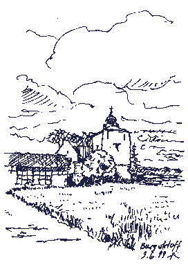
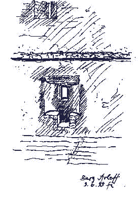
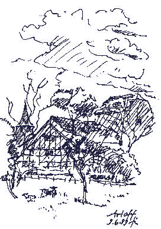
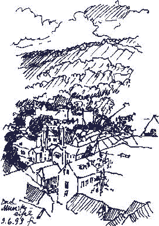
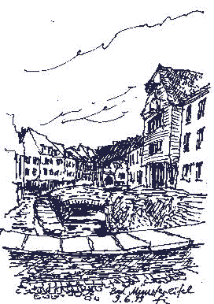
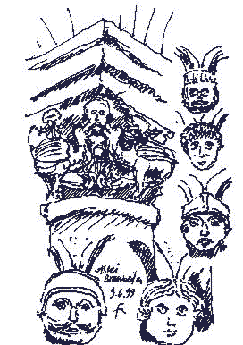

[🠔 Zur Übersicht: Burgen & Schlösser kaufen](8schloss.md)  
# Architektur-Skizzen Architectural Sketches Croquis Dessin von Konrad Fischer auf der Exkursion der Sektion C - Bautechnik am 9.6.1999
**Eine spannende Exkursion zu Baudenkmälern und Denkmalprojekten im westlichen Umfeld von Bonn und Bad Neuenahr/Ahrweiler, bei der zwischen den Exkursionsorten und an diesen doch immer mal eine Minute Zeit für eine kleine Handskizze blieb.**  
_von Konrad Fischer • aktualisiert 09.06.1999_

## Jahrestagung der [Vereinigung der Landesdenkmalpfleger in der Bundesrepublik Deutschland](http://www.denkmalpflege-forum.de/) 
67. Tag für Denkmalpflege, Bundeshauptstadt Bonn, Beethovenhalle, 7.-10. Juni 1999

[Jahrestagungs-Vortrag Konrad Fischer zur Erhaltenden Instandsetzung (ergänzte Version)](11erhins.md)

Führung: Prof. Dr. Jörg Schulze, Dr. Monika Herzog, Dipl.-Ing. Octavia Zanger, Ltd. Restaurator Gerd Bauer Eine spannende Exkursion zu Baudenkmälern und Denkmalprojekten im westlichen Umfeld von Bonn und Bad Neuenahr/Ahrweiler, bei der zwischen den Exkursionsorten und an diesen doch immer mal eine Minute Zeit für eine kleine Handskizze blieb. Eine wunderbare Region mit umwerfenden Motiven und spannenden touristischen Highlights. Wer dort mal Kultur- und/oder Wanderurlaub verbringen will, sollte die hier gezeigten Motive mit in Erwägung ziehen, es lohnt sich. Doch jetzt zu den Motiven für meinen Zeichenstift: 

**Wasserburg Kirspenich in Arloff bei Bad Münstereifel:**

Vor der Burg...Fensternische Nord

 
Die Mühle in Arloff

**Bad Münstereifel:**

Von der Stadtmauer...Innenstadt

**Abtei Brauweiler, Sitz des Rheinischen Amtes für Denkmalpflege:**

Kreuzgang...In Abteikirche, Bauskulptur

