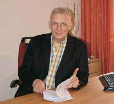
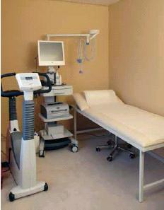

[🠔 Zur Übersicht: Quellen](8infober.md)  
# Chronische Erkrankungen sind hausgemacht und lassen sich durch vorbeugende Diagnostik und Therapie verhindern!
**Behandlung und Vorbeugung chronischer Erkrankungen wie Krebs, Herzinfarkt, Schlaganfall, Bluthochdruck, Diabetes mellitus, Arteriosklerose, Altersdemenz, Maculadegeneration, Allergien, Immundefizite, Umwelterkrankungen.**  
_von Dr. med. Wolfram Kersten_

### Zur Behandlung und Vorbeugung gegen Krebs, Herzinfarkt, Schlaganfall, Bluthochdruck, Diabetes mellitus, Arteriosklerose, Altersdemenz, Maculadegeneration, grüner und grauer Star, Allergien, Immundefizite und Umwelterkrankungen, degenerative Nervenerkrankungen u.a. Krankheitsbildern als Folge von ernährungsbedingten Mangelzuständen.

 Der Bamberger Facharzt für Innere Medizin und Naturheilverfahren, Dr. med. Wolfram Kersten, der Anfang April seine Privatpraxis für Prävention, Regeneration und Detoxifikation eröffnet hat, beschäftigt sich seit 10 Jahren schwerpunktmäßig mit Präventivmedizin. Nach intensivem Studium einer großen Zahl wissenschaftlicher Studien, die schon seit Jahren vorliegen, ist er zu der Erkenntnis gelangt, dass sich durch gründliche, über die üblichen Standards hinausgehende Diagnostik, schon frühzeitig Entwicklungen erkennen lassen, die in der Regel erst nach Jahren zu Chronischen Erkrankungen wie etwa Herzinfarkt, Schlaganfall, Bluthochdruck, Diabetes mellitus etc. führen können. 

„Durch konsequente Anwendung der vorliegenden wissenschaftlichen Erkenntnisse können diese Erkrankungen zu einem hohen Prozentsatz verhindert werden!“ In der praktischen Anwendung hat Dr. Kersten dies immer wieder bestätigt bekommen. 

 Es gibt natürlich Gründe dafür, dass Erkrankungen wie Herzinfarkt, Allgemeine Arteriosklerose, Altersdemenz, Maculadegeneration, grüner und grauer Star, Diabetes mellitus etc. in Naturvölkern in der Regel nicht vorkommen. Ohne Ausnahme kann man im Blut von jedem Untersuchten, der unter den Bedingungen unserer modernen Zivilisation lebt, eine große Zahl von Krebserregenden Umweltgiften und hochtoxischen Schwermetallen finden. Neben ihrer direkten Giftwirkung führen sie zur erheblichen Steigerung so genannter „Freier Radikale“. Den Freien Radikalen fehlt ein Elektron, sie sind deshalb immer bestrebt, dieses fehlende Elektron einem anderen Molekül zu entreißen, das sie dabei schädigen oder zerstören. Dabei entstehen in einer Kettenreaktion immer neue Radikale und damit der „Oxidative Stress“, der immer mehr als das "gemeinsame" Prinzip von Krankheit wissenschaftlich erkannt wird. 

Eine frühzeitige Diagnostik kann diese komplexe "biochemische Entgleisung", die durch die meisten synthetischen Medikamente noch gefördert wird, erkennen und bietet damit einen Ansatzpunkt zur Therapie in einem noch sehr frühen Stadium. Zu diesem Zeitpunkt spürt der Patient/die Patientin noch keine Symptome und fühlt sich üblicherweise noch" völlig gesund". 

 Derartige Untersuchungen werden bei den allgemein üblichen Labortests nicht durchgeführt, weswegen vorbeugende Medizin immer noch ein Schattendasein führt, obwohl wissenschaftlich belegt ist, dass schon mit geringem Aufwand die Anzahl von Krebs- oder Herzerkrankungen ganz erheblich reduziert werden könnte. 

So hat die im Auftrag der US-Regierung von einem hochrangigen Wissenschaftler der Harvard Universität durchgeführte Practon-Studie erwiesen, dass schon mit geringen Dosen von Vitamin C und E die Rate an Magenkrebs, Herzerkrankungen und Linsentrübungen, einer immer häufiger auftretenden Augenerkrankung, drastisch reduziert werden könnte. Dies kann selbstverständlich auf eine Vielzahl anderer chronischer Erkrankungen übertragen werden! 

Zwei weitere Harvard Studien, in deren Verlauf 87.000 Krankenschwestern und 40.000 Ärzte über 8 Jahre untersucht wurden, haben ergeben ,dass sich das Risiko von Herz-Kreislauf-Erkrankungen bereits um 41% senken lässt , wenn lediglich 100 bis 200 mg Vitamin E. als tägliche Nahrungsergänzung verabreicht werden. 

Diese Erkenntnisse wurden durch vielfältige andere Studien bestätigt und werden dennoch nicht zum Wohl der Allgemeinheit eingesetzt, weil sie wirtschaftlichen Interessen im Wege stehen, die in den letzten Jahrzehnten dafür gesorgt haben, dass dieses wertvolle Wissen nicht in den medizinischen Alltag gelangen konnte. 

Bei individueller Diagnostik und Therapie – jeder Patient hat unterschiedliche Formen von toxischen Belastungen, eine unterschiedliche Konstitution und eventuell genetische Defekte an Entgiftungsenzymen, wie man sie bei 40 bis 50% der Bevölkerung aufgrund einer Genanalyse feststellen kann – kann noch weit mehr erreicht werden. 

Welche Laboruntersuchungen können nun über eventuell schon bestehende Veränderungen im Sinne des oben beschriebenen "Oxidativen Stresses" Auskunft geben? 

Es sind dies: 

 * Die Antioxidative Kapazität
 * Vitamin C, E, D3, A, B1, B3, B6, B12, ß-Carotin
 * Lipidperoxide und Hydroperoxide
 * Zink, Kupfer, Selen, Mangan
 * oxidiertes LDL – Cholesterin
 * DNS-Oxidationsprodukte
 * Homocystein
 * Umweltgifte wie Insektizide, Polychlorierte Biphenyle, Hexachlorbenzol etc.
 * Schwermetalle nach Einnahme von Chelatbildnern (DMSA)
 * Glutathin, Glutathion-Peroxidase
 * Glutathion-Transferase, Superoxiddismutase, Nitrotyrosin, F2 Isoprostane
 * Aminosäurenprofil
 * Laktat 

 Wenn nötig, folgt eine ausführliche Hormon- und Immun-Diagnostik, die Bestimmung von Nervenbotenstoffen (Neurotransmittern) und eine genaue Analyse des Säurebasenhaushalts und des Fettsäurenstatus. 

Die Labordiagnostik wird nach Erhebung der Krankenvorgeschichte abgerundet durch eine gründliche körperliche Untersuchung, eine Ernährungs-Anamese, Farbcodierte Ultraschalluntersuchungen der Schilddrüse, des Bauchraums, des Herzens und, mittels Doppler-Technik, der hirnversorgenden Arterien, der Aorta und der Gliedmaßen-Arterien. Wenn erforderlich EKG, Belastungs-EKG, Pulsoximetrie, Langzeit-EKG und Langzeit-Blutdruckmessung. 

Entgegen andersartiger Behauptungen sind Mangelzustände an den wichtigsten Mikronährstoffen sowohl bei gesunden wie auch kranken Menschen sehr häufig anzutreffen. Dies betrifft vor allem die Vitamine B2, B3, B6, B12, Folsäure, Vitamin C und E, Panthotensäure und bei den Spurenelementen und Mineralien, Magnesium, Kalium, Kalzium, Zink, Kobalt, Chrom, Mangan und Selen. Diese Mangelzustände wiederum führen zu unzureichendem Schutz gegenüber “Oxidativem Stress“ und zu deutlich verminderten Leistungen von Zellen und Organen. 

Nicht umsonst also 

 * leidet heutzutage schon jedes dritte Neugeborene an einer Allergie
 * sind schon fast 20% der Ehepaare ungewollt kinderlos
 * hat sich die Spermienzahl von Männern in den letzten 50 Jahren um die Hälfte verringert
 * nimmt die Häufigkeit von Krebserkrankungen, Diabetes mellitus, chronischen Augenerkrankungen und degenerativen Nervenerkrankungen kontinuierlich zu
 * leiden 25 Millionen Deutsche an Allergien der Haut und der Schleimhäute
 * werden Immundefizite ( Störungen des Abwehrsystems ) immer häufiger diagnostiziert
 * treffen Patienten mit Umwelterkrankungen, wie man sie bisher nicht kannte (CFS-Syndrome, Elektrosensibiltät und MCS-Syndrome) auf Ärzte, die dieser Entwicklung ratlos gegenüberstehen. 

Dr. Kersten setzt sich schwerpunktmäßig mit der beschriebenen Diagnostik und den genannten Umwelterkrankungen seit nun 10 Jahren auseinander und hat ein eigenes Konzept zur Prävention und Therapie entwickelt, das durch Gabe spezifischer Antioxidantien (Vitamine, Pflanzenstoffe, Spurenelemente, Mineralien) nicht nur den “Oxidativen Stress“ neutralisiert, sondern gleichzeitig auch jene Umweltgifte und Schwermetalle ausleitet, die entscheidend zur Zunahme chronischer Erkrankungen beitragen. 

Dies führt nicht nur zur Verhinderung vorzeitiger Alterung – einem natürlichen „Antiaging“ –, sondern eben auch zur Vorbeugung chronischer Zivilisationserkrankungen, wie sie oben genannt wurden. 

Weitere Informationen erhalten Sie bei: 

[Dr. med. Wolfram Kersten](http://www.dr-kersten.com/) 
Facharzt für Innere Medizin – Naturheilverfahren 
Panzerleite 82, 96049 Bamberg 
Telefon 09 51/2 97 47 91 · Telefax 09 51/30 27 317 
Mobil: 0 171/ 78 500 58 · E-Mail: praxis.dr.kersten@t-online.de 

### Praxis-Schwerpunkte

Prävention und Therapie von:

 * Gefäss – und Herzkreislauferkrankungen 
mit Folgen wie Angina pectoris, Herzinfarkt, Schlaganfall und periphere arterielle Verschlusskrankheit
 * Diabetes mellitus und seine Komplikationen
 * Neurodegenerative Erkrankungen wie Demenz und Alzheimersyndrom, Parkinsonsyndrom, Amyotrophe Lateralsklerose (ALS) und Multiple Sklerose (MS)
 * Krebserkrankungen jeder Art und Lokalisation
 * Burnout und chronische Erschöpfungssyndrome und andere Stresserkrankungen
 * chronische Augenerkrankungen wie altersbedingte Makuladegeneration (AMD), Linsentrübung, (Katatrakt) und Glaukom
 * Fibomyalgie, chronische Ermüdungssyndrome und MCS
 * Natürliches Antiaging, Diagnostik und Therapie unnatürlicher Alterungsvorgänge
 * Immunschwächen unterschiedlicher Genese
 * Allergien und Nahrungsmittelunverträglichkeiten
 * chronische Intoxikation mit Umweltgiften und toxischen Schwermetallen
 * Fettstoffwechselstörungen
 * Störungen des Säure-Basenhaushalts wie latente Azidose, intrazelluläre Azidose und Laktatazidose Typ II
 * Schilddrüsenerkrankungen
 * Asthma bronchiale und chronische Bronchitis
 * Osteoporose, Arthrose und chronische Wirbelsäulen- und Gelenkerkrankungen

Planung und Bauleitung des Umbaus und der Renovierung der Praxisräume: 
[Architektur- und Ingenieurbüro Konrad Fischer, Hochstadt am Main](index.md) ([sonstige Referenzen](1mader.md)) 

Literatur zum Thema Gesundes Wohnen: 

[Alfred Eisenschink](http://www.sancal.de): **Die krankmachende Ökofalle in unseren Häusern, Verordnete Irrwege und der Ausweg,** Johannes Thomae Verlag, Murnau 2004, 224 S. m. Abb., ISBN 3-938355--00-X

Wie eine neue Staatsreligion ist der Ökologismus über die entchristlicht verunsicherte Industriegesellschaft hereingebrochen und alle machen mit. Wirklich alle? Nicht der Heizungsingenieur Alfred Eisenschink, der wahre Urheber der Heizungsrenaissance rund um die wohlige [Wärmestrahlung und Hüllflächentemperierung](7temper.md), weg vom Heizluftmißbrauch mittels Konvektor und Radiator! Seit seinem aufsehenerregenden Buchschocker "Falsch geheizt ist halb gestorben" müht er sich seit über 20 Jahren redlich mit dem wissenschaftsabergläubigen Publikum ab, um ihm Irrwege zu ersparen und bessere Alternativen vorzuschlagen. Seine Aufklärung ist dabei jedoch keine unwissenschaftliche Gegenideologie - ganz im Gegenteil.

Eisenschink kommt wie immer handfest und mit fundierter Technikargumentation daher, um die Propaganda für all die nicht funktionierenden Wunderprodukte und -techniksysteme rund um Alt- und Neubau auszuhebeln. In bestens lesbarer, leicht verständlicher und unnachahmlicher Manier hetzt Eisenschink seinen erstaunten Leser auch hier wieder durch flott betitelte Kapitel - beispielsweise "Die Geschichte des falschen Heizens", "Die Windbeuterei" (zu Windkraftanlagen), "Die Solargewinnler", "Der Klimaschwindel", "Die Wasserstoffbombe im PKW", "Die teure und nutzlose Dämmerei", "Die luftdichten Schimmelhäuser". Wir alle sind vom Ökoschwindel betroffen, und viele sind ihm schon in die Falle geraten. Mit Eisenschink kann jeder wieder herauskommen. Schon erstaunlich, wie eine bis zum letzten Winkel käufliche Wissenschaft als Ersatzreligion an die Stelle der alleinseligmachenden Kirche getreten ist. Selbst viele unserer kirchlichen Institutionen inkl. Fußvolk der Kirchentanten und Kirchenonkels sind im Gefolge ihrer auf Rechthaberei und Persönlichkeitsschwäche gegründeten Geistesarmut und Christusferne dem diabolischen Sonnenanbeten und der Windgottadolatrie all der Ökogötzen und Ökovergötzung auf den grünbraunschmierigen Leim gegangen. Wo sind die Aufklärer a la Dr. Martin Luther? Ein Eisenschink steht da in der ersten Reihe. Sein Buch wird auch deswegen bis zur letzten Seite wohl kaum beiseitegelegt.

Eisenschinks weitere Titel: "Zweckform, Reißform, Quatschform"; "Falsch geheizt ist halb gestorben - Gesundheit und Rat für Millionen"; "Feuer im Ofen - Glück im Haus"; "Schöner bauen, richtig heizen, besser wohnen" - Unbedingt lesenswert!:
