[🠔 Zur Übersicht: Asia & Middle East](asia.md)  
# 房屋发霉 - 怎么办?
**霉菌在房屋里：了解霉菌的危害，如过敏和哮喘，并获取应对房屋发霉问题的有效建议和解决方案。**  
_von Konrad Fischer_

[Konrad Fischer, 建筑师](1refernz.md)

## 建议

 🇬🇧英文版](7mould.md) 

[德文版](7schim.md) 

检测，防患，和去除菌霉腐微生物，蘑菇类，霉子菌属,担子菌, ,厚卧孔菌,葡萄孢属, 毛壳(菌)属, 分子孢子菌属,木霉属, 曲霉菌, 木霉属, 交链包, 青霉菌, 葡萄状穗霉属，单格孢属,龈枝孢属 

你好,欢迎来到我们的网站!

你在此找寻什么? 霉菌的问题困扰你? 想要摆脱你的房屋发霉的烦恼吗? 你或者你的家人正在忍受霉菌的干扰? 因为霉菌你的健康遭受诸如过敏,哮喘,或者发烧之类的威胁? 

你是否正在寻找好的办法来摆脱霉菌的侵袭?你知道吗?你的嗅觉对霉菌的反应正是一个警告,让你远离这恶浊的空气. 那 你来对了地方,试试我们的方法. 

什么是霉菌?

霉菌是(真菌的一种)多种类的纤维性的真菌围绕潮湿的有机体过度生长.如果霉菌在纺织品上生长被称为长毛了.有些霉菌还有毒.比如曲霉菌, 木霉属, 交链包, 青霉菌, 葡萄状穗霉属, 分子孢子菌属.这些能引发疾病,并导致很多不同的健康问题.很多人对霉菌敏感,有的症状会在接触或者吸入霉菌以及他的孢子后出现. 

什么是有毒霉菌引起的症状? 

这里我们不得不考虑很很大范围内的健康问题比如: 
- 眼睛红肿,水汪汪,对光敏感,长期头疼,皮肤炎. 
- 喉咙,鼻子发炎,打喷嚏,发烧加上流鼻涕,或鼻塞 
- 哮喘症状如呼吸困难,咳嗽,气喘,呼吸极度困难导致哮喘发作, 
- 肺炎症状如肺感染最终导致急性肺炎 
- 记忆力减弱问题, 情绪波动问题以及其它 

谈到这些平常的症状, 你可能揣想每个人都受霉菌的迫害-这可能超过一半是事实。为什么？因为如今有一半以上的现代房屋 都发霉了，长满了霉菌。这意味着我们都将面临霉菌问题而这对于你我而言都是不好的。此外，储藏室，武器库， 弹药[军需]库发霉的现象非常常见。如果你问一个博物馆管理人员，你会了解到发霉的情况在他们的织物，家具上都会发生。这里面还有小昆虫他

  

们靠吃或者毁坏物品如毁坏艺术品，以及珍贵遗产而生存。这些珍贵的东西我们都还以为可以在博物馆完好的保存呢。 发霉的问题在非居住的建筑里很严重，下面即便没有直接提及，也适用一些我们讨论的内容。 
霉菌是如何入侵我们的房屋的? 

让我们先来看看霉菌形成的原因,(如果觉得无聊,就直接跳过这段),我的观点可能是老式德国人的思维,

但有些见解和对事物的阐述和分析可能会与众不同.关于健康的问题当然还是听医生的分析. 

下面我们谈这个问题. 
发霉是违法的行为造成的吗?还是合法的行为造成的?例如 - 德国: 首先- 根据节约能源条例 [无一处能节约能源](7fehrtab.md), 但是我们绝热的房间带着密闭的窗户是最容易发霉的，最后导致哮喘病。: 

德国南部报 16.01.2004: 

**_"来自房屋部的帮助_**

2004年德国房屋部在公众活动的支持下希望帮助私房安装通风系统。该房屋部随后面临低能耗房屋建造方法引起的新的卫生和健康问题。

通风差的房屋不仅阻断了温度交换还阻断了空气流通。很快恶浊的空气集聚。如果人们不想呼吸恶浊的空气，他们有两种选择。要不全部窗户打开四小时，丢掉这昂贵的节能系统，要不就安装通风系统....P.h."

我们还要忍受着无聊的体制搞出来的东西多久啊？为啥不自己做决定。 

出自“世界“ 2003年5月27日:

节约了能源,但是霉菌留在了你的肺里 

_霉菌在房屋里增加了过敏原，灰尘和有机垃圾，搞得房屋像霉菌垃圾场_

_Ulla Bettge_ 语录

斯图加特-旧式窗户和高大的传统式的老房子非常协调统一.但是,…有时候我们选择了封闭式的新式窗户. 
接着空气交换被阻断—喜爱温暖和潮湿环境的霉菌找到了最好的生存空间. 
尤其是能源节约型的房屋常发生这种情况.这些房屋使用诸如塑料,多分子材料和纤维玻璃. 

出自Jena的 _Friedrich-Schiller_

_该大学的研究表明,15百万多的德国人居住的7百万左右的房屋里有墙体发霉问题,就像海绵吸水一下不断增长._ 

K. Fischer 的独特见解:

正如你在圣经里读到的那样,霉菌和潮湿的墙体是孪生兄弟.所以前人在选择建筑材料时,挑选了最能解决

这一问题的材料.

_"旧式房屋材料如砖块,泥巴和木材能吸收水分,因此潮湿的环境不容易形成.但是近几十年的新式建筑,用_

聚苯乙烯类涂料封闭了房间的四面墙壁.由于乳胶类物质和塑料墙纸阻碍了蒸汽形成使情况变得更加糟糕, 这样一来自然的干燥过程无法进行,湿气在石膏和涂料间聚积. 

此外,中央供暖系统喜爱湿度高的房间,这样的房间在厕所,洗澡间等处和19世纪60年代相比消耗更多的水量. ... 

只有干燥空气的流通才能减少房屋的湿度. 

病毒和孢子分布于房间各处,和空气里的尘埃结合,通过空气在房屋扩散. 

非常小的孢子被人呼吸进体内,会堵塞呼吸道.如果人体内部器官的免疫系统不足会引发真菌感染.100.000种真菌类型和

房屋灰尘里的小虫是最先的最为重要的室内过敏原的来源.

这样的“空气污染“会导致过敏的人,轻则感冒,打喷嚏,呼吸困难,重则引发支气管哮喘.

有一种过敏预苗被认为可以长期保持健康，这对过敏性疾病而言是个新消息。 

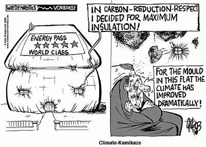 
[Götz Wiedenroth: 气候“敢死队“队员](http://GWiedenroth.googlepages.com/) 

好了吧，现在我们知道谁是始作俑者了：医药行业。他们治标不治本。其实看穿很简单，只要我们讨论一下事实情况。这其实能帮助解决所有具体的问题。像所有严重的疾病，

从哮喘到皮肤过敏，甚至到器官感染和血液感染。

原因就是黑霉菌和糟糕的环境和原因是人们呼吸了霉菌的孢子.这些都是由现代的建筑方法引起的.他们是用密闭的建筑,人工的多孔砖石,有机合成涂料和没有效果的通风系统.如何摆脱

由现代建筑引发的哮喘,头痛,皮肤炎等疾病? 也许我们应该和这些所谓现代建筑,所谓有成就的工程师,建筑师说拜拜.别让他们再毁坏我们的健康和生活啦. 听听霉菌专家的意见,找到解决方案?或者直接用木材和砖块和石灰来建房,恢复我们旧式的窗户,你应该听取这些建议来改变你被霉菌侵害的房屋.让我们在不需要花钱买昂贵通风

系统的条件下健康生活吧. 何乐而不为呢?

__

中德新闻报 MZ 7/02:

**_"霉菌成了一个问题_** 
_烟囱清扫夫是清洁空气的贡献者_

_昨天据_ 来自 哈里Jena 大学的Sabine Brasche讲述六百万以上的德国房屋遭受霉菌和湿气的侵害， 因此将近有15百万的人深受其害。这会引发过敏和呼吸问题。科学家介绍了国家烟囱清扫夫协会，于星期五结束了哈里一年一度的会议。jena大学的研究结果就是将近7百万的人

受霉菌和湿气的侵害，这对15万人健康有相当的潜在威胁。作者 _Sabine Brasche. .._

但政治，媒体和经济对此又做了什么呢，至今没有行动，除了鼓动大家购买通风系统。 

---

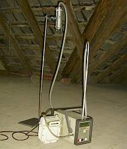 
通过采集空气样品可以了解屋内污染状况-这里安装空适合木质材料的空气采样器 -

---

 点击: R-值-愚蠢](2139bau.md#u-narretei) - 最为严重的发霉情况是源于现代建筑技术，他们主张在防水材料表面冷却热空气里的分子，而不是通过防水材料传递热量。所以他们需要轻质材料，

密度越低越好。密度高的材料就不好。这就是所谓科学家得出的结论，并由绝缘材料产业得以推广。

物理页 45 2000年11月10日 (S. B 2531): _" 医学报告真菌学

**霉菌****- 令人讨厌的同居者**

为了节约能源花费，如今人们采用了绝缘材料，这给霉菌的滋生提供了土壤。

越来越多的过敏性疾病在室内发生的机率高于室外，这是由于室内有更多的嗜热生物种群。如 空中浮游微生物导致了 烟曲病. Axel Schmidt博士在德国

柏林的真菌协会34次会议上作了这样的报告(Wuppertal),公开的对通风的必要性作了清晰的阐述。.

很多户主使用各种绝热材料来达到隔热的效果。因为能源的花费在不停增长。但是房屋发霉的损失早就超过了这些被节省的钱。

因此实施情况证明通风的策略，空气的交换能够减少霉菌的形成。应该指出绝缘材料的使用，空气的循环使用影响了霉菌的形成。

住户必须了解到经常性通风

和减少湿度和灰尘以及错误的家居布置可以降低霉菌的污染。. ... **Ferdinand Klinkhammer博士"**

---

如果房子发霉了，我们怎么做？ 

**墙壁发霉--原因和解决方案**

房屋发霉问题是老生常谈了。通常房屋发霉的原因是错误的房屋建造方式，建房物理结构.的错误估算以及通风的不充分和糟糕的供暖系统。

下面介绍最常见的情况. 

**前言 :** 房屋发霉不仅是结构缺陷. 通常会随之产生有害细菌甚至导致有毒物质的扩散。这样相当多的疾病问题会由此而产生。不仅是小孩其实还多大人也是霉菌症状的受害者，比如哮喘啊，过敏啊。A空

气湿度太高会在屋内墙面上清楚地反映,会导致发霉现象,这样

会让木质部分受潮,一些木质寄生虫 
和其他白色毛孔类微生物和棕色毛孔类微生物以及木虫和其他能毁坏木材的昆虫如白蚁会在这样的条件下出现..因此下面的建议不能仅仅并理解为单一的方案,其实他们

结合了医学专业,真菌类专业的知识和技术...

通常霉菌在不是非常热的环境生长,是不是我们要改变室内室外绝缘材料来很大程度上提高温度,这样的可笑

要求总被人提出.常常会造成建筑错误和建筑损害.

所有的这些绝缘策略都是没啥用的.霉菌需要潮湿的环境.除了在建房过程中带来的水分,还有漏水的屋顶,潮湿

烟囱造成的潮湿环境.大约65%的湿度下,霉菌会很快增加.每天四人居住的房屋里,要在屋内使用

7-15升的水,比如烧饭,洗衣,洗澡,浇花等等.这样仅仅开靠几分钟的窗户对减少湿度是没有一点帮助的.

空气太潮湿,在冷的表面水蒸气凝结形成水滴,渗入建筑材料的缝隙.为了蒸发这些水分,就要消耗能源 _。_

房屋的通风系统不能通过充满水气的墙体传递能量。墙体外部会在夜晚的时候越来越冷，冬天还会结冰。

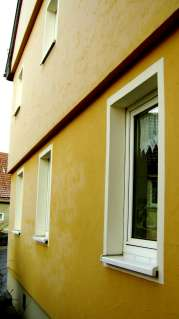在一半木质结构的房子里热绝缘的材料上面的结冰状况,(前面发亮的部分)

拥有非常低的热传导能力,于2006年1月9日八点. 

同时凝结的水将填满缝隙,这样热空气就不能充分对流:在墙顶和地面的交界处,在房间角落,在插口处,在窗户边.

很多水会在洗澡的地方制造潮湿的环境,这不仅会导致发霉,还会给昆虫提供在瓷砖和墙壁缝隙生存的机会.现在

这些冷的区域正被现代供暖技术称之为热桥.结果这些所谓专家们要求墙体绝缘.我的一些图片可以说明这一

情况 。

 
_卫生间发霉1:_ 短期的高湿度的空气不能在墙体里保留,因而使得墙体表面结累了很高的湿度,再加上玻璃窗的冷气的冲击.在这种情形下,就形成了发霉的现象.

 
卫生间的黑霉2: 在冰冷的窗户四周的酸性的涂料给霉菌提供了温床.正好和碱性的石灰相反.洗浴后短时间的空气交换不能减少空气湿度.在洗澡期间和洗澡过后湿气会跑进冰冷的墙和天花板的间隙. 

地板和墙之间以及墙和天花板交界处的霉菌.密闭的窗户,热空气,夜晚空气温度的骤降!这些条件对霉菌来说太好了.简直是天堂。 

湿气和热空气流在墙体表面 

 
这个发霉的墙角在一个地下室,漏水的管道浸湿了墙.

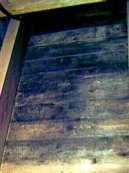 
发霉屋顶里面的样子:湿热空气不充分的交换加上冷的屋顶表面导致了发霉的情形. 

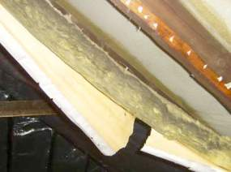..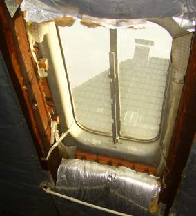.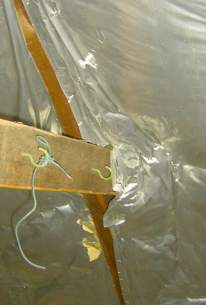 
发霉都要怪这个绝缘材料,这种想要长期的隔绝空气的做法是不对的.很多美国的和德国的所谓能源节约型的房子将证明这是多么的不正确. 

[矿物棉](http://atriumhaus.at/1999/feuchte-mineralwolle.htm) 绝缘被浸湿 + [矿物棉 绝缘被腐蚀](http://atriumhaus.at/1999/wifi-ooe-mineralwolle.htm) - 来自Austria的Bammer先生的照片 

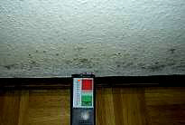 
霉菌在墙纸里 – 外面是聚苯乙烯膜,里面是乳胶漆,自然就又是隔绝空气的窗户了. 

讲到重点: 每种形态的纤化的，多孔的，毛质的绝热材料都是假的。热隔热和未隔热的热量花费比较和 Lichtenfels实验(在2001年Lichtenfels市的实验后) 证明,材料一边的温度增加热量能够穿过到另一边。和高的R值没有关系。反而石头和木材能减慢温度的减少。这

种对热量的吸收不能损害IR辐射的穿透力的阻碍，IR是主要的热量的传递方式。 

 
_Lichtenfels 实验的数据显示材料在被红灯泡加热后十分钟后的温度。刚开始的温度是20 °C. 所有不同U值和R值的材料都是4厘米厚。在未加热的一面测温度。从上到下的材料是：矿物质毛物和纤维玻璃，聚苯乙烯，泡沫玻璃，砖头， 木板，石膏，结实的松木。结果是：U值和R值和实际建筑中认为的很不一样。这一实验被电视台播出了，对绝缘企业以及他们的朋友-政府机构而言是一个惊讶的消息。结论：节约能源靠用隔热材料是不对的，我们低估了材料的吸收并保留能量的能力。我们应该通过这些材料来节约能源，有意识夏天节约太阳能。[链接事实证据](7fehrtab.md)._

 
该图显示了不同的三个房间不同的墙体建筑消耗的热量，冬天不同的U值，R值，k值，由 Fraunhofer建筑物理研究所提供 . 绝热墙 R: 0,16 ， 0,32 是最差的, 没有绝热的砖墙 0,46 是最好的! [细节.](7fehrtab.md)

两个简单的办法能解决问题:

一旦有足够的空间给空气交换,橡胶包裹的密闭窗户是典型的发霉现象的导火线.最简单的补救办法是拆掉

这些窗户上面部分的橡胶制品.这样雨水就不能渗透.不是每个窗户,但要逐渐的拆除,直到没有发霉的情况.

旧窗户没有橡胶制品密封它,和玻璃的紧密结合就直接避免了霉菌的生长.如果我们需要密闭的窗户,那所谓

专家们就会建议人工通风.那房间就会成为霉菌,各种孢子和昆虫以及有害细菌的摇篮.很快在通风的冷空气媒介下生存能力强的细菌开始定居. 

如何消除在窗户夹层里的雾气和冷凝水?对旧式窗户而言这不是个难题.---只要给房间充分透气,这些就会消除.如果你想靠加紧窗户框来达到干燥的目的,你就大错特错了.这样发霉情况会更严重.冷凝水会被卡在房间

建筑的表面上,这些潮湿的墙体表面出现发霉现象的几率非常高.还有就是使用现代的加盐技术.在框架上有盐用来吸干水,但是盐用光了,就没

这功能了,就得换这些材料.抱歉,事物都有两面性,对吧?

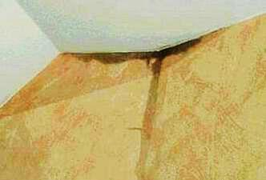 
屋顶空气管道出来的恐怖的黑水. 看起来怎么样?

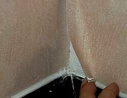 
被霉菌浸湿的墙纸. 加热和干燥不能阻止水气在冷墙面上的冷凝

墙面不会被霉菌侵害的温度只能由[IR-辐射供热](heating.md)辐射的供暖来提供.供暖系统首先加热屋内空气,外部墙会比热空气温度低.此外热湿的空气流会产生....draft

和旧式的篝火式供暖,中央供暖系统不能把用过的空气通过烟囱排出来达到出去房间内有害气体目的.也不能

通过窗户间的缝隙流通新鲜的空气. 这样就出现了发霉现象. 

替换供热管道是可行的.用热水交流来供热不能用其他材料绝热这些管道.辐射供热将首先加热材料而不是

空气.无论如何通过空气供热的系统对人的健康是有害的.他们污染了我们最重要的东西—可呼吸的空气

.此外空气供热还能毁坏我们有价值的博物馆文物,纪念碑的外表面,石窟绘画,其他木质结构.这些东西都会

因为空气在冷的表面积累湿气从而最后被红木虫或者因腐蚀而毁坏辐. [IR-辐射房屋保护的加热系统 (德语.: 'Huellflaechentemperierung') ](heating.md)

辐射供暖系统在很多方面有优势,不仅仅是在预防发霉方面.

**漏水管道引起的发霉**

有很多原因会产生管道漏水.由于没有及时发现,湿度会很快增加,导致一个我们都不愿看到的结果.霉菌

迅速繁殖.霉菌迅速繁殖的征兆是,比如恶臭的气味,有了健康问题却找不到原因,当然也有显而易见的大范围

可见的霉菌.

有很多原因会产生管道漏水.由于没有及时发现,湿度会很快增加,导致一个我们都不愿看到的结果.霉菌

迅速繁殖.霉菌迅速繁殖的征兆是,比如恶臭的气味,有了健康问题却找不到原因,当然也有显而易见的大范围可见的霉菌. 
如何发现和分析发霉的情况取决于物理上霉菌的状况以及微生物方面的状态.也许一个经过特别培训的“霉菌狗“可以

嗅出，但无论如何它不能准确分析和解决问题。解决方案可以由各种情形而不同，可以是技术干燥这个区域可以是

彻底更换发霉的区域的建筑材料等等很多方案。。。。

**新建潮湿的建筑发霉**

在建筑材料如涂料，水泥地等之间的长期的湿气的增加常常被低估了。这导致了屋内的空气湿度增高，这些空气

必须被排放出去，才能避免房屋发霉。如果一个周末门窗紧闭，周一你会惊奇地发现屋内墙壁结了一层厚厚的霉菌。 
解决对策是烘干墙壁同时通气，一些建筑干燥的技术也可能有帮助。 

潮湿的水泥地，屋顶等长期散发湿气数月后也会导致地板变形，发霉等。通常有很多办法可以选择。建筑干燥技术，

永久供热易发霉的地带，这些能减少潮湿程度，并和霉菌作斗争。 

**发霉是墙面潮湿的结果**

首先热湿空气遇到冷的表面会凝结。和夏天的热湿空气相比，墙面和未供暖的房间相比是冷的，这样就能积聚非常多的冷凝水。

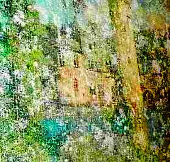 
_地下室凝结发霉. 不是[湿气增加](2auffen.md), 而是外面的湿空气进来了导致长毛以及腐烂。_

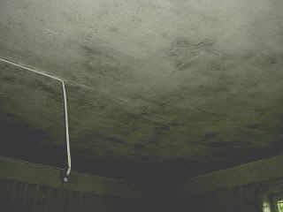\+ 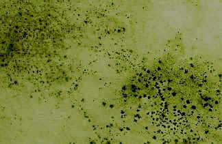 
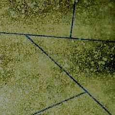 
发霉的墙和顶，加上塑化的或有机的涂料，几年后加上储存的湿气，给黑霉的侵袭提供了绝好的环境。

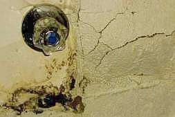 
C3A-加上水泥的石膏和地下的潮湿的 CaSO4 会和盐矿物质反应，体积会变大。结果石膏从地下爆裂。然后黑霉就出现了。

空气交换会有帮助，但只能在外面的空气温度低于墙体温度的条件下。这在进出口处和夏天通风的房间，

这就行不通了。这里一些材料容易干燥如石灰自然是首选。 

很多涂料有阻滞蒸发的功能，这里没有一点用处。防水的成分早就妨碍了孔隙的干燥过程。重要的是

在建筑材料间的湿气传播是液态水份在孔隙传播的1000倍。所以防水这一点根本就没有价值。 

 
引起干燥腐烂的菌类藏在地板下 . S简单的便宜的补救办法不是一些专家的会毁坏和毒害我们房间的办法，他们用毒物杀死木虫，蟑螂和其他害虫。如何除掉这些所谓的朋友们，干燥你的房屋呢。木材湿度要小于15%，空气湿度要小于65%。 [更好的供热 ](heating.md) 并永久的减慢空气交换。如果你的房子中毒了，这些办法也许管用，但这对你的和你的家人好吗？

第二个湿气的来源是地面。但是这不是所谓的第二个湿气的来源。增高的湿度. 通常的砖石建筑这是不可能的。不可能从粗孔隙的砖石穿过精密孔隙的石头。T-加入化学液体不能有效果，只会毁坏砖石。 

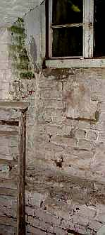 
夏天藻类暴长和肮脏的涂料面不是['湿气增加'](2auffen.md).导致的。昂贵的残酷的一些办法比如 DPC和补救石膏对此无计可施 。

真正的潮湿是由凹坑导致的，水积满了，此外管道漏水。如果下雨特别多，凹坑里积满了水，超过了建筑的封水面，因为外面压强大。加上坏了的排水管道，这就直接导致了潮湿。

补上凹坑可以用便宜的普通的粘土。这是相对简单的办法，你还可以自己完成。漏水的管道可以取出，再修补坏了的地方。

墙体的霉菌和藻类

不好的气候条件和错误的绝热方法是黑霉，绿霉和棕色霉生长的前提条件。a干燥的热塑化的涂料将会增加发霉的几率。n冷凝以及由雨水渗透到破旧的聚合涂料。热塑化的涂料密闭性又阻碍了水分的挥发。C

此外合成的涂料是藻类和霉菌的最好土壤.这样的涂料会加上一些杀藻剂和杀霉剂.可惜的是这些化学毒性的武器

只能短时间起作用,他们都是溶于水的,会被雨水冲掉,最后这些污染的雨水又毒化了你的花园的土壤.

[热绝缘的墙面导热性](213baust.md),但又没有足够的能力储存热量,不管是由多孔石,泡沫,织物还是毛织品做成的,都会很快

冷却.然后被他们冷却的空气就在墙面冷凝了,这就给霉菌和藻类地滋生创造了条件.热的木板钉处冷凝会少.这样的

地方霉菌和藻类就少.但是我们的工业发展很快发现了绝缘的材料做的钉,这样藻类就统一的布满了整个表面. ...

现在你要一遍一遍的清理这些霉菌就像长期维护和修补裂缝一样成了日常工作.经典的维修时用碱性的石灰产品,

在气候不好时懂得保护,如果必要铺干燥的板材也是一种选择.

 
"藻类侵袭热绝缘的墙面" out of '[Research] 热绝缘; in: ['Bautenschutz und Bausanierung', periodical for building maintenance and monument care](http://www.bautenschutz-bausanierung.de/), 1月2002, S. 44, 照片拍摄者: Wismar 大学, scan K. F.

**修复和清洁**

修复发霉的墙壁需要考虑到预防和控制，没有解决发霉的根本原因，就不能有一劳永逸的修复和清洁。

请注意：一些墙面材料是霉菌的温床，请不要使用这些材料比如墙纸，合成纤维，

塑料，和涂漆，选择使用一些霉菌不容易滋生的材料，如石灰

清洁发霉的墙面，廉价的酒精能起到最好的效果。酒精能够没有残余的干燥墙面，把

霉菌彻底清除。其它有毒的化学品或者醋酸我们不推荐。毒菌喜欢酸性小于7-8的环境。碱性的石灰产品可以保护墙体避免再次发霉--而且石灰要没有有毒化学添加剂。

也许这些信息还不够解决你的问题，那请参考一下链接[老房子和纪念碑的维护信息](index.md) 他提供了1500多案例

Konrad Fischer, 建筑师 BYAK, Hochstadt a. Main

---

补充- 对过敏疾病论坛的建议:

很多情况下潮湿房屋里的过敏问题是因为在现代密闭房屋里的错误举动导致的。

在白天干空气不能通过密闭窗户的交换。我建议把窗户上部的橡胶取下来，接着一点新鲜的空气可以渗透进来。污染的空气可以跑出去，但这样的日夜交换还是不够除湿的。 

接着是空气里的湿气当遇到绝热墙面的时就冷凝了,因为热绝缘的材料导热差,温度比空气低,这种冷凝情况就出现了.接着这些冷凝水也挥发不掉,因为这些材料没有孔隙.也许

你可以打开一部分墙面,看一看里面,如果变灰了,说明长了霉菌.这种潮湿的绝热的材料要被换到,换成木材或砖块,这样冷凝情况就不会发生了,也不会发霉了。 

下一步可能就是去掉窗户上部的橡胶,关掉排风扇.也许在清除后还会有一些霉菌藏在一些地方,然后跑到空气里。 

通常这些举动足够改善被污染了的空气情况。 霉菌孢子是到处存在的,这意味着他们他们的存在就像普通的物体,在空气里或者空气外存在.只是浓度高时才会引发过敏,哮喘等等.所以通过通风,丢掉发霉的东西减少浓度,

这样就可以解决问题.。这是我的建议。 

祝你好运! 
Konrad 

[霉菌 霉腐微生物 真菌 ](http://www.restcon.com/links/articles/mold_and_mildew.html)- 额外的资讯 

---

这为新旧房屋,历史性建筑,农庄的房屋,普通住宅,城堡,遗迹,碉堡,宫殿,教堂,寺庙等提供信息和咨询,也给纪念碑的保护和维护提供建议:他们是否因为人多,服务不足,过量的酸雨,城市空气污染,地下水的高湿度,或者时间的推移,天气的变化,腐蚀,腐化,不欠当的化学品作的补救措施,建筑师,街头流氓,流浪汉的毁坏行为而产生诸多问题?建议和方法是用于旧房屋的维护和恢复历史性建筑以及其房屋的修缮,装修,房屋的修补,以及整个历史性建筑内外的维护. 纪念碑的保护理论总是被批判.你有你有木质的房屋吗,或者石头房屋,或者钢筋的框架,或者一半木框架?你的房屋需要维护或者修缮,或者整个建筑的结构调整,重建?不一定都是私人住宅,也可以是商业用房,办公楼,储藏室, 任何现代化的建筑都可以在我们的范围内. 甚至是老市政府楼,历史磨坊,废弃的火车站,水磨坊,或者是别墅.不过是谁拥有这些房产,或者想维修或者改建希望能够节约资金.这个网站可以提供建议. 这个网站还能给城堡修缮,教堂维修提供最简单但却是最好的办法.有时候一些地方的用适当的方法整修一下就足够了,不是什么时候都需要彻底改建,这样可以节约资金.我们可以经济的维修却不需要受繁琐的条文和规章限制. 这些通常是建立在智慧的谦虚地设计上.这些尤其在半木质结构的房子的维中显得特别明显.如果你将买一个度假屋,你会发现这些房子都在奢侈房屋的行列里.这样算一笔经济帐显得尤为重要.你对花多少钱?贷多少款有兴趣吗? 需要升职,贷款,补贴,赞助才够做这样的投资吗?补贴不仅可以花在建筑其实也可以花在规划上.如何获得补贴呢? 我们要在这里讨论.接着就到了提供服务人和公司这一内容 ,比如建筑师,建筑公司,建筑规划层面的以及其他结构工程师,建房技术人员, 提供化学物体结构建设的,下水管道的,空调的,通风的,以及其他专业的服务,或者是工匠.有时候顾客非常满意建筑师的建议,也喜欢自己亲自完成,这样经济又实惠.不是所有人都能被称为专家学者,作为一个霉菌方面的专家,确实需要专业的知识和技能才能为你的健康生活环境提供建议或者在你的预算范围内把你的房屋建成完美家园. 在这你可以获得节能的信息,生态方面的建议.房主说,我想建房或者修房.老鼠跑出来了.这里有对关于节能条例的反对意见.你对房顶隔热有兴趣吗? 你想减少能耗吗?但很可能霉菌会破坏你的房屋.这里你会找到霉菌的信息.你的房屋变绿了吗?在墙上有霉菌的痕迹?你可以在这里得到帮助.风水和生物或生态,历史的,自然的建筑材料都是有部分绝热功能的, 比如粮食,麦片,玻璃.但我们不能肯定有用一些有毒化学物来保护木材是好的,这些杀霉剂最终会危害人类的健康.他们也会杀死我们的朋友,像粮食.并且也不能保证他们将永久除去霉菌,绿藻,木虫等.我们应该选择其他方法. 有流行的和反流行的方法,比如用彩色画的形色,涂料,石头,石膏,以及大理石这些修建屋顶.也有关于木匠建筑房屋的批评性意见.还有水管和供热管道的破裂的批评性意见.也在材料方面找出了很多选择:石灰,粘土,水泥,钢筋,砖石,这些有的还可以做成合成颜色.这方面也有很多话题.这些话题里也包含霉菌和潮湿的问题.窗户的在房屋里的重要性关系到屋内环境质量,房屋的可持续利用,以及被污染的房屋对人身体健康的以及屋内宠物身体健康的影响. 这里可以找到技术方面的信息, 如石灰的裂缝,细纹,石头的恢复和修缮,大理石的恢复,辐射供暖,以及地面供暖,屋顶供暖,墙体供暖,水,空气和湿度以及靠太阳能等供暖.这里也有我的同事们提供的意见,他们是Claus Meier教授, Jens Fehrenberg教授, 建筑师和工程师 Paul Bossert,博士 Dieter Martin, 教授 Jörg Schulze, Mathias Bumann 等等. 如果你有意见和建议可以多多阅读我们的网站. 人在发霉潮湿的环境居住有什么影响吗 天花板 黑霉 如何干燥房子 怎样除去屋内的潮湿气 房子里有霉菌对人身体有何影响 房屋发霉的原因 房屋墙体为什么长黑霉 房屋霉菌,身体 房间内有霉菌孢子怎么办
