

Weitere Datenübertragung Ihres Webseitenbesuchs an Google durch ein Opt-Out-Cookie stoppen - Klick! 
Stop transferring your visit data to Google by a Opt-Out-Cookie - click!: [Stop Google Analytics](javascript:gaOptout\(\)) [Cookie Info.](cookie.md) [Datenschutzerklärung](datenschutz.md)

**[Klick zu Vollbild](index.md)** 
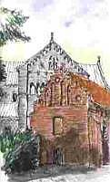 
Der freche **Ratgeber: 
[Sparsam Sanieren](http://www.gdigest.com/product_info.php?ref=79&products_id=1189)** 
(Buch/eBook) 
**[Vertrauens-Umfrage](umfrage.md) 
u.a. Leser-Umfragen 
**Ihre**** Stimme zählt! 

**[Suchen auf Seite/Search 
Übersicht/Sitemap](1suchen.md)**

---

 🇬🇧 🇺🇸 
🇸🇪 🇵🇱 🇩🇰 
🇫🇷 🇨🇭 🇮🇹 
🇧🇪 🇨🇦 🇳🇱 
 🇧🇷 
 
 🇪🇸 
🇦🇷 
🇲🇽 
🇨🇱 
 
 
 
 
 🇨🇳 
 🇯🇵 
🇬🇷 🇭🇺 🇫🇮 
🇳🇴 🇷🇴 
🇨🇿 

****_ÖKO-Mafia_ 
Klima-Schutzgeld- 
Erpressung:**** 
EU-Energie-Effizienz- 
[Richtlinie](7wdvs02.md#energieeffizienz) 
[Drucksache 
15/708](7wdvs07.md#schlaue+ã–koregierung) des Bundes- 
ökoregimes 
[Energiepaß/](7wdvs02.md#energiepaãŸ) 
[Energiespaß?](7wdvs02.md#energiepaãŸ) 
**Kontra** 
Wir wehren uns: 
**[Verfassungs- 
beschwerde](7eeg.md) 
gegen das EEG 
Ökobetrug:** 
[CO2-Sanierungs- 
programm](7bo.md) 
Ein großer Schwindel? 
MdB-Umfrage: 
[INFAS/FAQ](7thu62.md) 
[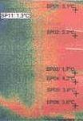 
Thermoschwindel](7wdvs06.md#thermografie) 
[Klimafakt/-lüge 
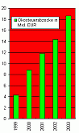 
Ökosteuer 99-04](7thuene1.md) 
[Alternativenergie](7temp23.md) 
Dr. H. Böttiger: 
[Die perverse Geschichte](7thu68.md) 
der GRÜNEN 
[Ökoatom](7boet2.md)

[Bairischer Ökogrusel](7wsvoant.md#aecht baierischer grusel) 

[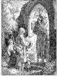](2000.md#dedikation.) 
**[Dedikation/Widmung](2000.md#dedikation.) 
 
[A k t u e l l e s](12akt.md)** 
Konrad Fischer im TV 
[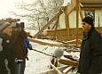 
**Halleneinstürze:**](212bau2.md) 
[BR3 Quer](http://www.br-online.de/kultur-szene/quer/aktuell/) 26.1. + 9.2. 
2006 20:15; Pressetalk 
m. FOCUS, SZ, BYAK: 
[München TV](http://www.cityinfotv.de/) 9.2. 20:00 
 
[Pressetalk auf DVD](11form.md#mittschnitt) 
[Talk-Clip wmv 2,9 MB](mtvclip1.wmv) 
[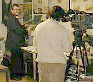](http://web.archive.org/web/20020109035935/http://www.mdr.de/kulturreport/251101/thema4.html) 
ARD-Kulturreport 22.11.01: 
[Vom Schloß zur Ruine](http://web.archive.org/web/20020109035935/http://www.mdr.de/kulturreport/251101/thema4.html) 
ARD-Globus 3.4.02: 
**Lichtenfelser Experiment** : 
["Zwang zum Energiesparen: 
Pfusch am Bau?"](http://web.archive.org/web/20080109200932/http://www.br-online.de/ard/globus/20020403.html) ([Mitschrift](http://www.bau.de/forum/bauphysik/112-17.htm)) 
ARD 8., 3sat 21., NDR 27. 
rbb 29.5.04:[Ratgeber Bauen](http://web.archive.org/web/20040622224645/http://www.wdr.de/tv/ardbauen/archiv/040508_3.phtml) 
WDR 14.5.04: [ServiceZeit](http://web.archive.org/web/20080112074801/http://www.wdr.de/tv/service/bauen/inhalt/20040514/b_4.phtml) 
**[Fensteraustausch?](23bausto.md)** mit dem 
[ift Rosenheim](http://www.ift-rosenheim.de) \+ K. Fischer 
**TV mit meinen Freunden** 
WDR 16.6./17.11.04 
Rainer Hoffmann zum 
Solaranlagen-Schwindel 
in "[Menschen hautnah"](http://www.wdr.de/tv/menschen-hautnah/archiv/2004/11/17.phtml) 
[www.solarresearch.org](http://web.archive.org/web/20071127014442/www.solarresearch.org/) 
[Die Homepage-**CD**](11form.md#cd)

**Kultur / Historie** 
Bildklick Beaujolais: 
[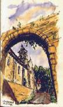](8beau.md) 
[Museums-+Kultur-Info](8museum.md) 
[Museums-Quiz](8museum.md#das museums-quiz) 
[FLMus. Ballenberg](8balberg.md) 
[Kulturmanagement](8museum.md#kulturmanagement) 
[Denkmalpflege](8berat.md) 
[Denkmalpflege?](4behoerd.md#finanzierungsrichtlinien) 
[Denk mal, Pfleger!](11erh10.md#der denkmalpfleger) 
[Denkmalzerstörung](8ks1.md) 
[Denkmalvorträge](6sv.md) 
[Bau-"Forschung"](3gutacht.md#befunduntersuchung) 
Geschichte](8buch15.md) 
[Kirche/Kloster](8buch10.md) 
[Mond-Jesus](8dom.md#mondjesus) 
am Kreuz: 
Ein Mondgott vor dem 
Kardinalpunkte-Sonnen- 
Kreuz am dritten Tage 
wieder auferstanden+ 
in der dritten Nacht 
wieder sichtbar?

[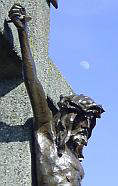](8dom.md#mondjesus) 
**[Burg/Schloß](8reise.md)** 
[Schloß zu verkaufen](8schloss.md) 
[Wissenschaft 
Literatur/Quellen](8buch.md) 
[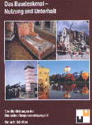](8buch.md#tagung+nã¼rnberg) 
[Das Baudenkmal](8buch.md#tagung+nã¼rnberg) **Planungstechnik** 
 
[Planungshilfen](11form.md) 
[Planungsmethodik](11planme.md) 
[Beispiel Altbau- 
und Planungskosten](10hoai26.md#beispielrechnung) 
[DIN - ein Muß?](2mbu.md) 
Der klassische [Bauherr](11erh05.md#der bauherr) 
[Der Herrscher](11erh02.md#baustoffmarketing) am Bau 
[Reparatur](11erhins.md) 
[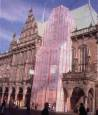](11erh14.md#musterachse bremen) 
[Beispiel Musterachse](11erh14.md#musterachse bremen) 
[Beratungs-/Infolinks](8infober.md) 
[DBV-Praxis Ratgeber](6prxratg.md) 
[Tragwerk/Statik](11erh16.md#tragwerksplanung) 
[Brandschutz](6brand.md) 
[Die BMA-Falle](6brand.md#die bma-falle) 
[Altbau-SiGeKo/-Plan](2sigeko.md) 
[Haustechnik](10ht.md) 
[Haustechnik](11erh17.md)[+Denkmal](11erh17.md) 
[Heiztechnik](7temp01.md) 
[HOAI ja oder nein?](10hoai.md) 
****amtl.****[HOAI-Mißbrauch 
(org. HOAI-Kriminalität)](421voef.md) 
[Anti-H O A I](10hoai.md#offener brief) 
[Honoraranfrage](10hoai12.md#honoraranfrage) 
****staatl. erzwungene**** 
[HOAI-Mindestsatz- 
unterschreitung/VOF](10vof.md) 

 ****Tips/Tricks:**** 
[Bauherrnbeschiß](10hoai22.md#ausschreibungsschwindel) 
[Planer einsparen](10hoai27.md#last but not least) 
[Planlusche finden](10hoai18.md) 
[Hintenrumhonorar](10hoai10.md#luxusplanung)

[durch Luxusplanung](10hoai10.md#luxusplanung) 
[Pfuschplacement](10hoai22.md) 
[Kostenexplosion](4kostex.md) 
[Vergabeschwindel](9cadava.md#vergabeexkurs) 
[Handwerker-Quiz](10hoai13.md#handwerkerquiz) 
[+Planer-Quiz](10hoai14.md#planerquiz) für 
**[Schlaubauherrn](10hoai16.md#bauherrn-quiz)** 
 
**D sucht d.** Super-Planung](10hoai15.md#superplanung) 

**Vergabetechnik** 
[Angebotsvergleich](10hoai17.md) 
[Angebot vom Bieter](10hoai13.md#handwerkerquiz) 
[C A D / A V A](9cadava.md) 
[GU-/GÜ-Vergabe?](9cadava.md#gu/gãœ) 
[VOB/A im Bestand 
Wie Beschreiben?](9pbs.md) 
[Produzenten-LV](10hoai22.md) 
[Bedenken gegen LV?](9cadava.md#preiserlã¤uterung/nebenangebot/bedenken) 
[Vergabeexkurs](9cadava.md#vergabeexkurs) 
[Öff./Teilnw./Freie V.?](9cadava.md#ã–ffentlich) 
[Ausschreibungs - Schwindel](10hoai22.md#ausschreibungsschwindel)

**Bautechnik** 
[Baustoffe/Verfahren](2baustof.md) 
 
[Massivbau total?](29bau09.md) 
[Fertighaus-Pfusch?](2fertig.md) 
[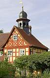](29bau16.md)[ 
Fachwerkliebe/sünden](29bau16.md) 
[Deklarationspflicht?](2volldek.md) 
[Reparaturtechnik](11erhins.md) 
[Kalk-Geheimnisse](2kalk.md) 
[Kalkputz-Fehler](2kalkfel.md) 
[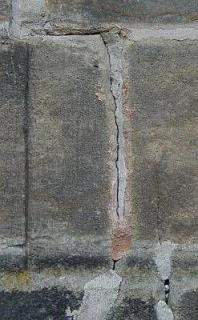](29bausto.md) 
[Natursteinsanierung](29bausto.md) 
[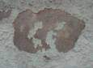](26bausto.md) 
[Anstrichsanierung](26bausto.md) 
[Fachwerk/Fußboden](29bau16.md) 
[Holzschutzgifte](23bau18.md) 
[Holzschutz giftfrei](2hsm.md) 
[Holzschutz/-anstrich](23bau08.md) 
[Baugrund mies?](2gustopf.md) 
[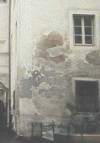](2aufstfe.md) 
[Aufsteigende Feuchte?](2aufstfe.md) 
Kap. [1](2aufstfe.md) [2](2auffe02.md) [3](2auffe03.md) [4](2auffe04.md) [5](2auffe05.md) [6](2auffe06.md) [7](2auffe07.md) [8](2auffe08.md) [9](2auffe09.md) [10](2auffe10.md) [ 
11](2auffe11.md) [12](2auffe12.md) [13](2auffe13.md) [14](2auffe14.md) [15](2auffe15.md) 
[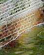](2aufstfe.md) 
[Feuchte + Salz](2salz.md) 
[Rising Damp - a Hoax?](2auffen.md) 
[Mold](7mold.md) / [Mould Attack](7mould.md) 
[Kaputt- u. Totheizen](7temp01.md) 
[Bautrocknung](7temp25.md#nachtrag) 
[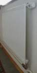](7temper.md) 
[Bautemperierung](7temper.md) Kap. 
[1](7temp01.md) [2](7temp02.md) [3](7temp03.md) [4](7temp04.md) [5](7temp05.md) [6](7temp06.md) [7](7temp07.md) [8](7temp08.md) [9](7temp09.md) [10](7temp10.md) [11](7temp11.md) [12](7temp12.md) 
[13](7temp13.md) [14](7temp14.md) [15](7temp15.md) [16](7temp16.md) [17](7temp17.md) [18](7temp18.md) [19](7temp19.md) [20](7temp20.md) [21](7temp21.md) [22](7temp22.md) [23](7temp23.md) [24](7temp24.md) [25](7temp25.md) 
[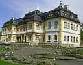](7temp17.md) 
[Schloßtemperierung](7temp17.md) 
[Die Heizkessel-Falle](7temp24.md) 
[Murks + Pfusch](7wsvoant.md#kommentierte) 
["Sanier"-Putz](2sanipuz.md) 
[Betonversagen](2beton.md) 
[Zementkrankheit](2beton14.md) 
[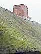](212bau4.md) 
[Nasse Dächer](212bau4.md) 
[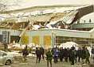](212bau2.md) 
[EinstürzendeDächer](212bau2.md) 
[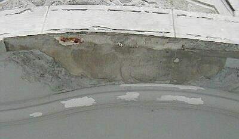](2beton07.md) 
[Balkonsanierung](2beton07.md) 
[Flachdachlachen](212bau7.md) 
[Ausschreibungs-Falle](10hoai22.md#ausschreibungsschwindel) 
[Wärmedämmung?](7wsvoant.md) 
Der Schwindel mit 
Wärmedämmung 
Kap. [1](2131bau.md) [2](2132bau.md) [3](2133bau.md) [4](2134bau.md) [5](2135bau.md) [6](2136bau.md) [7](2137bau.md) [8](2138bau.md) [9](2139bau.md) [10](21310bau.md) 
[11](21311bau.md) [12](21312bau.md) [13](21313bau.md) [14](21314bau.md) [15](21315bau.md) [16](21316bau.md) 
[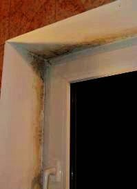](7schim.md) 
[Schimmelpilz I](7schim.md) 
[Schimmelpilz II](7wdvs13.md#kommentierte) 
[Fenster oder Lüftung?](23bausto.md) 
[Wohngifte](20bau02.md) 
[Dachausbau?](212bau8.md) 
[Translozierung/Relocation](8berat04.md) 
**[Ihr Problem](2frag.md)**

**Baufinanzierung** 
[Baugeld + Zuschuß](5finanz.md) 
[Sparsam bauen](11erhins.md) 
(mit Fotos + Zeichnungen) 
[Finanzierung durch Planung!](10hoai18.md) 
[Sinnvoll investieren](5wiber.md) 
[Geld rausschmeißen](10hoai.md) 
****Problem:**** 
[Förderrichtlinie](4behoerd.md#finanzierungsrichtlinien) 
[Brandopfer](2berat.md#brandopfer) 
[Kostenexplosion II](4behoerd.md#fall) 
[Museum+Kommerz](8museum.md#museum und kommerz)

**B a u p h y s i k** 
Energiesparen und 
Wärmeschutz? Kap. [1](7wsvoant.md) 
[2](7wdvs02.md) [3](7wdvs03.md) [4](7wdvs04.md) [5](7wdvs05.md) [6](7wdvs06.md) [7](7wdvs07.md) [8](7wdvs08.md) [9](7wdvs09.md) [10](7wdvs10.md) [11](7wdvs11.md) [12](7wdvs12.md) [13](7wdvs13.md) 
[14](7wdvs14.md) [15](7wdvs15.md) [16](7wdvs16.md) [17](7wdvs17.md) [18](7wdvs18.md) [19](7wdvs19.md) [20](7wdvs20.md) [21](7wdvs21.md) 
[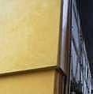](21314bau.md) 
[Eis auf WDVS](21314bau.md) 
[Richtig Lüften](7wdvs15.md#roloff) 
[Richtig Heizen](7temp01.md) 
[Altheizung KO/OK?](7temp24.md) 
[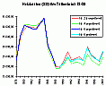](7fehrtab.md) 
[Heizkostenvergleich!!](7fehrtab.md) 
 
[Dämmt Dämmstoff? 
Lichtenfelser Experiment](2139bau.md#lichtenfelser experiment) 
[Korrektur v. Prof. Gertis 
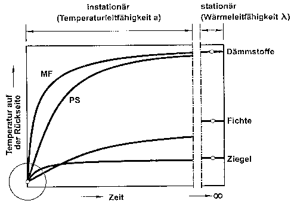](21312bau.md#dankenswerterweise) 
 
[k-/U-Wert-Narretei](2139bau.md#u-narretei) 
[NEH-Passivhausbluff](7waefe22.md) 
[Professoren - Rätsel](7wdvs17.md) 
[Initiative Gutes Bauen](7intiv.md) 
[Prof. Meiers Seite (hier)](7waefe.md) 
[(bei Heck)](http://ClausMeier.tripod.com) 
[(bei Bumann)](http://www.dimagb.de/info/bauphys/ivbph.html) 
**[FEWB e.V.](http://www.fewb.de)** 
**Einsprüche: 
DIN 4108** 
[Teil 2 Kurzfassung](7d4108kf.md) 
[Fiktive Bauphysik](7d41082e.md) 
[Teil 3](7d41083.md) 
**EnEV** 
[AK RLP/H](7enevrlp.md) <> [BAK](http://www.universe-architecture.com/ch/EnEv.html) 
[Verfassungswidrig?](7enevver.md) 
[Petition 1 an Bundestag](enev.md#petition) 
[Petition 2 (Arch.Schwan)](enev.md#schwan) 
**Treibhausgashandel** 
[EU Klimabeschiß](7thu49.md)

**Vermischtes** 
[Stellensuche/Job?](10job.md) 
[Gut-+Schlechtachte](3gutacht.md) 
[Kunden-Irreführung](20bausto.md) 
****Problem:****[Behörden](4behoerd.md) 
[Die Klimalüge](7wsvoant.md#einleitung) 
[Umwelthysterie](7wdvs04.md#apokalypsenlyrik) 
[Doof bleiben 2000+?](2000.md#millenium) 
[Webtips f. Anfänger](8berat17.md) 
[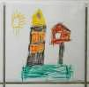](1fliesn.md) 
[Kinder-Fliesen!](1fliesn.md) 
[Ein alter Baumeister](2000.md#elias holl) 
[Mord+Totschlag](2000.md#die briefaktion) 
****Neu:****[Neotyrannis](8philipp.md)

**Wunder / Märchen:** 
[Gutnacht-Mär z. Geld](5fin16.md) 
[Globale Erwärmung](7wdvs03.md#wie mit manipuliert) 
[Risiko CO2](7wdvs03.md#verursacht die co2) 
[Versiegende Energiequellen?](8buch22.md#gold) 
[Guter Naturstrom](7wdvs04.md) 
****Aids****[Schwindel?](http://www.neue-medizin.com/aids.htm) 
**Vogelgrippe**[ Schwindel?](http://karl-heinz-heubaum.homepage.t-online.de/32wh-vog.htm)

**Für Gäste/Guests** 
[Mein Gästebuch](gaestebuch.md) 
[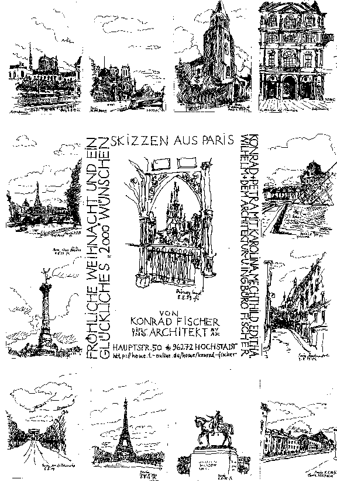](2000.md#milleniumsgruãŸ) 
[Dies + Das](2000.md)

**Suchen/Search** 
[Meine Seite 
- Inhalt/Sitemap 
- Aktualisierungsinfo](1suchen.md) 
[Handwerker](http://www.uelze.de) 
[Deutschland](http://meta.rrzn.uni-hannover.de/) 
[Google.de](http://www.google.de) 
Mit Pagerank: 
[EURO INFOS](http://www.euro-infos.net) 
[International](http://www.metacrawler.com/index.html)

**Der Autor** 
[Wer bin ich?](1refernz.md) 
**Ihr Kommentar:** 

