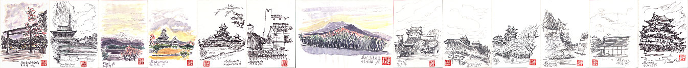
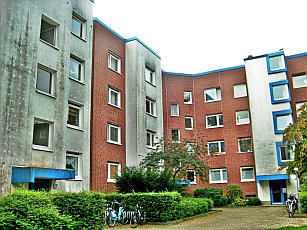
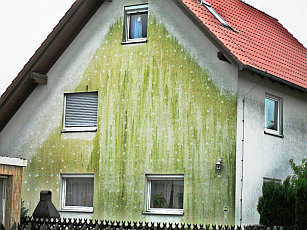
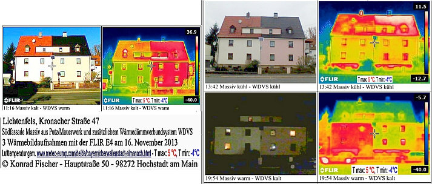
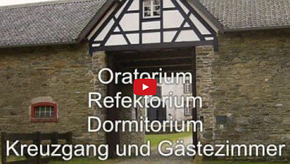

[🠔 Zur Übersicht: Asia & Middle East](asia.md)  
# 古い家の修復 + 🇯🇵 歴史的史跡の保護
**歴史的建造物の所有者のためのアドバイス：修理、修復、修繕におけるよくある誤りと実際にうまくいくこと。文化財保護と古い家の保存に関する無料、独立した情報。**  
_von Konrad Fischer_

## 古い家の修復 + 🇯🇵
歴史的史跡の保護

## 修理、修復、修繕に関する国際建築ショー

### 歴史的建造物の所有者のためのアドバイス 
よくある誤りと実際にうまくいくこと

[ コンラート・フィッシャー](1refernz.md), 工学学士、建築家（バイエルン建築家協会所属） 
建築家・エンジニアオフィス＝支持体計画、建造物技術、建設物理を専門とする 
[Hauptstrasse 50](muehle.jpg), 96272 [Hochstadt a. Main](http://www.hochstadt-main.de/), Deutschland / Germany /ドイツ 
Tel.: +49-(0)9574/3011 / mobil +49-(0)170/7351557, Fax: +49-(0)9574/4960, [e-Mail](2berat.md#email) 
[文化財保護諮問会員](http://www.deutsche-burgen.org/de/verein-startseite/beiräte/beirat-für-denkmalerhaltung/) (1990年以来) [ドイツ城郭協会](http://www.deutsche-burgen.org/en/) および建設委員会員 (1989年以来) ＝ [マルクスブルク城](http://www.marksburg.de/)および[フィリップスブルク城](http://www.marksburg.de/philippsburg.html)（在ライン河畔ブ ラウバッハ） 

[有料でのアドバイス問い合わせは](2berat.md) ドイツ語か英語にて。回答はドイツ語か英語にて。 

[ テレビディスカッションで語る筆者（ドイツ語）: 崩壊する屋根と柱廊 - VIDEOCLIP wmv 3MB](mtvclip1.wmv) +++ [損壊した屋根： 前代未聞の年代史](212bau2.md) （ドイツ語） +++ [エコな建造物：アイロニーだらけの批判](oekobau.md) （ドイツ語） +++ [古い建造物で省エネルギー：可能なのか？](energie.md) （ドイツ語） +++ [歴史的住居の修復：必ず失敗する方法](altbau.md) （ドイツ語） 

あなたは家の修復をしたので しょうか？何か起きてはいませんか？あなたの歴史的建造物の大胆な修復や、修繕、再建造、近代化や改造がなぜか混乱につながっていませんか？もしや大金や希望さえ失ってはいませんか？ 

 古い家を断熱処理してしまっていませんか？そして窓を替えて気密化していませんか？ あなたの建物はもはや密閉されてはいませんか？カビが壁や屋根内に発生していませんか？殺虫剤、殺カビ剤、殺藻剤、化学殺虫剤、可塑剤、溶剤や防炎剤で毒に満ちてはいませんか？天井からは水滴が垂れ、ナミダダケが育っていませんか？お子様には皮膚病が出ていますね？住民はみな ゼンソクの咳に悩んでいるでしょう？涙が止まらず、指先が青に染まってはいませんか？ 

あなたには完璧な専門家がそばにいたはずです。インターネットで素晴らしいアドバイザーを発見したでしょう。マーケットでも一番で最安値のオファーだったはず。なのに、職人たちが予算をさんざん荒らしてはいませんか？いかにもぞんざいな仕事なのに？建築家は資 金全部を持っていきましたか？ところが、本当の建設計画そのものは、工場にいる建築家の友達やら、建築資材メーカーが作成したのではありませんか？プランナーにとっては全て無駄、あなたにとって結果はひどい上に、ひたすら金だけはかかった。そんなケースは珍し くないのです。文化財救済の場合も同じことなのです。ご存知でしたか？ならば良かった！しかし、住居改造はもっと巧みに、健康のためにも、さらにはより安価でできる可能性さえあるのです！どうすればよいのでしょう？

ようこそ！ご訪問ありがとう。このウェブサイトは、まさに、あなたのために作成されているのです。まだ遅すぎるわけではない。このサイトでは、あなたの家についての無料、独立、唯一無二、批判的、過激で議論に満ちた情報を見つけられますが、これまで他の場所では どこでもずっと発見できなかったはずです。 

古い建造物の修復や歴史的史跡の復元と保存。多くはドイツ語。中には他言語のページもあり([英語](english.md), [ロシア語](rossija.md), [ス ペイン語](espana.md), ...). 

 上海の同済大学にて2015年に行った私の講演（英語）＝YouTube 

  

 
コンラート・フィッシャー、2016年城の専門家として日本訪問 

 このウェルカムページが今あなたの素晴らしい言語、日本語でも表示されるようになりました。東京の前田智成氏**[_(djthomas at gmail.com)_]**の協力によります。彼は私の 2016年4月、あなたの素晴らしい故郷を初めて訪問した際の良い通訳でした。東京のテレビ朝日クルーと共に訪れた松本城（長野県）、姫路城（兵庫県）そして名古屋城を訪ね、その間に富士山を眺め、大阪・京都を通った私の旅のスケッチを掲出しておきます。 

しかし、なぜ日本語のサイトなのでしょうか？だって日本でも古い家や建造物、歴史的史跡が修繕、改築、近代化、修復の必要があるでしょう？（あるいは、あなたはドイツの古い建築物の修復に関心があるのでしょうか？）。技術上、経済上の問題やその他の問いは両国に 共通です。多くの間違いも然り。歴史的建造物の不幸なケースやその後のひどい結果さえも共通するものがあります。世界の建設産業もいわゆる専門家も休むことはないのです。そこにあなたのお金も投入されています。実例をお目にかけましょうか？以下の写真をクリックし て、情報を見つけてください（文はドイツ語）

 [(1)](29bausto.md) \+ [(2)](29bausto.md) \+ [(3)](22bau4.md) \+ [(4)](22bau2.md) \+ [(5)](7schim.md) \+ [(6a)](2aufstfe.md) \+ [(6b)](2aufstfe.md) \+ [(7)](213baust.md) \+ [(8)](7wsvoant.md) \+ [(9)](7poly.md) \+ [(10)](21315bau.md) \+ [(11)](29bau09.md) \+ [(12)](29bausto.md) \+ [(13)](29bau02.md) \+ [(14)](22bausto.md) \+ [(15)](23bausto.md) \+ [(16)](23bau08.md) \+ [(17)](23bausto.md) 
**写真説明:** (1), (2), (3), (4): [ケイ酸塩・水グラス固定/塗装による典型的な症例である壊れた表面と外殻 ](22bausto.md); (5) [浴室のカビ](7schim.md); (6a) [水槽のレンガ作り部分は湿度が上昇しない！](2aufstfe.md) (6b) [水平方向の密閉として、開けた穴に塩性で毒性ある物質の注入を行った後の塩の発生 － 穴あけ注入 ](2aufstfe.md); (7) [ハンブルク住宅街のアパートの断熱接続システム上に発生した藻類](213baust.md); (8) [ひどく湿気を発する庭の断熱材](7wsvoant.md), 「建築物改造の建築技工2001年1月号」より、写真H. Pätzold (9) [外側は断熱材が湿り、内部にはカビ](7poly.md); (10) [爆発し焼けた断熱材](21315bau.md), 「現在の被害写真」バイエルン火災保険ミュンヘン発行 (11) [モルタル、組積工事と霜](29bau09.md); (12) [セ メントと天然石](29bausto.md); (13) [建てたばかりのファサード上にモルタルから漏れた石灰](29bau02.md); (14) [歴史的ファサード面の合成樹脂塗装](22bau2.md); (15) [窓面の合成樹脂層](23bau08.md); (16) [柵の合成樹脂ペイント](23bau08.md); (17) [現在の技術と窓](23bausto.md) 

これらの情報に議論の余地はあるでしょうか、珍しいものでしょうか？いえ、これらこそは職人仕事の古き伝統と技法に従ったものなのです。基礎となるのは、修復作業での長年の経験です：歴史的史跡から、農家、宮城、領主の館、ブルジョワの館、教会や修道院などの宗 教関連建造物にいたるまでの経験です。私は父も建築家で、彼は1958年から亡くなる1979年までずっと修復作業を任としていました。父が亡くなったとき私はまだ大学3年生でしたが、その事務所を引き受けることになりました。父からは多くのことを学びました。私 は、大学での勉強を終えて、事務所の仕事を続けながら、ミュンヘンの州文化財保護局で2年間、学術的ボランティアを務めました。

別の意見の人々もいるでしょう。産業界の最高の専門家たち、職人技工で有名な専門家たち、非常に信頼に足るエンジニアたち、制服を着た墓堀人夫たち、イタリアの黒いシャツのファシストたち、武装親衛隊員たち、キリスト教の聖職者、いつもひどく真面目に振舞い重要 そうな黒いファッションの建築家たち、そして、あなたのごくそばにいる親しい友達でさえも違う意見を言う場合の方が多いでしょう。彼らの方のアドバイスが優れているかもしれない。私の出す情報に意味があり、役に立つかを決めるのはあなた自身です。もちろん、賢い専 門家の用意する成功の広い道に従うこともできるわけです（成功の道とは専門家にとってだけのものかも？）。

ここではあなたの疑問への解答は見つからないこともあるでしょう。別の方策です：建造物の修復、維持、保存、技術的調査、歴史学的調査、査察というテーマや、古い家のための建築材＝レンガ、石灰石、モルタル、しっくい、レンガの壁組、木造家屋、コンクリート、合 成樹脂やケイ素塩によるペイント、砂質で腐食した天然石の安定化、建造物の修復やリフォーム、基礎から屋根にいたる部品などについて、印刷すると2000ページにおよぶ詳細で批判的な情報がドイツ語で用意してあります。経済性と資金調達についても。 [ド イツ産業と住居計画や修復における欺瞞](4behoerd.md). その他：人間が作り出したCO2による地球温暖化と気候変動 – 真実かエコファシズムか？ここに方策を見出してください。

- ドイツの城や宮廷の購入をお考えですか？その実例を： [売りに出ている宮廷・城・領主の館](8schloss.md)

- **[上昇する湿度と湿った壁。](2aufstfe.md)**壁やレンガ壁の湿度に対する失敗は何でしょうか。地下室や基礎部分、ファサード、しっくい層の湿度や塩による侵食に対して、悲しむべき誤りがあります。効果な く破壊的で高価な壁乾燥法があります：開けた注入孔に注入し水平方向を断熱する方法（削孔注入）、レンガ壁を切断してステンレスプレートを挟む、合成樹脂による密閉モルタルやペイント、非常に奇怪な電気浸透により電気乾燥方法などです。これらの方法はうまくいか ず、すべてを悪化させます：詐欺師にとっては最大のビジネスで、これはドイツにとどまりません。英語でも読めます： 🇬🇧 [Rising Damp Does Not Exist](2auffen.md)

   [レンガ壁や他の壁では毛管現象も湿度上昇も発生していない](2aufstfe.md).毛管現象は実験室でも、水中の建物でも、港のレンガ壁でも発生しません。なぜでしょう？（レンガや天然石）素材の細孔から、大きめの孔の素材（モル タル）へは毛管現象は起きないからです！石の細孔から目地のモルタルへの毛管輸送は10～20㎝以上重力を上回ることはできないのです。 壁をぬらすのは、波と潮の満ち引きによる塩水だけなのです。良き古きドイツでも、現在のドイツでも同じです。あなたの美しき神秘に満ちた国では、違うことが起きることなどあるでしょうか？もし信じられないならば、浴室で確認してください。悪い輩やバカな理論を信じてはいけませ ん。私のことさえ信じてはいけない！カラフルなシルクのネクタイも、素晴らしいラグジュアリー・カーにしても、カラフルなウェブサイトでさえも、質の悪いアドバイスを向上させるのは無理なのです。では何を信じるのか？魔法の呪文でしょうか？違います、ちゃんと解明 できるはずなのです！ 

- **[カビ](7schim.md)** -現代建築法における通常の結果：誤った断熱、空気を通さないよう密閉された部屋と室内気温の上昇。こうして、何より大事な「食糧」が汚染されるのです：それは「呼吸する空気」です。英語でも読めます 🇬🇧How to get rid with mold attack](7mold.md). 

  
[ゲッツ・ヴィーデンロート：気候のカミカゼ](http://www.wiedenroth-karikatur.de/)（絵と文：キノコハウスの看板「エネルギー認定書 ワールドクラス」。キノコハウスの中からの声「CO2削減のため に最高の断熱をすることに決めたよ！」 カビだらけの部屋の住人：「この家のカビにとって気候は完全に改善されたね」

- **[気候変動 - 地球温暖化と冷却:](7thuene1.md)**  
図と文: "1781年～1990年のホーヘンパイセンべルク観測所における年気温平均値。気候変動議論においては1880年を出発点とすることが多い（エネルギー経済の日常問題、第8号、1993年）" - 1880年以前に観測データのあるヨーロッパの他の観測所すべてのグラフが示しているのは：かつては現在より気温が高く、永続的に気候変動が起きたという問題はなかった。これが科学的事実であるのですが、ところが気候保護の詐欺師たちはこう言うのです 
 
"絵と文：「気温は上昇する - 地上平均気温のずれ – 出典：ハードレー気象研究所（イギリス）」" - イギリスで作られたこのグラフは、それ以前の年数を意図的に削ることによって真実を捏造し、気候変動のパニックを作り出そうとしています。アメリカやドイツの気象学者もこの異常なトリックに加担しています。これは悲惨な「グリーンな」エコ・ホラーと言えます。二酸 化炭素汚染の緩和とは、世界中の民族と人々に対する不誠実な武器なのです。それにより、実際には「グリーンな」ビジネスモデルを強制し、市民の生活のあり方や移動の自由を無理やり制限、圧迫し、世界人口を気候変動保護を理由に減少させようとするものです。気候に対 するかすかな影響やそれにより生じる気候変化を証明できないのは、気候変動モデルがあらゆる物理法則に矛盾しているからです。その他の情報が英語でもあります [ドキュメンタリー映 画「エンドゲーム」](https://youtu.be/x-CrNlilZho) アレックス・ジョーンズ作、ウェブサイトは [www.climatedepot.com/](http://www.climatedepot.com/) マーク・モラノによる。日本にも、気候変動の解明を真剣に考える科学者がいます [タナカ・セイジ](http://theclimatescepticsparty.blogspot.de/2012/04/japanese-researchers-prepare-for-anothe.html).

 _外に面した断熱接続システムの表面についた藻類_ 

- **[断熱のペテン](213baust.md)** 誤った省エネルギーやテロのようなエコロジー法案、贈賄により生まれた当局の条例により、あなたは自分の家、家族、そして賃借人をみずから抹殺してしまうのです：間違った断熱用の工業的かつエコに適した素材を使うせいです。繊維やフォームにより高価に包まれた空気、細孔つきの 人造石やレンガ、毛、綿、麻、セルロース、リサイクル済み新聞紙、海藻、どれもあなたのお金で支払うわけです。 これらの素材は、家の外壁に当たる日光から得られる暖気をブロックしてしまいます。これらの素材は、確実に湿ります。なぜなら、夜の冷気との放射熱交換において保温効果が不足し、ほぼ毎晩露点を下回ることで結露水がたまるからです。じきに藻類が発生します。有毒なカビが続きま す。ウドン粉病、クモ、ゴキブリ、セイヨウシミ、シバンムシ、シロアリ、その他の虫、ハツカネズミ、イエネズミ、テンやイタチやキツツキまでが現れるでしょう。ゼンソクや頭痛、皮膚病、ガンに到るかもしれません。

パッシブハウスの危険な技術には注意を！ドイツ科学の欺瞞です！ドイツにも詐欺師は多く、特に建設業界は金が動くために特に目立ちます。現代の科学は経済界からの補助金に頼らざるを得ず、そうして簡単に汚職が生まれます。

 
図：室内で消費された暖房エネルギー。壁の構造が異なる。Rth値/k値/U値（熱貫流率）には意味も効果も無し。1983年のフラウンホーファー研究所の研究。X軸：壁構造のk値；Y軸：計測した期間に異なる方法で断熱した空間が平均的に要した暖房効果。紫と 赤：ポリスチロール23cm厚、10cm厚による断熱。緑：レンガのみ。結果：断熱した空間の方がより多くの暖房エネルギーを必要としている！

[ 
サーモグラフィーの詐欺](7wdvs06.md#thermografie) 

私が撮影した、断熱設置と断熱なしの家の壁を同じ日、違う時刻によるサーモグラフィーです。太陽が照れば、断熱したファサードは非常に温度が上がり、日中曇っていれば、断熱なしでしっくいを塗ったレンガ壁と同じ程度の温度です。ところが夜になると、非常に温度が下 がり、結露水がついてしまします。対して断熱なしの壁は蓄熱した太陽エネルギーを一晩中放出し、露点を下回ることないために乾燥したままなのです ファサード断熱の裏、断熱なしと比較するとさらに温度を下げていきます。そのために、断熱した部屋の方が多くの暖房エネルギーを要するのです。

断熱をめぐる幻想は、国際的な化学工業や断熱材メーカーの偽造による広告の成果です。メーカーは、金銭的にプランナー、職人、科学者、官僚、政治家やメディアと結びついていることが多いのです。 彼らは、あなたに空気が密閉され最大に断熱された家を販売しようとします。 

彼らの財布は潤い、あなたのは薄くなる。

さらに多くの解明については [続けてここを読む ](7wdvs06.md#thermografie)

 

- **[熱放射暖房](7temper.md)** 間違った暖房と正しい暖房 

左: _夜間は弱まる通常の対流暖房器: 空気は暖まり、壁は冷たい。暖気は部屋の上まで昇り、冷気は下に沈む。 頭が熱く、足は冷える。_ 
右: _熱放射は、なにかにぶつかると赤外線波により暖房する - 太陽の原理。_ 

あなたの部屋では？: 

ホコリだらけの台風か、凪のどちらでしょうか？エネルギー消費は多い、少ない？間違った暖房のせいで子供はゼンソクや、冬には必ずインフルエンザにかかっていませんか？冷えた壁に結露水とカビがついていませんか？それとも、部屋の表面から穏やかな熱放射があり、暖 気の動きが限られている方を選択しませんか？最大の熱放射による控えめな暖房には大した技術はいりません。その結果：常に乾燥した構造と家になります。健康でヒンヤリした澄んだ部屋の空気です。 
部屋の空気は部屋の表面よりも温度が低い。空気を遮断して部屋を断熱する必要はありません。湿ってしまう建材を使って意味もない断熱をすることはありません。表面が冷えて結露水がつくこともありません。床に暖房パイプを通す床暖房には多くの欠点があり、塗り壁の裏 にパイプを通す壁暖房も同様です。さらに：もっと良い選択があります。熱放射を用いる暖房で、低価格で維持しやすい実例のひとつをお見せしましょう。 

[ 熱放射暖房を持つファイトシューヒハイム城](7temp17.md)

 
_天候と有害な保護をした木材_

- 有毒な木材防護と無害な天然の[木材防護](23bau16.md).破壊的な菌類、ナミダダケや昆虫（キクイムシ、シロアリ、シバンムシ）からの防御。テーマは：建物外部の 木造構造物を長期的に防護すること。テラス、バルコニー、ボート桟橋、橋。それらを無毒な良い状態で、ドイツとスウェーデンにある天然物によるノウハウを使います。 

- [古い窓と新しい窓とその上塗り](23bausto.md) 多数の技術的解説 

_わずか1年後：古い窓と新しい合成樹脂の上塗り_

_電磁波とガラス_ 

窓ガラスは紫外線放射（紫外線波長< 0,3 µm）および赤外線放射（赤外線波長 > 2,7 µm）の波長は透過しません。光の波長のみが窓ガラスを透過します。耐熱性ガラスの防火機能はこのように働くのです。火の光はガラスを通ります。しかし火の熱はガラス板を透過できません。日光の強い光放射は窓を透過します。 

家具調度品や建材が光の電磁波を吸収します。暖まった家具や建材は受けた光のエネルギーを赤外線の波長で暖気として発するのです。 

その結果：日航は窓ガラスを透過してきて、部屋を暖め、そこで暖気放射が発生し、それは窓ガラスからは逃げていきません。 

 X軸：波長と窓ガラス板の透過性 
Y軸：放射の強度 

ガラス2枚の場合は、無料の太陽エネルギーを1枚の時よりもフィルター効果が強くなります。2重の窓ガラスは壁の結露水をより発生しやすくしてしまいますが、飽和した室内湿度による結露は、部屋の中で最も低温のポイントを狙おうとします。かつてはそのポイントは1 枚層にすぎない窓ガラスでした。密閉された窓は、空間の室内湿度を上昇させます。その結果、暖房には多くのエネルギーを要すことになるのです。そうして、現代の窓はエネルギー消費とカビの危険性を増加させてしまいます。解明が必要です！ 

 
[ノイエンブルク城](http://www.schloss-neuenburg.de/) 
修復計画（建築、構造、静止状態、技術：上水、下水、暖房、換気）: 
コンラート・フィッシャーと同僚たち 
[ E. Kane による英語の情報: www.roadstoruins.com/Neuenburg.html](http://web.archive.org/web/20120220161824/http://www.roadstoruins.com/neuenburg.html)

-筆者のRILEMにおけるセミナー **"Characterisation of old mortars with respect to their repair – Historic Mortars - Caracteristics and Tests"** , スコットランド・ペイズリー大学、1999年5月:"[ **'Traditional Craftmanship in Modern Mortars - Does it Work in Practice?'** "](2rilem.md) (英語🇬🇧) 
**[筆者のスケッチ](2rilskz.md)** グラスゴーへの研究旅行。宮廷、歴史的石灰がま、その他の場所 🇬🇧

 
修道院[ヴァルトザッセン](http://www.waldsassen.de/). 
このファサードの修復には純粋な水和石灰モルタルと石灰ペイントを使用しました（水硬化セメント成分は入っていない）。安価で、破壊的な方法- 水硬化成分やセメント、合成成分、水ガラス（ケイ酸カリウム）などよりも優れています。

- [鉄筋コンクリートとセメントによる破壊](2beton.md) - さびて腐食 し、壊れた鉄筋コンクリート。現代建築の、自壊する構造と建材による混乱。鉄筋コンクリートのサビの正しい修復と誤った修復。

-  **[筆者 / 経歴情報](1refernz.md)** - 筆者の年代記録。1979年以降のプロジェクト（一部）の情報 (> 450), [経歴情報の公式認定書](1mader.md). ヒント：私の写真をクリックして、2,8MB wmv のデータをダウンロードしてください。バッハのクリスマス・オラトリウムにチェロで参加するコンラート・フィッシャー。指揮マリウス・ポップ、2005年

- **[建材](2baustof.md)** - 現代建築システムの問題。これらが、古い家やその住人を破壊する可能性があるのです。別の方法があります。

 [_グラフ: "リヒテンフェルスの実験"_](2139bau.md): 

各種の建材と断熱素材による温度上昇(4 cm厚) 赤外線ランプで10分照射。物質（上から）：鉱物綿、ポリスチロール/ポリスチレン、泡ガラス、レンガ、木繊維、プラスターボード、トウヒ材。x軸：照射時間 y軸：温度（℃）。

注意： k-値 / U-値(="U")は、温度変化に対して断熱材の抵抗が良くないことを示しています。

多孔質の建材（現代の軽いレンガ、泡コンクリート、工業的でエコな断熱や現代の軽い建材）には問題が多いのです。合成素材は合成塗装により物質の毛管乾燥を妨げます。多くの素材はひどい毒と混ざられています（ホウ酸塩、殺菌剤、化学殺虫剤、大きめの虫に対する殺 虫剤、殺藻剤）。 鉱物綿、ポリウレタン、膨張・成形ポリスチロール/ポリエチレン、ポリエステル、ガラス繊維、泡ガラス、木繊維、羊毛、木綿、セルロース綿、麻繊維、麻綿、亜麻繊維、ココナツ繊維、軽粘土、ヴァミキュライト、木毛、リサイクル新聞紙、吹出しセルロース： これらは、屋根とファサードの断熱としては質の劣る、典型的な製品の一部です。夜になるとすぐに露点を下回り、結露水が発生し、再び乾燥するのが極端に難しいのです。優れた毛管構造がないせいです。 

伝統的で乾燥能力に優れた建材とは：木材、レンガ、天然石は、建物の外壁・内壁としてはるかに優れており、長期間維持できます。 

ファサードの断熱を増やすと、暖房熱をより消費することになります：その裏の壁の日照効果が落ちるためです。 

さらに注意！これら有毒物質の使用も、断熱材による密閉も、湿度上昇の問題の助けとはならない。これら物質は湿度と結露水をためてしまうなのです。結果としては：カビ、黒カビ、ナミダダケ、ウドンコ病、ダニ、シラミ、アリ、甲虫、ハツカネズミやイエネズミにつなが ります。恐るべき結露水が合成素材の膜を打ち負かせば、寄生虫が発生するでしょう。理論上の建築物理による計算は忘れねばなりません。誤った計算モデルに基づいており、太陽を勘定にいれていないのですから。解明が必要なのです！

石灰、レンガ、モルタルや壁積み技術に関する情報:

- [石灰製モルタルとその改善](2kalk.md) 
- [しっくいの修復と古いファサードの塗装](22bausto.md) 
- [石灰製モルタル、しっくい、ペイントの使用の際に最も見られるミス](2kalkfel.md) 
- [ドイツの修復用しっくいシステム-修復用しっくいシステム - 塩性で湿った地下/壁にはリスクある選択(写真左)](2sanipuz.md) 
- [石灰モルタルの解説](26bausto.md) 
- [歴史的建造物に使われる石灰製しっくいとモルタル](2prokalk.md) 
- [壁や積上げ壁の建材比較](29bau09.md):興味深い、珍しい建材の表。暖かい地域、熱い地域、冷たい地域、寒い地域、乾燥した地域、湿った地域における建築の重要な情報。修復用の現代[建 材の](2baustof.md) 問題。 これらは、温度・湿度の変化により、すぐに劣化し、歴史的な物質を破壊します。注意：セメントモルタルは水の透過性がないため、湿度が壁に閉じ込められてしまいます。湿度で飽和すると、壁が天然石製でもレンガ製でも壊れるようになります。

.  
伝統的かつ控えめな技術で実施した改修前、改築・改修・修復後のバロック・ハーフティンバー様式建築。計画：建築家、エンジニア [コンラート・フィッシャー](1refernz.md)と同僚たち

- **[いたわる、優しい改修と維持](11erhins.md)** -古い建造物や歴史的構造物をいかに修理、修復するか：伝統的、デリケート、原状復帰可能かつ経済的な方法とは - 現代的な方法との差異は？：古い家への道筋はいかがでしょう？工業の素晴らしい贈り物が計画に携わる責任者たち（大学教授、修復士、維持保存担当者、建築家、エンジニア）に渡されます。数年後には、現代的な解決法は古い建物を傷めてしまいます。歴史的な建物はどのような構造で しょうか？現代の建物はどうでしょうか？昔：積上げ壁も、塗り壁も石づくりでした（天然石、切石、レンガや木骨）。しっくいは砂と石灰だけからできていました。石灰製のペイントを天然油で溶いて木に塗りました。 すべて、修理しやすいものでした。現在：鉄筋コンクリート、さびた鉄、砂石灰岩、プラスチック、多孔性のレンガ、フォームや繊維による断熱などという醜い粗暴さ。すべて修理しづらい。

- **[修復と経済性](5wiber.md)** および **[資金調達](5finanz.md)**. 古い建物の修繕に関する経済・資金の問題

[ライヒェンシュタイン修道院](http://www.kloster-reichenstein.de) - 筆者が構造・支持体計画で参画する企画のファンドレージング用ビデオ 
[私たちが修道院を創る](https://youtu.be/f6dYKbW1VaA)

- もし専門的アドバイスが必要なら：質問1点から3点までの詳細なEメールによる回答は200Euro。質問4点～10点は500Euro。現地に出向いてのアドバイスは移動時間と対応時間について150Euro/時間。交通費と宿泊代別途。見積もりも可能。現地でのアドバイス は85％前払い、電話アドバイスやEメールアドバイスは100％前払い。なぜかはご存知でしょう。修復にお金がかかりすぎて不幸が起きるのを未然に防げるとすれば、これは高すぎる額でしょうか？おわかりでしょう。見積もりが必要なら：あなたの建物の問題個所と構造 の写真数点と質問を送ってください。さらに詳細をドイツ語と英語で記してあります： [.筆者のオンライン予定表があるので、アポイントを調整できますし、経歴情報の写真もあります。実例は： ](2berat.md)[FAQ 多数の質問と回答](2frag.md)

もちろん、お金を使うときは注意深くなるのもわかります。私も同じこと。別の方策があります。なんでもいいならアドバイスはどこでも得られます。インターネットのフォーラムの賢さも知っているでしょう。試すならば、成功を祈ります！アドバイザーが2人いれば、解 決法は３つ、不幸は４つ起こります。工業界の知恵が隠れています。経験豊富な職人、最高に知的な専門家。ドゥー・イット・ユアセルフ。賢い年金生活者。好奇心を隠さない隣人たち。仕事にあぶれた技術者。学問界の理論家。物理学者。非常に賢い叔父や叔母。などです か？

今日の話はここまで！成功を祈ります！お金を節約して、あなたの家は尊厳を保ち古くしてしまい、バカンスを増やし高価なワインを楽しんでください！

それではまた！再び会いましょう！！！

（この情報をまだ知らない多くの友人たちのことも忘れないでくださいね ）
