# Brandchronik Solarbrand - PV-Solaranlage in Brand und Feuer

## Chronologische Fallsammlung PV-Solarbrände

### PV-Solarbrand - Zeitbombe Photovoltaik-Dachanlage - Selbstentzündung, PV-Explosion und andere Themen rund um das Solarmodul

 _PV-Anlage auf Bauernscheune und Stall nach Abbrand - Brandausbruch am PV-Wechselrichter_ 

 

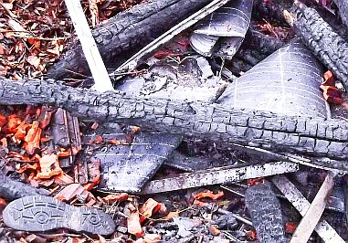 
_Auch dieser PV-bestückte Bauernhof wurde ein Opfer des Brandausbruchs am PV-Wechselrichter_ 

Als die wohl größte Gefahr für Photovoltaikanlagen gelten - selten bekannt! - Überspannungsschäden bzw. Kurzschlußschäden mit Lichtbogenbildung, die die zwar schwer entflammbaren, aber freilich brennbaren Anlagenbestandteile "explosiv zünden". 

Die mit latentem Sprengstoff vergleichbaren Anlagen generieren Gleichstrom, damit funktioniert der übliche Schutz gegen Überspannung eben nicht. Offenbar manchen Elektromonteuren und PV-Anlagenbesitzern bis zum nur den Outsidern überraschenden Brandfall unbekanntes - aber brandgefährliches - Detail der PV-Elektrik und Kunststofftechnologie. 

Überspannungen entstehen beispielsweise durch Blitzeinschläge - auch in weiter Ferne der Anlage, denn die dabei entstehenden extrem hohen Spannungen kriechen in Blitzeseile über den Erdboden / das Erdreich in den Keller, das Stromnetz und die Photovoltaikanlage auf Bauwerken ohne Fundamenterder - typisch bei Bauernhöfen. Auch die elektromagnetischen Felder beim Blitzschlag und im Vorfeld des Gewitters können zerstörerische Überspannung in der Stromanlage und der Solaranlage verursachen. Und schon ein [kabelknabberfreudiger Marder](http://www.photovoltaik.eu/heftarchiv/artikel/beitrag/teurer-knabberspa-_100005981/86/?tx_ttnews\[backCat\]=152&cHash=7c864d1975f4d29f5ebce275ade00a3b) - wirklich keine Seltenheit auf dem Bauernhof - oder Abnutzung der Kabelummantelung durch die extremen Temperaturspannungen im Dachbereich oder eben auch Montagepfusch mit schlechten Verbindern, beschädigten Schutzmantelungen, loser Verlegung und marder- sowie abscheuerfreundlich herumschaukelnden Leitungen, die dann schnell zum Kabelbruch und Lichtbogen zur metallischen Unterkonstruktion / Halterung führen sowie sonstige Alterungsphänomene und sogar Kontaktkorrosion der unterschiedlichen Metalle im Anlagensystem bringen da schon schnell mal einen Kurzschluß und Kabelschmoren und auch einen Lichtbogen zustande, was dann - da ungesicherte Kabelstrecke - zum Aufbau der erforderlichen Zündtemperatur in der brennbaren Kabelumgebung (Holz, Stroh, Heu, Plastik, ...) führt - wie immer mehr kurzschlußbedingte Solarbauern-Brandfälle beweisen. Über 1000 Volt sind da keine Seltenheit. 

 Eine mir zugegangene PV-Besitzer-Dokumentation zeigt, wie es allerorten unter Deutschlands Dachanlagen aussieht. Vielleicht auch bei Ihrer? Prüfen Sie selbst, bevor Sie und Ihre Lieben durchgeschmort sind! 

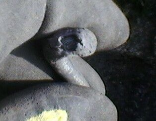 . 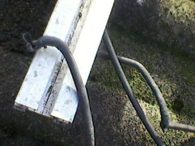 . 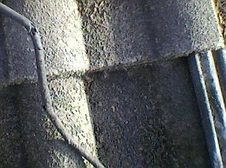 . 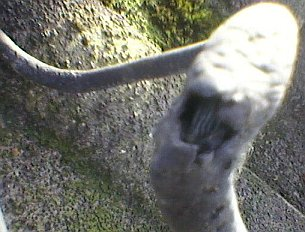 . 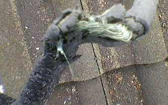 
Kabelbruch, abgescheuerte Kabel-Isolierung / am Kabelknoten zerstörte Kabel-Ummantelung, aufgerissene und zerfledderte Kabel - gerade noch rechtzeitig vor dem Brandereignis bei Dachdeckungsarbeiten zufällig vom Dachdecker entdeckt! Aus der Zuschrift des entsetzten, gerade noch geretteten PV-Geschädigten: 

_"... meine nun 6 Jahre alte PV -Anlage (10,5 Kwp) mußte aufgrund mehrer Pfannenbrüche demontiert werden. Dabei stellte die ausführende Dachdeckerfirma mehrere Kabelbrüche fest (siehe Anhang). Die Anlage wurde vom örtlichen Elektromeister und städtischen Brandexperten nach Sichtung der Fotos sofort stillgelegt. Kann die ausführende Montagefirma noch bzgl. eines Montagepfusches belangt werden? ... Bruchstellenfoto zeigt die ursprünglichen einfachen Dachhaken und die nunmehr verwendeten neuen Dachhaken ... Ich war zu tiefst erschrocken als man mir die Bilder zeigte. Ich kann mir nun vorstellen, dass deutsche Solardächer ein ungeheures Gefahrenpotenzial beherbergen. Vielleicht habe ich Glück im Unglück gehabt, denn ohne die beschädigten Dachpfannen, die wahrscheinlich aufgrund nicht sach-und fachgerecht montierter Dachhaken gebrochen sind, wären die Kabelbrüche nicht erkennbar gewesen. An die Folgen will ich erst gar nicht denken. ... Ich persönlich kann Niemanden mehr zu einer PV Anlage auf seinem Dach raten."_ 

Und rund 45 Prozent der Schadensfälle an Solaranlagen sind auf elektromagnetische Überspannung im Photovoltaiksystem zurückzuführen (Quelle: Mannheimer Versicherung). 2010 alleine 8755 an Versicherung gemeldete Schäden an PV-Anlagen, lt. Augsburger ALlgemeine: ["21,9 Prozent der Schäden an Photovoltaikanlagen sind in Bayern durch Feuer verursacht."](http://www.augsburger-allgemeine.de/mindelheim/Wenn-die-Gefahr-auf-dem-Dach-lauert-id18382781.html) 

Das hochwertigere Kabelmaterial ist aus einer halogenfreien vernetzten Polyolefin-Mischung, die äußere Schutzhülle aus TMPU - eine thermoplastische - also wärmeverformbare Polyurethan-Mischung. Als zu erwartende Lebensdauer des durch Wärme weichwerdenden Kabelmaterials wird mit ca. 30 Jahren angegeben. Bei minderwertigeren Kabeln, die bei risikofreudigen Sparfüchsen durchaus auch im Gebrauch sind, entsprechend weniger. 

Aufklärungsfilme zur Energiegesetzgebung: 
  

### **TV- und Videotipps:**

[21.11, 21.15 Uhr: BR "Geld & Leben - Zeitbombe Photovoltaik"](http://www.br.de/fernsehen/bayerisches-fernsehen/sendungen/geld-und-leben-das-wirtschaftsmagazin/wirtschaft-solar-brand100.html) - mit Konrad Fischer 
 
[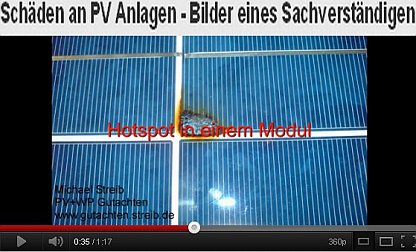](http://youtu.be/BV7tTONz4jI) 
[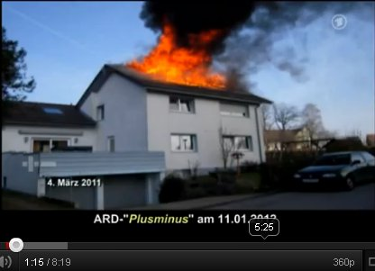](http://youtu.be/_h1IZiGqKa4) 
[ARD PLUSMINUS 11.01.2012: Photovoltaik-Brände - Gefährliche Energieerzeugung auf dem Dach](http://www.daserste.de/plusminus/beitrag_dyn~uid,4wx9rs54sya89hzf~cm.asp) 
[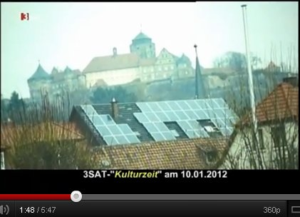](http://youtu.be/roWb9I5UhcU) 
Solarwahn und ästhetische Umweltverschmutzung (3sat Kulturzeit am 10.10.2012) - Öko-Ästhetizismus der Kulturelite ... 
[Brandgefährliches auf unseren Dächern???? - Aus photovoltaik.com](http://www.photovoltaikforum.com/pv-news-f25/brandgefaehrliches-auf-unseren-daechern--t71697.html) 
Solarbrandinfo im [Ketzerforum: Wie geht die Feuerwehr bei einem Dachstuhlbrand vor, wenn eine Photovoltaikanlage installiert ist?](http://freezonechef.servertalk.in/freezonechef-post-56240.html) 

### [28.11.11, 22.00 Uhr: NDR "45 Min - Wahnsinn Wärmedämmung"](http://www.ndr.de/fernsehen/epg/epg1157_sid-1064044.html) - mit Konrad Fischer

 [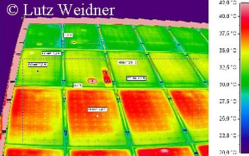](http://www.bauthermografie-luftdichtheit.de/138801.html) Wer prüft eigentlich das routinemäßig, wie sich die einsatztypische Belastung durch extreme Temperatur- und Feuchtewechsel auf und unterm Dach auf die Integrität und Funktionsfähigkeit der Kabelisolation schon ausgewirkt hat, wieviele Hot spots und Schmorstellen, wieviele Lichtbogenereignisse sich schon nachweisen oder vermuten lassen? Denn das würde ja "laufende Kosten" bedeuten. Und Elektrosachverständige wie Erhard Wagner mit Norbert Gunzelmann, die in den Aufklärungsfilmen bei ARD und dem Bayerischen Rundfunk (s.o.) verdeutlichten, wie schrecklich es um den Status sozusagen aller installierten PV-Anlagen steht, kommen natürlich nicht für lau zur Nachschau und Risikoprüfung. 

Die krassen hot spots - also rotglühheißen Zellen-Flächen auf der Thermografie-Aufnahme des [Zimmerermeisters und Sachverständigen Lutz Weidner aus Wichmar](http://www.bauthermografie-luftdichtheit.de/138801.html) zeigen auf, wie es um die defekten PV-Module in Wirklichkeit stehen kann - auch auf Ihrer Armeleuteabzock-Goldesel-Solar-Anlage: 

Nicht nur, daß sie den solar erzeugten Strom in bedeutenden Teilen selbst verzehren, nein, die damit verbundene Temperaturerhöhung der PV-Module/-Zellen steigert auch deren Brandgefahr durch Selbstentzündung ins Unermeßliche. Um hiergegen gewappnet zu sein, heißt es also prüfen, prüfen und nochmals prüfen. Und zwar mit Thermografie im wiederkehrenden Rhythmus! Denn anders kommt man der lebens- bzw. brandgefährlichen Hitzeentwicklung auf dem ach so coolen Solardach, das Ihnen Ihr Lieblingssolarteur so liebevoll auf die Hütte geschnallt hat, auf Dauer nicht auf die Schliche. Und muß auf den Schutzengel vertrauen, der mangels ausreichender Kerzenspende durchaus auch ungnädig sein Tag- und Nachtwerk vernachlässigen kann, wie es die hier aufgeführten Brandfälle auf sowohl katholischen wie auch evangelischen oder gar heidnischen bzw. ganz und gar gottlosen Dächern mehr als eindeutig und fast täglich beweisen. Amen. 

Nur aufwendige - und besonders bei Großflächen / Gro&szlig-PV-Anlagen sehr teure Schutzvorkehrungen bringen eine hoffentlich ausreichende Sicherheit - wenn alles gutgeht und die hier einzusetzenden Varistoren aus Zinkoxid ihren Geist aufgeben. Nicht mit der neuesten Absicherungs- und Blitzschutztechnik errichtete PV-Anlagen lassen dann im Normalbetrieb Leckströme fließen, die zum Kurzschluß führen könnten, wenn das nicht durch thermische Abtrennungvorrichtungen verhindert würde, die ihrerseits temperaturabhängig den Kontakt zum Solargenerator unterbrechen - doch dann ist auch der Überspannungsschutz futsch. 

In diesem Ablauf kann es dann sogar unjd gar nicht mal so selten zu Lichtbogen-Bildung kommen, da bei den fallweise anfallenden Extremspannungen im 1000-Volt-Bereich die ansonsten isolierende Luft leitfähig wird. 

Beispiele für relativ ungefährlichen Solar-Schnickschnack - den es ja auch gibt: 

Auch im Gartenbereich / Außenbereich können solarbetriebene Lüfter für das Gartenhaus oder Gewächshaus und als Solar-Lampe / Gartenlicht / Gartenlampe / Gartenleuchte / Außenleuchte / Lichterkette / Garten-Strahler, als Treppenbeleuchtung oder Wegbeleuchtung / Außen-Belichtung bzw. Lampe für draußen, auch als Wandstrahler mit Bewegungsmelder oder als Solarkappe / lichtspendende Solarcap / Solar-Schirmmütze strahlend gute Dienste leisten. Sogar als Solarpumpe für den Gartenteich kann man die sonnigen Helferlein einsetzen - vielleicht auch bald in edlem Gartenzwerg-Design mit ständigem Auf und Ab des rechten Armes zum römischen Gruß ;- ) Ja, hier zeigen sich eben genau die Autarkie-Vorteile, die die Solartechnik als ökogrünbraune Insellösung / im Inselbetrieb eben mal unbestritten hat. Auch hierzu einige Beispiele: 

Am Tagbetrieb, wenn die Solaranlage sollgemäß Strom im Gleichstrombetrieb liefert, steht der Lichtbogen schön vor sich hin - im systematisch gegebenen Unterschied zu Wechselstromanlagen, bei der nach Umpolung der Lichtbogen zusammenbricht / erlischt und dann wegen Spannungszusammenbruch nicht mehr entstehen kann. Und dann? Ja - im Lichtbogenfall und bei Kurzschluß kann dann die PV-Anlage das Abfackeln des Gebäudes - und vielleicht auch seiner Nachbarn, deren solarbedingt erhöhte Stromkosten diesen Brandanschlag sogar noch mitfinanzieren - auslösen. Ganz davon abgesehen, wie schön die Alu-Bauteile schon ab 400 °C zünden, nicht umsonst ist Alupulver ein doller Brennstoff! 

Oder das [Crimpen](http://www.crimpen.de/index.php?id=612), das heißt das mechanische Zusammenpressen der Hülsen zur Herstellung fester Verbindungen zwischen Leitern und Verbindern - früher wurde das gelötet. Dabei kommt es sehr drauf an, daß alle Teile und Werkzeuge perfekt zusammenpassen. Sonst quält sich der Strom durch zu enge Leiterquerschnitte und entwickelt in seiner zwängenden Qual hohe Temperaturen, die dann im Endergebnis zum Brandauslöser werden können. (Nach einem Artikel in "Photovoltaik" 08/09). 

Weiterhin sind auch die Steckverbindungen zwischen den PV-Platten und dem Kabelsystem sowie letztlich alle stromverbindenden Bauteile zwischen den Leitungen und sonstigen Anlagenbestandteilen ein Bombenproblem. Da es herstellungs- und montagebedingt sowie infolge der geradezu extremen Temperaturdehnungen der exponierten PV-Anlage mit ihren dank reichen Materialkombinationen durchaus unterschiedlichen Wärmedehnungsfaktoren zu unzulässigen Toleranzen der Verbindungen kommen kann und kommen wird, ist es wohl nur eine Frage der Zeit, bis sich anlagerndes Kondensat, Wackelkontakt-Bildung und sonstige widerstandserhöhende oder unterbrechende Ereignisse zu erhöhten Bauteiltemperaturen bis zur Lichtbogenbildung einstellen, die dann irgendwann den Brand auslösen können bzw. werden. Gegenwehr? Dauerbeobachtung durch Thermographie-Kamera, Dauerkontrolle durch detaillierte Funktionskontroll-Routinen, und natürlich Beten, Beten und nochmals Beten. Auch reichliche Kerzenspenden an den Heiligen Florian (Nothelfer gegen Brand und Feuersgefahr) und ein immer aktuell gehaltenes Testament können im Einzelfall als sinnvoll erscheinen ... 

Komischerweise finden wir in den regionalen Medien und polizeilichen Ermittlungsberichten oft nur wenig bis nichts über die wahren Ursachen der Solarbrände allerorten. Von den Risiken durch die wiederum nur in Insiderkreisen hinter vorgehaltener Hand diskutierten ständigen Grenzwertüberschreitungen der PV-Anlagen (meist im Bereich des Wechselrichters) - also leitungsbedingte Störungen durch für das Leitungssystem, die Anlagentechnik und Umwelt eigentlich nicht verkraftbaren bzw. gefährlichen Stromfluss hinsichtlich Überhitzung, Anlagenbelastung, Störung von Funknetzen, elektronischen Anlagen in der Umgebung und freilich auch Gesundheitsbelastung durch extremen Elektrosmog bzw. elektromagnetische Wellen bzw. Strahlung für alle Menschen und Tiere in der näheren Umgebung der Solaranlage mal gar nicht zu reden. Wen das mehr interessiert, sollte mal hier reinlesen: ["PV- Wechselrichter – Anforderungen und Konsequenzen" - Vortrag von Dr.-Ing. Christian Bendel, Institut für Solare Energieversorgungstechnik , Verein an der Universität Gesamthochschule Kassel](http://www.iset.uni-kassel.de/abt/FB-A/publication/wechselrichter_2001/Vortrag_01_Bd.pdf) - Temperaturverhalten, Temperaturüberschreitung, Hotspots und Fehlerströme, elektromagnetische Verträglichkeit, Strahlungsrisiko und Korrosion von PV-Anlagen, Betriebssicherheit, Unfallstatistik, Sicherheitsrisiko und Zuverlässigkeitsrisiko von PV-Wechselrichteranlagen und sonstigen PV-Bauteilen / Anlagenbestandteilen / PV-Modulen / Anschlußkabeln, Personenrisiko und Anlagenrisiko, auch durch gefährliche Strahlungsfrequenzen im Frequenzbereich über 30 MHz. 

Wie mir aus der PV-Branche zugetragen wurde, sollen bei industrieinternen Untersuchungen von marktüblichen Solarmodulen/PV-Modulen mit der Thermokamera / Wärmebildkamera 5 von 8 Module Microcracks / Mikrorisse aufweisen, die im Rißbereich Hot Spots mit ca. 250 °C verursachen. Von dort geht also - neben defekten Verkabelungen - die Selbstentzündung von PV-Anlagen aus. 

Hier ein paar durchaus lesenswerte Forumbeiträge von Solarfuzzis mit versengten Wechselrichtern: ["Mir ist heute ein SMA 5000 TL Wechselrichter abgebrannt / explodiert!"](http://www.photovoltaikforum.com/wechselrichter-f3/sma-5000-tl-abgebrannt--t7159.html) 

[Pellets- und Holzheizungen selbst planen und installieren](http://c1.websale.net/cgi/wsaffil/wsaffil.cgi?act=callshop&shopid=kopp-verlag&subshopid=01-aa&idx=dynamic&affid=30&prod_index=112287) 
von [Bo Hanus](http://c1.websale.net/cgi/wsaffil/wsaffil.cgi?act=callshop&shopid=kopp-verlag&subshopid=01-aa&idx=dynamic&affid=30&prod_index=112287)

[Hausversorgung mit alternativen Energien](http://c1.websale.net/cgi/wsaffil/wsaffil.cgi?act=callshop&shopid=kopp-verlag&subshopid=01-aa&idx=dynamic&affid=30&prod_index=109704) 
von [Bo Hanus](http://c1.websale.net/cgi/wsaffil/wsaffil.cgi?act=callshop&shopid=kopp-verlag&subshopid=01-aa&idx=dynamic&affid=30&prod_index=109704)

Oder auch: ["Grenzwertlücke - Wechselrichter stört Elektrizitätszähler" - Vortrag von Jörg Kirchhof, Fraunhofer Institut für Windenergie und Energiesystemtechnik, IWES, Bereich Anlagentechnik und Netzintegration, Kassel, Germany](http://www.iset.uni-kassel.de/abt/FB-A/publication/2010/2010_EMV2010.pdf) - Störaussendung und Störfestigkeit, Störstrom, starke hochfrequente Störsignale auf den AC-Leitungen des Wechselrichters mit einer hohen Störstrom-Amplitude im elektromagnetischen Frequenzbereich der Taktfrequenz des Wechselrichters aus PV-Anlagen, Defizite der Normung begünstigen die PV-typisch hohen Störpegel innerhalb des normativ nicht geregelten Frequenzbereichs in der Frequenzlücke zwischen 3 kHz und 150 kHz, gefährliche leitungsgebundene Störpegel. 

Wichtige Schutzvorkehrung wäre eine turnusgemäße Kontrolle der PV-Module und PV-Anlage mit der Thermographie - Wärmebildkamera, die Hot Spots / Überhitzungen an den Modulen und der Anlagentechnik bis zum PV-Schaltschrank und PV-Wechselrichter zuverlässig und rechtzeitig entdecken hilft und auf Handlungs-, Austausch- bzw. Instandsetzungsbedarf hinweist. Ohnehin muß eine Photovoltaikanlage alljährlich durchgeputzt werden, damit sie nicht ungeheuere Wirkungsgradverluste erleidet. Dazu ist Profihilfe angesagt, sonst beeinträchtigt der Solarputzer Anlagenbestandteile, was dann das sicherheitstechnische Risiko wiederum in die Höhe treibt. Neben der "üblichen" Korrosion. Da aber die professionelle Instandhaltung und Wartung mindestens soviel kostet, wie der finanzielle Gewinn! im günstigsten Fall bringt, verzichtet der deutsche Gierschlund lieber darauf. Und saniert sich mit der Brandversicherungsprämie, wenn dann die PV-Bude endlich abgefackelt ist ... 

Zum Problem der minderwertigen PV-Sparbauweise, hier zum Thema [PV-Brand durch erhitzte Steckverbinder](http://www.konstruktionspraxis.vogel.de/themen/elektrotechnik/steckverbinder/articles/410641/). 

### Brennende Solaranlagen - Löschbremse, Kontrollierter Abbrand und Versicherungsprobleme

Daß dann die Dachbeschichtung mit Solarmodulen ein erstklassiger Löschschutz - also Schutz vor geschwindem Löschen eines darunter ausgebrochenen Brandes durch die Feuerwehrspritze mit Löschwasserdüse - ist, daß die Kaminwirkung im freien Lüftungsquerschnitt zwischen Solarmodul und Dachdeckung durch verstärkte Sauerstoffzufuhr die Abbrandgeschwindigkeit und die Brandausbreitung extrem fördert, ist zwar selbstverständlich - aber ebenso vernachlässigt wie viele andere Risikofaktoren der riskanten PV-Anlagentechnik. Man könnte die Montage von Solarmodulen auf brandgefährdeten Bauteilen deswegen vielleicht sogar als vorsätzliche Brandstiftung mithilfe einer auf Zufall geschalteten Zeitbombe odr eben dem russischen Roulette vergleichen, oder? Und vorsichtige Versicherer wie die HSB Engineering Insurance Ltd. versichern wegen der [typischerweise vorliegenden Extremgefahr und allen Insidern bekannten Brandserien bei Photovoltaik auf Bauernhofdächern](http://www.photovoltaik.eu/heftarchiv/artikel/beitrag/feuergefahr-im-kuhstall-_100001414/86/?tx_ttnews\[backCat\]=74&cHash=5babb6a146aa8618d8b28cd1dad3e14e) keine Solarbauernhöfe mehr. Siehe hierzu auch 
[brand-feuer.de: Photovoltaikanlage - Technik und Risiken](http://brand-feuer.de/index.php/Photovoltaikanlage) 
[Brandfalle Photovoltaik-Solaranlage](http://www.baulinks.de/webplugin/2009/1827.php4) 
[Checkliste: Immer mehr Photovoltaik-Anlagen halten nicht, was sie versprechen](http://www.baulinks.de/webplugin/2010/1278.php4) 
[Lichtbogengefahr bei PV-Anlagen - bis 3.000 °C!](http://www.baulinks.de/webplugin/2011/0959.php4) 
[Garantiebedingungen für PV-Solarmodule taugen oft nicht viel - Augenwischerei mit Kleingedrucktem!](http://www.baulinks.de/webplugin/2010/0725.php4) 
[Brandprüfungen an Photovoltaikmodulen](http://www.baulinks.de/webplugin/2010/0724.php4) 
[PV-Info Munich Re: Photovoltaik - Kontrolliertes Abbrennen statt schnellem Löschen](http://www.munichre.com/de/reinsurance/magazine/topics_online/2010/02/photovoltaic/default.aspx) und ["Nach mehreren schweren Unfällen mit stromführenden Leitungen gibt es bislang nur eine Möglichkeit für die Feuerwehren: Das Haus kontrolliert abbrennen zu lassen."](http://www.stromtip.de/News/23312/Solaranlage-behindert-Feuerwehr-bei-Hausbrand.html) und [Solaranlagen: Versicherungsfragen und Versicherungstest - Solarstromschäden 2008: 4.200 Schadensfälle durch Feuer, Schneelast, Winddruck, davon ca. ein Viertel der angefallenen Erstattungssummen - durch Brandereignisse veranlaßt](http://www.bocquel-news.de/news/Privaten Sonnenstrom mit Extra-Police versichern.4944.php), siehe dazu auch [PV-Anlagen aus der Sicht der Feuerwehr, Sicherheitstechnik und Versicherungswirtschaft](http://www.ikz-energy.de/heftarchiv/heft-ikz-energy-2-2011/single-view/article/pv-anlagen-harmlos-oder-brandgefaehrlich-br-sin.html) 
[Ratgeber zur Risikovermeidung bei PV-Anlagen aus der Sicht des Gesamtverbands der Deutschen Versicherungswirtschaft e.V. GDV](http://www.klipp-und-klar.de/dateien/dokumente/lebensphasen/GDV_Flyer_Photovoltaik_2011.pdf) 
[PV-Brandsicherheit Workshop 26.01.2012: Statistische Schadensanalyse an deutschen PV Anlagen](http://www.pv-brandsicherheit.de/fileadmin/WS_26-01-12/Stat.Schadensanalyse_an_dt._PV-Anlagen.pdf) 
[PV-Anlagen - Fachartikel zur Brandbekämpfung und Brandverhütung "Von eins auf null"](ftp://ftp.fh-koblenz.de/pub/Fachbereiche/e-technik/dozenten/siebke/PAT/Brandschutz/Brandschutz_PV0911.pdf) 

### Brandserie und Chronologie der Solarbrände auf Bauerndächern, Freianlagen und sonstwo - inkl. Einsturz von PV-Dächern - Die bundesweit erste PV-Brand-Chronik

Hier einige rußige Kostproben der Brandserie von abgefackelten Solaranlagen auf brandruinierten Gebäuden der Ökoabzocker, die ganz offensichtlich bei der Auskunft der Bundesregierung auf eine kleine Anfrage der GRÜNEN, wonach mit PV dolle CO2-Emissionen eingespart wurden, unter den Tisch gefallen sind. Bei den oft genug nachweisbar infolge sonnenscheinverwöhnter, gerne auch sonnig-kühler Tage (prüfen Sie ruhig die lokalen Wetterdaten!) - ab- bzw. angefackelten Bauwerken handelt es sich übrigens meist um Bauernhöfe mit Bauernhaus, Scheunen, Strohlagerhallen, Maschinenhallen und Schweine-, Rinder-, Pferde-, Puten-, Hühner- usw. -Ställen, teils mit mehr oder weniger dabei verbrannten Menschen / Bauern / Kindern / Stallburschen / Türken und / oder Kühen / Kälbern / Bullen / Schweinen / Ferkeln - **Brandursache fast immer "unbekannt" oder "ungeklärt"**. (Nur Ortsnamen in folgender Liste: Solarbauernbrand, sonstige Gebäude: In Klammern, Abbrand Solaranlage/PV-Anlage teils in Meldung / Feuerwehrbericht verheimlicht / ungenannt, aber aus anderen Quellen gegenrecherchiert, Hinweise zur tatsächlichen Brandursache siehe Link): 
17. April 2005: [Mühlhausen (Solarpark)](http://www.ff-muehlhausen.de/einsaetze/Archiv/2005/2005_04_17/einsatz_am_17042005.htm) 
23. Juli 2005: [Bad Saulgau-Friedberg (Maschinenhalle)](http://www.schwaebische.de/home_artikel,-_arid,1460072.html) 
25. Juli 2005: [Klein Flöthe (Fachwerk-Wohnhaus)](http://www.yaovo.de/?site=13) 
23. September 2005: [Hochstadt am Main](http://www.ff-hochstadt.de/brand_23.09.05.htm) 
2005: [2 brennende Photovoltaikanlagen in Italien](http://www.orizzontenergia.it/articoli.php?id_articoli=85) 
24. April 2006: [Geratskirchen](http://www.feuerwehr-massing.de/06/brand_geratskirchen_24.04.06/brand_24.04.06.htm) 
8. Januar 2008: [Hotzingen-Weißenburg](http://www.kfv-kleve.de/pdf-dateien/Brand Photovoltaikanlage.pdf) 
2006: [2 brennende Photovoltaikanlagen in Italien](http://www.orizzontenergia.it/articoli.php?id_articoli=85) 
2007: [17 brennende Photovoltaikanlagen in Italien](http://www.orizzontenergia.it/articoli.php?id_articoli=85) 
12. Januar 2008: [Willebaldessen-Eissen](http://www.feuerwehr.de/einsatz/berichte/einsatz.php?n=4004) 
8. April 2008: [Bremen (Reihenhaussiedlung)](http://www.feuerwehr.de/einsatz/berichte/einsatz.php?n=4754) 
9. August 2008: [Salgen (Reiterhof)](http://www.augsburger-allgemeine.de/krumbach/Grossfeuer-auf-einem-Reiterhof-Millionenschaden-id3999801.html) 
17. August 2008: [Fröhstockheim](http://www.musikzug-iphofen.de/index.php?action=einsatz&sub=details&id=240&sid=8js18br1) 
27. Oktober 2008: [Sollwittfeld](http://www.localxxl.com/de/lokal_nachrichten/behrendorf/brand-bei-sollwittfeld-hof-zwischen-behrendorf-und-sollwitt-schwer-beschaedigt-1225105614/) 
23. Dezember 2008: [Lutstrut-Pommertsweiler](http://www.feuerwehr-ellwangen.de/cms/index.php?option=com_content&view=article&id=153:23122008-1225-uhr-brand-einer-photovoltaikanlage&catid=37:einsaetze-2008) 
2008: [17 brennende Photovoltaikanlagen in Italien](http://www.orizzontenergia.it/articoli.php?id_articoli=85) 
7. Januar 2009: [Curti (Hemdenfabrik)](http://www.rinnovabili.it/storico/incendio-fabbrica-casertano-problemi-a-impianti-fotovoltaico/) 
13. Januar 2009: [Mengen (Hallenbad)](http://www.suedkurier.de/region/linzgau-zollern-alb/mengen/Hallenbad-Brand-Zwei-Millionen-Euro-Schaden;art372565,3590416) 
5. Februar 2009: [Untergriesbach-Aichach](http://www.localxxl.com/de/lokal_nachrichten/aichach/brand-in-aichach---1-million-schaden-bei-feuer-in-untergriesbach-1233908313/) 
20. März 2009: [Deisendorf (Schule und Kindergarten)](http://www.suedkurier.de/region/bodenseekreis-oberschwaben/ueberlingen/Schule-und-Kindergarten-nach-Brandausbruch-geraeumt;art372495,3688854) 
7. April 2009: [Sesto Fiorentino (Einkaufszentrum)](http://www.lanazione.it/firenze/2009/04/07/163633-fiamme_pannelli_solari_centro_commerciale.shtml) 
16. Mai 2009: [Thaden Hanerau-Hademarschen (Klinkerwerk)](http://www.ub-feuerwehr.de/brände-photovoltaik-anlagen) 
22. Juni 2009: [Bürstadt (Weltgrößte Aufdachanlage auf Speditions-Lagerhalle)](http://www.dgs.de/164.0.html?&tx_ttnews\[tt_news\]=1690&cHash=5520753995) 
30. Juni 2009: [Hohenaspe](http://www.localxxl.com/de/lokal_nachrichten/hohenaspe/brand-in-hohenaspe-scheune-bei-feuer-zerstoert-1246344569/) 

[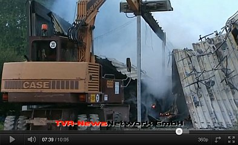](http://youtu.be/aTwgNCX3428)

6. Juli 2009: [Tüßling (Wohnhaus)](http://www.innsalzach24.de/altoetting/brand-tuessling-is24-388628.html) 
11. Juli 2009: [Gräfelfing (Wohnhaus)](http://feuerwehr-graefelfing.de/index.php?option=com_content&task=view&id=224&Itemid=92) 

[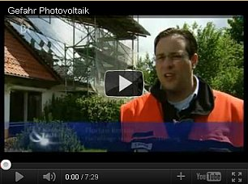](http://youtu.be/zoxnDujgRiU)

1. September 2009: [Aachen-Lichtenbusch](http://www.rlv.de/rlv_.dll?pageID=2663) 
5. September 2009: [Sielenbach-Aichach](http://www.augsburger-allgemeine.de/aichach/Feuer-zerstoert-Scheune-und-Solaranlage-id6814056.html) 
31. Oktober 2009: [Winhöring-Letzenberg](http://www.wochenblatt.de/nachrichten/altoetting/regionales/Feuer-Brand;art22,139820) 
22. Dezember 2009: [Goldern](http://www.localxxl.com/de/lokal_nachrichten/niederaichbach/brand-in-niederaichbach-goldern-feuer-verichtet-stadel---400000-euro-schaden-1261560657/) 
2009: [30 brennende Photovoltaikanlagen in Italien](http://www.orizzontenergia.it/articoli.php?id_articoli=85) 

[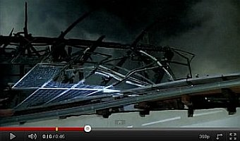](http://youtu.be/stqmrbRwclM)

4. Januar 2010: [Unstrut-Hainich-Kreis](http://photovoltaikversicherung.wordpress.com/2010/01/05/photovoltaikanlage-vollstandig-verbrannt/) 
6. Januar 2010: [Schlotheim](http://badlangensalza.thueringer-allgemeine.de/web/lokal/wirtschaft/detail/-/specific/Frostiger-Feuereinsatz-in-Schlotheim-1397715762) 
17. Februar 2010: [Schwerinsdorf (Wohnhaus)](http://www.feuerwehrpage.com/presse1702.php4) 
9. März 2010: [Gersten-Bawinkel (Putenstall)](http://nord-west-media.de/index.php?id=4208) 
4. April 2010: [Döverden](http://www.nonstopnews.de/meldung/10886) 
6. April 2010: [Wardenburg](http://www.feuerwehr-wardenburg.de/einsatz/show.php?id=50) 
14. April 2010: [Neustadt am Rübenberge (EFH-Schaltschrank PV-Anlage)](http://www.myheimat.de/neustadt-am-ruebenberge/blaulicht/feuer-zerstoert-schaltschrank-von-photovoltaikanlage-d462911.html) 
22. April 2010: [Rain am Lech (Lagerhalle Logistikzentrum)](http://www.ff-rain.de/aktuelles/archiv/115-22042010-bericht-photovoltaikanlage-auf-hallendach-geraet-in-brand.html) 
23. April 2010: [Bammental (Industriegebäude Pharma-Firma)](http://feuerwehr-bammental.de/Einsaetze/einsaetze2010/20/20.htm) 

[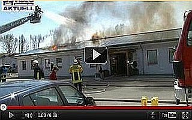](http://youtu.be/kF4sSJN-0CQ)

25. April 2010: [Erlingen-Meitingen](http://www.retter.tv/de/beitrag.html?ereig=-Brand-in-Erlingen-Millionenschaden-&ereignis=2177) 
4. Mai 2010: [Büchenbaum/Halver](http://www.come-on.de/nachrichten/maerkischer-kreis/halver/haus-halle-gehen-flammen-748730.html) 
9. Mai 2010: [Lahr (Scheffel-Gymnasium)](http://www.badische-zeitung.de/lahr/fotos-feuer-auf-dem-dach-des-lahrer-scheffel-gymnasiums?id=30823861) 
27. Mai 2010: [Tonnenheide-Rahden (Ausstellungs- und Lagerhalle)](http://www.feuerwehr-rahden.de/cms/_rubric/detail.php?nr=1343&rubric=Einsatz2010&) 
5. Juli 2010: [Neckarsulm](http://www.kfv-heilbronn.de/einsaetze.php?id=9352) 
7. Juli 2010: [Offenburg (Lagerhalle)](http://www.badische-zeitung.de/offenburg/solarzellen-geraten-in-brand--33043056.html) 
11. Juli 2010: [Groß Pankow (Wohnhaus)](http://feuerwehr-pritzwalk.de/einsatzinfo.php?id=201) 
12. Juli 2010: [Kemnat (Trafostation Photovoltaikanlage)](http://feuerwehr-aichach.de/index.php?option=com_content&view=article&id=182:brand-photovoltaikanlage&catid=29:einsaetze-2010&Itemid=2&el_mcal_month=6&el_mcal_year=2011) 
20. Juli 2010: [Unterweiler-Burgwindheim](http://www.localxxl.com/de/lokal_nachrichten/burgwindheim/brand-in-burgwindheim-feuer-in-maschinenhalle-verursacht-750000-euro-schaden-1279623897-ftr/) 
25. Juli 2010: [Löwenstein (Wohnhaus Innenstadt)](http://www.kfv-heilbronn.de/einsaetze.php?id=9438) 
6. August 2010: [Raesfeld-Paschenvenne-Homer](http://heimatreport.de/feuer-auf-dem-hof-marpert-in-raesfeld/) 
16. August 2010: [Borken](http://www.ad-hoc-news.de/technischer-defekt-war-ursache-fuer-feuer-auf-bauernhof--/de/News/21549530) 
20. August 2010: [Steinfeld-Hausen (Firmenhalle)](http://www.ffw-steinfeld.de/index.php?option=com_phocagallery&view=category&id=54:brand-photovoltaikanlage-082010&Itemid=82) 
22. August 2010: [Wagenitz](http://www.wagenitz-im-havelland.de/news/35-news/115-news.html) 
29. August 2010: [Forheim](http://www.augsburger-allgemeine.de/noerdlingen/Schon-wieder-brennt-eine-Maschinenhalle-id8392301.html) 
2. September 2010: [Bürstel (Wohnhaus)](http://www.nwzonline.de/Region/Kreis/Oldenburg/Ganderkesee/Artikel/2420490/Kamerad+hilft+mit+Sachverstand.html) 
18. September 2010: [Zachenberg](http://www.feuerwehr-ruhmannsfelden.de/einsaetze/einsaetze2010/einsatz035/einsatz035.htm) 
19. September 2010: [Bonlanden (Wohnhaus)](http://www.stuttgarter-nachrichten.de/inhalt.500000-euro-schaden-fotovoltaikanlage-geraet-in-brand.07af665b-8007-4f53-bfd8-cd637e46dd44.html) 
28. September 2010: [Plattling (Diskothek)](http://www.pnp.de/region_und_lokal/landkreis_deggendorf/plattling/91599_Hintergrund-Chronik-des-Disko-Brands.html) 
12. Oktober 2010: [Hainstadt](http://www.feuerwehr-buchen.de/einsaetze/68-2010-oktober/707-1210-brandeinsatz-grossbraende.html) 
24. November 2010: [Hirschling](http://www.ff-straubing-bogen.de/kbi3/einsaetze/einsaetze_details.php?id=131&year=2010) 
6. Dezember 2010: [St. Ingbert (Wohnhaus)](http://www.genios.de/presse-archiv/artikel/SAAR/20101207/qualmwolken-steigen-aus-schneebedec/1210070237.html) 
2010: [85 brennende Photovoltaikanlagen in Italien](http://www.orizzontenergia.it/articoli.php?id_articoli=85) 

Januar 2011: [Rindelbach](http://www.schwaebische.de/region/ostalb/ellwangen/stadtnachrichten-ellwangen_artikel,-Elektroinstallateur-zieht-Einspruch-zurueck-_arid,5429269.html) 
4. Januar 2011: [Unterneukirchen](http://www.tz-online.de/nachrichten/bayern/unterneukirchen-stall-solardach-flammen-meta-1068898.html) 
30. Januar 2011: [Hasselbach](http://www.bürgerkurier.de/index.php?option=com_content&view=article&id=6186:feuer-auf-landwirtschaftlichem-anwesen-in-hasselbach&catid=36:blaulichtnews&Itemid=2) 
7. Februar 2011: [Zorbau (Verteilerkasten Großflächen-Solaranlage)](http://feuerwehr-weissenfels.de/index.php?option=com_content&task=view&id=805&Itemid=61) 
7. Februar 2011: [Rheingönheim](http://www.morgenweb.de/region/mannheimer-morgen/ludwigshafen/brand-an-solaranlage-1.162334) 
18. Februar 2011: [Ascheberg (Lagerhalle)](http://www.ruhrnachrichten.de/bilder/fotostrecken/detail/cme103493,2290329) 
2. März 2011: [Salching (Trafohaus Solarpark)](http://www.mittelbayerische.de/region/brand-im-solarpark-20845-art640432.html) 
4. März 2011: [Theenhausen (Einfamilienhaus Nagel)](http://www.daserste.de/plusminus/beitrag_dyn~uid,4wx9rs54sya89hzf~cm.asp) 
8. März 2011: [Feldheim (Einfamilienhaus)](http://www.retter.tv/de/beitrag.html?ereig=-Einfamilienhaus-mit-Solaranlage-in-Feldheim-brennt-nieder-&ereignis=6219) 
8. März 2011: [Lohberg (Hotel)](http://www.tz-online.de/nachrichten/bayern-lby/feuer-hotel-drei-menschen-verletzt-lby-1152340.html) 
12. März 2011: [Arnstorf (Bauhof)](http://www.crimereport.de/news/artikel/1623-15-millionen-euro-brandschaden--photovoltaikanlage-auf-dem-dach-/) 
12. März 2011: [Fischbach (Elektrocontainer Solarpark)](http://www.suedkurier.de/region/schwarzwald-baar-heuberg/niedereschach/Brand-beim-Solarpark-Fischbach;art372527,4772228) 
14. März 2011: [Böckingen (Kinderfreizeitland-Halle "Trampoline")](http://www.kfv-heilbronn.de/artikel.php?id=10377&art=A) 
15. März 2011: [Brianzè (PV-Freianlage)](http://www.youreporter.it/video_In_fiamme_impianto_fotovoltaico_a_Brianze_1) 
24. März 2011: [Falkenberg-Fünfleiten (Solarpark)](http://www.pnp.de/region_und_lokal/landkreis_rottal_inn/eggenfelden/80215_Brand-in-Rottaler-Solaranlage-300.000-Euro-Schaden.html) 
29. März 2011: [Eft-Hellendorf](http://www.feuerwehr-perl.com/brand_eft_290311) 
3. April 2011: [Altrip am Rhein (Photovoltaik-Freiflächen-Anlage)](http://feuerwehr-altrip.de/_content/einsaetze/berichte/2011/Einsatzbericht_24-11.pdf) 
4. April 2011: [Husum (Mega-Photovoltaik-Freiflächen-Anlage)](http://www.localxxl.com/husum/feuer-auf-mega-photovoltaik-anlage-1301908519-ftz/) 
6. April 2011: [Erfurt (Papier-Lagerhalle)](http://www.thueringer-allgemeine.de/web/zgt/leben/blaulicht/detail/-/specific/Erfurt-Defekt-in-Solaranlage-war-Ursache-fuer-Brand-in-Lagerhalle-1794598781) 
6. April 2011: [Mengen](http://www.suedkurier.de/region/linzgau-zollern-alb/mengen/Grossbrand-auf-Bauernhof;art372565,4819398) 
6. April 2011: [Filderstadt-Bonlanden (Photovoltaikanlage-Wechselrichter)](http://webspace.bbruder.de/projekte/db-server.info/ffw_fibo/einsaetze/einsaetze.php?year=2011) 
7. April 2011: [Romrod-Zell 1](http://www.fuldaerzeitung.de/nachrichten/schlitzerbote/Schlitz-Grossbrand-auf-Bauernhof-Feuerwehr-rettet-Tiere;art112,399880) 
7. April 2011: [Dunningen](http://www.dunningen112.de/c/einsaetze/einsaetze-2011/278-gebaeudebrand-uhlandstrasse) 
11. April 2011: [Paderborn-Sennelager (Lagerhalle)](http://www.nw-news.de/lokale_news/paderborn/paderborn/4381663_Solar-Technik_loest_Hallenbrand_aus.html) 
28. April 2011: [Niederaula](http://www.hna.de/nachrichten/kreis-hersfeld-rotenburg/bad-hersfeld/400000-euro-schaden-nach-vermutlicher-brandstiftung-1221499.html) 
28. April 2011: [Oberalpfen (Mehrzweckhalle)](http://www.suedkurier.de/region/hochrhein/waldshut-tiengen/Mehrzweckgebaeude-in-Flammen;art372623,4858794) 
30. April 2011: [Altrip am Rhein (Freiflächen-Photovoltaikanlage)](http://feuerwehr-altrip.de/_content/einsaetze/berichte/2011/Einsatzbericht_24-11.pdf) 
2. Mai 2011: [Hirschberg (Autohaus gegenüber der Solarfirma)](http://www.rheinneckarblog.de/2011/05/02/brand-auf-lagerhalle-von-evobus-geloescht-ursache-war-kurzschluss/) 
4. Mai 2011: [Thonlohe](http://www.mittelbayerische.de/index.cfm?pid=10070&pk=659602&p=1) 
15. Mai 2011: [Lüneburg-Goseburg (Holzlagerhalle)](http://www.feuerwehrmagazin.de/nachrichten/einsatze/grosbrand-19-feuerwehrleute-verletzt-18714) 
25. Mai 2011: [Bühl (Lagerhalle)](http://www.feuerwehrbuehl.de/ffw/index.php?idcatside=201&nid=1984) 
3. Juni 2011: [Greifswald-Eldena (Wohnhaus)](http://www.greifswald-tv.de/index.php/Details/231/0/?&no_cache=1&tx_ttnews\[tt_news\]=4464&cHash=7b7d9a6cb7) 
6. Juni 2011: [Strasburg (Wohnblock/Mehrfamilienhaus)](http://www.feuerwehr-pasewalk.de/einsatz11-41.htm) 
10. Juni 2011: [Büren-Keddinghausen](http://www.shortnews.de/id/898716/Bueren-Technischer-Defekt-Schweinestall-fing-Feuer) 
15. Juni 2011: [Leinfelden-Unteraichen (Wohnhaus-Rohbau)](http://www.stuttgarter-zeitung.de/inhalt.dachstuhl-steht-in-hellen-flammen.dfe28102-9a67-49fa-b95e-cf7f62381d51.html) 
18. Juni 2011: [Cento (Baumarkt Brico Io)](http://www.estense.com/?p=151753) 
30. Juni 2011: [Altomünster](http://www.merkur-online.de/lokales/altomuenster/bild-verwuestung-grauens-1303322.html) 
30. Juni 2011: [Hohenwarth-Unterzettling](http://www.localxxl.com/de/lokal_nachrichten/hohenwarth/hoher-sachschaden-bei-brand-in-der-landwirtschaft-1277936680-fta/) 
4. Juli 2011: [Sielenbach-Aichach](http://www.retter.tv/de/beitrag.html?ereig=-Grossbrand-in-Sielenbach-&ereignis=8170) 
5. Juli 2011: [Ittlingen-Heppich](http://feuerwehr-ittlingen.de/cms/index.php?option=com_content&view=article&id=80&Itemid=84) 
12. Juli 2011: [Ritschenhausen (Lagerhallen)](http://www.insuedthueringen.de/lokal/meiningen/meiningen/Lagerhalle-in-Ritschenhausen-steht-in-Flammen;art83442,1694603?fCMS=fd2bb24ea42a400b60c72a24c6a0a07b) 
16.-18. Juli 2011: [Vechelde-Alvesse (Doppelbrand)](http://www.paz-online.de/Peiner-Land/Lokalnachrichten/Lengede-Vechelde-Wendeburg/Erneuter-Brand-in-Haehnchenmastanlage) 
24. Juli 2011: [Klingenhain](http://www.ffw-oschatz.de/fotoserien/schnappschuesse/brand_solaranlage_klingenhain_43416.html) 
28. Juli 2011: [Soglioano sul Rubicone (Kommunalgebäude)](http://www.cesenatoday.it/cronaca/incendio-impianto-fotovoltaico-sogliano-rubicone.html) 
2. August 2011: [Grettstadt - Dürrfeld](http://www.mainpost.de/regional/franken/400-Schweine-verendeten-bei-Brand;art1727,6267717,C::cme209104,3794578) 
6. August 2011: [Wiesau-Kornthan](http://www.an-online.de/artikel/1779788) 
10. August 2011: [Düren-Merken](http://www.an-online.de/artikel/1779788) 
11. August 2011: [Wolferstadt-Zwerchstraß (Freiflächen-PV-Anlage)](http://www.feuerwehr-wemding.de/berichte/ber-pv-strom.html) 
17. August 2011: [Kloster Bardel](http://www.gn-online.de/de/lokales.html?artikelid=2465&n=600.000+Euro+Schaden+bei+Brand+am+Kloster+Bardel) 
20. August 2011: [Borgentreich-Körbecke](http://www.dtoday.de/regionen/lokal-nachrichten_artikel,-Brand-eines-Schweinemaststalls-_arid,87116.html) 
24. August 2011: [Asseln: Solar- und Biohof](http://www.radiohochstift.de/nachrichten/paderborn-hoexter/detail-ansicht/article/brand-auf-biohof-in-asseln.html) 
30. August 2011: [Ferchensee](http://www.ff-haag.de/index.php/einse-2012/2011-mainmenu-107/359-einsatz-30082011-brand-solaranlage-ferchensee) 
18. September 2011: [Filderstadt-Bonlanden (Wohnhaus)](http://www.stuttgarter-nachrichten.de/inhalt.500000-euro-schaden-fotovoltaikanlage-geraet-in-brand.07af665b-8007-4f53-bfd8-cd637e46dd44.html) 
19. September 2011: [Mittelkalbach](http://www.brandschutznews.de/index.php/einsatz-brand-auf-bauernhof-heuballen-brannten/) 
25. September 2011: [Feldatal-Windhausen](http://www.fuldaerzeitung.de/nachrichten/schlitzerbote/Schlitz-350-000-Euro-Schaden-bei-Stallungsbrand;art112,449426) 
26. September 2011: [Kehl am Rhein (Heizungsbaubetrieb)](http://www.kehl.de/wStadt/verwaltung/stadtnachrichten/20110926.php) 
30. September 2011: [Ankenreute-Gaisbeuren](http://www.ff-weingarten.de/einsatz/nbericht/1996) 
30. September 2011: [Landsberg am Lech - Frauenwald (PV auf Firmengebäude, 1. Brand)](http://aktuell.meinestadt.de/landsberg-am-lech/2011/09/30/landsberg-spektakularer-brand-solaranlage-steht-in-flammen/) 
30. September 2011: [Overschau (Solarpark)](https://sites.google.com/site/feuerwehrsuederluegum/wir-ueber-uns/einsaetze/2011) 
3. Oktober 2011: [Gädheim](http://www.mainpost.de/regional/hassberge/Existenz-im-Nu-zerstoert;art1726,6356939) 
3. Oktober 2011: [Höngeda (Wohnhaus)](http://www.thueringer-allgemeine.de/web/zgt/leben/blaulicht/detail/-/specific/Brand-verursacht-schweren-Schaden-an-Haus-in-Hoengeda-1526659690) 
7. Oktober 2011: [Landsberg am Lech - Frauenwald (PV auf Firmengebäude, 2. Brand)](http://www.augsburger-allgemeine.de/landsberg/Photovoltaikanlage-geraet-erneut-in-Brand-id17034796.html) 
8. Oktober 2011: [Argenbühl](http://www.new-facts.eu/index.php?option=com_content&view=article&id=1290:argenbuehl-bauernhofbrand-11-jaehriger-tot-4-jaehrige-noch-vermisst&catid=4:polizei&Itemid=17) 
8. Oktober 2011: [Ebern (Lagerhalle)](http://www.mainpost.de/regional/hassberge/Malerbetrieb-brennt-ab-400-000-Schaden;art1726,6365266) 
9. Oktober 2011: [Fröhnerhof](http://www.brandschutznews.de/index.php/einsatz-brennt-scheune-mit-pv-anlage-auf-reiterhof/) 
10. Oktober 2011: [Landsberg am Lech - Frauenwald (PV auf Firmengebäude, 3. Brand in 14 Tagen)](http://www.augsburger-allgemeine.de/landsberg/Dritter-Brand-einer-Photovoltaikanlage-innerhalb-von-nur-14-Tagen-id17070716.html) - dazu ["Kommentare" im PV-Forum](http://www.photovoltaikforum.com/pv-news-f25/pv-anlage-brennt-3-x-in-10-tagen-t71876.html) 
15. Oktober 2011: [Roydorf](http://www.presseportal.de/polizeipresse/pm/59458/2130195/pol-wl-roydorf-brand-einer-scheune/rss) 

[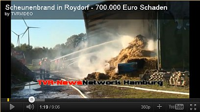](http://youtu.be/aMceppQ5oa0)

15. Oktober 2011: [Oesdorf-Heroldsbach](http://www.nordbayerischer-kurier.de/nachrichten/1307250/details_8.htm) 
15. Oktober 2011: [Winsen an der Luhe](http://www.bild.de/regional/hamburg/hamburg-regional/750-000-euro-schaden-bei-scheunenbrand-20485352.bild.html) 
19. Oktober 2011: [Langeneicke](http://www.derwesten.de/staedte/nachrichten-aus-soest-lippstadt-moehnesee-und-ruethen/brand-verursacht-250-000-euro-schaden-id5177184.html) 
20. Oktober 2011: [Lehmingen-Oettingen](http://www.feuerwehr-oettingen.de/index.php?id=114&tx_ttnews\[tt_news\]=76&tx_ttnews\[backPid\]=111&cHash=ce48bae6dc) 
22. Oktober 2011: [Mariensiel (Einfamilienhaus)](http://www.wzonline.de/index.php?id=1050&tx_ttnews\[tt_news\]=156402&tx_ttnews\[backPid\]=624&cHash=e8109a03890b7b1856c0a96f49ca3085) 
22. Oktober 2011: [Eutelingen-Göttelfingen](http://www.schwarzwaelder-bote.de/inhalt.eutingen-grossaufgebot-loescht-scheunenbrand.3c53ec43-aaea-4c4b-af6e-cb56b3ebbb7e.html) 
23. Oktober 2011: [Dettingen](http://www.schwaebische.de/region/biberach-ulm/ochsenhausen/rund-um-ochsenhausen_artikel,-Schuppen-brennt-–-150000-Euro-Schaden-entstehen-_arid,5151320.html) 
29. Oktober 2011: [Heeßel-Burgdorf (Sporthalle)](http://www.presseportal.de/polizeipresse/pm/66841/2139085/pol-h-nachtrag-zur-presseinformation-nr-2-vom-30-10-2011-brand-einer-sporthalle-brandursache) 
30. Oktober 2011: [Großheirath](http://www.infranken.de/nachrichten/lokales/coburg/Mann-nach-Grossbrand-in-Grossheirath-vermisst;art214,217019) 
1. November 2011: [Walperstetten-Niederviehbach (Ökologischer Volltreffer I: Solaranlage auf Holzhackschnitzel-Lagerhalle)](http://www.pnp.de/region_und_lokal/landkreis_dingolfing_landau/257869_Haeckselgut-entzuendet-sich-250.000-Euro-Schaden.html) 
11. November 2011: [Feuerbach (Einfamilienhaus)](http://presse.polizei-bwl.de/_layouts/Pressemitteilungen/DisplayPressRelease.aspx?List=7fba1b0b-2ee1-4630-8ac3-37b4deea650e&Id=14262) 
12. November 2011: [Wolferstadt-Zwerchstraß die zweite (Maschinenhalle)](http://web.archive.org/web/20130201084838/http://www.feuerwehr-wemding.de/berichte/zw-drr-ber.html) 
21. November 2011: [Wiesenbronn (Wohnhaus)](http://www.infranken.de/nachrichten/lokales/kitzingen/Photovoltaik-Brand-Feuerwehr-Wenn-Module-qualmen;art218,302967) 
26. November 2011: [Hüls-Hinterorbroich](http://www.wz-newsline.de/lokales/krefeld/stadtteile/huels-nord/grossbrand-beim-bauerncafe-kornblume-in-huels-1.829133) 
1. Dezember 2011: [Bergisch Gladbach Heidkamp (Lagerhalle)](http://www.feuerwehr.de/einsatz/berichte/einsatz.php?n=16655) 
2. Dezember 2011: [Seedorf (Lagerhalle)](http://www.shz.de/nachrichten/top-thema/article/111/grossbrand-legt-lagerhalle-in-schutt-und-asche.html) 
5. Dezember 2011: [Untersiemau (Möbelfabrik)](http://www.infranken.de/nachrichten/lokales/coburg/Schwelbrand-in-ehemaliger-Polsterfabrik;art214,228949,B) 
15. Dezember 2011: [Mindelheim](http://www.localxxl.com/mindelheim/brand-in-mindelheim-feuer-auf-bauernhof-richtet-hohen-schaden-an-1323940576-ftr/) 
30. Dezember 2011: [Stephanskirchen - Fussen](http://www.rosenheim24.de/nachrichten/bayern-lby/halle-brennt-komplett-aus-500000-euro-schaden-1546933.html) (und hier ein hübsches [Schadensbild der Feuerwehr](http://www.feuerwehr-stephanskirchen.de/wp-content/gallery/grosbrand-in-fussen/k-dscf0510.jpg)) 
o. Datum 2011: [Weitingen](http://www.schwarzwaelder-bote.de/inhalt.eutingen-es-brennt-haeufig:-feuerwehr-ist-parat.94e9b7ce-96fe-4ec7-b75f-dd9c72eed61c.html) (Schuppen) 
2011: [289 brennende Photovoltaikanlagen in Italien](http://www.orizzontenergia.it/articoli.php?id_articoli=85) 

2. Januar 2012: [Gussenstadt (Produktionshalle, brennt nach Wiederaufbau am 5.8.2013 wieder total ab!)](http://www.swp.de/heidenheim/lokales/kreisheidenheim/Gussenstadt-Feuer-Brand-Tiere-Unglueck-Feuerwehr;art1168195,1279052) 
4. Januar 2012: [Obertshausen (Industriehalle)](http://feuerwehr-obertshausen.de/index.php?id=53&L=0&tx_ttnews\[tt_news\]=669&cHash=35a1dd7f6aed08e9c966f2159ba10246) 
12. Januar 2012: [Ehningen Hofgut Mauren (Stalldach-Photovoltaikanlage verschwiegen)](http://content.stuttgarter-zeitung.de/stz/page/2775495_0_3577_-ehningen-400000-euro-schaden-bei-stallbrand.html) 
17. Januar 2012: [Beratzhausen (Lagerhalle)](http://www.ramasuri.de/49124/nachrichten/polizeimeldungen/polizeimeldungen-vom-18-januar-2012/) 
31. Januar 2012: [Westhausen](http://www.pz-news.de/baden-wuerttemberg_artikel,-Mehr-als-2000-Schweine-sterben-bei-Brand-einer-Zuchtanlage-_arid,322384.html) 
1. Februar 2012: [Schechen](http://www.bild.de/regional/muenchen/muenchen-regional/photovoltaikanlage-brennt--150-000-euro-schaden-22396208.bild.html) 
1. Februar 2012: [Wertheim-Nassig](http://www.main-netz.de/nachrichten/blaulicht/tbb/art3924,1976828) 
2. Februar 2012: [Rüsselsheim-Haßloch (PV verschwiegen, Pressebild zeigt nur Dachnordseite)](http://www.wiesbadener-kurier.de/nachrichten/polizei/11631763.htm) 
3. Februar 2012: [Karlshof, Amt Putlitz-Berge (Einfamilienhaus)](http://www.nnn.de/nachrichten/home/top-thema/article/111/einfamilienhaus-geht-in-flammen-auf.html) 
4. Februar 2012: [Petersberg-Böckels, Steinbachsfeld (Lagerhalle)](http://www.osthessen-news.de/beitrag_J.php?id=1209462) 
4. Februar 2012: [Rheinstetten-Mörsch (Einfamilienhaus)](http://www.ka-news.de/region/rheinstetten/Dachstuhlbrand-in-Moersch-Photovoltaikanlage-erschwert-Loescharbeiten;art6013,805117) 
4. Februar 2012: [Höxter-Lütmarsen (Fachwerkhaus 1854)](http://www.westfalen-blatt.de/nachricht/2012-02-07-eis-blockiert-ermittlungen/?tx_ttnews\[backPid\]=613&cHash=3d07a3b71174ab9638bf7c603dcdcfde) [Lütmarsen-Brandbilder](http://bilder.nw-news.de/hoexter-luetmarsen_brand_eines_fachwerk-bauernhauses/4/751210/751210.html) 
6. Februar 2012: [Neufraunhofen (Pferdestall - PV verschwiegen)](http://www.feuerwehrmagazin.de/nachrichten/einsatze/pferde-sterben-bei-brand-26759) 
6. Februar 2012: [Mundingen (ehem. Schreinerei - PV verschwiegen)](http://www.badische-zeitung.de/emmendingen/ehemalige-schreinerei-in-mundingen-brennt-aus--55557310.html) 
8. Februar 2012: [Bergneustadt (Sechsfamilienhaus)](http://www.rundschau-online.de/html/artikel/1328701679965.shtml) 
9. Februar 2012: [Lippetal-Hovestadt (Holzrahmen-Einfamilienhaus)](http://www.presseportal.de/polizeipresse/pm/65855/2195773/pol-so-lippetal-hovestadt-wohnhausbrand-mit-hohem-schaden) 
9. Februar 2012: [Neuschönau-Schönanger (Lagerhalle und Bürogebäude eines Nahwärmeversorgers)](http://www.wochenblatt.de/nachrichten/regen/regionales/Grossbrand-Lagerhalle-in-Schoenanger;art785,94101) 
11. Februar 2012: [Schloß Holte-Stukenbrock (Reiterhof)](http://www.nw-news.de/lokale_news/shs/schloss_holte_stukenbrock/6081664_18_Stunden_Loescheinsatz.html) 
12. Februar 2012: [Krögelstein (Einfamilienhaus, Brandursache: defektes Heizgerät)](http://www.infranken.de/nachrichten/lokales/bamberg/Heizgeraet-defekt-Wohnhaus-in-Flammen;art212,250778) 
19. Februar 2012: [Hasselberg (Brandstiftung)](http://www.shz.de/nachrichten/top-thema/article/111/liebeskummer-mann-zuendet-halle-an.html) 
6. März 2012: [Wachenroth](http://www.kfv-erh.de/einsatzberichtekfv/976-einsatzwachenroth20120306) 
6. März 2012: [Lohberg (Hotel)](http://www.mittelbayerische.de/index.cfm?pid=10059&pk=641921&p=1) 
9. März 2012: [Oberstdorf (Wohn- und Geschäftshaus mit Luxus-Ferienwohnungen)](http://www.br.de/radio/bayern1/sendungen/mittags-in-schwaben/brand-oberstdorf102.html) 
15. März 2011: [Ingolstadt (Gymnasium Gnadenthal)](http://www.stattzeitung-plus.in/meldungen/2769-schmorbrand-im-gnadenthal-gymnasium.html) 
19. März 2012: [Mattenkofen](http://www.radio-trausnitz.de/default.aspx?ID=6369&showNews=1132473) 
22. März 2012: [Spahnharrenstätte (Einfamilienhaus, Brandausbruch bei Montage PV-Dach-Anlage)](http://www.presseportal.de/polizeipresse/pm/104234/2221620/pol-el-brand-auf-dach-eines-einfamilienhauses-verlief-glimpflich) 
23. März 2012: [Coswig (Tischlerei-Werkhalle)](http://www.dnn-online.de/radebeul/web/radebeul-nachrichten/detail/-/specific/Grossbrand-in-Coswig-Werkhalle-brennt-auf-die-Grundmauern-nieder-1676835407) - [Solartrümer vom Coswiger Brand verseuchen 2,5 km entfernte Umgebung weiträumig](http://www.sz-online.de/nachrichten/artikel.asp?id=3024952) 
31. März 2012: [Nordlohne (ehem. Bundeswehr-Depot-Halle)](http://www.noz.de/lokales/62853164/brand-in-photovoltaikanlage-in-nordlohne) 
1. April 2012: [Goch (2 Lagerhallen)](http://photovoltaikversicherung.wordpress.com/2012/04/03/photovoltaikanlage-verursacht-brand-nur-die-solaranlage-brannte/) 
3. April 2012: [Großenhain-Skassa](http://www.sz-online.de/Nachrichten/Sachsen/18_000_Legehennen_verbrennen_in_Grossenhainer_Stall/articleid-3029440) 
4. April 2012: [Cicerale (Firmenzentrale)](http://www.stiletv.it/index.php/news/6925/Cicerale_incendio_distrugge_stabilimento_Eripress:_evacuati_operai,_danni_per_milioni_di_euro) 
7. April 2012: [Reinsdorf](http://www.mz-web.de/servlet/ContentServer?pagename=ksta/page&atype=ksArtikel&aid=1333952171403&openMenu=1013016724285&calledPageId=1013016724285&listid=1018881578312) 
8. April 2012: [Hiltrup](http://www.wn.de/Muenster/Stadtteile/Hiltrup/Feuerwehreinsatz-Bauernhof-Scheune-in-Hiltrup-abgebrannt-300.000-Euro-Schaden) 
10. April 2012: [Rettenbach (Wohnhaus)](http://www.all-in.de/nachrichten/allgaeu/marktoberdorf/Marktoberdorf-feuer-dachstuhl-euro-schaden-brand-Feuer-im-Dachstuhl-in-Rettenbach;art2762,1120253) 
12. April 2012: [Weinheim (Lagerhalle)](http://www.mrn-news.de/news/weinheim-elektroanlagenbrand-in-einer-lagerhalle-57854) 
12. April 2012: [Zweibrücken-Oberauerbach (Einfamilienhaus)](http://www.saarbruecker-zeitung.de/aufmacher/lokalnews/brand-Zweibruecken-150-000-Euro-Schaden-Hausbrand;art27857,4256475) 
13. April 2012: [Holsterhausen (Fertigungshalle Rolladenfabrik)](http://www.dorstenerzeitung.de/lokales/dorsten/Roll-Fe-Do-Fertigungshalle-ist-abgebrannt;art914,1615333) 
14. April 2012: [Gensingen (Wohnhaus)](http://www.buerstaedter-zeitung.de/nachrichten/polizei/11864942.htm) 
17. April 2012: [Rot am See](http://www.stimme.de/polizei/suedwesten/500-000-Euro-Schaden-bei-Stallbrand;art1495,2428564) 
20. April 2012: [Rosenfeld (Wohnhaus)](http://www.zak.de/artikel/126290/Rosenfeld-Feuerwehr-verhindert-Grossbrand-in-Rosenfeld) 
20. April 2012: [Casalvieri](http://www.dailyenmoveme.com/it/fotovoltaico-tetto/incendio-capannone-impianto-fotovoltaico-distrutto) 
21. April 2012: [Grefrath (Wohnhaus)](http://www.wz-newsline.de/lokales/kreis-viersen/grefrath/61-feuerwehrleute-loeschen-dachstuhlbrand-1.966970) 
21. April 2012: [Caserta-San Tammaro (5000qm-Dach)](http://www.vigilfuoco.it/sitiVVF/caserta/notizia.aspx?codnews=14949&s=301) 
23. April 2012: [Mosciano Sant'Angelo (Verpackungsfabrik)](http://www.abruzzo24ore.tv/news/Mosciano-Sant-Angelo-pannelli-fotovoltaici-evacuata-azienda-d-imballaggi/80276.htm) 
30. April 2012: [Osterwarngau (Photovoltaikanlage in Bericht unterschlagen, auf Fotos aber erkennbar)](http://www.merkur-online.de/lokales/landkreis-miesbach/osterwarngau-stallung-brennt-komplett-nieder-750000-euro-schaden-fotostrecke-mm-2299023.html) 
30. April 2012: [Oranienburg I (Solarpark)](http://www.feuerwehr-oranienburg.com/texte/seite.php?id=119522) 
02. Mai 2012: [Kitzingen (Trafostation)](http://www.infranken.de/nachrichten/lokales/kitzingen/Kurzschluss-loest-Brand-in-Trafostation-aus;art218,278634) 
12. Mai 2012: [Wolfhagen-Philippinenburg](http://nh24.de/index.php/braende/56185-aktuell-grossbrand-in-philippinenburg) 
18. Mai 2012: [Äpfingen (Fertigungshalle)](http://www.suedkurier.de/region/nachbarschaft/kreis-biberach/Kleiner-Brand-verursacht-grossen-Sachschaden;art372479,5513535) 
19. Mai 2012: [Huchem Stammeln (Lagerhalle)](http://www.presseportal.de/polizeipresse/pm/8/2255633/pol-dn-photovoltaikanlage-geraet-in-brand) 
23. Mai 2012: [Reken Bahnhof (Hühnerstall)](http://www.lokalkompass.de/dorsten/leute/solaranlage-brennt-auf-huehnerstall-in-reken-bahnhof-d170449.html) 
23. Mai 2012: [Herdecke (Dreifamilienhaus)](http://www.presseportal.de/polizeipresse/pm/69790/2258666/fw-en-dachstuhlbrand-an-der-ringstrasse) 
25. Mai 2012: [Oranienburg II (Solarpark)](http://www.feuerwehr-oranienburg.com/texte/seite.php?id=122253) 
26. Mai 2012: [Rodgau-Weiskirchen](http://www.presseportal.de/polizeipresse/pm/43561/2260241/pol-of-pressebericht-des-polizeipraesidiums-suedosthessen-in-offenbach-vom-samstag-26-05-2012/gn) 
26. Mai 2012: [Iserlohn Lichte Kammer (Grundschule)](http://www.lokalkompass.de/iserlohn/leute/feuer-auf-dem-dach-der-grundschule-lichte-kammer-d171397.html) 
26. Mai 2012: [Ehningen (Wohnhaus mit Scheune - Photovoltaikanlage auf Dach nicht genannt)](http://www.tagblatt.de/Home/nachrichten_artikel,-Wohnhaus-samt-Scheune-geht-in-Flammen-auf-_arid,135543.html) 
27. Mai 2012: [Vollmarshausen (Wohnhaus-Anbau)](http://www.hna.de/nachrichten/kreis-kassel/lohfelden/60000-euro-schaden-wohnhausbrand-vollmarshausen-2334692.html) 
28. Mai 2012: [Prenzlau-Igelpfuhl (Solarpark-Wechselrichter)](http://www.nordkurier.de/cmlink/nordkurier/lokales/prenzlau/1000-volt-station-fangt-feuer-1.432034) 
29. Mai 2012: [Oldenburg ehem. Fliegerhorst (Solarpark-Generatorbau)](http://www.nwzonline.de/Region/Ticker/Artikel/2875282/Oldenburg-Feuer-im-Solarpark-auf-ehemaligem-Fliegerhorst.html) 
30. Mai 2012: [Harburg-Heroldingen](http://www.augsburger-allgemeine.de/donauwoerth/Ursache-des-verheerenden-Feuers-offenbar-geklaert-id20400611.html) 
31. Mai 2012: [Kollnburg-Allersdorf](http://www.augsburger-allgemeine.de/bayern/Millionenschaden-bei-Feuer-in-Lagerhalle-id20393171.html) 
03. Juni 2012: [Hemau](http://www.augsburger-allgemeine.de/bayern/Scheune-brennt-komplett-nieder-Sechs-Menschen-verletzt-id20414106.html) 
03. Juni 2012: [Hilchenbach-Allenbach (Doppelhaushälfte)](http://www.siegener-zeitung.de/a/573324/Schadenshoeheliegtbei250000Euro) 
03. Juni 2012: [Geldern-Kapellen Waltersheide](http://www.rp-online.de/niederrhein-nord/geldern/nachrichten/technischer-defekt-verursachte-scheunenbrand-1.2866044) 
09. Juni 2012: [Uslar (Lagerhalle)](http://www.presseportal.de/polizeipresse/pm/57929/2268594/pol-nom-brand-an-lagerhalle/gn) 
11. Juni 2012: [Viereth (Busgarage)](http://www.mainpost.de/regional/hassberge/Immenser-Schaden-Bus-Garage-stand-in-Flammen;art1726,6836058) 
12. Juni 2012: [Remlingen (Biobauernhof-Lagerhalle)](http://www.mainpost.de/regional/main-spessart/Rauchsaeule-ueber-Remlingen-Grossbrand-auf-Biohof;art776,6838112) 
16. Juni 2012: [Wehr (Tierklinik/Reiterhof)](http://www.badische-zeitung.de/wehr/brand-geht-glimpflich-ab--60705888.html) 
17. Juni 2012: [Neustadt am Rübenberge (Reifencenter)](http://www.neuepresse.de/Hannover/Meine-Region/An-der-Leine/Neustadt/Technischer-Defekt-setzt-Reifencenter-in-Brand) 
17. Juni 2012: [Schönwalde Dorf (Wohnhaus)](http://www.maerkischeallgemeine.de/cms/beitrag/12346588/1353580/Schoenwalde-Glien-OT-Schoenwalde-Dorf-Dachstuhlbrand-durch-Solaranlage.html) 
18. Juni 2012: [Romrod-Zell 2](http://www.fuldainfo.de/index.php?type=special&area=1&p=articles&id=21090) - [Photovoltaik-Wechselrichter als Brandursache](http://www.lauterbacher-anzeiger.de/lokales/polizei-und-gericht/12322079.htm) 
19. Juni 2012: [Salach-Bärenbach](http://www.swp.de/goeppingen/lokales/mittleres_filstal/Baerenbacher-helfen-beim-Loeschen;art5777,1508984) 
23. Juni 2012: [Neuendettelsau (Wohnhaus)](http://www.presseportal.de/polizeipresse/pm/6013/2277426/pol-mfr-1099-feuerwehr-loeschte-brand-brandursache) 
26. Juni 2012: [Iserlohn Kalthof (Industriehalle)](http://www.lokalkompass.de/iserlohn/leute/einsatzdokumentation-der-feuerwehr-iserlohn-feuer-1-zollhausstr-45-d182753.html) 
28. Juni 2012: [Bühlerzell](http://www.neckar-chronik.de/Home/nachrichten/newsticker_artikel,-Blitz-trifft-Scheune-Millionenschaden-_arid,178203.html) 
28. Juni 2012: [Trani-Bisceglie (Villa)](http://www.radiobombo.it/news/52389/trani/video-e-foto-trani-brucia-il-tetto-fotovoltaico-di-una-villa-in-zona-matinelle-pomeriggio-di-duro-lavoro-per-i-vigili-del-fuoco) 
30. Juni 2012: [Barßel (Fabrikhalle)](http://www.ga-online.de/-news/artikel/100622/Den-aufmerksamen-Anwohnern-sei-Dank) 
1. Juli 2012: [Bösel Ostland](http://www.nwzonline.de/Region/Kreis/Cloppenburg/Boesel/Artikel/2899815/300-000-Euro-Schaden-Fahrzeughalle-ausgebrannt.html) 
4. Juli 2012: [Osnabrück (Firmendach)](http://www.presseportal.de/polizeipresse/pm/104236/2283392/pol-os-osnabrueck-brand-einer-photovoltaikanlage-leichter-gebaeudeschaden) 
5. Juli 2012: [Seybothenreuth (Einfamilienhaus)](http://www.wiesentbote.de/2012/07/05/www-bahnsinn-bamberg-de/) 
8. Juli 2012: [Empoli (Fabrikdach)](http://archivio.gonews.it/articolo_143624_Incendio-sul-tetto-alla-Elmas-limpianto-che-rileva-fumi-lallarme-in-tempo.html) 
14. Juli 2012: [Marienberg](http://www.bild.de/regional/chemnitz/brand/kaelberstall-in-flammen-25165442.bild.html) 
16. Juli 2012: [Irleshof-Berg](http://www.neumarktonline.de/art.php?newsid=71007) 
22. Juli 2012: [Thannhausen-Burg](http://www.augsburger-allgemeine.de/krumbach/Landwirtschaftliche-Lagerhalle-ein-Raub-der-Flammen-id21134576.html) (nach telef. Auskunft Brandstiftung, Täter unbekannt) 
24. Juli 2012: [Feigenhofen-Biberbach](http://www.retter.tv/de/feuerwehr.html?ereig=-Biberbach-Grossbrand-in-landwirtschaftlichem-Anwesen-mit-ca-600-Schweinen-&ereignis=13930) 
24. Juli 2012: [Porto Sant'Elpidio (PV-Freianlage auf Betonkonstruktion)](http://www.ilrestodelcarlino.it/fermo/provincia/2012/07/24/748451-incendio-pannelli-fotovoltaici-porto-sant-elpidio.shtml) 
27. Juli 2012: [Pasewalk-Viereck-Gehege (ehem. Stall)](http://www.nordkurier.de/cmlink/nordkurier/nachrichten/mv/rechter-treffpunkt-geht-in-flammen-auf-1.463102) 
28. Juli 2012: [Ehningen-Maurener Tal](http://www.stuttgarter-zeitung.de/inhalt.ehningen-500000-euro-schaden-bei-scheunenbrand.ffc5e43b-24c0-4899-bd5b-01cb0b20b68f.html) 
28. Juli 2012: [Bühlerzell-Geifertshofen](http://l-tv.de/?p=9565) 
30. Juli 2012: [Dinkelscherben-Häder](http://www.augsburger-allgemeine.de/augsburg/Stall-in-Haeder-brennt-Kuehe-gerettet-id21282441.html) 
3. August 2012: [Altdorf-Biessenhofen](http://www.merkur-online.de/nachrichten/bayern-lby/photovoltaikanlage-geht-flammen-2446258.html) (Industriehalle des PV-Herstellers (!) [Solarzentrum (!) Allgäu von Elektromeister und Philosoph Willi Bihler](http://goo.gl/maps/m1e0J) - Firmen-"Philosophie": "Wir setzen auf Alternative Energien", künftig: "Wir brennen durch Alternative Energien"?) 
8. August 2012: [Leutershausen (Maschinenhalle eines Blockheizkraftwerks!)](http://www.br.de/franken/inhalt/aktuelles-aus-franken/brand-halle-leutershausen100.html) 
12. August 2012: [Rudersberg (Reithalle)](http://www.stuttgarter-zeitung.de/inhalt.reithalle-in-rudersberg-technischer-defekt-loeste-brand-aus.1cd46bb8-fb45-4d37-b43e-9a30128125cb.html) 
14. August 2012: [Meerbusch-Osterath (Scheune mit Reifenlager)](http://www.wz-newsline.de/lokales/rhein-kreis-neuss/meerbusch/grossbrand-beschaedigt-scheune-1.1072114) 
14. August 2012: [Wingerode (Firmengebäude)](http://www.thueringer-allgemeine.de/web/zgt/leben/blaulicht/detail/-/specific/Feuer-im-Firmengebaeude-in-Wingerode-1345901802) 
16. August 2012: [Dülmen - Bauerschaft Welte](http://www.wn.de/Muensterland/Hoher-Sachschaden-Schweine-verbrennen-bei-Feuer-in-zwei-Stallgebaeuden) 
17. August 2012: [Goldbeck](http://www.ndr.de/regional/niedersachsen/heide/feuerteufel159.html) 
20. August 2012: [Bemerode](http://www.haz.de/Hannover/Aus-den-Stadtteilen/Sued/Landwirt-verhindert-Scheunenbrand) 
20. August 2012: [Vieholzen (Hackschnitzel-Lagerhalle)](http://www.pnp.de/region_und_lokal/landkreis_rottal_inn/pfarrkirchen/511882_120.000-Euro-Schaden-bei-Brand-einer-Lagerhalle.html) 
25. August 2012: [Ravensburg-Eschach (Kläranlagen-Halle)](http://www.suedkurier.de/region/bodenseekreis-oberschwaben/ravensburg/Brand-in-der-alten-Klaeranlage;art372490,5656763) 
26. August 2012: [Waldkappel-Schemmern](http://www.hna.de/nachrichten/werra-meissner-kreis/witzenhausen/landwirtschaftliches-anwesen-waldkapppel-brennt-2475198.html) 
26. August 2012: [Uebigau-Wahrenbrück OT Neudeck](http://www.maerkischeallgemeine.de/cms/beitrag/12382772/63579/Uebigau-Wahrenbrueck-OT-Neudeck-Eine-Million-Euro-Feuer.html) 
27. August 2012: [Holstenniendorf](http://www.presseportal.de/polizeipresse/pm/52209/2314397/pol-iz-holstenniendorf-feuer-auf-landwirtschaftlichem-betrieb/gn) 
28. August 2012: [Kirchroth-Pillnach (Maschinenhalle eines Bauunternehmens - Brandstiftung durch spielende Kinder)](http://www.idowa.de/home/artikel/2012/08/28/vollbrand-einer-maschinenhalle-circa-500000-euro-sachschaden/184769.html) 
29. August 2012: [Rossiglione (ehem. Baumwollspinnerei)](http://www.zeroemission.eu/portal/tv/channelname/Fotovoltaico/channel/33/id/18610) 
2. September 2012: [Rodgau-Nieder-Roden (Lagerhalle)](http://www.op-online.de/lokales/nachrichten/rodgau/feuer-solardach-rodgau-einsatz-2487464.html) 
2. September 2012: [Hürtgenwald-Horm (Lagerhalle der Müllsammelstelle)](http://www.aachener-zeitung.de/sixcms/detail.php?template=az_detail&id=2695932&_wo=Lokales:Dueren) 
5. September 2012: [Luhe-Wildenau (Lagerhalle des Golfclubs)](http://www.neumarktonline.de/art_frankopf.php?newsid=8401) 
7. September 2012: [Kinding (Wohnhaus mit Doppelgarage)](http://www.donaukurier.de/lokales/kurzmeldungen/beilngries/Kinding-Grosser-Schaden-bei-Wohnhausbrand;art74371,2652825) 
8. September 2012: [Hoberge-Uerentrup (Wohnhaus mit Flachdach)](http://www.westfalen-blatt.de/nachricht/2012-09-08-solaranlage-in-flammen/613/) 
9. September 2012: [Kronprinzenkoog (Strohlagerhalle)](http://www.welt.de/newsticker/dpa_nt/regioline_nt/hamburgschleswigholstein_nt/article109106871/Feuer-zerstoert-Stroh-Lagerhalle-mit-Solaranlage-auf-dem-Dach.html) 
13. September 2012: [Mönchenholzhausen (Strohlagerhalle und Rinderstall)](http://www.thueringer-allgemeine.de/web/zgt/leben/blaulicht/detail/-/specific/Grossfeuer-durch-brennendes-Stroh-in-Moenchenholzhausen-1246645308) 
14. September 2012: [Pasewalk (Strohlagerhalle des Berufsbildungszentrums)](http://www.nordkurier.de/cmlink/nordkurier/lokales/pasewalk/flammenmeer-zerstort-scheune-und-solaranlage-1.485956) 
15. September 2012: [Neustadt-Eining (Hackschnitzelanlage)](http://www.idowa.de/home/artikel/2012/09/16/neustadt-brand-einer-hackschnitzelanlage.html) 
23. September 2012: [Groß Garz](http://www.az-online.de/nachrichten/landkreis-stendal/seehausen/euro-schaden-scheunenbrand-kreis-stendal-2517719.html) 
24. September 2012: [Straubing-Alburg (Holzhaus)](http://www.idowa.de/home/artikel/2012/09/24/holzhaus-brennt-pv-anlage-behindert-loescharbeiten/327696.html) 
24. September 2011: [Hude-Kirchkimmen](http://www.nwzonline.de/oldenburg-kreis/hude-blitzeinschlag-haelt-feuerwehr-in-atem_g_1,0,1083321254.html) 
26. September 2012: [Burgebrach (Dreifamilienhaus)](http://www.infranken.de/nachrichten/lokales/bamberg/Hoher-Sachschaden-nach-Dachstuhlbrand;art212,331025) - hierzu besonders pikant: Aus dem [Bericht der ahnungslosen FFW Burgebrach](http://www.feuerwehr-burgebrach.de/einsatzbericht/brand-dachstuhl): _"Aus derzeit ungeklärter Ursache fing der Dachstuhl ... zwischen Ziegel und Innenverschalung an zu brennen. ... Nach Abschluss der Löscharbeiten wurde durch die Fa. Elektro L... die Photovoltaikanlage abgebaut."_ Ob es überhaupt gebrannt hätte, wenn die PV-Dachanlage schon vor dem Brand abgebaut worden wäre? ... 
28. September 2012: [Neckarbischofsheim (Sägewerk)](http://www.stimme.de/kraichgau/nachrichten/Nach-Grossbrand-Saegewerk-will-weitermachen;art1943,2580057) 
5. Oktober 2012: [Hemsbach (Lagerhalle)](http://www.mrn-news.de/news/hemsbach-technische-ursache-loeste-brand-in-einer-produktionshalle-aus-65851/) 
7. Oktober 2012: [Eberfing-Gandershofen (PV verschwiegen)](http://www.merkur-online.de/lokales/landkreis-weilheim/feuerwehr-grosseinsatz-wegen-brand-gandershofen-2536175.html) 
13. Oktober 2012: [Mengerskirchen-Waldernbach (Lagerhalle)](http://www.mittelhessen.de/lokales/region-limburg-weilburg_artikel,-100000-Euro-Schaden-durch-Brand-_arid,40438.html) 
28. Oktober 2012: [Elsten-Cappeln](http://www.nwzonline.de/cloppenburg/blaulicht/dunkle-rauchwolke-zeigt-den-weg-zur-brandstelle_a_1,0,1933464234-refhome.html) 
1. November 2012: [Berkau](http://www.az-online.de/nachrichten/landkreis-stendal/bismark/scheune-brennt-komplett-nieder-2593740.html) 
13. November 2012: [Sundern-Hellefeld](http://www.dorfinfo.de/groser-scheunenbrand-in-hellefeld-am-dienstagnachmittag) 
14. November 2012: [Holzhäuser-Osterhofen](http://www.pnp.de/region_und_lokal/landkreis_deggendorf/osterhofen/583384_Osterhofen-Brand-in-Halle-mit-PV-Anlage-600.000-Euro-Schaden.html) 
19. November 2012: [Jettingen](http://www.stuttgarter-zeitung.de/inhalt.kreis-boeblingen-eine-scheune-brennt-ab-und-mit-ihr-500-heuballen.634f68c7-cda2-4ea2-b03c-bf67921a2b4b.html) 
22. November 2012: [Aldersbach-Walchsing/Weidfeld (Villa, PV verschwiegen)](http://www.pnp.de/region_und_lokal/stadt_und_landkreis_passau/passau_land/590507_Haus-in-Aldersbach-brennt-nieder-Mutter-43-rettet-ihre-vier-Kinder.html) 
22. November 2012: [Klein Fullen](http://www.emsvechte-tv.de/cms/index.php?option=com_content&view=article&id=543:496-221112-klein-fullen-haehnchenstaelle-abgebrannt&catid=11:november-2012&Itemid=31) 
24. November 2012: [Jesberg (Möbelhaus-Lagerhalle)](http://www.nh24.de/index.php/braende/61852-grossbrand-in-jesberg-mehr-als-hundert-feuerwehrleute-im-einsatz) 
24. November 2012: [Altenheideck](http://www.donaukurier.de/lokales/hilpoltstein/Altenheideck-Scharfe-Splitter-und-lange-Leitungen;art596,2686292) 
Entsetzlich, was der Donaukurier über diesen Brand zu berichten weiß (Auszug aus Nachricht vor): _"... die Photovoltaikanlagen ... bereiteten den Feuerwehrmännern enorme Probleme: Zuallererst mussten sie alle Stromverbindungen zur Scheune kappen, und ... dann ... entwickelten sich die herabstürzenden Solarzellen zum nächsten Sicherheitsrisiko. Besonders tückisch: In der gewaltigen Hitze explodierten mehrere Photovoltaikelemente, deren messerscharfe Splitter durch die Luft wirbelten. ... einige dieser Trümmer selbst mehr als 50 Meter von der brennenden Scheune entfernt in einem angrenzenden Feld. ..."_ 
25. November 2012: [Grampersdorf (Photovoltaikfeld in Industriegebiet)](http://www.donaukurier.de/lokales/kurzmeldungen/beilngries/Beilngries-Schrecksekunde-beim-Weihnachtsmarkt;art74371,2686254) 
9. Dezember 2012: [Gewerbepark Lang, Schongau (Lagerhalle)](http://www.merkur-online.de/lokales/schongau/kampf-gegen-flammen-schnee-sturm-2659135.html) 
12. Dezember 2012: [Kreuzthal](http://www.all-in.de/nachrichten/allgaeu/polizeimeldungen/Polizeimeldungen-polizei-feuerwehr-stadel-Scheune-in-Kreuzthal-brennt-vollstaendig-ab;art2756,1242365) 
22. Dezember 2012: [Bergheim-Pfaffendorf (Einsturz Lagerhalle)](http://www.rundschau-online.de/rhein-erft/gewerbepark-pfaffendorf-grund-fuer-einsturz-weiter-unbekannt,15185500,21443278.html) 
26. Dezember 2012: [Rüdesheim (Getränkemarkt)](http://www.wiesbaden112.de/?p=7619) 
30. Dezember 2012: [Aufhausen (Maschinenhalle mit Hackschnitzelheizung)](http://www.mittelbayerische.de/nachrichten/polizeimeldungen/regionale-polizeimeldungen/artikel/hoher_sachschaden_bei_brand_in/864613/hoher_sachschaden_bei_brand_in.html) 

1. Januar 2013: [Schenefeld (Carport)](http://www.wedel-schulauer-tageblatt.de/aus-dem-polizeibericht/artikeldetail/article/669/kreise-steinburg-und-dithmarschen-braende.html) 
11. Januar 2013: [Northeim (Einfamilienhaus)](http://www.hna.de/nachrichten/landkreis-northeim/northeim/feuer-zerstoert-dachstuhl-eines-wohnhauses-2695062.html) 
11. Januar 2013: [Ahlefeld-Bistensee](http://www.shz.de/nachrichten/lokales/eckernfoerder-zeitung/artikeldetails/artikel/grossbrand-bedroht-biogasanlage.html) 
12. Januar 2013: [Scharbow](http://www.ostsee-zeitung.de/mecklenburg/index_artikel_komplett.phtml?SID=63ea5015b14a636e2e98fc6ae8b625fe&param=news&id=3657664) 
19. Januar 2013: [Hohenzell](http://www.regionews.at/newsdetail/Hohenzell_Dachstuhl_und_Photovoltaikanlage_wurden_Raub_der_Flammen-49044) 
21. Januar 2013: [Uehlfeld (Oldtimer-Werkstatt)](http://www.infranken.de/regional/erlangenhoechstadt/Brand-Oldtimerservice-Uehlfeld-Werkstatt-300-000-Euro-Schaden-bei-Werkstattbrand-in-Uehlfeld;art215,380781) 
28. Januar 2013: [Neukirchen-Vluyn](http://www.derwesten.de/staedte/nachrichten-aus-moers-kamp-lintfort-neukirchen-vluyn-rheurdt-und-issum/photovoltaik-ist-brandgefaehrlich-id7534228.html) 
30. Januar 2013: [Niederkrüchten](http://www.wz-newsline.de/lokales/kreis-viersen/niederrhein/niederkruechten-halle-ein-raub-der-flammen-1.1222745) 
31. Januar 2013: [Strobenried](http://www.donaukurier.de/lokales/kurzmeldungen/schrobenhausen/Strobenried-Dachstuhl-eines-Stalles-brennt-ab;art75096,2712148) 
1. Februar 2013: [Ebhausen-Rotfelden (Kamelhof - Photovoltaik-Anlage wie so oft nicht genannt ...)](http://www.schwarzwaelder-bote.de/inhalt.ebhausen-nach-grossbrand-ueberall-schaulustige.8c531ef9-2767-4bf2-b072-cbd8618814ab.html) 
21. Februar 2013: [Mamming](http://www.wochenblatt.de/nachrichten/isar/regionales/Brand-Scheune-PV-Anlage-Mamming-Feuerwehr-Grosseinsatz;art1177,164107) 
24. Februar 2013: [Martinszell](http://www.augsburger-allgemeine.de/bayern/Eine-Million-Euro-Schaden-bei-Brand-Feuerwehrmann-verletzt-id24190511.html) 
26. Februar 2013: [Stemwede](http://www.mt-online.de/start/top_news_rotation/7977503_Stemwede_Feuer_in_Schweinestall_-_500_Ferkel_und_zwoelf_Saeue_verenden.html) 
26. Februar 2013: [Rohr (Kunststoff-Fabrik)](http://www.insuedthueringen.de/lokal/meiningen/meiningen/Grosser-Schaden-nach-Verpuffung-und-Brand-in-Firma;art83442,2386696) 
2. März 2013: [Strocken (Fachwerk-Wohnhaus)](http://www.sz-online.de/nachrichten/gemeinde-sucht-moebel-fuer-brandopfer-2522699.html) 
3. März 2013: [Osterhofen (2. Brand)](http://www.wochenblatt.de/nachrichten/deggendorf/regionales/Feuer;art1147,165998) 
6. März 2013: [Schönfels](http://www.freiepresse.de/LOKALES/ZWICKAU/ZWICKAU/Riesenstroh-Lager-faengt-Feuer-Agrarhof-Halle-in-Schoenfels-brennt-nieder-artikel8295731.php) 
10. März 2013: [Oste di Montemurlo (Wollspinnerei)](http://corrierefiorentino.corriere.it/firenze/notizie/cronaca/2013/10-marzo-2013/pannelli-solari-tilt-lanificio-fiamme-212115491634.shtml) 
10. März 2013: [Backnang (Wohnhaus, 8 tote Türken)](http://www.feuerwehr.de/news/2013/03/10/grossbrand_backnang_tote_kinder.php) 
10. März 2013: [Zufikon (Wohnhaus)](http://www.aargauerzeitung.ch/aargau/kanton-aargau/solaranlage-loest-brand-aus-wegen-messfehler-des-installateurs-130394332) 
13. März 2013: [Euskirchen](http://www.rundschau-online.de/euskirchen/scheunenbrand-monatsration-fuer-zwoelf-dickhaeuter-verbrannt,15185862,22116856.html) 
15. März 2013: [Castelfranco (Wohnhaus)](http://tribunatreviso.gelocal.it/treviso/cronaca/2013/05/15/news/va-a-fuoco-il-tetto-fotovoltaico-delle-villetta-danneggiati-i-pannelli-e-la-guaina-protettiva-1.7072077) 
17. März 2013: [Freisen](http://www.saarbruecker-zeitung.de/sz-berichte/stwendel/Brand-zerstoert-Dachwohnung;art2799,4699122#.UUcBIBcrxMg#.UUcBIBcrxMg) 
20. März 2013: [Forlì](http://www.romagnanoi.it/news/forli/742644/Rogo-all-allevamento-maiali--pannelli.html) 
23. März 2013: [Niederpremeischl (Reiterhof-Wohnhausdach)](http://www.idowa.de/home/artikel/2013/03/25/brand-auf-reiterhof-vater-und-sohn-verletzt/532614.html) 
4. April 2013: [Naunhof-Lindhart (Industriehalle)](http://www.radiochemnitz.de/nachrichten/lokalnachrichten/grossbrand-in-naunhof-619979/) 
6. April 2013: [Taunusstein-Wehen](http://www.allgemeine-zeitung.de/nachrichten/polizei/12981873.htm?src=rc_ticker) 
8. April 2013: [Haselünne-Hülsen (Putenstall)](http://www.presseportal.de/polizeipresse/pm/104234/2446406/pol-el-hocher-sachschaden-bei-brand-eines-putenstalles) 
13. April 2013: [Scharbeutz-Untersteenrade (Scheune mit Oldie- und Wohnwagen-Unterstellung)](http://www.ln-online.de/Lokales/Ostholstein/Grossfeuer-zerstoert-Scheune-mit-Oldtimern-und-Wohnwagen) 
18. April 2013: [Wilhelmshaven (Logistik-Halle Jade Dienst)](http://www.nwzonline.de/wilhelmshaven/dach-von-fotovoltaikanlage-steht-in-flammen_a_5,1,429352452.html) 
19. April 2013: [Tüßling-Boinham](http://www.innsalzach24.de/innsalzach/altoetting/tuessling/brand-boinham-tuessling-verursacht-500000-euro-schaden-is24-2861387.html) 
22. April 2013: [Cloppenburg-Damme (Produktions- und Lagerhalle)](http://www.nonstopnews.de/meldung/16831) 
24. April 2013: [Ohlweiler (Einfamilienhaus, Dach-Photovoltaikanlage verschwiegen)](http://www.rhein-zeitung.de/regionales_artikel,-Einfamilienhaus-in-Ohlweiler-abgebrannt-200000-Euro-Schaden-_arid,587496.html) 
25. April 2013: [Echzell-Bingenheim (Einfamilienhaus)](http://www.wetterauer-zeitung.de/Home/Kreis/Staedte-und-Gemeinden/Echzell/Artikel,-Feuer-63-Jaehrige-rettet-sich-auf-Balkon-_arid,416496_regid,3_puid,1_pageid,78.html) 
4. Mai 2013: [Ditfurt](http://www.berliner-zeitung.de/newsticker/200-000-euro-schaden-bei-brand-eines-strohlagers,10917074,22677836.html) 
4. Mai 2013: [Damme-Reselage](http://www.rohonline.de/?p=6408) 
5. Mai 2013: [Neulußheim (Einfamilienhaus)](http://www.morgenweb.de/region/mannheimer-morgen/metropolregion/fotostrecken/neulussheim-einfamilienhaus-bei-brand-zerstort-1.1021403?showTilesView=true) 
5. Mai 2013: [Kayhude (Reiterhof)](http://www.feuerwehr-nahe.de/Einsatz_htm/einsaetze2013.htm) 
5. Mai 2013: [Bellante (PV-Freianlage)](http://ilcentro.gelocal.it/teramo/cronaca/2013/05/05/news/bellante-incendio-distrugge-i-pannelli-fotovoltaici-1.7004704) 
5. Mai 2013: [Hohenthann-Penkofen](http://www.idowa.de/home/artikel/2013/05/07/landshut-hohenthann-ueber-1000-schweine-tot-grossbrand-in-schweinestall/580904.html) 
8. Mai 2013: [Geilenkirchen-Prummern](http://www.aachener-zeitung.de/lokales/geilenkirchen/explosion-in-scheune-uber-100000-euro-schaden-1.572265) 
15. Mai 2013: [Hopferstadt](http://www.infranken.de/regional/wuerzburg/Hoher-Schaden-bei-Scheunenbrand-in-Hopferstadt;art88524,437966) 
16. Mai 2013: [Frauenau-Kagerbauernhof](http://www.pnp.de/region_und_lokal/landkreis_regen/zwiesel/788701_Brand-am-Kagerbauerhof-Technische-Probleme-verzoegerten-Alarmierung.html) 
24. Mai 2013: [Genholland](http://www.rp-online.de/niederrhein-sued/moenchengladbach/nachrichten/stromausfall-in-genholland-1.3424766) 
24. Mai 2013: [Laveno Mombello (Altenheim)](http://www.youreporter.it/video_Laveno_Casa_per_Anziani_in_fiamme) 
27. Mai 2013: [Ganacker (Lagerhalle)](http://www.idowa.de/lokales/dingolfinger-anzeiger/artikel/2013/05/27/feuer-in-lagerhalle-brandursache-noch-unklar/581402.html) 
30. Mai 2013: [Dietfurt (Industriehalle)](http://www.donaukurier.de/lokales/kurzmeldungen/dietfurt/Dietfurt-Defekt-bei-Photovoltaikanlage-200-000-Euro-Schaden-bei-Schwelbrand;art143036,2765129) 
5. Juni 2013: [Schnerkingen](http://www.schwaebische.de/region/sigmaringen-tuttlingen/messkirch/stadtnachrichten-messkirch_artikel,-Feuerwehr-rettet-in-Schnerkingen-wertvolle-Maschinen-_arid,5448441.html) 
6. Juni 2013: [Sterzing (Tennishalle)](http://www.tageszeitung.it/2013/06/06/brennendes-dach/) 
12. Juni 2013: [Kastl-Klugham](http://www.innsalzach24.de/innsalzach/burghausen/kastl/klugham-kastl-photovoltaikanlage-faengt-feuer-innsalzach24-2952106.html) 
17. Juni 2013: [Fulda-Niederrode](http://osthessen-news.de/J/1232984/fulda-scheunenbrand-in-niederrode-grosseinsatz-feuerwehr-ursache--video.html) 
18. Juni 2013: [Fulda-Niederkalbach](http://www.presseportal.de/polizeipresse/pm/43558/2495745/pol-fd-traktor-ausgebrannt) 
19. Juni 2013: [Osteressen (PV-Stromverteilerkasten)](http://www.presseportal.de/polizeipresse/pm/70090/2496286/pol-clp-pressemeldungen-aus-dem-bereich-cloppenburg) 
20. Juni 2013: [Lüdersburg/Bockelkathen](http://www.abendblatt.de/region/niedersachsen/article117293358/Lueneburg-Gewitterfront-sorgt-fuer-eine-unruhige-Nacht.html) 
20. Juni 2013: [Christershofen](http://www.br.de/nachrichten/schwaben/brand-christertshofen-bauernhof-100.html) 
20. Juni 2013: [Buch](http://www.swp.de/ulm/lokales/polizeibericht/Nach-Brand-Mauer-stuerzt-auf-Feuerwehrmann;art3458,2072660) 
20. Juni 2013: [Cuneo-Madonna dell'Olmo (Autohaus)](http://www.granda.net/default.aspx?tabid=4038&IDNews=8344) 
20. Juni 2013: [Pontenure (Logistik-Lagerhallenkomplex)](http://www.liberta.it/2013/06/20/pontenure-incendio-a-deposito-logistico-dellupim/) 
22. Juni 2013: [Ludwigshafen-Parkinsel (Styropor-Lagerhalle)](http://www.neckar-chronik.de/Home/nachrichten/nachrichten-empfingen_artikel,-Gigantische-Qualmwolke-bei-Lagerhallenbrand-in-Ludwigshafen-_arid,219052.html) 
24. Juni 2013: [Fusignano (Kunststoff-Fabrik)](http://www.ravennatoday.it/cronaca/guasto-ad-una-centralina-fiamme-alla-evergomme-di-fusignano.html) 
29. Juni 2013: [Berne (Boxen-Laufstall)](http://www.nwzonline.de/wesermarsch/blaulicht/schwelbrand-schnell-unter-kontrolle_a_7,2,843593846.html) 
30. Juni 2013: [Enniger-Ennigerloh](http://www.die-glocke.de/lokalnachrichten/kreiswarendorf/ennigerloh/Scheune-brennt---Brandstiftung-vermutet-33e3a9ba-c40a-431c-960d-5f3f6beeeb7d-ds) 
01. Juli 2013: [Landshut-Ellermühle (Flughafen-Montagehalle)](http://www.wochenblatt.de/nachrichten/landshut/regionales/Feueralarm-am-Flugplatz;art67,186494) 
01. Juli 2013: [Cosenza-Mongrassano (Lagerhalle)](http://www.quicosenza.it/le-notizie-dell-area-urbana-di-cosenza/9571-pannelli-solari-in-fiamme-gli-operai-spengono-l-incendio) 
06. Juli 2013: [Hargesheim (Gewerbehalle für Fahrzeugaufbereitungsfirma, Oldtimer-Garage, Maler- und Lackiererbetrieb)](http://www.wochenspiegellive.de/hunsruecknahe/nachrichtendetails/obj/2013/07/08/geht-ein-feuerteufel-um/) 
08. Juli 2013: [Buttelstedt (Schreinerei/Tischlerei/Bau- und Möbeltischlerei)](http://www.thueringer-allgemeine.de/web/zgt/leben/blaulicht/detail/-/specific/Brand-zerstoert-Tischlerei-in-Buttelstedt-1267547753) 
08. Juli 2013: [Gavardo (Wohnhaus)](http://www.vallesabbianews.it/notizie-it/\(Gavardo\)-Tetto-in-fiamme-24990.html) 
08. Juli 2013: [Varena (Wohnhaus)](http://www.youreporter.it/video_Incendio_a_Varena_a_fuoco_pannelli_fotovoltaici) 
09. Juli 2013: [Siegenthan](http://www.wochenblatt.de/nachrichten/schwandorf/regionales/Ueber-200-000-Euro-Schaden-bei-Bauernhof-Brand;art1170,187923) 
10. Juli 2013: [Blekendorf (Wohnhaus)](http://www.presseportal.de/polizeipresse/pm/14626/2511073/pol-ki-130710-1-blekendorf-wohnhaus-durch-feuer-stark-beschaedigt) 
10. Juli 2013: [Pöllau (Jugendgästehaus)](http://www.kleinezeitung.at/steiermark/hartbergfuerstenfeld/3352723/brand-jugendgaestehaus-poellau.story) 
13. Juli 2013: [Ingelheim (Bahnhofs-Fahrradhalle)](http://www.kreuznach112.de/) 
15. Juli 2013: [Berg-Irleshof](http://www.neumarktonline.de/art.php?newsid=71007) 
15. Juli 2013: [Forchtenberg](http://www.stimme.de/polizei/hohenlohe/Scheune-bei-Brand-komplett-zerstoert-Hoher-Sachschaden;art1494,2847098) 
15. Juli 2013: [Teisbach (Wohnhaus)](http://www.idowa.de/home/artikel/2013/07/16/brand-einer-photovoltaikanlage-in-teisbach/610244.html) 
16. Juli 2013: [Altdorf (Wohnhaus)](http://www.luzernerzeitung.ch/nachrichten/zentralschweiz/uri/Brand-in-Einfamilienhaus;art97,276831) 
19. Juli 2013: [Rosdorf-Mengershausen (Wohnhaus mit Wintergarten)](http://www.hna.de/lokales/goettingen/grossbrand-autobahn-rosdorf-3014420.html) 
19. Juli 2013: [Wurmannsquick](http://www.retter.tv/de/polizei.html?ereig=-Wurmannsquick-Mehrere-Kuehe-starben-beim-Brand-&ereignis=19644) 
21. Juli 2013: [Maselheim-Äpfingen (Wohnhaus)](http://www.schwaebische.de/region/biberach-ulm/biberach/rund-um-biberach_artikel,-In-Aepfingen-faengt-PV-Anlage-Feuer-_arid,5472346.html) 
22. Juli 2013: [Greven](http://www.presseportal.de/polizeipresse/pm/43526/2519440/pol-st-greven-brand-einer-scheune) 
23. Juli 2013: [Bingen-Gaulsheim (Logistik-Lagerhalle)](http://www.allgemeine-zeitung.de/region/bingen/bingen/13292806.htm) 
26. Juli 2013: [Manschnow (Pumpenhaus)](http://www.berliner-zeitung.de/berlin/braende-halten-feuerwehr-auf-trab,10809148,23849592,view,asTicker.html) 
27. Juli 2013: [Deutenhofen (Wohnhauskeller)](http://www.merkur-online.de/lokales/dachau/landkreis/heisser-feuerwehr-3028408.html) 
29. Juli 2013: [Krottenthal](http://www.focus.de/regional/bayern/braende-vier-verletzte-bei-stadelbrand-160-000-euro-schaden_aid_1057275.html) 
29. Juli 2013: [Alpen-Veen (Reiterhof; Pferde-Bewegungshalle)](http://www.derwesten.de/staedte/nachrichten-aus-rheinberg-xanten-alpen-und-sonsbeck/feuer-auf-veener-reiterhof-id8256514.html) 
29. Juli 2013: [Untergriesbach](http://www.mittelbayerische.de/nachrichten/polizeimeldungen/regionale-polizeimeldungen/artikel/stadelbrand_kripo_passau_fuehr/944895/stadelbrand_kripo_passau_fuehr.html) 
30. Juli 2013: [Denklingen (Einfamilienhaus mit Carport)](http://www.augsburger-allgemeine.de/landsberg/Einfamilienhaus-in-Flammen-Zwei-Verletzte-und-500-000-Euro-Schaden-id26464141.html) 
31. Juli 2013: [Rottweil (Doppelsporthalle)](http://www.nrwz.de/inhalt/rottweil/Doppelsporthalle-in-Rottweil_-Drei-Solarmodule-brennen-lichterloh--00050156.html) 
31. Juli 2013: [Laer-Holthausen Hof Stegemann (1)](http://www.ruhrnachrichten.de/lokales/horstmar/Wehr-hatte-Probleme-mit-Photovoltaik-Brand-Holthausen-Polizei-forscht-nach-der-Ursache;art1002,2080930) 
1. August 2013: [Hettingen (Einfamilienhaus)](http://www.rnz.de/buchen/00_20130801185043_105441831_Zwei_Menschen_wurden_bei_Wohnhausbrand_verletz.html#ad-image-0#ad-image-0) 
1. August 2013: [Schwaighausen-Holzgünz](http://www.all-in.de/nachrichten/polizeimeldungen/Polizei-polizei-feuer-brand-stadel-feuerwehr-schaden-verletzt-Brand-eines-Stadels-bei-Holzguenz;art2756,1390878) 
3. August 2013: [Kappel-Grafenhausen (Lagerhalle)](http://www.badische-zeitung.de/kappel-grafenhausen/hoher-sachschaden-bei-lagerhallenbrand--74139885.html) 
3. August 2013: [Rosegg (Wohnhaus)](http://www.regionews.at/newsdetail/Dachstuhl_in_Flammen_Zig_tausend_Euro_Schaden-63269) 
4. August 2013: [Pfarrkirchen-Postmünster, Gut Fasselsberg (Gestüt-Hengststation)](http://www.ovb-online.de/bayern/turnierpferde-kommen-flammen-3041879.html) 
4. August 2013: [Bihlafingen (20-Tonnen-Dach-PV vom Winde verweht)](http://www.stuttgarter-nachrichten.de/inhalt.sigmaringen-und-kreis-biberach-unwetter-zerrupfen-zwei-zeltlager.73f295eb-8b97-4788-a67c-63529bc3b395.html) 
4. August 2013: [Wölfersheim (Trafostation der PV-Großanlage "Solarpark")](http://www.fnp.de/rhein-main/wetterau/30-nbsp-000-Euro-Schaden-bei-Brand-eines-Trafos;art677,594781) 
4. August 2013: [Bad Dürrheim](http://www.schwarzwaelder-bote.de/inhalt.bad-duerrheim-oekonomiegebaeude-stuerzt-bei-brand-ein.1bf2e3dc-948e-4959-916f-361b6f239e6a.html) 
5. August 2013: [Gussenstadt (Produktionshalle, schon zum 2. Mal mit PV-Großanlage vollständig abgefackelt)](http://www.schwaebische.de/region/ostalb/aalen/rund-um-aalen_artikel,-Feuer-in-Lagerhalle-in-Gussenstadt-Knapp-zwei-Millionen-Euro-Schaden-_arid,5479822.html) 
6. August 2013: [Ühlingen-Birkendorf: Riedern am Wald (Wohnhaus)](http://www.badische-zeitung.de/uehlingen-birkendorf/haus-in-riedern-am-wald-brennt-ab-250-000-euro-schaden--74197146.html) 
6. August 2013: [Gunzenhausen-Aha](http://www.nordbayern.de/region/gunzenhausen/drei-personen-bei-scheunenbrand-in-gunzenhausen-verletzt-1.3078450?searched=true) 
6. August 2013: [Lörrach-Brombach (Mehrfamilienwohnhaus, PV-Anlagenbrand nicht erwähnt)](http://www.badische-zeitung.de/loerrach/dachstuhlbrand-in-loerrach-bahnverkehr-unterbrochen) 
6. August 2013: [Werl (Baumarkt)](http://www.presseportal.de/polizeipresse/pm/65855/2529452/pol-so-werl-brand-einer-photovoltaikanlage) 
7. August 2013: [Augsburg (Wohnhaus)](http://www.locally.de/nachricht/27437/einsatz-fuer-berufsfeuerwehr-augsburg-brand-eines-schalters-von-photovoltaik-anlage) 
11. August 2013: [Riedlingen-Uttenweiler (Lagerhalle)](http://www.schwaebische.de/region/biberach-ulm/riedlingen/stadtnachrichten-riedlingen_artikel,-Photovoltaikanlage-durch-Brand-beschaedigt-_arid,5481816.html) 
14. August 2013: [Norderney (KFZ-Werkstatt und Unterstellhalle/Depot für Linienbusse)](http://www.nwzonline.de/blaulicht/kfz-lagerhalle-brennt-vollstaendig-nieder_a_8,2,4229082474.html) 
15. August 2013: [Zulling (Pferdehof, PV-Anlage auf Dach nicht erwähnt)](http://www.wochenblatt.de/nachrichten/isar/regionales/Pferdehof-Brand-Pferde-gerettet;art1177,194747) 
17. August 2013: [Lindach (Photovoltaikfeld)](http://www.wochenblatt.de/nachrichten/altoetting/regionales/Brand;art22,195068) 
18. August 2013: [Rahden (Trafohaus einer Photovoltaik-Großanlage)](http://www.feuerwehr-rahden.de/cms/_rubric/index.php?rubric=Einsatz2013) 
23. August 2013: [Sassenberg-Dackmar (Wechselrichter in Technikraum PV-Großanlage)](http://www.ad-hoc-news.de/polizei-warendorf-pol-waf-sassenberg-brand-in-einem--/de/News/31469444) 
24. August 2013: [Großweitzschen-Kattnitz-Ostrau (Milchviehanlage - Bergehalle)](http://www.focus.de/regional/sachsen/braende-brand-in-milchviehanlage-verursacht-hunderttausende-euro-schaden_aid_1080808.html) 
25. August 2013: [Filderstadt-Bernhausen (Zweifamilienhaus)](http://m.schwarzwaelder-bote.de/inhalt.blaulicht-aus-der-region-stuttgart-25-august-mutmasslicher-exhibitionist-gestellt.4b7c6a4d-a7b9-4783-9671-4756639c92ee.html) 
25. August 2013: [Nordhorn (PV-Schulzentrum-Dach)](http://www.retter.tv/de/feuerwehr.html?ereig=-Grossbrand-in-Nordhorner-Schulzentrum-&ereignis=20252) 
25. August 2013: [Willingshausen](http://www.seknews.de/2013/08/26/rund-360-strohrundballen-in-brand-gesteckt/) 
30. August 2013: [Ellerstadt (Scheune)](http://www.mrn-news.de/news/ellerstadt-mannheimer-strasse-30.08.2013-06.00-uhr-brand-in-scheune-81609/) 
1. September 2013: [Tarp](http://www.shz.de/lokales/schleswiger-nachrichten/stall-in-tarp-brennt-nieder-id3571631.html) 
3. September 2013: [Wemding (Trafostation einer Freiflächen-PV-Anlage - mit schrecklichem Arbeitsunfall bei Erstanschluß der PV-Anlage)](http://www.augsburger-allgemeine.de/donauwoerth/Lichtbogen-verletzt-Arbeiter-schwer-id26865821.html) 
3. September 2013: [Delanco (Warenhaus)](http://www.nj.com/burlington/index.ssf/2013/09/dietz_and_watson_warehouse_fire_solar_panels_make_battling_blaze_much_harder_officials_say.html) 
7. September 2013: [Dorfgütingen](http://www.br.de/nachrichten/mittelfranken/scheunenbrand-feuchtwangen-102.html) 
8. September 2013: [Metelen](http://www.wn.de/Muensterland/Kreis-Steinfurt/Metelen/Menschen-und-Tiere-kamen-nicht-zu-Schaden-Ein-trauriger-Anblick-nach-dem-Brand) 
11. September 2013: [Spremberg (Industriehalle)](http://www.rbb-online.de/panorama/beitrag/2013/09/grossbrand-zerstoert-industriehalle-in-spremberg.html) 
11. September 2013: [Hinterschmiding](http://www.pnp.de/region_und_lokal/landkreis_freyung_grafenau/freyung/961399_Brand-in-Scheune-Eine-Person-leicht-verletzt.html) 
14. September 2013: [Ebstorf](http://www.az-online.de/lokales/landkreis-uelzen/ebstorf/dacharbeiten-feuer-zerstoert-scheune-ebstorf-3111318.html) 
26. September 2013: [Klein Süstedt (Ökohof-Schlachterei)](http://www.az-online.de/lokales/landkreis-uelzen/uelzen/grossbrand-schlachterei-3134828.html) 
28. September 2013: [Fulda-Bronnzell](http://www.hr-online.de/website/rubriken/nachrichten/indexhessen34938.jsp?rubrik=36094&key=standard_document_49725983) 
2. Oktober 2013: [Lausitz: Rosenthal-Bielatal (Zweifamilienhaus)](http://www.lausitznews.de/pressebericht_10840.html) 
2. Oktober 2013: [Lausitz: Vetschau (Industrie- und Technologiezentrum)](http://www.niederlausitz-aktuell.de/artikel_324_32551.php) 
8. Oktober 2013: [Lingen-Baccum / Emlichheim (Ausstellungsgebäude einer Tischlerei)](http://www.02elf.net/rechtswesen/emlichheim-brand-einer-tischlerei-241295) 
13. Oktober 2013: [Vogtsburg-Niederrotweil](http://www.badische-zeitung.de/vogtsburg/geraeteschuppen-in-vollbrand-solaranlage-beschaedigt--76103423.html) 
29. Oktober 2013: [Duisburg Ingenhammshof (PV-Anlage (Google Maps) auf Lernbauernhof verschwiegen)](http://www.derwesten.de/staedte/duisburg/mehrere-tiere-sterben-bei-grossbrand-auf-duisburger-lernbauernhof-id8613617.html) 
4. November 2013: [Ditfurt (Reiterhof-Scheune)](http://www.focus.de/regional/sachsen-anhalt/braende-wieder-brand-auf-reiterhof-75-000-euro-schaden_aid_1148710.html) 
5. November 2013: [Wackersdorf (Photovoltaik-Anlagen-Hersteller!!!)](http://www.mittelbayerische.de/region/schwandorf/artikel/technischer-defekt-loest-feuer-aus/980501/technischer-defekt-loest-feuer-aus.html) 
6. November 2013: [Meeder (PV-Anlagen (Google Maps) auf Bauernhof verschwiegen)](http://www.np-coburg.de/lokal/coburg/coburgland/Scheune-in-Meeder-geht-in-Flammen-auf;art83421,2940192) 
8. November 2013: [Fürstenau (Lagerhalle)](http://www.noz.de/lokales/fuerstenau/artikel/426646/lagerhalle-in-furstenau-ausgebrannt) 
8. November 2013: [Königheim (Großmetzgerei - Produktionshalle, Büroräume, Verkaufsladen, Gaststätte, PV-Großanlage auf Dach verschwiegen)](http://www.fnweb.de/region/main-tauber/tauberbischofsheim-konigheim-werbach/schaden-belauft-sich-auf-mehrere-millionen-euro-1.1277938) 
9. November 2013: [Gudensberg-Dorla (Feuerwehrler von Stromschlag verletzt, 420 Schweine getötet)](http://www.nh24.de/index.php/braende/71916-gudensberg-fritzlar-dorla-hunderte-schweinen-in-dorla-verbrannt) 
16. November 2013: [Missen-Wilhams](http://www.br.de/nachrichten/schwaben/bauernhof-allgaeu-grossbrand-huehner-100.html) 
19. November 2013: [Siegenburg-Niederumelsdorf/Oberumelsdorf? (Feuerwehrmann stirbt im Einsatz an Herzstillstand)](http://mobil.wochenblatt.de/nachrichten/kelheim/regionales/art1176,212008) 
20. November 2013: [Sögel](http://www.noz.de/lokales/soegel/artikel/429661/drei-grossbrande-in-sogel-brandstiftung-1) 
22. November 2013: [Aichach-Unterschneitbach (Maschinenhalle)](http://www.augsburger-allgemeine.de/aichach/Maschinenhalle-brennt-voellig-nieder-halbe-Million-Euro-Schaden-id27845907.html) 
27. November 2013: [Wiefelstede (Lagerhalle)](http://www.nwzonline.de/ammerland/blaulicht/kabel-auf-dem-dach-faengt-feuer_a_10,4,3236859940.html) 
29. November 2013: [Unteregg-Warmisried](http://www.mittelbayerische.de/nachrichten/oberpfalz-bayern/artikel/bauernhof-im-allgaeu-brennt-nieder/990048/bauernhof-im-allgaeu-brennt-nieder.html) 
29. November 2013: [Sengenthal (Einfamilienhaus)](http://www.mittelbayerische.de/region/neumarkt/artikel/feuer-verursacht-30000-euro-schaden/990070/feuer-verursacht-30000-euro-schaden.html) 
1. Dezember 2013: [Hüfingen-Sumpfohren, Wiesenackerhof (Photovoltaik-Dachanlage verschwiegen)](http://www.suedkurier.de/region/schwarzwald-baar-heuberg/huefingen/Wiesenackerhof-Kuhstall-wird-ein-Raub-der-Flammen;art372521,6504560) 
1. Dezember 2013: [Kuddewörde (Einfamilienhaus)](http://www.rtntvnews.de/news/9025/Kuddewoerde-Dachstuhlbrand-in-Einfamilienhaus/) 
6. Dezember 2013: [Bodenheim (Mehrfamilienhaus, eine Schwerverletzte)](http://www.allgemeine-zeitung.de/lokales/mainz/vg-bodenheim/bodenheim/bodenheim-frau-bei-dachstuhlbrand-schwer-verletzt-grosseinsatz-fuer-feuerwehren_13683587.htm) 
7. Dezember 2013: [Schöllnach (Hackschnitzel-Lagerhalle)](http://www.hessen-tageblatt.com/schoellnach-vollbrand-einer-landwirtschaftlichen-halle-mit-hohem-sachschaden-ca-500-000-euro-schaden-51291) 
8. Dezember 2013: [Fehmarn-Orth (Bootshalle)](http://www.ln-online.de/Lokales/Ostholstein/Bootshalle-auf-Fehmarn-brennt-nieder-1-5-Millionen-Euro-Schaden) 
9. Dezember 2013: [Arheilgen (Spargelhof)](http://www.echo-online.de/region/darmstadt/Feuer-auf-Spargelhof-Mindestens-200-000-Euro-Schaden;art1231,4535920) 
16. Dezember 2013: [Reichenbach (ehem. Einkaufsmarkt)](http://www.freiepresse.de/LOKALES/VOGTLAND/PLAUEN/Einstiger-Einkaufsmarkt-brennt-artikel8644872.php) 
19. Dezember 2013: [Klecken-Rosengarten (Wohnhaus, zwei tote Kinder)](http://www.mopo.de/umland/tragoedie-in-rosengarten-julian---11--starb-in-der-feuer-hoelle,5066728,25678328.html) 

1. Januar 2014: [Freiburg/Elbe-Kehdingen](http://www.kreiszeitung-wochenblatt.de/nordkehdingen/blaulicht/mehrere-tiere-sterben-bei-grossfeuer-in-kehdingen-d28996.html) 
13. Januar 2014: [Winzer-Rickering](http://www.presseportal.de/polizeipresse/pm/104234/2638249/pol-el-brand-eines-landwirtschaftlich-genutzten-nebengebaeudes) 
14. Januar 2014: [Winzer-Rickering](http://www.br.de/nachrichten/niederbayern/brand-schweinestall-winzer-100.html) 
14. Januar 2014: [Wargolshausen (Nebengebäude einer therapeutischen Praxis)](http://osthessen-news.de/n1242760/wargolshausen--ger-tehalle-abgebrannt---ursache-und-schadensh-he-noch-unklar-.html) 
15. Januar 2014: [Baden-Baden-Sandweier (Lagerhalle Holzbetrieb)](http://www.presseportal.de/polizeipresse/pm/110975/2640341/pol-og-brand-einer-lagerhalle-in-baden-baden-sandweier-update) 
15. Januar 2014: [Zwiefalten-Hochberg-Hochfalten](http://www.nonstopnews.de/meldung/18146) 
19. Januar 2014: [Heidelsheim (Fahrschule)](http://www.ka-news.de/region/bruchsal/Feuerwehr-Grosseinsatz-in-Heidelsheim-Fahrschule-in-Flammen;art6011,1308812) 
23. Januar 2014: [Sprakel, Hof Feldmann](http://www.muensterschezeitung.de/staedte/muenster/Schlauch-bis-zur-Aa-Grossbrand-auf-Bauernhof-in-Sprakel;art993,2254420), typischerweise erst ohne ökoabzockpeinliche Erwähnung PV, dann aber doch, als [PV als Brandursache](http://www.muensterschezeitung.de/staedte/muenster/Feuer-durch-Photovoltaikanlage-Technischer-Defekt-loeste-Grossbrand-auf-Hof-Feldmann-aus;art993,2260034) feststand 
24. Januar 2014: [Krefeld (Villa Charlottenburg)](http://www.wz-newsline.de/lokales/krefeld/solaranlage-auf-dem-dach-brand-schwer-zu-loeschen-mit-video-1.1536636) 
25. Januar 2014: [Elsenfeld (Carport)](http://www.br.de/nachrichten/unterfranken/carport-brennt-elsenfeld-100.html) 
27. Januar 2014: [Hasbergen (Erlebnisrestaurant)](http://www.nonstopnews.de/meldung/18208) 
27. Januar 2014: [Uchte (Solarpark Trafohäuschen)](http://www.sn-online.de/Schaumburg/Seeprovinz/Sachsenhagen/Feuer-in-Solarparks) 
27. Januar 2014: [Sachsenhagen (Solarpark Trafohäuschen)](http://www.sn-online.de/Schaumburg/Seeprovinz/Sachsenhagen/Feuer-in-Solarparks) 
29. Januar 2014: [Harkebrügge (Putenstall)](http://www.nwzonline.de/cloppenburg/blaulicht/wehr-bekaempft-flammen-in-putenstall_a_12,5,2568918267.html) 
30. Januar 2014: [Elfershausen (Bürger-Solarpark)](http://www.infranken.de/regional/bad-kissingen/Brand-in-Photovoltaikanlage-in-Elfershausen;art211,621849) 
4. Februar 2014: [Rendsburg (Autohaus)](http://www.shz.de/lokales/landeszeitung/zerstoertes-autohaus-millionenschaden-id5621471.html) 
6. Februar 2014: [Gorizia (Parkhaus)](http://ilpiccolo.gelocal.it/trieste/foto-e-video/2014/02/06/fotogalleria/in-fiamme-i-pannelli-fotovoltaici-all-autoporto-di-gorizia-1.8616354#9#9) 
7. Februar 2014: [Rivergaro (Wohnhaus)](http://www.liberta.it/2014/02/07/rivergaro-tetto-di-unabitazione-in-fiamme-intervengono-i-vigili-del-fuoco/) 
9. Februar 2014: [Bösel](http://www.nwzonline.de/cloppenburg/blaulicht/scheune-brennt-komplett-nieder_a_12,5,3055272747.html) 
10. Februar 2014: [Meppen](http://www.gn-online.de/Nachrichten/Schweinestall-in-Brand-geraten-56312.html) 
10. Februar 2014: [Laas (Holzhackschnitzel-Fernheizwerk)](http://www.dervinschger.it/artikel.phtml?id_artikel=20979) 
14. Februar 2014: [Emlichheim Spahnharrenstätte](http://www.presseportal.de/polizeipresse/pm/104234/2664354/pol-el-scheunenbrand) 
15. Februar 2014: [Gnarrenburg (Speditions-Werkstatthalle)](http://www.weser-kurier.de/region/osterholz_artikel,-Werkstatthalle-brennt-vollstaendig-nieder-_arid,781467.html) 
18. Februar 2014: [Bünsdorf](http://www.shz.de/lokales/landeszeitung/feuer-vernichtet-wirtschaftsgebaeude-id5784321.html) 
20. Februar 2014: [Nattheim (Wohnhaus)](http://www.presseportal.de/polizeipresse/pm/110979/2669539/pol-ul-hdh-nattheim-brand-vernichtet-wohnung-in-den-morgenstunden-ist-am-donnerstag-eine) 
20. Februar 2014: [Bargfeld (Ölmühle)](http://www.az-online.de/lokales/landkreis-uelzen/suderburg/millionenschaden-nach-grossfeuer-einer-oelmuehle-bargfeld-landkreis-uelzen-3377710.html) 
27. Februar 2014: [St. Georgen (Kindergarten)](http://www.suedkurier.de/region/schwarzwald-baar-heuberg/st-georgen/Qualm-auf-dem-Dach-Feuerwehr-rueckt-zum-Kindergarten-aus;art410944,6734661) 
1. März 2014: [Glauchau (Logistik-Lagerhalle)](http://www.tv-zwickau.de/2014/03/02/feuer-zerstort-solaranlage/) 
1. März 2014: [Lichtenau-Büschelbach (Lagerhallendach)](http://www.nordbayern.de/region/ansbach/photovoltaikanlage-brannte-in-lichtenau-1.3490702) 
4. März 2014: [Kraftisried-Westerried](http://www.all-in.de/nachrichten/lokales/Rund-1-Million-Euro-Schaden-nach-Brand-in-Kraftisried;art26090,1556999) 
5. März 2014: [Lam (Wohnhaus)](http://www.mittelbayerische.de/region/cham/cham/artikel/feuer-beschaedigt-dach-des-nachbarhauses/1027842/feuer-beschaedigt-dach-des-nachbarhauses.html) 
9. März 2014: [Ellwangen-Neunheim (Lagerhalle)](http://www.schwaebische.de/region/ostalb/ellwangen/stadtnachrichten-ellwangen_artikel,-Wie-es-nach-dem-Brand-weitergeht-ist-unklar-_arid,5608339.html) 
11. März 2014: [Meßkirch](http://www.schwaebische.de/region/sigmaringen-tuttlingen/messkirch/stadtnachrichten-messkirch_artikel,-In-Messkirch-brennt-eine-Lagerhalle-nieder-_arid,5604487.html) 
14. März 2014: [Citadella (Zementfabrik)](http://www.ilgazzettino.it/NORDEST/PADOVA/cittadella_incendio_pannelli_fotovoltaici/notizie/573779.shtml) 
15. März 2014: [Neunkirchen bei Heilig Blut (Wohnhaus)](http://www.mittelbayerische.de/region/cham/cham/artikel/brand-retter-schwebten-in-lebensgefahr/1032906/brand-retter-schwebten-in-lebensgefahr.html) 
16. März 2014: [Berleburg-Elshoff (Wohnhaus mit Scheune, PV-Anlage unerwähnt)](http://www.derwesten.de/staedte/nachrichten-aus-bad-berleburg-bad-laasphe-und-erndtebrueck/grossbrand-in-berleburg-elsoff-id9121567.html) 
19. März 2014: [Langenfeld-Alt-Wiescheid (Wohnhaus)](http://www.rp-online.de/nrw/staedte/langenfeld/zwei-verletzte-nach-kellerbrand-aid-1.4117806) 
20. März 2014: [Rinteln-Ahe](http://www.nonstopnews.de/meldung/18474) 
21. März 2014: [Schönow (Wohnhaus)](http://www.bild.de/regional/berlin/brand/feuerdrama-beim-mittagschlaf-35175888.bild.html) 
27. März 2014: [Waldmünchen-Spielberg (Holzhackschnitzel-Heizwerk)](http://www.mittelbayerische.de/region/cham/cham/artikel/200000-euro-schaden-bei-scheunenbrand/1039385/200000-euro-schaden-bei-scheunenbrand.html) 
2. April 2014: [Mamburg](http://harlinger.de/nachrichten.aspx?ArtikelNr=16733&ReturnTab=365) 
5. April 2014: [Vechta-Grünenmoor (Produktionshalle Tierfutterbabrik mit Hackschnitzelanlage)](http://www.nwzonline.de/cloppenburg/blaulicht/130000-euro-schaden-bei-brand-in-produktionshalle-130-000-euro-schaden-bei-brand-in-produktionshalle_a_14,6,3484313388.html) 
5. April 2014: [Lastrup](http://www.noz.de/lokales/herzlake/artikel/465946/putenstall-in-lastrup-bei-brand-zerstort) 
9. April 2014: [Haiterbach (Logistik-Lagerhalle)](http://www.presseportal.de/polizeipresse/pm/110972/2710828/pol-ka-cw-haiterbach-verteilerkasten-von-photovoltaik-anlage-in-brand-geraten) 
10. April 2014: [Engelsberg-Unterharrer](http://www.merkur-online.de/aktuelles/bayern/merkur-engelsberg-millionenschaden-grossbrand-maschinenhalle-3472932.html) 
14. April 2014: [Stuhr-Brinkum (Firmenhalle)](http://www.weser-kurier.de/region/diepholz_artikel,-Anlage-brennt-in-Brinkum-Nord-_arid,828750.html) 
15. April 2014: [Buchenberg](http://www.suedkurier.de/region/schwarzwald-baar-heuberg/koenigsfeld/Hofbesitzer-wird-von-Brand-geweckt;art372523,6866130) 
15. April 2014: [Königsfeld](http://www.schwarzwaelder-bote.de/inhalt.koenigsfeld-defekt-an-photovoltaikanlage-vermutet.a8900a9a-faa4-4e6d-a80f-e80a4cb00afc.html) 
15. April 2014: [Maßweiler (Kunststofffabrik)](http://www.focus.de/regional/rheinland-pfalz/braende-150-000-euro-schaden-bei-brand-in-kunststofffabrik-ursache-unklar_id_3776006.html) 
16. April 2014: [Hergatz-Engelitz](http://www.schwaebische.de/region/allgaeu/wangen/rund-um-wangen_artikel,-Photovoltaik-Anlage-in-Engelitz-hat-gebrannt-120-000-Euro-Schaden-_arid,5624075.html) 
18. April 2014: [Pernumia (Kaffeelager)](http://mattinopadova.gelocal.it/padova/cronaca/2014/04/18/news/divorato-dalle-fiamme-il-magazzino-del-caffe-1.9072147) 
20. April 2014: [Marina Eldenburg (Hausboot)](https://www.nordkurier.de/mueritz/brand-auf-hausboot-in-marina-eldenburg-216440604.html) 
21. April 2014: [Schortens (Wohnanlage mit 36 Wohnungen "Groen Winkel")](http://www.nwzonline.de/friesland/blaulicht/groen-winkel-ein-totalschaden_a_14,7,735578000.html) 
25. April 2014: [Niedertopfstedt](http://www.thueringer-allgemeine.de/web/zgt/leben/blaulicht/detail/-/specific/Grossbrand-in-Niedertopfstedt-712998230) 
27. April 2014: [Horb am Neckar (Fensterfabrik, PV-Dachanlage verschwiegen)](http://www.schwarzwaelder-bote.de/inhalt.horb-brand-zerstoert-firma-im-industriegebiet-heiligenfeld.741a367e-19ae-429a-87a2-207054b6c3f0.html) 
28. April 2014: [Westerstede, OT Garnholt / Garnholterdamm](http://www.nonstopnews.de/meldung/18652) 
29. April 2014: [Kematen (Reitstall)](http://www.tt.com/panorama/unfall/8318817-91/feuerwehren-zu-brand-in-reitanlage-in-kematen-alarmiert.csp) 
29. April 2014: [Rastede (Mehrfamilienhaus)](http://www.nwzonline.de/region/mehrfamilienhaus-brennt-in-rastede-nieder_a_14,7,1332744741.html) 
29. April 2014: [Valdobbiadene (Weinkellerei)](http://www.qdpnews.it/index.php/valdobbiadene/1681-incendio-alla-cantina-umberto-bortolotti-in-fiamme-il-tetto-con-i-moduli-fotovoltaici) 
30. April 2014: [Sulzbach an der Murr](http://m.schwarzwaelder-bote.de/inhalt.blaulicht-aus-der-region-stuttgart-1-mai-mit-auto-gegen-hauswand-geprallt.dfe51a30-192e-4098-afb3-43cc599abc4f.html) 

April 2014: [Nottinghamshire (Grundschule)](http://www.dailymail.co.uk/news/article-2738673/Schools-warned-solar-panel-fire-risk-Free-green-scheme-halted-three-mystery-blazes.html) 

Die Brandsaison April 2014 schließt ab mit einem bemerkenswerten Forschungsergebnis des TÜV Rheinland und Fraunhofer ISE: [„Brandgefahren bei Photovoltaik-Anlagen sehr gering“](http://www.baulinks.de/webplugin/2014/0736.php4) 

2. Mai 2014: [Ried in der Riedmark](http://www.nachrichten.at/oberoesterreich/muehlviertel/ticker-muehlviertel/St-Georgen-Gusen-Maschinenhalle-geriet-in-Brand;art1102,1376139) 
2. Mai 2014: [Cantù (Firmensitz)](http://cantu.netweek.it/notizie/cronaca-nera/-fiamme-alla-ditta-zanazzi-bruciano-i-pannelli-solari-3325546.html) 
5. Mai 2014: [Castelfiorentino (Autohaus)](http://www.firenzetoday.it/cronaca/incendio-castelfiorentino-concessionaria-scotti-video.html) 
12. Mai 2014: [Geisenfeld/Gaden](http://www.augsburger-allgemeine.de/neuburg/Dachstuhl-geht-in-Flammen-auf-id29832096.html) 
14. Mai 2014: [Willich-Anrath (Einfamilienhaus)](http://www.rp-online.de/nrw/staedte/willich/photovoltaikanlage-setzt-dachstuhl-in-brand-aid-1.4242867) 
14. Mai 2014: [Bocholt-Barlo-Plückelsheide (Dach-PV nicht erwähnt, auf Fotos sichtbar)](http://www.rp-online.de/nrw/panorama/3000-schweine-sterben-bei-brand-in-stall-aid-1.4239762) 
16. Mai 2014: [Hinterkappelen (Einfamilienhaus)](http://soaktuell.ch/index.php?page=%2Fnews%2Fhinterkappelen-sachschaden-bei-brand-eines-daches-mit-photovoltaik-anlage_19900) 
17. Mai 2014: [Grafling-Petraching (Firmen-Lagerhalle)](http://www.idowa.de/home/artikel/2014/05/17/grossbrand-pentraching-lagerhalle-steht-in-flammen/828897.html) 
18. Mai 2014: [Etzhorn (Firmen-Lagerhalle)](http://www.nwzonline.de/oldenburg/blaulicht/solaranlage-auf-hallendach-faengt-feuer-solaranlage-auf-hallendach-faengt-feuer_a_14,7,2883767473.html) 
19. Mai 2014: [Wachtendonk](http://www.rp-online.de/nrw/staedte/geldern/scheunenbrand-durch-defekt-in-photovoltaik-aid-1.4256029) 
27. Mai 2014: [Geislingen an der Steige (Gartenhaus/Gartenhütte)](http://www.presseportal.de/polizeipresse/pm/110979/2748010/pol-ul-gp-geislingen-an-der-steige-gartenhuette-brannte-vollstaendig-nieder-eine-bislang-unbekannte) 
1. Juni 2014: [Waldsolms-Weiperfelden (Solarpark)](http://www.mittelhessen.de/lokales/region-wetzlar_artikel,-Feuerwehreinsatz-im-Solarpark-Waldsolms-_arid,285326.html) 
1. Juni 2014: [Aachen-Brand (Wohnhaus)](http://www.aachener-nachrichten.de/lokales/aachen/photovoltaikanlage-auf-dach-geraet-in-brand-1.839676) 
3. Juni 2014: [Embühren](http://www.shz.de/lokales/landeszeitung/feuer-embuehren-id6752101.html) 
3. Juni 2014: [Kaufbeuren (Enfamilienhaus)](http://www.all-in.de/nachrichten/lokales/Wohnhaus-in-Kaufbeuren-abgebrannt-ca-300-000-Euro-Sachschaden;art26090,1647279) 
6. Juni 2014: [Wagenfeld (Wohnhaus)](http://www.kreiszeitung.de/lokales/diepholz/wagenfeld-ort53277/solaranlage-wagenfeld-brennt-feuerwehr-loescht-verhindert-ausbreitung-3617709.html?cmp=defrss) 
8. Juni 2014: [Walldorf (Lagerhalle)](http://www.rnz.de/ticker_regional/00_20140608155700_110690870-Walldorf-Brand-einer-Photovoltaik-Anlage-auf-L.html) 
8. Juni 2014: [Tussenhausen (Garagenanbau/Holzlager)](http://www.allgaeuhit.de/Unterallgaeu-Tussenhausen-Dringend-Zeugen-gesucht-Brand-eines-Holzlagers-in-Tussenhausen-article10005093.html) 
9. Juni 2014: [Wolfshagen (Schalterbrand Solarpark)](http://www.hna.de/lokales/wolfhagen/transformator-solarpark-wolfhagen-feuer-zerstoert-30000-euro-schaden-3618476.html) 
11. Juni 2014: [Krefeld (Hafen-Lagerhalle)](http://www.ad-hoc-news.de/polizeipraesidium-krefeld-pol-kr-brand-einer--/de/News/37370377) 
12. Juni 2014: [Hundewick](http://www.muensterlandzeitung.de/staedte/stadtlohn/Hundewick-Fotovoltaikanlage-geraet-in-Brand;art959,2389536) 
13. Juni 2014: [Regenstauf-Bernhardswald-Grubberg](http://www.mittelbayerische.de/regensburg-land/artikel/photovoltaikanlage-loest-brand-aus/1078224/photovoltaikanlage-loest-brand-aus.html) 
14. Juni 2014: [Stralsund (Kartoffellagerhalle)](http://www.ostsee-zeitung.de/Nachrichten/Panorama/300-000-Schaden-bei-Brand-einer-Lagerhalle) 
14. Juni 2014: [Murg-Oberhof (Wohn- und Ökonomiegebäude - Dach-PV unerwähnt)](http://www.badische-zeitung.de/murg/feuer-zerstoert-wohn-und-oekonomiegebaeude-brandort-beschlagnahmt) 
16. Juni 2014: [Winterberg-Altenfeld (Heizungsgebäude - Feuerwehrmann durch PV-Stromschlag verletzt)](http://www.derwesten.de/staedte/nachrichten-aus-winterberg-medebach-und-hallenberg/stromschlag-aus-solaranlage-verletzt-feuerwehrmann-25-id9483786.html) 
16. Juni 2014: [Leegemoor (Stromkasten Solarpark)](http://www.feuerwehr-norden.de/index.php?option=com_content&view=article&id=1795:brand-im-solarpark&catid=116&Itemid=262) 
17. Juni 2014: [Schuttertal-Schweighausen](http://www.badische-zeitung.de/schuttertal/feuer-vernichtet-stall--86351227.html) 
17. Juni 2014: [Thalhofen (Trafohäuschen der Photovoltaik-Freianlage)](http://www.allgaeuhit.de/Ostallgaeu-Thalhofen-Feuer-fordert-hohen-Schaden-Trafohaeuschen-in-Thalhofen-in-Vollbrand-article10005260.html) 
18. Juni 2014: [Wiesenttal-Albertshof](http://www.infranken.de/regional/forchheim/Feuerwehr-hat-Scheunenbrand-in-Wiesenttal-schnell-im-Griff;art216,736041) 
18. Juni 2014: [Windischholzhausen (Wohnhaus)](http://www.thueringer-allgemeine.de/startseite/detail/-/specific/45-000-Euro-Schaden-Defekte-Solaranlage-verursacht-Dachstuhlbrand-in-Erfurt-2111689481) 
20. Juni 2014: [Bad Wimpfen (Wohnhaus)](http://www.kfv-heilbronn.de/einsaetze.php?id=15300) 
21. Juni 2014: [Ebersburg-Weyhers](http://www.fuldaerzeitung.de/artikelansicht/artikel/2589857/feuerwehr-loscht-scheunenbrand-in-weyhers) 
23. Juni 2014: [Frankfurt a. Main (Bürogebäude der Stadtwerke)](http://www.fnp.de/lokales/frankfurt/Feuer-auf-dem-Dach-der-Stadtwerke;art675,908168) 
23. Juni 2014: [St. Blasien (Sägewerk)](http://www.badische-zeitung.de/st-blasien/holzlagerhalle-eines-saegewerks-brennt-ab-millionenschaden-in-st-blasien--86521067.html) 
25. Juni 2014: [Seitingen-Oberflacht (PV auf Brandobjekt verschwiegen)](http://www.schwaebische.de/region_artikel,-Loescharbeiten-auf-Bauernhof-vor-Abschluss-200-Kuehe-gerettet-_arid,10037168_toid,705.html) 
3. Juli 2014: [Bruck](http://www.mittelbayerische.de/region/schwandorf/artikel/brucker-kellerhof-ein-opfer-der-flammen/1087577/brucker-kellerhof-ein-opfer-der-flammen.html) 
11. Juli 2014: [Cortemaggiore (Fabrikhalle)](http://www.easyteachpoint.com/cortemaggiore-a-fuoco-i-pannelli-fotovoltaici-di-unazienda/) 
13. Juli 2014: [Freihung-Thansüß](http://www.oberpfalznetz.de/nachrichten/4237683-510,1,0.html) 
16. Juli 2014: [Wees (Tierfutterhandel, PV verschwiegen, aber in Bild sichtbar)](http://www.shz.de/lokales/flensburger-tageblatt/video-grossfeuer-zerstoert-futterhaus-in-wees-id7163276.html) 
17. Juli 2014: [Lecce (Richter-Wohn-Palast)](http://lecce.corrieresalentino.it/2014/07/impianto-fotovoltaico-in-fiamme-sullabitazione-del-presidente-sernia-fumo-e-paura-ingenti-i-danni/) 
19. Juli 2014: [Schliengen-Liel](http://www.verlagshaus-jaumann.de/inhalt.schliengen-hof-bei-liel-ein-raub-der-flammen.9ea8fda0-459b-436d-92ab-98050d817433.html) 
19. Juli 2014: [Wangen-Haslach](http://www.feuerschwarz.de/index.php/brand-schreinerei-grossalarm-feuerwehr/) (Schreinerei Müller, PV-Anlage am Dach von allen Medienberichten verschwiegen, auf [Bildlink](http://www.schwaebische.de/cms_media/module_img/4148/2074233_1_article660x420_B993324591Z.1_20140720105220_000_GG838CIFD.1_0.jpg) sichtbar) 
20. Juli 2014: [Bohmte-Hunteburg-Schwegermoor (Kompostierwerk)](http://www.noz.de/lokales/bohmte/artikel/492237/video-zeigt-luftaufnahmen-zum-grossbrand-bei-hunteburg) 
21. Juli 2014: [Teor (Baustofflager)](http://messaggeroveneto.gelocal.it/udine/cronaca/2014/07/21/news/le-fiamme-distruggono-un-capannone-1.9633012) 
22. Juli 2014: [Neustadt bei Coburg-Ketschenbach (Maschinenhalle)](http://www.np-coburg.de/lokal/coburg/neustadt/Maschinenhalle-brennt-lichterloh;art83422,3480559) 
22. Juli 2014: [Werl-Westönnen (Lagerhalle)](http://www.retter.tv/de/feuerwehr.html?ereig=-Werl-Brand-einer-Lagerhalle-&ereignis=25989) 
23. Juli 2014: [Codigoro](http://lanuovaferrara.gelocal.it/ferrara/cronaca/2014/07/23/news/pannelli-fotovoltaici-a-fuoco-in-un-azienda-di-codigoro-1.9648365) 
24. Juli 2014: [Jelmstorf-Bruchtorf (PV-Dachanlage nicht erwähnt, aber im Foto zu sehen)](http://www.az-online.de/lokales/landkreis-uelzen/bad-bevensen/az-blitz-grossbrand-jelmstorf-3726895.html) 
24. Juli 2014: [Dornheim (Wechselrichter Solarpark)](https://www.facebook.com/FFwElxlebenIK/posts/807861259238785) 
25. Juli 2014: [Untergruppenbach-Donnbronn (Dreifamilienhaus)](http://www.kfv-heilbronn.de/einsaetze.php?id=15465) 
27. Juli 2014: [Neukünkendorf ( Zwei Firmenhallen)](http://www.moz.de/lokales/artikel-ansicht/dg/0/1/1306084/) 
27. Juli 2014: [Tornitz (Mastanlage)](http://www.lr-online.de/regionen/luebbenau-calau/Mastanlage-in-Tornitz-faengt-Feuer;art13825,4685715) 
28. Juli 2014: [Löningen-Benstrup](http://www.ov-online.de/aus-der-nachbarschaft/item/werkshalle-brennt-komplett-nieder) ([PV-bedachte Werkhalle für Photovoltaik-Anlagen](http://www.bing.com/maps/default.aspx?q=Dustfelder+Str.+13+49624+Löningen&mkt=de&FORM=HDRSC4#Y3A9NTAuMTQwMDAwfjExLjE3MDAwMCZsdmw9NSZzdHk9cg==#Y3A9NTAuMTQwMDAwfjExLjE3MDAwMCZsdmw9NSZzdHk9cg==)) 
29. Juli 2014: [Ering-Tiefengrub (Lagerhalle)](http://www.franken-tageblatt.de/ering-lkrs-rottal-inn-sechsstelliger-schaden-bei-feuer-einer-lagerhalle-40723) 
29. Juli 2014: [Donaueschingen-Aufen (Zweifamilien-Doppelhaus)](http://www.schwarzwaelder-bote.de/inhalt.donaueschingen-hoher-sachschaden-bei-brand-in-aufen.0ea2516a-5a5d-433d-90b6-d0b1ffad3ec2.html) 
29. Juli 2014: [Kipfenberg-Krut](http://www.donaukurier.de/lokales/eichstaett/Krut-Kurzschluss-im-Stall;art575,2944588) 
31. Juli 2014: [Klebe (Firmengebäude)](http://www.svz.de/lokales/zeitung-fuer-goldberg-luebz-plau/feuer-in-solaranlage-auf-hallendach-id7304896.html) 
31. Juli 2014: [Selters-Eisenbach](http://www.fnp.de/rhein-main/blaulicht/Feuer-im-Aussiedlerhof;art25945,966877) 
31. Juli 2014: [Hüllhorst-Oberbauerschaft (Wohnhaus)](http://www.westfalen-blatt.de/OWL/Lokales/Kreis-Minden-Luebbecke/Huellhorst/1670904-Nach-Gewitter-Feuerwehr-loescht-Feuer-in-Oberbauerschaft-und-hilft-in-Buende-und-Kirchlengern-Blitz-setzt-Dachfirst-in-Brand) 
2. August 2014: [Hövelhof](http://www.nw-news.de/owl/kreis_paderborn/hoevelhof/hoevelhof/11202657_Wohnhaus_nach_Dachstuhlbrand_in_Hoevelhof_unbewohnbar.html) (Mehrfamilienhaus - [Polizeibericht zur Brandursache](http://www.ad-hoc-news.de/polizei-paderborn-pol-pb-brandursache-geklaert--/de/News/38126782)) 
4. August 2014: [Hofgeismar (Lagerhalle auf Mülldeponie)](http://www.focus.de/regional/hessen/braende-schaden-nach-brand-auf-muelldeponie-vermutlich-noch-hoeher_id_4039782.html) 
9. August 2014: [Bollstedt](http://www.thueringer-allgemeine.de/startseite/detail/-/specific/Mehrere-100-000-Euro-Schaden-Ermittlungen-zum-Brand-in-Bollstedt-laufen-weiter-196534715) 
10. August 2014: [Scheyern-Prielhof](http://www.augsburger-allgemeine.de/neuburg/200-Feuerwehrleute-kaempfen-gegen-Grossbrand-id30964087.html) 
11. August 2014: [Nabburg-Eckendorf (Solarpark)](http://www.merkur.de/bayern/brand-solarpark-nabburg-700000-euro-schaden-3774019.html) 
13. August 2014: [Sellerich](http://www.volksfreund.de/nachrichten/region/pruem/aktuell/Heute-in-der-Pruemer-Zeitung-Scheune-in-Sellerich-brennt-70-000-Euro-Schaden;art8111,3964087) 
13. August 2014: [Nettetal-Kaldenkirchen (Dämmstoff-Lagerhalle)](http://www.rp-online.de/nrw/staedte/nettetal/photovoltaik-anlage-erschwert-loescharbeiten-aid-1.4451708) 
15. August 2014: [Neustift](http://www.sueddeutsche.de/muenchen/freising/freising-wieder-ein-grossbrand-1.2090435) 
22. August 2014: [Donaueschingen-Aasen](http://www.suedkurier.de/region/schwarzwald-baar-heuberg/donaueschingen/Scheune-wird-Raub-der-Flammen;art372512,7193874) - Brandursache: [Mäusen fressen PV-Isolierung](http://www.schwarzwaelder-bote.de/inhalt.donaueschingen-brand-in-aasen-maeuse-fressen-isolierung-an.3ec4ce76-2176-49ae-9b2b-3624ca722b33.html) 
22. August 2014: [Bippen](http://www.noz.de/lokales/samtgemeinde-fuerstenau/artikel/500402/feuerwehr-loscht-immer-noch-brand-in-bippener-sagewerk) (Sägewerk-Trocknungshalle, Dachfläche mit großer Photovoltaikanalage bestückt - keinerlei Erwähnung, auch nicht in [Nachberichterstattung](http://www.noz.de/lokales/samtgemeinde-fuerstenau/artikel/501671/keinen-hinweis-auf-brandursache-in-bippen-entdeckt)!) 
25. August 2014: [Fockbeck](http://www.kn-online.de/Lokales/Rendsburg-Eckernfoerde/Fockbek-Strohlager-brennt) 
28. August 2014: [Fürth (Firma für KFZ-Teile mit Lagerhalle und Verwaltungsgebäude)](http://www.nonstopnews.de/meldung/19198) 
28. August 2014: [Vezzano sul Crostolo - Sedrio (Wohnhaus)](http://www.reggionline.com/?q=content/vezzano-corto-circuito-ai-pannelli-solari-abitazione-fiamme) 
30. August 2014: [Künsche (Wohnhaus)](http://wendland-net.de/video/wohnhaus-in-kuensche-ausgebrannt-58383) 
31. August 2014: [Neuenkirchen-Vinte (Unterstellhalle)](http://www.noz.de/lokales/neuenkirchen/artikel/502570/vier-feuerwehren-loschen-grossbrand-in-vinte) 
31. August 2014: [Umbertide (Werkstattbau mit Reifenlager)](http://www.ilmessaggero.it/UMBRIA/umbertide_fuoco_incendio_pannelli_solari_citt_amp_agrave_di_castello/notizie/872211.shtml) 
2. September 2014: [Landau (Autohaus, Dach-PV nicht erwähnt)](http://www.rnf.de/autohaus-brand-in-landau-53223/#.VAif9vl_tMs#.VAif9vl_tMs) 
8. September 2014: [Reckendorf (Schreinerei)](http://www.infranken.de/regional/bamberg/Grossbrand-in-Schreinerei-in-Reckendorf;art212,804311) 
8. September 2014: [Hammelburg-Westheim (Garage mit Wohnhaus)](http://www.mainpost.de/regional/bad-kissingen/westheim-feuer-brand-garage;art433648,8316557) 
10. September 2014: [Talheim (Zimmerei mit 2 Hallen - PV verschwiegen, Ursache "technischer Defekt"!)](http://www.schwarzwaelder-bote.de/inhalt.talheim-grossbrand-ursache-war-technischer-defekt.b3917521-c201-4e31-b7e8-6e48a1593003.html) 
14. September 2014: [Schortens (Rathaus)](http://www.presseportal.de/polizeipresse/pm/68442/2832001/pol-whv-brand-beim-rathaus-in-schortens-nach-polizeilichen-ermittlungen-steht-die-brandursache-fest) 
15. September 2014: [Perugia-Ponte San Giovanni (Industriegebäude)](http://www.umbriajournal.com/cronaca/in-fiamme-pannelli-fotovoltaici-ponte-san-giovanni-incendio-domato-127041/) 
16. September 2014: [Neustadt/Wied-Fernheim (Sportlerheim)](http://www.rhein-zeitung.de/region/lokales/neuwied_artikel,-Feuer-im-Sportlerheim-Fernthal-Zweiter-grosser-Brand-in-diesem-Jahr-_arid,1207164.html) 
17. September 2014: [Sellerich-Hontheim](http://www.volksfreund.de/nachrichten/region/bitburg/aktuell/Heute-in-der-Bitburger-Zeitung-Stroh-erschwert-Loescharbeiten;art752,3998141) 
18. September 2014: [Helsen](http://www.hna.de/lokales/korbach-waldeck/scheune-maehdrescher-stehen-flammen-3870636.html?cmp=defrss) 
21. September 2014: [San Defendente di Cervasca (Getränkevetrieb)](http://www.lastampa.it/2014/09/21/edizioni/cuneo/cortocircuito-causa-incendio-in-unazienda-9MPhwyRAEfPlGtNFAwCq4L/pagina.html) 
23. September 2014: [Weilerswist](http://www.presseportal.de/polizeipresse/pm/65841/2837327/pol-eu-scheune-brannte-ab) 
24. September 2014: [Piombino Dese (PV-Freianlage)](http://www.padovaoggi.it/cronaca/incendio-piombino-dese-fotovoltaico.html) 
25. September 2014: [Heide](http://www.kn-online.de/Schleswig-Holstein/Aus-dem-Land/2500-Strohballen-in-Brand-Loescharbeiten-dauerten-bis-Freitagabend) 
25. September 2014: [Lingen-Holthausen](http://www.noz.de/lokales/lingen/artikel/509451/krone-nach-brand-in-lingen-zum-gluck-keine-verletzten) 
26. September 2014: [Painten-Maierhofen (Lagerhalle)](http://www.mittelbayerische.de/region/kelheim/artikel/millionenschaden-bei-brand-in-painten/1125731/millionenschaden-bei-brand-in-painten.html) 
30. September 2014: [Ilmmünster](http://www.augsburger-allgemeine.de/neuburg/Stall-brennt-ab-60-Rinder-sterben-id31528287.html) 
4. Oktober 2014: [Battenberg-Berghofen (Holzschuppen)](http://www.hna.de/lokales/frankenberg/holzschuppen-ausgebrannt-polizei-schliesst-technischen-defekt-fotovoltaik-anlage-nicht-4037820.html) 
4. Oktober 2014: [Malgersdorf (Folienfabrik)](http://www.abendzeitung-muenchen.de/inhalt.feuerwehr-einsatz-in-malgersdorf-millionenschaden-brand-in-kunststoff-fabrik.368ff43c-9504-43fa-8a74-f3235884ad96.html) (Dach-PV nicht erwähnt) 
12. Oktober 2014: [Essen](http://www.nonstopnews.de/meldung/19405) 
16. Oktober 2014: [Garrel (Holzhackschnitzelanlage)](http://www.nwzonline.de/cloppenburg/blaulicht/noch-keine-details-zum-brand-der-lagerhalle-polizei-sucht-junge-zeugin_a_19,0,2343520173.html) 
17. Oktober 2014: [Weinstadt (Werkrealschule - Schuldach)](http://www.zvw.de/inhalt.weinstadt-solarpanel-brennt-auf-dach-einer-schule.f5a7f339-a521-4641-84af-225fd54551d7.html) 
20. Oktober 2014: [Altenebstorf](http://www.landeszeitung.de/blog/lokales/195824-300000-euro-schaden-nach-brand) 
22. Oktober 2014: [Wildhaus-Ebenboden](http://www.retter.tv/de/feuerwehr.html?ereig=-Wildhaus-Schweiz-Scheune-in-Brand-geraten-&ereignis=27575) 
23. Oktober 2014: [Weiden (Photvoltaikteile-Lagerhalle)](http://www.br.de/nachrichten/oberpfalz/inhalt/feuer-weiden-100.html) 
23. Oktober 2014: [Uhingen (Sporthalle)](http://www.presseportal.de/polizeipresse/pm/110979/2862531/pol-ul-gp-uhingen-brand-schnell-geloescht-der-schnelle-einsatz-der-rettungskraefte-war-am) 
27. Oktober 2014: [Großeibstadt (Hackschnitzelheizanlage)](http://www.ffh.de/news-service/ffh-nachrichten/nController/News/nAction/show/nCategory/osthessen/nId/49801/nItem/brand-in-hackschnitzelheizung-50000-euro-schaden.html) 
27. Oktober 2014: [Welzheim-Breitenfürst (Zwei Lager- und Fertigungs-Fabrikhallen)](http://www.zvw.de/inhalt.welzheim-bilder-video-loescharbeiten-nach-fabrikbrand-dauern-an.0812a0b3-c618-4b0c-8833-b573d36ff2cf.html) 
27. Oktober 2014: [Hückeswagen (Garage)](http://www.rp-online.de/nrw/staedte/hueckeswagen/garage-brennt-hauseigentuemer-verletzt-aid-1.4624833) 
28. Oktober 2014: [Stiepel (Wohnhaus)](http://www.ruhrnachrichten.de/staedte/bochum/Mehrere-Notrufe-Feuerwehr-loescht-brennenden-Dachstuhl;art932,2523800) 
29. Oktober 2014: [Friesoythe-Ikenbrügge](http://www.presseportal.de/polizeipresse/pm/70090/2867894/pol-clp-friesoythe-ortsteil-ikenbruegge-brand-eines-putenstalles-friesoythe-unfallflucht) 
31. Oktober 2014: [Kirchderne](http://www.derwesten.de/staedte/dortmund/feuer-zerstoert-scheune-in-kirchderne-id9992680.html) 
4. November 2014: [Hohndorf (Möbeltischlerei)](http://www.freiepresse.de/LOKALES/ERZGEBIRGE/MARIENBERG/Brand-vernichtet-Moebeltischlerei-in-Hohndorf-artikel9028033.php) 
6. November 2014: [Opfenbach-Bleichen](http://www.allgaeuhit.de/Westallgaeu-Opfenbach-Grossbrand-im-westallgaeuer-OpfenbachBleichen-Technischer-Defekt-entzuendet-Bauernhof-article10007317.html) 
7. November 2014: [Zollenreute-Vogelsang bei Aulendorf](http://www.schwaebische.de/region_artikel,-Grossbrand-zerstoert-ehemaligen-Bauernhof-_arid,10117255_toid,95.html) 
7. November 2014: [Wangen-Leupolz (Dorfmarkt)](http://www.rv-news.de/grossbrand-zerstoert-dorfmarkt/) 
7. November 2014: [Königshütte-Neumühle (Maschinenhalle)](http://www.oberpfalznetz.de/onetz/4373116-0-feuer-rasch-unter-kontrolle,1,0.html) 
15. November 2014: [Hünxe-Bruckhausen](http://www.rp-online.de/nrw/staedte/huenxe/scheune-mit-strohballen-in-flammen-aid-1.4673509) 
15. November 2014: [Waldeck-Sachsenhausen-Winterhagen (Wohnhaus und Lagerhalle)](http://www.wlz-fz.de/Lokales/Blaulicht/Millionenschaden-durch-Grossbrand-in-Sachsenhausen) 
15. November 2014: [Birmingham (Supermarkt)](http://www.bbc.com/news/uk-england-birmingham-30067674) 
17. November 2014: [Porto Empedocle (Fabrik für Enrneuerbare Energien)](http://www.agrigentonotizie.it/cronaca/incendio-pannelli-fotovoltaici-moncada-energy-porto-empedocle-16-novembre-2014.html) - Volltreffer! 
18. November 2014: [Doberschütz-Sprotta](http://www.lvz-online.de/leipzig/polizeiticker/polizeiticker-mitteldeutschland/feuer-zerstoert-lagerhalle-eines-agrarbetriebs-bei-eilenburg--435000-euro-schaden/r-polizeiticker-mitteldeutschland-a-263573.html) 
18. November 2014: [Minden-Päpinghausen (Recyclingbetrieb Lagerhalle)](http://www.mt.de/lokales/minden/20257841_Feuer-in-Recycling-Betrieb-in-Paepinghausen.html) 
25. November 2014: [Werthers-Langenheide](http://www.westfalen-blatt.de/OWL/Lokales/Kreis-Guetersloh/Halle/1802010-Photovoltaikanlage-erschwert-Loescharbeiten-in-Langenheide-Scheune-komplett-abgebrannt) 
26. November 2014: [Ichtershausen (Wohnhaus, ein Toter)](http://www.thueringer-allgemeine.de/startseite/detail/-/specific/Einsatzkraefte-finden-Toten-in-ausgebrannten-Wohnhaus-in-Ichtershausen-2092664733) 
9. Dezember 2014: [Warmsen-Bohnhorst (Wohnhaus)](http://www.kreiszeitung.de/lokales/nienburg/fotostrecke-polizei-ermittlungen-brandursache-aufgenommen-4521079.html) 
13. Dezember 2014: [Wolpertshausen (Großmetzgerei)](http://www.swp.de/gaildorf/lokales/schwaebisch_hall/art1158703,2951235) 
13. Dezember 2014: [Boffzen (Autohaus)](http://www.westfalen-blatt.de/OWL/Lokales/Kreis-Hoexter/Hoexter/1838982-Ursache-in-der-elektrischen-Anlage-wahrscheinlich-Gutachter-schliesst-Brandstiftung-aus) 
15. Dezember 2014: [Vellberg-Großaltdorf (Dach-PV-Anlage verschwiegen)](http://www.swp.de/schwaebisch_hall/lokales/schwaebisch_hall/art1158703,2954876) 
19. Dezember 2014: [Aurach](http://www.augsburger-allgemeine.de/bayern/Scheunenbrand-verursachte-rund-300-000-Euro-Schaden-id32387002.html) 
19. Dezember 2014: [Nienstädt (Industrielager, PV verschwiegen)](http://www.sn-online.de/Schaumburg/Nienstaedt/Nienstaedt/Lagerhalle-steht-in-Flammen) 
20. Dezember 2014: [Oberrot (Mehrfamilienhaus)](http://www.swp.de/gaildorf/lokales/polizeibericht/art1188644,2962750) 
21. Dezember 2014: [Schwandorf-Klardorf](http://www.mittelbayerische.de/region/schwandorf/artikel/feuer-legt-scheune-in-schutt-und-asche/1167827/feuer-legt-scheune-in-schutt-und-asche.html) 
21. Dezember 2014: [Langstadt](http://www.op-online.de/lokales/nachrichten/babenhausen/brand-langstadt-stallungen-brennen-lichterloh-4565917.html) 
21. Dezember 2014: [Emsdetten](http://www.noz.de/deutschland-welt/nordrhein-westfalen/artikel/534023/scheunenbrand-in-emsdetten-polizei-sucht-nach-auto#gallery&0&0&534023#gallery&0&0&534023) 

1. Januar 2015: [Lohfelden-Vollmarshausen (Gewerbegebäude)](http://www.nh24.de/index.php/braende/80295-mehrere-braende-im-landkreis-kassel) 
1. Januar 2015: [Stamsried](http://www.mittelbayerische.de/region/cham/cham/artikel/feuer-sachschaden-eine-halbe-million/1171169/feuer-sachschaden-eine-halbe-million.html) 
1. Januar 2015: [Niederweiler](http://www.volksfreund.de/nachrichten/region/bitburg/aktuell/Heute-in-der-Bitburger-Zeitung-Stall-mit-vielen-Tieren-in-Niederweiler-geraet-in-Brand-100-Feuerwehrleute-im-Einsatz;art752,4094497) 
2. Januar 2015: [Immenstadt (Wohnhaus)](http://www.all-in.de/nachrichten/polizeimeldungen/Schwelbrand-in-Dachstuhl-in-Immenstadt-80-000-Euro-Sachschaden;art2756,1857808) 
4. Januar 2015: [Penkun-Neuhof](http://www.nordkurier.de/pasewalk/grossbrand-macht-tausende-broiler-obdachlos-0412089501.html) 
5. Januar 2015: [Vordersten-Thüle](http://www.nwzonline.de/cloppenburg/blaulicht/nach-hof-brennt-nun-scheune-nach-hof-brennt-nun-nebenstehende-scheune_a_22,0,1418453608.html) 
7. Januar 2015: [Sulingen (Lagerhalle / Traktoren-Oldtimer-Depot)](http://www.kreiszeitung.de/lokales/diepholz/sulingen-ort50128/lagerhallen-brand-auch-drei-landwirtschaftliche-oldtimer-sind-nicht-retten-4611707.html) 
8. Januar 2015: [Heidmoor (Mehrfamilienhaus des Feuerwehrführers)](http://www.mopo.de/umland/heidmoor--kreis-segeberg--grossbrand-zerstoert-mehrfamilienhaus,5066728,29512290.html) 
10. Januar 2015: [Lembeck (Getränkelager)](http://www.waltroper-zeitung.de/staedte/dorsten/46286-Lembeck~/Gebaeude-ist-einsturzgefaehrdet-Dachstuhl-eines-Wohn-und-Geschaeftshauses-brannte;art1341,1471214) 
11. Januar 2015: [Gladenbach-Mornshausen (Pelletslagerhalle)](http://www.mittelhessen.de/lokales/region-marburg-biedenkopf_artikel,-Wir-haben-viel-Glueck-gehabt-_arid,409426.html) 
14. Januar 2015: [Waidhofen-Rachelsbach](http://www.augsburger-allgemeine.de/neuburg/Scheune-und-Halle-lichterloh-in-Flammen-id32642357.html) 
15. Januar 2015: [Kalihi (Druckerei)](http://khon2.com/2015/01/15/experts-say-solar-panels-safe-despite-kalihi-fire/) 
16. Januar 2015: [Leiblfing-Seibersdorf (Lagerhalle/Werkstatt)](http://www.sat1bayern.de/news/20150116/leiblfing-lagerhalle-komplett-niedergebrannt/) 
20. Januar 2015: [Einhausen-Obermaßfeld-Grimmenthal (Dach-PV-Anlage nicht benannt)](http://www.mdr.de/thueringen/sued-thueringen/brand_lagerhalle_grimmenthal100.html) 
23. Januar 2015: [Nüsttal-Silges (Sägewerk, Schreinerei und Holzhandel)](http://osthessen-news.de/n11499287/sägewerk-gatterdam-in-silges-im-vollbrand-70-feuerwehrleute-im-einsatz.html) 
25. Januar 2015: [Sonderhofen-Bolzhausen](http://www.mainpost.de/regional/wuerzburg/Scheunenbrand-Solaranlage-und-Maschinen-zerstoert;art779,8541619) 
25. Januar 2015: [Kamenz (Lagerhalle der Tafel)](http://www.sz-online.de/nachrichten/lagerhalle-in-flammen--3023293.html) 
3. Februar 2015: [Neudenau (Bürocontainer)](http://www.kfv-heilbronn.de/einsaetze.php?id=16212) 
6. Februar 2015: [Wietmarschen-Lohne (Doppelhaushälfte)](http://www.noz.de/lokales/lohne/artikel/544725/feuer-in-einem-haus-in-wietmarschen-lohne-1#gallery&0&0&544725#gallery&0&0&544725) 
7. Februar 2015: [Schweicheln-Bermbeck (Wohnhaus)](http://www.westfalen-blatt.de/OWL/Lokales/Kreis-Herford/Hiddenhausen/1874069-Brand-in-Wohnung-am-Kaiserweg-Feuer-zerstoert-Kueche) 
8. Februar 2015: [Muggensturm (Wohnhaus)](http://www.swr.de/landesschau-aktuell/bw/feuer-in-muggensturm-bewohner-verlieren-ihr-dach-ueber-dem-kopf/-/id=1622/nid=1622/did=15046322/jn8fqn/) 
10. Februar 2015: [Safenwil (Einfamilienhaus)](http://www.aargauerzeitung.ch/aargau/wyna-suhre/solaranlage-war-fuer-feuerwehr-die-groesste-herausforderung-128811936) 
10. Februar 2015: [Freiburg-Ehrenkirchen (Balkonbrand)](http://news.feed-reader.net/ots/2947690/) 
11. Februar 2015: [Schwieberdingen (Lagerhalle)](http://www.stuttgarter-zeitung.de/inhalt.feuer-in-schwieberdinger-lagerhalle-ursache-fuer-grossbrand-ist-noch-unklar.a27003fd-dc5f-40aa-bfab-8e4dc24c99c0.html) 
20. Februar 2015: [Reisbach (Matratzenfabrik)](http://www.bild.de/regional/muenchen/brand/-in-matratzen-fabrik-39856016.bild.html) 
22. Februar 2015: [Oberholzham](http://www.feuerwehr-hoehenrain.de/statistik.htm) 
23. Februar 2015: [Alfdorf (Wohnhaus)](http://www.presseportal.de/polizeipresse/pm/110969/2957487/pol-aa-alfdorf-brandursache-ermittelt-haus-vorlaeufig-unbewohnbar) 
25. Februar 2015: [Bernbeuren (Gemeindestadel auf Sportplatz)](http://www.merkur-online.de/lokales/schongau/bernbeuren/80000-euro-schaden-feuer-sportgelaende-4767763.html) 
28. Februar 2015: [Haßloch (Wohnhaus)](http://www.mrn-news.de/2015/02/28/hassloch-wohnhausbrand-in-der-langgasse-184900/) 
2. März 2015: [Klüt](http://www.lz.de/lippe/detmold/20367973_Fast-40-Einsatzkraefte-loeschen-Scheunenbrand-in-Kluet.html) 
12. März 2015: [Langstadt](http://www.op-online.de/lokales/nachrichten/babenhausen/erneuter-brand-langstadt-aussiedlerhof-4816011.html) 
15. März 2015: [Jettenburg (Lagerhalle)](http://www.tagblatt.de/Home/nachrichten/kreis-tuebingen/kusterdingen_artikel,-In-Jettenburg-brannte-eine-Lagerhalle-nieder-_arid,295198.html) 
15. März 2015: [Freiburg i.Br.-Eichelbuck (Riesen-Solaranlage auf Mülldeponie)](http://www.badische-zeitung.de/freiburg/brandfolgen-freiburgs-groesste-solaranlage-ist-vom-netz--101916200.html) 
17. März 2015: [Heustreu](http://www.infranken.de/regional/rhoen-grabfeld/Scheune-in-Ortsmitte-von-Heustreu-abgebrannt;art55548,985732) 
17. März 2015: [Kempten-Heiligkreuz (Biogasanlagen-Gebäude)](http://www.br.de/nachrichten/schwaben/inhalt/brand-biogasanlage-kempten-100.html) 
19. März 2015: [Sigmaringen (Wohnhaus)](http://www.schwaebische.de/region_artikel,-Feuer-Nachbarin-rettet-schlafende-Bewohnerin-_arid,10197728_toid,623.html) 
21. März 2015: [Uhingen (Gartenhaus)](http://www.swp.de/goeppingen/lokales/polizeibericht/Schwerverletzter-nach-Brand-eines-Gartenhauses;art1180731,3123061) 
27. März 2015: [Caloundra (Wohnhaus)](http://www.sunshinecoastdaily.com.au/news/isolator-on-solar-panels-fires-up/2588676/) 
30. März 2015: [Hohenwart-Freinhausen](http://www.donaukurier.de/lokales/polizei/schrobenhausen/Schrobenhausen-Hohenwart-Freinhausen-dkonline_PMG-0815-Brand-in-Maschinenhalle-1-5-Millionen-Euro-Schaden;art64749,3035306) 
2. April 2015: [Windorf-Hatzing](http://www.wochenblatt.de/nachrichten/passau/regionales/Passau;art1173,298848) 
4. April 2015: [Rietberg-Westerwiehe (Kindertagesstätte Kita](http://www.die-glocke.de/lokalnachrichten/kreisguetersloh/rietberg/Solaranlage-in-Kita-geraet-in-Brand-8936cf3e-a83b-454d-bcd6-a4c0b50e9675-ds) 
4. April 2015: [Bad Rappenau (Wohnhaus)](http://www.rnz.de/nachrichten/sinsheim_artikel,-Bad-Rappenau-Wohnhaus-geraet-beim-Raeuchern-von-Fischen-in-Brand-_arid,88337.html) 
6. April 2015: [Mauls](https://www.stol.it/Artikel/Chronik-im-Ueberblick/Lokal/Grossbrand-in-Mauls-geloescht-Stall-des-Nagelehofs-abgebrannt) 
9. April 2015: [Feldthurns (Wohnhaus)](http://www.stol.it/Artikel/Chronik-im-Ueberblick/Lokal/Dachstuhlbrand-im-Zentrum-von-Feldthurns) 
9. April 2015: [Bischofsheim](http://www.np-coburg.de/lokal/hassberge/hassberge/Mehr-als-600-Schweine-verenden-bei-Brand;art83430,4009575) 
10. April 2015: [Jever (Lagerhalle)](http://www.farbeundlack.de/Markt-Branche/Unternehmen-und-Maerkte/Biopin-Grossbrand-zerstoert-Lagerhalle) 
12. April 2015: [Waging (Werkstatt)](http://www.wochenblatt.de/nachrichten/bgl/regionales/Brand-Feuer-Kabel-Photovoltaik-Waging;art66,300267) 
12. April 2015: [Geisenfeld (Hackschnitzelbunker mit Lagerhalle)](http://www.wochenblatt.de/nachrichten/kelheim/regionales/Hackschnitzelbunker-samt-Lagerhalle-gehen-in-Flammen-auf;art1176,300151) 
15. April 2015: [Rottenburg (Berufsschuldach)](http://www.rtf1.de/polizeimeldungen.php?id=6645) 
15. April 2015: [Grafenschachen (Solarkollektor/Solarthermie entzündet Einfamilienwohnhaus)](http://www.bvz.at/oberwart/brand-in-grafenschafen-dachstuhlbrand-feuer-brach-unter-solarkollektoren-aus/5.103.219##) 
16. April 2015: [Ottobeuren (Villa)](http://www.retter.tv/de/feuerwehr.html?ereig=-Villa-mit-Photovoltaikanlage-brennt-Ueber-100000-Euro-Schaden-&ereignis=30368) 
17. April 2015: [Freistadt (Hackgutlager)](http://www.retter.tv/de/feuerwehr.html?ereig=-Hackgutlager-in-Flammen-&ereignis=30393) 
19. April 2015: [Oberkirch (Gartenhütte)](http://www.presseportal.de/polizeipresse/pm/110975/3000757/pol-og-meldungen-aus-dem-bereich-kehl-achern-und-renchtal) 
19. April 2015: [Weiding (Industriegebäude)](http://www.wochenblatt.de/nachrichten/regensburg/regionales/Technischer-Defekt-Photovoltaikanlage-war-in-Brand-geraten;art1172,301482) 
20. April 2015: [Hove (Rathaus)](http://www.bbc.com/news/uk-england-sussex-32382795) 
8. Mai 2015: [Latham (Zahnarztpraxis)](http://news10.com/2015/05/08/faulty-solar-panels-cause-fire-at-dentist-office-in-latham/) 
9. Mai 2015: [Kraupa (Solarpark)](http://feuerwehr-kraupa.de.tl/Brand-Solarpark-09-.-05-.-2015.htm) 
18. Mai 2015: [Daseburg](http://www.t-online.de/regionales/id_74047988/brand-eines-kuhstalls-in-daseburg.html) 
19. Mai 2015: [Unsleben (Kindergarten)](http://www.mainpost.de/regional/rhoengrabfeld/Braende-Feuerwehren-Kindergartenkinder-Kindergaerten-Photovoltaik;art765,8739267) 
20. Mai 2015: [Menzlin](http://www.ostsee-zeitung.de/Vorpommern/Usedom/Grosser-Schaden-nach-Scheunenbrand) 
24. Mai 2015: [Groß Offenseth-Aspern, Schwarzer Dreck](http://www.presseportal.de/blaulicht/pm/22179/3029879) 
27. Mai 2015: [Burk (Reithalle - Photovoltaik auf Süddachhälfte weder erwähnt noch fotografiert)](http://www.new-facts.eu/burkmarktoberdorf-reitanlage-geht-in-flammen-auf-keine-menschen-und-tiere-verletzt-millionenschaden-106126.html) 
28. Mai 2015: [Wenden-Altenhof (Leerstehendes Bauernhaus)](http://www.derwesten.de/staedte/nachrichten-aus-olpe-wenden-und-drolshagen/feuer-in-unbewohntem-bauernhaus-in-altenhof-ausgebrochen-id10720091.html) 
28. Mai 2015: [Freudenstadt-Christophstal (Omnibusgarage)](http://www.schwarzwaelder-bote.de/inhalt.freudenstadt-brand-zwei-fahrzeuge-von-feuer-zerstoert.b2d6d44c-5b49-41ad-a874-20aa1ca68e4e.html) 
31. Mai 2015: [Döbritz (Dachdecker-Lagerhalle)](http://www.otz.de/web/zgt/leben/blaulicht/detail/-/specific/Kripo-sucht-Zeugen-Etwa-250-8201-000-Euro-Schaden-nach-Grossfeuer-in-Doebritz-1269011650) 
1. Juni 2015: [Bad Säckingen (Speditionshalle)](http://www.badische-zeitung.de/bad-saeckingen/brand-bei-grieshaber-photovoltaikanlage-in-flammen--105640547.html) 
3. Juni 2015: [Pirna (Einkaufs- u. Liefer-Genossenschaft ELG)](http://feuerwehr.pirna.de/_Grossbrand_Lagerhalle_ELG.476d811/) 
5. Juni 2015: [Friesenried (Wohnmobil)](http://www.all-in.de/nachrichten/polizeimeldungen/Mann-50-will-brennendes-Wohnmobil-in-Friesenried-loeschen-Krankenhaus;art2756,1979735) 
6. Juni 2015: [Hilders/Unterbernhards](http://osthessen-news.de/n11504868/scheunen-großbrand-800-000-euro-schaden-und-ein-bulle-tot-ursache-blitzschlag.html) 
8. Juni 2015: [Sulzemoos (Einfamilienhaus)](http://www.sueddeutsche.de/muenchen/dachau/gewitter-am-montagmorgen-blitz-schlaegt-in-solaranlage-ein-1.2511683) 
10. Juni 2015: [Olpe/Dahl Friedrichsthal (Traktoren-/Fahrradhandel - die Erste)](http://www.derwesten.de/staedte/nachrichten-aus-olpe-wenden-und-drolshagen/feuerwehreinsatz-an-photovoltaikanlage-id10764589.html) 
13. Juni 2015: [Zorneding (Garagenanlage)](http://www.rosenheim24.de/news/bayern/zorneding-photovoltaikanlage-setzt-dach-vollbrand-5098165.html) 
14. Juni 2015: [Kirchheimbolanden (Schwimmbad)](http://www.swr.de/landesschau-aktuell/rp/kaiserslautern/bad-in-kirchheimbolanden-photovoltaik-anlage-loest-feuer-aus/-/id=1632/did=15681574/nid=1632/1z0n1vb/) 
15. Juni 2015: [Totnes (Camper Van)](http://www.torquayheraldexpress.co.uk/Solar-panel-causes-sofa-camper-van-Totnes-petrol/story-26700717-detail/story.html) 
17. Juni 2015: [Schwaigern (Industriehalle)](http://www.rnz.de/nachrichten/sinsheim/polizeibericht-sinsheim_artikel,-Schwaigern-Solarstromanlage-setzt-Industriehalle-in-Brand-_arid,106040.html) 
17. Juni 2015: [Reinsdorf (Sportlerheim in Scheune)](http://www.mz-web.de/mitteldeutschland/feuerwehreinsatz-in-reinsdorf-bei-nebra-sportler-verlieren-ihr-domizil-bei-scheunenbrand,20641266,30969716.html) 
19. Juni 2015: [Seesen (Trafostation Solarpark)](http://feuerwehr-seesen.de/content/view/719/166/) 
24. Juni 2015: [Neutraubling (Hochregallager)](http://www.mittelbayerische.de/region/regensburg-land/gemeinden/neutraubling/100000-euro-schaden-bei-lehmann-brand-21395-art1249564.html) 
24. Juni 2015: [Kawana (Gemeinschaftshaus)](http://www.sunshinecoastdaily.com.au/news/smoking-solar-panel-causes-hall-evacuation/2684807/) 
25. Juni 2015: [Pfaffenweiler (Wohnhaus)](http://www.schwarzwaelder-bote.de/inhalt.villingen-schwenningen-feuerwehr-loescht-brand-in-pfaffenweiler.4e47a339-ef2b-440f-95b0-15d0c054debf.html) 
27. Juni 2015: [Wallhausen-Schönbronn](http://www.presseportal.de/blaulicht/pm/110969/3058118) 
27. Juni 2015: [Birkenfeld](http://www.pz-news.de/region_artikel,-Scheune-abgebrannt-Polizei-sucht-Rollerfahrer-als-Zeugen-_arid,1031030.html) 
30. Juni 2015: [Schwäbisch Hall](http://www.focus.de/regional/baden-wuerttemberg/braende-defekte-photovoltaik-anlage-verursacht-brand-mit-500-000-euro-schaden_id_4787366.html) 
30. Juni 2015: [Aalen-Ebnat (Sägewerk - PV-Anlage nicht erwähnt)](http://www.swp.de/heidenheim/lokales/polizeibericht/Saegewerk-Weber-in-Flammen-Schaden-in-Millionenhoehe;art1180840,3308999) 
1. Juli 2015: [Nonnersdorf (Schuppen)](http://www.waldviertelnews.at/detail.asp?showid=17553) 
1. Juli 2015: [Hessisch-Lichtenau (Reithalle)](http://www.hna.de/lokales/witzenhausen/hessisch-lichtenau-ort62262/solaranlage-brannte-reithalle-5193503.html) 
1. Juli 2015: [Paderborn ([Energieautarkes Nahrungsmittelwerk](http://www.openpr.de/news/650704/STUTE-strebt-autarke-Stromversorgung-an-Neue-Photovoltaik-PV-Freilandanlage-mit-50-000-Quadratmetern.html))](http://www.presseportal.de/blaulicht/pm/110969/3058118) 
1. Juli 2015: [Ludwigsburg-Asperg (Zweifamilienhaus)](http://www.lkz.de/lokales/stadt-kreis-ludwigsburg_artikel,-Defekt-in-Photovoltaik-loest-Brand-aus-_arid,300280.html) 
1. Juli 2015: [Lincolnshire (Solar Panel Freianlage auf Zaun)](http://www.lincolnshireecho.co.uk/Solar-panel-catches-intense-Lincolnshire-sunshine/story-26812249-detail/story.html) 
3. Juli 2015: [Simmozheim-Büchelbronn(Zimmerei, PV-Dach verschwiegen)](http://www.schwarzwaelder-bote.de/inhalt.simmozheim-brand-zimmerei-wird-nach-blitzschlag-raub-der-flammen.34831909-2c81-4945-9541-bee768beb12c.html) 
4. Juli 2015: [Überruhr-Holthausen (Wohnhaus)](http://www.presseportal.de/blaulicht/pm/56893/3063674) 
5. Juli 2015: [Bochum Stiepel (Wohnhaus)](http://www.presseportal.de/blaulicht/pm/115868/3064043) 
5. Juli 2015: [Hohenaverbergen](http://www.kreiszeitung.de/lokales/verden/kirchlinteln-ort60492/schaden-betraegt-mehr-100000-euro-5206291.html) 
5. Juli 2015: [Hofheim (Mehrfamilien-Wohnhaus)](http://www.infranken.de/regional/hassberge/Brand-in-Mehrfamilienhaus-in-Hofheim-Ersthelfer-stuerzt-mehrere-Meter-in-die-Tiefe;art217,1108674) 
5. Juli 2015: [Ilbesheim (Weingut-Lagerhalle)](http://www.volksfreund.de/nachrichten/region/rheinlandpfalz/rheinland/Rheinland-Pfalz-und-Nachbarn-Defekte-Kabel-verursachten-Brand-auf-pfaelzischem-Weingut;art158726,4271819) 
8. Juli 2015: [Oster-Ohrstedt Hof Backensholz (Futtermittel-Lagerhalle der fast energieautarken Biokäserei)](http://www.shz.de/lokales/husumer-nachrichten/feuer-in-oster-ohrstedt-grosseinsatz-in-biokaeserei-id10177366.html) 
9. Juli 2015: [Marktzeuln (Go-Kart-Halle)](http://www.abendzeitung-muenchen.de/inhalt.oberfranken-mann-wird-bei-verpuffung-in-karthalle-schwer-verletzt.098f0693-24b4-4087-8981-6176b026652d.html) 
9. Juli 2015: [Brigachtal-Klengen (Wohnhaus)](http://www.suedkurier.de/region/schwarzwald-baar-heuberg/brigachtal/Klengen-Explodierender-Teil-einer-Photovoltaik-Anlage-loest-Kellerbrand-aus;art372510,7988992) 
10. Juli 2015: [Binsfeld (Lagerhalle Aussiedlerhof)](http://www.volksfreund.de/nachrichten/region/wittlich/aktuell/Heute-in-der-Wittlicher-Zeitung-Lagerhalle-im-Eifelort-Binsfeld-geraet-in-Brand-Zwei-Menschen-verletzt;art8137,4263310) 
11. Juli 2015: [Hosenfeld (Sägewerk, PV-Dächer verschwiegen)](http://www.ffw-stockhausen.de/?p=426) 
14. Juli 2015: [Gemeinfeld (Sägewerk, PV-Dächer verschwiegen)](http://www.infranken.de/regional/hassberge/Grossbrand-in-Saegewerk-in-Gemeinfeld-bei-Burgpreppach;art217,1118499) 
16. Juli 2015: [Irvine (Königliche Akademie)](http://www.irvinetimes.com/news/13745556.Irvine_Royal_Academy_ablaze_after_solar_panels_catch_fire/) 
17. Juli 2015: [Mitterkirchen (PV verschwiegen)](http://www.meinbezirk.at/perg/lokales/update-2-technischer-defekt-als-brandursache-in-mitterkirchen-d1418353.html) 
17. Juli 2015: [Trostberg](http://www.chiemgau24.de/chiemgau/trostberg/trostberg/trostberg-kabelbrand-photovoltaik-anlage-sorgt-grosseinsatz-feuerwehr-5262664.html) 
18. Juli 2015: [Siegenburg](http://www.mittelbayerische.de/region/kelheim/gemeinden/siegenburg/grossbrand-in-bauernhof-bei-siegenburg-21096-art1259310.html) 
18. Juli 2015: [Kirchlinteln-Hohenaverbergen](http://www.kreiszeitung.de/lokales/verden/kirchlinteln-ort60492/hohenaverbergen-brennt-strohlager-maschinen-photovoltaikanlage-vernichtet-5262904.html) 
19. Juli 2015: [Antdorf (PV-Dach verschwiegen)](http://www.merkur.de/lokales/weilheim/penzberg/brand-maschinenhalle-antdorf-5263509.html) 
25. Juli 2015: [Voitsberg (Buschenschank-Gaststätte)](http://steiermark.orf.at/news/stories/2723264/) 
25. Juli 2015: [Wildeshausen (Lagerhalle am Bahnhof)](https://www.kreiszeitung.de/lokales/oldenburg/wildeshausen-ort49926/halle-bahnhof-komplett-abgebrannt-polizei-nimmt-jugendlichen-5289458.html) 
31. Juli 2015: [Wurmlingen (Werkstatt)](http://www.feuerwehr-tuttlingen.de/einsaetze/2015.html?tx_akofw_pi1%5Buid%5D=2466&tx_akofw_pi1%5BbackUrl%5D=einsaetze%252F2015.html%253Ftx_akofw_pi1%25255Byear%25255D%253D2015) 
1. August 2015: [Wiesa](http://www.sz-online.de/nachrichten/feuer-zerstoert-pferdehalle-in-wiesa-3163582.html) 
4. August 2015: [Erlbach-Kronsberg](http://www.innsalzach24.de/innsalzach/altoetting/erlbach/erlbach-brand-einem-viehstall-ortsteil-kronsberg-5318754.html) 
5. August 2015: [Bad Doberan (Hallendach einer Entsorgungsfirma)](http://www.presseportal.de/blaulicht/pm/108766/3089470) 
6. August 2015: [Marienberg-Sorgau (Wohnhaus)](https://mopo24.de/nachrichten/eigenheim-marienberg-brand-solaranlage-feuerwehreinsatz-9562) 
9. August 2015: [Schwerin-Stern Buchholz (Schwimmhalle)](https://www.ndr.de/nachrichten/mecklenburg-vorpommern/Solaranlage-in-Flammen-Routine-fuer-Feuerwehr,solarbrand102.html) 
9. August 2015: [Walle](http://www.oz-online.de/-news/artikel/160125/Bauer-konnte-das-Feuer-selbst-loeschen) 
10. August 2015: [Forstinning (Müll-Lagerhalle)](https://www.sat1bayern.de/news/20150811/forstinning-lagerhalle-abgebannt/) 
10. August 2015: [Gemünden-Aschenroth](http://www.donaukurier.de/nachrichten/bayern/Gemuenden-Fuenf-Rinder-nach-Brand-einer-Scheune-verendet-200-000-Euro-Schaden;art155371,3108464) 
13. August 2015: [Markneukirchen](https://mopo24.de/nachrichten/dieses-dach-brannte-durch-eine-solaranlage-9811) 
16. August 2015: [Bad Grönenbach - Schulerloch](http://www.all-in.de/nachrichten/polizeimeldungen/Grossbrand-in-Bad-Groenenbach-Defekt-vermutlich-Ursache-fuer-Feuer-Sachschaden-rund-eine-Million-Euro;art2756,2051368) 
19. August 2015: [Bedburg-Kaster (Wohnhausdach)](http://www.ksta.de/bedburg/einsatz-der-feuerwehr-dachstuhlbrand-an-der-schuetzendelle-in-kaster,15188480,31504012.html) 
19. August 2015: [Bödefeld](http://www.derwesten.de/staedte/nachrichten-aus-meschede-eslohe-bestwig-und-schmallenberg/grosseinsatz-bei-boedefeld-id11006071.html) 
20. August 2015: [Öttingen (Solarfeld-Anlage)](http://www.augsburger-allgemeine.de/noerdlingen/Technischer-Defekt-loest-Schmorbrand-aus-id35208252.html) 
21. August 2015: [Hösbach-Feldkahl (Dach-PV verschwiegen)](http://primavera24.de/24-kuehe-und-1-kalb-verbrannt-1-leichtverletzter/) 
21. August 2015: [Laer-Holthausen Hof Stegemann (2)](http://www.ruhrnachrichten.de/lokales/horstmar/Wehr-hatte-Probleme-mit-Photovoltaik-Brand-Holthausen-Polizei-forscht-nach-der-Ursache;art1002,2080930) 
24. August 2015: [Gräfenhainichen-Ferropolis (Lagerhalle)](http://www.mz-web.de/wittenberg-graefenhainichen/brand-in-ferropolis-dach-einer-lagerhalle-steht-in-flammen,20641128,31543306.html) 
25. August 2015: [Klausen-Gufidaun](http://www.tageszeitung.it/2015/08/25/grossbrand-in-gufidaun/) 
28. August 2015: [Marlborough (Wohnhaus)](http://www.myfoxboston.com/story/29644341/rooftop-solar-panels-a-cause-of-concern-for-firefighters) 
29. August 2015: [Großenwiehe](http://www.shz.de/lokales/flensburger-tageblatt/grossfeuer-zerstoert-strohlager-20-rinder-sterben-id10578606.html) 
31. August 2015: [Grafrath-Unteralting (Einfamilienhaus)](http://www.sueddeutsche.de/muenchen/fuerstenfeldbruck/grafrath-fotovoltaikanlage-loest-dachstuhlbrand-aus-1.2630486) 
2. September 2015: [Groß Molzahn](http://www.svz.de/lokales/gadebusch-rehnaer-zeitung/feuer-vernichtet-1000-strohballen-und-photovoltaikanlage-id10611326.html) 
3. September 2015: [Adelsried (Hackschnitzelheizung)](http://www.augsburger-allgemeine.de/augsburg-land/100-Feuerwehrleute-im-Einsatz-Die-Ursache-fuer-den-Brand-ist-gefunden-id35355112.html) 
3. September 2015: [Tarp (Autowerkstatt)](http://www.foerdeschnack.de/grossfeuer-in-tarp-vernichtet-autowerkstatt-5930757/) 
3. September 2015: [Güntersberge (Einkaufszentrum)](http://www.mz-web.de/quedlinburg/feuer-in-guentersberge-technischer-defekt-ist-brandursache,20641064,31744442.html) 
3. September 2015: [Schlammersdorf (Maschinenhalle, Dach-PV verschwiegen)](http://www.otv.de/schlammersdorf-brand-einer-landwirtschaftlichen-maschinenhalle-185866/) 
4. September 2015: [Barum](http://www.mopo.de/umland/barum--landkreis-lueneburg--feuerwehrmann-bei-grossbrand-verletzt,5066728,31726356.html) 
5. September 2015: [Großolt-Kollerup (Maschinenhalle, Dach-PV verschwiegen)](https://www.ndr.de/nachrichten/schleswig-holstein/Verpuffungen-Heikler-Einsatz-fuer-Feuerwehr,feuer2582.html) 
6. September 2015: [Titz-Spiel](https://www.aachener-zeitung.de/lokales/juelich/scheune-brennt-voellig-aus-schaden-von-15-millionen-euro-1.1173497) 
6. September 2015: [Puschendorf](http://www.nonstopnews.de/meldung/21262) 
9. September 2015: [Schwetzingen (Alte Tabakscheune, Dach-PV verschwiegen)](http://www.rnz.de/nachrichten/metropolregion_artikel,-Schwetzingen-Alte-Tabakscheune-brannte-vollstaendig-nieder-_arid,125572.html) 
10. September 2015: [Burgsalach-Indernbuch](http://www.nordbayern.de/region/weißenburg/grosseinsatz-in-indernbuch-scheune-brannte-nieder-1.4645202) 
12. September 2015: [Löhne (Küchenzulieferer Lager - PV-Dach verschwiegen)](http://www.kfv-herford.de/index.php/2015/648-flammen-zuengeln-meterhoch-in-den-nachthimmel) 
14. September 2015: [Egelsried (Dach-PV verschwiegen)](http://www.thw-neunburg.de/aktuelles/aktuelle-meldungen/artikel/brand-einer-landwirtschaftliche-halle/) 
20. September 2015: [Norddeich (Discountmarkt)](http://www.feuerwehrmagazin.de/nachrichten/einsatze/discountmarkt-in-wenigen-minuten-in-vollbrand-54642) 
21. September 2015: [Alt Tellin (Agrarhalle)](http://www.focus.de/regional/mecklenburg-vorpommern/braende-nach-brand-in-agrarhalle-technischer-defekt-soll-ursache-sein_id_4966614.html) 
21. September 2015: [Löbnitz-Saatel (Trafostation Solarpark)](http://www.ostsee-zeitung.de/Extra/Polizei-Report/Aktuelle-Beitraege/Feuer-im-Solarpark-Strom-erschwert-Loescharbeiten) 
22. September 2015: [Diemelsee-Vasbeck (Strohscheune)](http://www.presseportal.de/blaulicht/pm/44150/3129702) 
25. September 2015: [Wallroda (Strohscheune)](http://www.sz-online.de/nachrichten/grossbrand-in-wallroda-3208137.html) 
25. September 2015: [Mühlingen-Madachhof (Geräteschuppen)](http://www.presseportal.de/blaulicht/pm/110973/3131982) 
27. September 2015: [Leisnig (Wohnhaus)](http://www.sz-online.de/nachrichten/alles-verloren-und-trotzdem-froh-3210551.html) 
1. Oktober 2015: [Bad Endorf-Holzen](http://www.ovb-online.de/rosenheim/bauer-loeschversuch-verletzt-5597385.html) 
5. Oktober 2015: [Norden (Wohnhaus)](http://www.presse-service.de/data.cfm/static/918593.html) 
5. Oktober 2015: [Bad Salzungen (Wohnhaus)](http://www.insuedthueringen.de/lokal/bad_salzungen/fwstzslzlokal/Ehepaar-nach-Brand-im-Krankenhaus;art83434,4384520) 
6. Oktober 2015: [Wolnzach](http://www.wochenblatt.de/nachrichten/kelheim/regionales/Grossbrand-bei-einem-landwirtschaftlichen-Anwesen-Circa-100-000-Euro-Schaden;art1176,330064) 
8. Oktober 2015: [Springe (Otto-Hahn-Gymnasium OHG)](http://www.haz.de/Hannover/Aus-der-Region/Springe/Nachrichten/Feuer-am-OHG-Springe) 
10. Oktober 2015: [Großbartloff (Wohnhausanbau)](http://www.thueringer-allgemeine.de/web/zgt/leben/blaulicht/detail/-/specific/60-000-Euro-Schaden-bei-Brand-in-Grossbartloff-Ursache-aufgeklaert-590253228) 
11. Oktober 2015: [Herbsleben](http://www.mdr.de/thueringen/nord-thueringen/scheunenbrand-herbsleben-unstrut-hainich100.html) 
12. Oktober 2015: [Herzogenaurach-Beuteldorf (Dach-Solarstromanlage verschwiegen](http://www.infranken.de/regional/erlangenhoechstadt/Grossbrand-in-Beutelsdorf-70-Schweine-kommen-um;art215,1291028) 
14. Oktober 2015: [Dornbirn-Wallenmahd (Schlosserei)](http://www.vol.at/dachbrand-in-dornbirn-wallenmahd/4486683) 
14. Oktober 2015: [Rastdorf](http://www.haz.de/Nachrichten/Der-Norden/Uebersicht/Peta-distanziert-sich-von-Brand-in-Schweinebetrieb) 
15. Oktober 2015: [Hoyerhagen](https://www.dieharke.de/Lokales/Nordkreis-8/39989/Photovoltaikanlage_geraet_in_Brand.html) 
18. Oktober 2015: [Dietenheim (Gartenlaube)](http://www.swp.de/ulm/lokales/alb_donau/Huettenbrand-Ursache-wohl-Defekt-an-Solaranlage;art4299,3490014) 
27. Oktober 2015: [Drewitz (Lagerhalle)](http://www.niederlausitz-aktuell.de/spree-neisse/jaenschwalde/item/55654-2-000-m-lagerhalle-in-drewitz-brennt-ab.html) 
29. Oktober 2015: [Markendorf (Schredderanlage)](http://www.moz.de/artikel-ansicht/dg/0/1/1432867) 
30. Oktober 2015: [Boston (Apartementhaus)](http://www.wcvb.com/news/solar-panels-catch-fire-on-boston-rooftop/36165360) 
31. Oktober 2015: [Asbach-Niederhoppen (PV-Dachanlage verschwiegen)](http://www.nr-kurier.de/artikel/42896-15-rinder-sterben-bei-scheunenbrand-in-niederhoppen) 
2. November 2015: [Stralsund (Bauhof-Baracken)](http://www.presseportal.de/blaulicht/pm/108747/3162641) 
2. November 2015: [Ortenburg (Einfamilienhaus)](http://www.pnp.de/region_und_lokal/stadt_und_landkreis_passau/vilshofen/1858139_Einfamilienhaus-steht-in-Brand.html) 
6. November 2015: [Norden-Westermarsch II](http://www.feuerwehrmagazin.de/nachrichten/einsatze/14-pferde-und-ponys-bei-grossbrand-gerettet-55511) 
6. November 2015: [Marsberg-Meerburg](http://www.presseportal.de/blaulicht/pm/108747/3162641) 
7. November 2015: [Edgewater (Wohnhaus)](http://www.communitynews.com.au/news/Solar-panels-catch-fire/7678386) 
9. November 2015: [Hamm-Herringen (Blockhaus-Hütten)](http://www.presseportal.de/blaulicht/pm/65844/3172346) 
20. November 2015: [Hettenshausen](http://www.wochenblatt.de/nachrichten/kelheim/regionales/Brand-eines-Bauernhofes-Gebaeude-und-Maschinen-im-Wert-von-250-000-Euro-zerstoert;art1176,337545) 
21. November 2015: [Newquay (Wohnhaus)](http://www.cornishguardian.co.uk/8203-Solar-blows-roof-lands-car-Newquay/story-28217797-detail/story.html) 
9. Dezember 2015: [Malente-Krummsee (Wohnhaus)](http://www.shz.de/lokales/ostholsteiner-anzeiger/feuer-unter-dem-dach-eines-einfamilienhauses-id12165081.html) 
12. Dezember 2015: [Balingen-Weilstetten](http://www.schwarzwaelder-bote.de/inhalt.balingen-weilstetten-scheune-bei-brand-zerstoert.80a02702-0c70-4e82-8084-488290acdf96.html) 
15. Dezember 2015: [Aichach-Klingen](http://www.augsburger-allgemeine.de/aichach/In-der-Nacht-brannte-der-Anbau-250-000-Euro-Schaden-id36355922.html) 
21. Dezember 2015: [Lonsee-Urspring (Lagerhalle)](http://www.presseportal.de/blaulicht/pm/110979/3208902) 
23. Dezember 2015: [Nersingen (Einzelhandelsgeschäft/Kaufhaus)](http://www.swp.de/ulm/lokales/polizeibericht/Brand-im-Gewerbegebiet;art3458,3602169) 
23. Dezember 2015: [Voltlage](http://www.presseportal.de/blaulicht/pm/104236/3210169) 
24. Dezember 2015: [Gaimersheim-Lippertshofen (Einfamilienhaus, PV-Batterien entzündet)](http://www.wochenblatt.de/nachrichten/kelheim/regionales/100-000-Euro-Sachschaden-bei-Brand-eines-Wohnhauses;art1176,343474) 

1. Januar 2016: [Goldenstedt (Lagerhalle)](http://www.nwzonline.de/goldenstedt/feuer-zerstoert-lagerhalle-in-goldenstedt_a_6,0,2275105403.html) 
3. Januar 2016: [Alzenau-Hörstein (Carports und Einfamilienhaus des örtlichen Photovoltaik-Fachbetriebs)](http://www.main-echo.de/regional/blaulicht/art3915,3937725) 
5. Januar 2016: [Birkenau-Löhrbach (Sportheim/Turnhalle)](http://hessenschau.de/panorama/brand-zerstoert-turnhalle-in-birkenau,brand-birkenau-100.html) 
6. Januar 2016: [Groß-Pankow](http://www.tagesspiegel.de/berlin/polizei-justiz/gross-pankow-in-brandenburg-brand-in-schweinemastanlage-mehr-als-700-tiere-tot/12799692.html) 
12. Januar 2016: [Obertrubach-Bärnfels (Scheune)](http://www.infranken.de/regional/forchheim/Kreis-Forchheim-Feuerwehr-rettet-Gaestehaus-vor-Flammen;art216,1523254) 
25. Januar 2016: [Gamstädt (Scheune)](http://www.thueringer-allgemeine.de/web/zgt/leben/blaulicht/detail/-/specific/50-000-Euro-Schaden-nach-Scheunenbrand-in-Gamstaedt-1555595639) 
26. Januar 2016: [Nittenau-Nerping (Scheune)](http://www.mittelbayerische.de/region/schwandorf/gemeinden/nittenau/scheune-in-nerping-stand-in-flammen-22394-art1334412.html) 
27. Januar 2016: [Lüder (Wohnhaus)](http://www.focus.de/regional/niedersachsen/braende-feuerwehr-rettet-schlafendes-paar-aus-brennendem-haus_id_5243380.html) 
29. Januar 2016: [Herbartsdorf](http://www.infranken.de/regional/coburg/Scheune-in-Herbartsdorf-brannte-ab-400-000-Euro-Schaden;art214,1574761) 
30. Januar 2016: [Rot am See](http://www.swr.de/landesschau-aktuell/bw/rot-am-see-hoher-schaden-nach-brand-auf-bauernhof/-/id=1622/did=16878872/nid=1622/1qn7x41/) 
3. Februar 2016: [Weilstetten (Wohnhaus)](http://www.schwarzwaelder-bote.de/gallery.balingen-brand-wohnhaus-in-weilstetten-steht-in-flammen-param~7~6~0~10~false.e15606b9-16da-45e7-92b9-68b7a550b461.html) 
3. Februar 2016: [Grundsheim](http://www.swp.de/ehingen/lokales/ehingen/Print-Grossfeuer-Grossbrand-Anwesen-Hoher-Schaden-durch-GrossBrand;art4295,3664865) 
5. Februar 2016: [Tannhausen-Ellrichsbronn (Schuppen)](http://www.schwaebische.de/region_artikel,-Brand-in-Ellrichsbronn-110-000-Euro-Schaden-_arid,10388123_toid,302.html) 
11. Februar 2016: [Unterspiesheim](http://www.infranken.de/regional/schweinfurt/Photovoltaikanlage-brennt-in-einer-Scheune-bei-Schweinfurt;art221,1612504) 
22. Februar 2016: [St. Veit - Steinbichl (Carport-Anbau und Hühnerstall)](http://www.krone.at/Oesterreich/Hund_Maddie_rettet_ihr_Herrchen_-58-_vor_Flammen-Carport_abgebrannt-Story-497432) 
23. Februar 2016: [Nethen (Dachgeschoß Einfamilienhaus)](http://www.nwzonline.de/ammerland/blaulicht/dachstuhl-in-nethen_a_6,1,425776891.html) 
23. Februar 2016: [Saerbeck (Gewerbebetrieb)](http://www.wn.de/Muensterland/Kreis-Steinfurt/Saerbeck/2281309-10-000-Euro-Schaden-PV-Anlage-bei-Saertex-faengt-Feuer) 
28. Februar 2016: [Löningen (Hof-Halle mit Hackschnitzelheizung)](http://www.nwzonline.de/cloppenburg/blaulicht/feuer-zerstoert-hof-halle-in-loeningen-feuer-zerstoert-hof-halle-in-loeningen_a_6,1,588972252.html) 
9. März 2016: [Bruchsal-Helmsheim (Einfamilienhaus)](http://www.baden-tv.com/brand-in-einfamilienhaus-in-bruchsal-helmsheim-128346/) 
9. März 2016: [Pfullingen (Sportstudio)](http://www.swp.de/reutlingen/lokales/reutlingen/Grosseinsatz-fuer-die-Rettungskraefte-bei-schwerem-Unfall-und-Brand-auf-Dach;art5674,3726121) 
9. März 2016: [Eschen](http://www.volksblatt.li/nachricht.aspx?p1=fl&id=106208&src=vb) 
11. März 2016: [Mureck (Lagerhalle)](http://www.kleinezeitung.at/s/steiermark/suedostsued/peak_suedostsued/4943807/Sudoststeiermark_Grossbrand-in-Murecker-Lagerhalle-geloscht) 
11. März 2016: [Weißenbach (Wohnhaus)](http://www.hna.de/lokales/witzenhausen/wohnhausbrand-weissenbach-ursache-bleibt-unklar-6212730.html) 
14. März 2016: [Filzbach (Wohnhaus)](http://www.blick.ch/news/schweiz/grosser-loescheinsatz-solardach-ging-in-brand-auf-id4803450.html) 
17. März 2016: [Fahrenholz](http://www.nordkurier.de/prenzlau/riesiger-schaden-fuer-landwirt-1721355703.html) 
20. März 2016: [Pattensen (Motorsport-Clubheim)](http://www.presseportal.de/blaulicht/pm/66841/3282727) 
27. März 2016: [Wipperoda (Trafostation im Solarpark)](http://www.insuedthueringen.de/regional/thueringen/thuefwthuedeu/Verletzte-und-hohe-Sachschaeden-bei-Braenden-in-Thueringen;art83467,4747890) 
7. April 2016: [Bondorf (Gemüsehof-Lager)](http://www.schwarzwaelder-bote.de/inhalt.bondorf-brand-zerstoert-lagerhalle-von-gemuesehof.6688dab8-0ca9-445b-b22f-20738eae3195.html) 
10. April 2016: [Otterstedt (Wohnhaus)](http://www.kyffhaeuser-nachrichten.de/news/news_lang.php?ArtNr=188893) 
13. April 2016: [Bad Wünnenberg - Gut Wohlbedacht (Solarbedachung verschwiegen)](http://www.nw.de/lokal/kreis_paderborn/bad_wuennenberg/bad_wuennenberg/20764824_Grossbrand-zerstoert-Feldscheune-auf-Gut-Wohlbedacht.html) 
23. April 2016: [Sosberg](http://www.wochenspiegellive.de/mosel/zell-mosel/artikel/spendenkonto-fuer-brandopfer-38307/) 
24. April 2016: [Schadow (Hähnchenmastanlage)](http://www.moz.de/artikel-ansicht/dg/0/1/1477293) 
27. April 2016: [Bördeleben-Welsleben](http://www.volksstimme.de/lokal/schoenebeck/20160428/feuer-lagerhalle-brennt) 
1. Mai 2016: [Langlingen (Hotel)](http://celler-presse.de/2016/05/01/mehr-als-80-einsatzkraefte-bekaempfen-brand-im-allerparadies/) 
2. Mai 2016: [Polling-Moos (Sägewerk-Lagerhaus)](http://www.innsalzach24.de/innsalzach/region-muehldorf/polling-muehldorf-ort583338/polling-gebaeude-feuerwehr-einsatz-firmengelaende-komplett-abgebrannt-6365280.html) 
2. Mai 2016: [Schwanau-Ottenheim](http://www.badische-zeitung.de/schwanau/polizei-schliesst-brandstiftung-aus--121643581.html) 
4. Mai 2016: [Schechen-Wurzach (Maschinenhalle und Anbau, Solardachlandschaft verschwiegen)](http://www.rosenheim24.de/rosenheim/rosenheim-land/schechen-ort51099/schechen-rosenheim-voll-brand-eines-werkstattgebaeudes-6372281.html) 
5. Mai 2016: [Daleiden (Grundschule)](http://www.eifel-journal.de/region-aktuell/1199-daleiden-brand-auf-dem-dach-der-grundschule) 
5. Mai 2016: [Balje-Hörne Nordkehdingen (Obstlagerhalle)](http://www.agrarheute.com/news/grossbrand-betrieb-schaden-millionenhoehe) 
5. Mai 2016: [Zschorlau-Albernau (Schuppen)](http://www.freiepresse.de/LOKALES/ERZGEBIRGE/AUE/Feuer-Technischer-Defekt-als-Ursache-artikel9511140.php) 
7. Mai 2016: [Römhild (Reitanlage, Dach-PV verschwiegen)](http://www.mdr.de/thueringen/sued-thueringen/brand-roemhild-reitanlage-102.html) 
8. Mai 2016: [Alling (Oldtimer-Halle)](http://www.sueddeutsche.de/muenchen/fuerstenfeldbruck/feuerwehrleute-im-einsatz-millionenschaden-bei-grossbrand-in-alling-1.2986143) 
8. Mai 2016: [Mainbernheim (Reitergehöft)](http://www.infranken.de/regional/kitzingen/Nach-Grossbrand-Keine-Zeit-zum-Verzagen;art218,1865160) 
8. Mai 2016: [Templin (Eigenheim)](http://www.nordkurier.de/templin/feuerwehrmann-im-einsatz-verletzt-0822423705.html) 
8. Mai 2016: [Fürstenzell-Aspertsham (Wohnhaus)](http://www.pnp.de/region_und_lokal/stadt_und_landkreis_passau/passau_land/2064995_Dachstuhl-brennt.html) 
8. Mai 2016: [Bergedorf (Wohnhaus)](http://www.mopo.de/hamburg/bergedorf-dachstuhlbrand---grossalarm-fuer-die-feuerwehr-24022696) 
10. Mai 2016: [Wohlde](http://www.shz.de/lokales/husumer-nachrichten/wenn-die-solaranlage-feuer-faengt-id13671546.html) 
11. Mai 2016: [A70 Schirradorf-Stadelhofen (Trafohäuschen der Freflächen-Solaranlage)](http://www.infranken.de/regional/kulmbach/Feuer-auf-Photovoltaik-Anlage-an-der-A-70;art312,1859684) 
12. Mai 2016: [Dingolfing (Reithalle)](http://www.idowa.de/inhalt.dingolfing-heustadel-geht-in-flammen-auf.7b93db79-9084-44e9-b5f6-20de9ee381f1.html) 
12. Mai 2016: [Wolfenbüttel-Linden (Jägermeister-Fabrik)](http://regionalwolfenbuettel.de/schwarzer-rauch-feuer-bei-jaegermeister/) 
12. Mai 2016: [Ribnitz-Damgarten (Einfamilienhaus)](http://www.focus.de/regional/mecklenburg-vorpommern/neubrandenburg-polizei-brand-eines-einfamilienhauses-in-ribnitz-damgarten-landkreis-vorpommern-ruegen_id_5528037.html) 
12. Mai 2016: [A 24 Putlitz (Betriebscontainer Solaranlage)](http://www.maz-online.de/Lokales/Prignitz/Putlitz-Solaranlage-in-Flammen) 
18. Mai 2016: [Herbolzheim (Solar-Trafoanlage)](http://www.badische-zeitung.de/herbolzheim/defekt-loest-feuer-in-trafoanlage-aus--122241588.html) 
19. Mai 2016: [USA Ivanpah (Solaranlage/Solar Plant)](http://www.wired.com/2016/05/huge-solar-plant-caught-fire-thats-least-problems/) 
20. Mai 2016: [Lanitz-Hassel-Tal Spielberg-Poppel (Schweinemast)](http://www.bild.de/regional/leipzig/grossbrand/feuerwehrleute-retten1500-ferkel-2500-tiere-tot-45898366.bild.html) 
21. Mai 2016: [Viersen (Möbelhaus)](http://www.rp-online.de/nrw/staedte/viersen/brand-in-lueftungsanlage-von-moebelhaus-aid-1.5991812) 
22. Mai 2016: [Köln-Nippes (Wohnmobil)](http://www.bild.de/regional/koeln/brand/wohnmobil-brennt-in-nippes-45911432.bild.html) 
22. Mai 2016: [Haag a.d. Amper - Mittermarchenbach (Lagerhalle)](http://www.wochenblatt.de/nachrichten/freising/regionales/Lagerhalle-brennt-in-Haag-a-d-Amper-nieder;art1178,370769) 
23. Mai 2016: [Krefeld (BMW-Autohaus)](http://www.rp-online.de/nrw/staedte/krefeld/auto-becker-in-krefeld-grossbrand-bei-bmw-haendler-klausmann-aid-1.5994900) 
24. Mai 2016: [Sontheim an der Brenz (Lagerhalle)](http://www.swr.de/landesschau-aktuell/bw/ulm/feuer-in-sontheim-an-der-brenz-scheune-niedergebrannt/-/id=1612/did=17482382/nid=1612/1wr2up3/) 
29. Mai 2016: [Fridolfing](http://www.heimatzeitung.de/lokales/landkreis_traunstein/2092354_Pferde-getoetet-Technischer-Defekt-loeste-Brand-in-Fridolfing-aus.html) 
30. Mai 2016: [Gernach (Einfamilienhaus)](http://www.infranken.de/regional/schweinfurt/Dachstuhlbrand-in-Gernach-Blitzeinschlag-wohl-Ursache;art221,1903737) 
30. Mai 2016: [Mitwitz-Steinach (Baustoffhandel/Baumarkt)](http://www.infranken.de/regional/kronach/Brand-in-Steinach-Baustoffhandel-steht-in-Flammen;art219,1905071) 
30. Mai 2016: [Niederwörth (Doppelwohnhaus)](http://www.wochenblatt.de/nachrichten/erding/regionales/Stromverteilerkaesten-geraten-in-Brand;art1150,372180) 
30. Mai 2016: [Kolitzheim (Einfamilienhaus)](http://www.nonstopnews.de/meldung/22838) 
2. Juni 2016: [Rendswühren (Holzhackschnitzel-Lagerhalle)](http://www.shz.de/lokales/holsteinischer-courier/erst-gegen-8-uhr-war-das-feuer-aus-id13882121.html) 
3. Juni 2016: [Einen-Müssingen (Doppelwohnhaus)](http://www.die-glocke.de/lokalnachrichten/kreiswarendorf/warendorf/Scheune-in-Einen-ein-Raub-der-Flammen-e75cefd9-4944-4ac9-ac30-612f6a48d949-ds) 
4. Juni 2016: [Fleckenberg (Wohnhaus)](http://www.derwesten.de/staedte/nachrichten-aus-meschede-eslohe-bestwig-und-schmallenberg/rauchmelder-und-feuerwehr-verhindern-schlimmeres-id11887326.html) 
7. Juni 2016: [Schwarzenberg-Bermsgrün (Wohnhaus)](http://www.freiepresse.de/LOKALES/ERZGEBIRGE/SCHWARZENBERG/Feuerwehreinsatz-wegen-brennender-Photovoltaikanlage-artikel9540755.php) 
10. Juni 2016: [Tuchheim (Wohnhaus)](http://www.volksstimme.de/lokal/genthin/feuerwehreinsatz-dachstuhl-brennt-lichterloh) 
15. Juni 2016: [Lage (Wohnhaus)](http://www.lz.de/lippe/lage/20825549_Lagenser-Einfamilienhaus-ist-nach-Dachstuhlbrand-unbewohnbar.html) 
15. Juni 2016: [Gütersloh-Avenwedde (Lackiererei)](http://www.westfalen-blatt.de/OWL/Lokales/Kreis-Guetersloh/Guetersloh/2415258-Mitarbeiter-bringen-sich-in-Sicherheit-Nachbargebaeude-bleiben-verschont-Feuer-vernichtet-Lackierbetrieb) 
16. Juni 2016: [Neusalza-Spremberg (Lastkraftwagen/LKW mit PV-Dachanlage und Rennwagen als Ladung)](http://www.sz-online.de/nachrichten/lkw-mit-rennwagen-brennt-3422710.html) 
22. Juni 2016: [Govelin](http://wendland-net.de/post/brand-22007) 
24. Juni 2016: [Hohndorf (Möbelhaus)](https://mopo24.de/nachrichten/feuerdrama-moebelhaus-steht-in-flammen-hohndorf-vogler-feuer-brand-70415) 
25. Juni 2016: [Hartmannsdorf (Wohnhaus)](http://www.sz-online.de/sachsen/heftige-sommergewitter-toben-3429015.html) 
26. Juni 2016: [Stocksdorf (Gärtnerei)](http://www.kreiszeitung.de/lokales/diepholz/schwafoerden-ort59235/grossbrand-gaertnereibetrieb-6518828.html) 
27. Juni 2016: [Vetschau (Dach-PV verschwiegen)](http://www.lr-online.de/regionen/spreewald/luebbenau-calau/Spreewaldbauer-Ricken-will-wieder-aufbauen;art13825,5501084) 
28. Juni 2016: [Hausen (Firmendach)](http://www.badische-zeitung.de/polizei-loerrach/solaranlage-faengt-feuer--123661504.html) 
28. Juni 2016: [Gars am Inn (Wohnhaus)](http://www.wasserburg24.de/wasserburg/polizeimeldungen/sommerhitze-solarplatte-gars-geriet-brand-6524944.html) 
29. Juni 2016: [Markranstädt (Sportcenter)](http://www.lvz.de/Region/Markranstaedt/Markranstaedter-Sportcenter-nach-Brand-wieder-nutzbar) 
30. Juni 2016: [Oeynhausen (Hühnerstall mit 25000 Legehennen)](http://www.westfalen-blatt.de/OWL/Lokales/Kreis-Hoexter/Nieheim/2437066-Stall-brennt-nieder-Ursache-unklar-25.000-Legehennen-im-Feuer) 
2. Juli 2016: [Großerlach-Schönbronn (Landschaftspflege-Betrieb)](http://www.swp.de/gaildorf/lokales/polizeibericht/Ursache-von-Grossbrand-nach-wie-vor-unklar;art1223108,3911287) 
2. Juli 2016: [Schwaförden](http://www.bild.de/regional/bremen/brand/300-schweine-sterben-bei-feuer-46612302.bild.html) 
2. Juli 2016: [Kisselbach](http://www.presseportal.de/blaulicht/pm/117712/3369084) 
4. Juli 2016: [Heilsbronn-Ketteldorf](http://ansbachplus.de/blaulicht/lk-ansbach-scheunenbrand-in-ketteldorf-200-tiere-verendet) 
6. Juli 2016: [Denekamp (Möbeltischlerei)](http://www.gn-online.de/nachrichten/brand-in-denekamp-vermutlich-solarmodule-defekt-158047.html) 
8. Juli 2016: [Nersingen (Supermarkt)](http://www.swp.de/ulm/lokales/polizeibericht/Kurzschluss-verursacht-Brand-in-Supermarkt;art1222884,3919122) 
8. Juli 2016: [Hellmitzheim](http://www.infranken.de/regional/kitzingen/Ehemaliger-Stall-geht-in-Flammen-auf;art218,1999226) 
10. Juli 2016: [Groß Krauscha (Sturmschaden)](https://mopo24.de/nachrichten/unwetter-lausitz-goerlitz-wetter-71330) 
10. Juli 2016: [Kevelaer](http://www.rp-online.de/nrw/staedte/kevelaer/scheunenbrand-feuer-zerstoert-auch-solaranlage-aid-1.6113541) 
16. Juli 2016: [Bedburg-Hau (Plastikfabrik)](http://www.bild.de/regional/ruhrgebiet/brand/grossbrand-in-bedburg-hau-46840290.bild.html) 
19. Juli 2016: [Hüblingen (Wohnhaus)](http://www.ww-kurier.de/artikel/49641-feuerwehreinsatz-wegen-dachstuhlbrands-in-hueblingen) 
24. Juli 2016: [Kressbronn (Feuerwehrhaus, Solardach nicht erwähnt)](http://www.suedkurier.de/region/bodenseekreis-oberschwaben/kressbronn/Kressbronner-Feuerwehr-nach-Grossbrand-nicht-mehr-einsatzfaehig;art372482,8824647) 
25. Juli 2016: [Schwerin-Lankow (Fitness-Studio)](http://www.svz.de/lokales/zeitung-fuer-die-landeshauptstadt/fitness-studio-brennt-nieder-id14365236.html) 
27. Juli 2016: [Taiwan-Taipei (Wasserpark)](http://www.thenational.ae/world/east-asia/solar-panels-catch-fire-at-taiwan-water-park-during-heatwave) 
28. Juli 2016: [Rohrach](http://www.nordbayern.de/stall-brannte-in-rohrach-feuerwehr-rettet-18-rinder-1.5378442) 
28. Juli 2016: [Tensbüttel-Röst](http://www.shz.de/feuer-zerstoert-riesige-solaranlage-in-tensbuettel-roest-id14400966.html) 
29. Juli 2016: [Ellwangen-Buchhausen](http://www.bild.de/regional/stuttgart/grossbrand/millionenschaden-nach-brand-in-lagerhalle-47063460.bild.html) 
4. August 2016: [Bad Zwesten (Wohnhaus)](http://www.hna.de/lokales/fritzlar-homberg/bad-zwesten-ort73035/feuer-haus-brennt-zwesten-6634908.html) 
5. August 2016: [Molbergen-Peheim (Entenstall)](http://www.presseportal.de/blaulicht/pm/70090/3397285) 
9. August 2016: [Winnekendonk](http://www.presseportal.de/blaulicht/pm/65849/3399872) 
9. August 2016: [Engen-Bargen](http://www.suedkurier.de/region/kreis-konstanz/engen/250-000-Euro-Schaden-nach-Brand-eines-OEkonomiegebaeudes-in-Engen;art372438,8850269) 
10. August 2016: [Baden-Baden (Lagerhalle)](http://www.presseportal.de/blaulicht/pm/110975/3400722) 
11. August 2016: [Rechberg](http://remszeitung.de/2016/8/11/brand-in-rechberg/) 
11. August 2016: [Eppelheim (Imker-Gartenhütte)](http://www.rnz.de/nachrichten/region_artikel,-Eppelheimer-Gartenhuette-stand-lichterloh-in-Flammen-_arid,213752.html) 
12. August 2016: [Westkirchen](http://www.die-glocke.de/lokalnachrichten/kreiswarendorf/ennigerloh/Technischer-Defekt-loest-Brand-aus-0f55f982-a498-4afd-9d48-94204f43555a-ds) 
14. August 2016: [Plüdershausen (Wohnhaus)](http://www.presseportal.de/blaulicht/pm/110969/3403364) 
14. August 2016: [Ditterke (Tischlerei)](http://www.haz.de/Hannover/Aus-der-Region/Gehrden/Nachrichten/Eine-Tischlerei-in-Ditterke-hat-gebrannt) 
16. August 2016: [Langendorf](http://www.presseportal.de/blaulicht/pm/43648/3405951) 
17. August 2016: [Marktl-Dornitzen (Wohnhaus)](http://www.innsalzach24.de/innsalzach/region-burghausen/marktl-ort51373/marktl-brand-photovoltaikanlage-dornitzen-6669916.html) 
17. August 2016: [Illertissen (Schaltstation)](http://www.augsburger-allgemeine.de/illertissen/Schaltstation-geraet-in-Brand-id38825962.html) 
18. August 2016: [Landau (Holzfachhandel Lagerhalle)](http://www.rnz.de/nachrichten/metropolregion_artikel,-Asbest-bei-Brand-in-Landau-freigesetzt-Sachschaden-in-Millionenhoehe-_arid,215671.html) 
20. August 2016: [Prackenbach-Tresdorf (Schreinerei)](http://www.wochenblatt.de/nachrichten/bayerischer-wald/regionales/Brand-einer-Lagerhalle;art785,387540) 
22. August 2016: [Rottenburg an der Laaber (Wohn- und Geschäftshaus)](http://www.pnp.de/nachrichten/bayern/2192586_Blitzeinschlag-setzt-Haus-mit-Photovoltaikanlagen-in-Brand.html) 
23. August 2016: [Weiding (Fertigungshalle Holzbaufirma, Dach-PV nicht genannt, 2. PV-Brand in Weiding)](http://www.mittelbayerische.de/polizei/cham-nachrichten/lagerhalle-brennt-200000-euro-schaden-23513-art1421347.html) 
24. August 2016: [Xanten (Lagerhalle)](http://www.rp-online.de/nrw/staedte/xanten/auf-dem-weg-zur-uebung-ein-feuer-entdeckt-und-geloescht-aid-1.6216455) 
26. August 2016: [Brelingen-Wedemark (Einfamilienwohnhaus)](http://www.haz.de/Hannover/Aus-der-Region/Wedemark/Nachrichten/Brand-in-Brelingen-mit-300-000-Euro-Schaden) 
28. August 2016: [Breitenfeld (Wohnhaus)](http://www.ln-online.de/Lokales/Lauenburg/Blitzeinschlag-zerschiesst-Solaranlage) 
29. August 2016: [St. Marein-Krumegg (Selbstentzündung der überhitzten Solarkollektoren auf Wohnhaus als Brandursache)](http://www.kleinezeitung.at/steiermark/graz/5077757/Krumegg_Brandursache-geklaert) 
31. August 2016: [Kirchheim (Selbstentzündung der überhitzten Solarthermie-Anlage auf Wohnhaus des Esslinger Ökolandrats als Brandursache)](http://www.tagblatt.de/Nachrichten/Solaranlage-hat-Brand-bei-Landrat-ausgeloest-301481.html) 
02. September 2016: [Anröchte-Berge](http://www.soester-anzeiger.de/lokales/kreis-soest/scheunenbrand-anroechter-ortsteil-berger-6713559.html) 
04. September 2016: [Haunetal-Wehrda](http://www.hna.de/lokales/rotenburg-bebra/kreis-hersfeld-rotenburg-ort306260/scheunenbrand-wehrda-hna-6718556.html) 
04. September 2016: [Jessen-Morxdorf (PV-Dach einer Lagerhalle von Sturm abgedeckt)](http://www.mz-web.de/sachsen-anhalt/sturm-am-sonntag-dach-inklusive-photovoltaik-anlage-verteilt-sich-ueber-jessen-24661382) 
07. September 2016: [Misburg (Lagerhalle Entsorgungsbetrieb)](http://www.neuepresse.de/Hannover/Meine-Stadt/Photovoltaikanlage-auf-Hallendach-faengt-Feuer) 
07. September 2016: [Ransbach-Baumbach (Wohnhaus)](http://www.ww-kurier.de/artikel/50970-wohnhaus-in-ransbach-baumbach-faengt-feuer) 
12. September 2016: [Monheim (Selbstentzündung der überhitzten Solarthermieanlage auf Wohnhaus als Brandauslöser)](http://www.augsburger-allgemeine.de/donauwoerth/Feuer-richtet-hohen-Schaden-an-Wohnhaus-an-id39058442.html) 
17. September 2016: [Löffingen (Lagerhallen)](http://www.badische-zeitung.de/loeffingen/grossbrand-im-gewerbegebiet-bedroht-supermarkt--127324357.html) 
18. September 2016: [Wehretal-Hoheneiche (Unterstand)](http://www.werra-rundschau.de/lokales/wehretal/verletzte-brandserie-hoheneiche-polizei-schaetzt-schaden-12200-euro-6757356.html) 
21. September 2016: [Leizen (Lagerhalle Futtermittelhersteller)](http://www.ostsee-zeitung.de/Mecklenburg/Mittleres-Mecklenburg/Nach-Brand-bei-Futterhersteller-Verdacht-der-Brandstiftung) 
22. September 2016: [Uedem-Keppeln](http://www.rp-online.de/nrw/staedte/kleve/feuer-in-uedem-scheine-brennt-komplett-ab-aid-1.6277770) 
22. September 2016: [Straßwalchen (Wohnhaus, Brand durch Funkenflug bei Flexen der thermischen Solaranlagenrohre)](http://www.salzburg24.at/dachstuhlbrand-in-strasswalchen-2/4899135) 
23. September 2016: [Sulz a.N. (Einfamilienhaus)](http://www.schwarzwaelder-bote.de/inhalt.sulz-a-n-brand-verursacht-350000-euro-schaden.353691af-6147-46f5-94b5-1a852dba79c6.html) 
23. September 2016: [Kirchlinteln-Holtum (Geest)](http://www.kreiszeitung.de/lokales/verden/kirchlinteln-ort60492/scheune-brennt-strasse-dickenort-holtum-geest-6780743.html) 
23. September 2016: [Auma-Gütterlitz (Solarthermieanlage auf Wohnhaus, Brand nach Lötarbeiten)](http://greiz.otz.de/web/lokal/leben/blaulicht/detail/-/specific/Dachstuhl-in-Wohnhaus-in-Guetterlitz-in-Flammen-625478691) 
26. September 2016: [Hahnebach (Einfamilienhaus)](https://www.otv.de/hahnbach-brand-in-einfamilienhaus-245418/) 
27. September 2016: [Rottenmann (Kabelschrankanlage Freiflächen-PV-Anlage)](http://www.fireworld.at/berichte/details/news/stmk-kabelschrankbrand-der-photovoltaikanlage-in-rottenmann/) 
28. September 2016: [Papenburg (Doppelhaushälfte)](http://www.bild.de/regional/aktuelles/niedersachsen/brand-in-papenburg-verursacht-hohen-schaden-48034464.bild.html) 
29. September 2016: [Epfendorf (Dach-PV verschwiegen)](http://www.schwarzwaelder-bote.de/inhalt.epfendorf-bauernhof-in-flammen-feuerwehr-im-grosseinsatz.d0cdfa05-5bbe-4851-8302-19fa9e63b376.html) 
9. Oktober 2016: [Heidenheim (Wohn- und Geschäftshaus)](https://www.facebook.com/feuerwehr.heidenheim/photos/pcb.580212465495404/580212292162088/?type=3) 
13. Oktober 2016: [Großheide-Westerende (Maschinenhalle)](http://www.bild.de/regional/bremen/brand/im-landkreis-aurich-maschinen-halle-abgefackelt-48267590.bild.html) 
20. Oktober 2016: [Dortmund-Marten (Gartenlaube)](http://www.presseportal.de/blaulicht/pm/115869/3461502) 
21. Oktober 2016: [Trier-Heiligkreuz (Gartenhaus)](http://www.input-aktuell.de/mainframe.asp?n=2&newsid=54681) 
22. Oktober 2016: [Werne-Abdinghof (Wohnhaus mit Carport)](http://www.wa.de/lokales/werne/werne-feuer-schlaegt-dachstuhl-eines-hauses-strasse-abdinghof-ueber-6870599.html) 
23. Oktober 2016: [Hagelloch](http://www.tagblatt.de/Nachrichten/Ursache-des-Grossfeuers-bei-Hagelloch-noch-unklar-Polizei-Wir-koennen-nichts-ausschliessen-308091.html) 
24. Oktober 2016: [Mindelstetten-Imbath (Lagerhalle)](http://www.donaukurier.de/lokales/polizei/kelheim/dkonline-DKmobil-Bei-Mindelstetten-Lagerhalle-ausgebrannt-hoher-Schaden;art152783,3281855) 
30. Oktober 2016: [Nordhorn-Bookholt (Carport)](http://www.gn-online.de/nachrichten/carport-in-flammen-niemand-verletzt-171281.html) 
6. November 2016: [Ningbo (China) (Solarzellenfabrik)](http://www.solarserver.de/solar-magazin/nachrichten/aktuelles/2016/kw45/photovoltaik-unternehmen-risen-energy-berichtet-ueber-feuer-in-solarzellenfertigung-und-kritisiert-medienberichte.html) 
9. November 2016: [Fürstenzell-Bromberg (Golfplatz-Halle)](http://www.wochenblatt.de/nachrichten/passau/regionales/Rund-1-Mio-Euro-Schaden-bei-Feuer-auf-Golfclub-Gelaende;art1173,403142) 
12. November 2016: [Oldenburg-Bümmerstede (Wohnhaus)](http://www.nwzonline.de/blaulicht/dachstuhl-steht-in-flammen_a_31,1,3288777072.html) 
16. November 2016: [Aiterhofen-Niederharthausen](http://www.wochenblatt.de/nachrichten/straubing/regionales/Brand-in-Aiterhofen-Grosseinsatz-der-Feuerwehren-gewaltiger-Sachschaden;art1169,404214) 
21. November 2016: [Vellberg](http://www.stuttgarter-nachrichten.de/inhalt.vellberg-im-kreis-schwaebisch-hall-20-kuehe-verenden-in-den-flammen.addb2d79-551f-464d-8347-380ddcd4930d.html) 
22. November 2016: [Altenkunstadt (Gartenbau-Lagerhalle)](http://www.infranken.de/regional/lichtenfels/Lagerhalle-brennt-komplett-nieder;art220,2354117) 
24. November 2016: [Homberg-Hombergshausen](http://www.hna.de/lokales/fritzlar-homberg/homberg-efze-ort305309/feuer-homberg-hombergshausen-scheune-flammen-7010327.html) 
25. November 2016: [Geeste-Dalum (Fabrikationshalle)](http://www.focus.de/regional/niedersachsen/polizei-geeste-dalum-brand-einer-lagerhalle_id_6254073.html) 
25. November 2016: [Königsbronn-Itzelberg (Wohnhaus)](https://www.swp.de/heidenheim/lokales/polizeibericht/brenzbahn-gesperrt_-dachstuhl-in-koenigsbronn-in-flammen-14050526.html) 
1. Dezember 2016: [Groß Rodensleben](http://www.volksstimme.de/lokal/haldensleben/feuerwehreinsatz-grossbrand-sorgt-fuer-millionenschaden) 
3. Dezember 2016: [Rottenburg-Dettingen](http://www.rtf1.de/polizeimeldungen.php?id=14475) 
3. Dezember 2016: [Keltern-Ellmendingen (Wohnhaus- und Geschäftshaus)](http://www.retter.tv/de/feuerwehr.html?ereig=-Dachstuhlbrand-in-Ellmendingen-gestaltet-sich-schwierig-&ereignis=38293) 
17. Dezember 2016: [Rennertshofen-Ammerfeld](http://www.augsburger-allgemeine.de/neuburg/Grossbrand-verursacht-ein-Bild-der-Verwuestung-id40006747.html) 
31. Dezember 2016: [Irschenberg (Wohnhaus, Dach-PV verschwiegen)](http://www.rosenheim24.de/rosenheim/mangfalltal/irschenberg-ort28854/irschenberg-dachstuhlbrand-irschenberg-wendelsteinstrasse-7183769.html) 

5. Januar 2017: [Nürnberg-Höfles (Lagerhalle)](http://www.feuerwehr-ub.de/Einsatzberichte/feuer-vernichtet-lagerhalle-nürnberg) 
17. Januar 2017: [Klein Ilsede (Werkstattgebäude)](http://www.paz-online.de/Peiner-Land/Ilsede/Werkstatt-Brand-Ueber-100.000-Euro-Schaden) 
22. Januar 2017: [Haspe (Spedition)](https://www.wp.de/staedte/hagen/photovoltaikanlage-in-haspe-geraet-ploetzlich-in-brand-id209358317.html) 
23. Januar 2017: [Gundelfingen-Bächingen](http://www.br.de/nachrichten/schwaben/inhalt/baechingen-brand-bauernhof-bullen-100.html) 
25. Januar 2017: [Hafenhofen (Gewerbebetrieb)](http://www.augsburger-allgemeine.de/guenzburg/Dachstuhl-faengt-Feuer-id40308777.html) 
26. Januar 2017: [Roth am Forst (Scheune, Dach-PV verschwiegen)](http://www.np-coburg.de/region/coburg/coburgland/Grub-am-Forst-Scheune-brennt-voellig-nieder;art83421,5337149) 
30. Januar 2017: [Ebersburg-Weyhers (Scheune und Wohnhaus)](http://osthessen-news.de/n11550727/grossbrand-in-weyhers-verursacht-hohen-schaden-familie-in-notunterkunft.html) 
10. Februar 2017: [Gudensberg](http://www.hessennews.tv/blaulicht/feuerwehr-einsatz/nordhessen/7405-scheunenbrand-bei-gudensberg-schnell-unter-kontrolle.html) 
11. Februar 2017: [Goldach (Lagerhalle mit Kfz-Werkstätte und Unterstellplätzen für Pkw und Motorräder)](https://www.tz.de/muenchen/region/feuer-in-goldacher-lagerhalle-150-000-euro-schaden-7386312.html) 
13. Februar 2017: [Stöckach](http://www.infranken.de/regional/hassberge/Brand-an-Photovoltaikanlage-auf-Kuhstall-in-Stoeckach;art217,2505035) 
14. Februar 2017: [Bierbergen](http://www.paz-online.de/Peiner-Land/Hohenhameln/Brandschuetzer-hatten-Feuer-schnell-unter-Kontrolle) 
16. Februar 2017: [Unterlauchringen (ehem. Fabrik)](http://www.presseportal.de/blaulicht/pm/110970/3563057) 
24. Februar 2017: [Densbüren](http://www.luzernerzeitung.ch/nachrichten/panorama/Grossbrand-auf-Aargauer-Bauernhof;art46441,974952) 
24. Februar 2017: [Freiburg i. Br. (Kabelbrand im Solarinfocenter!)](http://www.focus.de/regional/freiburg/grossbrand-in-freiburg-solarinfocenter-an-der-neuen-messe-in-flammen_id_6699827.html) 
25. Februar 2017: [Schleusingen (Einfamilienhaus)](http://www.insuedthueringen.de/region/hildburghausen/hildburghausen/Photovoltaikanlage-fing-an-zu-qualmen;art83436,5389242) 
25. Februar 2017: [Nidderau-Heldenbergen](http://ndp.fnp.de/lokales/wetterau/Dachstuhl-brennt-in-Heldenbergen-ab-Feuerwehr-im-Grosseinsatz;art677,2496339) 
26. Februar 2017: [Großostheim](http://www.main-echo.de/regional/blaulicht/art3915,4425090) 
2. März 2017: [Eitorf (Forstbetriebs-Halle)](http://www.rundschau-online.de/region/rhein-sieg/eitorf/eitorf-halle-durch-feuer-zerstoert---frau-erleidet-rauchvergiftung-25949238) 
5. März 2017: [Memmingen (Gartenhütte, Brandursache PV-Batterie)](http://www.focus.de/regional/bayern/bayer-staatsministerium-des-innern-brand_id_6745543.html) 
5. März 2017: [Ehningen (Wohnhaus)](http://www.presseportal.de/blaulicht/pm/110974/3577598) 
10. März 2017: [Wattwil-Eggberg](http://www.toggenburger-zeitung.ch/toggenburg/detail/article/bauernhof-steht-in-flammen-feuerwehr-im-einsatz-00107775/) 
11. März 2017: [Buch](http://polizei.news/2017/03/13/buch-sh-brand-in-scheune-mit-photovoltaikanlage-ausgebrochen/) 
14. März 2017: [Duggendorf (Schreinerei)](http://www.mittelbayerische.de/region/regensburg-land/gemeinden/duggendorf/grossbrand-zerstoert-komplette-schreinerei-21385-art1497124.html) 
14. März 2017: [Elpersbüttel](https://www.ndr.de/nachrichten/schleswig-holstein/Stallbrand-in-Elpersbuettel-Suche-nach-der-Ursache,brand5550.html) 
26. März 2017: [Eresing](http://www.augsburger-allgemeine.de/landsberg/80-tote-Schafe-und-hoher-Sachschaden-nach-Brand-in-Eresing-id41004636.html) 
26. März 2017: [Mengkofen-Feldkirchen](http://www.pnp.de/lokales/landkreis_dingolfing_landau/2449548_Lagerhalle-brennt-nieder-150.000-Euro-Schaden.html) 
26. März 2017: [Strauch (PV-Kabel)](http://www.sz-online.de/nachrichten/brand-in-strauch-3645653.html) 
27. März 2017: [Stöckach](http://www.infranken.de/regional/hassberge/Brand-an-Photovoltaikanlage-auf-Kuhstall-in-Stoeckach;art217,2505035) 
3. April 2017: [Blaufelden-Pfingsthöfe (PV verschwiegen)](https://www.swp.de/crailsheim/lokales/polizeibericht/circa-200-schweine-sterben-bei-brand-14722302.html) 
4. April 2017: [Barßel-Reekenfeld (Werft-Halle)](http://www.mt-news.de/index/barssel.php?aid=19825) 
10. April 2017: [Linkenheim-Hochstetten](http://www.zvw.de/inhalt.linkenheim-hochstetten-photovoltaikanlage-bei-brand-explodiert.c0a19d93-1930-443b-9e8e-b1399730e475.html) 
12. April 2017: [Blankenrath (Firmengebäude)](http://www.volksfreund.de/nachrichten/region/region/Blaulicht-Feuer-in-Blankenrath-20-000-Euro-Sachschaden;art160514,4626915) 
16. April 2017: [Uedem-Uedemerfeld (Wohn- und Geschäftshaus, PV verschwiegen)](http://www.rp-online.de/nrw/staedte/goch/dachstuhlbrand-in-uedem-aid-1.6759334) 
17. April 2017: [Bönningstedt (Wohnhaus)](http://www.focus.de/regional/schleswig-holstein/brand-pinneberg-kreis-pinneberg-ehrenamtliche-feuerwehrleute-mehr-als-19-mal-am-osterwochenende-im-einsatz_id_6972914.html) 
20. April 2017: [Heidenrod-Kemel (Lagerhalle von Müllentsorger)](http://www.wiesbaden112.de/lagerhalle-von-muellentsorger-in-heidenrod-in-flammen) 
20. April 2017: [Betzhorn (Mehrfamilienhaus)](http://www.waz-online.de/Gifhorn/Wesendorf/Wohnhausbrand-in-Betzhorn) 
20. April 2017: [Kleindemsin (Schweinezuchtanlage)](http://www.volksstimme.de/lokal/genthin/grossbrand-millionenschaden-in-kleindemsin) 
22. April 2017: [Verl (Geräteschuppen)](https://www.tag24.de/nachrichten/verl-lindenstrasse-feuer-brand-feuerwehr-grossbrand-schuppen-holz-zypressen-ursache-anbau-holz-240768) 
24. April 2017: [Darmstadt (Recyclings-Zentrum Entsorgungsfirma)](http://hessenschau.de/panorama/drei-verletzte-bei-grossbrand-in-darmstaedter-recycling-zentrum,darmstadt-entsorgungsfirma-100.html) 
24. April 2017: [Finsing (Mehrfamilienhaus)](http://www.sueddeutsche.de/muenchen/ebersberg/finsing-kurzschluss-in-photovoltaikanlage-1.3477215) 
30. April 2017: [Valley-Kreuzstraße (Einfamilienhaus, Solarbatterie)](https://www.merkur.de/lokales/region-holzkirchen/valley-ort77216/solarbatterie-entzuendet-sich-brand-in-kreuzstrasse-8231672.html) 
3. Mai 2017: [Merscheid (Einfamilienhaus mit Einliegerwohnung - Löschbehinderung durch PV)](https://www.solinger-tageblatt.de/solingen/photovoltaikanlage-stoppt-feuerwehr-8254302.html) 
5. Mai 2017: [Triesenberg (Wohnhaus - Solarthermie-Anlage/Solarkollektor)](http://www.volksblatt.li/nachricht.aspx?p1=fl&id=151171&src=vb) 
6. Mai 2017: [Hude (Garage)](https://www.nwzonline.de/oldenburg-kreis/blaulicht/garagenbrand-wegen-photovoltaik-besonders-heikel_a_31,2,4057463436.html) 
6. Mai 2017: [Röbel (Firmengebäude/Lagerhalle)](http://www.nordkurier.de/mueritz/feuerwehr-rueckt-nach-kurzschluss-an-photovoltaik-anlage-aus-0627819905.html) 
6. Mai 2017: [Weinstadt-Endersbach (Doppelhaus)](http://www.stuttgarter-nachrichten.de/inhalt.rems-murr-kreis-photovoltaik-anlage-setzt-dach-in-brand.6090cb99-c049-4a47-abed-92d9c0155c5b.html) 
7. Mai 2017: [Rohrbach](http://www.hallertau.info/index.php?StoryID=70&newsid=99205) 
9. Mai 2017: [Aschendorf (Entsorgungsfirma)](https://www.noz.de/lokales/papenburg/artikel/892676/grossbrand-in-aschendorfer-entsorgungsfirma#gallery&63064&0&892676#gallery&63064&0&892676) 
12. Mai 2017: [Westercappeln](http://www.nonstopnews.de/meldung/25179) 
14. Mai 2017: [Feldgeding](http://www.sueddeutsche.de/muenchen/dachau/brand-auf-dem-dach-ratte-verursacht-grosseinsatz-1.3505337) 
16. Mai 2017: [Gröbming (Wirtschaftsgebäude)](http://www.regionews.at/newsdetail/Groebming_Brand_einer_Photovoltaik_Anlage-147472) 
16. Mai 2017: [Kaufbeuren (Garage und Gartenlaube)](http://www.new-facts.eu/kaufbeuren-gartenlaube-geraet-in-brand-uebergreifen-der-flammen-verhindert-221559.html) 
17. Mai 2017: [Wertingen (Wohnhaus - Solarkollektor/Thermische Solaranlage)](http://www.augsburger-allgemeine.de/dillingen/Solaranlagen-auf-dem-Dach-koennen-Braende-ausloesen-id41583906.html) 
19. Mai 2017: [Gommern (Wohnhaus, PV verschwiegen)](http://www.volksstimme.de/lokal/burg/feuerwehreinsatz-dachstuhl-in-flammen) 
22. Mai 2017: [Schweiz-Tessin Gordola (Lagerhaus)](http://www.polizeiticker.ch/news/artikel/gordola-ti-feuer-in-lagerhaus-wegen-solaranlage-99808/) 
26. Mai 2017: [Sterley (Mittelreihenhaus)](http://www.herzogtum-direkt.de/article/dachstuhlbrand-sterley) 
28. Mai 2017: [Feilitzsch (Schul-Turnhalle)](http://www.frankenpost.de/region/hof/Feilitzsch-Feuer-auf-dem-Schuldach;art83415,5543037) 
30. Mai 2017: [Neuenstadt am Kocher-Kochertürn (Einfamilienhaus)](http://www.stimme.de/polizei/heilbronn/Blitz-faehrt-in-Solaranlage-Dachstuhlbrand;art1491,3856251) 
30. Mai 2017: [Hagenow (Einfamilienhaus)](https://www.svz.de/lokales/hagenower-kreisblatt/haus-brennt-und-wieder-war-es-ein-blitzschlag-id16937186.html) 
4. Juni 2017: [Bergneustadt (Freibad-Dach)](http://www.rundschau-online.de/region/oberberg/bergneustadt/bergneustadt-feuer-im-freibad---drei-jugendliche-ins-krankenhaus-gebracht--27036670) 
6. Juni 2017: [Polling (Garage)](https://www.merkur.de/lokales/weilheim/polling-weilheim-ort583340/feldstadel-brannte-nieder-solar-anlage-kokelte-8385248.html) 
7. Juni 2017: [Inzigkofen_Engelswies (Oldtimer-Werkstatt)](http://www.zak.de/artikel/details/363110/Inzigkofen-Millionenschaden-bei-Brand-in-Oldtimer-Werkstatt) 
10. Juni 2017: [Plattling (Holzschuppen mit Wohnhausanbau)](http://www.pnp.de/lokales/landkreis_deggendorf/plattling/2542521_Brand-eines-Schuppens-am-Stadtplatz-in-Plattling-B-8-gesperrt.html) 
11. Juni 2017: [Weikersheim](http://www.swr.de/swraktuell/bw/ferkel-sterben-bei-brand-in-weikersheim/-/id=1622/did=19699864/nid=1622/omlk18/index.html) 
14. Juni 2017: [Leipzig-Kleinzschocher (Getränkelieferanten-Lagerhalle)](https://www.tag24.de/nachrichten/solaranlage-auf-dem-dach-von-getraenke-pfeifer-in-leipzig-kleinzschocher-brennt-271795) 
15. Juni 2017: [Bad Emstal-Balhorn](https://www.ffh.de/news-service/hessen/nordhessen/toController/Topic/toAction/show/toId/123863/toTopic/kripo-ermittelt-nach-bauernhofbrand-in-bad-emstal.html) 
15. Juni 2017: [Garching (Bauwagen eines Physikers und Solarfachmanns, Brandursache PV bestätigt)](https://www.merkur.de/lokales/muenchen-lk/garching-ort28709/feuer-zerstoert-imker-paradies-in-garching-8406944.html) 
19. Juni 2017: [Olpe/Dahl Saßmicke Friedrichsthal (Traktoren-/Fahrradhandel - die Zweite nach dem 10.6.2015)](https://wirsiegen.de/2017/06/vollbrand-firma-buchen-steht-in-flammen/186398/) 
19. Juni 2017: [Lohne](https://www.nwzonline.de/blaulicht/pferde-noch-rechtzeitig-aus-den-flammen-gerettet_a_31,3,1178411346.html) 
19. Juni 2017: [Viechtach-Rattersberg](http://www.pnp.de/startseite/blitzlicht/2551622_Feuerwehr-Grosseinsatz-Scheune-bei-Viechtach-steht-in-Vollbrand.html) 
20. Juni 2017: [Bibertal-Anhofen](http://www.augsburger-allgemeine.de/guenzburg/Feuer-richtet-Millionenschaden-auf-Bauernhof-an-id41789146.html) 
22. Juni 2017: [Bocholt](https://www.borkenerzeitung.de/lokales/kreis-borken_artikel,-Strohlager-brannte-in-voller-Ausdehnung-_arid,742397.html) 
22. Juni 2017: [Steinau an der Straße-Klesberg](http://www.fuldaerzeitung.de/regional/kinzigtal/mehr-als-100-000-euro-schaden-nach-hallenbrand-in-steinau-YB6641001) 
25. Juni 2017: [Oberrod](http://www.ww-kurier.de/artikel/59117-brand-einer-scheune-in-oberrod) 
3. Juli 2017: [Mainburg-Unterempfenbach (Solarpark)](http://www.pnp.de/polizei/2569652_Brand-in-einem-Solarpark.html) 
5. Juli 2017: [Balingen (Wohnhaus, Solarthermie-Anlage/Solarkollektor)](http://www.swp.de/hechingen/lokales/zollernalbkreis/solaranlage-setzt-dachstuhl-in-brand_-grosseinsatz-in-balinger-wohngebiet-15376376.html) 
6. Juli 2017: [Illerberg (Werkhalle)](http://www.swp.de/ulm/lokales/polizeibericht/dachstuhl-einer-werkhalle-in-illerberg-geraet-in-brand-15361906.html) 
6. Juli 2017: [Hohenstein-Oberstetten (Möbelhaus)](https://www.kfv-reutlingen.de/einsaetze/dachstuhl-in-brand-geraten/) 
8. Juli 2017: [Schmidt (Wohnhaus)](https://www.aachener-zeitung.de/lokales/eifel/photovoltaikanlage-verursacht-dachbrand-1.1666209) 
9. Juli 2017: [Göllsdorf (Garagenanbau)](https://www.nrwz.de/topnews/schuppen-goellsdorf-brennt-aus-war-trabi-die-ursache/174826) 
11. Juli 2017: [Bernhardswald (Vereinsheim)](http://www.mittelbayerische.de/polizei/regensburg-nachrichten/feuer-im-sportheim-100000-euro-schaden-23483-art1539501.html) 
15. Juli 2017: [Mühlhausen-Tairnbach (Autohaus Werkstatt)](https://www.rnz.de/nachrichten/metropolregion_artikel,-Metropolregion-Grossbrand-in-Muehlhausen-Tairnbach-Millionenschaden-bei-Brand-in-Autohaus-plus-Fotoga-_arid,289518.html) 
22. Juli 2017: [Unterhaid (Solaranlage-Trafohaus)](http://www.news5.de/news/news/read/11581) 
23. Juli 2017: [Mittersill (Garagenanbau)](http://www.salzburg24.at/dachbrand-in-mittersill-drei-feuerwehren-im-einsatz/) 
25. Juli 2017: [Emmern (Wohnhaus mit Schuppen)](http://www.presseportal.de/blaulicht/pm/57895/3693084) 
31. Juli 2017: [Langenhorn](http://www.presseportal.de/blaulicht/pm/6313/3697841) 
2. August 2017: [Schengen-Elvingen (Wohnhaus)](http://www.lessentiel.lu/de/luxemburg/faits_divers/story/Erneuter-Brand-nach-Blitzeinschlag-in-Luxemburg-18231152) 
5. August 2017: [Brand (Wohnmobil)](http://www.vol.at/vorarlberg-wohnmobil-wurde-ein-raub-der-flammen/5403008) 
10. August 2017: [Bannewitz-Hänichen (Wohnhaus)](http://www.mdr.de/sachsen/mdr-sachsen-ticker-832.html) 
10. August 2017: [Halle (Halle)](http://www.focus.de/regional/niedersachsen/halle-polizei-sachsen-halle-brannte-fahrzeuge-beschaedigt_id_7457920.html) 
14. August 2017: [Menden (Wohnhaus)](https://www.come-on.de/kreis-mk/dachstuhlbrand-menden-mindestens-100000-euro-schaden-8595459.html) 
19. August 2017: [Ebenhausen-Ebershrdt (Wohnhaus mit Scheune, )](http://www.schwarzwaelder-bote.de/inhalt.ebhausen-scheune-in-ebershardt-steht-in-flammen.68f9ed8a-d8aa-466f-99cc-6b9ffaec3bc4.html) 
20. August 2017: [Muckendorf (Wohnhaus)](http://www.noen.at/tulln/brand-in-muckendorf-feuerwerkskoerper-in-haus-heikler-einsatz-fuer-florianis/58.146.868##) 
22. August 2017: [Heiligenstadt (Hallenkomplex, PV-Anlage verschwiegen, aber fotografiert)](http://www.tlz.de/startseite/detail/-/specific/Feuer-zerstoert-Hallenkomplex-1680579881) 
30. August 2017: [Großenbrode (Wohnhaus)](http://www.mdr.de/sachsen/mdr-sachsen-ticker-832.html) 
31. August 2017: [Bad Rodach-Oettingshausen](https://www.np-coburg.de/region/coburg/Bad-Rodach-Scheunenbrand-greift-auf-Wohnhaus-ueber;art83420,5702930) 
3. September 2017: [Neuhaus (Zwinglipaßhütte)](http://www.tagblatt.ch/nachrichten/unfaelle-verbrechen/wildhaus-brand-zwinglipasshuette;art675,5075119) 
4. September 2017: [Rheda-Wiedenbrück (Möbeldiscounter)](http://www.die-glocke.de/lokalnachrichten/kreisguetersloh/rheda-wiedenbrueck/Feuerwehr-loescht-Brand-in-Moebeldiscounter-3da09409-a2cf-47dc-b7ea-e5173f2c041f-ds) 
4. September 2017: [Vevey (Schulhaus)](http://www.luzernerzeitung.ch/nachrichten/panorama/brand-in-schulhaus-in-vevey-vd;art46441,1096045) 
5. September 2017: [Flieden](http://osthessen-news.de/n11569069/feuer-in-einer-lagerhalle-mit-heu-und-stroh-meterhohe-flammen.html) 
8. September 2017: [Hawangen](https://www.merkur.de/bayern/hoher-schaden-bei-brand-von-lagerhalle-8665041.html) 
3. September 2017: [Neuhaus (Zwinglipaßhütte)](http://www.tagblatt.ch/nachrichten/unfaelle-verbrechen/wildhaus-brand-zwinglipasshuette;art675,5075119) 
12. September 2017: [Westenholz (Tischlerei)](http://www.westfalen-blatt.de/OWL/Lokales/Kreis-Paderborn/Delbrueck/2979073-150-Feuerwehrkraefte-aus-Delbrueck-und-Rietberg-im-Einsatz-Grossbrand-zerstoert-Tischlerei-bei-Westenholz) 
18. September 2017: [Kletkamp (Ei-Verpackungshalle)](https://www.shz.de/lokales/ostholsteiner-anzeiger/verpackungshalle-von-gutshof-ei-abgebrannt-id17865551.html) 
20. September 2017: [Uhldingen-Mühlhofen (Obstlagerhalle)](https://www.swr.de/swraktuell/bw/friedrichshafen/millionenschaden-nach-feuer-in-obsthalle/-/id=1542/did=20320040/nid=1542/1bj580x/index.html) 
23. September 2017: [Saxler](https://www.swr.de/swraktuell/rp/saxler-hoher-schaden-nach-scheunenbrand-in-der-vulkaneifel/-/id=1682/did=20336700/nid=1682/vw3kps/index.html) 
2. Oktober 2017: [Basdorf (Einfamilienhaus)](http://www.moz.de/lokales/artikel-ansicht/dg/0/1/1608995/) 
15. Oktober 2017: [Soest (Grundschule)](https://www.soester-anzeiger.de/lokales/soest/brand-wiese-grundschule-soest-8773818.html) 
4. November 2017: [Oberpöring](http://www.pnp.de/lokales/landkreis_deggendorf/plattling/2717363_Landwirtschaftliche-Lagerhalle-im-Kreis-Deggendorf-steht-in-Flammen.html) 
17. November 2017: [Mannheim (Gartenlaube)](https://www.rnz.de/nachrichten/mannheim/polizeibericht-mannheim_artikel,-mannheim-technischer-defekt-loest-brand-in-gartenanlage-aus-_arid,317209.html) 
19. November 2017: [Gschwend-Hagkling (Thermische Solarkollektor-Anlage)](http://www.swp.de/gaildorf/lokales/polizeibericht/blitzschlag-war-ursache-fuer-den-brand-am-laemmerhof-24130336.html) 
19. November 2017: [Steinbach (Rennwagen-Unterstellhalle)](http://www.mdr.de/thueringen/brand-lagerhalle-steinbach-100_showImage-bild-145662_zc-ca0c5ff2_zs-4e0ede05.html) 
20. November 2017: [Berlin-Spandau (Wohnhaus)](https://www.tag24.de/nachrichten/spurensuche-nach-hauseinsturz-solaranlage-schuld-am-unglueck-380991#article#article) 
22. November 2017: [Blankenhain (Wohnhaus)](https://www.tag24.de/nachrichten/blankenhain-thueringen-brand-feuer-feuerwehr-grosseinsatz-frauen-verletzt-schaden-polizei-ermittelt-381721) 
3. Dezember 2017: [Remda (Einfamilienhaus, 1 Toter)](http://www.bild.de/regional/leipzig/brand/wegen-solaranlage-mann-verbrennt-in-einfamilienhaus-54072428.bild.html) 
5. Dezember 2017: [Salzbergen (Produktionshalle, 10 Mio Schaden)](https://www.gn-online.de/emsland/bis-zu-zehn-millionen-euro-schaden-durch-brand-in-salzbergen-217120.html) 
6. Dezember 2017: [Eglsee (Lagerhalle und Wohnhaus)](http://www.mittelbayerische.de/polizei/regensburg/scheunenbrand-eglseekeine-brandstiftung-22436-art1591332.html) 
10. Dezember 2017: [Nötsch](http://www.krone.at/602900) 
10. Dezember 2017: [Crailsheim (Lackiererei)](https://www.swr.de/swraktuell/bw/brand-in-crailsheimer-lackiererei-feuerwehrmann-verletzt-sich-schwer/-/id=1622/did=20783204/nid=1622/1k24xnw/index.html) 
11. Dezember 2017: [Ingersheim (Lackiererei-Werkshalle)](http://www.swp.de/crailsheim/lokales/crailsheim/werkshalle-komplett-niedergebrannt-24308684.html) 
17. Dezember 2017: [Extertal-Asmissen (Asylantenheim/Asylbewerberheim)](http://www.lz.de/lippe/extertal/22008711_Brand-in-Asylbewerberheim-in-Asmissen.html) 
18. Dezember 2017: [Haimbach](http://www.fuldaerzeitung.de/regional/fulda/grobrand-in-haimbach-scheune-steht-in-flammen-MN7285187) 
22. Dezember 2017: [Weinböhle (Lagerhalle mit Karnevalsrequisiten)](https://www.tag24.de/nachrichten/meissen-weinboehla-schock-im-faschingsverein-lagerhalle-brennt-lichterloh-feuerwehr-405610) 
22. Dezember 2017: [Schermen (Wohnhaus)](https://www.volksstimme.de/lokal/burg/feuerwehr-brandunglueck-kurz-vor-weihnachten) 
23. Dezember 2017: [Tramin (Weinkellerei)](https://www.suedtirolnews.it/chronik/brand-in-der-kellerei-tramin) 
3. Januar 2018: [Weiding (Fertigungs- und Lagerhalle Holzbaufirma 2. PV-Brand, 3. PV-Brand in Weiding)](http://www.mittelbayerische.de/region/cham-nachrichten/zimmerei-wird-bei-brand-zerstoert-20909-art1600324.html) 
3. Januar 2018: [Geislingen-Binsdorf (Solarmodul-Lagerhalle, Dach-PV nicht erwähnt)](https://www.schwarzwaelder-bote.de/inhalt.geislingen-millionenschaden-bei-brand-in-binsdorf.be80658b-e511-481f-9769-f8ed5bb8eea9.html) 

Chronologie und Info wird ständig aktualisiert, fehlende PV-Brandfälle und begründete Verdachtsfälle, bei denen wie so oft die ökologisierte Zeitung das Photovoltaikdach verheimlicht, bitte melden: info(at)konrad-fischer-info.de - Wir kriegen sie alle!!! 
Und für alle, die noch an die Sinnhaftigkeit der Photovoltaik glauben, weil man ja den sinnlos erzeugten Solarstrom in einem superteuren und bald verreckten Stromspeicher im Haus aufbewahren könne, bis er doch mal gebraucht würde, auch wenn man mangels Stromstärke noch nicht einmal ein Bügeleisen damit betreiben kann, sei nur gesagt: Auch die Akkus sind verdammt brandgefährlich. Siehe dazu: [Solarakkus können wie eine Bombe hochgehen](http://www.welt.de/wirtschaft/article128500300/Akku-Packs-koennen-wie-eine-Bombe-hochgehen.html) 

Break: Der bisher genialste Beitrag Frankens zur emotionalen Seite der herzerglühenden und beseelenden "Photovoltaik auf dem Dach" und ihrer ökoschmarotzenden Klimaschutzparasiten: (Vorsicht! Keine Satire!): 

### Solaranlagen - Photovoltaikanlagen - Fotovoltaikanlagen - Risiko für das Leben der Feuerwehrler?

[Solar-Dachanlagen selbst planen und installieren](http://c1.websale.net/cgi/wsaffil/wsaffil.cgi?act=callshop&shopid=kopp-verlag&subshopid=01-aa&idx=dynamic&affid=30&prod_index=109703) 
von [Bo Hanus](http://c1.websale.net/cgi/wsaffil/wsaffil.cgi?act=callshop&shopid=kopp-verlag&subshopid=01-aa&idx=dynamic&affid=30&prod_index=109703)

[Wie nutze ich Solar- & Windenergie in der Freizeit und im Hobby?](http://c1.websale.net/cgi/wsaffil/wsaffil.cgi?act=callshop&shopid=kopp-verlag&subshopid=01-aa&idx=dynamic&affid=30&prod_index=111165) 
von [Bo Hanus](http://c1.websale.net/cgi/wsaffil/wsaffil.cgi?act=callshop&shopid=kopp-verlag&subshopid=01-aa&idx=dynamic&affid=30&prod_index=111165)

[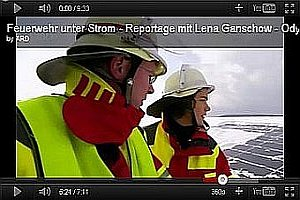](http://youtu.be/VDdnDeLuxEo) 
[Gefahr Photovoltaik](https://youtu.be/zoxnDujgRiU) 
[Brandgefährlich- Seminar zu Löscharbeiten bei Photovoltaik Anlagen](https://youtu.be/VUnubPXdGp4) 
[Kopfball - Solarzellenbrand](https://youtu.be/aJyQgD1HA3Y) 

[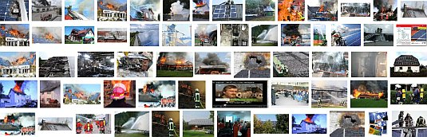Brand Photovoltaik - Bildersuche bei Google](https://www.google.com/search?hl=de&tbm=isch&source=og&tab=ni&q=brand photovoltaik) 

 [Gefährliche Photovoltaik - Photovoltaikanlage im Brandfall](http://www.brennstoffzellen-heiztechnik.de/aktuelle-news/760-photovoltaikphotovoltaikanlageimbrandfall-article4599.html) 
[Solaranlage – Risiko bei Feuer und Löscharbeiten](http://web.archive.org/web/20120112031014/http://www.solarinitiative-zwickau.de/37217182/solaranlage_a_risiko_bei_feuer_und_lascharbeiten.php) 
[Feuerwehr unter Srom - Brandrisiko PV-Anlage - Reportage](http://wn.com/Feuerwehr_unter_Strom__Reportage_mit_Lena_Ganschow__Odysso__SWR) 
Auf ungelöste Sicherheitsfragen beim Brandschutz und bei der Entsorgung von PV-Anlagen verweisen auch die Informationen auf diesen Links: 

Allgemeines Brandrisiko von Solaranlagen - Photovoltaikanlagen 
[Sicherheitsrelevante Aspekte bei Photovoltaik-Anlagen](http://www.pvtest.ch/fileadmin/user_upload/lab1/pv/publikationen/Sicherheit_PV-Anlagen-Wi-10-6F-pro-S.pdf) - Prof. Dr. Heinrich Häberlin, Berner Fachhochschule, Technik und Informatik, Fachbereich Elektro- und Kommunikationstechnik, [Photovoltaik-Labor, Burgdorf](http://www.pvtest.ch) 

Betrug bei Photovoltaikanlagen: 
[Riesiger Förderbetrug bei der Errichtung von Photovoltaikanlage aufgeflogen](http://ooe.orf.at/news/stories/2800009/) 

Feuerwehr: Gefahrenpotenzial von Fotovoltaikanlagen: 
<http://www.feuerwehr-weblog.de/archives/2005/09/photovoltaik_fl.html> 
Konkreter Fall in Weilheim - Photovoltaik stoppt Feuerwehr: 
<http://www.merkur-online.de/regionen/weilheim/feuerwehr-versammlung-digitalfunk-einsaetze-photovoltaik;art8867,910911> 
Auch Herstellerpfusch gab es dazu, siehe BP: 
[Test.de - Solaranlagen: Feuergefahr bei Modulen](http://www.test.de/themen/umwelt-energie/meldung/-/1417843/1417843/) 

[Zeitbombe PV? Hinter den Tests lauert der Feuerteufel](http://www.enbausa.de/solar-geothermie/aktuelles/artikel/trotz-vieler-tests-lauern-bei-pv-modulen-fehlerquellen-5558.html) [FAZ: Brennende Solardächer - Albtraum für die Feuerwehr](http://www.faz.net/aktuell/technik-motor/umwelt-technik/brennende-solardaecher-albtraum-fuer-die-feuerwehr-1590468.html) 
[Forschungsprojekt PV-Brandsicherheit](http://www.pv-brandsicherheit.de/) 
Was das für praktische Auswirkungen auf die Feuerwehren hat, wird am 20. April aus Wennigsen bei Hannover berichtet: 

Dort holte man sich zunächst von einem Experten Rat: Der Direktor und Leiter der der Berufsfeuerwehr Hannover, Claus Lange, informierte die Mitglieder der Freiwilligen Gemeindefeuerwehr Wennigsen und weitere Führungskräfte umliegender Ortsfeuerwehren von der lebensgefährlichen Solarstromgewinnung mittels Photovoltaikanlagen auf den Dächern all der ehrlosen Abzockbürger sowie über das Risikopotential dieser solargestützten Energiegewinnung für die arglosen Feuerwehrler und die wehrlose Bevölkerung in der Nachbarschaft der Ökoparasiten. Gefährung für das Löschpersonal im PV-Brandfall durch lebensgefährliche Vergiftung mittels Atemgiften, die den in der Hitze platzenden und hunderte Meter herumexplodierenden Solarmodulen mit Cadmiumtellurid-Dünnschichtmodulen unvermutet entströmen. Wie reagiert die nun aufgeklärte Feuerwehr? Der Journalist Michael Hemme berichtet in seiner Lokalteil-Zeitungsmeldung wortwörtlich: 

_"Dennoch will die Feuerwehr das Rad nicht zurückdrehen. "Einsätze an Solarthermie und Fotovoltaikanlagen sind für die Feuerwehren beherrschbar", lautet das Fazit, das Gemeindebrandmeister Karl-Heinz Ensing zieht."_ 

Heute heißt es also für die Feuerwehren nicht nur in und um Wennigsen, die sich bei der Brandmarkung der Ökoausplünderung auf Kosten der Allgemeinheit vornehmst zurückhalten: Einsatzpläne für PV-Brände schmieden, Kontaktaufnahme mit den PV-Betreibern, um gemeinsam im Voraus den Brandeinsatz als Notfallplan nach einem Solarkataster festzulegen, Empfehlung an die PV-Betreiber, wenigstens Freischaltanlagen zu installieren, damit sich im Brandfall / Notfall die Anlage vom Netz abkoppelt und den Strom abschaltet. 

Am Tag der deutschen Einfalt, dem 3. Oktober 2011, dann ein PV-Feuer auf einem Bauernhof in Gädheim: Alles PV - siehe Google-Luftbild: 

[Größere Kartenansicht](http://maps.google.de/maps?f=q&source=embed&hl=de&geocode=&q=forster+str.+2,+gädheim&aq=&sll=50.024302,10.340999&sspn=0.001113,0.003449&vpsrc=6&g=Gädheim,+Haßberge,+Bayern&ie=UTF8&hq=&hnear=Forster+Straße+2,+Gädheim+97503+Gädheim,+Haßberge,+Bayern&t=k&ll=50.024261,10.340919&spn=0.001034,0.001609&z=18)

### Solarlobby & PV-Anlagen, ein soziales Problem und ein Naturschutz-Problem?

Auch die Umweltfreundlichkeit der PV-Anlagen ist nicht umumstritten: 
Die meisten Solarmodule enthalten hochgiftige und in üblichen Elektro- und Elektronikprodukten längst EU-weit verbotene Schadstoffe wie Cadmium (in Dünnschichtmodulen mit Kupferindiumgallium-Diselenid-Zellen als Cadmiumsulfid-Pufferschicht, in Cadmiumtellurid-Modulen als aktives Zellmaterial) und Blei (im Lötmaterial der Verbindung zwischen Zelle und Modulbox), die während der Nutzungsdauer unkontrolliert an die Umwelt freigesetzt werden. Giftbelastete Solarmodule müssen dann nach Nutzungsende als teurer Sondermüll entsorgt werden: 
[cat.inist.fr/?aModele=afficheN&cpsidt=5368260](http://cat.inist.fr/?aModele=afficheN&cpsidt=5368260) 
[Schadstoffe aus PV-Modulen](http://www.enbausa.de/solar-geothermie/aktuelles/artikel/wissenschaftler-untersuchen-schadstoffe-aus-pv-modulen-4391.html) <http://www.solarone.de/photovoltaik_lexikon/photovoltaik_cadmium_tellurid.html> 
<http://www.solarportal24.de/nachrichten_17369_studie__solarstrom_fast_90_prozent_umweltfreundlicher_als_no.html> 

[ZDF 6.6.2011: Spreewald-Hammer: Erst subventioniert Wald aufforsten, dann für PV-Anlage abholzen - Vollverarsche des Steuerzahlers!](http://www.photovoltaikforum.com/pv-news-f25/waldabholzung-fuer-mehr-solarstrom-prima-klimarett-t69140.html) Dazu Kommentare der PV-Jünger: ["Waldabholzung für mehr Solarstrom, "prima" Klimarettung"](http://www.photovoltaikforum.com/pv-news-f25/waldabholzung-fuer-mehr-solarstrom-prima-klimarett-t69140.html) 

### Rechtliche Probleme bei Schäden und Risiken durch Photovoltaikanlagen

Bei PV-Anlagen stellen sich aus rechtlicher Sicht eine Unmenge von Fragestellungen. Diese werden hier nur mal kurz angerissen, eine juristische Würdigung durch den hier besonders beschlagenen [Rechtsanwalt Wolfgang Hägele](http://www.haera.de/) ist in Vorbereitung und wird demnächst hier upgedatet. 

Mieter unter PV-Anlagen 
Hier besteht die Frage, ob es der PV-belastete Mieter einfach so hinnehmen muß, daß sich seine Mietwohnung durch das PV-typische Brandrisiko und die negativen gesundheitlichen Einflüsse aus dem PV-typischen Elektrosmog - meist im gravierenden Unterschied zur Beschaffenheit der Mietsache zum Zeitpunkt der Anmietung - so dramatisch verschlechtert? Vergleichen wir das mal mit einem Einzug von Zeitbombenbastlern in der unteren Mietwohung, die ständig ohrenbetäubende Marschmusik hören. Gibt es hier Sonderkündigungsrechte, Anspruch auf Mietminderung, Schadensersatzansprüche, Recht auf Nachrüstung von PV-spezifischer Sicherheits- und Schutztechnik sowie Wartungsvorgänge im zeitlich und risikobedingt angemessenen Turnus usw.? 

Öffentliche Gebäude 
Was ist eigentlich mit all den Schulen, Rathäusern, Kindergärten, Amtsgebäuden und sonstigen öffentlichen Bauwerken, die mehr und mehr flächendeckend mit Photovoltaikanlagen bestückt werden? Wie stellt sich hier die Verantwortung im Brandfall, gegebenenfalls mit Todesfolgen oder Verletzungen der Nutzer sowie Vernichtung wichtiger Archivalien und sonstigen mobilen und immobilen Einrichtungsgegenständen? Tritt hier eine Privathaftung der an der falschen Entscheidung beteiligten Politiker, Landräte, Bürgermeister, Stadträte und Gemeinderäte, Schulleiter, sonstiger Beamten, Planer und Gewerbetreibenden - vgl. Katastrophe [Eisstadion Bad Reichenhall](212bau2a.md) - ein, gibt es eine Amtshaftung, sind Schäden versicherungsrechtlich abgedeckt? Müssen wir wieder mal auf die Totalkatastrophe warten, bis hier endlich aufgewacht wird? 

Der PV-Käufer 
Der PV-Käufer und Betreiber könnte sich die Frage stellen, ob ihn die pflichtgemäß geschuldete Beratung auf die Extremrisiken seiner PV-Anlage seitens des Planers und seitens des Errichters hinreichend aufgeklärt hat, oder ob seine Kaufentscheidung mangels ausreichender Aufklärung zustandegekommen ist. Außerdem stellen sich im Schadensfall - sei es die PV-Elektrosmogbedingte Krankheit der Bewohner oder Minderung seiner viehwirtschaftlichen Erträge unter PV-Anlagen, sei es die Schadenswirkung eines PV-Brands auf eigenes oder fremdes, ggf. auch benachbartes Leib und Leben viele sehr spezielle Haftungsfragen. 

Der PV-Errichter 
Der PV-Errichter muuß sich seinerseits fragen, ob er im Falle der eigenen Inanspruchnahme bei Schadensfällen - das kann selbstverständlich nicht nur durch den direkt geschädigten PV-Betreiber oder dessen von der PV-Anlage direkt geschädigten sonstig betroffenen Personenkreis (Nutzer, Helfer, Nachbarn, Feuerwehr, Spätschädenopfer, ...) auch durch den üblichen Schadensregulierer - also eine Versicherung im Bereich Gebäude, Inventar, Sicherheit (Berufsgenossenschaft) und Gesundheit (Krankenversicherung)- sein, seinerseits Ansprüche an den Hersteller der PV-Anlagenkomponenten nach dem Produkthaftungsgesetz hat. 

Undsoweiterundsofort. Fragen über Fragen, die meist niemand stellt, bis sie sich im Schadensfall von selbst stellen. Bleiben Sie dran! 

### Elektrosmog auf, neben, unter und in PV-Anlagen

Abschließend noch zum Problemthema PV-Elektrosmog die Stellungnahme vom Experten/Fachmann, Elektromeister, Baubiologe IBN und Gutachter für Blitzschäden an Geräten Werner Bopp aus Bad Mergentheim, Webseite: www.baubiologie-unterfranken.de 

Verursachen Photovoltaikanlagen Elektrosmog? 
Pressemitteilung von: Baubiologie Regional 

Grundsätzlich muß diese Frage zunächst mit „Ja“ beantwortet werden. Wie bei jeder Elektroinstallation und jedem elektrischen Gerät entstehen elektrische und magnetische Felder. 

Elektrische Gleichfelder 

Da die Solarmodule Gleichstrom erzeugen, besteht bei Lichteinfall [KF: Also nur tagsüber, nachts darf sich der PV-Anlagenbesitzer nur wegen eventueller PV-bedingter und ebenfalls am Tag PV-induzierter Schmorbrandherde, Tag für Tag nachlassender Stromerträge aus seinen automatisch nachlassenden PV-Modulen und einer Entdeckung seiner PV-bedingten Schwarzgeldgeschäftchen und Subventionsbetrügereien Hand in Hand mit seinem lieben PV-Errichter durch die sich genau in diesem Umfeld immer heftiger agierenden Steuerfahnder grämen] zwischen der + und der - Leitung des Solargenerators ein elektrisches Gleichfeld. Diese beiden Leitungen sollten (auch aus Blitzschutzgründen) relativ nahe beieinander verlegt werden. Durch diese räumliche Nähe und der vorgeschriebenen Erdpotentialfreiheit ist das elektrische Gleichfeld nur sehr nahe an den Solarmodulen und den Gleichstromleitungen meßbar. Elektrische Gleichfelder sind zudem elektrobiologisch erst ab einer sehr hohen Spannung bedenklich. Nach dem baubiologischen Standard gilt eine Luftelektrizität bis 500 V/m als schwache Anomalie. 

Magnetische Gleichfelder 

Das magnetische Gleichfeld schwankt bei einer Photovoltaikanlage mit der Sonneneinstrahlung. Als Installationsempfehlung gilt sinngemäß das Gleiche wie bei den elektrischen Feldern. Nach dem baubiologischen Standard gilt ein magnetisches Gleichfeld bis 2 µT als schwache Anomalie. Problematisch sind magnetische Gleichfelder vor allem dann, wenn sie Eisenteile in der Nähe eines Schlafplatzes oder gar im Bett magnetisieren. 

Elektrische Wechselfelder 

In einer Solarstromanlage sind elektrische Wechselfelder vor allem an der Wechselspannungsleitung vom Zähler zum Wechselrichter und am Wechselrichter selbst vorhanden. Obwohl in den Leitungen zu den Solarmodulen nur Gleichstrom fließt, sind an diesen Leitungen häufig elektrische Wechselfelder messbar. Dieses Phänomen kann auf folgende Umstände zurückgeführt werden: 

1. Sind die Gleichstromleitungen in der Nähe von Wechselspannungsleitungen verlegt, koppeln sie in das vorhandene elektrische Wechselfeld der Wechselspannungsleitungen ein. Das elektrische Wechselfeld z.B. einer Leitung zu einer Steckdose oder zum Dachbodenlicht, kann dadurch noch an den Solarmodulen gemessen werden – und dies Tag und Nacht! 

2. Einige trafolose Wechselrichter trennen nicht sauber zwischen der Wechselspannungs- und der Gleichstromseite. Die Folge ist ein elektrisches Wechselfeld auf den Solarmodulen. Die Rahmen von Modulen in Anlagen mit trafolosen Wechselrichtern müssen (nach VDE) daher geerdet werden. Zur Elektrosmogreduzierung ist die Erdung jedoch nicht ausreichend. 

Ein Problem können auch die von den Wechselrichtern erzeugten Rückwirkungen in das Stromnetz darstellen. Durch das Zerhacken des Gleichstroms und Umformung in einen Wechselstrom entstehen hochfrequente Oberwellen (Störspannungen). Wechselrichter mit einem Hochfrequenztrafo haben zwar geringere magnetische Wechselfelder, dafür aber eben die hochfrequenten Felder. Elektrische Felder – auch hochfrequente – lassen sich jedoch relativ leicht abschirmen. 

Magnetische Wechselfelder 

Vor allem die Wechselrichter erzeugen erhebliche magnetische Wechselfelder - allerdings nur bei Tage. Die Stärke der magnetischen Wechselfelder ist abhängig von der jeweiligen Sonneneinstrahlung. Wechselrichter sollten daher in einem größeren Abstand zu tagsüber benutzten Schlaf- und Ruhebereichen montiert werden. 

Zusammenfassung 

Die zusätzliche Elektrosmog-Belastung durch eine Photovoltaikanlage ist, bei richtiger Ausführung, verhältnismässig gering. Beispielsweise ist das magnetische Wechselfeld einer trafobetriebenen Halogenleuchte oder eines kleinen Radios neben dem Bett häufig höher als die an einer Photovoltaikanlage gemessenen Werte. 

Die Solarstromleitungen sollten eng beieinander und möglichst weit entfernt von allen stromführenden Leitungen verlegt werden. Durch eine zusätzliche Verdrillung der Plus- und Minusleitung und eine Minimierung der Leiterschleifen auf dem Dach kann die Einkopplung von Wechselfeldern weiter reduziert werden. 

Eine Abschirmung durch ein Metallrohr, Wellschlauch oder die Verwendung von abgeschirmten Solarleitungen ist empfehlenswert. Alle obigen Maßnahmen bewirken gleichzeitig auch eine Reduzierung des Blitzschadenrisikos. Sollten bei einer baubiologischen Messung erhöhte Störspannungen auf der Wechselspannungsseite festgestellt werden, muss unter Umständen ein Netzfilter eingebaut werden. 

Und hier noch eine kleine Literaturauswahl zur PV-Technik und Wartung: 

 Weiter: **[24 - Erhaltung und/oder Umbau bestehender Heizsysteme / Die Befreiung von den Anforderungen der Energieeinsparverordnung EnEV gem. § 25 EnEV](7temp24.md)**
