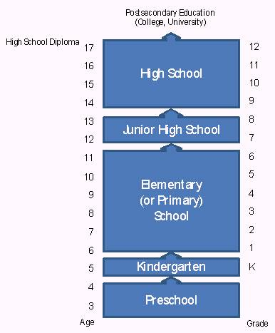

[🠔 Zur Übersicht: English: Old House Repair](english.md)  
# The American high school system: Facts and evaluation I
**The goal of this study is to answer basic questions about the American high school system. It covers the most important aspects of this school type and explains how it works, comparing it with the German system.**  
_von Felix Lindner • aktualisiert 25.01.2008_

### Felix Lindner

## The American high school system:
Facts and evaluation I

## Facharbeit aus dem Fach Englisch 

School Thesis In The Subject English

am Meranier-Gymnasium Lichtenfels 25.01.2008 

In htm codiert und mit Videos ergänzt von Konrad Fischer 

**Table of contents** 

**1 Introduction** 
1.1 A preliminary remark 
1.2 The Pledge of Allegiance 
1.3 The K-12 educational system 
1.4 Typical progression of a school career 
1.5 Choosing a school 

[2 The high school system](school2.md) 
2.1 School grades 
2.2 School organization 
2.3 Basic curricular structure 
2.4 Graduation requirements 
2.5 Advanced Placement Program 
2.6 Grading scale 
2.7 Standardized testing 
2.8 Extracurricular activities 
2.9 Associated Student Body 
2.10 School uniform 
2.11 Students with special needs 
2.12 Private or state schools 
2.13 Becoming a high school teacher 

[3 Evaluation: strengths and weaknesses of this system](school3.md) 
3.1 Interview with Mr. Berry, teacher at Healdsburg High School 
3.2 The “No Child Left Behind Act“ 
3.3 Personal evaluation 

4 Conclusion: opportunities after high school 

5 Bibliography 

**1 Introduction** 

**1.1 A preliminary remark** 

The goal of this study is to answer basic questions about the American high school system. It will cover the most important aspects of this type of school and explain how it works. By comparing it with the German school- and educational system, the reader gets a better picture of the system. Most of the information about the American high school system included in this paper is taken from the Healdsburg High School in California, which I attended for one year as an exchange student. As high schools in the United States differ from state to state and even from school to school within a state or school district, Healdsburg High can only serve as one example taken from a vast variety of high schools in the US. 

**1.2 The Pledge of Allegiance** 

_“I pledge allegiance to the Flag 
of the United States of America, 
and to the Republic for which it stands: 
one Nation under God, indivisible, 
with Liberty and Justice for all.“_ 

In many schools in the United States, the Pledge of Allegiance is cited every morning before class starts. The students stand up, put their hands over their heart and recite the pledge of allegiance as they look at the flag of the US. 

What can you say about the high school ? 

**1.3 The K-12 educational system** 

This educational system starting with kindergarten and continuing up to the twelfth grade is generally called the K-12 system. Typically, during kindergarten and elementary school, a classroom will consist of twenty to thirty students and a single teacher who teaches various subjects and remains with the class throughout the day. One or two breaks and one lunch time are typical in an elementary school’s schedule. Other elementary schools may employ a two-teacher system, where students will go to a different teacher’s classroom for learning a specific subject. This and other variations are attempts at clear and effective teaching, as well as preparation for middle school and high school. During middle school, the practice of students moving to different classrooms that correspond to different academic subjects throughout the day is firmly established. This period also offers more choice to a student, as classes for different academic levels are being offered. The last phase of the compulsory education and the K-12 educational system is the high school. During this period, students begin to have longer blocks of academic periods that do not occur daily, in preparation for the longer, less frequent, but more academically loaded university and college level courses. 

The academic system employed in the United States sets standards for the curriculum taught and the academic standards that have to be met. However, it also offers the flexibility needed to meet the needs of the immediate and local community at the city, county, and state level. 

**1.4 Typical progression of a school career** 

Throughout the US, children generally begin their school career at the age of three or four when their parents voluntarily put them in preschool (sometimes called nursery school). The task of a preschool is to prepare these kids academically and socially for kindergarten or the first grade. Preschools are defined as: “center-based programs for 4-year olds that are fully or partially funded by state education agencies and that are operated in schools or under the direction of state and local education agencies.“ 

In the United States, the kindergarten is part of the K-12 educational system. This pedagogical institution for five and six year old children has the objective of infantile advancement, of developing creative thinking and playing, and of learning adequate group behavior. “Children attend kindergarten to learn to communicate, play, and interact with others appropriately“ and develop basic skills. Today this form of education constitutes a transition period from the education at home to the academic education. 

Compulsory education starts with elementary school – known as elementary or primary education. In the US, an elementary school usually goes up to sixth grade and sometimes includes kindergarten as well. As primary targets for improvement, children have to focus on reading and math. 

Serving as a link between primary and secondary education, the junior high school embraces usually grades seven and eight. This school is intermediate between elementary school and high school, often also called middle school. 

Obama shows that the American School system is a failure 

The high school is the final stage of secondary education. In the first year of high school, ninth grade, “grades become part of a student’s official transcript“ ; therefore they are encouraged to take more responsibility. Universities or future employees are interested in the attendance rate and grades of students, so the decisions that are made in the four years of high school affect a student’s future. For the most part, an explanation of the system of this type of school is what this paper will be about. 

High school graduates are able to continue their school career by entering a college or university, which build the postsecondary education. Such an institution of higher learning commonly lasts from two to seven years and is terminated with a bachelor´s-, master´s- or even an advanced professional degree. 

The following figure clarifies the progression of a school career: 
 

1.5 Choosing a school 

At first, the question comes up which school parents should choose for their child. Well, the answer is easy: Parents “don´t pick a school“ for their child, they “pick an address, either by renting an apartment or buying a home or condo“ . The address decides which school their child will attend. Americas´ states are divided into several school districts, each in control of a given area. By telling the local school district or school their prospective address, parents can find out which school their child will attend. Often the boundaries of cities are not those of school districts. It may be “possible for children on one street to attend one district and children just up the street or on the next block to be assigned to another district“. 

[Continue Part 2](school2.md)
