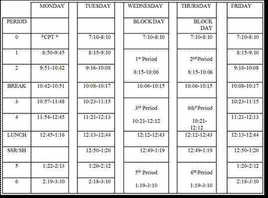
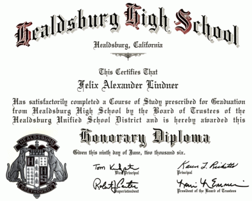
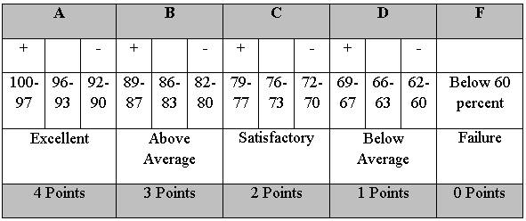
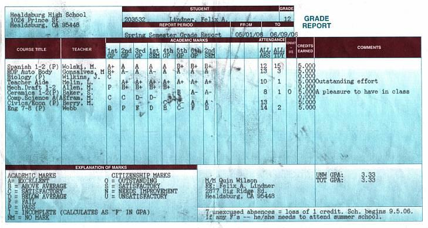
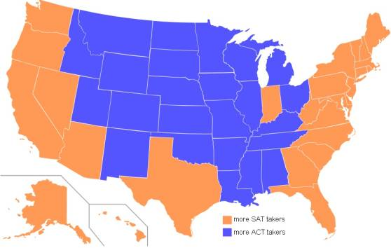

[🠔 Zur Übersicht: English: Old House Repair](english.md)  
# The American high school system: Facts and evaluation II
**An in-depth analysis of the American high school system, covering its four-year program, daily schedule, grading, and extracurriculars, presented as a school thesis from Meranier-Gymnasium Lichtenfels.**  
_von Felix Lindner • aktualisiert 25.01.2008_

### Felix Lindner

## The American high school system:
Facts and evaluation II

## Facharbeit aus dem Fach Englisch 

School Thesis In The Subject English

am Meranier-Gymnasium Lichtenfels 25.01.2008 

In htm codiert und mit Videos ergänzt von Konrad Fischer 

**Table of contents** 

[1 Introduction](school.md) 
1.1 A preliminary remark 
1.2 The Pledge of Allegiance 
1.3 The K-12 educational system 
1.4 Typical progression of a school career 
1.5 Choosing a school 

**2 The high school system** 
2.1 School grades 
2.2 School organization 
2.3 Basic curricular structure 
2.4 Graduation requirements 
2.5 Advanced Placement Program 
2.6 Grading scale 
2.7 Standardized testing 
2.8 Extracurricular activities 
2.9 Associated Student Body 
2.10 School uniform 
2.11 Students with special needs 
2.12 Private or state schools 
2.13 Becoming a high school teacher 

[3 Evaluation: strengths and weaknesses of this system](school3.md) 
3.1 Interview with Mr. Berry, teacher at Healdsburg High School 
3.2 The “No Child Left Behind Act“ 
3.3 Personal evaluation 

4 Conclusion: opportunities after high school 

5 Bibliography 

**2 The high school system** 

**2.1 School grades** 

The high school in the United States is a four-year-program, “which offers a rigorous course of study aimed at meeting the academic needs of all the college bound students including vocational and academic support programs“ that are offered as well. The following table displays how each High School year is named. 

9th Grade Freshman 
10th Grade Sophomore 
11th Grade Junior 
12th Grade Senior 

**2.2 School organization** 

The school day consists of seven periods . The year has two semesters of eighteen weeks each. After every six weeks, a grading period ends, and students get a progress report that shows their results and grades up to that point. 

At the end of every semester, students receive their report card. This document reports the grades for the semester that will go on permanent record, the transcript. 

The class sizes are approximately twenty to thirty pupils. 

High school students might start school as early as 7:30 a.m., breaking for lunch around 12:30 p.m. and being dismissed around 2:45 p.m. Others start around 8:05 a.m. and leave school at 3:15 p.m. 

Some high schools try to load Freshmen, Sophomores and Juniors with seven periods daily, so they will have fewer classes in their senior year and be able to leave early. That policy is not popular with students who have jobs or are trying to participate or attend sports events. 

Shown below is the bell schedule of Healdsburg High School. 
 
(From the Healdsburg High School Student Handbook 2006/2007) 

On Monday , Tuesday, and Friday, there is a normal schedule. Every Wednesday and Thursday is block schedule, i.e. only periods 1, 3 and 5 and 2, 4 and 6 take place. 

It is difficult to understand why periods are exactly 51 or 52 minutes, instead of 30, 45, or 60 minutes. Ilene Frommer, a counselor from Healdsburg High School, explains: 

_“We need to have a minimum of a specific amount of teaching time during the year. So, a schedule is made to include this. This year we decreased the amount of time to travel between classes so we could have a longer snack break. However, classes are not required to have a specific amount of time.“_ 

The courses elect are the corresponding periods continuously during the whole school year, e.g. it does not matter, if a period lasts 60 minutes or 51 minutes, because on that day each subject is given an equivalent amount of time. 

**Typical Schedule** (on a Tuesday) 
Twelfth Grade, High School (Student interview ) 
8:10 a.m. Bell rings. Students have five minutes to get to class. 
8:15 a.m. to 9:10 a.m. Bell rings again. Advanced Algebra/Trigonometry class, 55 minutes including the bulletin. (Daily announcement) (1st period) 
9:10 a.m. Bell rings. Six minutes to get to next class. 
9:16 a.m. - 10:08 a.m. Drama, 52 minutes. (2nd period) 
10:08 a.m. - 10:17 a.m. Break. Time to eat something. 
10:17 a.m. Bell rings. Six minutes to get to next class. 
10:23 a.m. - 11:15 a.m. English, 52 minutes. (3rd period) 
11:21 a.m. - 12:13 p.m. Multi Media, 52 minutes. (4th period) 
12:13 p.m. - 12:44 p.m. Lunch. Students may purchase food from cafeteria or eat food brought from home. 31 minutes. 
12:44 p.m. Lunch over. Six minutes to get to class. 
12:50 p.m. - 1:20 p.m. SSR, Sustained Silent Reading: a time for students to voluntarily read or do work. 
1:20 p.m. - 2:12 p.m. AP Biology, 52 minutes. (5th period) 
2:18 p.m. - 3:10 p.m. Civics/ Economy, 52 minutes. (6th period) 
3:10 p.m. Bell rings. School is over. 

Generally, a typical schedule of a high school student looks like the one of the interviewed senior, Ben Brock. At the beginning of each year, a student discusses one´s preferences with his or her counselor. The counselor then creates everyone’s individual class schedule. Depending on the size of the school, normally two or three counselors who are in charge of the students´ classes are available. This is part of the reason why one class does not solely consist of students of one single grade. Mostly, mixed courses with seniors and juniors, or juniors with freshmen or sophomores or any other combination of the four in one class result from using this method of class creation. 

**2.3 Basic curricular structure** 

About the basic curricular structure: In the United States, students in high school usually “take a broad variety of classes without special emphasis in any particular subject. Curricula vary widely in quality and rigidity“ depending on the school´s location and its size. 

In American High Schools, the amount of offered classes is enormous. The following list of offered classes is assembled from the Minnetonka High School 2006 Course Catalog: 

Art 
Introduction on Studio Art; Photography; Watercolor; Painting; Jewelry; Drawing; Ceramics; Commercial Art and Design; Illustration Art: History, Animation and Caricature Arts; Art History; AP Art History; AP Studio Art; Video Production 

Pillow Talk Humorous Duet Act HDA Illinois IHSA - A Humorous Duet Act from 1995, performed by Rich Marincic and Kane Farabaugh from Ottawa Township High School 

**Business** 
Accounting; Business Law; International Business; Microsoft Office Applications; Introduction to Business; Personal Financial Management; Marketing Practices and Principles; Money, Banking and Investing; Keyboarding; Web Page Design; Sports, Entertainment Marketing and Management; Computer Technology 

School Shooting Daryl 

**English/ Language Arts** 
English 9, 10, 11, 12; AP English 12; AP Composition; Fiction and Poetry Workshop; Professional and Technical Writing; Reading and Study Skills for Freshmen; College Reading and Study Skills; Theater; Journalism; Newspaper Production; Speech; Debate; Yearbook 

**English as a second language** 
Beginning English; Intermediate English; Advanced English; Science/ Math; Social Studies/ Reading 

**Family and consumer science** 
Foods; Culinary Exploration; International Foods; Clothing and Textiles; Fashion Merchandising and Design; Interior Design (Housing and Home Furnishings); Independent Living; Child Development; Relationships 

**Health** 
Current Health Topics; Connections 

**Mathematics** 
General Math; Pre-Algebra; Algebra; Informal Geometry; Geometry; Higher Algebra; Pre-calculus; Calculus; AP Calculus; Intro to Finite Math, Finite; AP Statistical; Computer Programming; Computer Science 

**Music** 
Varsity Band; Concert Band; Symphonic Band; Wind Ensemble; Chamber Orchestra; Concert Orchestra; Choristers; Varsity Choir Women/Men; Concert Choir; Music Theory (AP); Music History 

**Physical Education** 
Lifetime Fitness; Strength Training; Aerobics; Outdoor Experience; Dance 

**Science** 
Chemistry; Biology; AP Biology; Environmental Biology: Ecological Issues; Human Anatomy and Physiology; Earth and Space Systems; Physics; AP Physics 

**Social Studies** 
Principles of US Government, Geography and Economics; Contemporary US History; World History and Geography; European History AP; Human Geography AP; US Government and Politics AP; Economics; Current World Issues; Practical Citizenship; Psychology; Sociology 

**Technology Education** 
Introduction to AutoCAD; Mechanical Drafting; Principles of Engineering, Drafting and Design; Advanced Drafting; Electronics; Audio Electronics; Communication Electronics; Digital Electronics; Microcomputer-Interface, Operations and Repair; Graphic Arts; Color Photo – Graphics; Graphic Design; Airbrush; Metals; Power and Energy; Woodworking; 

OTH 316 - High School Shooting 

Tree Hill High School Shooting 

Foss High School Shooting 

Slymar High School Shooting 

Cleveland High School Shooting 

School Shootings At Collumbine High School And Virginia Tec 

Homevideo from the kid who did the school shooting in Germany 

**World Languages** 
French, German, Spanish, Chinese, Japanese, American Sign Language 

As you can see, students have plenty of options in arranging their high school experience. This is one big difference to a German school. In general, in Germany, a school is limited in terms of quantity of courses and does not offer such a variety of different subjects. 

In the list above, there are many elective courses, like drawing, orchestra, dancing, International Foods, woodworking, etc. Such courses are offered in numerous high schools in the United States, although their availability depends on each school's financial situation and desired curriculum. 

**2.4 Graduation requirements** 

To be eligible for graduation and obtain a high school diploma, one must pass courses in certain required subjects and meet other requirements such as completing a total of at least 240 credits. 

Course / Years 
English / 4 
Mathematics / 2 
Natural/Physical Science / 2 
Additional Courses in Above Areas / 1 
Social Science / 2 
Additional Academic Courses / 2 
(From Minnetonka High School, Minnesota) 

As already mentioned, the table above is a minimum sequence of the requirements for getting a diploma. Students who want to attend a two- or four-year college or university, usually take more academic or advanced courses in order to collect more credits and show college admission directors their academic competence. 

Beginning with the Class of 2006, all public school students in California will be required to pass the California High School Exit Exam to earn a high school diploma. This new law was “created by the California Department of Education to improve the academic performance of California high school students, and especially of high school graduates, in the areas of reading, writing, and mathematics“ . 

As I received my diploma as an exchange student, it is an “Honorary Diploma“ and does not have standard value. 

 

**2.5 Advanced Placement Program** 

An advanced course like the Advanced Placement Program (AP) is an opportunity for high school students to take college-level courses and to receive credit for their knowledge and achievement. Each AP course covers the material that is taught in the corresponding college course. “Sixty percent of U.S. high schools currently participate in the AP Program.“ In the US, there are currently thirty-seven different AP courses available. Students can choose from science, math, the humanities and the social science. The offerings, however, vary from school to school. 

Minnetonka High School in Minnesota, for example, offers the following Advanced Placement courses: AP United States History, AP European History, AP Human Geography, AP United States Government and Politics, AP Psychology, AP Macro-Economics, AP Calculus AB 1 and 2, AP Calculus BC 1 and 2, AP Statistics 1 and 2, AP Advanced Composition, AP English Literature, AP Art Studio, AP Music Theory, AP Biology, AP Chemistry and AP Physics. 

In Healdsburg High School in California, however, there is only AP Studio Art, AP English, AP Calculus, AP Biology, AP Spanish, AP Computer Science, AP U.S. History and AP World History selectable for students. 

Such courses cover more material in less time and in more detail than regular high school courses and provide a challenge for students who are motivated and interested in working more intensively in their field of choice. 

Each AP course has a corresponding exam that students take on a voluntary basis. 

AP courses receive additional weighting in G.P.A. (i.e. Grade Point Average) calculations for all purposes at the high school. Students who successfully complete an AP course and take the AP exam at the end of the course receive an additional 1.0 in G.P.A. calculations (i.e. A=5.0, B=4.0, etc.). Students successfully completing an AP course but not taking the AP exam would receive an additional 0.5 in G.P.A calculations (i.e. A=4.5, B=3.5, etc.). Regular grade calculations will be explained in the following section (2.6). 

**2.6 Grading scale** 

During a school year, teachers evaluate student work with letter marks. These grades are computed to determine a student’s Grade Point Average (G.P.A.). 
Every six weeks, students receive a progress report that shows the progress they achieve in their classes. Commonly the following four-point grading scale is used: 

 

In an exam the number of points a student achieves will be divided by the total number of possible points and this produces a percent grade which can be translated to a letter grade. The grading is based on a scale of 0-100 percent. 

Pictured below is an example of a grade report card. 
 

**2.7 Standardized testing** 

Throughout their high school career, students will take numerous standardized tests that will serve the purposes of both, the state educational departments and interested universities. Students have the possibility to take either the SAT or the ACT test or both, depending on what tests the universities they are applying require. The two tests serve a similar purpose for universities but differ slightly in their contents and the grading system. 
The SAT can be taken as often as wanted. Most pupils take the SAT Reasoning Test in their junior year so that they have a chance to improve their scores by the time they have to submit them to their universities of interest. 

 
_“Map of states according to preferred exam of 2006 high school graduates. States in orange had more students taking the SAT than the ACT.“_ 

Like all aptitude tests, the SAT Reasoning Test must also choose a medium in which to measure intellectual ability. “The SAT is three hours and 45 minutes long and measures skills in three areas: critical reading, math, and writing. Although most questions are multiple choice, students are also required to write a 25-minute essay.“ 

Those taking the test will receive three scores: a reading score, a writing score and a math score. Each score ranges from 200 to 800 possible points, so the total test score can be from 600 to 2400 points. 

The SAT is used as an indicator of students being ready to do college-level work. 

In addition to the SAT Reasoning Test, some schools may require one or two SAT Subject Tests, which examine the student abilities in a single subject. 

Furthermore, students must take some other exams, which are mandatory like the California High School Exit Exam (CAHSEE) that became mandatory in 2006. “Its intent is to prod the low-achieving […] into making greater efforts to master the basics.“ Every high school student must pass this exam in order to graduate. 

Those kids who bail out of high school and then regret not having a diploma still have a chance to take the GED exam in order to receive a document that shows their basic skills to prospective employers. The GED is a federal exam and the rough equivalent of a high school exit exam. If you pass the GED, it demonstrates that you have as much basic knowledge as a high school graduate. The GED can help you secure jobs that require a high school diploma. 

Throughout the duration of one week the STAR Test is administered to students when they are examined in general subjects like reading, writing, math and science. This test and its results give government education departments information about the educational level of schools in California and make them aware of the educational needs of the state. 
Other states examine their students in a similar fashion. 

**2.8 Extracurricular activities** 

Extracurricular activities play a very important role in American high schools. 
Schools especially attach great importance to sports and dedicate a lot of effort to them. Several schools within one county compete against each other in leagues; there is also much competition against schools from different leagues. 
The Healdsburg High School, for example, is part of the Sonoma County League and competes against: 

 * Analy High School
 * Casa Grande High School 
 * El Molino High School
 * Petaluma High School
 * Sonoma High School
 * Windsor High School

Each school has its own symbol or mascot , which they identify with and which represents their school. 
In the Healdsburg High School, the following sports are offered: 

**Fall Sports** 
Cross Country 
Football-Varsity/JV 
Tennis (girls) 
Volleyball (girls) 
Soccer (boys) 
Soccer (girls) 
Golf (girls) 

**Winter Sports** 
Basketball (boys) 
Basketball (girls) 
Wrestling 

**Spring Sports** 
Tennis (boys) 
Track 
Baseball-Varsity 
Baseball-JV 
Baseball-Frosh 
Softball-Varsity/JV (girls) 
Golf (boys) 
Swimming & Diving 

These extracurricular activities happen after school. Students practice two or three hours three to five times a week. During one school year, students can participate in three different sports, but only in one sport in fall, one in winter and one in spring. That means, in Healdsburg High School for instance, it is impossible for boys to simultaneously play tennis and golf for their school in spring. 

School sports are divided into three categories: varsity, junior varsity (JV) and freshmen. Those categories are defined by competence as well as age. 
Varsity sports teams are the principal athletic teams representing their high school. Junior varsity (JV) teams mostly consist of sophomores and juniors, and freshmen teams are teams usually reserved for freshmen students. 

The following picture shows the Healdsburg High School varsity basketball team of the league 2005/2006. 
 

Dunks basketball humour 

In addition to that, there are also some official dances, which are organized and take place every school year. First comes the Homecoming Dance in fall, after that Courtesy or Sweethearts in winter, and in spring the famous Prom Dance. 

For high school students, Prom is by far the most important dance. Boys buy tuxedos and girls expensive dresses. Before the dance, it is common that a group of up to ten students rents a limousine to be driven to a noble restaurant, have dinner there and then drive to the dance. 

**2.9 Associated Student Body** 

The officers of the Associated Student Body (ASB) are elected by all students, represent their school and make decisions while considering other students´ interests. In the Healdsburg High School, this association consists of: 

President, Vice President, Treasure, Secretary, Rally Commissioner, Publicity Commissioner, Activity Commissioner, Elections Commissioner and the Student Trustee. 

School wide fundraisers, barbeques, rallies and numerous other school activities are the tasks that the ASB officers facilitate and supervise during the school year. Those involved in the ASB are required to balance their academic and extracurricular activities with responsibility and good judgment while making sure that the school has a comfortable atmosphere. 

**2.10 School uniform** 

In 2005-06, 13.8 percent of public schools required students to wear uniforms, while in 1999–2000, the percentage of principals who reported that their school required students to wear uniforms was 11.8 percent. Another rise is noticeable when comparing the percentages of schools that have a strict dress code in 1999-2000 and 2005-06. It rose from 47.4 to 55.3 percent. 

**2.11 Students with special needs** 

Students with special needs must have the opportunity to attend an ordinary high school with its cafeteria, hallways, assemblies etc. This process is known as mainstreaming. Depending on the severity of their handicap, those students who require better care can also be enrolled in county schools or special schools that are only for students with special needs. As a matter of course, the curriculum for students, who are mentally or physically disabled, differs from the regular high school curriculum. 

**2.12 Private or state schools** 

Parents are always trying to make the best decisions for their children. When looking at schooling, there are two possibilities to choose - either a private school or a state school. 

State schools, that are provided by state and federal funding, are offered free of charge. Ninety percent of the children in the United States attend state schools. On the other hand, private schools charge tuition and are financed privately by religious organizations, endowments, grants or charitable donations. 

**2.13 Becoming a high school teacher** 

In order to become a high school teacher, teaching credentials are required. Teachers have to be college graduates and need to have completed at least a bachelor´s degree, no matter if it is in the field of education or not. They then apply for a job in school, serve a probation of two, or mostly three years and then finally will either be dismissed or hired. High School students need teachers help them along, academically and in their private lives. They are of an age, when they are “highly impressionable and at a point […] when their actions are beginning to have consequences on the rest of their lives“. 

[Continue Part 3 etc](school3.md)
