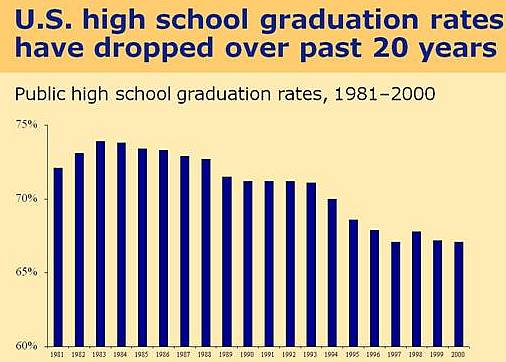
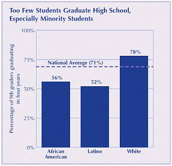
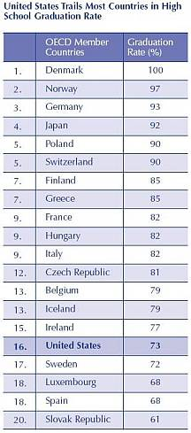

[🠔 Zur Übersicht: English: Old House Repair](english.md)  
# The American high school system: Facts and evaluation III
**Facharbeit aus dem Fach Englisch am Meranier-Gymnasium Lichtenfels, 25.01.2008. The third part of an evaluation of the American high school system, focusing on its strengths and weaknesses.**  
_von Felix Lindner • aktualisiert 25.01.2008_

### Felix Lindner

## The American high school system:
Facts and evaluation III

## Facharbeit aus dem Fach Englisch 

School Thesis In The Subject English

am Meranier-Gymnasium Lichtenfels 25.01.2008 

In htm codiert und mit Videos ergänzt von Konrad Fischer 

**Table of contents** 

[1 Introduction](school.md) 
1.1 A preliminary remark 
1.2 The Pledge of Allegiance 
1.3 The K-12 educational system 
1.4 Typical progression of a school career 
1.5 Choosing a school 

[2 The high school system](school2.md) 
2.1 School grades 
2.2 School organization 
2.3 Basic curricular structure 
2.4 Graduation requirements 
2.5 Advanced Placement Program 
2.6 Grading scale 
2.7 Standardized testing 
2.8 Extracurricular activities 
2.9 Associated Student Body 
2.10 School uniform 
2.11 Students with special needs 
2.12 Private or state schools 
2.13 Becoming a high school teacher 

**3 Evaluation: strengths and weaknesses of this system** 
3.1 Interview with Mr. Berry, teacher at Healdsburg High School 
3.2 The “No Child Left Behind Act“ 
3.3 Personal evaluation 

4 Conclusion: opportunities after high school 

5 Bibliography 

**3 Evaluation: strengths and weaknesses of this system** 

**3.1 Interview with Mr. Berry, teacher at Healdsburg High School** 

While visiting the Healdsburg High School in June 2007, I interviewed Mr. Berry (67), a teacher for civics/economics. 

Author: _“Tell me, Mr. Berry, when did you graduate from high school and how was your school experience?“_ 
Mr. Berry:_“I finished high school in 1957. I liked it being in school - being a student. At that time, there was definitely more flow in our school. Students communicated on a different level and were glad to be able to attend a school. There weren´t any exchange students. We didn’t know a lot about the rest of the world outside California. Today it´s much more formal.“_ 
Author: _“How long have you been working as a teacher?“_ 
Mr. Berry: _“Quite long - for 44 years now! I basically live in school; school´s my life.“_ 
Author: _“During this period of time, was there an outstanding event or anything that affected American education?“_ 
Mr. Berry: _“Indeed, there was - The Proposition 13 in 1978! That really was a political earthquake, which was felt not just in California, but all across the nation. The initiative to cut California´s notoriously high property taxes really affected and hurt the financial situation for communities, schools, police, libraries and so on. In the 1960s, California state schools had been ranked number one nationally in student achievement and now have fallen to 48th in many surveys of student achievement.“_ 

As the interview shows, the Proposition 13 was an event which severely hurt the educational progress in the United States. 

By the early 1980s, the high school graduation rates have begun to fall from 74 percent in 1983 to 67 percent in 2000. 
 
Source: Mortenson, T., _“Chance for College by Age 19 by State in 2000“_ , Postsecondary Education Opportunity: The Environmental Scanning Research Letter of Opportunity for Postsecondary Education, No. 123, The Mortenson Research Center on Public Policy, September 2002. 

**3.2 The “No Child Left Behind Act“** 

The No Child Left Behind Act, which was passed on May 23, 2001 aims _“to improve the performance of U.S. primary and secondary schools by increasing the standards of accountability for states, school districts and schools, as well as providing parents more flexibility in choosing which schools their children will attend.“_ Teachers must have the qualification to assist every single student and improve its capability of learning. 

According to a video of the US Department of Education´s webpage, today a college education is more important than ever before. Not only for individual success, but also for the nation’s ability to compete in the global economy. However, in the United States, only eighteen out of every 100 high school graduates actually finish college. 

The No Child Left Behind Act _“has helped principals and teachers focus on the things that bring results“_ : 

 * High standards for all students
 * A rigorous curriculum
 * High-quality teaching
 * Careful assessments
 * Actively involved parents

Those things prepare students to be able not only to enter a university, but also to graduate from a university. 

While 90 % of the fastest growing jobs require a postsecondary education, only 1/3 of Americans have a degree. To be successful in the 21st century economy, a nation must prepare all students for the demands of higher education. The need is great especially in urban settings where poverty, language differences and a lack of opportunity limit access to higher education. 

**3.3 Personal evaluation** 

After attending an American high school for one year, I am by far no expert in terms of school systems. However, this section covers a personal evaluation based on my experience. 

Due to the fact that high school in the US is not divided into _Gymnasium, Realschule_ and _Hauptschule_ , as in Germany, and that high school students create their individual class schedule, there is no separation of students in terms of intellectual levels and this contributes to an atmosphere of low academic motivation and thus to lower competition. 

On the other hand, because students can create their own class schedules depending on their preferences and future plans, those students who are willing to attend university are able to choose more difficult and competitive classes and participate in classroom activities with more commitment. 

By contrast, in German _Gymnasium_ , pupils cannot plan their own schedule, but follow a strict path down the stream of education with the _“Abitur“_ as their final goal instead. An example for this is that students who are hopeless at math actually do not have any choice not to enroll in math classes, whereas students in an American high school can choose between greatly reduced math or an intensive math course, like an AP Calculus course, that every student attends with a much greater motivation. 

By offering many different elective courses, students in America are able to broaden their horizon, get to know their personal interests and delve into them. For example, while attending Healdsburg High School, I took a course named _“Auto Body“_ , where students learn to work on cars and repaint them. In my opinion, because of the choices offered, the majority of American high school graduates know rather well what they want to do or what professional choices they will take later in life. German graduates frequently do not. 

Healdsburg High School Automotive Video 

I got the impression that my friends in the United States liked going to school better than my friends in Germany. 

Healdsburg High Fight November 9, 2007 

That is probably because in American high schools, many more extracurricular activities, like sports and clubs, are offered, that keep the students busy throughout the school day and many times afterwards as well. Therefore, students who are involved in those extracurricular activities commonly spend the entire day at school together. 

During rallies or sporting events, American students cheer for their school, which shows that they identify with their school and are proud of it. 

With the large amount of financial resources offered by organizations and foundations, many American students who are not even at the top of the class are able to receive scholarships and commendatory distinctions of all kinds. Whereas in Germany only the top students receive awards or scholarships that help them financing a university education. 

However, the tuition fees for German colleges or universities are a lot lower in comparison to those in the United States. To study at a more prestigious university in California, parents have to pay up to 40.000 US dollars per year for their children’s education. The better reputation a university has, the more expensive it is! It seems that only wealthy and rich people can afford attending a better university and receiving a better education. It is necessary that support to low-performing students is provided. _“There are students in every community - urban, rural and suburban - whose needs are not being met adequately by their high schools.“_ Those kids at risk of failure must receive the help they need in order to pass. Schools should adopt intensive assistance strategies like specific courses for struggling students. 

 
Source: Jay P. Greene, Public High School Graduation and College Readiness Rates, 1991-2002, 2005. 

Compared to German schools, in the United States, there is a complete lack of respect towards the teacher but simultaneously students have many rules that are imposed on them. For instance, at Healdsburg High School, and in many other high schools, students need a permission slip if they want to go to the toilet. 
Even some Americans do not see the four years of attending high school as a positive experience. My host sister, Simone Wilson, who is now editor of the _Guardian_ , the newspaper at the University of California, San Diego, gives the following statement: 

_“High school in Healdsburg and in the rest of California, and probably the United States is about getting into college. Not once in my senior year English/Literature class did we learn something for the sake of knowledge; our novels and activities were in strict orbit around either the SATs (a huge university acceptance factor) or the AP test at the end of the year, which offered a chance to earn credits for a college degree. All but one of my teachers were completely stripped of the negative and critical gene, and instead served as a second set of coddling parents, trying to nudge up our confidence enough to spill over into the college entrance essays. It is fascinating to think that every kid in the country is being drilled with the same random, executively decided parameters for what makes a poem correct or what defines a classic, mandatory novel. 

Then, of course, there are the students not shooting for college, just trying to obtain the diploma that will hopefully be enough to save them from a life of minimum wage. There is absolutely a lack of enthusiasm for the mediocre students´ education at Healdsburg, especially the Mexican-American population, which makes up at least half the student body.“_ 

The United States of America is a melting pot consisting of many different cultures. In addition to this, because all children attend only one type of school, in which a common level must be found, where all students are able to keep up, it is also a _“melting pot“_ for various levels of intelligence. This infers to an inferior aspiration level. 

As far as I can see, the educational level in Germany is much more demanding than in the United States. 

As the paper shows, the high school system in the United States is not so bad after all, but the overall objective of a _“good“_ school actually should be to equip children with a knowledge necessary to prepare them for their life after school. In my opinion, in Germany, this is achieved in a better way. 

**4 Conclusion: opportunities after high school** 

While there are many opportunities after high school, the American high school student must think about these things _before_ graduating. During one’s junior year, a bombardment of presentations, lectures, pamphlets and brochures on universities and colleges are presented and mailed to students. Many universities acquire information from the pre-SAT and other standardized tests in order to deliver information to the student’s home as well as email. Not only universities are using standard information from tests, but also vocational schools, armed forces recruiters, and nonprofit organizations that offer once in a lifetime experiences in remote places of the world. 

Other students who may not be ready, may not want to go to a four-year university, or to learn a trade at a vocational school, but may decide to simply begin working. Others may have no other choice as a higher education in the United States is not affordable to everybody and scholarships are very competitive. A more affordable community college is often the answer to many who are not ready to move on to a more demanding four year university. A community college provides equivalent and transferable courses to most state and private universities in an often smaller and considerably cheaper institution. 

Image Source: Organisation for Economic Co-operation and Development, Education at a Glance 2004, 2004. 

**5 Bibliography** 

- Glasser, William: The Quality School. Managing Students Without Coercion. New York: HarperPerennial, 1998 
- Healdsburg High School: Healdsburg High School 2006-2008 Course Catalog. Healdsburg: N.p., 2006 
- Healdsburg High School: Healdsburg High School Profile. Healdsburg: N.p., 2007 
- Healdsburg High School: Healdsburg High School Student Handbook 2006-2007. Healdsburg: N.p., 2006 
- Hirsch, Eric Donald, Jr.: The schools we need and why we don’t have them. New York: Anchor Books, 1999 
- McCluskey, Neal P.: Feds in the Classroom. How Big Government Corrupts, Cripples, and Compromises American Education. United States of America: Rowman & Littlefield Publishers, 2007 
- McCormack, Don, and Van Landingham, John: How California Schools Work. A Practical Guide for Parents. N.p., McCormack's Guides, 2004 
- Microsoft Corporation: Kindergarten. Microsoft Encarta 2007 – Lernen und Wissen DVD. N.p., 2007 
- Minnetonka High School: Skipper Log. Charting your course for success. Minnetonka High School 2006 Course Catalog. N.p., 2005 

Internet sources 
- An Action Agenda for Improving America´s High Schools. (2005) National Education Summit on High Schools. Achieve, Inc., and National Governors Association. URL:[ http://www.nga.org/Files/pdf/0502actionagenda.pdf](http://www.nga.org/Files/pdf/0502actionagenda.pdf), p. 10 [15.01.2008] 
- AP. (2008) Educational Testing Service. URL: [http://www.ets.org/portal/site/ets/menuitem.c988ba0e5dd572bada20bc47c3921509/?vgnextoid=1b0daf5e44df4010VgnVCM10000022f95190RCRD&vgnextchannel=ba6de3b5f64f4010VgnVCM10000022f95190RCRD](http://www.ets.org/portal/site/ets/menuitem.c988ba0e5dd572bada20bc47c3921509/?vgnextoid=1b0daf5e44df4010VgnVCM10000022f95190RCRD&vgnextchannel=ba6de3b5f64f4010VgnVCM10000022f95190RCRD) [06.01.2008] 
- Education in the United States (17.1.2008) Wikipedia. URL: <http://en.wikipedia.org/wiki/Education_in_the_United_States> [02.01.2008] 
- Final Vote Results for Roll Call 145. (23.5.2001) Office of the Clerk - U.S. House of Representatives. URL: <http://clerk.house.gov/evs/2001/roll145.xml> [01.01.2008] 
- Foreign Language Framework for California Public Schools. Kindergarten Through Grade Twelve. (2003) California Department of Education. URL: <http://www.cde.ca.gov/re/pn/fd/documents/foreign-language.pdf> [14.01.2008] 
- Francisco Bravo Medical Magnet High School in East Los Angeles. (6.12.2007) U.S. Department of Education. (Video) URL: <http://www.ed.gov/news/av/video/2007/bravo_web.html> [19.01.2008] 
- HHS Athletic Program. (1999) Healdsburg High School. URL: <http://www.hhs.husd.com/sports.asp> [13.01.2008] 
- Homeier, Barbara P. Life After High School. (July 2006) The Nemours Foundation. URL:[ http://www.kidshealth.org/teen/school_jobs/jobs/after_hs.html](http://www.kidshealth.org/teen/school_jobs/jobs/after_hs.html) [15.01.2008] 
- How to Become a High School Teacher. URL: <http://www.teacher-world.com/teacher-education/become-high-school-teacher.html> [30.12.2007] 
- Kindergarten. (24.1.2008) Wikipedia. URL: [http://en.wikipedia.org/wiki/Kindergarten#Function_of_kindergarten](http://en.wikipedia.org/wiki/Kindergarten#Function_of_kindergarten#Function_of_kindergarten) [31.12.2007] 
- MSN Encarta World English Dictionary. (2007) Bloomsbury Publishing Plc. URL: <http://encarta.msn.com/dictionary_1861692773/junior_high.html> [02.01.2008] 
- Multi-State Study of Pre-K. University of North Carolina. National Center for Early Development & Learning. URL: <http://www.fpg.unc.edu/~ncedl/pages/pre-k_study.cfm> [30.12.2007] 
- No Child Left Behind Act. (22.1.2008) Wikipedia. URL: <http://en.wikipedia.org/wiki/No_Child_Left_Behind_Act> [01.01.2008] 
- No Child Left Behind Act Is Working. (25.1.2007) U.S. Department of Education. URL: <http://www.ed.gov/nclb/overview/importance/nclbworking.html> [02.01.2008] 
- Program Overview - California High School Exit Examination (CAHSEE). (17.11.2006) California Department of Education. <http://www.cde.ca.gov/ta/tg/hs/overview.asp> [05.01.2008] 
- Public School vs. Private School. Public School Review. URL: <http://www.publicschoolreview.com/articles/5> [19.01.2008] 
- SAT. (23.1.2008) Wikipedia. URL: <http://en.wikipedia.org/wiki/SAT> [13.01.2008] 
- SAT-ACT Preference Map. (18.3.2007) Wikipedia. URL: <http://en.wikipedia.org/wiki/Image:SAT-ACT_Preference_Map.svg> [13.01.2008] 
- Table 20.2. Percentage of public schools that used safety and security measures: Various school years, 1999-2000, 2003-04, and 2005-06. (2007) National Center for Education Statistics. URL: <http://nces.ed.gov/programs/crimeindicators/crimeindicators2007/tables/table_20_2.asp> [02.01.2008] 
- The College Board's SAT Program. (2008) Educational Testing Service. URL: 
[http://www.ets.org/portal/site/ets/menuitem.c988ba0e5dd572bada20bc47c3921509/?vgnextoid=178daf5e44df4010VgnVCM10000022f95190RCRD&vgnextchannel=e809197a484f4010VgnVCM10000022f95190RCRD](http://www.ets.org/portal/site/ets/menuitem.c988ba0e5dd572bada20bc47c3921509/?vgnextoid=178daf5e44df4010VgnVCM10000022f95190RCRD&vgnextchannel=e809197a484f4010VgnVCM10000022f95190RCRD) [13.01.2008] 
- The Pledge of Allegiance. Independence Hall Association. URL: <http://www.ushistory.org/documents/pledge.htm> [31.12.2007] 
- U.S. Department of Education. (Video) URL: <http://media.ed.gov:8080/ramgen/nclb/frankford.smi?usehostname> [01.01.2008]
