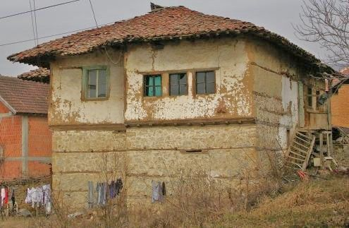
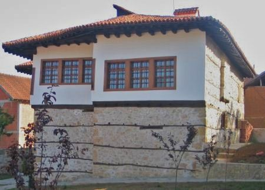
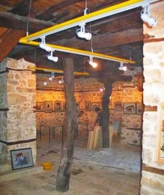
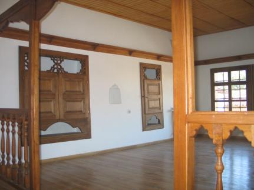

[🠔 Zur Übersicht: Slavisk](slavisk.md)  
# Restauracija stara Kuća + Konzervacija istorijski Spomenik
**Slobodne, nezavisne, kritičke i kontroverzne informacije o obnavljanju starih kuća, restauraciji istorijskih spomenika i očuvanju umetničkih dela, uz energetsku produktivnost.**  
_von Konrad Fischer_

 Da li obnavljate vase stare kuće? Sta se desava? Hrabri pokusaji obnove, rekonstrukcije, rehabilitacije ili modernizacije su izostali? Sav vas novac I nade su izgubljeni? 

 Da li zaštićujete vašu kuću termoizolacijom, vašu drevnu kolibu ili novu ekološku baraku? Vaša kuća je zaključana hermetički I ne propušta vazduh? Vlaga I gljivice su na zidovima I na krovu? Sve je zatrovano insekticidima, pesticidima, sintetičkim omekšivačima, razblaživačima I protivpožarnom zaštitom? Sa plafona curi voda I trulež se širi? Vaša deca pate od dermatitisa, psorijaze i alergije po celom telu? Da li kašlju I imaju astmu? Da li su vaše suzne oči I prsti kompletno pomodreli?

Da li uvek nadjete prefektnog eksperta, firmu ili majstora, restauratora, inžinjera u vašem komšiluku ili legendarnog savetnika na InterNet Forumima? Da li će te iskoristiti prednost najboljeg I najjeftinijeg ponuđača na tržištu da preradi vaše vredno I dragoceno blago napravljeno od drveta, kamena I maltera, u super moderne građevinske materijale koji mogu da se ugrade tako brzo kao nalet vetra I koji neće odgovarati bilo kakvim prirodnim oblicima I biti van stila vaše starovremenske kuće? Da li vaš divni arhitekta izvoljeva vaš novac za projektovanje koje njegovi prijatelji iz industrije I proizviđači materijala posle njemu vraćaju? Darežljivo za njega ali previše skupo za vas. Onda dolazimo do rešenja koje nije jeftino I koje ne odgovara vašem malom budžetu. Ovo nije retkost u spašavanju kulturnog nasleđa. Bilokako, vi to neznate. I da li ste sada shvatili koja je najskuplja glupost u vašoj kući? Čestitam! Ali: možda vaše delo bolje uspe, bude zdravije I čak još jeftinije? Da li znate kako?

 

Želim vam srdačnu dobrodošlicu I puno vam hvala što nas posećujete. Ovaj web sajt čeka dugo vremena samo na vas. Možda nije kasno za vas I vašu povesnu kuću? Ovde možete naći slobodne, nezavisne, kritičke I kontroverzne informacije o mnogo pitanja I problema koji se tiču vaše kuće. Sadržina: opravka starih kuća po niskoj ceni, restauracija istorijskih spomenika I očuvanje vrednih umetničkih dela, energetska produktivnost sa poštovanjem konstrukcije objekta I metodi grejanja. Informacije su najčešće na Nemačkom jeziku. Neke stranice su na drugim jezicima 
( Engleski, Ruski, Italijanski, Danski, Švedski…) I sada prvi put na vašem jeziku. Zahvaljujući mašini za prevod. Molba: ako postoji neka greška u redosledu slova ili gramatičke greške u tekstu, pošljite mi prepravke. Hvala! 

Ali, zašto baš sad ovaj tekst na vašem jeziku? Zato što takođe u vašoj zemlji stare kuće, zgrade I istorijski spomenici sa njihovim spoljnim I unutrašnjim delovima od temelja pa do krova, od fresaka do nameštaja moraju biti obnovljeni. Mnogi tehnički I ekonomski problemi I ostala pitanja su opšta. Greške takođe. Sa istim nevoljama za istorijske objekte, drevne spomenike, stare kuće, srednjovekovne zamkove I renesansne barokne palate, zgrade I gradske većnice, crkve, manastire I opatije, antička svetilišta, sinagoge I džamije, vinske podrume I pivare, za letnjikovce trgovaca I stanovi građana I majstora, za farme I daščare za siromašne ljude I za štale za konje I krave. To je magični, svečani I neodoljvi čar stare kuće, koja osuđuje sve vaše očajničke pokušaje da je dovedete u bolji položaj. Druge veštine? Internacionalna građevinska industrija I vaši stručnjaci ne spavaju. To će vas takođe koštati novca. Da li želite da vidite primere? Kliknite na sliku za sledeće informacije:

(1) + (2) + (3) + (4) + (5) + (6a) + (6b) + (7)+ (8)+ (9) + (10) + (11) + (12) + (13) + (14) + (15) + (16) + (17)

**Objašnjenje fotografija:** (1),(2),(3),(4): [Uništene površine I kore su tipična posledica kalijum silikatskog oćvršćavanja I kalijum silikatskog sloja;](22bausto.md); (5) [ Otrovne crne i vlažne gljivice u kupatilu kao čest rezultat modernih teorija u tehničkom smislu. Mislite o zagađenju I kvalitetu vazduha – vazduh u zatvorenom prostoru;](7mold.md); (6a) [Bez povećanja ili porasta vlage u opeci – rad izveden u kupatilu!](2auffen.md) (6b) [Izbijanje soli na površini zida posle hotizontalnog plombiranja u izbušenim rupama;](2auffen.md); (7) [Širenje algi na površini zida od Spoljašnje Termičke Izolacije Mešovitog Sistema (ETICS) ](213baust.md) iz[B+B, Časopisa za održavanje objekata I zaštite spomenika, Januar 2002](http://www.bautenschutz-bausanierung.de), fotografija: Univerzitet Wismar; (8) [Natopljena termička izolacija u bašti](7wsvoant.md), iz “Građevinski Zanati I Rekonstrukcija Objekata 2/01“, fotograf: H. Paetzold; (9) [Mokra termička izolacija spolja I gljivice / buđ iznutra;](7poly.md); (10) [ Raznesena I izgorena termička izolacija](6brand.md), iz: “Najnovije slike oštećenja“ Bavarsko protivpožarno osiguranje, Minhen; (11) [Cementni malter, zidanje I mraz;](29bau09.md); (12) [ Cement I prirodni kamen;](29bausto.md); (13) [Kreč iz maltera na novoj fasadi;](29bau02.md); (14) [Premaz sintetičkim smolama na istorijskoj fasadi;](22bau2.md); (15) [ Premaz sintetičkim smolama na prozoru;](23bau08.md); (16) [Sintetička boja na ogradi;](23bau08.md); (17) [ Prozor I tehnologija danas.](23bausto.md)

Da li su ove informacije kontroverzne I neobične? Kako bilo, ove informacije su istovetne sa starim. Tradicija I umetnost veštih majstora. Mnoge godine iskustva u restauraciji su osnova: istorijski spomenici I drevne građevine od farmi do zamkova, kuće veleposednika, velike zgrade I svešteni objekti kao crkve I manastiri. Takođe je I moj otac bio arhitekta I bavio se konzervatorskim poslovima od 1958 pa sve do smrti 1979, kada sam i ja počeo. Mnogo sam naučio od njega. Posle mojih studija radio sam kao naučni volonter u kancelariji za zaštitu spomenika u Minhenu dve godine.

Najbolji stručnjaci u industriji, čuveni eksperti zlatnih ruku, veoma pouzdani inženjeri, uvek u crno obučeni arhitekti I takođe vaši bliski prijatelji koji najčešće imaju drugačije mišljenje. Možda će vam oni dati bolji savet. Ali vi sami morate da odlučite dali su moje informacije jasne I korisne. Kako god, možete takođe ići za svojim mudrim ekspertom širokim jednosmernim ulicama uspeha (samo za stručnjake?).

Možda možete da nađete odgovor na vaše pitanje ovde. Alternative: možete da pronađete preko 1500 stranica sa svim sadržajima pa I preko toga na Nemačkom jeziku; restauracija, prezervacija, konzervacija, tehničko I istorijsko istraživanje I snimanje objekata, građevinski materijali za stare kuće: cigla, kreč, malter, zidarski radovi, polu-drvene konstrukcije, beton, bojenje sintetičkim smolama I kalijumovim silikatima, restauracija I ojačavanje peščanika I oksidacije prirodnog kamena, problemi sa restauracijom I obnavljanjem kuća I njenih delova od temelja do krova, ekonomija I finansije, prevare I korupcija u industriji projektovanja kuća I restauracije. Na kraju, ali ne I konačno – avantura: Klimatske promene – šta je istina? Ovde možete da nađete izlaz:

- Da li želite da kupite Nemački zamak ili palatu? Želite li da saznate prodajnu cenu? Primeri: [Palata, Zamak, Plemićko imanje, Stambene zgrade.](8schloss.md).

- **[Porast vlage, vlažnost.](2auffen.md)** Ovde će te naći šta je sve pogrešno urađeno protivu vlage u zidarstvu I zidarskim radovima, u podrumima I temeljima, na fasadi I slojevima maltera. Beskorisni, destruktivni I skupi metodi sušenja u zidarstvu kao divljačka horizontalna izolacija ubrizgavanjem u izbušene rupe, ugrađivanje metalnih ploča nakon presecanja zida, hermetički malteri I boje sa sintetičkim smolama I veoma smešni elektronski isušivači putem elektro-osmoze. Metodi koji ne funkcionišu I čak šta više sve čine još gore. Najveći biznis za bušače, ne samo u Nemačkoj. Takođe na engleskom jeziku: 🇬🇧 [Rising damp does not exist (Penjanje vlage ne postoji)](2auffen.md) - und auf deutsch: ["Der Schwindel mit aufsteigender Feuchte und Mauertrockenlegung"](2aufstfe.md)

   [Bez kapilarnog penjanja I porasta vlažnosti u zidarstvu – niti u laboratoriji, niti u zgradama u vodi, čak ni u zidarskim radovima u luci.](2auffen.md) Zašto? Zato što kapilarno prenošenje iz materijala sa malim porama (kao opeka I prirodni kamen) u materijal sa većim porama nije moguće. Kapilarno prenošenje u porama spojnica maltera I kamena ne može da pobedi gravitaciju više od, 10 do 20cm. Samo vodeni talasi I slana voda kod visokih plima mogu da zid učine mokrim. Eto, to je moguće u dobroj staroj I modernoj Nemačkoj, da li bi to međutim bilo moguće u vašoj predivnoj I misterioznoj domovini. Proverite sami u vašem kupatilu ako ne verujete! Ne verujte lošim momcima I glupavim teorijama. Nemojte ni meni da verujete! Niti šarena svilena kravata I srebrna metalik limuzina, čak ni šarena web strana ne mogu da poprave loš savet. A u šta će te vi da verujete? Prevarama I vračarama? Prosvetljenje!

- **[Gljivice I crna plesan](7mold.md)** - rezultat modernih metoda u građevinarstvu putem pogrešne termičke izolacije, hermetički zatvorenih soba I grejanja sobnog vazduha. Znači, vaše osnovno pravo je povređeno – vazduh za disanje. Takođe na engleskom: Kako da se rešimo napada buđi – Plesan napada! – Šta da uradimo? Vodič. Engleski: 🇬🇧 How to get rid with mold attack](7mold.md). 

- **[Klimatske promene – Globalno zagrejavanje I rashladni uređaji:](7thuene1.md)**  Naučne činjenice  I apokaliptični horor zelenih I klimatska uzbuna, eko-terorizam I industrija, nauka, mediji I politički lideri kao eko-teroristi. Emisija ugljen dioksida nestaje kao preteće oružje u rukama bandi nuklearnih sila protivu ljudske vrste. Naučite više I upitajte se o pozadini klimatskog otopljavanja, prilagođavanju, klimatskom skepticizmu, poricanju, optimizmu I pesimizmu. 

1/8: 

2/8: 

3/8: 

4/8: 

5/8: 

6/8: 

7/8: 

8/8: 

[Other Climate-videos ...](7klima.md)

- **[Prevara sa termičkom izolacijom:](213baust.md)** Pogrešna štednja energije, teroristički ekološki zakoni I potkupljive vladine odredbe prisiljavaju vas da uništite vašu kuću, vašu porodicu ili stanara. Sa industrijskim i ekološkim materijalima za neispravnu termičku izolaciju sa previše vazduha (pene I vlakna, veštački I keramički kamen sa porama, vuna, pamuk, konoplja, celuloza, novinski papir, morska trava …). Na ovaj način materijali mogu da spreče transport toplote sunčevu kroz zid. Kako bilo, gotovo je izvesno da će uskoro ovi materijali truleti od vlage. Onda se pojavljaju alge, takođe otrovne crne gljivice, bela plesan, pauci, bubašvabe, najezda termita, crvi, miševi, pacovi, lasice I detlići, a možda astma, glavobolja, dermatitis a takođe I rak.

 Alge na površini zida od Spoljne Termičke Izolacije Kompozitnog Sistema. 

Budite oprezni prema opasnim tehnologijama pasivnih kuća. Nemačka besmislena nauka. U Nemačkoj se danas prave smisalice. Moderna nauka može biti veoma iskrivljena….

 
Dijagram pokazuje potrošnju energije grejanja u sobama sa različitim konstrukcijama zidova. Vrednost R/th (=k-vredosti ) bez smisla I efekta I. Istraživanje Fraunhofer-Instituta, zimi 1983 godine. x-osa: k-vrednost konstrukcije zida; y-osa:potrošena količina energije u vremenu. Ljubičasto I crveno: termička izolacija sa polistirolom, 23 I 10cm. Zeleno: samo cigla.

[ 
Termografija](7wdvs06.md#thermografie) – lakrdija 
Originalni tekst ispod slike: Termalna slika spolja dokazuje veliki gubitak toplote. Izmerena temperature spolja je 10°C, vetrovito I sa nepoznatom temperaturom unutra. Razlog za vidljivi gubitak toplote je taj što se prozori nalaze na fasadi. Iz danskih novina Big Tek (Building Technology) 25.10.04, novinar Michael Rughede.

Kako bilo, to je samo reklama za internacionalnu hemijsku industriju I proizvođače koji ne štede energiju, već trošenja industrijskog materijala za glupake. Šta morate da znate: Proizvođač može biti finansijski povezan raskošnim poklonima sa nekim inžinjerima, arhitektima, majstorima, naučnicima, državnim činovnicima, političarima I medijima. Oni svi hoće da prodaju hemetički zatvorene kuće sa maksimalnom termoizolacijom da bi napunili njihove kofere dobrim procentima.

Slika pokazuje zračenje toplote na površini masivnog zida u 12 sati. Toplota se ovde pojavljuje samo od sunca. Na južnoj strani zid zrači više, crveno, a na zapadnoj zrači samo malo, plavo-zelena. 
 
Jošjedno ludačko infrared skaniranje: Izoliran zid, plavo (ne može da akumulira sunčevu toplotu!) drveni poklopci zrače toplotu – kao masivni neizolirani zid. (Slika Insulation prop at www.pr-nord.de/stoo_text155.html. Napomena: profesionalci koriste engleske termine kako bi prevarili veliki broj glupih Nemaca). 

Infrared skaniranje za otkrivanje gubitka toplote iz objekta je još jedna prevara takozvanih, još bolje, super ugledne I na dobrom glasu ‘Kućni inspektori’. Naravno, ti čuveni I skroz ozbiljni momci puze oko vaše kuće u rano jutro, I skaniraju kada sunce zađe. Tad se termoizolacija brzo hladi a cigle I ostali čvrsti materijali zrače veliku količinu sunčeve energije koje su prikupili tokom dana. Glupa prevara I najbolja besmislena nauka za vas I vaš novčanika. Bacite vaš novac na ovakve šale, nije moj, vaš je. Još prosvetljenja! Da li je zaista neophodno da zadržimo energiju … 

- **[Obavijajući system grejanja soba - Ispravno ili opasno grejanje (na engleskom)](heating.md)** – Zagrejani vazduh ili topli zidovi? 
 
Uobičajeni konvektor grejač: Topli vazduh greje. Glava topla – stopala hladna. 

Tajfun prašine u sobi ili bez strujanja vazduha? Najčeša distribucija toplote putem peščane oluje? Konvektivni transfer toplote ili zračenje toplote? Velika ili mala potrošnja energije? Asmatična deca, prehlada svake zime zbog pogrešnog grejanja? Kondenzacija I gljivice na hladnim zidovima – ili blago zračenje toplote sa površina sobe? Štednja energije sa toplotnim zračenjem ne zahteva mnogo tehnike. Konstrukcija I kuća su uvek suvi, zdrav i svež vazduh su rezultat. 

 
Toplota zračenjem je grejanje putem infracrvenog toplotnog zračenja. 

Vazduh u sobi je mako hladniji nego sobne površine. Prostorija nije hermetički izolovana, ne postoji beskorisna termoizolacija od preskupog kompresovanog vazduha u nakvašenim građevinskim materijalima, bez kondenzacije na hladnim površinama. Više informacija o nedostacima kilometara grejnih cevi u podu ili iza malterisanih zidova, takođe o boljim alternativama. Ovo je jedan od mnogo primera dobrog očuvanja energije I jeftinog grejanja putem toplotnog zračenja: 

 [Veitshoechheim Palata sa grejanjem putem toplotnog zračenja (🇬🇧 engleska verzija)](heating.md)

- Zaštita trulog drveta I [neškodljiva zaštita prirodnog drveta](23bau16.md) protiv razarajućih gljiva / suva trulež (Meruliporia incrassata; Merulius domesticus Falck; Serpula lacrymans; kućne jestive gljive) I insekti (crvi, termiti, kućne bubašvabe (Hylotropes / Hylotrupes bajulus), crvotočci (Annobium punctatum), žižak (Euophryum cofine), ostali insekti I gmizavci (Lyctus brunneus, Diplopoda, Lyctidae, Bostrichidae, Buprestidae…), takođe za dugotrajnu zaštitu spoljnih drvenih delova konstrukcije, npr. terase, balkoni, mostovi… 

 
Neškodljiva zaštita prirodnog drveta

 
Pogrešna zaštita drveta izloženog dejstvu vazduha.

- [Problemi koji se odnose na stare I nove prozore I njihovo premazivanje.](23bausto.md) – sa puno tehničkih objašnjenja. 

 
Stari prozor I novi sintetički premaz posle jedne godine.

Elektromagnetski talasi I staklo 

 Dijagram profesora Dr.-Ing. habil. Claus Meier: Uokvireno staklo nij propusno za kratke talasne dužine UV zračenja (< 0.3 µm) I duge talase elektromagnetskog IC zračenja (infracrveni toplotni zraci > 2.7 µm). Znači, najveći transfer toplote kroz prozor nikad nije zračenje. Samo svetlosne talasne dužine mogu da prođu kroz staklo. Zbog toga možete da imate svetlost u sobi I protivpožarnu zaštitu od termo otpornog stakla. Svetlost od vatre je vidljiva, toplota od vatre ne može da prođe. Staklo nepropušta IC talase. Zbog toga sočiva za Ic kamere moraju biti neo d stakla već od IC nepropusnih materijala kao cinka ili safira. Svetlosni elektromagnetni talasi koji prodiru u vašu sobu kroz prozor biće apsorbovani unutrašnjim materijalima I emitovani u IC talase. Svetlo može da greje vašu sobu. 

X-osa: Talasna dužina I prozirnost uokvirenog prozora. Y-osa: Intenzitet zračenja. 

Dupli prozorski okvir prigušuje više sunčeve energije nego jedan. Dupli prozori će doprineti kondenzaciji u zidovima. Zapečaćeni prozori povećavaju vlažnost vazduha u prostoriji. To povećava potrošnju energije potrebnu za grejanje. Zbog toga, moderni prozori povećavaju potrošnju energije kao I vlagu. Očuvanje energije se mora sprovesti kroz tradicionalne graditeljske metode u istorijskim objektima. Pogledajte trošnu komšijsku baraku I slične originalne objekte koji su kao muzeji na otvorenom. One pokazuju inteligenciju iskusnog majstora umesto najgoru praksu današnjih modernista. Prosvetljenje!

 
[Neuenburg dvorac u Saksoniji-Anhalt.](http://www.schloss-neuenburg.de/) 
Planiranje restauracije (arhitektura, konstrukcija, građevinarstvo / tehnologija:voda, otpadne vode, grejanje, ventilacija): 
Konrad Fischer I zaposleno osoblje 

(Informacije na Nemačkom: [Neuenburg Castle Museum](http://www.schloss-neuenburg.de) [Informacije na 🇬🇧 Engleskom od E. Kane: www.roadstoruins.com/neuenburg.html](http://web.archive.org/web/20120220161824/http://www.roadstoruins.com/neuenburg.html)

- Moja literatura na Engleskom sa RILEM seminara ‘Karakterizacija starih maltera sa uvaživanjem pri popravci – Istorijski malteri – Karakterizacija I testovi’ Univerzitet Paisley, Škotska, Maj 1999: Tradicionalni malteri u modernim malterima – Da li funkcioniše u praksi?’ (Engleski): 🇬🇧**'Traditional Craftsmanship in Modern Mortars - Does it Work in Practice??'**](2rilem.md) 

[Moje skice sa RILEM ekskurzije u Stirling zamku I poseti peći za pečenje cigli u Charlestown Fife, Glazgov I ostala mesta.](2rilskz.md)

 
Opatija [Waldsassen](http://www.waldsassen.de) 
Spolja smo radili opravke sa čistim negašenim ( ne gašeni!!) krečnim malterom I krečenjem. Jeftinije I bolje nego razarajuće metode zasnovane na cementu, sintetici ili vodenom staklu / kalijumovi silikati.

- [Propadanje betona I cementa.](2beton.md) Zarđao I propali armirani beton – primer sa Bofill's 'Antigone', socijalističko ekperimentalno predgrađe Montpeljea, Francuska. Tipična situacija veštačkog popunjavanja posle nekoliko godina uticaja vremenskih prilika. Propast konstrukcije I objekata u modernoj arhitekturi, koja sama sebe uništava. Pogrešne I ispravne opravke zarđalih konstrukcija od armiranog betona.

-  **[Autor / Preporuka](1refernz.md)** – moja biografija, preporuke za pojedine projekte od 1979 (više od 400 projekta), službene preporuke I potvde. Napomena: Klikom na moju sliku možete da download 2,8 MB wmv sempl, sa sviranjem čela u Božićnom Oratorijumu J.S.Baha, dirigent Marius Popp u Kronahu (grad Lukasa Kronaha).

- **[Građevinski materijali](2baustof.md)** – Problemi sa modernim konstruktivnim sistemima. Mogu da oštete objekat I njene stanare. Postoje alternative.

 
[Lichtenfels' eksperiment - Dijagram](2139bau.md): Povećanje temperature na osnovu različitih građevinskih materjala / izolacioni materijal (4cm) posle 10 minuta zračenja infra crvenom lampom. Materijali odozgo: Mineralna vuna, polistiren, multicelularno ili penasto staklo, glinena opeka, drvena vlakna, gipsane ploče, borovo drvo. x-osa: Vreme zračenja. y-osa: temperatura u °Celzijusima.

Napomena: R-vrednost/U-vrednost (=“U“) nije ista sa promenama temperature I stvarnim dejstvom termoizolacije. Neslana šala: Eksperti za R-vrednost definišu njene rezultate bez ikakvog obzira na vreme I količinu grejne energije pre nego što počne merenje. Teški materijali upijaju I skladište veliku količinu energije. Zbog toga, oni gube još više energije nego izolacija ispunjena vazduhom. Na isti način, takozvani znalci su u stanju da uporede gubitak vode punog jezera sa punom čašom. Oni zanemaruju dnevnu energiju zračenja sunca, uvučeni u svoje mračne laboratorije I duše. Znači, oni zaboravljaju reke I potoke koji iznova ispunjavaju jezero. Razmislite o ovome I bićete u stanju da otkrijete neverovatnu prevaru za koju ne morate da ste doktor, već najobičniji tupan. Sve je to velika, dugotrajna zavera protiv vašeg novčanika: industrija izolacionog materijala, proizvođači montažnih kuća I njihova ‘nauka’, projektovanje I njeni autori, možda čak I vaš majstor, arhitekti I građevinski inžinjeri – uzimaju vam novac a prodaju sranje.

Porozni materijali kao što su moderne lake cigle, laki beton, industrijski ili ekološki termo materijal su tehnički veoma problematični. Neki sprečavaju kapilarno isušavanje materijala sa sintetičkim premazima, što prouzrokuje ozbiljne probleme sa vlagom: Kapilarnost pora u materijalu je sprečena zbog sintetičkih premaza. Transport vode u materijalu putem kapilara I difuzije je u odnosu 1000:1. Znači, ako je kapilarnost sprečena, materjal se nikad neće rešiti vlage. Mnogi izolacioni materijali su toksični I pretnja su zdravlju sa strašnim otrovima kao što su soli bora, I razni pesticidi I insekticidi. Mineralna vuna, PUR (poliuretan), polistiren, poliestar, staklena I drvena vlakna, vuna, pamuk ili celuloza, konoplja, končana I kokosova vlakna, morska trava, laka glina, vermikulit – prirodni mineral, mogu da sadrže azbestna vlakna!. Reciklirani papir i ljušćenje celuloze, su samo tipični proizvodi loše termoizolacije koja će kad tad biti nakvašena. Ovi materijali ne pružaju bolju termoizolaciju od tradicionalnih čvrstih građevinskih materijala kao što su drvo, cigla I prirodni kamen. Dodatna spoljna izolacija će povećati potrošnju toplote: zbog senke na zidu. Svo trovanje izolacionim materijala neće pomoći da se reše problemi vlage. Ovi materijali gomilaju vlagu I kondenzaciju a kao produkt se javljaju gljivice, buđ, crvi, vaši, mravi I bubašvabe, miševi I pacovi I svi su oni veoma srećni. Čim nemilosrdna kondenzacija porazi sintetiku, paraziti stupaju na scenu! Osim fiberglasa, I ostali izolacioni materijali mogu da prouzrokuju ozbiljan svrab I raznorazne upale I povrede. Pametan vlasnik kuće bi trebalo da zaboravi sve proračune o teoretskom sprovođenju toplote. PROSVETLJENJE!

Informacije za kreč, opeku, malter I zidarstvo:

- [Krečni malter I njegovo poboljšanje.](2kalk.md) 
- [Restauracija maltera I boja na istorijskim objektima – problemi I rešenja.](22bausto.md) 
- [Najčešće greške kod upotrebe maltera I krečnih boja.](2kalkfel.md) 
- [Krečni malter.](26bausto.md) 
- [Krečni malteri na drevnim objektima.](2prokalk.md) 
- [Građevinski materijali za zidove I zidarstvo I poređenja](29bau09.md) – sa puno interesantnih I retkih tabela – Važne informacije o objektima u toplim, hladnim, suvim I vlažnim oblastima. Problem savremenih građevinskih materijala za restauraciju, koji veoma brzo stare zbog promena temperature I vlažnosti I koji na taj način uništavaju istorijsku građu. Napomena: Cementni malter nije propustljiv za vodu, tako da je voda zaustavljena u zidu. Jednom zasićen, zid počinje da erodira.

 .  
Barokna poludrvena konstrukcija pre I posle opravke sa tradicionalnim I ekonomskim tehnologijama, projekat: Arhitekta I inženjer Konrad Fischer I osoblje. 

---

**Restauracija Gospodarske kuće-Saraj u selu Velika Hoča, Kosovo.** 

  1. Gospodarska kuća pre restauracije, 2005, jugoistočna strana  2. Gospodarska kuća posle restauracije, 2006, jugoistočna strana 
  
3. Izložbeni prostor, 4. Tradicionalni izgled sobe sa pregradnim zidom 

Objekat potiče iz kasnog Otomanskog perioda (kraj 18 veka). Prvobitno, objekat se koristio kao vinski podrum u prizemlju I za stanovanje na spratu. Posle restauracije objekat je dobio novu funkciju – Omladinski Centar, sa prostorom za izložbe I kabinetima. Svi restauratorski I konzervatorski radovi su uradili lokalni majstori, originalnim materijalima I tradicionalnim tehnikama građenja., tokom 2005/06. 

Projekat je izvela Švedska NVO-CHwB i arhitekte konzervatori iz Instituta za Zaštitu Spomenika, Srbija. Asistent projekt menadžera arh. Predrag Ničić e-mail: pedja.nicic[aet]krstarica.com 

---

- **[Pažljiva I delikatna restauracija I prezervacija.](11erhins.md)** Kako opraviti I obnoviti stare objekte I konstrukcije sa tradicionalnim, osetljivim, domišljatim, povratnim I ekonomičnim metodama. U suprotnosti su sa modernim metodama, koje nalazimo kao prekrasan poklon industrije za odgovorne osobe I projektante (profesori, restauratori, nadzornci, arhitekte, inžinjeri) kao siguran način da se stari objekti oštete posle nekoliko godina. Kako su istorijski objekti sagrađeni a kako moderni? U staro vreme: Zidarstvo I zidovi od kamena (prirodni I lomljeni kamen, opeka I poludrvene konstrukcije). Malter samo od peska I kreča. Slojevi krečne boje I prirodnih ulja. Sve se opravlja odlično. Danas: Strašna brutalnost armiranog betona, zarđali čelik, plastika, porozne cigle I izolacija od pene I vlakana. Sve je loše opravljeno.

- **[Ekonomija I restauracija I finansije](5wiber.md)** – Ekonomska I **[finansijska](5finanz.md)** pitanja koja se tiču opravke starih zgrada.

[Kloster Reichenstein](http://www.kloster-reichenstein.de) - Fundraising-Video 

- Možda će te bolje razumeti moj Nemački tekst ako prevedete mojeNemačke InterNet stranice? Probajte [Worldlingo](http://www.worldlingo.com/) – prevodioca.

- Ako trebate dodatne konsultacije: 200 € za detaljan odgovor na 1-3 pitanja putem e-mail, 500 € za 4-10 pitanja, lokalne konsultacije: 100€ za svaki sat konsultacija I vreme putovanja. Dodatni troškovi putovanja. Priložiću u ponudi ako želite. [Plaćanje (bankovni račun)](11form.md#kto) unapred sa punomoćjem za lokalne konsultacije 70%. Vi znate zašto. Da li je to previše za ušteđeni novac i zla sreća tokom restauracije? Vi morate da odlučite. Molim vas, pošaljite neke slike problema I konstrukcije vaše kuće, sa vašim pitanjima I vaučer sa uplatom, moj odgovor će uslediti što je pre moguće. Više detalja na Nemačkom jeziku I na mojoj e-mail adresi: [Konsultacije.](2berat.md). Tu su takođe slike preporuka. Ako hoćete da me rezervišete za predavanja Restauraciju/Prezervaciju/Konzervaciju/Seminar (na primer) – kontaktirajte me putem e-mail ili telefona. Primer: [Puno pitanja I odgovora – FAQ](2frag.md).

Normalno, ja znam da ste veoma oprezni kako trošite vaš novac. Ja takođe! Vaše alternative: Možete da dobijete savet bilo gde. Znate za obaveštajni forum na InterNetu. Probajte ga, molim vas. Želim vam puno sreće. Dva konsultanta, tri rešenja, četiri katastrofe. Iza svega stoji mudrost industrije, iskusni majstori, super intelegentni eksperti, URADI-SAM, penzioneri, znatiželjne komšije, nezaposleni tehničari, akademski teoretičari, fizičari, početnici, veoma pametni ujak ili tetka. Zar ne?

To je sve za danas, želim vam puno uspeha! Ili sačuvajte vaš novac, pustite da vaša kuća ostari dostojanstveno I uživajte u odmoru I skupom crnom vinu.

Doviđenja I vidimo se uskoro!!!

(Imajte na umu vaše prijatelje koji neznaju za ove informacije)

---

Međunarodna povelja o zaštiti I 
resturacijiu spomenika I područija

“Venecijanska povelja“ (Venecija, maj 1964 godine) 

Prožeti porukama prošlosti, istorijski spomenici mnogih generacija ostaju do današnjih dana živi svedoci njihove vekovima stare tradicije. Ljudi postaju svesni jedinstva ljudskih vrednosti I posmatraju drevne spomenike kao zajedničko nasleđe. Shvaćena je I zajednička odgovornost da se ono sačuva za buduće generacije. Naša dužnost je da ih predamo u punom bogastvu njihove autentičnosti. 

Od suštinske je važnosti da se na međunarodnom planu usaglase I postave principi na kojim počivaju zaštita I restauracija istorijskih građevina, gde bi svaka zemlja bila odgovorna za primenu ovog plana u okviru sopstvene kulture I tradicije. 

Definišući ove osnovne principe po prvi put ,Atinska Povelja (1931.godine) doprinela je razvoju širokog međunarodnog pokreta koji se konkretizovao u nacionalnim dokumentima, u radu ICOM-a u UNESCO-a I osnivanju Medjunarodnog centra za proučavanje zaštite I restauracije kulturnih dobara od strane UNESCO-a. Proširena je svest I kritičko proučavanje problema koji su postojali kompleksniji I raznovrsniji; sada je došlo vreme da se Povelja preispita kako bi se detaljno ispitali principi koje sadrži I da bi se njen opseg proširio kroz jedan novi dokument. 

Shodno tome, na II Međunarodnom kongresu arhitekata I tehničara istorijskih spomenika, koja je održana u Veneciji od 25. do 31.maja 1964. usvojen je sledeći tekst: 

DEFINICIJE 

Član 1. Koncept istorijskog spomenika obuhvata ne samo pojedina arhitektonska dela, već I urbane ili ruralne ambijente za koji se utvrdi da prestavlja dokaz određene civilizacije, značajnog razvoja ili istorijskog događaja. Ovo se ne odnosi samo na velika umetnička dela već I na skromnije radove iz prošlosti koji su vremenom stekli kulturni značaj. 
Član 2. Zaštita I restauracija spomenika mora se koristiti svim naukama I tehnikama koje mogu doprineti proučavanju I čuvanju arhitektonskog nasleđa. 
Član 3. Namera zaštite I restauracije spomenika jeste da se očuvaju kako kao umetnička djela, tako kao I istorijski dokazi. 

ZAŠTITA 

Član 4. Od suštinske važnosti za zaštitu spomenika jeste da se redovno održavaju. 
Član 5. Zaštita spomenika uvek je lakša kad se koriste u društveno korisne svrhe. Takva namena je stoga poželjna, ali ona nesme da promeni osnovu ili dekoraciju građevine. Jedino u okviru ovih ograničenja mogu biti planirane I dozvoljene modifikacije koje zahtevaju promenu funkcije. 
Član 6. Zaštita nekog spomenika podrazumeva očuvanje njegovog srazmernog okruženja. Gde god postoji tradicionalni ambijent, treba ga očuvati. Ne sme se dozvoliti izgradnja novih građevina, rušenje ili izmene koje bi promenile odnos gabarita ili boja. 
Član 7. Spomenik je neodvojiv od istorije o kojoj svedoči I okruženja u kome postoji. Izmeštanje spomenika ili njegovih delova nije dozvoljeno, osim kada je to opravdano nacionalnim ili međunarodnim interesima od najvišeg značaja. 
Član 8. Skulpture, slike ili dekoracije koje su sastavni deo spomenika mogu biti uklonjene sa njega jedino ako je to jedini način da se obezbedi njihova zaštita. 

RESTAURACIJA 

Član 9. Proces restauracije je visoko specijalizovana aktivnost. Njen cilj je da očuva I otkrije estetske I istorijske vrednosti spomenika, a zasnovana je na poštovanju orginalnog materijala I autentičnih dokumenata. Restauracija se mora zaustaviti kada se počne sa prepostavkama, I u tom slučaju, svi neophodni dodatni radovi moraju se razlikovati od arhitektonske kompozicije I moraju imati savremeni pečat. U svakom slučaju restauraciji moraju predhoditi I pratiti je arheološke I istorijske studije spomenika. 
Član 10. Kada se pokaže da tradicionalne tehnike nisu adekvatne, konsolidacija se može postići upotrebom bilo koje moderne tehnike zaštite I izgradnje, čija je efikasnost pokazana kroz naučne podatke I dokazana iskustvom. 
Član 11. Mora se poštovati doprinos svih perioda u izgradnji spomenika, pošto jedinstvenost stila nije cilj resturacije. Kada građevina sadrži radove dodate kroz različite periode, otkrivanje orginalnog stanja opravdano je samo u izuzetnim okolnostima, I kada je ono što se uklanja manje vredno, podaci koji se obelodanjuju od velike istorijske, arheološke I esteske vrednosti, a njeno stanje očuvanosti dovoljno dobro da se opravda takva aktivnost. Ocena značaja ovih elemenata I odluka o tome šta može biti uništeno, ne sme biti samo na pojedincu koji je zadužen za posao. 
Član 12. Zamena delova koji nedostaju mora se uklapati harmonično sa celinom, ali u isto vreme mora se razlikovati od orginala tako da restauracija ne iskrivi umetničke ili istorijske dokaze. 
Član 13. Dogradnje nisu dozvoljene, osim ukoliko ne umanjuju vrednost interesatnih delova građevine, njenog tradicionalnog okruženja, ravnotežu njene kompozicije I njen odnos sa okolinom. 

ISTORIJSKA PODRUČIJA 

Član 14. Mesta na kojima se nalaze spomenici moraju biti predmet posebne pažnje, kako bi se očuvao njihov integritet I osiguralo da su oni objašnjeni I prestavljeni na odgovarajući način. Posao na zaštiti I restauraciji takvih područija trebalo bi da bude inspirisan principima koji su izneti u predhodno navedenim članovima. 

ISKOPAVANJE 

Član 15. Iskopavanje treba vršiti u skladu sa naučnim standardima I preporukama koje definišu međunarodne principe koje treba primeniti u slučaju arheoloških iskopavanja koje je usvojio UNESCO 1956.godine. 
Ruševine se moraju održavati I moraju se preduzeti mere za trajnu konzervaciju I zaštitu arheoloških karakteristika I otkrivenih objekata. Takođe, moraju se preduzeti sve mere da se omogući razumevanje spomenika, da se otkrije a da se njegovo značenje nikada ne iskrivi. 
Međutim, svi radovi na rekonstrukciji moraju unapred biti definisani. Jedino je dozvoljena anastiloza, tj. ponovno slaganje postojećih ali rasčlanjenih delova. Materijal koji se koristi za spajanje trebalo bi da je uvejk prepoznatljiv, a njegova količina treba da bude najmanja moguća dovoljna da osigura zaštitu spomenika I ponovno uspostavljanje njegovog oblika. 

PUBLIKACIJA 

Član 16. U svim poslovima zaštite, restauracije ili iskopavanja trebalo bi da uvek postoji precizna dokumentacija u obliku analitičkih I kritičkih izveštaja, ilustrovanih crtežima I fotografijama. 

Oni treba da sadrže sve faze poslova čišćenja, statičke sanacije, preuređenja I integracije kao I tehničke I oblikovane karakteristike indetifikovane tokom radova. Ove izveštaje treba smestiti u arhiv neke javne institucije I učiniti ih dostupne istraživačima. Preporu 
čljivo je da izveštaj bude publikovan.
