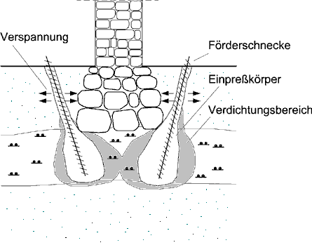

[🠔 Zur Übersicht: Fundament](28bausto.md)  
# Baugrund-Stabilisierung durch Stopfen
**Zur Ertüchtigung des historischen Baugrunds durch das patentierte Stopfverfahren nach Prof. Dr.-Ing. Gerd Gudehus, Uni Karlsruhe**  
_von Klaus Maisch_

## Zur Ertüchtigung des historischen Baugrunds
durch das patentierte Stopfverfahren nach Prof. Dr.-Ing. Gerd Gudehus, Uni Karlsruhe

### (Originaltext für die Veröffentlichung bei den "Altbau und Denkmalpflege Informationen" durch den Autor freigegeben)

## Klaus Maisch 
Die Stabilisierung des Baugrunds durch Stopfen

Bei dem von uns vorgeschlagenen Verfahren handelt es sich im wesentlichen um eine Baugrundverdichtung, die durch das gezielte Einbringen von Granulat (z.B. Sand) erreicht wird. 
Dabei werden zunächst neben einem bestehenden Fundament mit einem Bohrgerät Verdrängungsbohrlöcher hergestellt, die schräg unter das Fundament reichen. Anschließend wird eine Förderschnecke in ein Bohrloch nach dem anderen eingeführt, in dessen oberen Ende Granulat zugegeben wird. Durch Linksdrehen der Schnecke wird das Granulat bis zum unteren Ende der Schnecke gefördert, von wo es in den umgebenden Boden gepreßt wird. 

Durch das Einpressen wird der umgebende, weiche Boden verdrängt und verdichtet. Zudem wird durch die Verwendung von trockenem Granulat dem umgebenden Boden überschüssiges Wasser entzogen. Die Störung des Bodens weiter weg ist dabei gering, denn das eingebrachte Material wirkt als Drain und reißt den Boden vorübergehend auf, so daß sich Porenwasserdrücke sehr schnell abbauen.

Die Förderschnecke wird vom Bohrgerät mit einer vorgegebenen Kraft axial gehalten. Welche Materialmenge eingebracht werden kann, hängt dann vom Porenvolumen und der Kornhärte des anstehenden Bodens ab. D.h. in einer weichen Bodenschicht läßt sich bei gleicher Axialkraft eine wesentlich größere Menge Granulat einpressen. Das bedeutet, das Material wird von selbst in der Menge eingebracht, die für eine Stabilisierung notwendig ist.

Die Schnecke steigt im Bohrloch auf, bis der Einpreßwiderstand des oberflächennahen Bodens zu dessen seitlichen Ausweichen führt. So werden säulenförmige Körper aus verdichtetem Einpreßmaterial im Boden erzeugt, die je nach Steifigkeit des durchfahrenen Bodens eine unterschiedliche Dicke aufweisen. Bei der Herstellung von Säulen von zwei Seiten eines Fundaments aus wird der unvermörtelte Gründungsbereich seitlich verspannt, so daß gefahrlos auch eine höhere Last auf den Gründungskörper aufgebracht werden kann.

Einige Vorteile des Verfahrens sind, insbesondere im Hinblick auf den Einsatz bei historisch wertvollen Gebäuden:

 * Anders als bei Einpreßmaterialien auf Flüssigkeitsbasis bleibt die unterirdische Denkmalsubstanz durch die Herstellung definierter Verpreßkörper weitgehend erhalten.
 * Steifigkeit und Festigkeit des Bodens werden relativ gleichmäßig erhöht.
 * Das Verfahren ist setzungsarm und gut kontrollierbar, so daß Denkmal und Boden geschont werden.
 * Es sind keine Konstruktionen am Tragwerk erforderlich.
 * Die Baukosten des Verfahrens sind dank der Verwendung billiger Baustoffe und relativ kleiner Baumaschinen geringer als sonst.
