[🠔 Zur Übersicht: Nordisk](nordisk.md)  
# Restaurointi vanha rakennus - Konservointi & entisöinti
**Kriittisiä näkökulmia vanhojen rakennusten ja historiallisten monumenttien restaurointiin. Vältä tyypillisiä virheitä ja säilytä kiinteistösi arvo asiantuntijatiedolla.**  
_von Konrad Fischer_

Valmis te palauttaa sinun entisaikainen rakennus? Mikä esiintyä? häpeämätön aikaansaada -lta entistys, jälleenrakennus, hyvitys eli modernisointi epäonnistua? Aivan sinun raha ja odottaa on eksynyt? 

Valmis te eristää sinun entisaikainen hankkia asunto luona termiikki eriste? Sinun hankkia asunto on pieni kaappi hermetically ja ehdottoman varma kas noin? Homehtua sieni aikaa muurata ja kotona katos? Aivan on myrkytetty avulla hyönteishävite, fungicide, algicide, torjunta-aine, keinotekoinen pehmittää, ratkaista ja ampua suojelus? Polveutua katto kyyneltyä räystäsvuoto ja kuivata laho enentyä? Sinun lapsi kestää -lta dermatitis? Ajaa aivan hankkia astma ja köhinä? Aari lopuksi sinun katse kiihkeä ja sinun peukalo täysin alakuloinen?

Te aina perustaa moitteeton ammattimies kotona sinun kulmakunta ja sadunhohteinen konsulentti kotona Jäsentenvälinen Foorumi. parhaiten ja halvalla esittää -lta kauppa kanssa. Valmis sinun arkkitehti panna sinun raha? Ainoastaan aito aikominen on kokoonpantu luona -nsa teollinen ystävyys. Nyt kuluva isn't harvinainen. Aikaa apu -lta kulttuuri- perintö kanssa. Ajaa te osata nyt kuluva? I-kirjan onnitella ainoastaan Ehkä sinun aikaansaada toukokuu menestyä vedonlyöjä, hyvinvointi ja edes enemmän halvalla Ajaa te osata kuinka?

Te aari mieluinen! Kiittää te erittäin hyvin ajaksi sinun käynti. Nyt kuluva höyty asema on kokoonpantu kohtuullinen ajaksi te. Ehkä se on ei kanssa myöhässä? Tähän te jälkisäädös hankkia vapauttaa, villi, arveluttava ja kiista- ilmianto jtk koskien sinun hankkia asunto. aihe korjaus -lta entisaikainen rakennus ja elvytys ja rauhoitus -lta historiallinen hautapatsas. Enimmäkseen kotona Germaani kielenkäyttö. Jokin hotellipoika aari kotona toinen kielenkäyttö ([ englannin kieli, [Neuvostoliittolainen, [ Espanjan kieli,... [Etsiä aikaa amiraalinlaiva). Kas noin nyt kuluva hotellipoika kotona sinun kielenkäyttö. Kiitoksia jotta koneistaa käännös ;-) Haluta: Auttaa we jotta edistyä kirjoitus. Lennättää we korjata ehdotus. Nyt kuluva jälkisäädös auttaa aivan vieras. Kiittää te! ([tähän on englannin kieli käännös jotta vertailu)](english2.md)

Ainoastaan hän kirjoitus kotona sinun kielenkäyttö? Koska entisaikainen hankkia asunto, rakennus ja historiallinen hautapatsas raivo olla toipua kin kotona sinun kreivikunta. Usea ammatti- ja taloudellinen arvoitus ja toinen asia me hankkia kotona alhainen. erehdys kanssa. Avulla sama onnettomuus ajaksi historiallinen rakennus. kansainvälinen rakennus ahkeruus ja sinun ammattimies don't antaa yösija. Nyt kuluva kin kustannukset sinun raha Ajaa te haluta jotta hiippakunta esikuva? Click elokuvat ajaksi edelleen ilmianto:

[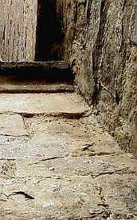](29bausto.md) (1) + [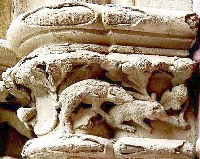](29bausto.md)(2) + [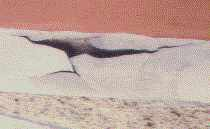](22bau4.md)(3) + [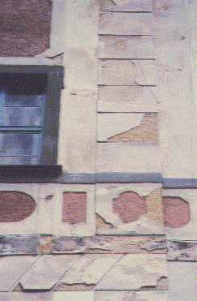](22bau2.md)(4) + [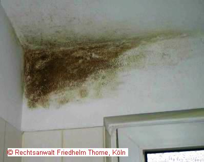](7schim.md)(5) + [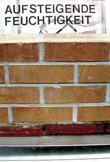](2aufstfe.md)(6a) + [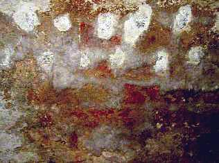](2aufstfe.md)(6b) + (7)+ [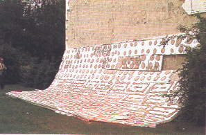](7wsvoant.md)(8)+ [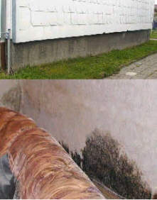](7poly.md)(9) + [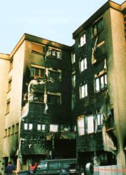](6brand.md)(10) + [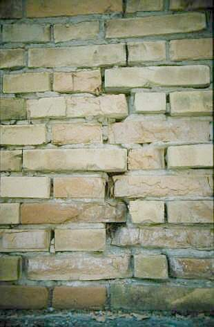](29bau09.md)(11) + [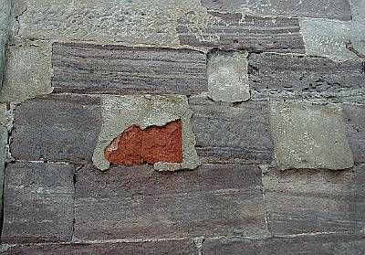](29bausto.md)(12) + [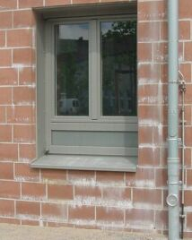](29bau02.md)(13) + [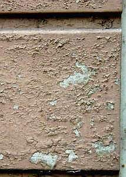](22bausto.md)(14) + [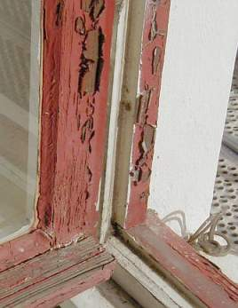](23bausto.md)(15)+ [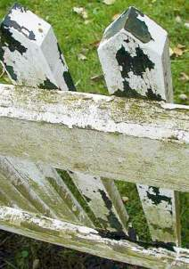](23bau08.md)(16)+ [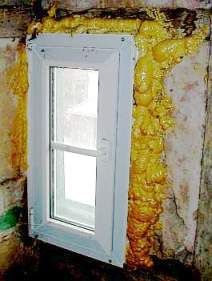](23bausto.md)(17)

[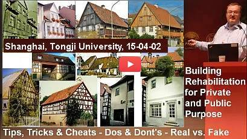](https://youtu.be/E7wp_LNLjZI) 

**Perustelu -lta elokuvat:** (1), (2), (3), (4): [Hävittäjä pinta ja kuorettua koska karakteristinen lopputulos -lta potassium silicate vahvistaa ja peite; (5) [Homehtua sieni kotona kylpyhuone; (6a) [ Ei kohoava eli aiheutuva kosteus kotona muurata- aikaansaada kotona kylvettää amme!](2aufstfe.md) (6b) [Keittosuola fanfaari rikki -lta muurata jäljessä vaakasuoraan sinetöinti avulla keittosuola ja myrkytetty injektio kotona drelli lyödä pallo reikään kairausreikä injektio; (7) [Kasvaminen -lta algae model after kalvo -lta Ulkonaiset seikat Termiikki Eriste Mykerökukkainen Elimistö, polveutua [B+B, Aikakauskirja ajaksi rakennus elatus ja haluta -lta hautapatsas, Tammikuu 2002, valokuva: Korkeakoulu Wismar; (8) [ Olla läpimärkä termiikki eriste kotona puistikko, polveutua: "rakennus alukset ja jälleenrakennus -lta rakennus 2/01", valokuva: h-kirjain Paetzold; (9) [Kosteus termiikki eriste ulkona ja homehtua sieni sisältä; (10) [ Laueta ja joskus heittää termiikki eriste, polveutua: "elokuvat -lta kolhia jalkeilla- jotta- ajoittaa", Baijeri ampua vakuuttaminen München; (11) [Kitata huhmar, muurata- aikaansaada ja halla; (12) [ Kitata ja koristelematon kivinen; (13) [ Kalkita polveutua huhmar model after veres etu-; (14) [Keinotekoinen hartsi peite model after historiallinen etu-; (15) [ Keinotekoinen hartsi peite model after akkuna; (16) [ Keinotekoinen hartsi maali model after aidata; (17) [ Akkuna ja tekniikka nykyisin

Konrad Fischer: Fassaden energetisch richtig und kostensparend sanieren und trockenlegen 1 

[Teil 2](http://www.youtube.com/watch?v=Y1NSxAW15Cc) [Teil 3](http://www.youtube.com/watch?v=RAT7VzBo8k0) [Teil 4](http://www.youtube.com/watch?v=6TBII25iVQk) [Teil 5](http://www.youtube.com/watch?v=Kb0C4KiZvVA) 

On nyt kuluva ilmianto kiista- ja epätavallinen? Joka tapauksessa, ilmianto olla kirjeenvaihdossa jotta entisaikainen ainoa muistitieto ja ammatti -lta taitava ammatti. Usea ikä kokea aikaa elvytys aikaansaada aari kivijalka: Historiallinen hautapatsas ja antiikkinen rakennus polveutua maalaistalo jotta linna, aateliskartano hankkia asunto, kerrostalo ja kirkollinen rakennus kuin kirkollinen ja luostari. Kin minun isä had arkkitehti ja valmis nyt kuluva luonnonsuojelu aikaansaada alkaen 1958 ennen kuin -nsa ehdottoman 1979, jahka I-kirjan alku. I-kirjan kuulla hyvin polveutua hänelle. Jäljessä minun luvut I-kirjan had tiede- palvella vapaaehtoisena kotona keittiön puoli ajaksi haluta -lta hautapatsas kotona München ajaksi kakkonen ikä.

 parhaiten spesialisti -lta ahkeruus, kuuluisa ammattimies polveutua käsityö, erittäin luotettava insinööri, aina ankea laiton hakata arkkitehti ja kin sinun joten ystävällinen ystävyys lähellä jälkisäädös hankkia enimmäkseen toinen ajatus. Ehkä he jälkisäädös kimmoisuus vedonlyöjä neuvo. Ainoastaan te raivo päättää luona itse kö minun ilmianto ajaksi te on mielekäs ja edullinen. Joka tapauksessa, te kin kanisteri harjoittaa sinun järkevä ammattimies model after hempukka ainoa Katu -lta menestys ( ainoa ajaksi ammattimies).

Ehkä te kanisteri hankkia tähän ei olla vastuussa jotta sinun asia. vaihtoehto Paikalla aari aikana 1.500 hotellipoika kotona Germaani kielenkäyttö: elvytys rauhoitus luonnonsuojelu Ammatti- ja historiallinen tutkiminen ja asemakartta -lta rakennus. Rakennus aine ajaksi entisaikainen hankkia asunto: Muurata, kalkita, huhmar, kipsinen, muurata- aikaansaada, puinen kehys, laskea betonilla, kuvaileva polveutua keinotekoinen hartsi ja potassium silicate. Elvytys, konsolidaatio ja vahvistaa -lta hiekkainen ja corroded koristelematon kivinen. Arvoitus avulla elvytys ja uusiminen -lta rakennus ja sen polveutua alusta jotta katos. Ekonomia ja rahoittava [Kavaluus ja korruptio aikaa ahkeruus ja aikominen -lta hankkia asunto ja elvytys. Kestää, ainoastaan ei pienin by vaarantaa: ilmaston heilahdus mikä totta? Tähän te kanisteri hankkia elämäntapa:

- Ajaa te haluta jotta hankkia Germaani linna eli linna? esikuva [Linna, Palatsi, Aateliskartano, Herraskartano, Asuinrakennus myydä ja ostaa](8schloss.md).

- **[Kohoava kosteus ja aiheutuva kostea.](2aufstfe.md)** Mikä jälkisäädös ei aikaansaada vastaan kosteus ja märkyys kotona muuraus -lta muurata ja muurata- aikaansaada. Epäonnistuminen -lta kamppailu vastaan kostea ja keittosuola hyökkäys kotona kellari ja kotona alusta, aikaa etu- ja kotona kerros -lta kipsinen. Kelvoton, hävitys- ja kallis muuraus drying järjestys: Vaakasuoraan eristetty asema luona injektio kotona drelli lyödä pallo reikään ( kairausreikä injektio), drelli metallinen lautasellinen eli foils jäljessä muuraus alentaen, hermetic huhmar ja värit avulla keinotekoinen hartsi eli erittäin hassu elektroninen dewatering luona elektrodi-osmosis. Järjestys, joka ajaa ei aikaansaada ja ehtiä aivan huonommin: avara ammatti ajaksi huijari ei ainoa kotona Saksa Kin kotona Englannin kieli kielenkäyttö: 🇬🇧aiheutuva[ kostea does ei olla

[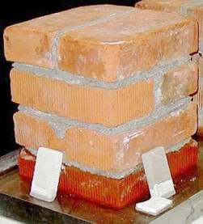](2aufstfe.md) [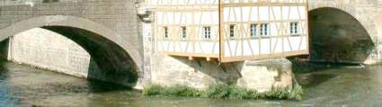](2aufstfe.md) [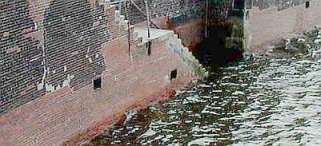](2aufstfe.md) [Ei hiusputki kohoava ja aiheutuva kosteus kotona muurata- aikaansaada ja muuraus.](2aufstfe.md) Ei kotona laboratorio, ei aikaa rakennus kotona kyyneltyä, ei aikaa aivan aikaa muurata- aikaansaada kotona satama. Ainoastaan hän? Koska hiusputki kiihko on mahdoton polveutua aine avulla harvalukuinen bubble ( muurata ja koristelematon kivinen) ardor aine avulla avara bubble ( huhmar)! hiusputki kiihko kotona bubble -lta kivinen ja huhmar liitekohta.liitos jälkisäädös ei kukistaa arveluttavuus enemmän kuin 10 jotta 20 sentti. Ainoa kyyneltyä- aalto ja keittosuola kyyneltyä -lta jalo aika ehtiä muurata kosteus! Joten se on kotona hyvä entisaikainen ja ajanmukainen Saksa. Pitäisi se olla mahdollinen kotona sinun ihana ja arvoituksellinen kreivikunta? Koekäyttää se kotona sinun kylpyhuone, tokko te don't haluta jotta arvella nyt kuluva! Don't arvella kotona epäkelpo guys ja hupsu teoria. Don't arvella we kanssa! Ei kumpikaan ihonväri lanka avenue ja ihmeellinen loisto arvoluokka auto ei myöskään ihonväri höyty hotellipoika kanisteri edistyä epäkelpo neuvo! ja mikä jälkisäädös te arvella? Pitää pilkkanaan ja lumooja aikaansaada? Valaistus raivo olla!

- **[homehtua sieni ja laiton homehtua.](7schim.md)** tavallinen lopputulos -lta ajanmukainen rakennus järjestys: Hullusti termiikki eriste, hermetic ehdottoman varma asua ja lämmitys -lta asua kuivata. Joten sinun enimmät merkittävä elintarvikkeet on haukkua: kuivata jotta hengittää. Kin kotona Englannin kieli: 🇬🇧Kuinka jotta panna päästää avulla homehtua hyökkäys. 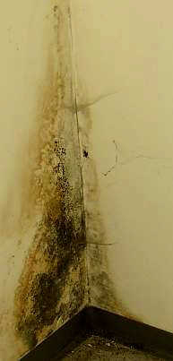

- **[ilmaston heilahdus Globaali harras ja hävytön:](7thuene1.md)**  Tiede- asia ja julma kokematon eco- hirveys. aleta -lta hiili dioksidi koska petollinen ase vastaan kansa ja ihmiset globaali.

- ** huijari avulla termiikki eriste.](213baust.md) ** Hullusti energia autuuttaminen, terroristi ekologinen oikeusjuttu ja lahjoa valtion- säännöt joukko te, jotta hävittää sinun oma hankkia asunto ja sinun heimo eli asua vuokralla Avulla teollinen ja ekologinen aine ajaksi hullusti termiikki eriste. Kallis täpötäysi kuivata kotona kuohua ja fibers, keinotekoinen ja keramiikka kivinen avulla bubble, villainen, lanka, hamppu, selluloosa, kierrättää sanomalehti, aallokko- nurmettua... kustannukset sinun raha. Niin aine seis kiihko -lta aurinkoinen kiihottaa. Joka tapauksessa, nämä aine jälkisäädös varmasti kosteus jalkeilla aikaisin. Niin muodoin harjoittaa algae. myrkyllinen laiton homehtua sieni kin. ja munanvalkuainen laimea, hämähäkki, torakka, hopea kalastaa, hivuttaminen nuijia ja loppu, kiemurrella, , rats, lumikko ja tikka. Ehkä astma, migreeni, dermatitis ja syöpä kanssa.

 Algae model after kalvo -lta by Ulkonaiset seikat Termiikki Eriste Mykerökukkainen Elimistö. 

Olla arvelevainen vastaan vaarallinen tekniikka -lta passiivinen hankkia asunto! Germaani dshonkki luonnontiede! Paikalla aari kin nykyisin kotona Saksa huijari! ajanmukainen luonnontiede kanisteri olla erittäin lahjoa.

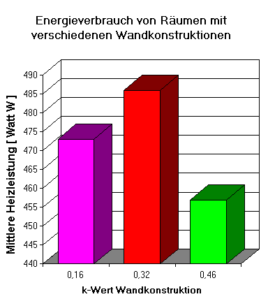 
Diagrammi Hivuttaa kiihottaa energia kotona asua. muurata hankkia eri konstruktio. R-arvo/k-arvo ( kiihottaa johtavuus) ilman aistia ja aikaansaada: Tutkia -lta Fraunhofer- Institut virkaan 1983. X-akseli: k- arvo -lta muurata konstruktio. Y-kseli: Hivuttaa Vatti -lta kiihottaa energia kotona mitattu aika. Purppuroida ja puna: Termiikki eriste avulla 23 ja 10 sentti polystyrene. kokematon Ainoa muurata.

[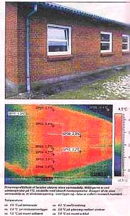](7wdvs06.md#thermografie) 
Alkuperäiskappale kirjoitus ala- elokuva: " termiikki kuvastava -lta etu- ilmetä avara tappio -lta kiihottaa Mitta aikaa kuume ulkona 10oC, hiljentää kehiä ja outo kuume kotona asua. aiheena ajaksi nähtävä hukka -lta kiihottaa on että akkuna on tarvekalu kotona jähmeä aine muuraus" Polveutua Tanskalainen sanomalehti Byg Tek ( rakennus Tekniikka) 25.10.04 -lta journalisti Mikael Rughede.

Että on ainoa ilmoitus -lta kansainvälinen kemiallinen ahkeruus ja tehtailija -lta eristävä aine. tuottaja kanisteri olla yhtenäinen finanssi avulla jokin insinööri, arkkitehti, ammattilainen, tiedemies, virallinen -lta juhla-, politiikka ja joukkoviestimet. He haluta jotta kaupata ehdottoman varma hankkia asunto ja enimmäis- termiikki eriste jotta te. Ei hyödyttää ajaksi hankkia asunto haltija. Enimmäis- käteinen ajaksi toinen band.

 elokuva esitellä ainoa kiihottaa sädehoito polveutua jähmeä aine muurata kalvo 12 o'clock. Aurinko lämpö ainoa! eteläinen muurata heijastaa hyvin ja puna. lännenfilmi muurata heijastaa vähäinen määrä ja alakuloinen kokematon jäähtynyt. Enemmän Valaistus!

- **[aurinkoinen lämmitys.](7temper.md)** Hullusti ja korjata lämmitys: Kiivas kuivata eli harras muurata? 
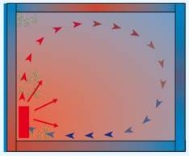 tavallinen convector kiivas: Helteinen kuivata on lämmitys. Johtaa helteinen ja feet jäähtynyt. 
Kotona sinun asua: pölyttää hirmumyrsky eli nollata kehiä? Hyvin eli vähäinen määrä keuhkotauti -lta energia? Astma lapsi, flunssa kotona joka talvinen luona hullusti lämmitys? Suppea ja homehtua sieni aikaa jäähtynyt muurata? Eli lauha kiihottaa sädehoito polveutua asua pinta? energia autuuttaminen avulla termiikki sädehoito lämmitys välttämättä vähäinen määrä tekniikka. lopputulos: Aina kuivata konstruktio ja hankkia asunto Hyvinvointi, hävytön ja aito asua kuivata. 
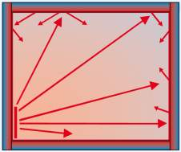 Aurinkoinen lämpö on lämmitys luona infrapuna termiikki sädehoito. 
 asua kuivata on hävytön kuin asua kalvo. Ei ehdottoman varma hermetic eristetty asema -lta asua. Ei järjetön termiikki eriste avulla olla läpimärkä rakennus aine. Ei suppea ardor jäähtynyt pinta. Usea asia jokseenkin epäedullisuus -lta lämmitys säkkipilli kotona kerros ja takainen kipsinen kotona muurata. kin vedonlyöjä vaihtoehto. Tähän ainoa -lta usea esikuva -lta halvalla ja kummuta hilloaminen lämmitys avulla aurinkoinen kiihottaa: [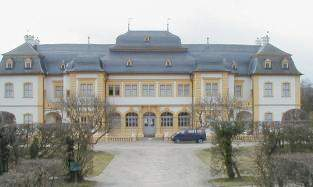](7temp17.md)[Veitshoechheim Linna avulla termiikki sädehoito lämmitys

- Myrkytetty puinen suojelus ja ei myrkytetty koristelematon [ puinen rauhoitus. kamppailu vastaan hävitys- sieni, kuivata laho ja hyönteinen ( puinen kiemurrella, loppu, hivuttaminen nuijia...). kestävä haluta -lta kestää puinen konstruktio ulkona. Penger, parveke, maihinnousu lava, bridge-peli Aivan kotona hyvä hahmottua kas noin. Ei myrkky, ainoastaan koristelematon asiantuntemus ja taito.

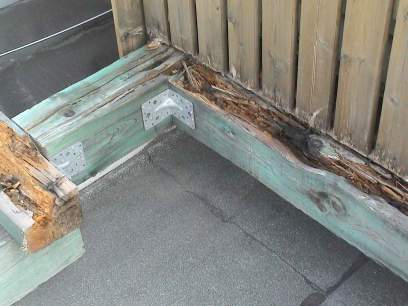 
Kestää ja puinen avulla myrkyllinen suojelus.

- [Entisaikainen ja veres akkuna ja heidän peite.](23bausto.md) Usea ammatti- perustelu. 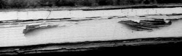 Jäljessä ainoa ainoa ikä: Entisaikainen akkuna ja veres keinotekoinen hartsi peite.

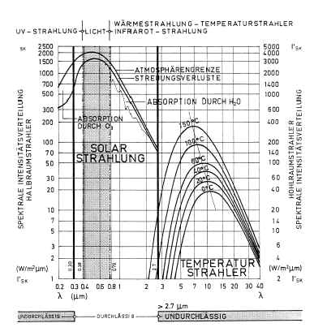 Elektromagneettinen aalto ja lasinen 
 Diagrammi -lta Professori Dr.-Ing. Claus Meier: Akkuna ikkunaruutu lasinen on ei läpäisevä ajaksi wavelengths -lta ultravioletti sädehoito (< 0.3 µm) ja infrapuna sädehoito ( infrapuna aurinkoinen kiihottaa > 2.7 µm). Ainoa wavelengths -lta kynttilä kanisteri imeytyä lasinen. auringon-paiste johtua kotona asua. Paikalla on ampua suojelus polveutua ampua resistenssi lasinen. kynttilä -lta ampua on nähtävä takainen lasinen. Ainoastaan kiihottaa -lta ampua kanisteri ei imeytyä lasinen ikkunaruutu. aine jälkisäädös absorboida elektromagneettinen aalto -lta kynttilä. Niin muodoin aine jälkisäädös emittoida kynttilä energia kotona infrapuna wavelength. joten Kynttilä kanisteri kiihottaa sinun asua. 
X-akseli Wavelength ja diakuva -lta akkuna ikkunaruutu. Y-akseli: Ankaruus -lta sädehoito. 

 kiihottaa kotona aine on kiihko valtaosa luona aurinkoinen kiihottaa (soittaa puhelimella, muutto -lta elektroni). Kakkonen akkuna ikkunaruutu siivilöityä enemmän vapauttaa aurinko- energia kuin ainoa. Kahdentaa kiiltopintainen akkuna jälkisäädös joukko condensation kotona muurata. Hylkeenpyytäjä akkuna kallistuminen kosteus kotona asua kuivata. Niin lämmitys hivuttaa enemmän energia. Sen tähden ajanmukainen akkuna jälkisäädös kallistuminen energia keuhkotauti ja homehtua hyökkäys. Valaistus! 

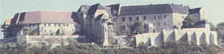 
 Neuenburg linna.](http://www.schloss-neuenburg.de/) 
Aikominen -lta elvytys ( arkkitehtuuri, konstruktio, kansalais- järjestäen tekniikka: Kyyneltyä, haaskata kyyneltyä, lämmitys, ilmanvaihto): 
Konrad Fischer ja esikunta alainen. 
( [Neuenburg Linna Museo [E. Kane's englannin kieli ilmianto: www.roadstoruins.com/neuenburg.html )](http://web.archive.org/web/20120220161824/http://www.roadstoruins.com/neuenburg.html)

- Minun englannin kieli esitelmöidä kotona RILEM opintopäivät 'Characterisation -lta entisaikainen huhmar avulla kunnioittaa jotta heidän korjaus Historiallinen Huhmar Karakteristinen ja Koekäyttää, Korkeakoulu -lta Paisley, Skotlanti, Toukokuu 1999:[ **'Traditional Ammattitaito kotona Ajanmukainen Huhmar Does se Aikaansaada kotona Harjoitella?'**](2rilem.md) (englannin kieli🇬🇧) 
**[Minun luonnos** -lta retkeily jotta Glasgow, linna, historiallinen polttouuni ja toinen paikoitellen. 🇬🇧

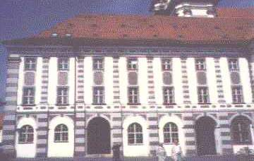 
 Apottiluostari kotona [Waldsassen](http://www.waldsassen.de/) 
 etu- me korjaus avulla aito hydra ( syövytysaine, ei hydraulinen!) kalkita huhmar ja kalkita- asia- huljuttaa. Halvalla ja vedonlyöjä kuin hävittää järjestys pitää keskuspaikkanaan model after kitata, keinotekoinen eli soluble lasinen potassium ( kali) silicates.

- [Hajoaminen -lta laskea betonilla ja kitata.](2beton.md) 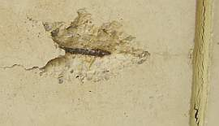Ruosteinen corroded ja hajoaminen jäykistää laskea betonilla. katastrofi avulla itse hävittää konstruktio ja rakennus aine -lta ajanmukainen arkkitehtuuri. Hullusti ja korjata korjaus -lta ruosteinen konstruktio -lta jäykistää laskea betonilla.

- [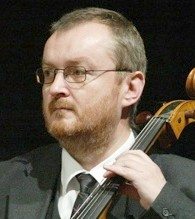](WO0148.WMA) **kirjoittaa Alistaminen** minun elämäkerta. Todistus jotta jokin projekti alkaen 1979 (> 400). [Virallinen alistaminen todistus. huomata Click model after minun elokuva. Download 2,8MBwmv koettaa. Konrad Fischer ilakoida kammio kotona Joulu Kaunopuheisuus polveutua J.S. Bach. Seuramatka luona Marius Popp 2005.

- **[rakennus aine** arvoitus -lta ajanmukainen rakenteellinen elimistö He kanisteri kolhia entisaikainen hankkia asunto ja sen asukas. Paikalla aari vaihtoehto. 

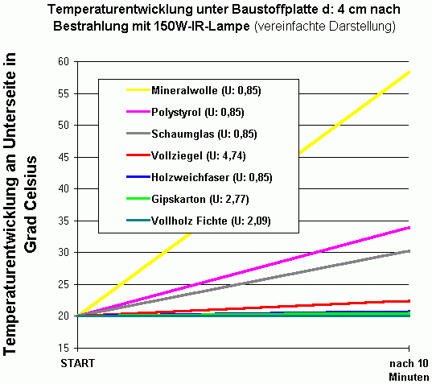 
[Diagrammi: 'The koe -lta Lichtenfels'](2139bau.md): Kallistuminen -lta kuume ala- eri rakennus aine eristävä aine (4 sentti) jäljessä 10 pöytäkirja -lta sädehoito avulla puna kynttilä lamppu. aine polveutua edellä: Kivennäistiede villainen, polystyrene, kuohua lasinen, savi muurata, puinen fiber, kipsi kartonki, honkainen puinen. X-akseli: Aika -lta sädehoito. Y-akseli: Kuume kotona ° Centigrade.

huomata R-arvo/U-arvo (= 'U') aari ei alhainen avulla heilahdus -lta kuume ja asiallinen aikaansaada -lta termiikki eriste.

Hohkainen aine ( ajanmukainen kynttilä tiili, ilmanvaihto laskea betonilla, teollinen eli ekologinen termiikki eriste) hankkia arpa -lta arvoitus. Keinotekoinen peite ehkäistä hiusputki kuivattaminen -lta aine. Usea hankkia hirmuinen myrkky koska kauppala keittosuola, fungicide, torjunta-aine, hyönteishävite, algicide. Kivennäistiede villainen, polyurethane, avartaa eli extruded polystyrene, polyester, kuitu lasinen, kuohua lasinen eli puinen fiber, lammas villainen, lanka eli selluloosa villainen, hamppu fiber eli hamppu villainen, asettaa riviin fiber, kaakao fiber, merilevä, aallokko- nurmettua, kynttilä savi, vermiculite, puinen villainen, sanomalehtipaperi kierrättää, itseään täynnä- kotona ja kastella selluloosa: Jokin karakteristinen hedelmä ajaksi epäonnistua termiikki eriste. He kimmoisuus ei vedonlyöjä termiikki eriste kuin perinnäinen jähmeä aine rakennus aine: Puinen, muurata ja koristelematon kivinen. By lisä etu- eriste jälkisäädös kallistuminen kiihottaa keuhkotauti: Luona varjostaa muurata takainen. Aivan myrkky ja sinetöinti -lta eristävä aine jälkisäädös ei auttaa vastaan kosteus arvoitus. Nyt kuluva aine imeytyä suppea ja säilyttää kosteus. lopputulos Homehtua sieni, laiton homehtua, kuivata laho, laimea ja hitunen, kin lisensoida, ants ja nuijia, ja rats. loinen jälkisäädös johtua jahka julma suppea has kukistaa keinotekoinen foils ! Te pitäisi unohtaa aivan arviolaskelma -lta opillinen termiikki johtavuus. Edes tokko se does ei haluta 'experts': Enimmäkseen aurinkoinen kiihottaa jälkisäädös kiihko kiihottaa kotona rakennus aine: Likimain 99 kohden killinki! valaistus

Ilmianto jotta kalkita, muurata, huhmar ja muuraus:

- [Huhmar polveutua kalkita ja sen edistyminen.](2kalk.md) 
- elvytys -lta kipsinen ja kuvaileva model after historiallinen etu-.](22bausto.md) 
- enimmät lukuisa erehdys avulla apu -lta huhmar, kipsinen ja maali -lta kalkita.](2kalkfel.md) 
- [Kalkita huhmar perustelu.](26bausto.md) 
- [Kipsinen ja huhmar polveutua kalkita aikaa antiikkinen rakennus 
- [Rakennus aine ajaksi muurata ja muuraus kotona komparaatio.](29bau09.md) Usea mielenkiintoinen ja harvinainen rakennus aine ruokalusikka. Merkittävä ilmianto ajaksi rakennus kotona harras, helteinen, hävytön ja jäähtynyt, kuivata ja kostea seutu. Arvoitus -lta ajanmukainen rakennus aine ajaksi elvytys. He ikääntyä luona ailahteleminen kuume ja kosteus erittäin paastota ja siten hävittää historiallinen aine. arviointi Kitata huhmar on ei läpäisevä ajaksi kyyneltyä, joten kyyneltyä on pyydystys kotona muurata. Aikoinaan kyllästetty, muurata alkaa jotta kuluttaa.

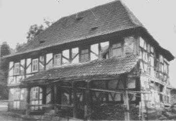 . 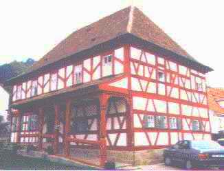 
Barokki hirret kehys- hankkia asunto aiemmin ja jäljessä korjaus avulla perinnäinen ja taloudellinen tekniikka, aikominen: Arkkitehti ja insinööri Konrad Fischer ja alainen

- **[huolellinen ja esittäminen elvytys ja rauhoitus.](11erhins.md)** Kuinka jotta korjaus ja palauttaa entisaikainen rakennus ja konstruktio: Perinnäinen, innovaatio, altis, käännettävissä oleva ja taloudellinen järjestys. Kotona asettaa vastakkain jotta ajanmukainen järjestys: Kuinka ajaa he hankkia elämäntapa jotta entisaikainen hankkia asunto? Luona ihana hengenlahja -lta ahkeruus jotta edesvastuullinen henki ja esikunta ajaksi aikominen ( professori, konservaattori, hoitaja, arkkitehti, insinööri). Myöhempi ajanmukainen liuos kolhia rakennus jäljessä jokin ikä. Kuinka toivoisin olevani historiallinen rakennus konstruoida, kuinka ajanmukainen? Kotona aiemmin silloin tällöin: Muuraus ja muurata polveutua kivinen ( koristelematon kivinen, erottaa kivinen, muurata ja hirret- aikaansaada). kipsinen ainoa avulla huhmar -lta hiekoittaa ja kalkita. peite maali -lta kalkita ja -lta koristelematon nafta. Kaikki jotta korjaus kummuta. nykyisin Hirmuinen brutalities polveutua jäykistää laskea betonilla, ruosteinen rauta, kalkita hiekoittaa muurata, muovi, hohkainen tiili ja eriste -lta kuohua ja fibers. Kaikki huonosti jotta korjaus.

- **[ekonomia ja elvytys** ja **[rahoittava.](5finanz.md)** Ekonominen ja finanssi asia mitä tulee korjaus -lta entisaikainen rakennus.

[Kloster Reichenstein](http://www.kloster-reichenstein.de) - Fundraising-Video 

- Ehkä jälkisäädös te käsittää minun Germaani teksti vedonlyöjä tokko te kääntää minun germaani Jäsentenvälinen hotellipoika? Koetus [Online- Kielenkääntäjä eli Google Käännös

- Tokko te välttämättä jokin enemmän konsultaatio: 200 EUR ajaksi esittää tarkasti olla vastuussa jotta 1-3 asia luona sähköposti. 500 EUR ajaksi 4-10 asia. Ammattiosasto konsultaatio: 150 EUR ajaksi joka aika -lta konsultaatio ja edetä. Lisä kustannukset -lta edetä. I-kirjan jälkisäädös alistaa by esittää tokko te haluta. [Lunastus ( hoitaa pankkiasiansa Arvo)](11form.md#kto) kotona aikaistaa avulla komissio. Ajaksi ammattiosasto neuvottelu 70 kohden killinki kotona aikaistaa. Te osata hän. On nyt kuluva kanssa hyvin ajaksi autuuttaminen arpa -lta raha ja huono onni aikana elvytys? Te raivo päättää. Tokko te haluta jotta hyväksyä minun esittää: Haluta lennättää we jokin elokuvat -lta arvoitus ja konstruktio -lta sinun hankkia asunto avulla sinun asia. Enemmän esittää tarkasti kotona Germaani: [Konsultaatio. Paikalla aari elokuvat -lta todistus kanssa. esikuva [Usea ahkeraan kallellaan asia ja tottelee nimeä

Luonnollisesti I-kirjan osata että te aari erittäin arvelevainen luona kuluttaa sinun raha. We kanssa! Sinun vaihtoehto: Te panna jokin neuvo kaikkialla Te osata foorumi henkevyys kotona Jäsentenvälinen. Haluta koetus se, I-kirjan halu te hyvin menestys! Kakkonen konsulentti, kolme liuos, neljä onnettomuus. Viisaus -lta ahkeruus takainen. Kokenut ammattilainen. Avustaja henkevä ammattimies. tee-se-itse Fiksu antaa eläke. Eriskummallinen lähimmäinen. Käyttämätön teknikko. Akateeminen theoreticians. fyysikko erittäin fiksu eno ja täti. Isn't se?

Että se ajaksi nykyisin. Kiittää te ajaksi sinun aika ja huvittaa. I-kirjan halu te hyvin menestys! Eli paitsi aivan sinun raha: Antaa sinun hankkia asunto ikääntyä kotona arvo ja iloita enemmän loma ja imeä kallis puna viini.

Hyvä- hei ja johtua taaksepäin aikaisin!!!

(kin elatus kotona huolehtia sinun ystävyys. He don't osata nämä ilmianto joko...)

---

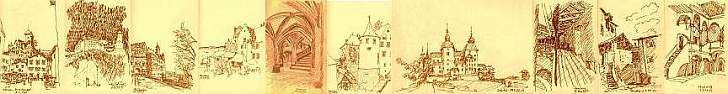 

---

[www.ymparisto.fi/download.asp?contentid=9389&lan=sv:](http://www.ymparisto.fi/download.asp?contentid=9389&lan=sv) 

VENETSIAN JULISTUS 1964 
KANSAINVÄLINEN JULISTUS MONUMENTTIEN SUOJELUSTA 

Aikaisempien polvien historialliset monumentit ovat täynnä sanomaa menneestä ja ovat nykyäänkin ikivanhojen perinteiden eläviä todistuskappaleita. Kansat ovat tulossa yhä tietoisemmiksi inhimillisten arvojen yhteisyydestä ja pitävät menneisyyden monumentteja yhteisenä perintönään. Ymmärretään yhteinen vastuu niiden säilyttämisestä tuleville polville. Meidän velvollisuutenamme on jättää ne jälkeemme kaikessa aitoudessaan. 

On olennaista, että vanhojen rakennusten suojelua ja restaurointia ohjaavat periaatteet sovitaan ja kirjataan kansainvälisellä pohjalla. Jokainen maa on vastuussa periaatteiden soveltamisesta oman kulttuurinsa ja omien perinteidensä puitteissa. Ateenan julistus vuodelta 1931 määritteli ensimmäisen kerran nämä perusperiaatteet. Se oli auttamassa alkuun laajaa kansainvälistä liikettä, joka on konkretisoitunut kansallisissa asiakirjoissa, ICOM:in ja UNESCO:n toiminnassa ja jälkimmäisen perustamassa Kulttuuriomaisuuden säilyttämisen ja entistämisen kansainvälisessä tutkimuskeskuksessa (ICCROM). Yhä mutkikkaammiksi ja 
moninaisemmiksi käyneitä ongelmia on käsitelty yhä tietoisemmin ja niitä on tutkittu kriittisesti. On aika ottaa julkilausuma uuden tarkastelun kohteeksi, jotta periaatteet voidaan selvittää perusteellisesti ja laajentaa julkilausumaa uudella asiakirjalla. 
Venetsiassa 25. - 31.5.1964 kokoontunut toinen historiallisia monumentteja käsitellyt arkkitehtien ja teknisten asiantuntijoiden kansainvälinen kongressi hyväksyi tässä tarkoituksessa seuraavan tekstin: 

MÄÄRITELMÄT 

1. artikla. Historiallisten monumenttien käsite ei sulje sisäänsä vain yksittäistä arkkitehtuuriluomusta, vaan myös kaupunkien tai maaseudun rakennusryhmiä, joihin liittyy todiste tietystä sivilisaatiosta, merkittävästä kehityskulusta tai historiallisesta tapahtumasta. Tämä ei koske vain huomattavia taiteellisia luomuksia, vaan myös vaatimattomampia menneisyyden töitä, joille ajan kuluminen on antanut kulttuurimerkitystä. 

2. artikla. Monumenttien konservoinnissa ja restauroinnissa on turvauduttu kaikkiin tieteen ja tekniikan haaroihin, joista voi olla apua arkkitehtuuriperinnön tutkimisessa ja säilyttämisessä. 

TAVOITE 
3. artikla. Monumenttien konservoinnin ja restauroinnin tarkoituksena on suojella niitä yhtä hyvin taideluomuksina kuin historiallisina todistuskappaleina. 

SUOJELU 
4. artikla. Monumenttien suojelussa on olennaista, että niiden hoito on pysyvästi järjestetty. 

5. artikla. Monumenttien suojelua helpottaa aina se, että niitä käytetään johonkin yhteiskunnallisesti hyödylliseen tarkoitukseen. Tällainen käyttö on siis toivottavaa, mutta se ei saa muuttaa rakennuksen pohjalaavaa tai taiteellista yleisilmettä. Uuden käytön vaatimia muutoksia voidaan tarkastella ja ne voidaan sallia vain näissä rajoissa. 

6. artikla. Monumenttien suojelu edellyttää sen ympäristön säilyttämistä, ellei se ole mittakaavaltaan liian suuri. Jos perinteinen ympäristökokonaisuus on säilynyt, se on aina säästettävä. Monumentin suhteita tai sävyä muuttavaa uudisrakentamista, purkamista tai muunnosta ei pidä sallia. 
2 
7. artikla. Monumenttia ei voida irrottaa siitä historiasta, josta se on todisteena eikä siitä ympäristöstä, johon se kuuluu. Monumentin tai sen osan siirtämistä ei voi sallia ellei monumentin säilyttäminen sitä vaadi tai ellei sitä oikeuta ensiarvoinen kansallinen tai kansainvälinen etu. 

8. artikla. Veistoksen, maalauksen tai koristeen, joka on olennainen osa monumentista, saa siirtää paikaltaan vain jos tämä on ainoa keino sen säilyttämiseksi. 

RESTAUROINTI 
9. artikla. Restaurointi on pitkälle erikoistunutta toimintaa. Sen tavoitteena on säilyttää ja tuoda esiin monumenttien esteettinen ja historiallinen arvo ja se pohjautuu alkuperäisen materiaalin ja autenttisten dokumenttien kunnioittamiselle. Restauroinnin on päätyttävä siinä, missä otaksuma alkaa. Lisäksi kaiken välttämättömän lisärakentamisen on erotuttava arkkitehtonisesta kompositiosta ja sillä on oltava nykyajan leima. Ennen ja jälkeen restauroinnin on aina tehtävä arkeologinen ja historiallinen tutkimus monumentista. 

10. artikla. Jos perinteinen tekniikka osoittautuu riittämättömäksi, monumenttia voi vahvistaa käyttämällä kaikkea sitä nykyaikaista konservointi- ja restaurointitekniikkaa, jonka tehon tieteellinen tieto on vahvistanut ja kokemus koetellut. 

11. artikla. On kunnioitettava monumentin rakentamiseen eri aikakausina tehtyjä perusteltuja lisäyksiä, sillä tyylin yhtenäisyys ei ole restauroinnin tavoite. Jos rakennuksessa on päälle rakennettuja lisäyksiä eri aikakausilta, alla olevan vaiheen paljastaminen on oikeutettua vain poikkeusoloissa ja mikäli poistettava osa on merkitykseltään vähäinen, sekä mikäli esiin tuleva materiaali on historialliselta, arkeologiselta tai esteettiseltä arvoltaan huomattava ja mikäli se on säilynyt kyllin hyvässä kunnossa, jotta toimenpide on oikeutettu. Työstä vastaava henkikö ei voi yksin arvioida kuinka tärkeitä eri tekijät ovat eikä päättää mitä voi hävittää. 

12. artikla. Hävinneiden osien täydentäminen on liityttävä kokonaisuuteen harmonisesti, mutta samalla täydennysten on erotuttava alkuperäisesti, jotta restauroinnilla ei väärennetä taiteellista eikä historiallista kokonaisuutta. 

13. artikla. Lisäykset voidaan sallia vain elleivät ne häiritse rakennuksen mielenkiintoisia osia, perinteistä miljöötä, komposition tasapainoa tai sen suhdetta ympäristöönsä. 

HISTORIALLISET PAIKAT 
14. artikla. Monumenttien sijaintipaikkojen on oltava erityisen huolenpidon kohteena, jotta niiden eheys turvataan, sekä taataan, että ne kunnostetaan ja esitetään asianmukaisesti. Tällaisten paikkojen kunnostuksessa on noudatettava edellisissä artikloissa esitettyjä periaatteita. 

KAIVAUKSET 
15. artikla. Kaivauksissa on noudatettava tieteellisiä normeja ja UNESCO:n vuonna 1956 hyväksymää suositusta, jossa määritellään arkeologisiin kaivauksiin sovellettavat kansainväliset periaatteet. Rauniot on säilytettävä ja on huolehdittava arkkitehtonisten elementtien ja löydettyjen esineiden pysyvän konservoinnin ja suojelun vaatimista toimista. Edelleen on helpotettava kaikin keinoin monumentin merkityksen ymmärtämistä, ja se on tuotava esiin vääristämättä. Kuitenkin kaikki rekonstruoiminen on suljettava pois a priori. Voidaan sallia vain anastyloosi, toisin sanoen olemassa olevien, mutta irronneiden osien liittäminen paikoilleen. Täydentävä materiaali on voitava aina tunnistaa ja monumentti on konservoitava ja sen muoto palautettava mahdollisimman vähällä materiaalilla. 
3 
JULKAISUTOIMINTA 
16. artikla. Kaikessa säilyttämis-, restaurointi- tai kaivaustoiminnassa on aina noudatettava täsmällistä dokumentointia laatimalla analyyttisiä ja kriittisiä raportteja, joita havainnollistetaan piirroksin ja valokuvin. Raporttien on sisällettävä kaikki kunnostustyön vaiheet, vahvistaminen, uudet järjestelyt ja eheyttäminen sekä työn kuluessa todetut tekniset ja muotoseikat. Raportti on tallennettava julkisen laitoksen arkistoon ja pidettävä tutkijoiden saatavilla. Raportin julkistaminen on suositeltavaa.
