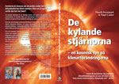
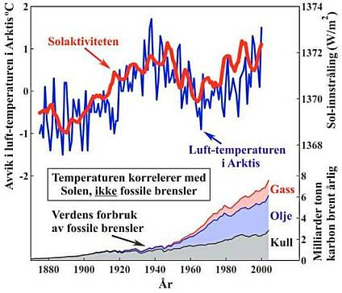
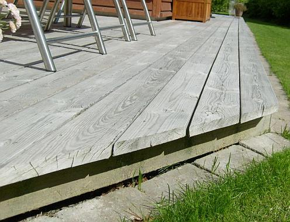
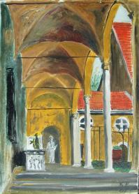
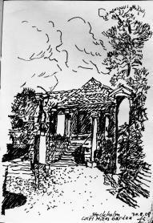

[🠔 Zur Übersicht: Nordisk](nordisk.md)  
# Restaurering av gamla hus + Beskydd av historiska monument 🇸🇪 🇫🇮
**Rådgivning, tips och tricks för vård av gamla byggnader – Vanliga fel och vad som faktiskt fungerar.**  
_von Konrad Fischer_

 Restaurering av gamla hus + 
Beskydd av historiska monument 🇸🇪 🇫🇮 

Arkitektur + Bygg Magasin för konservering, renovering, återställning och reparering 

 **Rådgivning, tips och tricks 
för vård av gamla byggnader 

Vanliga fel + vad fungerar egentligen?** 

[ Dipl.-Ing. Konrad Fischer](1refernz.md), Arkitekt och Ingenjör 
[Hauptstrasse 50](muehle.jpg), 96272 [Hochstadt a. Main](http://www.hochstadt-main.de/), Tyskland 
Tel.: +49-*9574/3011 / mobil +49-*170/7351557, Fax: +49-*9574/4960, [e-post](2berat.md#email) 
[Förfrågan](2berat.md) på: 
Tyska, engelska, svenska, norska, danska. Skriftligt svar på tyska eller engelska, muntlig (telefon) också (nästan) svenska ;-) 

[ Författare på televisionen: Kollapsade tak och hallarna - CLIPwmv 3MB](mtvclip1.wmv) +++ [Skadade tak: En skandalös krönika](212bau2.md) (Tysk) 
[Den bio-ekologiska byggnaden: En ironisk kritik](oekobau.md) (Tysk) +++ [Eco-Energibesparing i gamla byggnader: Är det överhuvud möjligt?](energie.md) (Tysk) +++ [Återställande av hus med restaureringsbehov: Hur man säkert gör fel.](altbau.md) (Tysk) 

Har du restaurerat ditt gamla hus? Vad hände? Dina tappra ansträngningar med renovering, rekonstruktion, rehabilitering eller moderniseringen misslyckades? Har du förlorat både dina pengar och ditt hopp? 

Isolerade du ditt gamla hus med termisk isolering? Ditt hus tillslöts hermetiskt och är nu lufttätt? Finns det nu mögel eller svamp på väggarna, i innertaket och i takkonstruktionen? Har allt förgiftats med insekticid, fungicid, algicid, bekämpningsmedel, mjukgörare, vätska och flamskyddsmedel? Från taket droppar vatten och det växer äkta hussvamp / rötsvamp? Dina barn lider av allergier eller eksem (dermatit)? Alla hostar och har astma? Står du till slut där med tårfyllda blå ögon och tumme?

Trodde du dig för alltid ha funnit den perfekte och sakkunnige experten i din närhet och en sagolik rådgivare i ett internetforum? Hade du hittat de bästa och billigaste erbjudandena på marknaden? Fick din arkitekt dina pengar? Men den verkliga planeringen gjordes av hans industriella vänner? Detta är inte sällsynt. Detta sker vid restaurering och räddning av kulturarv också. Har du insett det? Jag gratulerar! 

Men: Kanske kan ditt arbete lyckas bättre, ditt hus blir sundare och bygget även bli billigare? Vill du veta hur?

Av: ["Värme i sekelskiftes tegelhus?"](http://www.byggahus.se/forum/byggnadsvard/99422-vaerme-i-sekelskiftes-tegelhus.html) Byggahus.se Forum, 18.08.2008 
kaffe_med_dopp: _"Den här snubben har intressanta teorier angående stenhus och isolering. Helt klart läsvärt, men räkna med att allt ni lärt er hittills ställs på ända. Han har renoverat flera slott och gamla byggnader i Tyskland så det är ingen knäppgök.[http://www.konrad-fischer-info.de/](index.md)"_ 

Hejsan - du är välkommen hit! Tack så mycket för ditt besök. Denna websajt görs just för dig. Kanske är det inte för sent? Här ska du finna oberoende, kritisk och kontroversiell information angående ditt hus. Ämnen: Reparation av gamla byggnader och återställande, konservering och bevaring av historiska byggnader och minnesmärken. Mestadels på tyska. Några sidor är på andra språk ([Engelska](english.md), [Ryska](rossija.md), [Spanska](espana.md), ... [se på flaggor](index.md)). Så blir denna sajt på ditt språk. Jag tackar Ulf och Agnes Eskilsson, Ulricehamn, för hjälp med översätning. ([Här är den engelska versionen om du vill jämföra).](english2.md)

Men varför text på ditt eget språk? Därför att gamla hus, äldre bebyggelse eller byggnader och historiska minnesmärken, monument och kulturarv måste återställas även i ditt land. Vi har samma frågor beträffande tekniska och ekonomiska problem. Vi drabbas också av samma byggfel med samma katastrofala konsekvenser för historiska byggnader. Den internationella byggbranschen och dina experter sover inte! Detta kostar pengar - dina pengar. Vill du se några exempel? Klicka på bilderna för ytterligare information:

[(1)](29bausto.md) \+ [(2)](29bausto.md) \+ [(3)](22bau4.md) \+ [(4)](22bau2.md) \+ [(5)](7mold.md) \+ [(6a)](2auffen.md) \+ [(6b)](2auffen.md) \+ [(7)](213baust.md) \+ [(8)](7wsvoant.md) \+ [(9)](7poly.md) \+ [(10)](6brand.md) \+ [(11)](29bau09.md) \+ [(12)](29bausto.md) \+ [(13)](29bau02.md) \+ [(14)](22bausto.md) \+ [(15)](23bausto.md) \+ [(16)](23bau08.md) \+ [(17)](23bausto.md)

**Förklaring av ovanstående bilder:** (1), (2), (3), (4): [Ytan på materialet är förstört och det har bildats en skorpa på grund av felaktig fixering. Detta är ett typiskt resultat vid tättande och förstärkande ytbehandling med potassiumsilikat / vattenglas](22bausto.md); (5) [Mögelsvamp (Svart mögel / Svartmögel / fungus) i badrum](7schim.md); (6a) [Ingen kapillärt stigande fukt och kapillärsugning / stigande kapillärfukt i tegelmur i ett vattenfyllt metallkar / bad!](2aufstfe.md) (6b) [Salt blomstrar ut ur väggen efter en horisontal försegling med saltaktig och förgiftade injektion som fuktspärr i borrat hål / borrhål / borrhålsinjektion](2aufstfe.md); (7) [Tillväxt av alger på ytan av kompositsystem för termisk isolering](213baust.md), från: [B+B, tidskrift för byggnadsunderhåll och omsorg av monument](http://www.bautenschutz-bausanierung.de), januari 2002, fotograf: Universitet Wismar; (8) [Blöt termisk isolering i trädgården](7wsvoant.md), från: Bygghantverk och rekonstruktion av byggnader 2/01, fotograf: H. Paetzold; (9) [Våt / blöt termisk isolering utanför och svart mögel / mögelsvamp på insidan](7poly.md); (10) [Exploderad och bränd termisk isolering](6brand.md), från: Aktuella brandskadorna, bayerskt avfyrar försäkring München; (11) [Cement mortel / cementbruk / murbruk, tegelmur och frost](29bau09.md); (12) [Cementbruk och natursten](29bausto.md); (13) [Kalk / Kalksinter / Ca(OH)2 / Calciumdihydroxid från cementbruk blomstrar på ny fasad](29bau02.md); (14) [Syntetfärgskadar / syntetmaterialskada på en historisk fasad](22bau2.md); (15) [Konstharts färg / syntetisk hartsfärg på ett fönster](23bau08.md); (16) [Syntetisk färg målad på ett staket](23bau08.md); (17) [Fönster och teknologi i dag ...](23bausto.md)

Konrad Fischer: Fassaden energetisch richtig und kostensparend sanieren und trockenlegen 1 

[Teil 2](http://www.youtube.com/watch?v=Y1NSxAW15Cc) [Teil 3](http://www.youtube.com/watch?v=RAT7VzBo8k0) [Teil 4](http://www.youtube.com/watch?v=6TBII25iVQk) [Teil 5](http://www.youtube.com/watch?v=Kb0C4KiZvVA) 

Är denna information egentligen kontroversiell och ovanlig? Men informationen överensstämmar med gammal byggnadstradition och hantverksskicklighet. Många års erfarenhet av restaureringsarbete är basen: Historiska monument och gamla byggnader från lantbrukarhem till slott, mangårdsbyggnader, borgarhus, herrgårdar och ecklesiastiska byggnader som kyrkor och kloster. Min far var också arkitekt och bedrev detta skyddsarbete från 1958 fram till hans död 1979, då jag tog över arbetet. Jag kunde lära mig mycket av honom. Efter mina studier praktiserade jag under två år som vetenskaplig volontär vid ämbetet för vård av monument / antikvarieämbet / Bayerisches Landesamt für Denkmalpflege i München.

De främsta specialisterna i branschen, de berömda experterna från hemslöjden, de väldigt trovärdiga ingenjörerna, de alltid svartklädda arkitekterna samt din granne och dina så vänliga vänner är oftast av en helt annan åsikt eller mening. Kanske ger de också bättre råd? Men du måste själv avgöra, huruvida min information är meningsfull och användbar för dig. Då kan även du ta följe med de kloka experterna på den breda “framgångsgatan“ (som annars endast är för experter?).

 

Kanske hittar du inte svaren på dina frågor just här. Alternativ: Det finns över 1.500 sidor på tyska: Återställande, bevarande, beskydd, teknisk och historisk utredning och granskning av byggnader. Byggnadsmaterial för gamla hus: Tegelsten, kalk, murbruk, tegelmur, fackverk - korsvirke, betong och måleri från syntetmaterial och potassiumsilikat / silikatfärg mm. Återställande, befästning och förstärkning av sandiga och anfrätta naturstenar. Problem med återställandet och förnyandet av byggnader och deras delar, ända från grunden till takläggningen. Ekonomi och finansiering. [Bedrägeri och korruption inom branschen och planer inom restaurering av byggnader](4behoerd.md).

Till sist men inte minst: Den klimatiska förändringen / omväxlingen / global uppvärmningen / klimatförändringarna - gjort av människor / med mänsklig inblandning eller bara naturligt - vad är riktig? Här kan du hitta flera ansikter, meningarna och kanske svaret:

- Önskar du att köpa en tysk borg, slott, palats eller herrgård? Exempel: [Slott / borg / herrgården / herresäten till salu](8schloss.md)

- **[Uppstigande fuktighet / markfukt - och kapillärsugende fukt.](2aufstfe.md)** Vad fungerar inte mot fukt och blött, fuktig och våt murverk när det rör sig om väggar med vulkanisk, sedimentär eller metamorfisk natursten (granit, kalksten, sandsten mm.) och tegel. Fel som görs vid kampen mot fukt och saltangrepp i källare och i fundament, på puts och i fogar av murverk. Ineffektiva, destruktiva och dyra uttorkningsmetoder: Horisontal isolering vid injektion i drillad / borrat hål, med metallplåt / bleckplåt i sågade murverksfogar, vattentät bruk och färger med syntetisk harts eller mycket sällsamt elektronisk torkningsförsök vid electro-osmos. Metoder som inte fungerar och gör allt värre: Den största affären för svindlarna inte enbart i Tyskland. Också på engelskt språk: 🇬🇧 [Rising damp does not exist](2auffen.md)

[. . Ingen kapillär stigande fukt i tegelmurblock och tegelmurverk.](2aufstfe.md) Inte i laboratorium, inte på byggnaden i vatten, inte alls på murverk i hamnen. Men varför? Därför att den kapillära transporten av vatten är omöjlig från material med små porer (tegelsten och naturligt sten) in i material med stora porer (fogbruk)! Den kapillära transporten i porerna hos sten och brukfogar kan inte vinna mot gravitationen i mer än 10 till 20 cm. Bara vattenvågor och det salthaltiga vattnet i floder gör väggarna blöta! Så är det både i det gamla och i det moderna Tyskland. Bör det vara möjligt i ditt härliga och mystiska land också? Testa det i ditt badrum om du inte tror mig! Tro inte på skurkar och dumbommars teorier. Tro heller inte på mig! Vare sig en sidenslips med stilig kulör, en underbar lyxbil eller en färgsprakande websajt kan förbättra dålig rådgivning! Och vad ska du tro på? Bländverk och häxverk? Upplysningen måste vara!

- **[Mögel, röta, svamp och svart mögel /Svartmögel.](7schim.md)** Aspergillus nidulans och Aspergillus niger, Aspergillus versicolor, Aspergillus fumigatus, Aspergillus flavus, Penicillium chrysogenum, Penicillium expansum, Penicillium verrucosum, Penicillium viridicatum, Fusarium, Stachybotrys chartarum (atra), Acremonium, Alternaria, Aureobasidium, Basidiospores, Basidiomycetes, Poria incrassata, Botrytis, Chaetomium, Cladosporium, Trichoderma, Ulocladium - det vanliga resultatet av de moderna byggnadsmetoderna: Felaktig termisk isolering, hermetiskt lufttäta rum och uppvärmning / upphetsning av luften i rummen. Så missbrukas din viktigaste källa till liv / mat: Luften du andas. Också på engelska: 🇬🇧How to get rid of mold attack](7mold.md). 

- **[Klimatisk förändring / Klimatförändring - global uppvarmning och förkylning:](7thuene1.md)**  Vetenskapliga fakta och  grym grön eco-skräck av de professionella klimathysterikerna och deras konstiga miljöhysteri. Minskningen av koldioxid som ett hemsk vapen mot nationer och folk över hela världen. Sluta Kidioto-protokollen / Kyoto-...!

**NYHET** : Henrik Svensmark & Nigel Calder: **[De kylande stjärnorna – en kosmisk syn på klimatförändringarna](http://www.anarchos.se/e-postutskick/customer_web_0802.html)** 
Originaltitel: The Chilling Stars – A Cosmic View of Climate Change 
Faktagranskning: Henrik Lundstedt, docent i solär-terrester fysik, Institutet för rymdfysik i Lund 
Förlag: [Anarchos förlag](http://www.anarchos.se/) 
ISBN: 978-91-977059-1-2 
Utgivningsdatum: 2008-03-05, Bandtyp: Häftad, Sidantal: 265 

Klimatisk Skydds Extra: Ett brev från Sverige: 

CO2 I VÅRSOLENS GLANS 
(En viktig, kanske avgörande underrättelse) 

Bäste brevmottagare! 

Det finns ju nästan ingen i vår CO2-upplysta värld, som inte hört talas om växthusgasen koldioxid - med kemiska formeln CO2 - bestående av 1 kolatom C och 2 syreatomer O, som i samverkan med solen skapar och reglerar en global växthuseffekt med just sådant lagom varmt klimat, som gör det möjligt att liv kan finnas på vår jord. Annars skulle det vara 30 grader kallare. Men knappast någon funderar över vad experterna i detta sammanhang faktiskt säger outtalat just nu: 

"Nu, när den efterlängtade vårsolens starka strålar åter värmer upp vår jord, vid klar och torr väderlek, känns det, skall Ni veta , även riktigt skönt och ljummet varmt ute nattetid, när inga moln och knappast någon vattenånga är i vägen för den från ovan behagligt värmande växthuseffektiva, infraröda återstrålningen från CO2". 

Helst skulle jag därför en sådan kristallklar vårnatt vilja sitta högst upp på toppen av världens högsta berg, för att kunna vara närmare den sköna värmekällan och tacksamt meditera över den gudomliga så milt från ovan strålande CO2-armaturen. Det är ju just därifrån det livgivande klimatet kommer och styrs ner mot jorden. Vilket i första hand vår Holocaust-Atom-Industri, HAI, med sina allt fler, allt säkrare och helt rena helvetesmaskiner har blivit så beroende av för sin frodiga överlevnad, och för att i sin tur kunna reglera CO2:s överflöd och tämja dess övermod, det vill säga jordens, genom CO2 annars helt katastrofala värmeökning. Inte att undra på varför kärnkraftverken är så fanatiskt älskade av Sveriges radikala Moderater. 

Så är det faktiskt! - För just så har det räknats ut klimatologiskt och dik-dator-riskt, en gång för alla åt alla, och därför blivit "uppenbart för alla", och bekräftat av världens "alla tillförlitliga" politiker, från Arnold Schwårzenegger över Al Gore till Maud Olofsson och miljöminister Andreas Carlgren, vilket förpliktar alla att agera, inklusive Greenpeace och De Gröna, utan insikt om, respektive att tala om, att allt detta med den hemska växthuseffekten är HAI:s största hyckleri och seger, för att få finnas till. Helst borde väl faktiskt - åtminstone inom EU:s expanderande maktstruktur - envar (och det är ganska många, som inte får komma till tals!), straffas med böter och med fängelse, som vågar ifrågasätta växthuseffektens officiella kännedom och sprida lögner med sitt påstående att det är de vårliga kalla nattfrostnätterna vi måste räkna med vid vårlig, varm och solig väderlek, därför att CO2-värmearmaturen sätts vid sådant högtryckväder ur funktion. 

+++++++++++++++++++++++++++++++++++ 
Matar man klimatmodeller med CO2-faktorer, som motsvarar ens önskade eller inbillade resultat, blir också klimatmodellernas utsagor därefter. 

På denna redogörelse svarade dipl. meteorologen dr. Wolfgang Thüne: 

Lieber Herr Hölbling 
Sie haben die Aussagen der "Klimaexperten" richtig interpretiert. 
Hinauf auf die Berge, um sich dort nachts von der Gegenstrahlung erwärmen zu können. Eine gute Idee!!! ... (Ni har tolkat "klimatexperternas" utsagor rätt. Upp till fjälls, för att där uppe kunna värma sig nattetid vid återstrålningen (från CO2). En bra idé!!! . 
Viele Grüße und frohe Ostern 
Ihr Wolfgang Thüne 

Den som äger eller ägde ett litet fristående kallväxthus, utan konstgjord värme, vill kanske fundera över de gjorda dubbelväxthuseffekt-erfarenheter vid klara nätter med detta växthus inom det stora CO2-varma globalväxthuset. 

Även med helt meningslösa försök att stoppa CO2 ner i jorden kan någon berika sig, fast det kostar energi och skattepengar. 

Utan stängning av kärnkraftverk finns ingen säkerhetskultur och ingen hänsyn till kommande generationer! 
ATOMKRAFT = DÖDSKRAFT 

Ur en intervju med Wolfgang Thüne: 
Hur kommer det sig, att Ni med er ståndpunkt hör till minoriteten inom vetenskap? 

W.Th.: 
Jag tror inte alls att jag tillhör minoriteten. Men jag representerar snarare den tigande majoriteten, där tillgången till medierna försvåras och därför inte observeras offentligt. ... När De Gröna betecknar atmosfärens CO2-halt som miljöskadlig, visar de med detta att de inte heller äger den minsta kunskapen om biologin. ... 

Nu följer några utdrag ur ["KLIMAWANDEL UND KLIMASCHWINDEL"](7klima.md) av Maria Ackermann översatt till svenska - och slutligen längst ner en längre bilaga på engelska: 180 YEARS OF ATMOSPHERIC CO2 GAS ANALYSIS BY CHEMICAL METHODS plus en sammanfattning (bilaga) av detta på tyska. 

Men dessförinnan en påminnelse och förfråga: Några av Er har förra året underrättats om, att ett möte med Dr.Thüne är planerat i liten skala, kanske i Växjö. Vem av Er önskar att ett sådant möte kommer till stånd och vem vill i så fall vara med? - V.v låt höra av Dig till undertecknad. 

Harald hälsar. 

Klimatwandel och Klimatswindel: 

2.1. Betraktelser till fenomenet drivhuseffekt 

.. En del av infrarödstrålningen som kastas tillbaka från jorden försvinner i världsrymden. Men en stor del fångas upp av växthusgaserna. Även från det isolerande växthusskiktet når värme ut till rymden. Fast den största delen strålar växthusskiktet tillbaka till jordytan, vilket bidrar till troposfärens uppvärmning. 

Med drivhusgaser förstår man för övrigt gaser som avges till miljön vid förbränning av fossila ämnen som kol och olja. De absorberar solenergin, som reflekteras från jorden i form av infraröda strålar, och värmer upp atmosfären. 

Man känner till 6 viktiga "växthusgaser": 

Koldioxid CO2 
Dikvävemonoxid N2O 
Metan CH4 
Fluorchlorkohlenwasserstoffe FCKW (Halogenerade 
fluorklorkolväteföreningar) 
Ozon O3 
Vattenånga H2O 

2.1.1.Vilka associationer tvingas fram av ordet "Växthuseffekt"? 

Jag föreställer mig jorden inom ett glashölje, som endast släpper in solens hetta och nästan ingenting ut av värmen. Eftersom denna "glaskupol" huvudsakligen, som det sägs, förorsakas av CO2, borde det så att säga vara ett CO2-hölje, som reflekterar värmestrålningen åter till jorden. Men någonting stämmer inte här. CO2 är tyngre än luften och stannar vid marken. Särskild förnimbart var detta vid följande händelse: 

I Kamerun dog 1986 under en natt 1700 människor på grund av CO2-förgiftning. Länge visste man inte varifrån den dödande gasen kom. Den kom från den närbelägna Lake Nyos - en dödlig killersjö. Vulkanen under sjön matade under många årtionden giftig CO2-gas in i vattnet. Gasen samlades på 200 meters djup och frigjordes plötsligen explosionsartat. I denna ödesdigra natt 1986 kom det till en kedjereaktion. En del av kraterns kant hade brutits loss och störtade ner i djupet och virvlade upp den högkoncentrade kolsyran på sjöbottnen. Tryckavlastningen ledde omedelbart till avgasningen av den i vattnet lösta kolsyran. Över en miljon kubikmeter koldioxid frigjordes inom några sekunder och detta åstadkom upp till 25 meter höga flodvågor. Den luktfria gasen skvalpade över kraterkanterna, och eftersom den är tyngre än luft, kröp den ner för sluttningarna och lade sig tyst som en osynlig matta över de kringliggande fälten och byarna.Djur och människor kvävdes därmed under sömnen. 

Alltså ser vi, att ett CO2-hölje, som reflekterar värmestrålningen tillbaka till jorden icke kan finnas till på detta sätt ... Man har konstaterat att en tredje del av CO2-emissionen genom människan beror på trafiken. Det vill säga att 0,001 % av "växthuseffekten" förorsakas av trafiken. Hur kan man mäta sådant och hur mycket inverkan kan 0,001 % överhuvudtaget ha? ... 

+++++++++++++++++++++++++++++++++++++++++++ 

Det långa tyska originalet finns här ["Klimawandel und Klimaschwindel"](7klima.md) 

Et annat brev från en god vän som är en normal svenska invånare den är skeptisk mot klimtisk dumheter. Brevet hade varit publicerad i "Sydsvenskan" i Juli 2007: 

"Klimatracet 

Är vi på väg mot vår undergång? Det verkar så. Flera tusen forskare har förklarat att det är människans fel, vi är orsak till växthuseffekten och det är enbart denna effekt som är skulden till den uppvärmning som vi nu har och som vi kommer att få i framtiden om vi inte omedelbart ändrar vår livsstil. Knappast ett ord om en naturlig uppvärmning som väl har förekommit i historisk tid. Jag fick lära mig i skolan på 30-talet att vi gick mot en varmare period och att isarna smälte bort, så det kan ju inte vara något nytt. 

Även om det nu skulle vara riktigt, som så många forskare tycks har kommit fram till, att vi är de stora skurkarna så har jag ändå svårt att tro att vi ensamma har förmågan att värma upp jorden. Vi bör betänka att vi trots allt inte är fler på jorden än att vi samtliga människor skulle få plats på ön Gotland om vi stod ett par på varje kvadratmeter. 

Jag har inte blivit övertygad om, mer än i allmänna ordalag, hur vi skall lyckas med att begränsa våra utsläpp och vår energianvändning. Hur skall det gå till? Sol ,vind, biobränsle och etanol är några förslag till ersättning för olja, kol och naturgas. Det verkar inte övertygande just nu så länge man inte kan precisera hur mycket de kan bidra med utan att de skadar miljön. Kärnkraft är inte med som tänkbar energikälla den skall ju helst avvecklas. Vattenkraften får inte byggas ut så även den vägen är det stopp. 
Kan vi minska vår energiförbrukning? Vi har inte lyckats hittills trots många skriverier om det, tvärtom har energiförbrukningen bara ökat. Med andra ord; vi verkar vara långt från att slippa skurktiteln. 

Min önskan är: "Sluta med domedagsprofetiorna och ge os en nyanserad bild av vår värld." 

Till slut skulle jag gärna vilja veta om en uppvärmning är helt av ondo, finns det inget positivt i att vi får det varmare någon gång i framtiden? 

Bertil Skarin 
Oroad lekman 
Löddeköpinge" 

---

Sataniskt Kidioto-sytemet vil suga och pressa ut pengar från de som inte har några över - från dig och mig: Här kommer ytterliggare en klimatidioti från politiska miljö-terrorister: 

Fullständiga källan finns här: [Sydsvenskan 5 oktober 2007:](http://sydsvenskan.se/opinion/aktuellafragor/article270714.ece) 

_**"Inför ett klimatbistånd"** 

Afrika, Asien och Latinamerika _[KF: Varför inte Mars, Venus, Tyskland, Danmark, Norge?]_betalar ett högt pris för de klimatförändringar som framför allt skapats av den rika världen_[KF: So grov ska man egentligen inte ljuga!]_. Därför bör biståndet utökas med ett klimatbistånd, skriver_[KF: eco-terrorister]_Wiwi-Anne Johansson (v), ledamot av miljö- och jordbruksutskottet, och Hans Linde (v), ledamot av utrikesutskottet. 

Vi är _[KF: för]_många i Sverige som nu med rätta oroar oss över klimatförändringarna_[KF: varför inte över farliga politiker?]_. Men det är inte vi_[KF: dock!]_, utan världens fattiga, som kommer att drabbas värst. Vi har under det senaste halvåret besökt Kina, Nicaragua, Tanzania och andra länder_[KF: Sköönt! Typiska miljöreserna! Men vem betaler det???]_där klimatpåverkan blir allt tydligare_[KF: Österrikes skipister? Grönlands Isberger? Medelhavets strander?]_. Det handlar om bonden som får sin skörd bortspolad i störtskurar, barnen vars skola förstörs i orkanen, familjen som tvingas på flykt därför att det hem där de bott i generationer står under vatten. Det handlar om barn i Peking och Shanghai som blir sjuka av partiklar genom utsläpp från koleldade kraftverk i Kina._ [KF: Ska den köp svenskt kernkraftvärk?]_ 

Fler människor är idag på flykt undan miljöförändringar och naturkatastrofer än från väpnade konflikter. Över en miljon människor har nyligen tvingats fly efter översvämningar i Afrika. Kenya, Tanzania, Uganda och Etiopien har drabbats svårt_[KF: Hur var det egentligen med Noah, allt livsfarlig CO2-utsläpp?]_. Jordens fattiga länder har redan drabbats värst av klimatförändringarna, men saknar de resurser som krävs för att anpassa sig till förändringarna. 
Människor i Afrika, Asien och Latinamerika betalar ett högt pris för de klimatförändringar _[KF: har det inte funnit dålig väder förre?]_som framför allt skapats av oss i den rika världen_[KF: inte av Herre Gud, Solen eller tillfälligvis?]_. Enligt Sternrapporten_[KF: typiskt engelskt vansinniga bedrägerie!]_som publicerades för ett år sedan har Europa och Nordamerika släppt ut 70 procent av den koldioxid som orsakar klimatförändringarna. Ansvaret vilar därför tungt på oss, och_[KF: djup gröna]_vänsterpartiet föreslår nu_[KF: vem skall bekosta det egentligen??]_en kraftig satsning på klimatbistånd. 

Vänsterpartiet vill att enprocentsmålet blir ett golv – inte ett tak – och därför vill vi nu även göra en särskild satsning på klimatbistånd i andra länder. Vi vill satsa tre miljarder kronor utöver den föreslagna biståndsramen. Det är rimligt att vi i den rika världen också bidrar till att länder i Syd ges en anständig chans att anpassa sig till förändringarna. 
... 

Vi motsätter oss regeringens kraftiga urholkningar av biståndet. Istället föreslår vi nu tydliga satsningar. Med en _[KF: eco-terroristisk]_vänsterpolitik skulle biståndet både växa och bli mer effektivt. 

... 

Behovet av ett effektivt och stärkt bistånd är kanske större nu än någonsin. Det är helt oacceptabelt och vi utgår från att detta åtgärdas. 

Det är bra att statsministern fått insikt i fattiga länders utsatthet på grund av klimatförändringarna. Men det räcker inte. Skall utvecklingen vändas behövs förändringar. Då behövs satsningar på klimatbistånd, inte fler borgerliga urholkningar av biståndet. 

WIWI-ANNE JOHANSSON 
HANS LINDE_ 

---

Och här finns spännande finnskt-svenskt mail-korrespondensen beträffande Fredsnobelpriset för Al Gore: 

From: Jarl Ahlbeck 
To: Fred Goldberg 
Sent: Friday, October 12, 2007, 5:45 PM 
Subject: Nobelpriset, kommentar från Finland 

"to whom it may concern". 

En brittisk domstol har nyligen förbjudit visande av Al Gores film i skolorna utan tillrättaläggning. I filmen finns nämligen 9 st grava fel. Det värsta felet, utan vilket filmen inte ens kunde ha gjorts, är visionen om flera meters vattennivåhöjning då Grönlands inlandsis smälter. En värmeteknikstuderande kan räkna ut att maximal smälthastighet för landbaserat istäcke är ca. 1 meter/år på grund av den konvektiva värmeöverföringens begränsningar (alfa vid naturlig konvektion plus en viss soleffekt under sommaren). Då isen är 2.500 meter tjock, tar en eventuell smältning (som inte ens har noterats) 2.500 år. Oljan torde ta slut redan om 30 år kanske.... Som storleksordningar i alla fall. 

Att en person som utger sig för att föra fram ett vetenskapligt budskap blir en världsfrälsare med hjälp av medvetna lögner (IPCC stöder inte heller Gores tal om havsnivåhöjning) får Nobels fredspris känns inte rätt. Organisationen IPCC som alltså delar priset har ingenting med fred att göra. Även denna organisations sammanfattningar är vinklade på grund av att många som har annan åsikt antingen har hoppat av eller aldrig velat arbeta inom IPCC. 

Jag har ännu inte träffat en enda naturvetare som inte mår dåligt i dag på grund av Nobelpriset. Inte ens de som har en fast tro på att människan åstadkommer global uppvärmning accepterar att Hollywood-showbusinessen, den vetenskapliga objektiva informationens dödgrävare, får denna utmärkelse. Även mina växthustroende vänner kan uppskatta smälthastigheten för landbaserad is. 

Mänskligheten når inte framsteg genom att lögner accepteras som medel för att förändra mänskligt beteende. Sanningen har en tendens att komma fram. Vad den verkliga sanningen om klimatet är vet vi inte säkert. Det är fråga om synnerligen komplicerade samband, där forskningen hela tiden hittar nya mekanismer som visar att triviala påståenden "växtusgasutsläpp åstadkommer det och det och det och det..." inte skall tas på allvar. Vi kan endast försöka bedöma sannolikheter (tala sannolikt, min son!). Allt som är sannolikt är inte sant, och det som är osannolikt kan vara sant. Men man kan inte basera information på osannolikheter. 

Jarl R. Ahlbeck 
teknologie doktor (Chem. Eng.) 
docent i miljövårdsteknik 
lektor i miljövårdsteknik och statistik 
Åbo Akademi 
Finland 

fredagen den 12 oktober 2007 kl 16.45 skrev Fred Goldberg: 

Bäste Jarl. 
Jag hoppas du förstår allvaret med min kritik. SVT är enligt lag skylldig att ge en allsidig och opartisk rapportering. Detta gäller naturligtvis även Nobelpriset. Om så inte sker ligger en anmälan på posten imorgon till TV-nämnden. Här nedan får du lie kött på benen beträffande kritiken mot Al Gore och IPCC. Detta borde SVT för länge sedan förmedlat. 

Att Al Gore och IPCC utsetts att erhålla Nobels fredspris måste betraktas som den största skandalen i Nobelprisets historia. 

Nobelpriset har genom en lång rad av år byggt upp ett mycket stort förtroendekapital som ny snabbt riskerar att förstöras. En tidigare blunder i prissammanhang var medicinpriset 1947 som tilldelades portugisen Dr Munoz för att ha utvecklat lobotomibehandlingen. Det visade sig så småningom att denna behandling var mycket farlig och ställde till stora skador för de drabbade om de över huvudtaget överlevde. Idag förekommer inte lobotomibehandling. 

Hur kan en politiker få Nobels fredspris som går ut i världen med hela Hollywoods skickliga marknadsföringsmaskineri med huvudbudskapet att människan med sina koldioxidutsläpp har påverkat klimatet. Det finns inga hållbara bevis för att detta är fallet trots att forskarna satt sprätt på 50 miljarder USD sedan IPCC grundades. Det är en myth som IPCC markndsför med hjälp av värdelösa klimatmodeller och ofta felaktig statistik. Modellerna kan inte hantera molnbildning och vattenånga. Därmed kan de inte hantera 98% av klimatfaktorerna och är därmed utan värde. Behöver vi påminna om temperaturkurvan som gick under namnet Hockeyklubban. Den konstaterades vara ett rent falsarium av två kanadensiska forskare och sedan har en speciell grupp forskare som utsetts av USAs Senat granskat hockeyklubban och konstaterat samma sak i den s k Wegman-rapporten. En noggrann analys av Al Gores film visar att praktiskt talt vartenda ord han säger om klimatet är vetenskapligt fel. han blandar också ihop miljöproblem med klimatproblem. Vi kan ta några exempel: Han visar ett diagram över temperaturvariationer och CO2-variationer de senaste 650 000 åren. 

Här påstår han att först stiger CO2-halten som sedan värmer jorden ur en istid. i Verkligheten är det tvärt om. I samma diagram syns att det var varmare på jorden under den förra interglaciala perioden men detta viktiga faktum förtränger Gore givetvis. Han visar den falska hockeyklubban och pekar hånfullt på en liten puckel och påstår att detta var den medeltida värmeperioden. Sedan vilseleder han publiken genom att välja en CO2-skala som kräver att han åker hiss för att visa hur CO2-halten i atmosfären stiger. Han har inte förstått hur Henrys Lag fungerar och innebär att 98% av all koldioxid vi släpper ut i atmosfären absorberas i haven. 

Han har heller inte förstått att när haven värms upp minskar lösligheten för CO2 och därför blir det en naturlig CO2-höjning i atmosfären när vi har förmånen att uppleva en klimatförbättring. Han påstår att orkaner inträffar oftare pga klimatföränmdringen. IPCCs representanter sade att föra året skulle få än fler orkaner än 2005 dvs fler än 23 st. I verkligen nådde ingen orkan amerikanska kontinenten 2006. Exemplen kan göras hur många som helst. I denna vecka fastslog en dommare i högsta domstolen att Gores film hade 9 allvarliga fel och får inte visas i skolorna utan att eleverna informeras om bristerna. 

Det är både skandalöst och tragiskt att IPCC med hjälp av katastrofhungriga medier lyckats marknadsföra en felaktig bild av klimatfrågan så till den grad att det belönas med ett Nobelpris. 

Saken blir inte bättre av att IPCC:s grundare, Bert Bolin går ut i radio och säger att vi som kan bevisa att människan inte påverkat klimatet är farliga. Farliga för vem? 

Docent Fred Goldberg 
Materialdata AB 
Box 1210 
SE-181 24 Lidingö 
[www.klimatbalans.info](http://www.klimatbalans.info/) 

---

Fred Goldbergs brevet (23.11.07) till fröken Anna Dahlberg, Expressens ledarskribent: 

Hej Anna 
Du skriver i din [Israel-artikel](http://www.expressen.se/1.938518): _"Men den insikten är av ungefär samma slag som oron för klimathotet – man vet att det inte går att fortsätta på den inslagna vägen, men skjuter helst upp de smärtsamma besluten."_ 

Vilka smärtsamma beslut? Om du hade den minsta insikt i klimatfrågan hade du snabbt konstaterat att det mesta IPCC levererar är bluff. Efter domstolsutslag tvinagdes IPCCs forskare som mäter den globala temperaturen (den som stigit så alarmerande) i både England och USA att lämna ut källkoderna som avslöjar vilka stationer som används vid mätningarna. Denna information har de tidigare vägrat lämna ut med motiveringen: _Varför ska jag lämna ifrån mig 25 års arbete till någon som bara vill hitta något fel._ 

Nu vet vi att det var som vi hela tiden misstänkt. Nästan alla stationerna låg i stadsområden, s k urbana stationer. De flesta franska stationer var flygplatser. Termometrarna blir ju då ett mått på den ökande flygtrafiken och mängden asfalt i omgivningen osv. 

De mest säkra mätningarna sker från satelliter som skannar hela jordytan över land och hav. Alltså finns det bara säkra mätningar sedan 1979. Dessa mätningar visar att det inte skett någon global uppvärmning sedan 1998 trots stora utsläpp av CO2 under tiden. 

IPCCs ordförande Pachauri säger hela tiden att 2500 forskare står bakom IPCCs slutsatser i klimatfrågan. En nyligen gjord genomgång av deras feed-back-process visade att det bara var 62 forskare som granskat avsnittet om människan var skyldig till klimatförändringarna. De flesta ansåg att så inte var fallet med deras yttranden sopades under mattan. Kvar var 5 st som ansåg att människan påverkat klimatet. Sannolikheten att dessa forskare gjort karriär med sin uppfattning är stor annars får de antagligen sparken om de inte har denna uppfattning. 5 och 2500 är inte riktigt samma sak. 

Fruktan ger makt. Därför vill inte politikerna veta av något annan version (läs sanningen) om klimathotet. Reinfeldt utsåg Kajsa Lindståhl att ingå i regeringens expertråd för klimatfrågor. Fråga henne vilka klimatmeriter hon har för att ingå i rådet. 

Avslutningsvis så fråga dina kolleger om vilket som är den dominerande växthusgasen på jorden? Jag förmodar att du vet det rätta svaret nämligen vattenånga, som står för 97-98% av jordens växthuseffekt och CO2 för 1%. Om detta talar varken Bert Bolin eller Al Gore om i sina föredrag och filmer. Vad kan det bero på? 

Avslutningsvis mäste jag fråga dig varför medierna inte är intresserade att ta reda på sanningen om klimatet och kräva konkreta bevis, utan nöjer sig med hypoteser och statistik, som dessutom ofta är felaktig. 

Varma klimathälsningar 

Docent Fred Goldberg 
Materialdata AB 
Box 1210 
SE-181 24 Lidingö 
[www.klimatbalans.info](http://www.klimatbalans.info/) 

---

Harald Hölbling förklarar felaktiga växthus-teorin till Anna Dahlberg: 

Den för vår jord lanserade, felaktiga, globala växthuseffekt-reflexteorin stämmer bl. a. inte heller därför, i och med den härleds ur den även för odlarnas växthus redan felaktigt konstruerade växthuseffekt-reflexteorin. Den i riktiga odlarväxthus praktiskt och enkelt iaktagbara och kännbara verkliga värmeeffekten (övriga minimala bieffekter är helt försumbara i detta sammanhang) är helt enkelt denna: 

Den i växthuset befintliga luften, som inte kan komma ut och blandas med kallare luft utanför, värms upp av solen, även i den mån molntäcket inte är för tätt, och kyls snabbt ner till samma temperatur som utanför, tack vare värmeflödet genom växthusets många icke värmeisolerande glas, så snart natten faller på. Och denna snabba nerkylning skulle inte kunna finnas till, om växthuseffekt-reflexteorin för odlarväxthus vore sann. (En verklig motsvarighet till den riktiga odlarväxthuseffekten kan kortlivat förekomma även ute i naturen, vid i vissa dalgångar fastlåsta, inklämda luftmassor vid solsken utan vind.) 

Och eftersom även begreppet "växthusgas" härleds ur de två med varandra besläktade felaktiga, växthuseffekt-reflexteorier, borde man, för att undvika begreppsförvirring och därur resulterande ytterligare förvirringar, icke längre använda detta ihåliga begrepp. Det rätta svaret, så som det är här nedan egentligen riktigt menat, borde sålunda vara: 

Den dominerande atmosfäriska gasen på jorden, som står för 97 till 98 % för regleringen och balanseringen av jordens temperatur är vattenångan, och CO2 för bara 1%. 

Och eftersom den globala växthuseffekt-reflexteorin är en felgissning utan verklighetsförankring, borde man istället för global växthuseffekt tala om jordatmosfärens väder- temperatur- och klimatbalansering, vilket också inbjuder till ytterlgare forskning inom detta pulserande energisystem. 

---

Mail from: "Fred Goldberg" <Fred@materialdata.se> 
To: "Allan Ekström" <allan.ekstrom@telia.com> 
CC: "Paul Lindquist" <Paul.Lindquist@moderat.se>, <ulla.hamilton@moderat.se> 
Date: 28. Mai 2008 23:29 
Topic: SNS & Nationalekonomiska Föreningens konferens: Klimatet och samhällsekonomien 

Kära vänner 

Idag var jag på SNS-konferensen Klimatet och samhällsekonomin. Programmet innehöll föredrag av professorerna i nationalekonomi Runar Brännlund och Thomas Sterner och Markus Åhman IVL. Dessa föredrag kommenterades av Anders Arvidsson Econ Pöyry, Claes Vesterteg vice ordföranden i Miljö och jordbruksutskottet och ledamot av Klimatberedningen, Per Kågeson och Åsa Löfgren Göteborgs Universitet. Föredragshållarnas utgångspunkt var givetvis att koldioxiden hade en uppvärmande effekt som var skadlig, speciellt för dem som bor söder om Sahara. I Sverige kunde någon grads uppvärmning vara positiv etc. Föredragshållarna fösökte visa vilket som var mest ekonomiskt med en mängd olika seniarior på kostnader för att släppa ut CO2 och olika strategier mm. Per Kågesson hade av tyska miljödepartementet fått ett uppdrag att utarbeta ett CO2-avgiftsystem för fartygstrafiken mm. 

Det var ganska tröttsamt och påfrestande att ta del av allt nedlagt arbete finansierat med mina skattemedel eftersom alltsammans var baserat på den befängda tron att CO2 har en allvarlig klimateffekt osv. Thomas Sternar nämnde i förbifarten albedoeffekten och att när isen smälter på Nordpolen så absprberar det mörka vattnet mer energi och det blir en kedjeeffekt. 

Vid frågestunden bad jag att få göra en kommentar samt att få ställa några frågor. Min kommentar var (jag har varit uppe i Arktis och på Nordpolen c:a 50 ggr de senaste 42 åren) att om det blir isfritt på Nordpolen, något som inte är särskilt ovanligt, så blir det ganska omgående en kraftig dim- eller molnbildning som har ett albedo som aviker ganska litet från isens. Därför sker ingen eskalerande avsmältning pga öppet vatten. 
Öppet vatten på Nordpolen uppstår huvudsakligen pga av isdrift och vindar. 

Sedan vände jag mig till riksdagsmannen Claes Vesterteg (c) och ställde följande frågor: 
1. Hur mycket steg temperaturen förra året? Svar: Jag har ingen aning. Rätt svar: temperaturen sjönk 0,63 C 
2. Hur många % har metanhalten i atmosfären ökat de sista 10 åren? Svar: Jag har ingen detaljkunskap på detta området. Rätt svar: 0% 
Det går därför inte att påstå att vi ska sluta äta rött kött för att minska metanutsläppen. 
3.Hur mycket har temperaturen ökat de sista 10 åren då vi släppt ut 200 miljarder ton CO2. Svar:Det vet jag inte. Rätt svar: Den har i snitt sjunkit c:a 0,1 C. (Var finns sambandet mellan CO2 och ökande temperatur?) 
Jag fick möjlighet att påpeka att den dominerande växthusgasen är vattenånga och att CO2 endast står för c:a 1 % av växthuseffekten och är därför betydelselös. 

Jag påpekade också att SNS skulle tjäna det svenska samhället och näringslivet bättre om det hjälpte till att klarlägga den vetenskapliga sanningen om klimatet så att politikerna fattar bättre besliut. Den här konferensen har ju demonstrerat ett fulltändigt meningslöst meningsutbyte eftersom utredarna utgått från helt felaktiga förutsättningar. Mitt inlägg varvgivetvis inte populärt hos föredragshållarna samtidigt som de fick sig en funderare. 

Marian Radetski kompletterade mitt inlägg och tyckte att man borde försäkra sig om att ha rätt underlag innan man gör sina omfattande utredningar. Göran Ahlgren (gammal klasskamrat) gjorde ett bra inlägg och påpekade att om kartan (IPCC) och terrängen (verkligheten) inte stämmer överens så tycks politikerna och andra anse att det är kartan som ska gälla. 

Efter mötet kom Hans von Knorring fram till mig och var mycket glad att någon hade mod att säga ifrån om vad som är rätt och fel i klimatfrågan. 

Jag frågade sedan riksdagmannen Claes Vesterteg efteråt vilken gas som är den dominerande växthusgasen i atmosfären. Han svarade svävande Metan. (Rätt svar: vattenånga) Det är både skrämmande och allvarligt att våra riksdagsmän i viktiga beslutspositioner är fullkomligt okunniga om det mest elementära beträffandet klimatet. Saken är extra skrämmande eftersom han också är ledamot av klimatberedningen. 

För mig kändes mötet givande genom att jag ostört fick säga några sanningens ord om klimatet, att nya kontakter knöts samt att församlingen fick klart för sig hur okunniga våra riksdagsmän är i klimatfrågan. 

Lev väl 
Fred 

Dr Fred Goldberg 
Materialdata AB 
Box 1210 
SE-181 24 Lidingö 
tel: +46 8 767 05 42 
Mobile: +46 70 592 8877 
E-mail: [Fred@materialdata.se](mailto:Fred@materialdata.se) 
[www.klimatbalans.info](http://www.klimatbalans.info) 

---

En rätt typisk aktivitet för svenska hypokritiska ökommunisterna och det enda passande svaret: 

_STOPPA INTE HUVUDET I SANDEN MEDAN JORDEN BRINNER UPP_

Många av oss läser tidningsartiklar och böcker om klimathotet och ser kanske filmer som Al Gores "En Obehaglig Sanning" eller den svenska "The Planet". De flesta som tar del av dessa rapporter oroas starkt för jordens och den egna framtiden och förväntar sig att världens regeringar ska handla beslutsamt och i samarbete för att hantera klimatförändringen. Men det gör de inte, åtminstone inte tillräckligt snabbt och samarbetet haltar.

Skälet till detta brev är att politiker behöver känna ett tryck från sina väljare för att reagera konkret och ansvarsfullt. Politiker lever i en löfteskultur. Varje valrörelse lovar de nya saker för att bli valda. Att föreslå nedskärningar och indragningar för allas bästa är inte populärt och inget man blir omvald för . Politikers vilja att se obekväma sanningar och fatta obekväma beslut är sällsynta.

De flesta klimatexperter är överens om att politiker reagerar för långsamt, för naivt och orealistiskt med tanke på den världsomspännande ekologiska katastrof vi står inför. Problemet är att politiker lätt skjuter besluten på framtiden och undviker de tuffa besluten.

Vi måste agera energiskt och snabbt för att kunna bromsa en destruktiv miljömässig utveckling. Den senaste FN-rapporten (28/11 2007) från klimatpanelen visar att hotet från klimatförändringarna är större och mer akut än vad som hittills förutsagts. I rapporten sägs följande:

_"Om inte det internationella samfundet kan enas om att skära ner koldioxidutsläpp med hälften under nästa generation, kommer klimatförändringen sannolikt att åstadkomma storskaliga mänskliga och ekonomiska bakslag och oåterkalleliga ekologiska katastrofer."_

Enligt rapporten kommer klimatförändringar vara oundvikliga om de närmaste 15 årens koldioxidutsläpp följer samma trend som de senaste 15 årens.

Det positiva är att många länder har den intellektuella expertisen, det tekniska kunnandet och de finansiella resurserna att motverka klimatförändringen. Dock saknas den politiska viljan att använda dessa resurser för mänsklighetens gemensamma ekologiska intressen på grund av ett själviskt och ekonomiskt kortsiktigt perspektiv.

Det är här vi kommer in i bilden. Det är vår uppgift att se de obekväma sanningarna som en utmaning att skapa tryck på våra valda representanter istället för att känna oss förlamade. Vi behöver påverka politikerna att ta ansvar för radikala förändringar i miljöpolitiken. Detta är inte lätt då larmrapporterna skapar en ångest och oro som människor försöker hålla ifrån sig på olika sätt. För att åstadkomma en ny politisk mognad och beslutsamhet måste vi arbeta hårt för att komma över de **psykologiska förnekandemekanismer** som står i vägen för beslutsamma förändringar. Man hör ofta följande argument:

1."Varför ska just vi gå före? Vi väntar på att andra länder och FN tar initiativ."

Detta kallas **ansvarsutspädning** - man förväntar sig att andra ska ta mer ansvar än man själv. FN har redan givit tillräckliga signaler. Industriländerna behöver inte bara göra drastiska nedskärningar i sina egna koldioxidutsläpp, de måste också bistå utvecklingsländerna med teknologisk hjälp och kunskap.

2. "Experterna är ju oeniga, man ska inte stirra sig blind på domedagsprofetior!"

Argumentet kallas _**förnekande av innebörd**_. Experterna är inte oeniga när det gäller den stora larmbilden - det här är ett sätt att skjuta frågan ifrån sig. I självan verket är experterna eniga även om de kan vara oense om den exakta tidtabellen för den hotande katastrofen.

3. "Larmrapporter har alltid funnits…om världen skulle gå under borde den ha gjort det för längesen."

Detta är också **förnekande av ansvar** och vad psykologer kallar för ett **rättvis-värld-fenomen.** Vi antar att världens framtid är i händerna på en högre makt och omöjlig att påverka. Det är sant att världen har varit med om katastrofer förut, t.ex. när dinosaurierna släcktes ut, men man glömmer lätt att det tog miljontals år för livet på klotet att återhämta sig och att inte ens det kan tas för givet denna gång.

4. "Vi behöver inte oroa oss, man kommer att hitta tekniska lösningar".

Det innebär **att vi stoppar huvudet i sanden** , och åter **förnekar** allvaret i dagens situation.

5. Människor tror dessutom ofta att det som aldrig hänt förut inte kan hända. Detta är en vanlig **tankefälla** , som till exempel länge fick människor att tro att Förintelsen under nazismen inte var möjlig.

När förre amerikanske vicepresidenten Al Gore tog emot Nobels fredspris nyligen sade han så här: _"Framtiden knackar på vår dörr just nu. Utan tvekan kommer nästa generation att ställa en av två frågor till oss. Antingen frågar de: "Vad tänkte ni? Varför handlade ni inte?" Eller också frågar de: "Hur kunde ni hitta det moraliska modet att framgångsrikt lösa den kris som så många sade var omöjlig att lösa?"_

Vi vet alla djupt inom oss att vi måste handla så att det blir den andra frågan som ställs.

Skriv under och skicka det här brevet till dina valda politiker och din regering. Skicka det också till dina kollegor och vänner så de kan göra samma sak. Låt dina politiker veta att vi kräver ansvarsfull handling nu!

Adress till regeringskansliet: fredrik.reinfeldt@primeminister.ministry.se, andreas.carlgren@environment.ministry.se

Stockholm i december 2007

Marta Cullberg Weston, psykolog, psykoterapeut, Stockholm/Iowa city 
Tomas Böhm, läkare, psykoanalytiker, Stockholm

**Här är Fred Goldbergs svar som skickades till alla mottagare av det ursprunglia brevet samt till Reinfeldt själv:**

Stoppa inte huvudet i sanden medan jorden brinner upp.

Det är alltid sympatiskt med människor som vill allas väl och lägger ned mycket tid och möda på detta. Men med påståendet att jorden ska brinna upp börjar det bli obehagligt. Hur har avsändarna psykologen Marta Cullberg Weston och läkaren Tomas Böhm kommit fram till detta katastrofala scenario? De har bägge en gedigen akademisk utbildning i vilken det ingår att lära sig vetenskaplig kritisk granskning av saker och ting. Hade de gjort några enklare studier i klimathistoria eller tagit reda på hur jordens växthuseffekt fungerar hade de troligtvis inte skickat detta brev, i alla fall inte med det nuvarande budskapet utan kanske med det motsatta idag icke politiskt korrekta budskapet. Varför har klimatfrågan blivit politisk? Har det med skatter att göra? Idag ska vi kolneutralisera våra resor, förr köpte man avlatsbrev. Är det någon skillnad? Vem är det som tjänar pengar?

Visste du att 97-98% av växthuseffekten utgörs av vattenånga och endast 1% utgörs av CO2 (Ramanathan et al 1989)? Det finns i snitt 3% vattenånga i atmosfären som är ojämnt fördelad och 0,038% CO2 som är relativt jämnt fördelad över jorden. Det finns med andra ord hundra gånger mer växthusgas i form av vattenånga än CO2. Vatten är dessutom en mycket starkare växthusgasmolekyl än CO2.

Har då människans utsläpp av CO2 någon betydelse? Nej, den är inte mätbar. Utsläppen är idag 8 Gton C årligen. Under ett år omsätter jordens biomassa och hav c:a 200 Gton C dvs 25 ggr mer. Varför omsätter haven c:a 100 Gton C? Jo därför varmt vatten har mindre löslighet för CO2 än kallt vatten. Varmt havsvatten runt tropikerna släpper därför ut CO2 och kallt vatten vid polerna absorberar CO2 på samma sätt som när man tillverkar kolsyrat mineralvatten. Jordens havsvattenströmmar för det kalla vattnet till tropikerna och där det värms upp och resulterar i en stor omsättning av CO2 jorden runt. På 4-5 år har all koldioxid i atmosfären omsatts av haven och biomassan.

Har då CO2 någon påverkan på klimatet? Svar nej. Förklara annars att det inte skett någon global uppvärmning de senaste 8 åren trots utsläpp av 60 Gton C motsvarande mer än 200 miljarder ton CO2. Sverige släpper ut ungefär 15 milj ton per år. Om vi skulle stoppa alla utsläpp i Sverige och förflytta oss till stenåldern eller istiden skulle det märkas ute i världen?

Men det heter alltid att vi ska vara ett föredöme för andra men. Tror du andra bryr sig om vad vi gör?

Ett annat exempel är att under perioden 1940 till 1975 skedde en global avkylning på 0,3ºC samtidigt som utsläppen av CO2 under och efter andra världskriget ökade mycket starkt. Detta visar också mycket tydligt att det inte finns någon koppling mellan utsläpp av CO2 och klimatförändringar.

Det har skett en uppvärmning de senaste 30 åren. Det finns ingen klimatforskare som förnekar detta. De som kallas skeptiker (ibland lite vulgärt för _förnekare_ med anspelning på förintelsen) anser att denna klimatförbättring är helt naturlig och inte orsakad av människan. Hur kommer man fram till denna slutsats? Det är bara att titta på historiska källor om klimatet och titta på temperaturmätningar gjorda med hjälp av iskärnor från Grönland och Antarktis. Med hjälp av historisk dokumentation vet vi att det var varmare under vikingatiden och medeltiden än idag. På skotska höglandet kunde man odla spannmål och England var en stor vinproducent som kvalitetsmässigt konkurrerade med Frankrike. Så icke idag. Vi kan också konstatera att trädgränsen gick 100 m högre i de svenska fjällen för 700-1000 år sedan.

Om vi går längre tillbaka i tiden ser vi att det var c:a 2 grader varmare under Romartiden och 3 grader varmare för 3500 år sedan. Då levde det mammutar på Wrangelön i Arktis och det torde då ha varit isfritt i Arktis på somrarna men isbjörnen klarade sig i alla fall.

Vi kan också konstatera att under den förra interglaciala perioden för 125.000 år sedan var det 6 grader varmare än idag och det var det också när dinosaurierna levde på jorden. De började försvinna pga en klimatförsämring vilket innebar att deras ägg inte kläcktes och när en stor meteorit slog ner på jorden och förmörkade himlen under lång tid frös de ihjäl för 55 milj år sedan.

Vi kan också konstatera att CO2-halten i atmosfären har ökat de senaste 30 åren. Det beror på den naturliga uppvärmningen som skett. När haven värms upp avges CO2 hela tiden. En noggrann studie visar att förändringarna av CO2 ökningen i atmosfären är direkt kopplad till de naturliga temperaturvariationerna som orsakas av vulkanutbrott och El Nino-fenomen. En avancerad statistisk multiregressionsanalys visade också att människans utsläpp av CO2 inte har påverkat mängden CO2 i atmosfären. CO2-halten i atmosfären står i momentan kemisk jämvikt med haven med resultatet att det alltid finns 50 ggr mer CO2 löst i haven än i atmosfären. Det följer den fysikaliska lagen Henrys Lag. Se [www.klimatbalans.info](http://www.klimatbalans.info).

Den ökning av CO2 i atmosfären som skett sedan 1975 är ungefär 45 ppmv och denna tillsammans med temperaturhöjningen har lett till att våra skogar växt 50% bättre och motsvarar mer än all avverkning och pappersproduktion. LKAB vill spendera flera 100 milj kr på att förhindra CO2-utsläpp från sin kulsinterproduktion. Varför det? Varför inte låta det komma den omgivande skogen till del.

Temperaturökningen i kombination med CO2-öninen de senaste 30 åren har också förbättrat skördarna jorden runt och lindrat hungersnöden för den starkt ökande befolkningen på jorden.

Vi får ofta höra i media att FN:s klimatpanel IPCC måste ha rätt med sina 2500 forskare engagerade. Det är då viktigt att känna till att i IPCC:s stiftelseurkund står det att IPCC:s uppgift är **att visa att människan påverkat klimatet** . Alla nya rön som pekar i en annan riktning sopas under mattan eller förtalas. IPCC:s chef, indiern Pachauri hävdar ofta att IPCC kan inte ha fel för 2500 forskare står bakom påståendet att det nu är 90% säkert att människan har påverkat klimatet. Sanningen är den att ytterst få av dessa 2500 forskare har godkänt den s k Summary for Policymakers (SPM). Denna är framtagen av en grupp politiskt tillsatta tjänstemän. Dessa personer har en politisk och icke vetenskaplig agenda tvärt emot vad forskarna sammanfattar. Med andra ord ett rent bedrägeri men ingen bryr sig när kritiken dyker upp och i media är det naturligtvis locket på.

När jag frågade professor Erland Kjällén hur de inom IPCC kom fram till att det nu är 90% säkert att människan påverkat klimatet, sade han att de kört en mängd olika modeller och de gav alla samma resultat. Nu är det faktiskt så att modellerarna inte vet hur de ska modellera molnbildning och vattenånga. Dessa två faktorer står för 98% av klimatpåverkan på jorden och kan man inte modellera dessa faktorer har modellerna inget med klimat att göra. Danska forskare har visat att 1% förändring av molnmängden ger +-1ºC förändring av den globala temperaturen. Molnmängden regleras av mängden vattenånga i atmosfären och infallande kosmisk strålning från yttre rymden. Det är med andra ord händelser i solens magnetflöde (Solvinden) och i yttre rymden som bestämmer klimatet på jorden. Dessa fenomen kan inte modelleras men studier av solcykler visar att vi nu går in i en ny liten istid om några år om vi inte redan har börjat. Har du läst om detta i media? Jag berättade om detta i ett TV-program där Henning Rohde medverkade. Han avfärdade mitt påstående som trams. En meteorolog vet bättre än solforskare och astronomer.

I år sattes en mängd köldrekord som media inte skriver särskilt mycket om. Visste du att större delen av Kaliforniens citrusskörd frös sönder i januari till en kostnad av 10 miljarder kr. Denna händelse hade säkert en påverkan på bolånekrisen i USA. Det har sats en mängd köldrekord under året och det har snöat i Saudarabien, Jerusalem och i Buenos Aires. Nyligen inträffade en svår isstorm i mellersta USA med 34 döda. Om detta har jag inte sett ett ord om i media. Däremot om 10-15 personer dödats av en självmordsbombare så får det mycket utrymme i media. Det är tydligen skillnad på liv och liv alt köldhändelser är inte intressanta att rapportera, bara värmerekorden så att människan ska få dåligt samvete för sina CO2-utsläpp.

När mina kolleger kontaktat Philip Jones vid CRU i England och frågat vilka mätstationer som ingår i den globala temperatursammanställningen så svarar han: _"Varför ska jag lämna ifrån mig 25 års arbete till någon som bara vill hitta något fel på det?"_ En för svenska förhållanden skrämmande inställning till vetenskapligt samarbete men den har blivit norm inom klimatforskningen. En annan kollega till mig härsknade vid detta besked och gick till domstol i både England och USA. Han vann i bägge fallen och NASA och CRU tvingades lämna ut sina källkoder för globala temperaturmätningar. Det tog då inte lång tid förrän det konstaterades att de flesta mätstationerna låg i storstadsområden och hade därmed påverkats av urbaneffekten. De 15 franska stationerna låg alla vid flygplatser. Urbaneffekten mellan norra Lidingö och centrala Stockholm är så här års 2-3ºC. En jämförelse mellan satellitmätningar (MSU) och markstationsmätningar visar att de officiella globala temperaturmätningarna var överdrivna med nästan 100% och att den reella klimatförbättringen de senaste 30 åren är 0,2ºC.

När man vill förbättra världen är det viktigt att man satt sig in i frågan ordentligt och inte bara lyssnat på media, politker eller miljöaktivister, speciellt när man vill att vår Statsminister ska ingripa.

Jag frågade honom för ett drygt år sedan om vilket som var den dominerande växthusgasen. Han svarade CO2 i gott sällskap med de flesta riksdagsmän och ministrar jag mött samt Lars G Josefson, Vattenfalls chef och Angela Merkells rådgivare i klimatfrågor!

Ha en riktigt skön jul framför brasan. Det är ingen fara för klimatet och vegetationen utanför huset tackar dig fast det inte hörs.

Docent Fred Goldberg

Generalsekreterare för KTH:s internationella klimatseminarium 2006.

(Tvådagarsseminariet som hade 110 deltagare från 10 länder bojkottades av IPCC och Media)

Ref: Ramanathan, V. Barkstrom, B.R. & Harrison E.F. 1989: Climate and the earth’s radiation budget. _Physics Today 42 (5), 22-32._

## Sofia Arkelsten (moderaternas miljöpolitiske talesperson och ansvarar för deras miljöpolitik i riksdagen, sin sambo och deras hund), Sveriges Regering, politiska ekoterror, organiserad eko-brottslighet och klimatiska bedrägeriet

### Kritiska fragor efter ett Rotary möte i Upplands Väsby med Peter Frykblom, Anders Turesson, Jan Holmberg och Sofia Arkelsten [(Arkelstens Blog)](http://arkelsten.blogspot.com/2009/04/i-gar-rotary.html) av Fred Goldberg - 24.04.09

Bästa Sofia Arkelsten och Sveriges Regering 

Det var intressant att höra dina synpunkter på hur beskattningen skulle styra våra CO2-utsläpp men inte påverka den totala beskattningen.

Det var jag som ställde frågan till dig om vilken gas som är den dominerande växthusgasen. Du svarade till min förvåning _rätt_ , nämligen vattenånga, till skillnad från din partiledare, Sven-Otto Littorin och Cecilia Malmström, Lars G Josephson och många andra som svarat CO2.

Du sade också att "det är ju allmänt känt" vilket också förvånade mig. Som du märkte var det inte någon i salen som kände till detta viktiga faktum. Konsekvent försöker Erland Källén och hans kollegor förtiga detta faktum. Kronprinsessan Viktoria fick på isbrytareen Oden lära sig att CO2 står för 55% av växthuseffekten och övriga gaser 45%. En ren lögn framförd av korrupta vetenskapsmän med stora statliga forskningsbidrag i bakfickan. Jag påminde Bellonas chef Frederk Hauge, på ett stort möte i Oslo där han avslöjades och buades ut av 350 personer för att inte känna till vattenångans betydelse för växthuseffekten **, att en lögn är en lögn även om den blir trodd.**

I morse var jag på ett annat Rotary-möte i Stocksund och ställde frågan om de kände till att vattenångan var den dominerande växthusgasen. Ingen av 30 närvarande kände till detta av dig påstådda "allmänt kända faktum". Att ni förtiger detta faktum är anmärkningsvärt men taktiskt men att påstå att det är allmänt känt är rent ut sagt ohederligt.

Eftersom du nu vet att vattenångan står för 95% av växthuseffekten och CO2 för c:a 1%, varför tror du då att CO2 skulle kunna påverka klimatet. En normalbegåvad person inser lätt att så inte kan vara fallet. Om du har 10.000 luftmolekyler och byter ut en kvävemolekyl mot en CO2-molekyl, tror du då att vårt klimat skulle förändras? Förklara då hur en enda molekyl kan värma de andra 9.999 molekylerna 0,7 grader. professor hans Rodhe kunde inte det. Har du sett några vetenskapliga bevis på att så är fallet? Jag har sökt dessa bevis i 5 år utan framgång. Det enda som påstås är att den snabba uppvärmningen under 1980 och 1990-talet kan endast förklaras av den ökande CO2-halten. Du som har en juridisk bakgrund inser väl att detta resonemang inte är ett bevis. Det är inte ens trovärdigt. IPCC-vännerna hävdar att deras 18 modeller visar att det är CO2 som förändrat klimatet. Varför har de 18 modeller - det räcker väl med _en_ om den är korrekt. Varför det blev varmare under perioden 1910-1940 och 1977-2002 har enkla vetenskapliga förklaringar som jag gärna presenterar för dig och dina partikamrater när så önskas.

Du nämnde att det jag påstod i Upplands-Väsby var min åsikt. Jag är docent vid Tekniska Högskolan och hade Anders Flodströms uppdrag att organisera en internationell klimatkonferens på KTH. Detta skedde med stor framgång med 110 deltagare från 11 länder trots att Bert Bolin försökte stoppa mötet med bojkottmeddelanden jorden runt. När jag uttalar mig om klimatet bygger det på fakta och vetenskap som jag inhämtat under 5 års studier och inte på någon slags religiös inställning eller åsikt. Var finns den teknisk-vetenskapliga kompetensen i partiet?

När jag föreläser får jag ibland av irriterade lärare (alarmister) på universitet frågan varför man ska tro på mig. Jag brukar svara att de inte alls ska tro på mig. Tro gör man i kyrkan. Jag talar om vetenskap och fakta. När de hör detta ser de ut som om de fått en hink kallt vatten över sig.

Det var också anmärkningsvärt att Anders Turesson, Sveriges chefs-förhandlare i klimatfrågorna , var så okunnig att han inte kunde svara på min enkla testfråga. Hans uttalande vid avslutningen av mötet, att om det skulle visa sig trots allt att politikerna har haft fel så "har vi alla fall gjort en god gärning". Är det en god gärning av politiker att driva en politik som orskar en gigantiska kapitalförstöring, och god gärning för vem undrar jag?

Jag och många moderater med mig är mycket upprörda över hur ni politiker säljer det falska budskapet att vi människor förändrar klimatet med våra CO2-utsläpp och är arroganta när några av oss modiga meningsmotståndare försöker uppmärksamma er på hur det ligger till. Ni är på god väg att rasera vårt mödosamt uppbyggda välstånd (av våra föräldrar). Ni tar många kontraproduktiva och mycket dyra beslut som kommer att dels ruinera vårt land men också skapa ett omfattande politikerhat när väl klimatbubblan brister. Då kommer många personers karriär att fördunklas speciellt politiker och vetenskapsmän som för egen vinnings skull drivit klimathysterin. Förhoppningsvis kommer det att bli möjligt att resa skadeståndskrav och då kommer ju även advokaterna med på banan. 

Ett exempel på ett gigantiskt slöseri med allmänhetens medel är LKAB som ska använda 400 milj SEK för att förhindra att CO2 från pelletsproduktionen kommer ut i atmosfären. Denna CO2-gas är livsviktig för skogen i Norrland och bidrar till dess tillväxt men vi ska förbruka 400 milj på att förhindra nyttig skogstillväxt. **Kan du vara snäll och förklara klokheten i detta.**

Om vi skulle stanna Sverige och stoppa alla utsläpp av CO2, skulle detta påverka klimatet på jorden? Fakta är att vi släpper ut c:a 80 miljoner ton CO2 men **_människorna på jorden andas ut 3 miljarder ton CO2_**. Våra totala utsläpp per år motsvaras av 2 års befolkningsökning på jorden. Allt vi gör i klimatfrågan är med andra ord fullståndigt meningslöst och bortkastade pengar, pengar som behövs för vård och skolor och mycket annat.

Klimathysterin var politiskt initierad av den radikala vänstern redan på 1970-talet och miljörörelsen fann att här fanns det pengar att hämta på 1990-talet. Jag bifogar en intressant och klarsynt skrift om historiken skriven av Roland Poirier Martinsson. Det är för mig obegripligt hur du och dina moderata kollegor och alliansen inte inser att ni driver en radikal vänsterpolitik med bl a tal om tipping points som tillhör det marxistiska språkbruket när man talar om kritisk massa för att något ska hända.

Förtroendet för politikerkåren är redan starkt urholkat med hänsyn till hur ni driver klimatfrågan utan att lyssna till vetenskapsmän som inte hör till IPCC eller inte är meteorologer. Det hela börjar bli ett allvarligt demokratiproblem. Läs Europapresidenten Vaclav Klaus bok A Blue Planet in Green Shackles. Han är det enda statsöverhuvudet i världen som har en vetenskaplig bakgrund och dessutom erfarenhet av datamodellering och dess brister. Han säger att klimathysterin är ett hot mot både vår frihet och demokrati, och han vet vad han talar om eftersom han växt upp under det kommunistiska oket.

Avslutningsvis vill jag informera dig om att klimatpresentationen som skedde i Rosenbad förra fredagen var en uppvisning av hur korrupta vetenskapsmän agerar, dessutom med hjälp av en moderator Sennerby-Forse som noga såg till att avsluta mötet innan kritiker fick chans att inför massmedia avslöja de lögner som presenterades. ...

Jag hoppas få en reaktion från dig som åtminstone avslöjar att du läst mitt brev och jag ser fram emot en dialog.

Ha en skön helg med vänliga klimathälsningar

Docent Fred Goldberg 

Box 1210 
SE-181 24 Lidingö 

 
Og: [e24.no/makro-og-politikk/article2182808.ece](http://e24.no/makro-og-politikk/article2182808.ece): 

_SOL, IKKE MENNESKER: Solaktivitet, temperatur og bruk av fossile brensler, slik Arthur Robinson m.fl._ 

KILDE: Tom V. Segalstad. 

KLIMAKRISE? 

Hudfletter FNs klimapanel 
I sterk kontrast til den stadig gjentatte påstanden om at spørsmålet om klimaendringer er avgjort, kaster ny viktig forskning tvil over hypotesen om menneskeskapte klimaendringer, skriver 100 vitenskapsfolk i et brev til FNs generalsekretær Ban Ki-moon ... [Läs mer ...](http://e24.no/makro-og-politikk/article2182808.ece) 

_"Klimat efter Marx 
Det finns idag inga experiment som visar att global uppvärmning orsakas av kolemissioner. Uppkomsten av miljöapokalyptiskt tänkande är kanske den mest påfallande ideologiska utvecklingen i västvärlden sedan marxismen gick under, skriver Lennart Thörnqvist, professor i energihushållning vid Lunds universitet."_ [Läs mer ...](http://sydsvenskan.se/opinion/aktuellafragor/article289633.ece) 

_"Elisabet Höglund, 1.10.2008, expressen.se: Min udda åsikt verkar inte få finnas 
Efter mina kritiska klimatkrönikor här i Expressen blev jag för en tid sedan inbjuden att tala vid Energi- och Klimatforum i Härnösand den 16-17 oktober, ... sponsorad av bland annat länsstyrelsen och kommunen. ... Vid telefonmötet (med arrangörerna av Energi- och Klimatforum) krävde Gröna Bilisters talesman Mattias Goldman, att jag skulle plockas bort från konferensen och från Klimatforums webbplats. De tankar jag fört fram i mina klimatkrönikor var enligt Goldman att likställa med dem, som förs fram av personer, som förnekar Förintelsen (!). ... Goldman (meddelade) också, att om inte presentationen av mig togs bort från Klimatforums hemsida före klockan 13.00 måndagen därpå, skulle Gröna Bilister vända sig direkt till sponsorerna, länsstyrelsen och kommunen och uppmana dessa att dra tillbaka sitt stöd till konferensen. I ett brev har Goldman också uppmanat arrangörerna att "säkerställa en diskussion mer i linje med vad världens klimatforskare slagit fast". Den rådande uppfattningen, att det är människans utsläpp av koldioxid och ingenting annat, som förorsakar den globala uppvärmningen, får alltså inte ifrågasättas. ... Klimatfrågan omfattas uppenbarligen heller inte av den svenska yttrandefrihetsgrundlagen. ... Är det censur av forskningsrapporter, som FN:s klimatpanel har ägnat sig åt?"_ 

_"Varför klimatskatter är fel."_ 

[germaniablogg.wordpress.com: Mr Hankey, the Christmas Poo och drömmen om en klimatfri jul](http://germaniablogg.wordpress.com/2007/12/28/mr-hankey-the-christmas-poo-och-drommen-om-en-klimatfri-jul/) 
[Nairobi-Report und andere Klimaschweinereien - alle Argumente gegen den menschengemachten Klimawandel](7argus.md) 
[Klimawandel und Klimaschwindel - wissenschaftliche Aufklärung](7klima.md) 
[Global Warming - The Real Truth](english.md#climate) 
[Channel 4: 'The Great Global Warming Swindel' and other video clips against the Climate Hoax](7video.md) 

_Alger på ytan av en fasad av ett kompositsystem för termisk isolering._

- **[Bedrägeri med termisk isolering.](213baust.md)** Felaktig energibesparing, terroristiska ekologiska lagar och de fördärvliga statliga reglementerna tvingar dig att förstöra ditt eget hus och din egen familj eller dina egna hyresgäster: Med industriella och ekologiska material för termisk isolering. Dyr luft packad i skum och konstgjorda och keramiska stenar med porer, fibrer, ull, bomull, hemp, cellulosa, återanvända tidningar, sjögräs ... som kostar dina pengar. Således kan isoleringsmaterial stoppa transporten av värmstrålning av solenergi och ta upp fuktighet direkt. Algerna följer därefter. Det giftiga svartmöglet också. Och vitmjöldagget, spindlarna, kackerlackorna, silverfiskarna, de gnagande skalbaggarna, och termiter, maskar, möss, råttor, vesslor och hackspettar. Kanske astma, huvudvärk, dermatit och cancer också.

Var försiktig med den farliga teknologin för passivhus / passiva hus! Tysk skräpvetenskap!

 Bildkälla: ncc.se) Tyska byggfusk total, också i Sverige: Enstegsmetoden (Wärmedämmverbundsystem WDVS) - Lära dig mer: 
[byggvarlden.se: VARNING FÖR FUKT](http://www.byggvarlden.se/byggprojekt/article360223.ece) Byggvärldens samtliga artiklar om fuktdrabbade fastigheter. 
[kvp.se: Hans nya hus var skadat av mögel - Felen på 201 nybyggen i Lund (Annehem) och Bjärred](http://www.kvp.se/nyheter/1.1285878/hans-nya-hus-var-skadat-av-mogel) (Melbavägen och Norra Villavägen) 
[sydsvenskan.se: Husen är fyllda med fukt](http://www.sydsvenskan.se/obs/husen-ar-fyllda-med-fukt/) 
[sydsvenskan.se: Utdömd teknik används fortfarande](http://sydsvenskan.se/sverige/article330061/Utdomd-teknik-anvands-fortfarande.html) - cellplast, trä­reglar och gipsskivor - fukt- och mögelskadade väggarna byggs enligt enstegsmetoden/enstegstätning 
[byggnadsvardsnytt.wordpress.com: Högljudd debatt om byggfusk och enstegstätade fasader efter avslöjande om fuktskador](http://byggnadsvardsnytt.wordpress.com/tag/enstegstatning/) / Allt fler hör av sig om mögelproblem i nybyggda hus med putsfasader / NCC bygger om 175 helt nya, fuktskadade hus på Annehem i Lund / Botrygg byter väggar efter fuktlarm / mm till bygga med enstegstätning 
[byggvarlden.se: 95 procent av alla nyproducerade flerbostadshus med putsade fasader kan vara tickande mögelbomber](http://www.byggvarlden.se/byggprojekt/article73253.ece) - Förbjud metoden omgående (med eller utan luftspalt). 

[sydsvenskan.se: I Bjärred / Lomma kommun har hundratals bostäder byggts med putsade cellplast-fasader och trästomme utan luftspalt.](http://sydsvenskan.se/sverige/article330056/Fuktskadade-hus-aven-i-Bjarred.html) En del av dem har redan fått fuktskador. 
[sydsvenskan.se: nya bostäder med brister och inbyggda mögelfällor](http://sydsvenskan.se/sverige/article330062/JM-infor-forlangd-garanti.html) 

 
Diagram: Konsumerat värmeenergi i rum. Väggarna har olika konstruktion. R-värde/K-värde (värmeledning) utan sans: Forskning av Fraunhofer-Institut 1983. X-axel: K-värde av väggkonstruktionen. Y-axel: Den konsumerade Watt av värmeeenergi i den mätte tiden. Purpurfärgat och rött: Termisk isolering med 23 och 10 cm polystyrenen. Grön: Endast tegelsten.

 Original text under bilden: 

_"Et termografibillede af facaden afslører store varmeudslip. Målingerne er ved udetemperatur p 10C, vindstille med ukendt rumtemperatur. Årsagen til de viste varmeudslip er, at vinduesbrystning, -overligger og -false er udført i massivt murværk"._ 

Från danska tidningen Byg Tek 25.10.04 av journalisten Michael Rughede.

Det är endast hemsk marknadsföring av den internationella kemiska branschen och av producenterna av isoleringsmaterial. 

Producenterna kan förbindas ekonomiskt med några ingenjörer, arkitekter, hantverkare, forskare, representanter av statligt administration, politikar och massmedia. De propaganderar och säljer lufttäta hus och maximum termisk isolering till dig. 

Inget gynna för husägaren. Maximum kassa för andra sidan.

Termografi och värmebilder visar endast värmeutstrålning från den fasta väggen klockan 12. Bara solvärme! Den sydliga väggen utstrålar mycket och rött. Den västra väggen utstrålar lite och blått/grönt kallt. Mer upplysning!

 

- **[Strålningsuppvärmning.](7temper.md)** Fel och korrekt uppvärmning: Upphettat luften eller varmade väggar? 

Vänster: _Den vanliga värmekonvektorn. Hetsigt luft värmer. Huvud hett och fötter kallt._ 
Höger: _Strålningsvärme värmer vid infraröd termisk utstrålning._ 

I ditt rum: 

En dammig tornado eller ingen blåst alls? Mycket eller lite förbrukning av energi? Astmatiska barn, influensa varje vinter allt beroende på fel uppvärmning eller ett bättre inomhusklimat om man värmer upp väggarna i stället för luften? Kondensation och mögelsvamp på de kalla väggarna, eller stilla värmeutstrålning från rummets väggarna, innertak och golv? En fördelaktiga rumsuppvärmning mer av strålningskaraktär än genom konvektion? Energibesparingen och energieffektiviseringen med termisk strålningsuppvärmning behöver lite teknologi: Vattenburen värme som läggs i rör eller elektrisk bedrivna värmekabel (frostskyddskabel) längs väggarna i höjd med golvlisten eller stucklistan, kombinerat med platta radiatorer som kan vara elektriska eller vattenvärmda eller bara speciellt elektriskt ledande fönsterglas. Resultatet: Alltid torra konstruktioner och mögelfria hus med låg energiförbrukning, i museumsrum (slott, borg, ...) tillräkligt luftfuktighet (RF / relativ fuktighet 40-55%), perfekt fuktkontroll och förebyggande underhåll att förhindra materialskador ved känsliga exponater, inredning, möblemang, textil, läder, oljemålningar, tapeter, organiska material osv.. Kyla, sund och ren luft i rumen är bra resultaten av tempererings tekniken för boende i huset. 

Rummets luft är kyligare än rummets ytor. Ingen lufttät hermetisk isolering av rummen. Ingen meningslös termisk isolering med blötta byggnadsmaterial. Ingen kondensation in i avkylda ytor. Mycket fakta om nackdelar med dyr uppvärmning genom rör i golvet (golvvärme) och genom rör bakom murbruken / puts i väggarna (kopparrören i överputsade slitsar inne i väggen). Också: De bättre alternativen. Informationer finns delvis i dansk: [Temperering (Temperierung) - Rigtig og forkert opvarmning](7tempdk.md), och mera aktuell in english: [Building structure / Interior Room Surface IR-Heating System - Properly or Risky Heating + HVAC](heating.md)). Här ett av många exempel på billigt uppvärmning med värmestrålning: 

[ Veitshoechheim slott med termisk strålningsuppvärmning](7tempdk.md)

Här finns för övrigt en [exkurs till problemer med material och opvarmning i den berömde Kina slotten, Drottningholm ](heating.md#kinaslott)(engelska). 

. . . . 
_Kina slott i Drottningholm - Materialskador på färgskickt av fasad, kineserier-tapetmålerie / målade segelduk-tapeter och lackerade boaserie / träpaneler_

- Förgiftat träskydd och icke-förgiftat **[naturligt träskydd](23bau16.md)**: 

 
_Väder och trä med giftigt skydd._ 

och 
 
_Väder och furuträ (eller lärkträ, granträ, ekträ, björkträ, askträ, lönntra, lövträ / furu, gran, lärk, ask, ek, bok ...) utan giftigt men med bara naturligt skyddsmedel eftre tre år._ 

Kampen mot destruktiva svampar, torröta och kryp (röt, hussvamp, gnagande skalbaggar ...). Den hållbara vården av träkonstruktioner utomhus, så som av terrasser, balkonger och bryggor. 

- [Gamla och nya fönster och deras färg.](23bausto.md) 

Många tekniska förklaringar. 

_Efter endast ett år: Gamla fönster och ny färg av syntetmaterial._

 _Elektromagnetiskt vågor och fönsterglas_ 

Diagram av professor Dr.-Ing. habil. Claus Meier: 

Fönsterglas är inte genomsläppligt för våglängderna av den ultravioletta UV-strålningen (< 0.3 µm ) och infraröd IR-strålning (> 2.7 µm). Endast ljusts våglängder tränger igenom fönsterglas. Solskenet kommer i rummet. 

Det finns värmetåligt glas (fyrer-resistent glas) som fungerar som brandskydd. Ljuset från elden skiner in genom glaset, men eldens värme stängs ute. Inredningen och de olika materialen absorberar ljusets elektromagnetiska vågor. Därefter sänder materialen ljusenergin ut i den infraröda våglängden. Så: Solljuset kan värma upp dina rum. 

X-axel: Strålningens våglängd och fönstrets genomträngbarhet. 
Y-axel: Strålningens styrka. 

Två glasrutor filtrerar mer kostfri solenergi än en. Dubbelglasade fönster stärker kondensationen i väggen. Förseglade fönster förhöjer rummets luftfuktighet. Således kräver uppvärmningen mer energi. 

Därför förhöjer moderna fönster energiförbrukningen och ökar förekomsten av mögelangrepp. Upplysning!

 
[Neuenburg slottet.](http://www.schloss-neuenburg.de/) 
Planeringen av återställandet (arkitektur, konstruktion, husteknologi: Vatten, avloppsvatten, värme, ventilation): 
Konrad Fischer och anställda. 
([Info Neuenburg slottmuseum](http://www.schloss-neuenburg.de) [E. Kanes engelska information: www.roadstoruins.com/neuenburg.html)](http://web.archive.org/web/20120220161824/http://www.roadstoruins.com/neuenburg.html)

- Min engelska föreläsning vid RILEM-seminariumet 'Karakeristik av gamla bruk med hänsyn till deras reparation - historiskt bruk - kännetecken och tester', - universitetet av Paisley, Skottland, maj 1999: [**'Det traditionella hantverket med moderna bruk - fungerar det i praktiken?'** 🇬🇧 **[Mina skisser av Glasgow, Stirling slott](2rilskz.md)** och annat.

🇸🇪Gotland Seminarium: Hantverk & Utbildning - [Nordiskt Forum För Byggnadskalk](http://www.kalkforum.org/), Högskolan på Gotland, Visby 31.8.2001

[Dipl.-Ing. Konrad Fischer](1refernz.md), Arkitekt, Hochstadt am Main, Tyskland: [Erfarenheter av luftkalk och hantverk vid restaureringar i Tyskland](2visby.md)

Aktuellt: [Mina föreläsningar beträffande restaurering av gamla hus i Sverige / Lund TH - 2008](12akt.md#sida)

 
Klostret [Waldsassen](http://www.waldsassen.de) 
Kalkfasadreparation: Fasaden reparerade vi med hydratiskt (inte alls hydrauliskt!) kalkmjölk och kalkbruk/ luftkalkbruk. Billigare och bättre än andra, förstörande metoder som baseras på cement, naturhydrauliskt kalk, syntetmaterial eller silikatfärg av vattenglas/potassium.

- **[Förfall av betong och cement.](2beton.md)**  Rostigt, anfrätt och murken betong. De självförstörande konstruktionerna och byggnadsmaterialen använda inom den moderna arkitekturen blir en katastrof. Felaktig och korrekt reparering av rostiga konstruktioner av betong.

-  **[Författare/referenser](1refernz.md)** - min biografi. Referenser till några projekt efter 1979 (> 400). [Referenser](1mader.md). Notera: Klicka på min bild. Ladda ner ett 2,8MB wmv prov. Konrad Fischer som spelar cello i juloratoriet av J. S. Bach. Dirigent: Marius Popp, 2005.

[Millesgården](http://www.millesgarden.se/) (Stockholm, Lidingö) - Mina impressionerna: 

 
Läckö slott 1992 (Tuschskiss) 

 Millesgården 1987 (Oljemålning) och 2008 (Tuschskiss)  

[Ekehagens forntidsby](http://www.ekehagensforntidsby.se/) - Långhuset från stenåldern: 

- **[Byggnadsmaterial](2baustof.md)** - Problemen med de moderna, strukturella systemen. De kan skada gamla hus och deras invånare. Det finns bättre alternativ.

 [Diagram: "Lichtenfels Experiment"](2139bau.md): Förhöjning av temperaturen under olika byggnadsmaterial / termiska isolationer (4 cm) efter 10 minuters bestrålning med en rödljuslampa. Ovannämnda materialen: Mineralull (Glasull, Stenull), cellplast (expanderad polystyren EPS/styrencellplast), cellglasisolering, tegelsten, träfiber, gypsumpapp, gran trä. X-axel: Tid av bestrålning. Y-axel: Temperatur i grader Celsius °.

Notera att R-värdet /U-värdet (= "U") inte har någonting med vare sig ändringarna i temperaturen eller med den termiska isoleringens reaktioner att göra.

Porösa material (modernt industriell eller ekologisk termisk isolering liksom poröst tegel, anghärdade gasbetong, lättbetong, blåbetong, porbetong) har många problem. Syntetiska materialbeläggningar förhindrar den kapillära dräneringen av materialen. Många innehåller ruskiga gifter som salt boron, fungicide, antimögelmedel, bekämpningsmedel, insekticid, algicide mot brand, mögel och skadedjur (och människor!). Mineralull, polyurethane, extruderad eller expanderad polystyrenen, vinylcellplast, uretancellplast, polyestercellplast, fiberglasull, cellglass eller träfiber, träull, fårull, bomulls- eller cellulosaull, hempfiber eller hempull, linnefiber, linisolering, cocosfiber, sjögräs, vermiculiten, returpapper, blåsisolering och sprutad ellulosa / sprutisolering, lösullisolering: Några typiska produkter som används vid misslyckade termisk isolering. De ger ingen bättre termisk isolering än de traditionella, fasta byggnadsmaterialen: Trä, tegelsten och natursten. En extra beklädnad med lätt och luftig isolering ökar värmeförbrukningen: Genom att skugga väggen från solsken, himmlens ljus och värmestilltrålning från nära håll. All förgiftning och försegling av de isolerande materialen hjälper inte mot fuktighetsproblem. Kondensation ska öka materialvätan och fuktigheten. Resultat: vitt mögel, svart mögel, den torra rötan, mjöldagg och kvalster, också löss, myror, hästmyror och skalbaggar, möss och råttor. Parasiterna kommer så fort den grymma kondensationen av vattenånga har besegrat den syntetiska försegling och tätningen! Du bör alltså glömma uträkningar av den teoretiska termiska ledningen / värmeledning. Upplysning!

Information om kalk, tegelsten, mortel, bruk och murverk:

- [Mortel och bruk av kalk / kalkbruk och dess förbättring.](2kalk.md) 
- [Återställandet av murbruk och målning på historiska väggar.](22bausto.md) 
- [De vanligaste felen vid användning av kalkbruk och målarfärg av kalk.](2kalkfel.md) 
- [Förklaringar angående kalkbruk .](26bausto.md) 
- [Murbruk och mortel / putsbruk / renoveringsputs från kalk på historiska byggnader](2prokalk.md) 
- [Saneringsputs WTA som tätningsskikt, specialputs, spärrputs, sockelputs med s.k. saltlagringsegenskaper för gammalt murverk - jättebra eller superdålig? Kanonärligt!](2sanipuz.md) 
- [Jämförelser av byggnadsmaterial för väggar och murverk.](29bau09.md) Många intressanta tabeller över byggnadsmaterialens egenskaper. Viktig information vid byggande i varma och kalla, torra och fuktiga regioner. Problem som uppstår när man använder moderna byggnadsmaterial vid återställande, renovation och restaurering. De åldras mycket fort när temperaturer och fuktighet växlar och moderna materialen förstör därmed det historiska byggnadsmaterialet och substansen. Anmärkning: Cementbruk är relativt tätt och mycket svart för vatten att träna igenom, och har därför en stor förmåga att bevara fukt, så vatten fångas i väggarna. När väggen så blir genomdränkt, börjar den att falla sönder.

.  
Barockt korsvirkeshus från omkring 1700, före och efter restaurering med traditionell och ekonomisk teknologi. Planering: Konrad Fischer med anställda.

- **[Försiktig och mjuk återställning, restaurering och bevaring](11erhins.md) ([Short version in english](repair.md)).** Hur man reparerar och återställer gamla byggnader och konstruktioner: Traditionella, innovativa, känsliga, vändbara och ekonomiska metoder. I kontrast till dagens moderna metoder: Hur finner de rätt sätt att anpassa sig till de gamla husen? Vid härliga gåvor från industribranschen till personer ansvariga för planering (professorer, restauratorer, antikvarier, konservatorer, rådgivare, arkitekter, ingenjörer)? Men de moderna lösningarna skadar de gamla byggnaderna efter bara några år. Hur konstruerades de historiska byggnaderna, hur de moderna? I tidigare tider: Varma, gedigna och beständiga hus av murverk och väggar av sten (natursten, brottsstenen, tegelsten och fackverk / korsvirke). Murbruk endast med mortel av sand och kalk. Färgen som användes för att måla var gjord av kalk eller naturlig olja som bindemedel. Allt repareras väl. 

I dag: Ruskiga brutaliteter som förstärkt betong, rostiga metaller, kalksandtegelsten, porösa tegelsten och isolering med idiotiskt ull, cellplaster och fibrer. Allt som repareras blir dåligt.

- **[Ekonomi och restaurering](5wiber.md)** och **[Finansiering.](5finanz.md)** Ekonomiska och finansiella frågor kring reparation av gamla byggnader.

[Kloster Reichenstein](http://www.kloster-reichenstein.de) - Fundraising-Video 

- Kanske förstår du mig bättre om du översätter mina tyska internetsidor till svenska? Försök på [Freetranslation-Översättare](http://www.e-freetranslation.com/) eller Google översättning.

- Om du behöver någon mer konsultation: 200 EUR för specificerade svar på 1-3 frågor via e-post. 500 EUR för 4-10 frågor. Lokalkonsultation: 150 EUR för varje timme av konsultationen och resan. Extra kostnad för resan. Om du är intresserad skickar jag ett erbjudande.[ Betalning (bankkonto) ](11form.md#kto) sker i förskott vid beställningen och innan utförandet av uppdraget. För lokalkonsultationer betalas 70 procent i förskott. Du vet varför. Är det för mycket pengar för att sedan kunna spara in på både kostnader och misslyckanden vid en senare restaurering? Du måste avgöra. Om ja: Skicka dina frågor till mig ihop med bilder av problemen och beskriv också hur konstruktionen av ditt hus ser ut. Mer detaljer på tyska: [Konsultation](2berat.md). Där finns även bilder/fotografier av tidigare konsultationsprojekt. Exempel: [FAQ – vanliga frågor och svar](2frag.md).

Naturligtvis vet jag att du är mycket försiktig när du spendera dina pengar. Det är jag också! Dina alternativ: Du kan få någons rådgivning vart du än vänder dig. Du känner säkert till hur kloka forum på Internet är ... Prova det gärna, jag önskar dig mycket lycka till! Två konsulenter, tre lösningar och så har du fyra katastrofer. Vishet från branschen. Stolta hantverkare. Toppintelligenta experter. DO-IT-Yourself. Klyftiga pensionärer. Nyfikna grannar. Arbetslösa tekniker. Akademiska teoretiker. Fysiker. En mycket klyftig farbror, morbror, moster eller faster. Eller?

Det var det för idag. Jag tackar dig för din tid och ditt intresse. Jag önskar dig mycket framgång med din restaurering! Eller spara alla dina pengar: Låt din hus åldras med värdighet, åk på fler semestrar och drick dyrt, rött vin.

Hej då och kom snart tillbaka!

(Och tänka på dina vänner också, de känner ju inte till denna information ännu ...) 

---

Så fungerar det med Byggkonsult: 

"Sven Svensson" skrev: 

Hej Konrad, 

Jag bor i XY i ett drygt 100 år gammalt tegelhus .... Jag har pratat med XZ och hon sa att du kan tala svenska så därför skriver jag på svenska. Det är enklast för mig. ... 

Jag köpte huset för snart 10 år sedan och har funderat och läst om renovering sedan dess. Det finns ju hur mycket info och teorier som helst, och eftersom en renovering handlar om mycket pengar har jag beslutsvånda. Nu har vi en liten pojke på 4 år och min fru börjar få panik för att ingenting händer, så därför måste jag sätta igång mycket snart. 

Jag har haft många konsulter och experter att titta på huset och fått olika besked om vad som behöver göras. Det är framför allt tre saker som jag funderat på under alla dessa år: 

- Bjälklagen 
- Uppvärmning 
- Fuktproblem 

Det som jag behöver ta beslut om "akut" är Bjälklagen och Uppvärmning. Så det är därför jag skriver till dig nu. 

För fuktproblemen tror jag mig veta vad som behöver göras. Jag har även funderat på isolering, men det är inte så akut att ta beslut om det. 

Bjälklagen: 

Bjälklagen har haft fuktskador och blivit reparerade för kanske 50 år sedan. Bjälken närmast ytterväggen har murknat bort. Därför har en tidigare ägare murat upp pelare i källaren, lagt I-balkar på dessa, och låter bjälkarna vila på dessa I-balkar iställer för att vila på fack i ytterväggen. Det verkar fungera, men I-balkarna har rostat en del och bruket i de uppmurade pelarna har börjat vittra, så jag funderar på om balkarna behöver bytas och pelarna muras om. En annan fundering är att bjälklagen är fyllda med grus/lera/tegel och sviktar bga stort avstånd mellan bjälkarna. Att de lagt grus/lera i bjälklagen är väl för att göra dem tyngre/stabilare och som brandskydd, men det drar från källaren genom springor och är kallt på golven. Jag måste därför besluta vad jag ska göra med bjälklagen. Byta ut, förstärka eller låta vara som de är? 

Uppvärmning: 

Från början värmdes huset med kakelugnar, kaminer och järnspisar. Dessa byttes på 40/50-talet (?) mot centralvärme. Jag har bytt ut den gamla oljepannan mot en pelletspanna, men har inte gjort nåt åt radiatorer och värmesystemet i övrigt. En VVS-konsult har ritat/beräknat ny VVS åt mig (vatten, värme, ventilation och dränering), men jag har alltså inte gjort något ännu. Jag har läst om [strålningsvärme på din sajt](heating.md) och tycker det låter bra. Mitt hus med massiva tegelväggar borde passa till denna typ av uppvärmning. Men mitt problem är att det inte finns någon här i Sverige som kan denna typ av uppvärmning. Jag har letat och frågat runt utan att hitta någon. Det system som VVS-konsulten har ritat är ett vanligt konvektionsvärmesystem, med mekanisk ventilation. 

Fuktproblem: 

Huset har källare och är byggt på lera. Leran håller mycket vatten och grundvattnet (?) står ca 20 cm under golvnivå i källaren. Det varierar över året. Hur som helst är det funktigt i källaren och det växer alger på väggarna invändigt. Jag trodde först att det var uppstigande vatten i väggarna som gjorde att bjälklagen fuktskadats, men det tror jag inte längre. Däremot tror jag att huset behöver dräneras om. Jag har förstått att du inte gillar isolering, men i Sverige finns en produkt som verkar vettig. Det är en dränerande och isolerande skiva av ihoplimmade cellplastkulor. Genom utvänding isolering flyttas ångpunkten ut till en Isodrän och pordrän är de två stora tillverkarna av denna typ av skiva. Jag har tänkt dränera om och sätta denna typ av skiva mot källarväggen (utvändigt). 

Isolering: 

Huset är byggt i massivt tegel, en sten tjocka (25cm) väggar. På 50-talet (?) isolerades väggarna invändigt med 2 cm stenull + treetexskiva. Jag har börjat plocka bort denna isolering och har istället tänkt putsa om väggarna invändigt med kalkbruk. ... Vad det gäller annan isolering har jag vissa funderingar på att isolera på vinden med någon typ av cellulosa, men vad jag fårstått av din sajt så avråder du från detta. 

Huset är byggt som hyreshus med flera lägenheter, men vi bor i hela huset. Det renoverades på 40/50-talet och mycket av det gamla plockades då bort. Jag är inte främst ute efter att återställa huset i originalskick, utan vill ha ett hus som fungerar för oss. Vi ska därför bygga nytt kök i ett större rum. Jag har börjat riva i detta rum som förberedelse. Jag har tagit bort den invändiga isoleringen och knackat ner gammal lös puts på tegelväggarna. Jag har även plockat upp en bit av golvet för att inspektera bjälklaget. Det finns bilder på dessa sidor: 
http://picasaweb.google.com/... 

Min hustru kräver att jag sätter igång med nya köket nu. Men innan jag gör det skulle jag vilja veta om det finns möjlighet att gå över till strålningsvärmesystem. Det är ju nu jag behöver besluta vilket system jag ska satsa på. Jag vet bara inte vem jag ska prata med? 

Det finns en byggare som jag har förtroende för och som jag tänkt försöka anlita. Han heter XX och har lång erfarenhet att att jobba med gamla hus. ... 

Mvh, 
"Sven Svensson" 

Den 27 februari 2009 skrev Konrad Fischer: 

Hej "Sven", 
jag tackar för din mail och vill försök att svara i svenska. Jag förstå att du vil renoverar ditt hus med trevliga och billiga metoder och därtill vil jag gärna hjälpa med. De givna problemen känner ja mycket väl. 

Visst har du sett att jag erbjuder min rådgivande vid telefon, skriftlig och på platsen (www.konrad-fischer-info.de/2berat.htm). Jag föreslår dig ett 1-timmar-telefonsamtal och anta, att det skulle vara tillräkligt att behandla alla dina fragor. Vi kan byta språket som behövs, du kan ja förstå någon tyska också (och jag engelska och lite skånska). 

Om du vill acceptera mitt erbjudande vänligen betala 120 EUR (utan MOMS) till 

Sparkasse Coburg-Lichtenfels (BLZ 783 500 00) Konto: 11 3 20 
IBAN-NR.: IBAN DE97 7835 0000 0000 011320 
S.W.I.F.T/BIC-Code: BYLADEM1COB 

Efter betalning kan du ringa mig Mo-Fr klockan 8.30-17.00. 

Med hjärtliga hälsningar 

Konrad 

---

VENEDIG-CHARTRET 
Internationellt charter för bevarande och restaurering av minnesmärken och områden av historiskt intresse 
2:a internationella kongressen för arkitekter och tekniker inom kulturminnesvården, Venedig 1964. Antaget av ICOMOS 1965. 
_(Den svenska översättningen är utarbetad 1990 av en grupp bestående av Karin Andersson, Börje Blomé, Birgitta Hoberg, Christian Laine och Hans Matell, med konsultation av språkexperter och professionella översättare. Den slutliga versionen sammanställdes av Börje Blomé och Hans Matell. Texten ligger mycket nära de ursprungliga texterna på italienska och franska. Smärre redaktionella ändringar har därefter gjorts av Nils Ahlberg 2004. Källan:[www.international.icomos.org/venicecharter2004/swedish.pdf](http://www.international.icomos.org/venicecharter2004/swedish.pdf))_ 

De historiska minnesmärkena förmedlar ett andligt budskap från gången tid. Uppförda av människor under många generationer är de levande vittnesbörd i vår tid om månghundraåriga traditioner. Mänskligheten som för var dag blir allt mer medveten om samstämmigheten hos de mänskliga värdena inser sitt ansvar för deras bevarande inför kommande generationer och känner sin plikt att överföra detta arv i dess fullständiga äkthet. 

Det är väsenligt att de principer som tillämpas vid bevarande och restaurering av de historiska minnesmärkena bestäms på förhand och formuleras på internationell nivå, dock att varje land beaktar den egna kulturen och de egna traditionerna. 

Genom att för första gången formulera dessa grundläggande principer bidrog Athenchartern av år 1931 till omfattande internationell verksamhet, som tog konkret form i nationella dokument, i ICOM:s och Unescos arbete samt i den sistnämnda organisationens inrättande av det Internationella centret för studier av konservering och restaurering av kulturarvet (ICCROM). Medvetet och kritiskt har man arbetat vidare med dessa problem som efterhand blivit allt mer sammansatta och skiftande. Tiden är nu inne att på nytt granska dokumentets principer i avsikt att fördjupa dem och att utöka deras räckvidd genom ett nytt dokument. 

I överensstämmelse härmed har den 2:a internationella kongressen för arkitekter och tekniker inom kulturminnesvården i Venedig den 25-31 maj 1964 antagit följande text: 

Definitioner 
Artikel 1. 
Med begreppet “historiskt minnesmärke“ avses såväl enskilda arkitektoniska verk som sådan stads- och landsbygdsmiljö som bär vittnesbörd om en speciell kultur, en särskilt utveckling eller en historisk händelse. Begreppet avser inte bara märkliga verk utan också mer oansenliga, som med tiden fått kulturell betydelse. 

Artikel 2. 
Konservering och restaurering av historiska minnesmärken är ett expertområde där all vetenskaplig och teknisk fackkunskap måste utnyttjas för utforskning och bevarande av kulturarvet. 

Artikel 3. 
Syftet med konservering och restaurering är att bevara såväl konstverket som det historiska vittnesbördet. 

Bevarande 
Artikel 4. 
Bevarande av historiska minnesmärken kräver framför allt ett kontinuerligt underhåll. 

Artikel 5. 
Bevarande av historiska minnesmärken underlättas alltid om de kan användas till något allmännyttigt ändamål. En sådan användning är därför önskvärd inom vissa bestämda gränser. Endast på villkor att byggnadens arkitektoniska och konstnärliga gestaltning bibehålls oförändrad bör man planera eller tillåta åtgärder för att anpassa byggnaden till nya eller ändrade funktioner. 

Artikel 6. 
Bevarandet av ett historiskt minnesmärke innefattar omgivningens tillstånd. Om den stöder sig på gammal hävd bör den bevaras. Inga nybyggnader, rivningar eller ändringar som innebär förändring av volymförhållanden och färgsammanhang får tillåtas. 

Artikel 7. 
Ett historiskt minnesmärke är oskiljbart från den historia det vittnar om och den miljö vari det befinner sig. Flyttning – helt eller delvis – av ett minnesmärke kan därför endast tillåtas om det är nödvändigt för att bevara minnesmärket eller om det föreligger ett utomordentligt stort nationellt eller internationellt intresse för ett sådant förfarande. 

Artikel 8. 
Skulpturer, målningar eller andra dekorativa element som är integrerade delar av en historisk byggnad får endast avlägsnas om detta är det enda sättet att bevara dem. 

Restaurering 
Artikel 9. 
Restaurering är en verksamhet som bör vidmakthålla en speciell karaktär. _(Den engelska texten säger här att restaureringsarbetet är en högt specialiserad verksamhet.)_ Dess syfte är att bevara och uttolka ett minnesmärkes formmässiga och historiska värden. Den grundas på respekt för äldre material och autentisk dokumentation. Där antaganden tar vid skall restaureringen avbrytas. Vid en rekonstruktion av hypotetisk karaktär måste varje kompletteringsarbete, som bedöms oumbärligt av estetiska eller tekniska skäl, urskilja sig från det arkitektoniska förslaget och bära vår tids prägel. Restaureringen måste alltid föregås och följas av ett arkeologiskt och historiskt studium av minnesmärket. 

Artikel 10. 
I de fall traditionell teknik visar sig otillräcklig kan säkerställandet av ett minnesmärke ske med hjälp av sådana nutida konstruktions- och konserveringsmetoder som har visat sig vara ändamålsenliga på både vetenskapliga och erfarenhetsmässiga grunder. 

Artikel 11. 
Vid restaurering av ett historiskt minnesmärke måste alla tillskott av värde respekteras oberoende av deras ålder eftersom stilenhetlighet i sig inte är något eftersträvansvärt mål. När skikt från flera olika tidsperioder finns bevarade i ett och samma byggnadsverk kan man bara undantagsvis rättfärdiga att underliggande lager friläggs. Detta bör endast ske om det som tas bort är av ringa intresse och det som kommer i dagen är av stort historiskt, arkeologiskt eller estetiskt värde samt bedöms vara i tillräckligt gott skick. Utvärderingen av sådana beståndsdelar samt beslutet om vad som kan avlägsnas får inte bero av en enda projektansvarig. 

Artikel 12. 
Komplettering av saknade beståndsdelar måste ansluta sig harmoniskt till helheten men samtidigt gå att skilja från autentiska äldre delar så att restaureringen inte förfalskar minnesmärkets konstnärliga och historiska vittnesbörd. 

Artikel 13. 
Kompletteringar kan tillåtas endast om de respekterar alla värdefulla delar av byggnadsverket, dess hävdvunna helhetsgestaltning, balansen i kompositionen och förhållandet till omgivningen. 

Historiska områden 
Artikel 14. 
Historiska områden bör ägnas särskild omvårdnad i avsikt att värna om deras inståndsättning, användbarhet och värden. Arbetet med bevarande och restaurering inom sådana områden bör ske från de principer som angivits i de föregående artiklarna. 

Arkeologiska undersökningar 
Artikel 15. 
Arkeologiska utgrävningar bör utföras enligt vetenskapliga normer och den rekommendationom internationella principer för arkeologiska utgrävningar som antogs av Unesco 1956. Ruiner skall underhållas och nödvändiga åtgärder vidtas för att fortlöpande säkra bevarande och skydd av såväl byggnadslämningar som lösfynd. Dessutom bör man på allt sätt underlätta förståelsen av det framgrävda minnesmärket utan att dess innebörd förvanskas. Allt rekonstruktionsarbete måste a priori uteslutas. Endast anastylosis, det vill säga insamling och återmontering av befintliga men utspridda eller bortbrutna delar, kan tillåtas. Nytillfört material måste alltid vara urskiljbart och begränsat till det minsta möjliga som är nödvändigt för att bevara minnesmärket och återskapa dessa formsammanhang. 

Dokumentation 
Artikel 16. 
Konserveringsarbeten, restaureringar och arkeologiska utgrävningar skall alltid åtföljas av en noggrann dokumentation i analytisk och kritisk form, illustrerad med ritningar och fotografier. Varje fas i arbetet som medför att något friläggs, säkras, återuppbyggs eller tillfogas, liksom alla tekniska enskildheter och formelement som påträffas under arbetet skall dokumenteras. Dokumentationen skall tillföras ett offentligt arkiv och vara tillgänglig för forskare; dess publicering rekommenderas. 

Följande personer deltog i arbetsgruppen för att skriva den internationella chartern för bevarande och restaurering av minnesmärken och områden av historiskt intresse: 
Piero Gazzola (Italien), ordförande 
Raymond Lemaire (Belgien), sekreterare 
José Bassegoda-Nonell (Spanien) 
Luis Benavente (Portugal) 
Djurdje Boskovic (Jugoslavien) 
Hiroshi Daifuku (Unesco) 
P.L. de Vrieze (Holland) 
Harald Langberg (Danmark) 
Mario Matteucci (Italien) 
Jean Merlet (Frankrike) 
Carlos Flores Marini (Mexiko) 
Roberto Pane (Italien) 
S.C.J. Pavel (Tjeckoslovakien) 
Paul Philippot (ICCROM) 
Vieor Pimentel (Peru) 
Harold Plenderleith (ICCROM) 
Deoclecio Redig de Campos (Vatikanen) 
Jean Sonner (Frankrike) 
Francois Sorlin (Frankrike) 
Eustathios Stikas (Grekland) 
Gertrud Tripp (Österrike) 
Jan Zachwatovicz (Polen) 
Mustafa S. Zbiss (Tunisien)
