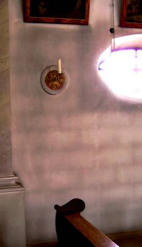
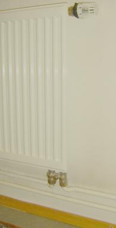
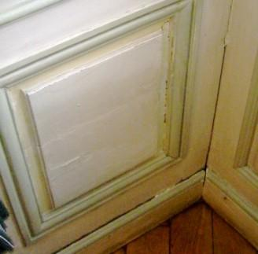
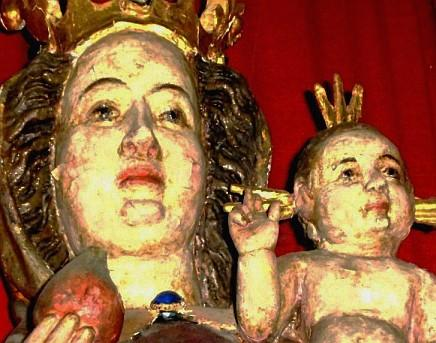
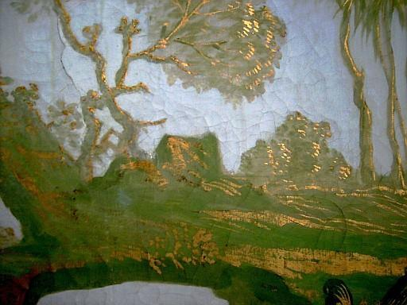
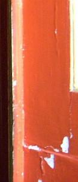

[🠔 Zur Übersicht: Roman & Balkan](roman.md)  
# Le système de tempérage contre le déperdition thermique de l'enveloppe du bâtiment
**Le système de tempérage pour surface intérieure des bâtiments: économie d'énergie, habitat sain, prévention moisissures. Améliore climat intérieur, entretien et conservation de monuments historiques par chauffage de surface (IR). Exemples.**  
_von Konrad Fischer_

Le bon et le mauvais système de chauffage / CVC

## La conservation du bâtiment et le climat intérieur parfait sans la ventilation et le chauffage par convection 
Le réchauffement durable de la surface intérieure de la chambre ou de l'élément de construction par la radiation thermique infrarouge (IR)

[par Konrad Fischer](1refernz.md) 

Cette page est dédié à un des plus grands problèmes auprès des bâtiments modernes et auprès de la protection des monuments- le climat intérieur et la tension sur chaque partie du bâtiment: les utilisateurs et leur santé, les conditions hygiéniques de l'air de pièce, la détérioration de l'enveloppe de la chambre, la surface de mur avec des tableaux aux murs et toutes les autres parties des meubles qui sont peut-être historique précieux et des beaux-arts sont emmagasiné ou exposé dans la situation intérieure. Donc nous allons discuté le chauffage et aération non seulement des salons, mais encore des salles dans l'église, le château, le musée et des dépôts comme les caves ou les greniers. Est-ce qu'il y a une meilleure alternative pour le chauffage normal, la ventilation et l'air conditionné? 

Nous commençons avec un article que j'ai arrangé, qui était publié la première fois dans la revue allemande ‹ Raum & Zeit › (No 145 - 2007): 

### Le chauffage de convection ou rayonner la chaleur ?

#### Un rapport de l'expérience avec les systèmes de chauffage de „ temperating “

La lecture de l'article par Prof. Claus Meier (‹ Chauffant comme le soleil ›, Raum & Zeit 144 (2006), et ‹ Les Avantages d'IRRADIE la chaleur ›, Raum & Zeit 145 (2007)) beaucoup obtenu étonné. Ce pourrait être que tous les autres experts de chauffage, le climat intérieurs et la physique de construction ont tort ? 

Le même je me suis demandé comme un architecte pour la préservation, la conservation et rénovant de bâtiments historiques depuis le conservateur bavarois pour les musées Henning Grosseschmidt (le Centre pour les Musées Non-DE L'ETAT dans Bavière - Landesstelle für Nichtstaatliche Médité, Munich) dans les années 80 a commencé à suggérer une nouvelle méthode de chauffage de système par une surface de pièce intérieure chauffant via infrarouge (IR) rayonnant la chaleur (Huellflaechen Temperierung). Ce nouveau système fournira une température uniforme pour le refroidissement construisant des enveloppes aux murs intérieurs, le toit et le plancher, obtenir la température exigée pour l'usage de la pièce et les besoins des objets de musée exposés aussi. L'objectif conservateur de cette méthode de chauffage est de garder toutes parties d'enveloppe et loge des objets aux conditions sûres et protège une atmosphère de pièce de healty pour les êtres humains. 

 

Autrement ce système de chauffage peut être adapté comme le composant chauffe le système pour la surface intérieure de refroidissement de parties d'enveloppe ou chauffe partiellement de certains objets comme un organe d'église et d'autres instruments, bien les objets d'art etc. éviter les risques par le condensat de l'air humide plus chaud à la surface de l'objet. 

Le système travaille dans une pièce tempérée avec la chaleur rayonnante émise de la surface de pièce intérieure chaude. Dans le cas de chauffant partiellement de structures de bâtiment ou oppose peut ceux-ci être chauffés par un tuyau d'eau de chaleur-rayonne proche, un fil de chauffage électrique ou une surface chauffée d'un radiateur fait du métal, la pierre, le verre, le conseil de carte etc. dépendant des besoins locaux. Les diverses méthodes ont combiné avec leur contrôle soigneusement ajusté et leur aide d'interception pour considérer le preservational objectivs et les buts sans les moyens nuisibles de protéger et de protection. Ce système de chauffage contredit les deux les conditions techniques de systèmes de chauffage modernes de même que l'opération de chauffage de systèmes comme les radiateurs normaux, les convecteurs et aère les systèmes de chauffage par les moyens normaux (les radiateurs, les convecteurs, les conduits). Le système commun de chauffage utilise principalement le covectionally a chauffé l'air de pièce. Donc l'air chauffé humide avec plus ou la moins haute humidité relative touche les surfaces systématiquement plus fraîches de l'enveloppe de pièces, les mouiller en haut par le condensat et chargeant la poussière là sale. Par contrôlé diminuant la température de chauffage (le revers du soir) les enveloppes de pièce refroidissent encore chaque nuit et aspireront si de plus en plus de condensat si le chauffage commence encore le matin suivant. 

Quelques photos des murs époussetés par le chauffage d'air chaud illustreront le problème: 

 <== A Epousseté le mur et le plafond dans une église par de convection l'air chauffant <== Salir le mur dans un salon par le chauffage de convecteur et le revers du soir normal <== A Epousseté des intérieurs d'une église par travaillant de convection la place chauffant le système <== Poussière-Etalant le chauffage de place d'église électrique <== Salir le mur par le chauffage d'underfloor <== Salir le mur en chauffant des tuyaux <== L'intérieur Moisi d'organe par le système de chauffage d'air <== Epousseter et la terre au-dessus du convecteur/le chauffage de radiateur 

Le premier système que le conservateur a recommandé a eu l'intention de modéré l'enveloppe de la pièce en ajoutant des couches chauffées à l'enveloppe de pièce : 

- UNE couche de placoplâtre aux murs externes avec circulant intérieurement air de convection du chauffé et 
- Un air a chauffé la structure de coquille par terre en ajoutant une nouvelle couche de plancher avec les tuyaux de chauffage d'underfloor. 

Dans l'écart interne du mur fermés et de structur de couche de plancher petit conventors comme dans le conseil ignoble chauffant des systèmes ont chauffé l'air interne. La flottabilité chaude d'air indirectement est réchauffer la la surface de couche de devant de derrière et suivre la pièce entière. Le rayonnement tendre de chaleur, qui est devenu irradié de la surface de couche chaude constamment pendant n'accentue pas jour et nuit les expositions historiques sensibles du musée par les fluctuations d'humidité et température/les changements autant de comme les opérations de systèmes de chauffage normaux aurait fait par l'air chauffé. 

Les conséquences et les interventions sévères causées par cette méthode pour les monuments surtout patrimoniaux et leur équipement historique aiment le que plâtrés, peints et décorés les murs ou le vieux plancher lui-même dispose en couches, cependant, avait été considéré (aussi) ? moins. Finalement, à cause des hauts investissements a eu besoin de l'idée a été seulement appliqué dans une petite gamme, un surtout musées dans la dépendance des allocations que le conservateur pourrait donner. 

Mais prendre une partie active dans les conflits suivants entre l'intérêt de musée et la conservation du bâtiment historique original forme j'ai commencé à augmenter mon intérêt pour la théorie et la pratique de chauffage de rayonnement. C'était tout à fait facilement pour comprendre que les risques énormes de chauffant regardant de convection tous les dommages sévères partout - dans les bâtiments patrimoniaux même comme dans les maisons „ normales “. 

Alors dans 1989, la cave archéologiquement creusé du [Burgthann de château médiéval](http://www.roadstoruins.com/burgthann.html), où j'avais été responsable comme l'architecte de restauration, devrait être chauffé pour l'usage d'hiver. Pour ceci j'ai recommandé couches pas de supplémentaires mais un anneau de chauffage de tuyaux suivant les murs externes et les solives en acier/les poutres/les rayons du nouveau Prussien sautent j'ai planifié comme la structure de plafond. Franchement et ouvertement visible devant les murs, le système de colonnes et plafond et caché dans l'écart de sanded entre le nouveau plancher de brique et les pierres unrendered énormes du mur de château médiéval, ils augmentent la température ignoblee de la cave. Le chauffage supplémentaire pour la plus haute température pendant l'usage a été fait par les prises d'air mobiles. Ces bon marché chauffant - à cause de l'actuellement système de conduit de soufflerie chauffage rayonnant non pur - a amené mes projets dans l'exécution. Les deux dans le vieux bâtiment, de même que les nouveaux bâtiments. Les pièces non de typhooned plus poussiéreuses, les hautes pertes d'air de chaleur, l'humide et moisir le risque de systèmes à convection de chauffage d'air communs ! 

Que les alternatives pour le „ nouveau “ système par le rayonnement chauffent-ils ? En principe : Ouvrir dépasser ou les parties de sytem couvertes du chauffage. La technologie de rayonnement de chaleur avec le mur- ou les tuyaux de chaleur d'underfloor-intégré dans un esthétiquement point de vue ne „ dérange “ pas si pour l'oeil et chauffera les surfaces contactant à emitt le rayonnement thermique. Autrement ce système couvert implique aussi des désavantages : le bâtiment obtient des miles d'entailles ou les structures de couche supplémentaires massives, un risque augmenté de dommages dans les systèmes de tuyau de chauffage couverts et les coûts pour le rénover, la restauration dans la vue à long terme et pour l'énergie augmente substantiellement. Les problèmes énormes pourraient être le manque de chaleur suffisante si n'avait pas été là installé assez de tuyaux ou les tuyaux avaient été installés un morceau à profond dans le mur. Certains de ces conflits sont venus au tribunal. 

Les commun et plus ou systèmes de plinthe de moins de blockish fonctionnant avec les petits convecteurs derrière les conseils utilise l'effet de coanda pour chauffer le mur et de là indirectement la pièce. Ils causent un risque significatif de pollution à la surface de mur proche sur les de convection systèmes de conseil de base de fonctionnement par la poussière de chaud-air émise. Par opposition, je préfère les éléments de chauffage rayonnants ouvertement installés, par lequel le bâtiment et la bourse du propriétaire obtiennent loin moins affecté, comme dans les systèmes cachés dans le mur et le plancher. Cette construction notamment simple - il est vrai pas tout le monde doit comme lui - prend l'usage de tuyaux ouverts le long de la région ignoblee de préférablement les murs externes.  
Le système simple de chauffage d'enveloppe de pièce : Ouvrir les tuyaux de chauffage et une chaleur supplémentaire irradiant la surface d'un radiateur plat 

Après l'expérience d'opération dans ma propre maison et d'autres les tuyaux chauds, installés et ouverts peuvent chauffer la pièce à un hors de la température d'environ 5 °C. Si c'est plus froid, renforçant des radiateurs plats supplémentaires feront le travail. Même existant de convection les systèmes de chauffage peuvent être convertis à un bien système de mode de rayonnement de fonctionnement facilement en abandonnant le du soir revers, couvrant le conduit du convecteur/l'arbre, peut être quelques changements dans le contrôle de chauffage et quelques tuyaux supplémentaires ou quelques radiateurs plats. Les moyens simples utilisant ce système peut transformer aussi des caves mouillées dans les pièces sèches (si le condensat hygroscopique est la source humide. Appartenir à ce sujet [voit plus de détails ici](2auffen.md)). 

Comme le courant construisant et l'ingénierie pratique presque totalement est en désaccord le chauffage de rayonnement simple, cet avait été inévitable pour développer les compétences de planification nécessaires par moi et mon personnel. 

 
Le convecteur normal : L'air chaud chauffe de seulement certaines partie de l'enveloppe de pièce, dépendant du contact avec le ruisseau d'air de convection chauffé. Diriger chaud - et le froid de pieds. Les parties plus froides de l'enveloppe de pièce sont époussetées et sont humidifiées en haut par le condensat. 

Aujourd'hui, nous utilisons non seulement les systèmes communs de chauffage de chaud-eau. Les systèmes aussi électriques avec temperated les plaques en pierre ou les câbles de chauffage électriques/les fils peuvent être une alternative. Une technologie de règle de contrôle simple et libre programmable peut remplir les besoins résidentiels. Pour la conservation utilise dans les bâtiments patrimoniaux importants comme les châteaux, les églises et les musées aèrent quelquefois l'amortisseur/l'humidificateur et les systèmes de temperating plus complexes doivent sont développés. 

Comment le chauffage de rayonnement est-il construit ? Deux présuppositions majeures sont fondamentalement : 

- Le vrai pouvoir de rayonnement et chauffe la provision de surfaces chaudes (pour les tuyaux de ligne d'exemple, les radiateurs) selon les corrections de Prof. Meier et 
- La vraie perte des enveloppes de bâtiment chaudes/écale (les murs de devant, le toit). 

L'est premièrement beaucoup plus plus haut, la seconde est beaucoup d'abaisse que le calcul standard fournit, suit les règlements de bâtiment normaux et les normes. 

 
La chaleur rayonnante chauffe l'enveloppe de pièce par le rayonnement thermique infrarouge. 

Les raisons pour ceci : Les grandes quantités de lui rayonnement du soleil n'est pas suffisamment considéré dans les normes. Le rayonnement solaire est dehors emmagasiné dans les murs de devant solides avec l'haute efficacité. Autrement les rayons solaires pénètrent par les fenêtres et leur pouvoir est absorbé à l'intérieur et emmagasiné dans le bâtiment entier. Ces les deux effets ne sont pas correctement estimés par les calculs thermiques normaux. 

 
Emmagasiner de lumière de soleil dans un mur de brique solide au mois de février. La source du diagramme : Wichmann & Varsek, Rationeller Bauen, le 1983 février

La vague courte reçue rayons légers seront absorbés des matériels et de reemitted allumés comme l'IRRADIATION de vague longue. Donc la directement et lumière solaire diffusifment reçue est transformée en la chaleur. Bon savoir : Chauffer la boîte de rayonnement pas et ne pénétrer jamais un volet de verre de fenêtre seul !

 
Vagues électromagnétique et verre. Un diagramme de Professeur Dr. -Ing. habil. Meier claus : Le volet simple de verre de fenêtres normales n'est pas perméable pour les longeurs d'ondes du rayonnement ULTRAVIOLET à ondes courtes (< 0,3 µm) et longwave le rayonnement d'IR électromagnétique (la chaleur rayonnante infrarouge > 2,7 µm). Seulement la gamme légère visible pénétrera le verre.

Pour notre calcul de la dimension du système de chauffage nous considérons [Prof. l'U de Meier alternatifeff-Estime](7keff.md) (Reff Les valeurs) pour construire de matériels et le comportement de verre de fenêtre et est venu autant de plus près à la réalité. Tant de corrections suivront de ces aspects à notre calcul et de la planification thermiques la construction de système. Ainsi une technologie rentable de systèmes (la chaudière, la pompe, les lignes, les radiateurs) peut être utilisé et un énergie-épargnant holistique chauffant le système sera installé. Juste dans en face aux méthodes communes d'ingénierie de chauffage de hvac, la ventilation et l'air conditionnant des systèmes. 

Le pas à toute isolation, l'usage nuisible et chère de si appelé ‹ l'isolation thermique › et le remplacement du bon vieux seul a glacé des fenêtres peuvent être ainsi éliminées. S'il y a vraiment des besoins d'isolation supplémentaire, le f.e. pour la conversion de grenier aux salons, les matériels de bâtiment seulement solides comme le bois et comme le sens de marque de brique. Les matériels seulement solides peuvent absorber vraiment, peut emmagasiner et ainsi peut isoler la conduction de chaleur/le transport par la construction de mur et toit. Les matériels légers comme (la laine minérale, polystrene, la mousse, fibre etc.) sera pénétré par la chaleur dans les secondes. Nous proofed ceci dans notre “ l'Expérience [de Lichtenfelser/l'Expérience de Lichtenfels](2139bau.md) “ et détecté par beaucoup d'investigations que les ans ont „ isolé “ il y a des structures ne peuvent pas diminuer la perte de chaleur de dans mais l'ombre et réduit l'entrée gratuite d'énergie solaire dans les façades. Résultat : La consommation augmentée d'énergie, pas les économies, et outre les dommages structurels par mouille en haut l'eau et le condensat absorbant des couches d'isolation thermique- et dehors. 

Note : Le Rth-Values/U-values (= l' „ U “) ne sont pas commun avec les changements de la température et l'effet pratique de l'isolation thermique. La plaisanterie folle : Les experts de R-VALEURS définissent leurs résultats sans n'importe quel égard du temps et la quantité de chauffage d'énergie dans la preuve avant qu'ils commencent mesurer. Les matériels lourds aspirent et emmagasinent des quantités énormes d'énergie. Donc ils peuvent perdre beaucoup plus d'énergie que l'air a rempli l'isolation. De la même manière tels experts pourraient comparer les pertes d'eau d'un lac rempli avec une pinte remplie. Ils négligent le rayonnement d'énergie quotidien libre hors du bâtiment du soleil et les environs dans leur laboratoire et leur âme sombre aussi. Donc ils oublient les criques et les rivières, qui remplissent le lac de storable maintes et maintes fois. Penser à lui, alors vous détecterez le mensonge incroyable même si vous ne sont pas de médecin et seulement un gars stupide normal. Tout est fait par une grande conspiration contre votre portefeuille depuis beaucoup d'ans : les industries d'isolation, les producteurs de maisons préfabriquées et leur „ scientifique “, planifiant et le personnel de fonctionnement - peut-être aussi vos artisans, vos architectes et vos travaux publics - obtient votre argent pour leur merde.

Conclusion : Pour épargner de l'énergie, nous devons tout d'abord considère et améliore le système de chaleur et la distribution - sans n'importe quel scellant hermétiquement nos salons. L'erreur standard comptant la physique de bâtiment, le chauffage faux, l'isolation et sceller thermiques nos maisons à élever les lieux corrects pour tous genres de moule, la moisissure et l'autre air polluant le micro-organisme, gaspillant de l'énergie et les gens qui font et les matériels malades par mauvaises intérieures les conditions doivent être finis. Le besoin pour mieux les solutions sont apparemment nécessaires. 

---

Quelques exemples : 

 
Eggenbach la demie maison de timbered [Baroque dans Eggenbach No 2/3](http://www.maier-ferienhaus.de/) - Complète la conservation et le système de rayonnement de chaleur avec le chauffage de conseil ignoble 1990 
Roquer la cave dans le Palas du Burgthann de château ([Burgthann (les Routes aux ruines)](http://www.roadstoruins.com/burgthann.html) [<> Burgthann (l'association d'amis](http://www.burgverein-burgthann.de/) du château)), 
 
Le château de Neuenburg 
L'aile de galerie, la double chapelle et le double restaurant de Château de Neuenburg près de Freyburg/Unstrut (le château [de Neuenburg dans les Routes de ruines, (la photo Ed Kane 2000 : Konrad Fischer avec le brouillon de château de Neuenburg)](http://www.schloss-neuenburg.de/), <> Neuenburg le site [officiel <>](http://www.schloss-neuenburg.de/) Le château [de Neuenburg (DBV)](http://www.burgenperlen.de/Perlen/Sachsen_Anhalt/neuenburg.htm)) 

[L'ancienne synagogue dans Odenbach, Rhineland-Palatine,](http://www.politische-bildung-rlp.de/256.html) - gardant à une température modérée pour le but de conservatorical 

L'étable et l'écurie dans le [Hennebergisches Musée Kloster Veßra](http://www.museumklostervessra.de), Temperating pour le but de conservatorical 

Gustav-Adolf-le musée dans [Geleitshaus Weißenfels](http://www.weissenfels.de/wsf_museum/bas_geleitshaus.html) Temperating chauffant le système pour le musée, le restaurant, habitant des pièces, les pièces de séminaire 

[Zeyern, l'ancienne maison de ferme, demeurant maintenant la maison de Kaiser](http://www.zeyern.de/Baudenkmal/haeuserfahrt.html) de famille, un blog- et la demie construction de timbered 

Plus depuis 2001 approximativement 25 rayonnement chauffant des systèmes pour les bâtiments des époques différentes jusqu' à aujourd'hui dans Bavière, Baden-Wuerttemberg, Berlin, Brandenburg, Hambourg, Hessen, Abaisser Saxe, Rhin-Westphalia du nord, Rheinland-Pfalz, Saxonia, Saxonia-Anhalt, Schleswig-Holstein et Thuringia. 

Un des dernier : [Le Château](http://www.historicgermany.com/3039.html) de Veitshoechheim de recours d'été de l'évêque de prince (planifiant et l'exécution 2001-04, pour les détails regarde le rapport final au dessous). [www.wuerzburg-photos.de - le Château de Veitshoechheim et le Jardin - les Photos](http://www.pbase.com/bernd/residence_wuerzburg_bavaria_germany&page=all)

Du rapport final provisoire - le résumé (l'acte. La version 10/07) :

**Faire une conférence le lecteur/l'allocation** 
(a mis à jour) pour : 

- L'équipement **Technique de bâtiment dans le monument** architectural 
La conférence du conseiller pour la préservation de monument de › [L'allemand Roque Association pour la Préservation des Bâtiments Historiques (l'e.V: de DBV de Burgenvereinigung de Deutsche)](http://www.deutsche-burgen.org/). . 
Wuerzburg, Marienberg de forteresse, 31,01. - 01.02.2004 

- Etudier le jour pour la préservation et la restauration 
**Le soin de monuments et de monument utilise 
Le monument architectural et son équipement dans le secteur de conflit entre la préservation et utilise** 
Le plus ample centre de formation du FH Erfurt, 25.06.2004 

- **Loger l'enveloppe et la technologie dans le monument** architectural 
La convention annuelle du cercle de travail consommé de châteaux et de jardins en Allemagne 
Bayreuth, Neues Schloss, 02. - 04.04.2006 

Konrad Fischer 
**Préserver des bâtiments et des intérieurs en les gardant à une température modérée** 
Les bases, la planification, l'exécution et l'opération par l'exemple du Veitshoechheim de château de jardin

[Le Veitshoechheim](http://www.schloesser.bayern.de/deutsch/schloss/objekte/veitsho.htm) de château avait été construit 1680 à 1682 comme un recours d'été pour le von de Philipp de Peter d'évêque de prince Dernbach de Wuerzburg d'architecte Heinrich Déambulateur, peut-être après les projets d'Antonio Petrini. Sous le prince évêque Karl Philipp de Greiffenclau que le château avait été étendu avec les salons/les appartements par l'architecte Balthasar Neumann 1749 à 1753 ajouter les bâtiments transversaux aux côtés étroits. 

Le bâtiment complet est approximativement 55 m long et dans fait en moyenne approximativement 12 m large et contient deux étages avec une hauteur d'étage d'approximativement 5 mètre. Le grenier est une pièce vide sans l'usage. Les devants avec les murs externes sont approximativement 70 cm épais et consistent en rendu/la maçonnerie en pierre, naturelle et plâtrée et les grandes fenêtres de volet seules, d'une manière prédominante quatre ailes avec glacer de barres. 

 
Veitshoechheim de château de jardin, le devant de l'ouest

 
Etre à la tête de de l'est

De 1752 à 1753 Antonio Bossi a créé les travaux d'enduit riches aux plafonds et les murs dans le plancher supérieur.

 
Stuquer l'ornement dans l'OG

Dans 1810 quelques pièces obtenues fournies pour le Ferdinand de Grand-duc de habsburgian de Toskana. Le d'haute qualité d'équipement de pièce et l'importance du château avait été amélioré avec les papiers rares de mur. 

 
Emprisonner le papier dans la toilette de duc, ...

 
... Au-dessus de la toilette place un arbre de ventilation.

Le château est seulement utilisé saisonnièrement et dans l'hiver fermé pour les visiteurs.

Les mesures climatiques avant le proofed de début de projet, cela humidifier de temps et usage-conditionné et les variations de grande variété de la saisonnièrement température change des quantités énormes amenées de condensation d'air chaud humide dans les murs plus frais au printemps chronomètrent surtout. Les fluctuations nuisibles de hygrothermal ont causé des dommages substantiels au solide construisant la construction (sèche pourrit, la corrosion) et le mobile d'haute qualité et l'équipement mur-fixe (le moule noir/la moisissure/la croissance fongique sur les papiers de mur organiques, la détérioration d'eau absorbant en bois, le textile et les surfaces organiquement revêtues, perdant le classeur dans les couches de peinture détachées ou désintégrées historiques, mobilisant de sels dans les parties de mineralic du mur comme rend et la pierre naturelle. Dans l'enduit sépare et toutes fissures de murs externes et aereas creux avaient été causés par l'humidité et temperatur accentue). L'a nommé longtemps la mesure comparative des températures d'air externes et internes et le f.e de proofed de climat intérieur. au mois de mars 2001 plus haut hors des températures augmente à 13 K. Au mois de janvier j'ai mesuré avec mon IR-THERMOMETRE 0 °le C sur les surfaces de mur internes du premier plancher. Donc l'emmagasinage de condensat dans les secteurs et la température undercooled internes accentue dans toutes parties de la construction de bâtiment avait été inévitable. La dégradation à long terme des composants d'enveloppe de bâtiment est correspondu au climat et à contredire extérieurs tous efforts d'entretien et de construction réparent.

 
Emprisonner le papier avec [la formation de moule noir/la moisissure](7mildew.md)

 
Quelques ans avant que le bureau de bâtiment responsable de l'état a réparé les dommages du condensat-moistured la charpente pourri (sèche pourrit) dans le grenier. Le soutien statique supplémentaire par les systèmes de poutre en acier a été inséré.

 
Après découvrir des conseils de plancher de bois et le revêtement de sol de parquet dans le plancher les supérieur aussi ici grands dommages de bois de condensat-causé sont devenus apparents.

 
Pendant le froid hors des températures l'humidité d'air de pièce en surplus peut condens aux [fenêtres seules](23bausto.md). Ces plus grands dommages de pénétration d'humidité diminués dans l'autre bâtiment séparent dans les situations climatiques critiques. La chaleur rayonnante infrarouge (la longeur d'ondes > 2,7 µm) ne peut pas pénétrer les volets de verre juste comme la lumière ULTRAVIOLETE extrême-violet (< 0,3 µm). Plus de 99% du transport de chaleur par l'enveloppe extérieure dépend de la chaleur rayonnante et pas sur si appelé ‹ la conductivité de chaleur › et la R-VALEUR (dans une pièce avec 20 m² et 2,50 hauteur de m le 50 m³ chauffant de l'air avec 62.5 poids de kg et la quantité suffisante de chauffage de positions d'énergie dans le contraire à un IR infrarouge le rayonnement thermique de l'à 20 °le C est réchauffer des surfaces de murs intérieurs, le plafond Et le plancher avec plus de 10 tonnes pèse et leur somme énorme d'emmagasiné chauffant de l'énergie !). [Les fenêtres](23bausto.md) seules réduisent le contenu d'humidité de l'air de pièce par la condensation de cible et la perméabilité d'écart améliorée dans la saison de chauffage aussi. Ceci diminue aussi la condition de pouvoir pour le réchauffe d'air. En plus le double vitrage diminue le gain d'énergie du rayonnement solaire libre. Pour toutes ces raisons fenêtres seules sont - contrairement à l'acceptation normale - les constructions d'économies d'énergie pures. Ils ont été réparés sans glacer supplémentaire.

 
La perméabilité de volet de verre de fenêtre pour les gammes de longeur d'ondes : LES ULTRAVIOLETS et IR wavelenghts ne peut pas pénétrer dans le volet de verre, la gamme de boîte légère visible ! (Diagramme : Le professeur Dr. -Ing. habil. Meier claus, Nueremberg) 

Le Wuerzburg gouvernemental de bureau de bâtiment et l'administration de château bavaroise ont décidé étant donné les dommages d'humidité climatiquement causés mesures opposés de conservation : A propos de la restauration des enveloppes de pièce/les changements de coquilles et usage-conditionné j'ai obtenu ai inculpé de l'ingénierie pour l'installation d'un climat stabilisant et le système de chauffage d'enveloppe de pièce de temperating. 

L'objectif principal pour la stratégie de chauffage a été de cette façon l'empêchement de condensant plus dans les surfaces de bâtiment internes, les meubles et l'autre équipement exposé. Pour réduire les tensions de changement de climat de pièce sur les surfaces lentement glissant seulement les changements de température et humidité sont permis. Ces objectifs de conservation sont remplis par un contrôle programmable de la température intérieure 6 K (Kelvin) sur l'hors de la température dans une gamme de température d'au moins 6 °le C à la délimitation supérieure sur 20 °C. Ce chauffage économiquement conduit avec commencer de 5 différence de température Kelvin et la déconnexion à 7 Kelvin est suffisant pour travailler contre l'admission de condensat interne. L'humidifier corrosif et la tension de température sur le contenu dommageable et sensible du bâtiment historique sont substantiellement diminués de cette façon. 

Le souvent postulé soi-disant ‹ le climat idéal › pour la situation intérieure dans les pièces de musée avec l'humidité de relatve de 45-55 %, une définition arbitraire sans la raison scientifiquement suffisante, était pour notre planification sans pertinence et restée unconsidered. Beaucoup plus substantiellement pour la réduction de l'humide- et la corrosion matérielle dépendante de la température est : les fluctuations climatiques et change tout près l'équipement exposé et les parties de bâtiment et la véritable température de surface des objets. Ceux-ci sont sont les sujets de relvant pour l'admission d'humidité et l'absorption et doivent être contrôlés. Une humidité basse d'air peut causer les dommages de condensat sévères en contactant un sous-temperated la surface matérielle. 

La situation à la surface matérielle est l'objet de protection dans le sens de préservation et de conservation ! Ceci dédie le rayonnement de temperating chauffant comme la garantie-stratégie d'indispensal et le traitement de conservation contrairement au conditionnement d'air normal : 

La chaleur rayonnante comme vague électromagnétique dans la gamme d'IR pénètre l'air de pièce à la vitesse de lumière. Le rayonnement de chaleur ne peut pas chauffer l'air, mais seulement les surfaces irradié. L'a chauffé la surface alors „ indirectement “ réchauffer les molécules d'air contactant. Comme l'analogie les rayons de lumière illuminent seulement allume absorbant des objets par l'impact, mais dans l'air cependant sont invisible. Ainsi les objets de chaleur-irradié sont toujours plus chauds et sur le plus haut niveau de température, que les molécules d'air proches. L'air dans les pièces avec le rayonnement de chaleur s'est réchauffer seulement indirectement dans la gamme de contact avec l'a chauffé le matériel. Donc ceux-ci logent de l'air reste toujours plus frais que l'enveloppe de pièce et l'inventaire. Ainsi la différence de pression atmosphérique à hors de l'air est diminué, de la même manière les pertes de chaleur de ventilation et la consommation d'énergie de chauffage. 

L'humidité de l'air peut condenser seulement à plus froid, pas à la surface plus chaude. A cette étendue que tout air chauffant des systèmes et de la même manière sur le fonctionnement de chauffage d'air chauffant de convection des systèmes (le chauffage de convecteur, la plinthe chauffant) le travail non seulement comme centrifugeurs de poussière, mais aussi comme les mécanismes de humidification avec la consommation d'énergie de chauffage insensément gaspilleuse. Pour les musées, les pièces équipées historiquement valables et les constructions de bâtiment étouffe-sensibles et les inventaires offre l'enveloppe de pièce chauffant fondée sur la chaleur rayonnante avantages imbattables. Dans de conservation et dans le sens économique en ce qui concerne le coût d'opération.

 
La température courbe dans premier et le premier par rapport à l'hors de la température comme défaut de contrôle pour le système de chauffage d'enveloppe de mur

Aussi pendant le calcul et planifiant du système de chauffage nous avons calculé conformément au service d'entretien de bâtiment gouvernemental tout à fait différemment, que par la procédure standard. Notre calcul de condition de chaleur a considéré la courbe de température annuelle locale (pas la moyenne pour Allemagne entière) et par les procédures arithmétiques avec le Reff-Les valeurs de Professeur Claus Meier, qui considère l'absorption solaire et chauffe la capacité de stockage du solide construisant des matériels par rapport au rayonnement solaire local qui peut être exactement trouvé dans Veitshoechheim dans le processus annuel. Ensemble avec les économiquement avantages de l'enveloppe de mur chauffant les pertes de chaleur de ventilation pourraient être substantiellement réduits.

Les valeurs initiales des coefficients de conduction de chaleur pour les structures historiques ont été conclues des spécifications de qualité et des termes standard techniques du TGL 35424/02 (un règlement de bâtiment de l'ancien allemand Démocratique Republik), depuis le nouveau VACARME de bâtiment-orienté 4108 provisions aucunes valeurs. Le calcul alternatif améliore la R-VALEUR d'un mur sur le côté du nord de 1.14 sur 0.54, à l'est et au côté d'ouest de 1.14 sur 0.20 et sur le côté du sud de 1.14 augmente (minus!)-0.12 W/m²K.

Quelques exemples de l'allemand construisant la recherche illustrera l'exactitude de notre point de vue controversé : 

 
Dans une mesure ouverte de terre le département de construction de recherche de l'institut de recherche fédéral pour FAL d'agriculture dans Braunschweig a montré ces parties de construction solides (ici un 11,5 cm maçonnerie de brique épaisse) atteint de substantiellement plus hautes température, comme la série de température d'air pendant le calcul de condition de chaleur standard (la courbe bleue). Les murs solides plus épais peuvent emmagasiner cette énergie solaire et l'épargnent aussi dans la nuit. Ainsi la condition de chaleur du chauffage d'espace est abaissée. Le calcul standard ne considère pas cela.

 
Le fait que les caractéristiques d'isolations de matériels de bâtiment légers contredisent les besoins de protection de chaleur dans l'été, proofed notre „ l'Expérience de Lichtenfelser - l'Expérience de Lichtenfels “. 4 cm bâtiment épais plaques matérielles ont été irradié par une ampoule légère rouge pour 10 minutes, alors la température s'élève au derrière a été mesuré. Presque aventureusement mauvais R-ESTIME (U-ESTIME) offre les meilleurs effets d'isolation ! Les matériels d'au-dessus : La Laine minérale, EPS de Polystyrène Augmenté, Foamglas, la Brique, le Conseil de Fibre de Bois, le Conseil de Carte de gypse, la Forêt de Pins Solide. La bonne isolation de température de matériels en bois légers dépend de l'évaporation de leur humidité matérielle, qui transporte loin la chaleur de la surface rayonnée. 
 
En 1983 le Fraunhofer Institut Holzkirchen est venu savoir par les mesures comparatives de constructions de mur différentes (voit le diagramme), que la plus petite consommation d'énergie exige les pires k-valeurs de (!) (= les R-VALEURS). Cela vient probablement de la capacité de matériels solides pour diminuer la consommation d'énergie de chaleur en emmagasinant l'énergie solaire pendant la nuit dans les périodes de chauffage d'automne et de printemps.

Dans ce cas nous n'avons pas profité de toutes possibilités qui la vraie physique de rayonnement après Kirchhoff, Boltzmann et Planck de même que les résultats de recherche de bâtiment pratique nous fourniraient, pour trouver un chauffage de fonctionnement plus sûr. Notre contrat de planification nous a donné un grand problème de responsabilité, donc protégeant encore dans un tel grand projet est compréhensible. Le differnce en ce qui concerne la protection de coservational d'équipement technique et les investissements de construction à la planification commune est toujours assez énorme.

La condition préméditée de chaleur avait été si clairement plus favorablement, qui une petits chaleur et CHP d'unité de pouvoir combinés (12,5 KW) avec un tampon dans le celler en voûte est suffisant. L'en plus chargement de sommet est fourni par les chaudières de gaz de valeur calorifiques déjà existantes (24 KW) de l'appartement vivant du directeur de facilité.

 
La chaleur combinée et CHP d'unité de pouvoir dans les produits de plancher de cave pouvoir électrique pour l'enveloppe de mur électrique chauffant dans l'hiver et le besoin du musée dans l'été et chauffe de l'eau pour le chauffage dans le rez-de-chaussée.

 
La mémoire tampon de la chaleur combinée et alimente CHP d'unité dans le plancher de cave

.  
Parfaitement selon le chauffage et les normes de physique de bâtiment un 20 °le C chauffe la surface fournit une production de 0 Watts (pour le manque de différence de température à l'air même chaud). Cela est une mauvaise illusion si pas une fraude et produira les systèmes de chauffage coût-chers et l'isolation thermique insensée ! Telles surfaces chaudes peuvent irradier beaucoup classements de pouvoir de plus de chauffage à cause des lois de rayonnement. L'efficacité d'une enveloppe de pièce chauffant l'opération de système avec le système de rayonnement ne peut pas être donc saisie par défauts standard.

Les tuyaux chauds d'eau dans les secteurs subordonnés sont ouvertement installés, les cycles de tuyaux ignobles dans la gamme de visiteur et les secteurs plus importants sont installés sous le rend/plâtre de mur ou comme le système d'underfloor. Ceci était un compromis entre postulations esthétique du responsable restorators, les interventions dans le bâtiment historique et l'efficacité du système de chauffage. Les secteurs avec les conditions de température augmentées (le bureau, les toilettes d'invité) a obtenu eau-fourni chaud supplémentaire les panneaux rayonnants (les radiateurs). 

Toute la planification d'exécution a été faite par les détails de graphique extrêmement gradués pour tous composants et toutes interventions techniques. Ceci s'est montré pendant le dessin introduit tous les conflits entre les vieilles et nouvelles parties de même qu'une spécification d'exécution exacte. La dépense a utilisé pour ce travail de planification très détaillé pourrait diminuer les interventions de bâtiment imprévues et les pertes matérielles, les explosions de coût et date des désastres.

 
 
 
 
Les extraits de la conception et de l'exécution planifient

 
Les lignes de provision entre les planchers pourraient être menées par les cheminées et les fosses existantes.

 
L'arrangement de la distribution d'eau chaude dans une niche de pièce subordonnée - prudent pour le bâtiment

 
Dans le secteur d'entrée du rez-de-chaussée que le vieux plancher a dû est monté haut. Donc les tuyaux de chauffage pourraient être installés dans l'underfloor.

 
Dans tous secteurs d'haute qualité l'administration de château a consisté sur l'installation sous le plâtre. Les interventions de bâtiment, les mesures plus chères et la perte d'efficacité donnée avaient été d'acceptés cette façon.

 
La température de rayonnement du cycle de base plâtré peut être mesurée avec un thermomètre d'IR.

 
Les tuyaux ouvertement installés de l'enveloppe de pièce chauffant le système dans le bâtiment, pour la condition de chaleur augmentée a complété avec les panneaux de radiateur.

 
Les tuyaux de chauffage dans le bâtiment avant et après avoir fini le travail rénovant

Comme la garantie contre les dommages d'eau dans les secteurs de splendeur du plancher supérieur le système de chauffage avait été soigneusement installé derrière le panneau, sous le plancher et sur l'enduit encadre par les fils de chauffage électriques de petite production de pouvoir (20 W/m). 

 
La route de fil derrière le panneau et le fil de chauffage presque invisible sur le cadre d'enduit

Dans l'hiver émetteurs de chaleur de dalle de marbre mobiles de taille différente avec une production de pouvoir de 400 W à 1,500 W sont dans l'usage. Ils sont arrangés au centre des pièces et irradient les enveloppes de pièce. Le pouvoir électrique de la chaleur combiné et de CHP d'unité de pouvoir est aussi utilisé pour le chauffage d'enveloppe de pièce électrique. Le surplus temporaire est nourri dans le filet électrique conformément au loi pouvoir-mélangeant par chaleur (la loi de KWK).

  
Le radiateur électrique lambrise dans l'application initiale comme construisant le site chauffant et en été le demi-an dans le dépôt.

A cause du caractère de pilote du projet que notre client a exigé un contrôler complexe de la technique de chauffage et l'interception des valeurs de climat de pièce. La consommation d'énergie des composants de cycle de chauffage peut être individuellement évaluée.

 
L'extrait des projets de contrôle du système de chauffage d'enveloppe de pièce

La consommation d'énergie de chauffage par le mètre carré dans le rez-de-chaussée d'eau-fourni chaud est plus haute comme dans le le plancher supérieur électriquement chauffé. Nous supposons comme un logiquement résultat de l'installation plâtrée, qui diminue le pouvoir de rayonnement de la même manière un file le conseil ferait ceci pour une ampoule légère ou un parapluie contre la lumière de soleil. Si - enterrant les tuyaux de chauffage dans la construction de bâtiment convertiront et un soleil puissant à une lune sombre pâle ; -)

Consommation annuelle :

premier kWh/uN de plancher eau Chaude la deuxième Electricité de kWh/uN de plancher 1st+2nd kWh/uN de plancher 
La consommation 04 30,796 17,035 47,831 
La consommation 05 30,916 20,645 51,561 
La consommation 06 28,455 18,719 47,174 

Référer à la température contrôlant le niveau de température minimum dans les pièces avait été à approximativement 7 à 10 °le C, même au plus bas hors des températures. Ces preuves l'interaction idéale entre le solide construisant la construction et la technologie de chauffage d'enveloppe de pièce. La chaudière de gaz de valeur calorifique supplémentaire pour les sommets de chargement a dû contribue à peine 4 pour cent à la consommation.

Ainsi les preuves de Veitshoechheim d'exemple que ce système de chauffage peut fournir généralement des économies d'énergie dans les châteaux, les palais et les autres bâtiments historiques. Le dans beaucoup de monuments sont le normal - techniquement et économiquement douteux ou négatif - l'énergie épargnant des mesures comme l'installation d'isolation thermique sur la façade ou l'intérieur emprisonne et le remplacement de fenêtres historiques contre les fenêtres isolées modernes déjà exclu en raison des arguments de conservation cruciaux. Donc les mesures restantes d'énergie-économie sont limitées sur le système de chauffage - et là ils peuvent être aussi notamment réussis. 

 
Hors de la température et la température intérieure de 12e. A 18e le 2004 janvier. Le contol travaille parfaitement et absorbe les sommets de température. L'emmagasiner de la chaleur rayonnante dans la construction solide empêche aussi le condensat par la provision d'air chaude étonnamment reçue de l'extérieur. La température intérieure correspond à l'objectif de règlement. (Rouge - la température de pièce, géré par le règlement de chauffage ; le Bleu : Hors de la température)

 
Le directeur de bâtiment et Kastellan contrôlent le système total pendant son travail. L'écran courbe le spectacle hors de la température et les températures intérieures des gammes différentes de même que les sommets changeants du chauffage d'enveloppe de pièce électrique.

 
Les dommages se présentant dehors à la base de château (les images sont parties au-dessus et en bas) n'est pas naturellement de résultat d'une humidité [qui monte/s'élevant humide](2auffen.md). C'est de toute façon impossible à cause de la résistance capillaire infinie entre le système de micropore de l'unité de maçonnerie et le système de macropore du mortier de maçonnerie. Aussi la maçonnerie longue de moistured de temps dans un baquet (le centre au-dessus) les preuves ceci dans suffisamment la clarté. Donc l'horizon d'humidité de l'eau le hôtel de ville historique fondée dans Bamberg suit seulement la gamme du contre coule l'eau de rivière. 

Les dommages typiques causés [en peindant de silicate/waterglass/le potassium](22bausto.md) et [fortifier](29bau04.md) sont le craquer de du sur-fortifié et de capillaire a scellé les croûtes de surface. Ces revêtements de silicate ont détruit l'original baroque rend/le plâtre au Waldsassen de monastère cistercien (le centre en bas). L'aussi soi-disant plâtre [guérissant (Sanierputz)](2sanipuz.md) (sur la droite en bas) ne cause pas déhumidifier et dessaler. Ils séparent de la base de plâtre et de l'éclatement à cause de l'humidité de superelevated sur le côté arrière et la conduite la formation minérale entre cementous adhérant l'agent et le sulfate normal charge (le gypse) dans le métro. 
L'espoir quelquefois exprimé, qu'une enveloppe de pièce chauffant le système à côté de c'est l'action d'éviter de condensat peut combattre [montant aussi l'humidité/élevant humide](2auffen.md) est de la même manière une utopie, exactement le même comme par les répandu dewatering méthodes au moyen d'horizontalement la maçonnerie vu, les feuilles inox-en acier qui appuient, l'osmose d'electro et les injections de trou de raseur.

Entièrement l'enveloppe de pièce chauffant le système dans la preuve de boîte de Veitshoechheim de château l'effet positif du tempérer la technologie de chaleur rayonnante dans la construction solide avec les [fenêtres seules](23bausto.md) du conservatorically et énergiquement le point de vue. Le costses de construction : Chauffer du système de chauffage d'eau avec la chaleur combinée et CHP d'unité de pouvoir : 70.000 EUR, le chauffage électrique : 35.000 EUR, le contrôle : 50.000 EUR. 

Je remercie l'administration bavaroise de château et le Wuerzburg de bureau de construction de bâtiment national pour la confiance prouvée dans notre planification déviant de (presque) toutes normes et le contrat juste conçoivent de même que mon Dipl de collègue. -Ing. Peter Goehring pour son engagement jamais diminuant lors du développement et l'exécution de bâtiment substance-prudent entretient.

Hochstadt est Principal, 15.10.2007

---

[Le rapport de restauration de l'administration de château bavaroise, BD Peter Seibert](http://www.schloesser.bayern.de/deutsch/aktuell/aktuell/veitsh.htm) 

Les crises aussi : Pdf le papier scientifique : _[Analysant le Climat intérieur dans la Construction de Patrimoine dans Slovénie](http://www.arcchip.cz/w07/w07_sijanec_zavrl.pdf)_ de Marjana Š ; ijanec Zavrl, ZRMK, le Bâtiment Technologique et l'Institut d'Enginering Civil, Ljubljana, Slovénie. Il est rapporté, comment la condensation gigantesque effectue par l'air d'été et l'usage de concert aux enveloppes de pièce dans un château historique et une église sont mesuré. Les preuves pour l'effet de conservation (sans n'importe quelle vue de consommation d'énergie - pourquoi probablement) ? d'un système de chauffage d'enveloppe de pièce sont donné, bien que malheureusement installé sous le plâtre par l'acceptation les pertes d'original construisant l'efficacité de substance et energetical. Un papier scientifique, cependant tout à fait lecture de valeur.

---

Quelques images d'images de dommages de bâtiments typiques dans les monuments architecturaux, historiques et importants qui sont malheureusement (toujours) n'a pas chauffé correctement. Une absolument doute-valeur une collection matérielle de mes projets de consultation : 

1. Un château de rococo-jardin/le palais de plaisir dans le Rhineland 

 
Le bâtiment 

 
Les pièces de splendeur et les cages d'escalier sont chauffés dans le demi-an d'hiver avec antenne-chauffe mobile les convecteurs d'arbre électriques 

 
La pièce de splendeur avec la dorure a timbré le papier peint de cuir, a marqueté les meubles de travail et l'équipement chinoise/chinois obtient de beaucoup d'air externe „ frais “ par sa situation près de de l'entrée de head-visitor. Ceci signifie en été le demi-an avec l'haut chargement de beaucoup de condensat d'humidité d'air et l'hiver avec l'air extrêmement sec une déshydratation renforcée des matériels de pièce aérés. 

 
Résultat : Le papier peint de cuir devient fissures fragile et de spectacles, l'éclatement de coutures, les boucles de cuir et devient ondulé. 

 
Quelques-uns logent plus : Les vêtements de mur des conseils en bois peints (lambris) l'éclatement et obtient de joint regardant. Les couches de tableau/les revêtements sont détruits en craquant du sous-sol/le sol de craie et se tient creux principalement des joints de colle notamment accentués. 

 
Un hall de miroir avec les lustres de cristal, le travail de morceau doré, l'enduit tendres et le tableau de plafond de chinoise sur le sol de craie 

. .  
Ecailler du tableau de couches/les séparations sur le pétrole peint/laqued boiserie/les conseils de bois/lambrise/lambris 

 
Séparer par une clôture laque peint des revêtements des panneaux de porte 

 
La salle à manger magnifique avec le travail de morceau doré/les sculptures et le plafond stuquent et Chine/la décoration centrale en porcelaine 

 
Le panneau de mur aéré, peint et huile-doré est craqué et est déformé. 

.  
Les parties des panneaux de mur dorés éclatent 

 
Les grandes parties du rayon de couverture, notamment accentué par le condensat d'air, étaient pourris par sec pourrir et avoait été réparé

Dans la planification : L'amélioration de la situation pièce-climatique par la réduction de l'humide- et température-change et leur influence sur l'équipement et la décoration mobile en installant un système de chauffage d'enveloppe de pièce. Comme la première étape une phase de test devrait être exécuté dans les pièces notamment affectées dont l'évaluation livre les bases pour le suivre les changements techniques s'approprient pour la conservation de l'objet. 

2. Une église médiévale de village dans Bavière 

 
Le bâtiment - une église de tour de choeur. Sur le jour d'inspection avait été une température d'air jusqu'à 32° le C hors de et à l'intérieur de 17 à 20°le C. La condition idéale pour un humidification minutieux du bâtiment à l'intérieur grâce aux ruisseaux d'air de moistured entre le pendant le jour entier ouvre l'entrée de tour et à l'entrée à l'autre fin de l'église située dans la nef. 

 
La séparation de couche de tableau dans la base de l'autel/la pièce de choeur 

 
A la sculpture en bois de l'haut autel dans l'espace choral : Enlever du pétrole dorant/peignant des couches sur le sol de craie 

 
L'infestation d'algue/les algues vertes dans la base à côté de l'autel latéral 

 
L'infestation d'algue/les algues vertes dans la zone ignoblee - détaille. Un certificat vaste d'un institut de test de construction ne prouve pas presque de chargement de moule, cependant, allume l'éducation d'algue vaste avec aucun mot de (!). 

 
La mesure avec un mètre d'humidité/l'hygromètre donne d'hauts résultats - l'accompagner la mesure d'humidité matérielle avec la méthode sèche prouve des valeurs près de la saturation matérielle. Tout à fait fantaisistement quel condensat pur peut exécuter. 

 
L'infestation d'algue verte brute aussi dans la nef. Les flux d'air ici notamment humide-chargés viennent naturellement dans l'est refroidi la surface de mur. En plus, le solide incorporant l'absence de chauffage d'hiver emmagasine surtout longtemps le froid et fera donc au départ de la période plus chaude (le printemps) prend le condensat énorme 

 
Sculpure en bois baroque - la Madone/Maria avec Jésus › l'enfant avec considérablement endommagé (la joue sur la gauche) peignant des couches et le pétrole dorant sur le sol de craie. 

 
La base de sculpture de Moistured de bois marbré avec l'infestation de woodworm (anobium punctatum) - la preuve pour l'humidité en bois, persistante et plus longue plus qu'approximativement 20 pourcent. 

 
Les dommages au pétrole peignant des stations de la croix/la façon de la croix/via crucis/via dolorosa : Craquelée/craqué peignant la couche sur le canevas. Où le canevas ment sur le cadre de cou-de-pied sans coule le long de l'air humide sur le derrière, les dommages/craquer est clairement réduit.

La solution de l'extrême chargement de climat à l'action d'éviter des dommages à long terme de l'espace d'église et son équipement valable avec les morceaux sensibles d'art : L'installation d'une enveloppe de pièce chauffant de la pièce d'église dans la période d'hiver, la restriction de la diffusion dans la période plus chaude. 

 3. Découvert sur un voyage d'étude de château dans Suède : Les problèmes de conservation dans le Kinaslott/le château de Chine dans Drottningholm approche de Stockholm 

 
Le slott de Kina/le château chinois/le pavillon de Chine avait été construit par Adolf Friedrich (suédois : Fredrik) von Holstein-Gottorp (1710-1771, a élu comme le roi suédois par le Riksdag 1743) après les projets de Carl Fredrik Adelcrantz, fourni par Jean Eric Rehn et les tableaux probablement par Johan Pasch. Dans 1753 le roi a donné son Luise de femme au petit château (dans Suédois : Lovisa) la soeur de (1720-1782), de Preussen de von d'Ulrike de Friedrich deux. et le Wilhelmine de comtesse de marque de Bayreuthian, comme le cadeau d'anniversaire. Le modèle pour la construction avait été probablement l'allemand/Rheinsberg de château de prusse où Friedrich deux a construit un pavillon de chinois/chinoise 1747. 

Le château de Chine dernier restaurer à l'intérieur/l'intérieur a été fait 1959-1968. La „ grande “ restauration extérieure et la modernisation technique ont commencé 1989 et ont fini 1996. Il a modernisé le château par l'usage de tous types de modernité techniques dans une manière typique pour le temps. Il est depuis chauffé pendant hiver fermant par les appareils de chauffage d'air électriques mobiles. Bien sûr - voir l'aussi au-dessus de la photo de l'huitième août, 2008 - les certaines fenêtres pendant les temps de visite restent ouvrent. Alors chauffer des flux humides d'air par le bâtiment sensible froid et ses surfaces et ses couvertures valables, condense dans les plus ou matériels de bâtiment de moins d'écurie, les textiles, les surfaces de cuir et le tableau dispose en couches un et fournit constamment la tension de température et la tension humide avec suivants secondaires les dommages. 

 
La couche de tableau/revêtant des dommages aussi dehors à la façade. La couleur de silicate de dispersion du restaurer 80 (dans le marché a recommandé trompeurment comme „ un minéral peignant/la peinture/revêtant/Mineralfärg “) sur le mortier de cementous grincheux/rend/le plâtre craque. Avec la pluie le capillaire humidité qui pénètre est emmagasinée derrière les îles de couche de tableau. Quand la gelée vient, la couche de tableau est endommagée et le sous-sol/revêtant le sol perd c'est la cohésion. [L'autre information critique au problème de tableau.](22bausto.md) 

 
Détail : Les dommages de couche de tableau au manteau de résine-contenant synthétique de peinture 

 
Intérieur : Les tableaux de chinoise sur les tapisseries de canevas/les papiers peints éclatent à la suite de la tension humide. La couche de tableau craque. La protection légère par les rideaux d'intérieur ne peut pas empêcher assez la destruction de surface constamment qui augmente. 

 
Détail : Craquelée/peignant les dommages de couche/craquant sur le revêtement de canevas 

.  
La couche de tableau endommage sur boiserie/les panneaux en bois/les conseils et la séparation de sol de craie dans le cabinet vert 

 
La séparation vaste de tableau sur le rebord dans le cabinet vert 

 
Le revêtement corrodé de cuir sur les places dans le cabinet vert 

.  
La couche de tableau endommage sur la porte et la séparation de sol de craie dans la pièce de passage jaune 

 
Blessé/a endommagé peignant des couches/les revêtements de surface dans le cabinet en porcelaine 

.  
Dans le cabinet rouge - comme le jaune formé après les gravures de cuivre/les caractères de William Chambres „ la Conception de Bâtiments chinois “, Londres 1757, séparations de couche de tableau aussi sérieuses 

 
Les dommages et les pertes dans la couche de tableau sur boiserie et le plâtre/rend aussi dans le cabinet bleu 

Le clip Kina Slott Drottningholm

Que pourrait aider ici, serait un chauffage d'enveloppe de pièce. Si telle technologie moderne de préservation - a éprouvé et proofed en Allemagne puisque les années 70 pourraient être rendues compte dans Suède sous la règle stricte d'un architecte de château, la direction de château de l'état (Statliga Fastighetsförvaltning) et le bureau de monument (Riksantikvarieämbetet) de même que les traditions de restauration partiellement très étranges et l'influence du chimiquement contaminé „ l'industrie de restauration “ de même que la technologie de bâtiment commune (HVAC) et la technologie de climat pour les musées, l'avenir doit spectacle ... 

Information : Slott[de kina (SFV)](http://www.sfv.se/cms/sfv/vara_fastigheter/sverige/ab_stockholms_lan/slott/Kina_slott.html) 
[Slott de kina (De kungliga slotten)](http://www.royalcourt.se/dekungligaslotten/kinaslott/slottet.4.19ae4931022afdcff3800013271.html) 
Slott[de kina (Nina Ringbom : Historiesajten)](http://www.historiesajten.se/slottdetalj.asp?id=61) 
[Le kina Slott Drottningholm (Wikipedia)](http://sv.wikipedia.org/wiki/Kina_slott) 

Ainsi, par exemple, la véritable technologie de chauffage regarde par les chauffage de convecteur intelligents dans le musée [célèbre et moderne du bateau](http://www.vasamuseet.se/) de Vasa dans Stockholm : 
 
La laine entre le lamellae de chauffage est une boue poussiéreuse. Dans la période de chauffage (le coup de photographie au mois d'août, 2008) cette terre est épuisée/a soufflé dans les pièces ...du musée
