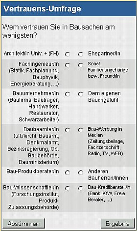

[🠔 Zur Übersicht: Pfusch-Anleitung (Satire)](altbau.md)  
# Die Seite mit den wirklich spannenden Bau-Umfragen
**Ihre Meinung ist gefragt: Spannende Online-Umfragen im Bauwesen.**  
_von Konrad Fischer_

## Bitte geben Sie Ihre Stimme ab 
Keine Angst - alles anonym!

Mein Umfragen-Angebot: 

### Vertrauens-Umfrage

### Krisen-Umfrage

### Nutzwert-Umfrage (Seitenbenotung!)

 

 **Krisen-Umfrage** 
Wer ist schuld an der Bau- und Finanzkrise der öffentlichen Hand? 
(Mehrfachnennung möglich) 

**Wählen!** **Ihre Meinung** 

Die uns abgepreßte Zwangssubvention aller ausländischen Mitwettbewerber 

Unsere Verscherbelung der lukrativen Staats- und Kommunalbetriebe an Heuschreck-Oligarchen 

Unsere überhöhten Polit-Personalkosten und -pensionen 

Unsere steuermindernde Unternehmensverlagerung in Mitwettbewerber-Länder 

Unsere steuermindernde Schwarzgeldverschiebung ins Steuerspar-Ausland 

Unsere steuersparende Schwarzarbeiterwirtschaft 

Unsere steuersparende Baukorruption der öff. Hand 

Unsere Kostenexplosions- und Pfuschplanung in allen Bereichen der öff. Hand 

[Toolia - Ihr Gratis-Umfrageservice](http://www.toolia.de)

## Die Nutzwert-Umfrage:

Bitte geben Sie Noten, anonym oder mit (Nick-)Namen und Kommentar. Ich beuge mich Ihrem Urteil! 
Mehr Anmerkungen/More comments **[- > Gästebuch/Guestbook](gaestebuch.md)** 
**Bewerten Sie den Informationsnutzen der "Altbau + Denkmal Info" mit Schulnoten:** 
1 Sehr Gut - Very Good A 
2 
3 
4 
5 
6 Ungenügend - Insufficient F 
Ihr Name: 

Kommentar: 

---

Wollen Sie dieses kostenlose Informationsangebot rund um das bessere Bauen unterstützen, 
damit es auch künftig eine kritische Gegenstimme zu anderen Meinungen bieten kann? 

Nichts einfacher als das: 

Bestellen Sie doch meine aktuelle ****WEB-DVD (mit über 3 GB interessanten Beilagen, die Sie teils nicht online finden) für 50,00 EUR**** (MWST und Versand inkl.), das hilft uns beiden: 
Sie sparen online-Gebühren, ich kann sie besser bezahlen. Auch als nettes Geschenk für Bauwillige, Altbaubesitzer, Handwerker und Planer geeignet.

**[Bestellformular](11form.md#neu: altbau und denkmalpflege#neu: altbau und denkmalpflege)**

