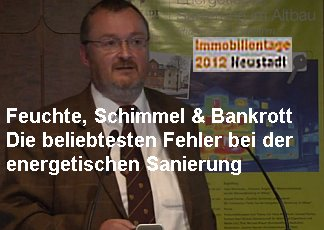

[🠔 Zur Übersicht: Video Vorträge](12akt.md)
# Feuchte, Schimmel + Bankrott - Fehler der Sanierung
**Die beliebtesten Fehler bei der energetischen Sanierung im Altbau.**  
_mit Konrad Fischer • 04.12.2012_

## Vorstellung

Ja, ein herzliches Grüß Gott aus dem Frankenland. Mein Name ist Konrad Fischer, ich stelle mich auch ein bisschen selber vor. Ich habe ein Architektur- und Ingenieurbüro, bin vorzugsweise in der Altbausanierung tätig und komme nun mal aus dem Frankenland. Deswegen ist es mir eine ganz besondere Freude, hier im Scheffelsaal sprechen zu dürfen. Der Viktor von Scheffel, der hat bei uns sehr gute Aktien. Ich weiß nicht, ob Ihnen schon mal der Begriff Frankenlied untergekommen ist: "Wohlauf, die Luft geht frisch und rein, wer lange sitzt, muss rosten. Den allerschönsten Sonnenschein lässt uns der Himmel kosten. Es reicht mir Stab und Ordenskleider, fahren den Scholaren geht eine weitere Sache dann. Ich will ins schöne, ins Land der Franken fahren!" Und ich bin jetzt nun zu euch gefahren. Der Neustadt-Ruf hat mich schon früher mal ereilt. Ich war schon mal auf dem Hambacher Schloss, das ist für mich als bisschen geschichtsinteressierten Menschen eine ganz eine feine Sache, wie hier der Ruf nach Freiheit erschallt ist. Freiheit von der bayerischen Regierung war das damals übrigens so. Das ist vorbei, Gott sei Dank. Die Freiheit ist immer noch nicht da, ne? Aber ja, was ich so mache, können Sie hier sehen: kleiner Auszug, richtig schöne alte Baudenkmäler, auch mal was Neueres, ganz buntes Spektrum. Altbau ist Altbau für mich. Paar Neubauten habe ich auch schon hinter mir, aber mein Schwerpunkt ist in der Altbausanierung. Und da möchte ich Ihnen heute einfach ein bisschen so die Erfahrungen darlegen, die entstanden sind in diesem Bereich. Und nachdem ich auch ein Ingenieurbüro habe und auch Heizungen rechne und auch Statik und so weiter, habe ich auch eine Beziehung zur Bauphysik und habe mich immer interessiert, was ist die Wahrheit hinter der Zahl? Weil wenn wir so eine, so eine Sache zum Beispiel jetzt rechnen, dann steht überhaupt nichts mehr da. Und dann, wenn wir das nach statischen Regelwerken dann versuchen zu instand zu setzen, da kann man also Millionen und Milliarden reinstopfen. Und wenn man ein bisschen anders rechnet, würde man vielleicht dahinterkommen, warum das überhaupt noch steht. Und insofern ist meine Kritik an diesem Zahlenspiel, das kommt auch dadurch, dass die alten Gebäude sich oft nicht so verhalten wie die schönen Rechenmodelle das hergeben. Und darüber möchte ich mit Ihnen ein bisschen sprechen.

## Das Geschäft mit der Angst und Architektenhaftung

Ich möchte auch ein bisschen breiter anlegen. Es geht um die Energiewende, es geht ums Energiesparen, das ist das Thema, und ich möchte nicht nur über die Dämmung sprechen, ich komme aber auch dazu, natürlich. Das kennen Sie, die Angst. Wir haben alle keine Angst, weil wir kein gutes, weil wir ein gutes Gewissen haben, alle. Ich sehe das so an Ihren Gesichtern, da hat niemand Angst und niemand lässt sich Angst machen. Aber so normal, so dem einfachen Verbraucher, dem jagt man mit immer denselben Dingen fürchterliche Angst ein. Also, der kriegt ja sogar Lebensangst. Und sehen Sie, das ist die Angst, die uns jetzt droht, wenn wir nicht die Energiewende machen, oder sowas, ja? Oder Sie kennen das, das ist das Geschäft mit der Angst, und das ist das Problem. Ich als Architekt bin Treuhänder für meinen Kunden, und wenn ich auf dieses Geschäft mit der Angst reinfalle und hinten kommt nichts raus, ja, was glauben Sie, wer dann den Schaden bezahlt? Das ist der Architekt in seiner gesamtschuldnerischen Haftung. Und solche Prozesse laufen, die Kunden, die haben Wunder, was da an Energieersparnissen sich erträumt, erträumen lassen durch den Planer, und dann stellt sich nicht ein, und wer hat Schuld und wer zahlt den Schaden? Architekt. Und der hat auch eine Haftpflichtversicherung verpfuscht, das ist das Problem.

## Mythos "Aufsteigende Feuchte"

Eine der zentralen Ängste ist ja das Wasser. Sie wissen, Wasser ist der Feind des Bauwerks, und wir trauen uns eigentlich heutzutage auch gar nicht mehr richtig ans Wasser hinzubauen. Was sieht man hier innen drin? Alles feucht. Wie nennt man das Symptom hier, wenn da die Feuchte so hoch kriegt? Kennt einer? Das ist die aufsteigende Feuchte. Gibt es die? Wer ist dafür? Gibt es aufsteigende Feuchte? Hier bitte mal die Hände hoch. Ja, also manche glauben daran. Wer glaubt, es gibt keine aufsteigende Feuchte? Wer ist so weit? Eins, zwei, drei, vier, fünf. Okay, also die Mehrheit denkt, es gibt die aufsteigende Feuchte, und das macht natürlich viel Angst und ist auch ein super Geschäft, weil, was macht man jetzt da? Natürlich eine Horizontalisolierung. Gibt es verschiedene Methoden dazu, zum Schluss sogar gibt es Zauberkästchen. In Wirklichkeit gibt es eben keine aufsteigende Feuchte, was wir genau am gegenüberliegenden Bauwerk hier vorgeführt bekommen, das in Bamberg. Da hat man mitten in den Fluss, ja, hier reingebaut, und hier gibt es auch nicht also einen Zentimeter aufsteigende Feuchte. Was hier nass wird, ist ein bisschen von der Welle. Und warum gibt es keine aufsteigende Feuchte? Das verraten uns auch die Anbieter für Maßnahmen gegen aufsteigende Feuchte, die müssen nämlich "aufsteigende Feuchtigkeit" draufschreiben, wo keine Feuchte aufsteigt. Also hier der Unterschied zwischen Theorie und Praxis in einem Bild. Ich habe mich totgelacht. Und auch die Konkurrenz, drei Stände weiter, es war auch, es war die Denkmalmesse in Leipzig, auch dem gelingt es nicht, eine aufsteigende Feuchte zu simulieren. Wie Sie sehen, die steht im Wasserbad, diese Steine und diese Pfeiler, die werden nass, natürlich der unterste Stein. Und schon an der ersten Fuge hört die Feuchte aufzusteigen. Das möchte ich Ihnen mal nur so nebenbei verraten: Lassen Sie sich nicht reinlegen, es gibt keine aufsteigende Feuchte. Warum nicht? Weil es keinen Kapillartransport gibt zwischen feinen Poren wie im Stein zu den groben Poren im Mörtel. So einfach ist die Welt. Ich möchte nicht wissen, wie viel hier sitzen und haben schon Tausende reingegurgt gegen aufsteigende Feuchte. Das ist das Geschäft mit der Angst, und so äußert sich das. Und wovor man auch ein bisschen Angst haben muss inzwischen: das Architektenblatt ist so ehrlich, und das ist ein Artikel im Architektenblatt, "Pfusch am Bau". Danke, liebe Architekten, ich kann das jetzt ruhig sagen. Also normal darf ich nichts gegen meinen Berufsstand sagen, aber wenn unser Architektenblatt selber, kleines Leck, große Wirkung, davor müssen Sie Angst haben. Und wie sieht das dann innen drin aus? So flächendeckende Dampfbremse oder Dampfsperre und dahinter die schöne Dämmung. Und dann wird aufgemacht und so sieht es da aus. Ich habe mich mit dem Verfasser dieses Artikels selbst unterhalten, habe mir dann die Originalbilder auch besorgt, habe mir die Erlaubnis besorgt, es dann auch zu zeigen. Und das liegt eben nicht an irgendwelchen einblasenden, offenen Fugen oder sowas, sondern das ist die Sommerdiffusion, die Umkehrdiffusion, weil man muss doch drüber nachdenken: In diesen Stoffen ist doch eine Masse an Luft vorhanden. Wir haben doch vorhin gehört, Diffusion und alles, ja? Und natürlich ist der Taupunkt auch da drin, und zwar mal hier, mal da, mal dort. Der wandert so durch die Jahreszeit, durch diesen Dämmstoff, mal von innen, mal von außen rückt an, ja? Und dann fällt die Brühe aus und dann reichert die sich dort an. Und so sieht es dann aus. Was glauben Sie, wie groß dann die Überraschung ist? Hat man vor vollkommen falschen Dingen Angst gehabt und hat sich bemüht Tausende. Und so stimmt natürlich dieser Satz: "Die Energiewende erfordert die Sanierung des Klammer auf, Klammer zu sanierten Gebäudebestands." Natürlich nicht so gemeint. Das ist der Branchen-Intimus, der Dr. Martin Fiesmann, der erzählt uns dann: "Fossile Energieträger werden endlich. Der Verbrauch von Kohle verursacht CO2-Emissionen, die machen die Erwärmung der Atmosphäre. Es gibt Konsens, dass wir nicht mehr als 2° die Globaltemperatur steigen dürfen." Ich sage, solche Leute hat man früher ein Baströckchen angezogen und nach Afrika und da Regentänze aufführen lassen, die das Wetter beherrschen wollen. Heute kriegen sie Doktoren und dürfen publizieren. Und jetzt muss hier 40% durch Effizienzsteigerung, sprich durch Wärmedämmung, im Wesentlichen eingespart werden, sonst klappt das nicht. Und wir erinnern uns an diesen rennenden Globus, ungefähr so funktioniert das Geschäft mit der Angst. Und unsere schöne Bundesregierung, hier in Form des Bundesministeriums für Umwelt, Naturschutz und Reaktorsicherheit, interessante Kombination eigentlich, die macht auch bei diesem Geschäft mit. Sie erläutert hier: "Ist unsere Wärmeversorgung ein Problem?" Aha, die Wärmeversorgung ist sichergestellt. "Kein Grund zur Sorge, dass Öl und Gas in den nächsten Jahren knapp werden, aber mittel- und langfristig schon wieder." "Kohle, Öl und Gas sind begrenzt." Ist das wahr? "Kein Wort wahr", sage ich Ihnen, "kein Wort." Es gibt weder fossile Energien, denn diese ganzen angeblichen Fossilen, die entstehen aus unerschöpflichen Erdgasquellen, ist schon seit den 50er Jahren alles publiziert und wissenschaftlich belegt und nicht widerlegt. Es gibt nicht diese Förderhöhepunkte, das ist eine Argumentation der Verkäufer, die uns Angst machen wollen: "Mensch, irgendwann ist es aus und der Preis muss rauf." "Die Preise werden steigen", sagt die Regierung, "bis schließlich gar keine fossilen Energieträger mehr geliefert werden können." Schon heute werden keine fossilen Energieträger geliefert, es gibt gar keine. Die Idee kommt von Lomonossow 1766. Da hat er irgendwo Kohle so ein paar Baumstämme gefunden, hat gedacht, das ist daraus entstanden. Schon Humboldt 1801 hat es widerlegt. Er hat es selber gesehen, die Erdölquellen in Südamerika, das ist schon seit Hunderten von Jahren wieder, und trotzdem wird es von der Ölindustrie und von der Gasindustrie immer noch genommen. "Öl und Gas werden zu einem hohen Anteil in geopolitisch unsicheren Regionen gewonnen." Warum sind die so unsicher? Ja, weil wir mit Spionage-Schiffen dort die Kriege provozieren. Und dann kommt der Treibhauseffekt und der Klimawandel dazu, und da muss die Regierung nun in Vorsorge etwas tun. Wie verhält sich das mit diesem Treibhauseffekt? Sie kennen alle dieses Bild: Die Sonne kommt daher, sie prallt auf die Erde, sie prallt erschrocken zurück und dann stößt sie plötzlich an diesen Kohlendioxid-, CO2-Mantel und soll hier brutalste Wärme auf die Erde loslassen. Wer von Ihnen weiß, wie viel CO2 überhaupt in der Luft ist? 10 %? 100 %? 80 %? Die Hamburger Architekten haben gesagt: 80 %. In Wirklichkeit ist es 0,03 %. Es ist bei einer Menge von 3000 z.B. dieser eine Punkt, und dieser eine Punkt soll die Erde zum Kochen bringen. Und jetzt überlegen wir uns mal, wie viel wiegt eigentlich das CO2 gegenüber der Luft? Wer weiß das? Ich will nicht abfragen, einer weiß es. CO2 wiegt Molgewicht 44, Luft hat 29. Das heißt, da oben findet sich gar kein CO2. Ich kenne keine Messung, die da oben CO2 nachgewiesen hat. Und wir als Brauer, ich komme aus einer Brauereifamilie, wir kennen den Prozess CO2. Das ist unten am Boden und ernährt da die Pflanzen oder bringt den Bräuer um oder die bäuerliche Familie beim Silo reinigen. Das ist CO2, da unten ist es. Und diese schöne Schicht hier in 6 km da oben, wie kalt ist die? Wer ist schon mal nach Mallorca geflogen und hat zugehört, was der Pilot da sagt? Der sagt 50°, aber da oben hat -70°. Und jetzt wollen die uns allen weismachen, dass hier ein kalter Heizkörper mit -70° hier unten erwärmt. Das ist für mich der Gipfel des Wahnsinns, und darauf beruht die Energiewende. Verstehen Sie? Es ist für mich nicht nachvollziehbar. Ja, und dann kommt hier die Heizindustrie und die zeigt da so El Gores seine Prognosen, wie das CO2 nach oben schnellt und die Temperatur. Und Sie kennen auch diese bösen Engländer, die uns mit solchen Grafiken immer belästigen. Halle, die sind ja dann auch wegen ihrem Climategate dann aufgeflogen. Hier wird immer 1860, sehen Sie? Und es soll angeblich steigen und steigen. Ist es wahr? Das ist der berühmte Mojib. Sein Vater hat die erste Moschee, der Imam hat die erste Moschee in Hamburg gebaut. Es war ein ehrenwerter Priester oder ich weiß nicht, Muslim, Imam. Der Sohn hat sich so selbst zum Propheten gemacht und prognostiziert uns jetzt die Klimaerwartung. Sage ich immer so: Früher waren die Frösche grün, die Farbe haben sie geändert, aber sonst sind Frösche Frösche. Auch hier wieder diese schöne Kurve, alles ganz genau berechnet. Wir in Bayern, wir messen selber. Hohenpeißenberg, sehen Sie? 1753 habe ich losgelegt. 81 hier, es war schon wesentlich wärmer als heute. Das ist die schöne Situation, wo immer alle loslegen mit ihrer blöden Kurve. Das ist Betrug, vorsätzliches Weglassen der ganzen Wahrheit. Das ist Betrug, das ist Geschäft mit der Angst. Und das können Sie überall in Europa und auf der ganzen Welt finden. Sie dort, wo anständige Menschen einfach gemessen haben, finden Sie genau diese Kurve. Und so ist es die letzten 10 Jahre, es geht nach unten, aber der CO2-Gehalt geht nach oben. Haha, das ist die Realität. Und das ist der Kovats hier, ein Bekannter von mir, der zeigt jetzt mit den deutschen Wetterdienstdaten. Selbst der Deutsche Wetterdienst betrügt uns und sagt, er macht hier irgendwelche Erwärmungen dingfest. Aber wenn man nur seine nackten Daten nimmt, zack, das ist die Linie, die sich dann ergibt, die letzten 10 Jahre, jetzt 2010. Das ist die Realität, darüber müssen wir reden. Und sogar im Spiegel können wir es lesen, soweit wir noch lesen überhaupt. Das ist hier der CO2-Gehalt, und er korrespondiert eben nicht mit der Temperatur. Das geht hier ab 1880, das ist wieder diese steigende Temperaturkurve, aber CO2 hat damit eigentlich in dem Sinn nichts zu tun, sondern ist identisch mit der Sonnenfleckenaktivität. Schlichtweg, die Sonne macht die Wärme, und wenn sie nicht so doller scheint, dann wird's ein bisschen kühler. Das hat die Oma auch schon gewusst, da brauchen wir keine Klimawissenschaftler. Ja, und in Franken, Sie kennen das mit diesen äh Ansagen zum Hochwasser und so, aber die richtigen Hochwasser hier, die waren 1784, das ist die Neckarbrücke in Heidelberg. Also ich bin ja selber Klimaforscher geworden dann inzwischen, und sehr sagenhaft. Und das höchste diesseitige hier, 1970, kniehoch, so etwa. Und was waren hier Dämme oder ich sag, was müssen die Leute geheizt haben? Da 1784, 1595, was müssen die Auto gefahren haben, wie die Verrückten? Ist unglaublich, was im Mittelalter alles los war. Wir haben keine Ahnung davon, unglaublich. Und was macht unsere Politik hier? Klimatagung ohne Beirut, der bayerische Umweltminister, "schnapp auf übergeschnappt", sage ich immer gerne. Ja, der sagt, weltweit Schäden durch Naturkatastrophen. Wirtschaft und Bürger müssen deshalb den CO2-Ausstoß reduzieren. Am selben Tag übrigens, in der anderen, in derselben Zeitung: die Eiszeit fängt bald wieder an. Na, das ist Zeitung halt, ne. Ich meine, muss immer ausgewogen beide Seiten bringen. Ja, und dann macht natürlich der bayerische Staat, 1832 sind hier alle aufgestanden gegen diesen verrückten Staat in Bayern, aber unser "Schnapp auf" da ja, Programm gegen Kohlendioxid, gegen diese Nichtigkeit, gegen nichts. Aber was wird gemacht? Förderung aus Privatisierungserlösen. Unser ganzes Tafelsilber wird verschachert. Ja, dann Klimaschutzbemühungen, und Bayern natürlich wieder vorne, 30 % unter dem Bundesdurchschnitt beim CO2-Ausstoß. Ach übrigens, dieser "Schnapp auf", inzwischen Senior Advisor bei der Bank of America, vorher Hauptgeschäftsführer BDI. Ach, und dann war er auch mal Umweltminister, und vorher war er sogar mal Landrat. Das ist eine Karriere, und dann haben sie ihn gefragt jetzt unlängst, die Neue Presse Coburg, wie muss man sich diese Arbeit bei der Bank so vorstellen? Stellen sich vor, es wird ein großes Windparkprojekt geplant. Dafür braucht neue Technologien, über die deutsche Industrie verfügt. Ebenso ist Kapital erforderlich, weil so ein Vorhaben viel Geld kostet. Darum kümmert er sich. Und so sieht dann Deutschland aus. Das ist ein Istzustand, und so soll Franken werden, Bayern werden, und Rheinland-Pfalz soll auch so werden. Und ganz Deutschland soll flächendeckend zugemüllt werden, und wir sind dagegen. Aber so ein "Schnapp auf", der ist dafür, und der organisiert es auf jeder Ebene. Und auch als Politiker hat er sich nicht hinter die Bürger gestellt, sondern hinter seine Lobbyisten, sage ich mal. Und dann haben wir rausgekriegt in Oberfranken, angeblich windträchtigste Region, dass es praktisch nur eines gibt, das unter den Referenzwert von 60 % das den überschreitet. Alle anderen Windräder sind unwirtschaftlich. So sieht's aus. Trotzdem kriegen wir ihr Geld, und so sollen jetzt alle unsere Hütten zugemüllt werden. Das ist ja, das ist sogar aus Rheinland-Pfalz übrigens, und so sehen die nach ein paar Jährchen aus, weil die sind extrem belastet. Und so sehen sie dann aus, wenn das Klimaschaf, das haben sie jetzt bei uns in Oberfranken erfunden, muss jetzt ein Klimaschaf, da gibt's so Mini-Schafe, die passen genau im Kopf noch drunter, und das wird als Solarschafsbraten wird es angepriesen bei uns in der Zeitung. Das ist unglaublich. Und das ist bei mir im eigenen Kaff 2005, und da bin ich aufgewacht, wieder unser zentraler Bauer mit seiner schönen Klimaschutzanlage dann in die Luft geflogen ist. 800 m sind diese giftigen Spreißel dann im ganzen Ort, haben das alles verseucht. Und ich habe dieses Jahr, ich habe in meinem Internet, ich habe eine ganz tolle Internetseite, 2000 Seiten, und eine Seite davon ist die PV-Brandchronik. Und ich habe dieses Jahr schon über 100 Einträge, voll abbrennen, so was. Die Dinger sind nämlich lebensgefährlich, und es verrät euch niemand, und wenn ihr Details wissen wollt, müsst ihr mal nachgucken, unglaublich. Die fliegen von selbst in die Luft, Zeitbombe Photovoltaik, ein Film, den ich mit dem Bayerischen Rundfunk darüber gemacht habe. So, das ist eure Zukunft, dann macht nur schön weiter. Und um auch über die Zukunft mal was zu sagen, hier NAB, Nationale Anti-EG-Bewegung, ein kleiner, feiner Verein. So sieht's dann aus, eure Zukunft mit eurem Strompreis. Stromlüge, deutsche Energiewende, Doppelpunkt: von Kernkraft zu Kohle und Gas plus EEG-Kosten, dass irgendwelche Leute einstecken, sind wir auch dagegen.

Kommen wir zum Energieeinsparungsgesetz. Das ist die Mutter, die Ermächtigungsgrundlage der Energieeinsparverordnung. Das wird für uns Bauleute das Interessante. Wer hat hier ein Haus oder eine Wohnung? Ist Besitzer? Wer ist Mieter? Sind auch ein paar da. Also, das betrifft uns alle. Und dann steht in dieser Ermächtigungsgrundlage für die Energieeinsparverordnung: "In der Rechtsverordnung ist vorzusehen, dass auf Antrag von den Anforderungen befreit werden kann, soweit diese im Einzelfall zu einer unbilligen Härte führen." Das sagt das Gesetz. Das ist diese berühmte Härtefallregelung. Und jetzt kommen wir zur Haftungsfalle in der EnEV.

Paragraph 24 der EnEV, Energieeinsparverordnung, regelt die Ausnahme bei Baudenkmälern, Paragraph 25 die Befreiung. Dort steht, dass Behörden auf Antrag zu befreien haben, wenn es unwirtschaftlich ist. Weshalb ich die Haftungsfalle thematisiere? Weil Hausbesitzer ein Recht darauf haben, in ihrem Plan aufgeklärt zu werden: Dämmung mag verrückt erscheinen, aber sie lohnt sich wirtschaftlich nicht. Daher verlange ich eine Freizeichnung, um keine Haftung für misslungene Energiesparversuche zu übernehmen. Dann plane ich mit meinen Freunden WDVS und alles Mögliche, schneidere es auf den Leib, aber es lohnt sich nicht.

Ich bin Sachverständiger für die Durchführung der Energieeinsparverordnung in Bayern und erhalte ständig Projekte, Beratungsergebnisse und Wirtschaftlichkeitsberechnungen. Noch nie bin ich auf eine Wärmedämmung gestoßen, die nach geltenden Kriterien wirtschaftlich gewesen wäre. Es sind kriminelle Akte von Leuten, die den Leuten das aufschwätzen. Geschädigte erwerben ein Recht auf Schadensersatz. Die Juristen wissen das, und die Prozesse laufen. Der baden-württembergische Architektenkammerpräsident hat sich schon darüber beschwert, dass es schon wieder die Architekten trifft.

Was ist das Kriterium? Die Heizkostenverordnung, die Schwester der Energieeinsparverordnung, bestimmt 10 Jahre als Grenze; was sich danach nicht rechnet, ist unwirtschaftlich. Auch die geltende Rechtsprechung in all diesen Prozessen zwischen Wohnungseigentümern und wer weiß was um die Frage der Wirtschaftlichkeit einer Dämmmaßnahme: 10 Jahre ist die Grenze. Ich habe noch nie eine Dämmung gesehen, die sich in 10 Jahren durch Ersparnisse auf dem Papier rentiert.

Ja, dann haben wir dann noch hier die Geldbußen, ja, ja, und es ist ganz viel verboten. Und jetzt kommen wir zum Erneuerbare-Energien-Wärmegesetz, die neueste Schandtat unserer Regierung. Und da haben sie dann jetzt Folgendes gemacht: "Die mit dem Vollzugsbeauftragten sind berechtigt als Amtsperson die Wohnung zu betreten. Das Grundrecht der Unverletzlichkeit der Wohnung Artikel 13 des Grundgesetzes wird eingeschränkt." Sie schränken die Grundgesetze ein. Die Polizei darf kommen, wann und wie sie will, und sie darf Ihnen rumbohren in der Dämmung und gucken, ob sie genug Photovoltaik haben, und Sie kriegen dann Geldbußen von 50.000 €. So sieht's aus. Das sind unsere Gesetze, und damit Sie mal so einen Einblick in die Hirne dieser Gesetzgeber bekommen, lese ich Ihnen mal aus dem EDL-Gesetz. Von dem haben Sie überhaupt noch nie gehört, Energiedienstleistungsgesetz. Mal, was im Entwurf da drin gestanden war: "Energielieferanten, die Strom, Erdgas, Fernwärme, Heizöl, Flüssiggas oder Kohle an Endkunden, da sind sie, verkaufen, sind verpflichtet, in jedem Kalenderjahr für ihre Endkunden in den Endkundengruppen nach Anlage 1 Effizienzmaßnahmen und Programme durchzuführen." Ihr Heizhändler muss bei Ihnen eine Effizienzmaßnahme durchführen. Ja, hier weiter: "Die Effizienzmaßnahmen und Programme sollen zu einer Minderung der Liefermengen von 1 % führen." Sie dürfen jedes Jahr nur noch 1 % weniger einkaufen als vorher. Und damit es klappt, die Energielieferanten zeigen der Bundesstelle für Energieeffizienz – ich nenne das das neue Reichssicherheitshauptamt – bis spätestens zum 31. Dezember eines jeden Jahres für das nachfolgende Kalenderjahr an, welche Energiemenge sie an den Endkunden geliefert haben. Stellen Sie sich das mal vor, das sind die Gesetze, so was schreiben die. Das sind Leute, die ich bezahle, und die Sie bezahlen, in unserem Auftrag sozusagen, schneidern die uns solche Gesetze auf den Leib.

Und jetzt wird's noch lustiger: "Energielieferanten, die Kraftstoffe für den Verbrauch im Straßenverkehr an Endkunden verkaufen, sind verpflichtet, ihre Endkunden über kraftstoffsparende Fahrweisen zu informieren, stellen sich das mal praktisch vor, und ihren Endkunden da zumindestens einmal pro Monat Schulungen mit praktischen Fahrübungen anzubieten." Also meine Frau würde ich gerne mal hinschicken, aber nicht wegen Energiesparen. Ja, "die Anzahl der Teilnehmer an den Schulungen, oh welch große Gnade, kann auf ein Maß begrenzt werden, das für die wirksame Durchführung der Übungen erforderlich ist." Also bitte nicht 500 auf einmal über diesen kleinen Tankstellenparkplatz da, es könnte ja Unfälle geben. "Energielieferanten sind verpflichtet, ihren Endkunden über die kraftstoffsparende Wirkung von Leichtlauföl und Leichtbau-Leichtlaufreifen zu informieren und diese Produkte anzubieten." Hey, das ist ein Gesetzentwurf. Das sind die Ministerialen. "Bundesstelle für Energieeffizienz erledigt in eigener Zuständigkeit Verwaltungsaufgaben auf dem Gebiet der Energieeffizienz und Datenerhebung zur Erfüllung ihrer Aufgaben kann die Bundesstelle für Energieeffizienz von Energie oder in die Übermittlung zusammengefasster Daten über den Endkunden in anonymisierter Form verlangen, insbesondere zum Verbrauch der Endkunden und so weiter und so weiter, und sie darf selber entscheiden, wann und wie die Daten zu übermitteln sind und die Verwendung der Daten." Und die Bundesregierung regelt durch Rechtsverordnung ohne Zustimmung des Bundesrates. Das ist das heilige Offizium, das ist die komplette Ermächtigung. Wie soll ich mal sagen, der Papst ist ja irgendwie ein Waisenknabe dagegen, ja, das ist heilig, das ist das neue Heiligtum. Und dann zum Schluss drohen 500.000 € für jeden Verstoß dann.

## Gebäudeenergiepass und Klimaschutz

Ja, kommen wir zum Gebäudeenergiepass. Weltklasse. "Ich habe zur CO2-Einsparung für Maximaldämmung entschieden. Für die Schimmelpilze in der Wohnung hat sich das schon gelohnt." Ja, hat sich das Klima schon total verbessert. Eine Grafik von Götz Wienroth mit der Energieeinsparverordnung EnEV. "Verspricht der Bundesbauminister Investitionsschub. Aha, die Nachfrage nach neuen Fenstern und Wärmedämmungen werde ansteigen." Das verspricht der Bauminister. Ja, die EnEV, ein wichtiges Element der Energie- und der Klimaschutzpolitik. Ja, das ist Klimaschutz praktisch. Ja, da draußen ist kalt, und in der Bude soll es warm sein. Weil man nun aber mit diesem neuen Fenster das probiert hat, da läuft die Brühe die Wand drunter, mit folgender Folge, sehen Sie hier. Das sind alles Klimaschutzfenster und Klimaschutztüren. Das ist der Klimaschutzaffe namens Besitzer. Nein, das ist ein Spielzeug, alles ist Dreck, alles.

## Wärmebrücken und Heizluftstrom

So, und von wegen, dass hier Wärmebrücken sind, das ist natürlich Unsinn, tut mir leid, das sagen zu müssen. Das sind keine Wärmebrücken, sondern das ist ein reines strömungstechnisches Ereignis der Heizluftstrom, die Heizluftkonvektion, die spart nun mal systematisch die Ecken aus und die Kanten, und deswegen kommt's dort zum Schimmeln und nicht, weil da irgendwo Betonplatten gewesen wären. Die sind hier gar nicht, und ist dasselbe hier, da kommt der Heizluftstrom nicht hin. Das ist die kühlste Stelle, die Feuchte kann nicht raus, zack, Schimmel. Hat natürlich nichts mit Wärmedämmung zu tun.

## Zwangslüftung und Sick-Building-Syndrom

Und dann kommt da diese Idee, ja, dann lasst uns doch lüften, lasst uns doch lüften mit Zwangslüftung. Das soll auch verkauft werden, und so sieht es in der Lüftung aus. Und wenn man es dann mal ein bisschen anwachsen lässt hier, die Ereignisse da in der Lüftung, da sieht es so aus, oder man wird man sterbenskrank. Das nennt sich übrigens Sick-Building-Syndrom, und ich kenne viele Krankheitsfälle. Ich habe viele Kunden, wo die Kinder dann in der Intensivstation schon hängen.

## Fensterglas und Wärmedämmung

Apropos Fenster, kann denn überhaupt Wärme durch ein Fensterglas durch? Kann Wärme durch ein Fensterglas? Ja oder nein? Hände hoch. Ja, kann Wärme durch ein Fensterglas? Nein. Und jeder weiß das, es gibt Brandschutzgläser. Sie sehen das Feuer, aber Sie spüren dessen Hitze nicht. Der Witz ist folgender: hier sehen wir die Durchlässigkeit von Fensterglas im Wellenlängenspektrum. UV kann nicht durch hier, das ist der UV-Bereich, UV-Strahlung, Sie werden nicht braun hinter einer Fensterscheibe. Licht kann durch, und die Wärmestrahlung im Infrarotbereich, die uns interessiert in den maßgeblichen Temperaturen, dafür ist ein normales Fensterglas komplett undurchlässig, komplett. Da geht nichts durch. Es kommt zu kleinen Absorptionen, es gibt zu Emission, aber es gibt keinen Durchgang von Infrarot durch normales Fensterglas. Das müssen wir dann genauer betrachten. Ich kenne keine einzige wissenschaftliche Untersuchung, wo man nachgewiesen hat, dass man durch Doppel- oder Dreifachfenster gegenüber einem Einfachfenster Energie gespart hat. Im Gegenteil, kenne ich Fälle, oder hat einer sich gewehrt gegen die Maßnahme der Wohnungsverwaltung und hat seinen alten Kram behalten und hat genau dieselben Abrechnungswerte gehabt wie die anderen auch. Also ist alles, es gibt keine praktischen Nachweise, es ist Verkaufsargumentation auf Basis der Angst vor hohen Heizkosten.

## Wärmebilder und Solarenergie

Dann kommen diese berühmten Wärmebilder. Immer schreibt man hier allen Ernstes: "Ministerien verplempern Energie. Das Ministerium für Bauen und Wohnen links sowie das Justizministerium rechts sind extrem schlecht gedämmt. Anders der Landtag, ja, der ist schön dunkelblau, aber schauen Sie mal, wie gut der gedämmt ist, ja, alles aus Glas, toll." Ha, so schreibt die Zeitung, und da rennt die mit ihrem einem Energieberater rum, und siehe da, das ist der Kaiser Wilhelm übrigens, das ist der Kaiser Wilhelm. Und die in Düsseldorf, die haben scheinbar so viel Geld schon eingespart und Energie, die heizen jetzt den Sockel. Das ist nämlich der Sockel, die heizen den Sockel. Ja, sind denn die verrückt geworden? Nein, der Energieberater ist verrückt. Der muss doch wissen, hier, das ist die aufgenommene Solarenergie, die misst er halt, die ist eingespeichert, ja, da misst er sie halt. Und da oben, der arme kalte Willi mit seinem Kopf da oben drauf, das ist ein bisschen dünnwandig, da kühlt er halt früher aus und läuft ein bisschen blau an, die Arme. Aber die anderen, die glühen gemütlich für sich hin, und wen beschimpft, wen beschimpft dafür, dass sie Solarenergie speichert und die ganze Nacht nicht den Taupunkt erreichen? Ich habe an meinem eigenen Haus messe ich das. Wir haben eine Außenluft von -10°, da haben wir an der massiven Außenecke hier, die Sonnenlicht beschienen ist, schon 9° an einem Januartag, während die massive Schattenseite noch auf -1° ist, aber natürlich nicht den Taupunkt unterschreitet, weil sie ja wesentlich wärmer ist als die Außenluft. Das ist der Massivbau.

## Dämmfassade und Massivbau im Vergleich

Und dann habe ich ja im NDR diesen schönen Film "Wahnsinn Wärmedämmung" mitmachen dürfen, und da kommen wir dann an ein gedämmtes Haus und ein ungedämmtes, und dann haben wir auch so eine tolle Kamera dabei, das kann doch jeder. Das ist 14 Uhr, da glüht die Dämmfassade ihre Hitze ab wie verrückt, aber dem armen Haus kommt nichts zu Gute davon, weil das wird vorne weggedämmt. Und hier dann 20 Uhr, haben wir gerade den Punkt erreicht, wo beide gleich kalt sind. Von wegen, dass die Dämmstoffe sich da irgendwie schön abzeichnen. Und dann warten wir noch 3 Stunden, und dann steht das Ding warm da, und der ist noch kälter, verspreche ich Ihnen. Das ist der ganze Trick.

Und stellen wir uns mal nur mal vor, Ihr eigenes Vorgärtchen, und da stellen wir eine südnordorientierte Mauer rein. Können sich das vorstellen, eine Wand, einfach so ein kleines Mäuerchen, und es besteht zur Hälfte aus Dämmstoff und zur Hälfte aus Stein und ist weiß gestrichen, verputzt. Und jetzt ist 21. Juni, und es kommt um 14 Uhr, ganzen Tag hat die Sonne drauf geschienen, jetzt kommt um 14 Uhr der Thermograf und macht sein Bild. Welche Wand ist wärmer? Welche Wand, die gedämmte? Wer ist dafür, für die Dämmstoffwand, dass die wärmer ist? Wer ist für die, für die Steinwand, dass die Wärme ist? Hände hoch, die Mehrheit, alles falsch. Die Steinwand wird nie mehr als 35° haben, habe ich selbst gemessen, weil die absorbiert die ganze Wärme, saugt sie rein und speichert sie weg. Und wann kommt dieser Hauptstadtautolawina in der Gespensterstunde, wenn nur Kriminelle unterwegs sind, und jetzt fotografiert? Und welche Wand ist jetzt wärmer? Vielleicht kommt er auch vor dem ersten Hahnenschrei, wenn nur Mörder und Diebe unterwegs sind, und jetzt fotografiert? Und welche Wand ist jetzt wärmer? Die Steinwand, die hat nämlich ihre aufgenommene Wärme, kann die ganze Nacht wieder durch abgehen und niemals kommt sie unter den Taupunkt, niemals.

## Fraunhofer-Institut und Taupunkt

Und das ist ja auch schon von Fraunhofer rausbekommen. Ja, Fraunhofer hat das Institut für Bauphysik, Fraunhofer-Gesellschaft, wunderbare Messungen. Hier, das ist der Taupunkt, hier diese grüne Linie, und die gedämmte Wand fällt hier ab 22:30 Uhr unter den Taupunkt und nimmt bis früh um 8 Uhr nimmt die Feuchte auf, wohingegen die nicht gedämmte Wand, die bleibt immer schön wärmer als der Taupunkt. Muss man erst mal wissen, muss man erst mal wissen, hier ist der Taupunkt. Taupunkttemperatur hier haben wir ein WDVS, wesentlich größere Unterschreitungen als diese monolithisch mit U-Wert 0,35, Ihr warnwitzige porosierte Wand. Geht natürlich, wird nicht so heiß am Tag, wird nicht so heiß und wird auch nicht so kalt. Das ist der Vorteil von Massivbauten, die zerreißen am Tag nicht so, und in der Nacht schüttelt sie es nicht so durch. Und wenn sie nicht so nass, das müssen Sie wissen.

## Kondensation, Reifbildung und Schäden an WDVS

Ja, und deswegen wiederum deutsches Architektenblatt: "Kondensation, Reif- und Eisbildung auf Wärmedämmverbundsystemen. Die Kondensationsdauer erstreckt sich bis Sonnenaufgang, dann entlang der Sockelschiene keine Reifbildung." Die Sockelschiene ist aus Metall, die speichert, und deswegen sehen Sie auch diese Leopard-Effekte, diese Wärmedübel aus Plaste, die speichern, die bleiben hell, der Rest wird dreckig. Das ist der ganze Trick. "Während der Messperiode konnte ein vollständiges Abtrocknen in der Fassade tagsüber nicht festgestellt werden." Also, wenn Sie eine schöne Grotte mit nasser Wand bauen wollen, WDVS, besser geht's nicht. Und so sieht es dann praktisch aus, überall fällt das Zeug dann nach einiger Zeit durchgefroren runter. Hier übrigens, die neue Messe München, nach einem Jahr ist schon alles runtergefallen. Da sind die so weit gegangen, die haben die Außenstützen vollwärmegedämmt, die Außenstützen vollwärmegedämmt. Ja, und da ist alles runtergefallen. Dann haben sie gesagt, der Handwerker ist schuld, wurde alles runtergerissen und erneuert, und im nächsten Jahr darauf war es wieder so weit, unglaublich. Neue Messe München, da findet die deutsche Bau-App statt. Das ist Hamburg, sehen Sie? Leopard-Effekt, so sehen die Wohnungsbuden aus in Hamburg, alles nass, da tropft die Brühe raus. Vorsatzschalen, WDVS, alles unglaublichste Schäden. Die Spechte hier, mit Maden durchfüllt, das wurde auch nach einem Jahr weggerissen. Die Frauen haben geschrien, da sind immer diese Maden aus dem Speck gekommen, und ich meine, die Spechte, die sind drauf spezialisiert. Ja, und dieser arme Hausmeister hier in einem Tagungshotel in Hannover, da guckt der Spatz raus oder der Star. Die Spechte sind saubere Typen, die ziehen jedes Jahr ein neues Loch und haben Nachbewohner, die scheuen sich nicht, dann in diesem, ja, und auch hinter diesen Mineralwollen sieht auch schlecht aus. So, das ist in Erlangen. Könnte man denken, lauter Taubenkrauchen haben sich da zurückgezogen, nachdem sie natürlich überall, wo die warme Feuchtluft hinklatscht an den kalten Kram, kommt es zu diesen Erscheinungen. Das ist hier in meiner Nachbarortschaft. Überall finden Sie das, bitte machen Sie die Augen auf und schauen Sie raus, überall.

## Feuchtigkeit in Vorhangfassaden und Dachkonstruktionen

Und auch dann hinter diesen Vorhangfassaden, machen Sie mal auf, schauen Sie rein, alles patschnass, durchgegammelt hier, dann in den Dachkonstruktionen auch, können Sie hier Vorhangfassade in den Decken, in den Wänden, überall. Es wird fürchterlich nass. Warum? Es ist eben nicht so, dass die Dampfdiffusion eine Rolle spielt, die bringt nur die Feuchte rein, aber raus geht sie tausend zu eins kapillar, und in diesen Stoffen gibt's keinen Kapillartransport. Es ist nämlich flüssig auskondensierte Feuchte, die da drin ist, und um die rauszudampfen, bräuchten Sie kleine grüne Maßmenschen mit dem Tauchsieder, und den haben Sie nicht, und ich auch nicht. Und dann machen Sie Ihre Stoßlüftung, und dann kühlen Sie genau die Problemzone ab, und haben Sie vielleicht schon mal rausgekriegt, durch Abkühlung kann ich nicht Wasser verdunsten? Das heißt, ihre nasse Zone wird danach noch nasser. Das ist der ganze Effekt der propagierten Stoßlüftung, Sie brauchen stetige Lüftung.

## Wärmedämmung in Amerika und Brandschutz

In Amerika da werden hunderte, tausende, zigtausende von Häusern, können Sie wegwerfen auf dem Müll, sie waren wärmegedämmt. Ja, man hat ist so weit gegangen in Amerika, man hat in den meisten Bundesstaaten hat man das überhaupt verboten, das WDVS, weil so extreme Gesundheitsschäden dann da waren. Die Senatorin, die das auf den Weg gebracht hat, die hat selbst ein Enkelkind, das da mit Gehirntumor in so einer Bude verreckt ist, und da war dann viel Stress. Und wie gesagt, die meisten Bundesstaaten haben WDVS verboten, und ich empfehle das für Deutschland auch. Wir sollen auf Amerika hören, wenigstens in dieser Sache. Ja, diese nassen Dinger, die klappen dann ab, das ist just in Jena, oder ja, glaube ich. Waren auch die Porotonwände wunderbar gedämmt. Muss man erst mal wissen, dass die hergestellt sind, oft mit Papierschlicker. Im Papierschlicker ist der Kalk, der Kalk brennt, und dieser Brandkalk, der löscht dann ab und drückt dann außen die Putze weg. Hier, das ist ein schöner Fall, dauert etwa bis 8 Jahre, das ist das mit dem Poroton. Und dann hier die Brandsituation, haben Sie auch schon mitgekriegt, das Zeug, das brennt ja wie Zunder. 90 % der Fassadendämmung sind der billige Polystyrol, überall in der ganzen Welt, hier der Polar Tower in Russland, überall fackeln die ganzen Dinge ab, unfassbar. Welche Schäden in 4 Minuten war in der Türkei, war der ganze Hochhausbrand abgefackelt. Es geht, ruckzuck, verhält sich wie ein Sprengstoff, Brandausbreitung in jede Richtung. Auch erst mal wissen, die Feuerwehrleute sind schon recht helle. Hier, eine Mutter mit vier Kindern, alle tot hier in Berlin gab's auch mehrere Tote. Das ist Delmenhorst, das ist Las Vegas und und und. Warten wir mal drauf.

## Algenbefall und beheizte Dämmsysteme

Ja, außen, und dann nicht 5 % befallen, nee, die Wissenschaft sagt hier so 95 % befallen und nicht befallen nach 3 Jahren. Das ist die Untersuchung von Fensmer in Wismar an der Nordsee. Ja, und dann das ist schön warmes Fressen für den Biber. Da wird dann die Dämmhaut wieder runtergenommen, und die deutsche Wissenschaft, die kennt keine Grenze, die empfiehlt nun, etwas Wärme braucht die Wand. Sie beheizen nun die Dämmsysteme, und hier sehen Sie die beheizten Partien, und siehe da, es ist weniger Alge auf den durchgeheizten Dämmfassaden. Da gibt's zwei Patente von der Dörken AG, die kennen Sie von den Noppenbahnen. Die haben das patentiert, ausgetestet, das ist am Markt. Da werden entweder Warmwasserrohre reingelegt in ihren Dämmstoff oder elektrische Heiznetze, und dann heizen Sie eben ihre Dämmfassade, damit sie nicht so veralgt.

## Schäden und Instandhaltungskosten von Wärmedämmverbundsystemen (WDVS)

Ja, und die Schäden sind immens. Das Institut für Bauforschung Hannover hat rausgekriegt: Sie zahlen gegenüber einer Quadratmeter-Rücklage für Instandhaltung am Standardputz mit 7 € zahlen Sie für ein WDVS, das ist eine Massenuntersuchung da dahinter, zahlen Sie 16,43 € pro Quadratmeter im Jahr Instandhaltung. Dann können Sie hier die Instandhaltungsroutinen an den Zähnen sehen, alle 5 Jahre, ja, und das ist hier der Putz, alle paar Jährchen. Und dann am schönsten ist natürlich die verfugte äh Wand.

## Wirtschaftlichkeit von Sanierungsmaßnahmen

Ja, hier noch mal zu diesen Wirtschaftlichkeitsdaten. Das ist auf einem ganz praktischen Energieberatungsbericht, es ist auch keine einzige Maßnahme wirtschaftlich. Hier 14 Jahre dauert bei der Kellerdecke, ja, und das hier, das ist die sind die Fenster, und grün 22 Jahre ist der Dämmstoff, 32 Jahre Fenster, und 35 Jahre ist, wenn man die Glasbausteine da noch im Treppenhaus auch noch ersetzt. Wurde alles empfohlen als kostengünstige Sanierung, das hat der Kollege vorhin so schön gesagt. Das volle Programm, das volle Programm des Energieberaters. Darüber schreibt er kostengünstige Empfehlungen, und unten schreibt er: "Ich hafte für nichts." Lesen Sie mal Berichte, lesen Sie mal die Berichte. Es wird ihm aber nichts helfen, denn die klugen Rechtsanwälte, die können solche Schutzklauseln hier mit einem Federstrich knacken. Muss man auch erst mal wissen, brauchen Sie keine Angst davor. Sie brauchen bloß einen guten Rechtsanwalt.

## Sanierungsstudien und ihre Förderer

Dann haben wir die, der angerufen wurde, den die Beweise sind, haben die gesagt, da haben wir doch den Sanierungsstudie da Bericht 2011 Teil 2 2012. Übrigens erstellt mit freundlicher Unterstützung von BASF, weiß nicht, wer das ist, gefördert auch Bundesministerium für Verkehr, Bau und Stadt, also unser Baum, Ramsauer wieder, die bayerische Regierung, ja, die bringt sowas in den Markt. Und was ist dann los? Berechnung des Bedarfs und der Ersparung, Berechnung nach irgendwelchen Kriterien, Berechnungen. Und da oben steht: "Im Durchschnitt unterschreiten die Gebäude 50 %." Das wird versprochen und berechnet, aber wir haben ja schon vom Vorredner gehört, ist doch kein Wort wahr daran. Lassen Sie sich doch nicht so reinlegen. Das sind Fiktionen, Utopien, Zahlen Papier sind Papiertiger. Haben Sie keine Angst vor denen, die haben noch nicht mal Zähne, können noch nicht mal beißen. Da können die noch 500.000 dann als Strafe androhen. Das ist die Tatsache.

## GEBOS-Untersuchung und Sachverständigengutachten

Die GEBOS-Untersuchung: 47 Gebäude mit und ohne Dämmung. Ohne Dämmung dunkelrot, mit Dämmung hellrot. Immer gedämmte Wände brauchen mehr. Und hier ein Sachverständigengutachten. Die eine Bude wurde gedämmt, die anderen sollten dran kommen, 24 Wohnungen in diesen Apartmenthäusern. Dann haben die anderen gemerkt, hola, da haben die schon gigantische Miet-, Mieterhöhungen gehabt. Man darf ja da diese 11 % umlegen, das führt im Einzelfall bis zu 130 % Mietsteigerung. Dann haben sie gesagt, nee, wir wollen wissen, was hat es gebracht. Dann wollte die Wohnungsverwaltung nicht rausrücken, dann musste man zu vor Gericht, Beweissicherungsverfahren. Und im Rahmen der Beweissicherung hat sich herausgestellt, all diese drei Gebäude haben immer gleich viel gebraucht, und dann wurde hier gedämmt, und danach haben sie auch gleich viel gebraucht, und der gedämmte hat zum Schluss mehr verbraucht. Es bringt nichts. Das ist ein praktischer Fall.

## Fraunhofer-Institut für Bauphysik: Messergebnisse zur Dämmung

Kann man sagen, na ja, Pech gehabt. Jetzt kommt er zur Wissenschaft. Die Fraunhofer, das Fraunhofer-Institut für Bauphysik, hat jahrelang an echten Gebäuden ein Messergebnis gehabt, ein Experiment mit und ohne Dämmung. Hier sieht man die Hütten Holzkirchen, wiederum in Bayern unter Aufsicht der bayerischen Regierung. Und tatsächlich haben sie rausgekriegt, immer wenn hier ein schlechter U-Wert ist, das Blaue ist der U-Wert, dieser viel gepriesene, dann wenn der U-Wert gut ist, steigt der Heizenergieverbrauch. Hier ist der Verbrauch des massiven monolithischen Bauwerks mit schlechten U-Wert 0,66 auf 100 % gesetzt, und in diesen Studien kommt raus: 10 cm Wärmedämmung erhöht den Verbrauch auf 107 %. 23 cm Wärmedämmung, hier sieht man die Konstruktionen, erhöht den Energieverbrauch auf 104 %. Da haben die so blöd geklotzt und haben so viel lateinische und griechische Formeln eingeführt, um da irgendwie was zu erklären, und haben zwei Jahre später noch mal untersucht, und dann haben sie untersucht zwei von diesen Gebäuden mit gleichem U-Wert, einmal mit und einmal ohne Dämmung. Was haben sie rausgekriegt? Sobald die Dämmung drauf war, 103 %, und wenn die Wand dunkel gestrichen war, hat die Massivwand nur 93 % verbraucht, aber die dunkelgestrichene Wärmedämmfassade auch weniger verbraucht, aber wieder mehr als die massive. Das ist Wissenschaft, und das ist verheimlicht. Es ist mir gelungen, diese Untersuchung im kompletten Umfang ausfindig zu machen. Ich habe mir die besorgt, und daraus sind diese Werte. Und jetzt kann ich sagen: Die Wissenschaft hat bewiesen, dass Dämmstoff auf der Wand immer die Energieverbräuche erhöht, und wenn Ihnen irgendwo einer erzählt, ja, aber ich habe da was gemacht und dann habe ich weniger Energie verbraucht, dann kann ich Ihnen sagen: Es war garantiert an der Heizung gelegen, dort wo Energie verbrezelt wird, wo verbrezelt wird, da tut's weh. Und wenn ich da an der Stellschraube was mache, eine überdimensionierte Heizung zurückfahre auf das, was sein muss, da spare ich Energie. Das ist meine Meinung dazu.

## Finanzlage und energetische Sanierung im Wohnungsbau

Und was machen unsere Wohnungsbaufirmen hier, Koburg? Ja, man jammert rum, die EnEV strapaziert die Finanzlage. Der Vorstandsvorsitzende sagt, die Anforderungen, die sind jetzt schon noch mal verschärft worden, und wird immer teurer, und die erzielbaren Mieten, die können wir gar nicht so richtig verändern hier in unserer Lage. Und nach einer Modernisierung ist die Grenze der Wirtschaftlichkeit immer überschritten. Das erkennt die Wohnungsbau, weil die haben ja Fachleute. Und was machen sie dann als Resümee? Weiterhin sollen auch weiter energetische Bestände energetisch saniert werden. Das heißt, die machen einfach so weiter, vergurken das Geld und wissen, es ist nicht wirtschaftlich. Verstoßen gegen das Energieeinsparungsgesetz. Da steht nämlich drin: Es muss wirtschaftlich sein, und niemand nimmt sie in die Haftung.

## Vergleich verschiedener Heizsysteme

Hier, das Energiesparwunder: Das ist eine alte Krachbude aus der DDR. Der braucht ohne Dämmstoff, das heißt, der hat irgendwo seine 3 oder 5 cm hinten drin hängen in seiner Schale, da verbraucht er 5,x l. Warum? Weil er die ideale Heizung hat, eine Wärmestrahlungsheizung. Jetzt kommen wir zum Thema. Das ist die Konvektionsheizung, die pustet da die heiße Luft, spart die Ecken aus, da wird's dann kalt. Sehen Sie, so funktioniert es. Und die Luft – Sie tun ihre teuren Heizenergiekosten da verpuffen sie in der Luft. Dann hier die Fußbodenheizung: Da bildet sich diese Warmluftblase, da steht die kalte Luft dann drauf, und ab und zu alle 10 Minuten gibt's eine Eruption. Und die Strahlungsheizung, in idealer Form dargestellt, liefert nun eine gleichmäßige Temperatur an alle Oberflächen. So sieht bei mir zu Hause aus: Eine ganz dünne Platte, warmes Wasser ist da drin, geht wunderbar auch mit Elektroplatten. Wunderbar haben wir im Schloss Veitshöchheim bewiesen. Die mit elektrobeheizten Geschossen, die brauchen noch weniger als die Warmwasser. Warum? Keinerlei Verluste! Die Kilowattstunde, die Sie bezahlen, haben Sie eins zu eins als Wärme vorne dran. Dagegen hier, bei so einem Wassersystem, haben wir auch da haben Sie halt auf der Strecke viel verloren. Da haben Sie durch den Kamin die Verluste, da haben Sie am Heizaggregat die Verluste, all das fällt weg bei Elektro. Und deswegen bin ich der Meinung, und ich mache auch ständig entsprechende Betrachtungen, dass man mit einer Elektroheizung gar nicht mal so schlecht liegt.

## Elektroheizungen im Vergleich

So kann es auch aussehen in der Burg. Wir haben vorhin die Burg schon dran gehabt. Das genügt, um eine Burg auf 24° zu heizen. Natürlich ist da im Vorlauf drin, ne? Das sind, hinten sieht man es nicht, das sind zwei Röhrchen. Da ist natürlich Speichermasse ohne Ende, ne. Muss man nur noch ganz wenig reinschieben, ja. Und dann habe ich mich mal drum gekümmert, wie sieht's tatsächlich aus mit diesen übel bescholtenen Energieverbräuchen der Elektroheizungen, und habe mir dann die Elektrostromabrechnungen zeigen lassen von solchen Leuten. Und das sind hier, habe ich dann eine Auswertung gemacht: 5 l pro Quadratmeter, 6,25, 542, 527, 648, 366. Wen es interessiert, das kann man im Detail überprüfen. Die Leute sind namhaft gemacht, das sind Tatsachen. Ich habe einen – ich glaube niemand was – ich habe einem anderen Hersteller gesagt, wir sind bei ihm die Daten. Hier haben wir andere Daten, sind auch andere Gebäudekonfigurationen, mal Altbau, mal Neubau und so weiter. Da geht's auch mal bis 12 Euro. Massiv ohne Dämmung: Es gibt dann massiv mit Dämmung 6,21. Ganz wunderliche Unterschiede, aber auf keinen Fall die bescholtenen riesigen Energieverbräuche und auch nicht die dazugehörenden Riesenkosten. Insofern sage ich, muss man das im Detail betrachten. Ich kann die Elektroheizung, die Direktheizung, nicht verurteilen, dazu weiß ich zu viel. Und die Franzosen: Mindestens ein Drittel aller französischen Haushalte heizen mit Strom. Wir sagen natürlich, der Franzos, das ist so ein Leichtfuß, und ja, der ist halt doof. Bei Neubauten beträgt der Anteil von Elektro sogar 80 %, da ihre Installations- und Unterhaltskosten im Vergleich zu ölbetriebenen Heizungen sehr viel niedriger sind, und das stimmt, das stimmt. Kein Kaminkehrer mehr, kein Monopolist, keine Wartung, kein nichts. Die Dinger, die hängen an der Wand wie eine Glühbirne, und nach 50 Jahren können Sie mal austauschen.

## Vorgehensweise bei der Altbausanierung

So, wie sollte man vorgehen am Altbau, wenn es an die Fassade geht? Erstmal gucken, was haben wir für Schäden. Das sind das Rathaus Bremen, das ich saniert habe. Haben erstmal geguckt, was haben wir denn für Schäden, was sind die Ursachen dafür. Und dann macht man einen kleinen Restaurierungsversuch oder Sanierversuch und schaut, ob der klappt. Genauso am Marienkirchturm in Berlin habe ich auch gemacht. Genau hier erstmal bemustert, klappt das alles. Und dann, wenn man raus hat, wie funktioniert es an meiner Fassade, ja, dann zieht man es durch. Aber Sie sehen ganz klassisch: bisschen mit Kalk, mit Mörtel, mit Farbe, doch nicht mit Wärmedämmverbundsystem, die die Energie dann mehr verzehren. So funktioniert eine Sanierung, egal ob in diesem Maßstab oder an Ihrer kleinen Hütte.

## Klimaschutz und politische Aspekte

Der Knut ist ein Sympathieträger und Botschafter des Klimaschutzes geworden. P. und Umwelt-Bundesumweltminister a. D. Sigmar Gabriel. Knut ist gestorben an was? An einer Gehirnkrankheit. Passen Sie gut auf sich auf! Auf Englisch schreiben könnte: Bavarian Government 1793. Hier, die Regierung nimmt den wohlhabenden, mehr oder weniger wohlhabenden Kaufleuten und Hausbesitzern ihre Besitztümer weg, und spuckt Gift und Galle, macht ihnen unheimlich Angst, und sie lassen es sich gefallen. Und dann kommt es alles in die City of London oder sonst wohin. Ja, wir sind für eine realistische Strompolitik. Wir haben einen kleinen Verein, grün. Sie kriegen da hinten, wenn Sie wollen, ein bisschen Aufklärung, einen kleinen Flyer haben wir gemacht. Das ist die Zukunft Deutschlands, wenn wir die Energiewende nicht wenden. So sollen wir nicht weitermachen. Wir haben andere Vorbilder, die taugen. Ich bin evangelisch, und trotzdem zeige ich Ihnen die heilige Barbara in ihrem Turm, die Patronin der Bauleute und der Bergleute. Und ich sage zu den Handwerkern: Freunde, ordentlich arbeiten hier im Turm, Kalkmörtel-Anstrich, aber bitte kein WDVS! Ich danke für Ihre Aufmerksamkeit!

## Weitere Informationen

Ganz kurz noch ein Hinweis: Wer mehr wissen will zum Thema: Sie haben gesehen, ist ein breites Spektrum, das ich bearbeite. Ich habe eine Webseite mit über 2000 Seiten. Können Sie sich ausdrucken, haben Sie drei Leitzordner voll. Ich habe auch für den, der noch kein Internet hat, habe ich auch ein Buch. Ist von 2007, gilt immer noch. Danke, vielen Dank, vielen Dank, Herr.
