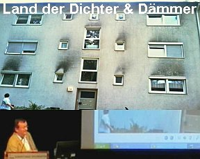

[🠔 Zur Übersicht: Video Vorträge](12akt.md)
# Deutschland, Land der Dichter & Dämmer? Der ganz normale Dämmwahnsinn
**Klimaschutz und Energiewende - alles Schwindel? Die Rolle von Politik, Wissenschaft & Medien.**  
_mit Konrad Fischer • 12.05.2012_

Vielen Dank, Herr Schram. Zunächst mal vielen Dank Ihnen, Herr Schram, dass Sie mir die Ehre geben, in diesem repräsentativen Rahmen einen Auftritt zu haben. Normalerweise bin ich hier als Sänger oder Trompeter am Tag der Heimat, aber jetzt reden wir mal Klartext. Ich danke auch recht herzlich der Volksbank Raiffeisenbank. Ich bin selber Genosse, leider nicht bei Ihnen, sondern bei der Konkurrenz, aber bei der Raiffeisen. Für mich eine ganz außergewöhnliche Erfahrung, dass eine Bank, die sich auch um Immobilienfinanzierung, um Immobilienverkauf und -kauf kümmert, dass man hier die Chance hat, auch mal einen konträren Standpunkt zum Thema zu bringen. Ich habe gerade diese Woche bei einer anderen Bank an so einer ähnlichen Veranstaltung teilgenommen. Da ging es komplett monokausal nur in eine Richtung, zum Teil ein bisschen Märchenstunde. Gott sei Dank war ich da und habe ein bisschen noch Aufklärung machen können. Ich möchte auch mich bedanken beim Herrn Eid von Stadtbild Koburg, der ja der Initiator war, dass ich hier heute mal stehen darf. So, Sie lesen hier "Land der Dichter und Dämmer", der ganz normale Dämmwahnsinn.

Ich will auch nicht versäumen, einen hier anwesenden guten Freund – wir sind nicht auf Du und du, aber wir sind lang bekannt schon – den Herrn De, der kam extra aus Nürnberg hierher. Der Herr De ist der Vertreter von Hausgeldvergleich, eine Schutzgemeinschaft für Hauseigentümer und Mieter und hat gerade mal einen Verbraucherschutz-Award an mich verliehen, weil ich mich vorzugsweise um die monetären, um die geldbedingten Angelegenheiten beim Bauen kümmer. Woher kommt es? Ich bin überwiegend in der Altbausanierung tätig. Das sind mehr oder weniger aktuelle und laufende Fälle, die ich Ihnen hier zeige, damit Sie ungefähr wissen, wo ich herkomme. Im Prinzip aus der Denkmalpflege. Ich war auch Volontär am bayerischen Denkmalamt, bin also ein ganz schlimmer und bin sogar mit Ihrem Stadt-Denkmalpfleger, dem Thomas Pez, gut befreundet seit unserer Kindheit schon, also ganz gefährlicher Mann.

Ich möchte jetzt aber mal von Ihnen wissen, wer ist denn überhaupt Hausbesitzer hier im Raum? Bitte Hände hoch! Eine riesige Menge. Und wo sind die Mieter? Ah, sind auch welche. Herr De, Ihr Klientel ist da. Ja, ich möchte für beide sprechen, selbstverständlich. Ich will Ihnen auch keine neue Häuser verkaufen, ja. Das ist auch mein Alltag. Das ist in Hamburg, 144 Wohnapartments, die gedämmt werden sollen oder nicht, ja, habe ich auch zu tun. Ich mache viele Beratungen, das ist ein staatliches Objekt in Hamburg. Auch da ging es drum, dämmen oder nicht. Natürlich, wenn ich da war, nicht dämmen. Das ist ja klar, das haben wir schon vorher gewusst.

## Heizungssysteme und ihre Probleme

Ich habe nicht nur ein Architekturbüro, ich habe seit der Wende in etwa auch ein Ingenieurbüro. Wir kümmern uns um Heizungen. Hier sehen Sie die verschiedenen Formen der Heizung. Oben links die Konvektionsheizung, die den Dreck rumwirbelt. Dann hier die Fußbodenheizung, wo sich diese Warmluftblase ab und zu alle 10 Minuten entlädt und den Dreck dann rumwirbelt in die unterkühlten Zonen hier. Dann die ideale Heizung, ein bisschen idealisiert dargestellt. Das ist die Strahlungsheizung, die eben mit möglichst viel Strahlungsanteil alle Bereiche gleichermaßen erwärmt und so sieht es bei mir zu Hause aus. Hier oben ist übrigens das Problem nicht die Wärmebrücke oder was man da von irgendwelchen Eckentheorien hört. Das wahre Problem besteht leider in der Konvektionsheizung, die ja hier nicht richtig hinkommt und deswegen bleibt das immer unterkühlt. Da können Sie dämmen, was Sie lustig sind und deswegen entsteht da Feuchtigkeit und Schimmel. Das ist meine Position dazu. Bin jetzt nicht gekommen, hier andere zu belehren, sondern ich erzähle einfach freimütig, was ich rausgekriegt habe und woran ich glaube. Bin außerdem evangelisch. So könnte eine Heizung in der Burg aussehen, also, dass keine Heizung notwendig ist, will ich Ihnen nicht versprechen, aber wenn man das geschickt macht mit dicken Mauern, dann langt auch das, damit es bachel warm wird. Oder hier Schloss Veitshöchheim, da hat man uns als Heizungstechniker oder Heizungsingenieure geholt. Da ist es eine Kombination aus Warmwasser. Wir haben im Keller ein Blockheizkraftwerk, das liefert Warmwasser und Strom. Den Strom, den hauen wir auch in Heizung rein und damit kann man auch diese vermorschten Teile künftig konservatorisch schützen. Im Moment arbeiten wir für Schloss Brühl, da kommen etwa 1000 elektrische Heizgeräte rein nach unserer Planung. Dann also, Sie sehen, ich bin ein bisschen breit aufgestellt.

## Pfusch am Bau und Sommerkondensat

Auch mache ich nicht nur die Altbausanierung und hier bringe ich Ihnen mal was mit aus unserem Architektenblatt "Pfusch am Bau". Danke, lieber Architekten! Ich täte mich ja selber nicht trauen, sowas zu sagen, weil das ja berufsschädigend und das darf ich gar nicht machen, aber wenn es im Architektenblatt steht, dann traue ich mich, Ihnen das zu zeigen. Das Foto ist von Stefan Zwiener. Ich habe mir dann die Originalfotos von dem Schadensfall gesehen. Das ist natürlich nicht eine Leckage in irgendwelchen Folien oder irgendsowas, das ist Sommerkondensat. Man muss nämlich berücksichtigen, es kommt gar nicht drauf an, ob aus Ihrem Raum noch viel Wasser in die Dämmung oder viel Luft da reinkommt. Die Dämmung ist doch von vornherein voll auch mit Wasserdampf. Ist ja Luft drin und Luft hat immer Wasserdampf und wenn Sie es noch so schön einkleben, der Taupunkt liegt drin und die Feuchtigkeit muss da drin auch dann kondensieren und solche Fälle habe ich zu Hauf. Ja, so schön sieht es dann aus, wenn das alles ausgepackt wird, was man teuer reingewurstelt hat.

## Kritik an der Heizungsindustrie und CO2-Theorie

Der Viessmann hier, Dr. Martin Viessmann von dem berühmten Unternehmen, der fordert hier Sanierung des Gebäudes. Ist das natürlich schön für so ein Unternehmen. Er schwindelt den Leuten vor, dass die fossilen Energieträger endlich sind. Das weiß man schon seit über 50 Jahren. Das Erdöl und Erdgas unerschöpflich nachgebildet wird, keineswegs fossilen Ursprungs ist. Es hat sich ein alter Russe, 1756 der Lomonossow, nachdem sie in Moskau die Universität benennen, ausgedacht. Schon Humboldt hat es widerlegt: Erdgas und Erdöl sind nicht fossil und werden unerschöpflich nachgebildet. Nennen Sie mir eine geschlossene Erdölquelle. Die Russen tun seit etwa 50 Jahren, holen Sie unterhalb des Urgesteins ihre Gasdinger, jetzt auch mit Hilfe von Gerhard Schröder, raus. Dann wird hier gesagt, die CO2-Emissionen haben entscheidenden Anteil an der menschengemachten Erwärmung. Da komme ich noch leicht mal drauf zu sprechen. Es gibt dann hier einen Konsens zwischen Wissenschaft und Politik. Da fragt man sich, wie viel Wahnsinnige haben dort ihren Job gefunden, dass 2° Celsius nicht mehr überschritten werden darf an Erwärmungspotenzial. Also, ich sage, früher da hat man die Leute mit Baströckchen eingekleidet und haben sie Regentänze gemacht, um das Wetter zu beherrschen. Heute sind Sie in Wissenschaft und Politik. Dann steht hier die Potenziale der Erneuerbaren, danke schön, die Potenziale der erneuerbaren Energieträger reichen auch langfristig nicht aus und so weiter und so fort. Jetzt müssen Sie 40% einsparen. Beim Vater hat's noch geheißen, soll hungern und frieren. Ich sage Ihnen da diesbezüglich sowas nicht mehr zu. Ja, und dann will man eine Vollversorgung mit erneuerbaren Energien. Ich weiß nicht, wie viel Windräder ist auf der Feste schon geplant sind. Heute läuft ja parallel in Kulmbach der große Anti-Windkampf, ja, kann man das fast sagen. Anti-Windrad-Kampf. Ich grüße die Leute in Kulmbach.

Das Bundesministerium für Umwelt, Naturschutz und Reaktorsicherheit, da wächst zusammen, was zusammengehört. Ist unsere Wärmeversorgung ein Problem? Schon wieder diese Lüge. Kohle Öl, Kohle Öl und Gas sind begrenzt. Warum lügen die uns die Hucke voll? Es wird von Förderhöhepunkten gesprochen, die gibt es nicht. Das ist eine Erfindung. Peak Oil, auf Englisch. Die Preise werden steigen, jawohl, das stimmt, aber das kommt nicht durch die Verknappung, sondern das ist Marktpolitik und deswegen erzählen uns die Erdölleute auch nicht, dass diese Endlichkeit nicht stimmt. Ich habe übrigens persönlich den Sprecher von Esso angerufen, um das zu klären. Er hat mir das bestätigt: Es ist unerschöpflich. Habe ich gesagt, warum verratet ihr das den Leuten nicht? Hat er gesagt, das wird in Amerika entschieden. Unsere Kommunikationspolitik heißt das. Wenn die Leute wissen, es ist unerschöpflicher, was ist dann mit dem Preis an der Tankstelle? Dann sagt dieses Ministerium: Deutschland verfügt über keine nennenswerten Vorkommen. Das stimmt auch nicht. Nicht mehr so. Shellgas, Schiefergas, schon mal gehört? Steht in rauen Mengen, vor allem in Norddeutschland zur Verfügung. Gibt's halt moderne Techniken, da holt man das aus dem Boden. Steht alles noch nicht so sehr in der Zeitung und dann sagen die Öl und Gas wieder Treibhauseffekt und Klimawandel. Das ist die Position der Bundesregierung.

Was ist die Realität mit diesem CO2? Wie viel CO2 haben wir überhaupt in der Luft? Wie viel ist denn das? 0,038%. Das ist dieses Pünktchen im Verhältnis zu diesen Bestandteilen in der Luft. Der Rest ist eben Stickstoff, Sauerstoff, Wasserdampf, Edelgas und dann wird uns auch sowas erzählt. Die Sonne kommt, da unten entsteht warme Luft oder Wärme, die wird am CO2-Mantel zurückreflektiert sozusagen. Das haben Sie alle schon gesehen, diese Theorie. Oder jetzt frage ich Sie, wie kalt ist dieser CO2-Mantel auf etwa 6 km Höhe? Wer weiß das? -50°, also eigentlich -70° genau genommen und jeder, der schon mal nach Mallorca geflogen ist, hat es noch in Erinnerung, wenn der Captain sagt: "Leute, -50°." Und jetzt frage ich euch mal, seit wann kann ein kalter Heizkörper warm machen? Es ist purer Wahnsinn, purer Wahnsinn und das wird uns hier weißgemacht, dass -70° kalte Heizkörper uns hier irgendwie erwärmen können und die werden dann gebildet von diesem Pünktchen, das dann übrigens hier oben auch überhaupt nicht existiert, weil gerade wir Landbevölkerung, ich bin ein ganz dummes Landei, wir kommen aus einer Brauereifamilie, da wusste man genau, wo das CO2 dann im Falle eines Falles ist: im Braukeller, am Fußboden und warum? Weil es ist nämlich wesentlich schwerer als die Luft. CO2 Molgewicht 44, Luft 29. Das heißt, das CO2 sinkt nach unten und jeder weiß das auch. Im Gärsilo gibt's ja die schrecklichsten Unglücksfälle, wenn der Opa unten aufräumt, im CO2 erstickt und die ganze Familie beim Retten hinterher erstickt. Es ist aber kein Gift und es wird uns ja als Klimagift weißgemacht hier von irgendwelchen Verbrechern, die hier vorhaben, unsere ganze Energie und praktisch die ganze Gesellschaft zu verändern. CO2 ist überhaupt kein Problem und Sie atmen es übrigens die ganze Zeit aus. Die Kunst ist nur, das, was Sie ausatmen, zu besteuern und daraus einen riesigen Reibach zu machen. Das ist die ganze CO2-Geschichte.

Und dann hier, schauen Sie mal, das ist das, was die Heizungsindustrie dann publiziert, ja, es wird also extrem wärmer. Warum? Weil der CO2 steigt und in England hocken Wissenschaftler, die sagen, hier in Tollenbring, schaut mal her, es wird wärmer und wärmer und wärmer. Beim Opa hat's noch geheißen: "Gott strafe England." Heute strafen uns die Engländer mit sowas. Und dann hier der Miatis sei VAT. Es war noch ein anständiger. Das war ein Imam in Hamburg, der hat den Propheten gehuldigt und die erste Moschee nach Deutschland gebracht, wissen Sie vielleicht alle, kann man alles beim Wikipedia lernen heutzutage. Aber der Sohn, der ist vom Glauben abgefallen, der ist selbst Prophet geworden und zwar Wetterprophet und was macht er? Er nimmt die getürkte englische Kurve und sagt dann, es wird ja immer wärmer und es ist ganz schrecklich und jeden Tag fast kann man im Fernsehen sehen. Mir wär es lieber gewesen, er wär in der Moschee geblieben. Wir in Bayern, wir messen selber am Hohenpeißenberg. Da sehen Sie, von hier aus zeigen diese englischen Hünken immer die Kurve. Das ist Hohenpeißenberg. Seit 1781 wird da gemessen von fleißigen Mönchen und das sind die Durchschnittstemperaturen und 1800 war es doch schon wesentlich wärmer als heute und haben da die Pinguine geschwitzt und wir wissen von den Messdaten, dass es in Wirklichkeit seit 10 Jahren abwärts geht mit den Temperaturen, sowohl aus der Satellitenmessung wie aus der terrestrischen Messung, aber der CO2, der geht nach oben. Das hat also überhaupt nichts miteinander zu tun. Nur Lügen. Selbst im Spiegel kommt einmal sogar die Wahrheit zum Tragen. Soll man nicht für möglich halten, ist ja ein Qualitätsmedium. Hier sehen Sie die Sonnenflecken, das heißt die Aktivität der Sonne, die treibt die Temperatur nach oben und die Kurvigkeit von irgendwelchen CO2 ist davon unabhängig. Das ist die Realität. Ich sage euch mal eins: Wenn die Sonne scheint, wird's warm, mehr brauchen Sie nicht zu wissen, ja. Und dann, was auch sehr witzig ist, hier nimmt die Temperatur +0,39 und das ist die Periode 62 bis 201. Und der CO2 nimmt zu. Hier nimmt der CO2 sehr wenig zu bis 61, aber die Temperatur um 0,52. Das sind offizielle wissenschaftliche Ergebnisse, um die muss man sich kümmern. Von der Bundesregierung und von unseren Medien bekommt man das in der Regel nicht geboten. Müsst euch selber aufklären. Hier, das ist der Trend. Das sind offizielle deutsche Wetterdienst-Daten. Es wird kälter, nicht wärmer. Alles Lüge, was Sie da lesen, was Ihnen jeden Tag im Fernsehen vorgespuckt wird. Kriminelle Manipulation, so nenne ich das, ja. In Kitzingen, schauen Sie, 1970 der höchste Wasserstand seit Jahrhunderten, das war 1590, 1595, 1784. Auch in Heidelberg an der Neckarbrücke. Das ist meine Privatforschung. Na, sage ich euch eins: Was müssen die 1595 geheizt haben? Was müssen die 1784 Auto gefahren sein, dass da solche Hochwasser waren im nicht regulierten Flussbett? Verstehen Sie, alles, was Sie serviert bekommen, gelogen. Es kommt ja von den Medien und von der Politik und von der Wissenschaft. Am selben Tag das Obermain-Tagblatt Lichtenfels: "Wintersport verabschiedet sich aus Oberfranken", 5.11., der Peter Engelbrecht. Und da wird gezeigt, wie die Bundesregierung und die bayerische Regierung sich anstrengen, das CO2 in den Griff zu kriegen. Am selben Tag, "Die Eiszeit fängt bald wieder an." Das ist, ich meine, das ist Dialektik. Heute kriegen Sie auch verschiedene Meinungen geboten, das müssen Sie dann schon selbst rauskriegen, was für Sie wichtig ist.

## Energieeinsparverordnung und andere Gesetze

Programm gegen Kohlendioxid. In so ein abübergeschnappter Schnapp auf hier erklärt, dass die Bayern dann CO2-Ausstoß noch günstiger sind als die anderen und die ganzen Tafelsilber-Gelder werden jetzt reingesteckt, Privatisierungserlöse, in die Erneuerbaren und ins CO2 vermeiden. Das finde ich kriminell. Das sind nämlich aus auch aus ihren Rippen rausgeschnitten, Steuergelder, ja. Kommen wir zur Energieeinsparverordnung. Die Mutter der Verordnung ist das Gesetz des Energieeinsparungsgesetzes. Ermächtigt, ermächtigt, ermächtigt, aber sagt im Paragraph 5, die Anforderungen müssen wirtschaftlich vertretbar sein. Das ist schon mal interessant im Gesetz steht, wenn hier gedämmt wird, wenn hier Energie gespart wird, es muss wirtschaftlich sein. Das nennt man das Wirtschaftlichkeitsgebot. Niemand hat Ihnen bisher das verraten, es muss immer wirtschaftlich sein und ist das Interessante sowohl für den Mieter wie auch für den Vermieter und auch für den Architekten, weil er schuldet eine Pflicht als Pflicht eine wirtschaftliche Beratung und deswegen haben wir Prozesse über Prozesse, wenn dann nämlich die kaputt gedämmten Häuser herauskristallisieren. Es kommt gar nicht zu einer Rendite, dann ist es unwirtschaftlich und ist der Architekt wieder mal dran. Das ist, wenn hier Kollegen wären, Vorsicht, sage ich, das müssen Sie dem Kunden schon sagen, ob es wirtschaftlich ist oder nicht und so kommt es in der Energieeinsparordnung zu den Befreiungen und zwar wenn Sie immer befreit. Hier steht, die Behörden haben zu befreien auf Antrag, wenn es unwirtschaftlich ist. Also ist nur die Frage, was ist wirtschaftlich, was ist unwirtschaftlich und da haben wir Gott sei Dank in der Heizkostenverordnung, das ist die Schwester der Energieeinsparverordnung, die Vorschrift: 10 Jahre ist die Grenze der Wirtschaftlichkeit und entsprechend haben auch alle Gerichte bisher in diesen Fragen. Herr De, Sie können mich da bestätigen, er studiert es nämlich ganz genau die Rechtslage, weil er sehr viel Beratung macht. Es ist einheitlich die Rechtsprechung: 10 Jahre ist die Grenze. Das heißt, wenn Ihre Investition nicht in 10 Jahren wieder drin ist, ist es unwirtschaftlich und dann haben Sie ein Recht auf die Befreiung von den Vorschriften. Muss man erstmal wissen, deswegen bin ich da, dass überhaupt erstmal ein bisschen was erfahren, nicht nur Märchenstunde und jetzt haben wir dann hier auch das, das EDL-Gesetz. Haben Sie nie gehört, wurde auch absichtlich nie in den Medien drüber berichtet. Da haben die dann z.B. Vorschriften drin, nur damit Sie mal den in den Kopf reingucken von diesen Leuten, die da hocken: "Energielieferanten, die Kraftstoffe für den Verbrauch im Straßenverkehr an Endkunden verkaufen auf kaufpreispflichtige Stellen, ja, sind verpflichtet, sind verpflichtet, ihre Endkunden über kraftstoffsparende Fahrweisen zu informieren und ihre Endkunden dazu mindestens einmal pro Monat Schulungen von PR und praktische Fahrübungen anzubieten. Die Anzahl der Teilnehmer an den Schulungen kann und wie diese Regierung, ja, wie menschenfreundlich, kann auf ein Maß begrenzt werden, dass für die wirksame Durchführung der Übungen erforderlich ist." Hey, diese Leute hocken und erlassen solche Vorschriften. Das ist die Truppe, die da oben Ihnen die Vorschriften macht, dass Ihr Geld raushauen müssen. Müssen sich mal vorstellen, wie krank die im Kopf sein müssen, dass Sie in solche Positionen kommen und niemand das entdeckt hat vorher und das läuft durch die ganze Republik und niemand schreibt da drüber. Und wenn Sie jetzt verstoßen gegen die Vorschriften, die diese Hallunken erlassen, 50.000 bis 100.000 €! Hey, das ist und im Entwurf steht ja 500.000 immer drin. Sagen Sie, nein, wir sind doch Menschenfreunde, Tugendterror nennt man das und dann wird es auf 50.000 dann runter. Hey, hauen Sie mal 50.000 nur mal, weil da 3 cm Dämmstoff fehlen. Die Fälle fehlen alle, die trauen sich nicht dran. Es gibt keine Urteile, Herr De, es gibt, die trauen sich noch nicht, die wollen erst den Sack richtig zumachen und Ihr wehrt euch nicht und wählt ja immer die falschen und dann seid Ihr dran und dann wird kassiert und dann ist das Hüttchen kaputt. Schaut mal hier, EEG, ja, überall lauft und der Lichtenfelser Landrat, der rennt rum und wirbt für Windräder, Bürgerwindräder. Die Leute sollen Ihr Geld reinstecken. Warum? Ja, das ist klar, der Strom wird immer teurer, ja, und 2000 sind wir bei 51 Cent fürs Kilowatt. Ich bin bei der NAB, Nationale Anti-EEG Bewegung, also wir sind gegen diese ganzen Gesetze, die den Bürger ausplündern bis wie eine Weihnachtsgans, ja. Und das ist dann, was die Ökoenergien bringen.

Hier, das ist die Leistung, die abgerufen ist, also der Verbrauch im Strom und das liefern jetzt diese konventionell und das ist der Überschuss. Das heißt, die liefern irgendwann, ob es gebraucht wird oder nicht und das muss dann entweder weggeworfen werden oder für teuer Geld nach Österreich verkauft. Also man gibt denen dann Geld, das ist nehmen, ja.

So sieht's praktisch aus, nach ein paar Jahren ist es alles hinüber. Wird ja extrem witterungstechnisch belastet. So sieht's dann aus und dann, wenn es darauf ankommt, ist es übrigens alles hochgradig explosiv, neigt zur Selbstentzündung. Weiß ja niemand. Auf meiner Website habe ich allein dieses Jahr schon an die 50 Selbstentzündungsfälle nur in diesem Jahr wieder beieinander. Ich habe nämlich ein Archiv angelegt, wo ich alle diese PV-Brandfälle dokumentiere, ja. Und so sieht dann das Land dann aus, auch bald bei uns.

Die Auswertung hier in Oberfranken zeigt, dass nur eines von 38 Windrädern überhaupt an die 60% herangekommen ist, die die Staatsregierung selber als Grenze der Wirtschaftlichkeit zeigt. Die anderen sind alle bei um die 40%. Das heißt, die werden niemals wirtschaftlich, nach 3 angehende Insolvenz und das Bürgergeld ist weg und unser Landrat Christian Meisner rennt draußen rum bei den Bauern und wirbt dafür auf den Stadträten, in den CSU-Versammlungen, dass die Leute ihr Geld wegwerfen in diesen blöden Anlagen. Das halte ich für ein Unding. Das heißt, wenn Sie es mit Geld zu tun haben, bitte Raiffeisenbank, nicht Bürgerwindrad. Das sind geplante Verlustbringer und die einzigen, die dran verdienen, raten Sie mal, wer? Die Politiker, die sich die Taschen vollstopfen. Das ist logisch, aber von welchem Ertrag? Der entsteht auf der anderen Seite nicht bei den Investoren und das sind die ganzen Insolvenzen hier. Steinbach am Wald, Staffelstein. Das ist nur eine kleine Liste der schon aktuellen Insolvenzen. Für mich ein Riesenskandal, was hier in Oberfranken läuft, gefördert von der bayerischen Staatsregierung.

## CO2-Einsparung und Maximaldämmung
Da brauche ich keine Facebook-Party. Der Mann muss in den Keller. Energiepass Weltklasse. Ich habe mich CO2-Einsparung für Maximaldämmung entschieden für die Schimmelpilze. In dieser Wohnung hat sich das Klima schon total verbessert. Was verspricht der Bauminister? Investitionsschub für die Bauwirtschaft. Hey, das ist doch nicht das Interesse meines Bauherrn, meines Mieters. Der hat eben keine Fensterfabrik und wenn er dann das Zeug drin hat, so sieht's aus. Die Feuchtigkeit kann nicht mehr raus, ja. Das ist nicht der Bauherr übrigens. Schimmel an allen Ecken und Sie kennen es doch. Wer hat denn hier Schimmel? Hände hoch! Anonym! Ja, sind doch schon ein paar, also sehen Sie, das kommt aber hier durch diese übertriebene Dichtung und wer hier erzählt, dass durch Wärmedämmung außen innen die Temperatur ansteigt. Ich kenne dafür keinen wissenschaftlichen Beweis. Ich kenne keinen und ich habe lange danach gesucht, ja.

## Lüftungsanlagen und Fenster
Und dann diese schönen Lüftungsanlagen, schauen Sie mal her, einmal nicht aufgepasst und dann sind das hier die direkt die Bakterienhöllen, weil so sieht's aus da drin. Das können Sie durch ein Pollenfilter nicht verhindern, weil das ist die Abluft und da kommt warme Feuchtluft in den kalten Kanal und dann bilden sich die Bakterienschleime und der Dreck setzt sich an und was glauben Sie, was hier in der Agar-Agar, was da los ist? Da freut sich der Pilz. Deutschland ist Weltmeister bei Kinder-Asthma-Toten, haben Sie das gewusst? Das ist unser Championship durch diese Energiespargesetze. Weltmeister bei Kinder-Asthma-Toten. Das interessiert aber nur die Ärzte und die Pharmaindustrie. Was ist denn mit dem Fenster? Wie viel Scheiben braucht wir denn? In dieser jüngst in der anderen Bank stattgefundenen Veranstaltung hat sogar ein Energieberater gesagt, an der Südseite haben wir dann die Dreifachverglasung weg bekommen. Haben wir nicht gemacht, weil wir rausgekriegt haben durch Berechnung, dass die dritte Scheibe so viel Solarenergie wegnimmt, dass diese Mehrkosten sich niemals rechnen. Also Fakt ist, Licht geht durch eine Scheibe.

## Strahlung und Wärmedämmung
Was sehen wir hier? Wir sehen hier die Durchlässigkeit und die Undurchlässigkeit eines einfachen Fensterglases für Strahlung generell. Da können wir sehen, dieser Spektrum. Licht geht durch, klar, ne? Licht geht durch eine Glasscheibe durch, aber hier diese Infrarotstrahlung ab 2,7 und genau die ist interessant, weil die ist warm, die geht nicht durch ein Glas durch. Haben Sie das gewusst? Wärmestrahlung geht nicht durch ein Fensterglas und genau, weil das so ist, gibt's z.B. Brandschutzgläser. Sie sehen das Feuer, aber Sie spüren es nicht. Muss erstmal wissen und wie hat der alte Bauer seit 100.000 Jahren, seit das Fensterglas gab, also sagen wir mal knapp 500 Jahre, wie hat der seine Energiesparkonstruktion gemacht? Ein Einfachgas, eine Einfachscheibe, damit am Tag auch stets möglichst viel Licht kostenlos reinkommt und sich in Wärme verwandelt und was macht er in der Nacht? Da kommt der Laden zu und der Strahlungsausgleich zwischen seiner nicht mehr beschienenen Scheibe, die etwa Raumtemperatur haben könnte, mit dem 100°igen Nachthimmel findet nicht mehr statt. Das empfehle ich Ihnen, kann auch ein Rolladen sein, darf sogar elektrisch betrieben werden, solange das noch nicht verboten ist.

## Ministerien, Medien und massive Denkmäler
Hier dann, Ministerien verplempern Energie. So lügen Medien. Ich will jetzt nicht sagen, welche Zeitung das war. Da wird hier behauptet in Düsseldorf, dass die verplempern und was sagt man? Man sagt, ja, schlecht gedämmt, viel Energieverlust und hier auch nur der neue Landtag, der besteht fast nur aus Glas, ja, der wär prima anders. Der Landtag, extrem schlecht gedämmt, das Ministerium für Bauen und Wohnen, das Justizministerium und jetzt schauen Sie mal hier an. Das ist der Dicke Kaiser Wilhelm II., mein Gott, diese Düsseldorfer müssen woanders so viel Energie sparen, dass Sie dieses massive Denkmal hier heizen, weil schauen Sie mal, wie der glüht und nur sein etwas leeres Hirn, das kühlt ein bisschen ab und kriegt ein Kälte, aber der Rest, das ist alles deutsche Bronze. Früher hat man Kanonen draus gemacht, jetzt machen wir es nicht mehr. Alles warm, sogar glühend glühen. Sehen Sie das? Und da wird behauptet, diese Beamten-Schweine, die lassen hier die Fenster offen und deswegen haben wir hier diesen Wärmeeffekt. Stimmt doch gar nicht, das steht eben nicht im Strahlungsausgleich mit dem eisigen Nachthimmel, sondern ist geschützt vor dem Himmel und deswegen hält sich da die eingestrahlte Wärme besser. So einfach und jetzt kommen wir noch mal auf dem Thema.

## Wandaufbau und Thermografie
Sie stellen sich eine Wand vor, hier vorne mit Südausrichtung, zur Hälfte Dämmstoff, zur Hälfte Naturstein oder Ziegel oder Stahlbeton, weiß angemalt. Es ist Juni, die Sonne scheint den ganzen Tag auf die Südseite, diese Vorgartenmauer und jetzt kommt um 14 Uhr der Thermograf und fotografiert. Wer ist dafür, dass die Ziegelwand wärmer ist jetzt in diesem Moment? Wer ist dafür? Wer glaubt, die Natursteinwand oder Ziegelwand ist jetzt 14 Uhr nach 10 Stunden Sonnenbestrahlung wärmer als die Styroporwand? Wer glaubt das? Die Mehrheit? Falscher können Sie gar nicht denken. Da sehen Sie mal, wie Sie manipuliert sind. Diese massive Wand saugt doch die Energie hinein. Die kriegt nie mehr als 35°, habe ich selbst gemessen, wohingegen die Dämmstoffwand, die hat Ruckzuck 90, 90. Und wann kommt der Schlawiner in der Gespensterstunde, wenn alle ehrlichen Menschen schlafen oder vor dem ersten Sonnenaufgang, wenn nur Räuber und Banditen unterwegs sind und jetzt misst mit seiner Kammer und welche Wand ist jetzt wärmer? Jetzt ist die Natursteinwand, jetzt ist die massive Wand wärmer und warum? Weil da hinten einer heimlich heizt? Nein, weil die eingestrahlte Solarenergie über die ganze Nacht gemütlich wieder abgegeben wird mit folgendem Nebeneffekt: Es gibt keinerlei Temperatur unterhalb der Lufttemperatur und damit Null Kondensat. Dagegen die Dämmstoffwände, die holen ab 18 Uhr holen die schon den Tau hinein und deswegen sind sie alle grün. Jetzt haben Sie verstanden, wie Sie beschwindelt werden. Ob Sie den Rest verstanden haben, weiß ich noch nicht.

## Eigene Messungen und Fraunhofer-Institut
Hier messe ich selber bei einer Außenluft von -10°, -10° im Schatten liegende Ecke meines Bürogebäudes -1°. Sie sehen, massiv, aber wärmer als die Außenluft. Das ist früh um 8 Uhr. Sonne ist gerade aufgegangen, ist die Ostseite, wohingegen 9° haben wir schon auf der sonnenbeschienenen Massivseite. Jetzt verstehen Sie, was Massivbau ist und diese Energie, die schenken Sie weg, wenn Sie dämmen. Hier, das ist aus meinem NDR Film, dieses Objekt komme ich, dasselbe Objekt, das ist voll gedämmt, das ist ein Wiederaufbau mit schwachen Mauerwerk der 50er Jahre. Das ist hier die Situation 14 Uhr, Dämmstoff, sauheiß und dieses dünne Mauerwerk kühler und dann sind wir abends wiedergekommen mit dem Fernsehteam und haben genau den Punkt erwischt, wo sie beide gleich blau sind, weil die schon total runtergekühlt ist. Also es kommt sehr genau drauf an, wer und wann ein Thermobild macht. Auch Fraunhofer hat es festgestellt. Fraunhofer-Institut hat sehr gute Messungen gemacht. Hier sehen Sie die nicht gedämmte Wand mit ihrer Temperaturkurve. Hier sehen Sie die gedämmte Wand mit ihrer Temperaturkurve und diese schlecht zu erkennende grüne Linie ist die Taupunkttemperatur und da sehen Sie, dass von 3:30 Uhr bis früh um 7:30 Uhr saugt diese gedämmte Wand die Brühe in sich rein, den Tau und wer schon mal im Juni, Juli, August barfuß früh um 6 Uhr durch die Wiese gelaufen ist, der weiß, was Dämmstoffe aufsaugen können, weil auch die Wiese ist kein speicherfähiger Massivbaustoff.

## Kondensation und Bauschäden
Kondensation, Reif und also auch in unserem Architekten dort wird alles ganz klar kommuniziert. Kondensation erstreckt sich wie Sonnenaufgang nur entlang der Sockelschiene, keine Reifbildung. Warum? Ja, weil die eben massiv war. Während der Messperiode konnte ein vollständiges Abtrocknen der Fassade tagsüber nicht festgestellt werden. Das heißt, das das reichert sich an, auch wenn es heiß wird, das bleibt da drin, die Feuchte und so sehen dann die Buden aus. Das ist Beiried, ganz Neubauten, das sind Altbauten, die nachträglich gedämmt sind. Das ist übrigens die neue Messe München, da hat man ist man so weit mit Dämmen gegangen, dass man auch die Außenstützen gedämmt hat. Außenstützen vollwärmegedämmt, aber nach einem Jahr ist schon alles runtergekommen durch diesen vermaledeiten Effekt. Ja, das war auch hier das Objekt, das ich im NDR in diesem Wahnsinn-Wärmedämmungsfilm vorgeführt habe. Sie sehen hier die berühmten Leopardenfälle, die kommen nämlich nicht dadurch, dass der Dübel die Wärme von innen rauszieht, der ist doch nicht verrückt, der ist nur speicherfähig und dadurch wird das Dübelchen ein bisschen wärmer immer als der blöde Dämmstoff und deswegen setzt sich da weniger Dreck und Alge an. So einfach ist die Welt und so sehr werden Sie betrogen, weil inzwischen verkauft Ihnen die Industrie sogar wärmegedämmte Dübel. Herr Belan, Sie haben solche, stimmt er nicht und der da drüben hat sie auch, nur Beschiss. Verstehen Sie? Und so sieht es aus, alles patschnass dahinter. Das sind hier Vorsatzschalen, alle abgeknackt, die halten nichts aus. Das sind lebensgefährliche Zustände. Wir haben die dort entdeckt, alles patschnass. Die ganze Bude ist übrigens schon die zweite Sanierung der Wärmedämmung und wieder alles kaputt, ein öffentliches Objekt, ja.

## Maden, Spechte und Siedlungen
Und dann hier die Maden, die fühlen sich wie im Speck in diesen Dämmstoffen, ne, und da kommt auch der Specht ist nicht weiter und der Specht ist ein reinlicher Geselle, jedes Jahr ein neues Loch, aber der Star kommt hinterher, der ist nicht so reinlich, er ist wie wir Menschen, sage ich mal, ja, der bleibt in derselben Bude und dann raus mit Putz und da muss es auch wieder gut sein. Der Specht, der macht sich jedes Jahr ein neues Loch, das sehen Sie hier, das ist immer derselbe Specht, der arme Hausmeister, der hat alles probiert, hat alles gegeben, es ist ihm nicht gelungen, diesen verrückten Specht zu durch zu verdrängen, ja. Und dann innendrin rottet das natürlich alles zusammen in der in der nassen Chose und so sieht's aus, ja. Das ist eine riesige Siedlung, hunderte von Gebäuden. Ich weiß nicht, Herr De, kennen Sie die in der Nürnberger Straße in Erlangen, ja. Das sehen alle Häuser so aus. Ich sage immer, da haben sich die letzten Raucher zusammengerottet oder vielleicht ein paar Kaffeeröster gibt's da unten auch in der Ecke, ne, aber dass die alle demselben Hobby nachgehen, das ist doch unwahrscheinlich. An diesen eiskalten Wänden da schlägt sich jede Form von Ablüftern nieder und dann gammelt und rottet und pilzt es, ja. Das ist mir klar, mehr sage ich nie. Und das ist Reverend evangelisches Siedlungswerk, ESW. So wohnen da die sanierten Mieter und haben natürlich ihre Erhöhung wegen Modernisierung. Also, ich glaube, auf solche Modernisierung sollte ein vernünftiger Mieter in Coburg bitte in Zukunft verzichten und wenn er Hilfe braucht, meine Nummer steht im Telefonbuch, ja.

## Pororisierte Ziegel und Amerika
Das neueste pororisierte Ziegelwand. Sie kennen den Baustoff, ich nenne hier nicht und dann nach einiger Zeit fällt alles runter und warum? Diese pororierten Ziegel werden mit Papierschlämme hergestellt. Im Papier ist unwahrscheinlich viel Kalk, der Kalk wird gebrannt, liegt als Branntkalk in diesem Stein vor und wenn ein bisschen Feuchte kommt, dann löscht er ab und wenn er dann ablöscht, dann will er auch mal als Kalklauge nach draußen abdunsten und schafft es nicht, weil man ja schlauerweise einen hydrophobierten Putz da aufgetragen hat und dann sprengt er, wie von der Kanone getroffen, dann nach unten. Grauenhafte Schäden, ja. Und dann, ja, gut, so sieht in Deutschland aus. Das sind alles Fälle, die ich selber ständig in meinen Beratungen da vor mir habe, aber auch in Amerika. Da werden die Hütten alle abgerissen und da ist es deswegen verboten. BAMS Oregon, das ist ein staatliches Plakat. Das ist verboten in Amerika. Es gibt 95% der untersuchten Fälle waren verrottet. Von außen sehen die teils einwandfrei aus, von innen alles verrottet und der Verbot kam dann, wie die Krankheitsfälle dann auch noch registriert wurden. Das ist schon 89, hat es losgegangen. Hier in Deutschland zwingt uns die Regierung dieses in Amerika verbotene System auf die Wand zu bringen. Finde ich eine Riesenschweinerei. Amerika ist uns immer 20 Jahre vorher. Wir sollten mal schauen, dass wir Sie hier einholen, verbietet die WDVS. Das ist meine Botschaft, ganz Amerika. Treu, so. Und da fällt es runter, wenn das nass ist, logisch, ja. Sagt man Fehler, Fehler. Nein, das ist ein Systemschaden. Der Handwerker kann rein gar nichts dazu. Herr Belan, wenn was ist, Sie haben mich auf Ihrer Seite. Es ist ein Systemschaden und jeder weiß es, der sich mit Bauphysik beschäftigt. Das ist Ilmenau, vor ein paar Wochen, ja. So fällt es dann darunter auf dem Gehsteig. Gut, wir haben zu viele, wir haben eine zu dichte Wohnbevölkerung. Ist ja okay, dass man was dagegen tut, aber muss es jetzt ausgerechnet sowas sein?

## Verkleidungen, Brände und Wissenschaft
Ja, dann unter diesen Verkleidungen, das ist ja nicht nur die WDVS, es sind ja auch die vorgehängten Fassaden, alles nass, alles verpilzt und verschimmelt. So sieht's aus und dann brennt es wie die Hölle. Das haben wir schon gehabt, das will ich nicht weiter vertiefen, das ist ja ein Explosionsbrennstoff. Das heißt, wenn da der Zündfunke, wenn die Zündtemperatur, diese angeblich nicht brennbaren Sachen oder nur schwer entflammbaren Produkte, wenn da die Zündtemperatur erreicht ist, brennt es in jede Richtung weg, explosiv. Ist also ganz scheußliche Sache, ja. So sieht's aus, alles grün, ja, bereift, warmes Fressen für den Biber. Die Bauwirtschaft hat sich eingestellt, da gibt jetzt Aufsatzfräsen, da werden die Dämmsysteme auch von den Häusern wieder runtergeschält und natürlich etwas Wärme braucht die Wand. Das ist deutsche Wissenschaft übrigens. Was machen die jetzt? Die sagen, da lasst uns doch die Dämmstoffe heizen, wenn Sie so kalt werden und da werden hier wirklich, da gibt's zwei Patente von der Firma, die auch die Noppenbahnen erfunden hat, hat zwei Patente, einmal Heizrohre da einzubetten in den Dämmstoff und elektrische Drähte und die Wissenschaft sagt, ja, ja, etwas Wärme braucht die, ja, natürlich braucht die Wärme, aber am schönsten wär es doch, wäre die Sonnenwärme und Sie wäre eingespeichert und wir verzichten auf den ganzen Klumpatsch.

## Instandhaltung und Wirtschaftlichkeit
Was sieht's dann aus? Wie ist dann die Zukunft dieser etwas zu kalten Wände? Schauen Sie her, das ist eine wissenschaftliche Untersuchung vom Institut für Bauforschung in Hannover und die haben nun rausgekriegt, eine Außenwand mit Standardputz braucht im Jahr pro Quadratmeter 7,08 € im Jahresdurchschnitt als Rücklage für die Instandhaltung. Damit kann man rechnen. Was braucht ein Dämmsystem? 16. Allein dieser Unterschied und das sind von Fakten von Tausenden von Häusern die Fakten zusammengetragen. Sie zahlen über 9 € pro Quadratmeter Dämmstoff jedes Jahr mehr in die Kasse, wenn Sie es instandhalten wollen und das frisst auch die fiktiven Dämmsparenisse von vorne rein mit weg. Das müssen Sie wissen und dann haben Sie viel gelernt heute, ja. Das ist hier ein Beispiel aus Bayreuth. Ein Energieberater sagt dann, ja, was, wie lohnt sich es denn jetzt? Da sehen Sie, das ist hier Kellerdecke 14 Jahre, dann hier Außenwand 22 Jahre und Fenster 32 Jahre und hier Kombi 22 und so weiter und so fort. Es gibt keine einzige von den empfohlenen Energiesparmaßnahmen, die auch nur annähernd den 10-Jahres-Bereich erreicht, wo es dann wirtschaftlich und gesetzeskonform wäre. Das heißt, jede Dämmung, die da draußen hängt, verstößt gegen das Gesetz und ist kriminell. Das müssen ich mal vorstellen und Sie als Hausbesitzer, wenn Sie schon haben, gehen Sie zum Rechtsanwalt und lassen Sie sich die Lage erklären, wer daran schuld ist, wer als vertragliche Nebenpflicht hier seine Wirtschaftlichkeitsberatung nicht erfüllt hat. Interessieren Sie sich, das gibt Kohle im gegebenen Fall, immer Einzelfallentscheidungen, auch mal Tipp ganz umsonst, ja.

## Auswirkungen von Dämmungen
Und dann haben wir festgestellt, wie wirken denn die Dämmungen wirklich? Hier Tollenbring war sogar im WDR. Hier wurden drei gleichartig gebaute Baublöcke, einer wurde gedämmt, diese Reihe 3 und was war am Ende des Ergebnis? Eine Million hier reingedämmt in die Bude. Zum Schluss am höchsten der Energieverbrauch. Das muss man erstmal wissen, das muss man wissen. Es war im Fernsehen, Sie sehen nur den falschen Sender und dann hier Neubrandenburg. Der Mann ruft mich an, sagt, ja, 500.000 oder 700.000, mit welchem Dämmstoff soll ich dämmen? Sage ich, was verbrauchst du denn? Sagt er, weiß ich doch nicht. Ich sag, geh in deine Verwaltung und dann rufst mich wieder an. Na, ruft er mich an und dann sagt er, ich verbrauche nur noch 5,4 l in dieser ungedämmten Bude und warum? Na, der hat halt eine Strahlungsheizung, nur die Heizplatte und alle Leitungen auf der Wand und dann hat er auch genug massiven Beton, viel ist es ja nicht, es sind Tragschicht 15 cm, eine Wetterschicht 6 cm.

## Auswirkungen von Dämmungen

Die bringen ihm genug Speichereffekt, dass er hier mit 5,4 l dieses Hüttchen da über die Bühne bringt. Ist ständig voll besetzt mit Büros und dann haben wir den Fraunhofer. Der hat nun die einzige wissenschaftliche Untersuchung vorgelegt, wo in vier unabhängigen Messperioden Häuser verglichen wurden mit und ohne Dämmung und das muss man wissen als Fachmann, sonst braucht man bei Ihnen doch nicht antanzen und was kam raus? Hier sind die Konstruktionen, Sie sehen monolithisch und mit Außendämmung und mit viel Außendämmung. Das ist der Verbrauch von dem monolithischen mit sehr schlechten U-Wert 0,46. Das gedämmte Büdchen 0,32 hat 107% verbraucht, also hat mehr verbraucht und das noch mehr gedämmte Büdchen mit 23 cm Außendämmung und einem U-Wert von 0,16 hat auch mehr verbraucht. Mehr nicht, weniger nicht gespart 80%. Irgendwelche Lügen, die jeden Tag ins Haus flattern auf dem Käseblättler. Mehr haben Sie verstanden, soll ich noch mal erklären? Nö, ne?

Und dann hat man gesagt, jetzt nehmen wir mal welche mit gleichem U-Wert. So, hier sehen Sie die Musterhütten, B schon weggerissen, das wollte man nicht bestehen lassen. Hätten wir noch mal nachprüfen können, will ja niemand. Und dann haben wir hier einmal mit beide 0,46 U-Wert und einmal mit und einmal ohne Wärmedämmung und was geschieht? Hell gestrichen ohne Wärmedämmung 100, mit Wärmedämmung 103. Auch mehr bei gleicher Oberflächengestaltung und dann hat man sie dunkel angestrichen, ja, da geht natürlich mehr Wärme rein und hier ist dann dem Gegenüber die monolithische Wand bei 93% und wiederum die gedämmte Wand bei 95. Immer braucht die mehr, die gedämmte Wand. Haben Sie es verstanden und alles andere ist Märchenstunde vom lieben Onkel, dem wir lieber nicht über den Weg trauen.

## Energetische Sanierung in Coburg

Ja, und was macht hier die Coburger Truppe hier? Energetische Sanierung im Vordergrund. Das lese ich hier mit Erschrecken am 21. Oktober. Die gemeinnützige Baugenossenschaft in Coburg strapaziert, sagt da, diese EnEV unsere Finanzlage und der Vorstandsvorsitzende, den Namen nenne ich jetzt nicht, sagt, die Anforderungen sind schon wieder verschärft worden und die Mieten haben sich nicht verändert und die Wirtschaftlichkeitsgrenze ist überschritten. Hat alles klar erkannt, ja, Mann, der kann doch Zahlen lesen. Aber weiterhin sollen ausgewählte neuere Bestände energetisch saniert werden. Ich habe mir Buden von dieser Wohnungsbaugenossenschaft angeguckt. Die Fassaden haben schon die schwarze Spuren, kann ich Ihnen versprechen. Ich sag nicht, wo es ist. Das ist für mich Wahnsinn und ist das Geschäftsführung oder führt das in Ruin, wenn man weiß, es ist unwirtschaftlich und sagt, die Zukunft liegt da drin. Für mich ist das Irrsinn. Tut mir leid, sage ich ungeschützt. Erzählen Sie es bitte nicht weiter, machen Sie selber nicht. So, wir sind hier im Privaten, das ist doch klar.

## Empfehlungen und Schlussworte

So sollte man es machen, wenn man fast Massivbau hat. Bremer Rathaus, machen Sie eine Musterfläche, schauen Sie, wie funktioniert die Sanierung am besten und dann nehmen Sie die alte Bude, so wie sie ist und reparieren Sie sie ordentlich. Oder hier mache ich auch da der Turm Marienkirche in Berlin am Alex bemustert. Wie funktioniert am besten und sie steht jetzt seit 2000, glaube ich, einwandfrei. Der um Knoten ist ein Sympathieträger und Botschafter des Klimaschutzes geworden. P. Und um Bundesumweltminister a.D. Sigmar Gabriel am 20.03.2011 ist Knut gestorben. Haben Sie gelesen? Der liebe Knut, ein Botschafter des Klimaschutzes. Woran ist Knut gestorben? An einer Hirnkrankheit. Passen Sie gut auf sich auf. Haben einen Schutzpatron. Das ist der Schutzpatron. Übrigens ein Plakat vom Bundesverband Güterkraftverkehr. Der Bundesverband der Hausbesitzer, ich weiß nicht, ob es ihn gibt. Herr De, Sie haben das besser so ein Plakat. Das wäre mal richtig, aber in ganz Deutschland, sogar in Coburg. Und dann, das ist Jacques-Louis David. "The English government", 1793. Ja, die Regierung spuckt Feuer, üble Abgase namens Propaganda von sich und die armen Leute verlieren ihr Geld. Das sind übrigens die Hausbesitzer und Händler in England damals gemeint, eine politische Satire. Diese Dame kennen wir, diese Dame vielleicht auch. Vielleicht sind Katholische unter uns. Das ist die heilige Barbara in ihrem Turm und die sagt zu den Bauleuten: "Baut recht schön, aber bitte nur Steine und Mörtel und kein WDVS." Ich bedanke mich für Ihre Aufmerksamkeit.
