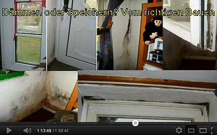

[🠔 Zur Übersicht: Video Vorträge](12akt.md)
# Dämmen oder Speichern? Vom richtigen und falschen Bauen
**Eine karnevalistische Fastenpredigt für und vor Bauprofis. Zwei Stunden Unterhaltung, Spannung, Lachen, Heulen und Zähneklappern garantiert!**  
_mit Konrad Fischer • 13.02.2012_

## Einführung und Kontext

Vorgenommen heute, wir haben mit den Flaschen. Ich bringe Ihnen ein bisschen was aus der Bütt. Nehmen Sie mich nicht unbedingt als den typischen Architekten, sondern denken Sie sich jemand von Ihnen, und habt ihr den Auftrag so gescheites, was zu erzählen über die Bauprobleme. Da fühle ich mich, ich muss sagen, auf den Fuß getreten oder auf den Schlips, der sowieso schon abgeschlissen. Und ich mische das Ganze dann auch mit einer Bußpredigt, mit einer Fastenpredigt, und wir wollen über das Fasten oder Energiewende-Fasten sprechen, das mische ich ein bisschen mit Wein. Also ich versuche Ihnen in unterhaltsamer Weise meine Positionierung, auch vor allem meine Erfahrung mitzugeben, und ich bin gerne mit Ihnen in jeder Art von Diskussion, weil mit mir können wir über alles sprechen. Sie dürfen auch mich beschimpfen, ich halte es aus. Aber es wird aufgenommen. Ja, habe ich kein Problem damit, ich setze mich gerne ausnahme.

## Dämmstoffrätsel: Polystyrol vs. Betonwand

Ja, fangen wir einfach mal mit einem Dämmstoffrätsel an, oder wir könnten auch sagen mit einem Massivrätsel. Kennt jemand meine Webseite? Das ist schon mal gut. Kennt jemand das Wandrätsel? Das kennt auch niemand, das ist schön. Endlich mal Jungfern im Publikum. Wir stellen uns eine Wand vor, das schaffen Sie noch, nehm ich an. Diese Wand ist einheitlich weiß gestrichen. Das heißt, die hat auf die ganze Wandfläche dieselbe Absorption und Emission, Reflexion. Das ist schon mal klar. Diese Wand steht draußen mit Südorientierung. Wir stellen uns die Wand vor ohne Gebäude dahinter, einfach so eine Wand, eine Trennwand. Und diese Trennwand besteht hinter der Farbe zur Hälfte aus Stahlbeton, so wie Sie das kennen. Meinetwegen aus Ihrem Stahlbeton und zur anderen Hälfte aus, sagen wir mal, irgendeinem Dämmstoff. Wir könnten auch Polystyrol dazu sagen. Diese Wand stellen Sie sich jetzt vor, und es ist Juni, es ist der 21. Juni. Es ist Mittsommerwende. Die Sonne fängt schon früh um drei Uhr an zu scheinen. Und die Wand ist südexponiert und hat den ganzen Tag Sonne drauf gekriegt.

Und jetzt kommt der Wärmebildfotograf, den kennen Sie. Und macht sein Foto, und es ist zum Spaß: 15 Uhr, ja, 15 Uhr, er macht sein Foto. Welche Wandhälfte ist wärmer, die mit Polystyrol oder die mit Beton? Bitte Hände hoch, wer ist für das Polystyrol und wer ist für den Beton? Also, ist die Betonseite? Hände hoch! Ganz spontan. Wer ist für Polystyrol? Sie kennen meine Webseite. Wo kommen Sie her? Das sind die Schlauen her. Und wenn da noch ein Grieche sitzen würde, dann würde er das. Okay, er hat recht. Ausländer haben wir immer recht in Deutschland. Warum ist das so? Die Betonwand wird auch am heißesten Tag nicht mehr als, sag ich zum Spaß: weiß gestrichen, 35 Grad bekommen, und zwar warum? Weil sie die Wärme einspeichert. Alles klar. Und weg ist sie, hinten drin. Und vorn entsteht keine tolle Temperatur, sondern es wird erst mal schön alles aufgewärmt. Wohin geht diese Polystyrol-Wand in ihren 3 mm Kunstharz-Krätzchen? Ich verspreche Ihnen, die hat 80 Grad mindestens. Da können Sie fast Spiegeleier draufbraten. Ja, natürlich. Die kriegt doch die Wärme nicht weg, ist doch gedämmt. Alles klar. Und wann kommt die Zeit, um uns zu fotografieren? Dann kommt sie zur 12. Geisterstunde, wenn alle ehemaligen Leute im Bettchen liegen. Dann kommt er und fotografiert. Und früh vor dem ersten Hahnenschrei, dann kommt er. Und welche Wand ist jetzt welche? Glüht jetzt? Habt ihr das verstanden? Und was schreibt er unter seinen gezeigten Bildern? Gut gedämmt, schlecht gedämmt. Und das machen die ja aus ihnen. Und jede fällt drauf rein. Und die Sparkasse und die anderen finanzieren dafür die Kommune in diesem Betrug. Und noch nicht mal ein Watt Heizleistung ist irgendwo dadurch eine Wand gekrochen.

## Fußbodenrätsel: Kälteempfinden und Kellerdämmung

So, jetzt könnte ich nach Hause gehen, weil jetzt wissen Sie Bescheid. Jetzt mache ich das Fußbodenrätsel, kennt das jemand? Wir gehen in Ihren alten Weinkeller. Sie sind Bauleute, Sie haben schöne alte Weinkeller. Wir reden jetzt nicht über den Rotschild, der da liegt oder irgendwas. Wir stellen uns vor, Barfuß in Ihrem alten Weinkeller, der hat eine ganz stabile Temperatur, nicht geheizt, von wie viel Grad? Sechs Grad. In Ihrem Weinkeller, sechs Grad, würde ich fast sagen, ist ein Bierkeller. Ich komme aus einer Brauerei-Familie. Über mich wird kolportiert, mein Vater oder Großvater hätte ein Ziegelwerk und deswegen wäre ich so ein Ziegelfanatiker. Nein, ich bin ein Dorfdepp, ich komme vom Bauendorf, 1700 Einwohner, und wir hatten da schon über 400 Jahre und haben einmal früher eine Brauerei gehabt. Und der Küster hat die 1000 Schweine. Wir sind in diesem sechs Grad Keller, wir laufen Barfuß. Ist auf dem Boden, haben wir ja schon Beton. Mindestens ein Estrich, sagen wir einfach, ein Betonestrich oder ein Zementestrich. Und jetzt laufen wir da drüber. Warm oder kalt an den Füßen? Kalt. Wir dürfen das mitmachen. Warm oder kalt? Kalt. Und zwar, wenn wir das mit dem Temperaturgerät, mit einem Thermometer messen, wie kalt? Wie kalt war denn Ihr Keller? Sechs Grad. Die Lufttemperatur, wie war das? Sechs Grad. Sechs Grad. Sechs Grad. Sechs Grad. Acht Grad. Fünf Grad. Sind alle für sechs Grad? Sind alle für sechs Grad? Stimmt. Haben wir mal eine sechs Grad, warum Temperatur? Ein kleines Beispiel. Langen Sie mal auf Ihre Holzplatte her vor sich. Warm oder kalt? Kalt. Kühl. Und jetzt langen Sie bitte an Ihren Metallfuß, von dem Tisch. Warm oder kalt? Kälter oder wärmer? Kälter. Und jetzt nehmen wir einen Thermometer, zum Beispiel ein berührungsloses Infrarotthermometer, oder wir nehmen diese berühmte Wärmebildkamera. Was ist wärmer? Weiß nicht. Und zwar wie kalt? Kälter. Sechs Grad. Und hier? 20 Grad. Alles 20 Grad. Und jetzt gehen wir ein paar Fuß in Ihr Obergeschoss, da ist ein Bad, da haben Sie auf 27 Grad geheizt und laufen über die Fliesen. Warm oder kalt? Kalt. Warum? All ober für die Kranse. Kalt, weil das hat die Raumtemperatur, 27 Grad, und Ihre Hautoberflächentemperatur ist bei 35, bei Ihrer Frau bei 33, und dieses Delta T, bitte nicht erschrecken ab und zu, kommt mal sowas. Also dieser Temperaturunterschied von der Hautoberfläche zur Bodenfläche, das macht den Unterschied. Es ist eine Abkühlung und der Fuß empfindet das als kalt. Das ist klar.

Jetzt sind wir alle gute Menschen. Wir sind alle gute Menschen. Wir sind alle gute Menschen. Wir sind alle gute Menschen. Wir sind alle gute Menschen. Wir sind alle gute Menschen. Das ist klar. Jetzt sind wir alle gute Menschen. Wir wollen so wie Kapital, wir wollen so wie Kapital sparen und auch richtig investieren. Also müssen wir denken, und dann müssen wir dichten, und wenn wir reingucken, müssen wir auch dämmen. Und weil wir so richtige, gute Menschen sind und sowieso schon seit 100 Jahren immer nur die Grünen gewählt haben, oder unsere schwarzen Grünen, oder die roten Grünen, das ist ja wohl egal, wen man heute wählt. Da dämmen wir unseren Kellerfußboden. Wir wollen ja Energie sparen. Und weil wir so gut sind, dämmen wir jetzt: Wir reißen diesen Betonboden raus und dämmen bis runter nach Australien. Und dann, wir wissen es nicht anders, tun wir unseren Betonboden wieder drauf und warten, bis er trocken ist. Der Keller wird nach wie vor nicht geheizt, soll ja im Brotscheit oder im Bier fast gut gehen. Und jetzt gehen wir runter. Und jetzt messen wir die Oberflächentemperatur, mal nicht wegen dem Fuß oder dem Thermometer. Wie warm ist das jetzt geworden durch die Dämmung? Aber wissen Sie, wie viele Idioten in Deutschland unter Ihrem Kellerfußboden Dämmstoff verbauen? Wissen Sie das? Ich sage Ihnen, fast jeder. Ja, teilweise bis aus Australien.

## Kritik an Dämmung und Medienberichterstattung

Das Wärmebild zeigt den Unterschied. Kalt ist blau, beweist, dass der richtige Bereich des Gebäudes weniger Wärmeenergie abgibt, auch jede Heizenergie, die der Ofen abgibt, als derjenige Teil des Hauses. Natürlich stimmt das. Es wird weniger Wärmeenergie abgegeben in diesem Moment. Nachts, wenn alle anderen Menschen schlafen. Aber sonst glüht das Ding wie verrückt. Haben Sie es jetzt begriffen? Und was machen die Medien? Die EU hat für 20 Millionen Euro gesammelt. Überraschend ist aber, dass der gesamte Bau noch vorbeigehend auf 20 Millionen Euro geschätzt worden ist. Wir haben die Wirtschaftsbedingungen mit den Wärmeenergiezahlen auf. Wir machen uns nichts vor: Wärmeenergie und keine Störung. Und so ist mit der Wärmekamera von außen, denn auf deutlich zu sehen, um die Heizungen, die Energie verschleudern, unter alte, feste Bänke, leuchten die Wände. Wärmeenergieheizung in Wärmedämmungs-Düsseldorf. Nur kann er als Laie nur ganz egal. 16 Millionen Fenster könnten besser isoliert sein. Das ist ein Skandal. Wärmeenergieheizung ist heute nicht so nah wie der Tod. Aber ohne eine Sanierung in der Klimawirtschaft dürfte er geborgen, dass die Zivilisation nicht mehr vermittelt werden. Haben Sie das gewusst? Das kennen wir nicht einmal, nicht das Gesetz. Was die da schon kennen, das den notwendigen Energiepass nicht bekennen. Was? Ich brauche den Energiepass, um zu vermieten, und er muss bestimmte Werte erfüllen. Das stimmt doch gar nicht. Also, so ist Aufklärung in den Medien, hier die Zeitung der Westen. Und jetzt schauen wir uns diese ganze Zivilisierung an. Aber nie so lange eine Kreise willen. Wir haben einen Darstehner, und hier, was sehen wir denn? Schauen Sie mal, diese Düsseldorfer, die sparen irgendwo anders so viel Energie, dass sie den Eulen und Käuzen während dem Arsch behalten. Hier der Deckmann Socke, wie kuttelte Rinde nachts vor sich hin, und warum? Selbst der alte Kaiser Wilhelm, der den sich küge mit bis auf den Kopf stoßen Blechen, ein bisschen Böen geraten, das vielleicht noch zu viel Hirnblinken gewesen. Ministerien verpleiten. Und hier steht das Ministerium vom Bau über die Links, so wie das Ministerium rechts schlägt in den am Restauranttag. Hä? Eine Glasboutique? Hä? Aber das ist so was für ein Blau.

## Phänomen der Gegenstrahlung und Solarwärmespeicherung

Verstanden? Verstehen Sie, was ich sehe? Warum seht diese Partien unter dem Fenster, unter dem Sturz? Warum grünen sie? Wer gibt die Antwort in einem Satz? Und? Und? Aber das ist doch an der ganzen Fassade, das heißt, wir blühen genau diese Partien. Warum grünen sie es hier unter dem Gesims? Weil da die Heizung verlegt ist? Alles falsch. Weil die Gegenstrahlung gegen den Minus 100 Grad kalte Nacht himmelt, der nicht von einer Glühlampe in der Nacht namens Sonne erhitzt wird, weil diese Gegenstrahlung zu einem erhöhten Temperaturabfuhr führt, und wo diese Gegenstrahlung durch eine Überdeckung verhindert ist, verschattet sozusagen, da bleibt die am Tag eingespeicherte Solarwärme länger klemmen. Klarer?

## Praktische Beispiele: Mängel bei gedämmten Fassaden

Logisch. Keine Heizstrategien, die ich Ihnen vorher beschworen habe. Keine. Und was macht hier? Schauen Sie hier. Das wurde dann der deutsche, der deutsche Gartenzwerg, für Sitze sage ich mal, ein tätiges Handeln. Und wenn er sich mit der Familie verträgt und der Mann sagt, ich schlafe sowieso den ganzen Tag und schaut sich mal ungedämmt, schlecht gedämmt an. Das Interessante ist, wir müssen es nur lesen können. Was ist hier für die Ereignisse? Sie haben doch Augen, gehört dazu. Wegen dieses 'Such den Fehler' gemacht? Oder kennen Sie 'Such den Fehler'? Was ist denn der Fehler? Wie schafft es dieser Format in seinen Klappladen hier? Wie schafft er das? Trotz der guten Haus der Ruhe zu glühen? Wie schafft er das? Dieses kleine Scharnierchen holt die ganze Wärme raus. Sodass der vor sich viel glüht wie Sau. Wie das Spangenwerk ist. Ich verrate euch was. Das ist alles massiv. Und der speichert die Wärme, und das ist die letzte Chnurikake und die Frostedale. Und schauen wir, wie klug und glühend es ist, und wie die Verblendung für den Ralf, wie klug das konstruiert ist. Da kommt besonders viel Wärme ran, was besonders problematisch ist, und ewig bleibt das trocken. Ewig bleibt das trocken und gut im Schuss und geputzt, windig aufklappt. Oder hier in der Hälfte die Friesenhaus stellt sich mal vor, wie diese Friesen heizen um die Ecke, heizen die. Unser Sack der Bausünder ist schlechter denn, schlechter denn. Und auch der Friese wird verheizt, nicht mehr.

## Manipulation und Messungen – Braunschweiger Schloss

Und da heißt es immer: Lügen, nicht doch die Lügen, los präsentieren, was in der Zeitung schweigt oder im Fernsehen sagen. Sie lügen wie bei uns, und das wieder aufgebaute Braunschweiger Schloss. Was sparen diese Braunschweiger doch innen die Wärme durch Kanal entweichen? In der Zeitung Braunschweiger Schloss ist vorbildlich in der Welt. Bis auf vier Stellen, es sind diese vier, was ich vollenden will, tun die da vor der Fassade stehen. Und wer heizt die so, dass sie glühen, verstanden, so einen guten Betrug. Tag aus Tag ein in allen Medien, in jedem Werbeapostel, so wird der Kunde reingelegt. Wir Bayern messen selber: minus 10 Grad, das ist mein Büro-Eck. Minus 10 Grad, das ist, was nicht aufgenommen wurde. Es war 9 Uhr oder 10 Uhr. Das ist eine Ost-Ecke, das ist eine Süd-Ecke. Und schon hat bei minus 10 Grad meine massive Büro-Ecke aus Naturstein übrigens die barocke Substanz noch nicht kaputt, oder so. Werden die noch kalt stehen? Massive Außenecke noch bei minus 1 haften. Aber was fällt in den Tau? Nichts. Natürlich, der Witz ist: Warum hat die zweite Außenecke nicht auch minus 10 Grad? Antwort: Weil sie speichern kann, weil sie speichern kann und weil sie vom Tag über vorher so viel Wärme eingespeichert hat. Das langt, dass sie niemals in der ganzen Nacht unter irgendeinen Taupunkt gerät und Feuchte aufnimmt.

## Fallbeispiele: Thermisches Verhalten massiver Bauten

Das ist das Resultat. Das ist unser Hamburger Fall. Ich hab da kein Foto so kapiert, das so bearbeitet. Das war der Aufnahmewinkel hier mit dem Kunden liegens und hier ein Landkreis Bayerns. 30 Zentimeter Schuttsteine. Spielt keine Rolle, was das war, ich hab das nicht untersucht. Und deswegen haben wir da hier 14:15 Uhr die Oberflächentemperatur 24. Und der Freund? Und diese Passivbude in einem luftleeren Raum, die braucht nicht für das Niveau zu kommen. 4 Grad ist schon das. Geben Sie mal die Temperaturen. Überlegen Sie mal, wie viel Energie da gebraucht wird, um so eine Bude um 4 Grad zu bringen. Das ist das Tagbild. Das wird Ihnen von diesen Hallunken verweigert und auch die Diskussion darüber, was das dann bedeuten könnte. Das war übrigens ein Tag, war ja sehr warm. Hat da niemand geheizt, natürlich nicht. Und hier 20:42 Uhr hab ich den Moment abgepasst, hab mich herangeschlagen an das Bauwerk mit dem Fernthermometer, und zack! Alles gleich kalt, schon bei 11,3 Grad, 12,3 Grad nachts abgekühlt. Und jetzt schauen wir um das Niveau, dass es ein Niveau heute nicht sitzt. Und das ist ein 60 cm starkes, 1900er Ödchen. Und das ist warm, 14, 12 außerhalb der Messperiode. Und so bleibt es dann die ganze Nacht und wird immer schlimmer, der Unterschied. Logisch, das kühlt ja immer weiter runter. Und die Lufttemperatur, die ist ja schon nicht bei 15, 16 Grad. Und diesen schönen warmen Abend, ich war da im Hemdärmel gestanden, das Ding ist ja schon unter dem Taupunkt. Und so ist die ganze Nacht. So ist die die Feuchte rein.

## Fraunhofer Studien zu Taupunkt und U-Wert

Und der Fraunhofer, der weiß es, der weiß es. Vom schon kurz gefassten Einfluss aus der Baukonstruktion auf mächtige Betauung. So für Tausende in den Zwecken. Jetzt monolithisch. Jetzt kommt es, jetzt kommt es. Was? Und hier schauen wir mal: Ohne zusätzliche Dämmung, um 1,1 der U-Wert. Da haben wir diese mittleren Kurven hier. Das ist der Taupunkt der Temperatur. Und das ist die WDVS die ganze Nacht, von hier bis hier, diese Taupunkt-Temperatur unterscheidet, und zwar dramatisch mit der Folie. Jetzt stehen die Ursachen, und Fraunhofer, und Fraunhofer, wir wissen doch vom eigenen Messen. Schauen wir mal her: 16 Uhr die Dämmfassade, besser für die Wärme, als diese Anordnung hier muss sie die Massivfassade monolithisch. Das ist einmal schon nicht massiv. Unheimlich, das ist nicht ein guter Stil. Warum ist es auch nicht ein guter Stil? Das ist so ein Dünnblech, so krebserregend und schlecht gemischt. Aber trotzdem, das ist besser als der Dämmstoff. Und da hier 17 Uhr, 18 Uhr, da ist der Schnittpunkt, und da stürzt nur die Dämmfassade im blauen Bereich und fängt das Auskühlen an. Das ist wie der Mensch, der am Sonnenuntergang absäuft, bitte. Und deswegen haben wir so ein Gefühl für diese schöne, warme Dämmung, die ist der Sonne ungenügend nahe. Und so ähnlich, das ist Fraunhofer, der weiß das, und der hat auch schon '85 hier Auswertung der Strahlungspartikel vom Außenmauerwerkband und Nachtabstrahlung der Raumtemperatur auf die Transmission von Verlusten und den reichen Energieverbrauch. Da, was den Effekt, der Dämmstoff bewirkt, hat eine extreme Spreizung. Der bildet hier ab dunkleren Anstieg und helleren Anstieg. Der hellere Anstieg hat nur diese Spreizung in der 13 Uhr. In der Nacht mit allem Gleichklang. Egal wie der Anstieg ist, warum es nicht kann, noch nicht speichern. Logisch, oder? Verstanden? Egal ob sie grün, blau, weiß, der wird immer brutal kalt, weil er nicht mehr speichern kann, obwohl er am Tag an die 60 Grad kriegt. In den Lauf. Auch ein Hofer Messer. Hier ist dieser angebliche monolithische Wand. Und hier haben wir übrigens auch, da ist glaube ich ein 1200er oder 1400er Stein, darunter, und fahren die Dämmung. Und hier ist alles ein, glaub, 800er Stein. Sie wissen, was das ist. Ich brauche es nicht zu sagen. Es ist so ein gelochtes, durchwundenes Zeug in roher Farbe. Wird auch total arm. Nicht ganz so wie der Dämmstoff, wird fast. Und wird dann hier, es ist der hellere Anstrich, wird auch etwas weniger warm. Und sieht es dann irgendwas den noch vorhandenen Resten an Speicherfähigkeit? Sieht es dann natürlich auch unterschiedlich aus im Unterschied zum Dämmstoff. Ich habe dabei: Bitte, haben Sie auch schon mal die neuen Steine untersucht, die jetzt mit Mineralwolle? Ich doch nicht! Das ist die einzige glaubwürdige Untersuchung, die es überhaupt gibt. Das wäre doch schön blöd, wenn Sie diese Untersuchung würden. Da wird der ganze Schwindel doch auch verziehen. Wer soll denn diese Untersuchung? Wer soll das finanzieren, mit welchem Grund? Wer hat das finanziert? Radensümmer? Sie wissen doch: Drittmittelfinanzierung! Fraunhofer? Radensümmer? Das waren die mit diesen Löchern in diesen roten Polstern. Weil das ist so verquast, was da steht. Das hab ich das fast ich nicht verstanden. Nur vielleicht verstehe ich so, wie es so geht. Wird immer geschimpft über meine Person. Oder Google, Google, Sie stehen jetzt vor dem übelsten Mensch der ganzen Welt. Und hier dann hat Prof. Meier hergestellt, er zeigt nun die Streuung des Bunkers. Man stresst. Und da sehen Sie an der Innenwand: Das ist aber nur Theorie. Das ist nicht gemessen. Die Theorie sagt, hier drückt sich praktisch nichts an der Temperatur der Wandmitte so ein Anführungszeichen. Das ist nicht gemessen. Wir wissen nicht, ob das stimmt. Sagt er gleich: Die Temperatur gemessen ist nur die Oberfläche der Temperatur der monolithischen Wand. Und da sehen Sie das, selbst nach Fraunhofer's Meinung, das ist nötig nichts gemessen. Da ist eine irre Menge an Energie hineingefürst in die Wand. Sie schreiben dann auch: Energiegewinne werden nicht erzielt, nur die Verluste vermindert. Die Heizenergieverluste werden gemindert, aber Heiz, also Energiegewinne gibt es nicht am monolithischen Bau. Das ist lustig, das schreibt die Dach. Ich habe selten so gelacht. Ja, wo sind die Messungen? Das sehen Sie mal, monolithische Wand, hier in der Temperatur. Das ist nicht die weiß gestrichene Betonwand, von der ich am Anfang das Rätsel mitgestellt habe. Das ist ein Bodenmist durch den Bodenmist. Der Sonne ist für dann nur Oberfläche. Und mit welcher Folge? Ja, den treibt es auseinander bei dieser Temperaturdehnung. Der will nicht stehen bleiben. So, jetzt wird geheizt. Und hier diese Sehnung monolithisch. Und hier die Außenwand-Dehnung. Gleiche Randbedingungen. Das sind für Versuchshüttchen gewesen, die Wolf-Tier-Kälte. Und es wird geheizt. Und wer braucht mehr bei gleichem U-Wert? Wo muss mehr geheizt werden? Im Vergleich zum hellen Anstieg, den wir auf 100 setzen, verbrauchte der dunkle Anstieg nur 91,4% dieser Energie. Das heißt, bei der dunklen Oberfläche, umso weniger musst du heizen. Okay, das ist schon mal klar. Das ist auch logisch, noch einfacher mehr solare Energien, wo wir nur hier waren. Das ist doch logisch. Aber jetzt die dunkle, die wird doch viel wärmer. Die wird viel wärmer als die monolithische, die gedämmte Wand. Aber sie kann diese Wärme auch nicht richtig verwerten und braucht 95 statt weniger 93. Das muss man erst mal wissen. Das heißt, Fraunhofer weiß, dass du durch Dämmung Nachteile hast, weil du jetzt Verbrauch hast. Das sind also echte Watt, die da durchgemessen wurden in einer Messperiode von 28 Tagen. Das ist eine schöne statistische Signifikanz. Da können wir jetzt ganz ambitioniert drüber nachdenken.

## Wärmespeicherfähigkeit und U-Wert im Detail

Und das ist hier so ein bisschen schön von mir erhalten, dunkel gemacht, alte, schwarze Grafik. Da oben sehen wir nur die Außenluft, Sie sehen die Luft von 27 Grad. Hier so tagesgangmäßig, mit 1 Tag, 2 Tag, 3 Tag, 4 Tag. Aber wir können nur mittags Pausen, aber nicht das Messgeschehen. Das sehe ich hier oben. Das ist der Peak der Strahlung, die Sonne schiebt am nächsten Tag vom Fleck. Dann hier gut unten noch sehen Sie, die Sonne schiebt am letzten Tag. Tag, Tag, Tag, Tag, Tag, Tag, Tag, Tag – das habe ich nicht so toll, da gab es dann auch mal den Wolkenriss, so ein paar Wolken zwischendurch. Alles darüber ist da oben geschickt. Und sie trafen auf die Luft und die Strahlung. Im Tagesgang sind die Strahlung und es gibt die Luft, und diese Luft wird niemals runtergehen. Sie sehen und jetzt hier die Außenbauteile, die werden jetzt wärmer. Im dunklen Fall sehr warm, im hellen Fall nicht ganz so warm. Können Sie sehen, das ist immer so, da war ich nicht über 60 Grad, bei dem diese Sonne genau einen richtigen Moment draufgeschienen hat, soll ich mal sagen. Heiß, wenn dieses Bauteil heiß wird. Und in der Nacht? Da gleitet das auf niemals 20 Grad. Und wo ist da die Temperatur? Ich sag mal, die ist vielleicht noch nicht mal ganz so kalt. Stellen Sie sich mal vor, diese thermische Dämmung ist wohl nicht so ein System, da macht egal, wie warm es wird. Hier, auch hier, ab 16 Uhr sind die identisch. Fusch. Die Wärme, mit der kann nichts angefangen werden. Da die gegenüberliegende Seite wird schon mal nicht so warm, haben wir ja festgestellt. Und, will auch nie so tief absinken. Klar. Will nicht so stark mit den thermischen Spannungen ausgereizt sein. Das ist das, was hier draußen vorgeht.

## Analyse des U-Effektivwerts und Heizleistung

Verstanden? Fragen? Was kommt da eigentlich aus diesem Gesamtbericht? Hier sehen Sie oben die Nullhöhe, das ist der U-Wert. Das ist der U-Wert. Diese Nulllinie ist wieder oben da. Und hier können Sie sehen, auf dieser Linie. Etwa darunter liegen die Messwerte, v.a. auch gerechnet. Aber die Messwerte sind die unteren, der helle Messwert und der dunkle Messwert. Und hier werden Prozente aufgetragen. Und da können Sie sehen, dass da eine Strahlung, die im Durchschnitt die Messwerte hat. Bei dieser Strahlung von 137 Watt pro Quadratmeter, das ist der Durchschnitt dieser Gesamtstrahlung, lohnt sich diese Messwerte. Und dann haben wir eine Verbesserung des U-Effektivwerts um über 40 Prozent. Durch so eine Strahlung. Das müssen wir jetzt mal wissen. Das ist der U-Effektivwert, mit dem dann Prof. Maier die Baustofftabellen entwickelt hat. Mit den Kenngrößen. Und hier sehen wir jetzt die Heizleistung. Und das ist auch interessant, weil Sie sehen, in diesem Gedankenmodell sehen Sie hier die Außenluft, das ist die Novemberperiode, in der ich von etwa 18 Grad runter auf 0,4 Grad ziehe. Da nicht mehr 4 Grad stecken, auf 0,5 Grad. Das ist November. Sie haben Tage, die da jetzt an, bei 18 Grad, wie oft die dann können von rundherum variieren. Und das ist dann etwa, bis Sie sehen, gerade das sind die neun Jahre. Das ist die Starkabkühlung im November. Und logischerweise muss der Heizverbrauch dann ansteigen. Aber wie heizt sich nun so ein Gebäude? Wenn Sie hier, wir schauen jetzt nicht diese Nachtabsenkung an, die ist für uns hier nicht relevant. Wir schauen, die Sie gerade diese Linie haben. Das ist die Heizverbrauchskurve, Nachtabsenkung, im monatlichen Fall. Und dieses hier und hier und hier und hier und hier und her, das ist die Heizperiode. Und wenn die jetzt nicht elektrisch, praktisch verlustfrei geheizt hätten, sondern immer wäre der Kessel an und aus, dann hätten die das zwei- oder dreifache an Energie verbraten in der Heizperiode als elektrisch wegen der heiztechnischen Nachteile eines ständigen Rauf- und Runter am Kessel.

## Elektrische Heizung und Wärmespeichervermögen von Baustoffen

Ist Ihnen das klar? Auch nicht. Ich sage es Ihnen dann einfach als Glaubensbotschaft, die Sie prüfen können, es gibt keine bessere und energiesparende Heizung als eine elektrische Heizung. Da staunen Sie. Und bitte glauben Sie es mir, das hätte ich nie geglaubt. Das musste ich bitter erfahren. An eigenen heiztechnischen Projekten. Ich mache seit den späten 80ern auch heiztechnische Projekte. Hier ist die einzige kunstbekannte Messung, wo man in den Schichten gemessen hat und den Wärmeverlauf relativ gemessen hat. Das wäre der U-Wert, der wird tagsüber nie erreicht und das wäre nachts der U-Wert und er wird auch nachts beim Entladen, wenn der Speicher fähig war, nicht erreicht. Soviel nur wirkliche Messungen. Das Wärmespeichervermögen verschiedener Baustoffe. Wir schauen wieder 10 cm Dicke an und schauen die restlichen Zahlen an: Stahl, Beton, Vollziegel, Holz, Leichtbeton, Polenziegel, Gasbeton, 1 mm Blech, 10 cm Polystyrol, 1,5 mm Glas. Wie viel Wärme kann ein Produkt einspeichern? Nur informell, was geschieht, mehr es verliert.

## Praxisbeispiele und Bauschäden

Und es wird grün, überall in Deutschland, in den Dämmer-Säcken kaputt. Das ist rechts die neue Messe München, wo sie komplett erneuert, sieht im Prinzip schon wieder so aus. Da gingen die Architekten soweit, auf die Außenstützen Vollwärme zu dämmen. Beide Leute, dann kommt die Energieberaterin zum Schluss. Gegenüber steht ein Hochhaus. Das sagt sie, da haben die nur Vorteile, wenn die dämmen, und schlägt das vor. Hier ist schon alles kaputt, da braucht sie nur aus der Tür zu gucken. Das ist Erlangen in der Nürnberger Straße Siedlung. Da wohnen Raucher, oder? Da wollen wir nicht mehr in der Wirtschaft rauchen dürfen, alle nur zu Hause müssen, wie im Tabakverein zu sein hier. So sehen die nun alle aus Hamburg, das haben wir gefilmt. Das ist also keine Ausnahme. Und dann sagt die Industrie, die Wärme, die den Dübel ziehen, die Wärme aus der Wand heben, ist schon gewollt rein. Die sind von der Wärmespeicherung besser, deswegen wird sie nicht so nass, und deswegen heben sie sich dann heller ab. Und so sieht es dann aus in allen Himmelsrichtungen. Und so sieht die Ziegelschale aus und bricht ab bis ins x-te Geschoss und fährt den Leuten auf den Kopf. Stellen Sie sich das mal vor, dass die thermische Dämmung hier alles kaputt macht. Das ist übrigens die zweite Sanierung an dieser Fassade. Und hier auch der Beton geht ja kaputt. Das ist die Vorsatzschalung, das ist die voll aufgerissene Dämmung, die man anbringt, und das ist schon alles runtergeblubst. Gut, der Beton wird sei Dank befreit von diesem nassen Suppenware. So sieht das auch von der Unterkante. Der Beton, das heller laufen Leute, das schieben die Milliardäre, die auch töten wollen, die haben noch Kinder im Kinderwagen. Was glauben Sie? Und die Ecken, Architekturbaracke. Hier, in dieser Gasse, muss man das hier, das klingt so schön, das klingt so schön, das klingt so gut. Da wohnen in diesem Kram, da wohnen die Maden, wie die Made im Speck, und der Specht, der weiß doch, was er tut. Junge, Junge, Junge! Ja, fällt alles rote Deutschland bei. Und noch mal die Erfahrung mit Innendämmung, sagt Innendämmung. Das war Innendämmung. Man sieht sie genau, wie die Innendämmung auflöst in ein paar Jährchen. Das ist Innendämmung.

## Mörtel, thermische Spannungen und Fassadenzerstörung

Auch eine Taupunktfrage. Die interessiert keine Sau heutzutage. So, und jetzt, was ist denn diese Dämmung? Schauen wir mal die thermische Idee noch. Davor, der Ziegelstein, 088, 158, der Normalwert von 18,2. Der Kaltmörtel liegt genau in der Reihe des Ziegels, der Zementmörtel liegt deutlich drüber. Das heißt, alle Zementmörtel müssen sich in Sonnenscheibe den Fassadenputz von Stein verabschieden, müssen Kapillarwirkung in die saufende Risse ausbilden, und deswegen müssen alle Zementmörtel gebaut und Vorsatzschalen Wasserdichtheit aufgeben und säuferisch werden. Das ist nur die kompromissarische Regelung. Und der Lehmmörtel wird nur 1,5. Und jetzt machen Sie mal den Lehmmörtel 1,5 auf den 0,38er und lassen es mal schön warm und kalt werden. So, und hier, Polyurethan, bis zu 12 Pugu, acht Millimeter pro Meter mit 100 Kelvin ist ein Kältebereich. Und wenn dann das Eis drin ist, 5,1. Und jetzt wissen Sie, warum da alles runterfällt. Thermische Spannungen in ihrer Masse und so gehen alle Fassaden kaputt. Und deswegen sage ich Ihnen, Stahlbeton oder Trapezblechfassade oder lasse doch Backstein sein. Das ist die Wahrheit für langstehende Gebäude, die den Kunden nicht abschrecken lassen. Und in den Ecken sieht es so aus. Und in den Ecken hier, ja, überall in Deutschland. Und auch in Schweden und so, gibt es Riesenskandale mit diesen ganzen Dämmungen. Das ist doch falsch. Sie haben doch unendlich viel Luft drin. Die Luft ist feucht. Wenn der Taupunkt kommt, fuck, ist es nass. Es kann keine kapillare Feuchte. Die Feuchte reichert sich an. Umgekehrt Diffusion von der anderen Seite. Und jetzt erzählen Sie mir, welche Untersuchungen uns vorliegen über die Dauerstabilität der Verklebung an dieser Folie. In der luftdichten Konstruktion haben wir jetzt Dachhölzer. Das heißt, schließlich, ist das eine Folie, die ich von Ihnen kenne. Die kommt von innen, die kommt von außen und die bringt ja den Stoff schon mit ein, ja? Woher soll ich das jetzt genau wissen?

## Kondensation, Dauerhaftigkeit und US-Verbote

Es ist überall so. Gehen Sie rein mit den Messern, nun ist es überall. Faktisch, die Dachdecker, die Flachdächer abräumen, die sind alle patschnass, aber nicht weil die Brühe reingelaufen, sondern durch die Kondensation. Das wäre eine gute Konstruktion, unten mit Ton, oben Ziegel. Da geht es nicht mehr raus, und fliegt es runter. Das hat man schon bei Eichler 89 in der Nähe gewusst. Ja, Festigkeit. Wo soll sie denn ziehen, bitte? Alles muss runterfallen. Und thermische und hygrische Dilatation wird das hier genannt, auf Neu-Ossi-Deutsch, ja? So, Amerika. Ganz Amerika wird abgebrochen, wo da die Dämmstoffe... Die Dämmstoffe werden nicht dicht sein. Bauschäden über Bauschäden, und dahinter die Holzhütte. Oh Gott, was wäre das für ein Hohn für ihren Beton? Junge, Junge, Junge! Und was machen die an? Die sich halt am dümmsten schlauen. Cowboys in der Regierung sagen hier, Oregon, laut bei uns heißt es, dass der Staat Oregon verbietet, das Wärmedämmverbundsystem durchzusetzen. Solche Gesetze brauchen wir. Aber leider brauchen sie immer 30 Jahre, und dann sind wir schon dreimal vor die Hunde gegangen in Stalingrad umgekommen, bis unsere Regierung soweit ist, wie die Amis. Verboten. Prohibit. Prohibition, nicht nur bei Alkohol. Auch bei dem System. Das war das letzte... Sie haben vier Staaten verboten, wollten schon seit den 90ern, seit den 80ern, ihr anverbieten, schon starten nacheinander, diese Kacke. Niemand weiß das hier. Ja, und was klappt das dann? Rumpel. Alles werden wir. Auch hier, die Hinterlüftung, auch Müll und Mist, all die Windlast, und Brettabfahrungen, Reif, hier komplett, alles hier kaputt. Nicht nur für Alkohol. Nass. Frost. Hier, hinterm WDVS. So sieht es aus, hinterm WDVS, als Totalversagen. So dämmen die Leute tot und dämlich. Und inzwischen sind sie wieder aufgebaut, haben sie das gesehen in Filmen, da haben sie eine Sprinkleranlage eingebaut, jetzt in die Fassade, eine Sprinkleranlage in die Dämmfassade, weil gedämmt werden muss, ja.

## Deutsche Bauwissenschaft und Wirtschaftlichkeit der Dämmung

Soweit ist Deutschland gekommen, aber das ist nur nicht alles. Es wird abgerissen, wie der Nord oder Neukauf etwas lernen braucht, die man sagt, die deutsche Bauwissenschaft. Und was machen sie? Wir haben eine Heizung in den Dämmfassaden. Ein Patent von jeweiliger Energie. Elektrische Heizung rein oder Warmwasser mit Wärmerückgewinnung ist am Tag eingespeisten Hitzevektor. Soweit sind wir. Verstehen Sie? Und jetzt eine interessante Zahl. Außenwand mit Standardputz: 7,8 Euro pro Quadratmeter im Jahr in Standhaltung oder Bräuchertal. Das ist klar. Und die Dämmfassade, hier Außenwand mit Wärmedämmverbundsystem. Pro Quadratmeter im Jahr 16,43 Euro. Das kostet und fließt selbst die fiktiven Wärme als Spanisch auf. Das ist die Wärme.

## Amortisationszeiten, EnEV und Betrug bei Verbrauchsdaten

Verstehen Sie? Das kommt aus der Pfingstausstellung oder alles, etwas Bauen und Bestand 2008. Eine Untersuchung von 45.000 Euro aus dem Institut für Bauforschung. Das sind echte Daten. Echte Daten. Ja, wer hat sich das ausgedacht? Wer draußen schon uns einwenden sagt, der 45 Zentimeter, es zeigt sich, dass der gesamte energetische Osten der Dicke bei 45 Zentimeter liegt. 91. Und jetzt sind wir bald so weit. Es ist nur verrückt. Das sagen wir so und so. Hier sehen Sie die Amortisationszeiten. Es gibt nichts, was die Sanierung erreicht. Alles ist unwirtschaftlich. Es muss überhaupt nichts gemacht werden nach EnEV. Das ist die Message. Es ist immer unwirtschaftlich. Die Behörden müssen immer befreien. Ausnahmen, egal, was es geht. Heizung. Dach, Keller. Wurscht. Ja, und die Betrügereien mit den unechten Verbräuchen. Hier, diese alte Tauschsiege von 50er-Jahren in Köln. Da behauptet er, nach 45 Kilowattstunden Gas pro Quadratmeter im Jahr. Realität: 19 Kilowattstunden. Diese berühmten, mummeligen Buden der 50er-Jahre, die sind saugut. Ja. Und was sagt die EnEV? Die sagen, es wird schaffbar sein und die Behörden müssen befreien. Sagt der Ehepakt. Und der U-Wert ist eine Hyperbel. Haben Sie nicht gelacht? Und sehen Sie, das bedeutet: Selbst wenn man den U-Wert akzeptieren würde, was ich nicht tue, kann man feststellen, nur 14, die Wege der Dämmstoffwürde, Spaß aufmachen, kommt nichts mehr. Da können Sie draufkacken, dass sie lustig sind. Da kommt kein Effekt. Das ist eben eine Hyperbel. Hier. Diesen Blöcken in Hannover von 78 bis 2004 bis 2006 gemessen. Hier wird der Einser entdeckt. Braucht er weniger. Er wird schon dunkelblau. Er braucht schon mehr als die Muge. 24 Arbeiter in diesem Boden.

## Fraunhofer und Heizsysteme: Wirtschaftlichkeit und Beratungspflicht

Ja, und Fraunhofer, die sind gemessen von 83 und stellen fest, je besser der U-Wert, je mehr die Grafik übersetzt, je besser der U-Wert, desto mehr als die Energiezwecken fließen. Hat Fraunhofer ausgeklickt. Schlechter U-Wert, gelbliche Heizkosten. Das ist doch interessant. Fraunhofer. Ja, Fraunhofer. Und im Fernsehen war ich auch schon da mit diesem Volk. Da sehen Sie, das sind diese drei Böcke. Und der dem Gelb, der braucht zum Usermeisten der Gelbe hier. Die Böcke. Die Böcke. Ja, 500.000 oder 400.000 Euro soll jetzt gedämmt werden. Wie, ihr beratet sie mich, aber ich frage, was brauchst du denn? Dann sage ich: "Weiß ich nicht." Dann rufe mich an, wenn es wieder heiß hergeht in die Verwaltung, klingt raus. Er braucht auch, du lässt uns ein, kommt es an, braucht der kWh 5,6 Liter, 5,4 kWh auf dem Quadratmeter. Braucht er? Und was hatte er? Da hat er 15 cm starke Beton verbaut. Mit einer halben Masse und der alte Bau ist offener für 15 m und der Wetterschutzschicht von 16 cm. Und er braucht fast keine Heizung. Weil ich sage, jetzt gehen Sie nun zu Ihrem ganzen Metier und beklöpfen Sie sich zu diesem Energiesparwahn. Da war der platt. Und natürlich hatte er nicht gedämmt. Da war er nur eine sehr kluge Heizung hat. Nur Wärmestrahlung und nur offen liegende Rohre. Ja, da wird die ganze Wärme, die da transportiert wird, was normal 30% Verlust bringt, wird gewinnbringend in die Bude eingespeist. Und er reduziert die Heizverluste, die da möglich sind. Und da muss man auch ansetzen. Gute Konstruktionen, massiv, und das sieht man, dass er mit einem anderen 30% durch die Wand rausgeht und 80% Energieersparnis wird versprochen. Der Architekt ist verpflichtet, den Bauherrn wirtschaftlich zu beraten. Und genau da packt ihn später das Gericht. Wenn der Kunde nach 10 Jahren denkt, jetzt langsam aber, ab dem Zeitpunkt der Entdeckung der Unwirtschaftlichkeit, dann geht der Prozess noch los. Da hilft ihm keine Gewährleistung.

## Politische Aspekte und 'deutsches Schaf'-Mentalität

Ja, die Amtsstuben, was machen Sie, die sagen, das ist alles un... es lohnt sich nicht, es lohnt sich nicht, jammern Sie rum auf Ihrer Jahresversammlung der Eingrückburg. Und was sagen Sie, energetische Sanierung bleibt im Vordergrund. Das heißt, die tun absichtlich das Geld verbrennen. Statt dass Sie die Befreiung in Anspruch nehmen und Ihre Böden ordentlich machen für den Mut der günstigen Konditionen. Nein, Elektroverbräuche sind sehr niedrig, will ich damit sagen, wenn das nicht... Ja, und die Franzosen, da steht, hier geht raus aus dem Strom, und für die Franzosen ist das schlecht. In Frankreich heizen viele mit Strom, und das könnte im Winter knapp werden. Da steht auch eine Zahl, 80 Prozent, die Franzosen, das sind ganz affine, kluge Menschen, 80 Prozent heizen dort elektrisch. Das seht ihr mal, wie doof die Deutschen sind heutzutage. Und warum? Die sind absichtlich doof gehalten. Und das ist das Schönste, was ein Hirte, wenn er es nur hinkriegt, dass die Schafe alles machen, was dieser zahnlose Wolf namens 60 Jahre alter Schäferhund, was er ihnen also vorkläfft und denken, das ist ein reißendes Raubtier, und wir machen es schon mal in vorauseilendem Gehorsam.

## Befreiungen, Klimaschutz-Propaganda und Fazit

Das ist deutsches Schaf, Mäme. Vorsicht bei Ihnen, wenn Ihr Antrag wird bescheinigt, dass die Voraussetzungen vorliegen für die Befreiung. Das wird mit einer Rechnung unterlegt, und dann wird überprüft, man muss dann befreien. Aus. Mehr ist es nicht, ein kleines Rechenexempel, und dann wird befreit. Von allen Menschen. Knut ist ein Sympathieträger und Botschafter des Klimaschutzes, geboren, sagt ein Tate, Bundesumweltamt, Siegmagaria, am 20. Dezember, und die gestorben ist. An was ist Knut gestorben? An einer Hirnkrankheit namens Öko, namens Klimaschutz. Tja. Sorgen haben eine Inflation, haben eine Schutzpatronin. Das sind unsere Häuser, denen wir glauben, das ist hier der Bundesverband Güter hin und her gekutscht oder so was. Und jetzt sage ich euch, meine letzte Botschaft, es geht nicht so quasi in Predigt, zum Anhören, das ist die Heilige Barbara. Sieben Sünden sollten Sie kennen. Im Kloster Neustift, gehen Sie hin, spenden Sie Kerzen, die ist die Patronin von uns Bauleuten. Ich habe in der Vergangenheit nicht mehr vergeben, aber ich sage Ihnen auch eins, auch Luther war katholisch. Und was sagt sie zu Ihren Bauleuten? Sie sagt auch schön massiv. Und bitte, beachten Sie den VfS.

## Dank

Ich bin dankbar für die Aufmerksamkeit.
