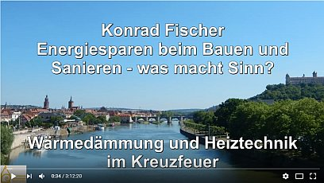

[🠔 Zur Übersicht: Video Vorträge](12akt.md)
# Arbeitskreis Baubiologie Mainfranken
**Energiesparen beim Bauen und Sanieren: Wärmedämmung und Heiztechnik im Kreuzfeuer mit anschließender Diskussionsrunde.**  
_mit Konrad Fischer • 15.04.2017_

Ja, schönen guten Abend und äh willkommen hier zu unserem der Vortragsveranstaltung Energiesparen verbauen und San macht Sinn mit Herrn Konrad Fischer, und ich darf Sie dann unseres Arbeitskreises Baubiologie Franken herzlich begrüßen. Noch mal vielen Dank allen, die mitgeholfen haben zu organisieren und zu ermen. Unser Arbeitskreis existiert seit 2002 und seit 2013 als Verein und aktuell haben wir 20 Mitglieder, 20 aktive Mitglieder, die sich auch auf unserer Internetseite präsentieren. Die kommen aus unterschiedlichsten Berufen. Im Zimmerer da sind dabei Elektriker, Installateure, Haustechniker, Lehmbauer, Maler, die nicht genau wissen, wie es gemeint ist. Ähm, normalerweise haben wir noch für die Leute, die von der Baubiologie noch nicht so viel gehört haben, also direkt übersetzt könnte man so viel sagen, also kann man sagen, äh die Lehre von Wohnen und Leben und der Definition heißt die Lehre von den ganzheitlichen Beziehungen des Menschen äh zu einer Wohn und Arbeitswelt. Ähm in dem Zusammenhang spricht man auch vom Gebäude als dritte Haut und um auf die intensive Verflechtung von Mensch und Gebäude hinzuweisen. Und die gesetzliche Forderung nach einer luftdichten Gebäudehülle kriegt unter dem Aspekt für ich noch mal ganz andere Bedeutung.

Also Aspekt weiterer brechender Begriff in der Baubiologie ist das Fassmodell, wobei der Mensch das Fass darstellt und alles was auf ihn einwirkt, also die Belastungen quasi der Fass Inhalt und wenn eben das Fass voll ist, dann bringt unter Umständen der letzte Tropfen das Fass zum Überlaufen, was sich dann eben als Befindlichkeitsstörung oder als auch als Krankheit äußert. Und wenn man die beiden Modelle, also das Modell C und das Fassmodell jetzt noch so für sich weiterdenkt, dann da weiß man eigentlich schon recht viel von dem, was die Baubiologie will und was auch die Mitglieder von unserem Arbeitskreis in ihrer täglichen Arbeit verfolgen. Noch ein paar Worte zur Ausbildung und die Ausbildung zum Baubiologen, die Kenntnisse in 25 einzelnen Themenbereichen, wie dann z.B. Raumklima, Baukonstruktion, Baupsychologie, äh Heizung, Lüftung, Strahlung und es ist relativ breit gefächert, was eben als Grundlage dient und als Gesamtheit ganzheitlich zu sehen, also die die Beziehung von Gebäude und Mensch. Ja, soweit so gut. Die mit Gebäuden beschäftigt sich auch der Herr Fischer bindet und freue mich sehr, dass wir ihn die Veranstaltung heute gewinnen konnten. Seit einigen Jahren verfolge ich schon die Aktivitäten auf seiner Website und ich weiß noch wie ich mich beim ersten Mal als ich da zufällig drauf kam und mir dann dachte, was er denn nur am Leben rumzunörgeln hat. Also ich bin Lehmbauer und na ja so habe ich es erst mal ignoriert und äh hat mich aber dann doch irgendwann weiter interessiert und mittlerweile muss ich sagen, ich habe da schon echt viele Anregungen gefunden auf der Seite und durch auch eigene so als Anhaltspunkte durch eigene Recherchen hat es mein Wissen, also ich bin Architekt im Handwerk sozusagen als schon deutlich bereichert und das heute eben den Zeitalter der Fake News, den ist auch wichtig, die allerlei Behauptungen kritisch eben zu prüfen und äh auch wenn dem eigenen Fisch vielleicht auf den ersten Blick mal widersprochen wird und man muss vielleicht auch die eine oder andere heimliche Kuh schlachten, um um da irgendwie weiterzukommen. Ja, soweit. Abschließend hätte ich da noch ein Gedicht von Schweizer Theologen, was ich ganz nett und passend find und es heißt wo kämen wir hin? Wenn alle sagten, wo kämen wir hin? Und niemand ging um einmal zu schauen, wohin man käme, wenn man mal ging. In diesem Sinne viel Spaß beim Vortrag.

Vielen Dank, Herr K. für die schönen Ausführungen. Ich darf Sie heute Abend auch von meiner Seite aus herzlich begrüßen. Ich habe mich selten auf einen Vortrag so gefreut wie auf diesen. Warum? Erstens mal das Publikum, Fachleute, kritische, ich hoffe auch lebendige, die dann in der Diskussion die Kritik und vielleicht weitere Fragen loswerden wollen, da will ich mich gern stellen. Ich kann hier nur meine Wahrheit erzählen und Sie haben ihre. Meinen vier Kindern, jetzt komme ich schon ins Persönliche, habe ich immer beigebracht, es gibt mindestens drei Wahrheiten, meine, deine und die. Und keiner weiß, wer recht hat. Und so dürfen Sie heute meine Ausführungen auch verstehen. Natürlich, ich glaube an das, was ich sage. Ich will Ihnen auch da jetzt nichts verkaufen, sondern ich möchte meinen kritischen Standpunkt erläutern, fundieren und vielleicht auch ein bisschen überspitzt mal rüberbringen. Also, das der erste Grund. Ich erwarte hier ein kritisches Fachpublikum. Wer ist denn überhaupt vom Bau? Macht mal die Hände hoch oder vielleicht ja doch und wer ist nur Verbraucher in Anführung? Wer ist nur Hausbesitzer? Sind auch welche da? Das freut mich auch sehr.

## Konrad Fischer: Persönliche Einblicke und Familiengeschichte

Der zweite Grund ist, dass ich diesen heutigen Vortrag eigentlich als eine Premiere auffassen darf, weil ich das erste Mal in meiner Geburtsstadt reden darf, eingeladen. Bin ein gebürtiger Würzburger. Wie kam das? Mein Vater war hier tätig nach dem Krieg. Er hat in München studiert und sein erster Job hier war im sogenannten Landbauamt während der anlaufenden Wiederaufbauprojekte. Und von diesem Landbauamt hat's ihn dann verschlagen als nächsten Job in das Büro vom Architekten Professor Boslet, der Münsterschwarzach wieder aufgebaut hat. Und so ist er dann in dieser Sakralbau-Architektur bisschen reingekommen und hat meine Mutter auch in Würzburg kennengelernt. Die war nämlich eine quasi Vertriebene aus Siebenbürgen und war Organistin an der Johanneskirche evangelisch und mein Vater war auch evangelisch und so sind die dann praktisch auf der Orgelbank zusammengekommen und hier steht das Ergebnis. Nach vier Jahren ging's wieder in die Heimat meines Vaters nach Oberfranken in den kleinen Ort Schwürbitz, wo mein Vater begonnen hat mit seinem Beruf als Architekt auf dem Dorf. Das war ein herber Szenenwechsel, vor allem für meine Mutter, weil auf dem Dorf da war dann bisschen anderes Leben als in Würzburg. Und mein Vater hat dann auftragsbedingt sich eigentlich mit Gebäudereparaturen über Wasser gehalten. Das wollte ja damals niemand machen. Mein Vater, der hat im Studium die Weißenhofsiedlung in Stuttgart besucht und da war kein Gebäude mehr bewohnbar durch Bauschäden an diesen modernen Flachdächern und Betonkonstruktionen, was da war und er als Bauernbub hat gesagt, so kann ich doch nicht bauen, das gehen mir doch die Kunden auf den Buckel. Und er hat es tatsächlich geschafft, die 50er, 60er, 70er Jahre in seiner Schaffens Zeit kein einziges Flachdach hinzustellen, keine einzige Betonbunkerburg da. Denken Sie mal an die Sparkassen überall. Ja. Und was ist denn dann übrig geblieben? Die Leute, die von ihm ein Flachdachbungalow haben wollten, die hat er weggeschickt zum Kollegen. So hat er das vertreten. War ein absoluter Nischentyp, hat gesagt, da muss es stimmen und das habe ich von ihm gelernt. So ist es entstanden und so kommt auch meine Ausprägung dann eigentlich für die Altbausanierung. Das ist meine Stärke. Soweit erstmal dazu.

## Energiesparen beim Bauen und Sanieren: Was macht Sinn?

Jetzt heute unser Thema Energiesparen beim Bauen und Sanieren. Was macht Sinn? Und diese Sinnfrage wird auch in der Branche, in der Handwerksbranche mehr und mehr offenbar. Macht das wirklich Sinn, alles zuzudämmen? Und ich nehme dieses Bild hier als Aufmacher. Das ist eigentlich eine Werbung für Reinhard Neubauerdämmung, Konstruktion, Bauphysik und so weiter äh Umsetzung. Und hier wird nun geworben, nicht nur Dämmung, jetzt 50 € sparen, das ist immer das Hauptargument, dass man mit Dämmung spart. Wir kommen noch drauf. Es, was ich unten gelb markiert habe, bei der Dämmung im Baubestand treten regelmäßig, das ist schon mal interessant, ist nicht nur ein Zufall, sondern regelmäßig treten da eine Reihe von Problemen auf. Nachträgliche Außendämmung ist vielfach zu teuer, gestalterisch, baurechtlich problematisch. Deshalb rückt die Innendämmung in den Mittelpunkt. Wir brauchen andere Dämmkonzepte. Wir, die Effizienz von dickeren Dämmschichten wird höchst kontrovers diskutiert und dazu gehöre ich. Das wissen manche, die schon bisschen von mir gehört haben. Ich bin sicher einer der, der die Kontroverse am Laufen hält und deswegen bin ich heute auch wieder da, weil wir müssen die Dinge von beiden Seiten eher betrachten. Als Planer und Handwerker und natürlich auch als Hauseigentümer benötigen Sie bei der Vielzahl der angebotenen Produkte soll der Buch die Buchwerbung gezielte Fakten zum aktuellen Stand der Technik, um fundierte Entscheidung für Geeignetes treffen zu können. Diese Aufgabe möchte ich mich heute stellen. Wir wollen Fakten vermitteln. Ich will kein Stimmungsbild rüberbringen, sondern wir wollen was lernen. Was hat's mit der Dämmung auf sich? Und ich möchte nicht nur das Thema der Dämmhaut und so weiter, sondern auch grundsätzlich, warum sollen wir dämmen? Was ist der tiefere Sinn da drin? Warum muss der Staat das in die Hand nehmen? Das wollen wir auch kurz mit ansprechen, also auch ein bisschen die Sinnfrage eben stellen.

Das hier sind nur, damit Sie mal so sehen, was ich so treibe, zwei aktuelle, mehr oder weniger aktuelle Projekte. Rechts 99217, die Spätbarocke Orangerie, dem alten Fritz, seine Frau hat die gebaut. Die war dann in der DDR-Zeit ist die unter die Räder gekommen. Ich habe sie 99 notgesichert. Sie sehen den Zustand vor der Notsicherung eingewachsen und danach und ein paar Jahre vorher habe ich die Marienkirche, Nähe Alexanderplatz in Berlin, auch als leicht ruiniertes Bauwerk, was den Turmbereich betrifft, übernommen und nur mit reiner Luftkalktechnik saniert. Sie können die angucken, die steht jetzt seit 2004 nur in Kalk da und steht top. Also keine Mineralfarbe, keine Silikatfarbe, keine Dispersionsfarbe, keine Silikonharzfarbe, sondern nur Weißkalkhydrat und Wasser. Und das funktioniert, nur traut sich niemand. Und wie Sie auch sehen, ohne Dämmung. Ja, und ich mache eben im ganzen Bundesgebiet mehr oder weniger interessante Ruineninstandsetzung und das ist eigentlich mein Hobby, muss ich sagen. Habe ich zum Beruf gemacht, allein diese Dinge kostensicher über die Bühne zu bringen. Das habe ich 450 mal gemacht. Ja, Ruinen oder komplexe Denkmalinstandsetzungen, Fachwerkbuden, die eingekracht sind, das ist eigentlich mein tägliches Brot im Fränkischen und auch bis zum Rathaus Bremen oder in die Bundeshauptstadt oder an die Waterkant, es auch nicht nur die Propaganda, mit der ich mich beschäftige.

## Geschäft mit der Angst: Bauen und die Klimakatastrophe

Ja, wo ist das Problem? Es ist ein Geschäft. Das ist uns allen, die wir in der Branche tätig sind, klar. Bauen ist auch ein Geschäft, ist Existenzgrundlage, und wenn man einen Blödsinn verkaufen will, ist am besten man verkauft den über das Geschäft mit der Angst. Und so wie man früher dann über Hexenängste die Leute zum Schluss auf dem Scheiterhaufen gebracht hat, oder durch die Atomangst ein ganzes Land von seiner doch preisgünstigen Energie abgekoppelt hat. Ich denke mir nur an Grafenrheinfeld um die Ecke. Ich war übrigens auch Atomgegner, ich will das Thema nicht weiter jetzt ausführen. Wie uns Russland immer wieder Angst macht, damit wir jetzt unseren ganzen Bundeshaushalt auf Rüstung umstellen, raus aus dem Sozialen, rein in die Rüstung, wie uns die Klimakatastrophe, und das ist jetzt unser Thema, Angst macht. Der Kölner Dom soll untergehen, die Welt soll dann auch verbrennen. Die neuen Heiligen reden von Selbstverbrennung. Ja, während man die Märtyrer früher vielleicht verbrannt hat, soll jetzt die ganze Welt dran glauben. Und was früher? Wir sehen hier den Seni und den Wallenstein. Das war der Hofastrologe Seni, und man munkelt, dass er an dem Mord seines Auftraggebers beteiligt war und mitgeholfen hat, ihm durch Bestechung seinen Mördern auszuliefern. Diese Hofastrologen früher, sage ich, sind heute die Klimawissenschaftler, die dann sagen, ja, in 100 Jahren 1,97 Grad, wenn ihr jetzt viel dicke Dämmung da macht und es ist für mich auf demselben Niveau. Es ist Hofastrologie und sie heißt halt Klimawissenschaft. Das waren sehr gelehrte Leute, die konnten rechnen, Planetenkonstellation, alles Mögliche. Ja, zum Schluss ist der Kunde tot.

## Ministerielle Propaganda und die Realität der Energieeinsparung

Unser Bauministerium habe ich letzten April mal geguckt, was die da so schreiben zum Gebäude und Energieeffizienz, und das steht dann so letztlich drin. 90% des Energieverbrauchs des privaten Haushalts wird dafür die Heizung fast verschwendet. Den deutlich überwiegenden Anteil, Dreiviertel, macht die Raumwärme aus. Ein Großteil der Raumwärme entweicht. Auch alte Heizkessel sind auch nicht gut. Wärmepumpen, Gas, Öl und Stromverbrauch. Resümee: Altbauten müssen besser gedämmt und ineffiziente Heizungen durch moderne Anlagen ersetzt werden. So ungefähr läuft die Fundierung dieser Gesetze, die aus diesem Bauministerium, Wirtschaftsministerium, Umweltministerium ständig ausgespuckt werden. Fast im Jahresrhythmus wird irgendwas wieder verschärft, weil es eben muss, sagen die. Wer heizt schon gern die Straße statt die Wohnung? Kann man natürlich fragen. Und jetzt sagen die da: Bei Altbauten lässt sich der Energiebedarf in Einzelfällen 90% verringern, im Durchschnitt 50%. Da möchte ich jetzt meinen Kopf drauf wetten, dass wenn hier einer sitzt, der gedämmt hat, dass der garantiert keine 50% eingespart hat und 90 schon zweimal nicht. Das ist also pure Lüge auf unseren ministeriellen Webseiten. Das ganze Volk wird angeschwindelt unter Amtsanmaßung.

Schauen wir mal die Raumwärme an. Es sind von der Gesamtwärme in Deutschland 28,5% und darum wird gekämpft. Darum wird gekämpft um dieses Viertelchen, dieser rote Abschnitt, das ist Arbeitsgemeinschaft Energiebilanz. Und was ist mit unserer Wärmeversorgung? Hier sind wir auf dem Umweltministerium, das inzwischen zusammengewachsen ist mit dem Bauministerium Barbara Hendrix. Das sagen die so dem Bürger. Die Wärmeversorgung in Deutschland ist sichergestellt, kein Grund zur Sorge für die nächsten Jahre. Aber mittelfristig und langfristig ist die Wärmeversorgung jedoch ein Problem, weil Kohle, Öl und Gas begrenzt sind. Die sagen, kurzfristig haben wir noch fossile Energieträger in ausreichendem Maß. Das wird aber nicht so bleiben. Förderhöhepunkte werden hier reklamiert. Die Vorkommen werden immer knapper. Auch die Chinesen wollen noch mal Öl und Gas verbrauchen und zum Schluss gibt's keine fossilen Energieträger mehr. Das ist ja wohl auch das jedem Bürger einleuchtende zentrale Argument, die Energie geht ja mal zu Ende. Und damit das möglichst spät der Fall ist, müssen wir halt dann schauen, mit welchen Alternativen wir da diese verknappenden Rohstoffe bekämpfen. Dann sagen die, Öl und Gas werden in geopolitisch unsicheren Regionen gewonnen. Wir selber haben keine Vorkommen und müssen Energie importieren. Also, wenn das wahr wäre, dann fragt man sich, welcher Wahnsinn steckt eigentlich dahinter, den Gaslieferanten, der am zuverlässigsten durch den kältesten Krieg hindurch Deutschland mit Erdgas versorgt hat, den so zu piesacken, das ist Russland. Da fragt man sich, was treiben die hier, mit der einen Hand geben, mit der anderen Ohrfeigen? Oder wenn das nun so wäre? Also, dann sagt man, das ist ein solcher Widerspruch. Da kann man fast sagen, vielleicht glauben die selber nicht an das, was sie hier schreiben ministeriell, weil das ist ja Regierung. Und dann sagen die, Öl und Gas machen Treibhauseffekt und Klimawandel. 800 Millionen Tonnen CO2 gehen jährlich zu 40% auf Öl und Gas zurück für die Wärmeversorgung. Also, Klima ist auch ein Problem. Und dann ist es natürlich, die Alt Energiewende, die hier eingeleitet wurde, ist alternativlos. So das Presseamt der Bundesregierung.

## Die Mär von den ausgehenden Rohstoffen und das CO2-Problem

Fangen wir mal an mit den ausgehenden Rohstoffen. Wo kommen die denn her? Kohle, Öl, Gas. Ist das fossil? Ist das Tierleichenöl, wie das ein Georgius Agricola 1548 behauptet hat? Der hübsche Mann da oben rechts. Er hat also ein Grundlagenwerk über die fossile Herkunft der Energie geschrieben. Nebenbei waren noch tolle Kapitel über Bergwerksdrachen und Zwerge mit dabei, Gnome. Also, der war ein hochgradiger Wissenschaftler von höchstem Rang und auf ihn geht es hauptsächlich mit zurück, dass wir Deutschen an die fossile Energie glauben. Dann kam noch ein verrückter Russe namens Michael Lomonosov. 1757 hat er ein paar Baumstümpfe eingebacken in Kohleflözen gefunden, hat gesagt: "Ah, die Kohle ist aus Bäumen." Und ungefähr alle hier denken doch sowas, oder? Ablagerungen, irgendwelche Biomasse, so denken doch fast alle. Und deswegen ist es eben erschöpflich. Jetzt gibt's aber den Thomas Gold, ein Jude aus Wien, der zur höchsten wissenschaftlichen Ehren in Amerika, in England und so weiter gefunden hat mit seinem Buch, auf das ich hier nur hinweisen möchte, Biosphäre der heißen Tiefe. Und er trägt nun die gesamten Forschungsergebnisse zusammen, die seit etwa 1946 vorzugsweise von den Russen herausbekommen wurden. Im Ergebnis ist Kohle, Öl und Gas ein Produkt aus unerschöpflichen Gasmassen im Erdball, die durch hohen Druck und hohe Hitze sich sozusagen an der Oberfläche in verschiedenen Stufen stauen, auskondensieren in verschiedenen Fraktionen, und das ist der Hintergrund, und deswegen gibt es keine Ölquelle, die geschlossen wurde, keine Gasquelle ist, ständig strömt das nach, und insbesondere an den Bruchkanten der Kontinente, und ich zeige hier auf der Karte oben in dieser Bruchkante, wo die jetzt alle auf dem Öl schwimmen sozusagen, da treibt es nun von unten her diese Energien fast punktweise oder fast flächig zusammen, und dort werden die gefördert. Sie haben vielleicht schon mal was von Methanhydraten gehört, die in Eisform auf dem Meeresboden erscheinen. Das ist derselbe Effekt. Ich bin also der festen Überzeugung, nachdem ich mich jahrelang mit den wissenschaftlichen Hintergründen beschäftigt habe, es ist unerschöpflich und es ist nicht fossil, was wir an Öl, Gas und Kohle notfalls auch verheizen oder durch einen Diesel treiben. Das ist meine Meinung. Sie können das prüfen. Es gibt Wikipedia Artikel dazu. Sie sollen einmal gehört haben, dass es hier auch eine andere Meinung gibt.

Dann das CO2. Wir haben hier auf der linken Seite eine Darstellung. Das ist ein reines auf Rechenwerk basierende Weltkarte, und sie sehen die Hauptemissionsländer für CO2, umgerechnet aus Verbrauch von Öl und Gas und solchen Sachen. Und dann hat man angefangen, seit 2014 zu messen mit einem Satelliten. Es gibt jetzt einen Satelliten da oben, und der kann das CO2 messen, und da sehen Sie nun die Karte, hier zentrale Ausstoß nach Berechnung, und das ist die Tatsache in der Winterszeit. Das ist eine Novembermessung von 2014. Und hier, wo gar nichts ausgestoßen wird, da haben wir die zentralen CO2-Probleme. Das muss man auch erstmal wissen. Es ist alles gelogen, was ihnen zu CO2 davor geflunkert wird. Grundsätzlich alles, kann man sagen, das sollen Sie auch mal gehört haben. Diese CO2-Ausgasungen, die hier sind, die kommen natürlich vorzugsweise von den Pflanzen, die in ihrem Kreislauf Sauerstoff und CO2 entsprechend CO2 abgeben. Auch Tiere geben CO2 aus. Und hier, wo wir wirklich heizen wie die Verrückten hier im nördlichen Europa, da sehen Sie keine Spur von dramatischen CO2. Die Messperiode hier, das ist 2014 Oktober bis November. So viel zu diesem. Es gibt also nicht den geringsten Grund, vor übermäßigem CO2 erstmal als solches Angst zu haben.

Und hier gehen wir noch ein bisschen genauer rein und sagen: "Ja, Moment mal, CO2 ist doch ein Gas und Luft ist doch auch ein Gas, und die haben doch Prozente. Sie sehen das hier, die Luft hat Stickstoff 78%, Sauerstoff 20%, Argon 0,93, und ganz am Ende der Fahnenstange kommt CO2 mit 0,04% Bestandteil in der Luft." Was will ich damit sagen? Dieses CO2, das nun ungeheuerlich dazu beitragen soll, dass uns die Erde abfackelt, gibt's fast nicht in der Luft. Ja, das ist erstmal auch nicht vielen bekannt. Die Architektenkollegen in der Kammer in Hamburg, die ich vor einigen Jahren gefragt habe, schätzt mal, wie viel CO2 ist denn in der Luft? Da kam 80% raus. Und wenn ich sie gefragt hätte, da wäre auch noch was um 10 bis 50% gekommen. Es wird uns ja so eingebrannt in die Birne.

## Die CO2-Theorie und ihre Schwächen

Hier wird nun gesagt, die Sonne scheint, die Erde wird warm, die Wärme wird abgegeben. Sie trifft hier in der Atmosphäre auf CO2 und wird zurückgespiegelt, reflektiert, gestrahlt, was weiß denn ich, und soll es nun schaffen, die Erde zu erwärmen. Durch abgestrahlte Wärme. Können Sie genauso an die Lampe einen Spiegel machen und dann von 40 Watt auf 80 Watt ankommen. Ja, das ist dieselbe Grundidee. Und wenn wir hier das sehen, sagen wir mal an dieser Stelle, dann stellen wir mal die Frage, wie schwer ist denn die Luft? Und die Luft hat nun ein Gewicht. Das Molgewicht von 29, wenn ich mich erinnere, und das Molgewicht von CO2 ist 44. Ist also wesentlich schwerer als die Luft mit 29. Und wenn wir nun etwas schwereres in etwas leichteres reingeben, brauchen wir, um es zu erwärmen, mehr oder weniger Energie.

Und dann stelle ich die Frage andersrum. Wenn ich hier ein Kubikmeter Bleiwürfel habe und daneben ein Kubikmeter Daunen, und jetzt haben die beide 0° und wir wollen sie beide mit Energie auf 20° hochheizen, wo muss ich mehr Energie reinstecken? Wer ist für Blei? Wer ist für Feder? Natürlich die Massenmoleküle im Blei, die ja bewegt werden müssen. Wärme ist Bewegung, verzehrt unendlich mehr Energie. Und wenn wir nun ein schweres Gas wie CO2 in das leichtere Luftgemisch immer weiter anreichern, dann ist das ein Kühlfaktor. Ein Kühlfaktor und nicht ein Erwärmungsfaktor.

## Fakten und Messungen zum CO2-Gehalt

Und dann schauen wir uns mal die Tatsachen an. Das sind Messungen, tatsächliche Messungen des CO2-Gehalts in der Atmosphäre seit 1750. Und dann haben wir hier die Benediktiner Wetterstation in Hohenpeißenberg und ihre Durchschnittstemperatur. Und dann haben wir als Kontrolle auch in Österreich die Temperaturdaten hier seit 1800 rum. Und dann sehen wir heute, das ist hier 1990, sind wir noch lange nicht dort, wo wir mal waren. Und dann sage ich dazu immer, du meine Güte, was müssen da die Pinguine geschwitzt haben? Das war ja deutlich wärmer als heute. Und wie viel Auto müssen die gefahren sein da auf der Antarktis und sonst wo?

Was ich damit zum Ausdruck bringen will, es ist auch nicht das Geringste an Korrespondenz zu sehen zwischen den Bewegungen des Klimas oder dieser Durchschnittstemperatur und dem CO2 in der Luft. Es gibt keine Korrespondenz. Und was machen die Betrüger, die von unserer Regierung ermächtigt werden und von der Wirtschaft benutzt werden? Die schauen sich die Chose nur hier ab 1850 an und legen uns diese Kurve vor, nur diese Kurve, die also diesem Anstieg entspricht, und das verschweigen sie uns, und das ist Betrug, weil das geschieht absichtlich. Und in der Mainpost und dem Obermain Tagblatt und ihrer neuen Presse und in allen Käseblättern dieser Welt, inklusive Bild und Zeit und sonst was, werden sie immer nur diese Kurve finden. Jeder kennt sie. So gehen die mit uns Verbrauchern um, um uns abzuzocken. Das ist meine Meinung.

## Staatliche Maßnahmen und ihre fragwürdigen Ziele

Und was macht unsere Staatsregierung in ihrer übergroßen Weisheit? Gestern war Ascher Mittwoch. Wir verlegen das mal auf heute. Diese Staatsregierung in ihrem Wahn mit einem damaligen Umweltminister Werner Schnapp auf Oberfranken, und mehr aufgeschnappt oder übergeschnappt geht ja gar nicht. Legt nun ein Programm gegen Kohlendioxid auf. Wie verrückt ist das denn? Und tut unsere ganzen hier Privatisierungserlöse, alles was sie verscherbeln, was wir von unseren Steuergeldern in unsere Staatswesen hineingepumpt haben, das wird verscheuert und wird gegen CO2 eingesetzt. Wie verrückt ist das denn? Das ist Betrug und kriminell. Was machen die? Der Anteil der Biomasse soll auf 5 % gesteigert werden. Vor einiger Zeit gab's dann auf unserer Bundesstraße einen ganzen Tag lang die Sperrung, weil so ein Kackbunker sich kompletter ergossen hat. Das kann man aushalten. Okay. Ja, das beruhigt den Verkehr. Aber sie wollen Wasser und Wind. Ja, sie sehen überall die fränkischen Hügel und so weiter und die Altbausanierung und da lässt sich diesmal nur 25% einsparen. Ja, also das ist auch sehr widersprüchlich. Ist ja schon ein bisschen älter, ne? Ja, inzwischen kann man noch mehr sparen. Ja.

Und was ist der tiefere Sinn? Die wurde dann eingeführt, so 2000 rum. Und was verspricht der Bundesbauminister damals namens Bodewig, einen Investitionsschub für die Bauwirtschaft? Das ist der tiefere Sinn. Und deswegen scharren die alle mit den Füßen als Lobbyisten und bringen die schwarzen Koffer da in irgendwelche Ecken, um ihre Gesetze zu kriegen, um Nachfrage nach neuen Fenstern und Wärme in dem Moment ansteigen zu lassen. Das ist der tiefere Sinn, und das nennt sich heutzutage Klimaschutzpolitik. Es geht ums Plündern, und ausnahmsweise hatte die Welt auch einen Licht Moment und sagt dann, die CO2 Theorie ist nur geniale Propaganda. Ein Artikel bemerkenswert von Günther Eder, das war ein ARD Journalist. Szenario, die Welt bekommt Fieber. Ja, das ist Astrologie.

## Das richtige Verständnis des Dämmens

Heute kommen wir zum richtigen Verständnis des Dämmens. Wir bauen in ihrem Garten, jeder hat einen oder kennt einen, ein Gartenmäuerchen. 10 m lang, 2 m hoch. Soweit können sie mir folgen. Und weil wir Sparfüchse sind, nicht nur die Sparen, auch die Franken sind Sparfüchse, bauen wir dieses Mäuerchen aus Lesesteinen aus unserem Feld. Da sind im Übrigen und da wird es hier hingesetzt. Können Sie alle nachvollziehen. Und siehe da, nach 5 m gehen uns die Steine aus. Und dann erinnern wir uns an die letzte Dämmmaßnahme, und da sind noch ein paar Reste in der Garage, und da holen wir die Styroporblöcke und den Rest bauen wir auf Styropor. Alles klar. Kommt doch der Nachbarsmann, und sie wissen, wie die so sind, und der sagt: "Du, deine Wand sieht nicht schön aus." Dann schauen wir die uns kritisch an und sagen, es steht irgendwie kein einheitliches Bild, so wie wir das gerne hätten an unserem Garten. Also wird die verputzt, und weil auch der Putz noch nicht so schön ist, wird der gestrichen, und dadurch haben wir eine Oberfläche mit einheitlicher Reflexion, Absorption und Emission. Soweit kann man sich das. Muss man nicht verstehen. Es sind identische Oberflächen, und jetzt siehe, das ist der 21. Juni, es sind noch ein paar Tage hin, aber wir nehmen an, es werde der 21. Juni, die Sonne scheint den ganzen Tag auf ihre Gartenmauer, und die guckt nach Süden, und jetzt die Frage, um 17 Uhr kommt dieser berühmte Mensch mit Unterstützung der Kreissparkasse, hier Stadtsparkasse, mit der Wärmebildkamera und macht ein Bild. Wer es kennt vom Internet, bei mir nicht mit abstimmen. Jetzt möchte ich wissen, welche Wand ist wärmer? 17 Uhr, 21. Juni, ganzen Tag hat die Sonne da drauf geschickt. Wer ist für? Wer ist für Feldstein? Danke wie immer. Dümmer geht's nimmer. Warum?

Denk doch mal nach. Der Feldstein, wenn der die Sonne kriegt, dann hat er eine gigantische Wärmeleitung und leitet die Wärme, die er empfängt aus dieser solaren Strahlung tief in sich hinein und kann deswegen an seiner Oberfläche keine großartige Temperatur aufbauen. Wohingegen diese Dämmblöcke da? Die haben ja gar keine Wärmeleitung. Da wird nichts geleitet, da wird auch nichts gespeichert. Die ganze Hitze macht sich breit auf dem dünnen Putzschärtel. Ja, und dann kriegt die locker 80, 85° und jeder von ihnen kann sich für 14 € ein Infrarot Thermometer kaufen. Das können wir uns noch leisten. Und das war für mich ein solcher Durchbruch, wie ich mir das Maschinchen gekauft habe und war sowas von schockiert. Die erkennen ja jeden Farbunterschied. Kennen sie durch die andere Absorption auf einer einheitlichen Oberfläche. Aber sie können diese Messung jeden Tag machen. Jeder kann das prüfen.

## Die Nacht und die Wärmebildkamera

Und jetzt, was geschieht in der Nacht? Jetzt scheint der Mond. Wann kommt denn dieser Hauptum Staatsbetrüger namens Energieberater oder Wärmebildkammerist oder wie wir ihn nennen wollen? Wann kommt er denn in der Gespensterstunde, wenn alle ehrlichen Menschen im Bettchen liegen? Oder vor dem ersten Hahnenschrei, wenn nur Mörder und Diebe unterwegs sind? Und jetzt macht er seine Aufnahme und welche Wand ist jetzt wärmer? Wer ist für Feldstein? Wer ist für Styropor? Alle haben es gelernt, und das finde ich ist ein Erfolg des Vortrags, weil das haben sie vorher nicht gewusst. Keine, bis auf die, die das schon im Internet bei mir gelesen haben. Das ist das Ergebnis. Kaum ist die Sonne weg, kühlt der nichts speicherfähige Dämmstoffhaufen brutal unter dem Taupunkt. Brutal. Warum? Weil er im Strahlungsausgleich steht mit dem Nachthimmel. Und wenn da keine Sonne mehr ist, denken Sie an diese klaren Augustnächte. Meine Frau beginnt zu poppern. Es ist entsetzlich kalt auf dem klaren Himmel. Bitte, ihre auch.

Eine Korrektur habe ich aber, die Feldsteinmauer, bevor sie nicht verputzt werden sollte, war trotzdem schöner. Über Gestaltung wollen wir hier nicht sprechen. Das ist was für Architekten, und dazu wollen wir uns jetzt nicht weglenken. Also, der Strahlungsausgleich zum Nachthimmel. Wie kalt ist der Nachthimmel, bitteschön? Wie kalt? Wer ist schon mal nach Mallorca geflogen? Nach 10 Minuten sagt der Pilot, jetzt haben wir -50°, und selbst im Hochsommer waren so große Eisbrocken da oben runter. Und wenn ich sie frage, welche Kraft mag das sein, die diese Tonnen an Wasser, an Eis, an Brocken da oben herumfliegen lässt, keiner könnte das beantworten. Das dürfen Sie als Hausaufgabe selber rauskriegen. Das ist die Realität. Styropor kühlt runter jede Nacht 5 bis 8 Stunden unter den Taupunkt, saugt sich voll, und wohin mit der Feuchte, ein nicht kapillares System. Es reichert sich oben drauf an. Es ernährt die Algen und Pilze. Es wächst je nach Taupunktverlauf in den Baustoff hinein, wohingegen der Fels niemals, wenn ich sag niemals, meine ich nie, unter dem Taupunkt liegt und niemals sich entsprechend volllädt mit Feuchte. Das muss man mal wissen.

## Der Betrug der Energieberater

Und dieser Haupt- und Staatsbetrüger namens Energieberater, was schreibt er unter dieses Bild? Weil dieses Bild tut publizieren. Da schreibt er doch unter Styropor gut gedämmt und unter Feldstein schlecht gedämmt. Stimmt ja irgendwie, aber ist trotzdem das Gegenteil der Wahrheit. Schauen Sie mal, Beispiel in der WAZ rennt nun so ein Typ darum mit seinem Gerät und macht den Leuten weiß, jedes Zeit die Gebäude der Landesverwaltung ist. Man geht auf den Staat, ja, der Staat, da weiß man natürlich von vorne rein, die haben doch das Geld, um alles zu verplempern. Ja, wenn sie nur dumm bekommen, ist schlecht isoliert. Klimaschutzgesetz soll das ändern. Ja, das ist Propaganda von Energieberaterseite. Der Energieberater fotografiert hier herum und was stellt er fest? Das Ministerium für Bau und Boden links so wie das Justizministerium rechts sind extrem schlecht gedämmt immer. Das ist übereinander. Ja, anders der Landtag. Ja, Entschuldigung, dieser Landtag hat ja überhaupt nicht gedämmt. Der hat ja nur Glas. Und dieses Glas, ja, das kühlt natürlich, weil ja nichts dran ist. Denken Sie an Ihr Autodach, in der Nacht brutal runter und liefert keine gemütlich abstrahlende Energie. Kann's ja nicht, ist ja runtergekühlt. Wenn er aber am Tag gekommen wäre, hätte er hier das große Leuchten gesehen, weil die Gläser dann extrem heiß waren. Denken Sie an das Autodach. So läuft der Betrug und die Medien, diese Lügenmedien, sage ich hier bewusst, weil ich hatte den Leuten geschrieben und die haben nicht reagiert, keine Gegendarstellung gemacht. Ja. Und Verbraucherschutz und alle sind hinter diesem Betrug beteiligt, legen den deutschen Endverbraucher herein, damit er endlich, wenn er genug verkohlt ist, seine Kohle abliefert. So sieht's aus.

Und schauen Sie mal hier den alten Wilhelm an. Das ist der alte Kaiser Wilhelm I. Warum hat er hier an seinem Sockel? Warum glüht er so? Weil die Düsseldorfer den heizen. Und warum glüht er hier nicht? Weil er hier so Bronze verfrostet ist. Das ist Wärmebildlesen für Anfänger.

## Eigene Erfahrungen und Messergebnisse

Ich habe inzwischen mir selbst so einen Apparat zugelegt und diese Bilder sind hier von mir. Ein Haus in Lichtenfels gegenüber meinem naturwissenschaftlichen Meria Gymnasium. Eine Hälfte gedämmt, eine Hälfte nicht. Im Originalzustand, eine nachträgliche Dämmung mindestens 6 oder 8 oder 10 cm. Ich komme um 11:16 Uhr. Massiv kalt, WDVS warm, wie ich es Ihnen versprochen habe. Die Sonne scheint, wir haben blauen Himmel. Ich komme dann 13:42 Uhr, es ist ein Wölkchen aufgezogen. Ja, siehe da, sind beide gleich kalt oder warm. Und dann komme ich des Abends wieder 19:54 Uhr. Oh, wie glüht diese Massivwand und oh, wie frostet dieses WDVS. So funktioniert der Schwindel.

## Die Forschungsergebnisse des Fraunhofer-Instituts

Und was geschieht nun da? Schauen Sie das hier, das ist das Fraunhofer-Institut für Bauphysik. Die haben sehr interessante Messergebnisse, sind viel zu wenig publiziert. Und hier sehen Sie diese 6 bis 8 Stunden, die nun die Oberfläche eines WDVS mit 10 cm die Taupunkttemperatur allnächtlich von 0 bis 7 oder 8 oder 9 unterschreitet. Und ich habe dann in diese originale Grafik ein bisschen Wasser reingemalt, eine Wasserwelle. Und in dieser Zeit nimmt das System Feuchte auf wie Sau. Wohingegen eine verputzte Mauerwerksfassade mit U1. Sowas darf man ja gar nicht mehr bauen, das wissen Sie. Es sei denn, man hat eine Befreiung, niemals den Taupunkt unterschreitet und entsprechend immer schön trocken rumsteht und auch nicht extrem belastet wird durch Temperaturwechsel, die ja damit in Verbindung stehen.

## Die Folgen: Schäden und fragwürdige Lösungen

Und jetzt kommen ja überall die Schäden und was sagt die Industrie? „Etwas Wärme braucht die Wand.“ Algenbesiedlung bei wärmedämmenden Verbundsystemen, Verschmutzung und Algenbesiedlung von WDVS stellt Baumängel dar, für die es bislang keine nachhaltige Lösung gibt. Und Sie Handwerker oder Sie als Hausbesitzer, wer hat denn Schuld, wenn Ihr Ding recht schnell vereggt? Der Handwerker, der hat nämlich dann Pfusch gebaut, weil so haben Sie das nicht bestellt. Und die Industrie, was lässt sie sich einfallen? Das ist ein Patent von Dörken. Dörken kennen Sie, das ist der Nockenbahnhersteller. Die elektrische Temperierung von WDVS-Systemen. Da wird elektrische Heizung eingebaut und dann glüht die Wand, die gedämmte, und das ist nun die Lösung gegen Algenbesiedlung. Hey, wie verrückt ist das denn? Und kostet wieder extra Geld und wird demnächst bei der nächsten Novelle vielleicht auch vorgeschrieben. So verrückt ist die Welt. So verrückt ist die Bauwissenschaft und so sieht es praktisch aus. Ja, so ein schöner Frühlingstag. Ja, so kleiner Riss und ist eine frisch gedämmte Fassade. Und jetzt passen Sie auf. Was sehen wir denn hier für Pünktchen? Das ist der sogenannte Leopardeffekt. Was sind das für Pünktchen? Das sind die Dübel. Und was sagt die Industrie? „Diese Dübel sind schön warm und wollen nicht frosten.“ Warum? Weil sie Mauerwerk stecken und von da die Wärme hochholen. Wie verrückt ist das denn? Irre. Und was verkaufen die? Extra teure Dübel, die jetzt eine Dämmplatte vorne am Dübelteller noch drauf geklebt bekommen haben. Was ist die Wahrheit? Warum sind die denn so warm? Weil sie aus Feldstein sind quasi. Hey, das sind massive Plastdübel, die können Wärme aufnehmen, Wärme speichern. Die sind noch nicht so verrückt und holen sich hinten aus 10 cm Hintergrund eine Wärmeversorgung. Niemals hätte das jemand gemessen. Es ist ja und dann verteilt dann dieses Nägelchen soll dann die Wärme so dolle in den Dübel verteilen, dass der so schön kreisrund glüht. Es ist einfach irre. Aber das sind Professoren, die sowas schreiben.

## Ein Blick nach Hamburg: Öffentlicher Wohnungsbau in desolatem Zustand

Wir kommen nach Hamburg. Eine öffentliche Wohnbausiedlung, mehrmals schon in der Fassade saniert. Das war der erste NDR Film, den ich da mit denen gemacht habe und da haben wir diese Wohnsiedlung entdeckt und ich zeige Ihnen nur die Effekte dieser Temperaturkühlung jede Nacht und der Aufheizung jeden Tag. Wir haben hier ein wunderschönes tautolles Mischsystem aus so verklinkerten WDVS und verputztem WDVS und das ist wenige Jahre nur alt und ist schon die Sanierung der Vorgängerdämmung. Und so sieht das aus, von öffentlichen Mitteln gefördert, von Wohnungsbauunternehmen dahingezaubert auf Kosten der Miete und als Modernisierungsumlage umlegbar. Schauen Sie sich das an. Dafür haben sie dann Ihre Miete erhöhen lassen, dass Sie wohnen wie der letzte Dreck in allen Farben. Ich war platt. Sowas habe ich noch nicht gesehen. Also Hamburg, eine bunte Stadt, ist eine Schattenseite oder? Nein, das ist die ganze Siedlung sieht so aus, die ganze Siedlung an allen Flächen. Und hier sieht man dann schon die Schadensbilder zeichnen sich ja schon ab. Das sind Frosteffekte da drin. Die ganze Fassade kommt ins Waben und Wallen. Ja, weil dahinter ist nasse Dämmung. So klacken überall die Fenstergewände runter durch diese Irrspannungen. Wärmedämmung hat einen Ausdehnungsfaktor von 8 bis 12, Ziegelstein von 0,5. Ja, wie soll denn das zusammenhalten? Da können wir noch so viele Netze da so reinbürsten. Das funktioniert nicht. Und dann will es auch dann runterfallen, so knall auf Fall, dem Mieter auf den Kopf und das Kind tot. Das ist Wärmedämmung heute. Überall finden Sie das auch in Würzburg, Sie brauchen gar nicht weit gehen. Alles ist verreckt nach kürzester Zeit durch diese gigantischen Temperaturunterschiede, die im System begründet sind, für die der Handwerker gar nichts kann, außer dass er dumm ist. Aber gemacht hat er diese Probleme nicht. Und jetzt schauen wir hier dann schon, da ist es runtergefallen. Das schauen wir etwas näher an. Da sieht man jetzt von unten schon den freiliegenden Sturz. Hier kommt schon Dampfhäutchen. Alles grün vergammelt. Da geht kein Licht mehr hin. Das ist Unterkante. Ja, so sieht der ganze Sturz dann mit seiner Dämmung aus. Hier kommt dann Mineralfaser, haben die hier genommen. Ja, könnt sich alle vorstellen. Das ist das Ende der Fahnenstange von der anderen Seite, und dann nehmen wir das in der Hand.

Endet hier 45 Minuten, und es läuft die nasse Brühe daraus. Und das finde ich überall, wo ich hinkomme, überall. Ein Freund von mir, leider verstorben, Rolf König, Schimmelsachverständiger in Hamburg. Der ist an 2000 Fassaden hin und hat sie alle abgeklappert mit seinem Feuchtemessgerät und hat den Wohnungswirtschaftlern das geschrieben und gesagt, und die wollten nichts davon wissen. Die waren nur interessiert, diese Irrkosten auf die Miete umzulegen. Und dafür nehmen wir diesen Pfusch auch Hamburg. Das ist ein Bitumenschindel-Klinkeimitat auf kein Photoshop, auf Wärme. Nein, auf Wärme. Das hat mir sogar einer geschickt aus der Ziegelindustrie, weil der sich ärgert über dieses Ziegelinventar und es hat natürlich viel weniger Speicherfähigkeit, und dadurch wird's umso grüner.

## Hinterlüftete Fassaden und Schimmelbildung

Aber auch hinter jeder Internetfassade, was glaubt ihr denn, was da los ist? Das sind die sogenannten hinterlüfteten Vorschalen. Ja, was soll da sein? Das wird sehr kalt jede Nacht. Das fängt sich die Feuchte ein jede Nacht, und dann kommt der Pilz, und wovon lebt der? Von der Kunstharzummantelung der Mineralfaser, damit sie nicht so lungengängig ist. Die ist verklebt mit Öl, mit Kunstharz, ja, und das sind Kohlenwasserstoffe, Bausteine des Lebens. Und der Schimmel, der Schwarzschimmel, freut sich.

## Fallbeispiele: England und Baltikum

So sieht das aus. Und hier ein zweischaliges Mauerwerk. Mein Freund Jeff Howell in England, das ist von seiner Webseite. Der kommt dann, wenn wir hier dann Meter für Meter Löcher machen, und diese nasse Schaum, die da reingepumpt wurde von Verrückten, um Energie zu sparen, bis innen die Innenwand vollgesaugt ist mit Wasser. Und da sind sie erst draufgekommen, haben gesagt: "Ja, wo kommt denn das her?" Und siehe da, kam von hier. Habe ich einen Fehler gemacht? Das sind wir wieder. Alles nass, und mit langen Stangen müssen die da rein und das runterlupfen, das verquollene Zeug. Und das habe ich vor wenigen Wochen von einem Freund aus dem Baltikum bekommen, auch da, das ist ein berühmtes Hotel.

## Systemschäden statt handwerklicher Mängel

Ja. Und dann läuft da die Brühe, und dann gucken sie, was ist, und dann, was machen sie? Sie tauschen es aus und sagen, das war ja wohl ein handwerklicher Mangel. Nein, das ist ein Systemschaden, und das habe ich auch in Hamburg bei diesem NDR-Film mitgemacht. Wir öffnen eine Ziegel, eine Isolierklinker-Fassade. Wir öffnen das. Hier sehen Sie die alte Ziegelebene, auf die nun dieses System da drauf gekommen ist. Hier haben wir nur die Klinker weggerissen, und wir stellen fest: von 9 cm Polyurethan, wasserdichtem Polyurethan, mit dem Sie bauen können, sind 7 cm gesättigt durch Diffusion von normaler Luft durch die Zellhaut in die Pore, und dann Taupunkt. Dann fällt die Brühe aus und reichert sich an, und die Luft ist wieder trocken. Und am nächsten Tag kommt Feuchte wieder rein. So funktioniert das. Und selbstverständlich da hinten ist alles zugeschimmelt mit echtem schönen Schimmelgeflecht. Das ist WDVS.

## WDVS-Systeme: Ein globales Problem

Und dann hier ein armer Geschädigter. Ja, der fängt an mit solchen kleinen Schäden an einem neuen Niedrigenergie-Sparhäuslein, und am Ende offenbart sich das. Das dürft ihr erwarten, wenn ihr solche Fassaden seht. Hier, das ist die WDVS-Systematik in Schweden. Instäterte Fassade Süger zum Schwamp. Habt ihr sofort verstanden? WDVS-Fassaden saugen Feuchte wie ein Schwamm. So sehen die dann innen drin aus, diese Niedrigenergiehaus-Büdchen. Hunderttausende in Schweden, und hier berichtet niemand. Hunderttausende, der größte Bauskandal aller Zeiten. Die Buden sind zum Teil dreimal saniert und werden wieder feucht, weil auch in Schweden die Leute wie die Bretter vernagelt sind und die auf diese falsche Bauphysik, die nicht erkennen kann, was eine Taupunktunterschreitung bedeutet.

## Geschäftstüchtigkeit im Angesicht von Bauschäden

Und ja, natürlich machen sich gleich die Firmen auf, hier die Firma NS Fassad. In Deutschland könnte man das nicht so nennen. Und die werben nun mit den überall in Schweden vorgefundenen Öffnungen ihre Niedrigenergiehausfassaden. Und das ist ein Geschäft. Und für die, die hier geschäftlich tätig sind: Denkt mal drüber nach. Das finden Sie wohl in jedem Haus. Ja. Fachliteratur habe ich wieder versch sous fürs Legende den Verbundsystemen alles nass. Hier wird der Kübel freigelegt, schon angerostet, überall alles nass. Sie wissen jetzt warum.

## Gutachten aus Rottweil bestätigt Schimmelbildung in WDVS

Und jetzt kommt hier vor wenigen Tagen ein wunderschönes Gutachten vom Kollegen Mario Schreiber aus Rottweil, ein Meister, ein anerkannter vereidigter Sachverständiger, und schreibt mir: "Fischer, schauen Sie: 3 Jahre altes Polystyrol, also das Styropor, was hier auf dem massiven Untergrund, und diese Zone grün, das war weißer Styropor. Unter dem Putz und unter dieser grünen Zone dann auch Schimmel auf der Wand, und wenn man sie rausnimmt, tropfen Nässe nach 3 Jahren. Ein ganz normales, perfekt gebautes WDVS-System."

## Kritik an Würzburg und globalem Baugeschehen

Das muss man erstmal wissen. Und ich weiß nicht, wie viel die Stadt Würzburg an solchen Katastrophen mit öffentlichen Mitteln baut, und die Würzburger Wohnungsbauten und die Würzburger Privaten und alle. Und nicht nur in Würzburg, sondern auf der ganzen Welt unterliegt man diesem Schwachsinn, den die Industrie mit einer falschen Bauphysik in uns hineingepumpt hat.

## Alternativen und ihre Tücken: Hochwärmedämmziegel

Kommen wir zu Alternativen. Das ist ein Klasse-Schaden. Hier haben wir kein WDVS, sondern ein Hochwärmedämmziegel, der mit dem Ziegel porosiert bis zum Erbrechen. 8 Jahre fliegt die Bude um die Ecke. Warum? Weil auch hier eine enorme Taupunktunterschreitung stattfindet. Das Ding ist ja nicht luftdicht, weil das Wasser die in diesen Ziegeln mit hineingemogelten gebrannten Kalkbestandteile, die aus der Papierindustrie stammen, wo der Papierschlick mit als Vergütung in den Ziegel eingewogen werden, feindispers sich der gebrannte Kalk im Ziegel verbreitet. Dann kommt die Feuchte unaufhaltsam. Das Zeug will endlich ablöschen und schwimmt als Kalklauge nach vorne und schlau wie die Industrie war, haben sie diesen neuen wasserdichten Putze, hydrophobierte Putze und Anstriche angedreht, so dass dann die Kalklauge den Weg nach draußen nicht schafft, sich unter der Putzhaut anreichert und karbonatisiert. Zum Kalkstein wird hier eine wunderschöne Kalkschicht bildet, die dann aber durch die Volumenvergrößerung diesen perfekten Industrieputz abplatzt. So viel zu den wärmedämmenden Ziegeln.

## Fallbeispiele: Berlin und Lehrwerkstätten in Bayern

Berlin Bauzeit 09, fertig Februar 12, und hier Januar 15. Ja, da haben sie was gekonnt, wenn sie in WEG da sich ein Eigentum zugelegt haben. Dann haben sie was gekonnt. Hauptsache gedämmt. Noch lustiger: die Lehrwerkstätte des Bayerischen Baugewerbeverbandes. Energetische Sanierung 1999, und so sieht das jetzt 2013 schon aus. Bauindustrie Bayern. Ja, stellen sich das mal vor. Was sollen die Lehrlinge denn dann lernen? Auszufuschen. Das ist das Programm. Programme wie die VS Putzfassade, Putzarten und Putzgrundprüfung, Putzträgern und Bewehrung unter Oberputze. Außen-WDVS-Sicherheit, Dübel- und Armierungslage, Detailausbildung und Schadensbilder. Die müssen auf keine Baustelle. Die haben das am eigenen Lehrgebäude alles gelernt, was man da wissen muss. Super. Spart Fahrkosten und ist klimaschonend.

## Der deutsche Dämmwahn im Bild

Der deutsche Dämmwahn im Bild. Sehen Sie? Einige haben Sie gesehen. Das ist bei mir Michelau, das ist Hamburg, das ist Jena. Ja, nicht nur, dass man die Leute betrügt, die Mieter, man will sie auch töten durch Erschlagen mittels eines herabstürzenden WDVS. Das klappt dann früh um 7 Uhr: Das Ding da runter, vollgesogen mit Wasser. Ja, wer hat denn darauf das Wissen? Die Verdübelung und der Klebemörtel, was da eingesetzt wird?

## Internationale Perspektiven: Oregon und Wärmedehnung

Der deutsche Dämmwahn im Bild. In Amerika sind die immer schon 20 oder 100 Jahre weiter. Da geht der Staat nun dazu über: Oregon Law, das – das bedeutet, ein oregonisches Gesetz – verbannt Wärmedämmverbundsysteme. Warum? Ja, schau mal da drunter! Die Amerikaner, die wollen so geputzte Häuser, in denen man dann Synthetikstuck – heißt das bei denen – hat und dann hast du unten drunter diese amerikanische Holzkonstruktion. Da kommst du mit dem Fingerchen dann durch. Es gibt inzwischen schon Rechtsanwalts-Vereinigungen, die sich auf diese Schäden spezialisieren in Amerika. Die sind also auch sehr weit verbreitet: Von 100 % untersuchten Gebäuden, die übrigens mit Hilfe der dortigen Architektenkammer in einer Feldforschung untersucht wurden, waren 90 % geschädigt und haben diese Art von Schäden gezeigt. Das ist Feldforschung. Da möchte ich mal unsere Kamera dazu aufrufen, dass sie auch mal was Gescheites machen. Hier noch mal ein bisschen genauer ins Detail. Schauen Sie mal, der Ziegelstein hat Wärmedehnung 0,36 bis 0,58. Der Kalkmörtel 0,47/0,48, Zementmörtel schon 1,1. Das heißt, wenn Sie dann mit Zementmörtel rumpfuschen, schon eine deutlich erhöhte Wärmedehnung. Wärmedehnung 1,5 (Eis, was ja dann drin entsteht), 5,1 und der Polystyrol 8, Hartschaum 7, Polyurethan 12 und das vergleichen wir mit 0,36. Dann sehen Sie die Unterschiede. Wenn Sie eine Wanddämmung brauchen, bitte aus Polystyrol. Der gute Ruf bleibt im Lande und ehrt sich redlich. Das ist der Ziegelstein mit Kalk. Und so sieht ein frisch abgerüstetes, abgenommenes WDVS-System im Streiflicht aus. Habe ich persönlich in München fotografieren können. Da sehen Sie doch schon die Krankheit mit freiem Auge, früh um 7:30 Uhr, wenn Sie mal aufstehen. Das wird den Mietern zugemutet.

## Umweltbelastung durch Biozide und Entsorgungsprobleme

Giftige Biozide belasten Gewässer in NRW, stammen offenbar aus Dämmmitteln. Jetzt wird ja gegen diese Veralgung alles vergiftet. Das ist aber so, dass eine flüssig verflüssigbare, auswaschbare Substanz. Diese Pestizide, damit sie die Algen abwehren können, müssen wasserlöslich sein. Und dann kommt der Regen und dann kommt das Tauwasser, und am Ende des Tages sind die Gewässer verseucht. Und das kann man in Berlin auch – hat man solche Messungen gemacht – wenn die Sporen reinkommen und wenn sie rauskommen, und dann können sie den Dämmstoff messen. War eine Frage zu M gesagt, und jetzt danach habe ich dann gelesen: Braucht man sich nicht zu wundern, weil man denkt, man ernährt sich gesund, dass dann die Leute Krebs kriegen. Habe ich kurz zuvor noch gesagt: oben Krebs. Ja, das ist Industrie mit dummem Handwerk, muss ich offen so sagen. Also Handwerker, sage ich immer, sind keine Kopfwerke. Sie sind nicht betroffen. Aber wie kann man sowas machen? Wie kann man das den Kunden zumuten, diesen Dreck? Wer kann denn das mit Handwerkerehre und Handwerkergewissen – und wir Franken, wir haben sowas, wir haben das immer gehabt? Über die Preußen sage ich nichts. Und dann hier eine Bau-Website, eine wärmefanatische, wärmedämm-fanatische Webseite, kein Märchen. Entsorgung von Styropor, kein Problem. Habe ich auch am 1. April rausgesucht. Das finden Sie immer noch den Artikel: kein Problem. Und dann hier werden Dämmstoffe? Sie haben das mitgekriegt, die Entsorgungsprobleme, und es ist in Kürze gefährlicher Abfall. Und hier die Märchen, die als kein Märchen verkauft werden. So ist Werbung. Und am Ende des Tages kommt hier der sogenannte Biber, sauberes und kostengünstiges Entfernen von WDVS. Und jetzt raten Sie mal, was an dieser Fassade danach geschehen ist: in stärkerer Dicke. Die lernen nicht, weil du die Kosten auf den Mieter umlegen kannst, weil ein Geschäft damit verbunden ist, weil der Fürst dieser Welt von den Seelen und Gewissen dieser Personen volle Macht ergriffen hat. Ich bin evangelisch.

## Immobilienwert und Wirtschaftlichkeitsberechnungen

Energiepass Weltklasse. Ich habe mich zur CO2-Einsparung für Maximaldämmung entschieden. Für die Schimmelpilze dieser Wohnung hat sich das Klima schon total verbessert. Mein Freund Wüstenrot mit extrem harten Karikaturen im Internet zu finden. Die Werbung im Altbau. Die einen ahnen gar nicht, welches Einsparpotenzial im Haus steckt. Einsparpotenzial von 50 bis 80 allein durch besseren Dämmkomfort. So wird geworben. Nach wie vor Wärmedämmung steigert den Immobilienwert. Wer kann das glauben nach solchen Bildern? Das ist die Botschaft: steigert Immobilienwert. Das Institut Wohnen und Umwelt, eine Fördereinrichtung des Landes Hessen aus Steuergeldern – auf Deutsch gesagt – empfiehlt allen Besitzern von Altbauten mit schlechter Wärmedämmung statt eines Neuanstrichs ein Wärmedämmverbundsystem anbringen zu lassen. Aus Steuermitteln ein Institut. Oh, die tragen alle Krawatte Tag und Nacht. Denn dann entstünden nur geringe Mehrkosten, die sich zudem rasch amortisieren. Jeder nachträglich mit einem WDVS ausgestattete Fassadenquadratmeter spart dabei durchschnittlich 8 l Heizöl pro Jahr. 8 l pro Jahr, pro Quadratmeter. Wir rechnen selber. Wir können rechnen. Eine kleine Wirtschaftlichkeitsberechnung. Ein Quadratmeter kostet 110 €. Damaliger Stand. Jetzt sind wir bei 150. Ersparnis ist 80 kW pro Jahr. 80 x durch kW sind 0,09 €. Sind 27. Berechnung Investitionslimit mit einem Mehrkosten-Nutzen-Verhältnis. 12 mal die Ersparnis sind wir bei 86 €. Haben wir eine Unwirtschaftlichkeit von 2360. Es ist nicht wirtschaftlich, und wenn hier ein Institut Wohnen und Umwelt, eine Fördereinrichtung des Landes Hessen, den Besitzern Wärmedämmung als wirtschaftliche Maßnahme empfiehlt, dann ist das entweder Betrug oder gelogen, oder pure Dummheit oder alles zusammen. Kurz was fragen. Ich weiß nicht, wie ich drauf komme, aber ich dachte immer, das W gewisser. Weich vorgest. Da kommen wir noch dazu. Da kommen wir noch dazu. Stimmt nicht. Wir kommen dazu.

## DENA-Studien und Verbraucherbetrug

Ja, hier wird nun die DENA auch ein Steuerinstitut. Die DENA, das kennen Sie, die statistischen Landesämter und der BDEW, die behaupten nun, wenn du optimal sanierst mit Dämmstoff, hast du diese Ersparnis, dann in 15 Jahren diese und in 20 Jahren so, ne? Und das sind dann die unsanierten. So wird der Bürger kirre gemacht, und dann kommt raus: Der ganze Energiebedarf ist berechnet. Das ist die berühmte DENA-Studie, die alles berechnet, aber mit freundlicher Unterstützung von BASF und natürlich mit Steuergeldern von diesem Mistministerium oder wie die heißen für Bau und was weiß ich gefördert. Betrug am Kunden, und das noch auf Steuergeld, das wir alle aus den Rippen rausgeschnitten bekommen. Und dann weiß aber die Fachwelt, das sind genau dieselben Leute (DENA), das sind hier die Prognosen und das ist die Tatsache. Ja, wo ist da hier was auszusagen? Das hätte sich einstellen sollen: Energiebedarf und Energieverbrauch. Und das ist dann hier eine seltsame Mitteilung aus all diesen Punkten. Es weicht also stark ab von der Rechnung als Energiebedarfsberechnung, und nur das wird geboten.

## Empirische Studien und Messergebnisse

So, dann gibt's einen in Südtirol, der stellt mal so Kistchen auf und misst mal selber und rechnet nach. Und hier zeige ich die Würfel: 16, 7, 12 Würfel waren es. Und das sind die Abweichungen von der Berechnung bis zu 100 %. Und diese Berechnung, die ist vorgeschrieben, und die machen die Energieberater, und die macht das Ivo, und das machen all die, die damit Geld verdienen und flunkern dem Kunden irgendwas vor. Und das sind die Realitäten. Und schauen Sie, wie witzig: Manche überschreiten, manche unterschreiten. Und wer weiß, wo das Rechenmodell wäre, das das vorhersagt? Niemand weiß es. Man kann es nicht berechnen. Und in Finnland Professor Lindberg, auch so redlich, und dann vergleicht er die Differenz oder die Differenz zwischen gerechneter und gemessener Energie. Ja, gerechnet, gemessen, gerechnet, gemessen. Das stimmt gar nichts, gar nichts. Und hier in Österreich baut man zwei Testgebäudchen. Da ist dann die Differenz 38 und mal 29. Wer wird mehr benachteiligt? Die Blockbau. Da ist die Differenz 38. Bei der Leichtbau, klassische Leichtbau. Noch nicht so nass nach einem Jahr Messergebnis, da ist der Unterschied geringer. Also das Rechenmodell offenbart, begünstigt die ähm entsprechende Leichtbauweise.

## Fraunhofer-Studie: Geheim gehaltene Ergebnisse

Und jetzt kommen wir zum Hammer. Das Institut für Bau der Fraunhofer-Gesellschaft, Fraunhofer-Institut, baut nun eine Serie von, ja, kleinen, einfach, also kleinen Reihenhäuslein, lauter Messräume. Und die werden nun unterschiedlich gedämmt oder auch nicht. Dieser wird nicht gedämmt, hat einen bösen, bösen U-Wert von 0,46. Einem knallen Sie 10 cm Dämmstoff drauf, 0,32. Und später kriegt ein anderer 23 cm aufgeschnallt und kommt an fantastischen Wert von 0,16. Und jetzt wird gemessen und geheizt. Und hier sehen wir unser 0,49er M49, nicht gedämmt, mieser U-Wert 0,46. Der braucht 100 %. Den habe ich also auf 100 % gesetzt. Der mit 0,32, 10 cm, der braucht 107 %. Das war die erste Messung. Jetzt sind die erschrocken, haben den Auftraggeber überredet, noch eine Messung zu machen. Haben 23 cm gesagt, aber jetzt, jetzt wird gespart. Das ist 0,16, also fantastische Wärmedämmung, und der verbraucht auch gegenüber dem 104 %, 4 % mehr. Dann hat man gesagt, zwei Jahre später, jetzt machen wir es anders. Jetzt bauen wir zwei Systeme wieder. Unser 0,46er, der ist belassen worden, und jetzt bauen wir eine Wand mit so viel Dämmung, dass die auch nur 0,46 erreicht. Also zwei identische U-Werte, einer mit Dämmstoff, einer ohne. Was kommt raus? Ohne Dämmstoff 100 %, 0,46 bei allem U-Wert, aber der weiß gestrichene verbraucht dank Dämmung 103 %. Und hier dunkel gestrichene verbraucht, dann sieht man, was Farbe ausmacht, nur 7 % weniger Energie. Der Ziegelbau und der Dämmbau wieder mehr. Das hat Fraunhofer herausgekriegt und geheim gehalten über viele Jahre, und erst durch meine nachhaltigen, boshaften Publikationen haben sie zum Schluss freigegeben. Aber niemand liest es, niemand versteht es, und allen ist das wurscht: den Ministerien, der Politik, der SPD, den ganzen maßgeblichen Kräften hinter diesen Energieeinspargesetzen. Wurde das schon in den 80er Jahren mitgeteilt, und man hat gesagt, ihr müsst das besser prüfen, hier stimmt nichts, nichts, nichts. Und die Fraunhofer-Leute waren vor und haben nicht zugegeben, dass sie solche Ergebnisse hatten, haben das verschwiegen. Und die Politik, alle wissen, dass es nicht funktioniert, und trotzdem kommen die Gesetze. Ja. Und der Grund dafür ist: verdienen, ne? Ja, verdienen!

## Solarwärme und Temperaturgefälle

Aber dass es mehr braucht, diese Fassadenwärme, wo die — Ich hab ihm doch das erklärt —, die Fassadenwärme, wo die Sonne abgibt, nimmt das gedämmte Haus nicht auf, ne? Ja, wie denn? Hinter diesem dicken Schatten. Ja, da fehlt doch hinter jedem Dämmstoff Energie. Die Temperatur sinkt, weil ja die solare Wärme vorn verzehrt wird und hinten nicht reinkommt, mit der Folge, dass das Temperaturgefälle innen, außen hinter jedem Dämmstoff steiler ist als bei einer solar beschienenen Massivwand. Und dieser Unterschied, der kann sich unterschiedlich auswirken, je nach Dämmstoff, je nach Stärke. Dieser Unterschied bringt den Mehrverbrauch an Heizung, weil wenn ich einen höheren Wärmeverlust in der Wand habe, muss ich mehr heizen, um innen drin die 20° zu halten.

## Schweizer Materialprüfanstalt und GEWOS-Untersuchung

In der Schweiz die eidgenössische Materialprüfanstalt: zwei nahezu identische Aufbauten, hier mit Dämmung und nur Ziegel. Und über die gesamte Messperiode, Dezember, Januar, April, braucht die grüne Dämm-Bude immer ca. 30 % mehr Energie. Ja, das muss man wissen. Und diese Lügner und Betrüger, die sagen, da kannst du sparen ohne Ende, bis zu 90 %. Wie verrückt ist das denn? Das sind die Fakten, wissenschaftliche Institutionen. Dann kommt diese berühmte GEWOS-Untersuchung: 47 Häuser, gedämmt und ungedämmt. Dann haben sie einfach mal gesagt: „Ja, die gedämmten und die Ungedämmten, rechnen wir mal den Durchschnitt: monolithisch 13,8 l auf Quadratmeter im Jahr Wärme, gedämmt 15,8.“ Ansonsten identische Häuser. So, sobald die Dämmung drauf ist, brauchst du mehr Heizenergie. Warum wird das nicht überall festgestellt? Weil neben der Fassadendämmung tatsächlich auch effektive Maßnahmen getroffen werden: meinetwegen bessere Fenster, meinetwegen bessere Heizung, meinetwegen weniger Abluftverluste durchs Dach, durch dortige Dämmmaßnahmen.

## Rebound-Effekt und die Realität der Energieersparnis

Kann alles sein, weiß niemand, weil das niemand genau nachmisst. Die einzigen genauen Messungen habe ich Ihnen gezeigt: Fraunhofer und so. Und die Schwindler in der Wissenschaft, die stellen das nun fest, überall gerechnet, Energieersparnis und die aktuelle. Und da haben wir zweimal Gap, das ist die sogenannte Cambridge Studie von zwei, zwei Spezialwissenschaftlern namens Mina, Sonic Blan und Realvin, die keine Ahnung haben von der Materie, nur das Zahlenmaterial angucken und freilich feststellen: „Ja, am Anfang diese Prebound. Wo kommt er her? Ja, weil in ungedämmten Häusern alle Leute frieren und sich nur auf ein kleines Stübchen mit einem Bullerofen zurückziehen und 1000 Bulli. Ja, da braucht das natürlich nicht so viel wie berechnet vom Energieberater, aber wenn gedämmt ist, dann wird bis unter die Dachspitze alles auf 35° erwärmt, und die Regelung nur noch mit Fenster so DDR-mäßig. Kennt man das immer, die Sprüche. Stimmt auch nicht. Und das ist der Rebound-Effekt, und der soll nun diesen gigantischen Unterschied zwischen der tatsächlichen Ersparnis und der kalkulierten erklären. Das ist so ein Schwindel, weil niemand hat das gemessen, dass die Leute im Ungedämmten wirklich alle frieren und danach alle schwitzen. Niemand hat es gemessen. Es gibt keine Daten. Ist eine reine Fiktion zur Entschuldigung dieser großen Unterschiede.

CO2 online lässt nun die Leute abstimmen, was ihr Zeug gebracht hat. Da kommt im Durchschnitt raus: 12 % soll die Fassadendämmung nach Meinung der Besitzer bringen, und beim Fensteraustausch gar nur 2 %. Das bringt Fensteraustausch nach Meinung von über 100.000 Leuten, die da ihre eigene Hausstatistik eingegeben haben. Das ist Berlin, dieses Haus, das ich Ihnen am Anfang gezeigt wird. Das ist einfach Fenster, Kastenfenster. Warum soll ich da was ändern? Es ist perfekt. Und wenn ich was dran ändere, es bringt doch nichts. Geld rausschmeißen kann man anders.

## Kumulierte Dämmstoffverkäufe und Energieverbrauch

Und hier, das eine Folie, die habe ich für Sie gemacht. Wir sehen die kumulierten Dämmstoffverkäufe, Daten des WDVS-Verbands, inzwischen 1976 bis 2015, fast 1200 Millionen Quadratmeter. Das ist etwas so groß, etwas größer als der gesamte Stadtbezirk Moskau. Ist zugedämmt in Deutschland. Was hat es nun gebracht? Das sind die Energieverbräuche von Endenergie von Privathaushalt. Ist gestiegen trotz dieser ungeheuren Dämmmaßnahme. Es hat nichts gebracht, gar nichts. Das wissen die Politiker, das weiß die Wirtschaft, das weiß nur der Handwerker nicht und der Bauherr, und deswegen geht der Handwerker im guten Glauben auf den gutgläubigen Bauern und sagt: „Da musst du dämmen.“ Auch in Amerika hat man rausgekriegt: „Green approved buildings using more energy, nicht weniger. Diese grün gedämmten Buden, sie brauchen halt überall mehr.“

## Wirtschaftlichkeit energetischer Maßnahmen und Förderpolitik

Das Institut für Wärmeschutz, Forschungsinstitut für Wärmeschutz, das ist eine der Hauptquellen der Dämmpropaganda und Dämmforschung, kann man nicht das so sagen, haben eine große Metastudie gemacht und sagen selber als Vertreter der Dämmwirtschaft zusammenfassend kann festgestellt werden, dass energetische Maßnahmen wirtschaftlichen Bedingungen nur innerhalb der regulären Instandsetzung wirtschaftlich sinnvoll sind. Trotzdem sind förderpolitische Maßnahmen unabdingbar, um energetische Maßnahmen in der Breite finanzierbar und wirtschaftlich rentabel umsetzbar zu machen. Sie schreien nach weiterer Förderung, aber die wird hier rausgeschnitten. Bei mir ist noch was bei genug ist nicht mehr so viel förderpolitische Maßnahme.

## Kostenvergleich: Instandsetzung vs. Dämmstoff

Und jetzt schauen wir mal an die Realität. Das Institut für Bauforschung in Hannover hat es über Jahre an massenhaft Bauten untersucht. Was kostet ein Quadratmeter Fassade? Instandsetzung. Was kostet der Dämmstoff? WDVS Außenwand mit WDVS pro Quadratmeter 16,43 und der normale Anstrich mit Putz 7. Wir haben hier über 9 € mehr Kosten auf den Quadratmeter Dämmstoff. Das ist eine Feldforschung, und das sind die Tatsachenkosten. Das muss man sich mal auf der Zunge zergehen lassen. Und das ist jetzt der Klinker, der kostet nur 3,56.

## Die Debatte um Wärmedämmung

Und hier: Wärmedämmung rechnet sich nicht, oder? Das Energieportal 24. Was sagen die? „Lassen Sie sich keinen Bären aufbinden.“ So fangen die schon an. Und dann sagen sie: Wärmedämmung senkt den Energieverbrauch. Und dann sagen sie die zertifizierte Ökoeffizienzanalyse vom TÜV Rheinland, Berlin und Brandenburg macht es offiziell: Einsparung 40%. Zu diesen TÜVs bitte bringen Sie Ihre Autos nicht. Und dann, das ist auch lustig. Ja, da gibt's ja diesen Heiner, der dafür Destock wird plus an Beharrlichkeit gerne mit Verstand ohne mit Komfort in der nassen Bude. Ganz klar und gleichzeitig auf derselben Seite komplette Wärmedämmung totalschaftlich, Geschichten, die das Leben schreibt, und wer sind die Verantwortlichen? Ja, die sehen alle so aus. Ich vertraue Ihnen nicht und zwar überhaupt nicht. Die wissen, was los ist. Ich habe erst letzte Woche mit Abgeordneten der CSU gesprochen. Wir haben mit Abgeordneten der SPD gesprochen, der FDP. Alle wissen, was los ist, und keiner macht was. Keiner macht was, auch in den Ministerien.

## Fluch und Segen der Dämmstoffe

Fluch und Segen, die Dämmstoffe, Biodämmstoffe, Schimmelgefahr, Brandschutzproblematik, schlechter Dämmwert, das könnte uns braucht uns nicht interessieren. Ja, und so sehen dann die Dämmstoffe auch in der Decke oder im Dach dann aus. Das ist auch der Taupunkt unterschritten, und nach kurzer Zeit wird aus diesen schönen Wollen, egal aus was gewollt wird, ja, aus Fledermausköttel, aus Mineralfasern, aus was weiß ich von Bäumen herabgestrapst, passt. Kann sein, was es will. Es wird nass wegen Taupunktunterschreitung, und es schmeckt den Viechern. Das kann ich Ihnen versprechen. Das ist Baubiologie pur. Und dann ja, technisches Datenblatt hier, Sicherheitsdatenblatt für Ölstyrolschaum, das Erzeugnis: keine negativen Auswirkungen auf Wasserorganismen, nicht einstufbar auf Umweltgefahren. Das war vor diesem Ordnungsruf. Ja, so das war der Dämmstoff, und noch ein paar wenige Worte zum Heizen. Habe ich euch ja auch versprochen.

## Heiztechnik im Wandel der Zeit

Heiztechnik im Kreuzfeuer. Das ist ein wunderschöner Nürnberger Kachelpofen. 1540. Die Dame des Hauses wehrt sich. Wie hat denn der Ritter geheizt? Wie hat denn der Ritter geheizt? Der Ritter war ein kluger Mann. Der hat er einmal bis Weihnachten, bis Weihnachten überhaupt nicht geheizt. Der hat ja eine dicke Ritterburg, die hat die gesamte solare Wärme, die ihm in die Wand gespeichert wurde, die durch die Öffnungen hereingebollert ist, die er ja durch sein ritterliches Treiben erzeugt hat, gespeichert, und bis Weihnachten wurde nicht geheizt. Und Weihnachten ging es dann los. Da war dann der Ritter mit seiner Dulcine in der Nähe an seinem der Kemenate, das zeigt eine Kemenate. Kemenate, das Frauengemach, kommt von Kamin, weil nur dort war der offene Kamin. Nicht jeder Ritter hatte das so schön bemalt gehabt, aber das war die Heiztechnik des Ritters. Und da sitzt er dann Weihnachten und haut das erste Scheitel rein. Was macht das erste Scheitel? Es glüht ihn an und seine Frau, und die heiße Luft steigt nach oben und erhitzt die Kaminschürze, die sich etwas beult, einmal um den Rauch schön aufzufangen, zum anderen um eine vermehrte Abstrahlwirkung in ihren Raum zu haben.

Der Ritter war ja nicht dumm, aber seine Frau sagt zu ihm: „Ritter, ich muss dich leider verlassen.“ Sagt: „Warum, Dulcine, warum? Wir haben so schön warm da vorne.“ Sagt: „Ja, aber deine vermaledeite Außenwand auf der anderen Seite, die beißt mir in den Buckel, und das hält doch kein normaler Mensch aus.“ Sagt der Ritter: „Bitte bleib, mir fällt was ein. Ich habe im November so viel Wildschweine erlegt. Die schwarzen, die die Felle, die Pelze, die habe ich unten in der Hütte. Ich hole die, oder holt er die, und nagelt die an die Wand. Und siehe da, die Wand beißt nicht mehr in den Buckel, weil schon das erste Scheitelholz diese dünne Schwarte erwärmt, ist ja nichts weiter dran. Und dahinter die kalte Wand, ist es wurscht. Mag ein bisschen Kondensat anfallen? In Wahrheit null, weil ja die Feuchtluft hier raus entlüftet wird, und durch die etwas undichteren schönen alten Fenster kam genug Trockenluft rein. Der Ritter hat schön trocken gehabt und dann auch schön warm dank der Wildschweinfelle.

Und im nächsten Jahr, als er zwei Tage vor Weihnachten runter zum Schuppen geht, trifft er seine Frau auf der Spindeltreppe und die sagt: „Ritter, wenn du jetzt denkst, du holst die Wildschweinfälle, dann sage ich dir es gleich, ich verlasse dich.“ Sagte: „Aber warum? Die haben doch so gut funktioniert.“ Sagt er: „Ja, aber ich sag's dir ehrlich, sie stinken hier.“ Darauf der Ritter: „Kein Problem, wir haben so viel Holzenergie eingespart. Wir haben so viel Holz übrig. Ich baue dir eine Lamperie.“ Und er baut die Lamperie, und die Wand beißt nicht mehr. Ihr wisst alle, was eine Lamperie ist. Ja, eine Holzvertäfelung. Und im Jahr drauf, die Frau hat nichts gesagt, hat er so viel Holz gespart, dass er eine gotische Bohlenstube sich gegönnt hat. Eine gotische Bohlenstube, und vorher hat er das ja noch nicht gehabt. Da hat er ja immerhin in seinen wichtigen Räumen, wo es warm werden sollte, eine Holzdecke gehabt, Rohdichte 600, 400 irgendwas, die sehr schnell von dieser aufstrebenden Wärme warm war und schon von oben nicht gebissen hat. Und das ist dann die gotische Bohlenstube hier in einem Renaissance-Bereich. So war das. Und schon das erste Scheitelholz macht das dünne Holzspäne warm, und man hält's aus.

## Schlafverhalten und Fenstergestaltung des Ritters

Wie hat der Ritter übrigens geschlafen? Zunächst mal, in seinem Schlafzimmer war ja nicht die geringste Wärme. Da war früh das Waschwasser gefroren. Wie hat er geschlafen? In einem Bettkasten mit einem Schiebeladen, zwei frischen Matten und ein heißer Stein. Das war genug. Und dann später, als die Frau dazu kam, na ja, gut, dann gab's ein Himmelbett. Sehen Sie hier? Ja. Und warum die Vorhänge? Doch nicht wegen Blickdichte. Die paar Beuslier sind, ne? War das im Zeug, was der Ritter da macht? Nein, allein die Abwärme des Ritters hat das über 0° erwärmt, das dünne Textil, und deswegen musste der Himmel sein, weil auch hier natürlich eine gewisse Wärmestauung sich positiv, ne? Und was hat er Kinder gehabt? Auch das hat Wärme gemacht. Das fehlt uns heutzutage, solche Ritter. Und dann hatte er im Zweifelsfall ein einfach Scheibenfenster. Licht kommt rein am Tag und in der Nacht ist natürlich da kommt kein Licht rein und auch keine Wärme. Da will es eigentlich kalt werden, das Glas und da hat er gesagt: Klappe zu, Affe tot und null Wärmeverlust. So schlau war der Ritter. Dann kam natürlich wieder die Frau und hat gesagt: "Oh, dieses blöde Schnitzwerk, ich verlasse dich." Ja, warum? Die Nachbarin hat Fernsehen. Da schaue ich mir mal an. Geht da rüber, Mensch, hat die schon diese Gobelins hängen mit so Fernsehmotiven und nicht nur einen. Die konnten, wer weiß was, und dann hat der Ritter gesagt: "Wir haben so viel Energie gespart, du kriegst doppelt so viel Fernseher in jeden Raum und auch in die Toilette." Da war die Frau wieder glücklich und danach kamen dann die Wandbespannungen auf Rahmen, und erst unsere heutige Zeit ab den 70er Jahren ist drauf gekommen, die Wildschweinfelle vor die Wand. Vor die Wand, und da stinken die jetzt herum, verbrauchen Mehrheitsenergie, und der arme Ritter, der auf so ein Energieberater reingefallen ist, der muss jetzt nicht erst Weihnachten anfangen. Nein, der muss im September beginnen zum Heizen. So hat der Ritter geheizt. Jetzt verstehen Sie alles von Heizung und jetzt kommt noch der Rest, das Rätsel.

## Das Rätsel der Wärmeübertragung

Wir haben einen Raum, der hat 20° Lufttemperatur. Wir haben eine Heizplatte, die hat auch 20° Oberflächentemperatur. Können wir uns ganz einfach vorstellen. Es ist der sogenannte Sommerfall. Die Heizung hat Raumtemperatur. Okay. Wie hoch ist der Wärmestrahlungsanteil von dieser Heizplatte? Jetzt null. Wer ist für null? Wer ist für 50 ungefähr? Wer ist für 100? Keiner. Er ist genau 100%. Niemand weiß es. Und so viel verstehen sie vom Heizen, wo sie jeden Tag warm haben wollen. Unglaublich. Wusste ich ja vorher. Warum ist das so? Ist doch spannend, oder? Die Oberfläche dieses Körpers. Wie viele Luftmoleküle kann sie durch ihre Schwingung auf 20° erwärmen? Wie viele? Die Luftmoleküle haben 20° und dann kommen die an die 20-gradige Platte. Da tut sich nichts. Die schwingen vergnügt im Dreivierteltakt und alle sind happy. Aber jetzt machen wir die Platte auf 21°. Da beginnt ihre Oberfläche Moleküle stärker zu schwingen. Es kommt ein unschuldiges Luftmolekül und wird geboxt, beschleunigt auf 21°, exakt genauso viel. Und das lässt sich dieses unschuldige Wesen nicht gefallen und weicht aus und trifft doch gleich den nächsten, und der weicht auch aus, und so weicht das aus und die Luft expandiert. Ein Gasvolumen, das erwärmt wird, expandiert, wird dadurch leichter, steigt nach oben. Das nennen wir Konvektion. Und je wärmer nun die Flachfläche ist, umso doller bullert da die Luft auch, und dann gibt's am Markt Leute, die verkaufen Infrarot-Wärmestrahlungswellenheizungen mit 90°. Ja, mehr Konvektion gibt's wirklich nicht. Da müssen die schon eine Heizsonne sich anlegen dann. Und der Kunde kauft das, der kauft das besoffen von der Werbung, und ach wie schön die Wärmewelle wälzt und strahlt. Sie hätten es auch gekauft, jetzt nicht mehr. Die 5 € haben sich gelohnt.

## Strahlungsoptimierte Heizung in der Praxis

Praktisch mache ich, ich mache auch Wärme, Heizung, Statik in Forchheim. Können sich das angucken. Lade ich Sie gerne ein. Also ich zahle Ihnen nicht den Eintritt, aber können Sie selber. In Forchheim haben wir das realisiert, eine strahlungsoptimierte Heizung. Wie funktioniert die? Energiesparend. Erstens mal Leitungen auf der Wand und nicht in der Wand. Wie verrückt ist das denn? Diese Fußbodenheizungen, diese Wandheizungen in fettem Lehm eingepackt. Wie verrückt ist das denn? Stellen sich mal bitte vor: 50-gradige Heizleitung. Stellen sich die vor. Können Sie aus Kupfer, weil Sie sind aus Plastik. Und jetzt nehmen wir dieses Rohr. Wir spannen unseren Daumen und Zeigefinger da drumherum. Und wir spüren die Wärme von den 50°. Und jetzt fassen wir es an. Und jetzt sagen alle: "Aua, weil 50° ist ganz schön heiß." Und dann lassen wir wieder los. Und diesen Auereffekt bauen alle ein mit ihren eingeputzten und eingemörtelten wärmeführenden Systemen, müssen dadurch bei der Wärmetransport in den Raum unendliche Verluste erleiden, weil ja die ganzen Moleküle erst einmal bewegt werden wollen. Und wenn wir mit der Infrarotkamera auf den 50-gradigen eingeputzten roten messen, dann kommen noch schäbige 25 heraus. Ein dramatischer Effizienzverlust. Dramatisch. Ich vergleiche das so: Sie sind der Fürst. Weil sie der Fürst sind, sagen sie: "Ich brauche Theater." Sie bauen sich ein Theater. Und weil sie der Fürst sind, erste Sahne Orchester, Sängerinnen, Tänzerinnen, und jetzt fangen und jetzt setzen sich dann alleine in ihr Theater und sagt: "Jetzt leg los." Und jetzt vergessen die den Vorhang aufzumachen, und da hört er so Geräusche, getrampelt, und ab und zu beulen Tänzerin an den Teppich, und mehr hat er nicht von seinem schönen Theater, und das ist ihre Wandheizung. Wer wäre so verrückt? 1 Meter Neon macht ihr Zimmer so schön hell, dass sie bis ins letzte Eckchen des Gebetbüchlein lesen könnten. Aber nein, 100 Meter Neon unter die Wand, bis die blüht. Wie verrückt! Keiner macht es, aber bei der Heizung machen es scheinbar alle. Das ist Heizen. So haben wir von vorne rein ein Ersparnis von 30 bis 50% an Wärmetransportverlusten, die nur auf der Transportstrecke vergurkt werden, und wir haben wesentlich mehr Heizfläche, als nur der Heizkörper an seiner Lage hat, und mehr Fläche kann mit geringerer Temperatur dieselbe Wärme liefern. Und wir haben ja vorhin gelernt: geringere Temperatur, auch geringere Übertemperatur, logisch, geringere Konvektion, geringere Staubumwälzung, alles geringer. Das heißt, eine strahlungsoptimierte Heizung strebt an: möglichst viel Heizfläche und möglichst geringe Temperatur. Und um hier ein ökologisch-ökonomisches Gleichgewicht zu finden, sage ich: wir nehmen den ganz normalen Heizkörper in seiner Größe. Kost 100 €. Gibt's natürlich auch für 400. Okay, ich nehme den für 100 und dann machen wir einfach die Rohre oben drauf und fertig. Günstiger geht's nicht und energiesparender auch nicht. Das ist ein Beispiel und Kunde von mir. So macht er. Das wird keinen Platz für Heizkörper.

## Erfahrungen mit dem Heizkonzept

Lieber Konrad Fischer, es ist vom 1.2. Ich möchte Sie gerne aus der Ferne am Erfolg Ihrer Anleitungen teilhaben lassen. Nach drei Wintermonaten, von denen für hiesige Verhältnisse 1,5 Monate überdurchschnittlich lange kalt war, zwischen -9 und 0, haben wir erste Erfahrungswerte, was das Heizkonzept betrifft. Die installierte Holzzentralheizung heizt bei einer Vorlauftemperatur zwischen 50 und 60° problemlos die etwa 200 m², wovon 80 m² immerhin 4 bis 5 m Deckenhöhe haben. Die Deckenhaltung von oben herunter funktioniert bestens. Behaglichkeitstemperatur zwischen 17 und 19. Das Haus ist nicht isoliert, hat nur einfach Scheiben Richtung Süden. Bei Tagen mit Sonnenschein können wir ja, müssen wir die Heizung abstellen, da es sonst zu warm wird. So geht's mit ganz wenig Geld und haben wir sogar noch die Heizkörper gespart. Sieht krass aus. Ich weiß das. Ich will keinen Schönheitspreis von Ihnen verliehen bekommen. Ich bin Sparfuchs, ich bin ökologisch, ich bin über 30 Jahre im Bund Naturschutz, weil ich die Natur liebe und gerne schone, auch wenn mein eigener Kreisvorsitzender bei den Zahnarztwitwen das Geld sammelt, um seine Windräder zu errichten auf die schönen oberfränkischen Bergeshöhen. Darf ich bloß fragen, was Sie in dem Fall unter normalen Heizkörper verstehen, weil wenn ich normalen Heizkörper für 100 € nehme, dann sind das ja meistens diese Staubschleuder. Gibt ja noch billigere. Typ 10 heißt der: vorne Blech, hinten Blech oder zwischen der Zentimeter Wasser. Ich zeige Ihnen den noch. Okay, also die dann oben geschlossen sind? Ja, natürlich geschlossen. Ja, okay. Einfach nur dünne Blechle kennen Sie aus Italien oder von der Toilette. Okay. So dünne Dinger tragen nicht weiter auf. Das ist praktisch eine Kirchenheizung. Kann auch so aussehen: Baden-Württemberg, da wohnen auch Sparfüchse oder so. Das war das ökologische Konzept, eine Hackschnitzelheizung, die nun die Kirche erwärmen soll. Ja, die Hackschnitzelheizung, die erwärmt schon mal den ganzen Kirchengang. Da rutscht niemand mehr aus bei Glatteis. Ja, und drumherum, und dann hier sehen Sie, da hat man dann gegen aufsteigende Feuchte, die es ja auch nicht gibt. Können Sie auf meiner Website genauer nachlesen. Hat man dann eine Temperierleitung unterputzt hingelegt, und die läuft mit 40, 45 Vorlauf und bringt hier dann 19, 20° und hilft nichts gegen die Zerstörungen, die durch die Fäkalsalze kommen und nicht durch aufsteigende Feuchte. Ja, so. Führen wir dann offene Heizung auch ins nächste Geschoss? Knallhart. Ich will keinen Schönheitspreis gewinnen. Ich will mit wenig Geld viel. Und Energie ist teuer und war immer teuer. Und wenn man an der falschen Stelle spart, dann hat man dann hier wie in Cuxhaven, dann ist die neue Sensationsorgel dann durchgeschimmelt bis zum Ende.

Und hier im Bistum Würzburg habe ich gelesen, fast jede Orgel schimmelt. Warum? Falsch geheizt. Falsch geheizt. Und dann kommen plötzlich, ja, da fängt man an, kurze Zeit vom Gottesdienst dann die Hitze da reinzubringen, dafür ein Hintern. Dann kommen die Leute mit nassen Kleidern und schwitzen sich ein ab beim Beten und Wärmen. Und dann macht man danach wieder die Heizung raus und jetzt kühlt die feuchte Luft dann ab, und dieses dünne Orgelchen in der Nähe der Außenwand, ja, das kühlt runter unter den Taupunkt, bis zum geht nicht mehr.

Ich mache also auch so Ordnungsanierungen und ich kenne dieses Problem bundesweit. Und wie ist das Konzept? Es gibt kein Konzept, sondern man holt immer wieder diesen Orgelbauer, der muss immer wieder mit Spiritus das reinigen und lebt gut davon. Total verrückt mit Schucke, sagt man auf Jiddisch. Und wie ist die Lösung? Ich will Ihnen auch die Lösung sagen. Die Lösung ist ganz einfach und ganz günstig. Wir legen hier eine Gehäusetemperierung rein in einer angemessenen Technik, vielleicht sogar nur elektrisch, und machen nur ein Mikroklima, das die Orgel schützt vor jedem Schimmelangriff und Feuchteangriff. Wir müssen nie mehr diesen Orgelrestaurator holen, und er muss dann in die Insolvenz, weil niemand muss mehr stimmen vor den Konzerten und ja, das wär es in Würzburg unbekannt.

So sieht dann diese Heizung aus. Ein Schloss in Baden-Württemberg. Besitzer eine Prinzessin. Müssen auch sparen. So sieht es aus in einem Blockhaus. Das sind jetzt nicht 100 €. Die kosten jetzt vielleicht 250, weil die besonders edel und schnicke sind. Man gönnt sich ja sonst nichts. Das hat kürzlich ein Fotograf, nicht unberühmter Fotograf in Köln so gemacht. Knallhart sogar selbst verlegt. Hier ist Elektrodose. Möglichst nicht schlitzen, die alte Bude möglichst nicht verletzen, respektieren, mit möglichst wenig Geld möglichst viel erreichen. Licht soll er haben, Strom soll er haben und warm soll er haben. Und es darf nichts kosten. Das ist die Aufgabe für uns Architekten, für uns Baubiologen. Ja, das habe ich gefunden in Frankreich, meinem letzten Ausflug in eine schöne Burg da Aler, ein Kunstmaler sein wunderschönen Radiator dann auch stimmig mit bemalt und natürlich auch seine offen geführten Leitungen, und das ist sparsames Heizen auch im Schloss. Auch der kluge Ritter heute hat schon rausgekriegt, wie es geht: auf keinen Fall mit Dämmung.

## Die Kostenfalle Wärmedämmung

Ja, wir kommen so langsam zum Ende. Die Kosten werden auf die Miete abgewälzt. Das ist der ganze Trick. Es ist eine Kostenfalle. FAZ hat schon mal geschrieben: "Stopp den Dämmwahn, die Häuser gehen schneller kaputt, ökologisch zweifelhaft, absurd teuer, weitere Risiken, das sind Fakten." Sehr selten kommen auch mal Fakten in der Qualitätspresse. Wärmedämmung: der Letzte zahlt die Zeche, Gesundheitsschäden, Brandgefahr, sagt das deutsche Ärzteblatt. Aber die Politik hält an ihren Plänen fest. Warum? Raten Sie mal, da haben wir die Politik. Diese Dame ist unsere Ministerin für Bauen und Umwelt. Und frag mich was: Reaktorsicherheit. Doktorarbeit ging über irgendwelche Margarineprobleme am Niederrhein. Das sind die Fachleute, die wir uns gönnen für unser Geld, und die setzt sich dann hier zusammen oder stellt sich zusammen die Hauswende. Beraten, gefördert, saniert. Beraten, gefördert, saniert. Und wer ist da drin? Partner, Hauptgeschäftsführer, Bundesindustrieverband Energie und Umwelttechnik, Präsident Bundesindustrieverband Haus und Energieumwelt, Allianz für Gebäudeeffizienz, Gesamtverband Dämmstoffindustrie, wie seltsam. Unterverband Fenster und Fassade. Die hocken mit unseren Politikern und kungeln und kumpeln, was sie nun wieder sich Schönes ausdenken können, alle miteinander, um den Bürger zu plagen. So funktioniert Politik. Kein einziger normaler Sterblicher in dieser Runde. Der hätte aber da reingemusst, ein Opfer.

## Das Gebäudeenergiegesetz und seine Folgen

Und das ist das Gebäudeenergiegesetz. 114 Paragraphen auf 146 Seiten. Das haben sie uns dann zugeschickt vom Ministerium und haben uns 7 Tage Zeit gegeben, eine fachliche Stellungnahme dazu abzugeben. 7 Tage, um 146 Seiten fachlich zu bewerten. Es steht nur Schrott drin. Wir haben das dann genauso abgekürzt: nur Schrott. Und schon allein aus diesem geht mir 7 Tage Zeit, kommt ja heraus, die verarschen da alle Verbände werden verarscht, die wollen ja gar keine fachliche Stellungnahme. Wer kann das denn machen? Das ist das neue EnEV + EEWärmeG. Alles in eins. Das kommt auf Sie zu. Noch ein bisschen die Kriterien der Wirtschaftlichkeit. Das bisherige Energieeinsparungsgesetz und auch das GEG hat das zwangsweise übernehmen müssen. Die sagen: Anforderungen an den Aufgaben müssen wirtschaftlich vertretbar sein. Sie müssen, und dann habe ich Ihnen ja gezeigt. Ich kann Ihnen verraten, ich bin zum, also verantwortlicher Sachverständiger gemäß Zvenf in Bayern. Meine Unterschrift kann von den Anforderungen befreien nach Prüfung, und ich habe hunderte Objekte geprüft, und ich habe noch niemals auch nur eine einzige wirtschaftliche Maßnahme nach EnEV und auch nicht nach Erneuerbare-Energien-Wärmegesetz gefunden. Es gibt sie nicht. Und die Guten, die das behaupten, lassen ganz zentrale Kostenfaktoren einfach unter den Tisch fallen, z.B. die Instandhaltungsmehrkosten, z.B. alleine die Planungskosten, die ja anteilig an allen Baukosten dran hängen. Das wird unter den Tisch gebügelt und dann sagen die ja 90% im Einzelfall zu sparen.

Der Architekt schuldet, dass er schon in der Vorplanung wirtschaftliche und energiewirtschaftliche Zusammenhänge klärt unter Berücksichtigung auch in der Entwurfsplanung wirtschaftlicher Anforderungen und auch seine Ausführungsplanung muss wirtschaftliche Anforderungen berücksichtigen. Das heißt, jeder Architekt schuldet die wirtschaftliche Beratung seines Opfers. Und der BGH sagt, ein Architektenwerk ist mangelhaft, wenn gemessen an der vertraglichen Leistungsverpflichtung – da steht immer wirtschaftlich –, wenn getrieben wird. Das bedeutet, wenn es nicht wirtschaftlich ist, ist das Werk mangelhaft, Honoraranspruch entfällt, und nachdem sich der Mangel meistens, wenn man ihm drauf gekommen ist, schon am Bauwerk manifestiert hat, schuldet er Schadensersatz. Runter mit dem Plunder und gescheite Fassade. Das ist schuldrechtliche Betrachtung. Der Architekt hat, sagt das BGH, die wirtschaftlichen Rahmenbedingungen abzuklären, um mit dem Bauherrn abzustimmen. Und wenn das wegen der hohen Baukosten unrentabel ist, sich nicht amortisiert in normaler Zeit, steht ihm kein Honoraranspruch für seine Planung zu. OLG Düsseldorf und der Architektenkammerpräsident Baden-Württemberg jammert nun herum. Es gibt immer mehr Klagen gegen Architekten wegen dauerhaft hoher Heizkosten, wenn sich nach einer energetischen Sanierung die prognostizierte Verbrauchsminderung nicht einstellt. Das bedeutet, wenn sie vom Architekten reingelegt wurden, dann haben sie eine gute Chance, dass sie da was wieder raus holen. Das kann man sehr einfach mit einem, ja, mit drei Fingern kann man das rechnen, ob sich es gelohnt hat oder nicht, das sieht jeder. Die Rechtsprechung sagt, der maximale Zeitraum einer wirtschaftlich sinnvollen Amortisation liegt bei etwa 10 Jahren. Das sagt die Rechtsprechung bis zum BGH.

Die Heizkostenverordnung, die die Partnerverordnung der EnEV ist und beide als Rechtsgrundlage das Energieeinsparungsgesetz haben, diese Heizkostenverordnung sagt, unverhältnismäßig hohe Kosten, das sagt auch der Gesetzgeber, liegen vor, wenn diese nicht durch Einsparungen in der Regel in 10 Jahren erwirtschaftet werden können. Das ist die Aufgabe. Wenn wir Sparmaßnahmen machen, muss die Investition in die Sparmaßnahme in 10 Jahren wieder drin sein. So sehe ich das und die Gerichte auch.

## Behördenwillkür und das Strafgesetzbuch

Was sagt nun die Landrätin im Landkreis XY? Es ist nicht zu fassen, welche Typen wir als Baubeamte mit unseren Steuergeldern finanzieren müssen. „Sehr geehrter Herr Fischer, das ist der Bauherr, unser Versuch einer EnEV-Befreiung. Bitte stellen Sie sich 100 Seiten detaillierte, prüffähige Berechnung vor. In Bayern, in anderen Bundesländern immer durchgegangen, ist leider gescheitert im Neubau mit einer wahrheitswidrigen Begründung.“ „Sehr geehrter Herr Bauherr, die Prüfung Ihres Antrags auf Befreiung von der EnEV ergab, dass keine besonderen Umstände durch einen unangemessenen Aufwand oder unbillige Härte vorliegen. Die dargelegten Gründe rechtfertigen keine Befreiung.“ Befreiungen nach § 25 EnEV, das ist der Befreiungsparagraph, der hier maßgeblich ist in der EnEV und auch im EE-Wärme-Gesetz, also ist der Paragraph neun soll nur im Einzelfall zugelassen werden. Sollen nur im Einzelfall zugelassen werden. „Bei der Planung und Errichtung von neuen Wohnhäusern sind die Anforderungen der Energieeinsparverordnung grundsätzlich zu beachten. Ihr Vorhaben ist dahingehend zu beurteilen, dass die Anforderungen eingehalten werden.“ Wir haben detailliert nachgewiesen, dass eine katastrophale Unwirtschaftlichkeit durch die EnEV-Maßnahmen vorliegt. Und das ist die Antwort: ein DIN A4-Schreiben ohne Rechtsbehelf. So sind Behörden in Deutschland.

In Bayern haben wir Gott sei Dank den Steuermann mal gehabt, und der hat sich um die Verschlankung des Bauprozesses Gedanken gemacht, und deswegen haben wir in Bayern eine Sachverständigenlösung für diese Entscheidungen. Da gibt's keine Landkreis-Landrätinnen und Landräte. Da gibt's den Sachverständigen, der ist in einer gekammerten Liste bei den Ingenieur- und Architektenkammern drin, und der hat nun nach sachverständigen Maßen, nach Berechnung, nach prüffähigen Zahlen im Rahmen der gegebenen Normen und Rechenmodelle herauszukriegen, ist es unbillig oder nicht. Ich sag Ihnen, ich mache das seit 1900, was war das? 96 oder wann? Das gab's doch keine EnEV. Es war niemals wirtschaftlich mit den offiziellen Rechenformeln.

Dann haben wir hier das Strafgesetzbuch Paragraph 263. „Wer in der Absicht, sich oder einem Dritten einen rechtswidrigen Vermögensvorteil zu verschaffen, das Vermögen eines anderen dadurch beschädigt, dass er durch Vorspiegelung falscher oder durch Entstellung oder Unterdrückung wahrer Tatsachen einen Irrtum erregt oder erhöht, wird mit Freiheitsstrafe bis zu 5 Jahren oder mit Geldstrafe bestraft. Der Versuch ist strafbar.“ Was ist es anders, was die Energieberater machen? Erregen die nicht einen Irrtum mit ihren Berechnungen? Natürlich schreiben sie drunter: „Das ist irrtumsbehaftet“, aber was ist die Folge? Ein falscher Energieausweis und von dem Bauherrn falsche Energiesparmaßnahmen, die sich niemals amortisieren. „In besonders schweren Fällen ist die Strafe Freiheitsstrafe von 6 Monaten bis 10 Jahren. Ein besonders schwerer Fall liegt in der Regel vor, wenn der Täter gewerbsmäßig handelt oder als Mitglied einer Energieberaterbande, die sich zur fortgesetzten Begehung von Urkundenfälschung oder Betrug verbunden hat.“ Vielleicht ein bisschen krass. Ich kenne sehr gute Energieberater, die sich das sehr zu Herzen nehmen und ihren Kunden sagen: „Finger weg, es rechnet sich nicht.“ Es gibt auch diese: „Ich gebe hier meine Meinung ab. Meine Meinung beruht auf meinen Erfahrungen und auf meinen Erkenntnissen. Ich kann nicht sagen, jeder Energieberater ist ein Betrüger, aber ich würde sagen, nach der Statistik mag es welche geben.“

## Verbrechen gegen die Menschlichkeit

Ja, dann haben wir noch das Völkerstrafgesetzbuch, Verbrechen gegen die Menschlichkeit. „Wer einem anderen Menschen schwere körperliche oder seelische Schäden, insbesondere Verlust des Sehvermögens, Gehörs, Sprachvermögens, Fortpflanzungsvermögens und so weiter“ – diese Sachen machen krank. Diese machen krank, und es ist ein systematischer und ausgedehnter Angriff gegen die Zivilbevölkerung, was die Politik hier macht mit ihren lobbyisierten Wirtschaftskreisen bis in die EU. So sehe ich das. Ich komme zum Ende. Ich bin evangelisch. Das ist die Patronin von uns Bauleuten, die Barbara in ihrem Turm. Und was sagt die zu dem Handwerk? „Schön gemauert, massiv und bitte kein WDVS.“ Ich danke für Ihre Aufmerksamkeit und stehe für Fragen.

## Fragen zum Thema Einstieg: Schimmelbefall und Wärmebrücken

Und ich habe jetzt doch schon einige Fragen bekommen von Leuten, die wieder weg sind, und die möchten mal ganz kurz noch mal zum Thema Einstieg bringen. Das eine war die Frage des Schimmelbefalls oben in den Ecken und unten und die sogenannte Wärmebrücke und wie sich es damit verhält, und dann sage ich aber bisschen überspitzt, die Wärmebrücken da oben und da unten, die gibt es überhaupt nicht. Natürlich haben wir da, wenn wir mit der Wärmebildkamera oder mit dem Thermometer messen, haben wir just in jedem Eck niedrigere Temperatur. Woher kommt es? Wir stellen uns die Heizluftströme mal vor in einem Raum. Und damit die uns plastisch werden, stellen wir uns ein Straußenei vor, das wir in einen Schuhkarton legen, und dann berührt das Straußenei alle sechs Flächen genau an einem Punkt und hat von den Ecken überall eine Distanz. Und die Heizluftströmung, die geht via macht diesen Grund, folgt den Strömungsgesetzmäßigkeiten und spart systematisch alle Ecken und Kanten aus. Das können Sie auch bei sich zu Hause nach ein paar Jahren, wenn Strich ist, immer wieder sehen. Ist. Genau die Kante am Eck ist immer hell, und der Rest ist angestaubt. Auch bei Verfärbung kann man das dann sehen. Und das ist der ganze Grund so für die Unterkühlung. Das bedeutet: erst einmal jeder, der sagt, da musst du dämmen, ist entweder blöd oder Betrüger, weil es funktioniert ja nicht. Deswegen geht die Heizluft ja auch nicht besser in die Eckbereiche.

## Strategien zur Vermeidung von Schimmelbildung

Jetzt haben wir natürlich ein paar Strategien, um diese Schimmelbildung zu vermeiden. Das erste ist die Feuchte weglüften. Da wird sehr viel falsch gemacht. Die Leute denken immer, alles dicht machen und sie kennen das Thema. Ich sage immer: Einfachste Regel: alle obersten Gummilippen aus jedem Fenster raus. Was? Die unterste Gummilippe, okay. Die obere im Sturzbereich angeordnete Dichtungslippe raus, aber nicht wegwerfen. Ich sag den Kunden immer, da hast du dann einen Gefrierbeutel und da tust rein, schreibst linkes Fenster W und dann hebst sie auf. Und jetzt, ich habe 500 oder 800 solche Dinger schon hinter mir über meine vielen letzten Jahre, und zweimal war tatsächlich echt danach ein unangenehmer Zug aus bestimmten Gründen. Die Fenster lassen Wind herein oder irgendwas, und der Ostwind steht so steif auf der Fassade und treibt die Bude, und in dem Fall gehen wir in den Keller zum Gefrierbeutel, holen die Gummilippe wieder raus, tun ein Drittel ab und verringern den Lüftungsquerschnitt. Jetzt können wir nämlich in diese Nut hineinstopfen. Das ist in eine Nut reingeklipst. So geht's. Und damit haben wir, ich habe dann auch Messungen gemacht, etwa 10 bis 30% geringere Raumluftfeuchte, und das ist schon ganz viel auf dem Weg zum schimmelfreien Haus, weil wir einen stetigen Luftaustausch dadurch erreichen, und der ist wichtig, nicht Stoßlüften aller paar Stunden einmal früh am Morgen oder irgendwann. Dann haben wir nämlich zwischendurch die hohe Feuchte, die kann nicht weg, kriecht nicht irgendwo rein. Dann kommt die schöne Stoßlüftung, bringt eine bombenkalte Luft herein. An den Problemstellen ist die Feuchte drin. Dann sage ich immer: "Ja, und jetzt die kalte Luft, wie viel Gramm Feuchte, wie viel Tropfen holt sie nun aus der Wand?" Exakt null. Weil um Feuchte zu verdrängen, brauche ich Wärme und nicht Kälte. Brauche keine kalte Luft, brauche ich warme Luft. Kommt natürlich später, die Heizung erhitzt dann das Ding, und ich kann Ihnen von meinen Messungen sagen, das weiß jeder, der sich mit diesen Raumklima- und Schimmelproblemen messtechnisch beschäftigt. Noch 20 Minuten nach der Stoßlüftung hast du die originale überhöhte Luftfeuchte wieder in der Höhe. Es nützt also nichts. Wir müssen uns eben viel intensiver mit der Vermeidung der Luftfeuchte, mit der ausreichenden stetigen Lüftung und mit der angemessenen Beheizung beschäftigen.

Ich habe jetzt in Hamburg einen Fall gehabt. Ja, da hast du dann neben der Waschmaschine im Keller ein Gästezimmer, wo aber kein Gast ist, sondern halt die Wäscheständer. Ja, und dann spart man natürlich, was das Zeug hält und heizt den Raum natürlich nicht. Ist natürlich der Vermieter Schuld, dass dort das alles zusammenstockt und zusammenschimmelt? So grausam. Aber jetzt mal wieder unverblümt. Unglaublich, auf was ich da stoße, und die Frechheit, und dann die Mieter und zum Mieterverein, und gekürzt, und grausames Verhalten, so was von poliert und frech wie Straßendreck. Dabei hätten wir mit ganz wenig Mitteln das alles vermeiden können. Selbstverständlich hätte man dann, wenn man sagt, ich habe da einen Trockenraum, ja, wenn du früher einen Trockenraum in deinem Mietblock gehabt hast, der wurde besonders geheizt, weil die früher gewusst haben, da musst du reinheizen, damit schön trocknet, ne? Ich komme viel rum mit so Schimmelgutachten. Also, das glaubt mir keiner, wie Deutschland schimmelt.

## Fragen aus dem Publikum und Abschließende Tipps

Eine Lippe oben raus ist. Ja. Und das ist eine hundertprozentige Luftfeuchte draußen durch permanenten Regen. Aber das ist nur eine kalte Luft. Wenn die reinkommt, hat die ganz wenig Wasser gehalten. Wenn ich hinausgehe bei 0° und mache, da fällt mir doch meine Luftfeuchte gleich auf den Schuh. Aber in Wirklichkeit ist extrem geringe Feuchte in der Luft, und diese trockene Luft, die nun reinkommt in die Hütten und wird Richtung 10-20° aufgeheizt, da schmiert zusammen, da passt kein Dampf. Und wie ist es im Sommer, wenn die hier so hoch ist? Ja, besonders extrem warm. Ja, aber wir haben meistens die Schimmelsituation in den Übergangszeiten, wenn schon eben kalt ist und doch die Feuchte schon an untersten Zonen, die nicht richtig von der Heizung bedient werden, runtergeht. Also Sommerschimmel ganz selten.

Ein Tipp noch, hat mal so probiert, genau den selbigen Schimmelpunkt. Ähm, der hat in dem Zimmer, wo das war, in den Ecken und so, das Ei Bild, da hat er einen Casablanca eingesetzt, und das verteilt die warme Luft auch in die Ecken, alles gänzlich weg, und es brauchte nicht so viel Stoßlüftung. Ja, geht. Ja, kann ich nachvollziehen. Finde ich aber noch nicht die geniale Lösung, weil die Feuchte ist damit nicht weg. Natürlich ist mehr Temperatur da und der Taupunkt-Unterschreitung kommt langsamer oder weniger zustande. Feuchte ist noch nicht weg. Ich habe unlängst in Oberfranken, komme ich in so Schimmelorgeln rein. Ja, da lassen sich jetzt auf Anweisung von irgend so einem Orgelfachverständigen ständig so Lüftungen laufen, wo dann auch die Luft bewegt und reinigt, und das hat natürlich auch Wirkung, aber ich finde, es ist nicht der geniale Streich. Dem genialen Streich würden wir näher kommen, wenn wir die Hauptquelle der Feuchte beendigen würden. Und es geht ja ganz einfach. Was ist denn die Hauptquelle ihrer Feuchte? Das ist täglich duschen. Und wie duscht ihr alle? Ich sag mal, wie ihr alle duscht. Tür auf, Tür zu. Duschen, duschen, duschen, rauskommen, fertig machen, Fenster kippen oder ganz öffnen, und dann gehen wir raus. Wie dumm ist das denn? Nach 3 Sekunden beschlägt schon der Spiegel. Jeder kennt's. Nach 5 Sekunden läuft die Brühe schon die Kacheln runter. Wie dumm ist das denn? Und hektoliterweise bauen wir nun die Buden und die Textilien, die Handtücher, den schönen Kuschelrock oder was wir alles da haben, voll mit Luftfeuchte, und am Ende der Aktion holen wir die eiskalte Luft herein, und die kühlt uns dann die Problemzone außen 3 bis 5° runter, nimmt tatsächlich aus unserem Mikrobad ein Viertelliter Wasser mit weg. Tatsache, und bringt exakt null Tropfen aus der Wand, und dann machen wir wieder zu, weil wir sagen, oh, Spiegel ist ja nicht mehr beschlagen. Restwasser wegwischt, und dann kommt die Hitze, und so langsam zieht ein bisschen was raus aus der Umgebung und findet die gleich hochgekühlte Außenwand, findet sofort die kalte Stelle, wo es doch gleich wieder schön.

## Glückliche Kunden dank Heizlüfter: Ein ungewöhnlicher Tipp

Nein, noch schlauere, was von meinen Umfragen bei den Kunden, ein großer Prozentsatz sagt, ich bin doch nicht verrückt. Mache ich da so eine schöne warme Luft in meiner Dusche und jetzt soll ich die wegwerfen? Ich bin ein Sparfuchs, und das kommt nie wieder, das soll sich überschlagen, und die wundern sich dann, bis in den letzten Schrank schimmelt. Das sind 50% dürfen sich selbst dann anfassen. Ich will jetzt keine Lösung. Was? Trick haben wir noch nicht verraten, ne? Ganz einfach. Sie gehen morgen in einen Aldi, 999 Heizlüfter für 2000 Watt, und ab morgen wird dann so geduscht. Tür auf, Tür zu. Heizlüfter an in Sekundenschnelle. Ein traumhafter Malediven-Hitzeschwumm durchweht die Buden. Meine Frau dankt mir täglich auf den Knien für das Ding.

Wir ziehen uns aus. Wir gehen mal in die Dusche, aber vorher, nachdem der Heizlüfter brummt, Fenster auf Kipp. Und dann wird uns warm und wärm, oder angenehme frische Luft erreicht. Wunderbar, und wir duschen nie mehr schlecht, irgendwas, nie mehr. Und dann gehen wir raus und tun uns in diesem Wüstenstrom abföhnen, brauchen wir uns fast nicht mehr zu den Handtüchern greifen. Wenn er vom Fußball gekommen ist im November und war batschnass und ausgefroren wie, also wie Eisapfen, der hat sich dann erst einmal eine halbe Stunde vor den Heizlüfter immer gehockt, und meine drei Mädel, die haben sich dann nach dem Duschen oder nach dem Baden immer da abföhnen lassen, die wollten keinen frieren. Das war so schön für die Kinder, das Ding.

Ja, also, das ist der ganze Krieg, und jetzt kommt natürlich der Schwodde. Das ist die deutsche Mischung aus Schwabe und Schotte, ne? Super Geiz, und der sagt: "Ja, aber Herr Fischer, alles gut und schön, aber das kostet doch!" Sage ich: "Genau, aber wir können rechnen: Das Ding kostet 9,99 beim Aldi und bei der Norma schon vielleicht für 6,76." Und dann, das ist die Investition. Und na ja, wenn wir halt ein bisschen faul sind und wollen das Ding nicht schleppen, dann machen wir halt ein Wandgerät und nicht so ein mobiles, und dann kommt halt der Elektriker und gibt ihm halt 150 auf die Kralle, dann tut er es dir da montieren, und das Wandgerät hängt an der Wand und fertig.

Und jetzt der Strom. Sagt: "Der Strom, die Betriebskosten, die Verbrauchskosten?" Sage ich: "Okay, die rechnen wir." Wir sagen einfach: Jeden Tag eine halbe Stunde soll. Stromkosten: 2000 Watt mal halbe Stunde ist 0,5 Kilowattstunden, sind 2000 Watt mal 0,5 ist 1000 Wattstunden. Das ist ein kW. Ja, das kostet 28 Cent, und dafür hast du eine glückliche Frau. Am nächsten Tag rufen die dann an und sagen: "Schönen Gruß von meiner Frau!" "So glücklich war sie noch nicht." Nie mehr bibbern, nie mehr bibbern, nie mehr schimmeln. Ja, so einfach ist das Leben und hat nichts gekostet.

## Fragen aus dem Publikum und Abschließende Tipps (Fortsetzung)

Was wäre eine Zwangslüftung und eine ganz normale Heizung im Bad? Also, Zwangslüftung meine ich, eine Lüftungsanlage. Ja, einfach, bitte. M... entwo... Na, das bringt ja keine Wärme, ne? Dafür ist ja ein Heizkörper. Ja, das ist ja verrückt, da immer die 27°, die ich schätze, dann. Und dann fängt das Ding an zu ziehen, und die Frau bibbert, und die macht es gleich aus. Die nimmt man ja auch weg. Ja, aber das ist doch, da bin ich jetzt der Schwodde. "W... zu wenig!" Ich sage: "Mein Bad, das braucht 16°, weil wenn ich dann normal neige zum Zähneputzen oder nach zum Gucken, ob die Waschmaschine noch läuft, da brauche ich nicht meine 20°. Ich will mit 16, 17° das Bad durch mein Badezimmer heizen. Aber wenn ich da neige und bin nackt und nass, dann will ich es bullenwarm haben, und da komme ich ja um, wenn ich dieses Fenster öffne."

Meine Frau jedenfalls – ich meine ganz die Frau, weil ich habe total aufgepasst, was ich gesagt habe. Warum darf man jetzt nicht, wenn man duscht? Wir wohnen in der Dachwohnung, und wenn ich warte, mir ist alles beschlagen, wenn man ein Dampfbad macht, und danach mache ich dann auf und reiße ich das durch die kalte Luft, die in die Wand hineinkondensierte Feuchte nicht herauskriegt. Ja, noch umso schlimmer, weil dann die Feuchte, die sowieso anfällt, geht in die Fugen, frisst sich da fest. Da haben sie, wenn sie das messen würden, 60, 80% Feuchte da drin, und geht in die Textilien, und alles ist nass, und die Fugen und der Silikon und alles will letztlich schimmeln.

Wenn sie total fleißig sind und trocknen, und das Zeug kann ja alles gehen. Ich bin so ein bequemer Mensch, aber ich mache die Tür zu. Das verstehe ich jetzt nicht: Geht es nicht alles raus? Das geht in die Wände, in die Decken, in den Boden, die Feuchte. Und der Kondens zeigt doch: Haben die 100% Luftfeuchte, und das will ich lieber vermeiden. Ich will den Schimmel nicht verwöhnen. Zu... lassen. Ich sage: "Lüften! Heizlüfter, 2000 Watt und Fenster auf Kipp!" Drückt es na, sofort, und ist wunderbar. Die Leute tun ja normalerweise im Sommer, tun sie ja das Fenster kippen, wenn sie duschen, aber im Winter ist es ihnen zu kalt, weil der edle Körper dann bibbert, und das wollen wir bekämpfen durch den Heizlüfter. Und der drückt einfach, der macht das, schöne warme Luft. Das ist aber angenehm beim Duschen und beim Händetrocknen, der drückt mit wenig Geld die ganze böse Feuchte raus. 9,99, 6,66, macht nichts. Den kannst du nächste Woche noch anschicken zurück an Amazon. Ich habe mal Rotlicht gekauft, die bestimmt achtmal zurück, bis die war in Ordnung. So, so viel jetzt zum Thema Heizen, Schimmel und so weiter. Wer hat noch Fragen? Bitteschön.

## Wandheizung: Erfahrungen und Wirtschaftlichkeit

Fragen. Sie haben also ein sicheres Thema: Wandheizung. Stolz Besitzer einer neuen Wandheizung, selber gebaut. Ja, bin ein total Begeisterter. Wir haben eine schöne Wärme. Ist eine sehr schöne Wärme. 50° Vorlauftemperatur spüre ich eigentlich auch nichts. Ich fahre möglichst mit 30°. War extrem kalt von 33°. Da verstehe ich jetzt gar nicht, warum Sie... "Sie hat ihr Geld gekostet." "Das hat gekostet. Ja, das ist richtig. Aber funktioniert." Meine Kunden haben ja leider kein Geld. Wenn ich reich genug hätte, würde ich jetzt nicht hier stehen. Also, es gibt nichts, was gegen Wandheizung spricht, oder? Doch, die Kosten, die Kosten. Okay.

Und die Ineffizienz: Weil wenn sie ihre 0°-Heizwand... kommen sie in das ausgekühlte Haus und sagen: "Jetzt will ich schön bullig warm", und dann machen sie ihre Wandheizung an, dann brauchen sie einen halben Tag, bis die Wärme da ist. Ist ein Merkmal der Ineffizienz. Ich das Gebäude nicht aus. Bitte. Das Gebäude wird von gerade ausgefühlt. Das Gebäude wird gehalten. Ja, aber wenn wir mal über die Effizienz dieses Systems nachdenken, dann wissen wir, wir haben eine sehr lange Vorlaufzeit, bis die Wärme da ist im kalten Zustand. Das ist ein Zeichen der Energieeffizienz, eben schlecht. Dagegen, wenn ich meine offen geführten Strahler habe, mache ich an, und die Wärme ist doch da. Ja, schon, aber die ganze Speicherwärme verläuft nur ein paar Stunden am Tag, und die restliche Zeit ist ausgeheizt, weil es gibt ja Verrückte, die bauen sich Kachelöfen ein, ne? Genau. Wer um 6 Uhr schürt, und um 11, da muss ich auch schon wieder ins Bett.

Also, auch da möchte ich gleich sprechen, weil ich persönlich habe auch einen Grundofen in meinem Gebäude stehen. Ich habe auch einen Grundofen, aber keinen Kachelöfen. Kein Grundofen, kein Speicherfähig, und der ist so genial den schönen Tag. Reicht. Und das war's. Passt auch viel Kleines. Aber ist doch normal logisch, wenn hier eine riesen Speichermasse erst einmal in Bewegung heizen muss. Das ist mir immer vorzustellen: Wärmebewegung, dann geht so viel Energie verloren, nur um diese Masse Moleküle tanzen zu lassen. Denken Sie an das Kürbisbeispiel. dagegen, wenn ich nur dünne Platten habe rund um meinen Heizraum, dann macht's zack, und die Wärme ist im Raum, und mein Raum ist der Speicher. Meine Wände, Decken, Boden, alles, das ist der Speicher. Aber das Klima ist anders. Das Klima ist diskutabel, weil das hängt ab von Wärme, Feuchte, Luftbewegung, Licht. Das können wir jetzt so ein bisschen sagen, mal als Theorie, ja, das Klima mag ein anderes sein, aber Messdaten habe ich da nicht.

Aber sie reden ja die ganze Zeit von Behaglichkeit bzw. dass schön warm sein soll, z.B. im Bad, also wo sie jetzt dann eigentlich schön mit dem Elektroheizer und mit dem Heizkörper. Also im Wohnzimmer z.B. äh dann halt eine relativ hohe Vorlauftemperatur, wo sie dann eigentlich schnell heizen wollen. Also brauchen sie, er fährt mit 3° Vorlauftemperaturen, da brauchen wir wenigstens 50, 60°. Also das hängt ja von der Heizfläche ab, die ich zur Verfügung stelle. Also, aber zum Schluss, wenn wir alles aufaddieren, ich mache ja auch die Wirtschaftlichkeitsberechnungen, das ist eine Kostenfrage, und natürlich kann ich mir ein komplett ineffizientes System einbauen mit viel Speicherzeugs, und dauert ewig, bis es warm wird, und muss ich halt dann auch nachlegen, damit die Wärme nicht mehr verloren geht. Es geht alles, alles ist auch alles erlaubt. Aber in diesen Wänden, die da noch, die die speichert, kann man weniger Wasser generieren. In den Wänden in diesen, diese Wandheizungen, die speichern ja, die speichern auch, die da haben Sie recht. Aber zu welchem Preis? Lieber habe ich die Feuchte weggeduscht und komm mit geringem Energieaufwand und direkter Abgabe.

## Wärmetransportverluste und Sanierung

Wenn man den Begriff Wärmetransportverluste sich da ein bisschen annähern würden, die sind ungeheuerlich. Ich mache ja ständig so Sanierungsberatungen. Ich sag, die alten Rohre, die lassen wir unter Putz, ziehen wir von der paar 1000 € ziehen wir alle Rohre neu offen. Ja. Und danach habe ich 30, 50, 60% weniger Heizkosten. Ich habe das Haus von Sep Ruf. Sep Ruf, ein ganz berühmter Nachkriegsarchitekt, hat am Tegernsee dem Ludwig, er hat ein Ferienhaus hingebaut, alles in Beton und die ganzen Heizrohre wunderschön einbetoniert und kommen so Stöpsel raus und dann der Rippenheizkörper. 45 l Öl auf dem Quadratmeter. hat die Aus mal besonders warm gehabt. Das ist ja, was der Beton wegzieht durch seine Leitfähigkeit, was da eine unendliche Menge Moleküle geschüttelt werden müssen, bis an der Oberfläche die gewünschte Wärme entsteht.

Ja, aber das ist ja nicht vergleichbar jetzt mit einer Wandheizung, die eingebettet ist in speicherfähigen Lehm, in Lehm, unendliche Moleküle. Was habe ich für tragische Fälle? Da haben dann welche, haben dann so skulptiert noch die Steigstränge, dann so richtig Säulenarchitekturen, Arabesken, und was der mir über die Heizkosten erzählt hat. Der war bei 38 Grad, gesagt. Sein Freund hat doch gemacht, sag ich, den kannst du abschminken. Es ist krass. Ich weiß ja, ich weiß ja auch, wie krass das ist. Aber man muss halt mal drüber nachdenken und mal auf dem Prüfstand, und das mache ich, weil ich tue ja halt so plane seit über 20 Jahren, und ich habe mich, ich habe auch alles geglaubt früher, alles auch noch mehr so gut besonders geglaubt, aber nachdem ich in der Verantwortung bin und für das, was ich plane, auch letztlich nicht büßen, sondern haften muss, da kriege ich die Sachen schon anders. Hier redet nicht auf Verkäufer von Heizsystemen, oder ich will ihm nichts verkaufen. Ich kann Ihnen nur meine Sicht der Dinge mitteilen.

## Heizkörper: Einfache Lösungen und Experimentierfreude

Bitte, auch wenn Sie die nicht verkaufen, aber können Sie mich glücklich machen und mir sagen, wo ich diese einfachen Plattenheizkörper kriege? In jedem 0815 Heizungsbaumarkt. Ja, echt? Na, was denn? Das sind Standardbauweisen. Sie werden denken, dass ich mein Haus im Mai, ja, habe ich 99 saniert. Vorher hat man eine Einzelölversorgte Öl, also 'ne Einzelölofen mit Ölleitungen, und das war ein Geputze immer für die Ölöfen. Ich habe gedacht, ich hab uns zentral warm Wasser, und dann haben wir mal gerechnet, haben wir einfach mal gerechnet. 90 Heizkörper, jeder 100 noch was Mark oder Euro oder was ich gesagt, das ist so viel Überstrahlungseffekte, das ist ja gar nicht berechnet, da die offen liegenden Heizrohre. Ich habe gesagt, jeder zweite wird gestrichen, und dann probieren wir es einfach, und nachdem ich ja offene Heizrohre hab, tatsächlich an vier Stellen haben wir noch einmal eine nachinstalliert, weil es meiner Frau da gefroren hat. Das war schon alles, und es waren Standardheizkörper mit Sicken, also mit so Einbeulungen. Ja, okay. Kermi oder irgendwo Zehner oder irgendwas, die haben die alle. Ja, aber das Verrückte ist, bei Kermi gibt's halt die sogenannten Heizwände, und da tut sich ja dumm und duselig, wer kauft denn sowas? Ja, das ist ja mal ein Problem. Deshalb sagen, sehen das, tun die natürlich nicht vorne im Katalog. Vorne kommen die teuren Sachen, und ich hab 3 kg Katalog von Kermi. Ja, wenn sie nicht wissen, was sie suchen müssen, ist natürlich immer blöd. Typen, Typ 10 bedeutet vorne ein Blech und hinten nichts weiter. Also da haben wir vornehmlich hinten Blech und dazwischen Zentimeter was. Überall sind die in ganz einfachen Standards, die man ja sich nur ins Klo bauen, so traurig. Ja, genau, im Klo im Mietshaus, daher kenne ich die, also die meinen genau. Ja, perfekt.

Aber gleich noch, gleich noch vielleicht eine anschließende Frage auf dem einen Bild, was Sie hatten, war auch ein, ich glaub, moderner Radiator. Ist doch nicht verboten. Den wollte der aus ästhetischen Gründen der. Nee, ich sag ja auch nicht, dass es verboten ist, aber meine Frage wäre: Radiatoren wesentlich teurer, wesentlich teurer. Und er hat ja auch vielleicht wesentlich schön, ich weiß nicht. Er hat ja auch einen größeren Konvektionsanteil wieder oder dritten. Ja, tut ja nicht so weh. Wenn man genügend Heizfläche hat, kann man mit niedriger Temperatur dann machen. Das ist nicht so entscheidend. So, ich bin doch, ich bin zwar gehört zum deutschen Idealismus, aber ich bin trotzdem Pragmatiker. Es zwingt nicht meine Kunden dazu. Die können sich die Patz nicht leisten, sage ich. Und manche, die sagen, das will ich mir leisten. Ich habe jetzt so Geld gespart, da leiste ich mir jetzt dann, was weiß ich, diese Heizkörper, macht es, wenn du glücklich bist, oder die Frau.

Was ist zu dem Thema noch eine Frage? Zum einen macht so viel aus, ob das gestrichen ist oder was? Das ist natürlich auch eine äh unter Experten beliebte Zwickmühlenfrage. Natürlich wissen wir, dass die Oberfläche von Kupfer blank oder Metall blank einen schlechten Emissionswert hat. Dann sage ich mal, da muss halt die Heizung biss 2 Minuten länger laufen, oder ich, also zu verrechnen. Ich kann das nicht messen, und hinlangen tut die genauso weh wie die gestrichen 50°.

## Heizleistung und Experimentelle Ansätze

Die Fotoszene da war immer, weiß nicht, ob das nur so ausgeschaut hat, aber pro Raum so jeder Fenster so ein kleiner Heizkörper, und das war oder waren da hinten dran noch mehr, also so wie man normal auch Konvektoren aufhängt. Jetzt ist ja, wenn man das rechnet, da hat ja so eine Platte hat ja ist genau. und man bräuchte da Fußballfeldgroße Heizplatten, um den Wärmebedarf zu. Ja, also, ich mache ja viele solche Planungen, und ich tue dem Kunden im Vertrag schon sagen: Ich garantiere dir keine Wärme. Und sagt er: Was, du verdammst da Geld für deine Planung und dann garantierst du mir keine Wärme? Sag ja, das schreibe ich dir schriftlich rein, und du musst es gegenzeichnen. Sage ich: Ich kann dir keine Wärme garantieren, da rechne ich dich duselig. Ja. Und dann tue ich überdimensionieren auf deine Kosten und ob noch mehr Honorar, wenn es drauf ankommt. Ich tue ja mein Honorar trotzdem nicht an den Baukosten entwickeln, sondern ich kalkuliere vorher die Leistung, und so lange brauche ich. Aber ich habe kein Interesse, aus meinem falsch verstandenen Sicherheitsbedürfnis, meinem Kunden eine überteuerte Sicherheitsgürtel mit Banane und äh Hosenträger muss nicht sein. Und dann sage ich ihm: Pass auf, das System, das wird frei verlegt. Das werden wir richtig auslegen, und wir versuchen einen vernünftigen Kompromiss zu finden, der auf keinen Fall übertreibt, der aber doch eine große Chance hat, dass die Wärme passt. Und wenn es nicht passt, erzähle ich ihm immer von meinem eigenen Haus. Ich habe einfach die Hälfte weggestrichen und an vier Stellen ergänzt, und es dauert 20 Minuten. Bekommt der Installateur, schnippelt auf, lötet dran, fertig ist der Lack.

Worauf ich hinaus will, ist ja, dass die Leistung bei kleiner Größe, da ja nur auf Konvektion gerechnet, wirklich extremst dürftig ist, jedes Einsparen können. Das sind Fiktionen. Das sind Fiktionen. Zeichenmodell stimmt auf keinen Fall. Also, das kann man einfach, das haben wir auch nachgewiesen. In Fizöchern haben wir so Pilotprojekt für die deutsche Schlösserverwaltung gemacht, ne? Und äh da haben wir also auch nach allen Regeln der Kunst äh gerechnet, optimiert mit äh vom Professor Meier abgeleiteten Strahlungsbeiwerte, sagen wir mal, Optimierungen. Ja. Und am Ende des Tages ist es aufgegangen, und man hat doch enorm gespart. Man muss nicht äh, sag mal, dieser Marotte des Heizungsbaus und der entsprechenden Rechenregeln voll und brutal über die jeder hatte schon gelesen, ja, früher haben sie riesen Brummis und so und da muss jetzt die Heizung erneuert werden, blablabla, da wird auch oft übertrieben. Ja, weil habe ich auch mehrere wirklich alte Dinge gefunden, die trotzdem einen guten Verbrauch hatten, weil es insgesamt halt aufgegangen ist. Das muss man also immer im Einzelfall betrachten, aber es ist schon richtig, du kannst, wenn man nicht diesen Rechenregeln so stark sich unterwirft, kommt man ein bisschen experimentell herum. Und das war das, was ich, das eine Beispiel mit den Decken. Ich, das ist Dr. M. Ja. Und habe ich gesagt, das ist Ihr Geld. Und ich empfehle Ihnen: Experimentieren Sie. Und wenn es nicht langt, das kostet fast nichts, wenn du dann noch einmal abkappst und stellst irgendwo noch mal Heizfläche dazu, ne? Und so hat er das gemacht und hat dann Spaß gekriegt, bis auf mich zu horchen und hat sich dann zu einem wirklich wirtschaftlich auch guten Ergebnis hineinexperimentiert. Und diese Lust zu experimentieren, das kommt bei mir schon aus der Denkmalpflege, weil man das sehr viel mit Bemusterung macht und oft nicht weiß, ja, welche Maßnahme funktioniert jetzt auf irgendwelchen Schaden, und ist dem Kunden durch was nicht Kalebuch, wo ich das nachgucken kann.

Bitte, jeder wie es will. Bitte Ausheiz-Leistenheizung, eine Wandleistenheizung, habe ich auch früher gedacht, aber wie ich dann die ersten Objekte nach drei, vier Jahren gesehen habe, wo alles schwarz ist, der erste halbe Meter, weil wir da so hohe Temperaturen vorlaufen lassen müssen, damit der Luftstrom entsteht. Und wenn der Luftstrom die Chance hat, möglichst viel Bodenstaub da rumzubackern, dann lagert der sich auf den ersten Metern über diese Heizleiste ab. Das habe ich dann einmal gesehen, habe ich gesagt: Mache ich nie mehr wieder.

## Staubablagerung bei Leistenheizungen

Ich habe seit 78 im Haus, und da war noch nie ein Stäubchen zu sehen oder eine Schwarzwand. Oder so eine tolle Frau wahrscheinlich, die putzt wie? Nein, die putzt nicht, weil 50, 60° nicht. Da gibt's einfach Staubwirkung nicht. Das stimmt nicht, weil ab 45° haben sie eine tolle Konvektion da drauf, mit übertragen. Muss ja nicht verschmutzt sein. Ja, wenn es ablagert, und haben Sie Teppiche? Oder ist ja nicht, haben wir nicht. Na ja, dann haben sie auch wenig Staub aufkommen, und dann ist ja auch gut, ne? Staub aufkommen. Es hängt halt immer von den Wandbedingungen ab. Aber wenn sie das einmal gesehen haben als Architekt, der so ein Ding gefahren, und kommst du hin, und alles ist staubgrau und schwarz. Ich habe es, Gott, wo war das? Irgend so ein Museum habe ich das gesehen, gesagt: Um Gottes Willen, was ist das? Und bin aber nah gekommen und bin da drauf gekommen, dass genau dieses Problem nie korrekt kommuniziert wurde von den Herstellern, und dass es viel häufiger ist, als man das denkt. Vertieft habe ich mich dann auf Fachwerkforen und bin, bis ich so weit war, dass ich das zugegeben habe, und das Problem alle so, natürlich Staub, Staubringe.

## Heizflächenauslegung und Nachtabsenkung

Und wenn die Heizkörper bereit sind, haben sie Leistung, und dann haben sie 17° im Haus oder was, deswegen müssen die Heizflächen entsprechend ausgelegt sein, richtig. Und sonst habe es ist immer die Suche nach dem Kompromiss. Die perfekte Lösung? Perfekte Lösungen böse gemacht. Genauer: Der Kessel kann kleiner sein. Der Kessel kann, der ist oft über die Heizflächen, da macht überhaupt nichts aus, wenn die Heizflächen groß sind, weil da kommt eine Temperatur runter, und einig sind. So, Frage zur Nachtabsenkung, bezogen auf die vier Stunden YouTube mit dem Heizungsbau, die Sie drinnen haben. Das heißt, Nachtabsenkung weg, alles ist gut. Sag ich ja. Also wirklich komplett Dummfug, ne?

## Vergleich Nachtabsenkung mit Autofahren

Ich vergleich ja mit dem Autofahren. Wenn wir von Würzburg nach München fahren, der eine Porsche ständig hinauf, und dann wieder nein, die bremst, und hinauf, die bremst. Ich fahr 80. Ja, und der fährt aber so, dass wir zum Schluss gleichzeitig ankommen. Hat der wesentlich mehr Sprit durchgejagt. Das ist das Phänomen Stadtverkehr. Also, sie mitreisen, ist bei sich so natürlich.

## Gebäudeenergieausweis und Heizungstechnik

Ganz persönliche Frage stellt: Sie haben die oberste Dämmung auch, Sie haben nicht gedämmt, Sie haben die Heizung optimiert. Wenn sie jetzt einen Gebäudeenergieausweis kriegen müssten, was will da drin? Ich habe 36er Hochlochziegel. Da kommt da kommt nur was schlechtes raus. Ja. Ja. Vielleicht 30 Liter oder sowas. In Wirklichkeit verbrauche ich irgendwo so zwischen 17 und 20 mit Warmwasser. Das tue ich nicht. 200 warm, vier Kinder lassen duschen. Also das ist warm, was ich doch auch manchmal der von der Heizung. Noch keine Heizung. Oh oh, das ist, das ist ganz so.

## Solarthermie und Alternative Heizsysteme

Solar: Wenn ich einen hab, und der hat kein so, und er hat natürlich auch kein Geld. Kunden habe ich, dann sag ich: Der sagt auch, mein Freund, dem kann ich vertrauen. Der hat gesagt, 30.000 irgendwas Schönes, auch Öko natürlich, ne? Bälle, alles, was es gibt. Holzvergaser. Und dann sage ich: Was sagst du? Wie viel Räume hast du? Zehn. Was sagst du, wenn ich dir sage, die ganze Heizung kostet komplett und es waren im Wasser noch einmal 250 drauf. Geht elektrisch? Elektrisch geht? Kaufe ich. Ob er es gekauft beim Amazon ausprobiert? Das ist: Sagen auch, da stimmen überhaupt keine Rechenwerte. Es hängt sehr individuell ab: Wie stark ist meine Ritterburg? Ich habe ein Burggebäude, Schlossgebäude habe ich gesehen. Der Kunde, äh, den er hat nichts gewusst von dem ganzen Energiespar. Der war Küchenhersteller, der hat einige Quadratmeter elektrische Heizplatte. So dünn, billigst von einem tschechischen Hersteller, hat er da hingeklemmt, und seit 30 Quadratmeter Gewölberaum war Bachelweim, hat gesagt: Da wohne ich jetzt im Winter, der Schnee war so hoch. Also, man muss sich auch da, ich sag dann dem Kunden: Pass auf, die Investition, die ist nicht so hoch. Kaufst da mal für 50 € so ein Schnulli, mal eine Woche lang betreiben und misst dir mal den Strom, dann weißt du Bescheid, wie es sich bewährt. Du kannst jetzt auch rechnen: Gradtage.

## Direkte Umwandlung und günstige Heizalternativen

Und da gibt es dann Unterschiede, ob das jetzt Niedertemperatur oder sonst was ist. Dahinter gibt es verschiedene ganz billige elektrische Geräte. Wärmewellengerät, es ist wurscht, was da drauf steht. Das ist direkte Umwandlung. Du hast null, äh, aber gibt es jetzt nicht irgendetwas, das besser oder schlechter ist? Ich würde jetzt die große Puste erst einmal nicht, sondern lieber ein weniger pustendes Gerät, aber es darf halt nichts kosten, und das ist dann attraktiv für manche meiner verarmten Kunden, die sind ja nicht durch mich verarmt.

## Luftwärmepumpen und Kühlung

Was hat es von Luftwärmepumpe oder Ähnlichem? Das können sich meine Kunden normalerweise nicht leisten, und wer sowas haben will, ich sage immer: Märklin im Keller ist auch was Schönes, kommt auch, wenn wir jetzt, also, ich habe so viele negative Ergebnisse von diesem Wärmegebumpe, ich traue mich nicht dran, aus äh ja Vermeidungsstrategie bei mir, da war, dass es auch kühlen kann, weil diese Kontrolle da eben. Aber ich habe kein Gebäude, wo ich kühlen muss, ich nicht. Ich kenne die Reklame. Können Sie sich vorstellen, dass mir da nichts schneit als Architekturingenieurbüro? Ich kenne die Reklame. Ich auch immer.

## Meinung über Dämmung und Mineralwolle

Tote Meinung über Dämmung mal gehört. Äh, die Meinung über Mineralwolle wird immer die gleiche sein, aber es gibt ja auch Bereiche, wo man äh den Dämmstoff, ja, ich sag mal, scheinbar zwingend verwenden muss. Äh, zum Beispiel jetzt im Dach in der Dachschräge.

## Holzweichfaser und Taupunktproblematik

Was ist deine Meinung zu Holzweichfaser? Ich verwende sie nicht, weil mir Schadensfälle bekannt sind, auch mit äh Flachs und solchen Sachen, die eben aufgrund der Taupunktunterschreitung auch auffeuchten. Man muss sich das wie einen Pulli vorstellen. Der ist nicht so kapillar. Äh, der Taupunkt wandert ja je nach Temperatur und Feuchte durch den Stoff. Der fällt also nicht nur an einem Punkt an, so wie diese Berechnung vorspiegelt, weil die Berechnung hat eine definierte Randbedingung und dann hast du an einem Punkt den Taupunkt. Aber Tatsache ist ja, dass an der Fassade, am Dach, dass der Taupunkt sich ständig ändert durch ändernde Luftfeuchte, ändernde Temperaturen. Das heißt, der wandert dort durch den Stoff, und dann feuchten alle Dämmstoffe auf, die nicht kapillaraktiv sind. Und die Holzweichfaserplatten wurden ja dann immer nass, und dann haben sie gesagt: „Oh, da kommt doch der Regen rein.“ Und dann haben sie angefangen, die Dinger dann zu hydrophobieren. Ja, weil es fälschlicherweise von falschen Bauphysik-Beratern; da haben sie gedacht, die werden immer nass, wenn nass, da muss ja allein regnen irgendwie, und gesehen hat's keiner. Du mach mal die Hydrophobie, und jetzt geht es ja durch die hydrophobierten. Die sind ja also unheimlich wasserabweisend dann. Das heißt, wenn der Taupunkt innen drin dann anfällt und Feuchte entsteht, kann sie überhaupt nie mehr irgendwohin, weil sie nicht mehr flüssig den Weg schafft durch die Hydrophobierung. Ich hatte diese Diskussion auf meinem letzten Vortrag, da war sogar ein Vertreter eines Herstellers da, der konnte mir nichts erwidern. Ja.

## Schadensfälle bei Holzweichfaserplatten

Was ist mit den und den Holzweichfaserplatten? So und so ist es. Über X ist. Ich habe auch den einen Vertreter von diesen Schnitzelflocken da, der da ist er doch. Ich will nicht wissen, wie der heißt. Dem habe ich in Hannover in einem Vortrag gesagt: Ja, warum erzählen Sie uns nichts von? Überall packen wir so feuchte Schnitzelflocken aus. Durchgepilzt trotz Rattenverseuchung. Ja. Die Brühe wäscht halt dann das Gift irgendwohin, und der Schimmel, der ist unbarmherzig, sobald der einen Weg findet. Also, ich halte nichts davon. Ich arbeite am Dach nur mit Massivholz und Alternativen, je nachdem, Tragfähigkeitsreserven und so weiter. Rechnen.

## Alternativen zu Holzweichfaserplatten und Massivholz

Deshalb habe ich ja praktisch auch noch diese, jedem von Ihnen bestens bekannte, immer super trockene Konstruktion mitbekommen, oder diese Holzwolle-Leichtbauplatten gibt es auch von verschiedenen Herstellern, und am Kalkmörtel drauf und gut ist. Bitte, wie dick ist die dann? Die gibt's ja dann je nach 2 bis 15 cm. Ach so, ne? Gibt's die, und dann kann man kombinieren, und es hängt doch sehr stark von der Resttragfähigkeit ab. Meine Kunden, meine armen Kunden haben nicht immer dicke Barock-Dächer, habe ich auch solche, ja, da wären wir los, da kannst du ran an Massives, was du gerade lustig bist. Da ist bei mir bei 8 cm so die Grenze, da macht drüber keinen Sinn. Das sind Erfahrungswerte, weil ich auch kein Rechenmodell habe, wo ich das jetzt super genau rechnen kann.

## Riesengrasdämmung und alte Dachböden

Wie ist es mit Riesengras in den obersten Geschossen? Riesengras? Ich weiß, und ich weiß, was... Ich sag's mal so, wir gucken mal die alten Dachböden an, die alten Dachböden, und da ist doch oft diese Spelzendämmung auf dem Lehmschlag oder auf Lehmgeflecht, und wie oft haben wir die Anobien drin und nachgewiesenermaßen ständig über 20 % Feuchte? Wie oft! Und ich sage, ich will Trockenbau und nicht für Trockenwohner, für Kellerbewohner. Also, dass wie ein Baustoff trocknet und wie das kapillare Sache ist, und wenn ich weiß, der Lehm hat eine praktische Ausgleichsfeuchte von 6 %, und der Kalkmörtel liegt bei unter 1, und der Ziegelstein der Gebrannte. Ich bau lieber trocken, weil schimmeln tun die Leute schnell genug. Da kommen die Anrufe: „Herr Fischer, da haben wir ein Problem“, und das ist immer mein gesamtschuldnerische Haftung machen.

## Sauerkrautplatten und Toleranz

Herr, ist das dieses grobspanige schwarze Zeug, oder das unter dem Namen Sauerkraut? Ist es schwarz, und gibt's mit Magnesit gebunden, kostet, glaube ich, mehr. Gibt's mit Zement gebunden. Es gibt feinstrukturiertes, was auch als Sicht genommen wird, als Akustikplatten und so. Kann man nur mit Kalk anstreichen. Fertig ist der Laufsicht. So gut. Ich habe Architektenkollegen, die ich berate, die finden das schön. Sauerkraut auf den Killergärtner oder so, gibt verschiedene Qualitäten. Ja, das ist, wenn ich kein Geld habe, und ich habe eben oft in meinen Altbauten, habe ich halt nicht die reiche Kundschaft. Man wird halt diskutiert, wie weit ist die Toleranz vorher.

## Reistapeten und koreanische Sanierungsmethoden

Ich habe einen Kunden, ein koreanischer Professor, äh Koreanistikprofessor, der kaufte sich ein total zerrupftes Haus in äh der äh wie heißt das, in der Lausitz, zu einem Umgebindehaus. Da kaputt hat er gesagt: "Du, da machen wir nicht lang rum, wir tun das nur statisch ertüchtigen und dann klebe ich über alles koreanische Reistapete." Das machen die Koreaner mit einem Bruchteil der Kosten. Da hat er nicht rumgepopelt an seinen kaputten Lehmwänden und an seiner zerrotteten Erde. Das Ding statisch ertüchtigt und Reistapete drüber, fertig. Ich wollte in Japan, da haben die an ihren Fürstenresidenzen nur Reispapier als Wände, aber dann vergoldet.

## Holzbau und Befreiungen vom Mindestwärmeschutz

Beim Neubau stehen dann auch Holzbau, also Holzplatten. Einige Kunden, die sagen: "Brett bei Holz, super Sache!" Und stimmt auch. Da und haben geringe Heizenergie verbraucht und wir brauchen da 10 oder 12 cm an der Wand, mehr brauchen wir nicht. Da erreichen wir zwar den sogenannten Mindestwärmeschutz nicht, aber wir haben ein super Haus. Und wenn ich habe, ich habe in Grindelwald, da habe ich einen Stiefschwiegervater, was vorhin von einem Schweizer Theologen die Rede war. Ich hatte einen Schweizer Theologen als Vater und der hat in Grindelwald so ein altes Holzhaus gehabt und da habe ich mal einen Tag, wir haben den Mann besucht, bin ich mal durch Grindelwald gelatscht und habe alle Holzhäuser vermessen, wo ich irgendwo rangekommen bin von der Straße. Und was ist da die durchschnittliche Holzstärke von einer Außenwand seit 300 Jahren? Was ist die durchschnittliche Holzstärke? 15, 14, 16. Neun, neun. Und dann war ich in Davos, fahre ich öfters hin zum Skifahren und ist auch viele Holzblockhäuser. Die sind anders als in Grindelwald, nur noch ab Obergeschoss. Ich habe mein B auf dem Buckel in Damsweger Med gekauft, haben wir für Messungen an einem Nachmittag, da ist der Durchschnitt bei 11 cm. Das deutsche Fachwerkhaus hat einen Durchschnitt von ca. 13 cm, landauf, landab 13. Und der erste Fertigholzbauhersteller, der mit Bohlen gearbeitet hat, nicht mit Staketenbohlen, der hat 6 cm Bohle und vielleicht 2 cm Wetterschutzschale. Und der Einstein persönlich hat eines seiner Häuser geholt. Ich habe den alten Katalog von denen, da sind die an die TU Dresden und TU Stuttgart und haben das messen lassen. Habe gesagt, das kommt einer 30er Ziegelwand gleich: 6 cm Bohle. Wie heißen der erste Hersteller? Christoph und Unck. War jetzt kürzlich irgendwo so in irgendeinem Architekturmagazin, war ein größerer Aufsatz und, glaube ich, haben sie das Haus auch von Einstein gezeigt. Wenn ich sowas jetzt neu baue, bauen möchte, kann ich mit so einer Befreiung das erreichen.

## Befreiungen und individuelle Bauentscheidungen

Ein großer Teil meiner Befreiungskunden, das sind solche, die sagen: "Ich bau, wie ich das für richtig halte, ich spar mein Geld, wo ich das sparen kann." Und das, ich kann jetzt dann mit irgendeiner Wandstärke durch mich anfreunden. Ich sag danach: "Fahrt doch einmal nach Österreich, schaut euch einmal Beispiele an, weil da sitzt so das Zentrum dieser Tafelbauweise." Und dann schicke ich die dahin. "Ich lass euch mal zeigen, wie die Leute wohnen." Gibt's Jurten mit 10 cm, das ist ja total irre, da bauen die so rundes, tolles Zeug. Das Beste ist, man vorher mal angucken. Ist wieder meine experimentelle Schalung, neu und fertig, ne? Zuieren steht für mich auch K. Ich habe nur so die rechtliche Sache. Ja, rechtlich brauchst du eine Befreiung Baurecht und da brauchst du gegebenenfalls auch eine Ausnahme. In manchen Bundesländern brauchst du eine Befreiung oder eine Einzelfallausnahme von den als Norm, äh, als baurechtlich eingeführte Norm des Mindestwärmeschutzes. Aber z.B. in einem Bundesland da im näheren Osten, da schreiben sie rein: "Es muss auch angemessener Wärmeschutz vorhanden sein." Fertig. Das ist in Ordnung, das ist bürgerfreundlich, nicht so wie in Bayern, wo dann diese verrückte Achter irgendwas dann verbindlich eingeführt wird, um das Geschäft noch besser zu fördern mit Lobby. Die ist ja 2003 total verschärft worden. Da war ich Einsprecher dagegen, war beim Normenausschuss beim Beuth in Berlin mit Professor Mayer von Nürnberg und dann habe ich die Szene gesehen: Da ist kein normaler Mensch dabei. Das ist die Wirtschaft, und die haben ihre Haifischflossen dabei und schauen, dass möglichst ein dickes Geschäft gibt. Das ist der Sinn, der ist der Kern der Sache.

## Kosten von Befreiungen und Wirtschaftlichkeitsberechnungen

Was für eine Befreiung, wie viel? Das normale Einfamilienhaus liegt so zwischen, je nachdem wie viel Unterlagen ich selber rechnen muss, wie viel Kostenschätzung ich machen muss, ob ich Angebote krieg. Und ich habe manche Kunden, da bringe ich das bei, die liefern mir die Unterlagen, die tue ich auf Plausibilität prüfen und dann sind wir mit 180 oder 150 Euro fertig. Ja, das kann ja jeder, könnte die Rechnung machen, und ich verwende ja auch nur eine Software. Muss ein bisschen pfiffig sein. Und wenn ich alles selber mache von A bis Z, dann mache ich eine Energieberechnung als Energiebedarf mit und ohne EnEV. Logisch. Beispiel, ein 100 m² großes Beispiel braucht mit Dämmung 10 l und ohne Dämmung 20. Spart pro Quadratmeter 10 l im Jahr. 100 m², 10 Liter. Lasst uns sie 1 Euro kosten, und haben wir Einsparpotential von 1000 Euro. Aber wenn ich jetzt das Ding einmantel, habe ich Kosten. Mit diesen 1000 Euro, um den Mehrkostennutzen-Faktor 10, der ist ganz normal und angemessen, kann ich genau eine 10.000 Euro Investition stemmen. Amortisation ist da. Und was kostet die Dämmung um die Hütte? 30.000 mindestens. Ja, dann ist das unwirtschaftlich. Wird befreit. Ja, es ist nur ein Rechenexempel. Eine Unwirtschaftlichkeit muss nachgewiesen werden, und ist doch eine unbedingte Härte, wenn ich sie zwinge, welche irgendwas 1 Euro mehr zu löhnen. Das ist doch nicht billig, das ist unbillig, ist doch eine Härte, das ist doch kein Vorzug. Aber in Wirklichkeit sind es ja jetzt 100.000, oft. Ja, ein Fall Mehrfamilienhaus, da ist die Unwirtschaftlichkeit bei 500.000 und die Behörde will nicht befreien. So weit gehen die mit verfänglichen, scheinheiligsten Argumenten. Man schreibt: "Ja, der Bauherr ist bekannt und geht nicht bankrott, wenn er da mal mehr zahlen muss." Nicht so. Ich habe solche, ich habe das schriftlich. Ich könnte noch mal einen ganz neuen Vortrag machen über die kriminellen Beamten. Deutschland kriminell. Das könnte allen. Macht jeder sehr schlecht. Und in Bayern gilt das mit.

## Sachverständige und Betrug

Also, Sachverständiger kann diese Aussage nicht, oder konnte sich doch nach entsprechender Nachweisführung, dass er sich mit diesen Berechnungsmodalitäten schon erfahrungsgemäß auch, also ich habe dann zwei Fälle gemeldet, wo ich mache seit vielen Jahren die Heizungsplanung, kann ich das Zeug. Ja, ich habe extra am Bauingenieur, um diese schon etwas mehr Finessen im Statik und so, um das Stockwerk zu lösen. Genau. Kein Problem. Kommen die eintragen und dann müssen wir halt schauen, ob ein Kunde kommt oder nicht. In welchen Fällen das los ist beim Altbau, bitte fragt frei. Und die war lustig. "Ich bin Mieter, kommt der Gutachter und die Werte gefallen ihm auf einmal nicht mehr und er fordert das und jenes und raus mit der!", gesagt. "Entschuldigen Sie, das kann man fordern." Habe ich ihm den Betrugsparagraphen vorgelesen, dass er zu einem Gewerbe gehört, die sich da so aufgemacht haben, die Kunden zu bescheißen, und dass er strafgesetzbuchmäßig vielleicht Gefängnis verdient, oder aufgeschmissen ist. Daraufhin habe ich meinen ersten Befreiungsantrag gemacht, gesagt, ja, wenn ich jetzt die Heizung austausche, da habe ich Ausbaukosten, Entsorgungskosten, dann passt ja der Kamin nicht mehr für die neue Niedrigenergie, Niedrigtemperatur, ne?

## Sachverständige und Betrug

Ich habe noch einen alten Brummer. Mein Kessel ist Baujahr '60, mein Brenner Baujahr '74 einwandfrei. Ja, brennt, wird halt instand gehalten und hat gute Werte und alles passt. Was soll ich noch machen? Genauso in der Miete, und was sollen wir da für 50.000 neue (Dinge machen)? Also habe ich gerechnet, ja, was da alles zusammenkommt. Ja, da war der Unterschuss bei 10.000 noch was. Daraufhin habe ich ans Landesamt das geschickt und gesagt, da befreien (Sie mich).

Kommt ein Brief von der Bezirkskaminkehrerin vorbei heute. Ja, das verstehen Sie nicht so. Sie wollen da genaueres wissen. Schreibe ich einen Brief: Wo ist Landesamt? Wo ist hier die Rechtsgrundlage? Das Bezirkskaminkehrer-Verein von lauter Ampelmännern in Schwarz hier mir solche Briefe schreibt. Was hat es jetzt mit der Befreiung zu tun? Hat es drei Monate gedauert. Ja, entschuldigen Sie, nehmen Sie zurück. Sie erteilen jetzt eine Befreiung, befristet auf 10 Jahre, weil wir Kunde zum Akt nehmen. Wenn einer dumm fragt, soll das Zeichen, äh, und ich wäre der, der befreit, also brauche ich gar keinen Antrag stellen. Das habe ich beim ersten Mal auch noch nicht so genau gewusst, ne? Das war noch in der Zeit, glaube ich, von Wärmeschutzverordnung auch.

Daraufhin habe ich am Verstehen, ja, wo ist denn jetzt die Rechtsgrundlage für die Befristung der Befreiung? Drei Monate gedauert, war ein Bomben-Entschuldigungsschreiben, und alles ist gut, und ist zum Akt, und auf ewige Zeiten befreit, und die Heizung bleibt drin. Frechheit, gell, auf Deutsch, aber muss auch bisschen Fundament dabei sein. Die Rechnung war klasse. Die hat noch prüfen können. Antrag. Ja, okay. So ist's, ne? Nein, ne. Das jetzt: es gibt viel gegen die, ich stelle auch fest, damit man hört, bisschen das Gras wachsen aus den Ministerien und Landesbehörden, ärgert es. Gut.

## Eigeninitiative und Unterstützung für Bauherren

Ich habe doch nicht nur Freunde. Also, können jetzt engagierte Bauherren, die sich die Mühe machen, sich selber zu befreien? Na, er braucht dann, ja, er kann selber die ganzen Unterlagen machen, ob ich immer wieder so Fälle (habe). Ich habe auch Kunden, wo ich eben, das sind Ingenieure in einem anderen Sektor, denen sage: "Passt auf, Bauantrag so und so, das und das, mach mal das." Dann reicht das bei mir ein. Ich mache eine Plausibilitätsprüfung auf Korrektheit. Das mache ich aber wesentlich geringer (im) Aufwand, oder die Dauer, also der Aufwand.

Ich muss das ja verantworten, ich kann ja, also, ne, also Verantwortung zählt, und ich muss immer sagen, wenn alles schiefgeht, dann noch ein Prozess da, und hast ja, was ist jetzt da los? Zum Schluss habe ich die Schuld. Das möchte ich schon vermeiden. Also, man muss ganz korrekt sich verhalten, aber nirgends steht geschrieben, dass der Entwurfsverfasser sich nicht eines eigenleistenden Bauherrn bedienen lassen will, um die Striche zu ziehen um die Ecke und das Formular schon einmal ausfüllen zu lassen.

## Klimawandel und individuelle Meinungsbildung

Da war jetzt noch die Frage: Ja, sie hat ja zu Anfang gesagt, das ist ihre Wahrheit, die sie hinstellen. Deswegen wollte ich einmal noch mal Raum ständen, dass mit dem Klimawandel, sie sollten sich mal mit Professor Peth aus Würzburg auch unterhalten. Ich möchte nur nicht, dass alle rausgehen und sagen: Klimawandel ist reine Leugnerei. War so ein paar Aspekte, die ich gerne widerlegen würde, möchte ich aber nicht im Einzelnen.

Können Sie einen nennen? Ja, zum Beispiel das auf dem einen, da haben sie punktuelle Messwerte irgendwas aus Oberösterreich von irgendeiner Einfuche angegeben mit der Nee, das war das, das waren die gesamten meteorologischen Daten des Landes Österreich, aufsummiert auf eine Klimakurve, ne? Das war, hatten wir. Das andere war Penzberg. Genau. Diesen, das wird nach wie vor genommen als Standardkurve, diesen, aber diesen einen Ort, und haben gesagt, diese globale ähm und dann war ja diese globale Kurve dagestellt, und wir reden ja beim Klimawandel vom globalen Klima und nicht vom österreichischen Klima. So kleine Aspekte möchte ich jetzt ja auch nicht mal näher drauf eingehen. Möchte halt nur, wie gesagt, jeden die ähm noch mal ans Herz legen, sich zum Thema Klimawandel eine eigene Meinung zu bilden, aber ich habe viel von Ihnen gelesen und habe auch gerade mit dieser Sonneneinstrahlung jetzt bei unserem Haus zum Beispiel dann auch das mit Bedacht Süd und Westen, dass man an den Wänden halt definitiv nichts macht, weil ich das sehr beeindruckend fand halt mit dieser solaren Einspeisung, was da eigentlich gerne reingeht.

Muss aber dazu sagen, unsere Ost- und unsere Nordwand, wo halt nie ein Strahl Sonne draufkommt, da machen wir was von außen. Und wir haben jetzt trotzdem falsch, haben wir schon, und da sieht man an der Oberflächentemperatur in einem Raum, weil die Ostwand da noch nichts gemacht ist, an der Nordwand schon. Habe ich einen Unterschied von der Oberflächentemperatur von 2 bis 3° und das finde ich halt schon, und die war vorher nicht da. Ich habe vorher nicht mit was messen können, weil ich da noch äh nicht die Mengen hatte, aber ich find's halt erstaunlich, weil ich das in diesem einen in dem gleichen Raum ist, und die eine Seite haben wir noch schon, und die andere noch nicht, und wie gesagt, bei dem einen kommt die Sonne, oder die Nordwand, wo die Sonne hinkommt, und die Ostwand, die haben wir schon, weil wir danken, und an die Nordwand kamen wir noch nicht, und ähm nur, dass es, also ich finde es halt auch dieses, bei diesen ganzen eingepackten Häusern wird's ja nie bedacht, dass es auch die Südseite gibt, oder die die Sonneneinstrahlung.

Ja, aber es wird bei Süd, es wird bei West, Ost und Nord nie bedacht, was Globalstrahlung ist, und da haben sie auch massenweise Kilowattstunden pro Quadratmeter, nur aus diffusem Licht, und wir haben ja auch äh Umgebungsstrahlung komplett geleugnet. Ja, auch der Boden, der von der Sonne erwärmt wird, strahlt ja auch, und auch die gegenüberliegende Hausfassade strahlt. Das wird ja, das ganze Rechenmodell stimmt sowieso nicht. Und trotzdem sage ich, selbst wenn, ich rechne ja bei meinen Befreiungen, als ob die Einsparungen nach Norm sich einstellen, und trotzdem ist es nie lohnenswert, trotzdem. Also, man kann alles stemmen und kann sagen, ja gut, welche ein 2° machen wir halt darüber, aber wenn ich 10.000 dafür hinlege, die sich niemals rentieren. Das ist für mich die Perspektive gegenüber dem Kunden. Also, mit dieser diffusen Strahlung hatte ich auch mal gehört, merke aber ganz eindeutig bei uns im Hof, da, wo immer Schatten ist an der Nordseite, habe ich drei Wochen länger gefrorenen im Boden als auf der Südseite. Dementsprechend ist die diffuse Strahlung meiner Meinung nach in diesem Hausgang halt wirklich verloren. Das hängt auch vom Einzelfall natürlich ab.

Wir haben eine VDI-Norm, wo diese Strahlungsbeiwerte mal von der Globalstrahlung sind. Die werden auch bei Fenstergläsern berücksichtigt, wurden früher auch in der Wärmeschutzverordnung mit angesetzt. Haben sie abgeschafft, und ist das Dämmstoffgeschäft gemindert. Da will ich auch gar nicht widersprechen, und diese ganzen Wärmedämmungssysteme. Ich finde super, dass Sie darauf hinweisen, und es ist wirklich mehr beim Klimawandel, dann können wir uns langstreiten wahrscheinlich. Das ist ja gesagt, deswegen wollte ich das einmal so nicht so und komm. Ich glaube, die Leute kriegen jeden Tag genug vom Klimawandel geboten. Da ist einmal Gegenreden auch einmal etwas wert. Bitte schön.

## Historische Klimadaten und persönliche Überzeugungen

In der Residenz gibt die zwei Weeller, die verbunden werden und im Flur. Und dieser ganze Flur ist einfach nur Wetterdaten der letzten 1000 Jahre aus historischen Auswertungen. Man hat natürlich nicht nach Präzision gemessen, aber man hat extremere Ereignisse, Hitze- und Kälteereignisse aufgewiesen, weil das wert war, dass es erzählt wurde. Das ist sehr verwirrend. Das ist ein echt interessanter Artikel. Das sind Hitzeperioden, Kälteperioden, und da das über 1000 Jahre geht, und da hat keiner jetzt irgendwie beschrieben gehabt. Dieses oder es waren einfach nur Extremereignisse, die natürlich sofort auch die Steuereinnahmen und die Waren-Abgaben, und was aus denen ging, auch ja als interessant. Ja, zweifache Kirschenernte im Jahr, und Hüte zumindest um nur Kälte jahrelang, und sonst du, wenn Elten auch. Französische Revolution hat angeblich was mit den Auswirkungen zu tun, man so glaubte, dass es oben drei Jahre lang war, oder sonst was, also was Hungersnöte provozierte. Also sind so während es da nicht, dass ich so gar nichts mehr.

Also ich sage Ihnen, wo bei mir der Durchbruch kam. Ich habe ja auch alles geglaubt, sage ich. Und dann haben wir von der Deutschen Burgenvereinigung, wo ich tätig bin, ein Seminar in Bamberg auf der Burg gemacht. Fenster und Türen im historischen Wohn- und Wehrbau, und den ersten Vortrag. Uns hat interessiert, wieso waren in der romanischen Zeit so riesen Fenster in den Burgen, also riesen Bögen und Zeug, und wir haben gar kein Glas gehabt und Zeug. Und da haben wir gesagt, da holen wir uns den Klimawissenschaftler Dr. Trupp da von Würzburg, und dann haben die uns die Klimageschichte in Deutschland über die letzten 1000 Jahre mit ihren Messdaten vorgeführt. Und da gab es keinerlei Hinweise auf eine problematische globale Erwärmung. Da war nichts platter. Ich glaube, das gibt's nicht. Haben wir uns alles anders beigebracht.

Und dann habe ich von der Bundesanstalt für Rohstoffforschung, oder der BGR, die haben ein tolles Buch gemacht, Klimafakten, ob Sie das kennen, und da war genau alles widerlegt. Hat genau nicht gepasst in die gewollte Regierungspolitik, war aber eine Amtsbehörde, ein ganz hoch angesehenes Amt mit sehr großer Datenanalyse, und der hat oben in Kloster Banz hat dann der Dr. Berner einen Vortrag gehalten und hat diese Daten mal so aufgewiesen, und ich habe keinen gefunden, der ihn bisher widerlegt hat. Das ist eine Frage der Quelle und nicht nur Deutschland und Wetter hier. Ich hätte auch die europäischen Wetterkurven zeigen können, die identisch laufen mit Hohenpeißenberg. Da gibt es in Brüssel wie in Frankreich. Es gibt seit dem 18. Jahrhundert stetige Wetterdaten, und gehen Sie bei mir einfach mal davon aus: Ich verdiene ja damit jetzt kein Geld, und ich habe mich informiert, und es ist gar nicht so leicht, an diese Daten ranzukommen, und ich bin in einem Netzwerk von Klimawissenschaftlern, die aber zu den Skeptikern gehören, und da kenne ich ganz viele persönlich.

Ein ganz wichtiger Mann ist für mich der Dr. Thüne. Da habe ich einen dreistündigen Interviewbeitrag auf YouTube gemacht, letztes Jahr in Würzburg auf der Uni, und da habe ich ihn interviewt zu diesen ganzen Themen, und der war ZDF-Meteorologe 17 Jahre lang in den 70er Jahren. Manche von den älteren könnten sich vielleicht an dem erinnern, und der hat zwei Bücher geschrieben. Freispruch für CO2 und der Treibhausschwindel. Das sind Superbücher, und da geht er mal als Meteorologe wissenschaftlich auf die Sachen drauf ein, und da fällt es alles wie ein Kartenhaus zusammen, was IPCC und wie sie alle heißen, Schellnhuber und Kramsdorf, bringen. Bitte schön, kann man sich immer streiten. Streiten sich genug, brauchen wir jetzt heute nicht machen. Ist klar. Ich habe einen anderen Standpunkt als Sie. Ich habe sicher andere Informationen. Klar, gibt's ja dieses Klima, und die sprechen also ganz klare Wirkung. Verbrennung und Selbstverbrennung zeigen wir auch nur die Hälfte der Kurve. Genau. Gott sei bei Ihnen. Habe ich jetzt insgesamt gesehen, dass wir noch interessant.

## Architektenhaftung und EnEV-Umsetzung

Die alte Wahrheit ist schon eine ganze. Noch Fragen? Eine wollte ich mal wissen: Die Frage wäre auch drin gewesen, ob Architekten haftbar sind für alles und jedes. Ja. Deutsches Gericht ist, dass das so was schon mal konfirmiert wurde, und das hat dann Bau schon mal Recht bekommen, dass ein Architekt dafür eine Umdecke gekriegt hat, dass er da quasi unwirtschaftlich gebaut hat. Ja, da gibt's Begit, habe ich zitiert, und ich weiß eben von der Architekten vom Architektenkammerpräsident Baden-Württemberg, der hat 2010 auf Prozesse hingewiesen, dieses Zitat habe ich auch gezeigt, die da laufen gegen Architekten, weil die Unwirtschaftlichkeit dann da war, weil eben keine Spareffekte sind, trotz immenser Investitionen. Solche Prozesse gibt es. Ich weiß nicht, wie sie ausgegangen sind, ob sie verglichen wurden, keine Ahnung. Eigen. Ich weiß es nicht. Ich bin, ich habe auch, ich bin Architekt und habe keinen Zugriff auf Urteilsbanken. Ja, und ich sage, das müsste man vielleicht einen Rechtsanwalt fragen.

Witzig ist, wir haben rausgekriegt durch eine Anfrage am an am an am Bauministerium, glaube ich. Es gibt noch kein Bußgeldverfahren gegen einen, der die EnEV nicht erfüllt hat. Das trauen Sie sich nämlich nicht. Da ist auch dies 50.000 Bußgeld, wenn du an der EnEV nicht die notwendigen Zentimeter kriegst ohne Befreiung. Praktisch gesehen gibt's genug Leute, die die EnEV nicht erfüllen und sagen, da will ich ja mal sehen, wer jetzt kommt. Manche machen das so, die die tun einreichen mit fetter Dämmung und dann lassen sie sie einfach weg. Ist nicht geprüft. Ist nicht geprüft. Ja, da kommt der Prüfer, sieht verputzte Wand von innen und außen und klopft daran. Sagt, das klingt aber jetzt nicht so. Sagt, ja, die haben tiefer reingebaut. Gemäß. Nein, nein, nein. Er haftet für seine Planung. Wenn er nicht als Bauleiter bestellt ist, kommt doch ganz häufig vor. Der Bauer sagt, Bauleitung mache ich doch selber. Dann nehme ich ein Fachunternehmen. Dann nimmt er 27 Fachunternehmen aus Tschechoslowakei und oder wie heißt das? Oder so was, und hinter Bomben, und war günstig und gut und Wasser.

Machen ja ganz viel selber auch, wenn man die Förderung mitnimmt, dann ist das die Förderungsbug. Meine Kunden, die haben in der Regel vorher schon rausgekriegt durch eins und eins zusammenzählen, dass die Förderung maximal 5% der Mehrkosten deckt. Maximal, das haben die alle schon raus, sonst würden die mich gar nicht anrufen. Ist nachrechnen. Habe mal den Stift, aber in Spitzen, passt es schon. Alles klar. Wünsche Euch einen schönen Abend noch miteinander. War ein sehr gutes Publikum. Kommt gerne wieder.
