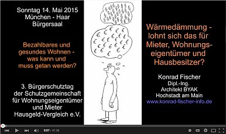

[🠔 Zur Übersicht: Video Vorträge](12akt.md)
# 3. Bürgerschutztag 2015 München-Haar
**Wärmedämmung - Lohnt sich das für Mieter, Wohnungseigentümer und Hausbesitzer?**  
_mit Konrad Fischer • 16.06.2015 • München_

## Einleitung und Vorstellung

So, jetzt darf ich Fischer bitten, seinen Vortrag zu machen. Ja, vielen Dank Herr Deul, dass ich hier wieder mal auf Ihrem Bürgerschutztag auftreten darf. Ich darf mich kurz vorstellen: Ich habe ein Architektur- und Ingenieurbüro. Ich arbeite seit 1979 im Bestand. Ich habe etwa 450 Denkmalsanierungen kostensicher abgeschlossen. Ich arbeite in ganz Deutschland, auch hier in München.

Sie sehen hier auf dem Foto zum Beispiel das Hilfsklooster Blutenburg oder Kloster Weyarn um die Ecke. Das sind so Projekte, die ich typischerweise mache. Ich mache aber auch viele Bauberatungen. Ich arbeite auch in Berlin. Sie sehen die Marienkirche mit dem Fernsehturm – das ist mein Job: Altbauten sanieren, und auch ein paar Neubauten habe ich schon gemacht. Ich bin verheiratet, immer noch mit derselben, bin sehr konservativ und habe auch vier Kinder. Das mag zur Beschreibung meiner Person genügen. Wann sie denn dann zum Arbeiten kommen? Ja, die studieren. Okay.

## Das Geschäftsmodell der Angst

Ja, zum Verkaufen braucht es Angst. Um Mietern und Hauseigentümern etwas zu verkaufen, ist Angst das beste Modell. Wir haben alle die Atomangst; damit kann man uns unheimlich viel verkaufen, bis zu irgendwelchen Stromabschaltgeräten für irgendeine Elektrostrahlung. Wir haben vor den Russen schon mal Angst gehabt, und jetzt wieder: Der Kölner Dom soll demnächst im Wasser stehen. Das war auch ein typisches Angstmodell.

Neuerdings langt auch das nicht mehr. Jetzt muss ja schon die Welt in Flammen stehen, damit wir diese Klimaschutzmaßnahmen begründen. In unserer deutschen Architektenschaft gibt es natürlich solche und solche. Ich mache nun den größten Fehler eines Vortrags: Ich lese Ihnen jetzt einfach mal etwas Aktuelles vor. Ein gewisser Klaus Siegele schreibt im Deutschen Architektenblatt vom 29. April – das war dann das Maiheft – „Wärmedämmung und Denkhemmung“. Ich lese Ihnen ein paar Auszüge vor, damit Sie wissen, wie Architekten denken können:

> „Rettet die Gebäudedämmung das Weltklima oder bedroht sie unsere Baukultur? Die Diskussion ist kontrovers und oft polemisch. Was fehlt, ist eine sachliche, differenzierte Auseinandersetzung. Sachlich und differenziert. Wir stehen mit der sich anbahnenden Klimaveränderung vor einer nie dagewesenen Herausforderung. Wir haben die Konsequenzen unseres Handelns vor Augen: die Vernichtung unserer Lebensgrundlage, und schaffen es trotzdem nicht, unser stupides Verhalten, unsere Einsicht gegenüber fatalen Fehlentwicklungen zu ändern. Gerade wir Architekten neigen dazu, angesichts der Schönheit kultureller Kleinode zu übersehen, wie es sich gemessen an heutigen Standards darin wohnt, ohne die Heizung zu modernisieren, Fenster auszutauschen und Wände innen- und außenseitig zu dämmen, damit es nicht mehr aus jeder Ritze zieht – so wie in Ihren Wohnungen, die noch nicht energetisch saniert sind. - Ja, und im Winter Eisblumen an den Scheiben und dünne Kondensatfilme in den Ecken davon. Sie kennen das in Ihren Wohnungen, wie kalt die innenseitigen Oberflächen sind. Nein, wir regen uns lieber darüber auf, dass Dämmstoffe die Fassaden von Altbauten verschandeln und die darin lebenden Bewohner qualvoll ersticken. Wir beklagen die Gaukler auf den medialen Marktplätzen – hier steht einer –, die pathetisch den Schimmel und die ausgesperrte Sonne beklagen, verursacht von deren Intimfeind Nummer 1, der Gebäudedämmung.
>
> Wer sich auf das mediale Zerlegen dieser Dämmbauweise eingeschossen hatte, brauchte nicht viel Fachwissen, um die Branche zu verunsichern und aufzumischen. Argumente kontra WDVS fanden sich zuhauf: Brandschutz, Schimmel, Luftaustausch, Gesundheitsaspekte, Algen, Wirtschaftlichkeit, Entsorgung und nicht zuletzt die Sorge um unsere überdämmte Baukultur. Einige dieser Argumente haben wir ja heute schon gehört. Weder die Hersteller von WDVS noch deren Verbände waren auf die Kritik vorbereitet und agierten zuweilen recht hilflos, was radikalen Kritikern hier bitte zu Pass kam und viel vergiftetes Wasser auf deren Mühlen strömen ließ.
>
> So viele Argumente sich gegen die Wärmedämmung auch finden lassen mögen, ihr eigentlicher Sinn und Zweck lässt sich nicht von der Hand weisen: Sie spart Energie – haben wir heute auch schon gehört. - Und zwar weitaus mehr, als für ihre Herstellung benötigt wird. In der Regel liegt die energetische Amortisationszeit unter fünf Jahren. - Herr Kollege, was haben Sie uns da für einen Käse erzählt? - Je nach Dicke und Art der Dämmung sowie abhängig vom Energieträger und dem Klima des Standorts. Darüber hinaus verbessert die Wärmedämmung den Komfort im Gebäude, weil sich höhere Oberflächentemperaturen an den Außenwänden einstellen."

Ja, da haben wir jetzt viele Argumentationen, darüber wollen wir ein bisschen reden. Ich glaube, das ist nicht unwichtig. Was sagt uns das Bundesbauministerium hier am 28. Mai 2014? Auf der Webseite sagen sie schlichtweg so: Altbauten müssen besser gedämmt und ineffiziente Heizungen müssen durch moderne Anlagen ersetzt werden. Und unsere Bauministerin geht nun zusammen mit der Industrie die Hauswende an. Ihre Partner sehen Sie an den Logos: Da ist alles dabei, was in der Wirtschaft und in der Ökoszene Rang und Namen hat, und natürlich auch die Deutsche Energie-Agentur. Ich habe das betitelt: „Von der Hauswende zur Hauswunde“, und darüber wollen wir sprechen.

## Die Rohstofffrage und der Ursprung der fossilen Theorie

Man argumentiert ja – wir haben das heute bis zum Erbrechen schon gehört –, dass unsere Wärmeversorgung ein Problem ist, und hier zitiere ich das Bundesministerium. Die sagen: Öl, Kohle und Gas sind begrenzt. Kurzfristig mag es ja noch ausreichen. Die Vorkommen sind immer knapper. Die Preise werden steigen, bis schließlich überhaupt keine fossilen Energieträger mehr geliefert werden. Deutschland hat keine nennenswerten Vorkommen, und das macht uns politisch abhängig. Das haben Sie heute schon gehört, es ist ja praktisch nur eine Bestätigung dessen, was uns die Politik erzählt hat. Und dann haben wir Öl und Gas als Antreiber zu dem sogenannten Treibhauseffekt und Klimawandel. Und die Bundesregierung teilt dann mit: Die Energiewende ist alternativlos, weil sie die richtige Antwort auf die Herausforderung endlicher fossiler Ressourcen und den Klimawandel ist.

Das wollen wir uns trotzdem mal ein bisschen genauer angucken. Wer hat sich denn das ausgedacht mit den fossilen Energien? Da gab es als erstes den Georgius Agricola, 1556. Sie sehen ihn oben rechts. Der hat Bücher geschrieben über Bergwerkszwerge, über Bergwerksdrachen und auch über Tierleichenöl, aus dem dann das Öl und diese angeblich fossilen Energien entstehen sollen. Und das wurde dann noch getoppt von einem russischen Wissenschaftler namens Michail Lomonossow. Er hat 1757 in einem Vortrag erwähnt, ja, das wäre ja alles aus so alten Baumstrünken und so, weil er in einem Kohleflöz einen eingekohlten Baumstrunk gefunden hat. Alexander von Humboldt hat es nach seiner Reise nach Südamerika 1800/1801 widerlegt, wo er dann die dortigen Vorkommen untersucht hat.

Das sind also die Schöpfer dieser Idee der fossilen Energien. Und die Wahrheit ist: Sie sind nicht fossil. Sie sehen hier die Haupterdölquellen im asiatischen Raum; die sind genau an der Bruchkante zwischen Afrika und Asien. Dort treibt es aus unerschöpflichen Erdgasquellen diese Energien hervor. In verschiedenen Kondensationsstufen und durch Einwirkung von bakteriellen Prozessen bilden sich dann Öl, Gas und Kohle. Das heißt, wir haben unerschöpfliche Reserven, und dieses Märchen von der Erschöpfung dieser ganzen Ressourcen ist eine pure Märchenstunde. Wer sie glauben will, soll sie glauben. Wir haben noch keine Erdöl- oder Gasquellen geschlossen. Wir haben unerschöpfliche Braunkohlereservoire hier in Deutschland. Wir können Steinkohle importieren bis sonst was. Die tatsächliche Versorgung mit Energie ist kein Problem. Lesen Sie dazu Thomas Gold, „Biosphäre der heißen Tiefe“, wo die abiotische Genese – also die nicht aus biologischen Prozessen kommende Erschaffung dieser Energien – genau dargelegt wird. So viel dazu.

## CO2 und der Treibhauseffekt

Die nächste Märchenstunde gönnen uns die Wissenschaftler. Hier eine Grafik vom Max-Planck-Institut: Die Komponenten des Treibhauseffekts. Die treiben die Gesellschaft in den absoluten Wahnsinn. Ich sage Ihnen mal, schauen Sie mal bitte diese blaue Zahl an von diesem grünen Strich: Da steht -60 °C. Das heißt, die Klimawissenschaft will uns weiß machen, dass ein -60 °C kalter Heizkörper zur Erderwärmung beiträgt. Das probieren Sie bitte mal zu Hause, wie Sie künftig Ihre Bude heizen, indem Sie Ihre Heizkörper auf -60 °C runterkühlen. Mehr Wahnsinn geht nicht.

Und das andere ist: Wie viel CO2 gibt es denn überhaupt in der Luft? Wie kann dieses CO2 die Welt zum Verbrennen bringen? Und da sehen Sie vom Diplombiologen Beck eine schöne Grafik: 78 %, 21 % und so weiter. Dieses eine kleine Pünktchen, das ist die Menge von CO2 in der Luft, und das soll nun die Erde zum Verbrennen treiben. Das ist Wahnsinn. Das ist Märchenstunde. Das kann die Politik uns gönnen, aber wir sollten darüber nachdenken.

Woher kommt diese ganze Idee mit dem CO2? Dann sage ich Ihnen, das war die Atomwirtschaft. Ich zitiere den Atomphysiker Ulrich Wolf aus seinem Buch „Wohlstand oder Katastrophe: Warum die Nutzung fossiler Brennstoffe eingestellt werden sollte“ (2006). Zitat: „Ein Anstieg der mittleren Temperatur der Atmosphäre um etwa 5 °C auf etwa 20 °C bis zum Jahre 2050 ist nicht mehr abzuwenden. Wenn der Verbrauch von Kohlenstoff nicht rechtzeitig vollständig eingestellt wird, ist zu erwarten, dass die Erde noch deutlich vor dem endgültigen Verbrauch der fossilen Energievorräte als Folge der Erwärmung für Menschen unbewohnbar wird.“ In Klammern: Macht weiter mit Kernkraft, dann wird euch dieses scheußliche Schicksal erspart bleiben. Und leider ist es ja nun so, dass die Kernkraft die einzige Energiequelle ist, die kein CO2 ausspuckt. Daher kommt die Verteufelung der ganzen CO2-Geschichte. Das muss man wissen, wenn man hier über Klimaschutz spricht. Es ist ein Marketing-Gag der Atomindustrie, um den angeblich Fossilen das Wasser abzugraben. So viel zum Thema CO2, das soll genügen.

## Historische Klimadaten und Propaganda

Hier sehen wir noch diese Lügen und Märchenstunden, die England uns gönnt. Wir sehen hier Daten vom Klimazentrum in Hadley, und wir sehen aber, was die bayerischen Mönche herausgekriegt haben: die gelbe Grafik. Da sehen Sie eine Kurve, die unten einen Tiefpunkt hat, und das ist das Jahr 1860. Und von diesem Punkt aus gönnen uns diese englischen Klimawissenschaftler nur diese Erwärmungskurve und sagen: „Ha, es wird jetzt heiß und heiß.“ Dann sage ich Ihnen: Um 1100 war es viel wärmer als heutzutage in der Durchschnittstemperatur. Diese Hoher-Peißenberger Mönchskurve – so ist die nämlich entstanden, schon ab 1781 – korrespondiert mit sämtlichen langfristigen Klimamessungen in ganz Europa und auf der ganzen Welt. Das heißt, es gibt immer wieder ein Klima-Auf-und-Ab, und es ist überhaupt nichts Problematisches dabei. Und dann sage ich noch was dazu: Um 1800 müssen die Pinguine aber ganz schön geschwitzt haben. Und wer ist denn hier eigentlich Auto gefahren damals?

Deswegen kommt nun auch die „Welt“ hin und wieder auf einen vernünftigen Artikel und resumiert: „Die CO2-Theorie ist nur geniale Propaganda.“ Und dem schließe ich mich an. Auf die Idee des menschengemachten Klimawandels baut die Politik eine preistreibende Energiepolitik auf. Das spüren Sie jeden Tag am Geldbeutel, und dazu benutzen sie dieses Märchen CO2. Edward Teller hat darüber geschrieben, der Vater der Wasserstoffbombe. Und dann schreibt die „Welt“: Dabei sind die Treibhausthesen längst widerlegt. Will bloß niemand wissen, weder in der Politik noch in der Wirtschaft. Alle arbeiten gegen den Verbraucher mit Klimaschutz und CO2-Theorie, und das soll Ihnen das Geld aus der Kasse locken.

## Politik und Wirtschaftsförderung

Was macht die bayerische Politik? Das ist hier eine Meldung, die könnte ich jedes Jahr so bringen. Das ist von 2000: „Programm gegen Kohlendioxid“. Sie versaubeuteln unsere teuer eingezogenen Steuern gegen CO2. Sie haben hier stehen: Erneuerbare Energien und so weiter erhalten eine weitere Förderung aus den Privatisierungserlösen von 80 Millionen Mark. Sie verschleudern das von unserem Steuergeld zusammengebaute Gut. Ja, sind das Betriebe, sind das Grundstücke, irgendwas? Es wird privatisiert, diesem weltweiten Kapital in den Rachen geschmissen und vollkommener Unsinn damit herausgegeben.

Und das Bundesbauministerium verspricht dann: Mit der EnEV wird ein Investitionsschub kommen, eine Nachfrage nach neuen Fenstern und Wärmedämmungen. Das interessiert doch uns Verbraucher gar nicht, sondern das ist reine Wirtschaftsförderungspolitik mit brutalster planwirtschaftlicher Methode.

## Die Realität der Wärmedämmung: Bauschäden und Thermografie

Wie sieht es aus mit diesen Betrügereien, die Sie auch jeden Tag in Ihrer Zeitung finden: diese angeblichen Wärmebilder, die Ihnen dann beweisen, wie schlecht die Hütte ist? Das ist ein Haus gegenüber meinem Lichtenfelser Meranier-Gymnasium, wo ich im naturwissenschaftlichen Zweig Abitur gemacht habe. Sie sehen hier ein Haus links, das habe ich fotografiert an drei unterschiedlichen Stunden desselben Tages.

Einmal um 11:00 Uhr: Dieses Haus hat den Witz, dass ein neuer Eigentümer die rechte Seite gedämmt hat. Normal kennen Sie doch gedämmte Wände nur als blau, als eisekalt und angeblich energiesparend. Aber was sieht man auf diesem Bild? Die Sonne scheint, diese Wärmedämmung wird abscheulich heiß, 36,9 °C und sowas, extrem warm, obwohl es draußen nur maximal 5 °C hat nach der Wetterdatenerfassung vom Wetterdienst. Das heißt, Sie haben glühende, hitzebeanspruchte Dämmfassaden; die halten das natürlich nicht aus, und es platzt alles auseinander. Und daneben links der massive Bau, ein verputzter Ziegel, der bleibt schön kühl, der kriegt keine hohen Temperaturspannungen.

Dann bin ich wiedergekommen um 13:42 Uhr. Da war die Sonne weg, und da sehen Sie witzigerweise: Das Gebäude ist auf allen Ebenen in der Fassade gleich warm oder gleich kalt. Ja, was soll das? Und dann komme ich wieder um 19:54 Uhr: Alles ist abgekühlt, und da haben wir eine extrem unter die Außenlufttemperatur herabgekühlte Dämmfassade. Die nimmt in diesem Moment massiv Feuchte auf, weil sie den Taupunkt unterschreitet, während unsere massive Ziegelwand immer noch die eingespeicherte solare Wärme gemütlich abstrahlt. So sieht es aus. Das nur mal zur Kenntnis.

In Amerika hat man in vielen Staaten inzwischen die Wärmedämmung auf Wohngebäuden wegen etwa 90 % Schäden und Gesundheitsproblemen verboten. Das sind Bilder aus entsprechenden Webseiten. Ein Gesetz in Oregon verbannt Wärmedämmverbundsysteme. Wir haben hier dann aber in Holzkirchen ein fantastisches Forschungsinstitut namens Fraunhofer-Institut für Bauphysik, und die haben das mal genauer untersucht. Sie sehen hier in der linken Grafik die Taupunkttemperatur im Tagesverlauf, hier eher der Nachtverlauf, eine rote Linie. Sie sehen eine massive verputzte Fassade; die erreicht niemals diese Taupunkttemperatur. Das heißt, die bleibt immer wärmer, sodass keinerlei Kondensat entstehen kann. Und Sie sehen unten diese gestrichelte Temperaturlinie: Das ist das Wärmedämmverbundsystem mit damals nur 10 cm – inzwischen ja viel mehr da drauf. Das unterschreitet quasi die ganze Nacht den Taupunkt, saugt sich voll mit Kondensat im gesamten Schichtaufbau, weil der Taupunkt dahinein wandert. Das ist Wärmedämmung, wie sie leibt und lebt. Diesen Beweis hat uns das Institut für Bauphysik geliefert.

Die deutsche Wirtschaft ist genial. Die Erfinder ruhen nicht. Und was machen sie? „Etwas Wärme braucht die Wand“ – es wurde die heizbare Wärmedämmung erfunden, weil man gegen diese Feuchteeffekte etwas tun will. Das sind zwei Patente. Lesen Sie es nach im Internet, Sie fallen in Ohnmacht. Und die Bauwissenschaft, diese käuflichen Wissenschaftler in den ganzen Hochschulen heute überall – die sind ja fröhlich und messen das und publizieren das. Und die Bauzeitschriften, gespickt mit Werbung von der Bauwirtschaft, die bringen das dann fröhlich und sagen: Wenn du schon eine nasse Wärmedämmung hast, bitte heize doch, dann hält sie ein bisschen länger. Das ist die Methode, die die Wirtschaft uns gönnt.

## Brandschutz und Instandhaltungskosten

Ja, um richtig zu heizen, brauchen wir sie ja nur mal abfackeln. Das sind die aktuellen Brandschäden. Ich will das nicht weiter detaillieren. Vor ein paar Wochen ist das nächste Hochhaus abgebrannt. Überall fackeln jetzt die Hochhäuser ab, die ja auch mit Wärmedämmung an der Fassade gefüllt sind. Das sind die Verantwortlichen für unseren Dämmschrott. Ich will sie weiter nicht nennen. Es ist wie ein Gruselkabinett, wenn man es mal genau anguckt. Ich nenne keine Namen, manche sind aus Bayern.

Das ist München: So sieht es aus wenige Tage, nachdem das Fassadengerüst weg ist. Das ist im Streiflicht fotografiert. Sie sehen – da wissen Sie doch jetzt schon, wo in drei bis vier Jahren die ganzen aufgeplatzten Putzhäutchen sind. So wird das abgeliefert von der Industrie. Rechts ist Berlin: Das ist innerhalb kürzester Zeit, in zwei, drei Jahren, ist ein frisch saniertes, modernes Wärmedämmhaus schon wieder angerottet. Der deutsche Dämm-Müll äußert sich überall. Nur wenige Jahre nach der Entstehung kommt es zu diesen Zerstörungen. Warum? Am Tag werden die Dinger zu heiß und in der Nacht zu kalt. So einfach ist es. Und es ist Bauphysik: Wir haben extreme thermische Dehnungen in diesen Dämmhäuten. Das heißt, alles zerreißt, und dann später kommt die Brühe da noch rein und dann verreckt es. Und zum Schluss fällt Ihnen alles auf die Straße – rechtes Bild unten – und wenn Sie Glück haben, werden Sie davon erschlagen und sind dann aller weiteren Sorgen entledigt.

Es gibt Bauforschung, und zwar gibt es sogar ein Institut für Bauforschung in Hannover. Die haben herausgekriegt, dass beispielsweise bei einer normalen Putzfassade pro Quadratmeter im Jahr eine Instandhaltungsrücklage von 7,08 € nötig ist. Aber bei einer Wärmedämmung – die haben hunderte und tausende Objekte untersucht, über viele Jahre beobachtet und die Kosten erfasst, das ist eine richtig solide deutsche Bauforschung – braucht es pro Jahr 16,43 € als Rücklage, um die ständig notwendigen Instandsetzungen zu finanzieren. Das erzählt Ihnen niemand, weil allein die 16,43 € alle fiktiven Wärmedämmersparnisse von sich aus auffressen. Das sind also keine Systeme, die man empfehlen kann.

## Schimmelpilze und gesundheitliche Folgen

Auch die Dämmung am Dach ist Pfusch. Auch die wird am Tag extrem heiß und in der Nacht extrem kalt. Und wenn Sie dann mal aufmachen, ist es aufgenässt. Und so sieht dann Ihre schöne Zwischensparrendämmung aus, wenn Sie sie mal öffnen. Da habe ich jede Woche – ich mache so telefonische Bauberatungen – Opfer, die zu mir kommen und mir ihre Bilder schicken, welche Schweinerei sich dann hinter der Dachverkleidung öffnet. Wenn es mal nicht mehr gut riecht: Öffnen Sie mal. Und wenn es grau oder schwarz ist, dann wissen Sie, was los ist. Das ist Schimmelkultur hoch drei.

Die Industrie gönnt uns die verschiedensten Wollen und Schäume. Sie sehen dieses graue Bild, so sehen die nach einigen Jahren aus. Man denkt: Glaswolle, Steinwolle, Faser mineralisch, nicht brennbar – stimmt aber nicht. Es sind Bindemittel drin, Phenolharze. Die ernähren dann übrigens den Schimmel. Es ist Mineralöl drin, sowohl in der Steinwolle wie in der Glaswolle. Und Phenolharze – ich will das ein bisschen abkürzen – gelten nicht gerade als gesundheitsfördernd. Und das wird Ihnen dann eingepackt. Fassadenstoffe im Vergleich: Da zeigt man Phenolharz, Polyurethan und so weiter. Sie haben Nachteile, und die Nachteile werden nicht komplett kommuniziert.

Was macht das Forschungsinstitut für Wärmeschutz (FIW) in München? Das hat laut „Spiegel“ einen eigentlich guten Ruf. Vor vier Jahren untersuchte es Phenolharzschaum auf die Emission leichtflüchtiger organischer Verbindungen – das ist ein Gesundheitsproblem –, ob für die Verwendung in Innenräumen geeignet. Das war das Ergebnis vom FIW: Es seien keine Schadstoffe nach DIN gefunden worden. Aha. Und dann sagt der „Spiegel“: Die Konzentration von 2-Chlorpropan haben sie aber nicht gemessen, weil das eben nicht nach DIN war. Und das sind natürlich riesige Belastungsfaktoren. Die in Kunststoffen eingesetzten Flammschutzmittel sind giftig und gesundheitsschädlich. Das kommt da rein, damit es eben nicht so dolle brennt. HBCD soll verboten werden, wird ersetzt durch einen weiteren Stoff. Auch der ist nicht gesundheitsfördernd; den können Sie nicht als Medikament gegen Kopfschmerzen nehmen.

In NRW gab es dann zwei Wochen lang einen Riesenskandal, bis die Medien wieder zum Schweigen gebracht wurden: Giftige Biozide belasten Gewässer in Nordrhein-Westfalen. Diese ganze Giftbrühe haut selbstverständlich ins Grundwasser, von da ins Trinkwasser, von da in die Flüsse. Giftige Biozide stammen offenbar aus Dämmmitteln für Gebäudefassaden; negative Folgen denkbar. Das ist die Zukunft, die wir unseren Kindern bringen, weil uns Leute erzählen, wir müssen jetzt endlich mal anfangen zu sparen, obwohl das Öl gar nichts mehr kostet.

## Lüftungsproblematik und Asthma

„Ich habe mich zur CO2-Einsparung für Maximaldämmung entschieden. Für die Schimmelpilze in dieser Wohnung hat sich das Klima schon total verbessert.“ Das ist die Karikatur. Und so sieht es eben aus in allen Wohnungen: 50 bis 60 % aller Wohnungen haben Schimmel. Denken Sie an Ihre Dusche, denken Sie an sonst welche komischen Ecken. Woher kommt der Schimmel? Na, selbstverständlich durch die dichten Fenster. Wer hat denn die alten Fenster rausgeschmissen und Gummilippen-dichtes Zeug darein? Das haben Sie gemacht. Wer hat hier noch keine Gummilippen? Der Rest hat sie, und der Rest hat garantiert auch Probleme mit dem Schimmel. Jedenfalls drohen sie da in ungeheurem Maß, weil es nicht möglich ist, durch Stoßlüftung diesen Schimmel zu bekämpfen. Die Details können Sie auf meiner Website nachlesen.

„Täglich aufstehen mit 7000 Milben“ – ein Umweltmediziner fordert Lüftungsanlagen für Neubauten. Das ist Professor Chatter. Mittlerweile ist jeder zehnte Erstklässler ein Asthmatiker. So geht es unseren Kindern. Mit 8.000 bis 10.000 Asthmatoten jährlich wird Deutschland im europäischen Vergleich nur noch von Irland übertroffen, obwohl wir weltweit eines der besten medizinischen Versorgungssysteme haben. Verstehen Sie? In diesen verrotteten Buden kriegt man halt Haut- und Lungenprobleme. Unseren energetischen Standard können wir an den Asthmatoten ablesen, und wir haben die höchste Rate an toten Asthmakindern. Da sind wir Weltmeister. Das sind die Realitäten, über die geredet werden muss.

Und dann kommen die gescheiten Professoren, die von nichts eine Ahnung haben, außer dass sie Statistiken auslesen und sagen: Macht mal viel Lüftung. Und dann schaut bitte mal rein in eure Lüftungen und schaut euch mal die Hölle an, die Sie darin finden. Es ist tödlich. Da wird immer geredet von Pollenluftfiltern und so – das betrifft die Zuluft. Aber schaut mal in eure Abluft rein, mit welchem Luftaustausch ihr dann rechnen könnt.

## Wirtschaftlichkeit und Rechenmodelle

Dann kommt die Dena und sagt: Wir haben da gemessen, es ist alles wunderbar, wir sparen wie verrückt. „Berechnung des Endenergiebedarfs und der Energieeinsparung“ – Berechnung steht da. Das sind keine Fakten, das sind Rechenmodelle, Rechenmärchen. Und siehe da: mit freundlicher Unterstützung der BASF, und die haben nun mal quasi die Herrschaft über Styropor. So sieht es aus. Das sind unsere unabhängigen, von der Regierung gesponserten Studienproduzenten.

Vom FIW München habe ich schon erwähnt: Die haben herausgekriegt, förderpolitische Maßnahmen seien unabdingbar, sonst wird da nichts rentabel. Genau das hat ja auch mein Vorredner bestätigt: Amortisation können Sie sich abschminken, und wenn nicht gefördert wird, ist Polen offen. Das heißt, unsere schönen Steuergelder... ich habe vier Kinder, ich weiß, wie es an den Schulen und Hochschulen aussieht. Es ist der letzte Plunder, es ist unfassbar. Unsere Straßen – also in München ist alles perfekt, wird uns immer erzählt, aber bei uns in Oberfranken können Sie die Straßen auch vergessen. Dafür sollte Steuergeld raus: für die Bildung und für die Infrastruktur. Und wofür wird es vergeudet? Für irgendwelche komischen Mätzchen hier an der Fassade.

CO2-online hat es genau herausgekriegt: Sie haben beim Fenster ein Potenzial von 2 % Einsparung und in der Dämmung, wenn es hochkommt, von 2 %. Ja, wie wollen Sie da 40 % hinkriegen? Da müssen Sie aber ganz schön an den Strippen ziehen. Und das ist CO2-online, eine quasi ökologistisch anerkannte, etablierte Vereinigung. Sie ahnen gar nicht: Einsparpotenzial sagt die Werbung von 50 bis 80 % allein nur durch die Dämmung. Wer will da nicht dämmen?

Dann kommt hier das Institut Wohnen und Umwelt, eine Fördereinrichtung des Landes Hessen, und empfiehlt allen Besitzern von Altbauten die Wärmedämmung: nur geringe Mehrkosten, die sich auch rasch amortisieren. Und dann kommt ein Rechenbeispiel. Ich habe das unten mal durchgerechnet. Es steht hier: Jeder WDVS-Quadratmeter spart durchschnittlich 8 Liter Heizöl pro Jahr. Dann lass es mal so sein. Dann kostete der inklusive Bearbeitung damals 110 €. Der Quadratmeter spart 80 Kilowattstunden, die kosten 7,20 €. Bleibt Ihnen unterm Strich ein Minus von 23 €. Das heißt, wenn Sie dämmen und tatsächlich sparen würden, schmeißen Sie bei jedem Quadratmeter 23 € in den Dreck. Die Dämmstoffindustrie sagt: Zum richtigen Zeitpunkt rechnet es sich. Das bedeutet, wenn sowieso mal angerüstet werden muss. Aber Professor Simons aus Berlin vom Empirica-Institut hat sehr genau tausende von Objekten durchgerechnet und sagt: Energetische Sanierungen sind im Regelfall unwirtschaftlich. Die eingesparten Energiekosten können nicht die Kosten der Sanierung decken. Das ist der Fakt.

Das wollen wir noch genauer angucken. Das ist dieser Kollege, der vorhin schon angesprochen war, Karim el-Ishari. Die „Welt“ titelt über diesen hessischen Architekten: Komplette Wärmedämmung total unwirtschaftlich, lohnt sich nicht, Methode „mit dem Schinken nach der Wurst werfen“. Und damit wir das machen, kommt die Politik – nicht nur die grüne, auch die rote, blaue, braune, gelbe – und sagt: Ja, aber später, da müsst ihr jetzt richtig Angst haben und wie verrückt dämmen. Später wird über euch die Kostensteigerung hereinbrechen. Und deswegen müsst ihr jetzt euer Geld verschleudern.

## Wissenschaftlicher Diskurs und die GEWOS-Studie

Jetzt kommt ein Kommentar von mir zu diesem Klaus Siegele. Ich sage dann zu seinen Kernaussagen „Wärmedämmung spart Energie“, „Amortisation unter 5 Jahren“ und „Wärmedämmung verbessert den Komfort“: Alle mir vorliegenden wissenschaftlichen Untersuchungen widersprechen mit ihren gemessenen Ergebnissen diesen Kernaussagen. Eine schriftliche Anfrage seitens eines Verbraucherverbands bei zuständigen Ministerien und Instituten lieferte ebenfalls keine praktischen Belege für diese Aussagen. Unverbindliche Ausflüchte – mehr gab es nicht.

Mit bauphysikalischen Berechnungsmodellen kann man freilich alles anstellen. Wo sind die für einen verantwortungsvollen Architekten allein maßgeblichen praktischen, mit vergleichenden Messdaten an echten Bauwerken beweisbaren Belege für diese krassen Aussagen? Das wird ja geadelt von unserem Deutschen Architektenblatt; diese Aussage soll ja jeder glauben, das sei Fakt.

Das ist die berühmte GEWOS-Studie. Die ist natürlich immer wieder mal rechnerisch unter Kritik gekommen, aber gemacht haben die folgendes: Sie haben 47 Gebäude mit und ohne Dämmung untersucht, und immer wenn gedämmt war, hat die Bude mehr Energie verbraucht. Das zeigt diese Kurve, und die ist durch nichts widerlegt, außer durch seltsame Rechenoperationen, die mit den gemessenen Abrechnungsergebnissen rein gar nichts zu tun haben.

## Das Fraunhofer-Experiment und der U-Wert

Dann hat das Fraunhofer-Institut 1983 und 1985 mal eine kleine Reihenhaussiedlung hingestellt mit unterschiedlichen Fassaden. Mal gedämmt, mal nicht gedämmt. Und was haben sie herausgekriegt? Sie sehen den ersten roten Balken, da steht 100 %. Und dann sehen Sie daneben 0,46 – das ist der fabelhafte U-Wert. Also je geringer der U-Wert, umso besser gedämmt. Das war ein massiver Ziegelbau, dessen Verbrauch in dieser Messperiode 100 % war. Und siehe da: Dann hat man auf 0,32 mit 10 cm Wärmedämmung gedämmt. Man hat auch noch mal mit 23 cm gedämmt und hat einen U-Wert von 0,16 erreicht. Und wo sind die Verbräuche? Das sind die grünen Kurven. Die sind höher als beim Ungedämmten mit dem schlechten U-Wert.

Und wie kommen die Energieberater zu Ihnen und sagen: „Da muss der U-Wert endlich mal verbessert werden, der ist ja ganz schlecht“? Und dann waren die aber selbst überrascht und haben gesagt: „Ayayay, woran liegt es?“ Ja, vielleicht an Wärmebrücken – und dann hat man Modelle hin und her konstruiert. Ja, die Wärmebrücken sind daran schuld, dass Dämmstoff gar nicht dämmt. Und dann haben sie gesagt: „Dann probieren wir es noch einmal.“ Und dann haben sie zwei Jahre später wieder an dieser Siedlung noch einmal gemessen und haben alle Wärmebrücken weggedämmt. Und was kam raus? Wieder die nächste rote Kurve, wieder auf 100 % gesetzt, mal mit weißem und mal mit dunklem Anstrich. Und wieder: Sobald gedämmt ist, braucht die Hütte mehr Geld.

Und warum ist das so? Weil die Sonne nicht mehr ans Mauerwerk kommt und die Energie, die dann kostenlos nicht mehr reinfließt in die Bude in den Winterperioden – das waren ja Winterperioden –, die fehlt und die muss teuer dann nachgeheizt werden. So einfach ist das Spiel, es ist nichts Kompliziertes. Aber nicht nur in Bayern weiß man das seit 83, auch in der Schweiz hat die EMPA in Dübendorf wiederum zwei kleine Testgebäude nebeneinander gebaut, gedämmt und ungedämmt. Und da sehen Sie die grüne Kurve. Grün ist gut, aber diesmal braucht das Ding Tag und Nacht 30 % mehr Energie als die nicht gedämmte Bude.

## Verheimlichte Studien und wirtschaftliche Interessen

Alles verheimlichte Studien – und obwohl die Schweizer das wissen und obwohl die deutsche Politik das weiß, wir haben das alles in Petitionen und Beschwerden und sonst alles eingefädelt, es wird übergangen. Denn es geht ja gar nicht ums Dämmen, es geht auch nicht ums Energiesparen, es geht auch nicht um CO2, es geht um Kohle machen zu Lasten der Hausbesitzer und der Mieter. Das ist das ganze Spiel. Und es gibt bis heute keinen Beweis, keinen, dass Dämmstoff dämmt, dass Dämmstoff auf der Außenfassade Energie spart. Es gibt den Beweis nicht. Und da kann die Bausparkasse es noch so freundlich unterstützen. Diesen gemessenen Beweis im Vergleich gibt es nicht.

In Südtirol hat man auch gemessen, da hat man dann so Würfelchen gemacht, einmal mit Zweifach- und Dreifachglas, wo man doch gedacht hätte, mit Dreifachglas ist es besser. Man wird Ihnen doch erzählen: „Nehmen Sie Dreifachglas, das ist das Optimum.“ Die haben doch genau gleich viel verbraucht. Und dann habe ich gesucht nach Studien, die irgendwo im Vergleich mal gezeigt haben, wie ist das mit dem Glas? Es gibt sie nicht. Also habe ich selbst gemessen. Die Wahrheit ist: Wenn Sie eine Einfachscheibe haben und am Abend den Laden oder den Rollladen zumachen, haben Sie einen Energiegewinn von 12 % gegenüber Doppel- und Dreifachglas.

Woher kommt das? Am Tag kommt ein Maximum an solarer Energie herein, weil da haben Sie 90 % der Solarenergie nutzbar als Energiefaktor. Wohingegen beim Dreifachfenster vielleicht noch 50 % oder 60 % durchgehen – also nur 50, 60 %, der Rest fehlt. Und wenn Sie in der Nacht den Laden zumachen, dann setzen Sie Ihren Energieverlust fast auf null und Ihre Scheibe bleibt eben warm, weil ja der Nachtausgleich zu diesem -50, -60 grädigen Nachthimmel nicht mehr stattfindet. Das erledigt der Laden, und Ihre Scheibe bleibt sehr warm und es ist kein Energieverlust. Auch in Amerika hat man schon gemerkt: „Green approved buildings using more energy.“ Das heißt, grün bestätigte, also grüne Gebäude verbrauchen mehr Energie. Fakt. Bloß in Deutschland will man das nicht wahrhaben.

## Kritik an der Dämmstoffindustrie und rechtliche Einordnung

Und dann kommt nun die Pressesprecherin des Gesamtverbandes der deutschen Dämmstoffindustrie und sagt: „Lieber Herr Fischer, sachlich zu Ihrer Antwort: Die Studien, die Sie anführen, sind veraltet und widerlegt. Das Fraunhofer-Institut für Bauphysik hat kürzlich veröffentlicht, hier ein Auszug: Die ersten Berichte betrafen Wärmebrücken, Wandkonstruktionen. Die festgestellten richtig gemessenen Unterschiede in den Wärmeverlusten waren auf Wärmebrückenwirkungen, nicht auf Dicken zurückzuführen. Die Aussagekraft des U-Wertes (damals k-Wert) bleibt voll erhalten.“

Das ist ein Zitat aus der Studie und ich habe mir das natürlich genau angeguckt. Und was ist der Trick? Die haben den U-Wert neu definiert. Die haben gesagt, wir machen einen U-Wert, den konstruieren wir aus der Luft und sagen, da kommt jetzt auch ein Solarstrahlungsfaktor dazu. Den nennen wir dann k-effektiv. Also damals k-Wert, heute U-Wert. Das heißt, der U-effektiv, den die Fraunhoferstudie als richtig bezeichnet hat, der ist überhaupt nicht der U-Wert, mit dem Sie berechnet werden, mit dem jeder dahergelaufene Energieberater rechnet. Das ist eine Fiktion.

Ich rechne seit vielen Jahren mit dem U-effektiv-Wert. Das hat Professor Meier noch weitergeführt, hat gesagt: „Ja, wie wirkt sich jetzt die solare Strahlung und die Speicherfähigkeit tatsächlich aus auf den U-Wert?“ Und tatsächlich, mit diesem solar mit Sonne vorhandenen U-Wert können wir genauer rechnen, und der normale U-Wert stimmt in keiner Weise. Was alle Studien bisher bewiesen haben: Er stimmt nie, und dann wird gesagt, der Verbraucher ist schuld. Der letzte zahlt, das sind natürlich Sie.

Ja, und der Tagesspiegel, der sagt dann, die Kosten werden auf Mieten abgewälzt – sowas werden Sie in der Süddeutschen Zeitung niemals finden. Und die Frankfurter Allgemeine schreibt: „Stoppt den Dämmwahn.“ Das werden Sie auch im Münchner Merkur niemals finden. Das sind ganz andere Zeitungen, die sind anders aufgestellt. Da ist nicht der Ökologismus als Prinzip der Redaktion, sondern da geht es um die Wahrheit, wenigstens manchmal noch. Und der Klaus Siegele muss nun auch antworten und schreibt mir, ich zitiere auszugsweise: „Alle Argumente, die diese unverständliche Angst vor der Gebäudedämmung begründen, sind längst wissenschaftlich wie logisch widerlegt, nachzulesen in vielen Publikationen, Broschüren und Studien. Ängste der Menschen sollte man ernst nehmen, aber nicht damit spielen. Dazu sollte mein Artikel im DAB (Deutsches Architektenblatt) einen Beitrag leisten.“

Ich hätte ja nur gern eine Studie zitiert bekommen, wo der Beweis wäre, aber er hat natürlich viele Broschüren und Publikationen, ne? Was weiß ich – den Beweis ist er schuldig geblieben. Nach dem Völkerstrafgesetzbuch könnte man sagen, wer im Rahmen eines ausgedehnten und systematischen Angriffs gegen die Zivilbevölkerung – das seid ihr – einen Menschen tötet und so weiter, aber auch zum Verlust des Sehvermögens, Behinderungen und so weiter, also Krankheiten auslöst und billigend in Kauf nimmt, das ist nach Völkerstrafgesetzbuch verboten. Und nach Betrug: Wer in der Absicht, sich oder einem Dritten einen rechtswidrigen Vermögensvorteil zu verschaffen, das Vermögen eines anderen dadurch beschädigt, dass er durch Vorspiegelung falscher oder durch Entstellung oder Unterdrückung wahrer Tatsachen einen Irrtum erregt oder unterhält, wird mit Freiheitsstrafe bis zu 5 Jahren bestraft. Der Versuch ist strafbar, und ein besonders schwerer Fall liegt vor, wenn der Täter gewerbsmäßig oder als Mitglied einer Bande handelt. Und darum handelt es sich, und es trifft nach wie vor zu.

Wir sehen hier eine wunderschöne Karikatur von Jacques-Louis David, „The English Government“, und dann sage ich: „The German Government the same.“ Und da sehen Sie die Regierung, wie sie den Leuten das Geld raubt. Ich bin dafür, wir sollten uns wieder an der heiligen Patronin des Bauwesens orientieren. Das ist die heilige Barbara in einem Südtiroler Fresko. Sie steht in ihrem Turm und sagt den Bauleuten: „Baut schön mit Stein und Mörtel und lasst die Wärmedämmung weg.“ Ich danke für die Aufmerksamkeit.
